(注1：等把全书主要章节都做完笔记后从头开始要重新校验 一下，主要是格式显示的校验，因为我发现实际显示在网页上的内容有些段落在格式上有些问题，也便于自己再重新复习一遍，并且在有些地方再增添一些内容，一些自己不熟悉或者难点内容也要进行标注一下。)

(注2：今天是2019年12月23日，看了一个半月看完了5章。)

(注3：今天是2020年2月7日，看到了第8章，中间很长时间没有看，把Vue.js视频看完了。不过自己的JS基础并不牢靠，中间很多地方是囫囵吞枣，一些核心概念还是没有懂，还需要再回过头来好好看看。）

(注4：这本书要看完，有些个别章节可以略过，第8章以后，除了BOM,DOM，事件外就是另一个天地了，也要学,不过我可以不按顺序看了，在网上找了个大纲，如下）

> 第1~7章讲语法基础，都是必看章节。尤其是其中第6章的创建对象和继承是重点也是难点，务必要看透，面试官很爱问这方面的问题。看书也要多动笔。把原型链的图多画几遍，面试时如果写不出代码，直接给面试官上图。第7章的闭包也是常考的要点，至少要会写简单的示例闭包函数给面试官看。
>
> 第8~13章不仅仅在说`JS`，而是在说`JS`所依赖的浏览器环境。`BOM`和`DOM`就是两大块知识点。其中第9章是为了解决浏览器兼容问提采取的一些权宜之计，可以略读，碰到问题再查，别的都必看。另外作为`IE`浏览器的极度厌恶者，个人认为碰到讲如何兼容`IE`的章节可以先跳过。
>
> 第13章讲事件。又是常出面试题的地方。事件流，事件委托机制务必要掌握。关于移动设备的事件多看看，毕竟现在移动端开发是大头。
>
> 第14章讲表单脚本。早期的前端工程师的工作除了写特效就是用`JS`处理脚本了，现在这方面的工作也不少。也是很重要的章节。
>
> 第15章讲动画，这个看个人兴趣，可以先不读（我也不太会用Canvas）。
>
> 第16章讲`HTML5`，我建议细看。写个拖曳组件的需求很常见，历史状态管理也是各种框架的`router`所对应的基本原理。
>
> 第17章讲调试。可以多看看，能避开不少坑。
>
> 第18~19章讲怎么用`JS`处理`XML`的，选看，我个人没看，碰上这需求了再说。
>
> 第20章，现在前后端传数据大多用`JSON`了，必看。
>
> 第21章，讲`Ajax`和跨域，重要性不用多说了吧？考题也常从这里出。把`XHR`对象的那一套都给记牢了，跨域方法也背下来。不理解不要紧，小时候怎么背语文课文就怎么对付这章，和后端多合作几次就知道怎么回事了。
>
> 第22章的“高级技巧”现在也不算高级了，务必看熟。高级定时器下讲的函数节流要看明白，搜狐考过。头条考过关于自定义事件的面试题。拖曳和第16章合起来看。
>
> 第23章讲本地存储机制。`Cookie`就不用说了，它在`HTTP`里是什么格式传、原生`JS`是什么格式来写、操作`Cookie`的封装函数怎么写都要有明确的印象。`sessionStorage`、`localStorage`的特点、区别都要背牢，`IndexedDB`至少得懂得是啥。
>
> 第24章讲最佳实践。这章理论为主，大概看看吧，和面试官得有话谈。
>
> 第25章讲的新兴API都挺好使，多用用吧，不会用的查`MDN`。附录的东西大概扫一眼就好。

~~~
经典：1,3,4,5,6,7,8,10,11,15,20,21,22,23,24,附录B
一般：2,13,14,16,17,25
过时：9,12,18,19,附录A,附录C,附录D  
~~~

/00.png)

(注5：现在是2020年2月18号，我决定后面的DOM、BOM和事件现在网上找个视频再学一下，一共167节，希望3周之内能够看完。之后再开始往下做笔记，然后JS基础（前8章）开始重头复习一下笔记，然后开始看一下有无格式错误等)

(注6：抄了几十万字以后再写感觉好卡啊，现在暂时还找不到可以替代的Markdown编辑器）

(注7：第10章后面的内容不知道怎么显示不了了，试着把文章分段，每8章分一段吧）

(注8：现在是2020年4月8日，13章以后除了AJAX和JSON部分看一下，剩下的就先暂停了罢。我要去做20个静态页面，巩固HTML和CSS,做各种页面交互，巩固JavaScript基础和DOM了。)

(注9：现在是2020年7月22日，不知不觉3个多月过去了，期间我一直在学别的东西(以及浪费时间)，没有再看原生JS了，现在前面的CSS,DOM什么的也都复习了一遍了，现阶段主要时间还在学PHP和jQuery，AJAX,Bootstrap这些，我决定其他的时间学习计算机基础知识以及原生JS，还有JS的进阶《你不知道的Javascript》还有ES6，算是预热一下，等我学完现在学的东西后(大概要9月份以后了)立马就投入大量时间学原生JS和进阶了，最后的最后就再学框架了。)

 (注10：现在是2020年10月27日，我下载了《JavaScript高级程序设计》第四版的电子书，后面第8章以后的我基本没看的内容以后就看第四版了吧。)

# 第1章：JavaScript简介

JavaScript诞生于**1995年**。当时，它的主要目的是处理以前由**服务器端语言**(如Perl)负责的一些**输入验证操作**。在JavaScript问世**之前**，**必须把表单数据发送到服务器端才能确定用户是否没有填写某个必填域**，是否输入了无效的值。Netscape Navigator希望通过JavaScript来解决这个问题。在人们普遍使用电话拔号上网的年代，能够在**客户端完成**一些基本的验证任务绝对是令人兴奋的。毕竟，拨号上网的速度之慢，导致了**与服务器的每一次数据交换**事实上都成了对人们**耐心**的一次考验。

自此以后，JavaScript逐渐成为市面上常见浏览器必备的一项特色功能。如今，JavaScript的用途早已**不再局限于简单的数据验证**，而是**具备了与浏览器窗口及其内容等几乎所有方面交互的能力**。今天的Javascript已经成为一门功能全面的编程语言，能够处理复杂的计算和交互，拥有了**闭包**、**匿名（lamda，拉姆达）函数**，甚至**元编程**等特性。作为Web的一个重要组成部分，JavaScript的重要性是不言而喻的，就连**手机浏览器**，甚至那些专为残障人士设计的浏览器等非常规浏览器都支持它。当然，微软的例子更为典型。虽然有自己的客户端脚本语言VBScript，但微软仍然在Internet Explorer的早期版本中加入了自己的JavaScript实现。

> 对IE而言，当我们提到JavaScript时，实际上就是指IE对JavaScript（ECMAScript）的实现——JScript。
>
> 最早的JScript基于 Netscape JavaScript 1.0开发，于1996年8月随同Internet Explorer 3.0发布。

JavaScript从一个简单的输入验证器发展成为一门强大的编程语言，完全出乎人们的意料。**应该说，它既是一门非常简单的语言，又是一门非常复杂的语言。说它简单，是因为学会使用它只需片刻功夫；而说它复杂，是因为要真正掌握它则需要数年时间。**要想全面理解和掌握JavaScript，关键在于弄清楚它的**本质、历史和局限性。**

## JavaScript简史

在Web日益流行的同时，人们对**客户端脚本语言**的需求也越来越强烈。那个时候，绝大多数因特网用户都使用速度仅为28.8kbit/s的“猫”（调制解调器）上网，但**网页的大小和复杂性却不断增加**。为完成简单的**表单验证**而**频繁地与服务器交换数据**只会加重用户的负担。想象一下：用户填写完一个表单，单击“提交”按钮，然后等待30秒钟，最终服务器返回消息说有一个必填字段没有填好……(哈哈，那客户估计要崩溃了，上网体验太差了)

当时走在技术革新最前沿的Netscape公司，决定着手开发一种客户端语言，用来**处理这种简单的验证**。

当时就职于Netscape公司的**布兰登·艾奇**(Brendan Eich)，开始着手为计划于1995年2月发布的Netscape Navigator 2开发一种名为**LiveScript**的脚本语言——**该语言将同时在浏览器和服务器中使用(它在服务器上的名字叫LiveWire)**，为了赶在发布日期前完成LiveScript的开发，Netscape与**Sun公司**建立了一个开发联盟。在Netscape Navigator2正式发布前夕，Netscape为了**搭上媒体热炒Java的顺风车**，**临时把LivesScript改名为JavaScript**。

[布兰登·艾奇简介](<https://baike.baidu.com/item/Brendan%20Eich/561441?fr=aladdin>)

由于JavaScript 1.0获得了巨大成功，Netscape随即在Netscape Navigator 3中又发布了JavaScript 1.1。Web虽然羽翼未丰，但用户关注度却屡创新高。在这样的背景下，Netscape把自己定位为**市场领袖型公司**。与此同时，微软决定向与Navigator竞争的自家产品**Internet Explorer**浏览器投入更多资源。Netscape Navigator 3发布后不久，微软就在其Internet Explorer 3中加入了名为**JScript**的**JavaScript实现**（命名为JScript是为了避开Netscape有关的授权问题）。以现在的眼光来看，**微软1996年8月为进入web浏览器领域而实施的这个重大举措，是导致Netscape日后蒙羞的一个标志性事件**。然而，这个重大举措同时也标志着JavaScript作为一门语言，其开发向前迈进了一大步。

微软推出其JavaScript实现意味着有了3个不同的JavaScript版本：**Netscape Navigator中的JavaScript，Internet Explorer中的Jscript和ScriptEase中的CEnvi**。与C及其他编程语言不同，当时还没有标准规定JavaScript的语法和特性，3个不同版本并存的局面已经完全暴露了这个问题。随着业界担心的日益加剧，JavaScript的标准化问题被提上了议事日程。

1997年，以JavaScript 1.1为蓝本的建议被提交给了**欧洲计算机制造商协会（ECMA，European Computer Manufacturers Association）**，该协会指定39号技术委员（TC39，Technical Committee#39）负责“标准化一种通用、跨平台、供应商中立的脚本语言的语法和语义"（  http: //www. ecma  international .org/ memento /TC39. htm），**TC39由来自Netscape，Sun、微软、Borland及其他关注脚本语言发展的公司的程序员组成，他们经过数月的努力完成了ECMA-262-定义一种名为ECMAScript（发音为"ek-ma-script"）的新脚本语言的标准。**

第二年，ISO/IEC（International Organization for Standardization and International Electrotechnical Commission，国标标准化组织和国际电工委员会）也采用了ECMAScript作为标准（即ISO/EC-16262）。
**自此以后，浏览器开发商就开始致力于将ECMAScript作为各自JavaScript实现的基础，也在不同程度上取得了成功。**

**补充知识**：

JavaScript的前身是就职于网景公司（NetScape)的布兰登·艾奇开发出来的LiveScript,后来由于SUN公司的介入更名为了JavaScript。

> JavaScript(Script是脚本)意思是Java的脚本语言，但是和Java没有多大关系（雷锋和雷峰塔的关系），起这个名字主要是为了商业营销。

微软与网景的斗争：（最终微软胜，网景败，详见纪录片[代码奔腾](<https://www.bilibili.com/video/av15989846/>)）

1996年微软公司在其最新的IE3浏览器中引入了自己对JavaScript的实现JScript。于是在市面上主要存在两个版本的JavaScript，一个网景公司的JavaScript和微软的JScript。为了确保不同的浏览器上运行的JavaScript标准一致，所以几个公司共同定制了新脚本语言的标准，并命名为<strong style="color:red">ECMAScript</strong>。

> ECMAScript是一个标准，而这个标准需要由各个厂商去实现。
>
> 不同的浏览器厂商对该标准会有不同的实现。
>
> 通过阅读[ECMAScript 标准](https://www.ecma-international.org/publications/files/ECMA-ST/Ecma-262.pdf)，你可以学会怎样**实现**一个脚本语言；而通过阅读[JavaScript 文档](https://developer.mozilla.org/en-US/docs/Web/JavaScript)，你可以学会怎样使用脚本语言编程。

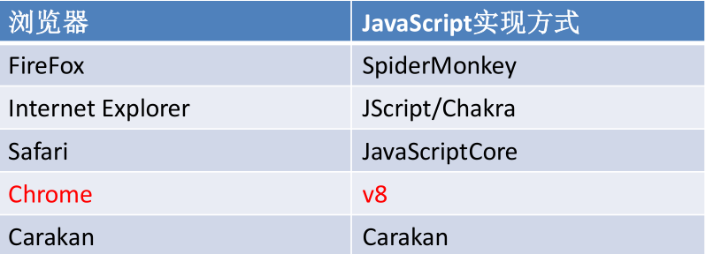


## JavaScript实现

虽然JavaScript和ECMAScript**通常都被人们用来表达相同的含义**，但**JavaScript的含义却比ECMA-262中规定的要多得多**。没错，一个完整的JavaScript实现应该由下列三个不同的部分组成。


### ECMAScript

由ECMA-262定义的ECMAScript与Web浏览器没有依赖关系。实际上，**这门语言本身并不包含输人和输出定义**。ECMA-262定义的只是这门语言的**基础**，而**在此基础之上可以构建更完善的脚本语言**。我们常见的**Web浏览器**只是ECMAScript实现可能的**宿主环境**之一。宿主环境不仅提供**基本的ECMAScript实现**，同时也会提供该语言的**扩展**，以便**语言与环境之间对接交互**。而这些扩展——如DOM，则利用ECMAScript的核心类型和语法提供更多更具体的功能，以便实现针对环境的操作。**其他宿主环境包括Node（一种服务端JavaScript平台）和Adobe Flash。**

> Adobe Flash已经凉了，谷歌浏览器从2020年12月31后就不再支持Adobe Flash了，只支持HTML5了。

既然ECMA-262标准没有参照Web浏览器，那它都规定了些什么内容呢？大致说来，它规定了这门语言的下列组成部分：


**ECMAScript就是对实现该标准规定的各个方面内容的语言的描述。JavaScript实现了ECMAScript，Adobe ActionScript同样也实现了ECMAScript。**

> **Node.js简介**
>
> 一种javascript的运行环境，能够使得javascript脱离浏览器运行。
>
> **浏览器给网站发请求的过程一直没怎么变过**。当浏览器给网站发了请求。服务器收到了请求，然后开始**搜寻**被请求的资源。如果有需要，服务器还会**查询一下数据库**，最后把响应结果传回浏览器。不过，在传统的web服务器中（比如Apache），每一个请求都会让服务器**创建一个新的进程**来处理这个请求。
>
> 后来有了**Ajax**。有了Ajax，我们就**不用每次都请求一个完整的新页面**了，取而代之的是，每次只请求需要的**部分页面信息**就可以了。这显然是一个进步。但是比如你要建一个FriendFeed这样的社交网站（类似人人网那样的刷朋友新鲜事的网站），你的好友会随时的推送新的状态，然后你的新鲜事会实时自动刷新。要达成这个需求，我们需要让用户一直与服务器保持一个**有效连接**。目前最简单的实现方法，就是让用户和服务器之间保持长轮询**（long polling）**。
>
> [Node.js简介完整版](<https://www.zhihu.com/question/33578075>)

**1.ECMAScript的版本**

ECMAScript的不同版本又称为版次，以第x版表示（意即描述特定实现的ECMA-262规范的第x个版本），**ECMA-262的最近一版是第5版，发布于2009年**。

> 现在不止是第5版了，有ES6,ES7,ES8了。

而ECMA-262的第1版本质上与Netscape的JavaScript 1.1相同-只不过删除了所有针对浏览器的代码并作了一些较小的改动：ECMA-262要求支持**Unicode标准**（从而支持多语言开发），而且对象也变成了平台无关的（Netscape JavaScript 1.1的对象在不同平台中的实现不一样，例如Date对象），这也是JavaScript 1.1和1.2与ECMA-262第1版不一致的主要原因。

ECMA-262第2版主要是编辑加工的结果。这一版中内容的更新是为了与ISO/IEC-16262保持严格一致，没有作任何新增、修改或删节处理。因此，一般不使用第2版来衡量ECMAScript实现的兼容性。

ECMA-262第3版才是对该标准第一次真正的修改。修改的内容涉及字符串处理、错误定义和数值输出。这一版还新增了对正则表达式、新控制语句、try-catch异常处理的支持，并围绕标准的国际化做出了一些小的修改。**从各方面综合来看，第3版标志着ECMAScript成为了一门真正的编程语言。**

ECMA-262**第4版对这门语言进行了一次全面的检核修订**。由于JavaScript在Web上日益流行，开发人员纷纷建议修订ECMAScript，以使其能够满足不断增长的web开需求。为回应，ECMATC39重新召集相关人员共同谋划这门语言的未来。结果，出台后的标准几乎在第3版基础上完全定义了一门新语言。第4版不仅包含了强类型变量、新语句和新数据结构、真正的类和经典继承，还定义了与数据交互的新方式。

与此同时，TC39下属的一个小组也提出了一个名为ECMAScript 3.1的替代性建议，该建议只对这门语言进行了较少的改进。这个小组认为**第4版给这门语言带来的跨越太大了**。因此，该小组建议对这门语言进行小幅修订，能够在现有JavaScript引擎基础上实现。最终，ES3.1附属委员会获得的支持超过了TC39，**ECMAS-262第4版在正式发布前被放弃。**

> 第4版步子迈得太大了，改的太多了，所以最终被放弃了。

ECMAScript 3.1成为ECMA-262第5版，并于2009年12月3日正式发布。第5版力求澄清第3版中已知的歧义并增添了新的功能。新功能包括原生JSON对象（用于解析和序列化JSON数据）、继承的方法和高级属性定义，另外还包含一种**严格模式**，对ECMAScript引擎解释和执行代码进行了补充说明。

**2.什么是ECMAScript兼容**

ECMA-262给出了ECMAScript兼容的定义。要想成为ECMAScript的实现，则该实现必须做到：

* 支持ECMA-262描述的所有“类型、值、对象、属性、函数以及程序句法和语义"（ECMA-262第1页）
* 支持Unicode字符标准

此外，兼容的实现还可以进行下列**扩展**。

* 添加ECMA-262没有描述的“更多类型、值、对象、属性和函数"，ECMA-262所说的这些新增特性，主要是指该标准中没有规定的新对象和对象的新属性。
* 支持ECMA-262没有定义的“程序和正则表达式语法”。(也就是说，可以修改和扩展内置的正则表达式语法)

上述要求为兼容实现的开发人员基于ECMAScript开发一门新语言提供了广阔的空间和极大的灵活性，这也从另一个侧面说明了ECMAScript受开发人员欢迎的原因。

**3.Web浏览器对ECMAScript的支持**

1996年，Netscape Navigator 3捆绑发布了JavaScript 1.1。而相同的JavaScript 1.1设计规范随后作为对新标准（ECMA-262）的建议被提交给Ecma。伴随着JavaScript的迅速走红，Netscape豪情满怀地着手开发JavaScript 1.2，然而，问题是Ecma当时还没有接受Netscape的建议。

Netscape Navigator 3发布后不久，微软也推出了Internet Explorer 3，微软在1E的这一版中捆绑了JScript 1.0，很多人都认为JScript 1.0与JavaScript 1.1应该是一样的。但是，由于没有文档依据，加之不适当的特性模仿，JScript 1.0还是很难与JavaScript 1.1相提并论。

1997年，内置JavaScript 1.2的Netscape Navigator 4发布；而到这一年年底，ECMA-262第1版也被接受并实现了标准化。结果，虽然ECMAScript被认为是基于JavaScript 1.1制定的，但JavaScript 1.2与ECMAScript的第1版并不兼容。

JScript的升级版是Internet Explorer 4中内置的JScript 3.0（随同微软1IS 3.0发布的JScript 2.0从来也没有移植到浏览器中），微软通过媒体大肆宣传JScript 3.0是世界上第一个ECMA兼容的脚本语言，但当时的ECMA-262尚未定稿。于是，JScript 3.0与JavaScript 1.2都遭遇了相同的尴尬局面--谁都没有按照最终的ECMAScript标准来实现。

Netscape决定更新其Javascript实现，即在Netscape Navigator 4.06中发布Javascript 1.3，从而做到了与ECMA-262的第一个版本完全兼容。在JavaScript 1.3中，Netscape增加了对Unicode标准的支持并在保留JavaScript 1.2新增特性的同时实现了所有对象的平台中立化。

在Netscape以Mozilla项目的名义开放其源代码时，预期JavaScript 1.4将随同Netscape Navigator 5一道发布。然而，一个激进的决定，彻底重新设计Netscape代码，打乱了原有计划。后来，JavaScript 1.4只发布了针对Netscape Enterprise Server的服务器版，而没有内置于Web浏览器中。

**到了2008年，五大主流Web浏览器（IE、Firefox，Safari，Chrome和Opera）全部做到了与ECMA-262兼容。**IE8是第一个着手实现ECMA-262第5版的浏览器，并在IE9中提供了完整的支持。Firefox 4也紧随其后做到兼容。下表列出了ECMAScript受主流Web浏览器支持的情况。

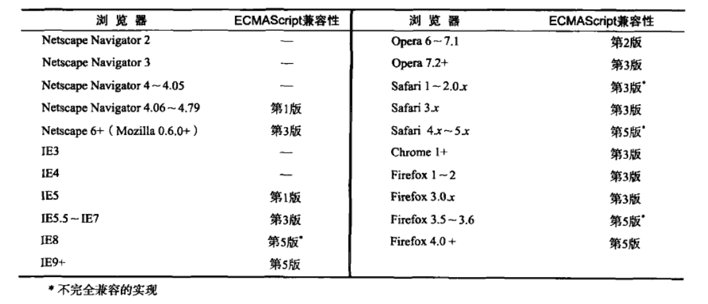

> 2020年7月22日：截止到这里复习完

### 文档对象模型(DOM)

 文档对象模型（DOM,Document Object Model）是**针对XML但经过扩展用于HTML的应用程序编程接口**(**API**,Application Programming Interface)。DOM<strong style="color:red">把整个页面映射为一个多节点结构</strong>。HTML或XML页面中的**每个组成部分**都是某种类型的**节点**，这些节点又包含着**不同类型的数据**。看下面这个HTML页面。

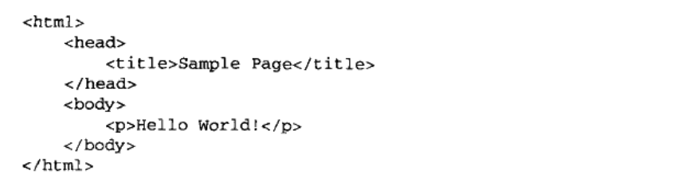

在DOM中，这个页面可以通过见图1-2所示的分层节点图表示。

通过DOM创建的这个表示文档的树形图，开发人员获得了**控制页面内容和结构的主动权**。借助DOM提供的**API**，开发人员可以轻松自如地**删除、添加、替换或修改任何节点**。

**1.为什么要使用DOM**

在Internet Explorer 4和Netscape Navigator 4分别支持的不同形式的**DHTML**（Dynamic HTML）基础上，开发人员首次**无需重新加载网页，就可以修改其外观和内容**了。然而，DHTML在给Web技术发展带来巨大进步的同时，也带来了巨大的问题。**由于Netscape和微软在开发DHTML方面各持已见，过去那个只编写一个HTML页面就能够在任何浏览器中运行的时代结束了。**

对开发人员而言，如果想继续保持Web跨平台的天性，就必须额外多做一些工作。**而人们真正担心的是，如果不对Netscape和微软加以控制，web开发领域就会出现技术上两强割据，浏览器互不兼容的局面。此时，负责制定Web通信标准的w3C（World Wide Web Consortium，万维网联盟）开始着手规划DOM。**

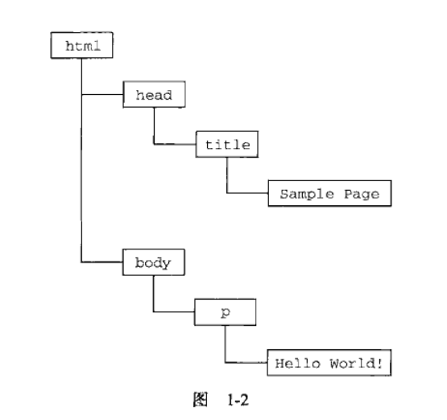

**2.DOM级别**

DOM1级（DOM Level 1）于1998年10月成为w3C的推荐标准。**DOM1级由两个模块组成：DOM核心（DOM Core）和DOM HTML**，其中，**DOM核心规定的是如何映射基于XML的文档结构，以便简化对文档中任意部分的访问和操作。DOM HTML模块则在DOM核心的基础上加以扩展，添加了针对HTML的对象和方法。**

> 请读者注意，**DOM并不只是针对JavaScript的**，很多别的语言也都实现了DOM。不过，在Web浏览器中，基于ECMAScript实现的DOM的确已经成为JavaScript这门语言的一个重要组成部分。

如果说DOM1级的**目标**主要是**映射文档的结构**，那么DOM2级的目标就要宽泛多了。DOM2级在原来DOM的基础上又扩充了（DHTML一直都支持的）鼠标和用户界面事件、范围、遍历（迭代DOM文档的方法）等细分模块，而且通过**对象接口**增加了对**CSS**（Cascading Style Sheets，层叠样式表）的支持。DOM1级中的DOM核心模块也经过扩展开始支持XML命名空间。

DOM2级引入了下列新模块，也给出了众多新类型和新接口的定义。

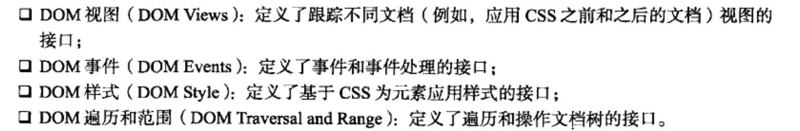

**DOM3级**则进一步扩展了DOM，引入了以统一方式加载和保存文档的方法——在**DOM加载和保存（DOM Load and Save）**模块中定义；新增了验证文档的方法——在**DOM验证（DOM Validation）**模块中定义。DOM3级也对DOM核心进行了扩展，开始支持XML 1.0规范，涉及XML Infoset、XPath和XML Base。

> 在阅读DOM标准的时候，读者可能会看到**DOM0级**（DOM Level 0）的字眼。
> 实际上，DOMO级标准是不存在的；所谓DOMO级只是DOM历史坐标中的一个参照点而已。具体说来，DOM0级指的是Internet Explorer 4.0和Netscape Navigator 4.0最初支持的DHTML

**3.其他DOM标准**

除了DOM核心和DOM HTML接口之外，另外几种语言还发布了只针对自己的DOM标准。下面列出的语言都是基于XML的，每种语言的DOM标准都添加了与特定语言相关的新方法和新接口：

~~~
SVG（Scalable Vector Graphic，可伸缩矢量图）1.0;
MathML（Mathematical Markup Language，数学标记语言）1.0;
SMIL（Synchronized Multimedia Integration Language，同步多媒体集成语言）。
~~~

还有一些语言也开发了自己的DOM实现，例如Mozilla的XUL（XML User Interface Language，XML用户界面语言）。但是，只有上面列出的几种语言是w3C的推荐标准。

**4.Web浏览器对DOM的支持**

在DOM标准出现了一段时间之后，Web浏览器才开始实现它。微软在IE5中首次尝试实现DOM，但直到1E5.5才算是真正支持DOMI级。在随后的IE6和IE7中，微软都没有引入新的DOM功能，而到了IE8才对以前DOM实现中的bug进行了修复。

Netscape直到Netscape 6（Mozill 0.6.0）才开始支持DOM。在Netscape7之后，Mozilla把开发重心转向了Firefox浏览器。Firefox3完全支持DOM1级，几乎完全支持DOM2级，甚至还支持DOM3级的一部分。（Mozilla开发团队的目标是构建与标准100%兼容的浏览器，而他们的努力也得到了回报。）

目前，支持DOM已经成为浏览器开发商的首要目标，主流浏览器每次发布新版本都会改进对DOM的支持。下表列出了主流浏览器对DOM标准的支持情况。

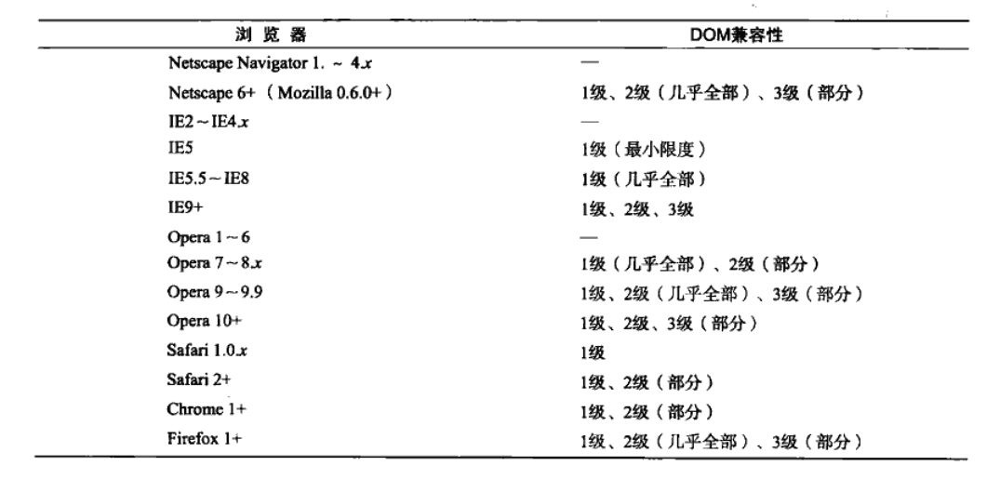

> **XML简介**
>
> 维基百科：**可扩展标记语言**（英语：Extensible Markup Language，简称：**XML**）是一种**标记语言**。标记指计算机所能理解的**信息符号**，通过此种标记，计算机之间可以处理包含各种信息的文章等。如何**定义**这些标记，既可以选择**国际通用的标记语言，比如HTML**，也可以使用像**XML**这样由**相关人士自由决定**的标记语言，这就是**语言的可扩展性**。XML是从标准通用标记语言(SGML)中简化修改出来的。它主要用到的有可扩展标记语言、可扩展样式语言(XSL)、XBRL和XPath等。
>
> 扩展：[XML到底是干什么的](	<https://www.zhihu.com/question/31353595>)

**DOM概念理解扩展**：（[来源](<https://www.zhihu.com/question/34219998>)）

> 为了理解DOM，我们至少需要**站在浏览器的角度**来思考。
>
> DOM概念本身很简单，请先完全跟着我的思路来：
>
> 1. 普通文档（ * .txt）和HTML/XML文档（** .html* * .xml）的区别仅仅是因为**后者是有组织的结构化文件**；
> 2. 浏览器将结构化的文档以**树的数据结构**读入浏览器内存，并将每个树的子节点定义为一个NODE（想象这颗树，从根节点到叶子节点都被建模为一个NODE对象）；
> 3. 这每个节点（NODE）都有自己的属性（名称、类型、内容...）；
> 4. NODE之间有层级关系（parents、child、sibling...）；
> 5. 以上已经完成文档的建模工作（将文档内容以树形结构写入内存），此时再编写一些方法来操作节点（属性和位置信息），即为NODE API。
>
> 抽象一下：
>
> * DOM是一种将HTML/XML文档**组织成对象模型**的**建模过程**；
> * DOM建模重点在于**如何解析HTML/XML文档**和开放符合DOM接口规范的**节点操作API接口**。
>
> 再抽象一下：
>
> * 解析文档，建模成对象模型，开放API接口。
>
> 最后：
>
> * DOM：*Document Object Model* 文档对象模型

~~~
DOM 有什么用？  就是为了操作 HTML 中的元素
~~~

~~~
DOM, Document, BOM, Window 有什么区别?

DOM 是为了操作文档出现的 API，document 是其的一个对象;
BOM 是为了操作浏览器出现的 API，window 是其的一个对象。
~~~

### 浏览器对象模型(BOM)

Internet Explorer 3和 Netscape Navigator3有一个共同的特色，那就是支持可以访问和操作浏览器窗口的**浏览器对象模型（BOM，Browser Object Model）**。开发人员使用BOM可以控制**浏览器显示的页面以外的部分**。而BOM真正与众不同的地方（也是经常会导致问题的地方），还是它作为JavaScript实现的一部分但却**没有相关的标准**。这个问题**在HTML5中得到了解决**，HTML5致力于把很多BOM功能写入正式规范。HTML5发布后，很多关于BOM的困惑烟消云散。

从根本上讲，BOM**只处理浏览器窗口和框架**；但人们习惯上也把所有针对浏览器的JavaScript扩展算作BOM的一部分。下面就是一些这样的扩展:

~~~
弹出新浏览器窗口的功能;
移动、缩放和关闭浏览器窗口的功能;
提供浏览器详细信息的navigator对象;
提供浏览器所加载页面的详细信息的location对象;
提供用户显示器分辨率详细信息的screen对象;
对cookies的支持;
像XMLHtEpRequest和IE的Activexobject这样的自定义对象。
~~~

由于**没有BOM标准可以遵循**，因此每个浏览器都有自己的实现。虽然也存在一些事实标准，例如要有window对象和navigator对象等，但每个浏览器都会为这两个对象乃至其他对象定义自己的属性和方法。现在有了HTML5，BOM实现的细节有望朝着兼容性越来越高的方向发展。第8章将深入讨论BOM。

> 2020年7月23日：截止到这里复习完

## JavaScript版本

**作为Netscape“继承人”的Mozila公司，是目前唯一还在沿用最初的JavaScript版本编号序列的浏览器开发商。**在Netscape将源代码提交给开源的Mozilla项目的时候，JavaScript在浏览器中的最后一个版本号是1.3,（如前所述，1.4版是只针对服务器的实现。）后来，随着Mozilla基金会继续开发JavaScript，添加新的特性、关键字和语法，JavaScript的版本号继续递增。下表列出了Netscape/Mozilla浏览器中JavaScript版本号的递增过程：

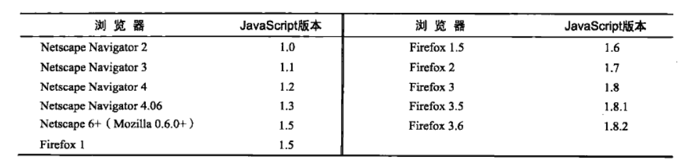

实际上，上表中的编号方案源自Firefox4将内置JavaScript 2.0这一共识。因此，2.0版之前每个递增的版本号，表示的是相应实现与JavaScript 2.0开发目标还有多大的距离。虽然原计划是这样，但Javascript的这种发展速度让这个计划成为不再可行。目前，JavaScript 2.0还没有目标实现。

> 请注意，只有Netscape/Mozila浏览器才遵循这种编号模式。例如，IE的JScript就采用了另一种版本命名方案。换句话说，JScript的版本号与上表中JavaScript的版本号之间不存在任何对应关系。而且，大多数浏览器在提及对JavaScript的支持情况时，一般都以ECMAScript兼容性和对DOM的支持情况为准。

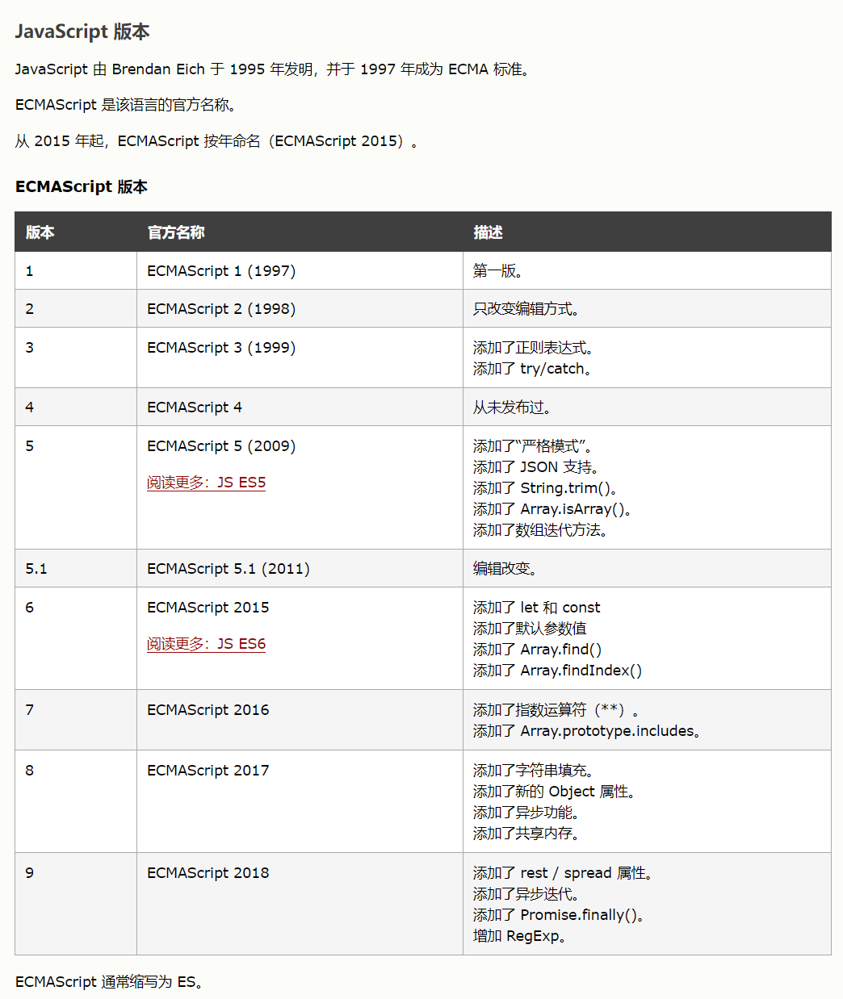

## 小结

JavaScript是一种专为与网页交互而设计的脚本语言，由下列三个不同的部分组成：

~~~javascript
ECMAScript，由ECMA-262定义，提供核心语言功能；
文档对象模型（DOM），提供访问和操作网页内容的方法和接口；
浏览器对象模型（BOM），提供与浏览器交互的方法和接口。
~~~

JavaScript的这三个组成部分，在**当前五个主要浏览器（IE，Firefox，Chrome，Safari和Opera）**中都得到了不同程度的支持。其中，所有浏览器对ECMAScript第3版的支持大体上都还不错，而对ECMAScript5的支持程度越来越高，但对DOM的支持则彼此相差比较多。对HTML5已经正式纳入标准的BOM来说，尽管各浏览器都实现了某些众所周知的共同特性，但其他特性还是会因浏览器而异。

> (第1章复习完：2020-03-04)
>
> 2020年7月23日：截止到这里复习完

# 第2章：在HTML中使用JavaScript

只要一提到把JavaScript放到网页中，就不得不涉及Web的核心语言——HTML，**在当初开发JavaScript的时候，Netscape要解决的一个重要问题就是如何做到让JavaScript既能与HTML页面共存，又不影响那些页面在其他浏览器中的呈现效果。**经过尝试、纠错和争论，最终的决定就是为Web增加统一的脚本支持。而Web诞生早期的很多做法也都保留了下来，并被正式纳入HTML规范当中。

## < script>元素

向**HTML页面**中**插入JavaScript**的主要方法，就是**使用< script>元素**。这个元素由Netscape创造并在Netscape Navigator 2中首先实现。后来，这个元素被加入到正式的HTML规范中，HTML 4.01为< script>定义了下列6个属性。

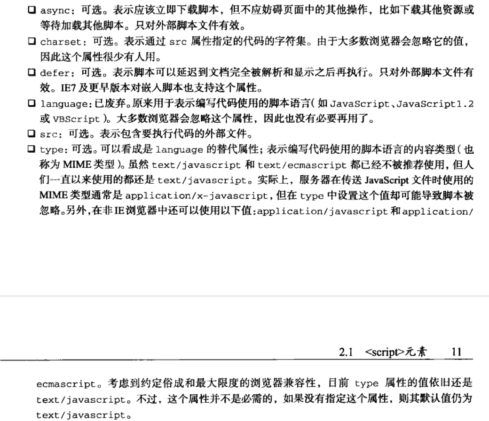

使用< script>元素的方式有两种：**直接在页面中嵌入JavaScript代码**和**包含JavaScript文件。**

**在使用< script>元素嵌入Javascript代码时，只须为< script>指定type属性**。然后，像下面这样把JavaScript代码直接放在元素内部即可：

~~~javascript
<script type="text/javascript">
	function sayHi(){
		 alert ("Hi!");
	}
</script>
~~~

包含在< script>元素内部的JavaScript代码将被**从上至下依次解释**。就拿前面例子来说，**解释器**会解释到一个函数的定义，然后将该定义保存在自己的环境当中。在**解释器对< script>元素内部的所有代码求值完毕以前，页面中的其余内容都不会被浏览器加载或显示**。

在使用< script>嵌入JavaScript代码时，记住**不要在代码中的任何地方出现"< /script>"字符串。**
例如，浏览器在加载下面所示的代码时就会产生一个错误：

~~~javascript
<script type="text/javascript">
	function sayHi(){
		 alert ("<script>");
	}
</script>
~~~

因为按照解析嵌入式代码的规则，当浏览器遇到**字符串"< /script>"**时，就会认为那是结束的< /script>标签。而通过把这个字符串分隔为两部分可以解决这个问题，例如：

~~~javascript
<script type="text/javascript">
	function sayHi(){
		 alert ("<\/script>");
	}
</script>
~~~

像这样分成两部分来写就不会造成浏览器的误解，因而也就不会导致错误了。

**如果要通过< script>元素来包含外部JavasScript文件，那么src属性就是必需的。**这个属性的值是一个指向外部Javascript文件的链接，例如：

~~~javascript
<script type="text/javascript" src="example.js"></script>
~~~

在这个例子中，**外部文件**example.js将被加载到当前页面中。外部文件只须包含通常要放在开始的< script>和结束的< /script>之间的那些JavaScript代码即可。与解析**嵌入式JavaScript代码**一样，在解析**外部JavaScript文件**（包括下载该文件）时，页面的处理也会暂时停止。如果是在**XHTML**文档中，也可以省略前面示例代码中**结束的**< /script>标签，例如：

~~~javascript
<script type="text/javascript" src="example.js"/>
~~~

**但是，不能在HTML文档使用这种语法。原因是这种语法不符合HTML规范，而且也得不到某些浏览器（尤其是IE）的正确解析。**

> 按照**惯例**，外部JavaScript文件**带有Js扩展名**。但**这个扩展名不是必需的**，因为**浏览器不会检查包含JavaScript的文件的扩展名**。这样一来，使用JSP，PHP或其他服务器端语言动态生成JavaScript代码也就成为了可能。但是，服务器通常还是需要看扩展名决定为**响应应用哪种MIME类型**。如果不使用js扩展名，请确保服务器能返回正确的MIME类型。

**需要注意的是，带有src属性的< script>元素不应该在其< script>和< /script >标签之间再包含额外的JavaScript代码。如果包含了嵌入的代码，则只会下载并执行外部脚本文件，嵌入的代码会被忽略。**

另外，**通过< script>元素的src属性还可以包含来自外部域的JavaScript文件。**这一点既使< script>元素倍显强大，又让它备受争议。在这一点上，**< script>与< img>元素非常相似**，即它的**src属性可以是指向当前HTML页面所在域之外的某个域中的URL**，例如：

~~~javascript
script type="text/javascript" src="http://www.somewhere.com/afile.js"></script>
~~~

这样，位于外部域中的代码也会被加载和解析，就像这些代码位于加载它们的页面中一样。利用这一点就可以**在必要时通过不同的域来提供JavaScript文件**。不过，在访问自己不能控制的服务器上的JavaScript文件时则要**多加小心**。如果不幸遇到了怀有恶意的程序员，那他们随时都可能替换该文件中的代码。因此，如果想包含来自不同域的代码，则要么你是那个域的所有者，要么那个域的所有者值得信赖。

无论如何包含代码，只要不存在**defer和async**属性，浏览器都会按照< script>元素在页面中出现的先后顺序对它们进行解析。换句话说，在第一个< script>元素包含的代码解析完成后，第二个< script>包含的代码才会被解析，然后才是第三个，第四个......

> **script中defer和async的区别**：（[链接](<https://juejin.im/post/5a1229596fb9a0451704cae8>)）
>
> 对于**defer**，我们可以认为是将**外链**的js放在了页面**底部**。**js的加载不会阻塞页面的渲染和资源的加载**。不过defer会按照原本的js的顺序执行，所以如果前后有依赖关系的js可以放心使用。
>
> 对于**async**，这个是**HTML5中新增的属性**，它的作用是能够**异步的加载和执行脚本**，不因为加载脚本而阻塞页面的加载。一旦加载到就会立刻执行在有async的情况下，js一旦下载好了就会执行，所以**很有可能不是按照原本的顺序来执行的**。如果js前后**有依赖性**，用async，就很有可能**出错**。
>
> 相同点：
>
> * 加载文件时**不阻塞页面渲染**
> * 对于inline的script（内联脚本）无效
> * 使用这两个属性的脚本中不能调用document.write方法
> * 有脚本的onload的事件回调
>
> 不同点：
>
> * HTML的版本HTML4.0中定义了defer；HTML5.0中定义了async
>
> * 执行时刻
>   每一个async属性的脚本都在它**下载结束之后立刻执行**，同时会在**window的load事件之前**执行。所以就有可能出现脚本执行顺序被打乱的情况；
>   
>   每一个defer属性的脚本都是在页面解析完毕之后，按照**原本的顺序**执行，同时会在**document的DOMContentLoaded之前**执行。
>
> 简单的来说，使用这两个属性会有三种可能的情况
> ​    1. 如果async为true，那么脚本在下载完成后异步执行。
> ​    2. 如果async为false，defer为true，那么脚本会在页面解析完毕之后执行。
> ​    3. 如果async和defer都为false，那么脚本会在页面解析中，停止页面解析，立刻下载并且执行。

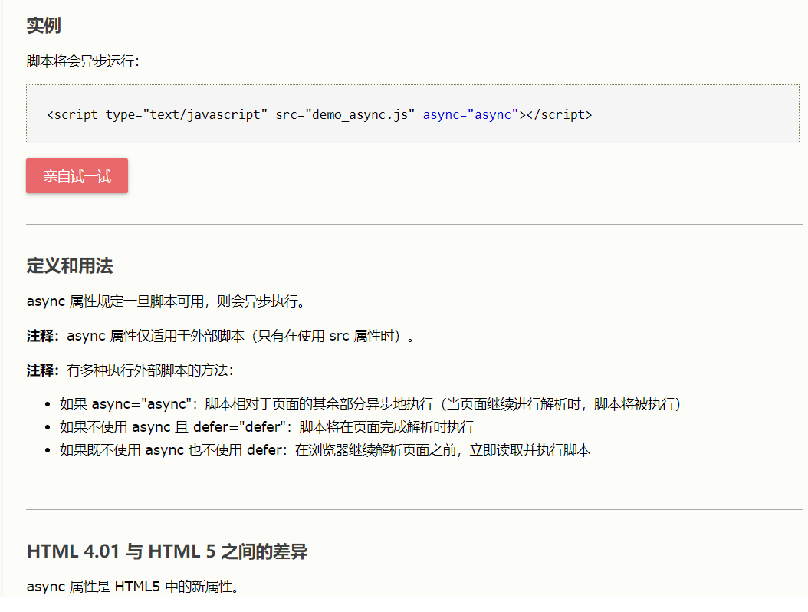

[什么是异步](https://www.jianshu.com/p/f4abe8c4fc2f)

### 标签的位置

按照惯例，所有< script>元素都应该放在**页面的< head>元素中**，例如：

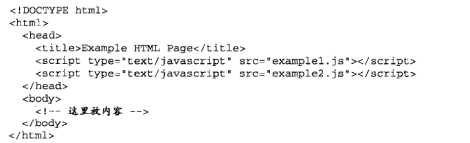

这种做法的目的就是把所有外部文件（包括CsS文件和JavaScript文件）的引用都放在相同的地方。
可是，在文档的< head>元素中包含所有JavaScript文件，意味着**必须等到全部JavaScript代码都被下载、解析和执行完成以后，才能开始呈现页面的内容**（**浏览器在遇到< body>标签时才开始呈现内容**）。对于那些需要很多Javascript代码的页面来说，这无疑会导致浏览器在呈现页面时出现明显的**延迟**，而延迟期间的浏览器窗口中将是**一片空白**。为了避免这个问题，现代Web应用程序一般都把全部JavaScript引用放在**< body>元素中页面的内容后面**，如下例所示：

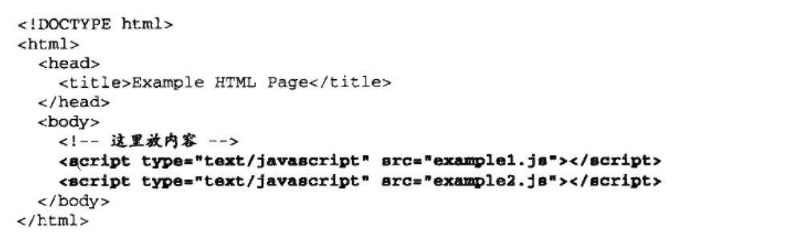

这样，在解析包含的JavaScript代码之前，页面的内容将完全呈现在浏览器中。而用户也会因为测览器窗口显示空白页面的时间缩短而感到打开页面的速度加快了。

### 延迟脚本(defer属性不熟)--HTML4.0

**HTML4.01**为< script>标签定义了**defer属性**。这个属性的用途是表明**脚本在执行时不会影响页面的构造**。也就是说，**脚本会被延迟到整个页面都解析完毕后再运行**。因此，在< script>元素中设置defer属性，相当于告诉浏览器**立即下载**，但**延迟执行**。

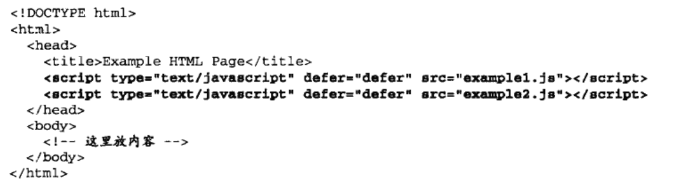

在这个例子中，虽然我们把< script>元素放在了文档的< head>元素中，但**其中包含的脚本将延迟到浏览器遇到< /html>标签后(html标签最末尾)再执行**。HTML5规范**要求脚本按照它们出现的先后顺序执行**，因此第一个延迟脚本会先于第二个延迟脚本执行，而**这两个脚本会先于DOMContentLoaded事件（详见第13章）执行**。在**现实**当中，**延迟脚本并不一定会按照顺序执行，也不一定会在DOMContent Loaded事件触发前执行**(理想和现实还是有去区别的)，因此最好**只包含一个延迟脚本**。

> DOMContentLoaded 是DOM 加载完毕，不包含图片 falsh css 等就可以执行 
>
> 而load 等页面内容全部加载完毕，包含页面DOM元素 图片 flash  css 等等
>
> 所以DOMContentLoaded 加载速度比 load更快一些

前面提到过，defer属性只适用于**外部**脚本文件。这一点在HTML5中已经明确规定，因此支持HTML5的实现会**忽略**给**嵌入脚本**(只有外部脚本才有defer属性，嵌入脚本没有这个属性，所以会被忽略)设置的defer属性。IE4-IE7还支持对嵌入脚本的defer属性，但1E8及之后版本则完全支持HTML5规定的行为。

IE4，Firefox 3.5，Safari 5和Chrome是最早支持defer属性的浏览器。其他浏览器会忽略这个属性，像平常一样处理脚本。为此，把延迟脚本放在页面**底部**(body标签里面)仍然是最佳选择。

> 在XHTML文档中，要把defer属性设置为defer="defer"。

### 异步脚本（async不熟）-HTML5.0

HTMLS为< script>元素定义了**async属性**。这个属性与defer属性类似,都用于改变处理脚本的行为。同样与defer**类似**，async只适用于**外部脚本文件**，并告诉浏览器**立即下载文件**。但与defer不同的是，标记为async的脚本并**不保证按照指定它们的先后顺序执行**。例如：

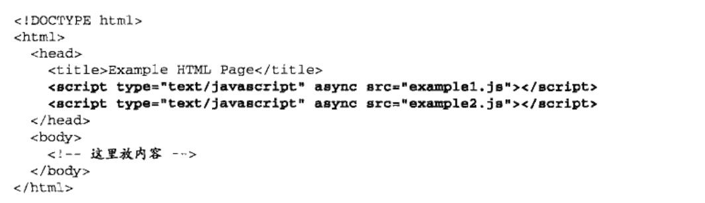

在以上代码中，**第二个脚本文件可能会在第一个脚本文件之前执行**。因此，**确保两者之间互不依赖非常重要**。指定async属性的**目的**是**不让页面等待两个脚本下载和执行**，从而**异步加载页面其他内容**。为此，建议异步脚本**不要在加载期间修改DOM。**

异步脚本**一定会在页面的load事件前执行**，但**可能会在DOMContentLoaded事件触发之前或之后执行**。支持异步脚本的浏览器有Firefox 3.6，Safari 5和Chrome。

> 在XHTML文档中，要把async属性设置为async="async"。

### 在XHTML中的用法

/122.png)

> HTML5正快速地被前端开发人员采用，建议读者在学习和开发中遵循HTML5标准，本节内容可以跳过。

### 不推荐使用的语法

/123.png)

> 2020年7月23日：截止到这里复习完

## 嵌入代码与外部文件

在HTML中嵌入JavaScript代码虽然没有问题，但一般认为最好的做法还是**尽可能使用外部文件**来包含Javascript代码。不过，并不存在必须使用外部文件的硬性规定，但支持使用外部文件的人多会强调如下优点。

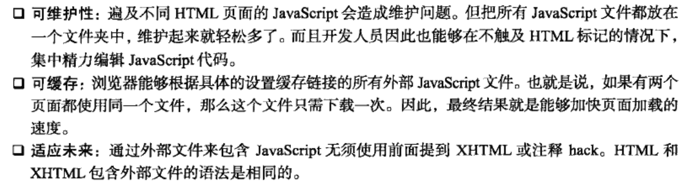

> 建议我们最好不要写内嵌的JS代码，单独设立一个JS文件然后引入它，又便于修改，页面又简洁。

## 文档模式(不懂)

IE5.5引入了**文档模式**的概念，而这个概念是通过使用**文档类型（doctype）切换**实现的。最初的两种文档模式是：**混杂模式**（quirks mode）和**标准模式**（standards mode），混杂模式会让IE的行为与（包含非标准特性的）IE5相同，而标准模式则让IE的行为更接近标准行为。虽然这两种模式主要影响CSS内容的呈现，但在某些情况下也会影响到JavaScript的解释执行。本书将在必要时再讨论这些因文档模式而影响JavasScript执行的情况。

在IE引人文档模式的概念后，其他浏览器也纷纷效仿。在此之后，IE又提出一种所谓的**准标准模式**（almost standards mode）。这种模式下的浏览器特性有很多都是符合标准的，但也不尽然。不标准的地方主要体现在**处理图片间隙**的时候（在**表格中使用图片时问题最明显**）。

如果在文档开始处没有发现文档类型声明，则所有浏览器都会**默认开启混杂模式**。但采用混杂模式不是什么值得推荐的做法，因为**不同浏览器在这种模式下的行为差异非常大**，如果不使用某些hack技术，跨浏览器的行为根本就没有一致性可言。

对于标准模式，可以通过使用下面任何一种文档类型来开启：

~~~javascript
<!--HTML 4.01严格型-->
<!DOCTYPE HTML PUBLIC "-//W3C//DTD HTML 4.01//EN"
"http://www.w3.org/TR/htm14/strict.dtd">
  
<!--XHTML 1.0严格型-->
<!DOCTYPE html PUBLIC
--//W3C//DTD XHTML 1.0 strict//EN"
"http://www.w3.org/TR/xhtml1/DTD/xhtml1-strict.dtd>

<!--HTML 5-->
<!DOCTYPE html>
~~~

而对于准标准模式，则可以通过使用**过渡型**（transitional）或**框架集型**（frameset）文档类型来触发，如下所示：

~~~javascript
<!-HTML 4.01过渡型-->
<!DOCTYPE HTML PUBLIC
"-//W3C//DTD HTML 4.01 Transitional//EN"
"http://www.w3.org/TR/html4/loose.dtd">
  
<!--HTML 4.01框架集型
<!DOCTYPE HTML PUBLIC
"-//W3C//DTD HTML 4.01 Frameset//EN"
.http://www.w3.org/TR/htm14/frameset.dta>

<!--XHTML 1.0过渡型-->
<!DOCTYPE html PUBLIO
"-//W3C//DTD XHTML 1.0 Transitional//EN"
"http://www.w3.org/TR/xhtm11/DTD/xhtml1-transitional.dtd">
  
<!--XHTML 1.0框架集型-->
<!DOCTYPE html PUBLIC
"-//W3C//DTD XHTML 1.0 Frameset//EN"
"http://www.w3.org/TR/xhtm11/DTD/xhtml1-frameset.dtd">
~~~

**准标准模式与标准模式非常接近，它们的差异几乎可以忽略不计**。因此，当有人提到“标准模式”时，有可能是指这两种模式中的任何一种。而且，检测文档模式（本书后面将会讨论）时也不会发现什么不同。本书后面提到标准模式时，指的是除混杂模式之外的其他模式。

## < noscript>元素

早期浏览器都面临一个特殊的问题，即**当浏览器不支持JavaScript时如何让页面平稳地退化**。对这个问题的最终解决方案就是**创造一个< noscript>元素**，用以在不支持JavaScript的浏览器中**显示替代的内容**。这个元素可以包含能够出现在文档< body>中的任何HTML元素——< script>元素除外。包含在< noscript>元素中的内容只有在下列情况下才会显示出来：

~~~
浏览器不支持脚本；
浏览器支持脚本，但脚本被禁用。
~~~

符合上述任何一个条件，浏览器都会显示< noscript>中的内容。而在除此之外的其他情况下，浏览器不会呈现cnoscript>中的内容。
请看下面这个简单的例子：

请看下面这个简单的例子：

~~~javascript
<html>
 <head>
	<title>Example HTML Pages/title>
	<script type="text/javascript"defer:"defer"src="examplel.js">s/script>
	<script type-"text/javascript"defer="defer"src="example2.js"></script>
 </head>
 <body>
	<noscript>
	  <p>本页面需要浏電器支持（启用）Javascript.
	</noacript>
 </body>
</html>
~~~

这个页面会**在脚本无效的情况下向用户显示一条消息**。而在启用了脚本的浏览器中，用户永远也不会看到它——尽管它是页面的一部分。

## 小结

把Javascript插入到HTML页面中要使用< script>元素。使用这个元素可以把JavaScript**嵌入**到HTML页面中，让**脚本与标记混合在一起**；也可以包含**外部的JavaScript文件**。而我们需要注意的地方有：

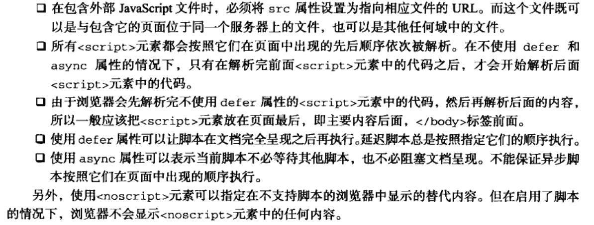

另外，使用< noscript>元素可以指定在不支持脚本的浏览器中显示的替代内容。但在启用了脚本的情况下，浏览器不会显示< noscript>元素中的任何内容。

>  (第2章复习完：2020-03-05)
>
> 2020年7月23日：截止到这里复习完

# 第3章：基本概念

任何语言的核心都必然会描述这门语言**最基本的工作原理**。而描述的内容通常都要涉及这门语言的**语法、操作符、数据类型、内置功能**等用于构建复杂解决方案的基本概念。如前所述，ECMA-262通过叫做ECMAScript的“伪语言”为我们描述了JavaScript的所有这些基本概念。

目前，ECMA-262**第3版**中定义的**ECMAScript**是各浏览器**实现最多**的一个版本。ECMA-262**第5版**是浏览器接下来实现的版本，但截止到2011年底，还没有浏览器完全实现了这个版本。**为此，本章将主要按照第3版定义的ECMAScript介绍这门语言的基本概念，并就第5版的变化给出说明。**

## 语法

ECMAScript的语法**大量借鉴了C及其他类C语言（如Java和Perl）的语法**。因此，熟悉这些语言的开发人员在接受ECMAScript更加宽松的语法时，一定会有一种**轻松自在**的感觉。

### 区分大小写

要理解的第一个概念就是ECMAScript中的**一切（变量、函数名和操作符）**都**区分大小写**。(**HTML里面不区分**)这也就意味着，变量名test和变量名Test分别表示两个不同的变量，而函数名不能使用typeof，因为它是一个关键字（3.2节介绍关键字），但**typeOf则完全可以是一个有效的函数名**。

### 标识符

所谓**标识符**，就是指**变量、函数、属性的名字，或者函数的参数。**标识符可以是按照下列格式规则组合起来的一或多个字符。

> 在JS中所有的可以由我们**自主命名**的都可以称为是标识符。	

    1.标识符中可以含有字母、数字、下划线（_）、美元符号（$）
    2.标识符不能以数字开头(第一个字母必须是一个字母、下划线或一个美元符号，绝不能是数字）
    3.标识符不能是ES中的关键字或保留字	
    4.标识符一般采用驼峰命名法
    	-首字母小写，每个单词的开头字母大写，其余小写
        举例：helloWorld
标识符中的字母也可以包含扩展的ASCII或Unicode字母字符（如A和E），但我们不推荐这样做。

按照惯例，ECMAScript标识符采用**驼峰大小写格式**，也就是第一个字母小写，**剩下的**每个有意义的单词的**首字母大写**，例如：

~~~
firstSecond
myCar
doSomethingImportant
~~~

虽然**没有谁强制要求必须采用这种格式**，**但**为了与ECMAScript内置的函数和对象命名格式保持一致，可以将其当作一种**最佳实践**。

> 不能把关键字、保留字、true，false和null用作标识符。3.2节将介绍更多相关内容。

### 注释

ECMAScript使用C风格的注释，包括**单行注释**和**块级注释**。单行注释以两个斜杠开头，如下所示：

``` 
//单行注释
```

块级注释以一个斜杠和一个星号（/ * ）开头，以一个星号和一个斜杠（* /）结尾，如下所示：

~~~
/*
 *这是一个多行
 *（块級）注释
 */
~~~

虽然上面注释中的第二和第三行都以一个星号开头，但这不是必需的。**之所以添加那两个星号，纯粹是为了提高注释的可读性**（这种格式在企业级应用程序中极其常见）。

### 严格模式(ES5才引入)

**ECMAScript 5**引入了**严格模式（strict mode）**的概念。严格模式是为JavaScript定义了一种**不同的解析与执行模型**。在严格模式下，**ECMAScript 3**中的一些不确定的行为将得到处理，而且对某些**不安全的操作**也会**抛出错误**。要在整个脚本中启用严格模式，可以在**顶部**添加如下代码：

~~~javascript
"use strict";
~~~

这行代码**看起来**像是**字符串**，而且**也没有赋值给任何变量**，但其实它是**一个编译指示（pragma）**，用于告诉支持的**JavaScript引擎切换到严格模式**。这是为**不破坏ECMAScript3语法**而特意选定的语法。

在函数内部的上方包含这条编译指示，也可以**指定函数**在严格模式下执行：

~~~javascript
function doSomething(){
    "use strict";
    //函数体
}
~~~

**严格模式下，JavaScript的执行结果会有很大不同**，因此本书将会随时指出严格模式下的区别。支持严格模式的浏览器包括E10+，Firefox 4+、Safari 5.1+t、Opera 12+和Chrome。

``` 
"use strict" 是 JavaScript 1.8.5 中的新指令（ECMAScript version 5）。
它不算一条语句，而是一段文字表达式，更早版本的 JavaScript 会忽略它。
"use strict"; 的作用是指示 JavaScript 代码应该以“严格模式”执行。
在严格模式中，您无法，例如，使用未声明的变量。

以下版本的浏览器支持严格模式：
版本 10 以后的 IE
版本 4 以后的 Firefox
版本 13 以后的 Chrome
版本 5.1 以后的 Safari
版本 12 以后的 Opera

声明严格模式
通过在脚本或函数的开头添加 "use strict"; 来声明严格模式。
在脚本开头进行声明，拥有全局作用域（脚本中的所有代码均以严格模式来执行）：
```

### 语句

ECMAScript中的语句**以一个分号结尾**；如果**省略分号，则由解析器确定语句的结尾**(但是要消耗资源并且也不太靠谱)，如下例所示：

~~~javascript
var sun = a + b		     //即使没有分号也是有效的语句——不推荐
var diff = a - b；		//有效的语句——推荐
~~~

虽然语句结尾的分号**不是必需**的，但我们建议**任何时候都不要省略它**。因为加上这个分号可以**避免很多错误**（例如不完整的输入），开发人员也可以**放心地通过删除多余的空格来压缩ECMAScript代码**(代码行结尾处没有分号会导致压缩错误)，另外，加上分号也会在某些情况下**增进代码的性能**，因为这样解析器就不必再花时间推测应该在哪里插人分号了。

可以使用C风格的语法把多条语句组合到一个代码块中，即代码块以左花括号（{）开头，以右花括号（}）结尾：

~~~javascript
if (test){
	test = false;
  	alert (test);
}
~~~

虽然条件控制语句（如it语句）只在执行**多条语句**的情况下才要求使用**代码块**，但**最佳实践**是**始终**在控制语句中使用代码块——**即使代码块中只有一条语句**，例如：

~~~javascript
if（test）
	alert（test）;	//有效但容易出错，不要使用

if（test）{
	alert（test);	//推荐使用
}
~~~

在控制语句中使用代码块可以**让编码意图更加清晰**，而且也能降低修改代码时出错的几率。

## 关键字和保留字

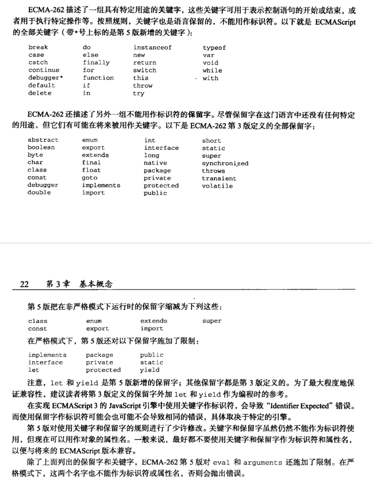

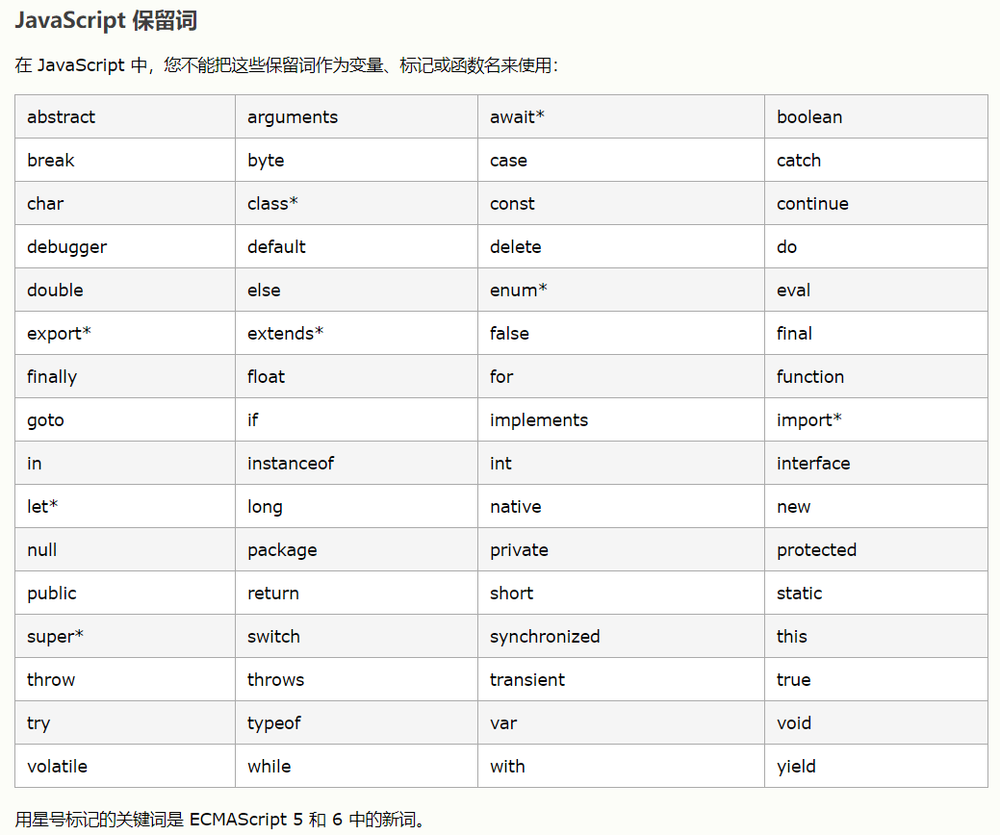

## 变量

> 变量是个盒子，里面可以装各种东西。装了苹果，当箱子和其它东西合作时，它就是苹果；装了鸭梨，和其它东西合作时，它就是鸭梨。
>
> **编译型语言**的变量要求**箱子是固定**的，装水果的就装水果，装面点的就装面点，装配件的就装配件。
>
> **解释型语言**的变量**不做要求**，随便装，爱装啥装啥。当它和水果合作时就拿它当水果用；当它和面点合作时就拿它当面点用。
>
> 广义的变量是相对于常量而言的，指可变动的量。变量是绝对的，常量是相对的，没有绝对意义上的常量。

ECMAScript的变量是<strong style="color:red">松散类型</strong>的，**所谓松散类型就是可以用来保存任何类型的数据。**换句话说，每个变量仅仅是一个用于<strong style="color:red">保存值的占位符</strong>而已。**定义变量**时要使用<strong style="color:red">var</strong>操作符（注意var是一个关键字）,后跟变量名（即一个<strong style="color:red">标识符</strong>），如下所示

``` javascript
var message;
```

这行代码定义了一个**名为message**的**变量**，该变量可以用来保存任何值（像这样**未经初始化的变量，会保存一个特殊的值——undefined**,相关内容将在3.4节讨论。）

> 在ES6之前，声明变量的方法有使用关键词var和在function中声明，而其中var又是最常见的声明变量方法。但在ES6中，新增了let、const、class和import几种声明变量的方法。

ECMAScript也支持**直接初始化变量**，因此在定义变量的**同时**就可以设置变量的值，如下所示

``` javascript
var message = "hi";
```

在此，变量message中 保存了一个字符串值"hi"。像这样初始化变量**并不会把它标记为字符串类型**;初始化的过程就是为**给变量赋一个值**那么简单。因此，可以在**修改变量值的同时修改变量类型**，如下所示

``` javascript
var message = "hi";
message = 100;  	//有效，但不推荐
```

在这个例子中，变量message一开始保存了一个字符串值"hi"，然后该值又被一个数字值100取代。虽然我们**不建议修改变量所保存值的类型**，但这种操作在ECMAScript中**完全有效**。

``` 
字面量：都是一些不可改变的值（可以理解成常量）
   比如 1 2 3 4 5
   字面量都是可以直接使用的，但是我们一般不会直接使用字面量
   //alert(123123123);
	
变量：变量可以用来保存字面量，而且变量的值是可以任意改变的（变量像一个仓库，JavaScript变量是存储数据值的容器。）

变量可以更加方便使用，所以在开发中都是通过变量去保存一个字面量，而很少直接使用字面量
```

有一点必须注意，即**使用var操作符定义的变量**将成为**定义该变量的作用域**中的**局部变量**。也就是说，**如果在函数中(函数内部)使用var定义一个变量，那么这个变量在函数退出后就会被销毁**，例如：

~~~javascript
function test（）{
  var message ="hi";  //局部变量
}
test（）;
alert（message）;     //错误！
~~~

这里，变量message是**在函数中**使用var定义的。当函数被**调用**(函数不调用就不会创建变量)时，就会**创建该变量并为其赋值**。

而**在此之后**，这个变量又会**立即被销毁**，因此例子中的**下一行代码就会导致错误**。不过，可以像下面这样**省略var操作符**，从而**创建一个全局变量**：

~~~javascript
function test（）{
  message ="hi";  //全局变量
}
test（）;
alert（message）;     //"hi"
~~~

这个例子**省略了var操作符**，因而**message就成了全局变量**。这样，只要**调用过一次**test()函数(必须要先调用一次才行)，这个变量就有了**定义**，就可以在**函数外部的任何地方被访问到**。

> 没有了var操作符，就变得无比自由了。

> 虽然省略var操作符可以定义全局变量，但这也**不是我们推荐的做法**。因为在局部作用域中定义的全局变量很难维护，而且如果有意地忽略了var操作符，也会由于相应变量不会马上就有定义而导致不必要的混乱。给未经声明的变量賦值在**严格模式**下会导致抛出ReferenceError错误。

可以使用一条语句定义多个变量，只要像下面这样把每个变量（初始化或不初始化均可）用**逗号分隔开**即可：

~~~javascript
var message = "hi",
    found = false, 
    age = 29;		//最后一个是分号，表示结束
~~~

这个例子定义并初始化了3个变量。同样由于ECMAScript是**松散类型**的，因而**使用不同类型初始化变量的操作可以放在一条语句中来完成**。虽然代码里的换行和变量缩进不是必需的，但这样做可以提高可读性。

在**严格模式**下，不能定义**名为eval或arguments的变量**，否则会导致语法错误。

> 2020年7月24日：截止到这里复习完

## 数据类型

ECMAScript中(本书主要讲的是ES3版本，兼顾ES5版本，要注意本书的时效性)有5种简单数据类型（也称为基本数据类型）：**Undefined、Null、Boolean、Number和String。还有1种复杂数据类型——Object**，Object**本质**上是由**一组无序的名值对**组成的。ECMAScript**不支持任何创建自定义类型的机制**，而**所有值最终都将是上述6种数据类型之一**。乍一看，好像只有6种数据类型不足以表示所有数据；但是，由于ECMAScript数据类型具有**动态性**，因此的确没有再定义其他数据类型的必要了。

> 计算机顾名思义就是可以做数学计算的机器，因此，计算机程序理所当然地可以处理各种数值。但是，计算机能处理的远不止数值，还可以处理文本、图形、音频、视频、网页等各种各样的数据，**不同的数据，需要定义不同的数据类型**。

``` 
在JS中(ES5)一共有6数据类型(首字母大写)	--注：新版ES6又增加了2种基本数据类型，BigInt和Symbol
	* Undefined  未定义
	* String     字符串
	* Number     数值
	* Boolean    布尔值
	* Null 	     空值	
	* BigInt 	 任意大的整数(ES6新增)
	* Symbol	 唯一标识符(ES6新增)
	
	* Object     对象(本质上是由一组无序的名值对组成的)
	
		
	其中:
	String 、Number、Boolean、Null、Undefined、BigInt、 Symbol属于基本数据类型(值类型)
	Object属于引用数据类型(引用数据类型不止有Object一个，还有Array,Date,RegExp,Function等？？？)
```

[JS最新基本数据类型](https://segmentfault.com/a/1190000019912017)

[ES6新增的两种基本数据类型：Symbol 与 BigInt](https://blog.csdn.net/yiyueqinghui/article/details/106783798)

**ES的各年版本：(详见第一章第三节Javascript版本)**

> ES3是1999年发布的(本书主要学这个版本)
>
> ES4夭折，从未发布过。
>
> ES5是2009年发布的(本书夹杂着这个版本的部分内容学习。后续高版本就不在本书的学习范围了)
>
> ES6是2015年发布的(新特性有类、模块化、箭头函数、let和const、Promise、函数参数默认值、模板字符串、解构赋值、延展操作符、对象属性简写等特性。)
>
> ES7是2016年发布的
>
> ES8是2017年发布的
>
> ES9是2018年发布的
>
> ES10是2019年发布的

[ES6、ES7、ES8、ES9、ES10新特性一览](https://www.cnblogs.com/miaSlady/p/10955729.html)

### typeof操作符(不熟)

[JS 中形如 instanceof、typeof 等这些为什么被设计成了运算符而不是一个函数？](https://www.zhihu.com/question/391192845/answer/1187486163)

鉴于ECMAScript是**松散类型**的，因此需要一种手段来**检测**给定**变量的数据类型**——**typeof**就是负责提供这方面信息的**操作符**。对一个**值**使用typeof操作符可能返回下列某个字符串：

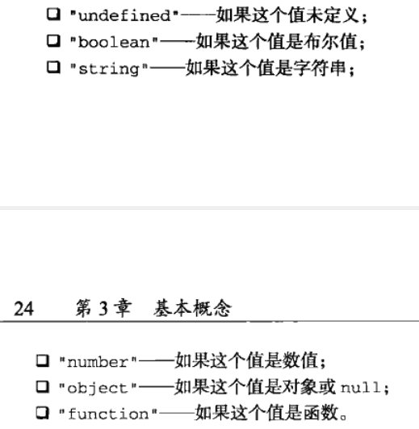

> 运算符也叫操作符，通过运算符可以对一个或多个值进行运算,并获取运算结果
> 比如：typeof就是**运算符**，可以来获得一个值的类型。它会将该值的类型以字符串的形式返回

下面是几个使用typeof操作符的例子：

~~~javascript
 var message = "some string";
 var a = function(){
      alert('哈哈哈')
 };
 
 alert(typeof message);    	 //"string"
 alert(typeof (message));    //"string" typeof不是个函数，所以可以不用圆括号
 alert(typeof a);		     //"function"
 alert(typeof 95);           //"number"
~~~

这几个例子说明，typeof操作符的**操作数**可以是**变量**(message)，也可以是**数值字面量**。注意，typeof是一个**操作符**而**不是函数**，因此例子中的**圆括号尽管可以使用，但不是必需的**。

有些时候，typeof操作符会返回一些令人迷惑但技术上却正确的值。比如，**调用typeof null会返回"object"，因为特殊值null被认为是一个空的对象引用。**Safari 5及之前版本、Chrome7及之前版本在对**正则表达式**调用typeof操作符时会返回**"function"**，而**其他浏览器**在这种情况下会返回**"object"**。

> 从技术角度讲，**函数**在ECMAScript中是**对象**，**不是一种数据类型**(所以数据类型中没有function这个选项)。然而，函数也确实有一些**特殊的属性**，因此通过typeof操作符来**区分函数和其他对象**是有必要的(函数是特殊的对象！！！而对象是引用数据类型)

### Undefined类型

Undefined类型<strong style="color:red">只有一个值</strong>，即**特殊的undefined(小写)**。

在使用var声明变量**但未对其加以初始化**时，这个变量的<strong style="color:red">值</strong>就是undefined。（**声明了！！！但是没有赋值**）

例如：

``` javascript
var message;
alert(message == undefined);  //true
```

这个例子只声明了变量message，但未对其进行初始化。**比较这个变量与undefined字面量，结果表明它们是相等的。**这个例子与下面的例子是**等价**的：

~~~javascript
var message = undefined;
alert(message == undefined);    //true
~~~

这个例子使用undefined值**显式初始化**了变量message。但我们**没必要这样做**，因为**未经初始化的值默认就会取得undefined值**。

> 一般而言，不存在需要显式地把一个变量设置为undefined值的情况。字面值undefined的主要目的是用于比较，而ECMA-262第3版之前的版本中并没有规定这个值。第3版**引入**这个值是为了**正式区分空对象指针与未经初始化的变量。**

不过，包含undefined值的变量与**尚未定义的变量**还是不一样的。看看下面的例子：

``` javascript
var message;     //这个变量声明了，只不过没有初始化（赋值） 
       
alert(message);  //"undefined"  message定义了，只不过没有初始化
alert(age);     //产生错误：age连定义都没定义，更别提初始化了
```

运行以上代码，第一个警告框会显示变量message的值，即"undefined"。而**第二个警告框**——由于传递给alert()函数的是**尚未声明的变量age**——则会导致一个错误。**对于尚未声明过的变量，只能执行一项操作，即使用typeof操作符检测其数据类型**（对未经声明的变量调用delete不会导致错误，但这样做没什么实际意义，而且在**严格模式**下确实会导致错误）。

然而，令人困惑的是：**对未初始化的变量执行typeof操作符会返回undefined值，而对未声明的变量执行typeof操作符同样也会返回undefined值。**来看下面的例子：

~~~javascript
var message; 	  		//这个变量声明之后默认取得了undefined值

alert(typeof message);  //"undefined"
alert(typeof age);      //"undefined"  前面的是alert(age)产生错误！！！
~~~

> 即便未初始化的变量会自动被赋予undefined值，但**显式地初始化变量依然是明智的选择。**如果能够做到这一点，那么当typeof操作符返回"undefined"值时，我们就知道被检测的变量**还没有被声明**，**而不是尚未初始化。**(message声明了，但没被初始化，使用typeof显示类型为undefined。而age连声明都没声明，使用typeof显示类型也是undefined，这样就无法区分这个变量是没初始化还是没有被声明了)

**undefined表示"缺少值"，就是此处应该有一个值，但是还没有定义。**典型用法是：

（1）**变量被声明了，但没有赋值时**，就等于undefined。

（2）调用函数时，**应该提供的参数没有提供**，该参数等于undefined。

（3）对象**没有赋值的属性**，该属性的值为undefined。

（4）**函数没有返回值**时，默认返回undefined。

```javascript
var i;
i // undefined	  i被声明了，但是没有赋值

function f(x){console.log(x)}
f() // undefined  应该提供的参数x没有提供

var  o = new Object();
o.p // undefined   数学p没有被赋值

var x = f();
x // undefined	   函数没有返回值
```

### Null类型(不熟)

**Null类型是第二个（第一个是Undefined）只有一个值的数据类型，这个特殊的值是null。**从逻辑角度来看**null值表示一个空对象指针，而这也正是使用typeof操作符检测null值时会返回"object"的原因。**

``` 
var car = null;		//小写
alert(typeof car)  //object
```

[null 是对象嘛？ ](https://blog.csdn.net/Teemo_shape/article/details/105658868)

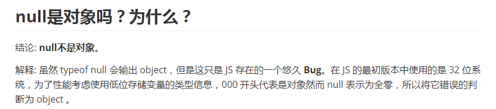

如果定义的变量准备在将来用于**保存对象**，那么最好将该变量**初始化为null而不是其他值**。这样一来，**只要直接检查null值就可以知道相应的变量是否已经保存了一个对象的引用**，如下面的例子所示：

~~~javascript
if(car != null){
  //对car对象执行某些操作
}
~~~

实际上，**undefined**值是**派生**自**null**值的，因此ECMA-262规定对它们的**相等性测试**要返回true;

``` 
alert(undefined == null);    //true   !!!!!!!!!
```

 这里，位于null和undefined之间的相等操作符（==）总是返回true，不过要注意的是，这个操作符出于比较的目的会**转换其操作数**（本章后面将详细介绍相关内容），

尽管null和undefined有这样的关系，但它们的**用途完全不同**。如前所述，无论在什么情况下都**没有必要**把一个**变量显式地设置为undefined**,可是同样的规则对null却不适用。换句话说，只要**意在保存对象的变量还没有真正保存对象，就应该明确地让该变量保存null值**。这样做不仅可以体现null作为空对象指针的惯例，而且也有助于进一步区分null和undefined。

> 大多数计算机语言，有且仅有一个表示"无"的值，比如，C语言的NULL，Java语言的null，Python语言的None，Ruby语言的nil。
>
> 有点奇怪的是，JavaScript语言居然有**两个**表示"无"的值：undefined和null。这是为什么？
>
> 在JavaScript中，将一个变量赋值为undefined或null，老实说，几乎没区别。
>
>  ```javascript
>  var a = undefined;
>  
>  var a = null;
>  ```
>
> 上面代码中，a变量分别被赋值为undefined和null，这两种写法几乎等价。
>
> **undefined和null在if语句中，都会被自动转为false，相等运算符甚至直接报告两者相等。**
>
>  ```javascript
>  if (!undefined) 
>      console.log('undefined is false');
>     // undefined is false
>  
>  if (!null) 
>      console.log('null is false');
>    // null is false
>  
>  undefined == null
>  // true
>  ```
> 上面代码说明，两者的行为是何等相似！
>
> 既然undefined和null的含义与用法都差不多，为什么要同时设置两个这样的值，这不是无端增加JavaScript的复杂度，令初学者困扰吗？
>
> 历史原因：1995年JavaScript诞生时，最初像Java一样，只设置了null作为表示"无"的值。
>
> 根据C语言的传统，null被设计成可以自动转为0。
>
> ```javascript
>  Number(null)
>  // 0
>  
>  5 + null
>  // 5
> ```
>
> 但是，JavaScript的设计者Brendan Eich，觉得这样做还不够，有两个原因。
>
> 首先，null像在Java里一样，被当成一个对象。但是，JavaScript的数据类型分成原始类型（primitive）和合成类型（complex）两大类，Brendan Eich觉得表示"无"的值最好不是对象。
>
> 其次，JavaScript的最初版本没有包括错误处理机制，发生数据类型不匹配时，往往是自动转换类型或者默默地失败。Brendan Eich觉得，如果null自动转为0，很不容易发现错误。
>
> 因此，Brendan Eich又设计了一个undefined。

摘录自：[undefined与null的区别](<https://www.ruanyifeng.com/blog/2014/03/undefined-vs-null.html>)

**null表示"没有对象"，即该处不应该有值。**典型用法是：

> （1） 作为函数的参数，表示该函数的参数不是对象。
>
> （2） 作为对象原型链的终点。

```javascript
Object.getPrototypeOf(Object.prototype)
// null
//getPrototypeOf()概念见我另一篇博文《学习JavaScript遇到的瓶颈之概念》
```

> undefined: 代表一切未知的事物，啥都没有，无法想象，代码也就更无法去处理了。
>
> null: 有那么一个概念，但没有东西。无中似有，有中还无。虽难以想象，但已经可以用代码来处理了。
>
> undefined 是期房 X小区X栋X单元，房子没建呢，更别说住人了，开发商也可能卷款跑路，房子也可能烂尾
> null 是待售现房，有房子了，暂时还没人住，不管以后有没有人住，至少房子在那里。

### Boolean类型

[数学家乔治·布尔简介](<https://zh.wikipedia.org/wiki/%E4%B9%94%E6%B2%BB%C2%B7%E5%B8%83%E5%B0%94>)

Boolean类型是ECMAScript中使用得最多的一种类型，**该类型只有两个字面值：true和false**。**这两个值与数字值不是一回事，因此true不一定等于1，而false也不一定等于0。**(！！！)

``` 
var found = true;
var lost = false;
```

需要注意的是，Boolean类型的字面值true和false是**区分大小写**的。也就是说，True和False(以及其他的混合大小写形式)都不是Boolean值，**只是标识符**。

虽然Boolean类型的字面值只有两个，但ECMAScript中**所有类型的值**都有与这两个Boolean值**等价**的值。要将一个值转换为其对应的Boolean值，可以调用**转型函数Boolean()**，如下例所示：

~~~javascript
var message = "hello world";
var messageAsBoolean = Boolean(message);
~~~

在这个例子中，字符串message被转换成了一个Boolean值，该值被保存在messageAsBoolean变量中。可以对**任何数据类型的值调用Boolean()函数**，而且**总会返回一个Boolean值**。至于返回的这个值是true还是false，**取决于要转换值的数据类型及其实际值**。下表给出了各种数据类型及其对应的转换规则。

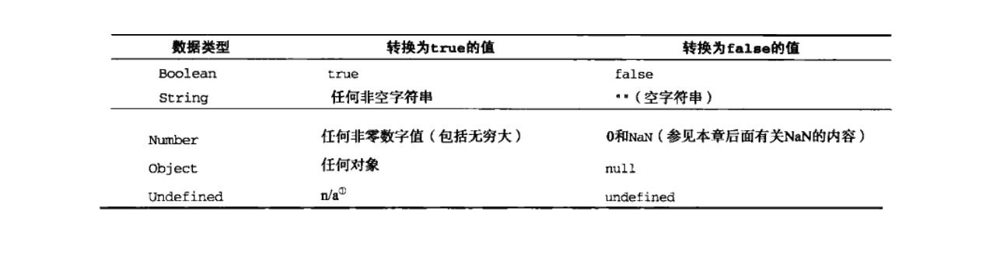

> (n/a)或(N/A),是not applicable的缩写，意思是“不适用”

``` 
var a = "";		
a = Boolean(a);		//空的字符串 false

var a = " ";	
a = Boolean(a);		//不是空的字符串，里面有空格 true

var a = null;		
a = Boolean(a);		//false

var a = undefined;  
a = Boolean(a);	    //false
```

这些转换规则对理解流控制语句（如if语句）自动执行相应的Boolean转换非常重要，请看下面的代码：

~~~javascript
var message = "hello world";
if(message){
    alert("Value is true");
}
~~~

运行这个示例，就会显示一个警告框，因为字符串message被**自动转换**成了对应的Boolean值(true)，由于存在这种自动执行的Boolean转换，因此确切地知道在流控制语句中使用的是什么变量至关重要。错误地使用一个对象而不是一个Boolean值，就有可能彻底改变应用程序的**流程**。

> 2020年7月24日：截止到这里复习完

### Number类型

Number类型应该是ECMAScript中最令人关注的数据类型了，这种类型使用IEEE754格式来表示**整数**和**浮点数值**（浮点数值在某些语言中也被称为**双精度数值**）。为支持各种数值类型，ECMA-262定义了不同的数值字面量格式。

最基本的数值字面量格式是**十进制整数**，十进制整数可以像下面这样直接在代码中输入：

~~~javascript
var intNum = 55；    //整数
~~~

除了以十进制表示外，整数还可以通过八进制（以8为基数）或十六进制（以16为基数）的字面值来表示。其中，八进制字面值的**第一位必须是零**（0），然后是八进制数字序列（0-7），如果字面值中的数值**超出了范围**，那么**前导零将被忽略**，**后面**的数值将被当作**十进制数值**解析。请看下面的例子：

~~~javascript
var octalNunl = 070;	 //八进制的56
var octalNum2 = 079；    //无效的八进制数值——解析为79
var octa1Num3  08;	    //无效的八进制数——解析为8
~~~

八进制**字面量**在**严格模式**下是无效的，会导致支持的JavaScript引擎抛出错误。

十六进制字面值的**前两位**必须是**0x**，后跟**任何十六进制数字**（0-9及A-F），其中，字母A-F**可以大写，也可以小写**。如下面的例子所示：

~~~javascript
var hexNuml = OxA；	//十六进制的10
var hexNum2 = 0x1f；	//十六进制的31
~~~

在进行**算术计算**时，所有以八进制和十六进制表示的数值最终都将被**转换**成**十进制数值**。

> 鉴于JavaScript中保存数值的方式，可以保存正零（+0）和负零（-0）。正零和负零被认为相等，但为了读者更好地理解上下文，这里特别做此说明。

``` 
在JS中:
如果需要表示16进制的数字，则需要以0x开头
如果需要表示8进制的数字，则需要以0开头
如果需要表示2进制的数字，则需要以0b开头（但是不是所有的浏览器都支持）
```

#### 浮点数值

所谓浮点数值，就是该数值中**必须包含一个小数点**，并且**小数点后面**必须**至少有一位数字**。虽然**小数点前面可以没有整数**，但我们**不推荐**这种做法。以下是浮点数值的几个例子：

~~~javascript
var floatNuml = 1.1；
var floatNum2 = 0.1；
var floatNum3 =  .1；  //有效，但不推荐
~~~

由于保存浮点数值需要的**内存空间**是保存整数值的**两倍**，因此ECMAScript会**不失时机**地将**浮点数值转换为整数值**。显然，如果小数点后面没有跟任何数字，那么这个数值就可以作为整数值来保存。同样地，如果浮点数值本身表示的就是一个整数（如1.0），那么该值也会被转换为整数，如下面的例子所示：

~~~javascript
var floatNuml = 1. ;	//小数点后面没有數字——解析为1
var floatNum2 = 10.0;	//整数——解析为10
~~~

对于极大或极小的数值，可以用**e表示法**（即科学计数法）表示的浮点数值表示。用e表示法表示的数值等于**e前面的数值乘以10的指数次幂**。ECMAScript中e表示法的格式也是如此，即前面是一个数值（可以是整数也可以是浮点数），中间是一个**大写或小写**的字母E，后面是10的幂中的指数，该幂值将用来与前面的数相乘。下面是一个使用e表示法表示数值的例子：

~~~javascript
var floatNum = 3.125e7；		//等于31250000
~~~

在这个例子中，使用e表示法表示的变量floatNum的形式虽然简洁，但它的实际值则是31250000。在此，e表示法的实际含义就是"3.125乘以10^7^"。

也可以使用e表示法表示极小的数值，如0.00000000000000003数值可以使用更**简洁**的3e-17表示。在默认情况下，ECMASctipt会将那些小数点后面带有6个零以上的浮点数值转换为以e表示法表示的数值（例如，0.0000003被转换成3e-7）。

浮点数值的最高精度是**17位小数**，但在进行算术计算时其**精确度远远不如整数**。例如：**0.1+0.2**的结果不是0.3，而是<strong style="color:red">0.30000000000000004</strong>。这个小小的舍入误差会导致无法测试特定的浮点数值。

例如：

~~~javascript
if(a + b ==0.3){		//不要做这样的测试
    alert('you got 0.3');
}
~~~

在这个例子中，我们测试的是两个数的和是不是等于0.3，如果这两个数是0.05和0.25，或者是0.15和0.15都不会有问题。而如前所述，如果这两个数是0.1和0.2，那么测试将无法通过。因此，永远不要测试某个特定的浮点数值。

> 关于浮点数值计算会产生舍入误差的问题，有一点需要明确：这是使用基于IEEE754数值的浮点计算的通病，ECMAScript并非独此一家；其他使用相同数值格式的语言也存在这个问题。

> 如果使用JS进行浮点运算,可能得到一个不精确的结果
>
> 十进制里不能精确表示1/3,   二进制里不能精确表示1/10  
>
> 所有的语言都有这个问题,很多语言可以解决,但是JS很难解决
> 
>所以千万不要使用JS进行对精确度要求比较高的运算(比如算钱）

[为什么0.1+0.2不等于0.3?](<https://juejin.im/post/5b90e00e6fb9a05cf9080dff>)

#### 数值范围

由于**内存的限制**，ECMAScript并**不能保存世界上所有的数值**。ECMAScript能够表示的**最小的数值**保存在**Number.MIN_VALUE**中——在大多数浏览器中，这个值是**5e-324**(但是**这个最小的数还是比0大？？？**)；

ECMAScript能够表示的最大的数值保存在**Number.MAX_VALUE**中——在大多数浏览器中，这个值是**1.7976931348623157e+308**。

如果某次计算的结果得到了一个**超出JavaScript数值范围**的值，那么这个数值将被**自动转换成**特殊的**Infinity值**(无穷大，第一个单词大写)。

具体来说，如果这个数值是负数，则会转换为-Infinity(负无穷)，如果这个数值是正数，则会被转换成Infinity（正无穷）

如上所述，如果某次计算返回了正或负的Infinity值，那么该值就**无法继续参与下一次的运算**，因为**Infinity不是能够参与运算的数值**。要想确定一个数值是不是有穷的（换句话说，是不是位于最小和最大的数值之间），可以使用**isFinite()函数**。这个函数在参数位于最小与最大数值之间时会返回true,如下面的例子所示：

```javascript
var result =  Number.MAX_VALUE + Number.MAX_VALUE ;
alert(isFinite(result));	//false	
```

尽管在计算中很少出现某些值超出表示范围的情况，但在执行极小或极大数值的计算时，检测监控这些值是可能的，也是必需的。

> 访问Number.NEGATIVE_INFINITY和Number.POSITIVE_INPINITY也可以得到负和正Infinity的值。可以想见，这两个属性中分别保存着-Infinity和Infinity

> 虽然JavaScript能保存的最小的数是5e-324（比0大），但是一个负数，比如-5，利用isFinite()函数，发现它也是在最小与最大值之间的？？？。

```javascript
var a = -5;
alert(isFinite(a));		    //true
```

#### NaN

NaN,即**非数值（Not a Number）**是一个**特殊的数值**（虽然特殊，但**终归还是数值,属于Number类型**），这个数值用于表示一个**本来要返回数值的操作数未返回数值的情况**（这样就不会抛出错误了）。例如，在其他编程语言中，任何数值除以0都会导致错误，从而停止代码执行。但在ECMAScript中，**任何数值除以0会返回NaN,因此不影响其他代码的执行**。

NaN本身有两个非同寻常的特点。

首先,**任何涉及NaN的操作**（例如NaN/10）**都会返回NaN**,这个特点在多步计算中有可能导致问题。

其次,**NaN与任何值都不相等**，<strong style="color:red">包括NaN本身</strong>。

> NaN是一个生而孤独的人，独来独往，甚至和自己都无法相容

``` 
alert(NaN == NaN);		//false
```

针对NaN的这两个特点，ECMAScript定义了**isNaN()函数**。这个函数接受一个**参数**，**该参数可以是任何类型**，而函数会帮我们确定这个参数**是否“不是数值"**，**isNaN()在接收到一个值之后，会尝试将这个值转换为数值**。某些不是数值的值会直接转换为数值，例如字符串"10"或Boolean值。而**任何不能被转换为数值的值都会导致这个函数返回true**。请看下面的例子：

~~~javascript
alert(isNaN(NaN));		//true
alert(isNaN(10));		//false（10是一个数值）
alert(isNaN("10"));		//false（可以被转换成敷值10）
alert(isNaN("blue"));	//true（不能转换成数值）
alert(isNaN(true));		//false（可以被转换成数值1）
~~~

这个例子测试了5个不同的值。测试的第一个值是NaN本身，结果当然会返回true。然后分别测试了数值10和字符串"10"，结果这两个测试都返回了Ealse，因为前者本身就是数值，而后者可以被转换成数值。但是，字符申"blue"不能被转换成数值，因此函数返回了true。由于Boolean值true可以转换成数值1，因此函数返回false。

> 尽管有点儿不可思议，但**isNaN()确实也适用于对象**。在基于对象调用isNaN()函数时，会首先调用对象的**valueOf()**方法，然后确定该方法返回的值是否可以转换为数值。如果不能，则基于这个返回值再调用**tostring()方法**，再测试返回值。而这个过程也是ECMAScript中内置函数和操作符的一般执行流程，更详细的内容请参见3.5节

#### 数值转换

有三个函数可以把非数值转换为数值：**Number()、ParseInt()和ParseFloat()**。

第一个函数，即**转型函数`Number()`可以用于任何数据类型**，而**另两个函数**则专门用于**把字符串转换为数值**。

这三个函数**对于同样的输入会返回不同的结果**。

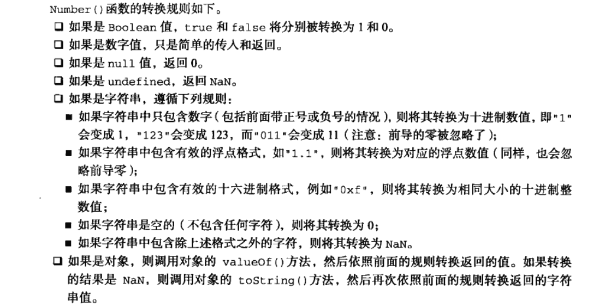

根据这么多的规则使用Number()把各种数据类型转换为数值确实有点复杂。下面还是给出几个具体的例子吧。

```javascript
var num1 = Number("Hello world!");  //NaN
var num2 = Number("");              //0
var num3 = Number("000011");        //11
var num4 = Number(true);            //1
```
首先，字符串"Hello wor1d"会被转换为NaN，因为其中不包含任何有意义的数字值。空字符串会被转换为0。字符串"00001"被转换为11，因为忽略了其前导的零。最后，true值被转换为1。

> 一元加操作符（3.5.1节将介绍）的操作与Number()函数相同。

由于Number()函数在转换字符串时比较复杂而且不够合理，因此在**处理整数**的时候更常用的是**parseInt()函数**。**parseInt()函数**在转换字符串时，**更多的是看其是否符合数值模式**。它会**忽略**字符串前面的**空格**，直至找到第一个非空格字符。如果第一个字符不是数字字符或者负号，parseInt()就会返问NaN;也就是说，用parseInt()转换**空字符串**会返回**NaN**（**Number()对空字符返回0**）。如果第一个字符是数字字符，parseInt()会继续解析第二个字符，直到解析完所有后续字符或者遇到了一个非数字字符。例如，"1234blue"会被转换为1234，因为"blue"会被完全忽略。类似地，**"22.5"会被转换为22，因为小数点并不是有效的数字字符。**

如果字符串中的第一个字符是**数字字符**，parseInt()也能够识别出各种**整数格式**（即前面讨论的十进制、八进制和十六进制数），也就是说，如果字符串以"0x"开头且后跟数字字符，就会将其当作一个十六进制整数；如果字符申以"0"开头且后跟数字字符，则会将其当作一个八进制数来解析。

为了更好地理解parseInt（）函数的转换规则，下面给出一些例子：

``` javascript
var num1 = parseInt("1234blue");    //1234
var num2 = parseInt("");            //NaN
var num3 = parseInt("0xA");         //10 
var num4 = parseInt(22.5);          //22
var num5 = parseInt("070");         //像"070"这种字符串,有些浏览器当8进制解析,有些当10进制解析
var num5 = parseInt("70");          //70 
var num6 = parseInt("0xf");         //15 
```

在使用parseInt()解析像**八进制**字面量的字符串时，**ECMAScript 3和5存在分歧**。例如：

~~~javascript
//ECMAScript 3认为是56（八进制），ECMAScript 5认为是0（十进制）
var num = parseInt（"070"）;
~~~

在ECMAScript 3 JavaScript引擎中，"070"被当成八进制字面量，因此转换后的值是十进制的56。

而**在ECMAScript 5 Javascript引中，parseInt()已经不具有解析八进制值的能力，因此前导的零会被认为无效，从而将这个值当成“0"，结果就得到十进制的0**，在ECMAScript 5中，即使是在**严格模式**下也会如此。

为了消除在使用parseInt()函数时可能导致的上述困惑，可以为这个函数**提供第二个参数**：转换时使用的基数（即多少进制）。如果知道要解析的值是十六进制格式的字符串，那么指定基数16作为第二个参数，可以保证得到正确的结果，例如：

~~~javascript
var num = parselnt ("OxAF",16);		//175
~~~

实际上，如果指定了16作为第二个参数，字符串可以不带前面的"0x"，如下所示：

~~~javascript
var numl = parseInt ("AP", 16);		//175
var num2 = parseInt ("AF");			//NaN
~~~

这个例子中的第一个转换成功了，而第二个则失败了。差别在于第一个转换传入了基数，明确告诉parseInt()要解析一个十六进制格式的字符串；而第二个转换发现第一个字符不是数字字符，因此就自动终止了。

指定基数会影响到转换的输出结果。例如：

~~~javascript
var numl = parseInt（"10"，2）;	//2（接二进制解析）
var nur2 = parselnt（"10"，8）;	//8（按八进制解析）
var num3 = parseint（"10"，10）;	//10（按十进制解析）
var num4 = parselnt（"10"，16）;	//16（接十六进制解析）
~~~

不指定基数意味着让`parseInt()`决定如何解析输入的字符串，因此为了避免错误的解析，我们建议无论在什么情况下都明确指定基数。

> 多数情况下，我们要解析的都是十进制数值，因此始终将10作为第二个参数是非常必要的。

与parseInt()函数类似，`parseFloat()`也是从第一个字符（位置0）开始解析每个字符。而且也是一直解析到字符申末尾，或者解析到遇见一个无效的浮点数字字符为止。也就是说，**字符串中的第一个小数点是有效的，而第二个小数点就是无效的了**，因此它后面的字符串将被忽略。举例来说，"22.34.5"会被转换为22.34。

除了第一个小数点有效之外，parseFloat()与parseInt()的第二个区别在于它始终都会忽略前导的零。parseFloat()可以识别前面讨论过的所有浮点数值格式，也包括十进制整数格式。但十六进制格式的字符串则始终会被转换成0。由于**parseFloat()只解析十进制值，因此它没有用第二个参数指定基数的用法**。最后还要注意一点：**如果字符串包含的是一个可解析为整数的数（没有小数点，或者小数点后都是零），parseFloat()会返问整数。**以下是使用parseFloat()转换数值的几个典型示例。

~~~javascript
var numl = parseFloat（"1234blue"）;		//1234（整数）
var num2 = parseFloat（"OxA"）;			//0
var num3 = parseFloat（"22.5"）;			//22.5
var nun4  parseFloat（"22.34.5"）;		//22.34
var num5 = parseFloat（"0908.5"）;		//908.5
var num6 = parseFloat（"3.125e7"）;		//31250000
~~~


	总结复习：
	
	将其他的数据类型转换为Number（没有toNumber方法）
	  转换方式1：
		使用Number()函数--有局限，字符串里面稍微有一些非法的内容，都给你转换成NaN
			-字符串--->数字
	            1.如果是纯数字字符串，则直接将其转换为数字
	 			2.如果字符串中有非数字内容，则转换为NaN
				3.如果字符串是一个空串或者是一个全是空格的字符，则转换为0
	
			-布尔----->数字
	 			true转成1
	 			false转成0
	 
	  		-Null----->数字
	  			结果就是0
	 
	  		-undefined ---->数字
	  			结果是NaN 
	  
	 	转换方式2：
	  	  这种方式专门用来对付字符串--更加智能	  
	  		-parseInt() -把一个字符串转换成一个整数      parse:解析   Int:取整
	  		-parseFloat() 把一个字符串转换成一个浮点数
> 如果对非String使用parseInt()或parseFloat(),它会先将其转换为String,然后再操作
>
> parseFloat()的作用和parseInt（）类似，不同的是它可以**获得有效的小数**

> 2020年7月27日：截止到这里复习完

### String类型

String类型用于表示**由零或多个16位Unicode字符组成的字符序列，即字符串**。字符串可以由**双引号(")或单引号(')表示**，因此下面两种字符串的写法都是有效的：

```
var firstName = "Nicholas";
var lastName = 'Zakas';
```

与**PHP中的双引号和单引号会影响对字符串的解释方式不同**，ECMAScript中的这两种语法形式没有什么区别。用双引号表示的字符串和用单引号表示的字符串**完全相同**。不过，**以双引号开头的字符串也必须以双引号结尾**，而**以单引号开头的字符串也必须以单引号结尾**。例如，下面这种字符串表示法会导致语法错误：

```javascript
var firstName = 'Nicholas";	   //语法错误：左右引号必须匹配
```

> 引号不能嵌套，双引号里面不能放双引号（但能放单引号），单引号里面不能放单引号（但能放双引号）

**1.字符字面量**

String数据类型包含一些特殊的字符字面量，也叫**转义序列**，用于表示**非打印字符**（没办法打印出来的字符），或者**具有其他用途**的字符。这些字符字面量如下表所示：

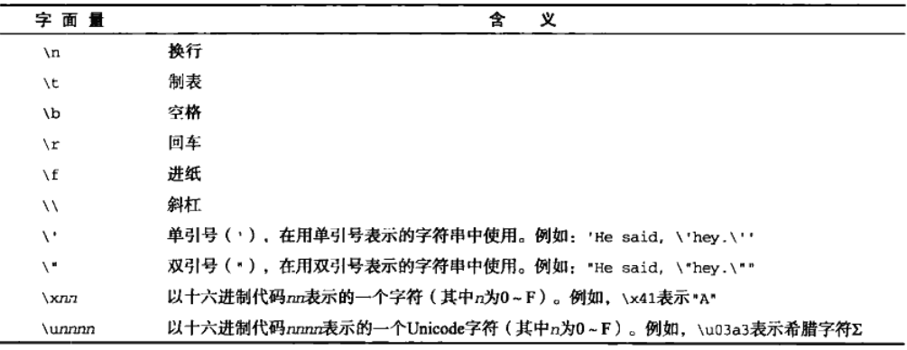

这些字符字面量可以出现在字符串中的任意位置，而且也将被作为一个字符来解析，如下面的例子所示：

``` javascript
var text = "This is the letter sigma: \uo3a3.";
```

这个例子中的变量text有28个字符，其中**6个字符长的转义序列表示一个字符**。

任何**字符串的长度**都可以通过访问其**length属性**获得，例如：

```
alert(text.length);		//输出28
```

这个属性返回的字符数包括16位字符的数目。如果**字符串中包含双字节字符**，那么**length属性可能不会精确地返回字符串中的字符数目。**

**2.字符串的特点**

ECMAScript中的字符串是不可变的，也就是说，**字符串一旦创建，它们的值就不能改变**。要改变某个变量保存的字符串，首先要**销毁**原来的字符串，然后再用另一个包含新值的字符串填充该变量，例如：

```javascript
var lang = "Java";
lang = lang + "Script";
```

以上示例中的变量lang开始时包含字符串"Java"。而第二行代码把lang的值重新定义为"Java"与"Script"的组合，即"JavaScript"。实现这个操作的过程如下：**首先创建一个能容下10个字符的新字符串，然后在这个字符串中填充"Java"与"Script"，最后一步是销毁原来的字符串"Java"和字符串"Script"，因为这两个字符串已经没用了。**这个过程是在后台发生的，而这也是在某些旧版本的浏览器（例如版本低于1.0的Firefox、IE6等）中拼接字符串速度很慢的原因所在。但这些浏览器后来的版本已经解决了这个低效率问题。

#### 补充知识：JS中的内存

JavaScript是在创建变量（对象，字符串等）时自动进行了分配内存，并且在不使用它们时“自动”释放。 释放的过程称为**垃圾回收**。这个“自动”是混乱的根源，并让JavaScript（和其他高级语言）开发者错误的感觉他们可以不关心内存管理。 

##### 内存生命周期

不管什么程序语言，内存生命周期基本是一致的：   

~~~javascript
1. 分配你所需要的内存
2. 使用分配到的内存（读、写）
3. 不需要时将其释放/归还
~~~

所有语言第二部分都是明确的。第一和第三部分在底层语言中是明确的，但在像JavaScript这些高级语言中，大部分都是隐含的。

为了不让程序员费心分配内存，JavaScript 在定义变量时就完成了内存分配。

##### 内存模型

JS内存空间分为**栈(stack)**、**堆(heap)**、**池(一般也会归类为栈中)**。 其中**栈**存放变量，**堆**存放复杂对象，**池**存放常量。

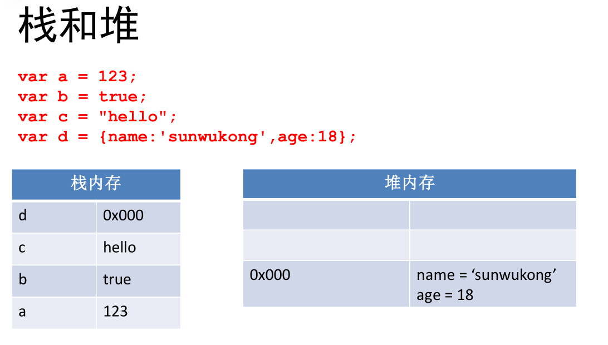

##### 基础数据类型与栈内存

JavaScript中的<strong style="color:red">基础数据类型</strong>，这些值都有固定的大小，往往都保存在栈内存中（闭包除外），由系统自动分配存储空间。我们可以直接操作保存在栈内存空间的值，因此基础数据类型都是按值访问 。

数据在栈内存中的存储与使用方式类似于数据结构中的堆栈数据结构，遵循后进先出的原则。

(基础数据类型： `Number` `String` `Null` `Undefined` `Boolean`)    (ES5中)

##### 引用数据类型与堆内存

与其他语言不同，JS的引用数据类型，比如数组Array，它们值的大小是不固定的。引用数据类型的值是保存在堆内存中的对象。

JavaScript不允许直接访问堆内存中的位置，因此我们不能直接操作对象的堆内存空间。在操作对象时，实际上是在操作对象的<strong style="color:red">引用</strong>而不是实际的对象。因此，引用类型的值都是按引用访问的。

这里的引用，我们可以粗浅地理解为保存在栈内存中的一个地址，该地址与堆内存的实际值相关联。

堆存取数据的方式，则与书架与书非常相似。 书虽然也有序的存放在书架上，但是我们只要知道书的名字，我们就可以很方便的取出我们想要的书，而不用像从乒乓球盒子里取乒乓一样，非得将上面的所有乒乓球拿出来才能取到中间的某一个乒乓球。

为了更好的搞懂栈内存与堆内存，我们可以结合以下例子与图解进行理解。

```javascript
var a1 = 0; // 栈 
var a2 = 'this is string'; // 栈
var a3 = null; // 栈 
var b = { m: 20 }; // 变量b存在于栈中，{m: 20} 作为对象存在于堆内存中
var c = [1, 2, 3]; // 变量c存在于栈中，[1, 2, 3] 作为对象存在于堆内存中
```

| 变量名 |     具体值     |
| :----: | :------------: |
|   a1   |       0        |
|   a2   | this is string |
|   a3   |      null      |
|   b    |   0x0012ff7c   |
|   c    |   0x0012ff7d   |

因此当我们要访问堆内存中的引用数据类型时，实际上我们首先是从栈中获取了该对象的地址引用（或者地址指针），然后再从堆内存中取得我们需要的数据。

**3.转换为字符串(toString方法)**

要把**一个值转换为一个字符串有两种方式**。第一种是使用几乎每个值都有的<strong style="color:red">toString()方法</strong>（第5章将讨论这个方法的特点）。这个方法唯一要做的就是**返回相应值的字符串表现**。来看下面的例子：

``` javascript
 var age = 11;
 var ageAsString = age.toString();    //字符串"11"
 var found = true;
 var foundAsString = found.toString(); //字符串"true"
```

数值、布尔值、对象和字符串值（没错，**每个字符串也都有一个toString()方法，该方法返回字符串的一个副本**）都有toString()方法。

但**null和undefined值没有这个方法**。（如果调用他们的方法，会报错）

多数情况下，调用toString()方法**不必传递参数**。但是，在调用**数值**的toString()方法时，可以**传递一个参数**：**输出数值的基数**。默认情况下，toString()方法以十进制格式返回数值的字符串表示。而**通过传递基数，toString()可以输出以二进制、八进制、十六进制、乃至其他任意有效进制格式表示的字符串值**。下面给出几个例子：

```javascript
var num = 10;
alert(num.toString());       //"10"
alert(num.toString(2));      //"1010"
alert(num.toString(8));      //"12"
alert(num.toString(10));     //"10"
alert(num.toString(16));     //"a"
```

通过这个例子可以看出，**通过指定基数，toString()方法会改变输出的值**。而数值10根据基数的不同，可以在输出时被转换为不同的数值格式。注意，**默认的（没有参数的）输出值与指定基数10时的输出值相同**。

在**不知道要转换的值是不是null或undefined的情况下**，还可以通过<strong style="color:red">转型函数String()</strong>(注意这个s是大写）,**这个函数能够将任何类型的值转换为字符串(包含null和undefined，这2个用toString()方法搞不定，用String函数可以搞的定)**。**String()函数遵循下列转换规则**：

* **如果值有toString()方法，则调用该方法（没有参数）并返回相应的结果**

* **如果值是null,则返回"null"**;

* **如果值是undefined,则返回“undefined”**；

下面再看几个例子：

```javascript
var value1 = 10;
var value2 = true;
var value3 = null;
var value4;
        
alert(String(value1));     //"10"
alert(String(value2));     //"true"
alert(String(value3));     //"null"
alert(String(value4));     //"undefined"
```

这里先后转换了4个值：数值、布尔值、null和undefined。数值和布尔值的转换结果与调用函数toString()方法得到的结果相同。**因为null和undefined没有toString()方法，所以string()函数就返回了这两个值的字面量**。

  > 要**把某个值转换为字符串**，可以**使用加号操作符（3.5节讨论）把它与一个字符串("")加在一起**。这样也可以将其转换为字符串了。

```
将其他的数据类型转换为String
	方式1：
		-调用被转换类型的toString()方法
		-该方法不会影响到原变量，它会将转换的结果返回
		-但是注意：null和undefined这两个值没有toString方法
		 如果调用他们的方法，会报错
			 			 
	方法2：
	    -调用String()函数，并将被转换的数据作为参数传递给函数    	    
		-使用String()函数做强制类型转换：
			对于Number和Boolean实际上就是调用的toString方法
			对于null和undefined,就不会调用toString方法
				它会将null直接转换为"null"
			 	它会将undefined直接转换为"undefined"
```

> 函数与方法的区别：
>
> 函数不等于方法，函数没有点，方法有点!!!
>
> **函数（function）**是可以执行的javascript代码块，由javascript程序定义或javascript实现预定义。函数可以带有实际参数或者形式参数，用于指定这个函数执行计算要使用的一个或多个值，而且还可以返回值，以表示计算的结果。
>
> **方法（method）**是通过对象调用的javascript函数。也就是说，方法也是函数，只是比较特殊的函数。
>
> 假设有一个函数是fn，一个对象是obj，那么就可以定义一个method：
>
> ``` 
> 　obj.method = fn;
> 
> 　obj.method();    //定义之后的调用
> ```
>
> 当将函数和对象和写在一起时，函数（function）就变成了方法（method）。 
>
> 方法是作为对象的属性的函数。
>
> 他们大致是一样的，只不过方法（method）通常在函数内部，这就意味着方法可以操作函数（function）内部的数据，这是其一；另外，从传参的角度来讲，方法（method）相比函数（function）显式传递来说，通常是隐式传参，这是其二。
>
> 函数和方法是同一种东西。面向对象叫“方法”，面相过程叫“函数”。C语言叫函数，Java叫方法。也就是习惯问题，你讲哪个，对方都能听懂。

> 2020年7月27日：截止到这里复习完

### Object类型(着重看这个)

ECMAScript中的**对象**其实就是**一组数据和功能的集合。**对象可以通过执行**new操作符**后跟**要创建的对象类型的名称**来创建。而创建Object类型的**实例**并**为其添加属性和（或）方法**，就可以**创建自定义对象**，如下所示：

```javascript
var o = new Object();
```

这个语法与Java中创建对象的语法相似；但在ECMAScript中，如果不给<strong style="color:red">构造函数</strong>**传递参数**，则可以**省略后面的那一对圆括号**。也就是说，在像前面这个示例一样**不传递参数的情况下**，完全可以省略那对圆括号(但这不是推荐的做法)：

> 构造函数的概念一直不懂

```JavaScript
var o = new Object；	//有效，但不推荐省略圆括号
```

**仅仅创建Object的实例并没有什么用处**，但关键是要理解一个重要的思想：即在ECMAScript中,（就像Java中的java.lang.object对象一样）**Object类型是所有它的实例的基础**。换句话说，**Object类型所具有的任何属性和方法也同样存在于更具体的对象中。**

Object的每个**实例**都具有下列**属性和方法**。(不熟)

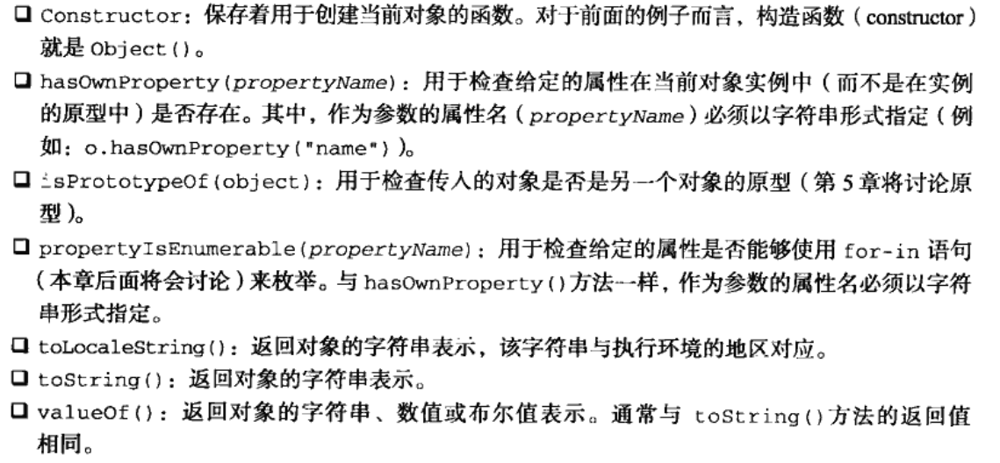

由于在ECMAScript中**Object是所有对象的基础**，因此**所有对象都具有这些基本的属性和方法**。第5章和第6章将详细介绍object与其他对象的关系。

> 从技术角度讲，ECMA-262中对象的行为**不一定适用于JavaScript中的其他对象**。浏览器环境中的对象，比如BOM和DOM中的对象，都属于**宿主对象**，因为它们是由宿主实现提供和定义的。**ECMA-262不负责定义宿主对象**，因此宿主对象**可能会也可能不会继承Object。**

#### 补充知识：构造函数

> 典型的面向对象编程语言（比如C++和Java），存在“类”（class）这个概念。**所谓“类”就是对象的模板**，对象就是“类”的实例。但是，**在JavaScript语言的对象体系，不是基于“类”的，而是基于构造函数（constructor）和原型链（prototype）**。

```
虽然ES6里引入了「类」这个概念，但是实际上 ES6的类只是 ES5的语法糖，本质上还是一个「构造函数」。
```

> 前面说过，“对象”是单个实物的抽象。通常需要一个模板，表示某一类实物的共同特征，然后“对象”根据这个模板生成。
>
> JS语言中**使用构造函数（constructor）作为对象的模板**。所谓构造函数，就是**提供一个生成对象的模板，并描述对象的基本结构的函数。一个构造函数，可以生成多个对象，每个对象都有相同的结构**。

[JavaScript 中的构造函数](<https://juejin.im/entry/584a1c98ac502e006c5d63b8>)

## 操作符

ECMA-262描述了**一组用于操作数据值的操作符**，包括**算数操作符（如加号和减号）、位操作符、关系操作符和相等操作符**。ECMAScript操作符的与众不同之处在于，它们能够**适用于很多值**，例如字符串、数字值、布尔值，**甚至对象**。不过，在应用于对象时，相应的操作符通常都会**调用对象的valueOf()和（或）toString()方法，以便取得可以操作的值。**

> valueOf() 方法可返回 String 对象的原始值。
>
> 原始值是由从 String 对象下来的所有对象继承的。
>
> valueOf() 方法通常由 JavaScript 在后台自动进行调用，而不是显式地处于代码中。
>
> 当调用该方法的对象不是 String 时抛出 TypeError 异常。
>
> [简单说JavaScript中的toString()与valueOf()方法](<https://segmentfault.com/a/1190000011853909>)

### 一元操作符

只能**操作一个值的操作符叫做一元操作符**，一元操作符是ECMAScript中最简单的操作符。

**1.递增和递减操作符**

递增和递减操作符直接借鉴自C，而且各有两个版本：**前置型和后置型**。顾名思义，前置型应该位于要操作的变量之前，而后置型则应该位于要操作的变量之后。因此，在使用前置递增操作符给一个数值加1时，要把两个加号（++）放在这个数值变量前面，如下所示：

~~~javascript
var age = 29;
++age;
~~~

在这个例子中，前置递增操作符把age的值变成了30（为29加上了1），实际上，执行这个前置递增操作与执行以下操作的**效果相同**：

~~~javascript
var age = 29;
age = age + 1;
~~~

执行前置递减操作的方法也类似，结果会从一个数值中减去1，使用前置递减操作符时，要把两个减号（--）放在相应变量的前面，如下所示：

~~~javascript
var age =29;
--age;
~~~

这样，age变量的值就减少为28（从29中减去了1）。

执行**前置**递增和递减操作时，**变量的值**都是在**语句被求值以前改变**的。（在计算机科学领域，这种情况通常被称作**副效应**。）请看下面这个例子。

~~~javascript
var age  29;
var anotherAge = --age + 2；

alert（age）;			//输出28
alert（anotherAge）;	//输出30
~~~

这个例子中变量anotherAge的初始值等于变量age的值前置递减之后加20由于先执行了减法操作，age的值变成了28，所以再加上2的结果就是30。

由于前置递增和递减操作与执行语句的优先级相等，因此整个语句会**从左至右被求值**。再看一个例子：

~~~javascript
var numl =2;
var num2 = 20;
var num3 = --numl + num2;	//等于21
var num4 = num1 + num2;		//等于21
~~~

在这里，num3之所以等于21是因为num1先减去了1才与num2相加。而变量num4也等于21是因为相应的加法操作使用了numl减去1之后的值。

**后置型递增和递减操作符的语法不变**（仍然分别是++和--），只不过要**放在变量的后面而不是前面**。后置递增和递减与前置递增和递减有一个**非常重要的区别**，即**递增和递减操作是在包含它们的语句被求值之后才执行的**。这个区别在某些情况下不是什么问题，例如：

~~~javascript
var age = 29;
age++;
~~~

把递增操作符放在变量后面并不会改变语句的结果，因为**递增**是这条语句的**唯一操作**。但是，当语句中还**包含其他操作**时，上述区别就会非常明显了。请看下面的例子：

~~~javascript
var numl = 2;
var num2 = 20;
var num3 = numl-- + num2;		//等于22
var num4 = numl + num2；		   //等于21
~~~

这里仅仅将前置递减改成了后置递减，就立即可以看到差别。

在**前面**使用前置递减的例子中，**num3和num4最后都等于21**。而在**这个例子**中，**num3等于22，num4等于21**。差别的**根源**在于，**这里**在**计算num3时**使用了**numl的原始值（2）**完成了加法计算，而**num4**则使用了**递减后的值（1）**。

所有这4个操作符**对任何值都适用**，也就是它们不仅适用于整数，还可以用于字符串、布尔值、浮点数值和对象。在应用于不同的值时，递减和递减操作符遵循下列规则。

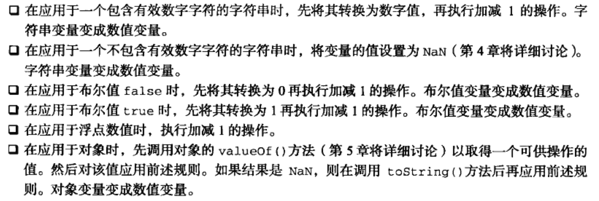

以下示例展示了上面的一些规则：

~~~javascript
var sl="2";
var s2="Z";
var b= false;
var f= 1.1;
var o= {
   valueOf：function(){
   		return - 1;
	} 
};

s1++;	//值变成数值3
s2++;	//值变成NaN
b++;	//值変成数值
f--;	//值变成0.100000000000009（由于浮点舍入错误所致）
o--;	//值变成数值-2
~~~

> 2020年7月28日：截止到上面复习完

**2.一元加和减运算符**

绝大多数开发人员对一元加和减操作符都不会陌生，而且这两个ECMAScript操作符的作用与数学书上讲的完全一样。**一元加操作符以一个加号（+）表示，放在数值前面，对数值不会产生任何影响**，如下面的例子所示：

~~~javascript
var num = 25;
num = +num;		//仍然是25；
~~~

不过，在对**非数值**应用一元加操作符时，该**操作符**会像**Number()转型函数**一样**对这个值执行转换**。换句话说，**布尔值**false和true将被转换为0和1，**字符串值**会被按照一组特殊的规则进行解析，而**对象**是先**调用它们的valueOf()和（或）toString()方法**，**再转换**得到的值。

下面的例子展示了对不同数据类型应用一元加操作符的结果：

~~~javascript
var sl="01";
var s2="1.1";
var s3="z";
var b= false;
var f= 1.1;
var o= {
   valueOf：function(){
   		return - 1;
	} 
};

sl = +s1;	//值变成数值1
s2 = +s2;	//值变成数值1.1
s3 = +s3;	//值变成NaN
b = +b;		//值变成數值0
f= +f;		//值未変，仍然是1.1
о= +o；	   //值変成數值-1
~~~

~~~javascript
var result = 1 + "2" + 3   //123
var result = 1 + +"2" + 3  //6  在字符串2前面加一个正号会将字符串2转换为数字2
~~~

一元减操作符主要用于表示负数，例如将1转换成-1。下面的例子演示了这个简单的转换过程：

~~~javascript
var num = 25；
nun = -num;	//变成了-25
~~~

在将一元减操作符应用于数值时，该值会变成负数（如上面的例子所示）。而当应用于**非数值**时，一元减操作符遵循与一元加操作符相同的**规则**，最后再将得到的数值转换为负数，如下面的例子所示：

~~~javascript
var sl="01";
var s2="1.1";
var s3="z";
var b= false;
var f= 1.1;
var o= {
   valueOf：function(){
   		return - 1;
	} 
};

sl = -s1;	//值变成数值-1
s2 = -s2;	//值变成数值-1.1
s3 = -s3;	//值变成NaN
b = -b;		//值变成數值0
f= -f;		//值成了-1.1
о= -o；	   //值変成數值1
~~~

一元加和减操作符主要用于**基本的算术运算**，**也可以**像前面示例所展示的一样用于**转换数据类型**。

> 2020年7月28日，截止到这里复习完

### 位操作符(没复习)

[ECMAScript 位运算符](<https://www.w3school.com.cn/js/pro_js_operators_bitwise.asp>)

[表达式和操作符](<https://developer.mozilla.org/zh-CN/docs/Web/JavaScript/Guide/Expressions_and_Operators>)

[为什么不要在 JavaScript 中使用位操作符？](<https://jerryzou.com/posts/do-you-really-want-use-bit-operators-in-JavaScript/>)

(这个位操作符我不熟，也不知道主要是干什么的。就不节选了，本文内容在P39-P44页)

### 布尔操作符

在一门语言中，布尔操作符的重要性堪比相等操作符。如果没有测试两个值关系的能力，那么诸如if...else和循环之类的语句就不会有用武之地了。布尔操作符一共有3个：非（NOT、与（AND）、和或（OR）。

#### 逻辑非

逻辑非操作符由一个叹号(!)表示，可以应用于ECMAScript中的任意值。无论这个值是什么数据类型，这个操作符都会返回一个布尔值。逻辑非操作符首先会将它的操作数转换为一个布尔值，然后再将其取反。也就是说，逻辑非操作符遵循下列规则：

/32.png)

```
！ 非
 	-可以对一个值进行非运算
	-所谓非运算就是值对一个布尔值进行取反操作
	true变false    false 变 true
	-如果对一个值进行两次取反，它不会变化
	-如果对非布尔值进行运算，则会将其转换成布尔值，然后再对其进行取反
	所以我们可以利用该特点，来将一个其他的数据类型转换为布尔值
	可以为一个任意数据类型取两次反，来将其转换为布尔值
	原理和Boolean()函数一样
```

#### 逻辑与

逻辑与操作符由两个和号(&&)表示，有两个操作数，如下面的例子所示：

```javascript
var result = true && false
```

/33.png)

```
 &&  与
	 -&&可以对符号两侧的值进行与运算并返回结果
	 -运算规则
	 	-两个值中只要有一个值为false就返回false
			 只有两个值都为true时才返回true
			 
		-JS中的"与"属于短路的与,
			 如果第一个值为false,则不会看第二个值
```

```javascript
//与运算,如果两个值都为true,则返回后面的(后面的！！！！！！)
			var  result = 1 && 2;  //2
			var	 result = 2 && 1;  //1

//与运算,如果两个值中有false,则返回靠前的false
			//false && true	 
			var	 result = 0 && 2;   //0
			var	 result = 2 && 0;   //0
				 
			//false && false
			var	 result = NaN && 0;   //NaN
			var	 result = 0 && NaN;   //0
```


#### 逻辑或

逻辑或操作符由两个竖线符号(||)表示，有两个操作符，如下面的例子所示：

```javascript
var result = true || false
```

/34.png)

```
||  或
	-||可以对符号两侧的值进行或运算并返回结果
	-运算规则：
		-两个值中只要有一个true,就返回true
			 如果两个值都为false,才返回false
		-JS中的"或"属于短路的或	
			 如果第一个值为true,则不会看第二个值
```

```javascript
//true || true
				//如果第一个值为true,则直接返回第一个值
			    result = 5 || 2;   		//5
				
				//如果第一个值是false,则直接返回 第二个值
				result = NaN || 1;     // 1
				result = NaN || 0;     // 0
				
				result = "" || "hello";  //hello  ""是false
				result = -1 ||0;      //-1
```

### 乘性操作符

ECMAScript定义了3个乘性操作符：乘法、除法和求模。这些操作符与Java、C或者Perl中的相应操作符用途类似，只不过在操作数为非数值的情况下会执行自动的类型转换。如果参与乘法运算的某个操作数不是数值，后台会先使用Number()转型函数将其转换为数值。也就是说，空字符串将被当作0，布尔值true将被当作1.

#### 乘法

/35.png)

#### 除法

/36.png)

#### 求模

/37.png)

### 加性操作符

加法和减法这两个加性操作符应该说是编程语言中最简单的算术操作符了。但是在ECMAScript中，这两个操作符却都有一系列的特殊行为。与乘性操作符类似，加性操作符也会在后台转换不同的数据类型。然而，对于加性操作符而言，相应的转换规则还稍微有点复杂。

#### 加法

/38.png)

/39.png)

#### 减法

/40.png)

### 关系操作符

/41.png)

~~~javascript
/**
		 * 通过关系运算符可以比较两个值之间的大小关系
		 * 如果关系成立它会返回true,否则返回false
		 *
		 * 非数值的情况
		 * 	-对于非数值进行比较时，会将其转换为数字,然后再比较
*/
		console.log(1 >= true);   //true
		console.log(1 > "0");	  //true
		console.log(10 > null);	  //true 
		console.log(10 > NaN);	  //false   任何值和NaN做任何比较都是false
		console.log(10 > "hello");	  //false 
		console.log(true > false);   //true

		//比较两个字符串时，比较的是字符编码
		console.log("a" < "b");   //true

		//比较字符串编码是一位一位进行比较，如果两位一样，则比较下一位
		console.log("abc" < "b");   //true

		//比较中文没有意义
		console.log("我" > "你");  //true

		//如果比较两个字符串类型的数字，可能得到不可预期的效果
		//注意，在比较两个字符串型的数字时，一定要转型
		console.log("111111454444" < "5");  //true
~~~

### 相等操作符

确定两个变量是否相等是编程中的一个非常重要的操作。在比较字符串、数值和布尔值的相等性时，问题还比较简单。但是在涉及到对象的比较时，问题就变得复杂了。最早的ECMAScript中的相等和不等操作符会在执行比较之前，先将对象转换成相似的类型。后来，有人提出了这种转换到底是否合理的质疑。最后，ECMAScript的解决方案就是提供两组操作符:相等和不相等——先转换再比较，全等和不全等——仅比较而不转换。

#### 相等和不相等

/42.png)

#### 全等和不全等

/43.png)

```javascript
/**
		 * 相等运算符用来表示两个值是否相等
		 * 		相等则返回true,否则false
		 *
		 * 使用==来比较两个值时，如果值的类型不同，
		 * 		则会自动进行类型转换(大部分情况转换成数字)，将其转换为相同的类型
		 *
		 * undefined衍生自null,
		 * 	所以这两个值做相等判断时，会返回true
		 *
		 * NaN不和任何值相等,包括他本身
		 *
		 * 不相等：
		 * 	!=
		 * 	不相等也会对变量进行自动类型转换
		 *
		 * 全等：
		 * 	===
		 * 	用来判断两个值是否全等，它和相等类似，不同的是它不会做自动类型转换
		 * 		如果两个类型不同，直接返回false
		 */
		var a = 10;
		console.log(a == 10);  //true
		console.log("1" == 1);  //true
		console.log(true == "1");  //true
		console.log(null == "0");  //false  此处null没有转换成number
		console.log(null == undefined);  //true
		console.log(NaN == undefined);   //false
		console.log(NaN == NaN);   //false

		var b = NaN;
		console.log(b == NaN);  //false

		//可以通过isNaN()函数判断一个值是否是NaN
		//如果该值是NaN,则返回true,否则返回false
		console.log(isNaN(b));   //true

		console.log("1" != 1);  //false

		console.log("123"==123);  //true
		console.log("123"===123); //false  类型不一样，直接返回false

		console.log(null == undefined);  //true
		console.log(null === undefined);  //false
```

### 条件操作符

```javascript
/**
		 * 条件运算符也叫三元运算符
		 * 	语法：
		 * 		条件表达式？语句1：语句2；
		 * 	-执行的流程	
		 * 		条件运算符在执行时，首先对条件表达式进行求值
		 * 			如果该值是true,则执行语句1，并返回执行结果
		 * 			如果该值是false,则执行语句2，并返回执行结果
		 *
		 * 	如果条件表达式的结果是一个非布尔值，
		 * 		会将其转换为布尔值，然后再将其运算
		 */ 
		
		//true?alert("语句1")：alert("语句2");
		
		var a = 10;
		var b = 20;
		var c = 30;
		a > b ? alert("a大"):alert("b大");

		//获取a和b中的最大值
		var max = a > b ? a : b;
		console.log("max = " + max);

		//获取a,b,c中的最大值
		max = max > c ? max : c;
		console.log("max = " + max);

		//不推荐使用这种写法，不方便阅读
		var max = a > b ? (a > c ? a : c ): (b > c ? b :c);
		console.log("max = " + max);

		"hello" ? alert("语句1")：alert("语句2");
```

### 赋值操作符

```javascript
/**
		 *  =:
		 *  	可以将符号右侧的值赋值给符号左侧的变量
		 *  +=:
		 *  	a = a + 5; 等价于a += 5;
		 *  -=:
		 *  	a = a - 5; 等价于a -= 5;
		 *  *=:
		 *  	a = a * 5; 等价于a *= 5;
		 *
		 *  \=:
		 *  	a = a \ 5; 等价于a \= 5;
		 *
		 *  %=:
		 *  	a = a % 5; 等价于a %= 5;
		 */
```

### 逗号操作符

/44.png)

## 语句(没复习)

ECMA-262规定了一组语句（也称为流控制语句）。从本质上看，语句定义了ECMAScript中的主要语法，语句通常使用一或多个关键字来完成给定任务。语句可以很简单，例如通知函数退出；也可以比较复杂，例如指定重复执行某个命令的次数。

### if语句

大多数编程语言中最为常用的一个语句就是if语句。以下是i语句的语法：

~~~javascript
if (condition) statementl else statement2
~~~

其中的condition（条件）可以是任意表达式；而且**对这个表达式求值的结果不一定是布尔值**。
ECMAScript会自动调用Boolean（）转换函数将这个表达式的结果转换为一个布尔值。如果对condition求值的结果是true，则执行statement（语句1），如果对condition求值的结果是false，则执行statement2
（语句2），而且这两个语句既可以是一行代码，也可以是一个**代码块**（以一对花括号括起来的多行代码）。
请看下面的例子。

~~~javascript
if(i>25)
  alert('Greater than 25.');		//单行语句
else{
  alert('Less than or equal to 25');		//代码块中的语句
}
~~~

不过，业界普遍推崇的最佳实践是始终使用代码块，即使要执行的只有一行代码。因为这样可以消除人们的误解，否则可能让人分不清在不同条件下要执行哪些语句。

另外，也可以像下面这样把整个i语句写在一行代码中：

~~~javascript
if (conditionl) statementi else if (condition2) statement2 else statement3
~~~

但我们推荐的做法则是像下面这样：

~~~javascript
if(i>25){
  alert('Greater than 25.');
}else if(i<0){
  alert('Less than 0.')
}else{
  alert('Between 0 and 25,inclusive');
}
~~~

使用条件判断语句可以在执行某个程序之前进行判断 ，如果条件成立才会执行语句，条件不成立则语句不执行。

```javascript
-if语句
	-语法一：
		 if(条件表达式)
		 语句
		 
		  	if语句在执行时，会先对条件表达式进行求值判断，
		 		如果条件表达式的值为true,则执行if后的语句，
		  	如果条件表达式的值为false,则不会执行if后的语句
		 
		  	if语句只能控制紧随其后的那个语句
		 		如果希望if语句可以控制多条语句
		  		可以将这些语句统一放到代码块中
		  	if语句后的代码块不是必须的，是在开发中尽量写上代码块，即使if后只有一条语句
            
	-语法二:
		 if(条件表达式){
		 语句...
		 }else{
		 语句...
		 }
		    
		 if...else...语句
		 当该语句执行时，会先对if后的条件表达式进行求值判断，
		 	如果该值为true,则执行if后的语句
		    如果该值为false,则执行else后的语句
		 
		 
	-语法三：
		 if(条件表达式){
		 语句...
		 }else if(条件表达式){
		 语句...
		 }else if(条件表达式){
		 语句...
		 }else{
		 语句...
		 }
		 
		if...else if...else
		 当该语句执行时会从上而下对条件表达式进行判断 
		 	如果值为true,则执行当前的语句。
		  	如果值为false,则继续向下判断
		    如果所有的条件都不满足，则执行最后的else语句
		    该语句中只会有一个代码块被执行，一旦有一个被执行，其余的都不会执行			
```

```javascript
var a = 8;

		if(a > 10){
			alert("a比10大");
			alert("谁也管不了我");     //因为没有{}就管不了,有{}就可以管
		}

var b = 15;

		if(b > 10 && b <= 20){
			alert("b大于10，并且b小于等于20");
		}
```

### do-while语句

do-while语句是一种后测试循环语句，即只有在循环体中的代码执行之后，才会测试出口条件。换句话说，在对条件表达式求值之前，循环体内的代码至少会被执行一次。以下是do-while语句的语法：

```javascript
do {
    语句...
}while(条件表达式);
```

下面是一个实例：​	

```JavaScript
var i = 0；
do {
    i += 2;
}while(i < 10);
alert(i);
```

 在这个例子中，只要变量i的值小于10，循环就会一直继续下去。而且变量 i 的值最初为0，每次循环都会递增2。

>  像do-while这种后测试循环语句最常用于循环体中的代码至少要被执行一次的情形。

### while语句

while语句属于前测试循环语句，也就是说，在循环体内的代码被执行之前，就会对出口条件求值。因此，循环体内的代码有可能永远不会执行。以下是while语句的语法：

```javascript
while(条件表达式){
		 			语句...
				}
```

下面是一个实例：

```javascript
var i = 0；
while(i < 10){
     i += 2;
}		//没有分号

```

> 实际上这两个语句功能类似，不同的是while先判断再执行,而do...while是先执行再判断
> ​		 
>
> do...while可以保证循环体至少循环一次，而while不能。但是while用的多一些

### for语句

for语句也是一种前测试循环语句，但它具有在执行循环之前初始化变量和定义循环后要执行的代码的能力。以下是for语句的语法：

```javascript
在for循环中，为我们提供了专门的位置用来放三个表达式：
		  1.初始化表达式
		  2.条件表达式
		  3.更新表达式
         
for(①初始化表达式;②条件表达式;④更新表达式){
		  				③语句...
		  			}
                        
for循环的执行流程：
		  	①执行初始化表达式，初始化变量（初始化表达式只会执行一次）
		  	②执行条件表达式，判断是否执行循环。
		  		如果为true,则执行循环③
		  		如果为false,则终止循环
		    ④执行更新表达式，更新表达式执行完毕之后继续重复②
```


下面是一个示例：

```javascript
var count = 10;
for(var i = 0; i < count; i++){
    alert(i);
}
```

以上代码定义了变量 i 的初始值为0。只有当条件表达式（i < count）返回true的情况下才会进入for循环，因此也有可能不会执行循环体中的代码。如果执行了循环体中的代码，则一定会对循环后的表达式（i++）求值，即递增 i 的值。这个for循环与下面的while语句的功能相同：

```javascript
var count = 10;
var i = 0;
while(i < count){
    alert(i);
    i++;
}
```

使用while循环做不到的，使用for循环同样也做不到。也就是说，for循环只是把与循环有关的代码集中在了一个位置。

有必要指出的是，在for循环的变量初始化表达式中，也可以不适用var关键字。该变量的初始化可以在外部进行，例如：

```javascript
var count = 10;
var i;
for(i = 0;i < count; i++){
    alert(i)
}
```

以上代码与在循环初始化表达式中声明变量的效果是一样的。由于ECMAScript中不存在块级作用域（第4章将进一步讨论这一点），因此在循环内部定义的变量也可以在外部访问到。

```javascript
/**
	for循环中的三个部分都可以省略，也可以写在外部
*/		
		var i = 0;
		for(;i<10;){
			alert(i++);
		}

//死循环
//如果在for循环中	不写任何的表达式，只写两个; 此时循环是一个死循环，会一直执行下去
//所以这个也要慎用
		
		for(::){
			alert("hello");
		}
```

由于for循环语句存在极大的灵活性，因此它是ECMAScript中最常用的一个语句。

### for-in语句(不熟)

for...in 语句是一种精准的**迭代语句**，用于**遍历数组或者对象的属性**（对数组或者对象的属性进行循环操作）。

以下是for-in语句的语法：

```javascript
for (变量 in 对象){
    在此执行代码
}
//“变量”用来指定变量，指定的变量可以是数组元素，也可以是对象的属性。
```

下面是一个示例：

```javascript
var x;
var mycars = new Array();
mycars[0] = "宝马";
mycars[1] = "奔驰";
mycars[2] = "宾利";

for (x in mycars){
	document.write(mycars[x] + "<br />")
}
```

**ECMAScript对象的属性没有顺序。**因此，通过for-in循环输出的属性名的**顺序是不可预测的**。具体来讲，**所有属性都会被返回一次**，但返回的**先后次序**可能会因浏览器而异。

但是，如果表示要迭代的对象的变量值为null或undefined,for-in语句会抛出错误。ECMAScript 5 更正了这一行为；对这种情况不再抛出错误，而只是不执行循环体。为保证最大限度的兼容性，**建议在使用for-in循环之前，先检测确认该对象的值不是null或undefined。**

### label语句

使用label语句是为了给代码添加标签，方便将来使用，语法如下：

```javascript
label: 表达式
```

下面是一个示例：

```javascript
start: for (var i=0; i < count; i++) {
        alert(i);
}
```

这个例子中定义的start标签可以在将来由break 或 continue 语句引用，加标签的语句一般都要与for语句等循环语句配合使用。

```javascript
var num = 0;
outermost:
for (var i=0; i < 10; i++) {
     for (var j=0; j < 10; j++) {
        if (i == 5 && j == 5) {
            break outermost;
        }
        num++; 
    }
}
alert(num);    //55
```

在这个例子中，outermost 标签表示外部的 for 语句。如果每个循环正常执行 10 次，则 num++ 语句就会正常执行 100次。换句话说，如果两个循环都自然结束，num 的值应该是 100。但内部循环中 的 break语句带了一个参数:要返回到的标签。添加这个标签的结果将导致 break 语句不仅会退出内 部的 for 语句(即使用变量 j的循环)，而且也会退出外部的 for 语句(即使用变量 i 的循环)。为此， 当变量 i 和 j 都等于 5 时，num 的值正好是55。

同样，continue 语句也可以像这样与 label 语句联 用，如下面的例子所示:

```javascript
var num = 0;
outermost:
for (var i=0; i < 10; i++) {
    for (var j=0; j < 10; j++) { 
        if (i == 5 && j == 5) { 
            continue outermost;
    }
        num++; 
   }
}
alert(num);    //95
```

在这种情况下，continue 语句会强制继续执行循环——退出内部循环，执行外部循环。当 j 是 5 时，continue 语句执行，而这也就意味着内部循环少执行了 5 次，因此 num 的结果是 95。
虽然联用 break、continue 和 label 语句能够执行复杂的操作，但如果使用过度，也会给调试 带来麻烦。在此，我们建议如果使用 label 语句，一定要使用描述性的标签，同时不要嵌套过多的循环。

### break和continue语句

break和continue语句用于在循环中精确地控制代码的执行。其中，break语句会立刻退出循环，强制继续执行循环后面的语句。而continue语句虽然也是立即退出循环，但退出循环后会从循环的顶部继续执行。

```javascript
/**
	break关键字可以用来退出switch或循环语句（不能用于if）
	不能在if语句中使用break和continue
*/

//break不能用于if语句，会报错 Uncaught SyntaxError: Illegal break statement

		/*if(true){
			break;
			document.write("hello");
		}*/
		
		for(var i = 0;i < 5; i++){
			document.write(i);
			if(i == 2){
				//这个break是对for起作用的，不是对if起作用的，所以可以使用
				//单独用不行，但是能在for循环里面用
				//break会立即终止离他最近的循环语句
				break;   
			}			
		}
```

```javascript
/**
	continue关键字可以用来跳过当次循环
	同样continue也是默认只会对它最近的循环起作用 
 */
		for(var i = 0;i < 5; i++){
			//console.log(i);
			if(i == 2){
				//当i等于2时跳过此次循环
				continue;
			}
			console.log(i);
		}
```

```javascript
for(var j = 0;j < 5; j++){
			console.log("外层循环" + j);
			for(var k = 0;k < 5; k++){
				if(k ==1){
					continue; 
				}				
				console.log("内层循环" + k);
			}
		}
```

### with语句(难点)

**with语句的作用是将代码的作用域设置到一个特定的对象中**。with语句的语法如下：

~~~javascript
with(expression)statement
~~~

定义with语句的目的主要是为了简化多次编写同一个对象的工作，如下面的例子所示：

~~~javascript
var qs = location.search.substring(1);
var hostName = location.hostname;
var url = location.href;
~~~

上面几行代码都包含location对象。如果使用with语句，可以把上面的代码改写成如下所示:

~~~javascript
with(location){
  var qs = search.substring(1);
  var hostName = hostname;
  var url = href;
}
~~~

在这个重写后的例子中，使用with语句关联了location对象。这意味着在with语句的代码块内部，每个变量首先被认为是一个局部变量，而如果在局部环境中找不到该变量的定义，就会查询location对象中是否有同名的属性。如果发现了同名属性，则以location对象属性的值作为变量的值。

严格模式下不允许使用with语句，否则将视为语法错误。

> 由于大量使用with语句会导致性能下降，同时也会给调试代码造成困难，因此在开发大型应用程序时，不建议使用with语句。

### switch语句

switch语句与if语句的关系最为密切，而且也是在其他语言中普遍使用的一种流程控制语句。

语法如下所示：

```javascript
switch(条件表达式1){
		  			case 条件表达式1:
		  				语句...:
		  				break;
		 
		  			case 条件表达式2:
		  				语句...:
		  				break;
		  				
		  			case 条件表达式3:
		 				语句...:
		  				break;
		 
		  			default:
		  				语句...:
		  				break;
		  		}
```

> 		  执行流程：
> ​		  			switch...case...语句
> ​		  			在执行时会依次将case后的表达式2和switch后的条件表达式1的值进行全等(===)比较，
> ​		 				如果比较结果为true,则从当前case处开始执行代码。
> ​		  					当前case后的所有代码都会执行，我们可以在case的后面跟着一个break
> ​		  					这样可以确保只会执行当前case后的语句，而不会执行其他的case
> ​		 					
> ​		  				如果比较结果为false,则继续向下比较
> ​		 
> ​		  				如果所有的比较结果都为false,则只执行default后的语句
> ​		  				（相当于if...else的else）
> ​		 
> ​		  switch语句和if语句的功能实际上有重复的，使用switch可以实现if的功能，
> ​		  		同样使用if也可以实现switch的功能，所以我们使用时，可以根据自己的习惯使用
> ​		  		（实际中if用的多一些，switch的条件比较清楚）

举个例子：

```javascript
//根据number的值，输出对应的中文
		var num = 1;
		switch(num){
			case 1:
			console.log("壹");
			break;    //使用break可以来退出switch语句，当前case后的所有代码就不会都执行了

			case 2:
			console.log("贰");
			break;

			case 3:
			console.log("叁");
			break;

			case 4:
			console.log("肆");
			break;

			case 5:
			console.log("伍");
			break;

			case 6:
			console.log("陆");
			break;

			case 7:
			console.log("柒");
			break;   

			default:
			console.log("非法数字");
			break;  //最后一个case,写不写都行，但还是尽量给它写上比较好
		}
```

> switch语句在比较值时使用的是全等操作符，因此不会发生类型转换（例如，字符串"10"不等于数值10）

> 2020年7月28日：从位操作符到语句都没看，跳过先来复习函数。

## 函数(着重看这个)

函数对任何语言来说都是一个**核心的概念**。通过函数可以**封装**任意多条语句，而且可以在**任何地方、任何时候调用执行**。ECMAScript中的函数使用**function关键字**来声明，**后跟一组参数以及函数体**。函数的基本语法如下所示：

```javascript
//1.使用函数声明来创建一个函数对象:
function 函数名([形参1，形参2，...形参N])｛
  语句...
｝

//2.使用函数表达式来创建函数:
var 函数名 = function([形参1，形参2，...形参N]){
   语句...	
};
```

以下是一组函数示例：

```javascript
//1.使用函数声明来创建一个函数对象:
function sayHi(name, message) {
  alert("Hello " + name + "，" + message);
}

//2.使用函数表达式来创建函数:
var sayHi = function(name,message){
    alert("Hello " + name + "，" + message);
};
```

这个函数可以**通过其函数名来调用**，**后面**还要**加上一对圆括号和参数**（圆括号中的**参数如果有多个**，可以用**逗号**隔开）。调用sayHi()函数的代码如下：

```javascript
sayHi("Nicholas", "how are you today?");
```

这个函数的输出结果是`"Hello Nicholas,how are you today?"`。**函数中定义中的命名参数name和message被用作了字符串拼接的两个操作数**，而结果最终通过**警告框**显示了出来。

ECMAScript中的函数在**定义时不必指定是否返回值**。实际上，**任何函数在任何时候**都可以通过**return语句后要跟返回的值**来实现返回值。请看下面的例子：

[return、return false、break、continue 用法详解](https://juejin.im/post/6844903992242241550)

```javascript
function sum（num1 ， num2）{
    return num1 + num2;
}
```

这个sum()函数的**作用**是把两个值加起来返回一个结果。我们注意到，**除了return语句之外，没有任何声明表示该函数会返回一个值。**调用这个函数的示例代码如下：

```js
var result = sum(5 , 10);
```

这个函数会在**执行完return语句之后停止并立即退出**。因此，位于return语句**之后的任何代码**都**永远不会执行**。例如：

```javascript
function sum（num1 ， num2）{
    return num1 + num2;
    alert("hello world");		//永远不会执行
}
```

在这个例子中，由于调用alert()函数的语句位于return语句之后，因此永远不会显示警告框。当然，**一个函数中也可以包含多个return语句**，如下面这个例子中所示：

~~~javascript
function diff(num1, num2) {
    if (num1 < num2) {
            return num2 - num1;
     } else {
            return num1 - num2;
     }
}
~~~

这个例子中定义的diff()函数用于计算两个数值的差。如果第一个数比第二个小，则用第二个数减第一个数；否则，用第一个数减第二个数。代码中的**两个分支**都具有自己的return语句，分别用于执行正确的计算。

另外，**return语句**也可以**不带有任何返回值**。在这种情况下，**函数在停止执行后将返回undefined值**。这种用法一般用在**需要提前停止函数执行而又不需要返回值**的情况下。比如在下面这个例子中，就不会显示警告框：

```javascript
function sayHi(name, message) {
    return;
  	alert("Hello " + name + "，" + message);		//永远不会调用
}
```

> 推荐的做法是要么让函数始终都返回一个值，要么永远都不要返回值。否则，如果函数有时候返回值，有时候有不返回值，会给调试代码带来不便。

严格模式对函数有一些限制：

~~~
不能把函数命名为eval或arguments；
不能把参数命名为eval或arguments；
不能出现两个命名参数同名的情况。
~~~

如果发生以上情况，就会导致语法错误，代码无法执行。

```javascript
函数总结
	-函数也是一个对象
	-普通对象只是一个容器，只能装东西
	-而函数中可以封装一些功能（代码），在需要时可以执行这些功能（代码）
	-函数中可以保存一些代码，在需要的时候调用
	-使用typeof检查一个函数对象时，会返回function

	封装到函数中的代码不会立即执行，仅仅是把它存起来了
	函数中的代码会在函数调用的时候执行
	调用函数语法：  函数对象()
	当调用函数时，函数中封装的代码会按照顺序执行	 
```

### 理解参数

ECMAScript函数的参数与大多数其他语言中函数的参数有所不同。ECMAScript函数**不介意传递进来多少个参数，也不在乎传进来参数是什么数据类型**。也就是说，**即使你定义的函数只接收两个参数，在调用这个函数时也未必一定要传递两个参数。可以传递一个、三个甚至不传递参数，而解析器永远不会有什么怨言。**

之所以会这样，原因是ECMAScript中的参数在内部是用一个<strong style="color:red">数组</strong>来表示的。**函数接收到的始终都是这个数组，而不关系数组中包含哪些参数（如果有参数的话）。**

**如果这个数组中不包含任意元素，无所谓；如果包含多个元素**，**也没有问题**。实际上，在**函数体内**可以通过**arguments对象**来**访问这个参数数组**，从而获取传递给函数的每一个参数。

其实，**arguments对象只是与数组类似**（它并不是Array的实例，它实际上是一个**伪数组**），因为可以使用**方括号语法**访问它的每一个元素（即第一个元素是arguments[0]，第二个元素是argumetns[1]，以此类推），使用**length属性**来**确定传递进来多少个参数**。在前面的例子中，sayHi()函数的第一个参数的名字叫name，而该参数的**值**也可以通过访问**arguments[0]**来获取。因此，那个函数也可以像下面这样重写，即**不显式地**使用命名参数：

[在js中arguments对象的理解](https://www.cnblogs.com/huangwenjietk/p/10850307.html)

~~~javascript
function sayHi() {
     alert("Hello " + arguments[0] + ", " + arguments[1]);
}

sayHi("Nicholas", "how are you today?");
~~~

这个重写后的函数中**不包含命名的参数**。虽然没有使用name和message标识符，但**函数的功能依旧**。这个事实说明了ECMAScript函数的一个重要特点：**命名的参数只提供便利，但不是必需的**。另外，在命名参数方面，其他语言可能需要事先创建一个**函数签名**，而**将来的调用必须与该签名一致**。但**在ECMAScript中，没有这些条条框框，解析器不会验证命名参数。**

[什么是函数（方法）签名，为什么JS函数没有签名？](https://www.zhihu.com/question/51083637)

通过访问**arguments对象的length属性**可以获知有多少个参数传递给了函数。下面这个函数会在每次被调用时，输出传入其中的参数个数：

~~~javascript
function howManyArgs() {
    alert(arguments.length);
}
        
howManyArgs("string", 45);    //2
howManyArgs();                //0
howManyArgs(12);              //1
~~~

执行以上代码会依次出现3个警告框，分别显示2、0和1。由此可见，**开发人员可以利用这一点让函数能够接收任意个参数并分别实现适当的功能。**请看下面的例子：

~~~javascript
function doAdd() {
     if(arguments.length == 1) {
          alert(arguments[0] + 10);
     } else if (arguments.length == 2) {
          alert(arguments[0] + arguments[1]);
     }
}    
doAdd(10);        //20
doAdd(30, 20);    //50
~~~

**函数doAdd()会在只有一个参数的情况下给该参数加上10；如果是两个参数，则将那个参数简单相加并返回结果。**因此，doAdd(10)会返回20，而doAdd(30,20)则返回50，**虽然这个特性算不上完美的重载，但也足够弥补ECMAScript的这一缺憾了。**

另一个与参数相关的重要方面，就是**arguments对象可以与命名参数一起使用**，如下面的例子所示：

~~~javascript
function doAdd(num1, num2) {
      if(arguments.length == 1) {
           alert(num1 + 10);
      } else if (arguments.length == 2) {
           alert(arguments[0] + num2);
      }
}
        
doAdd(10);        //20
doAdd(30, 20);    //50
~~~

在重写后的这个doAdd()函数中，**两个命名参数都与arguments对象一起使用**。**由于num1的值与arguments[0]的值相同，因此它们可以互换使用**（当然，num2和arguments[1]也是如此）。

关于arguments的行为，还有一点比较有意思。那就是**它的值永远与对应命名参数的值保持同步**。
例如：

~~~javascript
function doAdd(num1, num2) {
      arguments[1] = 10;
   	  alert(arguments[0] + num2);
}

doAdd(10, 20);        //20
doAdd(30, 20);    	  //40
~~~

每次执行这个doAdd()函数都会**重写第二个参数**，将**第二个参数的值修改为10**。因为**arguments对象中的值会自动反映到对应的命名参数，所以修改arguments[1]，也就修改了num2，结果它们的值都会变成10**，不过，这**并不是说读取这两个值会访问相同的内存空间；它们的内存空间是独立的，但它们的值会同步**。但这种影响是**单向**的：**修改命名参数不会改变arguments中对应的值**。另外还要记住，**如果只传入了一个参数，那么为arguments[1]设置的值不会反应到命名参数中。这是因为arguments对象的长度是由传入的参数个数决定的，不是由定义函数时的命名参数的个数决定的。**

关于参数还要记住最后一点：**没有传递值的命名参数将自动被赋予undefined值**。这就跟**定义了变量但又没有初始化一样**。例如，**如果只给doAdd()函数传递了一个参数，则num2中就会保存undefinea值**。

**严格模式**对如何使用arguments对象做出了一些**限制**。**首先**，像前面例子中那样的赋值会变得**无效**。也就是说，即使把arguments[1]设置为10，num2的值仍然还是undefined，其次，**重写arguments的值会导致语法错误（代码将不会执行）。**

> ECMAScript中的**所有参数传递的都是值**，不可能通过**引用**传递参数。

```javascript
/**
 * 定义一个用来求2个数和的函数
 * 	 可以在函数的()里来指定一个或多个形参（形式参数）
 * 	 多个形参之间使用逗号(,)隔开,声明形参就相当于在函数内部声明了对应的变量，
 * 	 但是并不赋值
 */
		
function sum(a,b){
	console.log(a + b);
}

/**
  *在调用函数时，可以在()中指定实参（实际参数）
*/

sum(1,2);

/**
  *调用函数时解析器不会检查实参的类型 
  *所以要注意，是否有可能会接收到非法的数据，如果有可能则需要对参数进行类型的检查
  */

sum(123,"hello");		//123hello

/**
  *调用函数时，解析器也不会检查函数的数量
  *多余的实参不会被赋值
  *如果实参的数量少于形参的数量，则没有对应实参的形参将是undefined
  *
  *函数的实参可以使任意的数据类型
  */
		
sum(123,456,"hell0","world");  //579  后面的两个参数没有被用
sum(123);	//null   123+undefined = null
```

### 没有重载

ECMAScript函数不能像传统意义上那样实现**重载**。而在其他语言（如Java）中，可以为**一个函数**编写**两个定义，只要这两个定义的签名（接受的参数的类型和数量）不同即可**。如前所述，**ECMAScript函数没有签名**，**因为**其**参数是由包含零或多个值的数组来表示的**。而**没有函数签名，真正的重载是不可能做到的**。

> JS的参数是通过数组来表示的，所以没有函数签名。

如果在ECMAScript中**定义了两个名字相同的函数**，则**该名字**只属于**后定义的函数**。请看下面的例子：

~~~javascript
function addSomeNumber(num){
     return num + 100;
}
        
function addSomeNumber(num) {
     return num + 200;
}
        
var result = addSomeNumber(100);    //300
alert(result);
~~~

在此，函数adasomeNumber()被定义了两次。第一个版本给参数加100，而第二个版本给参数加200，由于**后定义**的函数**覆盖**了**先定义**的函数，因此当在最后一行代码中调用这个函数时，返回的结果就是300。

[多态与函数重载是一个意思吗？](<https://www.zhihu.com/question/318226673>)

> 不是。
>
> 多态是面向对象编程的概念，比如有一个变量animal引用一个Animal类型的对象，Animal类上有一个方法叫shout，那么调用animal的shout方法会执行什么函数呢？要看运行时animal引用了什么类的对象，因为不光Animial类的对象可以被animal引用，Animal所有的子类（比如Dog、Cat、Tiger）都可以被animal应用，对应的，如果animal实际上引用的是Dog类对象，调用的就是Dog类的shout。这种对一个类对象函数调用只有在运行时才确定调用什么类函数的现象，叫做多态。
> 
>重载指的是多个函数可以有同一个名字，只需要他们的参数不同就可以，比如，可以定义一个函数叫add，有两个参数，还可以定义另一个add，有三个参数。那么怎么确定是调用1号add还是2号add呢？根据调用时的参数决定，如果用了两个参数，就是1号add，如果是三个参数，就是2号add。

[函数签名function signature是什么意思](<https://blog.csdn.net/haiross/article/details/50559871>)

> **一个函数由这么几部分组成，函数名、参数个数、参数类型、返回值，函数签名由参数个数与其类型组成。函数在重载时，利用函数签名的不同（即参数个数与类型的不同）来区别调用者到底调用的是那个方法！** 

### 小结

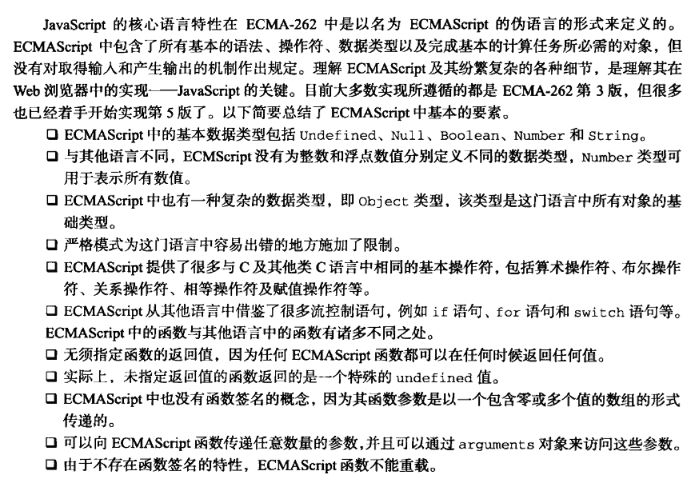

> 2020年7月28日，看完了函数这一节

# 第4章：变量、作用域和内存问题

> 作用域的问题要深挖，这个是基本功，《你不知道的JavaScript(上卷)》前几章就是专门讲作用域的，慢慢的我也开始感觉到了它的重要性了，不过目前自己理解的还比较浅显，知识掌握的还很不牢靠，还需要继续静下心来学习，看看别的书和视频。

按照ECMA-262的定义，**JavaScript的变量**与其他语言的变量有很大**区别**。JavaScript变量**松散类型的本质**，决定了它只是在特定时间用于保存特定值的一个**名字**而已。由于**不存在定义某个变量必须要保存何种数据类型值的规则，变量的值及其数据类型可以在脚本的生命周期内改变**。尽管从某种角度看，这可能是一个**既有趣又强大**，同时又容易出问题的特性，但JavaScript变量实际的复杂程度还远不止如此。

## 基本类型与引用类型的<strong style="color:red">值</strong>

ECMAScript**变量**可能**包含**两种不同**数据类型**的值：**基本类型值和引用类型值**。基本类型值指的是简单的**数据段**，而引用类型值指的是那些可能由多个值构成的**对象**。

> 如果使用基本数据类型的数据，我们所创建的变量都是**独立**的，不能成为一个整体
>
> 对象属于**复合**的数据类型，在对象中可以保存**多个不同数据类型**的属性

在**将一个值赋给变量**时，解析器必须确定这个**值**是基本类型值还是引用类型值。第3章讨论了5种基本数据类型：Undefined、Null、Boolean、Number和String。这5种基本数据类型是**按值访问**的，因为**可以操作保存在变量中的实际的值**。

引用类型的值是**保存在内存中的对象**。与其他语言不同的是，JavaScript**不允许直接访问内存中的位置**，也就是说**不能直接操作对象的内存空间**。在操作对象时，实际上是在操作对象的**引用**而**不是实际的对象**。为此，引用类型的值是**按引用访问**的。

> 在很多语言中，**字符串**以**对象**的形式来表示，因此被认为是引用类型的。ECMAScript**放弃了这一传统**。

[按值访问和按引用访问辨析](<https://segmentfault.com/q/1010000004970961/a-1020000004971667>)

补充：到底什么是变量？

> 在程序设计中，变量（英语：Variable，scalar）是指一个包含部分已知或未知数值或信息（即一个值）之**存储地址**，**以及**相对应之**符号名称（识别字）**。通常**使用变量名称引用存储值**；**将名称和内容分开能让被使用的名称独立于所表示的精确消息之外**。电脑源代码中的识别字能在运行期间绑扎一个值，且该变量的值可能在程序运行期间改变。 程序设计中的变量不一定能直接对应到数学中所谓的变量之概念。在程序设计中，变量的值不一定要为方程或数学公式之一部分。**程序设计中的变量可使用在一段可重复的程序：在一处赋值，然后使用于另一处，接着在一次赋值，且以相同方式再使用一次（见迭代）**。程序设计中的变量通常会**给定一个较长的名称，以描述其用途**；数学中的变量通常较为简洁，只给定一、两个字母，以方便抄写及操作。
>
> 一个变量的**存储地址**可以被不同的识别字所引用，这种情况称之为**别名**。使用其中一个识别字为变量赋值，将会改变透过另一个识别字访问的值。
>
> 编译器必须将代表变量的名称替代成该数据所在的实际地址。变量的名称、类型及地址通常会维持固定，但该地址所存储之数据于程序运行期间则可能会改变。

```
变量是个盒子，里面可以装各种东西。装了苹果，当盒子和其它东西合作时，它就是苹果；
装了鸭梨，和其它东西合作时，它就是鸭梨。

编译型语言的变量要求箱子是固定的，装水果的就装水果，装面点的就装面点，装配件的就装配件。
解释型语言的变量不做要求，随便装，爱装啥装啥。当它和水果合作时就拿它当水果用；
当它和面点合作时就拿它当面点用。

广义的变量是相对于常量而言的，指可变动的量。变量是绝对的，常量是相对的，没有绝对意义上的常量。
```

>  变量是一段**有名字的连续存储空间**。我们通过**定义变量**来**申请并命名这样的存储空间**，并通过变量的**名字**来**使用这段存储空间**。
> 变量是程序中临时存放数据的场所，变量中可以存放单词、数值、日期以及属性

```
JavaScript 变量是存储数据值的容器。
在本例中，x、y 和 z 是变量：
var x = 7;
var y = 8;
var z = x + y; 
从上例中，您可获得：
x 存储值 7
y 存储值 8
z 存储值 15
```

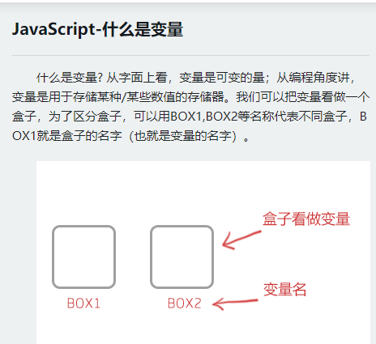

### 动态的属性

定义基本类型值和引用类型值的方式是类似的：**创建一个变量并为该变量赋值**。但是，当这个值保存到变量中以后，**对不同类型值可以执行的操作则大相径庭**。对于**引用类型的值**，我们可以为其添加**属性和方法**，也可以改变和删除其属性和方法。请看下面的例子：

```javascript
var person = new Object();
person.name = "Nicholas";
alert(person.name);		//"Nicholas"
```

以上代码**创建**了一个**对象**并将其**保存在了变量person中**。然后，我们为**该对象**添加了一个**name的属性**，并将**字符串"Nicholas"赋给了这个属性**。紧接着，又通过alert()函数访问了这个新属性。如**果对象不被销毁或者这个属性不被删除，则这个属性将一直存在。**

但是，我们**不能给基本类型的值添加属性**，尽管这样做**不会导致任何错误**。比如：

```javascript
var person = "Nicholas";	//这是字符串
name.age = 27;
alert(name.age);		//undefined
```

在这个例子中，我们为字符串name定义了一个名为age的属性，并为属性赋值27。但在下一行访问这个属性时，发现该属性不见了。这说明**只能**给**引用类型值**动态地添加属性，以便将来使用。

> **属性**:**共同的性质和特点**。例如，一个对象的颜色和形式，人的能力，身份，以及社会的基础关系等等。属性是用在许多领域的术语。
>
> 经院哲学的经典，如亚里士多德系谱哲学中的术语：人的属性的本质是属于，我们一起构成本质属性...，相对的，属性本质并不属于个体所有，而称拥有的这一特点。然而，这种区别在近代混淆，因此在现代不再常用。
>
> 当前一些哲学家根据不同的，比如属性的所述种类性质（例如颜色），属性性质的值（比如红色）的等，在某些情况下定义一个唯一的分别法则要考虑到上述的典型定义或细微差别，所以没有一致的区分，大多数情况通用。


> **一个具体事物，总是 有许许多多的性质与关系，我们把一个事物的性质与关系，都叫做事物的属性。
> 事物与属性是不可分的，事物都是有属性的事物，属性也都是事物的属性**。**一个事物与另一个事物的相同或相异，也就是一个事物的属性与另一事物的属性的相同或相异**。
> **由于事物属性的相同或相异，客观世界中就形成了许多不同的事物类。具有相同属性的事物就形成一类，具有不同属性的事物就分别地形成不同的类。**

### 复制变量值

除了保存的方式不同之外，在**从一个变量向另一个变量**复制基本类型值和引用类型值时，也存在**不同**。

**1.如果从一个变量向另一个变量复制基本类型的值**，会在变量对象上创建一个**新值**，然后把该值复制到为新变量分配的位置上。来看一个例子：

```javascript
var num1 = 5;
var num2 = num1;
```

在此，num1中保存的值是5。当使用num1的值来**初始化num2**时，num2中也保存了值5。**但num2中的5与num1中的5是完全独立的，该值只是num1中5的一个副本。**此后，这两个变量可以参与任何操作而不会相互影响。图4-1形象地展示了复制基本数据类型值的过程。

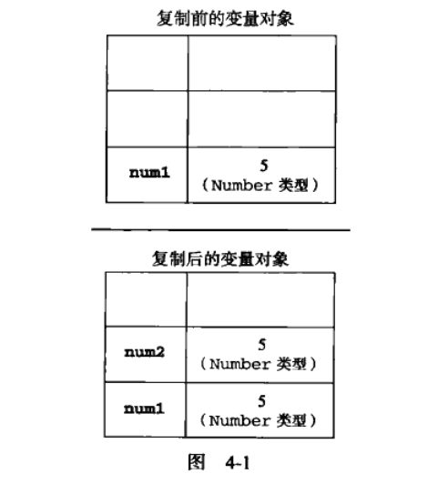

**2.当从一个变量向另一个变量复制引用类型的值**时，同样也会将存储在变量对象中的**值**复制一份放到为新变量分配的空间中。不同的是，这个**值的副本**实际上是一个**指针**，而**这个指针指向存储在堆中的一个对象**。复制操作结束后，**两个变量实际上将引用同一个对象**。因此，改变**其中一个变量(不论是改变obj1还是obj2)**，就会影响另一个变量。如下面的例子所示：

```javascript
var obj1 = new Object();
var obj2 = obj1;
obj1.name = "Nicholas";
alert(obj2.name);		//"Nicholas"
```

首先，变量obj1保存了一个对象的**新实例**。然后，这个**值**被复制到了obj2中；换句话说，**obj1和obj2都指向同一个对象**。(obj1和obj2保存的是对象存储在堆内存中的地址)这样，**当为obj1添加name属性后，可以通过obj2来访问这个属性**，因为**这两个变量引用的都是同一个对象**。图4-2展示了保存在变量对象中的变量和保存在堆中的对象之间的这种关系。

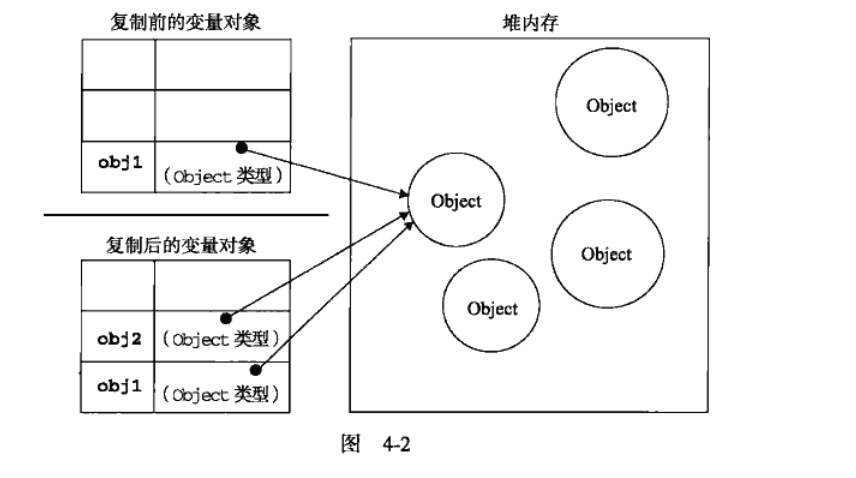

> JS中的**变量**（包括基本如num1和引用obj1）——矿泉水瓶——都是保存在**栈内存**中的
>
> **基本数据类型**的**值**（如5）--水--直接在**栈内存**中存储
>
> **值与值**之间是独立存在的，修改一个变量不会影响其他的变量（修改num1不影响num2）
>
> **对象**是保存到**堆内存**中的,每创建一个新的对象，就会在堆内存中开辟出一个新的空间,而**变量(如obj1)保存的是对象的内存地址（对象的引用）**

```
在大多数本机可执行程序中，有两种可用的内存：基于堆栈的内存和基于堆的内存。

使用栈就象我们去饭馆里吃饭，只管点菜（发出申请）、付钱、和吃（使用），吃饱了就走，不必理会切菜、洗菜等准备工作和洗碗、刷锅等扫尾工作，他的好处是快捷，但是自由度小。 

使用堆就象是自己动手做喜欢吃的菜肴，比较麻烦，但是比较符合自己的口味，而且自由度大。
```

#### 栈

对于具有它们的系统，系统堆栈最常用于提供**框架**。**框架是一种本地化有关子例程的信息的方法**。通常，子例程必须在其框架中具有函数的输入参数的返回地址（该子例程完成时跳转到的地址）。调用子例程时，所有这些信息都以特定顺序推入堆栈。函数**返回**时，将弹出堆栈上的所有这些值，将其回收给系统，以供以后通过不同的函数调用使用。此外，子例程还可以将堆栈用作局部变量的存储。

这整个过程，即在堆栈上创建框架并回收框架的过程，大多是透明进行的，由**编译器**处理。程序员通常不了解此过程，因此不需要专门考虑这一过程。

当在堆栈上分配本地数组时，可能会遇到一个陷阱。如果函数写入数组末尾以外的存储位置，则会发生称为**缓冲区溢出的**问题。缓冲区溢出是一个问题，因为数据值紧密存储在堆栈中，如果溢出，您可能会意外覆盖这些值。如前所述，函数的返回值存储在堆栈中。因此，如果该值被覆盖，函数将不会返回到正确的位置。**勤奋的黑客**可以利用这一事实为堆栈填充非常具体的值，例如内存中病毒代码的地址。

**堆栈存储是固定的**。即，分配给堆栈的空间是由编译器在编译时设置的，并且在程序执行时不会更改。

#### 堆

堆是由操作系统或内存管理器库自动管理的**动态分配内存区域**。在程序执行期间定期对堆上的内存进行分配，释放和调整大小，这可能导致称为**碎片**的问题。当在内存对象之间分配的小空间太小而无法容纳其他内存对象时，就会发生碎片。最终结果是无法用于进一步的内存分配的堆空间的百分比。

**堆也容易受到溢出情况的影响，尽管结果通常不如堆栈溢出那样可怕**。对于黑客来说，通过堆溢出来破坏系统并不是不可能的，但是这特别困难。

[内存中的堆和栈到底是什么](<https://www.jianshu.com/p/52b5a1879aa1>)

> 2020年7月30日：截止到这里复习完

### 传递参数(★★★)

ECMAScript中**所有函数的参数**(就是函数名后面小括号里的参数)都是**按值传递**的。也就是说，**把函数外部的值复制给函数内部的参数，就和把值从一个变量复制到另一个变量一样**。基本类型**值**的传递如同基本类型**变量**的复制一样，而引用类型值的传递，则如同引用数据类型的复制一样。有不少开发人员在这一点上可能会感到困惑，因为**访问变量有按值和按引用两种方式，而参数只能按值传递。**

> 按值传递(call by value)是最常用的求值策略：函数的**形参**是被调用时所传实参的副本。**修改形参的值并不会影响实参。**
>
> 按引用传递(call by reference)时，**函数的形参接收实参的隐式引用，而不再是副本。这意味着函数形参的值如果被修改，实参也会被修改。同时两者指向相同的值**。(JS中不用这种方式)
>
> **按引用传递会使函数调用的追踪更加困难，有时也会引起一些微妙的BUG。**
>
> 按值传递由于每次都需要克隆副本，对一些复杂类型，性能较低。两种传值方式都有各自的问题。

[JS中的值是按值传递，还是按引用传递呢？](<https://segmentfault.com/a/1190000005794070>)

在**向参数传递基本类型的值时**，被传递的值会被**复制**给一个局部变量（即**命名参数**，或者用ECMAScript的概念来说，就是arguments对象中的一个元素）。

在**向参数传递引用类型的值时**，会把这个值在内存中的地址复制给一个局部变量，因此这个局部变量的变化会反映在函数的外部。请看下面这个例子：

```javascript
function addTen(num){
    num += 10;
    return num;
}
var count = 20;
var result = addTen(count);
alert(count);		//20,没有变化
alert(result);		//30
```

[形参和实参区别1](<https://www.cnblogs.com/chinabin1993/p/8541126.html>)

[形参和实参区别2](<https://baike.baidu.com/item/%E5%BD%A2%E5%BC%8F%E5%8F%82%E6%95%B0/1995068?fromtitle=%E5%BD%A2%E5%8F%82&fromid=7677757>)

[形参和实参区别3](<https://segmentfault.com/a/1190000010894177>)

这里的函数addTen()有一个参数num,而**参数实际上是函数的局部变量**。在**调用**这个函数时，变量count作为参数被传递给函数，这个变量的值是20。于是，**数值20被复制给参数num**以便在addTen()中使用。在**函数内部**，**参数num的值被加上了10，但这一变化不会影响函数外部的count变量**。**参数num与变量count也互不相识，它们仅仅是具有相同的值**。假如num是按引用传递的话，那么变量count的值也将变成30，从而反映函数内部的修改。

[JavaScript 的全局变量与局部变量](<http://kuanghy.github.io/2016/01/05/js-var>)

当然，使用数值等基本数据类型来说明按值传递参数比较简单，但如果**使用对象**，那问题就不怎么好理解了。再举一个例子：

```javascript
function setName(obj){
    obj.name = "Nicholas";
}
var person = new Object();
setName(person);
alert(person.name);		//"Nicholas"
```

以上代码中**创建了一个对象**，并将其**保存在了变量person中**。然后，**这个对象被传递到setName()函数中之后就被复制给了obj**。在这个函数内部，**obj和person引用的是同一个对象**。换句话说，**即使这个对象是按值传递的，obj也会按引用来访问同一个对象**。于是，当在**函数内部**为obj添加name属性后，**函数外部的person也将有所反映**；因为**person指向的对象在堆内存中只有一个，而且是全局对象**。

有很多开发人员**错误地认为：在局部作用域中修改的对象会在全局作用域中反映出来，就说明参数是按引用传递的。**为了**证明对象也是按值传递的**，我们再看一看下面这个经过修改的例子：(★★★★★)

```javascript
function setName(obj){
    obj.name = "Nicholas";
    obj = new Object();   //这行不熟
    obj.name = "Greg";
}
var person = new Object();
setName(person);
alert(person.name);		//"Nicholas"
```

> 难度：现在还看的不是很懂啊！

这个例子与前一个例子的唯一区别，就是在 setName()函数中**添加了两行代码**：**一行代码为obj重新定义了一个对象**，**另一个代码为该对象定义了一个带有不同值的name属性**。再**把person传递给setName()之后**，其name属性被设置为"Nicholas"。然后，又将一个新对象赋值给变量obj,同时将其name属性设置为"Greg"。**如果person是按引用传递的，那么person就会自动被修改为指向其name属性值为"Greg"的新对象。**

但是，当接下来再访问person.name时，显示的值仍然是"Nicholas"。**这说明即使是在函数的内部修改了参数的值，但原始的引用仍然保持未变**。实际上，**当在函数内部重写obj时，这个变量引用的就是一个局部对象了。而这个局部对象会在函数执行完毕后立即被销毁。**（看不懂。。。）

> 可以把ECMAScript函数的参数想象成局部变量

### 检测类型(typeof一般  instanceof更好)

要检测一个<strong style="color: red">变量</strong>是不是**基本数据类型**？**第3章**介绍的typeof操作符是最佳的工具。说的更具体一点，**typeof操作符是确定一个变量是字符串、数值、布尔值、还是undefined的最佳工具**。如果变量的值是一个**对象或null**,则typeof操作符会像下面例子中所示的那样返回“**object**”。

```javascript
 var s = "Nicholas";
 var b = true;
 var i = 22;
 var u;
 var n = null;
 var o = new Object();
        
 alert(typeof s);   //string
 alert(typeof b);   //boolean
 alert(typeof i);   //number
 alert(typeof u);   //undefined
 alert(typeof n);   //object
 alert(typeof o);   //object

（返回的都是string、boolean等都是小写）
```

虽然在检测<strong style="color: red">基本数据类型</strong>时typeof是非常得力的助手，但在检测<strong style="color: red">引用类型</strong>的值时，这个操作符的用处不大。通常，**我们并不是想知道某个值是对象，而是想知道它是什么类型的对象。**(我们想知道的更加详细一点)

为此，ECMAScript提供了**instanceof操作符**，其语法如下所示：

```javascript
result = variable instanceof constructor;
```

如果**变量是给定引用类型（根据它的原型链来识别；第6章将介绍原型链）的实例**，那么instanceof操作符就会返回true。请看下面的例子：

```javascript
alert(person instanceof Object)；		//变量person是Object吗？
alert(colors instanceof Array)；			//变量colors是Array吗？
alert(pattern instanceof RegExp)；		//变量pattern是RegExp(正则表达式)吗？
```

根据规定，<strong style="color: red">所有引用类型的值都是Object的实例</strong>。因此，在检测一个**引用类型值和Object构造函数**时，instanceof操作符始终会返回true。

**当然，如果使用instanceof操作符来检测基本类型的值，则该操作符始终会返回false，因为基本类型不是对象。**

> 使用typeof操作符**检测函数**时，该操作符会返回"**function**"。在Safari 5及之前版本和Chrome 7及之前版本中使用typeof检测正则表达式时，由于规范的原因，这个操作符也返回"function"，ECMA-262规定任何在内部实现[[Ca1111方法的对象都应该在应用typeof操作符时返回"function"。由于上述浏览器中的正则表达式也实现了这个方法，因此对正则表达式应用typeof会返回"function"。在**IE**和Firefox中，对正则表达式应用typeof会返回"object"。

## 执行环境及作用域(★★★★★ 不懂)

[浅谈JS执行环境及作用域](https://www.cnblogs.com/formercoding/p/5881304.html)

[JavaScript作用域、作用域链和执行环境](https://zhuanlan.zhihu.com/p/46526645)

[让你一分钟就看懂的作用域和作用域链](https://zhuanlan.zhihu.com/p/136067197)

**执行环境**（execution context，为简单起见，有时也称为“**环境**”）是JavaScript中**最为重要**的一个概念。**执行环境定义了变量或函数有权访问的其他数据**，决定了它们各自的行为。**每个执行环境都有一个与之关联的变量对象**（**variable object**），**环境中定义的所有变量和函数都保存在这个对象中**。虽然我们编写的代码无法访问这个对象，但**解析器**在处理数据时会在后台使用它。

**全局执行环境**是**最外围**的一个**执行环境**。根据ECMAScript实现所在的宿主环境不同，表示执行环境的对象也不一样。**在Web浏览器中，全局执行环境被认为是window对象**（第7章将详细讨论），因此**所有全局变量和函数**都是作为window对象的属性和方法创建的。**某个执行环境中的所有代码执行完毕后，该环境被销毁**，保存在其中的所有变量和函数定义也随之销毁（**全局执行环境直到应用程序退出—例如关闭网页或浏览器——时才会被销毁**）。

**每个函数都有自己的执行环境。**当执行流进入一个函数时，**函数的环境**就会被推入一个**环境栈**中。而在函数执行之后，栈将其环境弹出，把控制权返回给之前的执行环境。**ECMAScript程序中的执行流正是由这个方便的机制控制着。**

当**代码**在**一个环境中执行**时，会创建变量对象的一个<strong style="color:red">作用域链</strong>（scope chain）。**作用域链的用途，是保证对执行环境有权访问的所有变量和函数的有序访问。**作用域链的**前端**，始终都是当前执行的代码所在环境的变量对象。如果这个环境是**函数**，则将其**活动对象（activation object）**作为变量对象。**活动对象在最开始时只包含一个变量，即arguments对象（这个对象在全局环境中是不存在的）**。作用域链中的下一个变量对象来自包含（外部）环境，而再下一个变量对象则来自下一个包含环境。这样，一直延续到全局执行环境；**全局执行环境的变量对象始终都是作用域链中的最后一个对象**。

> 不知道这几段话是什么意思，隐隐约约感觉和原型链有关。
>
> 2020年7月30日，又读了一遍,隐隐约约，还是感觉有迷雾在眼前。

**标识符解析**是沿着作用域链一级一级地搜索标识符的过程。搜索过程始终从**作用域链的前端**开始，然后逐级地**向后回溯**，**直至找到标识符为止**（如果**找不到标识符，通常会导致错误发生**）。

请看下面的示例代码：

```javascript
var color = "blue";
function changeColor(){
    if(color === "blue"){
        color = "red";
    }else{
        color = "blue";
    }
}
changeColor();
alert("现在的颜色是" + color);	//red
```

在这个简单的例子中，函数changeColor()的**作用域链**包含**两个对象**：**它自己的变量对象（其中定义着arguments对象）和全局环境的变量对象**。**可以在函数内部访问变量color**，就是**因为可以在这个作用域链中找到它**。

此外，**在局部作用域中定义的变量可以在局部环境中与全局变量互换使用**，如下面这个例子所示：

```javascript
var color = "blue";

function changeColor(){
    var anotherColor = "red";
    function swapColors(){
        var tempColor = anotherColor;
        anotherColor = color;
        color = tempColor;
        //这里可以访问color、anotherColor和tempColor
    }
    //这里可以访问color、anotherColor，但不能访问tempColor
    swapColors()；
}
//这里只能访问color
changeColor();
```

> 层层套，我被套晕了。看不懂其中的逻辑关系。
>
> 现在是2020年7月30日，能看懂了。

以上代码共涉及3个执行环境：<strong style="color:red">全局环境、changecolor()的局部环境和swapcolors()的局部环境</strong>。

**全局环境中有一个变量color和一个函数 changeColor()。**

**changecolor()的局部环境中有一个名为anothercolor的变量和一个名为swapColors()的函数，但它也可以访问全局环境中的变量color。**

**swapColors()的局部环境中有一个变量tempcolor，该变量只能在这个环境中访问到。**

无论全局环境还是changeColor()的局部环境都无权访问tempColor。然而，在swapColors()内部则可以访问其他两个环境中的所有变量，**因为那两个环境是它的父执行环境**。

> 函数刚开始没看懂，但是看下面的说明看懂了其中的关系。所以说看书不要图快，学透，学懂才是王道。

图4-3形象地展示了前面这个例子的作用域链。

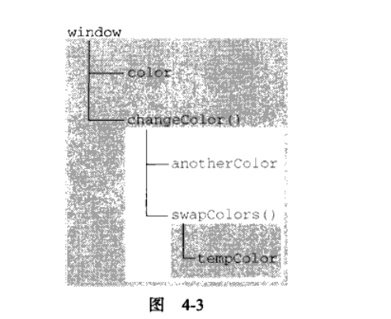

图4-3中的矩形表示特定的执行环境。其中，**内部环境可以通过作用域链访问所有的外部环境，但外部环境不能访问内部环境中的任何变量和函数。**

> 内部是最柔软的部分，可爱的小儿子，他可以随心所欲的去外面的世界看看，但是外面世界的坏人不能主动进来。

这些环境之间的联系是**线性**、有**次序**的。每个环境都**可以向上搜索**作用域链，以查询变量和函数名；但任何环境都**不能通过向下搜索**作用域链而进人另一个执行环境。对于这个例子中的swapColors()而言，其作用域链中包含3个对象：swapColors()的变量对象、changeColor()的变量对象和全局变量对象。swapColors()的局部环境开始时会先在自己的变量对象中搜索变量和函数名，如果搜索不到则再搜索上一级作用域链。changeColor()的作用域链中只包含两个对象：它自己的变量对象和全局变量对象。这也就是说，它不能访问swapColors()的环境。

> **函数参数**也被当作变量来对待，因此其访问规则与执行环境中的其他变量相同。

```javascript

作用域：
	-作用域指一个变量的作用范围
	-在JS中一共有两种作用域：(ES6中开始新增一种作用域：块级作用域了)
		 1.全局作用域
			-直接编写在script标签中的JS代码，都在全局作用域
		 	-全局作用域在页面打开时创建，在页面关闭时销毁
		  	-在全局作用域中有一个全局对象window,
		  		它代表的是一个浏览器的窗口，它由浏览器创建，我们可以直接使用
		  	-在全局作用域中创建的变量都会作为window对象的属性保存
		  	-在全局作用域中创建的函数都会作为window对象的方法保存
		 
		  	-全局作用域中的变量都是全局变量
		  		在页面的任意的部分都可以访问的到
		 2.函数作用域
```

### 延长作用域链(没看懂)

> 见《你不知道的Javascript上卷》,里面有更详细的介绍

虽然**执行环境的类型总共只有两种——全局和局部（函数）**，但还是**有其他办法来延长作用域链**。
这么说是因为**有些语句**可以在作用域链的**前端临时增加**一个**变量对象**，该变量对象会在**代码执行后被移除**。在两种情况下会发生这种现象。具体来说，就是**当执行流进入下列任何一个语句时，作用域链就会得到加长**：

* try-catch语句中的catch块

* with语句

[js中try和catch的用法](<https://blog.csdn.net/lyhh5/article/details/99694883>)

**这两个语句都会在作用域链的前端添加一个变量对象。**对with语句来说，会将指定的对象添加到作用域链中。对catch语句来说，会**创建一个新的变量对象**，其中包含的是被抛出的错误对象的声明。

下面看一个例子。

```javascript
function buildUrl(){
    var qs = "?debug=true";
  
    with(location){
        var url = href + qs;
    }
    return url;
}

var result = buildUrl();
alert(result);	
```

在此，**with语句接收的是location对象，因此其变量对象中就包含了location对象的所有属性和方法，而这个变量对象被添加到了作用域链的前端。**buildUrl()函数中定义了一个变量qs。**当在with 语句中引用变量href时（实际引用的是location.href）**，可以在当前执行环境的变量对象中找到。

当引用变量qs时，引用的则是在buildUrl()中定义的那个变量，而该变量位于函数环境的变量对象中。至于with语句内部，则定义了一个名为ur1的变量，因而ur1就成了函数执行环境的一部分，所以可以作为函数的值被返回。

> 这上面几段话完全看不懂在说些什么。

> 在IE8及之前版本的JavaScript实现中，存在一个与标准不一致的地方，即在catch语句中捕获的错误对象会被添加到执行环境的变量对象，而不是catch语句的变量对象中。换句话说，即使是在catch块的外部也可以访问到错误对象。IE9修复了这个问题。

### 没有块级作用域()——ES6已经有了

JavaScript 没有块级作用域经常会导致理解上的困惑。在其他类C的语言中，由花括号封闭的代码块都有自己的作用域（如果**用ECMAScript的话来讲，就是它们自己的执行环境**），因而支持根据条件来定义变量。例如，下面的代码在JavaScript中并不会得到想象中的结果：

```javascript
if(true){
   var color = "blue";
}
alert(color);		//"blue"
```

这里是在一个if语句中定义了变量color。如果是在C、C++或Java中，color会在if语句执行完毕后被销毁。但在JavaScript中，**if语句中的变量声明会将变量添加到当前的执行环境（在这里是全局变量）中**。

在使用for语句时尤其要牢记这一差异，例如：

```javascript
for(var i = 0; i < 10; i++){
    doSomething(i);
}
alert(i);		//10
```

> 这个例子很经典，我记得看过类似这个的视频，后来为了解决作用域的问题引入了立即执行函数的概念。

对于**有块级作用域的语言来说**，for语句初始化变量的表达式所定义的变量，**只会存在于循环的环境之中**。而**对于JavaScript来说，由for语句创建的变量i即使在for循环执行结束后，也依旧会存在于循环外部的执行环境中。**

**1.声明变量**

使用var声明的变量会自动被添加到**最接近的环境中**。在函数内部，**最接近的环境**就是函数的**局部环境**；在with语句中，最接近的环境是函数环境。**如果初始化变量时没有使用var声明，该变量会自动被添加到全局环境。**如下所示：

```javascript
function add(num1, num2) {
    var sum = num1 + num2;
    return sum;
}      
var result = add(10, 20);  //30
alert(sum);                //由于sum不是有效的变量，因此会导致错误
```

以上代码中的函数add()定义了一个名为sum的**局部变量**，该**变量包含**加法操作的**结果**。虽然**结果值从函数中返回了**，但**变量sum在函数外部是访问不到的**。如果省**略这个例子中的var关键字**，那么当add()执行完毕后，sum也将可以访问到：

```javascript
function add(num1, num2) {
    sum = num1 + num2;
    return sum;
}      
var result = add(10, 20);  //30
alert(sum);                //30
```

这个例子中的变量sum在被初始化赋值时没有使用var关键字。于是，当调用完add()之后，添加到全局环境中的sum将继续存在；即使函数已经执行完毕，后面的代码依旧可以访问它。

> 在编写JavaScript代码的过程中，不声明而直接初始化变量是一个常见的错误做法，因为这样可能会导致意外。我们建议**在初始化变量之前，一定要先声明，这样就可以避免类似问题。**在**严格模式**下，**初始化未经声明的变量会导致错误**。

```javascript
变量的声明提前
  -使用var关键字声明的变量，会在所有的代码执行之前被声明（但是不会赋值）
	但是如果声明变量时不使用var关键字，则变量不会被提前声明
函数的声明提前
  -使用函数声明形式创建的函数function()函数{}
	它会在所有的代码执行之前就被创建，所以我们可以在函数声明前调用函数
	使用函数表达式创建的函数，不会被提前声明，所以不能在声明前调用
```

**2.查询标识符**

当在某个环境中为了读取或写入而引用一个**标识符**时，必须通过**搜索**来确定该标识符实际代表什么。**搜索过程**从作用域链的**前端**开始，**向上逐级查询**与给定名字匹配的标识符。**如果在局部环境中找到了该标识符，搜索过程停止**，**变量就绪**。如果在局部环境中没有找到该变量名，则继续沿作用域链向上搜索。搜索过程将**一直追溯到全局环境的变量对象**。如果在全局环境中也没有找到这个标识符，则意味着该变量尚未声明。

通过下面这个示例，可以理解查询标识符的过程：

```javascript
var color = "blue";   
function getColor(){
    return color;
}   
alert(getColor());  //"blue"
```

**调用**本例中的函数 getColor()时会引用变量color。为了确定变量color的值，将开始一个**两步的搜索过程**。**首先**，搜索 getColor()的变量对象，查找其中是否包含一个名为color的标识符。

在没有找到的情况下，搜索继续到**下一个变量对象（全局环境的变量对象）**，然后在那里找到了名为color的标识符。因为搜索到了定义这个变量的变量对象，搜索过程宣告结束。图4-4形象地展示了上述搜索过程。

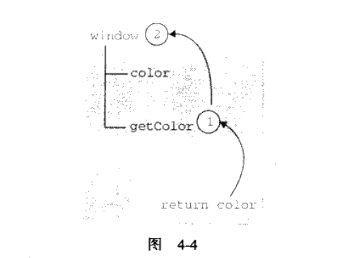

在这个搜索过程中，如果存在一个局部的变量的定义，则搜索会自动停止，不再进入另一个变量对象。换句话说，如果**局部环境中存在着同名标识符**，就**不会使用位于父环境中的标识符**，如下面的例子所示：

```javascript
var color = "blue";   
function getColor(){
    var color = "red";
    return color;
}   
alert(getColor());  //"red"
```

修改后的代码在getColor()函数中声明了一个名为color的局部变量。**调用函数时，该变量就会被声明**。而当函数中的第二行代码执行时，意味着必须找到并返回变量color的值。搜索过程**首先**从局部环境中开始，而且在这里发现了一个名为color的变量，其值为“red”。因为变量已经找到了，所以搜索即行停止，return 语句就使用这个局部变量，并为函数会返回“red“。也就是说，**任何位于局部变量color的声明之后的代码，如果不使用window.color都无法访问全局color变量。**如果有一个操作数是对象，而另一个不是，就会在对象上调用**valueOf()方法**以取得基本类型的值，以便根据前面的规则进行比较。

> 变量查询也不是没有代价的。很明显，访问局部变量要比访问全局变量更快，因为不用向上搜索作用域链。JavaScript引擎在优化标识符查询方面做得不错，因此这个差别在将来恐怕就可以忽略不计了。

> 2020年7月30日：截止到上面看完。

## 垃圾收集(没看)

JavaScript具有自动垃圾收集机制，也就是说，**执行环境**会负责管理代码执行过程中使用的内存。而在C和C++之类的语言中，开发人员的一项基本任务就是**手工跟踪内存的使用情况**，这是造成许多问题的一个根源。在编写JavaScript程序时，开发人员不用再关心内存使用问题，所需内存的分配以及无用内存的回收完全实现了**自动管理**。这种垃圾收集机制的**原理**其实很简单：**找出那些不再继续使用的变量，然后释放其占用的内存**。为此，垃圾收集器会按照**固定的时间间隔**（或代码执行中预定的收集时间），**周期性**地执行这一操作。

下面我们来分析一下**函数中局部变量**的正常生命周期。**局部变量只在函数执行的过程中存在**。而在这个过程中，会为局部变量在栈（或堆）内存上分配相应的空间，以便存储它们的值。然后在函数中使用这些变量，直至**函数执行结束**。此时，局部变量就没有存在的必要了，因此可以释放它们的内存以供将来使用。在这种情况下，很容易判断变量是否还有存在的必要；但并非所有情况下都这么容易就能得出结论。**垃圾收集器**必须跟踪哪个变量有用哪个变量没用，对于不再有用的变量打上标记，以备将来收回其占用的内存。用于标识无用变量的策略可能会因实现而异，但具体到浏览器中的实现，则通常有两个策略。

### 标记清除

JavaScript中最常用的垃圾收集方式是**标记清除（mark-and-sweep）**。当变量进入环境（例如，在函数中声明一个变量）时，就将这个变量标记为“**进入环境**”。从**逻辑**上讲，**永远不能释放进入环境的变量所占用的内存**，因为**只要执行流进入相应的环境，就可能会用到它们**。而**当变量离开环境时，则将其标记为“离开环境”**。

可以使用任何方式来标记变量。比如，可以通过翻转某个特殊的位来记录一个变量何时进入环境，或者使用一个**“进人环境的”变量列表**及一个**“离开环境的”变量列表**来**跟踪**哪个变量发生了**变化**。说到底，**如何标记变量其实并不重要，关键在于采取什么策略**。

垃圾收集器在运行的时候会给**存储在内存中的所有变量都加上标记**（当然，可以使用任何标记方式）。然后，它会**去掉环境中的变量以及被环境中的变量引用的变量的标记**。而在此**之后**再被加上标记的变量将被视为准备删除的变量，原因是环境中的变量已经无法访问到这些变量了。最后，**垃圾收集器完成内存清除工作，销毁那些带标记的值并回收它们所占用的内存空间**。

到2008年为止，E、Firefox、Opera、Chrome和Safari的JavaScript实现使用的都是标记清除式的垃圾收集策略（或类似的策略），只不过垃圾收集的时间间隔互有不同。

### 引用计数

另一种**不太常见**的垃圾收集策略叫做**引用计数（reference counting）**。引用计数的含义是跟踪记录每个值被引用的次数。当声明了一个变量并将一个引用类型值赋给该变量时，则这个值的引用次数就是1。如果同一个值又被赋给另一个变量，则该值的引用次数加1。相反，如果包含对这个值引用的变量又取得了另外一个值，则这个值的引用次数减1。当这个值的引用次数变成0时，则说明没有办法再访问这个值了，因而就可以将其占用的内存空间回收回来。这样，当垃圾收集器下次再运行时，它就会释放那些引用次数为零的值所占用的内存。

Netscape Navigator 3.0是最早使用引用计数策略的浏览器，但很快它就遇到了一个**严重的问题**：**循环引用**。循环引用指的是对象A中包含一个指向对象B的指针，而对象B中也包含一个指向对象A的引用。请看下面这个例子：

```javascript
function problem(){
    var objectA = new Object();
    var objectB = new Object();
    
    objectA.someOtherObject = objectB;
    objectB.anotherObject = objectA;
}
```

在这个例子中，objectA和objectB**通过各自的属性相互引用**；也就是说，这两个对象的引用次数都是2。在采用标记清除策略的实现中，由于函数执行之后，这两个对象都离开了作用域，因此这种相互引用不是个问题。但在采用引用计数策略的实现中，当函数执行完毕后，objectA和objectB还将继续存在，因为它们的引用次数永远不会是0。**假如这个函数被重复多次调用，就会导致大量内存得不到回收**。为此，Netscape在Navigator4.0中放弃了引用计数方式，转而采用标记清除来实现其垃圾收集机制。可是，引用计数导致的麻烦并未就此终结。

我们知道，IE中有一部分对象**并不是原生JavaScript对象**。例如，其BOM和DOM中的对象就是使用C++以COM（Component Object Model，**组件对象模型**）对象的形式实现的，而COM对象的垃圾收集机制采用的就是引用计数策略。因此，即使[E的JavaScript引擎是使用标记清除策略来实现的，但JavaScript访问的COM对象依然是基于引用计数策略的。换句话说，**只要在IE中涉及COM对象，就会存在循环引用的问题**。下面这个简单的例子，展示了使用COM对象导致的循环引用问题：

```javascript
var element = document.getElementById("some_element");
var myObject = new Object();
myObject.element = element;
element.someObject = myObject;
```

这个例子在一个DOM元素（element）与一个原生JavaScript对象（myobject）之间创建了循环引用。其中，变量myobject有一个名为element的属性指向element对象；而变量element也有一个属性名叫someobject回指myobject。由于存在这个循环引用，即使将例子中的DOM从页面中移除，它也永远不会被回收。

为了避免类似这样的循环引用问题，最好是在不使用它们的时候手工断开原生JavaScript对象与DOM元素之间的连接。例如，可以使用下面的代码消除前面例子创建的循环引用：

~~~javascript
myObject.element=nul1；
element.someObject=null；
~~~

**将变量设置为null意味着切断变量与它此前引用的值之间的连接**。当垃圾收集器下次运行时，就会删除这些值并回收它们占用的内存。

为了解决上述问题，IE9把BOM和DOM对象都转换成了真正的JavaScript对象。这样，就避免了两种垃圾收集算法并存导致的问题，也消除了常见的内存泄漏现象。

> 导致循环引用的情况不止这些，其他一些情况将在本书中陆续介绍。

```javascript
垃圾回收（GC）
  -就像人生活的时间长了会产生垃圾一样，程序运行过程中也会产生垃圾
	 这些垃圾积攒过多以后，会导致程序运行的速度过慢
	 所以我们需要一个垃圾回收的机制，来处理程序运行过程中产生的垃圾
  -当一个对象没有任何的变量或属性对它进行引用，此时我们将永远无法操作该对象
	 此时这种对象就是一个垃圾，这种对象过多就会占用大量的内存空间，导致程序运行变慢
	 所以这种垃圾必须进行清理
		 
  -在JS中拥有自动的垃圾回收机制，会自动的将这些垃圾对象从内存中销毁
	 我们不需要也不能进行垃圾回收的操作
  -我们需要做的只是将不再使用的对象设置为null即可
```

### 性能问题

垃圾收集器是**周期性运行**的，而且如果为变量分配的内存数量很可观，那么回收工作量也是相当大的。在这种情况下，确定垃圾收集的时间间隔是一个非常重要的问题。说到垃圾收集器多长时间运行一次，不禁让人联想到IE因此而声名狼藉的性能问题。**IE的垃圾收集器是根据内存分配量运行的**，具体一点说就是**256个变量、4096个对象（或数组）字面量和数组元素（slot）或者64KB的字符串**。达到上述**任何一个临界值，垃圾收集器就会运行**。这种实现方式的问题在于，如果一个脚本中包含那么多变量，那么该脚本很可能会在其生命周期中**一直保有那么多的变量**。而这样一来，垃圾收集器就不得不频繁地运行。结果，由此引发的严重性能问题促使IE7重写了其垃圾收集例程。

随着IE7的发布，其JavaScript引擎的垃圾收集例程**改变了工作方式**：触发垃圾收集的变量分配、字面量和（或）数组元素的临界值被**调整为动态修正**。IE7中的各项临界值在初始时与IE6相等。如果垃圾收集例程回收的内存分配量低于15%，则变量、字面量和（或）数组元素的临界值就会加倍。如果例程回收了85%的内存分配量，则将各种临界值重置回默认值。这一看似简单的调整，极大地提升了IE在运行包含大量JavaScript的页面时的性能。

> 事实上，在有的浏览器中可以触发垃圾收集过程，但我们不建议读者这样做。在IE中，调用window.CollectGarbage()方法会立即执行垃圾收集。在Opera7及更高版本中，调用window.opera.collect()也会启动垃圾收集例程。

### 管理内存

使用具备垃圾收集机制的语言编写程序，开发人员一般不必操心内存管理的问题。但是，JavaScript在进行内存管理及垃圾收集时面临的问题还是有点与众不同。其中最主要的一个问题，就是**分配给Web浏览器的可用内存数量通常要比分配给桌面应用程序的少**。这样做的目的主要是出于安全方面的考虑，目的是防止运行JavaScript的网页耗尽全部系统内存而导致系统崩溃。内存限制问题不仅会影响给变量分配内存，同时还会影响调用栈以及在一个线程中能够同时执行的语句数量。

因此，**确保占用最少的内存可以让页面获得更好的性能**。而**优化内存占用**的最佳方式，就是为执行中的代码只保存必要的数据。**一旦数据不再有用，最好通过将其值设置为null来释放其引用——这个做法叫做解除引用**(dereferencing)。这一做法适用于大多数全局变量和全局对象的属性。局部变量会在它们离开执行环境时自动被解除引用，如下面这个例子所示：

```javascript
function createPerson(name){
    var localPerson = new Object();
    localPerson.name = name;
    return localPerson;
}
var globalPerson = createPerson("Nicholas");
//手工解除globalPerson的引用
globalPerson = null;
```

在这个例子中，变量g1obalPerson取得了createPerson()函数返回的值。在createPerson()函数内部，我们创建了一个对象并将其赋给局部变量1oca1person，然后又为该对象添加了一个名为name的属性。最后，**当调用这个函数时，localPerson以函数值的形式返回并赋给全局变量globalPerson**。由于localPerson在createPerson()函数执行完毕后就离开了其执行环境，因此无需我们显式地去为它解除引用。但是对于**全局变量globalPerson**而言，则**需要我们在不使用它的时候手工为它解除引用**，这也正是上面例子中最后一行代码的目的。

不过，解除一个值的引用并不意味着自动回收该值所占用的内存。**解除引用的真正作用是让值脱离执行环境，以便垃圾收集器下次运行时将其回收**。

## 小结

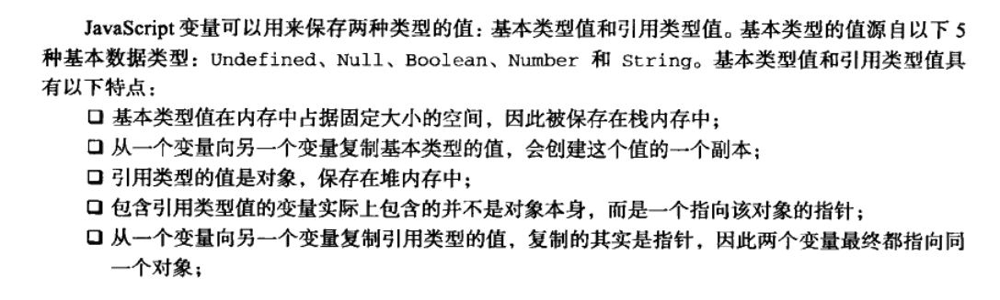

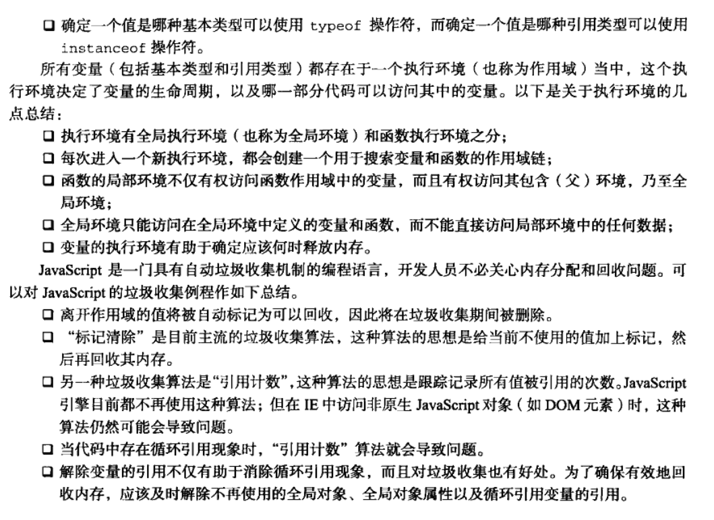

------

> 2020年7月31日：截止到这里复习完。

# 第5章：引用类型

引用类型的<strong style="color:red">值</strong>（**对象**）是引用类型的一个<strong style="color:red">实例</strong>。在ECMAScript中，引用类型是一种<strong style="color: red">数据结构</strong>，用于将**数据**和**功能**组织在一起。它也常被称为**类**，但这种称呼并不妥当。尽管ECMAScript从技术上讲是一门**面向对象的语言**，但它不具备传统的面向对象语言所支持的类和接口等基本结构。引用类型有时候也称为<strong style="color:red">对象定义</strong>，因为它们描述的是一类对象所具有的属性和方法。

> 虽然引用类型与类看起来相似，但它们并不是相同的概念。为避免混淆，本书将不使用类这个概念。——ES6中以语法糖的形式引入了类。

如前所述，<strong style="color: red">对象是某个特定引用类型的实例</strong>。新对象是使用<strong style="color:red">new操作符</strong>后跟一个<strong style="color:red">构造函数</strong>来创建的。<strong style="color: red">构造函数本身就是一个函数，只不过该函数是出于创建新对象的目的而定义的</strong>。请看下面这行代码：

```javascript
var person = new Object();
```

这行代码创建了<strong style="color: red">Object引用类型</strong>的一个<strong style="color: red">新实例</strong>，然后<strong style="color: red">把该实例保存在了变量person中</strong>。<strong style="color: red">使用的构造函数是Object</strong>，它只为新对象定义了**默认的属性和方法**。ECMAScript提供了很多**原生引用类型**（例如Object），以便开发人员用以实现常见的计算任务。

> 典型的面向对象编程语言（比如C++和Java），存在“类”（class）这个概念。所谓“类”就是对象的模板，对象就是“类”的实例。但是，在JavaScript语言的对象体系，不是基于“类”的，而是**基于构造函数（constructor）和原型链（prototype）**。

[JavaScript 中的构造函数](<https://juejin.im/entry/584a1c98ac502e006c5d63b8>)

```
在有了对象的基础知识之后，对js中对象做一个简单的总结。如下：
	a：对象是单个实物的抽象。
	b：对象是一个容器，封装了‘属性’和‘方法’。
	
一本书、一辆汽车、一个人都可以是“对象”。当实物被抽象成“对象”，实物之间的关系就变成了“对象”之间的关系，从而就可以模拟现实情况，针对“对象”进行编程。

所谓属性，就是对象的一种状态；所谓方法，就是对象的一种行为。

比如说，可以把动物抽象为animal对象，属性记录的就是哪一种动物，以及该动物的大小和颜色等。方法表示该动物的某种行为（奔跑，猎食，交配，休息等等）。
```

> 前面说过，**“对象”是单个实物的抽象**。通常需要一个**模板**，表示**某一类实物的共同特征**，然后**“对象”根据这个模板生成**。
>
> js语言中使用**构造函数（constructor）作为对象的模板**。**所谓构造函数，就是提供一个生成对象的模板，并描述对象的基本结构的函数**。一个构造函数，可以**生成多个对象**，每个对象都有**相同的结构**。

看一下<strong style="color: red">构造函数</strong>的基本结构。

```javascript
var Keith = function() {
   this.height = 180;
};

//两种写法相同。
function Keith() {
   this.height = 180;
}
```

上面代码中，**Keith**就是构造函数，**它提供模板**，用来**生成对象实例**。**为了与普通函数区别，构造函数名字的第一个字母通常大写。**

**构造函数的三大特点：**

> 1.构造函数的函数名的**第一个字母通常大写**。
>
> 2.**函数体内**使用**this关键字**，代表所要生成的**对象实例**。
>
> 3.**生成对象**的时候，必须使用**new命令**来**调用构造函数**。

> 2020年7月31日：截止到这里复习完

## Object类型

到目前为止，我们看到的**大多数引用类型值**都是**Object类型的实例**；而且，**Object也是ECMAScript中使用最多的一个类型**。虽然Object的实例不具备多少功能，但对于在应用程序中**存储和传输数据**而言，它们确实是非常理想的选择。

**创建 Object实例**的方式有**两种**。**第一种**是使用new操作符后跟Object<strong style="color:red">构造函数</strong>，如下所示：

```javascript
var person = new Object();
//向对象中添加属性
person.name = "Nicholas";
person.age = 29;
```

**另一种**方式是使用<strong style="color:red">对象字面量表示法</strong>(用的比较多)。**对象字面量是对象定义的一种简写形式**，目的在于**简化创建包含大量属性的对象的过程**。下面这个例子就使用了对象字面量语法定义了与前面那个例子中相同的person对象：

```javascript
var person = {
    name : "Nicholas",
    //最后一个属性后面不要添加逗号
    age : 29
};
```

在这个例子中，**左边的花括号**（{）表示对象字面量的开始，因为它出现在了**表达式上下文**（expression context）中。**ECMAScript中的表达式上下文指的是能够返回一个值（表达式）**。赋值操作符表示后面是一个值，所以**左花括号在这里表示一个表达式的开始**。同样的花括号，如果出现在一个**语句上下文**（statement context）中，例如跟在if语句条件的后面，则表示一个语句块的开始。

然后，我们定义了name属性，之后是一个冒号，再后面是这个**属性的值**。在对象字面量中，使用<strong style="color:red">逗号</strong>来**分隔不同的属性**，因此“Nicholas“后面是一个逗号。但是，**在age属性的值29的后面不能添加逗号**，因为age是这个对象的**最后一个属性**。**在最后一个属性后面添加逗号，会在IE7及更早版本和Opera中导致错误**。

在使用对象字面量语法时，**属性名也可以使用字符串**，如下面这个例子所示。

```javascript
var person = {
    "name" : "Nicholas",
    "age" : 29,
    5 : true
};
```

这个例子会创建一个对象，包含三个属性：name、age和5。但**这里的数值属性名(5)会自动转换为字符串**。
另外，使用对象字面量语法时，如果<strong style="color:red">留空</strong>其花括号，则可以定义只包含默认属性和方法的对象，如下所示：

```javascript
var person = {};	//与new Object()相同
person.name = "Nicholas";
person.age = 29;
```

这个例子与本节前面的例子是等价的，只不过看起来似乎有点奇怪。**关于对象字面量语法，我们推荐只在考虑对象属性名的可读性时使用。**

> 在**通过对象字面量定义对象时**，实际上**不会调用Object构造函数！！！**（Firefox 2及更早版本会调用object构造函数；但Firefox 3之后就不会了）。

虽然可以使用前面介绍的任何一种方法来定义对象，但**开发人员更青睐对象字面量语法**，因为这种语法要求的**代码量少**，而且能够**给人封装数据的感觉**。实际上，对象字面量也是向函数传递大量可选参数的首选方式，例如：

~~~javascript
function displayInfo(args){
    var output = "";
  
    if(typeof args.name == "string"){
        output += "Name:" + args.name + "\n";
    }
    if(typeof args.age == "number"){
        output += "Age:" + args.age + "\n";
    }
    alert(output);
}

displayInfo({
    name: "Nicholas",
    age: 29
});

displayInfo({
    name: "Greg"
});
~~~

在这个例子中，**函数displayInfo()接受一个名为args的参数**。这个**参数**可能**带有**一个名为name或age的属性，也可能这两个属性都有或者都没有。(**函数的参数也有属性的，比如args.length,可以有参数的长度属性**)在这个函数内部，我们通过typeof操作符来检测每个属性是否存在，然后再基于相应的属性来s构建一条要显示的消息。然后，我们调用了两次这个函数，每次都使用一个对象字面量来指定不同的数据。**这两次调用传递的参数虽然不同，但函数都能正常执行。**

> 这种传递参数的模式最适合需要向函数**传入大量可选参数**的情形。一般来讲，命名参数虽然容易处理，但在有多个可选参数的情况下就会显示不够灵活。最好的做法是对那些必需值使用命名参数，而使用对象字面量来封装多个可选参数。

一般来说，**访问对象属性**时使用的都是<strong style="color:red">点</strong>表示法，这也是很多面向对象语言中通用的语法。不过，在JavaScript也可以使用<strong style="color:red">方括号</strong>表示法来访问对象的属性。在使用方括号语法时，应该将要访问的属性**以字符串的形式**放在方括号中，如下面的例子所示。

~~~javascript
alert(person["name"]);			//"Nicholas"
alert(person.name);				//"Nicholas"
~~~

从功能上看，这两种访问对象属性的方法没有任何区别。但**方括号语法的主要优点**是可以通过<strong style="color:red">变量</strong>来访问属性，例如：

~~~javascript
var propertyName = "name";
alert(person[propertyName]);		//"Nicholas"
~~~

如果属性名中包含会导致语法错误的字符，或者属性名使用的是关键字或保留字，也可以使用**方括号表示法**。例如：

```javascript
person["first name"] = "Nicholas";
```

由于“first name”中**包含一个空格**，所以**不能使用点表示法来访问它**。然而，**属性名中是可以包含非字母非数字的，这时候就可以使用方括号表示法来访问它们。**通常，除非必须使用变量来访问属性，否则我们**建议使用点表示法**。

> 2020年7月31日：截止到这里复习完

## Array类型

**除了Object之外**，Array 类型恐怕是ECMAScript中最常用的类型了。而且，ECMAScript中的数组与其他多数语言中的数组有着相当大的**区别**。虽然ECMAScript数组与其他语言中的数组都是**数据的有序列表**，但与其他语言不同的是，ECMAScript数组的<strong style="color:red">每一项可以保存任何类型的数据</strong>。也就是说，**可以用数组的第一个位置来保存字符串，用第二位置来保存数值，用第三个位置来保存对象，以此类推。**而且，ECMAScript数组的大小是可以<strong style="color:red">动态调整</strong>的，即可以随着数据的添加**自动增长**以容纳**新增数据**。

~~~javascript
数组(Array)
-数组也是一个对象(而对象是引用数据类型)
-它和普通的对象功能类似，也是用来存储一些值的
-不同的是普通对象是使用字符串作为属性名的
	而数组是使用数字来作为索引操作元素
-数组的存储性能比普通对象好，所以在开发中我们经常使用数组来存储一些数据
~~~

创建数组的基本方式有两种。**第一种**是使用**Array构造函数**，如下面的代码所示。

~~~javascript
car colors = new Array();
~~~

如果**预先知道**数组要保存的**项目数量**，也可以给构造函数传递该数量，而**该数量会自动变成length属性的值**。例如，下面的代码将**创建length值为20的数组**。

~~~javascript
var colors = new Array(20);
~~~

也可以向Array构造函数传递数组中应该**包含的项**。以下代码创建了一个包含3个字符串值的数组：

~~~javascript
var colors = new Array("red" , "blue" , "green");
~~~

当然，给构造函数**传递一个值也可以创建数组**。但这时候问题就复杂一点了，因为如果传递的是数值，则会按照该数值创建包含给定项数的数组；而如果传递的是其他类型的参数，则会创建包含那个数的只有一项的数组。下面就两个例子：

~~~javascript
var colors = new Array(3);			//创建一个包含3项的数组
var names = new Array("Greg");		//创建一个包含1项，即字符串“Greg”的数组
~~~

另外，在使用Array构造函数时也可以**省略new操作符**。如下面的例子所示，省略new操作符的结果相同：

~~~javascript
var colors = Array(3);			//创建一个包含3项的数组
var names = Array("Greg");		//创建一个包含1项，即字符串“Greg”的数组
~~~

创建数组的第二种基本方式是**使用数组字面量表示法**。数组字面量由一对包含数组项的的<strong style="color:red">方括号</strong>表示，多个数组项之间以逗号隔开，如下所示：

~~~javascript
var colors = ["red" , "blue" , "green"];		//创建一个包含3个字符串的数组
var name = [];				//创建一个空数组
var values = [1 , 2 , ];	//不要这样！这样会创建一个包含2或3项的数组
var options = [,,,,,];		//不要这样！这样会创建一个包含5或6项的数组
~~~

以上代码的**第一行**创建了一个包含3个字符串的数组。**第二行**使用一对空方括号创建了一个空数组。**第三行**展示了在数组字面量的最后一项添加逗号的结果：在IE中,values会成为一个包含3个项且每项的值分别为1、2和undefined的数组；在其他浏览器中，values会成为一个包含2项且值分别为1和2的数组。原因是IE8及之前版本中的ECMAScript实现在数组字面量方面存在bug。由于这个bug导致的另一种情况如最后一行代码所示，该行代码可能会创建包含5项的数组（在IE9+、Firefox、Opera、Safari和Chrome中），也可能会创建包含6项的数组（在IE8及更早版本中）。在像这种省略值的情况下，每一项都将获得undefined值；这个结果与调用Array构造函数时传递项数在逻辑上是相同的。但是由于IE的实现与其他浏览器不一致，因此我们强烈建议不要使用这种语法。

> **与对象一样**，在使用数组字面量表示法时，也**不会调用Array构造函数**（Firefox3及更早版本除外）。

在**读取和设置**数组的值时，要使用方括号并提供相应值的基于0的数字索引，如下所示：

~~~javascript
var colors=["red"，"blue"，"green"]；		//定义一个字符串数组
alert（colors[0]）；						//显示第一项
colors[2]=“black"；						 //修改第三项
colors[3]="brown“；						 //新增第四项
~~~

**方括号中的索引表示要访问的值**。如果索引小于数组中的项数，则返回对应项的值，就像这个例子中的colors[0]会显示“red“一样。设置数组的值也使用相同的语法，但会替换指定位置的值。如果设置某个值的索引超过了数组现有项数，如这个例子中的colors[3]所示，数组就会**自动增加**到该索引值加1的长度（就这个例子而言，索引是3，因此数组长度就是4）。

数组的项数保存在其length属性中，这个属性始终会返回0或更大的值，如下面这个例子所示：

~~~javascript
var colors=["red"，"blue"，"green"]；//创建一个包含3个字符串的数组
var names = [];			  //创建一个空数组
alert（colors.length）;	//3
alert（names.1ength）;	//0
~~~

数组的length属性很有特点一—它不是只读的。因此，通过设置这个属性，可以从数组的末尾移除项或向数组中添加新项。请看下面的例子：

~~~javascript
var colors=["red"，"blue"，"green“]；		//创建一个包含3个字符串的数组
colors.length=2;
alert（colors[2]）；						//undefined
~~~

这个例子中的数组colors一开始有3个值。将其length属性设置为2会移除最后一项（位置为2的那一项），结果再访问colors[2]就会显示undefined了。如果将其length属性设置为大于数组项数的值，则新增的每一项都会取得undefined值，如下所示：

~~~javascript
var colors=["red"，"blue"，"green“]；	//创建一个包含3个字符串的数组
colors.length=4；
alert（colors[3]；		//undefined
~~~

在此，虽然colors数组包含3个项，但把它的length属性设置成了4。这个数组不存在位置3，所以**访问这个位置的值就得到了特殊值undefined**。

利用length属性也可以方便地在**数组末尾**添加新项，如下所示：

~~~javascript
var colors = ["red", "blue", "green"];    //创建一个包含3个字符串的数组
colors[colors.length] = "black";          //(在位置3)添加一种颜色
colors[colors.length] = "brown";          //(在位置4)再添加一种颜色
~~~

由于数组**最后一项的索引始终是length-1**，因此**下一个新项的位置就是length**。每当在数组末尾添加一项后，其length属性都会自动更新以反应这一变化。换句话说，上面例子第二行中的colors[colors.length]为位置3添加了一个值，最后一行的colors[colors.1ength]则为位置4添加了一个值。当把一个值放在超出当前数组大小的位置上时，数组就会重新计算其长度值，即长度值等于最后一项的索引加1，如下面的例子所示：

~~~javascript
var colors = ["red", "blue", "green"];    //创建一个包含3个字符串的数组
colors[99] = "black";                     //（在位置99）添加一种颜色
alert(colors.length);  					 //100
~~~

在这个例子中，我们向colors数组的位置99插入了一个值，结果数组新长度（length）就是100
（99+1）。而位置3到位置98实际上都是不存在的，所以访问它们都将返回 undefined。

> **数组最多可以包含4294967295个项**，这几乎已经能够满足任何编程需求了。如果想添加的项数超过这个上限值，就会发生异常。而创建一个初始大小与这个上限值接近的数组，则可能会导致运行时间超长的脚本错误。

> 2020年7月31日：截止到上面复习完

### 检测数组

自从ECMAScript3做出规定以后，就出现了**确定某个对象是不是数组的经典问题**。对于一个网页，或者一个全局作用域而言，使用<strong style="color:red">instanceof</strong>操作符就能得到满意的结果：

~~~javascript
if(value instanceof Array){
    //对数组执行某些操作
}
~~~

instanceof操作符的问题在于，它假定<strong style="color:red">单一</strong>的全局执行环境。如果网页中包含<strong style="color:red">多个框架</strong>，那**实际上就存在两个以上不同的全局执行环境**，从而**存在两个以上不同版本的Array 构造函数**。如果你从一个框架向另一个框架传入一个数组，那么传人的数组与在第二个框架中原生创建的数组分别具有各自不同的构造函数。

为了解决这个问题，**ECMAScript5**新增了<strong style="color:red">Array.isArray（）方法</strong>。这个方法的目的是**最终确定某个值到底是不是数组，而不管它是在哪个全局执行环境中创建的**。这个方法的用法如下。

~~~javascript
if(Array.isArray(value)){
    //对数组执行某些操作
}
~~~

支持Array.isArray()方法的浏览器有IE9+、Firefox 4+、Safari5+、Opera 10.5+和Chrome。要在尚未实现这个方法中的浏览器中准确检测数组，请参考22.1.1节。

### 转换方法

如前所述，所有对象都具有 <strong style="color:red">toLocaleString()、toString()和 valueOf()</strong>方法。其中，**调用数组的toString()方法会返回由数组中每个值的字符串形式拼接而成的一个以逗号分隔的字符串**。而**调用valueOf()返回的还是数组**。实际上，**为了创建这个字符串会调用数组每一项的toString()方法**。来看下面这个例子。

~~~javascript
var colors = ["red", "blue", "green"];    //创建一个包含3个字符串的数组
alert(colors.toString());    			  			//red,blue,green
alert(colors.valueOf());                  //red,blue,green
alert(colors);                            //red,blue,green
~~~

在这里，我们首先**显式地调用了**toString()和valueOf()方法，以便返回数组的字符串表示，每个值的字符串表示拼接成了一个字符串，中间以逗号分隔。最后一行代码直接将数组传递给了alert()。由于alert()要接收字符串参数，所以它会在后台调用toString()方法，由此会得到与直接调用tostring()方法相同的结果。

另外，**toLocalestring()方法经常也会返回与toString()和valueOf()方法相同的值**，**但也不总是如此**。**当调用数组的toLocaleString()方法时，它也会创建一个数组值的以逗号分隔的字符串**。而与前两个方法唯一的不同之处在于，这一次为了取得每一项的值，调用的是每一项的toLocaleString()方法，而不是toString()方法。请看下面这个例子。

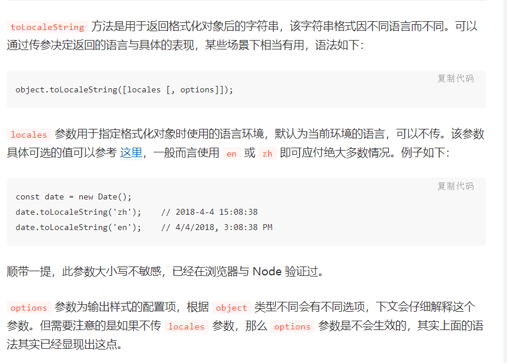

~~~javascript
var person1 = {
    toLocaleString : function () {
         return "Nikolaos";
	},
            
    toString : function() {
         return "Nicholas";
    }
};
        
var person2 = {
    toLocaleString : function () {
         return "Grigorios";
    },
            
    toString : function() {
         return "Greg";
    }
};
        
var people = [person1, person2];
alert(people);                      //Nicholas,Greg
alert(people.toString());           //Nicholas,Greg
alert(people.toLocaleString());     //Nikolaos,Grigorios
(这个并不熟)
~~~

我们在这里定义了两个对象：person1和person2。而且还分别**为每个对象定义了一个tostring()方法和一个toLocaleString()方法**，这两个方法返回不同的值。然后，创建一个包含前面定义的两个对象的数组。在将数组传递给alert()时，输出结果是“Nicholas，Greg”，因为调用了数组每一项的tostring()方法（同样，这与下一行显式调用toString()方法得到的结果相同）。而当调用数组的toLocalestring()方法时，输出结果是“Nikolaos ,Grigorios“，原因是调用了数组每一项的toLocaleString()方法。

**数组继承的toLocaleString()、toString()和valueOf()方法，在默认情况下都会以逗号分隔的字符串的形式返回数组项。**而如果使用<strong style="color:red">join()</strong>方法，则可以**使用不同的分隔符**来构建这个字符串。**join()方法只接收一个参数，即用作分隔符的字符串，然后返回包含所有数组项的字符串**。请看下面的例子：

~~~javascript
join()
	-该方法可以将数组转换为一个字符串
 	-该方法不会对原数组产生影响，而是将转换后的字符串作为结果返回
	-在join中可以指定一个字符串作为参数，这个字符串将会成为数组中元素的连接符
		如果不指定连接符，则默认使用，（逗号）作为连接符
		 
var arr = ["小虎" , "小驴" , "小猫"];
var result = arr.join("-");
console.log(typeof result);	//string
console.log(result);		//小虎-小驴-小猫

var colors = ["red", "green", "blue"];
alert(colors.join(","));      //red,green,blue
alert(colors.join("||"));     //red||green||blue
~~~

在这里，我们使用join()方法重现了toString()方法的输出。在传递逗号的情况下，得到了以逗号分隔的数组值。而在最后一行代码中，我们传递了双竖线符号，结果就得到了字符串"redll greenliblue"。**如果不给join()方法传入任何值，或者给它传入undefined，则使用逗号作为分隔符**。IE7及更早版本会错误的使用字符串“undefined“作为分隔符。

> 如果数组中的某一项的值是null或者undefined，那么该值在join()、toLocaleString()、toString()和valueOf()方法返回的结果中以空字符串表示。

> 2020年8月3日：截止到上面看完

### 栈方法(杯子：后进先出)

> 底部封闭，和杯子一样，插入和移除数据都在杯子的顶部进行。
>
> 栈顶部新增数据：push()
>
> 栈顶部移除数据：pop()
>
> 如果是数组，则左边是杯子顶部，右边是杯子底部。

ECMAScript数组也提供了一种让数组的行为类似于其他数据结构的方法。具体说来，数组可以表现得就像栈一样，后者是一种可以限制插入和删除项的数据结构。栈是一种<strong style="color:red">LIFO（Last-In-First-Out，后进先出）</strong>的数据结构，也就是**最新添加的项最早被移除**。而栈中项的插入（叫做推入）和移除（叫做弹出），只发生在<strong style="color:red">一个位置</strong>——栈的<strong style="color:red">顶</strong>部。ECMAScript为数组专门提供了<strong style="color:red">push()和pop()</strong>方法，以便实现类似栈的行为。

**push()方法(入栈)**可以接收任意数量的参数，把它们逐个添加到数组**末尾**，并返回修改后数组的**长度**(是一个数字，而不是一个数组)。

**而pop()方法(出栈)**则从数组<strong style="color:red">末尾</strong>移除**最后一项**，减少数组的length值，**然后返回移除的项**。请看下面的例子：

~~~javascript
 var colors = new Array();                      //创建一个数组
 var count = colors.push("red", "green");       //推入两项
 alert(count);  //2 是一个数字！！！！而不是一个数组
        
 count = colors.push("black");                  //插入另一项
 alert(count);  //3
        
 var item = colors.pop();                       //取得最后一项
 alert(item);   //"black"
 alert(colors.length);  //2
~~~

~~~javascript
var count = colors.push("red", "green");   //这个count为2，是个数字！！！
var item = colors.pop();     //这个item为black,是个数组中的一项！！！
push:推动，增加
~~~

以上代码中的数组可以看成是栈（代码本身没有任何区别，而push()和pop()都是数组默认的方法）。**首先**，我们使用push()将两个字符串**推入数组的末尾**，并将返回的**结果**保存在变量count中（值为2）。然后，再推入一个值，而结果仍然保存在count中。因为此时数组中包含3项，所以push()返回3。在**调用pop()**时，它会**返回数组的最后一项**，即字符串“black”。此后，数组中仅剩两项。

可以将栈方法与其他数组方法连用，像下面这个例子一样。

~~~javascript
 var colors = ["red", "blue"];
 colors.push("brown");              //添加另一项
 colors[3] = "black";               //添加一项
 alert(colors.length);  //4
        
 var item = colors.pop();           //取得最后一项
 alert(item);  //"black"
~~~

在此，我们首先用两个值来初始化一个数组。然后，使用push()添加第三个值，再通过直接在位置3上赋值来添加第四个值。而在调用pop()时，该方法返回了字符串“black”，即最后一个添加到数组的值。

### 队列方法（隧道：先进先出）

> 隧道2头通，插入数据在队伍末尾插入，移除数据在队伍头部移除(队伍前面是老大，干掉老大；队伍后面是小弟，新增小弟)
>
> 后端新增数据：push()
>
> 前端移除数据：shift()


> 前端新增数据：unshift()
>
> 后端移除数据：pop()

**栈数据结构**的访问规则是**LIFO（Last-In-First-Out，后进先出）**，而**队列数据结构**的访问规则是**FIFO**（**First-In-First-Out，先进先出**）。队列在列表的**末端添加**项，从列表的**前端移除**项。由于**push()**是向**数组末端**添加项的方法，因此要模拟队列只需一个从**数组前端**取得项的方法。实现这一操作的数组方法就是shift()，它能够<strong style="color:red">移除</strong>数组中的第一个项并返回该项，同时将数组长度减1。**结合使用shift()和push()方法**，可以**像使用队列一样使用数组**。

> 栈是后进先出：就像一个杯子，只有1个口（既是入口也是出口），后放的在上边，所以后进先出。
>
> 队列是先进先出：就像一条路，有2个口（入口，出口是不同的口），先进去的就可以先出去。
>
> shift的中文含义有移除的意思

~~~javascript
var colors = new Array();                      //创建一个数组
var count = colors.push("red", "green");       //插入两项
alert(count);  //2
        
count = colors.push("black");                  //推入另一项
alert(count);  //3
        
var item = colors.shift();（加粗）              //取得第一项(干掉老大)
alert(item);   //"red"  red是老大老大
alert(colors.length);  //2
~~~

这个例子首先使用push()方法**创建**了一个包含3种颜色名称的数组。代码中加粗的那一行使用shift()方法从数组中取得了第一项，即“red"。在移除第一项之后，“green”就变成了第一项，而“black“则变成了第二项，数组也只包含两项了。

ECMAScript还为数组提供了一个**unshift()方法**。顾名思义，**unshift()与shift()的用途相反**：它能在**数组前端**添加任意个项并返回新数组的长度。因此，同时使用unshift()和pop()方法，可以从**相反的方向**来模拟队列，即**在数组的前端添加项，从数组末端移除项**，如下面的例子所示。

~~~javascript
 var colors = new Array();                      //创建一个数组
 var count = colors.unshift("red", "green");    //前端推入两项
 alert(count);  //2
        
 count = colors.unshift("black");               //推入另一项
 alert(count);  //3
        
 var item = colors.pop();                     //取得最后一项
 alert(item);   //"green"
 alert(colors.length);  //2
~~~

这个例子创建了一个数组并使用unshift()方法先后推入了3个值。首先是“red"和“green“，然后是“black”，**数组中各项的顺序为“black”、"red"、"green”**。在调用pop()方法时，**移除并返回的是最后一项**，即"green"。

> IE7及更早版本对JavaScript的实现中存在一个偏差，其unshift()方法总是返回undefined而不是数组的新长度。IE8在非兼容模式下会返回正确的长度值。

~~~javascript
<!DOCTYPE html>
<html lang="en">
<head>
	<meta charset="UTF-8">
	<title>Document</title>
	<script>
		//创建一个数组
		var arr = ["孙悟空" , "猪八戒" , "沙和尚"];
		/**
		 * push()
		 * 	-该方法可以向数组的末尾添加一个或多个元素，并返回数组的新的长度
		 * 	-可以将要添加的元素作为方法的参数传递，
		 * 		这样这些元素将会自动添加到元素末尾
		 *
		 * -该方法会将数组新的长度作为返回值返回
		 */
		
		arr.push("唐僧" , "观音大士");
		console.log(arr);		//(5) ["孙悟空", "猪八戒", "沙和尚", "唐僧", "观音大士"]

		//var result = arr.push("唐僧" , "观音大士");
		//console.log("result =" + result);  //result =5，返回的是一个数字！！！
		
		/**
		 * pop()
		 * 	-该方法可以删除数组的最后一个元素,并将被删除的元素作为返回值返回
		 * 
		 */
		arr.pop()
		console.log(arr);	//(4) ["孙悟空", "猪八戒", "沙和尚", "唐僧"]

		result = arr.pop()
		console.log(arr);	//(3) ["孙悟空", "猪八戒", "沙和尚"]
		console.log("result =" + result);	//result =唐僧 返回的是一个数组中的一项！！！

		/**
		 * unshift()
		 * 	-向数组开头添加一个或多个元素，并返回新的数组
		 * 	-向前边插入元素以后，其他的元素索引会依次调整
		 */

		 console.log(arr);		//(3) ["孙悟空", "猪八戒", "沙和尚"]
		 arr.unshift("牛魔王","二郎神");
		 console.log(arr);		// ["牛魔王", "二郎神" ，"孙悟空", "猪八戒", "沙和尚"]

		 /**
		  * shift()
		  * 	-可以删除数组的第一个元素，并将被删除的元素作为返回值返回
		  */
		 console.log(arr);		//(5) ["牛魔王", "二郎神", "孙悟空", "猪八戒", "沙和尚"]
		 arr.shift();
		 console.log(arr);		//(4) ["二郎神", "孙悟空", "猪八戒", "沙和尚"]

		 result = arr.shift();
		 console.log(arr);	//(3) ["孙悟空", "猪八戒", "沙和尚"]
		 console.log("result = " + result);  //result = 二郎神
	</script>
</head>
<body>
	
</body>
</html>
~~~

> 2020年8月3日：截止到上面复习完

### 重排序方法(数组排序)

数组中已经存在两个可以直接用来重排序的方法：<strong style="color:red">reverse()和sort()</strong>。有读者可能猜到了，`reverse()`方法会反转数组项的顺序。请看下面这个例子。

~~~javascript
reverse()
  -该方法用来反转数组（前边的去后边，后边的去前边）
  -该方法会直接修改原数组

var values = [1, 2, 3, 4, 5];
values.reverse();
alert(values);       //5,4,3,2,1
~~~

这里数组的初始值及顺序是1、2、3、4、5。而调用数组的 reverse()方法后，其值的顺序变成了5、4、3、2、1。这个方法的作用相当直观明了，但**不够灵活**，因此才有了**sort()方法**。

在默认情况下，`sort()`方法按<strong style="color:red">升序(从小到大)</strong>排列数组项——**即最小的值位于最前面，最大的值排在最后面**。为了实现排序，`sort()`方法会**调用每个数组项的tostring()转型方法**，然后比较得到的字符串，以确定如何排序。**即使**数组中的**每一项都是数值**，sort()方法比较的也是**字符串**，如下所示。

~~~javascript
sort()
 -可以用来对数组进行排序
	也会影响原数组
    
 -即使对于纯数字的数组，使用sort()排序时，也会按照Unicode编码来排序
    所以对数字进行排序时，可能会得到错误的结果
    
var values = [0, 1, 5, 10, 15];
values.sort();
alert(values);    //0,1,10,15,5
~~~

可见，即使例子中值的顺序没有问题，但sort()方法也会根据测试字符串的结果改变原来的顺序。因为数值5虽然小于10，但在进行字符串比较时，“10"则位于"5"的前面，于是数组的顺序就被修改了。不用说，**这种排序方式在很多情况下都不是最佳方案**。因此sort()方法可以<strong style="color:red">接收一个比较函数作为参数</strong>，以便我们指定哪个值位于哪个值的前面。

**比较函数接收两个参数，如果第一个参数应该位于第二个之前则返回一个负数，如果两个参数相等则返回0，如果第一个参数应该位于第二个之后则返回一个正数**。以下就是一个**简单的比较函数**：

~~~javascript
function compare(value1, value2) {
    if (value1 < value2) {
          return -1;
   } else if (value1 > value2) {
          return 1;
   } else {
          return 0;
   }
}
~~~

这个比较函数可以适用于大多数数据类型，只要**将其作为参数**传递给sort()方法即可，如下面这个例子所示。

~~~javascript
var values = [0 , 1 , 5 , 10 , 15];
values.sort(compare);
alert(values);		//0 , 1 , 5 , 10 , 15
~~~

> `values.sort(compare)`到底是啥意思？？
>
> 现在是2020年10月12日，懂了一些了。

在将比较函数传递到sort()方法之后，数值仍然保持了正确的升序。当然，也可以通过比较函数产生降序排序的结果，只要交换比较函数返回的值即可。

~~~javascript
function compare(value1, value2) {
    if (value1 < value2) {
         return 1;
    } else if (value1 > value2) {
         return -1;
    } else {
         return 0;
    }
}
        
var values = [0, 1, 5, 10, 15];
values.sort(compare);
alert(values);    //15,10,5,1,0
~~~

> 这个例子还是有点看不懂啊
>
> 现在是2020年10月12日，可以懂了。

在这个修改后的例子中，比较函数在第一个值应该位于第二个之后的情况下返回1，而在第一个值应该在第二个之前的情况下返回-1。**交换返回值的意思是让更大的值排位更靠前**，也就是对数组按照**降序排序**。当然，如果只想反转数组原来的顺序，使用reverse()方法要更快一些。

> reverse()和sort()方法的返回值是经过排序之后的数组。

对于数值类型或者其 valueOf()方法会返回数值类型的对象类型，可以使用一个更简单的比较函数。这个函数只要用第二个值减第一个值即可。

~~~javascript
function compare（value1，value2）{
	return value2 - value1；
}
~~~

由于比较函数通过返回一个小于零、等于零或大于零的值来影响排序结果，因此减法操作就可以适当地处理所有这些情况。

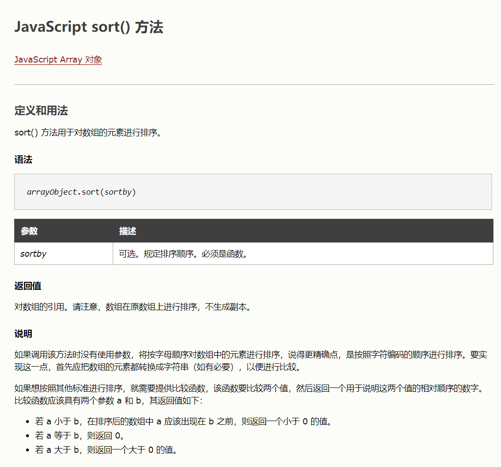

~~~javascript
我们可以自己来指定排序的规则
	我们可以在sort()中添加一个回调函数，来指定排序规则
    回调函数中需定义两个形参
	浏览器将会分别使用数组中的元素作为实参去调用回调函数
	使用哪个元素调用不确定，但是肯定的是在数组中a肯定在b前面
		 
	浏览器会根据回调函数的返回值来决定元素的顺序
		如果返回一个大于0的值，则元素会交换位置
		如果返回一个小于0的值，则元素位置不变
		如果返回一个0，则认为两个元素相等，也不交换位置
		
		arr = [5 ,4 ,3,11 , 3 ,2 ,9];
		arr.sort(function(a,b){
			if(a > b){
				return 1;
			}else if(a < b){
				return -1;
			}else{
				return 0;
			}
		}
  );
		console.log(arr);	//2,3，3，4,5,9,11

(方法里的参数是一个函数，上述代码理解的不深刻，说到底还是对函数认识不熟)
~~~

> 2020年8月3日：截止到上面复习完

### 操作方法

ECMAScript为操作已经包含在数组中的项提供了很多方法。其中，<strong style="color:red">concat()</strong>方法可以基于当前数组中的**所有项**创建一个<strong style="color:red">新数组</strong>。具体来说，这个方法会先创建当前数组一个<strong style="color:red">副本</strong>，然后将接收到的参数添加到这个副本的末尾，最后返回新构建的数组。在没有给concat()方法传递参数的情况下，它只是复制当前数组并返回副本。**如果传递给concat()方法的是一或多个数组，则该方法会将这些数组中的每一项都添加到结果数组中**。如果传递的值**不是数组**，这些值就会被**简单地添加到结果数组的末尾**。下面来看一个例子。

~~~javascript
var colors = ["red", "green", "blue"];
var colors2 = colors.concat("yellow", ["black", "brown"]);
        
alert(colors);     //red,green,blue        
alert(colors2);    //red,green,blue,yellow,black,brown
~~~

以上代码开始定义了一个包含3个值的数组colors。然后，基于colors调用了`concat()`方法，并传入字符串“yellow"和一个包含“black“和“brown”的数组。最终，结果数组colors2中包含了`“red”、"green"、“blue"、“yellow"、“black“和“brown”`。**至于原来的数组colors，其值仍然保持不变**。

>  concat可以连接两个或多个数组，并将新的数组返回
>
> 该方法**不会对原数组产生影响**
>
> concat:合并多个数组

下一个方法是`**slice()**`，它能够基于当前数组中的一或多个项**创建一个新数组**。**slice()方法可以接受一或两个参数，即要返回项的起始和结束位置**。在**只有一个参数**的情况下，slice()方法返回从该参数指定位置开始到当前数组末尾的所有项。如果**有两个参数**，该方法**返回起始和结束位置之间的项**一一但**不包括结束位置的项**。注意，**slice()方法不会影响原始数组**。请看下面的例子。

~~~javascript
 var colors = ["red", "green", "blue", "yellow", "purple"];
 var colors2 = colors.slice(1);
 var colors3 = colors.slice(1,4);
        
 alert(colors2);   //green,blue,yellow,purple
 alert(colors3);   //green,blue,yellow
~~~

在这个例子中，开始定义的数组colors包含5项。**调用`slice()方法`并传入1**会得到一个包含4项的新数组；因为是**从位置1开始复制，所以会包含“green“而不会包含"red”。**

这个新数组 colors2中包含的是`“green“、“blue”、“yellow"和“purple”`。接着，我们**再次调用slice()并传入了1和4**，表示**复制从位置1开始，到位置3结束**(如果**有两个参数**，该方法**返回起始和结束位置之间的项**一一但**不包括结束位置的项!!!**)。结果数组 colors3中包含了“green"、"blue“和“yellow"。

> 如果slice()方法的参数中有一个负数，则用数组长度加上该数来确定相应的位置。例如，在一个包含5项的数组上调用slice(-2,-1)与调用slice(3,4)得到的结果相同。如果结束位置小于起始位置，则返回空数组。
>
> slice:切片

~~~javascript
slice()
    -可以用来从数组中提取指定元素
	-该方法不会改变原数组，而是将截取到的元素封装到一个新数组中返回
	-参数：
		 1.截取开始的位置的索引(包含开头)
		 2.截取结束的位置的索引（不包含结尾）
         	 -包头不包尾（虎头蛇尾）
		  	 -第二个参数可以省略不写
		 
		索引可以传递一个负值,如果传递一个负值，则从后往前计算
		  	-1 倒数第一个
		  	-2 倒数第二个
var arr = ["孙悟空" , "猪八戒" , "沙和尚" , "唐僧" ,"白骨精"];  
var result = arr.slice(0,2);
console.log(result);    //孙悟空，猪八戒

var result1 = arr.slice(1);
console.log(result1);		//"猪八戒" , "沙和尚" , "唐僧" ,"白骨精"

var result2 = arr.slice(1,-2);
console.log(result2);		//"猪八戒" , "沙和尚" 
~~~

下面我们来介绍**splice()方法**，这个方法恐怕要算是**最强大的数组方法**了，它有很多种用法。splice()的主要用途是**向数组的中部插入项**，但使用这种方法的方式则有如下3种。

* **删除**：可以删除任意数量的项，只需指定**2个参数**：**要删除的第一项的位置和要删除的项数**。例如，**splice(0,2)会删除数组中的前2项。**

* **插入**：可以向指定位置插入任意数量的项，只需提供**3个参数**：**起始位置、0（要删除的项数）和要插入的项**。**如果要插入多个项，可以再传入第四、第五、以至任意多个项**。例如，splice(2,0,"red","green")会从当前数组的位置2开始插入字符串"red"和"green"。

* **替换**：可以**向指定位置插入任意数量的项**，且**同时删除任意数量的项**，只需指定**3个参数**： **起始位置、要删除的项数和要插入的任意数量的项**。**插入的项数不必与删除的项数相等**。例如`splice(2,1,"red","green")`会删除当前数组位置2的项，然后再从位置2开始插入字符串“red”和"green"。

**splice()方法始终都会返回一个数组**，该数组中包含从原始数组中删除的项（如果没有删除任何项，则返回一个空数组）。下面的代码展示了上述3种使用splice()方法的方式。

~~~javascript
 var colors = ["red", "green", "blue"];
 var removed = colors.splice(0,1);     //删除第一项
 alert(colors);     //green,blue
 alert(removed);    //red,返回的数组中只包含一项
        
 removed = colors.splice(1, 0, "yellow", "orange");  //从位置1开始插入2项
 alert(colors);     //green,yellow,orange,blue
 alert(removed);    /返回的是一个空数组

 removed = colors.splice(1, 1, "red", "purple");    //插入2项，删除1项
 alert(colors);     //green,red,purple,orange,blue
 alert(removed);    //yellow ，返回的数组中只包含一项
~~~

上面的例子首先定义了一个包含3项的数组 colors。**第一次**调用splice()方法只是**删除**了这个数组的第一项，之后 colors还包含“green“和“blue”两项。**第二次**调用splice()方法时在位置1**插入**了两项，结果 colors 中包含"green”、"yellow”、"orange“和“blue”。**这一次操作没有删除项，因此返回了一个空数组**。**最后一次**调用splice()方法删除了位置1处的一项，然后又插入了“red“和“purple"。在完成以上操作之后，数组 colors中包含的是“green"、"red"、"purple”、"orange“和“blue"。

> 2020年8月4日：截止到这里复习完

### 位置方法

ECMAScript5为**数组实例**添加了两个位置方法：**indexOf()和lastIndexOf()**。这两个方法都接收**两个参数**：**要查找的项和（可选的）表示查找起点位置的索引**。其中，**indexOf()方法**从数组的**开头（位置0）**开始向后查找，**lastIndexOf()方法**则从**数组的末尾**开始向前查找。

这两个方法都<strong style="color:red">返回要查找的项在数组中的位置</strong>，或者在**没找到**的情况下**返回-1**。在比较第一个参数与数组中的每一项时，会使用**全等操作符**；也就是说，要求**查找的项必须严格相等**（就像使用===样）。以下是几个例子。

~~~javascript
var numbers = [1,2,3,4,5,4,3,2,1];
        
alert(numbers.indexOf(4));        //3
alert(numbers.lastIndexOf(4));    //5
        
alert(numbers.indexOf(4, 4));     //5
alert(numbers.lastIndexOf(4, 4)); //3       

var person = { name: "Nicholas" };
var people = [{ name: "Nicholas" }];
var morePeople = [person];
        
alert(people.indexOf(person));     //-1
alert(morePeople.indexOf(person)); //0
~~~

使用`indexOf()`和`lastIndexOf()`方法查找特定项在数组中的位置非常简单，支持它们的浏览器包括IE9+、Firefox 2+、Safari3+、Opera 9.5+和Chrome。

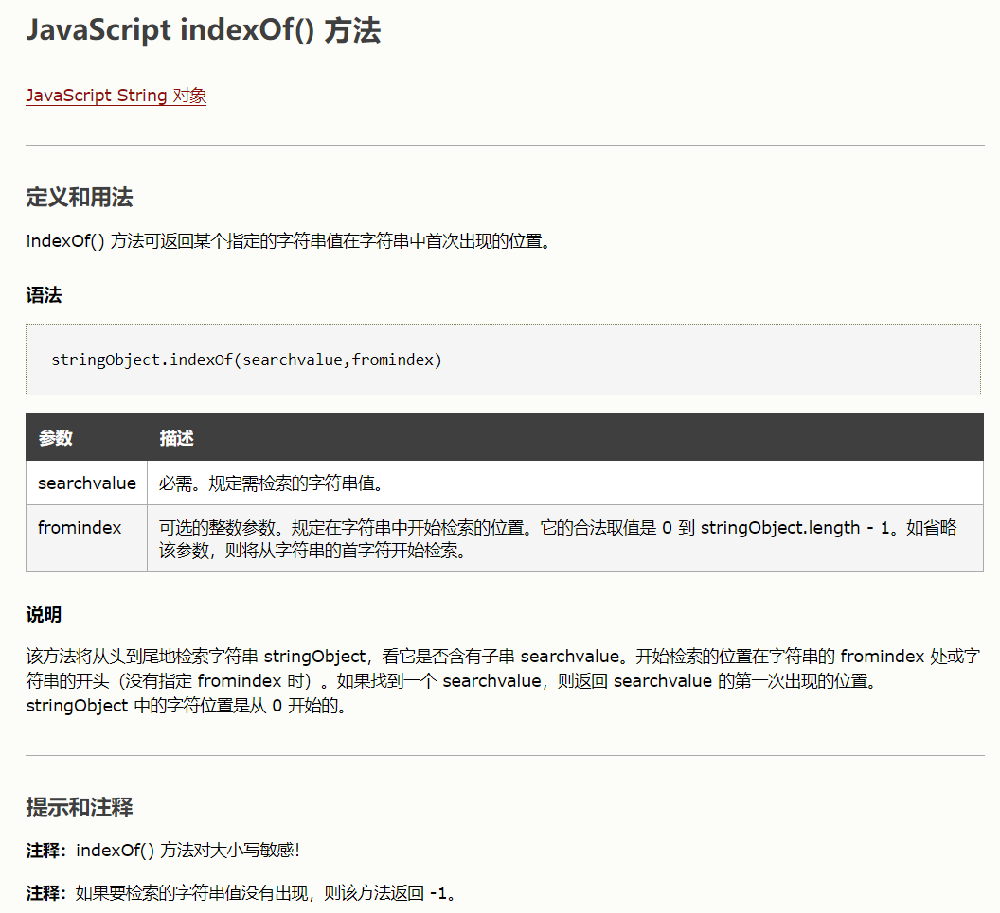

### 迭代方法

ECMAScript5为数组定义了**5个迭代方法**。每个方法都接收**两个参数**：要在**每一项上运行的函数和（可选的）运行该函数的作用域对象——影响this的值**。传入这些方法中的函数会**接收三个参数**：**数组项的值、该项在数组中的位置和数组对象本身**。根据使用的方法不同，这个函数执行后的返回值可能会也可能不会影响访问的返回值。以下是这5个迭代方法的作用。

> `every()`：对数组中的每一项运行给定函数，如果该函数对每一项都返回true，则返回true。
>
> `filter()`：对数组中的每一项运行给定函数，返回该函数会返回true的项组成的数组。
>
> `forEach()`：对数组中的每一项运行给定函数。这个方法没有返回值。
>
> `map()`：对数组中的每一项运行给定函数，返回每次函数调用的结果组成的数组。
>
> `some()`：对数组中的每一项运行给定函数，如果该函数对任一项返回true，则返回true。

以上方法都**不会修改数组中的包含的值**。

在这些方法中，**最相似的是every()和some()**，它们都用于**查询数组中的项是否满足某个条件**。**对every()来说，传入的函数必须对每一项都返回true，这个方法才返回true；否则，它就返回false**。而some()方法则是只要传人的函数对数组中的**某一项**返回true，就会返回true。请看以下例子。

~~~javascript
var numbers = [1,2,3,4,5,4,3,2,1];
        
var everyResult = numbers.every(function(item, index, array){
    return (item > 2);
});
        
alert(everyResult);       //false
        
var someResult = numbers.some(function(item, index, array){
    return (item > 2);
});
       
alert(someResult);       //true
~~~

以上代码**调用了every()和some()**，传人的函数只要**给定项大于2**就会返回true。对于every()，它返回的是false，因为只有部分数组项符合条件。对于some()，结果就是true，因为**至少有一项是大于2的**。

下面再看一看**filter()函数**，它利用指定的函数确定是否在返回的数组中包含的某一项。例如，要**返回一个所有数值都大于2的数组**，可以使用以下代码。

~~~javascript
var numbers = [1,2,3,4,5,4,3,2,1];
        
var filterResult = numbers.filter(function(item, index, array){
    return (item > 2);
});
        
alert(filterResult);   //[3,4,5,4,3]
~~~

这里，通过调用filter()方法创建并返回了包含3、4、5、4、3的数组，因为传入的函数对它们每一项都返回true。**这个方法对查询符合某些条件的所有数组项非常有用**。

**map()**也返回一个数组，而这个数组的每一项都是在原始数组中的对应项上运行传人函数的结果。例如，**可以给数组中的每一项乘以2，然后返回这些乘积组成的数组**，如下所示。

~~~javascript
 var numbers = [1,2,3,4,5,4,3,2,1];
        
 var mapResult = numbers.map(function(item, index, array){
     return item * 2;
});
        
alert(mapResult);   //[2,4,6,8,10,8,6,4,2]
~~~

以上代码返回的数组中包含给每个数乘以2之后的结果。这个方法适合创建包含的项与另一个数组一一对应的数组。

最后一个方法是**forEach()**，它只是**对数组中的每一项运行传入的函数**。**这个方法没有返回值**，**本质上与使用for 循环迭代数组一样**。来看一个例子。

~~~javascript
var numbers=[1，2，3，4，5，4，3，2，1]；

numbers.forEach（function(item，index，array){
		//执行某些操作
}）;
~~~

这些数组方法通过执行不同的操作，可以大大方便处理数组的任务。支持这些迭代方法的浏览器有IE9+、Firefox 2+、Safari3+、Opera9.5+和Chrome。

~~~javascript
一般我们都是使用for循环去遍历数组
JS中还为我们提供了一个方法，用来遍历数组	 
  forEach()
	 -这个方法只适用于IE8以上的浏览器
		IE8及以下的浏览器均不支持该方法，所以如果需要兼容IE8,则不要使用
		forEach,还是使用for循环来遍历
		 		
//创建一个数组
var arr = ["孙悟空" , "猪八戒" , "沙和尚" , "唐僧" ,"白骨精"];

 forEach()方法需要一个函数作为参数
	-像这种函数，由我们创建但是不由我们调用的，我们称为回调函数
 	-数组中有几个元素函数就会执行几次,每次执行时，浏览器会将遍历到的
 	  元素以实参的形式传递进来，我们可以来定义形参来读取这些内容
	-浏览器会在回调函数中传递三个参数:
		第一个参数，就是当前正在遍历的元素
		第二个参数，就是当前正在遍历的元素的索引
		第三个参数，就是正在遍历的数组
		 
arr.forEach(function(value , index, obj){
	console.log("value= " + value);
	console.log("index= " + index);
	console.log("obj= " + obj);
});
~~~

> 2020年8月4日：截止到这里复习完

### 缩小方法

ECMAScript 5还新增了两个**缩小数组**的方法：**reduce()和reduceRight()**。这两个方法都会**迭代**数组的所有项，然后构建一个最终返回的值。其中，**reduce()方法从数组的第一项开始，逐个遍历到最后。**而 reduceRight()则从数组的最后一项开始，向前遍历到第一项。

这两个方法都接收两个参数：一个在每一项上调用的函数和（可选的）作为缩小基础的初始值。传给 reduce()和reduceRight()的函数接收**4个参数**：**前一个值、当前值、项的索引和数组对象**。这个函数返回的**任何值都会作为第一个参数自动传给下一项**。第一次迭代发生在数组的第二项上，因此第一个参数是数组的第一项，第二个参数就是数组的第二项。

> 这个函数不太懂

使用reduce()方法可以执行求数组中所有值之和的操作，比如：

~~~javascript
 var values = [1,2,3,4,5];
 var sum = values.reduce(function(prev, cur, index, array){
     return prev + cur;
 });
 alert(sum);		//15
~~~

> reduce() 方法接收一个函数作为累加器，数组中的每个值（从左到右）开始缩减，最终计算为一个值。
>
> reduce() 可以作为一个高阶函数，用于函数的 compose。
>
> **注意:** reduce() 对于空数组是不会执行回调函数的。

第一次执行回调函数，prev是1，cur是2。第二次，prev是3（1加2的结果），cur是3（数组的第三项）。这个过程会持续到把数组中的每一项都访问一遍，最后返回结果。

**reduceRight()的作用类似**，只不过方向相反而已。来看下面这个例子。

~~~javascript
var values = [1 ,2 , 3 , 4 ,5];
var sum = values.reduceRight(function(prev , cur , index , array){
    return prev + cur;
});
alert(sum);
~~~

在这个例子中，第一次执行回调函数，prev是5，cur是4。当然，最终结果相同，因为执行的都是简单相加的操作。

**使用reduce()还是reduceRight()，主要取决于要从哪头开始遍历数组。除此之外，它们完全相同。**

支持这两个缩小函数的浏览器有IE9+、Firefox 3+、Safari4+、Opera 10.5和Chrome。

> 2020年8月4日：截止到这里看完

## Date类型(看了一点)

ECMAScript中的Date 类型是在**早期Java中的java.util.Date类**基础上构建的。为此，Date类型使用自UTC（Coordinated Universal Time，国际协调时间）1970年1月1日午夜（零时）开始经过的毫秒数来保存日期。在使用这种数据存储格式的条件下，Date类型保存的日期能够精确到1970年1月1日之前或之后的285616年。

要创建一个日期对象，使用new操作符和Date构造函数即可，如下所示。

~~~javascript
var now = new Date();
~~~

在调用Date构造函数而**不传递参数**的情况下，新创建的对象**自动获得当前日期和时间**。如果想根据特定的日期和时间创建日期对象，必须传入表示该日期的毫秒数（即从UTC时间1970年1月1日午夜起至该日期止经过的毫秒数）。为了简化这一计算过程，ECMAScript 提供了两个方法：<strong style="color:red">Date.parse()和Date.UTC()</strong>。

其中，**Date.parse()方法接收一个表示日期的字符串参数**，然后尝试根据这个字符串返回相应日期的**毫秒数**。ECMA-262没有定义Date.parse()应该支持哪种日期格式，因此这个方法的行为因实现而异，而且通常是因地区而异。将地区设置为**美国**的浏览器通常都接受下列日期格式：

~~~javascript
“月/日/年”，如6/13/2004；

“英文月名日，年”，如January 12，2004；

“英文星期几英文月名日年时:分:秒时区”，如Tue May 25200400:00:00GMT-0700。

ISO8601扩展格式YYYY-MM-DDTHH:mm:ss.sssZ（例如2004-05-25T00:00:00）。只有兼容ECMAScript5的实现支持这种格式。
~~~

例如，要为2004年5月25日创建一个日期对象，可以使用下面的代码：

~~~javascript
var someDate =new Date(Date.parse("May 25，2004"));
~~~

如果传入Date.parse()方法的字符串不能表示日期，那么它会返回NaN。**实际上，如果直接将表示日期的字符串传递给Date构造函数，也会在后台调用Date.parse()**。换句话说，下面的代码与前面的例子是等价的：

  ~~~javascript
  var someDate =new Date("May 25，2004"));
  ~~~

  这行代码将会得到与前面相同的日期对象。

> 日期对象及其在不同浏览器中的实现有许多奇怪的行为。其中有一种倾向是将超出范围的值替换成当前的值，以便生成输出。例如，在解析“January 32，2007时，有的浏览器会将其解释为“February 1，2007”。而Opera则倾向于插入当前月份的当前日期，返回“January当前日期，2007"。也就是说，如果在2007年9月21日运行前面的代码，将会得到“January 21，2007"（都是21日）。

Date.UTC()方法同样也返回表示日期的毫秒数，但它与Date.parse（）在构建值时使用不同的信息。Date.UTC()的参数分别是年份、基于0的月份（一月是0，二月是1，以此类推）、月中的哪一天（1到3l）、小时数（0到23）、分钟、秒以及毫秒数。在这些参数中，只有前两个参数（年和月）是必需的。如果没有提供月中的天数，则假设天数为1；如果省略其他参数，则统统假设为0。以下是两个使用Date.UTC()方法的例子：

~~~javascript
//GMT时间2000年1月1日午夜零时
var y2k = new Date(Date.UTC(2000, 0));
        
//GMT时间2005年5月5日下午5：55：55
var allFives = new Date(Date.UTC(2005, 4, 5, 17, 55, 55));

~~~

这个例子创建了两个日期对象。第一个对象表示GMT时间2000年1月1日午夜零时，传人的值一个是表示年份的2000，一个是表示月份的0（即一月份）。因为其他参数是自动填充的（即月中的天数为1，其他所有参数均为0），所以结果就是该月第一天的午夜零时。第二个对象表示GMT时间2005年5月5日下午5：55：55，即使日期和时间中只包含5，也需要传人不一样的参数：月份必须是4（因为月份是基于0的）、小时必须设置为17（因为小时以0到23表示），剩下的参数就很直观了。

如同模仿Date.parse()一样，Date构造函数也会模仿Date.UTC()，但有一点明显不同：日期和时间都基于本地时区而非GMT来创建。不过，Date构造函数接收的参数仍然与Date.UTc()相同。

因此，如果第一个参数是数值，Date构造函数就会假设该值是日期中的年份，而第二个参数是月份，以此类推。据此，可以将前面的例子重写如下。

~~~javascript
//本地时间2000年1月1日午夜零时
var y2k=new Date（2000，0）；

//本地时间2005年5月5日下午5：55：55
var allFives=new Date（2005，4，5，17，55，55）；
~~~

以上代码创建了与前面例子中相同的两个日期对象，只不过这次的日期都是基于系统设置的本地时区创建的。
ECMAScript5添加了Data.now()方法，返回表示调用这个方法时的日期和时间的毫秒数。这个方法简化了使用Data对象分析代码的工作。例如：

~~~javascript
//取得开始时间
var start=Date.now（）；

//调用函数
doSomething（）；

//取得停止时间
var stop=Date.now（），
result=stop - start；
~~~

在不支持它的浏览器中，使用+操作符把Data对象转换成字符串，也可以达到同样的目的。

~~~javascript
//取得开始时间
var atart = +new Date（）；

//调用函数
doSomething（）；

//取得停止时间
var stop = +new Date（），
result= stop start；
~~~

### 继承的方法（略）

### 日期格式化方法（略）

### 日期/时间组件方法（略）

## RegExp类型（正则表达式）

关于正则表达式的学习首先推荐几个网站：

[这个网站你写啥它显示啥](<https://regexper.com/#.ar>)

[github上学习正则表达式](<https://github.com/ziishaned/learn-regex/blob/master/translations/README-cn.md>)

ECMAScript通过RegExp 类型来支持正则表达式。使用下面类似Perl的语法，就可以创建一个正则表达式。

~~~javascript
var expression = /pattern/flags;
~~~

其中的**模式(patterm)部分**可以是**任何简单或复杂的正则表达式**，可以包含字符类、限定符、分组、向前查找以及反向引用。每个正则表达式都可**带有一或多个标志(flags)**，用以标明正则表达式的行为。

正则表达式的**匹配模式**支持下列**3个标志**。

* **g**：表示**全局（global）模式**，即模式将被**应用于所有字符串**，**而非在发现第一个匹配项时立即停止;**

* **i**：表示**不区分大小写（case-insensitive）模式**，即在确定匹配项时**忽略模式与字符串的大小写;**

* **m**：表示**多行（multiline）模式**，即在到达一行文本末尾时还会**继续查找下一行**中是否存在与模式匹配的项。

因此，一个正则表达式就是**一个模式与上述3个标志的组合体**。不同组合产生不同结果，如下面的例子所示。

~~~javascript
/*
 *匹配字符率中所有“at“的实例
/*
var pattern1 = /at/g；

/*
 *匹配第一个“bat“或“cat"，不区分大小写
*/
var pattern2 = /[bc]at/i；

/*
 *匹配所有以“at“结尾的3个字符的组合，不区分大小写
 */
var pattern3 = /.at/gi；
~~~

与其他语言中的正则表达式类似，模式中使用的所有**元字符**都必须转义。**正则表达式中的元字符包括**：

~~~
(  [ { \ ^  $ | ) ? * + .  ]  }
~~~

这些元字符在正则表达式中都有一或多种特殊用途，因此如果想要匹配字符串中包含的这些字符，就必须对它们进行转义。下面给出几个例子。

~~~javascript
/*
 *匹配第一个“bat“或“cat"，不区分大小写
 */
var pattern2 = /[bc]at/i；

/*
 *匹配第一个“[bc]at"，不区分大小写
 */
var pattern2 = /\[bc\]at/i

/*
 *匹配所有以“at“结尾的3个字符的组合，不区分大小写
 */
var pattern3 = /.at/gi；

/*
 *匹配所有".at"，不区分大小写
 */
var pattern4 = /\.at/gi
~~~

在上面的例子中，**pattern1**匹配第一个“bat”或“cat"，不区分大小写。而要想直接匹配“[bc]at"的话，就需要像定义**pattern2**一样，对其中的两个方括号进行转义。对于**pattern3**来说，句点表示位于“at”之前的任意一个可以构成匹配项的字符。但如果想匹配“.at”，则必须对句点本身进行转义，如**pattern4**所示。

前面举的这些例子都是以**字面量形式**来定义的正则表达式。另一种创建正则表达式的方式是使用**RegExp构造函数**，它接收**两个参数**：**一个是要匹配的字符串模式**，**另一个是可选的标志字符串**。可以使用字面量定义的任何表达式，都可以使用构造函数来定义，如下面的例子所示。

~~~javascript
/*
 *匹配第一个"bat"或"cat",不区分大小写
 */
var pattern1 = /[bc]at/i

/*
 *与pattern1相同，只不过是使用构造函数创建的
 */
var pattern2 = new RegExp("[bc]at" , "i");
~~~

在此，pattern1和pattern2是两个**完全等价**的正则表达式。要注意的是，传递给RegExp构造函数的**两个参数都是字符串**（**不能把正则表达式字面量传递给RegExp构造函数**）。由于RegExp构造函数的模式参数是字符串，所以在某些情况下要对字符进行双重转义。所有元字符都必须双重转义，那些已经转义过的字符也是如此，例如\n（字在字符串中通常被转义为\，而在正则表达式字符串中就会变成\）。下表给出了一些模式，左边是这些模式的字面量形式，右边是使用RegExp构造函数定义相同模式时使用的字符串。

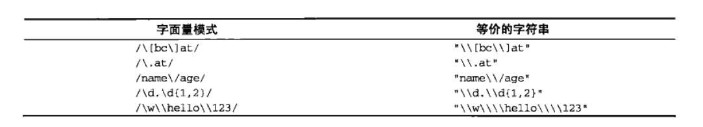

使用正则表达式字面量和使用RegExp构造函数创建的正则表达式不一样。在ECMAScript3中，**正则表达式字面量**始终会**共享**同一个RegExp实例，而使用**构造函数**创建的**每一个新RegExp实例都是一个新实例**。来看下面的例子。

~~~javascript
/*
 *正则表达式的方法：
 * test()
 * 使用这个方法可以用来检查一个字符串是否符合正则表达式的规则
 * 如果符合则返回true,否则返回false	
*/
var re = null;
	i;
for(i = 0; i < 10; i++){
    re = /cat/g
    re.test("catastrophe");
}

for(i = 0; i < 10; i++){
    re = new RegExp("cat" , "g");
     re.test("catastrophe");
}

~~~

在第一个循环中，即使是循环体中指定的，但实际上只为/cat/创建了一个RegExp实例。由于实例属性（下一节介绍实例属性）不会重置，所以在循环中再次调用test()方法会失败。这是因为第一次调用test()找到了“cat"，但第二次调用是从索引为3的字符（上一次匹配的末尾）开始的，所以就找不到它了。由于会测试到字符串末尾，所以下一次再调用test()就又从开头开始了。

第二个循环使用RegExp构造函数在每次循环中创建正则表达式。因为每次迭代都会创建一个新的RegExp实例，所以每次调用test()都会返回true。

**ECMAScript5明确规定，使用正则表达式字面量必须像直接调用RegExp构造函数一样，每次都创建新的RegExp实例。**IE9+、Firefox4+和Chrome都据此做出了修改。

### RegExp类型

RegExp的**每个实例都具有下列属性**，通过这些属性可以取得有关模式的各种信息。

* global：布尔值，表示是否设置了g标志。

* ignoreCase：布尔值，表示是否设置了i标志。

* lastIndex：整数，表示开始搜索下一个匹配项的字符位置，从0算起。

* multiline：布尔值，表示是否设置了m标志。

* source：正则表达式的字符串表示，按照字面量形式而非传入构造函数中的字符串模式返回。

通过这些属性可以获知一个正则表达式的各方面信息，但却没有多大用处，因为**这些信息全都包含在模式声明中**。例如：

~~~javascript
var pattern1 = /\[bc\]at/i;
        
alert(pattern1.global);     //false
alert(pattern1.ignoreCase); //true
alert(pattern1.multiline);  //false
alert(pattern1.lastIndex);  //0
alert(pattern1.source);     //"\[bc\]at"

var pattern2 = new RegExp("\\[bc\\]at", "i");
        
alert(pattern2.global);     //false
alert(pattern2.ignoreCase); //true
alert(pattern2.multiline);  //false
alert(pattern2.lastIndex);  //0
alert(pattern2.source);     //"\[bc\]at"
~~~

我们注意到，**尽管第一个模式使用的是字面量，第二个模式使用了RegExp构造函数，但它们的source属性是相同的。**可见，source属性保存的是规范形式的字符串，即字面量形式所用的字符串。

### RegExp实例方法

**RegExp对象的主要方法是exec()**，该方法是专门为**捕获组**而设计的。exec()接受**一个参数**，即要应用模式的字符串，然后返回包含第一个匹配项信息的数组；或者在没有匹配项的情况下返回null。**返回的数组虽然是Array的实例，但包含两个额外的属性：index和input**。其中，**index表示匹配项在字符串中的位置，而input表示应用正则表达式的字符串**。在数组中，第一项是与整个模式匹配的字符串，其他项是与模式中的捕获组匹配的字符串（如果模式中没有捕获组，则该数组只包含一项）。

请看下面的例子:

~~~javascript
var text = "mom and dad and baby";    
var pattern = /mom( and dad( and baby)?)?/gi;

var matches = pattern.exec(text);    
alert(matches.index);    //0
alert(matches.input);    //"mom and dad and baby"
alert(matches[0]);       //"mom and dad and baby"
alert(matches[1]);       //" and dad and baby"
alert(matches[2]);       //" and baby"
~~~

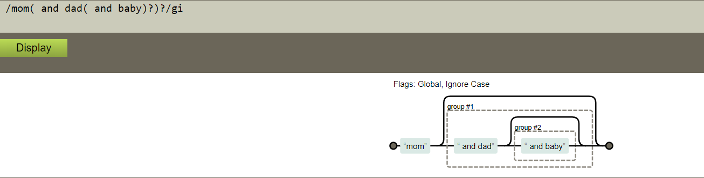

这个例子中的模式**包含两个捕获组**。最内部的捕获组匹配“and baby*，而包含它的捕获组匹配“and dad“或者“and dad and baby"。当把字符串传入exec()方法中之后，发现了一个匹配项。因为整个字符串本身与模式匹配，所以返回的数组 matchs的index属性值为0。数组中的第一项是匹配的整个字符串，第二项包含与第一个捕获组匹配的内容，第三项包含与第二个捕获组匹配的内容。

**对于exec()方法而言**，**即使**在模式中设置了**全局标志（g）**，它**每次也只会返回一个匹配项**。在不设置全局标志的情况下，在同一个字符串上多次调用exec()将始终返回第一个匹配项的信息。而在设置全局标志的情况下，每次调用exec()则都会在字符串中继续查找新匹配项，如下面的例子所示:

~~~javascript
 var text = "cat, bat, sat, fat";        
 var pattern1 = /.at/;
        
 var matches = pattern1.exec(text);        
 alert(matches.index);    //0
 alert(matches[0]);       //"cat"
 alert(pattern1.lastIndex);//0

 matches = pattern1.exec(text);        
 alert(matches.index);    //0
 alert(matches[0]);       //"cat"
 alert(pattern1.lastIndex);//0

 var pattern2 = /.at/g;
        
 var matches = pattern2.exec(text);        
 alert(matches.index);    //0
 alert(matches[0]);       //"cat"
 alert(pattern2.lastIndex);//0

 matches = pattern2.exec(text);        
 alert(matches.index);    //5
 alert(matches[0]);       //"bat"
 alert(pattern2.lastIndex);//0
~~~

> 没怎么看懂

这个例子中的**第一个模式 pattern1不是全局模式**，因此**每次调用exec()返回的都是第一个匹配项（“cat"）**。而第二个模式pattern2是全局模式，因此每次调用exec()都会返回字符串中的下一个匹配项，直至搜索到字符串末尾为止。此外，还应该注意模式的1astIndex属性的变化情况。在全局匹配模式下，1astIndex的值在每次调用exec()后都会增加，而在非全局模式下则始终保持不变。

> IE的JavaScript实现在lastIndex属性上存在偏差，即使在非全局模式下，lastIndex属性每次也会变化。

**正则表达式的第二个方法是test()**，它**接受一个字符串参数**。在模式与该参数匹配的情况下返回true；否则，返回false。在只想知道目标字符串与某个模式是否匹配，但不需要知道其文本内容的情况下，使用这个方法非常方便。因此，test()方法经常被用在if语句中，如下面的例子所示:

~~~javascript
var text = "000-00-0000";
var pattern = /\d{3}-\d{2}-d{4}/;

if(pattern.test(text)){
    alert("Then pattern was matched.");
}
~~~

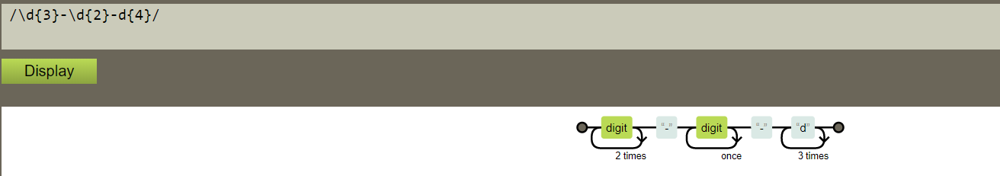

在这个例子中，我们使用正则表达式来测试了一个数字序列。如果输入的文本与模式匹配，则显示一条消息。这种用法经常出现在验证用户输入的情况下，因为我们只想知道输入是不是有效，至于它为什么无效就无关紧要了。

RegExp 实例继承的toLocalestring()和tostring()方法都会返回正则表达式的字面量，与创建正则表达式的方式无关。例如：

~~~javascript
 var pattern = new RegExp("\\[bc\\]at", "gi");
 alert(pattern.toString());    // /\[bc\]at/gi
 alert(pattern.toLocaleString());    // /\[bc\]at/gi
~~~

即使上例中的模式是通过调用RegExp构造函数创建的，但tolocalestring()和tostring()方法仍然会像它是以字面量形式创建的一样显示其字符串表示。

> 正则表达式的valueOf()方法返回正则表达式本身。

> 2020年8月4日：截止到这里看完(估计看得有点赶，没怎么看懂)

### RegExp构造函数属性

RegExp构造函数包含一些属性（这些属性在其他语言中被看成是**静态属性**）。这些属性适用于作用域中的所有正则表达式，并且基于所执行的最近一次正则表达式操作而变化。关于这些属性的另一个独特之处，就是可以通过**两种方式**访问它们。换句话说，这些属性分别有一个**长属性名和一个短属性名**（Opera是例外，它不支持短属性名）。下表列出了RegExp构造函数的属性。

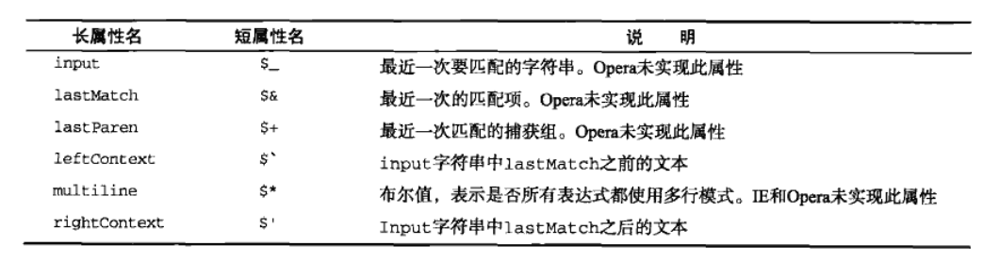

使用这些属性可以从exec()或test()执行的操作中提取出更具体的信息。请看下面的例子。

~~~javascript
var text = "this has been a short summer";
var pattern = /(.)hort/g;
        
/*
 * 注意：Opera不支持input、1astMatch、lastparen和multiline 属性
 * Internet Explorer 不支持multiline属性
 */     

if (pattern.test(text)){
     alert(RegExp.input);               //this has been a short summer
     alert(RegExp.leftContext);         //this has been a            
     alert(RegExp.rightContext);        // summer
     alert(RegExp.lastMatch);           //short
     alert(RegExp.lastParen);           //s
     alert(RegExp.multiline);           //false
}
~~~

以上代码创建了一个模式，匹配任何一个字符后跟hort，而且把第一个字符放在了一个捕获组中。
RegExp构造函数的各个属性返回了下列值：

* input属性返回了原始字符串；

* leftContext 属性返回了单词short之前的字符串，而rightcontext属性则返回了short之后的字符串；

* lastMatch 属性返回最近一次与整个正则表达式匹配的字符串，即short；

* lastParen属性返回最近一次匹配的捕获组，即例子中的s。

如前所述，**例子使用的长属性名都可以用相应的短属性名来代替**。只不过，由于这些短属性名大都不是有效的ECMAScript标识符，因此必须通过方括号语法来访问它们，如下所示。

~~~javascript
var text = "this has been a short summer";
var pattern = /(.)hort/g;

/*
 * 注意：Opera不支持input、1astMatch、lastparen和multiline 属性
 * Internet Explorer 不支持multiline属性
 */     

if (pattern.test(text)){
     alert(RegExp.$_);               //this has been a short summer
     alert(RegExp["$`"]);            //this has been a            
     alert(RegExp["$'"]);            // summer
     alert(RegExp["$&"]);            //short
     alert(RegExp["$+"]);            //s
     alert(RegExp["$*"]);            //false
}
~~~

除了上面介绍的几个属性之外，还有多达9个用于存储捕获组的构造函数属性。访问这些属性的语法是RegExp.\$1、RegExp.\$2···RegExp.$9，分别用于存储第一、第二······第九个匹配的捕获组。在调用exec()或test()方法时，这些属性会被自动填充。然后，我们就可以像下面这样来使用它们。

~~~javascript
var text = "this has been a short summer";
var pattern = /(..)or(.)/g; 
if (pattern.test(text){
	alert (RegExp.$1); 	//sh
	alert (RegExp.$2);	//t
~~~

这里创建了一个包含两个捕获组的模式，并用该模式测试了一个字符串。即使test()方法只返回一个布尔值，但RegExp构造函数的属性\$1和$2也会被匹配相应捕获组的字符串自动填充。

### 模式的局限性

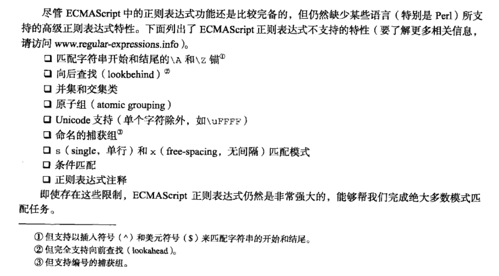

> 2020年8月7日：截止到这里看完。
>
> 估计正则表达式几乎没用过，所以对这些用法并不熟悉。

## Function类型

说起来ECMAScript中什么最有意思，我想那莫过于函数了——而有意思的根源，则在于**函数实际上是对象**。**每个函数都是Function类型的实例**，而且都**与其他引用类型一样**具有**属性和方法**。由于函数是对象，因此**函数名实际上也是一个指向函数对象的指针**，**不会与某个函数绑定**。函数通常是使用<strong style="color:red">函数声明</strong>语法定义的，如下面的例子所示。

~~~javascript
//函数声明写法
function sum(num1 , num2){
    return num1 + num2;
} //没有分号
~~~

这与下面使用<strong style="color:red">函数表达式</strong>定义函数的方式几乎相差无几。

~~~javascript
//函数表达式写法
//变量sum初始化为了一个函数
var sum = function(num1 , num2){
    return num1 + num2;
};	//有分号
~~~

以上代码定义了**变量sum** 并**将其初始化为一个函数**。有读者可能会注意到，function关键字后面没有函数名。这是因为**在使用函数表达式定义函数时，没有必要使用函数名——通过变量sum即可以引用函数**。另外，还要注意**函数末尾有一个分号，就像声明其他变量时一样**。

最后一种(第3种)定义函数的方式是使用<strong style="color:red">Function构造函数</strong>。Function构造函数可以接收任意数量的参数，但<strong style="color: red">最后一个参数</strong>始终都被看成是函数体，而前面的参数则枚举出了新函数的参数。来看下面的例子：

~~~javascript 
var sum = new Function("num1" , "num2" , "return num1 + num2");		//不推荐
~~~

从技术角度讲，这是一个**函数表达式**。但是，我们不推荐读者使用这种方法定义函数，因为这种语法会**导致解析两次代码**（第一次是解析常规ECMAScript代码，第二次是解析传入构造函数中的字符串），从而影响性能。不过，这种语法对于理解“<strong style="color: red">函数是对象，函数名是指针</strong>”的概念倒是非常直观的。

**由于函数名仅仅是指向函数的指针，因此函数名与包含对象指针的其他变量没有什么不同**。换句话说，**一个函数可能会有多个名字**，如下面的例子所示。

~~~javascript
 function sum(num1, num2){
    return num1 + num2;
}  

alert(sum(10,10));    //20
        
var anotherSum = sum;        
alert(anotherSum(10,10));  //20
        
sum = null;        
alert(anotherSum(10,10));  //20
~~~

> 能够看懂上面的代码

以上代码首先定义了一个名为sum()的函数，用于求两个值的和。然后，又声明了变量anotherSum，并将其设置为与sum相等（将sum的值赋给anotherSum）。注意，<strong style="color: red">使用不带圆括号的函数名是访问函数指针，而非调用函数</strong>。此时，anotherSum和sum就都指向了同一个函数，因此anotherSum()也可以被调用并返回结果。**即使将sum设置为null，让它与函数“断绝关系”，但仍然可以正常调用anotherSum()。**

### 没有重载（深入理解）

**将函数名想象为指针**，也有助于理解为什么ECMAScript中没有函数重载的概念。以下是曾在第3章使用过的例子。

~~~javascript
function addSomeNumber(num){
    return num + 100;
}

function addSomeNumber(num){
    return num + 200;
}

var result = addSomeNumber(100);	//300
~~~

显然，这个例子中**声明了两个同名函数**，而结果则是<strong style="color: red">后面的函数覆盖了前面的函数</strong>。以上代码实际上与下面的代码没有什么区别。

~~~javascript
var addSomeNumber = function(num){
    return num + 100;
};

addSomeNumber = function (num){
    return num + 200;
};

var result = addSomeNumber(100);	//300
~~~

通过观察重写之后的代码，很容易看清楚到底是怎么回事儿——在创建第二个函数时，实际上**覆盖**了引用第一个函数的变量addSomeNumber。

### 函数声明与函数表达式

本节到目前为止，我们一直没有对**函数声明和函数表达式**加以**区别**。而实际上，解析器在向执行环境中加载数据时，对**函数声明和函数表达式并非一视同仁**。解析器会**率先读取函数声明**，并**使其在执行任何代码之前可用**（可以访问）；至于**函数表达式**，则**必须等到解析器执行到它所在的代码行，才会真正被解释执行**。请看下面的例子。

~~~javascript
alert(sum(10,10))；			//可以运行！
function sum(num1, num2){	//这个是函数声明
    return num1 + num2;
}  
~~~

以上代码**完全可以正常运行**。因为在代码开始执行之前，解析器就已经通过一个名为<strong style="color: red">函数声明提升</strong>（function declaration hoisting）的过程，**读取并将函数声明添加到执行环境中**。对代码求值时，**JavaScript引擎**在第一遍会声明函数并将它们放到源代码树的**顶部**。所以，**即使声明函数的代码在调用它的代码后面，JavaScript 引擎也能把函数声明提升到顶部**。如果像下面例子所示的，**把上面的函数声明改为等价的函数表达式，就会在执行期间导致错误。**

~~~javascript
alert(sum(10,10))；	   //不可以运行！会报错！
var sum = function sum(num1, num2){  //这个是函数表达式
    return num1 + num2;
};  
~~~

以上代码之所以会在运行期间产生错误，原因在于<strong style="color: red">函数位于一个初始化语句中，而不是一个函数声明</strong>。换句话说，**在执行到函数所在的语句之前，变量sum中不会保存有对函数的引用**(**sum本身是一个指针**)；而且，由于第一行代码就会导致“unexpected identifier”（意外标识符）错误，实际上也不会执行到下一行。

**除了什么时候可以通过变量访问函数这一点区别之外**，函数声明与函数表达式的**语法**其实是**等价**的。

> 也可以同时使用函数声明和函数表达式，例如`var sum=function sum(){}`。不过，这种语法在Safari中会导致错误。

### 作为值的函数

因为ECMAScript中的**函数名(如上文的sum)**本身就是**变量**，所以<strong style="color:red">函数也可以作为值来使用</strong>。也就是说，**不仅可以像传递参数一样把一个函数传递给另一个函数**，而且可以将一个函数作为**另一个函数的结果返回**。来看一看下面的函数

> 函数名本身就是变量，所以可以把函数作为参数传递给另一个函数

~~~javascript
function callSomeFunction(someFunction,someArgument){
    return someFunction(someArgument);
}
~~~

这个函数接受两个参数。**第一个参数应该是一个函数**，**第二个参数应该是要传递给该函数的一个值**。
然后，就可以像下面的例子一样传递函数了。

~~~javascript
function addTen(num){
      return num + 10;
}
        
var result1 = callSomeFunction(addTen, 10);
//注意不是addTen(),访问的只是函数的指针，而不是执行addTen这个函数的结果
alert(result1);   //20
        
function getGreeting(name){
     return "Hello, " + name;
}
        
var result2 = callSomeFunction(getGreeting, "Nicholas");
//注意不是getGreeting()，访问的只是函数的指针，而不是执行getGreeting这个函数的结果
alert(result2);   //Hello, Nicholas
~~~

> 上面的代码看懂了。

这里的callSomeFunction()函数是**通用**的，即无论第一个参数中传递进来的是什么函数，它都会返回执行第一个参数后的结果。还记得吧，<strong style="color: red">要访问函数的指针而不执行函数的话，必须去掉函数名后面的那对圆括号</strong>。因此上面例子中**传递给callSomeFunction()的是addTen和getGreeting**，而**不是执行它们之后的结果**。

当然，**可以从一个函数中返回另一个函数，而且这也是极为有用的一种技术**。例如，假设有一个对象数组，我们想**要根据某个对象属性对数组进行排序**。而传递给数组**sort()方法**的比较函数要接收两个参数，即要比较的值。

[JavaScript sort() 方法](<https://www.runoob.com/jsref/jsref-sort.html>)

[js 自带的sort() 方法全面了解](<https://www.jb51.net/article/90573.htm>)

可是，我们**需要一种方式来指明按照哪个属性来排序**。要解决这个问题，可以**定义一个函数**，它**接收一个属性名**，然后**根据这个属性名来创建一个比较函数**，下面就是这个函数的定义。

~~~javascript
 function createComparisonFunction(propertyName) {                                    
     return function(object1, object2){
        var value1 = object1[propertyName];
        var value2 = object2[propertyName];
        
        if (value1 < value2){
              return -1;
        } else if (value1 > value2){
              return 1;
        } else {
              return 0;
        }
    };
}
~~~

> 看不懂
>
> 2020年8月7日，看懂一些了。
>
> 2020年10月12日，看懂了。

这个函数定义看起来有点复杂，但**实际上无非就是在一个函数中嵌套了另一个函数**，而且**内部函数前面加了一个return操作符**。在内部函数接收到`propertyName`参数后，它会使用**方括号表示法**来**取得给定属性的值**。**取得了想要的属性值之后，定义比较函数就非常简单了**。上面这个函数可以像在下面例子中这样使用。

~~~javascript
var data = [{name: "Zachary", age: 28}, {name: "Nicholas", age: 29}];

data.sort(createComparisonFunction("name"));
alert(data[0].name);  //Nicholas
        
data.sort(createComparisonFunction("age"));
alert(data[0].name);  //Zachary        
~~~

这里，我们创建了一个**包含两个对象的数组 data。**其中，每个对象都包含一个name属性和一个age属性。在默认情况下，**sort()方法会调用每个对象的tostring（）方法以确定它们的次序**；但得到的结果往往并不符合人类的思维习惯。因此，我们调用`createComparisonFunction("name")`方法**创建了一个比较函数**，以便按照每个对象的name属性值进行排序。而结果排在前面的第一项是name为“Nicholas"，age是29的对象。然后，我们又使用了`createComparisonFunction（"age"）`返回的比较函数，这次是按照对象的age 属性排序。得到的结果是name值为“zachary"，age值是28的对象排在了第一位。

> 大概能看懂，但是总感觉不够深刻。

### 函数内部属性

在函数内部，有两个特殊的<strong style="color: red">对象</strong>：<strong style="color: red">arguments</strong>和<strong style="color: red">this</strong>。其中，arguments在第3章曾经介绍过，它是一个**类数组对象**(伪数组)，包含着**传入函数中的所有参数**。虽然**arguments的主要用途是保存函数参数**，但**这个对象还有一个名叫callee的属性，该属性是一个指针，指向拥有这个arguments对象的函数**。

> this是对象！！！

请看下面这个非常经典的阶乘函数。

~~~javascript
function factorial(num){
    if(num <= 1){
        return 1;
    }else{
        return factorial(num-1)
    }
}
~~~

定义阶乘函数一般都要用到**递归算法**；如上面的代码所示，在函数有名字，而且名字以后也不会变的情况下，这样定义没有问题。但问题是**这个函数的执行与函数名factorial紧紧耦合在了一起**。为了消除这种紧密耦合的现象，可以像下面这样使用**arguments.callee**。

~~~javascript
function factorial(num){
    if(num <= 1){
        return 1;
    }else{
        return num * arguments.callee(num-1)
    }
}
~~~

[原生JS函数的callee属性](<https://www.cnblogs.com/evilliu/p/10064730.html>)

在这个**重写后**的factorial()函数的函数体内，没有再引用函数名factorial。这样，无论引用函数时使用的是什么名字，都可以保证正常完成递归调用。例如:     

~~~javascript
var trueFactorial = factorial;
//函数是对象，函数名是变量，是包含指针的变量
factorial = function(){
    return 0;
};

alert(trueFactorial(5));		//120
alert(factorial(5));			//0
~~~

在此，**变量trueFactorial获得了factorial的值，实际上是在另一个位置上保存了一个函数的指针**。然后，**我们又将一个简单地返回0的函数赋值给factoria1变量**。**如果像原来的factorial()那样不使用arguments.callee，调用trueractorial()就会返回0**。可是，在解除了函数体内的代码与函数名的耦合状态之后，trueFactorial()仍然能够正常地计算阶乘；至于factorial()，它现在只是一个返回0的函数。

> 这段话我懂
>
> 2020年8月7日：这段话我依旧懂

函数内部的另一个<strong style="color:red">特殊对象是this</strong>，其行为与Java和C#中的this大致类似。换句话说，t**his引用的是函数据以执行的环境对象——或者也可以说是this值**(**当在网页的全局作用域中调用函数时，this对象引用的就是window**)。来看下面的例子。

~~~javascript
 window.color = "red";
 var o = { color: "blue" };
        
 function sayColor(){
    alert(this.color);
}
        
 sayColor();     //red
        
 o.sayColor = sayColor;
 o.sayColor();   //blue
~~~

上面这个函数saycolor()是在**全局作用域**中定义的，它引用了this对象。**由于在调用函数之前，this的值并不确定，因此this可能会在代码执行过程中引用不同的对象。**当在**全局作用域中**调用sayColor()时，**this 引用的是全局对象window**；换句话说，对this.color求值会转换成对window.color 求值，于是结果就返回了"red"。而当**把这个函数赋给对象o并调用o.saycolor()时，this引用的是对象o**，因此对this.color求值会转换成对o.color求值，结果就返回了“blue"。

>  请读者一定要牢记，**函数的名字仅仅是一个包含指针的变量而已**。因此，即使是在不同的环境中执行，全局的sayColor()函数与o.sayColor()指向的仍然是同一个函数。

ECMAScript5也规范化了**另一个函数对象的属性：caller**。除了Opera的早期版本不支持，其他浏览器都支持这个ECMAScript3并没有定义的属性。这个属性中保存着调用当前函数的函数的引用，**如果是在全局作用域中调用当前函数，它的值为null**。例如：

[js中的caller属性和callee属性](<https://blog.csdn.net/setsunadoudou/article/details/102467594>)

~~~javascript
function outer(){
    inner();
}

function inner(){
    alert(inner.caller);
}

outer();
~~~

> 上面的代码看不懂

**以上代码会导致警告框中显示outer()函数的源代码。因为outer()调用了inter()，所以inner.caller 就指向outer()。**

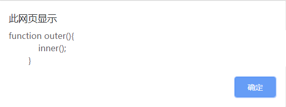

为了实现更松散的耦合，也可以通过**arguments.callee.caller**来访问相同的信息。

~~~javascript
function outer(){
    inner();
}

function inner(){
    alert(arguments.callee.caller);
}

outer();
~~~

> IE、Firefox、Chrome和Safari的所有版本以及Opera9.6都支持caller属性。

**当函数在严格模式下运行时，访问arguments.callee会导致错误。**ECMAScript5还定义了arguments.caller属性，但在**严格模式下**访问它也会导致错误，而在**非严格模式下这个属性始终是undefined**。**定义这个属性是为了分清arguments.caller和函数的caller属性**。以上变化都是为了加强这门语言的安全性，这样第三方代码就不能在相同的环境里窥视其他代码了。

**严格模式还有一个限制：不能为函数的caller属性赋值，否则会导致错误。**

### 函数属性与方法(★★★★★)(call,apply,bind都不熟)

前面曾经提到过，ECMAScript中的**函数是对象**，因此**函数也有属性和方法**。每个**函数**都包含**两个属性**：length和<strong style="color: red">prototype</strong>。其中，**length属性**表示函数希望接收的命名参数的个数，如下面的例子所示。

~~~javascript
function sayName(name){
     alert(name);
}      
        
function sum(num1, num2){
      return num1 + num2;
}
        
function sayHi(){
      alert("hi");
}
        
alert(sayName.length);  //1
alert(sum.length);      //2
alert(sayHi.length);    //0
~~~

以上代码定义了3个函数，但**每个函数接收的命名参数个数不同**。首先，sayName()函数定义了一个参数，因此其length属性的值为1。类似地，sum()函数定义了两个参数，结果其length属性中保存的值为2。而sayHi()没有命名参数，所以其length值为0。

> length属性很好理解，protytype属性就不好理解了。

<strong style="color:red">在ECMAScript核心所定义的全部属性中，最耐人寻味的就要数prototype属性了。</strong>

对于ECMAScript中的**引用类型**而言，<strong style="color: red">prototype是保存它们所有实例方法的真正所在</strong>。换句话说，**诸如toString()和valueOf()等方法实际上都保存在prototype名下，只不过是通过各自对象的实例访问罢了。**

[JavaScript中valueOf函数与toString方法深入理解](<https://www.jb51.net/article/32327.htm>)

在创建**自定义引用类型以及实现继承**时，prototype属性的作用是极为重要的（第6章将详细介绍）。在ECMAScript5中，prototype属性是<strong style="color: red">不可枚举</strong>的，因此使用**for-in**无法发现。

[如何理解和熟练运用 JS 中的 call 及 apply？](<https://www.zhihu.com/question/20289071/answer/14644278>)

每个**函数**都包含两个**非继承而来**的**方法**：<strong style="color:red">apply()和call()</strong>。这两个方法的用途都是**在特定的作用域**中**调用函数**，实际上**等于设置函数体内this对象的值**。

> apply()和call()方法我一直不太清楚，对我来说是一个难点。
>
> **call 与 apply 的相同点**：
>
> 方法的含义是一样的，即方法功能是一样的；
>
> **第一个参数**的作用是一样的；
>
> **call 与 apply 的不同点：两者传入的列表形式不一样**
>
> call可以传入**多个参数**；
> apply只能传入**两个参数**，所以其**第二个参数**往往是**作为数组形式传入**
>
> 存在的意义：实现（多重）继承
>

首先，**apply()方法接收两个参数**：**一个是在其中运行函数的作用域**，**另一个是参数数组**。其中，**第二个参数可以是Array的实例，也可以是arguments对象**。例如：

~~~javascript
function sum(num1, num2){
     return num1 + num2;
}
        
function callSum1(num1, num2){
     return sum.apply(this,arguments);
}
        
function callSum2(num1, num2){
      return sum.apply(this, [num1, num2]);
}
        
alert(callSum1(10,10));   //20
alert(callSum2(10,10));   //20
~~~

在上面这个例子中，callSum1()在执行sum()函数时传入了this作为this值（因为是**在全局作用域中调用的**，所以**传入的就是window对象**）和**arguments对象**。而callSum2同样也调用了sum()函数，但它传入的则是this和一个参数数组。**这两个函数都会正常执行并返回正确的结果**。

> 在严格模式下，未指定环境对象而调用函数，则this值不会转型为window。
> 除非明确把函数添加到某个对象或者调用apply()或call()，否则this值将是undefined。

call()方法与apply()方法的作用相同，**它们的区别仅在于接收参数的方式不同**。对于call()方法而言，**第一个参数是this值没有变化，变化的是其余参数都直接传递给函数**。换句话说，**在使用call()方法时，传递给函数的参数必须逐个列举出来**，如下面的例子所示。

~~~javascript
function sum(num1, num2){
    return num1 + num2;
}
        
function callSum(num1, num2){
    return sum.call(this, num1, num2);
}
        
alert(callSum(10,10));   //20
~~~

在使用call()方法的情况下，callSum()必须明确地传人每一个参数。结果与使用apply()没有什么不同。**至于是使用apply()还是call()，完全取决于你采取哪种给函数传递参数的方式最方便**。**如果你打算直接传入arguments对象，或者包含函数中先接收到的也是一个数组，那么使用apply()肯定更方便；否则，选择call()可能更合适。（在不给函数传递参数的情况下，使用哪个方法都无所谓。）**

事实上，传递参数并非apply()和call()真正的用武之地；它们真正强大的地方是**能够扩充函数赖以运行的作用域。**下面来看一个例子。

~~~javascript
window.color = "red";
var o = { color: "blue" };
        
function sayColor(){
    alert(this.color);
}     
sayColor();            //red      
sayColor.call(this);   //red
sayColor.call(window); //red
sayColor.call(o);      //blue
~~~

这个例子是在前面说明this对象的示例基础上修改而成的。这一次，**sayColor()也是作为全局函数定义的**，而且当在全局作用域中调用它时，它确实会显示“red“——因为对this.color的求值会转换成对window.color的求值。而 sayColor.call(this)和sayColor.call(window)，则是两种**显式地在全局作用域中调用函数的方式，结果当然都会显示“red"**。但是，当运行saycolor.call(o)时，函数的**执行环境**就不一样了，因为此时函数体内的this对象指向了o，于是结果显示的是“blue"。

**使用call()或apply()来扩充作用域的最大好处，就是对象不需要与方法有任何耦合关系。**

在前面例子的第一个版本中，我们是先将 sayColor()函数放到了对象o中，然后再通过o来调用它的；而在这里重写的例子中，就不需要先前那个多余的步骤了。

ECMAScript 5还定义了一个方法：**bind()**。这个方法会**创建一个函数的实例**，其**this值会被绑定到传给bind()函数的值**。例如：

~~~javascript
window.color = "red";
var o = {color: "blue"};
                           
function sayColor(){
   alert(this.color);
}

var objectSayColor = sayColor.bind(o);
objectSayColor();   //blue
~~~

在这里，**sayColor()调用bind()并传人对象o，创建了objectSayColor()函数**。objectSayColor()函数的this值等于o，因此即使是在全局作用域中调用这个函数，也会看到“blue"。这种技巧的优点请参考第22章。

支持bind()方法的浏览器有IE9+、Firefox 4+、Safari 5.1+、Opera 12+和Chrome。

**每个函数继承的toLocaleString()和toString()方法始终都返回函数的代码**。返回代码的格式则因浏览器而异——有的返回的代码与源代码中的函数代码一样，而有的则返回函数代码的内部表示，即由解析器删除了注释并对某些代码作了改动后的代码。由于存在这些差异，我们无法根据这两个方法返回的结果来实现任何重要功能；不过，这些信息在调试代码时倒是很有用。**另外一个继承的valueOf()方法同样也只返回函数代码**。

[JS中的call()和apply()方法和区别](<https://blog.csdn.net/weixin_42321292/article/details/82352997>)

> 2020年8月7日：截止到这里复习完

## 基本包装类型

为了便于操作基本类型值，ECMAScript 还提供了3个特殊的**引用类型**：**Boolean、Number和string**。这些类型与本章介绍的**其他引用类型相似**，但同时也具有与各自的基本类型相应的特殊行为。
实际上，**每当读取一个基本类型值的时候，后台就会创建一个对应的基本包装类型的对象，从而让我们能够调用一些方法来操作这些数据**。来看下面的例子。

~~~javascript
var s1 = "some text";
var s2 = s1.substring(2);
~~~

这个例子中的变量s1包含一个字符串，**字符串**当然是**基本类型值**。而下一行**调用了s1的substring()方法**，并将返回的结果保存在了s2中。我们知道，**基本类型值不是对象，因而从逻辑上讲它们不应该有方法**（尽管如我们所愿，它们确实有方法）。其实，为了让我们实现这种直观的操作，后台已经自动完成了一系列的处理。当第二行代码访问s1时，访问过程处于一种**读取模式**，也就是要从内存中读取这个字符串的值。而在读取模式中访问字符串时，后台都会自动完成下列处理。

(1)创建 string类型的一个**实例**；

(2)在实例上**调用指定的方法**；

(3)销毁这个实例。

可以将以上三个步骤**想象成**是执行了下列ECMAScript代码。

~~~javascript
var s1 = new String("some text");
var s2 = s1.substring(2);
s1 = null;
~~~

经过此番处理，**基本的字符串值就变得跟对象一样了**。而且，上面这三个步骤也**分别适用于Boolean和Number类型对应的布尔值和数字值**。

引用类型与基本包装类型的主要区别就是**对象的生存期**。使用new操作符创建的引用类型的实例，在执行流离开当前作用域之前都一直保存在内存中。而**自动创建**的基本包装类型的对象，则**只存在于一行代码的执行瞬间**，然后**立即被销毁**。这意味着我们**不能在运行时为基本类型值添加属性和方法**。来看下面的例子：

~~~javascript
var s1 = "some text";
s1.color = "red";
alert(s1.color); 	//undefined
~~~

在此，第二行代码试图为字符串s1添加一个color属性。但是，当第三行代码再次访问s1时，其color属性不见了。问题的原因就是**第二行创建的string对象在执行第三行代码时已经被销毁了**。

**第三行**代码**又创建**自己的string对象，而该对象没有color属性。

当然，可以**显式地调用**Boolean、Number和string来创建基本包装类型的对象。不过，应该在绝对必要的情况下再这样做，因为这种做法很容易让人分不清自己是在处理基本类型还是引用类型的值。对**基本包装类型的实例**调用typeof会返回**“object"**，而且**所有基本包装类型的对象都会被转换为布尔值true**。

Object构造函数也会像工厂方法一样，根据**传入值的类型**返回相应基本包装类型的实例。例如：

~~~javascript
var obj = new Object("some text");
alert(obj instanceof String);		//true
~~~

把字符申传给object构造函数，就会创建String的实例；而传入数值参数会得到Number的实例，传入布尔值参数就会得到Boolean的实例。

要注意的是，使用new调用基本包装类型的构造函数，与直接调用同名的转型函数是不一样的。
例如：

~~~javascript
var value = "25";
var number = Number(value);		//转型函数
alert(typeof number);			//"number"

var obj = new Number(value);	//构造函数
alert(typeof ogj);				//"object"
~~~

在这个例子中，**变量number**中保存的是**基本类型的值25**，而**变量obj**中保存的是Number的实例。**要了解有关转型函数的更多信息，请参考第3章**。

尽管我们不建议显式地创建基本包装类型的对象，但它们操作基本类型值的能力还是相当重要的。
而每个基本包装类型都提供了操作相应值的便捷方法。

> 2020年8月11日：截止到这里复习完。

### Boolean类型

Boolean类型是与布尔值对应的引用类型。要创建Boolean对象，可以像下面这样调用Boolean构造函数并传入true或false值。

~~~javascript
var booleanobject =new Boolean（true）；
~~~

Boolean类型的**实例重写了valueOf()方法，返回基本类型值true或false**；

**重写了toString()方法，返回字符串“true”和“false"**。可是，Boolean对象在ECMAScript中的**用处不大**，因为它经常会造成人们的误解。其中最常见的问题就是在布尔表达式中使用Boolean对象，例如：

~~~javascript
var falseObject = new Boolean(false);
var result = falseObject && true;
alert(result);  //true

var falseValue = false;
result = falseValue && true;
alert(result);  //false
        
alert(typeof falseObject);   //object
alert(typeof falseValue);    //boolean
alert(falseObject instanceof Boolean);  //true
alert(falseValue instanceof Boolean);   //false
~~~

在这个例子中，我们使用false值创建了一个Boolean对象。然后，将这个对象与基本类型值true构成了逻辑与表达式。在布尔运算中，false && true等于false。可是，示例中的这行代码是**对falseObject 而不是对它的值（false）进行求值**。前面讨论过，**布尔表达式中的所有对象都会被转换为true**，因此falseObject对象在布尔表达式中代表的是true。结果，true&&true当然就等于true了。

基本类型与引用类型的布尔值还有两个区别。**首先**，**typeof 操作符对基本类型返回"boolean"，而对引用类型返回“object”**。**其次**，**由于Boolean对象是Boolean类型的实例，所以使用instanceof操作符测试Boolean 对象会返回true，而测试基本类型的布尔值则返回false**。例如：

~~~javascript
alert(typeof falseObject);		//object
alert(typeof falseValue);		//boolean
alert(falseObject instanceof Boolean);  //true
alert(falseValue instanceof Boolean);   //false
~~~

理解基本类型的布尔值与Boolean对象之间的区别非常重要——当然，**我们的建议是永远不要使用Boolean对象**。

### Number类型

Number是与数字值对应的引用类型。要创建Number对象，可以在调用Number构造函数时向其中传递相应的数值。下面是一个例子。

~~~javascript
var numberObject = new Number(10);
~~~

与Boolean类型一样，**Number类型也重写了valueof()、toLocalestring()和tostring()方法**。重写后的valueof()方法返回对象表示的基本类型的数值，另外两个方法则返回字符串形式的数值。我们在第3章还介绍过，**可以为tostring()方法传递一个表示基数的参数，告诉它返回几进制数值的字符串形式**，如下面的例子所示。

~~~javascript
var num = 10;
alert(num.toString());       //"10"
alert(num.toString(2));      //"1010"
alert(num.toString(8));      //"12"
alert(num.toString(10));     //"10"
alert(num.toString(16));     //"a"
~~~

除了继承的方法之外，Number类型还提供了一些**用于将数值格式化为字符串的方法**。
其中，`toFixed()`方法会**按照指定的小数位返回数值的字符串表示**，例如：

~~~javascript
var num = 10;
alert(num.toFixed(2));		//"10.00"
~~~

这里**给toFixed()方法传入了数值2，意思是显示几位小数**。于是，这个方法返回了“10.00"，即以0填补了必要的小数位。如果数值本身包含的小数位比指定的还多，那么接近指定的最大小数位的值就会舍入，如下面的例子所示。

~~~javascript
var num = 10.005;
alert(num.toFixed(2));		//"10.01"
~~~

能够自动舍人的特性，使得`toFixed()`方法很适合处理货币值。但需要注意的是，**不同浏览器**给这个方法设定的舍入规则可能会有所不同。在给`toFixed()`传入0的情况下，IE8及之前版本不能正确舍人范围在`{（-0.94，-0.5]，[0.5，0.94）}`之间的值。对于这个范围内的值，IE会返回0，而不是-1或1；其他浏览器都能返回正确的值。IE9修复了这个问题。

> `toFixed()`方法可以表示带有0到20个小数位的数值。但这只是标准实现的范围，有些浏览器也可能支持更多位数。

另外可**用于格式化数值的方法是`toExponential()`**，该方法返回以指数表示法（也称e表示法）表示的数值的字符串形式。与toFixed()一样，toExponential()也接收一个参数，而且该参数同样也是指定输出结果中的小数位数。看下面的例子。

~~~javascript
var num = 10;
alert(num.toExponential(1));	//"1.0e+1";
~~~

以上代码输出了“1.0e+1"；不过，这么小的数值一般不必使用e表示法。如果你想得到表示某个数值的最合适的格式，就应该使用**toprecision()方法**。

对于一个数值来说，toPrecision()方法可能会返回固定大小（fixed）格式，也可能返回指数（exponential）格式；具体规则是看哪种格式最合适。这个方法接收一个参数，即表示数值的所有数字的位数（不包括指数部分）。请看下面的例子。

~~~javascript
var num= 99;
alert(num.toPrecision(1));    //"1e+2"
alert(num.toPrecision(2));    //"99"
alert(num.toPrecision(3));    //"99.0"
~~~

以上代码首先完成的任务是以一位数来表示99，结果是“1e+2，即100。因为一位数无法准确地表示99，因此toprecision()就将它向上舍入为100，这样就可以使用一位数来表示它了。而接下来的用两位数表示99，当然还是99*。最后，在想以三位数表示99时，toprecision()方法返回了99.0"。

实际上，toprecision()会根据要处理的数值决定到底是调用toFixed()还是调用toExponential()。
而这三个方法都可以通过向上或向下舍入，做到以最准确的形式来表示带有正确小数位的值。

> toPrecision()方法可以表现1到21位小数。某些浏览器支持的范围更大，但这是典型实现的范围。

与Boolean对象类似，Number对象也以后台方式为数值提供了重要的功能。但与此同时，**我们仍然不建议直接实例化Number类型**，而原因与显式创建 Boolean对象一样。具体来讲，就是在使用typeof和instanceof操作符测试基本类型数值与引用类型数值时，得到的结果完全不同，如下面的例子所示。

~~~javascript
var numberObject = new Number(10);
var numberValue = 10;
alert(typeof numberObject);   //object
alert(typeof numberValue);    //number
alert(numberObject instanceof Number);  //true
alert(numberValue instanceof Number);   //false
~~~

在使用typeof 操作符测试基本类型数值时，始终会返回“number"，而在测试Number对象时，则会返回“object“。类似地，**Number对象是Number类型的实例，而基本类型的数值则不是**。

> 2020年8月11日：截止到这里复习完

### String类型

String 类型是**字符串的对象包装类型**，可以像下面这样**使用String 构造函数来创建**。

~~~javascript
var stringObject = new String("hello world");
~~~

String 对象的方法也可以在**所有基本的字符串值中访问到**。其中，**继承**的 `valueOf()`、`toLocaleString()`和`toString()`方法，都**返回对象所表示的基本字符串值**。

String 类型的**每个实例都有一个length属性**，表示字符串中包含多个字符。来看下面的例子。

~~~javascript
var stringValue = "hello world";
alert(stringValue.length);        //"11"
~~~

这个例子输出了字符串“hello world“中的字符数量，即"11"。应该注意的是，即使字符串中包含**双字节字符**（不是占一个字节的ASCIⅡ字符），**每个字符也仍然算一个字符**。

String类型提供了很多方法，用于**辅助完成**对ECMAScript中字符串的**解析和操作**。

**1.字符方法**

两个用于**访问字符串中特定字符的方法**是：`charAt()和charCodeAt()`。这两个方法都接收一个参数，即基于0的字符位置。其中，charAt()方法以单字符字符串的形式返回给定位置的那个字符（ECMAScript中没有字符类型）。例如：

~~~javascript
var stringValue = "hello world";
alert(stringValue.charAt(1));	 //"e"
~~~

字符申“hello world“位置1处的字符是“e"，因此调用charAt(1)就返回了“e"。如果你想得到的**不是字符而是字符编码**，那么就要像下面这样使用` charcodeAt()`了。

~~~javascript
var stringValue = "hello world";
alert(stringValue.charCodeAt(1));	 //输出"101"
~~~

这个例子输出的是“101，也就是小写字母“e的字符编码。

ECMAScript5还定义了另一个**访问个别字符**的方法。在支持浏览器中，可以使用**方括号加数字索引**来访问字符串中的特定字符，如下面的例子所示。

~~~javascript
var stringValue = "hello world";
alert(stringValue[1]);	 //"e"
~~~

使用方括号表示法访问个别字符的语法得到了IE8及Firefox、Safari、Chrome和Opera所有版本的支持。如果是在IE7及更早版本中使用这种语法，会返回undefined值（尽管根本不是特殊的undefined值）。

**2.字符串操作方法**

下面介绍与操作字符串有关的几个方法。第一个就是`concat()`，用于**将一或多个字符串拼接起来**，**返回拼接得到的新字符串**。先来看一个例子。

~~~javascript
var stringValue = "hello";
var result = stringValue.concat("world");
alert(result);			//"hello world"
alert(stringValue);		//"hello"
~~~

在这个例子中，通过stringValue 调用`concat()`方法返回的结果是“hello world“——但stringValue的值则保持不变。实际上，`concat()`方法可以**接受任意多个参数**，也就是说**可以通过它拼接任意多个字符串**。再看一个例子：

~~~javascript
var stringValue = "hello";
var result = stringValue.concat("world" , "!");
alert(result);			//"hello world!"
alert(stringValue);		//"hello"
~~~

这个例子将`"world"`和`"!"`拼接到了“hello”的末尾。虽然`concat()`是专门用来拼接字符串的方法，但**实践中使用更多的还是加号操作符(+)**(明显还是多个字符串之间使用加号更加方便)。而且，**使用加号操作符在大多数情况下都比使用`concat()`方法要简便易行（特别是在拼接多个字符串的情况下）**。

ECMAScript还提供了三个**基于子字符串创建新字符串的方法**：**`slice()、substr()和substring()`**。

[substr( )和substring( )的区别](https://zhuanlan.zhihu.com/p/47558291)

> `slice():`[起点 + 终点)
>
> `substring:`[起点 + 终点)——不接受负的参数(如果有负的参数，全部当成0！！)
>
> `substr():`[起点 + 返回字符串的个数)——不建议使用
>
> 注意：这3个都是包括起点，不包括终点的，凤头鸡尾，半途而废

这三个方法都会返回**被操作字符串的一个子字符串**，而且也都**接受一或两个参数**。**第一个参数指定子字符串的开始位置，第二个参数（在指定的情况下）表示子字符串到哪里结束**。具体来说，**`slice()`和`substring()`的第二个参数指定的是子字符串最后一个字符后面的位置。而`substr()`的第二个参数指定的则是返回的字符个数。如果没有给这些方法传递第二个参数，则将字符串的长度作为结束位置。**与`concat()`方法一样，`slice()`、`substr()`和`substring()`也**不会修改字符串本身的值**——它们只是返回一个基本类型的字符串值，**对原始字符串没有任何影响**。请看下面的例子。

~~~javascript
 var stringValue = "hello world";
 //注意：第一个位置是0！
 //只写第一个参数，则默认第二个参数为字符串长度
 alert(stringValue.slice(3));        //"lo world"  以l为开始起点，则包括起点l
 alert(stringValue.substring(3));    //"lo world"
 alert(stringValue.substr(3));       //"lo world"
 alert(stringValue.slice(3, 7));     //"lo w"
 alert(stringValue.substring(3,7));  //"lo w"
 alert(stringValue.substr(3, 7));    //"lo worl"
~~~

这个例子比较了以相同方式调用`slice()`、`substr()`和`substring()`得到的结果，而且多数情况下的结果是相同的。在**只指定一个参数**3的情况下，这三个方法都返回"lo world"，因为"hello"中的第二个“1"处于位置3。而在**指定两个参数**3和7的情况下，slice()和subString()返回“low"（"world"中的“o处于位置7，因此结果中不包含“o"），但substr()返回“lo worl"，因为**它的第二个参数指定的是要返回的字符个数**。

在传递给这些方法的参数是**负值**的情况下，它们的行为就不尽相同了。其中，`slice()`方法会**将传入的负值与字符串的长度相加**，`substr()`方法**将负的第一个参数加上字符串的长度，而将负的第二个参数转换为0**。最后，`subString()`方法会**把所有负值参数都转换为0**。下面来看例子。

~~~javascript
var stringValue = "hello world";

alert(stringValue.slice(-3));         //"rld" 等价于slice(-3+11=8)
alert(stringValue.substring(-3));     //"hello world" 等价于substring(0)
alert(stringValue.substr(-3));        //"rld"

alert(stringValue.slice(3, -4));      //"lo w"
alert(stringValue.substring(3, -4));  //"hel"
alert(stringValue.substr(3, -4));     //"" (空字符串)
~~~

这个例子清晰地展示了上述三个方法之间的不同行为。在给`slice()`和`substr()`传递一个负值参数时，**它们的行为相同**。这是因为**-3会被转换为8**（字符串长度加参数11+（-3）=8），**实际上相当于调用了`slice(8)`和`substr(8)`**。但**`substring()`方法则返回了全部字符串，因为它将-3转换成了0**。

> 这个这个实在是有点绕啊，记不住。也是因为自己用的比较少吧。

> IE的JavaScript实现在处理向substr()方法传递负值的情况时存在问题，它会返回原始的字符串。IE9修复了这个问题。

当第二个参数是负值时，这三个方法的行为各不相同。`slice()`方法会把第二个参数转换为7，这就相当于调用了slice(3，7)，因此返回"lo w"。`substring()`方法会把第二个参数转换为0，使调用变成了substring(3，0)，而**由于这个方法会将较小的数作为开始位置，将较大的数作为结束位置，因此最终相当于调用了substring(0，3)**。`substr()`也会将第二个参数转换为0，这**也就意味着返回包含零个字符的字符串，也就是一个空字符串**。

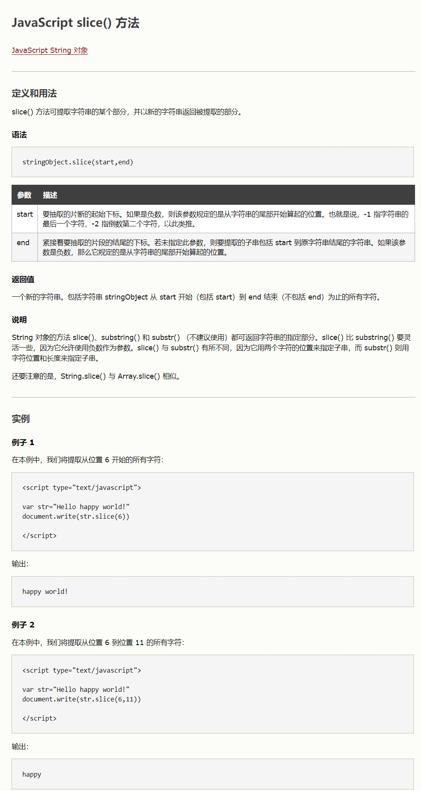

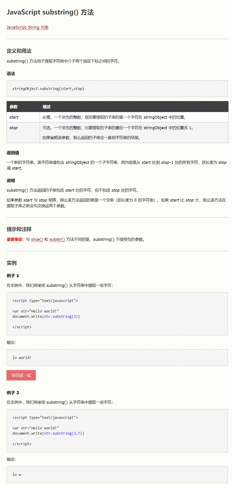

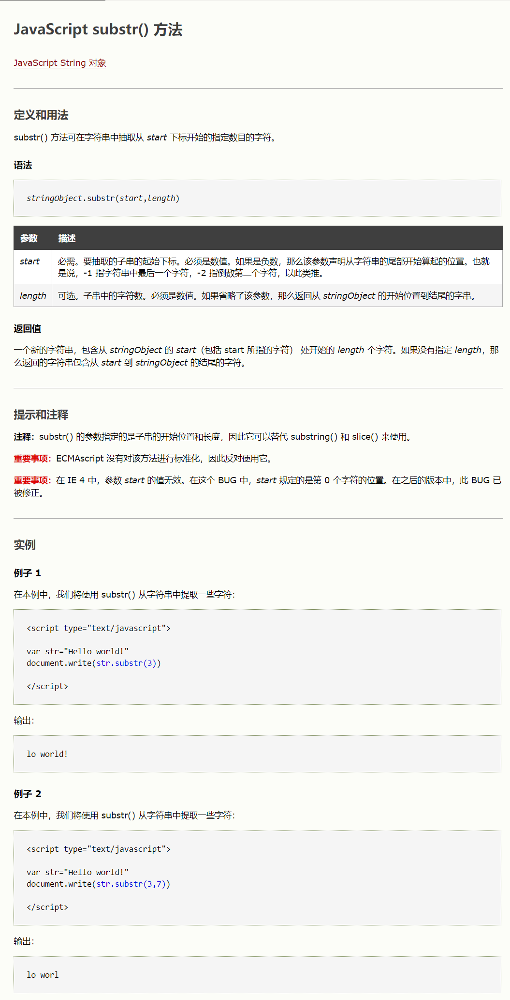

**3.字符串位置方法**

有两个可以从字符串中**查找子字符串**的方法：`indexOf()`和`lastIndexOf()`。这两个方法都是从一个字符串中搜索给定的子字符串，然后返子字符串的位置（**如果没有找到该子字符串，则返回-1**）。

这两个方法的区别在于：`indexOf()`方法**从字符串的开头向后搜索子字符串**，而`lastIndexOf()`方法是从字符串的末尾向前搜索子字符串。还是来看一个例子吧。

> 一个从头向尾搜索，一个从尾向头搜索。

~~~javascript
var stringValue = "hello world";
alert(stringValue.indexOf("o"));		//4
alert(stringValue.lastIndexOf("o"));	//7
~~~

> 只是搜索的方向不一样，最终得到的结果4和7还是按从头到尾计算的。

子字符串“o”第一次出现的位置是4，即hel1o“中的“o”；最后一次出现的位置是7，即“world"中的“o”。如果“o”在这个字符串中**仅出现了一次**，那么indexOf()和lastIndexOf()会返回相同的位置值。

这两个方法**都可以接收可选的第二个参数**，**表示从字符串中的哪个位置开始搜索**。换句话说，indexOf()会从该参数指定的位置向后搜索，忽略该位置之前的所有字符；而1astIndexOf()则会从指定的位置向前搜索，忽略该位置之后的所有字符。看下面的例子。

~~~javascript
var stringValue = "hello world";
alert(stringValue.indexOf("o" , 6));	//7
alert(stringValue.lastIndexOf("o" , 6));	//4
~~~

在将第二个参数6传递给这两个方法之后，得到了与前面例子相反的结果。这一次，由于`indexOf()`是从位置6（字母“w）开始向后搜索，结果在位置7找到了“o”，因此它返回7。而`lastIndexOf()`是从位置6开始向前搜索。结果找到了“hel1o”中的“o”，因此它返回4。在使用第二个参数的情况下，可以通过循环调用`indexOf()`或`lastIndexOf()`来找到所有匹配的子字符串，如下面的例子所示：

~~~javascript
 var stringValue = "Lorem ipsum dolor sit amet, consectetur adipisicing elit";
 var positions = new Array();
 var pos = stringValue.indexOf("e");
 //首先找到了pos的初始位置

 while(pos > -1){
      positions.push(pos);
      pos = stringValue.indexOf("e", pos + 1);
 }
            
alert(positions);    //"3,24,32,35,52"
~~~

这个例子**通过不断增加indexOf()方法开始查找的位置，遍历了一个长字符串**。在循环之外，**首先找到了“e“在字符串中的初始位置**；而进入循环后，则每次都给indexof()传递上一次的位置加1。
这样，就确保了每次新搜索都从上一次找到的子字符串的后面开始。每次搜索返回的位置依次被保存在数组 positions中，以便将来使用。

**4.trim()方法**

ECMAScript5为所有字符串定义了`trim()`方法。这个方法会**创建一个字符串的副本**，删除前置及后缀的所有空格，然后返回结果。例如：

~~~javascript
var stringValue = "    hello world    ";
var trimmedStringValue = stringValue.trim();
alert(stringValue);				//"    hello world    "
alert(trimmedStringValue);		//"hello world"
~~~

由于trim()返回的是字符串的**副本**，所以原始字符串中的前置及后缀空格会保持不变。支持这个方法的浏览器有IE9+、Firefox 3.5+、Safari5+、Opera 10.5+和Chrome。此外，Firefox 3.5+、Safari5+
和Chrome8+还支持非标准的trimLeft()和trimRight()方法，分别用于删除字符串开头和末尾的空格。

**5.字符串大小写转换方法**

接下来我们要介绍的是一组与大小写转换有关的方法。ECMAScript中涉及字符串大小写转换的方法有4个：`tolowercase()`、`toLocaleLowerCase()`、`toUppercase()`和`toLocaleUppercase()`。

其中，`toLowerCase()`和`toUppercase()`是两个经典的方法，借鉴自java.1ang.String中的同名方法。而`toLocaleLowerCase()`和`toLocaleUppercase()`方法则是针对特定地区的实现。

对有些地区来说，针对地区的方法与其通用方法得到的结果相同，但少数语言（如土耳其语）会为Unicode大小写转换应用特殊的规则，这时候就必须使用针对地区的方法来保证实现正确的转换。以下是几个例子。

~~~javascript
 var stringValue = "hello world";

 alert(stringValue.toLocaleUpperCase());  //"HELLO WORLD"
 alert(stringValue.toUpperCase());        //"HELLO WORLD"

 alert(stringValue.toLocaleLowerCase());  //"hello world"
 alert(stringValue.toLowerCase());        //"hello world"
~~~

以上代码调用的toLocaleUppercase()和toUpperCase()都返回了“HELLO WORLD”，就像调用toLocaleLowerCase()和toLowerCase()都返回“hello world“一样。一般来说，在不知道自己的代码将在哪种语言环境中运行的情况下，还是使用针对地区的方法更稳妥一些。

**6.字符串的模式匹配方法**

String类型定义了几个用于在字符串中**匹配模式**的方法。第一个方法就是`match()`，在字符串上调用这个方法，本质上与调用RegExp的exec()方法相同。`match()`方法**只接受一个参数**，要么是一个正则表达式，要么是一个RegExp对象。来看下面的例子。

~~~javascript
var text = "cat, bat, sat, fat"; 
var pattern = /.at/;

//与pattern.exec(text)相同
var matches = text.match(pattern);        
alert(matches.index);        //0
alert(matches[0]);           //"cat"
alert(pattern.lastIndex);    //0
~~~

本例中的match()方法返回了一个数组；如果是调用RegExp对象的exec()方法并传递本例中的字符串作为参数，那么也会得到与此相同的数组：数组的第一项是与整个模式匹配的字符串，之后的每一项（如果有）保存着与正则表达式中的捕获组匹配的字符串。

~~~javascript
/*
match()
	-可以根据正则表达式，从一个字符串中将符合条件的内容提取出来
	-默认情况下我们的match只会找到第一个符合要求的内容，找到以后就停止检索
		 我们可以设置正则表达式为全局匹配模式，这样就会匹配到所有的内容
		 可以为一个正则表达式设置多个匹配模式，且顺序无所谓
	-match()会将匹配到的内容封装到数组中返回，即使只查询到一个结果
*/
		
str = "1a2b3c4d5f6A7B8C9";
result = str.match(/[A-z]/gi);  //既全局匹配，又忽略大小写
console.log(result);  //"a b c d e f A B C"
console.log(typeof result);  //object
console.log(Array.isArray(result));  //true 
console.log(result[0]);  //a
~~~

另一个用于查找模式的方法是`search()`。这个方法的唯一参数与`match()`方法的参数相同：由字符串或 RegExp对象指定的一个正则表达式。`search()`方法返回字符串中第一个匹配项的索引；如果没有找到匹配项，则返回-1。而且，`search()`方法始终是从字符串开头向后查找模式。看下面的例子。

   ~~~javascript
var text = "cat, bat, sat, fat"; 
var pos = text.search(/at/);
alert(pos);		//1
   ~~~

   这个例子中的search()方法返回1，即“at“在字符串中**第一次出现的位置**。

   ~~~javascript
   /*
   search()
   	-可以搜索字符串中是否含有指定内容
   	-如果搜索到指定内容，则会返回第一次出现的索引，如果没有搜索到则会返回-1
   	-它可以接收一个正则表达式作为参数，然后会根据正则表达式去检索字符串
   	-search()只会查找第一个，即使设置全局匹配也没用
   */
   
   str = "hello abc hello aec afc";
   
   /*
   	 搜索字符串中是否含有abc 或aec 或afc 
   */
   
   result = str.search(/z[bef]c/);
   console.log(result);  //6  索引是6
   ~~~

为了简化替换子字符串的操作，ECMAScript提供了`replace()`方法。这个方法接受**两个参数**：第一个参数可以是一个RegExp对象或者一个字符串（这个字符串不会被转换成正则表达式），第二个参数可以是一个字符串或者一个函数。如果第一个参数是字符串，那么只会替换第一个子字符串。要想替换所有子字符串，**唯一的办法就是提供一个正则表达式，而且要指定全局（g）标志**，如下所示。

   ~~~javascript
var text = "cat, bat, sat, fat"; 
var result = text.replace("at", "ond");
alert(result);    //"cond, bat, sat, fat"
   
result = text.replace(/at/g, "ond");
alert(result);    //"cond, bond, sond, fond"
   ~~~

在这个例子中，首先传入replace()方法的是字符串“at“和替换用的字符串“ond*。替换的结果是把“cat“变成了“cond“，但字符串中的其他字符并没有受到影响。然后，通过将第一个参数修改为带有全局标志的正则表达式，就将全部“at"都替换成了“ond"。

如果第二个参数是字符串，那么还可以使用一些特殊的字符序列，将正则表达式操作得到的值插入到结果字符串中。下表列出了ECMAScript提供的这些特殊的字符序列。

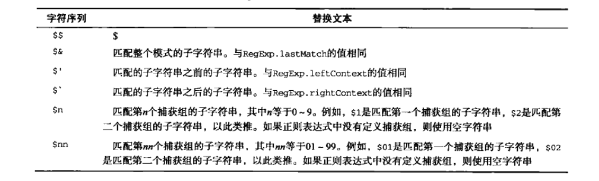

通过这些特殊的字符序列，可以使用最近一次匹配结果中的内容，如下面的例子所示。

~~~javascript
var text = "cat, bat, sat, fat"; 
result = text.replace(/(.at)/g, "word ($1)");
alert(result);    //word (cat), word (bat), word (sat), word (fat)
~~~

在此，每个以“at“结尾的单词都被替换了，替换结果是“word·后跟一对圆括号，而圆括号中是被字符序列$1所替换的单词。

replace()方法的第二个参数也可以是一个函数。在只有一个匹配项（即与模式匹配的字符串）的情况下，会向这个函数传递3个参数：模式的匹配项、模式匹配项在字符串中的位置和原始字符串。在正则表达式中定义了多个捕获组的情况下，传递给函数的参数依次是模式的匹配项、第一个捕获组的匹配项、第二个捕获组的匹配项……，但最后两个参数仍然分别是模式的匹配项在字符串中的位置和原始字符串。这个函数应该返回一个字符串，表示应该被替换的匹配项使用函数作为replace()方法的第二个参数可以实现更加精细的替换操作，请看下面这个例子。

~~~javascript
function htmlEscape(text){
    return text.replace(/[<>"&]/g, function(match, pos, originalText){
         switch(match){
              case "<":
                  return "&lt;";
              case ">":
                  return "&gt;";
              case "&":
                  return "&amp;";
              case "\"":
                  return "&quot;";
         }             
   });
}
        
alert(htmlEscape("<p class=\"greeting\">Hello world!</p>")); 
//&lt;p class=&quot;greeting&quot;&gt;Hello world!&lt;/p&gt;
~~~

这里，我们为插入HTML代码定义了函数htmlEscape()，这个函数能够转义4个字符：小于号、大于号、和号以及双引号。实现这种转义的最简单方式，就是使用正则表达式查找这几个字符，然后定义一个能够针对每个匹配的字符返回特定HTML实体的函数。

最后一个与模式匹配有关的方法是split()，这个方法可以基于指定的分隔符将一个字符串分割成多个子字符串，并将结果放在一个数组中。分隔符可以是字符串，也可以是一个RegExp对象（这个方法不会将字符串看成正则表达式）。split()方法可以接受可选的第二个参数，用于指定数组的大小，以便确保返回的数组不会超过既定大小。请看下面的例子。

~~~javascript
var colorText = "red,blue,green,yellow";
var colors1 = colorText.split(",");      //["red", "blue", "green", "yellow"]
var colors2 = colorText.split(",", 2);   //["red", "blue"]
var colors3 = colorText.split(/[^\,]+/); //["", ",", ",", ",", ""]
~~~

在这个例子中，colorText是逗号分隔的颜色名字符串。基于该字符串调用`split(”,")`会得到一个包含其中颜色名的数组，用于分割字符串的分隔符是逗号。为了将数组截短，让它只包含两项，可以为split()方法传递第二个参数2。最后，通过使用正则表达式，还可以取得包含逗号字符的数组。需要注意的是，在最后一次调用`sp1it()`返回的数组中，第一项和最后一项是两个空字符串。之所以会这样，是因为通过正则表达式指定的分隔符出现在了字符串的开头（即子字符串“red”）和末尾（即子字符串"yel1ow"）。

对sp1it()中正则表达式的支持因浏览器而异。尽管对于简单的模式没有什么差别，但对于未发现匹配项以及带有捕获组的模式，匹配的行为就不大相同了。以下是几种常见的差别。

* IE8及之前版本会忽略捕获组。ECMA-262规定应该把捕获组拼接到结果数组中。IE9能正确地在结果中包含捕获组。

* Firefox3.6及之前版本在捕获组未找到匹配项时，会在结果数组中包含空字符串；ECMA-262规定没有匹配项的捕获组在结果数组中应该用undefined表示。

在正则表达式中使用捕获组时还有其他微妙的差别。在使用这种正则表达式时，一定要在各种浏览器下多做一些测试。

**7.localeCompare()方法**

与操作字符串有关的最后一个方法是`localeCompare()`，这个方法比较两个字符串，并返回下列值中的一个：

* 如果字符串在字母表中应该排在字符串参数之前，则返回一个负数（大多数情况下是-1，具体的值要视实现而定）；

* 如果字符串等于字符串参数，则返回0；

* 如果字符串在字母表中应该排在字符串参数之后，则返回一个正数（大多数情况下是1，具体的值同样要视实现而定）。

下面是几个例子。

~~~javascript
var stringValue = "yellow";       
alert(stringValue.localeCompare("brick"));   //1
alert(stringValue.localeCompare("yellow"));  //0
alert(stringValue.localeCompare("zoo"));     //-1
~~~

这个例子比较了字符串“yel1ow*和另外几个值：“brick”、“yellow“和“zoo”。因为“brick“在字母表中排在“yellow*之前，所以localeCompare()返回了1；而“yellow“等于“yellow”，所以localeCompare()返回了0；最后，“zoo”在字母表中排在“yellow"后面，所以localeCompare()返回了-1。再强调一次，因为localecompare()返回的数值取决于实现，所以最好是像下面例子所示的这样使用这个方法。

~~~javascript
 function determineOrder(value) {
 var result = stringValue.localeCompare(value);
     if (result < 0){
         alert("The string 'yellow' comes before the string '" + value + "'.");
      } else if (result > 0) {
          alert("The string 'yellow' comes after the string '" + value + "'.");
      } else {
          alert("The string 'yellow' is equal to the string '" + value + "'.");
      }
 }
        
 determineOrder("brick");
 determineOrder("yellow");
 determineOrder("zoo");
~~~

使用这种结构，就可以确保自己的代码在任何实现中都可以正确地运行了。

`localeCompare()`方法比较与众不同的地方，就是实现所支持的地区（国家和语言）决定了这个方法的行为。比如，美国以英语作为ECMAScript实现的标准语言，因此`localecompare()`就是区分大小写的，于是大写字母在字母表中排在小写字母前头就成为了一项决定性的比较规则。不过，在其他地区恐怕就不是这种情况了。

**8.fromCharCode()方法**

另外，String 构造函数本身还有一个静态方法：fromCharcode()。这个方法的任务是接收一或多个字符编码，然后将它们转换成一个字符串。从本质上来看，这个方法与实例方法charcodeAt()执行的是相反的操作。来看一个例子：

~~~JavaScript
alert(String.fromCharCode(104, 101, 108, 108, 111)); //"hello"
~~~

**9.HTML方法**

早期的Web浏览器提供商觉察到了使用JavaScript动态格式化HTML的需求。于是，这些提供商就扩展了标准，实现了一些专门用于简化常见HTML格式化任务的方法。下表列出了这些HTML方法。
不过，需要请读者注意的是，应该尽量不使用这些方法，因为它们创建的标记通常无法表达语义。

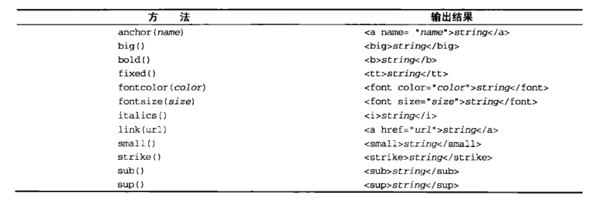

> 2020年9月25日，String类型这一节看完。

## 单体内置对象

ECMA-262对内置对象的定义是：“由ECMAScript实现提供的、不依赖于宿主环境的对象，这些对象在ECMAScript程序执行之前就已经存在了。”意思就是说，开发人员不必显式地实例化内置对象，因为它们已经实例化了。前面我们已经介绍了大多数内置对象，例如Object、Array和string。
ECMA-262还定义了两个单体内置对象：Global和Math。

### Global对象

Global（全局）对象可以说是ECMAScript中最特别的一个对象了，因为不管你从什么角度上看，这个对象都是不存在的。ECMAScript中的Globa1对象在某种意义上是作为一个终极的“兜底儿对象”
来定义的。换句话说，不属于任何其他对象的属性和方法，最终都是它的属性和方法。事实上，没有全局变量或全局函数；所有在全局作用域中定义的属性和函数，都是G1oba1对象的属性。本书前面介绍过的那些函数，诸如isNaN()、isFinite()、parseInt()以及 parseFloat()，实际上全都是Global对象的方法。除此之外，G1oba1对象还包含其他一些方法。

1. URL编码方法

   Global对象的encodeURI()和encodeURIComponent()方法可以对URI（Uniform Resource Identifiers，通用资源标识符）进行编码，以便发送给浏览器。有效的URI中不能包含某些字符，例如空格。而这两个URI编码方法就可以对URI进行编码，它们用特殊的UTF-8编码替换所有无效的字符，从而让浏览器能够接受和理解。

   /78.png)

   其中，encodeURI()主要用于整个URI（例如http:/www.wrox.com/illegal value.htm），而encodeURIComponent()主要用于对URI中的某一段（例如前面URI中的illegal value.htm）进行编码。
   它们的主要区别在于，encodeURI()不会对本身属于URI的特殊字符进行编码，例如冒号、正斜杠、问号和井字号；而encodeURIComponent()则会对它发现的任何非标准字符进行编码。来看下面的例子。

   ~~~javascript
    var uri = "http://www.wrox.com/illegal value.htm#start";
           
    //"http://www.wrox.com/illegal%20value.htm#start"
    alert(encodeURI(uri));
           
    //"http%3A%2F%2Fwww.wrox.com%2Fillegal%20value.htm%23start"
    alert(encodeURIComponent(uri));
   ~~~

   使用encodeURI()编码后的结果是除了空格之外的其他字符都原封不动，只有空格被替换成了%20。而encodeURIComponent()方法则会使用对应的编码替换所有非字母数字字符。这也正是可以对整个URI使用encodeURI()，而只能对附加在现有URI后面的字符串使用encodeURIComponent()的原因所在。

   > 一般来说，我们使用encodeURIComponent()方法的时候要比使用encodeURI()更多，因为在实践中更常见的是对查询字符串参数而不是对基础URI进行编码。

   与encodeURI()和encodeURIComponent()方法对应的两个方法分别是decodeURI()和decodeURIComponent()。其中，decodeURI()只能对使用encodeURI()替换的字符进行解码。例如，它可将%20替换成一个空格，但不会对%23作任何处理，因为%23表示井字号（#），而井字号不是使用encodeURI（）替换的。同样地，decodeURIComponent()能够解码使用encodeURIComponent()编码的所有字符，即它可以解码任何特殊字符的编码。来看下面的例子：

   ~~~javascript
   var uri = "http%3A%2F%2Fwww.wrox.com%2Fillegal%20value.htm%23start";
           
   //http%3A%2F%2Fwww.wrox.com%2Fillegal value.htm%23start
   alert(decodeURI(uri));
           
   //http://www.wrox.com/illegal value.htm#start
   alert(decodeURIComponent(uri));
   ~~~

   这里，变量uri包含着一个由encodeURIComponent()编码的字符串。在第一次调用decodeURI()输出的结果中，只有20被替换成了空格。而在第二次调用decodeURIComponent（）输出的结果中，所有特殊字符的编码都被替换成了原来的字符，得到了一个未经转义的字符串（但这个字符串并不是一个有效的URI）。

   > URI方法encodeURI（）、encodeURIComponent（）、decodeURI（）和decode-
   > URIComponent（）用于替代已经被ECMA-262第3版废弃的escape（）和unescape（）方法。URI方法能够编码所有Unicode字符，而原来的方法只能正确地编码ASCIⅡ字符。因此在开发实践中，特别是在产品级的代码中，一定要使用URI方法，不要使用escape（）和unescape（）方法。

2. **eval（）方法(难点)**

   现在，我们介绍最后一个——大概也是整个ECMAScript语言中最强大的一个方法：eval（）。eval（）
   方法就像是一个完整的ECMAScript解析器，**它只接受一个参数，即要执行的ECMAScript（或JavaScript）**
   **字符串。**看下面的例子：

   ~~~javascript
   eval("alert("hi")");
   ~~~

   这段代码的作用等同于下面这行代码：

   ~~~javascript
   alert("hi");
   ~~~

   当解析器发现代码中调用eval（）方法时，**它会将传人的参数当作实际的ECMAScript语句来解析，然后把执行结果插入到原位置。**通过eval（）执行的代码被认为是包含该次调用的执行环境的一部分，因此**被执行的代码具有与该执行环境相同的作用域链**。这意味着通过eval（）执行的代码可以引用在包含环境中定义的变量，举个例子：

   ~~~javascript
   var msg = "hello world";
   eval ("alert(msg)");		//hello world
   ~~~

   **可见，变量msg是在eval（）调用的环境之外定义的，但其中调用的alert（）仍然能够显示“hel1o world"。**这是因为上面第二行代码最终被替换成了一行真正的代码。同样地，我们也可以在eval（）调用中定义一个函数，然后再在该调用的外部代码中引用这个函数：

   ~~~JavaScript
   eval("function sayHi(){alert('hi');}");
   sayHi();
   ~~~

   ​	显然，函数sayHi（）是在eval（）内部定义的。但由于对eva1（）的调用最终会被替换成定义函数的实际代码，因此可以在下一行调用sayHi（）。对于变量也一样：

   ~~~javascript
   eval("var msg = 'hello world';");
   alert(msg);			//"hello world"
   ~~~

   在eval（）中创建的任何变量或函数都不会被提升，因为在解析代码的时候，它们被包含在一个字符串中；它们只在evar（）执行的时候创建。

   严格模式下，在外部访问不到eval（）中创建的任何变量或函数，因此前面两个例子都会导致错误。
   同样，在严格模式下，为eval赋值也会导致错误：

   ~~~javascript
   "use strict"
   eval= "hi";		//cause error
   ~~~

   能够解释代码字符串的能力非常强大，但也非常危险。因此在使用eval（）时必须极为谨慎，特别是在用它执行用户输入数据的情况下。**否则，可能会有恶意用户输入成胁你的站点或应用程序安全的代码（即所谓的代码注入）。**

   [JavaScript 为什么不推荐使用 eval？](<https://www.zhihu.com/question/20591877>)

   [代码注入](<https://zh.wikipedia.org/wiki/%E4%BB%A3%E7%A2%BC%E6%B3%A8%E5%85%A5>)

   3. Global对象的属性

      Global对象还包含一些属性，其中一部分属性已经在本书前面介绍过了。例如，**特殊的值undefined、NaN以及Infinity都是Global对象的属性**。此外，所有原生引用类型的构造函数，像Object和Function，也都是Globa1对象的属性。下表列出了Globa1对象的所有属性。

      /79.png)

      ECMAScript5明确禁止给undefined、NaN和Infinity赋值，这样做即使在非严格模式下也会导致错误。

   4. window对象

      ECMAScript 虽然没有指出如何直接访问clobal对象，但Web浏览器都是将这个全局对象作为window对象的一部分加以实现的。因此，在全局作用域中声明的所有变量和函数，就都成为了window对象的属性。来看下面的例子。

      ~~~javascript
       var color = "red";
              
       function sayColor(){
            alert(window.color);
       }
              
       window.sayColor();  //"red"
              
      ~~~

      这里定义了一个名为color的全局变量和一个名为saycolor（）的全局函数。在saycolor（）内部，我们通过window.color来访问color变量，以说明全局变量是window对象的属性。然后，又使用window.sayColor（）来直接通过window对象调用这个函数，结果显示在了警告框中。

      > JavaScript中的window对象除了扮演ECMAScript规定的Globa1对象的角色外，还承担了很多别的任务。第8章在讨论浏览器对象模型时将详细介绍window对象。

      另一种取得Global对象的方法是使用以下代码：

      ~~~javascript
      var global = function(){
          return this;
      }();
      ~~~

      以上代码创建了一个立即调用的函数表达式，返回this的值。如前所述，在没有给函数明确指定this值的情况下（无论是通过将函数添加为对象的方法，还是通过调用cal1（）或apply（）），this值等于G1oba1对象。而像这样通过简单地返回this来取得G1oba1对象，在任何执行环境下都是可行的。第7章将深入讨论函数表达式。

      [JavaScript中的概念区分：global对象、window对象、document对象](<https://blog.csdn.net/chenchunlin526/article/details/78908592>)

### Math对象

      ECMAScript还为保存数学公式和信息提供了一个公共位置，即Math对象。与我们在JavaScript直接编写的计算功能相比，Math对象提供的计算功能执行起来要快得多。Math对象中还提供了辅助完成这些计算的属性和方法。
    
      1. Math对象的属性
    
         Math对象包含的属性大都是数学计算中可能会用到的一些特殊值。下表列出了这些属性。
    
         /80.png)
    
         虽然讨论这些值的含义和用途超出了本书范围，但你确实可以随时使用它们。
    
      2. min()和max()方法
    
         Math对象还包含许多方法，用于辅助完成简单和复杂的数学计算。
    
         其中，min()和max()方法用于确定一组数值中的最小值和最大值。这两个方法都可以接收任意多个数值参数，如下面的例子所示。
    
         ~~~javascript
         var max = Math.max(3, 54, 32, 16);
         alert(max);    //54
                 
         var min = Math.min(3, 54, 32, 16);
         alert(min);    //3
         ~~~
    
         对于3、54、32和16，Math.max（）返回54，而Math.min（）返回3。这两个方法经常用于避免多余的循环和在if语句中确定一组数的最大值。
    
         要找到数组中的最大或最小值，可以像下面这样使用apply（）方法。
    
         ~~~javascript
         var values=[1，2，3，4，5，6，7，8]；
         var max=Math.max.apply（Math，values）；
         ~~~
    
         这个技巧的关键是把Math对象作为apply（）的第一个参数，从而正确地设置this值。然后，可以将任何数组作为第二个参数。
    
      3. 舍入方法
    
         下面来介绍将小数值舍人为整数的几个方法：Math.ceil（）、Math.floor（）和Math.round（）。
         这三个方法分别遵循下列舍人规则：
    
         * [ ] Math.cei1（）执行向上舍入，即它总是将数值向上舍人为最接近的整数；
    
         * [ ] Math.floor（）执行向下舍入，即它总是将数值向下舍入为最接近的整数；
    
         * [ ] Math.round（）执行标准舍入，即它总是将数值四舍五入为最接近的整数（这也是我们在数学课上学到的舍入规则）。
    
         下面是使用这些方法的示例：
    
         ~~~javascript
         alert(Math.ceil(25.9));     //26
         alert(Math.ceil(25.5));     //26
         alert(Math.ceil(25.1));     //26
                 
         alert(Math.round(25.9));    //26
         alert(Math.round(25.5));    //26
         alert(Math.round(25.1));    //25
                         
         alert(Math.floor(25.9));    //25
         alert(Math.floor(25.5));    //25
         alert(Math.floor(25.1));    //25
         ~~~
    
         对于所有介于25和26（不包括26）之间的数值，Math.cei1（）始终返回26，因为它执行的是向上舍人。Math.round（）方法只在数值大于等于25.5时返回26；否则返回25。最后，Math.floor（）对所有介于25和26（不包括26）之间的数值都返回25。
    
      4. random()方法
    
         Math.random（）方法返回介于0和1之间一个随机数，不包括0和1。对于某些站点来说，这个方法非常实用，因为可以利用它来随机显示一些名人名言和新闻事件。套用下面的公式，就可以利用Math.random（）从某个整数范围内随机选择一个值。
    
         ~~~javascript
         值 = Math.floor(Math.random()*可能值的总数 + 第一个可能的值)
         ~~~
    
         公式中用到了Math.floor（）方法，这是因为Math.ra.dom（）总返回一个小数值。而用这个小数值乘以一个整数，然后再加上一个整数，最终结果仍然还是个小数。举例来说，如果你想选择一个1到10之间的数值，可以像下面这样编写代码：
    
         ~~~javascript
         var num = Math.floor(Math.random() * 10 + 1);
         alert(num);    //1到10之间的数值
         ~~~
    
         总共有10个可能的值（1到10），而第一个可能的值是1。而如果想要选择一个介于2到10之间的值，就应该将上面的代码改成这样：
    
         ~~~javascript
          var num = Math.floor(Math.random() * 9 + 2);
          alert(num);    //2到10之间的数值
         ~~~
    
         从2数到10要数9个数，因此可能值的总数就是9，而第一个可能的值就是2。多数情况下，其实都可以通过一个函数来计算可能值的总数和第一个可能的值，例如：
    
         ~~~javascript
         function selectFrom(lowerValue, upperValue) {
         	var choices = upperValue - lowerValue + 1;
             return Math.floor(Math.random() * choices + lowerValue);
         }
                 
         var num = selectFrom(2, 10);
         alert(num);   //介于2和10之间（包括2和10）的一个数值
         ~~~
    
         函数selectFrom（）接受两个参数：应该返回的最小值和最大值。而用最大值减最小值再加1得到了可能值的总数，然后它又把这些数值套用到了前面的公式中。这样，通过调用 selectFrom（2，10）就可以得到一个介于2和10之间（包括2和10）的数值了。利用这个函数，可以方便地从数组中随机取出一项，例如：
    
         ~~~javascript
         var colors = ["red", "green", "blue", "yellow", "black", "purple", "brown"];
         var color = colors[selectFrom(0, colors.length-1)];
         alert(color);  //可能是数组中包含的任何一个字符串
         ~~~
    
         在这个例子中，传递给selectFrom（）的第二个参数是数组的长度减1，也就是数组中最后一项的位置。
    
      5. 其他方法
    
         Math对象中还包含其他一些与完成各种简单或复杂计算有关的方法，但详细讨论其中每一个方法的细节及适用情形超出了本书的范围。下面我们就给出一个表格，其中列出了这些没有介绍到的Math对象的方法。
    
         /81.png)
    
         虽然ECMA-262规定了这些方法，但不同实现可能会对这些方法采用不同的算法。毕竟，计算某个值的正弦、余弦和正切的方式多种多样。也正因为如此，这些方法在不同的实现中可能会有不同的精度。

 ## 小结

/82.png)

# 第6章：面向对象的程序设计(这章要多看)

面向对象（Object-Oriented，OO）的语言有一个标志，那就是**它们都有类的概念**，而**通过类可以创建任意多个具有相同属性和方法的对象**。前面提到过，**ECMAScript中没有类的概念**，因此它的对象也与基于类的语言中的对象有所不同。

> ECMAScript新的版本有了“类”，但也就是作为语法糖而已。

**ECMA-262把对象定义为：“无序属性的集合，其属性可以包含基本值、对象或者函数。”**严格来讲，这就相当于说**对象是一组没有特定顺序的值**。对象的每个属性或方法都有一个名字，而每个名字都映射到一个值。正因为这样（以及其他将要讨论的原因），**我们可以把ECMAScript的对象想象成散列表**：**无非就是一组名值对，其中值可以是数据或函数。**

**每个对象都是基于一个引用类型创建的**，这个引用类型可以是第5章讨论的原生类型，也可以是开发人员定义的类型。

## 理解对象

上一章曾经介绍过，**创建自定义对象的最简单方式就是创建一个Object的实例**，然后**再为它添加属性和方法**，如下所示。

~~~javascript
var person = new Object();
person.name = "Nicholas";
person.age = 29;
person.job = "Software Engineer";
/*上面这三个是属性*/

person.sayName = function(){
    alert(this.name);
};
/*这个是方法*/
~~~

上面的例子创建了一个**名为**person的对象，并为它添加了**三个属性**（name、age和job）和**一个方法**(sayName())。其中，sayName()方法用于显示 this.name（将**被解析为person.name**）的值。
早期的JavaScript开发人员经常使用这个模式创建新对象。几年后，**对象字面量**成为创建这种对象的首选模式。前面的例子用对象字面量语法可以写成这样：

~~~javascript
var person = {
    name: "Nicholas",
    age: 29,
    job: Software Engineer,
    sayName: function(){
        alert(this.name);
    }
};
~~~

这个例子中的person对象与前面例子中的person对象是一样的，都有相同的属性和方法。这些属性在创建时都带有一些**特征值**（characteristic），JavaScript通过这些特征值来定义它们的行为。

### 属性类型

ECMA-262第5版在定义只有内部才用的特性(attribute)时，描述了属性（property）的各种特征。

ECMA-262定义这些特性是为了**实现JavaScript引擎**用的，因此**在JavaScript中不能直接访问它们**。为了表示特性是<strong style="color: red">内部值</strong>，该规范把它们放在了两对<strong style="color: red">方括号</strong>中，例如[[Enumerable]]。尽管ECMA-262第3版的定义有些不同，但本书只参考第5版的描述。

ECMAScript中有两种属性：<strong style="color:red">数据属性和访问器属性。</strong>

[为什么JavaScript要分数据属性和访问器属性？](https://www.zhihu.com/question/295168343/answer/494799739)

1. 数据属性

   **数据属性包含一个数据值的位置**。在这个位置可以读取和写入值。数据属性有4个描述其行为的 特性。
   
   | 数据属性             | 特性                                                         |
   | -------------------- | ------------------------------------------------------------ |
   | **[[Configurable]]** | 表示**能否通过delete删除属性从而重新定义属性**，能否修改属性的特性，或者能否把属性修改为访问器属性。像前面例子中那样直接在对象上定义的属性，它们的这个特性默认值为true。 |
   | **[[Enumerab1e]]**   | 表示**能否通过for-in循环返回属性**。像前面例子中那样直接在对象上定义的属性，它们的这个特性默认值为true。 |
   | **[[Writable]]**     | 表示**能否修改属性的值**。像前面例子中那样直接在对象上定义的属性，它们的这个特性默认值为true。 |
   | **[[value]]**        | **包含这个属性的数据值**。读取属性值的时候，从这个位置读；写入属性值的时候，把新值保存在这个位置。这个特性的默认值为undefined。 |


 对于像前面例子中那样直接在对象上定义的属性，它们的`[[configurable]]、[[Enumerable]] 和[[Writable]]`特性都被设置为true，而[[Value]]特性被设置为指定的值。例如：

   ~~~javascript
var person = {
     name: "Nicholas"
};
   ~~~

 这里创建了一个名为name的属性，为它指定的值是“Nicholas“。也就是说，**[[Value]]特性将被设为“Nicholas"，而对这个值的任何修改都将反映在这个位置。**

 要修改属性默认的特性，必须使用ECMAScript5的`Object.defineProperty()`方法。这个方法接收**三个**参数：**属性所在的对象、属性的名字和一个描述符对象**。其中，描述符（descriptor）对象的属性必须是：configurable、enumerable、writable和 value。设置其中的一或多个值，可以修改对应的特性值。

[Object.defineProperty()](<https://developer.mozilla.org/zh-CN/docs/Web/JavaScript/Reference/Global_Objects/Object/defineProperty>)

[defineProperty详解](https://segmentfault.com/a/1190000017762618)

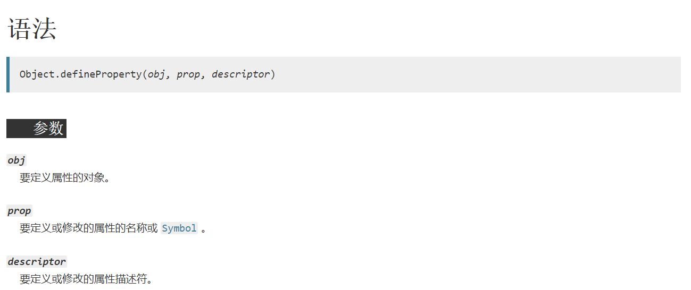

例如：

   ~~~javascript
var person = {};
Object.defineProperty(person, "name", {
      writable: false,
      value: "Nicholas"
});
           
alert(person.name);		//"Nicholas"
person.name = "Michael";
alert(person.name);		//"Nicholas"
   ~~~

 这个例子创建了一个名为name的属性，它的值“Nicholas“是**只读**的。**这个属性的值是不可修改的**，如果尝试为它指定新值，则在**非严格模式**下，赋值操作将被忽略；在严格模式下，赋值操作将会导致抛出错误。

 类似的规则也适用于不可配置的属性。例如：

   ~~~javascript
var person = {};
Object.defineProperty(person, "name", {
     configurable: false,
      value: "Nicholas"
});
           
alert(person.name);		//"Nicholas"
delete person.name;
alert(person.name);		//"Nicholas"
   ~~~

 **把configurable设置为false，表示不能从对象中删除属性**。如果对这个属性调用delete，则在非严格模式下什么也不会发生，而在严格模式下会导致错误。而且，**一旦把属性定义为不可配置的，就不能再把它变回可配置了**。(**这个设置是不可逆的**)此时，再调用Object.defineProperty()方法修改**除 writable之外的特性**，都会导致错误：

   ~~~javascript
var person = {};
Object.defineProperty(person, "name", {
     configurable: false,
     value: "Nicholas"
});
           
//抛出错误
Object.defineProperty(person, "name", {
     configurable: true,
     value: "Nicholas"
});
   ~~~

**也就是说，可以多次调用Object.defineProperty()方法修改同一个属性，但在把configurable特性设置为false之后就会有限制了。**

 在调用Object.defineProperty()方法时，**如果不指定，configurable、enumerable和writable特性的默认值都是false**。多数情况下，可能都没有必要利用Object.defineProperty()方法提供的这些高级功能。不过，理解这些概念对理解 JavaScript对象却非常有用。

> vuejs数据双向绑定地核心原理就是使用 Object.defineProperty 这个函数来实现数据劫持，并通过publisher-subscriber模型来劫持和使用每一个属性。setter和getter在数据发生变化时publish一个message给subscriber,并且触发对应地监听回调被调用。当一个普通地Object作为vue组件地data时，vue会递归枚举该Object的所有属性，并使用Object.defineProperty将这些属性转变为getter/setter.用户并不会感知到getter/stter，但是这些getter/setter却使得vue可以跟踪dependency并且当属性被访问或者修改时通知对应的变化。

   > IE8是第一个实现Object.defineProperty()方法的浏览器版本。然而，这个版本的实现存在诸多限制：只能在DOM对象上使用这个方法，而且只能创建访问器属性。由于实现不彻底，建议读者不要在IE8中使用Object.defineproperty()方法。

2. 访问器属性

   **访问器属性不包含数据值**,它们包含一对<strong style="color: red">getter和setter函数</strong>（不过，这两个函数都**不是必需的**）。在**读取**访问器属性时，会**调用getter函数**，这个函数**负责返回有效的值**；在**写入**访问器属性时，会**调用setter函数**并**传入新值**，这个函数**负责决定如何处理数据**。访问器属性有如下4个特性。
   
   | 访问器属性           | 内容                                                         |
   | -------------------- | ------------------------------------------------------------ |
   | **[[Configurable]]** | 表示能否通过delete删除属性从而重新定义属性，能否修改属性的特性，或者能否把属性修改为数据属性。对于直接在对象上定义的属性，这个特性的默认值为true。 |
   | **[[Enumerable]]**   | 表示能否通过for-in循环返回属性。对于直接在对象上定义的属性，这个特性的默认值为true |
   | **[[Get]]**          | 在读取属性时调用的函数。默认值为undefined。                  |
   | **[[Set]]**          | 在写入属性时调用的函数。默认值为undefined。                  |


 **访问器属性不能直接定义，必须使用Object.defineProperty()来定义。**请看下面的例子。

   ~~~javascript
var book = {
    _year: 2004,
    edition: 1
};
          
Object.defineProperty(book, "year", {
    get: function(){
         return this._year;
     },
    set: function(newValue){       
        if (newValue > 2004) {
            this._year = newValue;
            this.edition += newValue - 2004;   
           }
        }
    });
        
book.year = 2005;
alert(book.edition);   //2
   ~~~

以上代码创建了一个book对象，并给它定义两个**默认的属性**：year和edition。**year 前面的下划线是一种常用的记号，用于表示只能通过对象方法访问的属性**。而**访问器属性**year则**包含一个getter 函数和一个setter函数**。**getter函数返回_year的值，setter函数通过计算来确定正确的版本**。因此，把year属性修改为2005会导致year变成2005，而edition变为2。**这是使用访问器属性的常见方式，即设置一个属性的值会导致其他属性发生变化。**

不一定非要**同时指定** getter 和 setter。**只指定getter 意味着属性是不能写，尝试写入属性会被忽略**。
在严格模式下，尝试写入只指定了getter函数的属性会抛出错误。类似地，**没有指定 setter函数的属性也不能读**，否则在非严格模式下会返回undefined，而在严格模式下会抛出错误。

/125.png)

支持ECMAScript5的这个方法的浏览器有IE9+（IE8只是部分实现），Firefox 4+，Safari S+，Opera
12+和Chrome。在这个方法之前，要创建访问器属性，一般都使用两个非标准的方法：`__defineGetter__()`和`__defineSetter__()`。这两个方法最初是由Firefox引入的，后来Safari 3、Chrome 1和Opera 9.5也给出了相同的实现。使用这两个遗留的方法，可以像下面这样重写前面的例子。

~~~javascript
var book = {
    _year: 2004,
    edition: 1
};
          
//定义访问器的旧有方法
 book.__defineGetter__("year", function(){
     return this._year;    
 });
        
 book.__defineSetter__("year", function(newValue){
     if (newValue > 2004) {
         this._year = newValue;
         this.edition += newValue - 2004;
      }    
});
     
book.year = 2005;
alert(book.edition);   //2
~~~

在不支持Object.defineProperty（）方法的浏览器中不能修改[[Configurable]]和
[[Enumerable]]。

[浅谈JavaScript 数据属性和访问器属性](<https://www.jb51.net/article/91698.htm>)

### 定义多个属性

由于为对象**定义多个属性**的可能性很大，ECMAScript5又定义了一个Object.defineProperties（）方法。利用这个方法可以**通过描述符一次定义多个属性**。这个方法**接收两个对象参数**：**第一个对象是要添加和修改其属性的对象，第二个对象的属性与第一个对象中要添加或修改的属性一一对应**。例如：

~~~javascript
var book = {};
    
Object.defineProperties(book, {
     _year: {
         value: 2004
  },
            
     edition: {
         value: 1
  },
            
     year: {            
      	 get: function(){
              return this._year;
         },
                
         set: function(newValue){
              if (newValue > 2004) {
                  this._year = newValue;
                  this.edition += newValue - 2004;
              }                  
         }            
     }        
});
           
book.year = 2005;
alert(book.edition);   //2
~~~

以上代码在book对外上定义了两个**数据属性**（_year和edition）和一个**访问器属性**（year）。
最终的对象与上一节中定义的对象相同。**唯一的区别是这里的属性都是在同一时间创建的**。
支持object.defineProperties（）方法的浏览器有IE9+、Firefox 4+、Safari5+、Opera12+和Chrome。

### 读取属性的特性

使用ECMAScript5的**Object.getOwnPropertyDescriptor（）**方法，可以取得给定属性的描述符。这个方法接收**两个参数**：**属性所在的对象和要读取其描述符的属性名称**。返回值是一个对象，如果是访问器属性，这个对象的属性有configurable、enumerable、get和set；如果是数据属性，这个对象的属性有configurable、enumerable、writable和value。例如：

~~~javascript
var book = {};
        
Object.defineProperties(book, {
      _year: {
           value: 2004
      },
            
      edition: {
         	value: 1
      },
            
      year: {            
            get: function(){
                 return this._year;
             },
                
            set: function(newValue){
                 if (newValue > 2004) {
                    	this._year = newValue;
                        this.edition += newValue - 2004;
                   }                  
            }            
      }        
});
           
 var descriptor = Object.getOwnPropertyDescriptor(book, "_year");
 alert(descriptor.value);          //2004
 alert(descriptor.configurable);   //false
 alert(typeof descriptor.get);     //"undefined"
        
 var descriptor = Object.getOwnPropertyDescriptor(book, "year");
 alert(descriptor.value);          //undefined
 alert(descriptor.enumerable);     //false
 alert(typeof descriptor.get);     //"function"
~~~

> 看了一些这样的代码，现在理解的还很浅，尤其是this,对于它的作用一直认识不清。对于它的本质作用并没有太多清醒的认识。

对于数据属性_year，value等于最初的值，configurable是false，而get等于undefined。
对于访问器属性 year，value等于undefined，enumerable是false，**而get是一个指向getter函数的指针**。

在JavaScript中，可以针对任何对象——包括DOM和BOM对象，使用object.getownPropertyDescriptor（）方法。支持这个方法的浏览器有IE9+、Firefox 4+、Safari5+、Opera 12+和Chrome。

## 创建对象(★★★★★不熟)

虽然Object构造函数或对象字面量都可以用来创建单个对象，但这些方式有个明显的缺点：使用**同一个接口**创建很多对象，**会产生大量的重复代码**。为解决这个问题，人们开始使用工厂模式的一种变体。

### 工厂模式

工厂模式是软件工程领域一种广为人知的设计模式，这种模式抽象了创建具体对象的过程（本书后面还将讨论其他设计模式及其在JavaScript中的实现）。考虑到在ECMAScript中无法创建类，开发人员就发明了一种函数，**用函数来封装以特定接口创建对象的细节**，如下面的例子所示。

~~~javascript
function createPerson(name , age , job){
    var o = new Object();
    o.name = name;
    o.age = age;
    o.job = job;
    o.sayName = function(){
        alert(this.name)
    };
    return o;
}

var person1 = createPerson("Nicholas" , 29 , "Software Engineer");
var person2 = createPerson("Greg" , 27 , "Doctor");
~~~

> 一直不清楚 o.name = name; this.name=name表达的是什么意思

**函数createPerson（）能够根据接受的参数来构建一个包含所有必要信息的Person对象。可以无数次地调用这个函数，而每次它都会返回一个包含三个属性一个方法的对象。**工厂模式虽然**解决了创建多个相似对象的问题，但却没有解决对象识别的问题（即怎样知道一个对象的类型）**。随着JavaScript的发展，又一个新模式出现了。

### 构造函数模式(构造函数不熟啊)

前几章介绍过，<strong style="color: red">ECMAScript中的构造函数可用来创建特定类型的对象</strong>。像Object和Array这样的**原生构造函数**，在运行时会**自动出现在执行环境中**。此外，也可以创建**自定义的构造函数**，从而定义自定义对象类型的属性和方法。例如，可以使用构造函数模式将前面的例子重写如下。

~~~javascript
function Person(name, age, job){
  /*构造函数名称一般要大写*/
      this.name = name;
      this.age = age;
      this.job = job;
      this.sayName = function(){
          alert(this.name);
      };    
}
        
var person1 = new Person("Nicholas", 29, "Software Engineer");
var person2 = new Person("Greg", 27, "Doctor");
~~~

在这个例子中，Person（）函数取代了createPerson（）函数。我们注意到，Person（）中的代码除了与createPerson（）中相同的部分外，还存在以下不同之处：

~~~
没有显式地创建对象；
直接将属性和方法赋给了this对象；
没有return语句。
~~~

此外，还应该注意到函数名Person使用的是大写字母P。按照惯例，**构造函数始终都应该以一个大写字母开头**，而非构造函数则应该以一个小写字母开头。这个做法借鉴自其他O0语言，主要是为了区别于ECMAScript中的其他函数；因为**构造函数本身也是函数，只不过可以用来创建对象而已**。

要创建person的新实例，必须使用**new操作符**。以这种方式调用构造函数实际上会经历以下4个步骤：

（1）创建一个新对象；

（2）将构造函数的**作用域**赋给新对象（因此this就指向了这个新对象）；

（3）执行构造函数中的代码（为这个新对象添加属性）；

（4）返回新对象。

在前面例子的最后，person1和person2分别保存着**Person的一个不同的实例**。这**两个对象都有一个constructor（构造函数）属性，该属性指向 Person**，如下所示。

~~~javascript
alert(person1.constructor == Person);		//true
alert(person2.constructor == Person);		//true
~~~

[JavaScript constructor 属性](<https://www.runoob.com/jsref/jsref-constructor-array.html>)

> 在 JavaScript 中, constructor 属性返回对象的构造函数。
>
> 返回值是函数的引用，不是函数名：
>
> JavaScript 数组 constructor 属性返回 **function Array() { [native code] }**
>
> JavaScript 数字 constructor 属性返回 **function Number() { [native code] }**
>
> JavaScript 字符串 constructor 属性返回 **function String() { [native code] }**
>
> 如果一个变量是数组你可以使用 constructor 属性来定义。

<strong style="color: red">对象的constructor属性最初是用来标识对象类型的。</strong>但是，提到**检测对象类型，还是instanceof 操作符要更可靠一些**。我们在这个例子中创建的所有对象既是Object的实例，同时也是Person的实例，这一点通过instanceof操作符可以得到验证。

~~~javascript
使用instanceof可以检查一个对象是否是一个类的实例
语法：
	对象 instanceof 构造函数
  如果是，返回true，否则返回false

所有的对象都是Object的后代
所以任何对象和Object被instanceof检查时都会返回true

alert(person1 instanceof Object);		//true
alert(person1 instanceof Person);		//true
alert(person2 instanceof Object);		//true
alert(person2 instanceof Person);		//true
~~~

创建自定义的构造函数意味着**将来可以将它的实例标识为一种特定的类型**；而这正是**构造函数模式胜过工厂模式**的地方。在这个例子中，person1和person2之所以同时是Object的实例，是因为所有对象均继承自Object（详细内容稍后讨论）。

> 以这种方式定义的构造函数是定义在Global对象（在浏览器中是window对象）中的。第8章将详细讨论浏览器对象模型（BOM）。

1. **将构造函数当作函数**

   构造函数与其他函数的唯一区别，就在于**调用它们的方式不同**。不过，构造函数毕竟也是函数，不存在定义构造函数的特殊语法。**任何函数，只要通过new操作符来调用，那它就可以作为构造函数；而任何函数，如果不通过<strong style="color: red">new操作符</strong>来调用，那它跟普通函数也不会有什么两样。**例如，前面例子中定义的person（）函数可以通过下列任何一种方式来**调用**。

   ~~~javascript
   //当作构造函数使用        
   var person = new Person("Nicholas", 29, "Software Engineer");
   person.sayName();   //"Nicholas"
   
   //当作普通函数调用
   Person("Greg", 27, "Doctor");  //添加到window
   window.sayName();   //"Greg"
   
   //在另一个对象的作用域中调用
   var o = new Object();
   Person.call(o, "Kristen", 25, "Nurse");
   o.sayName();    //"Kristen"
   ~~~

   这个例子中的前两行代码展示了构造函数的典型用法，即使用new操作符来创建一个新对象。**接下来的两行代码展示了不使用new操作符调用Person（）会出现什么结果：属性和方法都被添加给window对象了**。有读者可能还记得，当在全局作用域中调用一个函数时，this对象总是指向 Global对象（在浏览器中就是window对象）。因此，在调用完函数之后，可以通过window 对象来调用sayName（）方法，并且还返回了“Greg"。最后，也可以使用call()（或者apply()）在某个特殊对象的作用域中调用Person（）函数。这里是在对象o的作用域中调用的，因此调用后。就拥有了所有属性和sayName（）方法。

2. **构造函数的问题**

   构造函数模式虽然好用，但也并非没有缺点。使用构造函数的主要问题，就是**每个方法都要在每个实例上重新创建一遍**。在前面的例子中，person1和person2都有一个名为sayName（）的方法，但**那两个方法不是同一个Function的实例**。不要忘了——**ECMAScript中的函数是对象，因此每定义一个函数，也就是实例化了一个对象。**从逻辑角度讲，此时的构造函数也可以这样定义。

   ~~~javascript
   function Person(name, age, job){
      this.name = name;
      this.age = age;
      this.job = job;
      this.sayName = new Function("alert(this.name)");	//与声明函数在逻辑上等价        
   }
   ~~~

   从这个角度上来看构造函数，更容易明白每个Person实例都包含一个不同的Function实例（以显示name属性）的本质。说明白些，以这种方式创建函数，会导致不同的作用域链和标识符解析，但创建Function新实例的机制仍然是相同的。因此，**不同实例上的同名函数是不相等的**，以下代码可以证明这一点。

   ~~~~javascript
   alert(person1.sayName == person2.sayName);		//false
   ~~~~

   然而，**创建两个完成同样任务的Function实例的确没有必要**；况且**有this对象在，根本不用在执行代码前就把函数绑定到特定对象上面**。因此，大可像下面这样，通过**把函数定义转移到构造函数外部**来解决这个问题。

   ~~~javascript
    function Person(name, age, job){
          this.name = name;
          this.age = age;
          this.job = job;
          this.sayName = sayName;
    }
           
     function sayName(){
          alert(this.name);
    }
           
    var person1 = new Person("Nicholas", 29, "Software Engineer");
    var person2 = new Person("Greg", 27, "Doctor");
   ~~~

   在这个例子中，我们把sayName（）函数的定义转移到了构造函数外部。而**在构造函数内部，我们将sayName属性设置成等于全局的 sayName函数。**这样一来，由于**sayName包含的是一个指向函数的指针**，因此**person1和person2对象就共享了在全局作用域中定义的同一个sayName（）函数**。这样做确实解决了两个函数做同一件事的问题，可是**新问题**又来了：**在全局作用域中定义的函数实际上只能被某个对象调用，这让全局作用域有点名不副实**。而更让人无法接受的是：**如果对象需要定义很多方法，那么就要定义很多个全局函数，于是我们这个自定义的引用类型就丝毫没有封装性可言了。**好在，这些问题可以通过使用原型模式来解决。

   > 不懂上面这句话是什么意思

### 原型模式(概念难懂，但很重要,复习完)

我们创建的每个**函数**都有一个 prototype（原型）属性，这个属性是一个<strong style="color:red">指针</strong>，**指向一个对象**，而**这个对象的用途是包含可以由特定类型的所有实例共享的属性和方法**。如果按照字面意思来理解，那么**prototype就是通过调用构造函数而创建的那个对象实例的原型对象**。**使用原型对象的好处是可以让所有对象实例共享它所包含的属性和方法。换句话说，不必在构造函数中定义对象实例的信息，而是可以将这些信息直接添加到原型对象中**，如下面的例子所示。

~~~javascript
function Person(){
}
        
Person.prototype.name = "Nicholas";
Person.prototype.age = 29;
Person.prototype.job = "Software Engineer";
Person.prototype.sayName = function(){
   alert(this.name);
};
        
var person1 = new Person();
person1.sayName();   //"Nicholas"
        
var person2 = new Person();
person2.sayName();   //"Nicholas"
      
alert(person1.sayName == person2.sayName);  //true      
~~~

在此，**我们将sayName（）方法和所有属性直接添加到了Person的 prototype属性中，构造函数变成了空函数。**即使如此，也仍然可以通过调用构造函数来创建新对象，而且新对象还会具有相同的属性和方法。但与构造函数模式不同的是，**新对象的这些属性和方法是由所有实例共享的**。换句话说，person1和person2访问的都是同一组属性和同一个sayName（）函数。要理解原型模式的工作原理，必须先理解 ECMAScript中原型对象的性质。

1. **理解原型对象**

   无论什么时候，只要创建了一个**新函数**，就会**根据一组特定的规则为该函数创建一个 prototype属性，这个属性指向函数的原型对象**。在默认情况下，**所有原型对象都会自动获得一个 constructor**
   **（构造函数）属性**，**这个属性包含一个指向 prototype属性所在函数的指针**。就拿前面的例子来说，**Person.prototype.constructor 指向Person。而通过这个构造函数，我们还可继续为原型对象添加其他属性和方法。**

   > 看不懂。。。。。。
   >
   > 看了相关视频，终于懂了一些了。

   **创建了自定义的构造函数之后，其原型对象默认只会取得 constructor属性；至于其他方法，则都是从Object继承而来的。**当调用构造函数创建一个新实例后，**该实例的内部将包含一个指针（内部属性），指向构造函数的原型对象。**ECMA-262第5版中管这个指针叫[[Prototype]。虽然在脚本中没有标准的方式访问[[Prototype]]，但Firefox、Safari和Chrome在每个对象上都支持一个属性\__proto__；而在其他实现中，这个属性对脚本则是完全不可见的。不过，要明确的真正重要的一点就是，<strong style="color:red">这个连接存在于实例与构造函数的原型对象之间，而不是存在于实例与构造函数之间</strong>。

   /126.jpg)

   > 这个连接存在于实例(p)与构造函数的原型对象(Parent.prototype)之间，而不是存在于实例(p)与构造函数(Parent)之间。
   >
   > 这句话我懂了。

   以前面使用Person构造函数和Person.prototype创建实例的代码为例，图6-1展示了各个对象之间的关系。

   /88.png)

   /89.jpg)

   图6-1展示了Person构造函数、person的原型属性以及Person现有的两个实例之间的关系。
   在此，**Person.prototype 指向了原型对象，而Person.prototype.constructor又指回了Person。**
   原型对象中除了包含constructor属性之外，**还包括后来添加的其他属性**。Person的每个实例——
   person1和person2都包含一个**内部属性**，该属性仅仅指向了Person.prototype；换句话说，**它们与构造函数没有直接的关系**。此外，要格外注意的是，**虽然这两个实例都不包含属性和方法，但我们却可以调用person1.sayName（）。这是通过查找对象属性的过程来实现的。**

   /126.jpg)

   虽然**在所有实现中都无法访问到[[Prototype]]**，但**可以通过isPrototypeOf（）方法来确定对象之间是否存在这种关系**。从**本质上讲，如果[[Prototype]]指向调用isPrototypeOf（）方法的对象（Person.prototype），那么这个方法就返回true**，如下所示：

   ~~~javascript
   alert(Person.prototype.isPrototypeOf(person1));		//true
   alert(Person.prototype.isPrototypeOf(person2));		//true
   ~~~

   这里，我们用**原型对象**(Person.prototype)的isPrototypeOf（）方法测试了person1和person2。**因为它们内部都有一个指向Person.prototype的指针，因此都返回了true。**

   (如果返回true,则表名Person.prototype是person1和person2的原型)

   ECMAScript5增加了一个新方法，叫**Object.getPrototypeOf（）**，在所有支持的实现中，**这个方法返回[[Prototype]]的值**。例如：

   ~~~javascript
   alert(Object.getPrototypeOf（person1）== Person.prototype）; //true alert(Object.getPrototypeOf（person1).name);				//"Nicholas"
   ~~~

   这里的第一行代码只是确定**Object.getPrototypeOf（）返回的对象实际就是这个对象的原型**。
   第二行代码取得了**原型对象中name 属性的值**，也就是“Nicholas"。使用 Object.getPrototypeof（）
   可以方便地取得一个对象的原型，而这在利用原型实现继承（本章稍后会讨论）的情况下是非常重要的。
   支持这个方法的浏览器有IE9+、Firefox 3.5+、Safari5+、Opera 12+和Chrome。

   **每当代码读取某个对象的某个属性时，都会执行一次搜索，目标是具有给定名字的属性。搜索首先从对象实例本身开始。如果在实例中找到了具有给定名字的属性，则返回该属性的值；如果没有找到，则继续搜索指针指向的原型对象，在原型对象中查找具有给定名字的属性。如果在原型对象中找到了这个属性，则返回该属性的值。**也就是说，在我们调用person1.sayName（）的时候，会先后执行两次搜索。首先，解析器会问：“实例 person1有sayName属性吗？”答：“没有。”然后，它继续搜索，再问：“person1的原型有sayName属性吗？”答：“有。”于是，它就读取那个保存在原型对象中的函数。当我们调用person2.sayName（）时，将会重现相同的搜索过程，得到相同的结果。**而这正是多个对象实例共享原型所保存的属性和方法的基本原理**。

   > 前面提到过，原型最初只包含constructor属性，而该属性也是共享的，因此可以通过对象实例访问。

   虽然**可以通过对象实例访问保存在原型中的值，但却不能通过对象实例重写原型中的值**。**如果我们在实例中添加了一个属性，而该属性与实例原型中的一个属性同名，那我们就在实例中创建该属性，该属性将会屏蔽原型中的那个属性。**来看下面的例子。

   ~~~javascript
   function Person(){
   }
           
   Person.prototype.name = "Nicholas";
   Person.prototype.age = 29;
   Person.prototype.job = "Software Engineer";
   Person.prototype.sayName = function(){
       alert(this.name);
   };
           
   var person1 = new Person();
   var person2 = new Person();
           
   person1.name = "Greg";
   alert(person1.name);   //"Greg" – 来自实例
   alert(person2.name);   //"Nicholas" – 来自原型
   ~~~

   在这个例子中，person1的name被一个新值给**屏蔽**了。但无论访问 person1.name还是访问person2.name都能够正常地返回值，即分别是“Greg"（来自对象实例）和“Nicholas”（来自原型）。
   当在alert（）中访问person1.name时，需要读取它的值，因此就会在这个实例上搜索一个名为name的属性。这个属性确实存在，**于是就返回它的值而不必再搜索原型了**。当以同样的方式访问 person2.
   name时，并没有在实例上发现该属性，因此就会继续搜索原型，结果在那里找到了name属性。

   > 这个我能懂。

   **当为对象实例添加一个属性时，这个属性就会屏蔽原型对象中保存的同名属性**；换句话说，添加这个属性只会阻止我们访问原型中的那个属性，但**不会修改那个属性**。即使将这个属性设置为null，也只会在实例中设置这个属性，而不会恢复其指向原型的连接。不过，使用**delete操作符**则可以完全删除实例属性，从而让我们能够重新访问原型中的属性，如下所示。

   ~~~javascript
   function Person(){
   }
           
   Person.prototype.name = "Nicholas";
   Person.prototype.age = 29;
   Person.prototype.job = "Software Engineer";
   Person.prototype.sayName = function(){
       alert(this.name);
   };
           
   var person1 = new Person();
   var person2 = new Person();
           
   person1.name = "Greg";
   alert(person1.name);   //"Greg" – 来自实例
   alert(person2.name);   //"Nicholas" – 来自原型
   
   delete person1.name;
   alert(person1.name);   //"Nicholas" - 来自原型
   ~~~

   在这个修改后的例子中，我们使用delete操作符删除了person1.name，**之前它保存的“Greg”**
   **值屏蔽了同名的原型属性。把它删除以后，就恢复了对原型中name属性的连接**。因此，接下来再调用person1.name时，返回的就是原型中name属性的值了。

   使用<strong style="color:red">hasOwnProperty（）</strong>方法可以**检测一个属性是存在于实例中，还是存在于原型中**。这个方法（不要忘了它是从Object继承来的）只在给定属性存在于对象实例中时，才会返回true。来看下面这个例子。

   ~~~javascript
   function Person(){
   }
           
   Person.prototype.name = "Nicholas";
   Person.prototype.age = 29;
   Person.prototype.job = "Software Engineer";
   Person.prototype.sayName = function(){
       alert(this.name);
   };
           
   var person1 = new Person();
   var person2 = new Person();
   
   alert(person1.hasOwnProperty("name"));		//false
   
   person1.name = "Greg";
   alert(person1.name);    //"Greg" – 来自实例
   alert(person1.hasOwnProperty("name"));		//true
   
   alert(person2.name); 	//"Nicholas" - 来自原型
   alert(person2.hasOwnProperty("name"));		//false
   
   delete person1.name;
   alert(person1.name); 	//"Nicholas" - 来自原型
   alert(person1.hasOwnProperty("name"));		//false
   ~~~

   **通过使用hasOwnProperty（）方法，什么时候访问的是实例属性，什么时候访问的是原型属性就一清二楚了**。调用person1.hasOwnProperty（"name"）时，只有当person1重写name属性后才会返回true，因为只有这时候name才是一个实例属性，而非原型属性。图6-2展示了上面例子在不同情况下的实现与原型的关系（为了简单起见，图中省略了与Person构造函数的关系）。

   [JavaScript-实例属性与原型属性区别](<https://juejin.im/post/5cb714c2e51d456e3f2fb70b>)

   /89.png)

   > ECMAScript 5的**Object.getOwnPropertyDescriptor（）方法**只能用于实例属性，要取得原型属性的描述符，必须直接在原型对象上调用Object.getOwnPropertyDescriptor（）方法。

2. **原型与in操作符**

   **有两种方式使用in操作符：单独使用和在for-in循环中使用。**在单独使用时，in操作符会在通过对象能够访问给定属性时返回true，**无论该属性存在于实例中还是原型中**。看一看下面的例子。

   ~~~javascript
   function Person(){
   }
           
   Person.prototype.name = "Nicholas";
   Person.prototype.age = 29;
   Person.prototype.job = "Software Engineer";
   Person.prototype.sayName = function(){
        alert(this.name);
   };
           
   var person1 = new Person();
   var person2 = new Person();
           
   alert(person1.hasOwnProperty("name"));  //false
   alert("name" in person1);  //true
           
   person1.name = "Greg";
   alert(person1.name);   //"Greg" – 来自实例
   alert(person1.hasOwnProperty("name"));  //true
   alert("name" in person1);  //true
           
   alert(person2.name);   //"Nicholas" –来自原型
   alert(person2.hasOwnProperty("name"));  //false
   alert("name" in person2);  //true
           
   delete person1.name;
   alert(person1.name);   //"Nicholas" - 来自原型
   alert(person1.hasOwnProperty("name"));  //false
   alert("name" in person1);  //true
   ~~~

   在以上代码执行的整个过程中，**name属性要么是直接在对象上访问到的，要么是通过原型访问到的。因此，调用“name”in person1始终都返回true，无论该属性存在于实例中还是存在于原型中。同时使用hasOwnProperty（）方法和in操作符，就可以确定该属性到底是存在于对象中，还是存在于原型中**，如下所示。

   ~~~javascript
   function hasPrototypeProperty(object , name){
       return !object.hasOwnProperty(name) && (name in object);
   }
   ~~~

   由于in操作符只要通过对象能够访问到属性就返回true，hasOwnProperty()只在属性存在于实例中时才返回true，因此**只要in操作符返回true而hasOwnProperty()返回false，就可以确定属性是原型中的属性**。下面来看一看上面定义的函数hasPrototypeProperty()的用法。

   ~~~javascript
   function Person(){
   }
           
   Person.prototype.name = "Nicholas";
   Person.prototype.age = 29;
   Person.prototype.job = "Software Engineer";
   Person.prototype.sayName = function(){
      alert(this.name);
   };
           
   var person = new Person();        
   alert(hasPrototypeProperty(person, "name"));  //true
           
   person.name = "Greg";
   alert(hasPrototypeProperty(person, "name"));  //false    
   ~~~

   在这里，name属性先是存在于原型中，因此hasPrototypeProperty（）返回true。当在实例中重写name属性后，该属性就存在于实例中了，因此hasPrototypeProperty（）返回false。**即使原型中仍然有name属性，但由于现在实例中也有了这个属性，因此原型中的name属性就用不到了。**

   在使用for-in 循环时，返回的是所有能够通过对象访问的、可枚举的（enumerated）属性，其中既包括存在于实例中的属性，也包括存在于原型中的属性。屏蔽了原型中不可枚举属性（即将
   [[Enumerab1e]]标记的属性）的实例属性也会在for-in循环中返回，因为根据规定，所有开发人员定义的属性都是可枚举的——只有在IE8及更早版本中例外。

   IE早期版本的实现中存在一个bug，即屏蔽不可枚举属性的实例属性不会出现在for-in循环中。
   例如：

   ~~~javascript
   var o = {
         toString : function(){
         	 return "My Object";
         }
   }
   
   for (var prop in o){
         if (prop == "toString"){
             alert("Found toString");		//在IE中不会显示
         }
   }
   ~~~

   当以上代码运行时，应该会显示一个警告框，表明找到了tostring（）方法。这里的对象o定义了一个名为tostring（）的方法，该方法屏蔽了原型中（不可枚举）的tostring（）方法。在IE中，由于其实现认为原型的tostring（）方法被打上了[[Enumerab1e]]标记就应该跳过该属性，结果我们就不会看到警告框。该bug会影响默认不可枚举的所有属性和方法，包括：hasownproperty（）、propertyIsEnumerable（）、toLocaleString（）、toString（）和valueOf（）。ECMAScript5也将constructor和prototype属性的[[Enumerab1e]]特性设置为false，但并不是所有浏览器都照此实现。

   要取得对象上所有可枚举的实例属性，可以使用ECMAScript5的object.keys（）方法。这个方法接收一个对象作为参数，返回一个包含所有可枚举属性的字符串数组。例如：

   ~~~javascript
   function Person(){
   }
           
   Person.prototype.name = "Nicholas";
   Person.prototype.age = 29;
   Person.prototype.job = "Software Engineer";
   Person.prototype.sayName = function(){
       alert(this.name);
   };
           
   var keys = Object.keys(Person.prototype);
   alert(keys);   //"name,age,job,sayName"
   
   var p1 = new Person();
   p1.name = "Rob";
   p1.age = 31;
   var p1keys = object.keys(p1);
   alert(p1keys);		//"name,age"
   ~~~

   这里，变量keys中将保存一个数组，数组中是字符串“name"、"age”、"job"和“sayName"。这个顺序也是它们在for-in循环中出现的顺序。如果是通过person的实例调用，则object.keys（）返回的数组只包含“name”和“age”这两个实例属性。

   如果你想要得到所有实例属性，无论它是否可枚举，都可以使用Object.getOwnPropertyNames（）方法。

   ~~~javascript
   var keys = Object.getOwnPropertyNames(Person.prototype);
   alert(keys);   //"constructor,name,age,job,sayName"
   ~~~

   注意结果中包含了不可枚举的 constructor属性。Object.keys（）和Object.getOwnPropertyNames（）方法都可以用来替代for-in循环。支持这两个方法的浏览器有IE9+、Firefox 4+、Safari 5+、Opera
   12+和Chrome。

3. **更简单的原型语法**

   读者大概注意到了，前面例子中每添加一个属性和方法就要藏一遍Person.prototype。为减少不必要的输人，也为了从视觉上更好地封装原型的功能，更常见的做法是用一个包含所有属性和方法的对象字面量来重写整个原型对象，如下面的例子所示。

   ~~~javascript
   function Person(){
   }
           
   Person.prototype = {
       name : "Nicholas",
       age : 29,
       job: "Software Engineer",
           sayName : function () {
               alert(this.name);
           }
   };
   ~~~

   在上面的代码中，我们将Person.prototype 设置为等于一个以对象字面量形式创建的新对象。最终结果相同，**但有一个例外：constructor属性不再指向Person了**。前面曾经介绍过，**每创建一个函数，就会同时创建它的 prototype对象，这个对象也会自动获得 constructor属性**。而我们在这里使用的语法，**本质上完全重写了默认的prototype 对象，因此 constructor属性也就变成了新对象的constructor属性**（指向Object 构造函数），不再指向Person函数。此时，**尽管instanceof操作符还能返回正确的结果，但通过constructor已经无法确定对象的类型了**，如下所示。

   ~~~javascript
   var friend = new Person();
           
   alert(friend instanceof Object);  //true
   alert(friend instanceof Person);  //true
   alert(friend.constructor == Person);  //false
   alert(friend.constructor == Object);  //true
   ~~~

   在此，**用instanceof 操作符测试Object和person仍然返回true，但constructor属性则等于Object而不等于person了。**如果constructor的值真的很重要，可以像下面这样特意将它设置回适当的值。

   ~~~javascript
     function Person(){
     }
           
     Person.prototype = {
         constructor : Person,
         name : "Nicholas",
         age : 29,
         job: "Software Engineer",
         sayName : function () {
             alert(this.name);
         }
    };
   ~~~

   **以上代码特意包含了一个constructor属性，并将它的值设置为Person，从而确保了通过该属性能够访问到适当的值。**

   注意，以这种方式重设constructor属性会导致它的[[Enumerab1e]]特性被设置为true。默认情况下，原生的constructor属性是不可枚举的，因此如果你使用兼容ECMAScript5的JavaScript引擎，可以试一试**Object.defineProperty（）**。

   ~~~javascript
   function Person(){
   }
           
   Person.prototype = {
       name : "Nicholas",
       age : 29,
       job: "Software Engineer",
           sayName : function () {
               alert(this.name);
           }
   };
   
   //重设构造函数，只适用于ECMAScript5兼容的浏览器
   Object.defineProperty(Person.prototype,"constructor",{
       enumerable:false,
       value:Person
   });
   ~~~

4. **原型的动态性**

   **由于在原型中查找值的过程是一次搜索，因此我们对原型对象所做的任何修改都能够立即从实例上反映出来——即使是先创建了实例后修改原型也照样如此。**请看下面的例子。

   ~~~javascript
   var friend = new Person();
           
   Person.prototype.sayHi = function(){
        alert("hi");
   };
           
   friend.sayHi();   //"hi" (没有问题！)
   ~~~

   以上代码先创建了person的一个实例，并将其保存在person中。然后，下一条语句在Person.
   prototype 中添加了一个方法sayHi（）。**即使person实例是在添加新方法之前创建的，但它仍然可以访问这个新方法**。其原因可以归结为**实例与原型之间的松散连接关系**。**当我们调用person.sayHi（）时，首先会在实例中搜索名为sayHi的属性，在没找到的情况下，会继续搜索原型。因为实例与原型之间的连接只不过是一个指针，而非一个副本，因此就可以在原型中找到新的 sayHi属性并返回保存在那里的函数。**

   尽管**可以随时为原型添加属性和方法，并且修改能够立即在所有对象实例中反映出来**，但如果是重写整个原型对象，那么情况就不一样了。我们知道，**调用构造函数时会为实例添加一个指向最初原型的**
   **[[Prototype]]指针，而把原型修改为另外一个对象就等于切断了构造函数与最初原型之间的联系**。
   请记住：**实例中的指针仅指向原型，而不指向构造函数。**看下面的例子。

   ~~~javascript
   function Person(){
   }
           
   var friend = new Person();
                   
   Person.prototype = {
       constructor: Person,
       name : "Nicholas",
       age : 29,
       job : "Software Engineer",
       sayName : function () {
           alert(this.name);
       }
   };
           
   friend.sayName();   //error
   ~~~

   在这个例子中，我们先创建了Person的一个实例，然后又**重写了其原型对象**。然后在调用friend.sayName（）时发生了错误，因为friend指向的原型中不包含以该名字命名的属性。图6-3展示了这个过程的内幕。

   /91.png)

   从图6-3可以看出，**重写原型对象切断了现有原型与任何之前已经存在的对象实例之间的联系;它们引用的仍然是最初的原型。**

5. **原生对象的原型**

   **原型模式的重要性不仅体现在创建自定义类型方面，就连所有原生的引用类型，都是采用这种模式创建的**。所有原生引用类型（object、Array、String，等等）都在其构造函数的原型上定义了方法。
   例如，在Array.prototype中可以找到sort（）方法，而在String.prototype中可以找到substring（）方法，如下所示。

   ~~~javascript
   alert(typeof Array.prototype.sort);         //"function"
   alert(typeof String.prototype.substring);   //"function"
   ~~~

   **通过原生对象的原型，不仅可以取得所有默认方法的引用，而且也可以定义新方法**。可以像修改自定义对象的原型一样修改原生对象的原型，因此可以随时添加方法。下面的代码就给基本包装类型String添加了一个名为startsWith（）的方法。

   ~~~javascript
   String.prototype.startsWith = function (text) {
        return this.indexOf(text) == 0;
   };
           
   var msg = "Hello world!";
   alert(msg.startsWith("Hello"));   //true        
   ~~~
   这里新定义的 startswith（）方法会在传入的文本位于一个字符串开始时返回true。既然方法被添加给了String.prototype，那么当前环境中的所有字符串就都可以调用它。由于msg是字符串，而且后台会调用String 基本包装函数创建这个字符串，因此通过mgs 就可以调用startswith（）方法。

   >尽管可以这样做，但我们不推荐在产品化的程序中修改原生对象的原型。如果因某个实现中缺少某个方法，就在原生对象的原型中添加这个方法，那么当在另一个支持该方法的实现中运行代码时，就可能会导致命名冲突。而且，这样做也可能会意外地重写原生方法。

6. **原型对象的问题**

   **原型模式也不是没有缺点。首先，它省略了为构造函数传递初始化参数这一环节，结果所有实例在默认情况下都将取得相同的属性值。**虽然这会在某种程度上带来一些不方便，但还不是原型的最大问题。
   **原型模式的最大问题是由其共享的本性所导致的。**

   原型中所有属性是被很多实例共享的，这种共享对于函数非常合适。对于那些包含基本值的属性倒也说得过去，毕竟（如前面的例子所示），**通过在实例上添加一个同名属性，可以隐藏原型中的对应属性**。然而，**对于包含引用类型值的属性来说，问题就比较突出了。**来看下面的例子。

   ~~~javascript
    function Person(){
    }
           
    Person.prototype = {
         constructor: Person,
         name : "Nicholas",
         age : 29,
         job : "Software Engineer",
         friends : ["Shelby", "Court"],
         sayName : function () {
            alert(this.name);
         }
    };
           
    var person1 = new Person();
    var person2 = new Person();
           
    person1.friends.push("Van");
           
    alert(person1.friends);    //"Shelby,Court,Van"
    alert(person2.friends);    //"Shelby,Court,Van"
    alert(person1.friends === person2.friends);  //true
   ~~~

   在此，person.prototype对象有一个名为friends的属性，该属性包含一个字符串数组。然后，创建了person的两个实例。接着，修改了person1.friends引用的数组，向数组中添加了一个字符串。**由于friends数组存在于person.prototype而非person1中，所以刚刚提到的修改也会通过person2.friends（与person1.friends指向同一个数组）反映出来。**假如我们的初衷就是像这样在所有实例中共享一个数组，那么对这个结果我没有话可说。可是，实例一般都是要有属于自己的全部属性的。而这个问题正是我们很少看到有人单独使用原型模式的原因所在。

### 组合使用构造函数模式和原型模式（复习了）

   创建自定义类型的最常见方式，就是**组合使用构造函数模式与原型模式**。**构造函数模式用于定义实例属性，而原型模式用于定义方法和共享的属性**。结果，**每个实例都会有自己的一份实例属性的副本，但同时又共享着对方法的引用，最大限度地节省了内存**。另外，这种混成模式还支持向构造函数传递参数；可谓是集两种模式之长。下面的代码重写了前面的例子。

   ~~~javascript
   function Person(name, age, job){
       this.name = name;
       this.age = age;
       this.job = job;
       this.friends = ["Shelby", "Court"];
   }
           
   Person.prototype = {
       constructor: Person,
       sayName : function () {
           alert(this.name);
       }
   };
           
   var person1 = new Person("Nicholas", 29, "Software Engineer");
   var person2 = new Person("Greg", 27, "Doctor");
           
   person1.friends.push("Van");
           
   alert(person1.friends);    //"Shelby,Court,Van"
   alert(person2.friends);    //"Shelby,Court"
   alert(person1.friends === person2.friends);  //false
   alert(person1.sayName === person2.sayName);  //true
   ~~~

   在这个例子中，**实例属性都是在构造函数中定义的，而由所有实例共享的属性 constructor 和方法sayName（）则是在原型中定义的**。而**修改了person1.friends（向其中添加一个新字符串），并不会影响到person2.friends，因为它们分别引用了不同的数组**。

> alert(person1.friends === person2.friends)为false不熟

这种构造函数与原型混成的模式，是目前在ECMAScript中使用最广泛、认同度最高的一种创建自定义类型的方法。可以说，这是用来定义引用类型的一种默认模式。

### 动态原型模式（复习）

有其他O0语言经验的开发人员在看到独立的构造函数和原型时，很可能会感到非常困惑。动态原型模式正是致力于解决这个问题的一个方案，它把所有信息都封装在了构造函数中，而通过在构造函数中初始化原型（仅在必要的情况下），又保持了同时使用构造函数和原型的优点。换句话说，可以通过检查某个应该存在的方法是否有效，来决定是否需要初始化原型。来看一个例子。

~~~javascript
function Person(name, age, job){
        
		//属性
		this.name = name;
		this.age = age;
		this.job = job;
            
		//方法
		if (typeof this.sayName != "function"){
            
				Person.prototype.sayName = function(){
         		alert(this.name);
    		};
    }
}

var friend = new Person("Nicholas", 29, "Software Engineer");
friend.sayName();
~~~

注意构造函数代码中加粗的部分。**这里只在sayName（）方法不存在的情况下，才会将它添加到原型中**。这段代码只会在初次调用构造函数时才会执行。此后，原型已经完成初始化，不需要再做什么修改了。不过要记住，**这里对原型所做的修改，能够立即在所有实例中得到反映。因此，这种方法确实可以说非常完美。**其中，if语句检查的可以是初始化之后应该存在的任何属性或方法—不必用一大堆if语句检查每个属性和每个方法；只要检查其中一个即可。对于采用这种模式创建的对象，还可以使用instanceof操作符确定它的类型。

> 使用动态原型模式时，不能使用对象字面量重写原型。前面已经解释过了，如果在已经创建了实例的情况下重写原型，那么就会切新现有实例与新原型之间的联系。

### 寄生构造函数模式(看完，建议不使用)

通常，在前述的几种模式都不适用的情况下，可以使用寄生（parasitic）构造函数模式。这种模式的基本思想是创建一个函数，该函数的作用仅仅是封装创建对象的代码，然后再返回新创建的对象；但从表面上看，这个函数又很像是典型的构造函数。下面是一个例子。

~~~javascript
function Person(name, age, job){
   var o = new Object();
   o.name = name;
   o.age = age;
   o.job = job;
   o.sayName = function(){
       alert(this.name);
   };    
   return o;
}
        
var friend = new Person("Nicholas", 29, "Software Engineer");
friend.sayName();  //"Nicholas"
~~~

在这个例子中，**Person函数创建了一个新对象，并以相应的属性和方法初始化该对象，然后又返回了这个对象。**除了使用new操作符并把使用的包装函数叫做构造函数之外，这个模式跟工厂模式其实是一模一样的。构造函数在不返回值的情况下，默认会返回新对象实例。而**通过在构造函数的末尾添加一个return语句，可以重写调用构造函数时返回的值。**

这个模式可以在特殊的情况下用来为对象创建构造函数。**假设我们想创建一个具有额外方法的特殊数组。由于不能直接修改Array构造函数，因此可以使用这个模式。**

~~~javascript
 function SpecialArray(){       
 
 	//创建数组
 	var values = new Array();
            
	//添加值
	values.push.apply(values, arguments);
            
	//添加方法
	values.toPipedString = function(){
       	return this.join("|");
	};
            
	//return返回数组
 	return values;        
}
        
var colors = new SpecialArray("red", "blue", "green");
alert(colors.toPipedString());	 //"red|blue|green"
~~~

> apply()方法还是不熟

在这个例子中，我们创建了一个名叫SpecialArray的构造函数。在这个函数内部，首先创建了一个数组，然后push（）方法（用构造函数接收到的所有参数）初始化了数组的值。随后，又给数组实例添加了一个toPipedString（）方法，该方法返回以竖线分割的数组值。最后，将数组以函数值的形式返回。接着，我们调用了specialArray构造函数，向其中传入了用于初始化数组的值，此后又调用了topipedstring（）方法。

关于寄生构造函数模式，有一点需要说明：首先，**返回的对象与构造函数或者与构造函数的原型属性之间没有关系**；也就是说，构造函数返回的对象与在构造函数外部创建的对象没有什么不同。为此，不能依赖instanceof操作符来确定对象类型。由于存在上述问题，我们建议在可以使用其他模式的情况下，**不要使用这种模式**。

### 稳妥构造函数模式（看完）

道格拉斯·克罗克福德（Douglas Crockford）（此人也是Json的发明者）发明了JavaScript中的稳妥对象（durable objects）这个概念。**所谓稳妥对象，指的是没有公共属性，而且其方法也不引用this的对象**。稳妥对象最适合在一些安全的环境中（这些环境中会禁止使用this和new），或者在防止数据被其他应用程序（如Mashup程序）改动时使用。**稳妥构造函数遵循与寄生构造函数类似的模式，但有两点不同：一是新创建对象的实例方法不引用this；二是不使用new操作符调用构造函数**。按照稳妥构造函数的要求，可以将前面的Person构造函数重写如下。

~~~javascript
function Person(name , age , job){
    
    //创建要返回的对象
    var o = new Object();
    
    //可以在这里定义私有变量和函数
    
    //添加方法
    o.sayName = function(){
        alert(name);
    };
    
    //返回对象
    return o;
}
~~~

注意，**在以这种模式创建的对象中，除了使用sayName（）方法之外，没有其他办法访问name的值。**
可以像下面使用稳妥的 Person构造函数。

~~~javascript
var friend = new Person("Nicholas", 29, "Software Engineer");
friend.sayName();  //"Nicholas"
~~~

这样，变量person中保存的是一个稳妥对象，而除了调用sayName（）方法外，没有别的方式可以访问其数据成员。即使有其他代码会给这个对象添加方法或数据成员，但也不可能有别的办法访问传入到构造函数中的原始数据。稳妥构造函数模式提供的这种安全性，使得它非常适合在某些安全执行环境——例如，ADsafe（www.adsafe.org）和Caja（http:/code.google.com/p/google-caja/）提供的环境—
下使用。

> 与寄生构造函数模式类似，**使用稳妥构造函数模式创建的对象与构造函数之间也没有什么关系，因此instanceof操作符对这种对象也没有意义。**

## 继承（明天看这个）

继承是OO语言中的一个最为人津津乐道的概念。许多O0语言都支持两种继承方式：<strong style="color: red">引用接口继承和实现继承</strong>。**接口继承只继承方法签名，而实现继承则继承实际的方法**。如前所述，由于函数没有**签名**，在**ECMAScript中无法实现接口继承**。<strong style="color: red">ECMAScript只支持实现继承</strong>，而且其**实现继承**主要是依靠<strong style="color: red">原型链</strong>来实现的。

> 接口继承和实现继承分别是什么意思？搜了一下没搜到完美的解释

[函数签名](<https://developer.mozilla.org/zh-CN/docs/Glossary/Signature/Function>)

### 原型链(看完)

ECMAScript中描述了原型链的概念，并**将原型链作为实现继承的主要方法**。其**基本思想是利用原型让一个引用类型继承另一个引用类型的属性和方法。**

简单回顾一下构造函数、原型和实例的关系：<strong style="color: red">每个构造函数都有一个原型对象，原型对象都包含一个指向构造函数的指针，而实例都包含一个指向原型对象的内部指针。那么，假如我们让原型对象等于另一个类型的实例，结果会怎么样呢？显然，此时的原型对象将包含一个指向另一个原型的指针，相应地，另一个原型中也包含着一个指向另一个构造函数的指针。假如另一个原型又是另一个类型的实例，那么上述关系依然成立，如此层层递进，就构成了实例与原型的链条。这就是所谓原型链的基本概念。</strong>

/126.jpg)

~~~
原型 prototype  原型对象 Person.prototype、MyClass.prototype
我们所创建的每一个函数，解析器都会向函数中添加一个属性prototype
	-这个属性定义着一个对象，这个对象就是我们所谓的原型对象
	
如果函数作为普通函数调用prototype没有任何作用
当函数以构造函数形式调用时，它所创建的对象都会有一个隐含的属性，
指向该构造函数的原型对象，我们可以通过_proto_来访问该属性

原型对象就相当于公共的区域，所有同一个类的实例都可以访问到这个原型对象
	-我们可以将对象中共有的内容，统一设置到原型对象中
	
当我们访问一个对象的属性或方法时，会先在对象自身中寻找，如果有则直接使用
如果没有则会去原型对象中寻找，如果找到则直接使用

以后我们创建构造函数时，可以将这些对象共有的属性和方法，统一添加到构造函数的原型对象中
这样不用分别为每一个对象添加，也不会影响到全局作用域，就可以使每个对象都具有这些属性和方法

原型对象也有原型！！！
~~~

~~~javascript
function Person(){
    
}

function MyClass(){

}

//其实构造函数就和普通函数没有多大区别，首字母大写只是约定俗成，不大写照样可以。
//关键是调用它的方式——通过new

//向MyClass的原型中添加属性a
MyClass.prototype.a = 123;

//向MyClass的原型中添加一个方法
MyClass.prototype.sayHello = function(){
	alert("hell0");
}


var mc = new MyClass();
var mc2 = new MyClass();
console.log(Person.prototype == MyClass.prototype);  
//false 每个函数都有它自己的prototype
		

console.log(mc.__proto__);   //Object
console.log(mc.__proto__ == MyClass.prototype);  //true
console.log(mc2.__proto__ == MyClass.prototype);  //true

//向mc中添加a属性
//mc.a = "我是mc中的a";	//如果有这句话显示的就不是123了

console.log(mc.a);		//123  此时mc中没有a,这个123是从原型对象里找的

mc.sayHello();		//hello
~~~

/96.png)

> 图中可以看到在Person构造函数下有一个prototype属性。
>
> 这个并不是构造函数专有，每个函数都会有一个prototype属性，这个属性是一个指针，指向一个对象，记住只有函数才有。
>
> 前面所说prototype属性指向一个对象，那么这个对象是什么？
>
> 根据图片可以清晰看到，prototype指向Person.prototype。没错Person.prototype就是原型对象，也就是实例person1和person2的原型。
>
> 原型对象的好处是可以让所有对象实例共享它所包含的属性和方法。
>
> 在图中看到，在person1和person2实例对象下面有一个`[[prototype]]`,其实没有标准的方式可以访问它，但是主流浏览器上在每个对象上(null除外)都支持一个属性,那就是`proto`，这个属性会指向该对象的原型

~~~javascript
function Person() {
}
var person1 = new Person();
console.log(person1.__proto__ === Person.prototype) // true
~~~

所以总结可得`__proto__`就是用来将对象与该对象的原型相连。

/97.jpg)

实现原型链有一种基本模式，其代码大致如下。

~~~javascript
function SuperType(){
     this.property = true;
}
        
SuperType.prototype.getSuperValue = function(){
     return this.property;
};
        
function SubType(){
     this.subproperty = false;
}
        
//继承了SuperType
SubType.prototype = new SuperType();
        
SubType.prototype.getSubValue = function (){
       return this.subproperty;
};
        
var instance = new SubType();
alert(instance.getSuperValue());   //true
~~~

> 这个我能看懂一点了

以上代码定义了两个**类型**：SuperType和SubType。**每个类型分别有一个属性和一个方法**。它们的主要区别是**SubType 继承了superType**，而**继承是通过创建 SuperType的实例，并将该实例赋给SubType.prototype实现的**。**实现的本质是重写原型对象，代之以一个新类型的实例**。换句话说，**原来存在于SuperType的实例中的所有属性和方法，现在也存在于SubType.prototype中了**。

在确立了继承关系之后，我们给SubType.prototype 添加了一个方法，这样就在继承了SuperType的属性和方法的基础上又添加了一个新方法。这个例子中的实例以及构造函数和原型之间的关系如图6-4所示。

/99.png)

**在上面的代码中，我们没有使用SubType默认提供的原型，而是给它换了一个新原型:这个新原型就是superType的实例**。于是，新原型不仅具有作为一个SuperType的实例所拥有的全部属性和方法，而且其内部还有一个指针，指向了superType的原型。最终结果就是这样的：**instance指向 subType的原型，subType的原型又指向superType的原型**。getSuperValue（）方法仍然还在SuperType.prototype中，但**property 则位于SubType.prototype中。这是因为property是一个实例属性，而 getsuperValue（）则是一个原型方法。既然SubType.prototype 现在是SuperType的实例，那么property当然就位于该实例中了**。

> 我看到function SuperType(){
> this.property = true;
> }就以为property这个属性在SuperType构造函数里了,看了原型链还是理解的不透彻。

**此外，要注意instance.constructor现在指向的是SuperType，这是因为原来 SubType.prototype中的constructor被重写了的缘故。**

通过实现原型链，本质上**扩展了本章前面介绍的原型搜索机制**。读者大概还记得，**当以读取模式访问一个实例属性时，首先会在实例中搜索该属性。如果没有找到该属性，则会继续搜索实例的原型。在通过原型链实现继承的情况下，搜索过程就得以沿着原型链继续向上**。就拿上面的例子来说，调用instance.getSuperValue（）会经历三个搜索步骤：1）搜索实例；2）搜索SubType.prototype；
3）搜索SuperType.prototype，最后一步才会找到该方法。**在找不到属性或方法的情况下，搜索过程总是要一环一环地前行到原型链末端才会停下来。**

>  (彻底晕了，完全看不懂，跟个绕口令一样)
>
> 现在能看懂绝大部分了，就是property属性还不太理解。

1. **别忘了默认的原型**

   事实上，前面例子中展示的原型链还少一环。我们知道，**所有引用类型默认都继承了Object，而这个继承也是通过原型链实现的**。大家要记住，**所有函数的默认原型都是Object的实例**，因此**默认原型都会包含一个内部指针，指向Object.prototype**。**这也正是所有自定义类型都会继承toString（）、valueOf（）等默认方法的根本原因**。所以，我们说上面例子展示的原型链中还应该包括另外一个继承层次。图6-5为我们展示了该例子中完整的原型链。

   /100.png)

   **一句话，SubType 继承了SuperType，而 SuperType 了继承 Object。当调用instance.toString（）时，实际上调用的是保存在Object.prototype中的那个方法。**

   > 实际上，**不是**SubType的原型的constructor属性**被重写**了，而是SubType的原型指向了另一个对象—
   > SuperType的原型，而这个原型对象的constructor 属性指向的是SuperType。

2. **确定原型和实例的关系**

   可以通过两种方式来确定原型和实例之间的关系。第一种方式是使用instanceof操作符，**只要用这个操作符来测试实例与原型链中出现过的构造函数，结果就会返回true。**以下几行代码就说明了这一点。

   ~~~javascript
   alert(instance instanceof Object);      //true
   alert(instance instanceof SuperType);   //true
   alert(instance instanceof SubType);     //true
   ~~~

   **由于原型链的关系，我们可以说instance是Object、SuperType 或SubType中任何一个类型的实例。因此，测试这三个构造函数的结果都返回了true。**

   **第二种方式是使用isPrototypeOf（）方法。同样，只要是原型链中出现过的原型，都可以说是该原型链所派生的实例的原型，因此isPrototypeOf（）方法也会返回true**，如下所示。

   ~~~javascript
   alert(Object.prototype.isPrototypeOf(instance));    //true
   alert(SuperType.prototype.isPrototypeOf(instance)); //true
   alert(SubType.prototype.isPrototypeOf(instance));   //true
   ~~~

   > isPrototypeOf（）方法左边是老子，右边小括号里的是儿子

3. **谨慎的定义方法**

   **子类型**有时候需要**重写超类型**中的某个方法，或者需要添加超类型中不存在的某个方法。但不管怎样，**给原型添加方法的代码一定要放在替换原型的语句之后**。来看下面的例子。

   ~~~javascript
   function SuperType(){
      this.property = true;
   }
           
   SuperType.prototype.getSuperValue = function(){
       return this.property;
   };
           
   function SubType(){
       this.subproperty = false;
   }
           
   //继承了SuperType
   SubType.prototype = new SuperType();
           
   //添加新方法--加粗
   SubType.prototype.getSubValue = function (){
       return this.subproperty;
   };
           
   //重写超类型中的方法--加粗
   SubType.prototype.getSuperValue = function (){
       return false;
   };
           
   var instance = new SubType();
   alert(instance.getSuperValue());   //false
   ~~~

   在以上代码中，加粗的部分是两个方法的定义。第一个方法getSubValue（）被添加到了SubType中。**第二个方法getSuperValue（）是原型链中已经存在的一个方法，但重写这个方法将会屏蔽原来的那个方法。**换句话说，当通过SubType的实例调用getSuperValue（）时，调用的就是这个重新定义的方法；**但通过superrype的实例调用getSuperValue（）时，还会继续调用原来的那个方法**。

   > 这个还挺神奇的啊，各取所需。

   这里要格外注意的是，**必须在用SuperType的实例替换原型之后，再定义这两个方法**。

   还有一点需要提醒读者，即**在通过原型链实现继承时，不能使用对象字面量创建原型方法。因为这样做就会重写原型链**，如下面的例子所示。

   ~~~javascript
   function SuperType(){
       this.property = true;
   }
           
   SuperType.prototype.getSuperValue = function(){
       return this.property;
   };
           
   function SubType(){
       this.subproperty = false;
   }
           
   //继承了SuperType
   SubType.prototype = new SuperType();
           
   //使用字面量法添加新方法，会导致上一行代码无效
   SubType.prototype = {
       getSubValue : function (){
           return this.subproperty;
       },
           
       someOtherMethod : function (){
           return false;
       }
   };
           
   var instance = new SubType();
   alert(instance.getSuperValue());   //error!
   ~~~

   以上代码展示了刚刚把 Superrype的实例赋值给原型，紧接着又将原型替换成一个对象字面量而导致的问题。由于现在的原型包含的是一个object的实例，而非SuperType的实例，因此**我们设想中的原型链已经被切断—SubType和SuperType之间已经没有关系了**。

4. **原型链的问题**

   原型链虽然很强大，可以用它来实现继承，但它也存在一些**问题**。其中，**最主要的问题来自包含引用类型值的原型**。想必大家还记得，我们前面介绍过，**包含引用类型值的原型属性会被所有实例共享**；而这也正是为什么要**在构造函数中**，而**不是在原型对象中**定义属性的原因。**在通过原型来实现继承时，原型实际上会变成另一个类型的实例。于是，原先的实例属性也就顺理成章地变成了现在的原型属性了**。

   下列代码可以用来说明这个问题。

   ~~~javascript
   function SuperType(){
         this.colors = ["red", "blue", "green"];
   }
   
   function SubType(){            
   }
           
   //继承了SuperType
   SubType.prototype = new SuperType();
   
   var instance1 = new SubType();
   instance1.colors.push("black");
   alert(instance1.colors);    //"red,blue,green,black"
           
   var instance2 = new SubType();
   alert(instance2.colors);    //"red,blue,green,black"
   ~~~

   这个例子中的SuperType构造函数定义了一个colors 属性，该属性包含一个**数组（引用类型值）**。
   SuperType 的每个实例都会有各自包含自己数组的colors属性。当SubType通过原型链继承了SuperType之后，**SubType.prototype就变成了SuperType的一个实例，因此它也拥有了一个它自己的colors属性——就跟专门创建了一个SubType.prototype.colors属性一样。**但结果是什么呢？**结果是subType的所有实例都会共享这一个colors属性**。而**我们对instance1.colors的修改能够通过instance2.colors反映出来，就已经充分证实了这一点。**

   **原型链的第二个问题是：在创建子类型的实例时，不能向超类型的构造函数中传递参数。**实际上，应该说是没有办法在不影响所有对象实例的情况下，给超类型的构造函数传递参数。有鉴于此，再加上前面刚刚讨论过的由于原型中包含引用类型值所带来的问题，**实践中很少会单独使用原型链**。

### 借用构造函数（不懂）

在解决原型中包含引用类型值所带来问题的过程中，开发人员开始使用一种叫做借用构造函数（constructor stealing）的技术（有时候也叫做**伪造对象或经典继承**）。这种技术的基本思想相当简单，即在**子类型构造函数的内部调用超类型构造函数**。别忘了，**函数只不过是在特定环境中执行代码的对象**，因此**通过使用apply（）和call（）方法也可以在（将来）新创建的对象上执行构造函数**，如下所示：

   ~~~javascript
   function SuperType(){
        this.colors = ["red", "blue", "green"];
   }
   
   function SubType(){  
    		//继承了SuperType
     	 //call()方法和this一直不清楚用法
        SuperType.call(this);
   }
   
   var instance1 = new SubType();
   instance1.colors.push("black");
   alert(instance1.colors);    //"red,blue,green,black"
           
   var instance2 = new SubType();
   alert(instance2.colors);    //"red,blue,green"
   ~~~

 代码中加背景的那一行代码“借调”了**超类型的构造函数**。通过使用call（）方法（或apply（）方法也可以），我们实际上是在（未来将要）新创建的SubType实例的环境下调用了SuperType构造函数。这样一来，就会在新SubType对象上执行superType（）函数中定义的所有对象初始化代码。结果，**SubType的每个实例就都会具有自己的colors属性的副本了。**

   1. **传递参数**

      相对于原型链而言，借用构造函数有一个很大的优势，即**可以在子类型构造函数中向超类型构造函数传递参数**。看下面这个例子。

      ~~~javascript
      function SuperType(name){
         this.name = name;
      }
      
      function SubType(){  
           //继承了SuperType，同时还传递了参数
           SuperType.call(this, "Nicholas");            
           //实例属性
           this.age = 29;
      }
      
      var instance = new SubType();
      alert(instance.name);    //"Nicholas";
      alert(instance.age);     //29
      ~~~

      以上代码中的 SuperType 只接受一个参数name，该参数会直接赋给一个属性。在SubType构造函数内部调用superType构造函数时，实际上是为Subrype的实例设置了name属性。为了确保SuperType构造函数不会重写子类型的属性，可以在调用超类型构造函数后，再添加应该在子类型中定义的属性。

   2. **借用构造函数的问题**

      如果仅仅是借用构造函数，那么也将无法避免**构造函数模式存在的问题**——**方法都在构造函数中定义，因此函数复用就无从谈起了**。而且，在超类型的原型中定义的方法，对子类型而言也是不可见的，结果所有类型都只能使用构造函数模式。考虑到这些问题，借用构造函数的技术也是很少单独使用的。

### 组合继承(看不懂)

组合继承（combination inheritance），有时候也叫做**伪经典继承**，指的是**将原型链和借用构造函数的技术组合到一块，从而发挥二者之长的一种继承模式**。其**背后的思路是使用原型链实现对原型属性和方法的继承，而通过借用构造函数来实现对实例属性的继承。这样，既通过在原型上定义方法实现了函数复用，又能够保证每个实例都有它自己的属性。**下面来看一个例子。

~~~javascript
function SuperType(name){
    this.name = name;
    this.colors = ["red", "blue", "green"];
}
        
SuperType.prototype.sayName = function(){
    alert(this.name);
};

function SubType(name, age){  
    //继承属性
    SuperType.call(this, name);            
     this.age = age;
}

//继承方法
SubType.prototype = new SuperType();
        
SubType.prototype.sayAge = function(){
    alert(this.age);
};
        
var instance1 = new SubType("Nicholas", 29);
instance1.colors.push("black");
alert(instance1.colors);  //"red,blue,green,black"
instance1.sayName();      //"Nicholas";
instance1.sayAge();       //29
        
       
var instance2 = new SubType("Greg", 27);
alert(instance2.colors);  //"red,blue,green"
instance2.sayName();      //"Greg";
instance2.sayAge();       //27
~~~

在这个例子中，**SuperType 构造函数定义了两个属性：name和colors。SuperType的原型定义了一个方法sayName（）。**SubType构造函数在调用SuperType构造函数时传入了name参数，紧接着又定义了它自己的属性age。然后，将SuperType的实例赋值给SubType的原型，然后又在该新原型上定义了方法sayAge（）。这样一来，就可以让两个不同的SubType实例既分别拥有自己属性包括colors属性，又可以使用相同的方法了。

**组合继承避免了原型链和借用构造函数的缺陷，融合了它们的优点，成为JavaScript中最常用的继承模式。而且，instanceof和isprototypeof（）也能够用于识别基于组合继承创建的对象。**

### 原型式继承

道格拉斯·克罗克福德在2006年写了一篇文章，题为Prototypal Inheritance in JavaScript（JavaScript中的原型式继承）。在这篇文章中，他介绍了一种实现继承的方法，这种方法并没有使用严格意义上的构造函数。他的想法是借助原型可以基于已有的对象创建新对象，同时还不必因此创建自定义类型。为了达到这个目的，他给出了如下函数。

~~~javascript
function object(o){
    function F(){}
    F.prototype = o;
    return new F();
}
~~~

在Object（）函数内部，先创建了一个临时性的构造函数，然后将传人的对象作为这个构造函数的原型，最后返回了这个临时类型的一个新实例。从本质上讲，Object（）对传人其中的对象执行了一次**浅复制**。来看下面的例子。

~~~javascript
function object(o){
    function F(){}
    F.prototype = o;
    return new F();
}
        
var person = {
    name: "Nicholas",
    friends: ["Shelby", "Court", "Van"]
};
        
var anotherPerson = object(person);
anotherPerson.name = "Greg";
anotherPerson.friends.push("Rob");
        
var yetAnotherPerson = object(person);
yetAnotherPerson.name = "Linda";
yetAnotherPerson.friends.push("Barbie");
        
alert(person.friends);   //"Shelby,Court,Van,Rob,Barbie"
~~~

克罗克福德主张的这种原型式继承，要求你必须有一个对象可以作为另一个对象的基础。如果有这么一个对象的话，可以把它传递给object（）函数，然后再根据具体需求对得到的对象加以修改即可。在这个例子中，可以作为另一个对象基础的是person对象，于是我们把它传入到object（）函数中，然后该函数就会返回一个新对象。这个新对象将person作为原型，所以它的原型中就包含一个基本类型值属性和一个引用类型值属性。这意味着person.friends不仅属于person所有，而且也会被anotherPerson以及yetAnctherperson 共享。实际上，这就相当于又创建了person对象的两个副本。

**ECMAScript5**通过新增**Object.create（）方法**规范化了原型式继承。这个方法接收两个参数：**一个用作新对象原型的对象和（可选的）一个为新对象定义额外属性的对象**。在传入**一个参数**的情况下，Object.create（）与Object（）方法的行为相同。

[你不知道的javascript之Object.create 和new区别](<https://blog.csdn.net/blueblueskyhua/article/details/73135938>)

[使用Object.create()实现继承](<http://www.fedlab.tech/archives/1043.html>)

[Object.create(..)和new(..)的内部实现](<https://juejin.im/post/5bf37a5ee51d4552da47dae9>)

~~~javascript
var person = {
    name: "Nicholas",
    friends: ["Shelby", "Court", "Van"]
};
        
var anotherPerson = Object.create(person);
anotherPerson.name = "Greg";
anotherPerson.friends.push("Rob");
        
var yetAnotherPerson = Object.create(person);
yetAnotherPerson.name = "Linda";
yetAnotherPerson.friends.push("Barbie");
        
alert(person.friends);   //"Shelby,Court,Van,Rob,Barbie"
~~~

Object.create（）方法的**第二个参数**与Object.defineproperties（）方法的第二个参数格式相同：每个属性都是通过自己的描述符定义的。**以这种方式指定的任何属性都会覆盖原型对象上的同名属性**。例如：

~~~javascript
var person = {
    name: "Nicholas",
    friends: ["Shelby", "Court", "Van"]
};
                           
var anotherPerson = Object.create(person, {
    name: {
         value: "Greg"
    }
});
        
alert(anotherPerson.name);  //"Greg"
~~~

支持Object.create（）方法的浏览器有IE9+、Firefox4+、Safari5+、Opera12+和Chrome。

在没有必要兴师动众地创建构造函数，而只想让一个对象与另一个对象保持类似的情况下，原型式继承是完全可以胜任的。不过别忘了，包含引用类型值的属性始终都会共享相应的值，就像使用原型模式一样。

### 寄生式继承

寄生式（parasitic）继承是与原型式继承紧密相关的一种思路，并且同样也是由克罗克福德推而广之的。寄生式继承的思路与寄生构造函数和工厂模式类似，即创建一个仅用于封装继承过程的函数，该函数在内部以某种方式来增强对象，最后再像真地是它做了所有工作一样返回对象。以下代码示范了寄生式继承模式。

~~~javascript
function createAnother(orginal){
    var clone = object(orginal);	//通过调用函数创建一个新对象
    clone.sayHi = function(){		//以某种方式来增强这个对象
        alert("Hi");
    };
    return clone;					//返回这个对象	
}
~~~

在这个例子中，createAnother（）函数接收了一个参数，也就是将要作为新对象基础的对象。然后，把这个对象（origina1）传递给object（）函数，将返回的结果赋值给clone。再为clone对象添加一个新方法sayHi（），最后返回c1one对象。可以像下面这样来使用createAnother（）函数：

~~~javascript
var person = {
    name: "Nicholas",
    friends: ["Shelby", "Court", "Van"]
};
                           
var anotherPerson =createAnother(person);
anotherPerson.sayHi();		//"hi"
~~~

这个例子中的代码基于person返回了一个新对象—anotherPerson。新对象不仅具有 person的所有属性和方法，而且还有自己的sayHi（）方法。

在主要考虑对象而不是自定义类型和构造函数的情况下，寄生式继承也是一种有用的模式。前面示范继承模式时使用的object（）函数不是必需的；任何能够返回新对象的函数都适用于此模式。

> 使用寄生式继承来为对象添加函数，会由于不能做到函数复用而降低效率；这一点与构造函数模式类似。

### 寄生组合式继承

前面说过，组合继承是JavaScript最常用的继承模式；不过，它也有自己的不足。组合继承最大的问题就是无论什么情况下，都会调用两次超类型构造函数：一次是在创建子类型原型的时候，另一次是在子类型构造函数内部。没错，子类型最终会包含超类型对象的全部实例属性，但我们不得不在调用子类型构造函数时重写这些属性。再来看

一看下面组合继承的例子。

~~~javascript
function SuperType(name){
    this.name = name;
    this.colors = ["red", "blue", "green"];
}
        
SuperType.prototype.sayName = function(){
    alert(this.name);
};

function SubType(name, age){  
    //第二次调用SuperType（）
    SuperType.call(this, name);  	          
     this.age = age;
}

//第二次调用SuperType（）
SubType.prototype = new SuperType();
SubType.prototype.constructor = SubType;    
SubType.prototype.sayAge = function(){
    alert(this.age);
};
~~~

加粗字体的行中是调用SuperType构造函数的代码。在第一次调用SuperType构造函数时，Sublype.prototype 会得到两个属性：name和colors；它们都是SuperType的实例属性，只不过现在位于SubType的原型中。当调用subType 构造函数时，又会调用一次SuperType构造函数，这一次又在新对象上创建了实例属性name和colors。于是，这两个属性就屏蔽了原型中的两个同名属性。图6-6展示了上述过程。

如图6-6所示，有两组name和colors属性：一组在实例上，一组在SubType原型中。这就是调用两次SuperType构造函数的结果。好在我们已经找到了解决这个问题方法——寄生组合式继承。

所谓寄生组合式继承，即通过借用构造函数来继承属性，通过原型链的混成形式来继承方法。其背后的基本思路是：不必为了指定子类型的原型而调用超类型的构造函数，我们所需要的无非就是超类型原型的一个副本而已。本质上，就是使用寄生式继承来继承超类型的原型，然后再将结果指定给子类型的原型。寄生组合式继承的基本模式如下所示。

~~~
function inheritPrototype（subType，superType）{
	var prototype = object（superType.prototype）；//创建对象
	prototype.constructor = subType；			 //增强对象
	subType.prototype=prototype；				//指定对象
}
~~~

这个示例中的inheritPrototype（）函数实现了寄生组合式继承的最简单形式。这个函数接收两个参数：子类型构造函数和超类型构造函数。在函数内部，第一步是创建超类型原型的一个副本。第二步是为创建的副本添加constructor属性，从而弥补因重写原型而失去的默认的constructor属性。
最后一步，将新创建的对象（即副本）赋值给子类型的原型。这样，我们就可以用调用inheritPrototype（）函数的语句，去替换前面例子中为子类型原型赋值的语句了，例如：

~~~javascript
function SuperType(name){
    this.name = name;
    this.colors = ["red", "blue", "green"];
}
        
SuperType.prototype.sayName = function(){
    alert(this.name);
};

function SubType(name, age){  
    SuperType.call(this, name);  	          
     this.age = age;
}

inheritPrototype(SubType,SuperType);
SubType.prototype.sayName = function(){
    alert(this.name);
};
~~~

/101.png)

这个例子的高效率体现在它只调用了一次superrype构造函数，并且因此避免了在Sublype.
prototype上面创建不必要的、多余的属性。与此同时，原型链还能保持不变；因此，还能够正常使用instanceof 和isPrototypeof（）。开发人员普遍认为寄生组合式继承是引用类型最理想的继承范式。

## 总结

/102.png)

# 第7章：函数表达式

函数表达式是JavaScript中的一个既强大又容易令人困惑的特性。第五章曾介绍过，**定义函数**的方式有两种：**一种是函数声明，另一种就是函数表达式。**函数声明的语法是这样的：

~~~javascript
function functionName(arg0,arg1,arg2){
    //函数体
}
~~~

**首先是function关键字，然后是函数的名字，这就是指定函数名的方式。**Firefox、Safari、Chrome和Opera都给函数定义了一个**非标准的name属性**，通过这个属性可以访问到给函数指定的名字。这个属性的值永远等于跟在function关键字后面的标识符。

~~~javascript
//只在Firefox、Safari、Chrome和Opera有效
alert（functionName.name);		//"functionName"
~~~

关于函数声明，它的一个重要特征就是**函数声明提升**（function declaration hoisting），意思是**在执行代码之前会先读取函数声明。这就意味着可以把函数声明放在调用它的语句后面。**

~~~javascript
sayHi();
function sayHi(){
    alert('Hi');
}
~~~

这个例子这个例子不会抛出错误，因为在代码执行之前会先读取函数声明。

**第二种**创建函数的方式是使用**函数表达式**。函数表达式有几种不同的语法形式。下面是最常见的一种形式。

~~~javascript
var functionName = function(arg0,arg1,arg2){
    //函数体
};
~~~

这种形式看起来好像是**常规的变量赋值语句**，即**创建一个函数并将它赋值给变量functionName**。
这种情况下创建的函数叫做<strong style="color:red">匿名函数</strong>（anonymous function），因为function关键字后面没有标识符。
（**匿名函数有时候也叫拉姆达函数。**）**匿名函数的name属性是空字符串。**

**函数表达式**与其他表达式一样，**在使用前必须先赋值。**以下代码会导致错误。

~~~javascript
sayHi();		//错误，函数还不存在
var sayHi = function sayHi(){
    alert('Hi');
};
~~~

**理解函数提升的关键，就是理解函数声明与函数表达式之间的区别。**例如，执行以下代码的结果可能会让人意想不到。

~~~javascript
//不要这样做！！！
if(condition){
    function sayHi(){
    alert('Hi');
	}
}else{
     function sayHi(){
    alert('YO');
	}
}
~~~

表面上看，以上代码表示在condition为true时，使用一个sayHi（）的定义；否则，就使用另一个定义。**实际上，这在ECMAScript中属于无效语法**，JavaScript引擎会尝试修正错误，将其转换为合理的状态。但问题是浏览器尝试修正错误的做法并不一致。**大多数浏览器会返回第二个声明，忽略condition**；Firefox会在condition为true时返回第一个声明。因此这种使用方式很危险，不应该出现在你的代码中。不过，**如果是使用函数表达式，那就没有什么问题了。**

~~~javascript
//可以这样做
var sayHi;
if(condition){
    sayHi = function(){
    	alert('Hi');
		}
}else{
    sayHi = function(){
    	alert('YO');
	}
}
~~~

**这个例子不会有什么意外，不同的函数会根据 condition被赋值给sayHi。**

能够创建函数再赋值给变量，也就能够把函数作为其他函数的值返回。还记得第5章中的那个createComparisonFunction（）函数吗：

~~~javascript
 function createComparisonFunction(propertyName) {                                    
     return function(object1, object2){
        var value1 = object1[propertyName];
        var value2 = object2[propertyName];
        
        if (value1 < value2){
              return -1;
        } else if (value1 > value2){
              return 1;
        } else {
              return 0;
        }
    };
}
~~~

**createComparisonFunction（）就返回了一个匿名函数**。返回的函数可能会被赋值给一个变量，或者以其他方式被调用；不过，在createComparisonFunction（）函数内部，它是匿名的。**在把函数当成值来使用的情况下，都可以使用匿名函数。**不过，这并不是匿名函数唯一的用途。

## 递归(看完，不会)

递归函数是在**一个函数通过名字调用自身**的情况下构成的，如下所示：

~~~javascript
function factorial(num){
    if(num <= 1){
        return 1;
    }else{
        return num*fatcorial(num-1)
    }
}
~~~

这是一个经典的递归阶乘函数。**虽然这个函数表面看来没什么问题，但下面的代码却可能导致它出错**。

~~~javascript
var anotherFactorial = factorial;
factorial = null;
alert(anotherFactorial(4));   //出错
~~~

以上代码**先把 factorial()函数保存在变量anotherFactorial中，然后将 factorial变量设置为null,结果指向原始函数的引用只剩下一个。**但是接下来调用anotherFactorial()时，**由于必须执行factorial()，而factorial已经不再是函数，所以就会导致错误。**在这种情况下 ，使用arguments.callee可以解决这个问题。

我们知道，**arguments.callee是一个指向正在执行的函数的指针，因此可以用它来实现对函数的递归调用**，例如：

~~~javascript
function factorial(num){
   if (num <= 1){
      return 1;
   } else {
      return num * arguments.callee(num-1);  /*这行代码加粗了*/
   }
}
~~~

加粗的代码显示，通过**使用arguments.callee代替函数名**，可以确保无论怎样调用函数都不会出问题。因此，**在编写递归函数时，使用arguments.callee总比使用函数名更保险。**

但**在严格模式下，不能通过脚本访问arguments.callee，访问这个属性会导致错误**。不过，可以使用命名函数表达式来达成相同的结果。例如：

~~~javascript
var factorial = (function f(num){
   if (num <= 1){
      return 1;
   } else {
      return num * f(num-1);
   }
})
~~~

**以上代码创建了一个名为f（）的命名函数表达式，然后将它赋值给变量factoria1。即便把函数赋值给了另一个变量，函数的名字f仍然有效，所以递归调用照样能正确完成。这种方式在严格模式和非严格模式下都行得通。**

## 闭包(不熟)

有不少开发人员总是**搞不清匿名函数和闭包这两个概念**，因此经常混用。**闭包是指有权访问另一个函数作用域中的变量的函数。**（闭包是函数）**创建闭包的常见方式，就是在一个函数内部创建另一个函数**，仍以前面的createComparisonPunction（）函数为例，注意加粗的代码。

~~~javascript
 function createComparisonFunction(propertyName) {                                    
     return function(object1, object2){
        var value1 = object1[propertyName];		//加粗
        var value2 = object2[propertyName];		//加粗
        
        if (value1 < value2){
              return -1;
        } else if (value1 > value2){
              return 1;
        } else {
              return 0;
        }
    };
}
~~~

在这个例子中，**突出的那两行代码是内部函数（一个匿名函数）中的代码**，这两行代码访问了**外部函数中的变量propertyName**。即使这个内部函数被返回了，而且是在其他地方被调用了，但**它仍然可以访问变量propertyName**。**之所以还能够访问这个变量，是因为内部函数的作用域链中包含createComparisonFunction（）的作用域**。要彻底搞清楚其中的细节，必须从理解函数第一次被调用的时候都会发生什么入手。

第4章介绍了作用域链的概念。而**有关如何创建作用域链以及作用域链有什么作用的细节，对彻底理解闭包至关重要**。**当某个函数第一次被调用时，会创建一个执行环境（execution context）及相应的作用域链，并把作用域链赋值给一个特殊的内部属性（即[[Scope]]）**。然后，使用this、arguments和其他命名参数的值来初始化函数的活动对象（activation object）。但**在作用域链中，外部函数的活动对象始终处于第二位，外部函数的外部函数的活动对象处于第三位，……直至作为作用域链终点的全局执行环境。**

在函数**执行过程**中，为读取和写入变量的值，就需要在作用域链中查找变量。来看下面的例子。

~~~javascript
function compare(value1,value2){
    if(value1 < value2){
        return -1;
    }else if(value1 > value2){
        return 1;
    }else{
        return 0;
    }
}
var reslut = compare(5,10);
~~~

以上代码先定义了compare（）函数，然后又在**全局作用域**中调用了它。**当第一次调用compare（）时，会创建一个包含this、arguments、value1和value2的活动对象**。全局执行环境的变量对象（包含this、result和compare）在compare（）执行环境的作用域链中则处于第二位。图7-1展示了包含上述关系的compare（）函数执行时的作用域链。

/106.png)

**后台的每个执行环境都有一个表示变量的对象——变量对象**。**全局环境的变量对象始终存在，而像compare（）函数这样的局部环境的变量对象**，则只在**函数执行的过程中**存在。在创建 compare（）函数时，会创建一个预先包含全局变量对象的作用域链，这个作用域链被保存在内部的[[Scope]]属性中。
当调用compare（）函数时，会为函数创建一个执行环境，然后通过复制函数的[[Scope]]属性中的对象构建起执行环境的作用域链。此后，又有一个活动对象（在此作为变量对象使用）被创建并被推入执行环境作用域链的前端。对于这个例子中compare（）函数的执行环境而言，其作用域链中包含两个变量对象：本地活动对象和全局变量对象。**显然，作用域链本质上是一个指向变量对象的指针列表，它只引用但不实际包含变量对象。**

> 看不懂  2020-04-26

**无论什么时候在函数中访问一个变量时，就会从作用域链中搜索具有相应名字的变量**。**一般来讲，当函数执行完毕后，局部活动对象就会被销毁，内存中仅保存全局作用域（全局执行环境的变量对象）。**
**但是，闭包的情况又有所不同。**

> 唉，看不懂，不知道说的是什么意思

**在另一个函数内部定义的函数会将包含函数（即外部函数）的活动对象添加到它的作用域链中。**因此，在createComparisonFunction（）函数内部定义的匿名函数的作用域链中，实际上将会包含外部函数createcomparisonFunction（）的活动对象。图7-2展示了当下列代码执行时，包含函数与内部匿名函数的作用域链。

~~~javascript
var compare = createComparisonFunction("name"); 
var result = compare({ name:"Nicholas"},(name:"Greg"});
~~~

在匿名函数从createComparisonFunction（）中被返回后，它的作用域链被初始化为包含createcomparisonFunction（）函数的活动对象和全局变量对象。这样，匿名函数就可以访问在createComparisonFunction（）中定义的所有变量。更为重要的是，createcomparisonFunction（）函数在执行完毕后，其活动对象也不会被销毁，因为匿名函数的作用域链仍然在引用这个活动对象。换句话说，当createComparisonFunction（）函数返回后，其执行环境的作用域链会被销毁，但它的活动对象仍然会留在内存中；直到匿名函数被销毁后，createcomparisonFunction（）的活动对象才会被销毁，例如：

~~~javascript
//创建函数
var compareNames=createComparisonFunction（"name"）；

//调用函数
var result= compareNames（{name:"Nicholas"}，{name:"Greg"}）；

//解除对匿名函数的引用（以便释放内存）
compareNames = nul1；
~~~

首先，创建的比较函数被保存在变量compareNames中。而通过将compareNames设置为等于nu11解除该函数的引用，就等于通知垃圾回收例程将其清除。随着匿名函数的作用域链被销毁，其他作用域（除了全局作用域）也都可以安全地销毁了。图7-2展示了调用compareNames（）的过程中产生的作用域链之间的关系。

/107.png)

> 由于闭包会携带包含它的函数的作用域，因此会比其他函数占用更多的内存。过度使用闭包可能会导致内存占用过多，我们建议读者只在绝对必要时再考虑使用闭包。虽然像V8等优化后的JavaScript引擎会尝试回收被闭包占用的内存，但请大家还是要慎重使用闭包。

### 闭包与变量

作用域链的这种配置机制引出了一个值得注意的副作用，即闭包只能取得包含函数中任何变量的最后一个值。别忘了闭包所保存的是整个变量对象，而不是某个特殊的变量。下面这个例子可以清晰地说明这个问题。

~~~javascript
function createFunctions(){
    var result = new Array();
                
         for (var i=0; i < 10; i++){
               result[i] = function(){
                    return i;
               };
         }
                
         return result;
}
~~~

这个函数会返回一个函数数组。表面上看，似乎每个函数都应该返自己的索引值，即位置0的函数返回0，位置1的函数返回1，以此类推。但实际上，每个函数都返回10。因为每个函数的作用域链中都保存着createPunctions（）函数的活动对象，所以它们引用的都是同一个变量i。当createFunctions（）函数返回后，变量i的值是10，此时每个函数都引用着保存变量i的同一个变量对象，所以在每个函数内部i的值都是10。但是，我们可以通过创建另一个匿名函数强制让闭包的行为符合预期，如下所示。

~~~javascript
function createFunctions(){
     var result = new Array();
                
         for (var i=0; i < 10; i++){
               result[i] = function(num){
                   return function(){
                         return num;
                   };
              }(i);
         }
                
         return result;
}
~~~

在重写了前面的createFunctions（）函数后，每个函数就会返回各自不同的索引值了。在这个版本中，我们没有直接把闭包赋值给数组，而是定义了一个匿名函数，并将立即执行该匿名函数的结果赋给数组。这里的匿名函数有一个参数num，也就是最终的函数要返回的值。在调用每个匿名函数时，我们传入了变量i。由于函数参数是按值传递的，所以就会将变量i的当前值复制给参数num。而在这个匿名函数内部，又创建并返回了一个访问num的闭包。这样一来，result数组中的每个函数都有自己num变量的一个副本，因此就可以返回各自不同的数值了。

### 关于this对象

在闭包中使用this对象也可能会导致一些问题。我们知道，this对象是在运行时基于函数的执行环境绑定的：在全局函数中，this等于window，而当函数被作为某个对象的方法调用时，this等于那个对象。不过，匿名函数的执行环境具有全局性，因此其this对象通常指向window。

> 当然，在通过call()或apply()改变函数执行环境的情况下，this就会指向其他对象。

但有时候由于编写闭包的方式不同，这一点可能不会那么明显。下面来看一个例子。

~~~javascript
var name = "The Window";
        
var object = {
    name : "My Object",
        
 	getNameFunc : function(){
          return function(){
               return this.name;
          };
    }
};
        
alert(object.getNameFunc()());  //"The Window"(在非严格模式下)
~~~

以上代码先创建了一个全局变量name，又创建了一个包含name属性的对象。这个对象还包含一个方法—getNameFunc（），它返回一个匿名函数，而匿名函数又返回this.name。由于getNameFunc（）返回一个函数，因此调用object.getNameFunc（）（）就会立即调用它返回的函数，结果就是返回一个字符串。然而，这个例子返回的字符串是“The window”，即全局name变量的值。为什么匿名函数没有取得其包含作用域（或外部作用域）的this对象呢？

前面曾经提到过，每个函数在被调用时，其活动对象都会自动取得两个特殊变量：this和arguments。内部函数在搜索这两个变量时，只会搜索到其活动对象为止，因此永远不可能直接访问外部函数中的这两个变量（这一点通过图7-2可以看得更清楚）。不过，把外部作用域中的this对象保存在一个闭包能够访问到的变量里，就可以让闭包访问该对象了，如下所示。

~~~javascript
var name = "The Window";
            
var object = {
     name : "My Object",
            
     getNameFunc : function(){
             var that = this;
                 return function(){
                    return that.name;
                 };
     }
};
            
alert(object.getNameFunc()());  //"MyObject"
~~~

代码中突出的行展示了这个例子与前一个例子之间的不同之处。在定义匿名函数之前，我们把this对象赋值给了一个名叫that的变量。而在定义了闭包之后，闭包也可以访问这个变量，因为它是我们在包含函数中特意声名的一个变量。即使在函数返回之后，that 也仍然引用着 object，所以调用object.getNameFunc（）（）就返回了"My object"。

> this和arguments也存在同样的问题。如果想访问作用域中的arguments对象，必须将对该对象的引用保存到另一个闭包能够访问的变量中。

在几种特殊情况下，this的值可能会意外地改变。比如，下面的代码是修改前面例子的结果。

~~~javascript
var name = "The Window";
            
var object = {
     name : "My Object",
            
    getName : function(){
        return this.name;
    }
}
~~~

这里的 getName（）方法只简单地返回this.name的值。以下是几种调用object.getName（）的方式以及各自的结果。

~~~javascript
(object.getName());     //"My Object"
((object.getName)());   //"My Object"
((object.getName = object.getName)());   //"The Window" 在非严格模式下
~~~

第一行代码跟平常一样调用了object.getName（），返回的是“My object"，因为this.name就是object.name。第二行代码在调用这个方法前先给它加上了括号。虽然加上括号之后，就好像只是在引用一个函数，但this的值得到了维持，因为object.getName和（object.getName）的定义是相同的。第三行代码先执行了一条赋值语句，然后再调用赋值后的结果。因为这个赋值表达式的值是函数本身，所以this的值不能得到维持，结果就返回了·The window"。

当然，你不大可能会像第二行和第三行代码一样调用这个方法。不过，这个例子有助于说明即使是语法的细微变化，都有可能意外改变this的值。

### 内存泄漏

由于IE9之前的版本对JScript对象和COM对象使用不同的垃圾收集例程（第4章曾经讨论过），因此闭包在I正的这些版本中会导致一些特殊的问题。具体来说，如果闭包的作用域链中保存着一个HTML元素，那么就意味着该元素将无法被销毁。来看下面的例子。

~~~javascript
function assignHandler(){
    var element = document.getElementById("someElement");
    element.onclick = function(){
        alert(element.id)
    };
}
~~~

以上代码创建了一个作为element元素事件处理程序的闭包，而这个闭包则又创建了一个循环引用（事件将在第13章讨论）。由于匿名函数保存了一个对assignHandler（）的活动对象的引用，因此就会导致无法减少element的引用数。只要匿名函数存在，element的引用数至少也是1，因此它所占用的内存就永远不会被回收。不过，这个问题可以通过稍微改写一下代码来解决，如下所示。

~~~javascript
function assignHandler(){
    var element = document.getElementById("someElement");
    var id = element.id;
    element.onclick = function(){
        alert(id)
    };
    element= null;
}
~~~

在上面的代码中，通过把element.id的一个副本保存在一个变量中，并且在闭包中引用该变量消除了循环引用。但仅仅做到这一步，还是不能解决内存泄漏的问题。必须要记住：闭包会引用包含函数的整个活动对象，而其中包含着element。即使闭包不直接引用element，包含函数的活动对象中也仍然会保存一个引用。因此，有必要把element变量设置为nu11。这样就能够解除对DOM对象的引用，顺利地减少其引用数，确保正常回收其占用的内存。

## 模仿块级作用域

如前所述，JavaScript 没有块级作用域的概念。这意味着在块语句中定义的变量，实际上是在包含函数中而非语句中创建的，来看下面的例子。

~~~javascript
function outputNumbers(count){
     for (var i=0; i < count; i++){
          alert(i);
     }
            
     alert(i);   //计数
}

~~~

这个函数中定义了一个for循环，而变量i的初始值被设置为0。在Java、C++等语言中，变量i只会在for循环的语句块中有定义，循环一旦结束，变量i就会被销毁。可是在JavaScrip中，变量i是定义在ouputNumbers（）的活动对象中的，因此从它有定义开始，就可以在函数内部随处访问它。即使像下面这样错误地重新声明同一个变量，也不会改变它的值。

~~~javascript
function outputNumbers(count){
     for (var i=0; i < count; i++){
          alert(i);
     }
     var i;			//重新声明变量    
     alert(i);   	//计数
}
~~~

JavaScript从来不会告诉你是否多次声明了同一个变量；遇到这种情况，它只会对后续的声明视而不见（不过，它会执行后续声明中的变量初始化）。匿名函数可以用来模仿块级作用域并避免这个问题。
用作块级作用域（通常称为私有作用域）的匿名函数的语法如下所示。

~~~javascript
(function(){
    //这里是块级作用域
})();
~~~

以上代码定义并立即调用了一个匿名函数。将函数声明包含在一对圆括号中，表示它实际上是一个函数表达式。而紧随其后的另一对圆括号会立即调用这个函数。如果有读者感觉这种语法不太好理解，可以再看看下面这个例子。

~~~javascript
var count = 5;
outputNumbers(count);
~~~

这里初始化了变量count，将其值设置为5。当然，这里的变量是没有必要的，因为可以把值直接传给函数。为了让代码更简洁，我们在调用函数时用5来代替变量count，如下所示。

~~~javascript
outputNumbers(5);
~~~

这样做之所以可行，是因为变量只不过是值的另一种表现形式，因此用实际的值替换变量没有问题。
再看下面的例子。

~~~javascript
var someFunction = (function(){
    //这里是块级作用域
});
someFunction();
~~~

这个例子先定义了一个函数，然后立即调用了它。定义函数的方式是创建一个匿名函数，并把匿名函数赋值给变量someFunction。而调用函数的方式是在函数名称后面添加一对圆括号，即someFunction（）。通过前面的例子我们知道，可以使用实际的值来取代变量count，那在这里是不是也可以用函数的值直接取代函数名呢？然而，下面的代码却会导致错误。

~~~javascript
function(){
    //这里是块级作用域
}();		//出错！！！
~~~

这段代码会导致语法错误，是因为JavaScript将 function关键字当作一个函数声明的开始，而函数声明后面不能跟圆括号。然而，函数表达式的后面可以跟圆括号。要将函数声明转换成函数表达式，只要像下面这样给它加上一对圆括号即可。

~~~javascript
(function(){
    //这里是块级作用域
})();
~~~

无论在什么地方，只要临时需要一些变量，就可以使用私有作用域，例如：

~~~javascript
 function outputNumbers(count){
            
    (function () {
          for (var i=0; i < count; i++){
                 alert(i);
           }
     })();
                
     alert(i);   //导致一个错误！
 }

~~~

在这个重写后的outputNumbers（）函数中，我们在for循环外部插入了一个私有作用域。在匿名函数中定义的任何变量，都会在执行结束时被销毁。因此，变量i只能在循环中使用，使用后即被销毁。而在私有作用域中能够访问变量count，是因为这个匿名函数是一个闭包，它能够访问包含作用域中的所有变量。

这种技术经常在全局作用域中被用在函数外部，从而限制向全局作用域中添加过多的变量和函数。
一般来说，我们都应该尽量少向全局作用域中添加变量和函数。在一个由很多开发人员共同参与的大型应用程序中，过多的全局变量和函数很容易导致命名冲突。而通过创建私有作用域，每个开发人员既可以使用自己的变量，又不必担心搞乱全局作用域。例如：

~~~javascript
(function(){
    var now = new Date();
    if(now.getMonth() == 0 && now.getDate()== 1){
        alert('Happy new year!');
    }
})();
~~~

把上面这段代码放在全局作用域中，可以用来确定哪一天是1月1日；如果到了这一天，就会向用户显示一条祝贺新年的消息。其中的变量now现在是匿名函数中的局部变量，而我们不必在全局作用域中创建它。

## 私有变量

严格来讲，JavaScript中没有私有成员的概念；所有对象属性都是公有的。不过，倒是有一个私有变量的概念。任何在函数中定义的变量，都可以认为是私有变量，因为不能在函数的外部访问这些变量。
私有变量包括函数的参数、局部变量和在函数内部定义的其他函数。来看下面的例子：

~~~javascript
function add(num1,num2){
    var sum = num1 + num2;
    return sum;
}
~~~

在这个函数内部，有3个私有变量：num1、num2和sum。在函数内部可以访问这几个变量，但在函数外部则不能访问它们。如果在这个函数内部创建一个闭包，那么闭包通过自己的作用域链也可以访问这些变量。而利用这一点，就可以创建用于访问私有变量的公有方法。

我们把有权访问私有变量和私有函数的公有方法称为特权方法（privileged method）。有两种在对象上创建特权方法的方式。第一种是在构造函数中定义特权方法，基本模式如下。

~~~javascript
function myObject(){
    //私有变量和私有函数
    var privateVariable = 10;
    function privateFuncion(){
        return false;
    }
    
    //特权方法
    this.publishMethod = function(){
        privateVariable++;
        return privateFuncion();
    }
}
~~~

这个模式在构造函数内部定义了所有私有变量和函数。然后，又继续创建了能够访问这些私有成员的特权方法。能够在构造函数中定义特权方法，是因为特权方法作为闭包有权访问在构造函数中定义的所有变量和函数。对这个例子而言，变量privatevariable和函数privateFunction（）只能通过特权方法publicMethod（）来访问。在创建Myobject的实例后，除了使用publicMethod（）这一个途径外，没有任何办法可以直接访问 privatevariable和privateFunction（）。

利用私有和特权成员，可以隐藏那些不应该被直接修改的数据，例如：

~~~javascript
function Person(name){
            
      this.getName = function(){
            return name;
      };
            
      this.setName = function (value) {
            name = value;
      };
}

var person = new Person("Nicholas");
alert(person.getName());   //"Nicholas"
person.setName("Greg");
alert(person.getName());   //"Greg"
~~~

以上代码的构造函数中定义了两个特权方法：getName（）和setName（）。这两个方法都可以在构造函数外部使用，而且都有权访问私有变量name。但在Person构造函数外部，没有任何办法访问name。
由于这两个方法是在构造函数内部定义的，它们作为闭包能够通过作用域链访问name。私有变量 name在Person的每一个实例中都不相同，因为每次调用构造函数都会重新创建这两个方法。不过，在构造函数中定义特权方法也有一个缺点，那就是你必须使用构造函数模式来达到这个目的。第6章曾经讨论过，构造函数模式的缺点是针对每个实例都会创建同样一组新方法，而使用静态私有变量来实现特权方法就可以避免这个问题。

### 静态私有变量

通过在私有作用域中定义私有变量或函数，同样也可以创建特权方法，其基本模式如下所示。

~~~javascript
(function(){
    //私有变量和私有函数
    var privateVariable = 10;
    function privateFunction(){
        return false;
    }
    //构造函数
    MyObject = function(){
        
    };
    //公有，特权方法
    MyObject.prototype.publicMethod = function(){
        privateVariable++;
        return privateFunction();
    };
})();
~~~

这个模式创建了一个私有作用域，并在其中封装了一个构造函数及相应的方法。在私有作用域中，首先定义了私有变量和私有函数，然后又定义了构造函数及其公有方法。公有方法是在原型上定义的，这一点体现了典型的原型模式。需要注意的是，这个模式在定义构造函数时并没有使用函数声明，而是使用了函数表达式。函数声明只能创建局部函数，但那并不是我们想要的。出于同样的原因，我们也没有在声明Myobject时使用var关键字。记住：初始化未经声明的变量，总是会创建一个全局变量。因此，Myobject就成了一个全局变量，能够在私有作用域之外被访问到。但也要知道，在严格模式下给未经声明的变量赋值会导致错误。

这个模式与在构造函数中定义特权方法的主要区别，就在于私有变量和函数是由实例共享的。由于特权方法是在原型上定义的，因此所有实例都使用同一个函数。而这个特权方法，作为一个闭包，总是保存着对包含作用域的引用。来看一看下面的代码。

~~~javascript
 (function(){      
 		var name = ""
        
        Person = function(value){                
              name = value;                
        };
                
        Person.prototype.getName = function(){
               return name;
         };
                
         Person.prototype.setName = function (value){
               name = value;
         };
 })();
            
var person1 = new Person("Nicholas");
alert(person1.getName());   //"Nicholas"
person1.setName("Greg");
alert(person1.getName());   //"Greg"
                               
var person2 = new Person("Michael");
alert(person1.getName());   //"Michael"
alert(person2.getName());   //"Michael"
~~~

这个例子中的Person构造函数与getName（）和setName（）方法一样，都有权访问私有变量name。
在这种模式下，变量name就变成了一个静态的、由所有实例共享的属性。也就是说，在一个实例上调用setName（）会影响所有实例。而调用 setName（）或新建一个person 实例都会赋予name属性一个新值。结果就是所有实例都会返回相同的值。

以这种方式创建静态私有变量会因为使用原型而增进代码复用，但每个实例都没有自己的私有变量。到底是使用实例变量，还是静态私有变量，最终还是要视你的具体需求而定。

> 多查找作用域链中的一个层次，就会在一定程度上影响查找速度。而这正是使用闭包和私有变量的一个显明的不足之处。

### 模块模式

前面的模式是用于为自定义类型创建私有变量和特权方法的。而道格拉斯所说的模块模式（module pattern）则是为单例创建私有变量和特权方法。所谓单例（singleton），指的就是只有一个实例的对象。
按照惯例，JavaScript是以对象字面量的方式来创建单例对象的。

~~~javascript
var singleton = {
    name: value;
    method: function(){
        //这里是方法的代码
    }
}
~~~

模块模式通过为单例添加私有变量和特权方法能够使其得到增强，其语法形式如下：

~~~javascript
var singleton = {
    //私有变量和私有函数
    var privateVariable = 10;
    function privateFunction(){
        retrurn false;
    }
	//特权/公有方法和属性
	return {
    	publicProperty:true;
        publicMethod: function(){
            privateVariable++;
            return privateFunction();
        }
	}
}();
~~~

这个模块模式使用了一个返回对象的匿名函数。在这个匿名函数内部，首先定义了私有变量和函数。然后，将一个对象字面量作为函数的值返回。返回的对象字面量中只包含可以公开的属性和方法。由于这个对象是在匿名函数内部定义的，因此它的公有方法有权访问私有变量和函数。从本质上来讲，这个对象字面量定义的是单例的公共接口。这种模式在需要对单例进行某些初始化，同时又需要维护其私有变量时是非常有用的，例如：

~~~javascript
var application = function(){
            
	//私有变量和函数
	var components = new Array();
            
	//初始化
	components.push(new BaseComponent());
            
	//公共
	return {
     	getComponentCount : function(){
                return components.length;
      },
            
     	registerComponent : function(component){
               if (typeof component == "object"){
                       components.push(component);
                }
     	}
      };
}();
~~~

在Web应用程序中，经常需要使用一个单例来管理应用程序级的信息。这个简单的例子创建了一个用于管理组件的application对象。在创建这个对象的过程中，首先声明了一个私有的components数组，并向数组中添加了一个Basecomponent的新实例（在这里不需要关心 BaseComponent的代码，我们只是用它来展示初始化操作）。而返回对象的 getComponentCount（）和registerComponent（）方法，都是有权访问数组 components的特权方法。前者只是返回已注册的组件数目，后者用于注册新组件。

简言之，如果必须创建一个对象并以某些数据对其进行初始化，同时还要公开一些能够访问这些私有数据的方法，那么就可以使用模块模式。以这种模式创建的每个单例都是object的实例，因为最终要通过一个对象字面量来表示它。事实上，这也没有什么；毕竟，单例通常都是作为全局对象存在的，我们不会将它传递给一个函数。因此，也就没有什么必要使用instanceof 操作符来检查其对象类型了。

### 增强的模块模式

有人进一步改进了模块模式，即在返回对象之前加入对其增强的代码。这种增强的模块模式适合那些单例必须是某种类型的实例，同时还必须添加某些属性和（或）方法对其加以增强的情况。来看下面的例子。

~~~javascript
var singleton = function(){
    //私有变量和私有函数
    var privateVariable = 10;
    function privateFunction(){
        return false;
    }
    //创建对象
    var object = new CustomType();
    //添加特权/公有属性和方法
    object.publicMethod = function(){
      privateVariable++;
        return privateFunction();
    };
    //返回这个对象
    return object;
}();
~~~

如果前面演示模块模式的例子中的application对象必须是Basecomponent的实例，那么就可以使用以下代码。

~~~javascript
var application = function(){
            
     //私有变量和函数
     var components = new Array();
            
     //初始化
     components.push(new BaseComponent());
            
    //application的一个局部副本
    var app = new BaseComponent();
            
    //公共接口
    app.getComponentCount = function(){
          return components.length;
    };
            
    app.registerComponent = function(component){
          if (typeof component == "object"){
                   components.push(component);
           }
    };
            
    //返回这个副本
    return app;
}();
~~~

在这个重写后的应用程序（application）单例中，首先也是像前面例子中一样定义了私有变量。主要的不同之处在于命名变量app的创建过程，因为它必须是Basecomponent的实例。这个实例实际上是application对象的局部变量版。此后，我们又为app对象添加了能够访问私有变量的公有方法。
最后一步是返回app对象，结果仍然是将它赋值给全局变量application。

## 小结

/108.png)

# 第8章：BOM

ECMAScript是JavaScript的核心，但如果要在Web中使用JavaScript，那么BOM(**浏览器对象模型**)则无疑才是真正的核心。BOM提供了很多对象，用于**访问浏览器的功能**，这些功能与任何网页内容无关。**多年来，缺少事实上的规范导致BOM既有意思又有问题，因为浏览器提供商会按照各自的想法随意去扩展它**。于是，浏览器之间共有的对象就成为了事实上的标准。这些对象在浏览器中得以存在，很大程度上是由于它们提供了与浏览器的互操作性。**W3C为了把浏览器中JavaScript最基本的部分标准化，已经将BOM的主要方面纳入了HTML5的规范中。**

## window对象

BOM的核心对象是**window**，它表示浏览器的一个**实例。**在浏览器中，window对象有**双重角色**，**它既是通过JavaScript访问浏览器窗口的一个接口，又是ECMAScript规定的Global对象**。这意味着在网页中定义的任何一个对象、变量和函数，都以window作为其Global对象，因此有权访问parseInt（）等方法。

~~~javascript
BOM
	-浏览器对象模型
	-BOM可以使我们通过JS来操作浏览器
	-在BOM中为我们提供了一组对象，用来完成对浏览器的操作
	-BOM对象
		 Window
		 	 -window代表的是整个浏览器的窗口，同时window也是网页中的全局对象
		 Navigator
		  	 -代表的当前浏览器的信息，通过该对象可以用来识别不同的浏览器
			 -由于历史原因，Navigator对象中的大部分属性都已经不能帮助我们识别浏览器了
		  	 -一般我们只会使用userAgent来判断浏览器的信息
		  		userAgent是一个字符串，这个字符串中包含有用来描述浏览器信息的内容
		 		不同的浏览器有不同的userAgent
                谷歌的userAgent:Mozilla/5.0 (Windows NT 10.0; Win64; x64) 		                         AppleWebKit/537.36 (KHTML, like Gecko)Chrome/77.0.3865.120 			                 Safari/537.36 
		 Location
		 	 -代表我们当前浏览器的地址栏信息，通过Location可以获取地址栏信息，
		  	 或者操作浏览器跳转页面
		 History
		  	-代表浏览器的历史记录，可以通过该对象来操作浏览器的历史记录
		 	 由于隐私的原因，该对象不能获取到具体的历史记录，只能操作
		 	 浏览器向前或向后翻页。而且该操作只在当次访问时有效
		  				
		 Screen-用的不多（不说了）
		 	-代表用户的屏幕的信息，通过该对象可以获取到用户的显示器的相关信息
		 
		  这些BOM对象在浏览器中都是作为window对象的属性保存的，
		  	可以通过window对象来使用，也可以直接使用
~~~

### 全局作用域(复习完)

由于window对象同时扮演着ECMAScript中Global对象的角色，因此**所有在全局作用域中声明的变量、函数都会变成window对象的属性和方法。**来看下面的例子。

~~~javascript
var age = 29;
function sayAge(){
    alert(this.age);
}
alert(window.age);		//29
sayAge();				//29
window.sayAge();		//29
~~~

我们在**全局作用域**中定义了一个变量age和一个函数sayAge（），**它们被自动归在了window对象名下**。于是，可以通过window.age 访问变量age，可以通过window.sayAge（）访问函数 sayAge（）。

**由于sayAge（）存在于全局作用域中，因此this.age被映射到window.age，最终显示的仍然是正确的结果。**
抛开全局变量会成为window对象的属性不谈，**定义全局变量与在window对象上直接定义属性还是有一点差别**：**全局变量不能通过delete操作符删除，而直接在window对象上的定义的属性可以。**
例如：

~~~javascript
var age = 29;
window.color = "red";
        
//在 IE < 9时抛出错误，在其他所有浏览器中都返回false
delete window.age;

//在 IE < 9时抛出错误，在其他所有浏览器中都返回true
delete window.color;    //returns true
        
alert(window.age);      //29
alert(window.color);    //undefined
~~~

刚才使用var 语句添加的window属性有一个名为[[Configurable]]的特性，这个特性的值被设置为false，因此这样定义的属性不可以通过delete操作符删除。IE8及更早版本在遇到使用delete删除window属性的语句时，不管该属性最初是如何创建的，都会抛出错误，以示警告。IE9及更高版本不会抛出错误。

另外，还要记住一件事：**尝试访问未声明的变量会抛出错误，但是通过查询window对象，可以知道某个可能未声明的变量是否存在。**例如：

~~~javascript
//这里会抛出错误，因为oldValue未定义
 var newVaule = oldValue;

//这里不会抛出错误，因为这是一次属性查询
//newValue的值是undefined
 var newVaule = window.oldValue;
~~~

本章后面将要讨论的很多全局JavaScript对象（如1ocation和navigator）**实际上都是window对象的属性**。

> Windows Mobile 平台的IE浏览器不允许通过window.property=value之类的形式，直接在window对象上创建新的属性或方法。可是，在全局作用域中声明的所有变量和函数，照样会变成window对象的成员。

### 窗口关系及框架(完全不熟)

如果页面中包含框架，则每个框架都拥有自己的window对象，并且保存在frames集合中。在frames集合中，可以通过数值索引（从0开始，从左至右，从上到下）或者框架名称来访问相应的window对象。每个window对象都有一个name属性，其中包含框架的名称。下面是一个包含框架的页面：

~~~javascript
<!DOCTYPE HTML PUBLIC "-//W3C//DTD HTML 4.01 Frameset//EN"
"http://www.w3.org/TR/html4/frameset.dtd">
<html>
<head>
    <title>Frameset Example</title>
</head>
<frameset rows="160,*">
    <frame src="frame.htm" name="topFrame">
    <frameset cols="50%,50%">
        <frame src="anotherframe.htm" name="leftFrame">
        <frame src="yetanotherframe.htm" name="rightFrame">
    </frameset>
</frameset>
</html>

~~~

/61.png)

以上代码创建了一个框架集，其中一个框架居上，两个框架居下。对这个例子而言，可以通过window.frames[0]或者 window.frames["topFrame“]来引用上方的框架。不过，恐怕你最好使用top 而非window来引用这些框架（例如，通过top.frames[0]）。

我们知道，top对象始终指向最高（最外）层的框架，也就是浏览器窗口。使用它可以确保在一个框架中正确地访问另一个框架。因为对于在一个框架中编写的任何代码来说，其中的window对象指向的都是那个框架的特定实例，而非最高层的框架。图8-1展示了在最高层窗口中，通过代码来访问前面例子中每个框架的不同方式。

/62.png)

与top相对的另一个window对象是parent。顾名思义，parent（父）对象始终指向当前框架的直接上层框架。在某些情况下，parent有可能等于top；但在没有框架的情况下，parent一定等于top（此时它们都等于window）。再看下面的例子。

~~~javascript
<!DOCTYPE HTML PUBLIC "-//W3C//DTD HTML 4.01 Frameset//EN"
"http://www.w3.org/TR/html4/frameset.dtd">
<html>
<head>
    <title>Frameset Example</title>
</head>
<frameset rows="100,*">
    <frame src="frame.htm" name="topFrame">
    <frameset cols="50%,50%">
        <frame src="anotherframe.htm" name="leftFrame">
        <frame src="anotherframeset.htm" name="rightFrame">
    </frameset>
</frameset>
</html>
~~~

这个框架集中的一个框架包含了另一个框架集，该框架集的代码如下所示。

~~~javascript
<!DOCTYPE HTML PUBLIC "-//W3C//DTD HTML 4.01 Frameset//EN"
"http://www.w3.org/TR/html4/frameset.dtd">
<html>
<head>
    <title>Frameset Example</title>
</head>
<frameset cols="50%,50%">
    <frame src="red.htm" name="redFrame">
    <frame src="blue.htm" name="blueFrame">
</frameset>
</html>

~~~

浏览器在加载完第一个框架集以后，会继续将第二个框架集加载到rightFrame中。如果代码位于redFrame（或bluePrame）中，那么parent对象指向的就是rightFrame。可是，如果代码位于topFrame中，则parent指向的是top，因为topFrame的直接上层框架就是最外层框架。图8-2展示了在将前面例子加载到浏览器之后，不同window对象的值。

/63.png)

注意，除非最高层窗口是通过window.open（）打开的（本章后面将会讨论），否则其window对象的name属性不会包含任何值。
与框架有关的最后一个对象是self，它始终指向 window；实际上，se1f和window对象可以互换使用。引入se1f对象的目的只是为了与top和parent对象对应起来，因此它不格外包含其他值。
所有这些对象都是window对象的属性，可以通过window.parent、window.top等形式来访问。
同时，这也意味着可以将不同层次的window对象连缀起来，例如window.parent.parent.frames[0]。

> 在使用框架的情况下，浏览器中会存在多个Global对象。在每个框架中定义的全局变量会自动成为框架中window对象的属性。由于每个window对象都包含原生类型的构造函数，因此每个框架都有一套自己的构造函数，这些构造函数一一对应，但并不相等。例如，top.object并不等于top.frames[0].object。这个问题会影响到对跨框架传递的对象使用instanceOf操作符。

### 窗口位置

用来确定和修改window对象位置的属性和方法有很多。IE、Safari、Opera和Chrome都提供了screenLeft和screenTop属性，分别用于表示窗口相对于屏幕左边和上边的位置。Firefox则在screenX和screenY属性中提供相同的窗口位置信息，Safari和Chrome也同时支持这两个属性。Opera虽然也支持screenX和 screenY属性，但与screenLeft和screenTop属性并不对应，因此建议大家不要在Opera中使用它们。使用下列代码可以跨浏览器取得窗口左边和上边的位置。

~~~javascript
var leftPos = (typeof window.screenLeft == "number") ? 
               window.screenLeft : window.screenX;

var topPos = (typeof window.screenTop == "number") ? 
               window.screenTop : window.screenY;

alert("Left: " + leftPos);
alert("Top: " + topPos);
~~~

这个例子运用二元操作符首先确定 screenLeft和screenTop属性是否存在，如果是（在IE、Safari、Opera和Chrome中），则取得这两个属性的值。如果不存在（在Firefox中），则取得 screenX和 screenY的值。

在使用这些值的过程中，还必须注意一些小问题。在IE、Opera和 Chrome中，screenLeft和screenTop中保存的是从屏幕左边和上边到由window对象表示的页面可见区域的距离。换句话说，如果window对象是最外层对象，而且浏览器窗口紧贴屏幕最上端——即y轴坐标为0，那么screenTop的值就是位于页面可见区域上方的浏览器工具栏的像素高度。但是，在Firefox和Safari中，screenyY或screenTop中保存的是整个浏览器窗口相对于屏幕的坐标值，即在窗口的y轴坐标为0时返回0。

更让人捉摸不透是，Firefox、Safari和Chrome始终返回页面中每个框架的top.screenX和top.screenY值。即使在页面由于被设置了外边距而发生偏移的情况下，相对于window对象使用screenX和screenY每次也都会返回相同的值。而正和Opera则会给出框架相对于屏幕边界的精确坐标值。

最终结果，就是无法在跨浏览器的条件下取得窗口左边和上边的精确坐标值。然而，使用moveTo（）和moveBy（）方法倒是有可能将窗口精确地移动到一个新位置。这两个方法都接收两个参数，其中moveTo（）接收的是新位置的x和y坐标值，而moveBy（）接收的是在水平和垂直方向上移动的像素数。
下面来看几个例子：

~~~javascript
//将窗口移动到屏幕左上角
window.moveTo（0，0）；

//将窗向下移动100像素
window.moveBy（0，100）；

//将窗口移动到（200，300）
window.moveTo（200，300）；

//将窗口向左移动50像素
window.moveBy（-50，0）；
~~~

需要注意的是，这两个方法可能会被浏览器禁用；而且，在Opera和IE7（及更高版本）中默认就是禁用的。另外，这两个方法都不适用于框架，只能对最外层的window对象使用。

### 窗口大小

跨浏览器确定一个窗口的大小不是一件简单的事。IE9+、Firefox、Safari、Opera和Chrome均为此提供了4个属性：innerwidth、innerHeight、outerwidth和outerHeight。在IE9+、Safari和Firefox中，outerwidth和outerHeight返回浏览器窗口本身的尺寸（无论是从最外层的window对象还是从某个框架访问）。在Opera中，这两个属性的值表示页面视图容器

[^①]: 这里所谓的“页面视图容器”指的是Opera中单个标签页对应的浏览器窗口。

的大小。而innerwidth和innerHeight则表示该容器中页面视图区的大小（减去边框宽度）。在Chrome中，outerwidth、outerHeight与innerwidth、innerHeight返回相同的值，即视口（viewport）大小而非浏览器窗口大小。

IE8及更早版本没有提供取得当前浏览器窗口尺寸的属性；不过，它通过DOM提供了页面可见区域的相关信息。

在IE、Firefox、Safari、Opera和Chrome中，document.documentElement.clientwidth和document.documentElement.clientHeight中保存了页面视口的信息。在I正6中，这些属性必须在标准模式下才有效；如果是混杂模式，就必须通过document.body.clientwidth和document.body.clientHeight 取得相同信息。而对于混杂模式下的Chrome，则无论通过document.documentElement还是document.body中的clientwidth和clientHeight属性，都可以取得视口的大小。

虽然最终无法确定浏览器窗口本身的大小，但却可以取得页面视口的大小，如下所示。

~~~javascript
var pageWidth = window.innerWidth,
    pageHeight = window.innerHeight;
            
if (typeof pageWidth != "number"){
    if (document.compatMode == "CSS1Compat"){
        pageWidth = document.documentElement.clientWidth;
        pageHeight = document.documentElement.clientHeight;
     } else {
        pageWidth = document.body.clientWidth;
        pageHeight = document.body.clientHeight;
     }
}

alert("Width: " + pageWidth);
alert("Height: " + pageHeight);
~~~

在以上代码中，我们首先将window.innerwidth和window.innerlHeight的值分别赋给了pagewidth和 pageHeight。然后检查 pagewidth中保存的是不是一个数值；如果不是，则通过检查document.compatMode（这个属性将在第10章全面讨论）来确定页面是否处于标准模式。如果是，则分别使用document.documentElement.clientwidth和document.documentElement.client-
Height的值。否则，就使用document.body.clientWidth 和document.body.clientHeight的值。

对于移动设备，window.innerwidth和window.innerHeight保存着可见视口，也就是屏幕上可见页面区域的大小。移动IE浏览器不支持这些属性，但通过document.documentElement.clientWidtn和document.documentElement.clientHeight提供了相同的信息。随着页面的缩放，这些值也会相应变化。

在其他移动浏览器中，document.documentElement度量的是布局视口，即渲染后页面的实际大小（与可见视口不同，可见视口只是整个页面中的一小部分）。移动I正浏览器把布局视口的信息保存在document.body.clientwidth和document.body.clientHeight中。这些值不会随着页面缩放变化。

由于与桌面浏览器间存在这些差异，最好是先检测一下用户是否在使用移动设备，然后再决定使用哪个属性。

另外，使用resizeTo（）和resizeBy（）方法可以调整浏览器窗口的大小。这两个方法都接收两个参数，其中resizero（）接收浏览器窗口的新宽度和新高度，而resizeBy（）接收新窗口与原窗口的宽度和高度之差。来看下面的例子。

~~~javascript
//调整到100×100
window.resizeTo（100，100）；

//调整到200×150
window.resizeBy（100，50）；

//调整到300×300
window.resizeTo（300，300）；
~~~

需要注意的是，这两个方法与移动窗口位置的方法类似，也有可能被浏览器禁用；而且，在Opera和IE7（及更高版本）中默认就是禁用的。另外，这两个方法同样不适用于框架，而只能对最外层的window对象使用。

### 导航和打开窗口

使用window.open（）方法既可以导航到一个特定的URL，也可以打开一个新的浏览器窗口。这个方法可以接收4个参数：要加载的URL、窗口目标、一个特性字符串以及一个表示新页面是否取代浏览器历史记录中当前加载页面的布尔值。通常只须传递第一个参数，最后一个参数只在不打开新窗口的情况下使用。

如果为window.open（）传递了第二个参数，而且该参数是已有窗口或框架的名称，那么就会在具有该名称的窗口或框架中加载第一个参数指定的URL。看下面的例子。

~~~javascript
//等同于<a herf = "http://www.wrox.com/" target = "toFrame"></a>
//原文如此，我怀疑少打了一个引号
window.open("http://www.wrox.com/" , topFrame");	
~~~

调用这行代码，就如同用户单击了href属性为http://www.wrox.com/，target 属性为"topFrame"
的链接。如果有一个名叫topPrame”的窗口或者框架，就会在该窗口或框架加载这个URL；否则，就会创建一个新窗口并将其命名为“topFrame”。此外，第二个参数也可以是下列任何一个特殊的窗口名称：_self、_parent、_top或_blank。

1. 弹出窗口

   如果给window.open（）传递的第二个参数并不是一个已经存在的窗口或框架，那么该方法就会根据在第三个参数位置上传人的字符串创建一个新窗口或新标签页。如果没有传人第三个参数，那么就会打开一个带有全部默认设置（工具栏、地址栏和状态栏等）的新浏览器窗口（或者打开一个新标签页一一根据浏览器设置）。在不打开新窗口的情况下，会忽略第三个参数。
   第三个参数是一个逗号分隔的设置字符串，表示在新窗口中都显示哪些特性。下表列出了可以出现在这个字符串中的设置选项。

   /84.png)

   表中所列的部分或全部设置选项，都可以通过逗号分隔的名值对列表来指定。其中，名值对以等号表示（注意，整个特性字符串中不允许出现空格），如下面的例子所示。

   ~~~javascript
   window.open("http://www.wrox.com/","wroxwindow",
   			"height=400,width=400,top=10,left=10,resizable=yes");
   ~~~

   这行代码会打开一个新的可以调整大小的窗口，窗口初始大小为400×400像素，并且距屏幕上沿和左边各10像素。

   window.open（）方法会返回一个指向新窗口的引用。引用的对象与其他window对象大致相似，但我们可以对其进行更多控制。例如，有些浏览器在默认情况下可能不允许我们针对主浏览器窗口调整大小或移动位置，但却允许我们针对通过window.open（）创建的窗口调整大小或移动位置。通过这个返回的对象，可以像操作其他窗口一样操作新打开的窗口，如下所示。

   ~~~javascript
   var wroxWin = window.open("http://www.wrox.com/","wroxwindow",
   			"height=400,width=400,top=10,left=10,resizable=yes");
   
   //调整大小
   wroxWin.resizeTo（500，500）；
   //移动位置
   wroxWin.moveTo（100，100）；
   ~~~

   调用close()方法还可以关闭新打开的窗口

   ~~~javascript
   wroxWin.close();
   ~~~

   但是，这个方法仅适用于通过window.open（）打开的弹出窗口。对于浏览器的主窗口，如果没有得到用户的允许是不能关闭它的。不过，弹出窗口倒是可以调用top.close（）在不经用户允许的情况下关闭自己。弹出窗口关闭之后，窗口的引用仍然还在，但除了像下面这样检测其closed属性之外，已经没有其他用处了。

   ~~~javascript
   wroxWin.close();
   alert(wroxWin.closed);	//true
   ~~~

   新创建的window对象有一个opener属性，其中保存着打开它的原始窗口对象。这个属性只在弹出窗口中的最外层window对象（top）中有定义，而且指向调用window.open（）的窗口或框架。例如：

   ~~~javascript
   var wroxWin = window.open("http://www.wrox.com/","wroxwindow",
   			"height=400,width=400,top=10,left=10,resizable=yes");
   alert(wroxWin.opener == window);	//true
   ~~~

   虽然弹出窗口中有一个指针指向打开它的原始窗口，但原始窗口中并没有这样的指针指向弹出窗口。窗口并不跟踪记录它们打开的弹出窗口，因此我们只能在必要的时候自己来手动实现跟踪。

   有些浏览器（如I正8和Chrome）会在独立的进程中运行每个标签页。当一个标签页打开另一个标签页时，如果两个window对象之间需要彼此通信，那么新标签页就不能运行在独立的进程中。在Chrome中，将新创建的标签页的opener属性设置为nu11，即表示在单独的进程中运行新标签页，如下所示。

   ~~~javascript
   var wroxWin = window.open("http://www.wrox.com/","wroxwindow",
   			"height=400,width=400,top=10,left=10,resizable=yes");
   wroxWin.opener = null;
   ~~~

   将opener属性设置为nu11就是告诉浏览器新创建的标签页不需要与打开它的标签页通信，因此可以在独立的进程中运行。标签页之间的联系一旦切断，将没有办法恢复。

2. 安全限制

      曾经有一段时间，广告商在网上使用弹出窗口达到了肆无忌惮的程度。他们经常把弹出窗口打扮成系统对话框的模样，引诱用户去点击其中的广告。由于看起来像是系统对话框，一般用户很难分辨是真是假。为了解决这个问题，有些浏览器开始在弹出窗口配置方面增加限制。

      > 弹窗广告是真的讨厌

      Windows XPSP2中的IE6对弹出窗口施加了多方面的安全限制，包括不允许在屏幕之外创建弹出窗口、不允许将弹出窗口移动到屏幕以外、不允许关闭状态栏等。IE7则增加了更多的安全限制，如不允许关闭地址栏、默认情况下不允许移动弹出窗口或调整其大小。Fircfox1从一开始就不支持修改状态栏，因此无论给window.open（）传入什么样的特性字符串，弹出窗口中都会无一例外地显示状态栏。后来的Firefox3又强制始终在弹出窗口中显示地址栏。Opera只会在主浏览器窗口中打开弹出窗口，但不允许它们出现在可能与系统对话框混淆的地方。

      此外，有的浏览器只根据用户操作来创建弹出窗口。这样一来，在页面尚未加载完成时调用window.open（）的语句根本不会执行，而且还可能会将错误消息显示给用户。换句话说，只能通过单击或者击键来打开弹出窗口。

      对于那些不是用户有意打开的弹出窗口，Chrome采取了不同的处理方式。它不会像其他浏览器那样简单地屏蔽这些弹出窗口，而是只显示它们的标题栏，并把它们放在浏览器窗口的右下角。

      > 在打开计算机硬盘中的网页时，正会解除对弹出窗口的某些限制。但是在服务器上执行这些代码会受到对弹出窗口的限制。

   3. 弹出窗口屏蔽程序

      大多数浏览器都内置有弹出窗口屏蔽程序，而没有内置此类程序的浏览器，也可以安装Yahoo！Toolbar等带有内置屏蔽程序的实用工具。结果就是用户可以将绝大多数不想看到弹出窗口屏蔽掉。于是，在弹出窗口被屏蔽时，就应该考虑两种可能性。如果是浏览器内置的屏蔽程序阻止的弹出窗口，那么window.open（）很可能会返回nu11。此时，只要检测这个返回的值就可以确定弹出窗口是否被屏蔽了，如下面的例子所示。

      ~~~javascript
      var wroxWin = window.open("http://www.wrox.com" , "_blank");
      if(wroxWin == null){
          alert("The popup was blocked");
      }
      ~~~

      如果是浏览器扩展或其他程序阻止的弹出窗口，那么window.open（）通常会抛出一个错误。因此，要想准确地检测出弹出窗口是否被屏蔽，必须在检测返回值的同时，将对window.open（）的调用封装在一个try-catch块中，如下所示。

      ~~~javascript
      var blocked = false; 
      try {
          var wroxWin = window.open("http://www.wrox.com", "_blank");
          if (wroxWin == null){
              blocked = true;
          }
      } catch (ex){
          blocked = true;
      }
      if (blocked){
          alert("The popup was blocked!");
      }
      ~~~

      在任何情况下，以上代码都可以检测出调用window.open（）打开的弹出窗口是不是被屏蔽了。但要注意的是，检测弹出窗口是否被屏蔽只是一方面，它并不会阻止浏览器显示与被屏蔽的弹出窗口有关的消息。

### 间歇调用与超时调用(复习完)

  JavaScript是**单线程语言**，但它**允许通过设置超时值和间歇时间值来调度代码在特定的时刻执行**。
  **前者是在指定的时间过后执行代码，而后者则是每隔指定的时间就执行一次代码。**

  > 其实ECSMScript规范里没有"线程"这个概念,这里的"单线程"是相对于"多线程"而言的.
  >
  > JS本身不具备同一时间做多件事的能力.为了和多线程语言相区别,我们说JS是"单线程"语言.

  **超时调用**需要使用window对象的**setTimeout（）方法**，它接受两个参数：要执行的代码和以**毫秒**表示的时间（**即在执行代码前需要等待多少毫秒**）。其中，**第一个参数**可以是一个包含JavaScript代码的**字符串**（就和在eval（）函数中使用的字符串一样），也可以是一个**函数**。例如，下面对setTimeout（）的两次调用都会在一秒钟后显示一个警告框。

> setTimeout中文翻译为定时器
>
> 1秒等于1000毫秒

~~~javascript
//不建议传递字符串!
  setTimeout("alert('Hello world!') ", 1000);
        
//推荐的调用方式
  setTimeout(function() { 
        alert("Hello world!"); 
  }, 1000);
~~~

虽然这两种调用方式都没有问题，但**由于传递字符串可能导致性能损失**，因此**不建议以字符串作为第一个参数。**

**第二个参数是一个表示等待多长时间的毫秒数**，但**经过该时间后指定的代码不一定会执行**。
JavaScript是一个单线程序的解释器，因此**一定时间内只能执行一段代码**。为了控制要执行的代码，就有一个**JavaScript任务队列**。这些任务会按照将它们添加到队列的顺序执行。**setTimeout（）的第二个参数告诉 JavaScript再过多长时间把当前任务添加到队列中。如果队列是空的，那么添加的代码会立即执行；如果队列不是空的，那么它就要等前面的代码执行完了以后再执行。**

调用setTimeout（）之后，**该方法会返回一个数值ID，表示超时调用**。**这个超时调用ID是计划执行代码的唯一标识符，可以通过它来取消超时调用**。要取消尚未执行的超时调用计划，可以调用**clearTimeout（）方法**并将相应的超时调用ID作为参数传递给它，如下所示。

~~~javascript
//设置超时调用
var timeoutId = setTimeout(function() {
    alert("Hello world!");
}, 1000);
        
//注意：把它取消
clearTimeout(timeoutId);
~~~

**只要是在指定的时间尚未过去之前调用clearTimeout（），就可以完全取消超时调用。**前面的代码在设置超时调用之后马上又调用了clearTimeout（），结果就跟什么也没有发生一样。

> 超时调用的代码都是在**全局作用域**中执行的，因此函数中this的值在非严格模式下**指向window对象**，在严格模式下是undefined。

**间歇调用**与超时调用类似，只不过它会按照指定的时间间隔重复执行代码，直至间歇调用被取消或者页面被卸载。设置间歇调用的方法是setInterva1（），它接受的参数与setTimeout（）相同：要执行的代码（字符串或函数）和每次执行之前需要等待的毫秒数。下面来看一个例子。

~~~javascript
//不建议传递字符串!
 setInterval("alert('Hello world!') ", 10000);
        
//推荐的调用方式
 setInterval(function() { 
      alert("Hello world!"); 
 }, 10000);     
~~~

调用 setInterval（）方法同样也会返回一个间歇调用ID，该ID可用于在将来某个时刻取消间歇调用。**要取消尚未执行的间歇调用，可以使用**clearInterval（）**方法并传入相应的间歇调用ID。**取消间歇调用的重要性要远远高于取消超时调用，因为在不加干涉的情况下，间歇调用将会一直执行到页面卸载**。以下是一个常见的使用间歇调用的例子。

> set interval的意思是设置间隔

~~~javascript
 var num = 0;
 var max = 10;
 var intervalId = null;
        
 function incrementNumber() {
    num++;        
 //如果执行次数达到了max设定的值，则取消后续尚未执行的调用
    if (num == max) {
          clearInterval(intervalId);
          alert("Done");
    }
}      
intervalId = setInterval(incrementNumber, 500);

~~~

在这个例子中，变量num每半秒钟递增一次，当递增到最大值时就会取消先前设定的间歇调用。这个模式也可以使用**超时调用**来实现，如下所示。

~~~javascript
 var num = 0;
 var max = 10;
 var intervalId = null;
        
 function incrementNumber() {
    num++;
        
 //如果执行次数未达到max设定的值，则设置另一次超时调用
    if (num < max) {
        setTimeout(incrementNumber, 500);
     } else {
        alert("Done"); 
     }
}   
setTimeout(incrementNumber, 500);
~~~

> 用超时调用来实现间歇调用不熟

**可见，在使用超时调用时，没有必要跟踪超时调用ID，因为每次执行代码之后，如果不再设置另一次超时调用，调用就会自行停止。**一般认为，使用超时调用来模拟间歇调用的是一种最佳模式。**在开发环境下，很少使用真正的间歇调用，原因是后一个间歇调用可能会在前一个间歇调用结束之前启动。**
而像前面示例中那样使用超时调用，则完全可以避免这一点。所以，**最好不要使用间歇调用**。

### 系统对话框

浏览器通过alert（）、confirm（）和prompt（）方法可以调用系统对话框向用户显示消息。系统对话框与在浏览器中显示的网页没有关系，也不包含HTML。它们的外观由操作系统及（或）浏览器设置决定，而不是由CSS决定。此外，通过这几个方法打开的对话框都是同步和模态的。也就是说，显示这些对话框的时候代码会停止执行，而关掉这些对话框后代码又会恢复执行。

本书各章经常会用到alert（）方法，这个方法接受一个字符串并将其显示给用户。具体来说，调用alert（）方法的结果就是向用户显示一个系统对话框，其中包含指定的文本和一个OK（“确定”）按钮。
例如，alert（"He11o world！"）会在WindowsXP系统的正中生成如图8-3所示的对话框。

通常使用alert（）生成的“警告”对话框向用户显示一些他们无法控制的消息，例如错误消息。而用户只能在看完消息后关闭对话框。

第二种对话框是调用confirm（）方法生成的。从向用户显示消息的方面来看，这种“确认”对话框很像是一个“警告”对话框。但二者的主要区别在于“确认”对话框除了显示OK按钮外，还会显示一个Cancel（“取消”）按钮，两个按钮可以让用户决定是否执行给定的操作。例如，confirm（"Are you sure？"）会显示如图8-4所示的确认对话框。

/85.png)

为了确定用户是单击了OK还是Cancel，可以检查confirm（）方法返回的布尔值：true表示单击了OK，false表示单击了Cancel或单击了右上角的X按钮。确认对话框的典型用法如下。

~~~javascript
if(confirm("Are you sure?")){
    alert("I’m so glad you're sure!");
}else{
    alert("I’m sorry to hear you're not sure.");
}
~~~

在这个例子中，第一行代码（if条件语句）会向用户显示一个确认对话框。如果用户单击了OK，则通过一个警告框向用户显示消息I'm so glad you're sure！。如果用户单击的是Cancel按钮，则通过警告框显示I'm sorry to hear you're not sure.。这种模式经常在用户想要执行删除操作的时候使用，例如删除电子邮件。

最后一种对话框是通过调用prompt（）方法生成的，这是一个“提示”框，用于提示用户输入一些文本。提示框中除了显示OK和Cancel按钮之外，还会显示一个文本输入域，以供用户在其中输入内容。
prompt（）方法接受两个参数：要显示给用户的文本提示和文本输入域的默认值（可以是一个空字符串）。调用prompt（"What's your name？"，“Michae1"）会得到如图8-5所示的对话框。

/86.png)

如果用户单击了OK按钮，则prompt（）返回文本输入域的值；如果用户单击了Cancel或没有单击OK而是通过其他方式关闭了对话框，则该方法返回nu11。下面是一个例子。

~~~javascript
var result = prompt ("What's your name?" "");
if(result !== null){
    alert("Welcome," + result);
}
~~~

综上所述，这些系统对话框很适合向用户显示消息并请用户作出决定。由于不涉及HTML、CSS或JavaScript，因此它们是增强Web应用程序的一种便捷方式。

除了上述三种对话框之外，Google Chrome浏览器还引入了一种新特性。如果当前脚本在执行过程中会打开两个或多个对话框，那么从第二个对话框开始，每个对话框中都会显示一个复选框，以便用户阻止后续的对话框显示，除非用户刷新页面（见图8-6）。

/87.png)

如果用户勾选了其中的复选框，并且关闭了对话框，那么除非用户刷新页面，所有后续的系统对话框（包括警告框、确认框和提示框）都会被屏蔽。Chrome没有就对话框是否显示向开发人员提供任何信息。由于浏览器会在空闲时重置对话框计数器，因此如果两次独立的用户操作分别打开两个警告框，那么这两个警告框中都不会显示复选框。而如果是同一次用户操作会生成两个警告框，那么第二个警告框中就会显示复选框。这个新特性出现以后，IE9和Firefox4也实现了它。

还有两个可以通过JavaScript打开的对话框，即“查找”和“打印”。这两个对话框都是异步显示的，能够将控制权立即交还给脚本。这两个对话框与用户通过浏览器菜单的“查找”和“打印”命令打开的对话框相同。而在JavaScript中则可以像下面这样通过window对象的find（）和print（）方法打开它们。

~~~javascript
//显示"打印"对话框
window.print();

//显示"查找"对话框
window.find();
~~~

这两个方法同样不会就用户在对话框中的操作给出任何信息，因此它们的用处有限。另外，既然这两个对话框是异步显示的，那么Chrome的对话框计数器就不会将它们计算在内，所以它们也不会受用户禁用后续对话框显示的影响。

## location对象

location是最有用的BOM对象之一，它提供了与当前窗口中加载的文档有关的信息，还提供了一些导航功能。事实上，1ocation对象是很特别的一个对象，因为它既是window对象的属性，也是document对象的属性；换句话说，window.location和document.1ocation引用的是同一个对象。
location对象的用处不只表现在它保存着当前文档的信息，还表现在它将URL解析为独立的片段，让开发人员可以通过不同的属性访问这些片段。下表列出了1ocation对象的所有属性（注：省略了每个属性前面的location前缀）。

/90.png)

> Location:该对象封装了浏览器的地址栏的信息

### 查询字符串参数

虽然通过上面的属性可以访问到location对象的大多数信息，但其中访问URL包含的查询字符串的属性并不方便。尽管location.search返回从问号到URL末尾的所有内容，但却没有办法逐个访问其中的每个查询字符串参数。为此，可以像下面这样创建一个函数，用以解析查询字符串，然后返回包含所有参数的一个对象：

~~~javascript
function getQueryStringArgs(){       
    
//取得查询字符串并去掉开头的问号
var qs = (location.search.length > 0 ? location.search.substring(1) : ""),
            
//保存数据的对象
args = {},
            
//取得每一项
items = qs.length ? qs.split("&") : [],
item = null,
name = null,
value = null,
                
//在for循环中使用
 i = 0,
 len = items.length;
            
//逐个将每一项添加到args对象中
for (i=0; i < len; i++){
    item = items[i].split("=");
    name = decodeURIComponent(item[0]);
    value = decodeURIComponent(item[1]);
                
    if (name.length){
        args[name] = value;
     }
}
            
 return args;
}
~~~

这个函数的第一步是先去掉查询字符串开头的问号。当然，前提是location.search中必须要包含一或多个字符。然后，所有参数将被保存在args对象中，该对象以字面量形式创建。接下来，根据和号（&）来分割查询字符串，并返回name=value格式的字符串数组。下面的for 循环会选代这个数组，然后再根据等于号分割每一项，从而返回第一项为参数名，第二项为参数值的数组。再使用decodeURIComponent（）分别解码name和value（因为查询字符串应该是被编码过的）。最后，将name作为args对象的属性，将value作为相应属性的值。下面给出了使用这个函数的示例。

~~~javascript
//假设查询字符串是?q=javascript&num=10
        
var args = getQueryStringArgs();
        
alert(args["q"]);     //"javascript"
alert(args["num"]);   //"10"
~~~

可见，每个查询字符串参数都成了返回对象的属性。这样就极大地方便了对每个参数的访问。

### 位置操作

使用location对象可以通过很多方式来改变浏览器的位置。首先，也是最常用的方式，就是使用assign（）方法并为其传递一个URL，如下所示。

~~~javascript
location.assign（"http://www.wrox.com"）;
~~~

这样，就可以立即打开新URL并在浏览器的历史记录中生成一条记录。如果是将location.href或window.location设置为一个URL值，也会以该值调用assign（）方法。例如，下列两行代码与显式调用assign（）方法的效果完全一样。

~~~javascript
window.location="http://www.wrox.com";
location.href="http://www.wrox.com";
~~~

在这些改变浏览器位置的方法中，最常用的是设置1ocation.href属性。

另外，修改1ocation对象的其他属性也可以改变当前加载的页面。下面的例子展示了通过将hash、search、hostname、pathname和port属性设置为新值来改变URL。

~~~
//假设初始URL为http://www.wrox.com/wileyCDA/

//将URL修改为“http://www.wrox.com/wileyCDA/#section1"
1ocation.hash="#section1"；

//将URL修改为“http://www.wrox.com/WileyCDA/？q=javascript"
1ocation.search="2q=javascript"；

//将URL修改为“http://www.yahoo.com/WileyCDA/"
location.hostname="www.yahoo.com"；

//将URL修改为“http://www.yahoo.com/mydir/"
location.pathname="mydir"；

/将URL修改为“http://www.yahoo.com：8080/wileyCDA/"
1ocation.port=8080；
~~~

每次修改1ocation的属性（hash除外），页面都会以新URL重新加载。

> 在IE8、Firefox 1、Safari2+、Opera 9+和Chrome中，修改 hash的值会在浏览器的历史记录中生成一条新记录。在E的早期版本中，hash属性不会在用户单击“后退”和“前进”按钮时被更新，而只会在用户单击包含hash的URL时才会被更新。

当通过上述任何一种方式修改URL之后，浏览器的历史记录中就会生成一条新记录，因此用户通过单击“后退”按钮都会导航到前一个页面。要禁用这种行为，可以使用replace（）方法。这个方法只接受一个参数，即要导航到的URL；结果虽然会导致浏览器位置改变，但不会在历史记录中生成新记录。在调用replace（）方法之后，用户不能回到前一个页面，来看下面的例子：

~~~javascript
<!DOCTYPE html>
<html>
<head>
    <title>You won't be able to get back here</title>
</head>
<body>
    <p>Enjoy this page for a second, because you won't be coming back here.</p>
    <script type="text/javascript">
        setTimeout(function () {
            location.replace("http://www.wrox.com/");
        }, 1000);
    </script>
</body>
</html>

~~~

如果将这个页面加载到浏览器中，浏览器就会在l秒钟后重新定向到www.wrox.com。然后，“后退”
按钮将处于禁用状态，如果不重新输入完整的URL，则无法返回示例页面。
与位置有关的最后一个方法是reload（），作用是重新加载当前显示的页面。如果调用reload（）时不传递任何参数，页面就会以最有效的方式重新加载。也就是说，如果页面自上次请求以来并没有改变过，页面就会从浏览器缓存中重新加载。如果要强制从服务器重新加载，则需要像下面这样为该方法传递参数true。

~~~javascript
1ocation.reload（）；//重新加载（有可能从缓存中加载）
1ocation.reload（true）；//重新加载（从服务器重新加载）
~~~

位于reload（）调用之后的代码可能会也可能不会执行，这要取决于网络延迟或系统资源等因素。
为此，最好将reload（）放在代码的最后一行。

## navigator对象

最早由Netscape Navigator 2.0引入的 navigator对象，现在已经成为识别客户端浏览器的事实标准。虽然其他浏览器也通过其他方式提供了相同或相似的信息（例如，IE中的window.clientInfor-
mation和Opera中的window.opera），但navigator对象却是所有支持JavaScript的浏览器所共有的。与其他BOM对象的情况一样，每个浏览器中的navigator对象也都有一套自己的属性。下表列出了存在于所有浏览器中的属性和方法，以及支持它们的浏览器版本。

/93.png)

### 检测插件

检测浏览器中是否安装了特定的插件是一种最常见的检测例程。对于非正浏览器，可以使用plugins数组来达到这个目的。该数组中的每一项都包含下列属性。

* [ ] name：插件的名字。

* [ ] description：插件的描述。

* [ ] filename：插件的文件名。

* [ ] length：插件所处理的MIME类型数量。

一般来说，name属性中会包含检测插件必需的所有信息，但有时候也不完全如此。在检测插件时，需要像下面这样循环迭代每个插件并将插件的name与给定的名字进行比较。

~~~javascript
 //检测插件（在IE中无效）
 function hasPlugin(name){
     name = name.toLowerCase();
     for (var i=0; i < navigator.mimeTypes.length; i++){
          if (navigator.mimeTypes[i].name.toLowerCase().indexOf(name) > -1){
              return true;
          }
     }
        
     return false;
}
        
 //检测 flash
 alert(hasPlugin("Flash"));
        
//检测 quicktime
 alert(hasPlugin("QuickTime"));
        
//检测 Java
alert(hasPlugin("Java"));
~~~

这个hasPlugin（）函数接受一个参数：要检测的插件名。第一步是将传人的名称转换为小写形式，以便于比较。然后，迭代plugins数组，通过indexof（）检测每个name属性，以确定传人的名称是否出现在字符串的某个地方。比较的字符串都使用小写形式可以避免因大小写不一致导致的错误。而传入的参数应该尽可能具体，以避免混淆。应该说，像Flash和Quickrime这样的字符串就比较具体了，不容易导致混淆。在Firefox、Safari、Opera和Chrome中可以使用这种方法来检测插件。

> 每个插件对象本身也是一个Mimerype对象的数组，这些对象可以通过方括号语法来访问。每个Mimelype 对象有4个属性：包含MIME类型描述的description、回指插件对象的enabledPlugin、表示与MIME类型对应的文件扩展名的字符串suffixes（以逗号分隔）和表示完整MIME类型字符串的type。

检测IE中的插件比较麻烦，因为IE不支持Netscape式的插件。在IE中检测插件的唯一方式就是使用专有的ActivexObject类型，并尝试创建一个特定插件的实例。IE是以COM对象的方式实现插件的，而COM对象使用唯一标识符来标识。因此，要想检查特定的插件，就必须知道其COM标识符。
例如，Flash的标识符是shockwavePlash.ShockwavePlash。知道唯一标识符之后，就可以编写类似下面的函数来检测IE中是否安装相应插件了。

~~~javascript
//检测IE中的插件
function hasIEPlugin(name){
   try {
       new ActiveXObject(name);
       return true;
   } catch (ex){
         return false;
   }
}
        
//检测Flash
alert(hasIEPlugin("ShockwaveFlash.ShockwaveFlash"));
        
//检测Quicktime
alert(hasIEPlugin("QuickTime.QuickTime"));
~~~

在这个例子中，函数hasIEPlugin（）只接收一个COM标识符作为参数。在函数内部，首先会尝试创建一个COM对象的实例。之所以要在try-catch语句中进行实例化，是因为创建未知COM对象会导致抛出错误。这样，如果实例化成功，则函数返回true；否则，如果抛出了错误，则执行catch块，结果就会返回false。例子最后检测IE中是否安装了Flash和QuickTime插件。

鉴于检测这两种插件的方法差别太大，因此典型的做法是针对每个插件分别创建检测函数，而不是使用前面介绍的通用检测方法。来看下面的例子。

~~~javascript
//检测所有浏览器中的Flash
function hasFlash(){
   var result = hasPlugin("Flash");
   if (!result){
       result = hasIEPlugin("ShockwaveFlash.ShockwaveFlash");
    }
       return result;
}
        
//检测所有浏览器中的Quicktime 
function hasQuickTime(){
   var result = hasPlugin("QuickTime");
   if (!result){
       result = hasIEPlugin("QuickTime.QuickTime");
   }
      return result;
}
        
 //检测Flash
  alert(hasFlash());
        
//检测Quicktime
 alert(hasQuickTime());
~~~

上面代码中定义了两个函数：hasFlash（）和hasQuickrime（）。每个函数都是先尝试使用不针对IE的插件检测方法。如果返回了false（在IE中会这样），那么再使用针对IE的插件检测方法。如果IE的插件检测方法再返回false，则整个方法也将返回false。只要任何一次检测返回true，整个方法都会返回true。

> plugins集合有一个名叫refresh（）的方法，用于刷新plugins以反映最新安装的插件。这个方法接收一个参数：表示是否应该重新加载页面的一个布尔值。如果将这个值设置为true，则会重新加载包含插件的所有页面；否则，只更新plugins集合，不重新加载页面。

### 注册处理程序

Firefox 2为navigator 对象新增了registerContentHandler（）和registerProtocolHandler（）方法（这两个方法是在HTML5中定义的，相关内容将在第22章讨论）。这两个方法可以让一个站点指明它可以处理特定类型的信息。随着RSS阅读器和在线电子邮件程序的兴起，注册处理程序就为像使用桌面应用程序一样默认使用这些在线应用程序提供了一种方式。

其中，registerContentHandler（）方法接收三个参数：要处理的MIME类型、可以处理该MIME类型的页面的URL以及应用程序的名称。举个例子，要将一个站点注册为处理RSS源的处理程序，可以使用如下代码。

~~~javascript
navigator. registerContentHandler("application/rss+xml",
"http://www. somereader. com? feed=%s","Some Reader");
~~~

第一个参数是RSS源的MIME类型。第二个参数是应该接收RSS源URL的URL，其中的ss表示RSS源URL，由浏览器自动插入。当下一次请求RSS源时，浏览器就会打开指定的URL，而相应的Web应用程序将以适当方式来处理该请求。

> Firefox 4及之前版本只允许在registerContentHandler（）方法中使用三个MIME类型：application/rss+xml、application/atom+xml和application/
> vnd.mozi1la.maybe.feed。这三个MIME类型的作用都一样，即为RSS或ATOM新闻源（feed）注册处理程序。

类似的调用方式也适用于registerProtocolHandler（）方法，它也接收三个参数：要处理的协议（例如，mailto或ftp）、处理该协议的页面的URL和应用程序的名称。例如，要想将一个应用程序注册为默认的邮件客户端，可以使用如下代码。

~~~javascript
navigator.registerProtocolHandler（"mailto"，
"http://www.somemailclient.com？cmd=%s"，"Some Mail Client"）；
~~~

这个例子注册了一个mailto协议的处理程序，该程序指向一个基于Web的电子邮件客户端。同样，第二个参数仍然是处理相应请求的URL，而%s则表示原始的请求。

~~~
Firefox 2虽然实现了registerProtocolHandler（），但该方法还不能用。Firefox3完整实现这个方法。
~~~

## screen对象

JavaScript中有几个对象在编程中用处不大，而screen对象就是其中之一。screen对象基本上只用来表明客户端的能力，其中包括浏览器窗口外部的显示器的信息，如像素宽度和高度等。每个浏览器中的screen对象都包含着各不相同的属性，下表列出了所有属性及支持相应属性的浏览器。

/94.png)

这些信息经常集中出现在测定客户端能力的站点跟踪工具中，但通常不会用于影响功能。不过，有时候也可能会用到其中的信息来调整浏览器窗口大小，使其占据屏幕的可用空间，例如：

~~~javascript
window.resizeTo（screen.availwidth，screen.availHeight）；
~~~

前面曾经提到过，许多浏览器都会禁用调整浏览器窗口大小的能力，因此上面这行代码不一定在所有环境下都有效。

涉及移动设备的屏幕大小时，情况有点不一样。运行iOs的设备始终会像是把设备竖着拿在手里一样，因此返回的值是768×1024。而Android设备则会相应调用 screen.width和screen.height的值。

## history对象

**history 对象保存着用户上网的历史记录**，从窗口被打开的那一刻算起。因为**history是window对象的属性**，因此每个浏览器窗口、每个标签页乃至每个框架，都有自己的history 对象与特定的window对象关联。**出于安全方面的考虑，开发人员无法得知用户浏览过的URL**。不过，借由用户访问过的页面列表，同样可以在不知道实际URL的情况下实现后退和前进。

使用`go()`方法可以在用户的历史记录中任意跳转，可以向后也可以向前。这个方法接受一个参数，表示向后或向前跳转的页面数的一个整数值。**负数表示向后跳转**（类似于单击浏览器的“后退”按钮），**正数表示向前跳转**（类似于单击浏览器的“前进”按钮）。来看下面的例子。

~~~javascript
//后逃一页
history.go(-1);

//前进一页
history.go(1);

//前进两页
history.go(2);
~~~

也可以给`go()`方法传递一个字符串参数，此时浏览器会跳转到历史记录中包含该字符串的第一个位置——可能后退，也可能前进，具体要看哪个位置最近。如果历史记录中不包含该字符串，那么这个方法什么也不做，例如：

~~~javascript
//跳转到最近的wrox.com 页面
history.go（"wrox.com"）；

//跳转到最近的nczonline.net页面
history.go（"nczonline.net"）；
~~~

另外，还可以使用两个简写方法`back()`和`forward()`来代替`go()`。顾名思义，这两个方法可以模仿浏览器的“后退”和“前进”按钮。

~~~javascript
//后退一页
history.back();

//前进一页
history.forward();
~~~

除了上述几个方法外，history对象还有一个1ength属性，保存着历史记录的数量。这个数量包括所有历史记录，即所有向后和向前的记录。对于加载到窗口、标签页或框架中的第一个页面而言，history.1ength等于0。通过像下面这样测试该属性的值，可以确定用户是否一开始就打开了你的页面。

~~~javascript
if（history.length==0）{
//这应该是用户打开窗口后的第一个页面
}
~~~

虽然history并不常用，但在创建自定义的“后退”和“前进”按钮，以及检测当前页面是不是用户历史记录中的第一个页面时，还是必须使用它。

> 当页面的URL改变时，就会生成一条历史记录。在IE8及更高版本、Opera、Firefox、Safari3及更高版本以及Chrome中，这里所说的改变包括URL中**hash的变化**（因此，设置1ocation.hash会在这些浏览器中生成一条新的历史记录）。

## 小结

/95.png)


