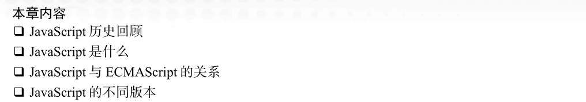
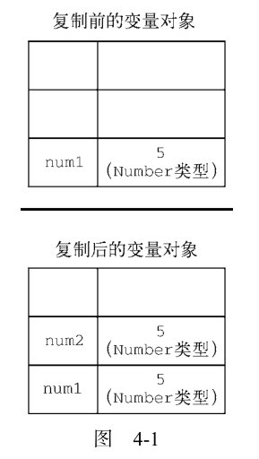
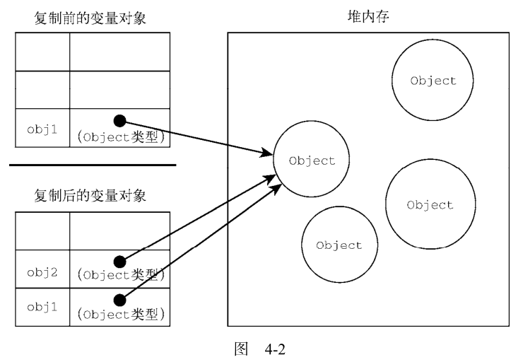
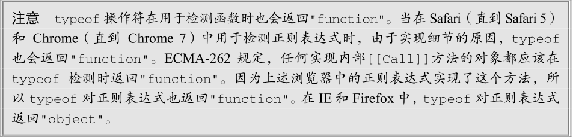
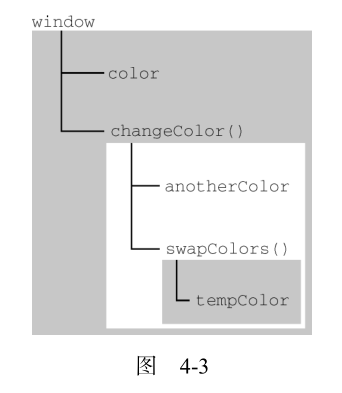

(注1:光阴似箭，日月如梭，记得我第一次看《JavaScript高级程序设计》的时候是2019年11月9日，当时看的是第3版，完完整整的看完了前8章，也大体复习过一遍。当然，直到现在还是有很多不懂的知识点。第8章往后的部分因为时间的缘故以及里面的内容对当时的我来说过于遥远就几乎没动过了。现在是2020年10月27日，几个月前就已经知道了《JavaScript高级程序设计》新出了第4版了，一直没有网上下载到资源，今天偶尔一搜，发现有，于是就下载下来了，于是便有了今天这篇博文。)

(注2：从2019年11月9日到2020年10月27日，将近一年的时间就这样过去了，而我依旧没能转行成功，哈哈。)

(注3：不过今时不同往日，当初看这本书的时候，我就看完了黑马Pink老师的的HTML和CSS视频，还有尚硅谷的JS入门视频过了一遍(当时好多不懂，就单纯的过了一遍)，然后就开始看这本书了。而现在，整个前端要学的整体范围我已经很清楚了，`H5C3,ES6,Vue,Node`这些都在进行当中了，现在重头开始再学一下这本书，就是为了查漏补缺，夯实原生JS基础了。《JavaScript高级程序设计》我和它已经认识快1年了，再次面对它，我多了一份自信和从容了。)

(注4：因为第4版有28章，170余万字，于是决定每7章做一个博文，这样就不会导致因为一篇博文字数太多而出现markdown卡顿的情况了。)

(注5：第4版看的话我还是快速重头用眼睛过一遍吧，但是写博文就不再按顺序写了啊，只写一些新增的知识点和我觉得薄弱的地方。)

(注6：希望明年3月份转行顺利吧，现在要好好的打好基础啊！！！加油吧！！！)

(注7：不对啊，估计是昨天太晚了，没有注意，我今天才发现我下载的不是《JavaScript高级程序设计》，而是《JavaScript权威指南》啊！！我去！！！)

(注8：不对，我弄混了，我下载了好多本，发现确实有一本是《JavaScript高级程序设计》第4版，是对的，没问题了。)

(注9：现在是2020年11月06日，大体快速的肉眼扫了一遍，发现增加的知识还是挺多的，标注**(以后补)**的小节表明扫完前7章以后就要认认真真的把内容给补齐了。不过现在自己隐隐产生了一些不安，自己现在的知识掌握的还是太不牢固了啊，还有很多概念没能深刻了解啊。此外还有很多知识还没有学，这样的进度，到了明年3月份还能学完吗？我这个是真的不能再拖了啊！不管了，明年3月份，不管学成了什么样，我都要辞职转行了啊！！！)

(注10：我什么时候可以打通任通二脉，达到顿悟的境界呢？？现在眼前一片朦胧啊。)

(注11：但是也不要心急啊。"往前走，慢慢的，朦胧就会变得清晰，清晰变得深刻"，现在就只能静待时间的发酵了。别急别急，一步一步，脚踏实地慢慢来啊。)

(注12：现在是2020年11月12日，新增的知识点是真的有点多啊，好多都没接触过，看不太懂。但是不要急，先大体不求甚解的快速过一遍，等以后做实际项目遇到了某个知识点就专门跳过来看相应的知识就好了。)

(注13：现在是2021年1月26日，有时间一定要把这本书给好好看完，现在就要开始看一些自己不熟悉的章节了，比如生成器，代理之类的章节了。)

(注14：现在是2021年3月11日，我已经有好久好久都没有看过这本书了，我觉得现在时机到了，自己慢慢的可以比较好的消化这本书了，所以，有时间的话还是要好好看啊！！！)

# 组织结构

* 第 1 章，介绍 JavaScript 的起源：从哪里来，如何发展，以及现今的状况。这一章会谈到 JavaScript与E CMAScript 的关系、DOM、BOM，以及 Ecma 和 W3C 相关的标准。
* 第 2 章，了解 JavaScript 如何与 HTML 结合来创建动态网页，主要介绍在网页中嵌入 JavaScript 的不同方式，还有 JavaScript 的内容类型及其与`
~~~

包含在`` 。比如，下面的代码会导致浏览器报错：

~~~javascript
");
	}
</script>
~~~

浏览器解析行内脚本的方式决定了它在看到字符串` </script>` 时，会将其当成**结束的** `</script>
`标签。想避免这个问题，只需要转义字符`“\”
`即可：

~~~javascript

~~~

这样修改之后，代码就可以被浏览器完全解释，不会导致任何错误。

### 标签位置

### 推迟执行脚本

HTML 4.01 为 `
	
	</head>
	<body>
	<!-- 这里是页面内容 -->
	</body>
</html>
~~~

虽然这个例子中的`
	
	</head>
	<body>
	<!-- 这里是页面内容 -->
	</body>
</html>
~~~

在这个例子中，第二个脚本可能先于第一个脚本执行。因此，重点在于它们之间没有依赖关系。给
脚本添加 async 属性的目的是告诉浏览器，不必等脚本下载和执行完后再加载页面，同样也不必等到
该异步脚本下载和执行后再加载其他脚本。正因为如此，异步脚本不应该在加载期间修改 DOM。

异步脚本保证会在页面的 load 事件前执行，但可能会在 DOMContentLoaded （参见第 17 章）之
前或之后。Firefox 3.6、Safari 5 和 Chrome 7 支持异步脚本。使用 async 也会告诉页面你不会使用
document.write ，不过好的 Web 开发实践根本就不推荐使用这个方法。

> **注意**：对于 XHTML 文档，指定 async 属性时应该写成 async="async" 。

### 动态加载脚本

### XHTML 中的变化

### 废弃的语法

## 行内代码与外部文件

## 文档模式

## `<noscript>` 元素

## 小结

# 第3章：语言基础

## 语法

### 区分大小写

### 标识符

### 注释

### 严格模式

### 语句

## 关键字与保留字

## 变量(以后补)

ECMAScript 变量是松散类型的，意思是变量可以用于保存任何类型的数据。每个变量只不过是一个用于保存任意值的命名占位符。有 3 个关键字可以声明变量： `var` 、` const `和` let` 。其中， var 在ECMAScript 的所有版本中都可以使用，而 `const `和` let `只能在 ECMAScript 6及更晚的版本中使用。

### var关键字

**1.var声明作用域**

**2.var声明提升**

### let声明

let 跟 var 的作用差不多，但有着非常重要的区别。最明显的区别是， let 声明的范围是**块作用域**，而 var 声明的范围是**函数作用域**。

**1.暂时性死区**

**2.全局声明**

**3.条件声明**

**4.for循环中的let声明**

### const声明

### 声明风格及最佳实践(以后补)

**1.不使用var** 

**2.const 优先， let 次之**

## 数据类型

### typeof操作符

### Undefined类型(以后补)

### Null类型(以后补)

### Boolean类型(以后补)

### Number类型

**1.浮点值**

**2.值的范围**

**3.NaN**

**4.数值转换**

### String类型

**1.字符字面量**

**2.字符串的特点**

**3.转换为字符串**

**4.模版字面量(以后补)**

**5.字符串插值(以后补)**

**6.模板字面量标签函数(以后补)**

> 怎么感觉有点看不太懂呢？？

**7.原始字符串**

### Symbol类型(看不懂，以后补)

[JavaScript 为什么要有 Symbol 类型](https://segmentfault.com/a/1190000018522663)

Symbol （符号）是 ECMAScript 6 新增的**数据类型**。**符号是原始值**，且**符号实例是唯一、不可变的**。符号的用途是确保**对象属性使用唯一标识符**，**不会发生属性冲突**的危险。

尽管听起来跟私有属性有点类似，但符号并不是为了提供私有属性的行为才增加的（尤其是因为Object API 提供了方法，可以更方便地发现符号属性）。相反，符号就是用来**创建唯一记号**，进而用作**非字符串形式**的对象属性。

**1.符号的基本用法**

符号需要使用 `Symbol()` 函数初始化。因为**符号本身是原始类型**，所以 typeof 操作符对符号返回symbol 。

~~~javascript
let sym = Symbol();
console.log(typeof sym);	//symbol
~~~

调用` Symbol() `函数时，也可以传入一个字符串参数作为对符号的描述（description），将来可以通过这个字符串来调试代码。但是，**这个字符串参数与符号定义或标识完全无关**：

~~~javascript
let genericSymbol = Symbol();
let otherGenericSymbol = Symbol();

let fooSymbol = Symbol('foo');
let otherFooSymbol = Symbol('foo');

console.log(genericSymbol == otherGenericSymbol); // false
console.log(fooSymbol == otherFooSymbol); // false
~~~

符号没有字面量语法，这也是它们发挥作用的关键。按照规范，你只要创建` Symbol() `实例并将其用作对象的新属性，就可以保证它不会覆盖已有的对象属性，无论是符号属性还是字符串属性。

~~~javascript
let genericSymbol = Symbol();
console.log(genericSymbol); // Symbol()

let fooSymbol = Symbol('foo');
console.log(fooSymbol); // Symbol(foo);
~~~

最重要的是， `Symbol() `函数不能与 new 关键字一起作为构造函数使用。这样做是为了避免创建符号包装对象，像使用 Boolean 、 String 或 Number 那样，它们都支持构造函数且可用于初始化包含原始值的包装对象：

~~~javascript
let myBoolean = new Boolean();
console.log(typeof myBoolean); // "object"

let myString = new String();
console.log(typeof myString); // "object"

let myNumber = new Number();
console.log(typeof myNumber); // "object"

let mySymbol = new Symbol(); // TypeError: Symbol is not a constructor
~~~

如果你确实想使用符号包装对象，可以借用 Object() 函数：

~~~javascript
let mySymbol = Symbol();
let myWrappedSymbol = Object(mySymbol);
console.log(typeof myWrappedSymbol);	 // "object"
~~~

> 看不懂代码了。

**2.使用全局符号注册表**

如果运行时的不同部分需要共享和重用符号实例，那么可以用一个字符串作为键，在全局符号注册
表中创建并重用符号。

为此，需要使用 `Symbol.for() `方法：

~~~javascript
let fooGlobalSymbol = Symbol.for('foo');
console.log(typeof fooGlobalSymbol); // symbol
~~~

`Symbol.for() `对每个字符串键都执行幂等操作。第一次使用某个字符串调用时，它会检查全局运行时注册表，发现不存在对应的符号，于是就会生成一个新符号实例并添加到注册表中。后续使用相同字符串的调用同样会检查注册表，发现存在与该字符串对应的符号，然后就会返回该符号实例。

> 我都看不懂它在说什么。

~~~javascript
let fooGlobalSymbol = Symbol.for('foo'); // 创建新符号
let otherFooGlobalSymbol = Symbol.for('foo'); // 重用已有符号

console.log(fooGlobalSymbol === otherFooGlobalSymbol); // true
~~~

即使采用相同的符号描述，在全局注册表中定义的符号跟使用 Symbol() 定义的符号也并不等同：

~~~javascript
let localSymbol = Symbol('foo');
let globalSymbol = Symbol.for('foo');

console.log(localSymbol === globalSymbol); // false
~~~

全局注册表中的符号必须使用字符串键来创建，因此作为参数传给 Symbol.for() 的任何值都会被转换为字符串。此外，注册表中使用的键同时也会被用作符号描述。

~~~javascript
let emptyGlobalSymbol = Symbol.for();
console.log(emptyGlobalSymbol); 	// Symbol(undefined)
~~~

还可以使用 Symbol.keyFor() 来查询全局注册表，这个方法接收符号，返回该全局符号对应的字符串键。如果查询的不是全局符号，则返回 undefined 。

~~~javascript
// 创建全局符号
let s = Symbol.for('foo');
console.log(Symbol.keyFor(s)); // foo

// 创建普通符号
let s2 = Symbol('bar');
console.log(Symbol.keyFor(s2)); // undefined
~~~

如果传给` Symbol.keyFor() `的不是符号，则该方法抛出 TypeError ：

~~~javascript
Symbol.keyFor(123);	 // TypeError: 123 is not a symbol
~~~

**3.使用符号作为属性**

凡是可以使用字符串或数值作为属性的地方，都可以使用符号。这就包括了对象字面量属性和
`Object.defineProperty()` / `Object.defineProperties() `定义的属性。对象字面量只能在计算属性语法中使用符号作为属性。

~~~javascript
let s1 = Symbol('foo'),
	s2 = Symbol('bar'),
	s3 = Symbol('baz'),
	s4 = Symbol('qux');

let o = {
	[s1]: 'foo val'
};

// 这样也可以：o[s1] = 'foo val';

console.log(o);
// {Symbol(foo): foo val}

Object.defineProperty(o, s2, {value: 'bar val'});

console.log(o);
// {Symbol(foo): foo val, Symbol(bar): bar val}

Object.defineProperties(o, {
	[s3]: {value: 'baz val'},
	[s4]: {value: 'qux val'}
});
console.log(o);
// {Symbol(foo): foo val, Symbol(bar): bar val,
// Symbol(baz): baz val, Symbol(qux): qux val}
~~~

类似于 Object.getOwnPropertyNames() 返回对象实例的常规属性数组， `Object.getOwnProperty-Symbols() `返回对象实例的符号属性数组。这两个方法的返回值彼此互斥。 `Object.getOwnProperty-Descriptors() `会返回同时包含常规和符号属性描述符的对象。 `Reflect.ownKeys() `会返回两种类型的键：

~~~javascript
let s1 = Symbol('foo'),
	s2 = Symbol('bar');

let o = {
	[s1]: 'foo val',
	[s2]: 'bar val',
	baz: 'baz val',
	qux: 'qux val'
};

console.log(Object.getOwnPropertySymbols(o));
// [Symbol(foo), Symbol(bar)]

console.log(Object.getOwnPropertyNames(o));
// ["baz", "qux"]

console.log(Object.getOwnPropertyDescriptors(o));
// {baz: {...}, qux: {...}, Symbol(foo): {...}, Symbol(bar): {...}}

console.log(Reflect.ownKeys(o));
// ["baz", "qux", Symbol(foo), Symbol(bar)]
~~~

因为符号属性是对内存中符号的一个引用，所以直接创建并用作属性的符号不会丢失。但是，如果没有显式地保存对这些属性的引用，那么必须遍历对象的所有符号属性才能找到相应的属性键：

~~~javascript
let o = {
	[Symbol('foo')]: 'foo val',
	[Symbol('bar')]: 'bar val'
};

console.log(o);
// {Symbol(foo): "foo val", Symbol(bar): "bar val"}

let barSymbol = Object.getOwnPropertySymbols(o)
				.find((symbol) => symbol.toString().match(/bar/));
console.log(barSymbol);
// Symbol(bar)
~~~

**4.常用内置符号**

> 看不懂了，剩下的先不抄了吧，抄了也是百抄。

### Object 类型

ECMAScript 中的对象其实就是一组数据和功能的集合。对象通过 new 操作符后跟对象类型的名称来创建。开发者可以通过创建 Object 类型的实例来创建自己的对象，然后再给对象添加属性和方法：

~~~javascript
let o = new Object();
~~~

这个语法类似 Java，但 ECMAScript 只要求在给构造函数提供参数时使用括号。如果没有参数，如上面的例子所示，那么完全可以省略括号（不推荐）：

~~~javascript
let o = new Object; // 合法，但不推荐
~~~

Object 的实例本身并不是很有用，但理解与它相关的概念非常重要。类似 Java 中的` java.lang.Object` ，ECMAScript中的 Object 也是派生其他对象的基类。 Object 类型的所有属性和方法在派生的对象上同样存在。

每个 Object 实例都有如下**属性和方法**。

* `constructor` ：用于创建当前对象的函数。在前面的例子中，这个属性的值就是 `Object()`函数。

*  `hasOwnProperty(propertyName) `：用于判断当前对象实例（不是原型）上是否存在给定的属性。要检查的属性名必须是字符串（如 `o.hasOwnProperty("name") ）`或符号。
* ` isPrototypeOf(object)` ：用于判断当前对象是否为另一个对象的原型。（第 8 章将详细介绍原型。）
* `propertyIsEnumerable(propertyName)` ：用于判断给定的属性是否可以使用（本章稍后讨论的） `for-in` 语句枚举。与` hasOwnProperty() `一样，属性名必须是字符串。
* ` toLocaleString() `：返回对象的字符串表示，该字符串反映对象所在的本地化执行环境。
* ` toString() `：返回对象的字符串表示。
* `valueOf()` ：返回对象对应的字符串、数值或布尔值表示。通常与 toString() 的返回值相同。

> 我发现我已经彻底迷茫了，越学感觉自己漏洞百出，我根本就没入JavaScript的门啊！！

因为在 ECMAScript 中 Object 是所有对象的基类，所以任何对象都有这些属性和方法。第 8章将介绍对象间的继承机制。

> 注意 严格来讲，ECMA-262 中对象的行为不一定适合 JavaScript 中的其他对象。比如浏览器环境中的 BOM 和 DOM 对象，都是由宿主环境定义和提供的宿主对象。而宿主对象不受 ECMA-262 约束，所以它们可能会也可能不会继承 Object 。

## 操作符

### 一元操作符

**1.递增/递减操作符**

**2.一元加和减**

### 位操作符(以后补)

**1.按位非**

**2.按位与**

**3.按位或**

**4.按位异或**

**5.左移**

**6.有符号右移**

**7.无符号右移**

### 布尔操作符

**1.逻辑非**

**2.逻辑与**

**3.逻辑或**

### 乘性操作符

**1.乘法操作符**

**2.除法操作符**

**3.取模操作符**

### 指数操作符

ECMAScript 7新增了指数操作符， Math.pow() 现在有了自己的操作符 `**` ，结果是一样的：

~~~javascript
console.log(Math.pow(3, 2); // 9
console.log(3 ** 2); // 9

console.log(Math.pow(16, 0.5); // 4
console.log(16** 0.5); // 4
~~~

不仅如此，指数操作符也有自己的指数赋值操作符` **=` ，该操作符执行指数运算和结果的赋值操作：

~~~javascript
let squared = 3;
squared **= 2;
console.log(squared); // 9

let sqrt = 16;
sqrt **= 0.5;
console.log(sqrt); // 4
~~~

### 加性操作符

**1.加法操作符**

**2.减法操作符**

### 关系运算符

### 相等操作符

**1.等于和不等于**

**2.全等和不全等**

### 条件操作符

### 赋值操作符

### 逗号操作符

## 语句

### if 语句

### do-while 语句

### while 语句

### for 语句

### for-in 语句

[for in 和for of的区别](https://www.jianshu.com/p/c43f418d6bf0)

> for in更适合遍历对象，不要使用for in遍历数组。
>
> `for in`遍历的是数组的索引（即键名key），而`for of`遍历的是数组元素值(value)

`for-in` 语句是一种严格的迭代语句，用于枚举对象中的非符号键属性，语法如下：

~~~javascript
for (property in expression) statement
~~~

下面是一个例子：

~~~javascript
for (const propName in window) {
	document.write(propName);
}
~~~

这个例子使用 for-in 循环显示了 BOM 对象 window 的所有**属性**。每次执行循环，都会给变量`propName `赋予一个 window 对象的属性作为值，直到 window 的所有属性都被枚举一遍。与 for 循环一样，这里控制语句中的 const 也不是必需的。但为了确保这个局部变量不被修改，推荐使用 const 。

ECMAScript 中对象的属性是无序的，因此 for-in 语句不能保证返回对象属性的顺序。换句话说，所有可枚举的属性都会返回一次，但返回的顺序可能会因浏览器而异。

如果 `for-in `循环要迭代的变量是 null 或 undefined ，则不执行循环体。

### for-of 语句

for-of 语句是一种严格的迭代语句，用于遍历可迭代对象的元素，语法如下：

~~~javascript
for (property of expression) statement
~~~

下面是示例：

~~~javascript
for (const el of [2,4,6,8]) {
	document.write(el);
}
~~~

在这个例子中，我们使用 for-of 语句显示了一个包含 4 个元素的数组中的所有元素。循环会一直持续到将所有元素都迭代完。与 for 循环一样，这里控制语句中的 const 也不是必需的。但为了确保这个局部变量不被修改，推荐使用 const 。

for-of 循环会按照可迭代对象的 next() 方法产生值的顺序迭代元素。关于可迭代对象，本书将在第 7 章详细介绍。

如果尝试迭代的变量不支持迭代，则 for-of 语句会抛出错误。

> 注意 ES2018 对 for-of 语句进行了扩展，增加了 for-await-of 循环，以支持生成期约（promise）的异步可迭代对象。相关内容将在附录 A 介绍

### 标签语句

标签语句用于给语句加标签，语法如下：

~~~javascript
label: statement
~~~

下面是一个例子：

~~~javascript
start: for (let i = 0; i < count; i++) {
	console.log(i);
}
~~~

在这个例子中， start 是一个标签，可以在后面通过 break 或 continue 语句引用。标签语句的典型应用场景是嵌套循环。

### break 和 continue 语句

### with 语句(不推荐使用)

### switch 语句

## 函数

函数对任何语言来说都是核心组件，因为它们可以封装语句，然后在任何地方、任何时间执行。ECMAScript 中的函数使用 function 关键字声明，后跟一组参数，然后是函数体。

> 注意 第 10 章会更详细地介绍函数。

以下是函数的基本语法：

~~~javascript
function functionName(arg0, arg1,...,argN) {
	statements
}
~~~

下面是一个例子：

~~~javascript
function sayHi(name, message) {
	console.log("Hello " + name + ", " + message);
}
~~~

可以**通过函数名来调用函数**，要传给函数的参数放在括号里（如果有多个参数，则用逗号隔开）。下面是调用函数 `sayHi()` 的示例：

~~~javascript
sayHi("Nicholas", "how are you today?");
~~~

调用这个函数的输出结果是` "Hello Nicholas, how are you today?" `。参数 name 和 message在函数内部作为字符串被拼接在了一起，最终通过`console.log` 输出到控制台。

ECMAScript 中的函数不需要指定是否返回值。任何函数在任何时间都可以使用 return 语句来返回函数的值，用法是后跟要返回的值。比如：

~~~javascript
function sum(num1, num2) {
	return num1 + num2;
}
~~~

函数 sum() 会将两个值相加并返回结果。注意，除了 return 语句之外没有任何特殊声明表明该函数有返回值。然后就可以这样调用它：

~~~javascript
const result = sum(5, 10);
~~~

要注意的是，只要碰到 return 语句，函数就会立即停止执行并退出。因此， return 语句后面的代码不会被执行。比如：

~~~javascript
function sum(num1, num2) {
	return num1 + num2;
	console.log("Hello world"); //  不会执行
}
~~~

在这个例子中， console.log 不会执行，因为它在 return 语句后面。

一个函数里也可以有多个 return 语句，像这样：

~~~javascript
function diff(num1, num2) {
	if (num1 < num2) {
		return num2 - num1;
	} else {
		return num1 - num2;
	}
}
~~~

这个 diff() 函数用于计算两个数值的差。如果第一个数值小于第二个，则用第二个减第一个；否则，就用第一个减第二个。代码中每个分支都有自己的 return 语句，返回正确的差值。

return 语句也可以不带返回值。这时候，函数会立即停止执行并返回 undefined 。这种用法最常用于提前终止函数执行，并不是为了返回值。比如在下面的例子中， `console.log `不会执行：

~~~javascript
function sayHi(name, message) {
	return;
	console.log("Hello " + name + ", " + message); // 不会执行
}
~~~

> 注意 最佳实践是函数要么返回值，要么不返回值。只在某个条件下返回值的函数会带来麻烦，尤其是调试时。

严格模式对函数也有一些限制：

* 函数不能以 eval 或 arguments 作为名称；
* 函数的参数不能叫 eval 或 arguments ；
* 两个命名参数不能拥有同一个名称。

如果违反上述规则，则会导致语法错误，代码也不会执行。

## 小结

JavaScript 的核心语言特性在 ECMA-262 中以伪语言 ECMAScript 的形式来定义。ECMAScript包含所有基本语法、操作符、数据类型和对象，能完成基本的计算任务，但没有提供获得输入和产生输出的机制。理解ECMAScript 及其复杂的细节是完全理解浏览器中 JavaScript 的关键。下面总结一下ECMAScript 中的基本元素。

* ECMAScript 中的基本数据类型包括 Undefined 、 Null 、 Boolean 、 Number 、 String 和 Symbol 。
* 与其他语言不同，ECMAScript 不区分整数和浮点值，只有 Number 一种数值数据类型。
* Object 是一种复杂数据类型，它是这门语言中所有对象的基类。
*  严格模式为这门语言中某些容易出错的部分施加了限制。
*  ECMAScript 提供了 C 语言和类 C 语言中常见的很多基本操作符，包括数学操作符、布尔操作符、关系操作符、相等操作符和赋值操作符等。
* 这门语言中的流控制语句大多是从其他语言中借鉴而来的，比如 if 语句、 for 语句和 switch语句等。

ECMAScript 中的函数与其他语言中的函数不一样。

*  不需要指定函数的返回值，因为任何函数可以在任何时候返回任何值。
*  不指定返回值的函数实际上会返回特殊值 undefined 。

# 第4章：变量、作用域与内存

相比于其他语言，JavaScript 中的变量可谓独树一帜。正如 ECMA-262 所规定的，JavaScript 变量是松散类型的，而且变量不过就是特定时间点一个特定值的名称而已。由于没有规则定义变量必须包含什么数据类型，变量的值和数据类型在脚本生命期内可以改变。这样的变量很有意思，很强大，当然也有不少问题。本章会剖析错综复杂的变量。

## 原始值与引用值

ECMAScript 变量可以包含两种不同类型的数据：原始值和引用值。原始值（primitive value）就是最简单的数据，引用值（reference value）则是由多个值构成的对象。

在把一个值赋给变量时，JavaScript 引擎必须确定这个值是原始值还是引用值。上一章讨论了 6 种原始值`Undefined `、 `Null `、` Boolean `、 `Number`、` String` 和 `Symbol `。保存原始值的变量是按值（`by value`）访问的，因为我们操作的就是存储在变量中的实际值。

**引用值是保存在内存中的对象**。与其他语言不同，**JavaScript 不允许直接访问内存位置**，因此也就**不能直接操作对象所在的内存空间**。在操作对象时，**实际上操作的是对该对象的引用（reference）而非实际的对象本身**。为此，保存引用值的变量是按引用（`by reference`）访问的。

> 注意 在很多语言中，字符串是使用对象表示的，因此被认为是引用类型。ECMAScript打破了这个惯例。

### 动态属性

原始值和引用值的定义方式很类似，都是创建一个变量，然后给它赋一个值。不过，在变量保存了这个值之后，可以对这个值做什么，则大有不同。对于引用值而言，可以随时添加、修改和删除其属性和方法。比如，看下面的例子：

~~~javascript
let person = new Object();
person.name = "Nicholas";
console.log(person.name); // "Nicholas"
~~~

这里，首先创建了一个对象，并把它保存在变量 person 中。然后，给这个对象添加了一个名为name 的属性，并给这个属性赋值了一个字符串 "Nicholas" 。在此之后，就可以访问这个新属性，直到对象被销毁或属性被显式地删除。

**原始值不能有属性**，**尽管尝试给原始值添加属性不会报错**。比如：

~~~javascript
let name = "Nicholas";
name.age = 27;
console.log(name.age); // undefined
~~~

在此，代码想给字符串 name 定义一个 age 属性并给该属性赋值 27。紧接着在下一行，属性不见了。

**记住，只有引用值可以动态添加后面可以使用的属性。**

注意，原始类型的初始化可以只使用原始字面量形式。如果使用的是 new 关键字，则 JavaScript 会创建一个 Object 类型的实例，但其行为类似原始值。下面来看看这两种初始化方式的差异：

~~~javascript
let name1 = "Nicholas";
let name2 = new String("Matt");
name1.age = 27;
name2.age = 26;

console.log(name1.age); // undefined
console.log(name2.age); // 26

console.log(typeof name1); // string
console.log(typeof name2); // object
~~~

### 复制值

除了存储方式不同，原始值和引用值在通过变量复制时也有所不同。在通过变量把一个原始值赋值到另一个变量时，原始值会被复制到新变量的位置。请看下面的例子：

~~~javascript
let num1 = 5;
let num2 = num1;
~~~

这里， num1 包含数值 5。当把 num2 初始化为 num1 时， num2 也会得到数值 5。这个值跟存储在num1 中的 5 是完全独立的，因为它是那个值的副本。

这两个变量可以独立使用，互不干扰。这个过程如图 4-1 所示。

在把引用值从一个变量赋给另一个变量时，存储在变量中的值也会被复制到新变量所在的位置。区别在于，这里**复制的值实际上是一个指针**，它指向存储在堆内存中的对象。操作完成后，两个变量实际上指向同一个对象，因此一个对象上面的变化会在另一个对象上反映出来，如下面的例子所示：

~~~javascript
let obj1 = new Object();
let obj2 = obj1;

obj1.name = "Nicholas";
console.log(obj2.name); // "Nicholas"
~~~

在这个例子中，变量 obj1 保存了一个新对象的实例。然后，这个值被复制到 obj2 ，此时两个变量都指向了同一个对象。在给 obj1 创建属性 name 并赋值后，通过 obj2 也可以访问这个属性，因为它们都指向同一个对象。图 4-2 展示了变量与堆内存中对象之间的关系。

### 传递参数

ECMAScript 中所有函数的**参数**都是**按值传递**的。这意味着函数外的值会被复制到函数内部的参数中，就像从一个变量复制到另一个变量一样。如果是原始值，那么就跟原始值变量的复制一样，如果是引用值，那么就跟引用值变量的复制一样。对很多开发者来说，这一块可能会不好理解，毕竟**变量有按值和按引用访问，而传参则只有按值传递。**

在按值传递参数时，值会被复制到一个局部变量（即一个命名参数，或者用 ECMAScript 的话说，就是arguments 对象中的一个槽位）。在按引用传递参数时，值在内存中的位置会被保存在一个局部变量，这意味着对本地变量的修改会反映到函数外部。（这在 ECMAScript 中是不可能的。）来看下面这个例子：

~~~javascript
function addTen(num) {
	num += 10;
	return num;
}

let count = 20;
let result = addTen(count);

console.log(count); // 20，没有变化
console.log(result); // 30
~~~

这里，函数 `addTen() `有一个参数 num ，它其实是一个局部变量。在调用时，变量 count 作为参数传入。 count 的值是 20，这个值被复制到参数 num 以便在 `addTen() `内部使用。在函数内部，参数 num的值被加上了 10，但这不会影响函数外部的原始变量 count 。参数 num 和变量 count 互不干扰，它们只不过碰巧保存了一样的值。如果 num 是按引用传递的，那么 count 的值也会被修改为 30。这个事实在使用数值这样的原始值时是非常明显的。但是，如果**变量中传递的是对象(变量person是一个对象，传入到函数setName里的参数obj里)**，就没那么清楚了。比如，再看这个例子：

~~~javascript
function setName(obj) {
	obj.name = "Nicholas";
}

let person = new Object();
setName(person);
console.log(person.name); // "Nicholas"
~~~

这一次，我们创建了一个对象并把它保存在变量 person 中。然后，这个对象被传给`setName()`方法，并被复制到参数 obj 中。**在函数内部， obj 和 person 都指向同一个对象**。结果就是，**即使对象是按值传进函数的， obj 也会通过引用访问对象**。当**函数内部**给 obj 设置了 name 属性时，**函数外部**的对象也会反映这个变化，因为 **obj 指向的对象保存在全局作用域的堆内存上**。很多开发者错误地认为，当在局部作用域中修改对象而变化反映到全局时，就意味着参数是按引用传递的。**为证明对象是按值传递的**，我们再来看看下面这个修改后的例子：

~~~javascript
function setName(obj) {
	obj.name = "Nicholas";
	obj = new Object();
	obj.name = "Greg";
}

let person = new Object();
setName(person);
console.log(person.name); // "Nicholas"
~~~

这个例子前后唯一的变化就是`setName()`中多了两行代码，将 obj 重新定义为一个有着不同 name的新对象。当 person 传入`setName()`时，其 name 属性被设置为 "Nicholas" 。然后变量 obj 被设置为一个新对象且 name 属性被设置为 "Greg" 。如果 person 是按引用传递的，那么 person 应该自动将指针改为指向 name 为 "Greg" 的对象。可是，当我们再次访问`person.name`时，它的值是 "Nicholas" ，这表明函数中参数的值改变之后，原始的引用仍然没变。当 obj 在函数内部被重写时，它变成了一个指向本地对象的指针。而那个本地对象在函数执行结束时就被销毁了。

> 注意 ECMAScript 中函数的参数就是局部变量。

### 确定类型

前一章提到的 typeof 操作符最适合用来判断一个变量是否为原始类型。更确切地说，它是判断一个变量是否为字符串、数值、布尔值或 undefined 的最好方式。如果值是对象或 null ，那么 typeof返回 "object" ，如下面的例子所示：

~~~javascript
let s = "Nicholas";
let b = true;
let i = 22;
let u;
let n = null;
let o = new Object();

console.log(typeof s); // string
console.log(typeof i); // number
console.log(typeof b); // boolean
console.log(typeof u); // undefined
console.log(typeof n); // object
console.log(typeof o); // object
~~~

typeof 虽然对原始值很有用，但它对引用值的用处不大。我们通常不关心一个值是不是对象，而是想知道**它是什么类型的对象**。为了解决这个问题，ECMAScript 提供了 instanceof 操作符，语法如下：

~~~javascript
result = variable instanceof constructor
~~~

如果变量是给定引用类型（由其原型链决定，将在第 8 章详细介绍）的实例，则 instanceof 操作符返回 true 。来看下面的例子：

~~~javascript
console.log(person instanceof Object); 	// 变量 person 是 Object 吗？
console.log(colors instanceof Array); 	// 变量 colors 是 Array 吗？
console.log(pattern instanceof RegExp); // 变量 pattern 是 RegExp 吗？
~~~

按照定义，所有引用值都是 Object 的实例，因此通过 instanceof 操作符检测任何引用值和Object 构造函数都会返回 true 。类似地，如果用 instanceof 检测原始值，则始终会返回 false ，因为原始值不是对象。

## 执行上下文与作用域(重要)

执行上下文（以下简称“上下文”）的概念在 JavaScript 中是颇为重要的。变量或函数的上下文决定了它们可以访问哪些数据，以及它们的行为。每个上下文都有一个关联的变量对象（variable object），而这个上下文中定义的所有变量和函数都存在于这个对象上。虽然无法通过代码访问变量对象，但后台处理数据会用到它。

全局上下文是最外层的上下文。根据 ECMAScript实现的宿主环境，表示全局上下文的对象可能不一样。在浏览器中，全局上下文就是我们常说的 window 对象（第 12章会详细介绍），因此所有通过 var 定义的全局变量和函数都会成为 window 对象的属性和方法。**使用 let 和 const 的顶级声明不会定义在全局上下文中**，但在作用域链解析上效果是一样的。**上下文在其所有代码都执行完毕后会被销毁**，包括定义在它上面的所有变量和函数（全局上下文在应用程序退出前才会被销毁，比如关闭网页或退出浏览器）。

**每个函数调用都有自己的上下文**。当代码执行流进入函数时，函数的上下文被推到一个上下文栈上。在函数执行完之后，上下文栈会弹出该函数上下文，将控制权返还给之前的执行上下文。ECMAScript程序的执行流就是通过这个上下文栈进行控制的。

上下文中的代码在执行的时候，会创建变量对象的一个**作用域链（scope chain）**。这个作用域链决定了各级上下文中的代码在访问变量和函数时的顺序。**代码正在执行的上下文的变量对象始终位于作用域链的最前端**。**如果上下文是函数**，则其**活动对象（activation object）**用作变量对象。活动对象最初只有一个定义变量： arguments 。（全局上下文中没有这个变量。）**作用域链中的下一个变量对象来自包含上下文**，再下一个对象来自再下一个包含上下文。以此类推直至全局上下文；全局上下文的变量对象始终是作用域链的最后一个变量对象。

> 这段话还是理解不了。

代码执行时的标识符解析是通过沿作用域链逐级搜索标识符名称完成的。搜索过程始终从作用域链的最前端开始，然后逐级往后，直到找到标识符。（如果没有找到标识符，那么通常会报错。）

看一看下面这个例子：

~~~javascript
var color = "blue";

function changeColor() {
	if (color === "blue") {
		color = "red";
	} else {
		color = "blue";
	}
}
changeColor();
~~~

对这个例子而言，函数 `changeColor() `的**作用域链**包含**两个对象**：**一个**是**它自己的变量对象（就是定义 arguments 对象的那个）**，**另一个**是**全局上下文的变量对象**。这个函数内部之所以能够访问变量color ，就是因为可以在作用域链中找到它。

> 不熟悉,看不懂。

此外，局部作用域中定义的变量可用于在局部上下文中替换全局变量。看一看下面这个例子：

~~~javascript
var color = "blue";

function changeColor() {
	let anotherColor = "red";
	function swapColors() {
		let tempColor = anotherColor;
		anotherColor = color;
		color = tempColor;
		// 这里可以访问 color、anotherColor 和 tempColor
	}
    
	// 这里可以访问 color 和 anotherColor，但访问不到 tempColor
	swapColors();
}

// 这里只能访问 color
changeColor();
~~~

以上代码涉及 **3 个上下文**：**全局上下文、 `changeColor() `的局部上下文和` swapColors() `的局部上下文**。全局上下文中有一个变量 color 和一个函数 `changeColor() `。 `changeColor() `的局部上下文中有一个变量 `anotherColor` 和一个函数 `swapColors() `，但在这里可以访问全局上下文中的变量 color 。`swapColors() `的局部上下文中有一个变量 `tempColor` ，只能在这个上下文中访问到。全局上下文和`changeColor()` 的局部上下文都无法访问到 `tempColor` 。而在` swapColors() `中则可以访问另外两个上下文中的变量，因为它们都是父上下文。图 4-3 展示了前面这个例子的作用域链。

图 4-3 中的矩形表示不同的上下文。内部上下文可以通过作用域链访问外部上下文中的一切，但外部上下文无法访问内部上下文中的任何东西。上下文之间的连接是线性的、有序的。每个上下文都可以到上一级上下文中去搜索变量和函数，但任何上下文都不能到下一级上下文中去搜索。 `swapColors()`局部上下文的作用域链中有 3 个对象： `swapColors()` 的变量对象、 `changeColor() `的变量对象和全局变量对象。 `swapColors() `的局部上下文首先从自己的变量对象开始搜索变量和函数，搜不到就去搜索上一级变量对象。 `changeColor() `上下文的作用域链中只有 2 个对象：它自己的变量对象和全局变量对象。因此，它不能访问 `swapColors() `的上下文。

> 注意 函数参数被认为是当前上下文中的变量，因此也跟上下文中的其他变量遵循相同的访问规则。

### 作用域链增强(不建议用)

### 变量声明

ES6 之后，JavaScript 的变量声明经历了翻天覆地的变化。直到 ECMAScript 5.1， var 都是声明变量的唯一关键字。ES6 不仅增加了 let 和 const 两个关键字，而且还让这两个关键字压倒性地超越 var成为首选。

**1.使用 var 的函数作用域声明**

在使用 var 声明变量时，变量会被自动添加到最接近的上下文。在函数中，最接近的上下文就是函数的局部上下文。在 with 语句中，最接近的上下文也是函数上下文。如果变量未经声明就被初始化了，那么它就会自动被添加到全局上下文，如下面的例子所示：

~~~javascript
function add(num1, num2) {
	var sum = num1 + num2;
	return sum;
}

let result = add(10, 20); // 30
console.log(sum); // 报错：sum 在这里不是有效变量
~~~

> 这里result没有打印，会在控制台上显示30吗？到时候实验一下。

这里，函数 add() 定义了一个局部变量 sum ，保存加法操作的结果。这个值作为函数的值被返回，但变量 sum 在函数外部是访问不到的。如果省略上面例子中的关键字 var ，那么 sum 在`add()`被调用之后就变成可以访问的了，如下所示：

~~~javascript
function add(num1, num2) {
	sum = num1 + num2;
	return sum;
}

let result = add(10, 20); // 30
console.log(sum); // 30
~~~

这一次，变量 sum 被用加法操作的结果初始化时并没有使用 var 声明。在调用 `add()` 之后， sum被添加到了全局上下文，在函数退出之后依然存在，从而在后面可以访问到。

> 注意 未经声明而初始化变量是 JavaScript 编程中一个非常常见的错误，会导致很多问题。为此，读者在初始化变量之前一定要先声明变量。在严格模式下，未经声明就初始化变量会报错。

var 声明会被拿到函数或全局作用域的顶部，位于作用域中所有代码之前。这个现象叫作**“提升”（hoisting）**。提升让同一作用域中的代码不必考虑变量是否已经声明就可以直接使用。可是在实践中，提升也会导致**合法却奇怪**的现象，即在变量声明之前使用变量。下面的例子展示了在全局作用域中两段等价的代码：

~~~javascript
var name = "Jake";
// 等价于：
name = 'Jake';
var name;

//下面是两个等价的函数：
function fn1() {
	var name = 'Jake';
}

// 等价于：
function fn2() {
	var name;
	name = 'Jake';
}
~~~

通过在声明之前打印变量，可以验证变量会被提升。声明的提升意味着会输出 undefined 而不是Reference Error 。

~~~javascript
console.log(name); 		// undefined
var name = 'Jake';

function() {
	console.log(name);  // undefined
	var name = 'Jake';
}
~~~

**2.使用 let 的块级作用域声明**

ES6 新增的 let 关键字跟 var 很相似，但它的作用域是块级的，这也是 JavaScript 中的新概念。块级作用域由最近的一对包含花括号 {} 界定。换句话说， if 块、 while 块、 function 块，甚至连单独的块也是 let 声明变量的作用域。

~~~javascript
if (true) {
	let a;
}
console.log(a); // ReferenceError: a 没有定义

while (true) {
	let b;
}
console.log(b); // ReferenceError: b 没有定义

function foo() {
	let c;
}
console.log(c); // ReferenceError: c 没有定义

// 这没什么可奇怪的
// var 声明也会导致报错

// 这不是对象字面量，而是一个独立的块
// JavaScript 解释器会根据其中内容识别出它来
{
	let d;
}
console.log(d); // ReferenceError: d 没有定义
~~~

let 与 var 的另一个不同之处是在同一作用域内不能声明两次。重复的 var 声明会被忽略，而重复的 let 声明会抛出 SyntaxError 。

~~~javascript
var a;
var a;
// 不会报错

{
	let b;
	let b;
}
// SyntaxError: 标识符 b 已经声明过了	
~~~

let 的行为非常适合在循环中声明迭代变量。使用 var 声明的迭代变量会泄漏到循环外部，这种情况应该避免。来看下面两个例子：

~~~javascript
for (var i = 0; i < 10; ++i) {}
console.log(i); // 10

for (let j = 0; j < 10; ++j) {}
console.log(j); // ReferenceError: j 没有定义
~~~

严格来讲， let 在 JavaScript 运行时中也会被提升，但由于**“暂时性死区”（temporal dead zone）**的缘故，实际上不能在声明之前使用 let 变量。因此，从写 JavaScript 代码的角度说， let 的提升跟 var是不一样的。

[ES6 中 let 暂时性死区详解](https://segmentfault.com/a/1190000015603779)

**3.使用 const 的常量声明**

除了 let ，ES6 同时还增加了 const 关键字。使用 const 声明的变量必须同时初始化为某个值。一经声明，在其生命周期的任何时候都不能再重新赋予新值。

~~~javascript
const a; // SyntaxError: 常量声明时没有初始化

const b = 3;
console.log(b); // 3
b = 4; // TypeError: 给常量赋值
~~~

const 除了要遵循以上规则，其他方面与 let 声明是一样的：

~~~javascript
if (true) {
	const a = 0;
}
console.log(a); // ReferenceError: a 没有定义

while (true) {
	const b = 1;
}
console.log(b); // ReferenceError: b 没有定义

function foo() {
	const c = 2;
}
console.log(c); // ReferenceError: c 没有定义

{
	const d = 3;
}
console.log(d); // ReferenceError: d 没有定义
~~~

const 声明只应用到顶级原语或者对象。换句话说，赋值为对象的 const 变量不能再被重新赋值为其他引用值，**但对象的键则不受限制(因为对象的地址没有变化)**。

~~~javascript
const o1 = {};
o1 = {}; // TypeError: 给常量赋值

const o2 = {};
o2.name = 'Jake';
console.log(o2.name); // 'Jake'
~~~

如果想让整个对象都不能修改，可以使用 `Object.freeze() `，这样再给属性赋值时虽然不会报错，但会静默失败：

~~~javascript
const o3 = Object.freeze({});
o3.name = 'Jake';
console.log(o3.name); // undefined
~~~

由于 const 声明暗示变量的值是单一类型且不可修改，JavaScript 运行时编译器可以将其所有实例都替换成实际的值，而不会通过查询表进行变量查找。谷歌的 V8 引擎就执行这种优化。

> 注意 开发实践表明，如果开发流程并不会因此而受很大影响，就应该尽可能地多使用const 声明，除非确实需要一个将来会重新赋值的变量。这样可以从根本上保证提前发现重新赋值导致的 bug。

**4.标识符查找**

当在特定上下文中为读取或写入而引用一个标识符时，必须通过搜索确定这个标识符表示什么。搜索开始于作用域链前端，以给定的名称搜索对应的标识符。如果在局部上下文中找到该标识符，则搜索停止，变量确定；如果没有找到变量名，则继续沿作用域链搜索。（注意，作用域链中的对象也有一个原型链，因此搜索可能涉及每个对象的原型链。）这个过程一直持续到搜索至全局上下文的变量对象。如果仍然没有找到标识符，则说明其未声明。

为更好地说明标识符查找，我们来看一个例子：

~~~javascript
var color = 'blue';
function getColor() {
	return color;
}
console.log(getColor()); // 'blue'
~~~

在这个例子中，调用函数` getColor() `时会引用变量 color 。为确定 color 的值会进行两步搜索。第一步，搜索 `getColor() `的变量对象，查找名为 color 的标识符。结果没找到，于是继续搜索下一个变量对象（来自全局上下文），然后就找到了名为 color 的标识符。因为全局变量对象上有 color的定义，所以搜索结束。

对这个搜索过程而言，引用局部变量会让搜索自动停止，而不继续搜索下一级变量对象。也就是说，如果局部上下文中有一个同名的标识符，那就不能在该上下文中引用父上下文中的同名标识符，如下面的例子所示：

~~~javascript
var color = 'blue';

function getColor() {
	let color = 'red';
	return color;
}

console.log(getColor()); // 'red'
~~~

**使用块级作用域声明并不会改变搜索流程**，但可以给词法层级添加额外的层次：

~~~javascript
var color = 'blue';

function getColor() {
	let color = 'red';
	{
	let color = 'green';
	return color;
	}
}
console.log(getColor()); // 'green'
~~~

在这个修改后的例子中，` getColor()` 内部声明了一个名为 color 的局部变量。在调用这个函数时，变量会被声明。在执行到函数返回语句时，代码引用了变量 color 。于是开始在局部上下文中搜索这个标识符，结果找到了值为 'green' 的变量 color 。因为变量已找到，搜索随即停止，所以就使用这个局部变量。这意味着函数会返回 'green' 。在局部变量 color 声明之后的任何代码都无法访问全局变量color ，除非使用完全限定的写法` window.color` 。

> 注意 标识符查找并非没有代价。访问局部变量比访问全局变量要快，因为不用切换作用域。不过，JavaScript 引擎在优化标识符查找上做了很多工作，将来这个差异可能就微不足道了。

## 垃圾回收

JavaScript是使用垃圾回收的语言，也就是说执行环境负责在代码执行时管理内存。在C和C++等语言中，跟踪内存使用对开发者来说是个很大的负担，也是很多问题的来源。Javascript为开发者卸下了这个负担，通过自动内存管理实现内存分配和闲置资源回收。基本思路很简单：确定哪个变量不会再使用，然后释放它占用的内存。这个过程是周期性的，即垃圾回收程序每隔一定时间（或者说在代码执行过程中某个预定的收集时间）就会自动运行。垃圾回收过程是一个近似且不完美的方案，因为某块内存是否还有用，属于“不可判定的”问题，意味着靠算法是解决不了的。

### 标记清理

JavaScript**最常用**的垃圾回收策略是**标记清理（mark-and-sweep）**，当变量进入上下文，比如在函数内部声明一个变量时，这个变量会被加上存在于上下文中的标记。而在上下文中的变量，逻辑上讲，永远不应该释放它们的内存，因为只要上下文中的代码在运行，就有可能用到它们。当变量离开上下文时，也会被加上离开上下文的标记。

给变量加标记的方式有很多种。比如，当变量进入上下文时，反转某一位；或者可以维护“在上下文中”和“不在上下文中”两个变量列表，可以把变量从一个列表转移到另一个列表。标记过程的实现并不重要，关键是策略。

垃圾回收程序运行的时候，会标记内存中存储的所有变量（记住，标记方法有很多种），然后，它会将所有在上下文中的变量，以及被在上下文中的变量引用的变量的标记去掉。在此之后再被加上标记的变量就是待删除的了，原因是任何在上下文中的变量都访问不到它们了。随后垃圾回收程序做一次内存清理，销毁带标记的所有值并收回它们的内存。

到了2008年，IE，Firefox，Opera，Chrome和Safari都在自己的JavaScript实现中采用标记清理（或其变体），只是在运行垃圾回收的频率上有所差异。

### 引用计数

另一种没那么常用的垃圾回收策略是引用计数（reference counting），其思路是对每个值都记录它被引用的次数。声明变量并给它赋一个引用值时，这个值的引用数为1，如果同一个值又被赋给另一个变量，那么引用数加1，类似地，如果保存对该值引用的变量被其他值给覆盖了，那么引用数减1。当一个值的引用数为0时，就说明没办法再访问到这个值了，因此可以安全地收回其内存了。垃圾回收程序下次运行的时候就会释放引用数为0的值的内存。

引用计数最早由Netscape Navigator 3.0采用，但很快就遇到了严重的问题：循环引用。所谓循环引用，就是对象A有一个指针指向对象B，而对象B也引用了对象A。比如：

~~~javascript
function problem() {
	let objectA = new Object();
	let objectB = new Object();
    
	objectA.someOtherObject = objectB;
	objectB.anotherObject = objectA;
}
~~~

在这个例子中，objectA和objectB通过各自的属性相互引用，意味着它们的引用数都是2。在标记清理策略下，这不是问题，因为在函数结束后，这两个对象都不在作用域中。而在引用计数策略下，objectA和objectB在函数结束后还会存在，因为它们的引用数永远不会变成0，如果函数被多次调用，则会导致大量内存永远不会被释放。为此，Netscape在4.0版放弃了引用计数，转而采用标记清理。事实上，引用计数策略的问题还不止于此。

在IE8及更早版本的IE中，并非所有对象都是原生JavaScript对象。BOM和DOM中的对象是C++实现的组件对象模型（COM，Component Object Model）对象，而COM对象使用引用计数实现垃圾回收。因此，即使这些版本IE的JavaScript引擎使用标记清理，JavaScript存取的COM对象依旧使用引用计数。换句话说，只要涉及COM对象，就无法避开循环引用问题。下面这个简单的例子展示了涉及COM对象的循环引用问题：

> 以后再写。

### 性能

### 内存管理

## 小结

# 第5章：基本引用类型

/09.png)

**引用值（或者对象）**是某个特定**引用类型**的实例。在 ECMAScript中，引用类型是把数据和功能组织到一起的结构，经常被人错误地称作“类”。虽然从技术上讲 JavaScript 是一门面向对象语言，但ECMAScript 缺少传统的面向对象编程语言所具备的某些基本结构，包括类和接口。引用类型有时候也被称为**对象定义**，因为它们**描述了自己的对象应有的属性和方法**。

> 注意 引用类型虽然有点像类，但跟类并不是一个概念。为避免混淆，本章后面不会使用术语“类”。

对象被认为是某个特定引用类型的**实例**。新对象通过使用 new 操作符后跟一个**构造函数（constructor）**来创建。**构造函数就是用来创建新对象的函数**，比如下面这行代码：

~~~javascript
let now = new Date();
~~~

这行代码创建了**引用类型Date**的一个**新实例**，并**将它保存在变量 now 中**。 `Date() `在这里就是构造函数，它负责创建一个只有默认属性和方法的简单对象。ECMAScript 提供了很多像 Date这样的**原生引用类型**，帮助开发者实现常见的任务。

> 注意 函数也是一种引用类型，但有关函数的内容太多了，一章放不下，所以本书专门用第10章来介绍函数。

## Date

[Java为什么计算时间从1970年1月1日开始](https://blog.csdn.net/wenweidev/article/details/54646731)

[关于1970年之前的时间要怎么转换成时间戳啊 负数要怎么处理](https://blog.csdn.net/u013095264/article/details/91457473)

ECMAScript 的 Date 类型参考了 Java 早期版本中的 java.util.Date 。为此， Date 类型将日期
保存为自协调世界时（UTC，Universal Time Coordinated）时间 1970 年 1 月 1 日午夜（零时）至今所经过的毫秒数。使用这种存储格式， Date 类型可以精确表示1970年1月1日之前及之后285616年的日期。

要创建日期对象，就使用 new 操作符来调用 Date 构造函数：

~~~javascript
let now = new Date();
~~~

在不给 Date 构造函数传参数的情况下，创建的对象将保存当前日期和时间。要基于其他日期和时
间创建日期对象，必须传入其毫秒表示（UNIX 纪元 1970 年 1 月 1 日午夜之后的毫秒数）。ECMAScript
为此提供了两个辅助方法：`Date.parse()`和`Date.UTC() `。

`Date.parse()`方法接收一个表示日期的**字符串参数**，**尝试将这个字符串转换为表示该日期的毫秒数**。ECMA-262 第 5 版定义了`Date.parse()`应该支持的日期格式，填充了第 3 版遗留的空白。所有实
现都必须支持下列日期格式：

* “月/日/年”，如 "5/23/2019" ；
* “月名 日, 年”，如 "May 23, 2019" ；
* “周几 月名 日 年 时:分:秒 时区”，如 "Tue May 23 2019 00:00:00 GMT-0700" ；
*  ISO 8601 扩展格式“YYYY-MM-DDTHH:mm:ss.sssZ”，如 2019-05-23T00:00:00 （只适用于
    兼容 ES5 的实现）。

比如，要创建一个表示“2019 年 5 月 23 日”的日期对象，可以使用以下代码：

~~~javascript
let someDate = new Date(Date.parse("May 23, 2019"));
~~~

如果传给 Date.parse() 的字符串并不表示日期，则该方法会返回 NaN 。如果直接把表示日期的字符串传给 Date 构造函数，那么Date会在后台调用`Date.parse() `。换句话说，下面这行代码跟前面那行代码是等价的：

~~~javascript
let someDate = new Date("May 23, 2019");
~~~

这两行代码得到的日期对象相同。

/12.png)

`Date.UTC()`方法也返回日期的毫秒表示，但使用的是跟 Date.parse() 不同的信息来生成这个值。
传给 `Date.UTC()`的参数是年、**零起点月数**（1 月是 0，2 月是 1，以此类推）、日（1\~31）、时（0~23）、
分、秒和毫秒。这些参数中，只有前两个（年和月）是必需的。如果不提供日，那么默认为 1 日。其他
参数的默认值都是 0。下面是使用`Date.UTC()`的两个例子：

~~~javascript
// GMT 时间 2000 年 1 月 1 日零点
let y2k = new Date(Date.UTC(2000, 0));

// GMT 时间 2005 年 5 月 5 日下午 5 点 55 分 55 秒
let allFives = new Date(Date.UTC(2005, 4, 5, 17, 55, 55));
~~~

### 继承的方法

### 日期格式化方法

### 日期/时间组件方法

## RegExp(以后补)

### RegExp 实例属性

### RegExp 实例方法

### RegExp 构造函数属性

### 模式局限

## 原始值包装类型

### Boolean

### Number

### String(以后补)

**1.JavaScript 字符**

**2.`normalize()`方法**

**3.字符串操作方法**

**4.字符串位置方法**

**5.字符串包含方法**

**6.`trim()` 方法**

**7.`repeat() `方法**

**8.`padStart() `和` padEnd() `方法**

**9.字符串迭代与解构**

**10.字符串大小写转换**

**11.字符串模式匹配方法**

**12.`localeCompare()` 方法**

**13.HTML方法**

## 单例内置对象

### Global

**1.URL编码方法**

**2.`eval() `方法(不建议用)**

**3.Global 对象属性**

**4.window 对象**

### Math

ECMAScript 提供了 Math 对象作为保存数学公式、信息和计算的地方。 Math 对象提供了一些辅助
计算的属性和方法。

/13.png)

**1.Math 对象属性**

Math 对象有一些属性，主要用于保存数学中的一些特殊值。下表列出了这些属性。

/14.png)

这些值的含义和用法超出了本书的范畴，但都是 ECMAScript 规范定义的，并可以在你需要时使用。

**2.`min()` 和 `max()` 方法**

**3.舍入方法**

接下来是用于把小数值舍入为整数的 4 个方法： Math.ceil() 、 Math.floor() 、 Math.round()
和 Math.fround() 。这几个方法处理舍入的方式如下所述。

*  Math.ceil() 方法始终向上舍入为最接近的整数。
*  Math.floor() 方法始终向下舍入为最接近的整数。
*  Math.round() 方法执行四舍五入。
*  Math.fround() 方法返回数值最接近的单精度（32 位）浮点值表示。

以下示例展示了这些方法的用法：

~~~javascript
console.log(Math.ceil(25.9)); // 26
console.log(Math.ceil(25.5)); // 26
console.log(Math.ceil(25.1)); // 26

console.log(Math.round(25.9)); // 26
console.log(Math.round(25.5)); // 26
console.log(Math.round(25.1)); // 25

console.log(Math.fround(0.4)); // 0.4000000059604645
console.log(Math.fround(0.5)); // 0.5
console.log(Math.fround(25.9)); // 25.899999618530273

console.log(Math.floor(25.9)); // 25
console.log(Math.floor(25.5)); // 25
console.log(Math.floor(25.1)); // 25
~~~

对于 25 和 26（不包含）之间的所有值， Math.ceil() 都会返回 26，因为它始终向上舍入。
Math.round() 只在数值大于等于 25.5 时返回 26，否则返回 25。最后， Math.floor() 对所有 25 和
26（不包含）之间的值都返回 25。

**4.`random() `方法**

Math.random() 方法返回一个 0~1 范围内的随机数，其中包含 0 但不包含 1。对于希望显示随机名
言或随机新闻的网页，这个方法是非常方便的。可以基于如下公式使用 Math.random() 从一组整数中
随机选择一个数：

~~~javascript
number = Math.floor(Math.random() * total_number_of_choices + first_possible_value)
~~~

这里使用了 Math.floor() 方法，因为 Math.random() 始终返回小数，即便乘以一个数再加上一
个数也是小数。因此，如果想从 1~10 范围内随机选择一个数，代码就是这样的：

~~~javascript
let num = Math.floor(Math.random() * 10 + 1);
~~~

这样就有 10 个可能的值（1~10），其中最小的值是 1。如果想选择一个 2~10 范围内的值，则代码就
要写成这样：

~~~javascript
let num = Math.floor(Math.random() * 9 + 2);
~~~

2~10 只有 9 个数，所以可选总数（ total_number_of_choices ）是 9，而最小可能的值
（ first_possible_value ）是 2。很多时候，通过函数来算出可选总数和最小可能的值可能更方便，
比如：

~~~javascript
function selectFrom(lowerValue, upperValue) {
	let choices = upperValue - lowerValue + 1;
	return Math.floor(Math.random() * choices + lowerValue);
}
let num = selectFrom(2,10);
console.log(num); // 2~10 范围内的值，其中包含 2 和 10
~~~

这里的函数 selectFrom() 接收两个参数：应该返回的最小值和最大值。通过将这两个值相减再加 1 得到可选总数，然后再套用上面的公式。于是，调用 selectFrom(2,10) 就可以从 2~10（包含）
范围内选择一个值了。使用这个函数，从一个数组中随机选择一个元素就很容易，比如：

~~~javascript
let colors = ["red", "green", "blue", "yellow", "black", "purple", "brown"];
let color = colors[selectFrom(0, colors.length-1)];
~~~

在这个例子中，传给 selecFrom() 的第二个参数是数组长度减 1，即数组最大的索引值。

/15.png)

**5.其他方法**

## 小结

# 第6章：集合引用类型

/10.png)

## Object

到目前为止，大多数引用值的示例使用的是 Object 类型。 Object 是 ECMAScript 中最常用的类型之一。虽然 Object 的实例没有多少功能，但很适合存储和在应用程序间交换数据。

**显式**地创建 Object 的实例有两种方式。**第一种**是使用 new 操作符和 Object 构造函数，如下所示：

~~~javascript
let person = new Object();
person.name = "Nicholas";
person.age = 29;
~~~

另一种方式是使用**对象字面量**（object literal）表示法。对象字面量是对象定义的简写形式，目的是为了**简化**包含大量属性的对象的创建。比如，下面的代码定义了与前面示例相同的 person 对象，但使用的是对象字面量表示法：

~~~javascript
let person = {
	name: "Nicholas",
	age: 29
};
~~~

在这个例子中，左大括号（ { ）表示对象字面量开始，因为它出现在一个表达式上下文（expression context）中。在 ECMAScript 中，表达式上下文指的是期待返回值的上下文。赋值操作符表示后面要期待一个值，因此左大括号表示一个表达式的开始。同样是左大括号，如果出现在语句上下文（statement context）中，比如 if 语句的条件后面，则表示一个语句块的开始。

接下来指定了 name 属性，后跟一个冒号，然后是属性的值。逗号用于在对象字面量中分隔属性，因此字符串 "Nicholas" 后面有一个逗号，而 29 后面没有，因为 age 是这个对象的最后一个属性。在最后一个属性后面加上逗号在非常老的浏览器中会导致报错，但所有现代浏览器都支持这种写法。在对象字面量表示法中，属性名可以是字符串或数值，比如：

~~~javascript
let person = {
	"name": "Nicholas",
	"age": 29,
	5: true
};
~~~

这个例子会得到一个带有属性 name 、 age 和 5 的对象。注意，数值属性会自动转换为字符串。

当然也可以用对象字面量表示法来定义一个**只有默认属性和方法的对象**，只要使用一对大括号，中
间留空就行了：

~~~javascript
let person = {}; // 与 与 new Object() 相同
person.name = "Nicholas";
person.age = 29;
~~~

这个例子跟本节开始的第一个例子是等效的，虽然看起来有点怪。对象字面量表示法通常只在为了让属性一目了然时才使用。

> 注意 在使用对象字面量表示法定义对象时，并不会实际调用 Object 构造函数。

虽然使用哪种方式创建 Object 实例都可以，但实际上开发者更倾向于使用**对象字面量**表示法。这是因为对象字面量代码更少，看起来也更有封装所有相关数据的感觉。事实上，对象字面量已经成为给函数传递大量可选参数的主要方式，比如：

~~~javascript
function displayInfo(args) {
	let output = "";
    
	if (typeof args.name == "string"){
		output += "Name: " + args.name + "\n";
}
	if (typeof args.age == "number") {
		output += "Age: " + args.age + "\n";
}
    
	alert(output);
}

displayInfo({
	name: "Nicholas",
	age: 29
});

displayInfo({
	name: "Greg"
});
~~~

这里，函数` displayInfo() `接收一个名为 args 的参数。这个参数可能有属性 name 或 age ，也可能两个属性都有或者都没有。函数内部会使用 typeof 操作符测试每个属性是否存在，然后根据属性有无构造并显示一条消息。然后，这个函数被调用了两次，每次都通过一个对象字面量传入了不同的数据。两种情况下，函数都正常运行。

> 注意 这种模式非常适合函数有大量可选参数的情况。一般来说，命名参数更直观，但在可选参数过多的时候就显得笨拙了。最好的方式是对必选参数使用命名参数，再通过一个对象字面量来封装多个可选参数

虽然属性一般是通过**点语法**来存取的，这也是面向对象语言的惯例，但也可以使用**中括号**来存取属性。在使用中括号时，要在括号内使用属性名的字符串形式，比如：

~~~javascript
console.log(person["name"]);	 // "Nicholas"
console.log(person.name); 		// "Nicholas"
~~~

从功能上讲，这两种存取属性的方式没有区别。使用中括号的主要优势就是**可以通过变量访问属性**，就像下面这个例子中一样：

~~~javascript
let propertyName = "name";
console.log(person[propertyName]); // "Nicholas"
~~~

另外，如果属性名中包含可能会导致语法错误的字符，或者包含关键字/保留字时，也可以使用中括号语法。比如：

~~~javascript
person["first name"] = "Nicholas";
~~~

因为 "first name" 中包含一个空格，所以不能使用点语法来访问。不过，属性名中是可以包含非字母数字字符的，这时候只要用中括号语法存取它们就行了。

通常，**点语法是首选的属性存取方式**，除非访问属性时必须使用变量。

> 注意：第 8 章将更全面、深入地介绍 Object 类型。

## Array

除了 Object ， Array 应该就是 ECMAScript 中最常用的类型了。ECMAScript 数组跟其他编程语言
的数组有很大区别。跟其他语言中的数组一样，ECMAScript 数组也是一组有序的数据，但跟其他语言
不同的是，数组中每个槽位可以存储任意类型的数据。这意味着可以创建一个数组，它的第一个元素
是字符串，第二个元素是数值，第三个是对象。ECMAScript 数组也是动态大小的，会随着数据添加而
自动增长。

### 创建数组

> 这2个静态方法都不熟。

有几种基本的方式可以创建数组。一种是使用 Array 构造函数，比如：

~~~javascript
let colors = new Array();
~~~

如果知道数组中元素的数量，那么可以给构造函数传入一个数值，然后 length 属性就会被自动创
建并设置为这个值。比如，下面的代码会创建一个初始 length 为 20 的数组：

~~~javascript
let colors = new Array(20);
~~~

也可以给 Array 构造函数传入要保存的元素。比如，下面的代码会创建一个包含 3 个字符串值的
数组：

~~~javascript
let colors = new Array("red", "blue", "green");
~~~

创建数组时可以给构造函数传一个值。这时候就有点问题了，因为如果这个值是数值，则会创建一
个长度为指定数值的数组；而如果这个值是其他类型的，则会创建一个只包含该特定值的数组。下面看
一个例子：

~~~javascript
let colors = new Array(3); // 创建一个包含 3 个元素的数组
let names = new Array("Greg"); // 创建一个只包含一个元素，即字符串"Greg"的数组
~~~

在使用 Array 构造函数时，也**可以省略 new 操作符**。结果是一样的，比如：

> 但我还是比较习惯写new。

~~~javascript
let colors = Array(3); // 创建一个包含 3 个元素的数组
let names = Array("Greg"); // 创建一个只包含一个元素，即字符串"Greg"的数组
~~~

另一种创建数组的方式是使用**数组字面量**（array literal）表示法。数组字面量是在中括号中包含**以逗号分隔**的元素列表，如下面的例子所示：

~~~javascript
let colors = ["red", "blue", "green"]; // 创建一个包含 3 个元素的数组
let names = []; // 创建一个空数组
let values = [1,2,]; // 创建一个包含 2 个元素的数组
~~~

在这个例子中，第一行创建一个包含 3 个字符串的数组。第二行用一对空中括号创建了一个空数组。
第三行展示了在数组最后一个值后面加逗号的效果： values 是一个包含两个值（1 和 2）的数组。

> **注意**：与对象一样，在使用数组**字面量表示法**创建数组不会调用 Array 构造函数。

Array 构造函数还有两个 ES6 新增的用于创建数组的**静态方法**：` from() `和 `of()` 。` from() `用于**将类数组结构转换为数组实例**，而 `of() `用于**将一组参数转换为数组实例**。

Array.from() 的第一个参数是一个类数组对象，即**任何可迭代的结构**，或者有一个 length 属性和可索引元素的结构。这种方式可用于很多场合：

~~~javascript
// 字符串会被拆分为单字符数组
console.log(Array.from("Matt")); // ["M", "a", "t", "t"]

// 可以使用 from()将集合和映射转换为一个新数组
const m = new Map().set(1, 2)
				   .set(3, 4);
const s = new Set().add(1)
				   .add(2)
				   .add(3)
				   .add(4);

console.log(Array.from(m)); // [[1, 2], [3, 4]]
console.log(Array.from(s)); // [1, 2, 3, 4]

// Array.from()对现有数组执行浅复制
const a1 = [1, 2, 3, 4];
const a2 = Array.from(a1);

console.log(a1); // [1, 2, 3, 4]
alert(a1 === a2); // false

// 可以使用任何可迭代对象
const iter = {
	*[Symbol.iterator]() {
		yield 1;
		yield 2;
		yield 3;
		yield 4;
	}
};
console.log(Array.from(iter)); // [1, 2, 3, 4]

// arguments 对象可以被轻松地转换为数组
function getArgsArray() {
	return Array.from(arguments);
}
console.log(getArgsArray(1, 2, 3, 4)); // [1, 2, 3, 4]

// from()也能转换带有必要属性的自定义对象
const arrayLikeObject = {
	0: 1,
	1: 2,
	2: 3,
	3: 4,
	length: 4
};
console.log(Array.from(arrayLikeObject)); // [1, 2, 3, 4]
~~~

`Array.from()`还接收**第二个**可选的映射函数参数。这个函数可以直接增强新数组的值，而无须像调用`Array.from().map() `那样先创建一个中间数组。还可以接收第三个可选参数，用于指定映射函数中 this 的值。但这个重写的 this 值在箭头函数中不适用。

~~~javascript
const a1 = [1, 2, 3, 4];
const a2 = Array.from(a1, x => x**2);
const a3 = Array.from(a1, function(x) {return x**this.exponent}, {exponent: 2});
console.log(a2); // [1, 4, 9, 16]
console.log(a3); // [1, 4, 9, 16]
~~~

Array.of() 可以把一组参数转换为数组。这个方法用于替代在ES6之前常用的`Array.prototype.`
`slice.call(arguments) `，一种异常笨拙的将 arguments 对象转换为数组的写法：

~~~javascript
console.log(Array.of(1, 2, 3, 4)); 	 // [1, 2, 3, 4]
console.log(Array.of(undefined)); 	// [undefined]
~~~

### 数组空位

使用数组字面量初始化数组时，可以使用一串逗号来创建空位（hole）。ECMAScript 会将逗号之间相应索引位置的值当成空位，ES6 规范重新定义了该如何处理这些空位。可以像下面这样创建一个空位数组：

~~~javascript
const options = [,,,,,];	 	 // 创建包含 5 个元素的数组
console.log(options.length); 	// 5
console.log(options); 			// [,,,,,]
~~~

ES6 新增的方法和迭代器与早期 ECMAScript 版本中存在的方法行为不同。ES6 新增方法普遍将这些空位当成存在的元素，只不过值为 undefined ：

~~~javascript
const options = [1,,,,5];

for (const option of options) {
	console.log(option === undefined);
}
// false
// true
// true
// true
// false

const a = Array.from([,,,]); // 使用 ES6 的 Array.from()创建的包含 3 个空位的数组
for (const val of a) {
	alert(val === undefined);
}
// true
// true
// true

alert(Array.of(...[,,,])); // [undefined, undefined, undefined]
	for (const [index, value] of options.entries()) {
alert(value);
}

// 1
// undefined
// undefined
// undefined
// 5
~~~

ES6 之前的方法则会忽略这个空位，但具体的行为也会因方法而异：

~~~javascript
const options = [1,,,,5];

// map()会跳过空位置
console.log(options.map(() => 6)); // [6, undefined, undefined, undefined, 6]

// join()视空位置为空字符串
console.log(options.join('-')); // "1----5"
~~~

> 注意：由于行为不一致和存在性能隐患，因此实践中要避免使用数组空位。如果确实需要空位，则可以**显式**地用 undefined 值代替。

### 数组索引

要取得或设置数组的值，需要使用**中括号**并提供相应值的数字索引，如下所示：

~~~javascript
let colors = ["red", "blue", "green"]; // 定义一个字符串数组
alert(colors[0]); // 显示第一项
colors[2] = "black"; // 修改第三项
colors[3] = "brown"; // 添加第四项
~~~

在中括号中提供的索引表示要访问的值。如果索引小于数组包含的元素数，则返回存储在相应位置
的元素，就像示例中 colors[0] 显示 "red" 一样。设置数组的值方法也是一样的，就是替换指定位置的
值。如果把一个值设置给超过数组最大索引的索引，就像示例中的 colors[3] ，则数组长度会自动扩
展到该索引值加 1（示例中设置的索引 3，所以数组长度变成了 4）。

数组中元素的数量保存在 length 属性中，这个属性始终返回 0 或大于 0 的值，如下例所示：

~~~javascript
let colors = ["red", "blue", "green"]; // 创建一个包含 3 个字符串的数组
let names = []; // 创建一个空数组
alert(colors.length); // 3
alert(names.length); // 0
~~~

数组 length 属性的独特之处在于，它不是只读的。通过修改 length 属性，可以从数组末尾删除或添加元素。来看下面的例子：

~~~javascript
let colors = ["red", "blue", "green"]; // 创建一个包含 3 个字符串的数组
colors.length = 2;
alert(colors[2]); // undefined
~~~

这里，数组 colors 一开始有 3 个值。将 length 设置为 2，就删除了最后一个（位置 2的）值，
因此 colors[2] 就没有值了。如果将 length 设置为大于数组元素数的值，则新添加的元素都将以
undefined 填充，如下例所示：

~~~javascript
let colors = ["red", "blue", "green"]; // 创建一个包含 3 个字符串的数组
colors.length = 4;
alert(colors[3]); // undefined
~~~

这里将数组 colors 的 length 设置为 4，虽然数组只包含 3 个元素。位置 3 在数组中不存在，因
此访问其值会返回特殊值 undefined 。
**使用 length 属性可以方便地向数组末尾添加元素**，如下例所示：

~~~javascript
let colors = ["red", "blue", "green"]; // 创建一个包含 3 个字符串的数组
colors[colors.length] = "black"; //  添加一种颜色（位置 3 ）
colors[colors.length] = "brown"; //  再添加一种颜色（位置 4
~~~

数组中最后一个元素的索引始终是 length - 1 ，因此下一个新增槽位的索引就是 length 。每次
在数组最后一个元素后面新增一项，数组的 length 属性都会自动更新，以反映变化。这意味着第二行
的 colors[colors.length] 会在位置 3 添加一个新元素，下一行则会在位置 4 添加一个新元素。新的
长度会在新增元素被添加到当前数组外部的位置上时自动更新。换句话说，就是 length 属性会更新为
位置加上 1，如下例所示：

~~~javascript
let colors = ["red", "blue", "green"]; // 创建一个包含 3 个字符串的数组
colors[99] = "black"; //  添加一种颜色（位置 99 ）
alert(colors.length); // 100
~~~

这里， colors 数组有一个值被插入到位置 99，结果新 length 就变成了 100（99 + 1）。这中间的
所有元素，即位置 3~98，实际上并不存在，因此在访问时会返回 undefined 。

> **注意**：数组最多可以包含 4 294 967 295 个元素，这对于大多数编程任务应该足够了。如果
> 尝试添加更多项，则会导致抛出错误。以这个最大值作为初始值创建数组，可能导致脚本
> **运行时间过长的错误**

### 检测数组

个经典的 ECMAScript 问题是判断一个对象是不是数组。在**只有一个网页**（因而只有一个全局作
用域）的情况下，使用 instanceof 操作符就足矣：

~~~javascript
if (value instanceof Array){
// 操作数组
}
~~~

使用 instanceof 的问题是假定只有一个全局执行上下文。如果网页里有多个框架，则可能涉及两
个不同的全局执行上下文，因此就会有两个不同版本的 Array 构造函数。如果要把数组从一个框架传
给另一个框架，则这个数组的构造函数将有别于在第二个框架内本地创建的数组。

为解决这个问题，ECMAScript 提供了`Array.isArray()`方法。**这个方法的目的就是确定一个值是**
**否为数组，而不用管它是在哪个全局执行上下文中创建的**。来看下面的例子：

~~~javascript
if (Array.isArray(value)){
// 操作数组
}
~~~

### 迭代器方法

在 ES6 中， Array 的原型上暴露了3个用于检索数组内容的**方法**： `keys()` 、 `values()` 和`entries()` 。 `keys() `返回**数组索引的迭代器**， `values() `返回**数组元素的迭代器**，而 `entries() `返回**索引/值对的迭代器**：

~~~javascript
const a = ["foo", "bar", "baz", "qux"];
// 因为这些方法都返回迭代器，所以可以将它们的内容
// 通过 Array.from()直接转换为数组实例

const aKeys = Array.from(a.keys());
const aValues = Array.from(a.values());
const aEntries = Array.from(a.entries());

console.log(aKeys); // [0, 1, 2, 3]
console.log(aValues); // ["foo", "bar", "baz", "qux"]
console.log(aEntries); // [[0, "foo"], [1, "bar"], [2, "baz"], [3, "qux"]]
~~~

使用 ES6 的解构可以非常容易地在循环中拆分键/值对：

~~~javascript
const a = ["foo", "bar", "baz", "qux"];
for (const [idx, element] of a.entries()) {
	alert(idx);
	alert(element);
}
// 0
// foo
// 1
// bar
// 2
// baz
// 3
// qux
~~~

>  注意：虽然这些方法是 ES6 规范定义的，但在 **2017 年底**的时候仍有浏览器没有实现它们。

### 复制和填充方法

ES6 新增了两个方法：批量复制方法 `copyWithin() `，以及填充数组方法` fill() `。这两个方法的函数签名类似，都需要**指定既有数组实例上的一个范围**，**包含开始索引，不包含结束索引**(顾头不顾尾)。使用这个方法**不会改变数组的大小**。

使用` fill() `方法可以向一个已有的数组中插入全部或部分相同的值。**开始索引用于指定开始填充的位置**，它是可选的。如果不提供结束索引，则一直填充到数组末尾。**负值索引从数组末尾开始计算**。也可以将负索引想象成数组长度加上它得到的一个正索引：

~~~javascript
const zeroes = [0, 0, 0, 0, 0];

// 用 5 填充整个数组
zeroes.fill(5);
console.log(zeroes); // [5, 5, 5, 5, 5]
zeroes.fill(0); // 重置

// 用 6 填充索引大于等于 3 的元素
zeroes.fill(6, 3);
console.log(zeroes); // [0, 0, 0, 6, 6]
zeroes.fill(0); // 重置

// 用 7 填充索引大于等于 1 且小于 3 的元素
zeroes.fill(7, 1, 3);
console.log(zeroes); // [0, 7, 7, 0, 0];
zeroes.fill(0); // 重置

// 用 8 填充索引大于等于 1 且小于 4 的元素
// (-4 + zeroes.length = 1)
// (-1 + zeroes.length = 4)

zeroes.fill(8, -4, -1);
console.log(zeroes); // [0, 8, 8, 8, 0];
~~~

`fill()`静默忽略超出数组边界、零长度及方向相反的索引范围：

~~~javascript
const zeroes = [0, 0, 0, 0, 0];
// 索引过低，忽略
zeroes.fill(1, -10, -6);
console.log(zeroes); // [0, 0, 0, 0, 0]
// 索引过高，忽略
zeroes.fill(1, 10, 15);
console.log(zeroes); // [0, 0, 0, 0, 0]
// 索引反向，忽略
zeroes.fill(2, 4, 2);
console.log(zeroes); // [0, 0, 0, 0, 0]
// 索引部分可用，填充可用部分
zeroes.fill(4, 3, 10)
console.log(zeroes); // [0, 0, 0, 4, 4]
~~~

与`fill()`不同， `copyWithin()`会按照指定范围**浅复制**数组中的部分内容，然后将它们插入到指定索引开始的位置。开始索引和结束索引则与`fill()`使用同样的计算方法：

~~~javascript
let ints,
reset = () => ints = [0, 1, 2, 3, 4, 5, 6, 7, 8, 9];
reset();
// 从 ints 中复制索引 0 开始的内容，插入到索引 5 开始的位置
// 在源索引或目标索引到达数组边界时停止
ints.copyWithin(5);
console.log(ints); // [0, 1, 2, 3, 4, 0, 1, 2, 3, 4]
reset();

// 从 ints 中复制索引 5 开始的内容，插入到索引 0 开始的位置
ints.copyWithin(0, 5);
console.log(ints); // [5, 6, 7, 8, 9, 5, 6, 7, 8, 9]
reset();

// 从 ints 中复制索引 0 开始到索引3结束(包头不包尾，包括0但不包括3！！！)的内容
// 插入到索引 4 开始的位置
ints.copyWithin(4, 0, 3);
alert(ints); // [0, 1, 2, 3, 0, 1, 2, 7, 8, 9]
reset();

// JavaScript 引擎在插值前会完整复制范围内的值
// 因此复制期间不存在重写的风险
ints.copyWithin(2, 0, 6);
alert(ints); // [0, 1, 0, 1, 2, 3, 4, 5, 8, 9]
reset();

// 支持负索引值，与 fill()相对于数组末尾计算正向索引的过程是一样的
ints.copyWithin(-4, -7, -3);
alert(ints); // [0, 1, 2, 3, 4, 5, 3, 4, 5, 6]
//copyWithin()静默忽略超出数组边界、零长度及方向相反的索引范围：

let ints,
reset = () => ints = [0, 1, 2, 3, 4, 5, 6, 7, 8, 9];
reset();

// 索引过低，忽略
ints.copyWithin(1, -15, -12);
alert(ints); // [0, 1, 2, 3, 4, 5, 6, 7, 8, 9];
reset()

// 索引过高，忽略
ints.copyWithin(1, 12, 15);
alert(ints); // [0, 1, 2, 3, 4, 5, 6, 7, 8, 9];
reset();

// 索引反向，忽略
ints.copyWithin(2, 4, 2);
alert(ints); // [0, 1, 2, 3, 4, 5, 6, 7, 8, 9];
reset();

// 索引部分可用，复制、填充可用部分
ints.copyWithin(4, 7, 10)
alert(ints); // [0, 1, 2, 3, 7, 8, 9, 7, 8, 9];
~~~

> 现在是2021年3月12日，数组部分复习到这里。

### 转换方法

前面提到过，所有对象都有 `toLocaleString()` 、 `toString() `和`valueOf() `方法。其中， `valueOf()`返回的还是数组本身。而`toString()`返回由数组中每个值的等效字符串拼接而成的一个逗号分隔的字符串。也就是说，对数组的每个值都会调用其`toString()`方法，以得到最终的字符串。来看下面的例子：

~~~javascript
let colors = ["red", "blue", "green"]; // 创建一个包含 3 个字符串的数组
alert(colors.toString()); // red,blue,green
alert(colors.valueOf()); // red,blue,green
alert(colors); // red,blue,green
~~~

首先是被显式调用的` toString()` 和 `valueOf()` 方法，它们分别**返回了数组的字符串**表示，即将所有字符串组合起来，以逗号分隔。最后一行代码直接用 alert() 显示数组，因为 alert() 期待字符串，所以会在后台调用数组的 `toString() `方法，从而得到跟前面一样的结果。

`toLocaleString()` 方法也可能返回跟` toString() `和` valueOf() `相同的结果，但也不一定。在调用数组的 `toLocaleString() `方法时，会得到一个逗号分隔的数组值的字符串。它与另外两个方法唯一的区别是，为了得到最终的字符串，会调用数组每个值的 `toLocaleString() `方法，而不是`toString()` 方法。看下面的例子：

~~~javascript
let person1 = {
	toLocaleString() {
		return "Nikolaos";
	},
    
	toString() {
		return "Nicholas";
	}
};

let person2 = {
	toLocaleString() {
		return "Grigorios";
	},
	toString() {
		return "Greg";
	}
};

let people = [person1, person2];
alert(people); // Nicholas,Greg
alert(people.toString()); // Nicholas,Greg
alert(people.toLocaleString()); // Nikolaos,Grigorios
~~~

这里定义了两个对象 person1 和 person2 ，它们都定义了`toString() `和 `toLocaleString() `方法，而且返回不同的值。然后又创建了一个包含这两个对象的数组 people 。在将数组传给` alert() `时，输出的是 `"Nicholas,Greg"` ，这是因为会在数组每一项上调用 `toString() `方法（与下一行显式调用`toString() `方法结果一样）。而在调用数组的` toLocaleString() `方法时，结果变成了 `"Nikolaos,Grigorios" `，这是因为调用了数组每一项的 `toLocaleString() `方法。

继承的方法 toLocaleString() 以及 toString() 都返回数组值的逗号分隔的字符串。如果想使用不同的分隔符，则可以使用` join() `方法。` join() `方法接收一个参数，即字符串分隔符，返回包含所有项的字符串。来看下面的例子：

~~~javascript
let colors = ["red", "green", "blue"];
alert(colors.join(",")); 		// red,green,blue
alert(colors.join("||")); 		// red||green||blue
~~~

这里在 colors 数组上调用了` join()` 方法，得到了与调用 toString() 方法相同的结果。传入逗号 ， 结 果 就 是 逗 号 分 隔 的 字 符 串 。 最 后 一 行 给` join()` 传 入 了 双 竖 线 ， 得 到 了 字 符 串`"red||green||blue" `。如果不给`join() `传入任何参数，或者传入 undefined ，则仍然使用逗号作为分隔符。

> 注意：如果数组中某一项是 null 或 undefined ，则在 `join() `、 `toLocaleString()` 、`toString()` 和 `valueOf() `返回的结果中会以空字符串表示。

### 栈方法

### 队列方法

### 排序方法

### 操作方法

### 搜索和位置方法

ECMAScript 提供两类搜索数组的方法：按**严格相等搜索**和按**断言函数搜索**。

**1.严格相等**

ECMAScript提供了 3 个严格相等的搜索方法：` indexOf()` 、 `lastIndexOf()` 和 `includes() `。其中，前两个方法在所有版本中都可用，而第三个方法是 ECMAScript 7 新增的。这些方法都**接收两个参数**：**要查找的元素和一个可选的起始搜索位置**。 `indexOf()`和`includes()`方法从数组前头（第一项）开始向后搜索，而 lastIndexOf() 从数组末尾（最后一项）开始向前搜索。

` indexOf()` 和`lastIndexOf()` 都返回要查找的元素**在数组中的位置**，**如果没找到则返回-1**。
`includes()`返回布尔值，表示是否至少找到一个与指定元素匹配的项。在比较第一个参数跟数组每一
项时，会使用全等（ === ）比较，也就是说两项必须严格相等。下面来看一些例子：

~~~javascript
let numbers = [1, 2, 3, 4, 5, 4, 3, 2, 1];

alert(numbers.indexOf(4)); // 3
alert(numbers.lastIndexOf(4)); // 5
alert(numbers.includes(4)); // true

alert(numbers.indexOf(4, 4)); // 5
alert(numbers.lastIndexOf(4, 4)); // 3
alert(numbers.includes(4, 7)); // false

let person = { name: "Nicholas" };
let people = [{ name: "Nicholas" }];
let morePeople = [person];

alert(people.indexOf(person)); // -1
alert(morePeople.indexOf(person)); // 0
alert(people.includes(person)); // false
alert(morePeople.includes(person)); // true
~~~

**2.断言函数**

### 迭代方法(以后补)

ECMAScript 为数组定义了 5 个迭代方法。**每个方法接收两个参数**：以**每一项为参数运行的函数**，以及**可选的作为函数运行上下文的作用域对象（影响函数中 this 的值）**。**传给每个方法的函数**接收 **3个参数**：**数组元素**、**元素索引**和**数组本身**。因具体方法而异，这个函数的执行结果可能会也可能不会影响方法的返回值。数组的 5 个迭代方法如下。

* `every()` ：对数组每一项都运行传入的函数，如果对每一项函数都返回 true ，则这个方法返回 true 。
* ` filter() `：对数组每一项都运行传入的函数，**函数返回 true 的项会组成数组之后返回**。
* ` forEach() `：对数组每一项都运行传入的函数，没有返回值。
*  `map() `：对数组每一项都运行传入的函数，返回由每次函数调用的结果构成的数组。
* ` some()` ：对数组每一项都运行传入的函数，如果有一项函数返回 true ，则这个方法返回 true 。

这些方法都不改变调用它们的数组。

在这些方法中， `every() `和 `some() `是最相似的，都是从数组中搜索符合某个条件的元素。对` every()`来说，传入的函数必须对每一项都返回 true ，它才会返回 true ；否则，它就返回 false 。而对 `some()`来说，只要有一项让传入的函数返回 true ，它就会返回 true 。下面是一个例子：

~~~javascript
let numbers = [1, 2, 3, 4, 5, 4, 3, 2, 1];

let everyResult = numbers.every((item, index, array) => item > 2);
alert(everyResult); // false

let someResult = numbers.some((item, index, array) => item > 2);
alert(someResult); // true
~~~

> `item`是数组元素，`index`是数组索引，`array`是数组本身。

以上代码调用了`every()` 和`some()`，传入的函数都是在给定项大于 2 时返回 true 。 `every() `返回false是因为并不是每一项都能达到要求。而`some()`返回 true是因为至少有一项满足条件。

下面再看一看`filter()`方法。这个方法基于给定的函数来决定某一项是否应该包含在它返回的数
组中。比如，要返回一个所有数值都大于 2 的数组，可以使用如下代码：

~~~javascript
let numbers = [1, 2, 3, 4, 5, 4, 3, 2, 1];

let filterResult = numbers.filter((item, index, array) => item > 2);
alert(filterResult); // 3,4,5,4,3
~~~

这里，调用 filter() 返回的数组包含 3 、 4 、 5 、 4 、 3 ，因为只有对这些项传入的函数才返回 true 。
这个方法非常适合从数组中筛选满足给定条件的元素。

### 归并方法

ECMAScript 为数组提供了两个归并方法：` reduce() `和` reduceRight() `。这两个方法都会迭代数组的所有项，并在此基础上构建一个最终返回值。` reduce() `方法从数组第一项开始遍历到最后一项。而 `reduceRight() `从最后一项开始遍历至第一项。

这两个方法都接收**两个参数**：**对每一项都会运行的归并函数，以及可选的以之为归并起点的初始值**。传给 `reduce() `和` reduceRight() `的函数接收 4 个参数：**上一个归并值**、**当前项**、**当前项的索引**和**数组本身**。**这个函数返回的任何值都会作为下一次调用同一个函数的第一个参数**。如果没有给这两个方法传入可选的第二个参数（作为归并起点值），则第一次迭代将从数组的第二项开始，因此传给归并函数的第一个参数是数组的第一项，第二个参数是数组的第二项。

可以使用 `reduce() `函数执行累加数组中所有数值的操作，比如：

~~~javascript
let values = [1, 2, 3, 4, 5];
let sum = values.reduce((prev, cur, index, array) => prev + cur);
alert(sum); // 15
~~~

第一次执行归并函数时， prev 是 1， cur 是 2。第二次执行时， prev 是 3（1 + 2）， cur 是 3（数组第三项）。如此递进，直到把所有项都遍历一次，最后返回归并结果。

`reduceRight() `方法与之类似，只是方向相反。来看下面的例子：

~~~javascript
let values = [1, 2, 3, 4, 5];
let sum = values.reduceRight(function(prev, cur, index, array){
	return prev + cur;
});

alert(sum); // 15
~~~

在这里，第一次调用归并函数时 prev 是 5，而 cur 是 4。当然，最终结果相同，因为归并操作都是简单的加法。

究竟是使用 `reduce()` 还是` reduceRight() `，只取决于遍历数组元素的方向。除此之外，这两个方法没什么区别。

## 定型数组

定型数组（typed array）是 ECMAScript 新增的结构，目的是提升向原生库传输数据的效率。实际上，JavaScript 并没有“TypedArray”类型，它所指的其实是一种特殊的包含数值类型的数组。为理解如何使用定型数组，有必要先了解一下它的用途。

### 历史

随着浏览器的流行，不难想象人们会满怀期待地通过它来运行复杂的 3D 应用程序。早在 2006 年，Mozilla、Opera 等浏览器提供商就实验性地在浏览器中增加了用于渲染复杂图形应用程序的编程平台，无须安装任何插件。其目标是开发一套 JavaScript API，从而充分利用 3D 图形 API 和 GPU 加速，以便在 `<canvas> `元素上渲染复杂的图形。

**1.WebGL**

最后的 JavaScript API 是基于 OpenGL ES（OpenGL for Embedded Systems）2.0 规范的。OpenGL ES是 OpenGL 专注于 2D 和 3D 计算机图形的子集。这个新 API 被命名为 WebGL（Web Graphics Library），于 2011 年发布 1.0 版。有了它，开发者就能够编写涉及复杂图形的应用程序，它会被兼容 WebGL的浏览器原生解释执行。

在 WebGL 的早期版本中，因为 JavaScript 数组与原生数组之间不匹配，所以出现了性能问题。图形驱动程序 API 通常不需要以 JavaScript 默认双精度浮点格式传递给它们的数值，而这恰恰是 JavaScript数组在内存中的格式。因此，每次 WebGL 与 JavaScript 运行时之间传递数组时，WebGL 绑定都需要在目标环境分配新数组，以其当前格式迭代数组，然后将数值转型为新数组中的适当格式，而这些要花费很多时间。

**2.定型数组**

这当然是难以接受的，Mozilla 为解决这个问题而实现了 `CanvasFloatArray `。这是一个提供JavaScript接口的、C语言风格的浮点值数组。JavaScript运行时使用这个类型可以分配、读取和写入数组。这个数组可以直接传给底层图形驱动程序 API，也可以直接从底层获取到。最终，` CanvasFloatArray`变成了` Float32Array` ，也就是今天定型数组中可用的第一个“类型”。

### ArrayBuffer

### DataView

**1.ElementType**

**2.字节序**

**3.边界情形**

### 定型数组

**1.定型数组行为**

**2.合并、复制和修改定型数组**

**3.下溢和上溢**

## Map(好好看)

ECMAScript 6 以前，在 JavaScript 中实现“键/值”式存储可以使用 Object 来方便高效地完成，也就是使用对象属性作为键，再使用属性来引用值。但这种实现并非没有问题，为此 TC39 委员会专门为“键/值”存储定义了一个规范。

作为 ECMAScript 6 的新增特性， Map 是一种新的集合类型，为这门语言带来了真正的键/值存储机制。 Map 的大多数特性都可以通过 Object 类型实现，但二者之间还是存在一些细微的差异。具体实践中使用哪一个，还是值得细细甄别。

### 基本 API

使用 new 关键字和 Map 构造函数可以创建一个空映射：

~~~javascript
const m = new Map();
~~~

如果想在创建的同时初始化实例，可以给 Map 构造函数传入一个可迭代对象，需要包含键/值对数组。可迭代对象中的每个键/值对都会按照迭代顺序插入到新映射实例中：

~~~javascript
// 使用嵌套数组初始化映射
const m1 = new Map([
	["key1", "val1"],
	["key2", "val2"],
	["key3", "val3"]
]);
alert(m1.size); // 3

// 使用自定义迭代器初始化映射
const m2 = new Map({
	[Symbol.iterator]: function*() {
		yield ["key1", "val1"];
		yield ["key2", "val2"];
		yield ["key3", "val3"];
	}
});
alert(m2.size); // 3

// 映射期待的键/值对，无论是否提供
const m3 = new Map([[]]);
alert(m3.has(undefined)); // true
alert(m3.get(undefined)); // undefined
~~~

初始化之后，可以使用 set() 方法再添加键/值对。另外，可以使用 `get() `和` has() `进行查询，可以通过 size 属性获取映射中的键/值对的数量，还可以使用 `delete() `和` clear() `删除值。

~~~javascript
const m = new Map();

alert(m.has("firstName")); // false
alert(m.get("firstName")); // undefined
alert(m.size); // 0

m.set("firstName", "Matt")
 .set("lastName", "Frisbie");

alert(m.has("firstName")); // true
alert(m.get("firstName")); // Matt
alert(m.size); // 2

m.delete("firstName"); // 只删除这一个键/值对

alert(m.has("firstName")); // false
alert(m.has("lastName")); // true
alert(m.size); // 1

m.clear(); // 清除这个映射实例中的所有键/值对

alert(m.has("firstName")); // false
alert(m.has("lastName")); // false
alert(m.size); // 0
~~~

`set() `方法返回映射实例，因此可以把多个操作连缀起来，包括初始化声明：

~~~javascript
const m = new Map().set("key1", "val1");
m.set("key2", "val2")
 .set("key3", "val3");

alert(m.size); // 3
~~~

与 Object 只能使用数值、字符串或符号作为键不同， Map 可以使用任何 JavaScript 数据类型作为键。 Map 内部使用 SameValueZero 比较操作（ECMAScript 规范内部定义，语言中不能使用），基本上相当于使用严格对象相等的标准来检查键的匹配性。与 Object 类似，映射的值是没有限制的。

~~~javascript
const m = new Map();

const functionKey = function() {};
const symbolKey = Symbol();
const objectKey = new Object();

m.set(functionKey, "functionValue");
m.set(symbolKey, "symbolValue");
m.set(objectKey, "objectValue");

alert(m.get(functionKey)); // functionValue
alert(m.get(symbolKey)); // symbolValue
alert(m.get(objectKey)); // objectValue

// SameValueZero 比较意味着独立实例不冲突
alert(m.get(function() {})); // undefined
~~~

与严格相等一样，在映射中用作键和值的对象及其他“集合”类型，在自己的内容或属性被修改时仍然保持不变：

~~~javascript
const m = new Map();

const objKey = {},
	  objVal = {},
	  arrKey = [],
	  arrVal = [];

m.set(objKey, objVal);
m.set(arrKey, arrVal);

objKey.foo = "foo";
objVal.bar = "bar";
arrKey.push("foo");
arrVal.push("bar");

console.log(m.get(objKey)); // {bar: "bar"}
console.log(m.get(arrKey)); // ["bar"]
~~~

SameValueZero 比较也可能导致意想不到的冲突：

~~~javascript
const m = new Map();
	
const a = 0/"", // NaN
	  b = 0/"", // NaN
	  pz = +0,
      nz = -0;
alert(a === b); // false
alert(pz === nz); // true

m.set(a, "foo");
m.set(pz, "bar");

alert(m.get(b)); // foo
alert(m.get(nz)); // bar
~~~

> 注意：SameValueZero 是 ECMAScript 规范新增的相等性比较算法。关于 ECMAScript 的相等性比较，可以参考 MDN 文档中的文章“Equality Comparisons and Sameness”

### 顺序与迭代

### 选择 Object 还是 Map

## WeakMap

ECMAScript 6 新增的“弱映射”（ WeakMap ）是一种新的集合类型，为这门语言带来了增强的键/值对存储机制。 WeakMap 是 Map 的“兄弟”类型，其 API 也是 Map 的子集。 WeakMap 中的“weak”（弱），描述的是 JavaScript 垃圾回收程序对待“弱映射”中键的方式。

### 基本 API

### 弱键

### 不可迭代键

### 使用弱映射

## Set

ECMAScript 6 新增的 Set 是一种新集合类型，为这门语言带来集合数据结构。 Set 在很多方面都像是加强的 Map ，这是因为它们的大多数 API 和行为都是共有的。

### 基本 API

### 顺序与迭代

Set 会维护值插入时的顺序，因此支持按顺序迭代。

集合实例可以提供一个迭代器（ Iterator ），能以插入顺序生成集合内容。可以通过 `values() `方法及其别名方法 keys() （或者` Symbol.iterator` 属性，它引用` values() `）取得这个迭代器：

### 定义正式集合操作

## WeakSet

### 基本 API

### 弱值

### 不可迭代值

### 使用弱集合

## 迭代与扩展操作

ECMAScript 6 新增的迭代器和扩展操作符对集合引用类型特别有用。这些新特性让集合类型之间相互操作、复制和修改变得异常方便。

> 注意：第 7 章会更详细地介绍迭代器和生成器。

## 小结

# 第7章：迭代器与生成器(以后补)

迭代的英文“iteration”源自拉丁文 itero，意思是“重复”或“再来”。在软件开发领域，**“迭代”的意思是按照顺序反复多次执行一段程序**，通常会有明确的终止条件。ECMAScript 6 规范新增了两个高级特性：迭代器和生成器。使用这两个特性，能够更清晰、高效、方便地实现迭代。

## 理解迭代

在 JavaScript 中，计数循环就是一种最简单的迭代：

~~~javascript
for (let i = 1; i <= 10; ++i) {
	console.log(i);
}
~~~

循环是迭代机制的基础，这是因为它可以指定迭代的次数，以及每次迭代要执行什么操作。每次循环都会在下一次迭代开始之前完成，而每次迭代的顺序都是事先定义好的。

迭代会在一个有序集合上进行。（“有序”可以理解为集合中所有项都可以按照既定的顺序被遍历到，特别是开始和结束项有明确的定义。）**数组是 JavaScript 中有序集合的最典型例子**。

~~~javascript
let collection = ['foo', 'bar', 'baz'];

for (let index = 0; index < collection.length; ++index) {
	console.log(collection[index]);
}
~~~

因为数组有已知的长度，且数组每一项都可以通过索引获取，所以整个数组可以通过递增索引来遍历。

由于如下原因，通过这种循环来执行例程并不理想。

* **迭代之前需要事先知道如何使用数据结构**。数组中的每一项都只能**先通过引用**取得数组对象，然后再通过 [] 操作符取得特定索引位置上的项。这种情况并不适用于所有数据结构。
*  **遍历顺序并不是数据结构固有的**。通过递增索引来访问数据是特定于数组类型的方式，并不适用于其他具有隐式顺序的数据结构。

ES5 新增了`Array.prototype.forEach()` 方法，向通用迭代需求迈进了一步（但仍然不够理想）：

~~~javascript
let collection = ['foo', 'bar', 'baz'];

collection.forEach((item) => console.log(item));
// foo
// bar
// baz
~~~

这个方法解决了单独记录索引和通过数组对象取得值的问题。不过，**没有办法标识迭代何时终止**。因此**这个方法只适用于数组**，而且回调结构也比较笨拙。

在 ECMAScript较早的版本中，**执行迭代必须使用循环或其他辅助结构**。随着代码量增加，代码会变得越发混乱。很多语言都通过原生语言结构解决了这个问题，开发者**无须事先知道如何迭代就能实现迭代操作**。这个解决方案就是**迭代器模式**。Python、Java、C++，还有其他很多语言都对这个模式提供了完备的支持。JavaScript 在 ECMAScript 6 以后也支持了迭代器模式。

## 迭代器模式

迭代器模式(特别是在ECMAScript这个语境下)描述了一个方案，即可以把**有些结构**称为“可迭代对象”（iterable），因为它们实现了**正式的Iterable接口**，而且可以通过迭代器Iterator消费。

可迭代对象是一种**抽象的说法**。基本上，可以把可迭代对象理解成数组或集合这样的集合类型的对象。它们包含的元素都是有限的，而且都**具有无歧义的遍历顺序**：

~~~javascript
// 数组的元素是有限的
// 递增索引可以按序访问每个元素
let arr = [3, 1, 4];

// 集合的元素是有限的
// 可以按插入顺序访问每个元素
let set = new Set().add(3).add(1).add(4);
~~~

不过，**可迭代对象不一定是集合对象**，也可以是**仅仅具有类似数组行为的其他数据结构**，比如本章开头提到的计数循环。该循环中生成的值是暂时性的，但循环本身是在执行迭代。**计数循环和数组都具有可迭代对象的行为**。

> 注意：临时性可迭代对象可以实现为生成器，本章后面会讨论。

任何实现 Iterable 接口的**数据结构**都可以被实现 Iterator 接口的结构“消费”（consume）。迭代器（iterator）是按需创建的一次性对象。每个迭代器都会关联一个**可迭代对象**，而**迭代器会暴露迭代其关联可迭代对象的 API**。**迭代器无须了解与其关联的可迭代对象的结构，只需要知道如何取得连续的值**。这种概念上的分离正是 Iterable 和 Iterator 的强大之处。

### 可迭代协议

实现 Iterable 接口（可迭代协议）要求同时具备两种能力：**支持迭代的自我识别能力**和**创建实现Iterator 接口的对象的能力**。在 ECMAScript 中，这意味着**必须暴露一个属性作为“默认迭代器”**，而且这个属性必须使用特殊的 `Symbol.iterator`作为键。这个默认迭代器属性必须引用一个**迭代器工厂函数**，**调用这个工厂函数必须返回一个新迭代器**。

> 唉，现在是2021年1月26日，这尼玛说的都不是人话啊，没怎么看懂在说什么。

很多**内置类型**都实现了 **Iterable 接口**：

* 字符串
* 数组
* 映射
* 集合
* arguments对象
* NodeList等DOM集合类型

检查是否存在默认迭代器属性可以暴露这个**工厂函数**：

[JavaScript 工厂函数 vs 构造函数](https://juejin.cn/post/6844903838344806408)

~~~javascript
let num = 1;
let obj = {};

let str = 'abc';
let arr = ['a', 'b', 'c'];
let map = new Map().set('a', 1).set('b', 2).set('c', 3);
let set = new Set().add('a').add('b').add('c');
let els = document.querySelectorAll('div');

// 这些类型都实现了迭代器工厂函数
console.log(str[Symbol.iterator]); // f values() { [native code] }
console.log(arr[Symbol.iterator]); // f values() { [native code] }
console.log(map[Symbol.iterator]); // f values() { [native code] }
console.log(set[Symbol.iterator]); // f values() { [native code] }
console.log(els[Symbol.iterator]); // f values() { [native code] }

// 调用这个工厂函数会生成一个迭代器
console.log(str[Symbol.iterator]()); // StringIterator {}
console.log(arr[Symbol.iterator]()); // ArrayIterator {}
console.log(map[Symbol.iterator]()); // MapIterator {}
console.log(set[Symbol.iterator]()); // SetIterator {}
console.log(els[Symbol.iterator]()); // ArrayIterator {}
~~~

实际写代码过程中，**不需要显式调用**这个工厂函数来生成迭代器。实现可迭代协议的所有类型都会自动兼容接收可迭代对象的任何语言特性。接收可迭代对象的**原生语言特性**包括：

* `for-of`循环
* 数组解构
* 扩展操作符
* `Array.from()`
* 创建集合创建映射
* `Promise.all()`接收由期约组成的可迭代对象
* `Promise.race()`接收由期约组成的可迭代对象
* `yiela*`操作符，在生成器中使用

这些原生语言结构会在后台调用提供的可迭代对象的这个工厂函数，从而创建一个迭代器：

[Array.from()](https://developer.mozilla.org/zh-CN/docs/Web/JavaScript/Reference/Global_Objects/Array/from)

~~~javascript
let arr = ['foo', 'bar', 'baz'];

// for-of 循环
for (let el of arr) {
	console.log(el);
}

// foo
// bar
// baz

// 数组解构
let [a, b, c] = arr;
console.log(a, b, c); // foo, bar, baz

// 扩展操作符
let arr2 = [...arr];
console.log(arr2); // ['foo', 'bar', 'baz']

// Array.from()
let arr3 = Array.from(arr);
console.log(arr3); // ['foo', 'bar', 'baz']

// Set 构造函数
let set = new Set(arr);
console.log(set); // Set(3) {'foo', 'bar', 'baz'}

// Map 构造函数
let pairs = arr.map((x, i) => [x, i]);
console.log(pairs); // [['foo', 0], ['bar', 1], ['baz', 2]]
let map = new Map(pairs);
console.log(map); // Map(3) { 'foo'=>0, 'bar'=>1, 'baz'=>2 }
~~~

如果对象原型链上的父类实现了Iterable接口，那这个对象也就实现了这个接口：

~~~javascript
class FooArray extends Array {}
let fooArr = new FooArray('foo', 'bar', 'baz');

for (let el of fooArr) {
	console.log(el);
}

// foo
// bar
// baz
~~~

> 现在是2021年1月26日，第7章截止到这里复习完。

### 迭代器协议

### 自定义迭代器

### 提前终止迭代器

## 生成器

生成器是 ECMAScript 6 新增的一个极为灵活的结构，拥有在一个函数块内暂停和恢复代码执行的能力。这种新能力具有深远的影响，比如，使用生成器可以**自定义迭代器**和**实现协程**。

### 生成器基础

生成器的形式是一个函数，函数名称前面加一个星号（ * ）表示它是一个生成器。只要是可以定义函数的地方，就可以定义生成器。

~~~javascript
// 生成器函数声明
function* generatorFn() {}

// 生成器函数表达式
let generatorFn = function* () {}

// 作为对象字面量方法的生成器函数
let foo = {
	* generatorFn() {}
}

// 作为类实例方法的生成器函数
class Foo {
	* generatorFn() {}
}

// 作为类静态方法的生成器函数
class Bar {
	static * generatorFn() {}
}
~~~

> 注意：箭头函数不能用来定义生成器函数。

标识生成器函数的星号不受两侧空格的影响：

~~~javascript
// 等价的生成器函数：
function* generatorFnA() {}
function *generatorFnB() {}
function * generatorFnC() {}

// 等价的生成器方法：
class Foo {
	*generatorFnD() {}
	* generatorFnE() {}
}
~~~

### 通过 yield 中断执行

yield 关键字可以让生成器停止和开始执行，也是生成器最有用的地方。生成器函数在遇到 yield关键字之前会正常执行。遇到这个关键字后，执行会停止，函数作用域的状态会被保留。停止执行的生成器函数只能通过在生成器对象上调用 next() 方法来恢复执行：

### 生成器作为默认迭代器

### 提前终止生成器

## 小结

