(注1：现在是2020年12月17日，现在我的主要精力都放在框架上了，原生JS已经很久没有看过了，但是基础还是要打牢啊，原生JS才是根啊。)

(注2：现在是2020年12月30日，偶尔上班的时候才看几页这本书，突然发现，我很多东西看不懂了。。。唉，先抄一遍书，留个印象吧，以后遇到问题再各个击破吧。)

# 第8章：对象、类与面向对象编程

ECMA-262 **将对象定义为一组属性的无序集合**。严格来说，这意味着对象就是一组没有特定顺序的值。**对象的每个属性或方法都由一个名称来标识，这个名称映射到一个值**。正因为如此（以及其他还未讨论的原因），可以把 ECMAScript 的对象想象成一张散列表，其中的**内容就是一组名/值对，值可以是数据或者函数**。

## 理解对象

创建自定义对象的通常方式是创建 Object 的一个新实例，然后再给它添加属性和方法，如下例所示：

~~~javascript
let person = new Object();
person.name = "Nicholas";
person.age = 29;
person.job = "Software Engineer";
person.sayName = function() {
	console.log(this.name);
};
~~~

这个例子创建了一个名为 person 的对象，而且有三个属性(name 、age 和 job)和一个方法(`sayName() `)。 **`sayName() `方法会显示 this.name 的值，这个属性会解析为 person.name** 。早期JavaScript 开发者频繁使用这种方式创建新对象。几年后，**对象字面量**变成了更流行的方式。前面的例子如果使用对象字面量则可以这样写：

~~~javascript
let person = {
	name: "Nicholas",
	age: 29,
	job: "Software Engineer",
	sayName() {
		console.log(this.name);
	}
};
~~~

这个例子中的person对象跟前面例子中的person对象是等价的，它们的属性和方法都一样。**这些属性都有自己的特征，而这些特征决定了它们在JavaScript中的行为。**

### 属性的类型

ECMA-262 使用一些**内部特性来描述属性的特征**。这些特性是由为 JavaScript 实现引擎的规范定义的。因此，开发者不能在 JavaScript 中直接访问这些特性。为了将某个特性标识为内部特性，规范会用**两个中括号**把特性的名称括起来，比如 `[[Enumerable]]` 。属性分两种：**数据属性和访问器属性**。

**1.数据属性**

[for in 和for of的区别](https://www.jianshu.com/p/c43f418d6bf0)

数据属性包含一个**保存数据值**的**位置**。值会从这个位置读取，也会写入到这个位置。数据属性有 **4个特性**描述它们的行为。

*  `[[Configurable]] `：表示**属性是否可以通过 delete 删除并重新定义，是否可以修改它的特性，以及是否可以把它改为访问器属性**。**默认情况下**，所有直接定义在对象上的属性的这个特性都是 **true** ，如前面的例子所示。
* `[[Enumerable]] `：表示属性是否可以通过` for-in `循环返回。默认情况下，所有直接定义在对象上的属性的这个特性都是 true ，如前面的例子所示。

*  `[[Writable]] `：表示属性的值是否可以被修改。默认情况下，所有直接定义在对象上的属性的这个特性都是 true ，如前面的例子所示。
* `[[Value]]` ：包含属性实际的值。这就是前面提到的那个读取和写入属性值的位置。这个特性的**默认值为 undefined** 。

在像前面例子中那样将属性显式添加到对象之后， `[[Configurable]]` 、` [[Enumerable]] `和`[[Writable]]` 都会被设置为 true ，而 `[[Value]] `特性会被设置为指定的值。比如：

~~~javascript
let person = {
	name: "Nicholas"
};
~~~

这里，我们创建了一个**名为 name 的属性**，并给它赋予了一个值 "Nicholas" 。这意味着` [[Value]]`特性会被设置为 "Nicholas" ，**之后对这个值的任何修改都会保存这个位置**。

[理解Object.defineProperty的作用](https://segmentfault.com/a/1190000007434923)

要**修改属性的默认特性**，就必须使用`Object.defineProperty() `方法。这个方法接收 **3 个参数**：**要给其添加属性的对象**、**属性的名称**和**一个描述符对象**。最后一个参数，即描述符对象上的属性可以包含： `configurable` 、 `enumerable` 、 `writable `和 `value` ，跟相关特性的名称一一对应。根据要修改的特性，可以设置其中一个或多个值。比如：

~~~javascript
let person = {};
Object.defineProperty(person, "name", {
	writable: false,
	value: "Nicholas"
});

console.log(person.name); // "Nicholas"
person.name = "Greg";
console.log(person.name); // "Nicholas"
~~~

这个例子创建了一个名为 name 的属性并给它赋予了一个只读的值 "Nicholas" 。这个属性的值就不能再修改了，**在非严格模式下尝试给这个属性重新赋值会被忽略**。在严格模式下，尝试修改只读属性的值会抛出错误。

类似的规则也适用于**创建不可配置的属性**。比如：

~~~javascript
let person = {};
Object.defineProperty(person, "name", {
	configurable: false,
	value: "Nicholas"
});

console.log(person.name); // "Nicholas"
delete person.name;
console.log(person.name); // "Nicholas"
~~~

这个例子把 configurable 设置为 false ，意味着这个属性不能从对象上删除。非严格模式下对这个属性调用 delete 没有效果，严格模式下会抛出错误。此外，**一个属性被定义为不可配置之后，就不能再变回可配置的了**。再次调用`Object.defineProperty()` 并修改任何非 writable 属性会导致错误：

~~~javascript
let person = {};
Object.defineProperty(person, "name", {
	configurable: false,
	value: "Nicholas"
});

// 抛出错误
Object.defineProperty(person, "name", {
	configurable: true,
	value: "Nicholas"
});
~~~

因此，虽然可以对同一个属性多次调用`Object.defineProperty() `，但在把 configurable 设置为 false 之后就会受限制了。

在**调用`Object.defineProperty() `时**， `configurable `、 `enumerable` 和 `writable` 的值如果不指定，则**都默认为 false** 。多数情况下，可能都不需要`Object.defineProperty()`提供的这些强大的设置，但要理解JavaScript 对象，就要理解这些概念。

> 注意：这句话和前面的"在像前面例子中那样将属性显式添加到对象之后， `[[Configurable]]` 、` [[Enumerable]] `和`[[Writable]]` 都会被设置为 true ，而 `[[Value]] `特性会被设置为指定的值。"这句话不矛盾，注意看前提：在**调用`Object.defineProperty() `时。**

**2.访问器属性**

**访问器属性不包含数据值。相反，它们包含一个获取(getter)函数和一个设置(setter)函数，不过这两个函数不是必需的**。在读取访问器属性时，会调用获取函数，这个函数的责任就是返回一个有效的值。在写入访问器属性时，会调用设置函数并传入新值，这个函数必须决定对数据做出什么修改。访问器属性有 4 个特性描述它们的行为。

* `[[Configurable]]` ：表示属性是否可以通过 delete 删除并重新定义，是否可以修改它的特性，以及是否可以把它改为数据属性。默认情况下，所有直接定义在对象上的属性的这个特性都是 true 。
* `[[Enumerable]] `：表示属性是否可以通过 for-in 循环返回。默认情况下，所有直接定义在对象上的属性的这个特性都是 true 。
* `[[Get]] `：**获取函数，在读取属性时调用**。默认值为 undefined 。
* `[[Set]] `：**设置函数，在写入属性时调用**。默认值为 undefined 。

访问器属性是不能直接定义的，必须使用 Object.defineProperty() 。下面是一个例子：

~~~javascript
// 定义一个对象，包含伪私有成员 year_和公共成员 edition
let book = {
	year_: 2017,
	edition: 1
};

Object.defineProperty(book, "year", {
	get() {
		return this.year_;
	},
	set(newValue) {
		if (newValue > 2017) {
			 this.year_ = newValue;
			 this.edition += newValue - 2017;
		}
	}
});

book.year = 2018;
console.log(book.edition); // 2
~~~

> 注意`year`和`year_`是两个不同的属性，刚开始没仔细看都没注意。

在这个例子中，对象 book 有两个默认属性：` year_` 和` edition `。 year_ 中的下划线常用来表示该属性并不希望在对象方法的外部被访问。另一个属性 year 被定义为一个访问器属性，其中获取函数简单地返回 year_ 的值，而设置函数会做一些计算以决定正确的版本（edition）。因此，把 year 属性修改为 2018 会导致 `year_ `变成 2018， edition 变成 2。这是访问器属性的典型使用场景，即设置一个属性值会导致一些其他变化发生。

**获取函数和设置函数不一定都要定义**。只定义获取函数意味着属性是只读的，尝试修改属性会被忽略。在严格模式下，尝试写入只定义了获取函数的属性会抛出错误。类似地，只有一个设置函数的属性是不能读取的，非严格模式下读取会返回 undefined ，严格模式下会抛出错误。

**在不支持`Object.defineProperty()`的浏览器中没有办法修改`[[Configurable]]`或`[[Enumerable]]`**。

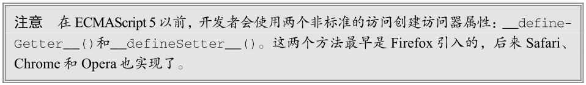

### 定义多个属性

在一个对象上同时定义多个属性的可能性是非常大的。为此，ECMAScript 提供了`Object.defineProperties()`方法。**这个方法可以通过多个描述符一次性定义多个属性**。它接收**两个参数**：要**为之添加或修改属性的对象和另一个描述符对象**，其属性与要添加或修改的属性一一对应。比如：

~~~javascript
let book = {};
Object.defineProperties(book, {
	year_: {
		value: 2017
	},
		edition: {
		value: 1
	},
    
	year: {
		get() {
			return this.year_;
		},
    	set(newValue) {
			if (newValue > 2017) {
				this.year_ = newValue;
				this.edition += newValue - 2017;
			}
		}
	}
});
~~~

这段代码在 book 对象上定义了两个数据属性 year_ 和 edition ，还有一个访问器属性 year 。最终的对象跟上一节示例中的一样。**唯一的区别是所有属性都是同时定义的**，并且**数据属性的`configurable `、` enumerable `和 `writable` 特性值都是 false** 。

### 读取属性的特性

使用`Object.getOwnPropertyDescriptor()`方法可以取得指定属性的属性描述符。这个方法接收**两个参数**：**属性所在的对象和要取得其描述符的属性名**。**返回值是一个对象**，对于访问器属性包含`configurable `、 `enumerable` 、 `get` 和` set` 属性，对于数据属性包含 `configurable `、` enumerable `、`writable `和` value` 属性。比如：

~~~javascript
let book = {};
Object.defineProperties(book, {
	year_: {
		value: 2017
	},
		edition: {
		value: 1
	},
    
	year: {
		get:function() {
			return this.year_;
		},
    	set:function(newValue) {
			if (newValue > 2017) {
				this.year_ = newValue;
				this.edition += newValue - 2017;
			}
		}
	}
});

let descriptor = Object.getOwnPropertyDescriptor(book, "year_");
console.log(descriptor.value); // 2017
console.log(descriptor.configurable); // false
console.log(typeof descriptor.get); // "undefined"

let descriptor = Object.getOwnPropertyDescriptor(book, "year");
console.log(descriptor.value); // undefined
console.log(descriptor.enumerable); // false
console.log(typeof descriptor.get); // "function"
~~~

对于数据属性 year_ ， value 等于原来的值， configurable 是 false ， get 是 undefined 。对于访问器属性 year ， value 是 undefined ， enumerable 是 false ， get 是一个指向获取函数的指针。

ECMAScript 2017 新增了`Object.getOwnPropertyDescriptors()`静态方法。这个方法实际上会在每个自有属性上调用`Object.getOwnPropertyDescriptor()`并在一个新对象中返回它们。对于前面的例子，使用这个静态方法会返回如下对象：

~~~javascript
let book = {};
Object.defineProperties(book, {
	year_: {
		value: 2017
	},
		edition: {
		value: 1
	},
    
	year: {
		get:function() {
			return this.year_;
		},
    	set:function(newValue) {
			if (newValue > 2017) {
				this.year_ = newValue;
				this.edition += newValue - 2017;
			}
		}
	}
});

console.log(Object.getOwnPropertyDescriptors(book));
// {
// 	  edition: {
// 		configurable: false,
// 		enumerable: false,
// 		value: 1,
// 		writable: false
// 	  },
//    year: {
// 		configurable: false,
// 		enumerable: false,
// 		get: f(),
// 		set: f(newValue),
// 	  },
// 	  year_: {
// 		configurable: false,
// 		enumerable: false,
// 		value: 2017,
// 		writable: false
// 	  }
// }
~~~

### 合并对象

[Object.assign()基本用法](https://juejin.im/post/6844903984675684366)

JavaScript 开发者经常觉得“合并”（merge）两个对象很有用。更具体地说，就是**把源对象所有的本地属性一起复制到目标对象上**。有时候这种操作也被称为“混入”（mixin），因为**目标对象通过混入源对象的属性得到了增强**。

ECMAScript 6 专门为合并对象提供了`Object.assign()`方法。这个方法接收一个目标对象和一个或多个源对象作为参数，然后将每个源对象中可枚举(`Object.propertyIsEnumerable() `返回 true)和自有(`Object.hasOwnProperty() `返回 true)属性复制到目标对象。以字符串和符号为键的属性会被复制。**对每个符合条件的属性，这个方法会使用源对象上的 [[Get]] 取得属性的值，然后使用目标对象上的 [[Set]] 设置属性的值**。

~~~javascript
let dest, src, result;
/**
* 简单复制
*/
dest = {};
src = { id: 'src' };

result = Object.assign(dest, src);

// Object.assign 修改目标对象
// 也会返回修改后的目标对象
console.log(dest === result); // true
console.log(dest !== src); // true
console.log(result); // { id: src }
console.log(dest); // { id: src }

/**
* 多个源对象
*/
dest = {};
result = Object.assign(dest, { a: 'foo' }, { b: 'bar' });
console.log(result); // { a: foo, b: bar }

/**
* 获取函数与设置函数
*/
dest = {
	set a(val) {
		console.log(`Invoked dest setter with param ${val}`);
	}
};
src = {
	get a() {
		console.log('Invoked src getter');
			return 'foo';
	}
};
Object.assign(dest, src);
// 调用 src 的获取方法
// 调用 dest 的设置方法并传入参数"foo"
// 因为这里的设置函数不执行赋值操作
// 所以实际上并没有把值转移过来
console.log(dest); // { set a(val) {...} }
~~~

Object.assign() 实际上对每个源对象执行的是**浅复制**。如果多个源对象都有相同的属性，则使用最后一个复制的值。此外，从源对象访问器属性取得的值，比如获取函数，会作为一个静态值赋给目标对象。换句话说，不能在两个对象间转移获取函数和设置函数。

~~~javascript
let dest, src, result;

/**
* 覆盖属性
*/
dest = { id: 'dest' };
result = Object.assign(dest, { id: 'src1', a: 'foo' }, { id: 'src2', b: 'bar' });

// Object.assign 会覆盖重复的属性
console.log(result); // { id: src2, a: foo, b: bar }

// 可以通过目标对象上的设置函数观察到覆盖的过程：
dest = {
	set id(x) {
		console.log(x);
	}
};

Object.assign(dest, { id: 'first' }, { id: 'second' }, { id: 'third' });
// first
// second
// third

/**
* 对象引用
*/
dest = {};
src = { a: {} };

Object.assign(dest, src);

// 浅复制意味着只会复制对象的引用
console.log(dest); // { a :{} }
console.log(dest.a === src.a); // true
~~~

### 对象标识及相等判定

在 ECMAScript 6 之前，有些特殊情况即使是 === 操作符也无能为力：

~~~javascript
// 这些是===符合预期的情况
console.log(true === 1); // false
console.log({} === {}); // false
console.log("2" === 2); // false

// 这些情况在不同 JavaScript 引擎中表现不同，但仍被认为相等
console.log(+0 === -0); // true
console.log(+0 === 0); // true
console.log(-0 === 0); // true

// 要确定 NaN 的相等性，必须使用极为讨厌的 isNaN()
console.log(NaN === NaN); // false
console.log(isNaN(NaN)); // true
~~~

为改善这类情况，ECMAScript 6 规范新增了 Object.is() ，这个方法与 `=== `很像，但同时也考虑到了上述边界情形。这个方法必须接收**两个参数**：

~~~javascript
console.log(Object.is(true, 1)); // false
console.log(Object.is({}, {})); // false
console.log(Object.is("2", 2)); // false

// 正确的 0、-0、+0 相等/不等判定
console.log(Object.is(+0, -0)); // false
console.log(Object.is(+0, 0)); // true
console.log(Object.is(-0, 0)); // false

// 正确的 NaN 相等判定
console.log(Object.is(NaN, NaN)); // true
~~~

要检查超过两个值，递归地利用相等性传递即可：

~~~javascript
function recursivelyCheckEqual(x, ...rest) {
	return Object.is(x, rest[0]) &&
		(rest.length < 2 || recursivelyCheckEqual(...rest));
}
~~~

### 增强的对象语法

ECMAScript 6 为定义和操作对象新增了很多极其有用的语法糖特性。这些特性都没有改变现有引擎的行为，但极大地提升了处理对象的方便程度。

本节介绍的所有对象语法同样适用于 ECMAScript 6 的类，本章后面会讨论。

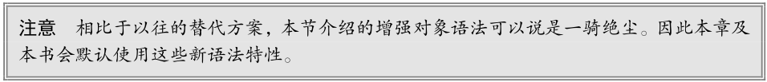

**1.属性值简写**

在给对象添加变量的时候，开发者经常会发现属性名和变量名是一样的。例如：

~~~javascript
let name = 'Matt';
let person = {
	name: name
    //第一个name是属性名
    //第二个name是属性值，只不过它不是一个确定的值，它是一个变量
    //name变量可以访问到外面的全局作用域name
};
console.log(person); // { name: 'Matt' }
~~~

为此，简写属性名语法出现了。简写属性名只要使用变量名（不用再写冒号）就会自动被解释为同名的属性键。如果没有找到同名变量，则会抛出 ReferenceError 。

以下代码和之前的代码是等价的：

~~~javascript
let name = 'Matt';
let person = {
	name
};
console.log(person); // { name: 'Matt' }
~~~

代码压缩程序会在不同作用域间保留属性名，以防止找不到引用。以下面的代码为例：

~~~javascript
function makePerson(name) {
	return {
		name
	};
}

let person = makePerson('Matt');
console.log(person.name); // Matt
~~~

在这里，即使参数标识符只限定于函数作用域，编译器也会保留初始的 name 标识符。如果使用Google Closure 编译器压缩，那么函数参数会被缩短，而属性名不变：

~~~javascript
function makePerson(a) {
	return {
		name: a
	};
}
var person = makePerson("Matt");
console.log(person.name); // Matt
~~~

**2.可计算属性**

在引入可计算属性之前，如果想使用变量的值作为属性，那么必须先声明对象，然后使用**中括号语法**来添加属性。换句话说，**不能在对象字面量中直接动态命名属性**。比如：

~~~javascript
const nameKey = 'name';
const ageKey = 'age';
const jobKey = 'job';

let person = {};
person[nameKey] = 'Matt';
person[ageKey] = 27;
person[jobKey] = 'Software engineer';

console.log(person); // { name: 'Matt', age: 27, job: 'Software engineer' }
~~~

> 怎么感觉有点看不懂呢？

有了可计算属性，就可以在对象字面量中完成动态属性赋值。中括号包围的对象属性键告诉运行时将其作为 JavaScript 表达式而不是字符串来求值：

~~~javascript
const nameKey = 'name';
const ageKey = 'age';
const jobKey = 'job';

let person = {
	[nameKey]: 'Matt',
	[ageKey]: 27,
	[jobKey]: 'Software engineer'
};

console.log(person); // { name: 'Matt', age: 27, job: 'Software engineer' }
~~~

因为被当作 JavaScript 表达式求值，所以可计算属性本身可以是复杂的表达式，在实例化时再求值：

~~~javascript
const nameKey = 'name';
const ageKey = 'age';
const jobKey = 'job';
let uniqueToken = 0;

function getUniqueKey(key) {
	return `${key}_${uniqueToken++}`;
}

let person = {
	[getUniqueKey(nameKey)]: 'Matt',
	[getUniqueKey(ageKey)]: 27,
	[getUniqueKey(jobKey)]: 'Software engineer'
};

console.log(person); // { name_0: 'Matt', age_1: 27, job_2: 'Software engineer' }
~~~

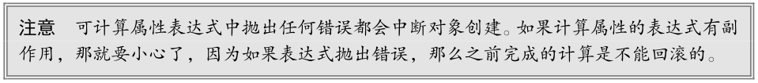

**3.简写方法名**

在给对象定义方法时，通常都要写一个方法名、冒号，然后再引用一个匿名函数表达式，如下所示：

~~~javascript
let person = {
	sayName: function(name) {
		console.log(`My name is ${name}`);
	}
};
person.sayName('Matt'); // My name is Matt
~~~

新的简写方法的语法遵循同样的模式，但开发者要放弃给函数表达式命名（不过给作为方法的函数命名通常没什么用）。相应地，这样也可以明显缩短方法声明。

以下代码和之前的代码在行为上是等价的：

~~~javascript
let person = {
	sayName(name) {
		console.log(`My name is ${name}`);
	}
};
person.sayName('Matt'); // My name is Matt
~~~

简写方法名对获取函数和设置函数也是适用的：

~~~javascript
let person = {
	name_: '',
	get name() {
		return this.name_;
	},
	set name(name) {
		this.name_ = name;
	},
	sayName() {
		console.log(`My name is ${this.name_}`);
	}
};
person.name = 'Matt';
person.sayName(); // My name is Matt
~~~

简写方法名与可计算属性键相互兼容：

~~~javascript
const methodKey = 'sayName';

let person = {
	[methodKey](name) {
	console.log(`My name is ${name}`);
	}
}
person.sayName('Matt'); // My name is Matt
~~~

### 对象解构

ECMAScript 6 新增了对象解构语法，**可以在一条语句中使用嵌套数据实现一个或多个赋值操作**。简单地说，**对象解构就是使用与对象匹配的结构来实现对象属性赋值**。

下面的例子展示了两段等价的代码，首先是不使用对象解构的：

~~~javascript
// 不使用对象解构
let person = {
	name: 'Matt',
	age: 27
};

let personName = person.name,
	personAge = person.age;

console.log(personName); // Matt
console.log(personAge); // 27
~~~

然后，是使用对象解构的：

~~~javascript
// 使用对象解构
let person = {
	name: 'Matt',
	age: 27
};

let { name: personName, age: personAge } = person;

console.log(personName); // Matt
console.log(personAge); // 27
~~~

使用解构，可以在一个类似对象字面量的结构中，声明多个变量，同时执行多个赋值操作。**如果想让变量直接使用属性的名称，那么可以使用简写语法**，比如：

~~~javascript
let person = {
	name: 'Matt',
	age: 27
};

let { name, age } = person;

console.log(name); // Matt
console.log(age); // 27
~~~

**解构赋值不一定与对象的属性匹配**。赋值的时候可以忽略某些属性，而如果引用的属性不存在，则该变量的值就是 undefined ：

~~~javascript
let person = {
	name: 'Matt',
	age: 27
};

let { name, job } = person;

console.log(name); // Matt
console.log(job); // undefined
~~~

也可以在解构赋值的同时定义默认值，这适用于前面刚提到的引用的属性不存在于源对象中的情况：

~~~javascript
let person = {
	name: 'Matt',
	age: 27
};

let { name, job='Software engineer' } = person;

console.log(name); // Matt
console.log(job); // Software engineer
~~~

解构在内部使用函数`ToObject()`（不能在运行时环境中直接访问）把源数据结构转换为对象。这意味着在对象解构的上下文中，原始值会被当成对象。这也意味着（根据`ToObject()`的定义）， **null和 undefined 不能被解构，否则会抛出错误**。

~~~javascript
let { length } = 'foobar';
console.log(length); // 6

let { constructor: c } = 4;
console.log(c === Number); // true

let { _ } = null; // TypeError
let { _ } = undefined; // TypeError
~~~

解构并不要求变量必须在解构表达式中声明。不过，如果是给事先声明的变量赋值，则赋值表达式必须包含在一对括号中：

~~~javascript
let personName, personAge;

let person = {
	name: 'Matt',
	age: 27
};

({name: personName, age: personAge} = person);

console.log(personName, personAge); // Matt, 27
~~~

**1.嵌套解构**

解构对于引用嵌套的属性或赋值目标没有限制。为此，可以通过解构来复制对象属性：

~~~javascript
let person = {
	name: 'Matt',
	age: 27,
	job: {
		title: 'Software engineer'
	}
};
	
let personCopy = {};
({
	name: personCopy.name,
	age: personCopy.age,
	job: personCopy.job
} = person);

// 因为一个对象的引用被赋值给 personCopy，所以修改
// person.job 对象的属性也会影响 personCopy
person.job.title = 'Hacker'

console.log(person);
// { name: 'Matt', age: 27, job: { title: 'Hacker' } }

console.log(personCopy);
// { name: 'Matt', age: 27, job: { title: 'Hacker' } }
~~~

解构赋值可以使用嵌套结构，以匹配嵌套的属性：

~~~javascript
let person = {
	name: 'Matt',
	age: 27,
	job: {
		title: 'Software engineer'
	}
};

// 声明 title 变量并将 person.job.title 的值赋给它
let { job: { title } } = person;

console.log(title); // Software engineer
~~~

在外层属性没有定义的情况下不能使用嵌套解构。无论源对象还是目标对象都一样：

~~~javascript
let person = {
	job: {
		title: 'Software engineer'
	}
};

let personCopy = {};

// foo 在源对象上是 undefined
({
	foo: {
		bar: personCopy.bar
	}
} = person);
// TypeError: Cannot destructure property 'bar' of 'undefined' or 'null'.

// job 在目标对象上是 undefined
({
	job: {
		title: personCopy.job.title
	}
} = person);
// TypeError: Cannot set property 'title' of undefined
~~~

**2.部分解构**

需要注意的是，涉及多个属性的解构赋值是一个输出无关的顺序化操作。如果一个解构表达式涉及多个赋值，开始的赋值成功而后面的赋值出错，则整个解构赋值只会完成一部分：

~~~javascript
let person = {
	name: 'Matt',
	age: 27
};

let personName, personBar, personAge;

try {
	// person.foo 是 undefined，因此会抛出错误
	({name: personName, foo: { bar: personBar }, age: personAge} = person);
} catch(e) {}

console.log(personName, personBar, personAge);
// Matt, undefined, undefined
~~~

**3.参数上下文匹配**

在函数参数列表中也可以进行解构赋值。对参数的解构赋值不会影响 arguments 对象，但可以在函数签名中声明在函数体内使用局部变量：

~~~javascript
let person = {
	name: 'Matt',
	age: 27
};

function printPerson(foo, {name, age}, bar) {
	console.log(arguments);
	console.log(name, age);
}

function printPerson2(foo, {name: personName, age: personAge}, bar) {
	console.log(arguments);
	console.log(personName, personAge);
}

printPerson('1st', person, '2nd');
// ['1st', { name: 'Matt', age: 27 }, '2nd']
// 'Matt', 27

printPerson2('1st', person, '2nd');
// ['1st', { name: 'Matt', age: 27 }, '2nd']
// 'Matt', 27
~~~

## 创建对象

虽然使用 Object 构造函数或对象字面量可以方便地创建对象，但这些方式也有明显不足：创建**具有同样接口**的多个对象需要**重复编写很多代码**。

### 概述

综观 ECMAScript 规范的历次发布，每个版本的特性似乎都出人意料。ECMAScript 5.1 并没有正式支持面向对象的结构，比如类或继承。但是，正如接下来几节会介绍的，巧妙地运用原型式继承可以成功地模拟同样的行为。

ECMAScript 6 开始正式支持类和继承。ES6 的类旨在完全涵盖之前规范设计的基于原型的继承模式。不过，无论从哪方面看，ES6 的类都仅仅是封装了 ES5.1 构造函数加原型继承的语法糖而已。

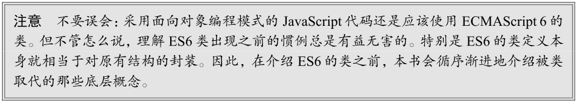

### 工厂模式

工厂模式是一种众所周知的设计模式，广泛应用于软件工程领域，用于抽象创建特定对象的过程。（本书后面还会讨论其他设计模式及其在 JavaScript 中的实现。）下面的例子展示了一种按照特定接口创建对象的方式：

~~~javascript
function createPerson(name, age, job) {
let o = new Object();
	o.name = name;
	o.age = age;
	o.job = job;
	o.sayName = function() {
		console.log(this.name);
};
	return o;
}

let person1 = createPerson("Nicholas", 29, "Software Engineer");
let person2 = createPerson("Greg", 27, "Doctor");
~~~

这里，函数`createPerson()`接收 3 个参数，根据这几个参数构建了一个包含 Person 信息的对象。可以用不同的参数多次调用这个函数，每次都会返回包含 3 个属性和 1 个方法的对象。**这种工厂模式虽然可以解决创建多个类似对象的问题，但没有解决对象标识问题（即新创建的对象是什么类型）**。

### 构造函数模式

前面几章提到过，**ECMAScript 中的构造函数是用于创建特定类型对象的**。像 Object 和 Array 这样的原生构造函数，运行时可以直接在执行环境中使用。当然也可以自定义构造函数，以函数的形式为自己的对象类型定义属性和方法。比如，前面的例子使用构造函数模式可以这样写：

~~~javascript
function Person(name, age, job){
	this.name = name;
	this.age = age;
	this.job = job;
	this.sayName = function() {
		console.log(this.name);
	};
}

let person1 = new Person("Nicholas", 29, "Software Engineer");
let person2 = new Person("Greg", 27, "Doctor");

person1.sayName(); // Nicholas
person2.sayName(); // Greg
~~~

在这个例子中， Person() 构造函数代替了`createPerson()`工厂函数。实际上， `Person()`内部的代码跟 `createPerson()`基本是一样的，只是有如下区别。

* 没有显式地创建对象。
* 属性和方法直接赋值给了 this 。
* 没有 return 。

另外，要注意函数名 Person 的首字母大写了。**按照惯例，构造函数名称的首字母都是要大写的，非构造函数则以小写字母开头**。这是从面向对象编程语言那里借鉴的，有助于在 ECMAScript 中**区分**构造函数和普通函数。毕竟 **ECMAScript 的构造函数就是能创建对象的函数**。要创建 Person 的实例，应**使用 new 操作符**。以这种方式调用构造函数会执行如下操作。

> 这个面试题常考的。

* 在内存中创建一个新对象。
* 这个新对象内部的 [[Prototype]] 特性被赋值为构造函数的 prototype 属性。
* 构造函数内部的 this 被赋值为这个新对象（即 this 指向新对象）。
* 执行构造函数内部的代码（给新对象添加属性）。
* 如果构造函数返回非空对象，则返回该对象；否则，返回刚创建的新对象。

上一个例子的最后， person1 和 person2 分别保存着 Person 的**不同实例**。**这两个对象都有一个constructor 属性指向 Person** ，如下所示：

~~~javascript
console.log(person1.constructor == Person); // true
console.log(person2.constructor == Person); // true
~~~

constructor 本来是用于标识对象类型的。不过，**一般认为` instanceof` 操作符是确定对象类型更可靠的方式**。前面例子中的每个对象都是 Object 的实例，同时也是 Person 的实例，如下面调用`instanceof `操作符的结果所示：

~~~javascript
console.log(person1 instanceof Object); // true
console.log(person1 instanceof Person); // true

console.log(person2 instanceof Object); // true
console.log(person2 instanceof Person); // true
~~~

定义自定义构造函数可以确保实例被标识为特定类型，相比于工厂模式，这是一个很大的好处。在这个例子中， person1 和 person2 之所以也被认为是 Object 的实例，是因为所有自定义对象都继承自 Object （后面再详细讨论这一点）。

**构造函数不一定要写成函数声明的形式**。**赋值给变量的函数表达式**也可以表示构造函数：

~~~javascript
let Person = function(name, age, job) {
	this.name = name;
	this.age = age;
	this.job = job;
	this.sayName = function() {
		console.log(this.name);
	};
}

let person1 = new Person("Nicholas", 29, "Software Engineer");
let person2 = new Person("Greg", 27, "Doctor");

person1.sayName(); // Nicholas
person2.sayName(); // Greg

console.log(person1 instanceof Object); // true
console.log(person1 instanceof Person); // true
console.log(person2 instanceof Object); // true
console.log(person2 instanceof Person); // true
~~~

在实例化时，如果**不想传参数**，那么**构造函数后面的括号可加可不加**。只要有 new 操作符，就可以调用相应的构造函数：

~~~javascript
function Person() {
	this.name = "Jake";
	this.sayName = function() {
		console.log(this.name);
	};
}

let person1 = new Person();
let person2 = new Person;

person1.sayName(); // Jake
person2.sayName(); // Jake

console.log(person1 instanceof Object); // true
console.log(person1 instanceof Person); // true
console.log(person2 instanceof Object); // true
console.log(person2 instanceof Person); // true
~~~

**1.构造函数也是函数**

构造函数与普通函数唯一的区别就是调用方式不同。除此之外，构造函数也是函数。并没有把某个函数定义为构造函数的特殊语法。**任何函数只要使用 new 操作符调用就是构造函数，而不使用 new 操作符调用的函数就是普通函数**。比如，前面的例子中定义的 Person() 可以像下面这样调用：

~~~javascript
// 作为构造函数
let person = new Person("Nicholas", 29, "Software Engineer");
person.sayName(); // "Nicholas"

// 作为函数调用
Person("Greg", 27, "Doctor"); // 添加到 window 对象
window.sayName(); // "Greg"

// 在另一个对象的作用域中调用
let o = new Object();
Person.call(o, "Kristen", 25, "Nurse");
o.sayName(); // "Kristen"
~~~

这个例子一开始展示了典型的构造函数调用方式，即使用 new 操作符创建一个新对象。然后是普通函数的调用方式，这时候没有使用 new 操作符调用`Person()`，结果会将属性和方法添加到 window 对象。这里要记住，在调用一个函数而没有明确设置 this 值的情况下（即没有作为对象的方法调用，或者没有使用 `call()` /` apply()` 调用）， this 始终指向 Global 对象（在浏览器中就是 window 对象）。因此在上面的调用之后， window 对象上就有了一个`sayName()`方法，调用它会返回 "Greg" 。最后展示的调用方式是通过 `call() `（或 `apply() `）调用函数，同时将特定对象指定为作用域。这里的调用将对象 o 指定为`Person()`内部的 this 值，因此执行完函数代码后，所有属性和`sayName()`方法都会添加到对象 o 上面。

**2.构造函数的问题**

构造函数虽然有用，但也不是没有问题。构造函数的主要问题在于，**其定义的方法会在每个实例上都创建一遍**。因此对前面的例子而言， person1 和 person2 都有名为 sayName() 的方法，但这两个方法不是同一个 Function 实例。我们知道，ECMAScript 中的函数是对象，因此每次定义函数时，都会初始化一个对象。逻辑上讲，这个构造函数实际上是这样的：

~~~javascript
function Person(name, age, job){
	this.name = name;
	this.age = age;
	this.job = job;
	this.sayName = new Function("console.log(this.name)"); //  逻辑等价
}
~~~

这样理解这个构造函数可以更清楚地知道，每个 Person 实例都会有自己的 Function 实例用于显示 name 属性。当然了，**以这种方式创建函数会带来不同的作用域链和标识符解析**。但创建新 Function实例的机制是一样的。因此不同实例上的函数虽然同名却不相等，如下所示：

~~~javascript
console.log(person1.sayName == person2.sayName); // false
~~~

**因为都是做一样的事，所以没必要定义两个不同的 Function 实例**。况且， **this 对象可以把函数与对象的绑定推迟到运行时**。要解决这个问题，**可以把函数定义转移到构造函数外部**：

~~~javascript
function Person(name, age, job){
	this.name = name;
	this.age = age;
	this.job = job;
	this.sayName = sayName;
}

function sayName() {
	console.log(this.name);
}

let person1 = new Person("Nicholas", 29, "Software Engineer");
let person2 = new Person("Greg", 27, "Doctor");

person1.sayName(); // Nicholas
person2.sayName(); // Greg
~~~

在这里， `sayName()`被定义在了构造函数外部。在构造函数内部， sayName属性等于全局`sayName()`函数。因为这一次sayName 属性中包含的只是一个指向外部函数的指针，所以 person1 和 person2共享了定义在全局作用域上的`sayName()`函数。**这样虽然解决了相同逻辑的函数重复定义的问题，但全局作用域也因此被搞乱了，因为那个函数实际上只能在一个对象上调用。如果这个对象需要多个方法，那么就要在全局作用域中定义多个函数。这会导致自定义类型引用的代码不能很好地聚集一起**。这个新问题可以通过原型模式来解决。

### 原型模式

**每个函数**都会创建一个 prototype 属性，**这个属性是一个对象**，**包含应该由特定引用类型的实例共享的属性和方法(都看不懂讲的是什么意思)**。实际上，**这个对象(即函数的prototype属性)就是通过调用构造函数创建的对象的原型**。

使用原型对象的好处是，**在它上面定义的属性和方法可以被对象实例共享**。原来在构造函数中直接赋给对象实例的值，可以直接赋值给它们的原型，如下所示：

> 属性也是一个对象感觉有点费解，看来我是对属性的理解太过狭隘了。
>
> 这一整段话都挺费解的，不好懂啊，我有机会找找英文版的看它是怎么说的吧。
>
> 我还要再把自己的《JavaScript高级》这篇博文再看一下啊，里面都讲过，当时懂了，现在又快忘了。
>
> 其实不止构造函数有prototype属性(这个属性也是对象)，普通函数也有，更进一步的说，对象也有prototype属性。(我按F12输入`console.log(Object.prototype)会有东西显示出来。`)

~~~javascript
function Person() {}

Person.prototype.name = "Nicholas";
Person.prototype.age = 29;
Person.prototype.job = "Software Engineer";
Person.prototype.sayName = function() {
	console.log(this.name);
};

let person1 = new Person();
person1.sayName(); // "Nicholas"

let person2 = new Person();
person2.sayName(); // "Nicholas"

console.log(person1.sayName == person2.sayName); // true
~~~

使用函数表达式也可以：

~~~javascript
let Person = function() {};

Person.prototype.name = "Nicholas";
Person.prototype.age = 29;
Person.prototype.job = "Software Engineer";
Person.prototype.sayName = function() {
	console.log(this.name);
};

let person1 = new Person();
person1.sayName(); // "Nicholas"

let person2 = new Person();
person2.sayName(); // "Nicholas"

console.log(person1.sayName == person2.sayName); // true
~~~

这里，所有属性和 sayName() 方法都直接添加到了 Person 的 prototype 属性上，构造函数体中什么也没有。但这样定义之后，调用构造函数创建的新对象仍然拥有相应的属性和方法。与构造函数模式不同，使用这种原型模式定义的属性和方法是由所有实例共享的。因此 person1 和 person2 访问的都是相同的属性和相同的 sayName() 函数。要理解这个过程，就必须理解 ECMAScript 中原型的本质。

**1.理解原型**

无论何时，只要创建一个函数，就会按照特定的规则为这个函数创建一个 prototype 属性（指向原型对象）。默认情况下，所有原型对象自动获得一个名为 constructor 的属性，指回与之关联的构造函数。对前面的例子而言， `Person.prototype.constructor `指向 Person 。然后，因构造函数而异，可能会给原型对象添加其他属性和方法。

在**自定义构造函数**时，**原型对象默认只会获得 constructor 属性，其他的所有方法都继承自Object** 。每次调用构造函数创建一个新实例，**这个实例的内部 [[Prototype]] 指针就会被赋值为构造函数的原型对象**。脚本中没有访问这个 [[Prototype]] 特性的标准方式，但 Firefox、Safari 和 Chrome会在每个对象上暴露 __proto__ 属性，通过这个属性可以访问对象的原型。在其他实现中，这个特性完全被隐藏了。关键在于理解这一点：实例与构造函数原型之间有直接的联系，但实例与构造函数之间没有。

这种关系不好可视化，但可以通过下面的代码来理解原型的行为：

~~~javascript
/**
* 构造函数可以是函数表达式
* 也可以是函数声明，因此以下两种形式都可以：
* function Person() {}
* let Person = function() {}
*/

function Person() {}
/**
* 声明之后，构造函数就有了一个
* 与之关联的原型对象：
*/

console.log(typeof Person.prototype);
console.log(Person.prototype);
// {
// constructor: f Person(),
// __proto__: Object
// }

/**
* 如前所述，构造函数有一个 prototype 属性
* 引用其原型对象，而这个原型对象也有一个
* constructor 属性，引用这个构造函数
* 换句话说，两者循环引用：
*/
console.log(Person.prototype.constructor === Person); // true

/**
* 正常的原型链都会终止于 Object 的原型对象
* Object原型的原型是 null
*/

console.log(Person.prototype.__proto__ === Object.prototype); // true
console.log(Person.prototype.__proto__.constructor === Object); // true
console.log(Person.prototype.__proto__.__proto__ === null); // true
console.log(Person.prototype.__proto__);
// {
// constructor: f Object(),
// toString: ...
// hasOwnProperty: ...
// isPrototypeOf: ...
// ...
// }

let person1 = new Person(),
	person2 = new Person();
/**
* 构造函数、原型对象和实例
* 是 3 个完全不同的对象：
*/
console.log(person1 !== Person); // true
console.log(person1 !== Person.prototype); // true
console.log(Person.prototype !== Person); // true

/**
* 实例通过__proto__链接到原型对象，
* 它实际上指向隐藏特性[[Prototype]]
*
* 构造函数通过 prototype 属性链接到原型对象
*
* 实例与构造函数没有直接联系，与原型对象有直接联系
*/
console.log(person1.__proto__ === Person.prototype); // true
conosle.log(person1.__proto__.constructor === Person); // true

/**
* 同一个构造函数创建的两个实例
* 共享同一个原型对象：
*/

console.log(person1.__proto__ === person2.__proto__); // true

/**
* instanceof 检查实例的原型链中
* 是否包含指定构造函数的原型：
*/
console.log(person1 instanceof Person); // true
console.log(person1 instanceof Object); // true
console.log(Person.prototype instanceof Object); // true
~~~

对于前面例子中的 Person 构造函数和 Person.prototype ，可以通过图 8-1 看出各个对象之间的关系。

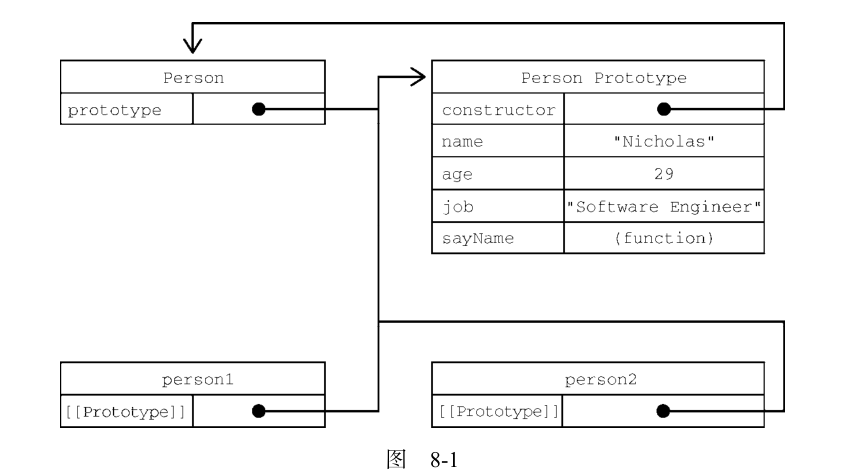

图 8-1 展示了 Person 构造函数、 Person 的原型对象和 Person 现有两个实例之间的关系。注意，
`Person.prototype`指向原型对象，而 `Person.prototype.contructor`指回 Person 构造函数。原型对象包含 constructor 属性和其他后来添加的属性。 Person 的两个实例 person1 和 person2 都只有一个内部属性指回 `Person.prototype`，而且两者都与构造函数没有直接联系。另外要注意，虽然这两个实例都没有属性和方法，但`person1.sayName()`可以正常调用。这是由于对象属性查找机制的原因。

[JavaScript 复习之 Object对象的相关方法](https://juejin.cn/post/6844903784708063246)

虽然不是所有实现都对外暴露了`[[Prototype]]`，但可以使用`isPrototypeOf()`方法确定两个对象之间的这种关系。本质上， `isPrototypeOf()`会在传入参数的`[[Prototype]]`指向调用它的对象时返回 true ，如下所示：

~~~javascript
console.log(Person.prototype.isPrototypeOf(person1)); // true
console.log(Person.prototype.isPrototypeOf(person2)); // true
~~~

这里通过原型对象调用`isPrototypeOf()`方法检查了person1 和 person2 。因为这两个例子内部都有链接指向 `Person.prototype`，所以结果都返回 true 。

ECMAScript 的 Object 类型有一个方法叫`Object.getPrototypeOf()`,返回参数的内部特性`[[Prototype]]`的值。例如：

~~~javascript
console.log(Object.getPrototypeOf(person1) == Person.prototype); // true
console.log(Object.getPrototypeOf(person1).name); // "Nicholas"
~~~

第一行代码简单确认了`Object.getPrototypeOf()`返回的对象就是传入对象的原型对象。第二行代码则取得了原型对象上 name 属性的值，即 "Nicholas" 。使用`Object.getPrototypeOf()`可以方便地取得一个对象的原型，而这在通过原型实现继承时显得尤为重要（本章后面会介绍）。

Object 类型还有一个`setPrototypeOf()`方法，可以向实例的私有特性`[[Prototype]]`写入一个新值。这样就可以重写一个对象的原型继承关系：

~~~javascript
let biped = {
	numLegs: 2
};
let person = {
	name: 'Matt'
};

Object.setPrototypeOf(person, biped);

console.log(person.name); // Matt
console.log(person.numLegs); // 2
console.log(Object.getPrototypeOf(person) === biped); // true
~~~

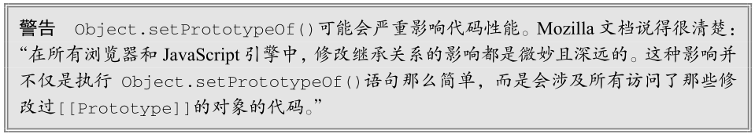

为避免使用`Object.setPrototypeOf()`可能造成的性能下降，可以通过`Object.create()`来创建一个新对象，同时为其指定原型：

~~~javascript
let biped = {
	numLegs: 2
};

let person = Object.create(biped);
person.name = 'Matt';

console.log(person.name); // Matt
console.log(person.numLegs); // 2
console.log(Object.getPrototypeOf(person) === biped); // true
~~~

**2.原型层级**

在通过对象访问属性时，会按照这个属性的名称开始搜索。搜索开始于对象实例本身。如果在这个实例上发现了给定的名称，则返回该名称对应的值。如果没有找到这个属性，则搜索会沿着指针进入原型对象，然后在原型对象上找到属性后，再返回对应的值。因此，在调用 person1.sayName() 时，会发生两步搜索。首先，JavaScript 引擎会问：“ person1 实例有 sayName 属性吗？”答案是没有。然后，继续搜索并问：“ person1 的原型有 sayName 属性吗？”答案是有。于是就返回了保存在原型上的这个函数。在调用`person2.sayName()`时，会发生同样的搜索过程，而且也会返回相同的结果。这就是原型用于在多个对象实例间共享属性和方法的原理。

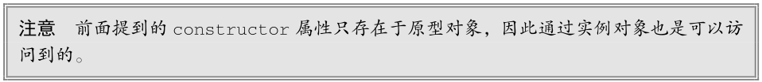

虽然可以通过实例读取原型对象上的值，但不可能通过实例重写这些值。如果在实例上添加了一个与原型对象中同名的属性，那就会在实例上创建这个属性，这个属性会遮住原型对象上的属性。下面看一个例子：

~~~javascript
function Person() {}

Person.prototype.name = "Nicholas";
Person.prototype.age = 29;
Person.prototype.job = "Software Engineer";
Person.prototype.sayName = function() {
	console.log(this.name);
};

let person1 = new Person();
let person2 = new Person();

person1.name = "Greg";
console.log(person1.name); // "Greg" ，来自实例
console.log(person2.name); // "Nicholas"
~~~

在这个例子中， person1 的 name 属性遮蔽了原型对象上的同名属性。虽然`person1.name 和person2.name 都返回了值，但前者返回的是 "Greg" （来自实例），后者返回的是 "Nicholas" （来自原型）。当 console.log() 访问 person1.name 时，会先在实例上搜索个属性。因为这个属性在实例上存在，所以就不会再搜索原型对象了。而在访问 person2.name 时，并没有在实例上找到这个属性，所以会继续搜索原型对象并使用定义在原型上的属性。

只要给对象实例添加一个属性，这个属性就会**遮蔽**（shadow）原型对象上的同名属性，也就是虽然不会修改它，但会屏蔽对它的访问。即使在实例上把这个属性设置为 null ，也不会恢复它和原型的联系。不过，使用 delete 操作符可以完全删除实例上的这个属性，从而让标识符解析过程能够继续搜索原型对象。

~~~javascript
function Person() {}

Person.prototype.name = "Nicholas";
Person.prototype.age = 29;
Person.prototype.job = "Software Engineer";
Person.prototype.sayName = function() {
	console.log(this.name);
};

let person1 = new Person();
let person2 = new Person();

person1.name = "Greg";
console.log(person1.name); // "Greg"，来自实例
console.log(person2.name); // "Nicholas"，来自原型

delete person1.name;
console.log(person1.name); // "Nicholas" ，来自原型
~~~

这个修改后的例子中使用 delete 删除了`person1.name`，这个属性之前以 "Greg" 遮蔽了原型上的同名属性。然后原型上 name 属性的联系就恢复了，因此再访问`person1.name`时，就会返回原型对象上这个属性的值。

**`hasOwnProperty()`方法用于确定某个属性是在实例上还是在原型对象上**。这个方法是继承自 Object的，会在属性存在于调用它的对象实例上时返回 true ，如下面的例子所示：

~~~javascript
function Person() {}

Person.prototype.name = "Nicholas";

Person.prototype.age = 29;
Person.prototype.job = "Software Engineer";
Person.prototype.sayName = function() {
	console.log(this.name);
};

let person1 = new Person();
let person2 = new Person();
console.log(person1.hasOwnProperty("name")); // false

person1.name = "Greg";
console.log(person1.name); // "Greg"，来自实例
console.log(person1.hasOwnProperty("name")); // true

console.log(person2.name); // "Nicholas"，来自原型
console.log(person2.hasOwnProperty("name")); // false

delete person1.name;
console.log(person1.name); // "Nicholas"，来自原型
console.log(person1.hasOwnProperty("name")); // false
~~~

在这个例子中，**通过调用`hasOwnProperty()`能够清楚地看到访问的是实例属性还是原型属性**。调用 `person1.hasOwnProperty("name")`只在重写 person1 上 name 属性的情况下才返回 true ，表明此时 name 是一个实例属性，不是原型属性。图 8-2 形象地展示了上面例子中各个步骤的状态。（为简单起见，图中省略了Person 构造函数。）

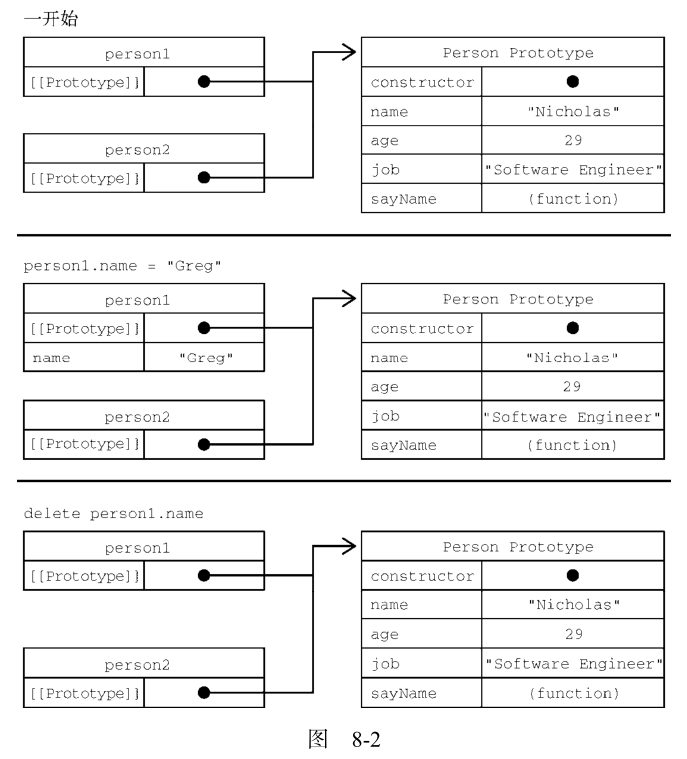

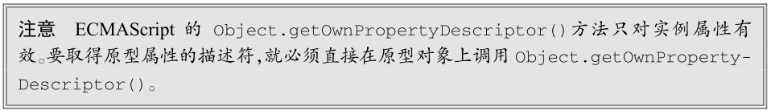

**3.原型和 in 操作符**

有两种方式使用 in 操作符：**单独使用**和**在 for-in 循环中使用**。在单独使用时， **in 操作符会在可以通过对象访问指定属性时返回 true ，无论该属性是在实例上还是在原型上**。来看下面的例子：

~~~javascript
function Person() {}
Person.prototype.name = "Nicholas";
Person.prototype.age = 29;
Person.prototype.job = "Software Engineer";
Person.prototype.sayName = function() {
	console.log(this.name);
};

let person1 = new Person();
let person2 = new Person();

console.log(person1.hasOwnProperty("name")); // false
console.log("name" in person1); // true

person1.name = "Greg";
console.log(person1.name); // "Greg"，来自实例
console.log(person1.hasOwnProperty("name")); // true
console.log("name" in person1); // true

console.log(person2.name); // "Nicholas"，来自原型
console.log(person2.hasOwnProperty("name")); // false
console.log("name" in person2); // true

delete person1.name;
console.log(person1.name); // "Nicholas"，来自原型
console.log(person1.hasOwnProperty("name")); // false
console.log("name" in person1); // true
~~~

在上面整个例子中， name 随时可以通过实例或通过原型访问到。因此，调用` "name" in persoon1`时始终返回 true ，无论这个属性是否在实例上。如果要确定某个属性是否存在于原型上，则可以像下面这样**同时使用** hasOwnProperty() 和 in 操作符：

~~~javascript
function hasPrototypeProperty(object, name){
	return !object.hasOwnProperty(name) && (name in object);
}
~~~

只要通过对象可以访问， in 操作符就返回 true ，而`hasOwnProperty()`只有属性存在于实例上时才返回 true 。因此，只要 in 操作符返回 true 且`hasOwnProperty()`返回 false ，就说明该属性是一个原型属性。来看下面的例子：

~~~javascript
function Person() {}

Person.prototype.name = "Nicholas";
Person.prototype.age = 29;
Person.prototype.job = "Software Engineer";

Person.prototype.sayName = function() {
	console.log(this.name);
};

let person = new Person();
console.log(hasPrototypeProperty(person, "name")); // true

person.name = "Greg";
console.log(hasPrototypeProperty(person, "name")); // false
~~~

在这里， name 属性首先只存在于原型上，所以`hasPrototypeProperty()`返回 true 。而在实例上重写这个属性后，实例上也有了这个属性，因此`hasPrototypeProperty()`返回 false 。即便此时原型对象还有 name 属性，但因为实例上的属性遮蔽了它，所以不会用到。

在`for-in`循环中使用 in 操作符时，可以通过对象访问且可以被枚举的属性都会返回，**包括实例属性和原型属性**。遮蔽原型中不可枚举（ [[Enumerable]] 特性被设置为 false ）属性的实例属性也会在 for-in 循环中返回，因为默认情况下开发者定义的属性都是可枚举的。

要获得对象上所有可枚举的实例属性，可以使用`Object.keys()`方法。这个方法接收一个对象作为参数，返回包含该对象所有可枚举属性名称的字符串数组。比如：

~~~javascript
function Person() {}

Person.prototype.name = "Nicholas";
Person.prototype.age = 29;
Person.prototype.job = "Software Engineer";
Person.prototype.sayName = function() {
	console.log(this.name);
};

let keys = Object.keys(Person.prototype);
console.log(keys); // "name,age,job,sayName"
let p1 = new Person();
p1.name = "Rob";
p1.age = 31;
let p1keys = Object.keys(p1);
console.log(p1keys); // "[name,age]"
~~~

这里， keys 变量保存的数组中包含 "name" 、 "age" 、 "job" 和 "sayName" 。这是正常情况下通过`for-in`返回的顺序。而在 Person 的实例上调用时， Object.keys() 返回的数组中只包含 "name" 和"age" 两个属性。

如果想列出所有实例属性，无论是否可以枚举，都可以使用`Object.getOwnPropertyNames()`：

~~~javascript
let keys = Object.getOwnPropertyNames(Person.prototype);
console.log(keys); // "[constructor,name,age,job,sayName]"
~~~

注意，返回的结果中包含了一个不可枚举的属性 constructor 。`Object.keys()`和`Object.getOwnPropertyNames() `在适当的时候都可用来代替 for-in 循环。

在 ECMAScript 6 新增符号类型之后，相应地出现了增加一个`Object.getOwnPropertyNames()`的兄弟方法的需求，因为以符号为键的属性没有名称的概念。因此，`Object.getOwnPropertySymbols()`方法就出现了，这个方法与`Object.getOwnPropertyNames()`类似，只是针对符号而已：

~~~javascript
let k1 = Symbol('k1'),
	k2 = Symbol('k2');

let o = {
	[k1]: 'k1',
	[k2]: 'k2'
};

console.log(Object.getOwnPropertySymbols(o));
// [Symbol(k1), Symbol(k2)]
~~~

**4.属性枚举顺序**

for-in 循环、`Object.keys()` 、 `Object.getOwnPropertyNames() `、 `Object.getOwnPropertySymbols()`以及`Object.assign()`在属性枚举顺序方面有很大区别。`for-in`循环和`Object.keys()`的枚举顺序是不确定的，取决于 JavaScript 引擎，可能因浏览器而异。

`Object.getOwnPropertyNames()` 、`Object.getOwnPropertySymbols()`和`Object.assign()`的枚举顺序是确定性的。先以升序枚举数值键，然后以插入顺序枚举字符串和符号键。在对象字面量中定义的键以它们逗号分隔的顺序插入。

~~~javascript
let k1 = Symbol('k1'),
	k2 = Symbol('k2');

let o = {
	1: 1,
	first: 'first',
	[k1]: 'sym2',
	second: 'second',
	0: 0
};

o[k2] = 'sym2';
o[3] = 3;
o.third = 'third';
o[2] = 2;

console.log(Object.getOwnPropertyNames(o));
// ["0", "1", "2", "3", "first", "second", "third"]

console.log(Object.getOwnPropertySymbols(o));
// [Symbol(k1), Symbol(k2)]
~~~

### 对象迭代

在 JavaScript 有史以来的大部分时间内，**迭代对象属性都是一个难题**。ECMAScript 2017 新增了两个静态方法，用于将对象内容转换为序列化的——更重要的是可迭代的——格式。这两个静态方法`Object.values() `和`Object.entries() `接收一个对象，返回它们内容的数组。 Object.values()返回对象值的数组， `Object.entries() `返回键/值对的数组。

下面的示例展示了这两个方法：

~~~javascript
const o = {
	foo: 'bar',
	baz: 1,
	qux: {}
};

console.log(Object.values(o));
// ["bar", 1, {}]

console.log(Object.entries((o)));
// [["foo", "bar"], ["baz", 1], ["qux", {}]]
~~~

注意，非字符串属性会被转换为字符串输出。另外，这两个方法执行对象的浅复制：

~~~javascript
const o = {
	qux: {}
};

console.log(Object.values(o)[0] === o.qux);
// true

console.log(Object.entries(o)[0][1] === o.qux);
// true
~~~

符号属性会被忽略：

~~~javascript
const sym = Symbol();
const o = {
	[sym]: 'foo'
};

console.log(Object.values(o));
// []

console.log(Object.entries((o)));
// []
~~~

**1.其他原型语法**

有读者可能注意到了，在前面的例子中，每次定义一个属性或方法都会把`Person.prototype`重写一遍。为了减少代码冗余，也为了从视觉上更好地封装原型功能，直接通过一个包含所有属性和方法的对象字面量来重写原型成为了一种常见的做法，如下面的例子所示：

~~~javascript
function Person() {}

Person.prototype = {
	name: "Nicholas",
	age: 29,
	job: "Software Engineer",
	sayName() {
		console.log(this.name);
	}
};
~~~

在这个例子中，`Person.prototype`被设置为等于一个通过对象字面量创建的新对象。最终结果是一样的，只有一个问题：这样重写之后，`Person.prototype`的constructor属性就不指向 Person了。在创建函数时，也会创建它的 prototype 对象，同时会自动给这个原型的 constructor 属性赋值。而上面的写法完全重写了默认的 prototype 对象，因此其 constructor 属性也指向了完全不同的新对象（ Object 构造函数），不再指向原来的构造函数。虽然 instanceof 操作符还能可靠地返回值，但我们不能再依靠 constructor 属性来识别类型了，如下面的例子所示：

~~~javascript
let friend = new Person();
console.log(friend instanceof Object); // true
console.log(friend instanceof Person); // true
~~~

这里， instanceof 仍然对 Object 和 Person 都返回 true 。但 constructor 属性现在等于 Object而不是 Person 了。如果 constructor 的值很重要，则可以像下面这样在重写原型对象时专门设置一下它的值：

~~~javascript
function Person() {
}

Person.prototype = {
	constructor: Person,
	name: "Nicholas",
	age: 29,
	job: "Software Engineer",
	sayName() {
		console.log(this.name);
	}
};
~~~

这次的代码中特意包含了 constructor 属性，并将它设置为 Person ，保证了这个属性仍然包含恰当的值。

但要注意，以这种方式恢复 constructor 属性会创建一个 [[Enumerable]] 为 true 的属性。而原生 constructor 属性默认是不可枚举的。因此，如果你使用的是兼容 ECMAScript 的 JavaScript 引擎，那可能会改为使用 `Object.defineProperty()`方法来定义 constructor 属性：

~~~javascript
function Person() {}

Person.prototype = {
	name: "Nicholas",
	age: 29,
	job: "Software Engineer",
	sayName() {
		console.log(this.name);
	}
};

//  恢复 constructor  属性
Object.defineProperty(Person.prototype, "constructor", {
	enumerable: false,
	value: Person
});
~~~

**2.原型的动态性**

# 第9章：代理与反射

> 现在是2020年12月09日，我现在才开始慢慢的了解到什么是`proxy`，通过看《深入浅出Vue.js》知道的：
>
> 关于变化侦测，首先要问一个问题，在JavaScript（简称JS）中，**如何侦测一个对象的变化**？
>
> 其实这个问题还是比较简单的。学过JavaScript的人都知道，有两种方法可以侦测到变化：使用`Object.defineProperty`和ES6的`Proxy`。

**ECMAScript 6 新增的代理和反射为开发者提供了拦截并向基本操作嵌入额外行为的能力**。具体地说，可以给目标对象定义一个关联的代理对象，而这个代理对象可以作为抽象的目标对象来使用。在对目标对象的各种操作影响目标对象之前，可以在代理对象中对这些操作加以控制。

对刚刚接触这个主题的开发者而言，代理是一个比较模糊的概念，而且还夹杂着很多新术语。其实只要看几个例子，就很容易理解了。

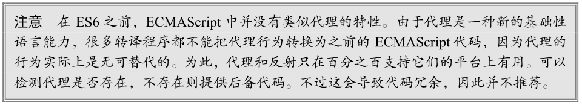

## 代理基础

正如本章开头所介绍的，代理是目标对象的抽象。从很多方面看，代理类似 C++指针，因为它可以用作目标对象的替身，但又完全独立于目标对象。目标对象既可以直接被操作，也可以通过代理来操作。但直接操作会绕过代理施予的行为。

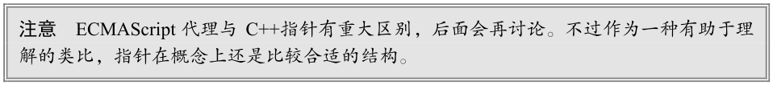

### 创建空代理

**最简单的代理是空代理，即除了作为一个抽象的目标对象，什么也不做**。默认情况下，在代理对象上执行的所有操作都会无障碍地传播到目标对象。因此，在任何可以使用目标对象的地方，都可以通过同样的方式来使用与之关联的代理对象。

代理是使用 Proxy 构造函数创建的。**这个构造函数接收两个参数：目标对象和处理程序对象**。缺少其中任何一个参数都会抛出 TypeError 。要创建空代理，可以传一个简单的对象字面量作为处理程序对象，从而让所有操作畅通无阻地抵达目标对象。

如下面的代码所示，在代理对象上执行的任何操作实际上都会应用到目标对象。唯一可感知的不同就是代码中操作的是代理对象。

~~~javascript
const target = {
	id: 'target'
};

const handler = {};

const proxy = new Proxy(target, handler);

// id 属性会访问同一个值
console.log(target.id); // target
console.log(proxy.id); // target

// 给目标属性赋值会反映在两个对象上
// 因为两个对象访问的是同一个值
target.id = 'foo';
console.log(target.id); // foo
console.log(proxy.id); // foo

// 给代理属性赋值会反映在两个对象上
// 因为这个赋值会转移到目标对象
proxy.id = 'bar';
console.log(target.id); // bar
console.log(proxy.id); // bar

// hasOwnProperty()方法在两个地方
// 都会应用到目标对象
console.log(target.hasOwnProperty('id')); // true
console.log(proxy.hasOwnProperty('id')); // true

// Proxy.prototype 是 undefined
// 因此不能使用 instanceof 操作符
console.log(target instanceof Proxy); // TypeError: Function has non-object prototype
'undefined' in instanceof check
console.log(proxy instanceof Proxy); // TypeError: Function has non-object prototype
'undefined' in instanceof check

// 严格相等可以用来区分代理和目标
console.log(target === proxy); // false
~~~

### 定义捕获器

使用代理的主要目的是可以定义捕获器（trap）。捕获器就是在处理程序对象中定义的“基本操作的拦截器”。每个处理程序对象可以包含零个或多个捕获器，每个捕获器都对应一种基本操作，可以直接或间接在代理对象上调用。每次在代理对象上调用这些基本操作时，代理可以在这些操作传播到目标对象之前先调用捕获器函数，从而拦截并修改相应的行为。

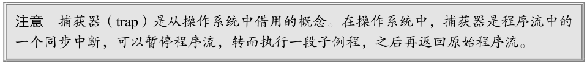

例如，可以定义一个`get()`捕获器，在 ECMAScript 操作以某种形式调用`get()`时触发。下面的例子定义了一个 `get()`捕获器：

~~~javascript
const target = {
	foo: 'bar'
};

const handler = {
	// 捕获器在处理程序对象中以方法名为键
	get() {
		return 'handler override';
	}
};

const proxy = new Proxy(target, handler);
~~~

这样，当通过代理对象执行 get() 操作时，就会触发定义的 get() 捕获器。当然， `get()`不是ECMAScript 对象可以调用的方法。这个操作在 JavaScript 代码中可以通过多种形式触发并被 get() 捕获器拦截到。

`proxy[property]` 、 `proxy.property` 或 `Object.create(proxy)[property]` 等操作都会触发基本的 get() 操作以获取属性。因此所有这些操作只要发生在代理对象上，就会触发`get()`捕获器。注意，只有在代理对象上执行这些操作才会触发捕获器。在目标对象上执行这些操作仍然会产生正常的行为。

~~~javascript
const target = {
	foo: 'bar'
};

const handler = {
	// 捕获器在处理程序对象中以方法名为键
	get() {
		return 'handler override';
	}
};

const proxy = new Proxy(target, handler);

console.log(target.foo); // bar
console.log(proxy.foo); // handler override

console.log(target['foo']); // bar
console.log(proxy['foo']); // handler override

console.log(Object.create(target)['foo']); // bar
console.log(Object.create(proxy)['foo']); // handler override
~~~

### 捕获器参数和反射 API

所有捕获器都可以访问相应的参数，基于这些参数可以重建被捕获方法的原始行为。比如， `get()`捕获器会接收到**目标对象**、**要查询的属性**和**代理对象**三个参数。

~~~javascript
const target = {
	foo: 'bar'
};

const handler = {
    get(trapTarget, property, receiver) {
		console.log(trapTarget === target);
		console.log(property);
		console.log(receiver === proxy);
	}
};

const proxy = new Proxy(target, handler);

proxy.foo;
// true
// foo
// true
~~~

有了这些参数，就可以重建被捕获方法的原始行为：

~~~javascript
const target = {
	foo: 'bar'
};

const handler = {
	get(trapTarget, property, receiver) {
		return trapTarget[property];
	}
};

const proxy = new Proxy(target, handler);

console.log(proxy.foo); // bar
console.log(target.foo); // bar
~~~

所有捕获器都可以基于自己的参数重建原始操作，但并非所有捕获器行为都像 get() 那么简单。因此，通过手动写码如法炮制的想法是不现实的。实际上，开发者并不需要手动重建原始行为，而是可以通过调用全局 Reflect 对象上（封装了原始行为）的同名方法来轻松重建。

处理程序对象中所有可以捕获的方法都有对应的反射（Reflect）API 方法。这些方法与捕获器拦截的方法具有相同的名称和函数签名，而且也具有与被拦截方法相同的行为。因此，使用反射 API 也可以像下面这样定义出空代理对象：

~~~javascript
const target = {
	foo: 'bar'
};

const handler = {
	get() {
		return Reflect.get(...arguments);
	}
};

const proxy = new Proxy(target, handler);

console.log(proxy.foo); // bar
console.log(target.foo); // bar
~~~

甚至还可以写得更简洁一些：

~~~javascript
const target = {
	foo: 'bar'
};

const handler = {
	get: Reflect.get
};

const proxy = new Proxy(target, handler);
console.log(proxy.foo); // bar
console.log(target.foo); // bar
~~~

> 现在就看不懂这些代码了。

事实上，如果真想创建一个可以捕获所有方法，然后将每个方法转发给对应反射 API 的空代理，那么甚至不需要定义处理程序对象：

~~~javascript
const target = {
	foo: 'bar'
};

const proxy = new Proxy(target, Reflect);

console.log(proxy.foo); // bar
console.log(target.foo); // bar
~~~

反射 API 为开发者准备好了样板代码，在此基础上开发者可以用最少的代码修改捕获的方法。比如，下面的代码在某个属性被访问时，会对返回的值进行一番修饰：

~~~javascript
const target = {
	foo: 'bar',
	baz: 'qux'
};

const handler = {
	get(trapTarget, property, receiver) {
		let decoration = '';
		if (property === 'foo') {
			decoration = '!!!';
		}
		return Reflect.get(...arguments) + decoration;
	}
};
const proxy = new Proxy(target, handler);
console.log(proxy.foo); // bar!!!
console.log(target.foo); // bar
console.log(proxy.baz); // qux
console.log(target.baz); // qux
~~~

> 看不懂了。

# 第10章：函数

函数是ECMAScript中最有意思的部分之一，这主要是因为**函数实际上是对象**。每个函数都是 Function类型的实例，而 Function 也有属性和方法，跟其他引用类型一样。因为函数是对象，所以**函数名(变量)就是指向函数对象的指针**，而且**不一定与函数本身紧密绑定**。函数通常以函数声明的方式定义，比如：

~~~javascript
function sum (num1, num2) {
	return num1 + num2;
}
~~~

注意函数定义最后没有加分号。

**另一种**定义函数的语法是函数表达式。函数表达式与函数声明几乎是等价的：

~~~javascript
let sum = function(num1, num2) {
	return num1 + num2;
};
~~~

这里，代码定义了一个变量 sum 并将其初始化为一个函数。**注意 function 关键字后面没有名称，因为不需要**。这个函数可以通过变量 sum 来引用。

注意**这里的函数末尾是有分号的，与任何变量初始化语句一样**。

**还有一种**定义函数的方式与函数表达式很像，叫作“**箭头函数**”（arrow function），如下所示：

~~~javascript
let sum = (num1, num2) => {
	return num1 + num2;
};
~~~

**最后一种**定义函数的方式是使用 Function 构造函数。这个构造函数接收任意多个字符串参数，最后一个参数始终会被当成函数体，而之前的参数都是新函数的参数。来看下面的例子：

~~~javascript
let sum = new Function("num1", "num2", "return num1 + num2"); // 不推荐
~~~

我们不推荐使用这种语法来定义函数，因为**这段代码会被解释两次**：第一次是将它当作常规ECMAScript 代码，第二次是解释传给构造函数的字符串。这显然会影响性能。不过，把函数想象为对象，把函数名想象为指针是很重要的。而上面这种语法很好地诠释了这些概念。

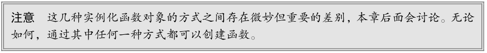

## 箭头函数

ECMAScript 6 新增了**使用胖箭头（ => ）语法定义函数表达式的能力**。很大程度上，箭头函数实例化的函数对象与正式的函数表达式创建的函数对象行为是相同的。任何可以使用函数表达式的地方，都可以使用箭头函数：

~~~javascript
let arrowSum = (a, b) => {
	return a + b;
};

let functionExpressionSum = function(a, b) {
	return a + b;
};

console.log(arrowSum(5, 8)); // 13
console.log(functionExpressionSum(5, 8)); // 13
~~~

箭头函数简洁的语法非常适合嵌入函数的场景：

~~~javascript
let ints = [1, 2, 3];
console.log(ints.map(function(i) { return i + 1; })); // [2, 3, 4]
console.log(ints.map((i) => { return i + 1 })); // [2, 3, 4]
~~~

如果只有一个参数，那也可以不用括号。只有没有参数，或者多个参数的情况下，才需要使用括号：

~~~javascript
// 以下两种写法都有效
let double = (x) => { return 2 * x; };
let triple = x => { return 3 * x; };

// 没有参数需要括号
let getRandom = () => { return Math.random(); };

// 多个参数需要括号
let sum = (a, b) => { return a + b; };

// 无效的写法：
let multiply = a, b => { return a * b; };
~~~

箭头函数也可以不用大括号，但这样会改变函数的行为。使用大括号就说明包含“函数体”，可以在一个函数中包含多条语句，跟常规的函数一样。如果不使用大括号，那么箭头后面就只能有一行代码，比如一个赋值操作，或者一个表达式。而且，省略大括号会隐式返回这行代码的值：

~~~javascript
// 以下两种写法都有效，而且返回相应的值
let double = (x) => { return 2 * x; };
let triple = (x) => 3 * x;

// 可以赋值
let value = {};
let setName = (x) => x.name = "Matt";
setName(value);
console.log(value.name); // "Matt"

// 无效的写法：省略了大括号就不用写return了
let multiply = (a, b) => return a * b;
~~~

箭头函数虽然语法简洁，但**也有很多场合不适用**。箭头函数不能使用 arguments 、 super 和`new.target`，也不能用作构造函数。此外，**箭头函数也没有 prototype 属性**。

## 函数名

因为**函数名就是指向函数的指针**，所以它们跟其他包含对象指针的变量具有相同的行为。这意味着一个函数可以有多个名称，如下所示：

~~~javascript
function sum(num1, num2) {
	return num1 + num2;
}

console.log(sum(10, 10)); // 20

let anotherSum = sum;
console.log(anotherSum(10, 10)); // 20

sum = null;
console.log(anotherSum(10, 10)); // 20
~~~

以上代码定义了一个名为`sum()`的函数，用于求两个数之和。然后又声明了一个变量 anotherSum，并将它的值设置为等于 sum 。注意，**使用不带括号的函数名会访问函数指针，而不会执行函数**。此时，anotherSum 和 sum 都指向同一个函数。调用 anotherSum() 也可以返回结果。把 sum 设置为 null之后，就切断了它与函数之间的关联。而 anotherSum() 还是可以照常调用，没有问题。

ECMAScript 6 的**所有函数对象都会暴露一个只读的 name 属性**，其中包含关于函数的信息。多数情况下，这个属性中保存的就是一个函数标识符，或者说是一个字符串化的变量名。即使函数没有名称，也会如实显示成空字符串。**如果它是使用 Function 构造函数创建的，则会标识成 "anonymous"** ：

~~~javascript
function foo() {}
let bar = function() {};
let baz = () => {};

console.log(foo.name); // foo
console.log(bar.name); // bar
console.log(baz.name); // baz
console.log((() => {}).name); //（空字符串）
console.log((new Function()).name); // anonymous
~~~

如果函数是一个获取函数、设置函数，或者使用`bind()`实例化，那么标识符前面会加上一个前缀：

~~~javascript
function foo() {}

console.log(foo.bind(null).name); // bound foo

let dog = {
	years: 1,
	get age() {
		return this.years;
},
	set age(newAge) {
		this.years = newAge;
	}
}

let propertyDescriptor = Object.getOwnPropertyDescriptor(dog, 'age');
console.log(propertyDescriptor.get.name); // get age
console.log(propertyDescriptor.set.name); // set age
~~~

> 这段代码不熟，不想再看了。

## 理解参数

ECMAScript 函数的参数跟大多数其他语言不同。ECMAScript 函数既不关心传入的参数个数，也不关心这些参数的数据类型。定义函数时要接收两个参数，并不意味着调用时就传两个参数。你可以传一个、三个，甚至一个也不传，解释器都不会报错。

之所以会这样，主要是因为 **ECMAScript 函数的参数在内部表现为一个数组**。函数被调用时总会接收一个数组，但函数并不关心这个数组中包含什么。如果数组中什么也没有，那没问题；如果数组的元素超出了要求，那也没问题。事实上，在使用 function 关键字定义（非箭头）函数时，可以在函数内部访问 arguments 对象，从中取得传进来的每个参数值。

arguments 对象是一个类数组对象（但不是 Array 的实例），因此可以使用中括号语法访问其中的元素（第一个参数是`arguments[0]`，第二个参数是`arguments[1]`）。而要确定传进来多少个参数，可以访问`arguments.length`属性。

在下面的例子中，`sayHi()`函数的第一个参数叫 name ：

~~~javascript
function sayHi(name, message) {
	console.log("Hello " + name + ", " + message);
}
~~~

可以通过`arguments[0]` 取得相同的参数值。因此，把函数重写成不声明参数也可以：

~~~javascript
function sayHi() {
	console.log("Hello " + arguments[0] + ", " + arguments[1]);
}
~~~

**在重写后的代码中，没有命名参数。 name 和 message 参数都不见了，但函数照样可以调用**。这就表明，ECMAScript **函数的参数只是为了方便才写出来的，并不是必须写出来的**。与其他语言不同，在ECMAScript 中的命名参数不会创建让之后的调用必须匹配的函数签名。这是因为根本不存在验证命名参数的机制。

也可以通过 arguments 对象的 length 属性检查传入的参数个数。下面的例子展示了在每调用一个函数时，都会打印出传入的参数个数：

~~~javascript
function howManyArgs() {
	console.log(arguments.length);
}

howManyArgs("string", 45); // 2
howManyArgs(); // 0
howManyArgs(12); // 1
~~~

这个例子分别打印出 2、0 和 1（按顺序）。既然如此，那么开发者可以想传多少参数就传多少参数。比如：

~~~javascript
function doAdd() {
	if (arguments.length === 1) {
		console.log(arguments[0] + 10);
	} else if (arguments.length === 2) {
		console.log(arguments[0] + arguments[1]);
	}
}

doAdd(10); // 20
doAdd(30, 20); // 50
~~~

> 这个很好懂。

这个函数 doAdd() 在只传一个参数时会加 10，在传两个参数时会将它们相加，然后返回。因此`doAdd(10) `返回 20，而`doAdd(30,20)`返回 50。虽然不像真正的函数重载那么明确，但这已经足以弥补 ECMAScript 在这方面的缺失了。

还有一个必须理解的重要方面，那就是 arguments 对象可以跟命名参数一起使用，比如：

~~~javascript
function doAdd(num1, num2) {
	if (arguments.length === 1) {
		console.log(num1 + 10);
	} else if (arguments.length === 2) {
		console.log(arguments[0] + num2);
	}
}
~~~

在这个 doAdd() 函数中，同时使用了两个命名参数和 arguments 对象。命名参数 num1 保存着与`arugments[0] `一样的值，因此使用谁都无所谓。（同样， num2 也保存着跟 arguments[1] 一样的值。）arguments 对象的另一个有意思的地方就是，它的值始终会与对应的命名参数同步。来看下面的例子：

~~~javascript
function doAdd(num1, num2) {
	arguments[1] = 10;
	console.log(arguments[0] + num2);
}
~~~

这个`doAdd()`函数把第二个参数的值重写为 10。因为 arguments 对象的值会自动同步到对应的命名参数，所以修改 arguments[1] 也会修改 num2 的值，因此两者的值都是 10。但这并不意味着它们都访问同一个内存地址，它们在内存中还是分开的，只不过会保持同步而已。另外还要记住一点：如果只传了一个参数，然后把 `arguments[1]`设置为某个值，那么这个值并不会反映到第二个命名参数。这是因为 arguments 对象的长度是根据传入的参数个数，而非定义函数时给出的命名参数个数确定的。

对于命名参数而言，如果调用函数时没有传这个参数，那么它的值就是 undefined 。这就类似于定义了变量而没有初始化。比如，如果只给`doAdd()`传了一个参数，那么 num2 的值就是undefined 。

**严格模式下**， arguments 会有一些变化。首先，像前面那样给 arguments[1] 赋值不会再影响 num2的值。就算把`arguments[1]`设置为 10， num2 的值仍然还是传入的值。其次，在函数中尝试重写arguments 对象会导致语法错误。（代码也不会执行。）

### 箭头函数中的参数

如果函数是使用箭头语法定义的，那么传给函数的参数将不能使用 arguments 关键字访问，而只能通过定义的命名参数访问。

~~~javascript
function foo() {
	console.log(arguments[0]);
}

foo(5); // 5

let bar = () => {
	console.log(arguments[0]);
};

bar(5); // ReferenceError: arguments is not defined
~~~

虽然箭头函数中没有 arguments 对象，但可以在包装函数中把它提供给箭头函数：

~~~javascript
function foo() {
	let bar = () => {
		console.log(arguments[0]); // 5
	};
	bar();
}

foo(5);
~~~

> 看不懂了。

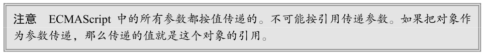

## 没有重载

ECMAScript 函数不能像传统编程那样重载。在其他语言比如 Java 中，一个函数可以有两个定义，只要签名（接收参数的类型和数量）不同就行。如前所述，ECMAScript 函数没有签名，因为参数是由包含零个或多个值的数组表示的。没有函数签名，自然也就没有重载。

如果在 ECMAScript 中定义了两个同名函数，则后定义的会覆盖先定义的。来看下面的例子：

~~~javascript
function addSomeNumber(num) {
	return num + 100;
}

function addSomeNumber(num) {
	return num + 200;
}

let result = addSomeNumber(100); // 300
~~~

这里，函数`addSomeNumber()`被定义了两次。第一个版本给参数加 100，第二个版本加 200。最后一行调用这个函数时，返回了 300，因为第二个定义覆盖了第一个定义。

前面也提到过，可以通过检查参数的类型和数量，然后分别执行不同的逻辑来模拟函数重载。

**把函数名当成指针**也有助于理解为什么 ECMAScript 没有函数重载。在前面的例子中，定义两个同名的函数显然会导致后定义的重写先定义的。而那个例子几乎跟下面这个是一样的：

~~~javascript
let addSomeNumber = function(num) {
	return num + 100;
};

addSomeNumber = function(num) {
	return num + 200;
};

let result = addSomeNumber(100); // 300
~~~

看这段代码应该更容易理解发生了什么。在创建第二个函数时，变量`addSomeNumber`被重写成保存第二个函数对象了。

## 默认参数值

在 ECMAScript5.1 及以前，实现默认参数的一种常用方式就是检测某个参数是否等于 undefined ，如果是则意味着没有传这个参数，那就给它赋一个值：

~~~javascript
function makeKing(name) {
	name = (typeof name !== 'undefined') ? name : 'Henry';
	return `King ${name} VIII`;
}

console.log(makeKing()); // 'King Henry VIII'
console.log(makeKing('Louis')); // 'King Louis VIII'
~~~

ECMAScript 6 之后就不用这么麻烦了，因为它支持显式定义默认参数了。下面就是与前面代码等价的 ES6 写法，只要在函数定义中的参数后面用 = 就可以为参数赋一个默认值：

~~~javascript
function makeKing(name = 'Henry') {
	return `King ${name} VIII`;
}

console.log(makeKing('Louis')); // 'King Louis VIII'
console.log(makeKing()); // 'King Henry VIII'
~~~

给参数传 undefined 相当于没有传值，不过这样可以利用多个独立的默认值：

~~~javascript
function makeKing(name = 'Henry', numerals = 'VIII') {
	return `King ${name} ${numerals}`;
}
console.log(makeKing()); // 'King Henry VIII'
console.log(makeKing('Louis')); // 'King Louis VIII'
console.log(makeKing(undefined, 'VI')); // 'King Henry VI'
~~~

在使用默认参数时， arguments 对象的值不反映参数的默认值，只反映传给函数的参数。当然，跟 ES5 严格模式一样，修改命名参数也不会影响 arguments 对象，它始终以调用函数时传入的值为准：

~~~javascript
function makeKing(name = 'Henry') {
	name = 'Louis';
	return `King ${arguments[0]}`;
}

console.log(makeKing()); // 'King undefined'
console.log(makeKing('Louis')); // 'King Louis'
~~~

默认参数值并不限于原始值或对象类型，也可以使用调用函数返回的值：

~~~javascript
let romanNumerals = ['I', 'II', 'III', 'IV', 'V', 'VI'];
let ordinality = 0;

function getNumerals() {
	// 每次调用后递增
	return romanNumerals[ordinality++];
}

function makeKing(name = 'Henry', numerals = getNumerals()) {
	return `King ${name} ${numerals}`;
}

console.log(makeKing()); // 'King Henry I'
console.log(makeKing('Louis', 'XVI')); // 'King Louis XVI'
console.log(makeKing()); // 'King Henry II'
console.log(makeKing()); // 'King Henry III'
~~~

函数的默认参数只有在函数被调用时才会求值，不会在函数定义时求值。而且，计算默认值的函数只有在调用函数但未传相应参数时才会被调用。

箭头函数同样也可以这样使用默认参数，只不过在只有一个参数时，就必须使用括号而不能省略了：

~~~javascript
let makeKing = (name = 'Henry') => `King ${name}`;
console.log(makeKing()); // King Henry
~~~

### 默认参数作用域与暂时性死区

因为在求值默认参数时可以定义对象，也可以动态调用函数，所以函数参数肯定是在某个作用域中求值的。

给多个参数定义默认值实际上跟使用 let 关键字顺序声明变量一样。来看下面的例子：

~~~javascript
function makeKing(name = 'Henry', numerals = 'VIII') {
	return `King ${name} ${numerals}`;
}
console.log(makeKing()); // King Henry VIII
~~~

这里的默认参数会按照定义它们的顺序依次被初始化。可以依照如下示例想象一下这个过程：

~~~javascript
function makeKing() {
	let name = 'Henry';
	let numerals = 'VIII';
    
	return `King ${name} ${numerals}`;
}
~~~

因为参数是按顺序初始化的，所以**后定义默认值的参数可以引用先定义的参数**。看下面这个例子：

~~~javascript
function makeKing(name = 'Henry', numerals = name) {
	return `King ${name} ${numerals}`;
}
console.log(makeKing()); // King Henry Henry
~~~

参数初始化顺序遵循“暂时性死区”规则，即前面定义的参数不能引用后面定义的。像这样就会抛出错误：

~~~javascript
// 调用时不传第一个参数会报错
function makeKing(name = numerals, numerals = 'VIII') {
	return `King ${name} ${numerals}`;
}
~~~

参数也存在于自己的作用域中，它们不能引用函数体的作用域：

~~~javascript
// 调用时不传第二个参数会报错
function makeKing(name = 'Henry', numerals = defaultNumeral) {
	let defaultNumeral = 'VIII';
	return `King ${name} ${numerals}`;
}
~~~

## 参数扩展与收集

ECMAScript 6 新增了扩展操作符，使用它可以非常简洁地操作和组合集合数据。扩展操作符最有用的场景就是函数定义中的参数列表，在这里它可以充分利用这门语言的弱类型及参数长度可变的特点。扩展操作符既可以用于调用函数时传参，也可以用于定义函数参数。

### 扩展参数

在给函数传参时，有时候可能不需要传一个数组，而是要分别传入数组的元素。

假设有如下函数定义，它会将所有传入的参数累加起来：

~~~javascript
let values = [1, 2, 3, 4];

function getSum() {
	let sum = 0;
	for (let i = 0; i < arguments.length; ++i) {
		sum += arguments[i];
	}
	return sum;
}
~~~

在给函数传参时，有时候可能不需要传一个数组，而是要分别传入数组的元素。

假设有如下函数定义，它会将所有传入的参数累加起来：

~~~javascript
let values = [1, 2, 3, 4];

function getSum() {
	let sum = 0;
	for (let i = 0; i < arguments.length; ++i) {
		sum += arguments[i];
	}
	return sum;
}
~~~

这个函数希望将所有加数逐个传进来，然后通过迭代 arguments 对象来实现累加。如果不使用扩展操作符，想把定义在这个函数这面的数组拆分，那么就得求助于`apply()`方法：

[JavaScript 函数 Apply](https://www.w3school.com.cn/js/js_function_apply.asp)

~~~javascript
console.log(getSum.apply(null, values)); // 10
~~~

但在 ECMAScript 6 中，可以通过扩展操作符极为简洁地实现这种操作。对可迭代对象应用扩展操作符，并将其作为一个参数传入，可以将可迭代对象拆分，并将迭代返回的每个值单独传入。

比如，使用扩展操作符可以将前面例子中的数组像这样直接传给函数：

~~~javascript
console.log(getSum(...values)); // 10
~~~

因为数组的长度已知，所以在使用扩展操作符传参的时候，并不妨碍在其前面或后面再传其他的值，包括使用扩展操作符传其他参数：

~~~javascript
console.log(getSum(-1, ...values)); // 9
console.log(getSum(...values, 5)); // 15
console.log(getSum(-1, ...values, 5)); // 14
console.log(getSum(...values, ...[5,6,7])); // 28
~~~

对函数中的 arguments 对象而言，它并不知道扩展操作符的存在，而是按照调用函数时传入的参数接收每一个值：

~~~javascript
let values = [1,2,3,4]

function countArguments() {
	console.log(arguments.length);
}

countArguments(-1, ...values); // 5
countArguments(...values, 5); // 5
countArguments(-1, ...values, 5); // 6
countArguments(...values, ...[5,6,7]); // 7
~~~

arguments 对象只是消费扩展操作符的一种方式。在普通函数和箭头函数中，也可以将扩展操作符用于命名参数，当然同时也可以使用默认参数：

~~~javascript
function getProduct(a, b, c = 1) {
	return a * b * c;
}

let getSum = (a, b, c = 0) => {
	return a + b + c;
}

console.log(getProduct(...[1,2])); // 2
console.log(getProduct(...[1,2,3])); // 6
console.log(getProduct(...[1,2,3,4])); // 6

console.log(getSum(...[0,1])); // 1
console.log(getSum(...[0,1,2])); // 3
console.log(getSum(...[0,1,2,3])); // 3
~~~

### 收集参数

在构思函数定义时，可以使用扩展操作符把不同长度的独立参数组合为一个数组。这有点类似arguments 对象的构造机制，只不过收集参数的结果会得到一个 Array 实例。

~~~javascript
function getSum(...values) {
	// 顺序累加 values 中的所有值
	// 初始值的总和为 0
	return values.reduce((x, y) => x + y, 0);
}

console.log(getSum(1,2,3)); // 6
~~~

收集参数的前面如果还有命名参数，则只会收集其余的参数；如果没有则会得到空数组。因为收集参数的结果可变，所以只能把它作为最后一个参数：

~~~javascript
收集参数的前面如果还有命名参数，则只会收集其余的参数；如果没有则会得到空数组。因为收集
参数的结果可变，所以只能把它作为最后一个参数：
// 不可以
function getProduct(...values, lastValue) {}

// 可以
function ignoreFirst(firstValue, ...values) {
	console.log(values);
}

ignoreFirst(); // []
ignoreFirst(1); // []
ignoreFirst(1,2); // [2]
ignoreFirst(1,2,3); // [2, 3]
~~~

**箭头函数虽然不支持 arguments 对象**，但支持收集参数的定义方式，因此也可以实现与使用arguments 一样的逻辑：

~~~javascript
let getSum = (...values) => {
	return values.reduce((x, y) => x + y, 0);
}
console.log(getSum(1,2,3)); // 6
~~~

另外，使用收集参数并不影响 arguments 对象，它仍然反映调用时传给函数的参数：

~~~javascript
function getSum(...values) {
	console.log(arguments.length); // 3
	console.log(arguments); // [1, 2, 3]
	console.log(values); // [1, 2, 3]
}

console.log(getSum(1,2,3));
~~~

## 函数声明与函数表达式

本章到现在一直没有把函数声明和函数表达式区分得很清楚。事实上，JavaScript 引擎在加载数据时对它们是区别对待的。JavaScript 引擎在任何代码执行之前，会先读取函数声明，并在执行上下文中生成函数定义。而函数表达式必须等到代码执行到它那一行，才会在执行上下文中生成函数定义。来看下面的例子：

~~~javascript
// 没问题
console.log(sum(10, 10));
function sum(num1, num2) {
	return num1 + num2;
}
~~~

以上代码可以正常运行，因为函数声明会在任何代码执行之前先被读取并添加到执行上下文。这个过程叫作函数声明提升（function declaration hoisting）。在执行代码时，JavaScript引擎会先执行一遍扫描，把发现的函数声明提升到源代码树的顶部。因此即使函数定义出现在调用它们的代码之后，引擎也会把函数声明提升到顶部。如果把前面代码中的函数声明改为等价的函数表达式，那么执行的时候就会出错：

~~~javascript
// 会出错
console.log(sum(10, 10));
let sum = function(num1, num2) {
	return num1 + num2;
};
~~~

上面的代码之所以会出错，是因为这个函数定义包含在一个变量初始化语句中，而不是函数声明中。这意味着代码如果没有执行到加粗的那一行，那么执行上下文中就没有函数的定义，所以上面的代码会出错。这并不是因为使用 let 而导致的，使用 var 关键字也会碰到同样的问题：

~~~javascript
console.log(sum(10, 10));
var sum = function(num1, num2) {
	return num1 + num2;
};
~~~

除了函数什么时候真正有定义这个区别之外，这两种语法是等价的。

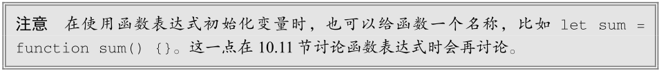

## 函数作为值

**因为函数名在 ECMAScript 中就是变量，所以函数可以用在任何可以使用变量的地方。**这意味着不仅可以把函数作为参数传给另一个函数，而且还可以在一个函数中返回另一个函数。来看下面的例子：

~~~javascript
function callSomeFunction(someFunction, someArgument) {
	return someFunction(someArgument);
}
~~~

这个函数接收两个参数。第一个参数应该是一个函数，第二个参数应该是要传给这个函数的值。任何函数都可以像下面这样作为参数传递：

~~~javascript
function add10(num) {
	return num + 10;
}

let result1 = callSomeFunction(add10, 10);
console.log(result1); // 20

function getGreeting(name) {
	return "Hello, " + name;
}

let result2 = callSomeFunction(getGreeting, "Nicholas");
console.log(result2); // "Hello, Nicholas"
~~~

callSomeFunction() 函数是通用的，第一个参数传入的是什么函数都可以，而且它始终返回调用作为第一个参数传入的函数的结果。要注意的是，**如果是访问函数而不是调用函数，那就必须不带括号**，所以传给 `callSomeFunction()`的必须是`add10 和 getGreeting`，而不能是它们的执行结果。

从一个函数中返回另一个函数也是可以的，而且非常有用。例如，假设有一个包含对象的数组，而我们想按照任意对象属性对数组进行排序。为此，可以定义一个 sort() 方法需要的比较函数，它接收两个参数，即要比较的值。但这个比较函数还需要想办法确定根据哪个属性来排序。这个问题可以通过定义一个根据属性名来创建比较函数的函数来解决。比如：

~~~javascript
function createComparisonFunction(propertyName) {
	return function(object1, object2) {
		let value1 = object1[propertyName];
		let value2 = object2[propertyName];
        
		if (value1 < value2) {
			return -1;
		} else if (value1 > value2) {
			return 1;
		} else {
			return 0;
		}
	};
}
~~~

这个函数的语法乍一看比较复杂，但实际上就是在一个函数中返回另一个函数，注意那个 return操作符。内部函数可以访问`propertyName`参数，并通过中括号语法取得要比较的对象的相应属性值。取得属性值以后，再按照`sort()`方法的需要返回比较值就行了。这个函数可以像下面这样使用：

~~~javascript
let data = [
	{name: "Zachary", age: 28},
	{name: "Nicholas", age: 29}
];

data.sort(createComparisonFunction("name"));
console.log(data[0].name); // Nicholas

data.sort(createComparisonFunction("age"));
console.log(data[0].name); // Zachary
~~~

> 这段代码以前能看懂的，现在又看不懂了。

在上面的代码中，数组 data 中包含两个结构相同的对象。每个对象都有一个 name 属性和一个 age属性。默认情况下， `sort()`方法要对这两个对象执行 toString() ，然后再决定它们的顺序，但这样得不到有意义的结果。而通过调用 createComparisonFunction("name") 来创建一个比较函数，就可以根据每个对象 name 属性的值来排序，结果 name 属性值为 "Nicholas" 、 age 属性值为 29 的对象会排在前面。而调用`createComparisonFunction("age")` 则会创建一个根据每个对象 age 属性的值来排序的比较函数，结果 name 属性值为 "Zachary" 、 age 属性值为 28 的对象会排在前面。

## 函数内部

在 ECMAScript 5 中，函数内部存在两个特殊的对象： arguments 和 this 。ECMAScript 6 又新增了`new.target `属性。

### arguments

arguments 对象前面讨论过多次了，它是一个类数组对象，包含调用函数时传入的所有参数。这个对象只有以 function 关键字定义函数（相对于使用箭头语法创建函数）时才会有。虽然主要用于包含函数参数，但 arguments 对象其实还有一个 callee 属性，是一个指向 arguments 对象所在函数的指针。来看下面这个经典的阶乘函数：

~~~javascript
function factorial(num) {
	if (num <= 1) {
		return 1;
	} else {
		return num * factorial(num - 1);
	}
}
~~~

阶乘函数一般定义成递归调用的，就像上面这个例子一样。只要给函数一个名称，而且这个名称不会变，这样定义就没有问题。但是，**这个函数要正确执行就必须保证函数名是 factorial ，从而导致了紧密耦合**。使用`arguments.callee`就可以让函数逻辑与函数名解耦：

~~~javascript
function factorial(num) {
	if (num <= 1) {
		return 1;
	} else {
		return num * arguments.callee(num - 1);
	}
}
~~~

这个重写之后的`factorial()`函数已经用`arguments.callee`代替了之前硬编码的 factorial 。这意味着无论函数叫什么名称，都可以引用正确的函数。考虑下面的情况：

~~~javascript
let trueFactorial = factorial;

factorial = function() {
	return 0;
};

console.log(trueFactorial(5)); // 120
console.log(factorial(5)); // 0
~~~

这里， trueFactorial 变量被赋值为 factorial ，实际上把同一个函数的指针又保存到了另一个位置。然后， factorial 函数又被重写为一个返回 0 的函数。如果像`factorial()`最初的版本那样不使用`arguments.callee` ，那么像上面这样调用`trueFactorial()`就会返回 0 。不过，通过将函数与名称解耦， trueFactorial() 就可以正确计算阶乘，而`factorial()`则只能返回 0。

### this

另一个特殊的对象是 this ，它在标准函数和箭头函数中有不同的行为。

在标准函数中， this 引用的是把函数当成方法调用的上下文对象，这时候通常称其为 this 值（在网页的全局上下文中调用函数时， this 指向 windows ）。来看下面的例子：

~~~javascript
window.color = 'red';
let o = {
	color: 'blue'
};

function sayColor() {
	console.log(this.color);
}

sayColor(); // 'red'

o.sayColor = sayColor;
o.sayColor(); // 'blue'
~~~

定义在全局上下文中的函数`sayColor()`引用了 this 对象。这个 this 到底引用哪个对象必须到函数被调用时才能确定。因此这个值在代码执行的过程中可能会变。如果在全局上下文中调用`sayColor()`，这结果会输出 "red" ，因为 this 指向 window ，而 this.color 相当于`window.color`。而在把`sayColor()`赋值给 o 之后再调用 `o.sayColor()` ， this 会指向 o ，即`this.color`相当于`o.color `，所以会显示 "blue" 。

**在箭头函数中， this 引用的是定义箭头函数的上下文**。下面的例子演示了这一点。在对`sayColor()`的两次调用中， this 引用的都是 window 对象，因为这个箭头函数是在 window 上下文中定义的：

~~~javascript
window.color = 'red';
let o = {
	color: 'blue'
};

let sayColor = () => console.log(this.color);

sayColor(); // 'red'

o.sayColor = sayColor;
o.sayColor(); // 'red'
~~~

有读者知道，在事件回调或定时回调中调用某个函数时， this 值指向的并非想要的对象。此时将回调函数写成箭头函数就可以解决问题。这是因为箭头函数中的 this 会保留定义该函数时的上下文：

~~~javascript
function King() {
	this.royaltyName = 'Henry';
	// this 引用 King 的实例
	setTimeout(() => console.log(this.royaltyName), 1000);
}

function Queen() {
	this.royaltyName = 'Elizabeth';
	// this 引用 window 对象
	setTimeout(function() { console.log(this.royaltyName); }, 1000);
}

new King(); // Henry
new Queen(); // undefined
~~~

> 并没有深刻了解，说明我对于this的了解还是不够深入啊。

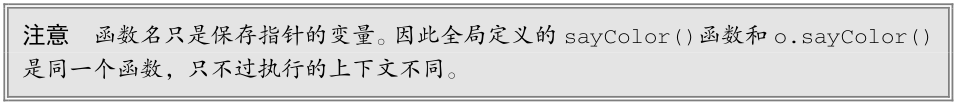

### caller

ECMAScript 5 也会给函数对象上添加一个属性： caller 。虽然 ECMAScript 3 中并没有定义，但所有浏览器除了早期版本的 Opera 都支持这个属性。**这个属性引用的是调用当前函数的函数**，或者**如果是在全局作用域中调用的则为 null** 。比如：

~~~javascript
function outer() {
	inner();
}

function inner() {
	console.log(inner.caller);
}
outer();
~~~

以上代码会显示 outer() 函数的源代码。这是因为 ourter() 调用了`inner()` ， `inner.caller`指向`outer()`。如果要降低耦合度，则可以通过`arguments.callee.caller`来引用同样的值：

~~~javascript
function outer() {
	inner();
}

function inner() {
	console.log(arguments.callee.caller);
}
outer();
~~~

在严格模式下访问`arguments.callee`会报错。ECMAScript 5 也定义了`arguments.caller`，但在严格模式下访问它会报错，在非严格模式下则始终是 undefined 。这是为了分清`arguments.caller`和函数的 caller 而故意为之的。而作为对这门语言的安全防护，这些改动也让第三方代码无法检测同一上下文中运行的其他代码。严格模式下还有一个限制，就是不能给函数的 caller 属性赋值，否则会导致错误。

### new target

ECMAScript 中的函数始终可以作为构造函数实例化一个新对象，也可以作为普通函数被调用。ECMAScript 6 新增了检测函数是否使用 new 关键字调用的 new.target 属性。如果函数是正常调用的，则 new.target 的值是 undefined ；如果是使用 new 关键字调用的，则 new.target 将引用被调用的构造函数。

~~~javascript
function King() {
	if (!new.target) {
		throw 'King must be instantiated using "new"'
	}
	console.log('King instantiated using "new"');
}

new King(); // King instantiated using "new"
King(); // Error: King must be instantiated using "new"
~~~

## 函数属性和方法

前面提到过，ECMAScript 中的函数是对象，因此有属性和方法。**每个函数都有两个属性： length和 prototype** 。其中， length 属性保存函数定义的命名参数的个数，如下例所示：

~~~javascript
function sayName(name) {
	console.log(name);
}

function sum(num1, num2) {
	return num1 + num2;
}

function sayHi() {
	console.log("hi");
}

console.log(sayName.length); // 1
console.log(sum.length); // 2
console.log(sayHi.length); // 0
~~~

以上代码定义了 3 个函数，每个函数的命名参数个数都不一样。 sayName() 函数有 1 个命名参数，所以其 length 属性为 1。类似地， `sum()`函数有两个命名参数，所以其 length 属性是 2。而`sayHi()`没有命名参数，其 length 属性为 0。

prototype 属性也许是 ECMAScript 核心中最有趣的部分。 prototype 是保存引用类型所有实例方法的地方，这意味着`toString()` 、 `valueOf()`等方法实际上都保存在 prototype 上，进而由所有实例共享。这个属性在自定义类型时特别重要。（相关内容已经在第 8 章详细介绍过了。）在 ECMAScript 5中， **prototype 属性是不可枚举的，因此使用`for-in`循环不会返回这个属性**。

函数还有两个方法： `apply()`和`call()` 。这两个方法都会以指定的 this 值来调用函数，即会设置调用函数时函数体内 this 对象的值。`apply()`方法接收两个参数：函数内 this 的值和一个参数数组。第二个参数可以是 Array 的实例，但也可以是 arguments 对象。来看下面的例子：

~~~javascript
function sum(num1, num2) {
	return num1 + num2;
}

function callSum1(num1, num2) {
	return sum.apply(this, arguments); // 传入 arguments 对象
}

function callSum2(num1, num2) {
	return sum.apply(this, [num1, num2]); // 传入数组
}

console.log(callSum1(10, 10)); // 20
console.log(callSum2(10, 10)); // 20
~~~

在这个例子中， `callSum1()`会调用`sum()`函数，将 this 作为函数体内的 this 值（这里等于window ，因为是在全局作用域中调用的）传入，同时还传入了 arguments 对象。`callSum2()`也会调用`sum()`函数，但会传入参数的数组。这两个函数都会执行并返回正确的结果。

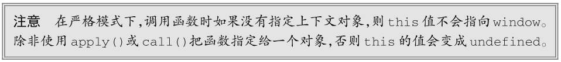

call() 方法与 apply() 的作用一样，只是传参的形式不同。第一个参数跟 apply() 一样，也是 this值，而剩下的要传给被调用函数的参数则是逐个传递的。换句话说，通过 call() 向函数传参时，必须将参数一个一个地列出来，比如：

~~~javascript
function sum(num1, num2) {
	return num1 + num2;
}

function callSum(num1, num2) {
	return sum.call(this, num1, num2);
}
console.log(callSum(10, 10)); // 20
~~~

这里的`callSum()`函数必须逐个地把参数传给`call()`方法。结果跟`apply()`的例子一样。到底是使用`apply()` 还是`call()`，完全取决于怎么给要调用的函数传参更方便。如果想直接传 arguments对象或者一个数组，那就用 `apply()`；否则，就用`call()`。当然，如果不用给被调用的函数传参，则使用哪个方法都一样。

`apply()`和`call()`真正强大的地方并不是给函数传参，而是控制函数调用上下文即函数体内 this值的能力。考虑下面的例子：

~~~javascript
window.color = 'red';
let o = {
	color: 'blue'
};

function sayColor() {
	console.log(this.color);
}

sayColor(); // red

sayColor.call(this); // red
sayColor.call(window); // red
sayColor.call(o); // blue
~~~

这个例子是在之前那个关于 this 对象的例子基础上修改而成的。同样，`sayColor()`是一个全局函数，如果在全局作用域中调用它，那么会显示 "red" 。这是因为`this.color`会求值为`window.color`。如果在全局作用域中显式调用`sayColor.call(this)`或者`sayColor.call(window)`，则同样都会显示 "red" 。而在使用 `sayColor.call(o)`把函数的执行上下文即 this 切换为对象 o 之后，结果就变成了显示 "blue" 了。

> 我现在慢慢的开始了解到call和apply的威力了。

使用`call()`或`apply()`的好处是可以将任意对象设置为任意函数的作用域，这样对象可以不用关心方法。在前面例子最初的版本中，为切换上下文需要先把`sayColor()`直接赋值为 o 的属性，然后再调用。而在这个修改后的版本中，就不需要这一步操作了。

**ECMAScript 5 出于同样的目的定义了一个新方法：`bind()`**，`bind()`方法会创建一个新的函数实例，其 this 值会被绑定到传给`bind()`的对象。比如：

~~~javascript
window.color = 'red';
var o = {
	color: 'blue'
};

function sayColor() {
	console.log(this.color);
}

let objectSayColor = sayColor.bind(o);
objectSayColor(); // blue
~~~

这里，在`sayColor()`上调用`bind()`并传入对象 o 创建了一个新函数`objectSayColor()`。`objectSayColor()`中的 this 值被设置为 o ，因此直接调用这个函数，即使是在全局作用域中调用，也会返回字符串 "blue" 。

对函数而言，继承的方法`toLocaleString()`和`toString()`始终返回函数的代码。返回代码的具体格式因浏览器而异。有的返回源代码，包含注释，而有的只返回代码的内部形式，会删除注释，甚至代码可能被解释器修改过。由于这些差异，因此不能在重要功能中依赖这些方法返回的值，而只应在调试中使用它们。继承的方法`valueOf()`返回函数本身。

[浅析toString()和toLocaleString()的区别](https://www.cnblogs.com/newbob/p/4541145.html)

## 函数表达式

函数表达式虽然更强大，但也更容易让人迷惑。我们知道，定义函数有两种方式：**函数声明和函数表达式**。函数声明是这样的：

~~~javascript
function functionName(arg0, arg1, arg2) {
	// 函数体
}
~~~

函数声明的关键特点是函数声明提升，即函数声明会在代码执行之前获得定义。这意味着函数声明可以出现在调用它的代码之后：

~~~javascript
sayHi();
function sayHi() {
	console.log("Hi!");
}
~~~

这个例子不会抛出错误，因为 JavaScript 引擎会先读取函数声明，然后再执行代码。

第二种创建函数的方式就是函数表达式。函数表达式有几种不同的形式，最常见的是这样的：

~~~javascript
let functionName = function(arg0, arg1, arg2) {
	// 函数体
};
~~~

函数表达式看起来就像一个普通的变量定义和赋值，即创建一个函数再把它赋值给一个变量functionName 。这样创建的函数叫作匿名函数（anonymous funtion），因为 function 关键字后面没有标识符。（匿名函数有也时候也被称为兰姆达函数）。未赋值给其他变量的匿名函数的 name 属性是空字符串。

函数表达式跟 JavaScript 中的其他表达式一样，需要先赋值再使用。下面的例子会导致错误：

~~~javascript
sayHi(); // Error! function doesn't exist yet
let sayHi = function() {
	console.log("Hi!");
};
~~~

理解函数声明与函数表达式之间的区别，关键是理解提升。比如，以下代码的执行结果可能会出乎意料：

~~~javascript
// 千万别这样做！
if (condition) {
	function sayHi() {
		console.log('Hi!');
	}
} else {
	function sayHi() {
		console.log('Yo!');
	}
}
~~~

这段代码看起来很正常，就是如果 condition 为 true ，则使用第一个 sayHi() 定义；否则，就使用第二个。事实上，这种写法在 ECAMScript 中不是有效的语法。JavaScript 引擎会尝试将其纠正为适当的声明。问题在于浏览器纠正这个问题的方式并不一致。多数浏览器会忽略 condition 直接返回第二个声明。Firefox 会在 condition 为 true 时返回第一个声明。这种写法很危险，不要使用。不过，如果把上面的函数声明换成函数表达式就没问题了：

~~~javascript
// 没问题
let sayHi;
if (condition) {
	sayHi = function() {
		console.log("Hi!");
	};
} else {
	sayHi = function() {
		console.log("Yo!");
	};
}
~~~

这个例子可以如预期一样，根据 condition 的值为变量 sayHi 赋予相应的函数。

创建函数并赋值给变量的能力也可以用于在一个函数中把另一个函数当作值返回：

~~~javascript
function createComparisonFunction(propertyName) {
	return function(object1, object2) {
		let value1 = object1[propertyName];
		let value2 = object2[propertyName];
        
		if (value1 < value2) {
			return -1;
		} else if (value1 > value2) {
			return 1;
		} else {
    		return 0;
		}
	};
}
~~~

这里的`createComparisonFunction()`函数返回一个匿名函数，这个匿名函数要么被赋值给一个变量，要么可以直接调用。但在`createComparisonFunction()`内部，那个函数是匿名的。任何时候，只要函数被当作值来使用，它就是一个函数表达式。本章后面会介绍，这并不是使用函数表达式的唯一方式。

## 递归

递归函数通常的形式是**一个函数通过名称调用自己**，如下面的例子所示：

~~~javascript
function factorial(num) {
	if (num <= 1) {
		return 1;
	} else {
		return num * factorial(num - 1);
	}
}
~~~

这是经典的递归阶乘函数。虽然这样写是可以的，但如果把这个函数赋值给其他变量，就会出问题：

~~~javascript
let anotherFactorial = factorial;
factorial = null;
console.log(anotherFactorial(4)); // 报错
~~~

这里把`factorial()`函数保存在了另一个变量`anotherFactorial`中，然后将 factorial 设置为 null ，于是只保留了一个对原始函数的引用。而在调用`anotherFactorial()`时，要递归调用`factorial()`，但因为它已经不是函数了，所以会出错。在写递归函数时使用`arguments.callee`可以避免这个问题。

`arguments.callee`就是一个指向正在执行的函数的指针，因此可以在函数内部递归调用，如下所示：

~~~javascript
function factorial(num) {
	if (num <= 1) {
		return 1;
	} else {
		return num * arguments.callee(num - 1);
	}
}
~~~

像这里加粗的这一行一样，把函数名称替换成 arguments.callee ，可以确保无论通过什么变量调用这个函数都不会出问题。因此在编写递归函数时， arguments.callee 是引用当前函数的首选。

不过，在严格模式下运行的代码是不能访问 arguments.callee 的，因为访问会出错。此时，可以使用命名函数表达式（named function expression）达到目的。比如：

~~~javascript
const factorial = (function f(num) {
	if (num <= 1) {
		return 1;
	} else {
		return num * f(num - 1);
	}
});
~~~

这里创建了一个命名函数表达式 f() ，然后将它赋值给了变量 factorial 。即使把函数赋值给另一个变量，函数表达式的名称 f 也不变，因此递归调用不会有问题。这个模式在严格模式和非严格模式下都可以使用。

## 尾调用优化

[js函数的尾调用优化](https://zhuanlan.zhihu.com/p/35196859)

ECMAScript 6规范新增了一项内存管理优化机制，让 JavaScript 引擎在满足条件时可以重用栈帧。具体来说，这项优化非常适合“尾调用”，即外部函数的返回值是一个内部函数的返回值。比如：

~~~javascript
function outerFunction() {
	return innerFunction(); // 尾调用
}
~~~

在 ES6 优化之前，执行这个例子会在内存中发生如下操作。
(1) 执行到 outerFunction 函数体，第一个栈帧被推到栈上。
(2) 执行 outerFunction 函数体，到 return 语句。计算返回值必须先计算 innerFunction 。
(3) 执行到 innerFunction 函数体，第二个栈帧被推到栈上。
(4) 执行 innerFunction 函数体，计算其返回值。
(5) 将返回值传回 outerFunction ，然后 outerFunction 再返回值。
(6) 将栈帧弹出栈外。

在 ES6 优化之后，执行这个例子会在内存中发生如下操作。
(1) 执行到 outerFunction 函数体，第一个栈帧被推到栈上。
(2) 执行 outerFunction 函数体，到达 return 语句。为求值返回语句，必须先求值 innerFunction 。
(3) 引擎发现把第一个栈帧弹出栈外也没问题，因为 innerFunction 的返回值也是 outerFunction
的返回值。
(4) 弹出 outerFunction 的栈帧。
(5) 执行到 innerFunction 函数体，栈帧被推到栈上。
(6) 执行 innerFunction 函数体，计算其返回值。
(7) 将 innerFunction 的栈帧弹出栈外。

很明显，第一种情况下每多调用一次嵌套函数，就会多增加一个栈帧。而第二种情况下无论调用多
少次嵌套函数，都只有一个栈帧。这就是 ES6 尾调用优化的关键：如果函数的逻辑允许基于尾调用将其
销毁，则引擎就会那么做。

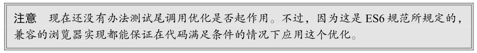

### 尾调用优化的条件

尾调用优化的条件就是确定外部栈帧真的没有必要存在了。涉及的条件如下：

*  代码在严格模式下执行；
* 外部函数的返回值是对尾调用函数的调用；
* 尾调用函数返回后不需要执行额外的逻辑；
* 尾调用函数不是引用外部函数作用域中自由变量的闭包。

下面展示了几个违反上述条件的函数，因此都不符号尾调用优化的要求：

~~~javascript
"use strict";
// 无优化：尾调用没有返回
function outerFunction() {
	innerFunction();
}

// 无优化：尾调用没有直接返回
function outerFunction() {
	let innerFunctionResult = innerFunction();
	return innerFunctionResult;
}

// 无优化：尾调用返回后必须转型为字符串
function outerFunction() {
	return innerFunction().toString();
}

// 无优化：尾调用是一个闭包
function outerFunction() {
	let foo = 'bar';
	function innerFunction() { return foo; }
	return innerFunction();
}
~~~

下面是几个符合尾调用优化条件的例子：

~~~javascript
"use strict";
// 有优化：栈帧销毁前执行参数计算
function outerFunction(a, b) {
	return innerFunction(a + b);
}

// 有优化：初始返回值不涉及栈帧
function outerFunction(a, b) {
	if (a < b) {
		return a;
	}
	return innerFunction(a + b);
}

// 有优化：两个内部函数都在尾部
function outerFunction(condition) {
	return condition ? innerFunctionA() : innerFunctionB();
}
~~~

差异化尾调用和递归尾调用是容易让人混淆的地方。无论是递归尾调用还是非递归尾调用，都可以应用优化。引擎并不区分尾调用中调用的是函数自身还是其他函数。不过，这个优化在递归场景下的效果是最明显的，因为递归代码最容易在栈内存中迅速产生大量栈帧。

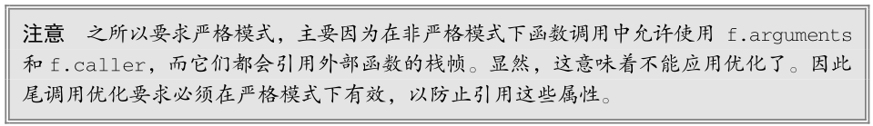

### 尾调用优化的代码

可以通过把简单的递归函数转换为待优化的代码来加深对尾调用优化的理解。下面是一个通过递归计算斐波纳契数列的函数：

~~~javascript
function fib(n) {
	if (n < 2) {
		return n;
	}
	return fib(n - 1) + fib(n - 2);
}

console.log(fib(0)); // 0
console.log(fib(1)); // 1
console.log(fib(2)); // 1
console.log(fib(3)); // 2
console.log(fib(4)); // 3
console.log(fib(5)); // 5
console.log(fib(6)); // 8
~~~

显然这个函数不符合尾调用优化的条件，因为返回语句中有一个相加的操作。结果， `fib(n) `的栈帧数的内存复杂度是O(2n )。因此，即使这么一个简单的调用也可以给浏览器带来麻烦：

~~~javascript
fib(1000);
~~~

当然，解决这个问题也有不同的策略，比如把递归改写成迭代循环形式。不过，也可以保持递归实现，但将其重构为满足优化条件的形式。为此可以使用两个嵌套的函数，外部函数作为基础框架，内部函数执行递归：

~~~javascript
"use strict";

// 基础框架
function fib(n) {
	return fibImpl(0, 1, n);
}

// 执行递归
function fibImpl(a, b, n) {
	if (n === 0) {
		return a;
	}
	return fibImpl(b, a + b, n - 1);
}
~~~

这样重构之后，就可以满足尾调用优化的所有条件，再调用`fib(1000)`就不会对浏览器造成威胁了。

## 闭包

匿名函数经常被人误认为是闭包（closure）。闭包指的是那些引用了另一个函数作用域中变量的函数，通常是在嵌套函数中实现的。比如，下面是之前展示的`createComparisonFunction()`函数，注意其中加粗的代码：

~~~javascript
function createComparisonFunction(propertyName) {
	return function(object1, object2) {
		let value1 = object1[propertyName];
		let value2 = object2[propertyName];
    
		if (value1 < value2) {
			return -1;
		} else if (value1 > value2) {
			return 1;
		} else {
			return 0;
		}
	};
}
~~~

这里加粗的代码位于内部函数（匿名函数）中，其中引用了外部函数的变量propertyName 。在这个内部函数被返回并在其他地方被使用后，它仍然引用着那个变量。这是因为内部函数的作用域链包含
`createComparisonFunction()`函数的作用域。要理解为什么会这样，可以想想第一次调用这个函数时会发生什么。

本书在第 4 章曾介绍过作用域链的概念。理解作用域链创建和使用的细节对理解闭包非常重要。在调用一个函数时，会为这个函数调用创建一个执行上下文，并创建一个作用域链。然后用 arguments和其他命名参数来初始化这个函数的活动对象。外部函数的活动对象是内部函数作用域链上的第二个对象。这个作用域链一直向外串起了所有包含函数的活动对象，直到全局执行上下文才终止。

在函数执行时，要从作用域链中查找变量，以便读、写值。来看下面的代码：

~~~javascript
function compare(value1, value2) {
	if (value1 < value2) {
		return -1;
	} else if (value1 > value2) {
		return 1;
	} else {
		return 0;
	}
}
let result = compare(5, 10);
~~~

这里定义的 compare() 函数是在全局上下文中调用的。第一次调用 compare() 时，会为它创建一个包含 arguments 、 value1 和 value2 的活动对象，这个对象是其作用域链上的第一个对象。而全局上下文的变量对象则是 compare() 作用域链上的第二个对象，其中包含 this 、 result 和 compare 。图 10-1 展示了以上关系。

函数执行时，每个执行上下文中都会有一个包含其中变量的对象。全局上下文中的叫变量对象，它会在代码执行期间始终存在。而函数局部上下文中的叫活动对象，只在函数执行期间存在。在定义`compare()`函数时，就会为它创建作用域链，预装载全局变量对象，并保存在内部的 [[Scope]] 中。在调用这个函数时，会创建相应的执行上下文，然后通过复制函数的 [[Scope]] 来创建其作用域链。接着会创建函数的活动对象（用作变量对象）并将其推入作用域链的前端。在这个例子中，这意味着`compare()`函数执行上下文的作用域链中有两个变量对象：局部变量对象和全局变量对象。作用域链其实是一个包含指针的列表，每个指针分别指向一个变量对象，但物理上并不会包含相应的对象。

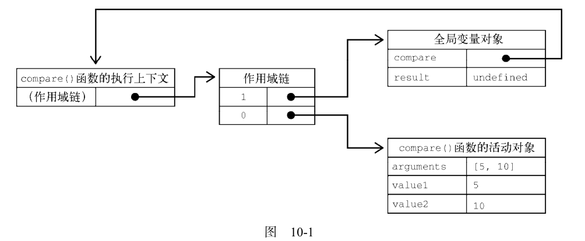

函数内部的代码在访问变量时，就会使用给定的名称从作用域链中查找变量。函数执行完毕后，局部活动对象会被销毁，内存中就只剩下全局作用域。不过，闭包就不一样了。

在一个函数内部定义的函数会把其包含函数的活动对象添加到自己的作用域链中。因此，在
`createComparisonFunction()`函数中，匿名函数的作用域链中实际上包含`createComparisonFunction()`的活动对象。图 10-2 展示了以下代码执行后的结果。

~~~javascript
let compare = createComparisonFunction('name');
let result = compare({ name: 'Nicholas' }, { name: 'Matt' });
~~~

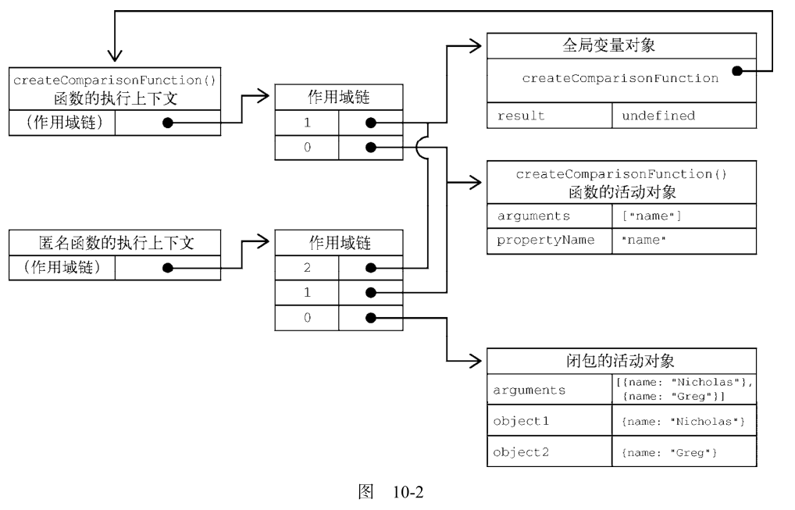

在 createComparisonFunction() 返回匿名函数后，它的作用域链被初始化为包含`createComparisonFunction() `的活动对象和全局变量对象。这样，匿名函数就可以访问到 createComparison-
Function() 可以访问的所有变量。另一个有意思的副作用就是， `createComparisonFunction()`的活动对象并不能在它执行完毕后销毁，因为匿名函数的作用域链中仍然有对它的引用。在`createComparisonFunction()`执行完毕后，其执行上下文的作用域链会销毁，但它的活动对象仍然会保留在内存中，直到匿名函数被销毁后才会被销毁：

~~~javascript
// 创建比较函数
let compareNames = createComparisonFunction('name');

// 调用函数
let result = compareNames({ name: 'Nicholas' }, { name: 'Matt' });

// 解除对函数的引用，这样就可以释放内存了
compareNames = null;
~~~

这里，创建的比较函数被保存在变量compareNames中。把 compareNames 设置为等于 null 会解除对函数的引用，从而让垃圾回收程序可以将内存释放掉。作用域链也会被销毁，其他作用域（除全局作用域之外）也可以销毁。图 10-2 展示了调用`compareNames()`之后作用域链之间的关系。

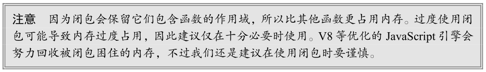

### this对象

在闭包中使用 this 会让代码变复杂。如果内部函数没有使用箭头函数定义，则 this 对象会在运行时绑定到执行函数的上下文。如果在全局函数中调用，则 this 在非严格模式下等于 window ，在严格模式下等于 undefined 。如果作为某个对象的方法调用，则 this 等于这个对象。匿名函数在这种情况下不会绑定到某个对象，这就意味着 this 会指向 window ，除非在严格模式下 this 是 undefined 。不过，由于闭包的写法所致，这个事实有时候没有那么容易看出来。来看下面的例子：

~~~javascript
window.identity = 'The Window';

let object = {
	identity: 'My Object',
	getIdentityFunc() {
		return function() {
			return this.identity;
		};
	}
};
console.log(object.getIdentityFunc()()); // 'The Window'
~~~

这里先创建了一个全局变量 identity ，之后又创建一个包含 identity 属性的对象。这个对象还包含一个`getIdentityFunc()`方法，返回一个匿名函数。这个匿名函数返回 this.identity 。因为`getIdentityFunc()`返回函数，所以`object.getIdentityFunc()()`会立即调用这个返回的函数，从而得到一个字符串。可是，此时返回的字符串是 "The Winodw" ，即全局变量 identity 的值。为什么匿名函数没有使用其包含作用域(`getIdentityFunc() `)的 this 对象呢？

前面介绍过，每个函数在被调用时都会自动创建两个特殊变量： this 和 arguments 。内部函数永远不可能直接访问外部函数的这两个变量。但是，如果把 this 保存到闭包可以访问的另一个变量中，则是行得通的。比如：

~~~javascript
window.identity = 'The Window';

let object = {
	identity: 'My Object',
	getIdentityFunc() {
		let that = this;
		return function() {
			return that.identity;
		};
	}
};
console.log(object.getIdentityFunc()()); // 'My Object'
~~~

这里加粗的代码展示了与前面那个例子的区别。在定义匿名函数之前，先把外部函数的 this 保存到变量 that 中。然后在定义闭包时，就可以让它访问 that ，因为这是包含函数中名称没有任何冲突的一个变量。即使在外部函数返回之后， that 仍然指向 object ，所以调用`object.getIdentityFunc()()`就会返回 "My Object" 。

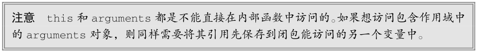

在一些特殊情况下， this 值可能并不是我们所期待的值。比如下面这个修改后的例子：

~~~javascript
window.identity = 'The Window';
let object = {
	identity: 'My Object',
	getIdentity () {
		return this.identity;
	}
};
~~~

`getIdentity()`方法就是返回`this.identity`的值。以下是几种调用`object.getIdentity()`的方式及返回值：

~~~javascript
object.getIdentity(); // 'My Object'
(object.getIdentity)(); // 'My Object'
(object.getIdentity = object.getIdentity)(); // 'The Window'
~~~

第一行调用 object.getIdentity() 是正常调用，会返回 "My Object" ，因为`this.identity`就是`object.identity `。第二行在调用时把`object.getIdentity`放在了括号里。虽然加了括号之后看起来是对一个函数的引用，但 this 值并没有变。这是因为按照规范，`object.getIdentity`和`(object.getIdentity)`是相等的。第三行执行了一次赋值，然后再调用赋值后的结果。因为赋值表达式的值是函数本身， this 值不再与任何对象绑定，所以返回的是 "The Window" 。

一般情况下，不大可能像第二行和第三行这样调用对象上的方法。但通过这个例子，我们可以知道，即使语法稍有不同，也可能影响 this 的值。

### 内存泄漏

由于 IE 在 IE9 之前对 JScript 对象和 COM 对象使用了不同的垃圾回收机制（第 4章讨论过），所以闭包在这些旧版本 IE 中可能会导致问题。在这些版本的 IE 中，把 HTML 元素保存在某个闭包的作用域中，就相当于宣布该元素不能被销毁。来看下面的例子：

~~~javascript
function assignHandler() {
	let element = document.getElementById('someElement');
	element.onclick = () => console.log(element.id);
}
~~~

以上代码创建了一个闭包，即 element 元素的事件处理程序（事件处理程序将在第 13 章讨论）。而这个处理程序又创建了一个循环引用。匿名函数引用着 assignHandler() 的活动对象，阻止了对element的引用计数归零。只要这个匿名函数存在， element 的引用计数就至少等于 1。也就是说，内存不会被回收。其实只要这个例子稍加修改，就可以避免这种情况，比如：

~~~javascript
function assignHandler() {
	let element = document.getElementById('someElement');
	let id = element.id;
	element.onclick = () => console.log(id);
	element = null;
}
~~~

在这个修改后的版本中，闭包改为引用一个保存着 element.id 的变量 id ，从而消除了循环引用。不过，光有这一步还不足以解决内存问题。因为闭包还是会引用包含函数的活动对象，而其中包含element 。即使闭包没有直接引用 element ，包含函数的活动对象上还是保存着对它的引用。因此，必须再把 element 设置为 null 。这样就解除了对这个 COM对象的引用，其引用计数也会减少，从而确保其内存可以在适当的时候被回收。

## 立即调用的函数表达式

立即调用的匿名函数又被称作立即调用的函数表达式（IIFE，Immediately Invoked Function Expression）。它类似于函数声明，但由于被包含在括号中，所以会被解释为函数表达式。紧跟在第一组括号后面的第二组括号会立即调用前面的函数表达式。下面是一个简单的例子：

~~~javascript
(function() {
// 块级作用域
})();
~~~

使用 IIFE 可以模拟块级作用域，即在一个函数表达式内部声明变量，然后立即调用这个函数。这样位于函数体作用域的变量就像是在块级作用域中一样。ECMAScript 5 尚未支持块级作用域，使用 IIFE模拟块级作用域是相当普遍的。比如下面的例子：

~~~javascript
// IIFE
(function () {
	for (var i = 0; i < count; i++) {
		console.log(i);
	}
})();

console.log(i); // 抛出错误
~~~

前面的代码在执行到 IIFE 外部的 console.log() 时会出错，因为它访问的变量是在 IIFE 内部定义的，在外部访问不到。在 ECMAScript 5.1 及以前，为了防止变量定义外泄，IIFE 是个非常有效的方式。这样也不会导致闭包相关的内存问题，因为不存在对这个匿名函数的引用。为此，只要函数执行完毕，其作用域链就可以被销毁。

在 ECMAScript 6 以后，IIFE 就没有那么必要了，因为块级作用域中的变量无须 IIFE 就可以实现同样的隔离。下面展示了两种不同的块级作用域形式：

~~~javascript
// 内嵌块级作用域
{
	let i;
	for (i = 0; i < count; i++) {
		console.log(i);
	}
}
console.log(i); // 抛出错误

// 循环的块级作用域
for (let i = 0; i < count; i++) {
	console.log(i);
}

console.log(i); // 抛出错误
~~~

说明 IIFE 用途的一个实际的例子，就是可以用它锁定参数值。比如：

~~~javascript
let divs = document.querySelectorAll('div');

// 达不到目的！
for (var i = 0; i < divs.length; ++i) {
	divs[i].addEventListener('click', function() {
		console.log(i);
	});
}
~~~

## 私有变量

严格来讲，JavaScript 没有私有成员的概念，所有对象属性都公有的。不过，倒是有私有变量的概念。任何定义在函数或块中的变量，都可以认为是私有的，因为在这个函数或块的外部无法访问其中的变量。私有变量包括函数参数、局部变量，以及函数内部定义的其他函数。来看下面的例子：

~~~javascript
function add(num1, num2) {
	let sum = num1 + num2;
	return sum;
}
~~~

在这个函数中，函数 add() 有 3 个私有变量： num1 、 num2 和 sum 。这几个变量只能在函数内部使用，不能在函数外部访问。如果这个函数中创建了一个闭包，则这个闭包能通过其作用域链访问其外部的这 3 个变量。基于这一点，就可以创建出**能够访问私有变量的公有方法**。

**特权方法**（privileged method）是能够访问函数私有变量（及私有函数）的公有方法。在对象上有两种方式创建特权方法。第一种是在构造函数中实现，比如：

~~~javascript
function MyObject() {
	// 私有变量和私有函数
	let privateVariable = 10;
    
	function privateFunction() {
		return false;
}
    
	// 特权方法
	this.publicMethod = function() {
		privateVariable++;
		return privateFunction();
	};
}
~~~

这个模式是把所有私有变量和私有函数都定义在构造函数中。然后，再创建一个能够访问这些私有成员的特权方法。这样做之所以可行，是因为定义在构造函数中的特权方法其实是一个闭包，它具有访问构造函数中定义的所有变量和函数的能力。在这个例子中，变量 privateVariable 和函数`privateFunction()`只能通过`publicMethod() `方法来访问。在创建 MyObject 的实例后，没有办法直接访问privateVariable 和 `privateFunction()`，唯一的办法是使用`publicMethod()`。

如下面的例子所示，可以定义私有变量和特权方法，以隐藏不能被直接修改的数据：

~~~javascript
function Person(name) {
	this.getName = function() {
		return name;
	};
	this.setName = function (value) {
		name = value;
	};
}

let person = new Person('Nicholas');
console.log(person.getName()); // 'Nicholas'
person.setName('Greg');
console.log(person.getName()); // 'Greg'
~~~

这段代码中的构造函数定义了两个特权方法： getName() 和 setName() 。每个方法都可以构造函数外部调用，并通过它们来读写私有的 name 变量。在 Person 构造函数外部，没有别的办法访问 name 。因为两个方法都定义在构造函数内部，所以它们都是能够通过作用域链访问 name 的闭包。私有变量name 对每个 Person 实例而言都是独一无二的，因为每次调用构造函数都会重新创建一套变量和方法。不过这样也有个问题：必须通过构造函数来实现这种隔离。正如第 8 章所讨论的，构造函数模式的缺点是每个实例都会重新创建一遍新方法。使用静态私有变量实现特权方法可以避免这个问题。

### 静态私有变量

特权方法也可以通过使用私有作用域定义私有变量和函数来实现。这个模式如下所示：

~~~javascript
(function() {
	// 私有变量和私有函数
	let privateVariable = 10;
    
	function privateFunction() {
		return false;
}
    
// 构造函数
MyObject = function() {};
    
// 公有和特权方法
MyObject.prototype.publicMethod = function() {
	privateVariable++;
	return privateFunction();
	};
})();
~~~

在这个模式中，匿名函数表达式创建了一个包含构造函数及其方法的私有作用域。首先定义的是私有变量和私有函数，然后又定义了构造函数和公有方法。公有方法定义在构造函数的原型上，与典型的原型模式一样。注意，这个模式定义的构造函数没有使用函数声明，使用的是函数表达式。函数声明会创建内部函数，在这里并不是必需的。基于同样的原因（但操作相反），这里声明 MyObject 并没有使用任何关键字。因为不使用关键字声明的变量会创建在全局作用域中，所以 MyObject 变成了全局变量，可以在这个私有作用域外部被访问。注意在严格模式下给未声明的变量赋值会导致错误。

这个模式与前一个模式的主要区别就是，私有变量和私有函数是由实例共享的。因为特权方法定义在原型上，所以同样是由实例共享的。特权方法作为一个闭包，始终引用着包含它的作用域。来看下面的例子：

~~~javascript
(function() {
	let name = '';
    
	Person = function(value) {
		name = value;
};
    
	Person.prototype.getName = function() {
		return name;
};
    
	Person.prototype.setName = function(value) {
		name = value;
};
})();

let person1 = new Person('Nicholas');
console.log(person1.getName()); // 'Nicholas'
person1.setName('Matt');
console.log(person1.getName()); // 'Matt'

let person2 = new Person('Michael');
console.log(person1.getName()); // 'Michael'
console.log(person2.getName()); // 'Michael'
~~~

这里的 Person 构造函数可以访问私有变量 name ，跟`getName()`和`setName()`方法一样。使用这种模式， name 变成了静态变量，可供所有实例使用。这意味着在任何实例上调用 setName() 修改这个变量都会影响其他实例。调用  setName() 或创建新的 Person 实例都要把 name 变量设置为一个新值。而所有实例都会返回相同的值。像这样创建静态私有变量可以利用原型更好地重用代码，只是每个实例没有了自己的私有变量。最终，到底是把私有变量放在实例中，还是作为静态私有变量，都需要根据自己的需求来确定。

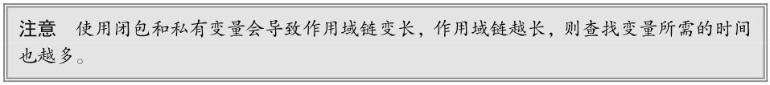

### 模块模式

前面的模式通过自定义类型创建了私有变量和特权方法。而下面要讨论的 Douglas Crockford 所说的模块模式，则在一个单例对象上实现了相同的隔离和封装。单例对象（singleton）就是只有一个实例的对象。按照惯例，JavaScript 是通过对象字面量来创建单例对象的，如下面的例子所示：

~~~javascript
let singleton = {
	name: value,
    method() {
		// 方法的代码
	}
};
~~~

模块模式是在单例对象基础上加以扩展，使其通过作用域链来关联私有变量和特权方法。模块模式的样板代码如下：

~~~javascript
let singleton = function() {
	// 私有变量和私有函数
	let privateVariable = 10;
    
	function privateFunction() {
		return false;
}
    
	// 特权/公有方法和属性
	return {
		publicProperty: true,
        
		publicMethod() {
			privateVariable++;
			return privateFunction();
		}
};
}();
~~~

模块模式使用了匿名函数返回一个对象。在匿名函数内部，首先定义私有变量和私有函数。之后，创建一个要通过匿名函数返回的对象字面量。这个对象字面量中只包含可以公开访问的属性和方法。因为这个对象定义在匿名函数内部，所以它的所有公有方法都可以访问同一个作用域的私有变量和私有函数。本质上，对象字面量定义了单例对象的公共接口。如果单例对象需要进行某种初始化，并且需要访问私有变量时，那就可以采用这个模式：

~~~javascript
let application = function() {
	// 私有变量和私有函数
	let components = new Array();
    
	// 初始化
	components.push(new BaseComponent());
    
	// 公共接口
	return {
		getComponentCount() {
			return components.length;
		},
		registerComponent(component) {
			if (typeof component == 'object') {
				components.push(component);
			}
		}
};
}();
~~~

在 Web 开发中，经常需要使用单例对象管理应用程序级的信息。上面这个简单的例子创建了一个application 对象用于管理组件。在创建这个对象之后，内部就会创建一个私有的数组 components ，然后将一个 BaseComponent 组件的新实例添加到数组中。（ BaseComponent 组件的代码并不重要，在这里用它只是为了说明模块模式的用法。）对象字面量中定义的 getComponentCount() 和 registerComponent() 方法都是可以访问 components 私有数组的特权方法。前一个方法返回注册组件的数量，后一个方法负责注册新组件。

在模块模式中，单例对象作为一个模块，经过初始化可以包含某些私有的数据，而这些数据又可以通过其暴露的公共方法来访问。以这种方式创建的每个单例对象都是 Object 的实例，因为最终单例都由一个对象字面量来表示。不过这无关紧要，因为单例对象通常是可以全局访问的，而不是作为参数传给函数的，所以可以避免使用instanceof 操作符确定参数是不是对象类型的需求。

> 已经看不懂了。

### 模块增强模式

另一个利用模块模式的做法是在返回对象之前先对其进行增强。这适合单例对象需要是某个特定类型的实例，但又必须给它添加额外属性或方法的场景。来看下面的例子：

~~~javascript
let singleton = function() {
	// 私有变量和私有函数
	let privateVariable = 10;
    
	function privateFunction() {
		return false;
}
    
	// 创建对象
	let object = new CustomType();
    
	// 添加特权/公有属性和方法
	object.publicProperty = true;
    
	object.publicMethod = function() {
		privateVariable++;
		return privateFunction();
};
    
	// 返回对象
	return object;
}();
~~~

如果前一节的 application 对象必须是 BaseComponent 的实例，那么就可以使用下面的代码来创建它：

~~~javascript
let application = function() {
	// 私有变量和私有函数
	let components = new Array();
    
	// 初始化
	components.push(new BaseComponent());
    
	// 创建局部变量保存实例
	let app = new BaseComponent();
    
	// 公共接口
	app.getComponentCount = function() {
		return components.length;
};
    
	app.registerComponent = function(component) {
	if (typeof component == "object") {
		components.push(component);
	}
};
    
	// 返回实例
	return app;
}();
~~~

在这个重写的 application 单例对象的例子中，首先定义了私有变量和私有函数，跟之前例子中一样。主要区别在于这里创建了一个名为 app 的变量，其中保存了 BaseComponent 组件的实例。这是最终要变成 application 的那个对象的局部版本。在给这个局部变量 app 添加了能够访问私有变量的公共方法之后，匿名函数返回了这个对象。然后，这个对象被赋值给 application 。

## 小结

函数是 JavaScript 编程中最有用也最通用的工具。ECMAScript 6 新增了更加强大的语法特性，从而让开发者可以更有效地使用函数。

* 函数表达式与函数声明是不一样的。函数声明要求写出函数名称，而函数表达式并不需要。没有名称的函数表达式也被称为匿名函数。
*  ES6 新增了类似于函数表达式的箭头函数语法，但两者也有一些重要区别。
* JavaScript 中函数定义与调用时的参数极其灵活。 arguments 对象，以及 ES6 新增的扩展操作符，可以实现函数定义和调用的完全动态化。
* 函数内部也暴露了很多对象和引用，涵盖了函数被谁调用、使用什么调用，以及调用时传入了什么参数等信息。
*  JavaScript 引擎可以优化符合尾调用条件的函数，以节省栈空间。
* 闭包的作用域链中包含自己的一个变量对象，然后是包含函数的变量对象，直到全局上下文的变量对象。
* 通常，函数作用域及其中的所有变量在函数执行完毕后都会被销毁。
*  闭包在被函数返回之后，其作用域会一直保存在内存中，直到闭包被销毁。
* 函数可以在创建之后立即调用，执行其中代码之后却不留下对函数的引用。
* 立即调用的函数表达式如果不在包含作用域中将返回值赋给一个变量，则其包含的所有变量都会被销毁。
* 虽然 JavaScript 没有私有对象属性的概念，但可以使用闭包实现公共方法，访问位于包含作用域中定义的变量。
* 可以访问私有变量的公共方法叫作特权方法。
* 特权方法可以使用构造函数或原型模式通过自定义类型中实现，也可以使用模块模式或模块增强模式在单例对象上实现。

# 第11章：期约与异步函数

/21.png)

ECMAScript 6 及之后的几个版本逐步加大了对异步编程机制的支持，提供了令人眼前一亮的新特性。ECMAScript 6 新增了正式的 Promise （期约）引用类型，支持优雅地定义和组织异步逻辑。接下来几个版本增加了使用**async** 和 **await** 关键字定义异步函数的机制。

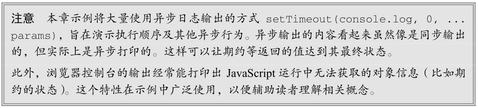

## 异步编程

**同步行为和异步行为的对立统一**是计算机科学的一个基本概念。特别是在 JavaScript 这种**单线程事件循环模型**中，同步操作与异步操作更是代码所要依赖的核心机制。**异步行为是为了优化因计算量大而时间长的操作**。如果**在等待其他操作完成的同时，即使运行其他指令，系统也能保持稳定**，那么这样做就是务实的。

重要的是，异步操作并不一定计算量大或要等很长时间。只要你**不想为等待某个异步操作而阻塞线程执行**，那么任何时候都可以使用。

### 同步与异步

同步行为对应内存中顺序执行的处理器指令。每条指令都会严格按照它们出现的顺序来执行，而每条指令执行后也能立即获得存储在系统本地（如寄存器或系统内存）的信息。这样的执行流程容易分析程序在执行到代码任意位置时的状态（比如变量的值）。

同步操作的例子可以是执行一次简单的数学计算：

~~~javascript
let x = 3;
x = x + 4;
~~~

在程序执行的每一步，都可以推断出程序的状态。这是因为**后面的指令总是在前面的指令完成后才会执行**。等到最后一条指定执行完毕，存储在 x 的值就立即可以使用。

这两行 JavaScript 代码对应的低级指令（从 JavaScript 到 x86）并不难想象。**首先**，操作系统会在栈内存上分配一个存储浮点数值的空间，然后针对这个值做一次数学计算，再把计算结果写回之前分配的内存中。所有这些指令都是在单个线程中按顺序执行的。在低级指令的层面，有充足的工具可以确定系统状态。

相对地，**异步行为**类似于**系统中断**，即当前进程外部的实体可以触发代码执行。异步操作经常是必要的，因为强制进程等待一个长时间的操作通常是不可行的（**同步操作则必须要等**）。如果代码要访问一些**高延迟的资源**，比如向远程服务器发送请求并等待响应，那么就会出现长时间的等待。

异步操作的例子可以是在定时回调中执行一次简单的数学计算：

~~~javascript
let x = 3;
setTimeout(() => x = x + 4, 1000);
~~~

这段程序最终与同步代码执行的任务一样，都是把两个数加在一起，但这一次**执行线程不知道 x 值何时会改变**，因为这取决于**回调何时从消息队列出列并执行**。

异步代码不容易推断。虽然这个例子对应的低级代码最终跟前面的例子没什么区别，但第二个指令块（加操作及赋值操作）是由**系统计时器**触发的，这会生成一个**入队执行的中断**。到底什么时候会触发这个中断，这对 JavaScript 运行时来说是一个黑盒，因此实际上无法预知（尽管可以保证这发生在当前线程的同步代码执行**之后**，否则回调都没有机会出列被执行）。无论如何，在排定回调以后基本没办法知道系统状态何时变化。

为了让后续代码能够使用 x ，异步执行的函数需要在更新 x 的值以后**通知其他代码**。如果程序不需要这个值，那么就只管继续执行，不必等待这个结果了。

设计一个能够知道 x 什么时候可以读取的系统是非常难的。JavaScript 在实现这样一个系统的过程中也经历了几次迭代。

### 以往的异步编程模式

异步行为是 JavaScript 的基础，但以前的实现不理想。在早期的 JavaScript 中，只支持定义回调函数来表明异步操作完成。串联多个异步操作是一个常见的问题，通常需要深度嵌套的回调函数（俗称“回调地狱”）来解决。

假设有以下异步函数，使用了 setTimeout 在一秒钟之后执行某些操作：

~~~javascript
function double(value) {
	setTimeout(() => setTimeout(console.log, 0, value * 2), 1000);
}
double(3);
// 6（大约 1000 毫秒之后）
~~~

这里的代码没什么神秘的，但关键是理解为什么说它是一个异步函数。 `setTimeout`可以定义一个在指定时间之后会被调度执行的回调函数。对这个例子而言，**1000 毫秒之后，JavaScript 运行时会把回调函数推到自己的消息队列上去等待执行**。**推到队列之后**，**回调什么时候出列被执行**对 JavaScript 代码就**完全不可见**了。还有一点， **`double() `**函数在setTimeout成功调度异步操作之后会**立即退出**。

**1.异步返回值**

假设 setTimeout 操作会**返回一个有用的值**。有什么好办法把这个值传给需要它的地方？广泛接受的一个策略是给异步操作**提供一个回调**，这个回调中包含要使用异步返回值的代码（作为**回调的参数**）。

~~~javascript
function double(value, callback) {
	setTimeout(() => callback(value * 2), 1000);
}

double(3, (x) => console.log(`I was given: ${x}`));
// I was given: 6（大约 1000 毫秒之后）
~~~

这里的 setTimeout 调用告诉 JavaScript 运行时在 1000 毫秒之后**把一个函数推到消息队列上**。这个函数会由运行时负责异步调度执行。而**位于函数闭包中的回调及其参数在异步执行时仍然是可用的**。

**2.失败处理**

异步操作的失败处理在回调模型中也要考虑，因此自然就出现了成功回调和失败回调：

~~~javascript
function double(value, success, failure) {
	setTimeout(() => {
		try {
			if (typeof value !== 'number') {
				throw 'Must provide number as first argument';
		}
			success(2 * value);
		} catch (e) {
			failure(e);
		}
	}, 1000);
}
const successCallback = (x) => console.log(`Success: ${x}`);
const failureCallback = (e) => console.log(`Failure: ${e}`);

double(3, successCallback, failureCallback);
double('b', successCallback, failureCallback);
// Success: 6（大约 1000 毫秒之后）
// Failure: Must provide number as first argument（大约 1000 毫秒之后）
~~~

这种模式已经不可取了，因为必须在初始化异步操作时定义回调。异步函数的返回值只在短时间内存在，只有预备好将这个短时间内存在的值作为参数的回调才能接收到它。

**3.嵌套异步回调(回调地狱)**

[四步学会VSCode调试JS与HTML文件](https://juejin.cn/post/6868922819271458823)

如果异步返值又依赖另一个异步返回值，那么回调的情况还会进一步变复杂。在实际的代码中，这就要求**嵌套回调(回调地狱)**：

~~~javascript
function double(value, success, failure) {
	setTimeout(() => {
		try {
			if (typeof value !== 'number') {
				throw 'Must provide number as first argument';
		}
			success(2 * value);
		} catch (e) {
			failure(e);
		}
	}, 1000);
}

const successCallback = (x) => {
	double(x, (y) => console.log(`Success: ${y}`));
};

const failureCallback = (e) => console.log(`Failure: ${e}`);

double(3, successCallback, failureCallback);
// Success: 12 （大约 1000 
~~~

> 这段代码不太好理解，不过我开始学着打断点了，慢慢的就开始懂了。学会代码调试，打断点是真的很重要的啊。

显然，随着代码越来越复杂，**回调策略是不具有扩展性的**。“回调地狱”这个称呼可谓名至实归。嵌套回调的代码维护起来就是噩梦。

## 期约

期约是对尚不存在结果的一个**替身**。期约（promise）这个名字最早是由Daniel Friedman和 David Wise在他们于 1976 年发表的论文“The Impact of Applicative Programming on Multiprocessing”中提出来的。但直到十几年以后，Barbara Liskov 和 Liuba Shrira 在 1988 年发表了论文“Promises: Linguistic Support for Efficient Asynchronous Procedure Calls in Distributed Systems”，这个概念才真正确立下来。同一时期的计算机科学家还使用了“终局”（eventual）、“期许”（future）、“延迟”（delay）和“迟付”（deferred）等术语指代同样的概念。**所有这些概念描述的都是一种异步程序执行的机制**。

### Promises/A+规范

早期的期约机制在 jQuery 和 Dojo 中是以 Deferred API 的形式出现的。到了 2010 年，**CommonJS项目**实现的 Promises/A 规范日益流行起来。Q 和 Bluebird 等第三方 JavaScript 期约库也越来越得到社区认可，虽然这些库的实现多少都有些不同。为弥合现有实现之间的差异，2012年Promises/A+组织分叉（fork）了 CommonJS 的 Promises/A 建议，并以相同的名字制定了Promises/A+规范。这个规范最终成为了ECMAScript 6规范实现的范本。

**ECMAScript 6 增加了对 Promises/A+规范的完善支持，即 Promise 类型**。一经推出， Promise 就大受欢迎，成为了主导性的异步编程机制。所有现代浏览器都支持 ES6 期约，很多其他浏览器 API（如**fetch()** 和 Battery Status API）也以期约为基础。

### 期约基础

[深入理解定时器系列第一篇——理解setTimeout和setInterval](https://www.cnblogs.com/xiaohuochai/p/5773183.html)

ECMAScript 6 新增的引用类型 Promise ，可以**通过new 操作符来实例化**。创建新期约时需要传入**执行器（executor）函数作为参数**（后面马上会介绍），下面的例子使用了一个**空函数**对象来应付一下解释器：

~~~javascript
let p = new Promise(() => {});
setTimeout(console.log, 0, p); // Promise <pending>
~~~

之所以说是**应付解释器**，是因为如果不提供执行器函数，就会抛出 SyntaxError 。

**1.期约状态机**

在把一个期约实例传给 console.log() 时，控制台输出（可能因浏览器不同而略有差异）表明该实例处于待定（pending）状态。如前所述，期约是一个有状态的对象，可能处于如下 3 种状态之一：

* **待定**（pending）
* **兑现**（fulfilled，有时候也称为“解决”，**resolved**）
*  **拒绝**（rejected）

**待定**（pending）是**期约的最初始状态**。在待定状态下，期约可以**落定**（settled）为代表成功的**兑现**（fulfilled）状态，或者代表失败的**拒绝**（rejected）状态。无论落定为哪种状态都是**不可逆的**。**只要从待定转换为兑现或拒绝，期约的状态就不再改变**。而且，**也不能保证期约必然会脱离待定状态**。因此，组织合理的代码无论期约解决（resolve）还是拒绝（reject），**甚至永远处于待定（pending）状态**，都应该具有恰当的行为。

重要的是，**期约的状态是私有的**，不能直接通过 JavaScript 检测到。这主要是为了**避免根据读取到的期约状态，以同步方式处理期约对象**。另外，期约的状态也不能被外部 JavaScript 代码修改。这与不能读取该状态的原因是一样的：**期约故意将异步行为封装起来，从而隔离外部的同步代码**。

**2.解决值、拒绝理由及期约用例**

期约主要有两大用途。**首先**是抽象地表示一个异步操作。期约的状态代表期约是否完成。**“待定”**表示尚未开始或者正在执行中。**“兑现”**表示已经成功完成，而**“拒绝”**则表示没有成功完成。

某些情况下，这个**状态机**就是期约可以提供的最有用的信息。**知道一段异步代码已经完成，对于其他代码而言已经足够了**。比如，假设期约要向服务器发送一个 HTTP 请求。请求返回 200~299 范围内的状态码就足以让期约的状态变为“兑现”。类似地，如果请求返回的状态码不在 200~299 这个范围内，那么就会把期约状态切换为“拒绝”。

在另外一些情况下，**期约封装的异步操作会实际生成某个值**，而程序期待期约状态改变时可以访问这个值。相应地，如果期约被拒绝，程序就会期待期约状态改变时可以拿到拒绝的理由。比如，假设期约向服务器发送一个 HTTP 请求并预定会返回一个 JSON。如果请求返回范围在 200~299 的状态码，则足以让期约的状态变为兑现。此时期约内部就可以收到一个 JSON 字符串。类似地，如果请求返回的状态码不在 200~299 这个范围内，那么就会把期约状态切换为拒绝。此时拒绝的理由可能是一个 Error对象，包含着 HTTP 状态码及相关错误消息。

为了支持这两种用例，每个期约只要状态切换为兑现，就会有一个私有的内部**值（value）**。类似地，每个期约只要状态切换为拒绝，就会有一个私有的内部**理由（reason）**。**无论是值还是理由，都是包含原始值或对象的不可修改的引用。二者都是可选的，而且默认值为 undefined** 。在期约到达某个落定状态时执行的异步代码始终会收到这个值或理由。

**3.通过执行函数控制期约状态**

由于期约的状态是私有的，所以**只能在内部进行操作**。**内部操作在期约的执行器函数中完成**。执行器函数主要有**两项职责**：**初始化期约的异步行为和控制状态的最终转换**。其中，**控制期约状态的转换**是通过调用它的两个函数参数实现的。这两个函数参数通常都命名为`resolve()`和`reject()`。调用`resolve()`会把状态切换为兑现，调用 `reject()`会把状态切换为拒绝。另外，调用`reject()`也会抛出错误（后面会讨论这个错误）。

~~~javascript
let p1 = new Promise((resolve, reject) => resolve());
setTimeout(console.log, 0, p1); 
// 书上显示结果是Promise <resolved>
// 但是我实际显示的是Promise { <fulfilled>:undefined }！！！

let p2 = new Promise((resolve, reject) => reject());
setTimeout(console.log, 0, p2); // Promise <rejected>
// Uncaught error (in promise)
~~~

在前面的例子中，并没有什么异步操作，因为在初始化期约时，执行器函数已经改变了每个期约的状态。这里的关键在于，执行器函数是同步执行的。这是因为执行器函数是期约的初始化程序。通过下面的例子可以看出上面代码的执行顺序：

~~~javascript
new Promise(() => setTimeout(console.log, 0, 'executor'));
setTimeout(console.log, 0, 'promise initialized');

// executor
// promise initialized
~~~

添加 setTimeout 可以推迟切换状态：

~~~javascript
let p = new Promise((resolve, reject) => setTimeout(resolve, 1000));

// 在 console.log 打印期约实例的时候，还不会执行超时回调（即 resolve()）
setTimeout(console.log, 0, p); // Promise <pending>
~~~

无论`resolve()`和`reject()`中的哪个被调用，状态转换都不可撤销了。于是继续修改状态会静默失败，如下所示：

~~~javascript
let p = new Promise((resolve, reject) => {
	resolve();
	reject(); // 没有效果
});

setTimeout(console.log, 0, p); // Promise <resolved>
~~~

为避免期约卡在待定状态，可以添加一个定时退出功能。比如，可以通过 setTimeout 设置一个10 秒钟后无论如何都会拒绝期约的回调：

~~~javascript
let p = new Promise((resolve, reject) => {
	setTimeout(reject, 10000); // 10 秒后调用 reject()
	// 执行函数的逻辑
});

setTimeout(console.log, 0, p); // Promise <pending>
setTimeout(console.log, 11000, p); // 11 秒后再检查状态

// (After 10 seconds) Uncaught error
// (After 11 seconds) Promise <rejected>
~~~

因为**期约的状态只能改变一次**，所以**这里的超时拒绝逻辑中可以放心地设置让期约处于待定状态的最长时间**。如果**执行器中的代码在超时之前已经解决或拒绝，那么超时回调再尝试拒绝也会静默失败**。

**4.Promise.resolve()**

[幂等](https://baike.baidu.com/item/%E5%B9%82%E7%AD%89)

期约并非一开始就必须处于待定状态，然后通过执行器函数才能转换为落定状态。通过调用
Promise.resolve() 静态方法，可以实例化一个解决的期约。下面两个期约实例实际上是一样的：

这个解决的期约的值对应着传给 Promise.resolve() 的第一个参数。使用这个静态方法，实际上可以把任何值都转换为一个期约：

~~~javascript
setTimeout(console.log, 0, Promise.resolve())
// Promise <resolved>: undefined
setTimeout(console.log, 0, Promise.resolve(3))
// Promise <resolved>: 3
// 多余的参数会忽略
setTimeout(console.log, 0, Promise.resolve(4, 5, 6))
// Promise <resolved>: 4
~~~

对这个静态方法而言，如果**传入的参数本身是一个期约**，那它的行为就类似于一个**空包装**。因此，
`Promise.resolve()`可以说是一个**幂等方法**(无论多次执行，其结果都是一样的)，如下所示：

~~~javascript
let p = Promise.resolve(7);
setTimeout(console.log, 0, p === Promise.resolve(p));
// true
setTimeout(console.log, 0, p === Promise.resolve(Promise.resolve(p)));
// true
~~~

这个幂等性会保留传入期约的状态：

~~~javascript
let p = new Promise(() => {});
setTimeout(console.log, 0, p); // Promise <pending>
setTimeout(console.log, 0, Promise.resolve(p)); // Promise <pending>
setTimeout(console.log, 0, p === Promise.resolve(p)); // true
~~~

注意，**这个静态方法能够包装任何非期约值，包括错误对象，并将其转换为解决的期约**。因此，也可能导致不符合预期的行为：

~~~javascript
let p = Promise.resolve(new Error('foo'));
setTimeout(console.log, 0, p);
// Promise <resolved>: Error: foo
~~~

**5.  Promise.reject()**

与`Promise.resolve()`类似， Promise.reject() 会实例化一个拒绝的期约并抛出一个异步错误
（这个错误不能通过 try / catch 捕获，而只能通过拒绝处理程序捕获）。下面的两个期约实例实际上是
一样的：

~~~javascript
let p1 = new Promise((resolve, reject) => reject());
let p2 = Promise.reject();
~~~

这个拒绝的期约的理由就是**传给`Promise.reject()`的第一个参数**。这个参数也会传给后续的拒绝处理程序：

~~~javascript
let p = Promise.reject(3);
setTimeout(console.log, 0, p); // Promise <rejected>: 3
p.then(null, (e) => setTimeout(console.log, 0, e)); // 3
~~~

关键在于， **`Promise.reject()`并没有照搬`Promise.resolve()`的幂等逻辑**。如果给它传一个期约对象，则这个期约会成为它返回的拒绝期约的理由：

~~~javascript
setTimeout(console.log, 0, Promise.reject(Promise.resolve()));
// Promise <rejected>: Promise <resolved>
~~~

**6.同步/异步执行的二元性**

Promise 的设计很大程度上会导致一种完全不同于 JavaScript 的计算模式。下面的例子完美地展示了这一点，其中包含了两种模式下抛出错误的情形：

第一个 try / catch 抛出并捕获了错误，第二个 try / catch 抛出错误却没有捕获到。乍一看这可能
有点违反直觉，因为代码中确实是同步创建了一个拒绝的期约实例，而这个实例也抛出了包含拒绝理由
的错误。这里的同步代码之所以没有捕获期约抛出的错误，是因为它没有通过异步模式捕获错误。从这
里就可以看出期约真正的异步特性：它们是同步对象（在同步执行模式中使用），但也是异步执行模式的媒介。

在前面的例子中，拒绝期约的错误并没有抛到执行同步代码的线程里，而是通过浏览器异步消息队
列来处理的。因此， try / catch 块并不能捕获该错误。代码一旦开始以异步模式执行，则唯一与之交互
的方式就是使用异步结构——更具体地说，就是期约的方法。

### 期约的实例方法

期约实例的方法是连接外部同步代码与内部异步代码之间的桥梁。这些方法可以访问异步操作返回
的数据，处理期约成功和失败的结果，连续对期约求值，或者添加只有期约进入终止状态时才会执行的代码。

**1.实现 Thenable 接口**

在 ECMAScript 暴露的异步结构中，任何对象都有一个`then()`方法。这个方法被认为实现了
Thenable 接口。下面的例子展示了实现这一接口的最简单的类：

~~~javascript
class MyThenable {
	then() {}
}
~~~

ECMAScript 的 Promise 类型实现了 Thenable 接口。这个简化的接口跟 TypeScript 或其他包中的
接口或类型定义不同，它们都设定了 Thenable 接口更具体的形式。

> 注意：本章后面再介绍异步函数时还会再谈到 Thenable 接口的用途和目的。

**2.Promise.prototype.then()**

Promise.prototype.then() 是为期约实例添加处理程序的主要方法。这个`then()`方法接收最多两个参数： **onResolved 处理程序**和**onRejected处理程序**。这两个参数都是可选的，如果提供的话，
则会在期约分别进入“兑现”和“拒绝”状态时执行。

# 第12章：BOM

/30.png)

虽然 ECMAScript 把浏览器对象模型（BOM，Browser Object Model）描述为 JavaScript 的核心，但
实际上 BOM 是使用 JavaScript 开发 Web应用程序的核心。BOM 提供了与网页无关的浏览器功能对象。
多年来，BOM 是在缺乏规范的背景下发展起来的，因此既充满乐趣又问题多多。毕竟，浏览器开发商
都按照自己的意愿来为它添砖加瓦。最终，浏览器实现之间共通的部分成为了事实标准，为 Web 开发
提供了浏览器间互操作的基础。HTML5 规范中有一部分涵盖了 BOM 的主要内容，因为 W3C 希望将
JavaScript 在浏览器中最基础的部分标准化。

## window 对象

BOM 的核心是 window 对象，表示浏览器的实例。 window 对象在浏览器中有两重身份，一个是
ECMAScript 中的 Global 对象，另一个就是浏览器窗口的 JavaScript 接口。这意味着网页中定义的所有
对象、变量和函数都以 window 作为其 Global 对象，都可以访问其上定义的 parseInt() 等全局方法。

/31.png)

### Global 作用域

因为 window 对象被复用为 ECMAScript 的 Global 对象，所以通过 var 声明的所有全局变量和函
数都会变成 window 对象的属性和方法。比如：

~~~javascript
var age = 29;
var sayAge = () => alert(this.age);
alert(window.age); // 29
sayAge(); // 29
window.sayAge(); // 29
~~~

这里，变量 age 和函数 sayAge() 被定义在全局作用域中，它们自动成为了 window 对象的成员。
因此，变量 age 可以通过 window.age 来访问，而函数 sayAge() 也可以通过 window.sayAge() 来访问。
因为 sayAge() 存在于全局作用域， this.age 映射到 window.age ，所以就可以显示正确的结果了。

如果在这里使用 let 或 const 替代 var ，则不会把变量添加给全局对象：

~~~javascript
let age = 29;
const sayAge = () => alert(this.age);
alert(window.age); // undefined
sayAge(); // undefined
window.sayAge(); // TypeError: window.sayAge is not a function
~~~

另外，访问未声明的变量会抛出错误，但是可以在 window 对象上查询是否存在可能未声明的变量。
比如：

~~~javascript
// 这会导致抛出错误，因为 oldValue 没有声明
var newValue = oldValue;
// 这不会抛出错误，因为这里是属性查询
// newValue 会被设置为 undefined
var newValue = window.oldValue;
~~~

记住，JavaScript 中有很多对象都暴露在全局作用域中，比如 location 和 navigator （本章后面
都会讨论），因而它们也是 window 对象的属性。

### 窗口关系

top 对象始终指向最上层（最外层）窗口，即浏览器窗口本身。而 parent 对象则始终指向当前窗
口的父窗口。如果当前窗口是最上层窗口，则 parent 等于 top （都等于 window ）。最上层的 window
如果不是通过 window.open() 打开的，那么其 name 属性就不会包含值，本章后面会讨论。

还有一个 self 对象，它是终极 window 属性，始终会指向 window 。实际上， self 和 window 就
是同一个对象。之所以还要暴露 self ，就是为了和 top 、 parent 保持一致。

这些属性都是 window 对象的属性，因此访问 window.parent 、 window.top 和 window.self
都可以。这意味着可以把访问多个窗口的 window 对象串联起来，比如 window.parent.parent 。

### 窗口位置与像素比

window 对象的位置可以通过不同的属性和方法来确定。现代浏览器提供了 screenLeft 和
screenTop 属性，用于表示窗口相对于屏幕左侧和顶部的位置 ，返回值的单位是 CSS 像素。

可以使用 moveTo() 和 moveBy() 方法移动窗口。这两个方法都接收两个参数，其中 moveTo() 接
收要移动到的新位置的绝对坐标 x 和 y；而 moveBy() 则接收相对当前位置在两个方向上移动的像素数。
比如：

~~~javascript
// 把窗口移动到左上角
window.moveTo(0,0);
// 把窗口向下移动 100 像素
window.moveBy(0, 100);
// 把窗口移动到坐标位置(200, 300)
window.moveTo(200, 300);
// 把窗口向左移动 50 像素
window.moveBy(-50, 0);
~~~

依浏览器而定，以上方法可能会被部分或全部禁用。

**像素比**

CSS 像素是 Web 开发中使用的统一像素单位。这个单位的背后其实是一个角度：0.0213°。如果屏
幕距离人眼是一臂长，则以这个角度计算的 CSS 像素大小约为 1/96 英寸。这样定义像素大小是为了在
不同设备上统一标准。比如，低分辨率平板设备上 12 像素（CSS 像素）的文字应该与高清 4K 屏幕下
12 像素（CSS 像素）的文字具有相同大小。这就带来了一个问题，不同像素密度的屏幕下就会有不同的
缩放系数，以便把物理像素（屏幕实际的分辨率）转换为 CSS 像素（浏览器报告的虚拟分辨率）。

举个例子，手机屏幕的物理分辨率可能是 1920×1080，但因为其像素可能非常小，所以浏览器就需
要将其分辨率降为较低的逻辑分辨率，比如 640×320。这个物理像素与 CSS 像素之间的转换比率由
window.devicePixelRatio 属性提供。对于分辨率从 1920×1080 转换为 640×320 的设备， window.
devicePixelRatio 的值就是 3。这样一来，12 像素（CSS 像素）的文字实际上就会用 36 像素的物理
像素来显示。

window.devicePixelRatio 实际上与每英寸像素数（DPI，dots per inch）是对应的。DPI 表示单
位像素密度，而 window.devicePixelRatio 表示物理像素与逻辑像素之间的缩放系数。

### 窗口大小

