(注1：现在是2020年4月7日，这本书对我来书还太难，现在挑着看，先把this部分看完吧)

(注2：现在是2020年4月8日，开始朦朦胧胧对于作用域有了一个比较模糊的印象了，对于this的理解本质上就是对作用域理解深度的一次检验。函数从上而下密密麻麻的代码，各自用大括号括起来，以此为疆界，如同一个一个的城邦，城邦之间要进行互通与外交，就需要用到使者传递信息)

(注3:现在是2020年7月9日，主要精力还是复习DOM之类的，但是之后就要开始复习JS基础语法和以前就没搞清楚的概念了，这个JS基本功是重中之重，一定要花大力气去透彻学懂，起码花的时间不能比学框架(比如Vue)的时间短！！！这本书挺好的，看的很吃力，这就对了，一定要把这本书给吃透啊！)

(注4：现在是2020年7月14日，越来越觉得这本书(上中下三册)很重要了，一定要认真看，这就相当于浓缩版的JS知识难点了，和我写的另一篇博客《学习JavaScript遇到的瓶颈之概念》可以比对着看，看透了，JS基本上也就没有什么大问题了，这个是根基，重要成都不亚于框架的学习，一定要重视。这本书学好了感觉框架就不会太难学了。还有一本阮一峰的《ES6标准入门也要好好看》，看这些书要比看那些乱七八糟的公众号效果要更好，他们也是从书里面东抄西抄的)

(注5：现在是2020年9月21日，学前端不知不觉已经一年了，进度说实话确实缓慢，感觉现在自己好像遇到了一个瓶颈了，目前进度上学感觉学的七七八八了，现在主要开始学习Vue和ES6这些了，但是实际项目是一个也没有做，代码敲的也不多，基础知识掌握的也不算扎实，距离明年3月份也就只有半年的时间了，自己真的要加油啊。)

(注6：现在是2020年10月12日，我觉得现在时机成熟了，可以重新看这本书了。)

(注7：现在是2020年11月03日，我对`this`还是不熟啊！！)

(注8：现在是2021年9月1日，我在准备面试题`let ,const,var`的区别的时候，又一次回过头来看这本书了。)

# 前言

在互联网发展的早期，JavaScript就已经成为了**支撑网页内容交互体验的基础技术**。那时JavaScript的作用可能仅仅是生成一些闪烁的鼠标轨迹或者烦人的弹出窗口，但是经过了大约**20年的发展**，JavaScript的技术和能力都发生了天翻地覆的变化，现在的JavaScript毫无疑问已经成为了世界上使用范围最广的软件平台---**互联网**---的核心技术。

但是作为一个语言来说，它总是成为大家批评的对象，部分原因是它有很多**历史遗留问题**，但主要原因是它的**设计哲学**有问题。就像Brendan Eich曾经说过的，JavaScript甚至连名字都给人一种“蠢弟弟”的感觉，就像是它更成熟的大哥Java的不完整版本。不过名字只不过是**营销策略**上的一个意外，这两个语言有许多本质上的区别。

**JavaScript和Java的关系，就像Carnival(嘉年华)和Car(汽车)的关系一样，八竿子打不着。**

JavaScript**借鉴了许多语言的概念和语法**，比如C风格的**过程式编程**以及不太明显的scheme/List风格的**函数式编程**，因此吸引了许多开发者，甚至是那些不会编程的新手。用JavaScript来编写"Hello World"是非常简单的，因此这门语言很有吸引力并且很好上手。

虽然JavaScript可能是最早出现的语言之一，但是由于其本身的特殊性，相比其他语言，能真正掌握JavaScript的人比较少。如果想用C、C++这样的语言编写功能全面的程序，那需要对语言有很深的了解。但是对于JavaScript来说，编写功能全面的程序仅仅是冰山一角。

JavaScript语言本质上有许多复杂的概念，但是却用一种看起来比较简单的方式体现出来，比如**回调函数**，因此JavaScript开发者通常只是简单地使用这些特性，**并不会关心语言内部的实现原理**。

JavaScript既是一门充满吸引力、简单易用的语言，又是一门具有许多复杂微妙技术的语言，即使是经验丰富的JavaScript开发者，如果没有认真学习的话也无法真正理解它们。

这就是JavaScript的矛盾之处，也是这门语言的阿喀琉斯之踵。**由于JavaScript不必理解就可以使用，因此通常来说很难真正理解语言本身，这就是我们面临的挑战**。

> 指某人或某事物的最大或者唯一弱点，即罩门关键所在。——译者注

# 使命

如果每次遇到JavaScript中**出乎意料的行为**时，你的反应就是把它加入黑名单(很多人都是这么做的)，那用不了多久你就会把JavaScript语言真正的多样性全部排除。

剩下的部分就是非常著名的“好的部分”(Good Parts)，但是亲爱的读者们，我恳请你们把它称作“简单的部分”、“安全的部分”甚至“不完整的部分”。

“你不知道的JavaScript"系列丛书要做的事恰好相反：**学习并且深入理解整个JavaScript，尤其是那些“难的部分”。**

在本书中，我们要直面当前JavaScript开发者不求甚解的大趋势，他们往往不会深入理解语言内部的机制，遇到困难就会退缩。我们要做的恰好相反，**不是退缩，而是继续前进**。

你们应当像我一样，不满足于只是让代码正常工作，而是想要弄清楚“为什么”。**我希望你能勇于挑战这条崎岖颠簸的“少有人走的路”，拥抱整个JavaScript，掌握了这些知识之后，无论什么技术、框架和流行词语你都能轻松理解。**

这个系列中的每本书专注于语言中一个最容易被误解或者最难理解的核心部分，进行深人、详尽的介绍。在阅读本书时，你应当审视自己对于JavaScript的理解，**仔细思考书中讲解的理论和那些“你需要知道”的东西**。

现在你所理解的JavaScript很可能是从别人那里学来的不完整版。这样的JavaScript只是真正的JavaScript的影子。学完这个系列之后，你就会掌握真正的JavaScript，读下去吧，我的朋友，JavaScript恭候你的光临。

# 小结

JavaScript非常特殊，只学一部分的话非常简单，但是想要**完整地学习会很难**(**就算学到够用也不容易**)。当开发者感到迷惑时，他们通常会责怪语言本身，而不是怪自己对语言缺乏了解。这个系列就是为了解决这个问题，**让你打心眼儿里欣赏这门语言**。

/15.png)

> 2020年10月12日，截止到这里看完。

# 第一部分：作用域和闭包

# 序

小时候，我特别喜欢把东西拆成零部件，然后再重新装回去-旧的移动电话、立体声音响等我能拿到的一切物件都没能幸免。对于年幼的我来说，使用这些东西还为时过早，但是一旦它们坏了，我就立刻想弄清楚它们的工作原理。

记得有一次，我看见一个老式收音机的电路板，其中有一个缠满铜线的奇怪长管。我不知道这个长管的用途，所以立刻开始研究它。它有什么用？为什么出现在收音机里？为什么它看起来和电路板的其他部分不一样？为什么会有铜线缠绕着它？如果我把铜线拆下来会发生什么？现在我知道了，这是一个在晶体管收音机中很常见的、由缠绕着铜线的铁氧体棒制成的环形天线。

你是否也曾对解答各种各样的为什么很上瘾？大多数孩子都会。事实上，这可能是孩子身上我最喜欢的地方---**求知欲很强**。

很遗憾，**现在我从事着一份专业性的工作，并以制作一些东西来度日**。而我儿时的梦想是有一天能够制作那些被我拆开过的东西。当然，现在我所制作的大部分东西都是用JavaScript做成的，而不是铁氧体棒······但它们很相似！**尽管我曾经一度非常热爱制作东西，但是现在却更渴望了解事物的运行原理**。**我经常寻找解决问题或修复bug的最佳方法，却很少花时间来研究我所使用的工具**。

这也是为什么我一看到“你不知道的JavaScript"系列图书就很激动，因为JavaScript的确有很多我不了解的地方。我每天从早到晚都在使用JavaScript，并且已经持续了好几年，但我真的了解它了吗？答案是否定的。当然，我了解它的很多细节，并且经常阅读标准文档和邮件列表中的内容，但是了解的程度低于我内心那个六岁的孩子希望我达到的水平。

第一部分“作用域和闭包”是一个非常好的切入点。它对于如我一般的受众来说非常有用(希望对你也同样有用)，这本书并不会教你如何使用JavaScript，但是**它会让你意识到对于其内部的运行原理你可能了解得并不多**。同时这本书出现的时机也非常巧：**ES6终于稳定下来了**，并且各家浏览器的实现工作也正在逐步展开。如果你还没有学习其中的新功能(比如let和const)，这本书将起到很好的介绍作用。

所以我希望你能喜欢这本书，尤其希望Kyle对JavaScript工作原理每一个细节的批判性思考会渗透到你的思考过程和日常工作中。**知其然，也要知其所以然**。

> 这本书要是弄的通透了，我敢说，我的Javascript肯定可以达到中级水平的。
>
> 这个确实是一本好书。

# 第1章：作用域是什么

[深入理解JavaScript作用域和作用域链](https://segmentfault.com/a/1190000018513150)

几乎所有编程语言最基本的功能之一，就是能够**储存变量当中的值**，并且能在之后**对这个值进行访问或修改**。事实上，正是这种**储存和访问变量的值**的能力将**状态**带给了程序。

若没有了**状态**这个概念，程序虽然也能够执行一些简单的任务，但它会受到高度限制，做不到非常有趣。

但是将变量引入程序会引起几个很有意思的问题，也正是我们将要讨论的：这些变量**住在哪里**？换句话说，它们**储存在哪里**？最重要的是，程序需要时**如何找到它们**？

这些问题说明**需要一套设计良好的规则来存储变量，并且之后可以方便地找到这些变量。这套规则被称为作用域。**

但是，究竟在哪里而且怎样设置这些作用域的规则呢？

## 编译原理

[编译原理学了有什么用？](https://www.zhihu.com/question/21755487)

> 我去下载了一下《编译原理》这本书，有630页，又是一本大部头的书，里面的内容也很晦涩，以我现在的水平实在是没办法去阅读，但是我还是大体看看吧，写一篇博文吧。

尽管通常将JavaScript归类为“动态”或“解释执行”语言，但事实上它是一门**编译语言**。这个事实对你来说可能显而易见，也可能你闻所未闻，取决于你接触过多少编程语言，具有多少经验。但与**传统的编译语言**不同，它**不是提前编译的**，编译结果也不能在分布式系统中进行移植。

尽管如此，**Javascript引擎进行编译的步骤和传统的编译语言非常相似**，在某些环节可能比预想的要复杂。

在**传统**编译语言的流程中，程序中的**一段源代码**在**执行之前**会经历三个步骤，统称为“**编译**”。

* **分词**/词法分析(Tokenizing/Lexing)

这个过程会将由字符组成的字符串**分解**成(对编程语言来说)有意义的**代码块**，这些代码块被称为**词法单元**(token)。例如，考虑程序`var a = 2;`，这段程序通常会被分解成为下面这些词法单元：`var`、`a`、`=`、`2`、`；`。**空格是否会被当作词法单元，取决于空格在这门语言中是否具有意义**。

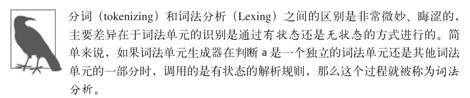

* **解析**/语法分析(Parsing)

这个过程是将词法单元流(数组)转换成一个由元素逐级嵌套所组成的代表了程序语法结构的树。这个树被称为“**抽象语法树**"(Abstract Syntax Tree，**AST**)。`var a =2;`的抽象语法树中可能会有一个叫作`VariableDeclaration`的**顶级节点**，接下来是一个叫作`Identifier`(它的值是a)的子节点，以及一个叫作`AssignmentExpression`的子节点。`AssignmentExpression`节点有一个叫作`NumericLiteral`(它的值是2)的子节点。

* **代码生成**

将**AST**转换为**可执行代码**的过程称被称为代码生成。这个过程与语言、目标平台等息息相关。

抛开具体细节，简单来说就是有某种方法可以将`var a = 2;`的AST转化为一组机器指令，用来创建一个叫作a的变量(**包括分配内存**等)，并将一个值储存在a中。

**比起那些编译过程只有三个步骤的语言的编译器，JavaScript引擎要复杂得多**。例如，在语法分析和代码生成阶段有特定的步骤来对运行性能进行优化，包括对冗余元素进行优化等。

因此在这里只进行**宏观、简单的介绍**，接下来你就会发现我们介绍的这些看起来有点高深的内容与所要讨论的事情有什么关联。

> 《编译原理》的确是难，但是也绝对值得花时间去学习。

首先，JavaScript引擎不会有大量的(像其他语言编译器那么多的)时间用来进行**优化**，因为与其他语言不同，JavaScript的**编译过程不是发生在构建之前**的。

对于JavaScript来说，大部分情况下**编译发生在代码执行前的几微秒(甚至更短！)的时间内**。在我们所要讨论的作用域背后，JavaScript引擎用尽了各种办法(比如JIT，可以延迟编译甚至实施重编译)来保证性能最佳。

简单地说，**任何JavaScript代码片段在执行前都要进行编译(通常就在执行前)**。因此，**JavaScript编译器首先会对`var a =  2;`这段程序进行编译，然后做好执行它的准备，并且通常马上就会执行它。**

> 现在是2020年10月12日，截止到这里复习完。

## 理解作用域

我们学习作用域的方式是将这个过程模拟成几个人物之间的对话。那么，由谁进行这场对话呢？

### 演员表

首先介绍将要参与到对程序`var a = 2;` 进行处理的过程中的演员们，这样才能理解接下来将要听到的对话。

* **引擎(发动机)**

  从头到尾负责整个JavaScript程序的**编译及执行**过程。

  > 代码如同汽油，引擎(发动机)通过燃烧汽油给汽车(浏览器)提供动力。

* **编译器**

  引擎的好朋友之一，负责**语法分析**及**代码生成**等脏活累活(详见前一节的内容)。

* **作用域**

  引擎的另一位好朋友，**负责收集并维护由所有声明的标识符(变量)组成的一系列查询**，并实施一套非常严格的**规则**，确定当前执行的代码对这些标识符的**访问权限**。

为了能够完全理解Javascript的工作原理，你需要开始像引擎(和它的朋友们)一样思考，从它们的角度提出问题，并从它们的角度回答这些问题。

### 对话

当你看见`var a = 2;`这段程序时，很可能认为这是一句**声明**。但我们的新朋友引擎却不这么看。事实上，引擎认为**这里有两个完全不同的声明**，**一个**由编译器在编译时处理，**另一个**则由引擎在运行时处理。

下面我们将`var a = 2;`分解，看看引擎和它的朋友们是如何协同工作的。

**编译器**首先会将这段程序分解成**词法单元(分解)**，然后将词法单元解析成一个**树结构(抽象语法树)**。但是当编译器开始进行**代码生成**时，它对这段程序的处理方式会和预期的有所不同。

可以合理地假设编译器所产生的代码能够用下面的伪代码进行概括：“**为一个变量分配内存，将其命名为a，然后将值2保存进这个变量**。”然而，这**并不完全正确**。

事实上编译器会进行如下处理。

* 遇到`var a`，**编译器**会询问**作用域是否已经有一个该名称的变量存在于同一个作用域的集合中**。如果是，编译器会忽略该声明，继续进行编译；否则它会要求作用域在当前作用域的集合中声明一个新的变量，并命名为a。
* 接下来**编译器**会为引擎**生成运行时所需的代码**，这些代码被用来处理`a = 2`这个赋值操作。引擎运行时会**首先询问作用域**，在当前的作用域集合中是否存在一个叫作a的变量。如果是，引擎就会使用这个变量；如果否，引擎会继续查找该变量(查看1.3节)。

* 如果引擎最终找到了a变量，就会将2赋值给它。否则引擎就会举手示意并抛出一个异常！

总结：**变量的赋值操作会执行两个动作**，**首先**编译器会在当前作用域中声明一个变量(如果之前没有声明过)，**然后**在运行时引擎会在作用域中查找该变量，如果能够找到就会对它赋值。

### 编译器有话说

为了进一步理解，我们需要多介绍一点编器的术语。

**编译器在编译过程的第二步中生成了代码**，引擎执行它时，会通过查找变量a来判断它是否已声明过。**查找的过程由作用域进行协助**，但是引擎执行怎样的查找，会影响最终的查找结果。

在我们的例子中，引擎会为变量a进行**LHS查询**。另外一个查找的类型叫作**RHS**。

我打赌你一定能猜到“L”和"R"的含义，它们分别代表左侧和右侧。

什么东西的左侧和右侧？是一个赋值操作的左侧和右侧。

换句话说，**当变量出现在赋值操作的左侧时进行LHS查询，出现在右侧时进行RHS查询**。

讲得更准确一点，**RHS查询与简单地查找某个变量的值别无二致，而LHS查询则是试图找到变量的容器本身，从而可以对其赋值**。从这个角度说，RHS并不是真正意义上的“赋值操作的右侧”，更准确地说是“**非左侧**"。

你可以将RHS理解成retrieve his source value(取到它的源值)，这意味着“得到某某的值"。

让我们继续深入研究。

考虑以下代码：

~~~javascript
console.log(a);
~~~

其中**对a的引用**是一个**RHS引用**，因为**这里a并没有赋予任何值**。相应地，需要查找并取得a的值，这样才能将值传递给console.log(..)。

相比之下，例如：

~~~javascript
a = 2;
~~~

这里**对a的引用则是LHS引用**，因为**实际上我们并不关心当前的值是什么**，只是想要为 `= 2`这个赋值操作找到一个目标。

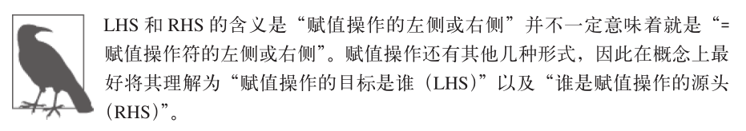

考虑下面的程序，**其中既有LHS也有RHS引用**：

~~~javascript
function foo(a) {
	console.log(a); //2
}
foo(2);
~~~

最后一行**foo(..)函数的调用**需要**对foo进行RHS引用**，意味着“**去找到foo的值，并把它给我”**。并且**(..)意味着foo的值需要被执行，因此它最好真的是一个函数类型的值**！

这里还有一个容易被忽略却非常重要的细节。

代码中**隐式**的`a = 2`操作可能很容易被你忽略掉。**这个操作发生在2被当作参数传递给fool(..)函数时**，**2会被分配给参数a**。为了给参数a(隐式地)分配值，需要进行一次**LHS查询**。

这里还有**对a进行的RHS引用**，并且将得到的值传给了`console.log(..)`。**`console.log(..)`本身也需要一个引用才能执行**，因此会对**console对象进行RHS查询**，并且**检查得到的值中是否有一个叫作log的方法**。

最后，在概念上可以理解为在LHS和RHS之间通过**对值2进行交互来将其传递进log(..)**(通过变量a的**RHS查询**)。**假设在log(..)函数的原生实现中它可以接受参数，在将2赋值给其中第一个(也许叫作arg1)参数之前，这个参数需要进行LHS引用查询。**

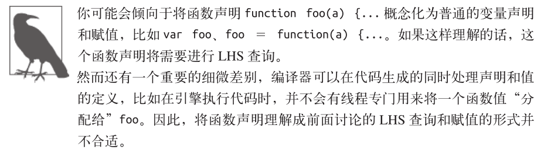

### 引擎和作用域的对话

~~~javascript
function foo(a) {
	console.log(a ); //2
}
foo(2 );
~~~

让我们把上面这段代码的处理过程想象成一段对话，这段对话可能是下面这样的。

> 引擎：我说**作用域**，我需要**为foo进行RHS引用**。你见过它吗？
>
> 作用域：别说，我还真见过，**编译器**那小子刚刚**声明**了它。它是一个**函数**，给你。
>
> 引擎：哥们太够意思了！好吧，我来执行一下foo。
>
> 引擎：作用域，还有个事儿。我需要**为a进行LHS引用**，这个你见过吗？
>
> 作用域：这个也见过，编译器最近把它**声名为foo的一个形式参数**了，拿去吧。
>
> 引擎：大恩不言谢，你总是这么棒。现在我要**把2赋值给a**。
>
> 引擎：哥们，不好意思又来打扰你。我要为console进行RHS引用，你见过它吗？
>
> 作用域：咱俩谁跟谁啊，再说我就是干这个。这个我也有，**console是个内置对象**
> ,给你。
>
> 引擎：么么哒。我得看看这里面是不是有log(..)。太好了，找到了，是一个函数。
>
> 引擎：哥们，能帮我再找一下**对a的RHS引用**吗？虽然我记得它，但想再确认一次。
>
> 作用域：放心吧，这个变量没有变动过，拿走，不谢。
>
> 引擎：真棒。我来把a的值，也就是2，传递进log(..)。
>
> ······

### 小测验

检验一下到目前的理解程度。把自己当作引擎，并同作用域进行一次“对话”：

~~~javascript
function foo(a) {
   var b = a; 
   return a + b;
}
var c = foo(2);
~~~

1.找到其中所有的LHS查询。(这里有3处！)

2.找到其中所有的RHS查询。(这里有4处！)

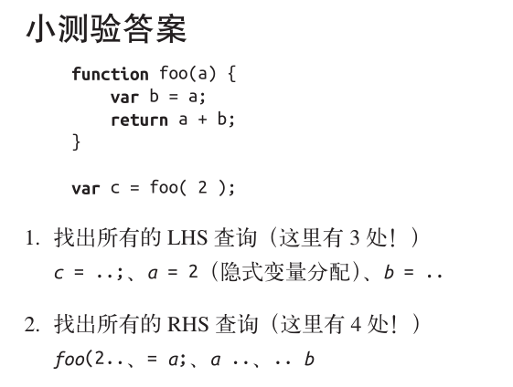

## 作用域嵌套

我们说过，**作用域是根据名称查找变量的一套规则**。实际情况中，通常需要**同时顾及几个作用域**。

当一个**块或函数**嵌套在另一个块或函数中时，就发生了作用域的嵌套。因此，在当前作用域中无法找到某个变量时，引擎就会在外层嵌套的作用域中继续查找，直到找到该变量，或抵达最外层的作用域(也就是**全局作用域**)为止。

考虑以下代码：

~~~javascript
function foo(a) {
	console.log(a+b);
}
var b = 2;
foo(2); 		//4
~~~

对b进行的**RHS引用**无法在函数foo内部完成，但**可以在上一级作用域(在这个例子中就是全局作用域)中完成**。

因此，回顾一下引擎和作用域之间的对话，会进一步听到：

> 引擎：foo的作用城兄弟，你见过b吗？我需要对它进行RHS引用
>
> 作用域：听都没听过，走开。
>
> 引擎：foo的上级作用域兄弟，咦？有眼不识泰山，原来你是全局作用域大哥，太好了。你见过b吗？我需要对它进行RHS引用。
>
> 作用域：当然了，给你吧。

遍历嵌套作用域链的规则很简单：引擎从当前的执行作用域开始查找变量，如果找不到，就向上一级继续查找。当抵达最外层的全局作用域时，无论找到还是没找到，查找过程都会停止。

### 把作用域链比喻成一个建筑

为了将作用域处理的过程可视化，我希望你在脑中想象下面这个高大的建筑：

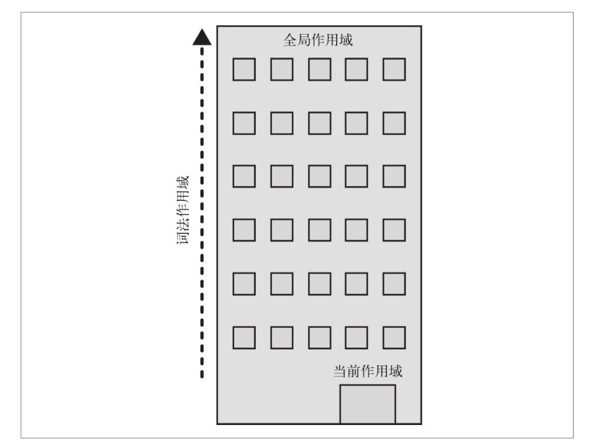

这个建筑代表程序中的**嵌套作用域链**。**第一层楼代表当前的执行作用域**，也就是你所处的位置。**建筑的顶层代表全局作用域**。

**LHS和RHS引用都会在当前楼层进行查找，如果没有找到，就会坐电梯前往上一层楼，如果还是没有找到就继续向上，以此类推。一旦抵达顶层(全局作用域)，可能找到了你所需的变量，也可能没找到，但无论如何查找过程都将停止。**

## **异常**

为什么**区分LHS和RHS**是一件重要的事情？

因为在**变量还没有声明(在任何作用域中都无法找到该变量)的情况下，这两种查询的行为是不一样的**。

考虑如下代码：

~~~javascript
function foo(a){
	console.log(a+b); 
  	b = a; 
}
foo(2);
~~~

**第一次对b进行RHS查询时是无法找到该变量的**。也就是说，这是一个“未声明”的变量，因为在任何相关的作用域中都无法找到它。

如果RHS查询在所有嵌套的作用域中遍寻不到所需的变量，引擎就会抛出`ReferenceError`异常。值得注意的是，ReferenceError是非常重要的异常类型。

相较之下，当引擎执行**LHS查询**时，如果在顶层(全局作用域)中也无法找到目标变量，**全局作用域中就会创建一个具有该名称的变量，并将其返还给引擎，前提是程序运行在非“严格模式”下**。

> “不，这个变量之前并不存在，但是我很热心地帮你创建了一个。”

ES5中引入了“严格模式”。同正常模式，或者说宽松/懒惰模式相比，严格模式在行为上有很多不同。其中一个不同的行为是**严格模式禁止自动或隐式地创建全局变量**。因此，在严格模式中LHS查询失败时，并不会创建并返回一个全局变量，引擎会抛出同RHS查询失败时类似的ReferenceError异常。

接下来，如果RHS查询找到了一个变量，但是你尝试对这个变量的值进行不合理的操作，比如试图对一个非函数类型的值进行函数调用，或着引用null或undefined类型的值中的属性，那么引擎会抛出另外一种类型的异常，叫作`TypeError`。

**`ReferenceError`同作用域判别失败相关，而`TypeError`则代表作用域判别成功了，但是对结果的操作是非法或不合理的**。

## 小结

作用域是一套规则，用于确定**在何处以及如何查找变量(标识符)**。如果**查找的目的是对变量进行赋值，那么就会使用LHS查询；如果目的是获取变量的值，就会使用RHS查询**。

**赋值操作符会导致LHS查询**。`=`操作符或调用函数时传入参数的操作都会导致关联作用城的赋值操作。

JavaScript引擎首先会在代码执行前对其进行编译，在这个过程中，像`var a = 2`这样的声明会被分解成两个独立的步骤

* 首先，`var a`在其作用域中声明新变量。这会在最开始的阶段，也就是代码执行前进行。

* 接下来，`a = 2`会查询(LHS查询)变量a并对其进行赋值。

**LHS和RHS查询都会在当前执行作用域中开始，如果有需要(也就是说它们没有找到所需的标识符)，就会向上级作用域继续查找目标标识符，这样每次上升一级作用域(一层楼)，最后抵达全局作用域(顶层)，无论找到或没找到都将停止。**

**不成功的RHS引用会导致抛出ReferenceError异常。不成功的LHS引用会导致自动隐式地创建一个全局变量(非严格模式下)，该变量使用LHS引用的目标作为标识符，或者抛出ReferenceError异常(严格模式下)。**

> 现在是2020年10月13日，截止到这里复习完。

# 第2章：词法作用域

在第1章中，我们将“作用域”定义为一套**规则**，这套规则用来管理**引擎**如何在**当前作用域**以及嵌套的子作用域中**根据标识符名称进行变量查找**。

作用域共有**两种**主要的工作模型。**第一种**是最为普遍的，被大多数编程语言所采用的**词法作用域**，我们会对这种作用域进行深入讨论。另外一种叫作**动态作用域**，仍有一些编程语言在使用(比如Bash脚本、Perl中的一些模式等)。

附录A中介绍了动态作用域，在这里提到它只是为了同JavaScript所采用的作用域模型，即词法作用域模型进行**对比**。

## 词法阶段

第1章介绍过，大部分标准语言**编译器**的第一个工作阶段叫作**词法化**(也叫单词化)。回忆一下，词法化的过程会**对源代码中的字符进行检查**，如果是有状态的解析过程，还会赋予单词语义。

这个概念是理解词法作用域及其名称来历的**基础**。

简单地说，词法作用域就是**定义在词法阶段的作用域**。换句话说，**词法作用域是由你在写代码时将变量和块作用域写在哪里来决定的**，因此当词法分析器处理代码时会保持作用域不变(大部分情况下是这样的)。

考虑以下代码：

~~~javascript
function foo(a){
	var b = a * 2;
  
	function bar(c){
		console.log(a,b,c);
	} 
	bar(b*3);
}
foo(2);		//2,4,12
~~~

> 这个例子是真的好

在这个例子中有三个逐级嵌套的作用域。为了帮助理解，可以将它们想象成几个逐级包含的气泡。

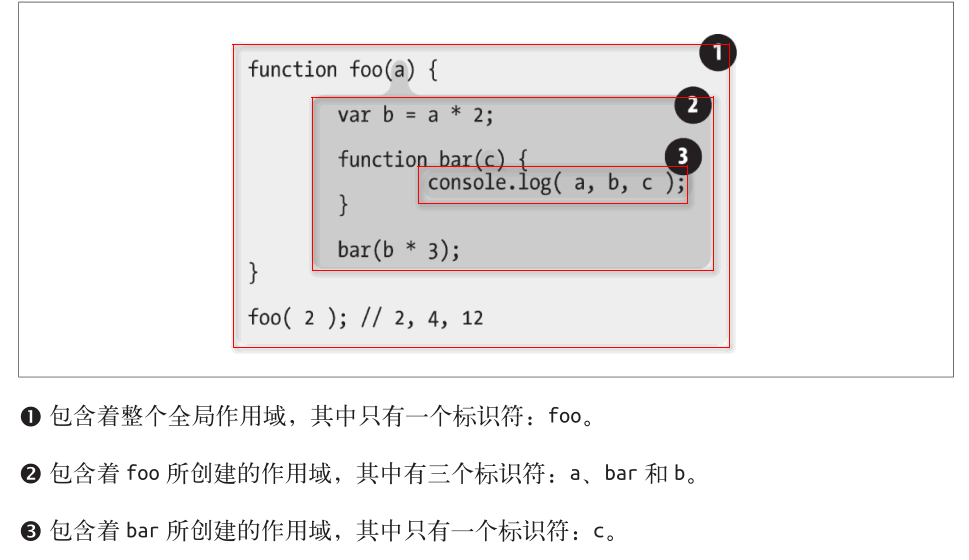

**作用域气泡**由其对应的作用域块代码写在哪里决定，它们是逐级包含的。下一章会讨论不同类型的作用域，但现在只要假设每一个函数都会创建一个新的作用域气泡就好了。

**bar的气泡被完全包含在foo所创建的气泡中，唯一的原因是那里就是我们希望定义函数bar的位置。**

注意，这里所说的气泡是**严格包含**的。我们并不是在讨论**文氏图**这种可以跨越边界的气泡。换句话说，**没有任何函数的气泡可以(部分地)同时出现在两个外部作用域的气泡中，就如同没有任何函数可以部分地同时出现在两个父级函数中一样。**

### 查找

作用域气泡的**结构**和**互相之间的位置关系**给引擎提供了足够的位置信息，**引擎用这些信息来查找标识符的位置**。

在上一个代码片段中，引擎执行`console.log(..)`声明，并**查找**a，b和c三个**变量的引用**。它**首先**从最**内部**的作用域，也就是`bar(..)`函数的作用域气泡开始查找。**引擎无法在这里找到a**，因此会去上一级到所嵌套的`foo(..)`的作用域中继续查找。在这里找到了a，因此引擎使用了这个引用。对b来讲也是一样的。而**对c来说，引擎在`bar(..)`中就找到了它**。

如果a、c都存在于`bar(..)`和`foo(..)`的内部，`console.log(..)`就可以直接使用`bar(..)`中的变量，而无需到外面的`foo(..)`中查找。

作用域查找会在**找到第一个匹配的标识符时停止**。在**多层**的嵌套作用域中**可以定义同名的标识符**，这叫作“**遮蔽效应**”(内部的标识符“遮蔽”了外部的标识符)。**抛开遮蔽效应，作用域查找始终从运行时所处的最内部作用域开始，逐级向外或者说向上进行，直到遇见第一个匹配的标识符为止。**

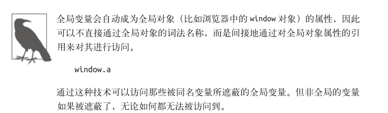

**无论函数在哪里被调用，也无论它如何被调用，它的词法作用域都只由函数被<strong style="color:red">声明</strong>时所处的位置决定。**

> 函数声明和函数调用是2个不同的过程。

词法作用域查找只会查找**一级标识符**，比如a、b和c。如果代码中引用了`foo.bar.baz`，词法作用域查找只会试图查找foo标识符，**找到这个变量后，对象属性访问规则会分别接管对bar和baz属性的访问**。

## 欺骗词法

> 像`eval()`和with这样的语法前端都不推荐使用，只是稍微看一下，学一下理论就好了。

如果词法作用域完全由写代码期间**函数所声明的位置**来定义，怎样才能在运行时来“修改”(也可以说欺骗)词法作用域呢？

JavaScript中有两种机制来实现这个目的。社区普遍认为在代码中使用这两种机制并不是什么好主意。但是关于它们的争论通常会忽略掉**最重要的点**：**欺骗词法作用域会导致性能下降。**

在详细解释性能问题之前，先来看看这两种机制分别是什么原理。

### eval(还是不懂)

> 慢慢的可以懂一些了，总之，没有那么害怕了。

JavaScript中的`eval(..)`函数可以**接受一个字符串为参数**，并**将其中的内容视为好像在书写时就存在于程序中这个位置的代码**。换句话说，可以在你写的代码中用程序生成代码并运行，就好像代码是写在那个位置的一样。

根据这个原理来理解`eval(..)`，它是如何通过代码欺骗和假装成**书写时**(也就是词法期)代码就在那，来实现修改词法作用域环境的，这个原理就变得清晰易懂了。

在执行`eval(..)`之后的代码时，引擎并不“知道”或“在意”前面的代码是以动态形式插入进来，并对词法作用域的环境进行修改的。引擎只会如往常地进行词法作用域查找。

考虑以下代码：

~~~javascript
function foo(str,a){
	eval(str);		//欺骗!
	console.log(a,b);
}

var b = 2;
foo("var b = 3;" , 1);		//1,3
~~~

`eval(..)`调用中的`var b = 3；`这段代码**会被当作本来就在那里一样来处理**。由于那段代码声明了一个新的变量b，因此它对已经存在的`foo(..)`的词法作用域进行了修改。事实上，和前面提到的原理一样，这段代码实际上在`foo(..)`内部创建了一个变量b，并**遮蔽了外部(全局)作用域中的同名变量**。

**当`console.log(..)`被执行时，会在`foo(..)`的内部同时找到a和b，但是永远也无法找到外部的b。因此会输出"1，3"而不是正常情况下会输出的"1，2"。**

默认情况下，如果`eval(..)`中所执行的代码包含有一个或多个声明(无论是变量还是函数)，就会对`eval(..)`所处的词法作用域进行修改。技术上，通过一些技巧(已经超出我们的讨论范围)可以间接调用`eval(..)`来使其运行在全局作用域中，并对全局作用域进行修改。但无论何种情况，`eval(..)`都可以在运行期修改书写期的词法作用域。

在**严格模式**的程序中，`eval(..)`在运行时**有其自己的词法作用域**，意味着其中的声明无法修改所在的作用域。

~~~javascript
function foo(str){
	'use strict'
	eval(str);
	console.log(a);		//ReferenceError: a is not defined
}

foo("var a = 2");
~~~

JavaScript中还有其他一些功能效果和eval(.)很相似。`setTimeout(..)`和`setInterval(..)`的**第一个参数**可以是字符串，字符串的内容可以被解释为一段动态生成的函数代码。**这些功能已经过时且并不被提倡，不要使用它们！**

`new Function(..)`函数的行为也很类似，最后一个参数可以接受代码字符串，并将其转化为动态生成的函数(前面的参数是这个新生成的函数的形参)。这种构建函数的语法比`eval(..)`略微安全一些，但也要尽量避免使用。

**在程序中动态生成代码的使用场景非常罕见，因为它所带来的好处无法抵消性能上的损失。**

### with

JavaScript中另一个难以掌握(并且现在也**不推荐使用**)的用来欺骗词法作用域的功能是with关键字。可以有很多方法来解释with，在这里我选择从这个角度来解释它：它如何同被它所影响的词法作用域进行交互。

**with通常被当作重复引用同一个对象中的多个属性的快捷方式，可以不需要重复引用对象本身。**

> 这个和我之前学VBA中的with用处一样

比如：

~~~javascript
var obj = {
  a:1,
  b:2,
  c:3
};

//单调乏味的重复"obj"
obj.a = 2;
obj.b = 3;
obj.c = 4;

//简单的快捷方式
with(obj){
  a = 3;
  b = 4;
  c = 5;
}
~~~

但实际上这不仅仅是为了**方便地访问对象属性**。考虑如下代码：

~~~javascript
function foo(obj){
   with(obj){
   //这个表示obj.a = 2
    	a = 2;
   }
}

var o1 = {
  a:3
}

var o2 = {
  b:3
};

foo(o1);
console.log(ol.a);		//2

foo(o2);
console.log(o2.a);		//undefined

console.log(a);			//2——不好，a被泄露到全局作用域上了!
~~~

这个例子中创建了o1和o2两个对象。**其中一个具有a属性，另外一个没有**。`foo(..)`函数接受一个obj参数，**该参数是一个对象引用**，并对这个对象引用执行了`with(obj){..}`。

在with块内部，我们写的代码看起来只是对变量a进行简单的词法引用，实际上就是一个LHS引用(查看第1章)，并将2赋值给它。

当我们将o1传递进去，a=2赋值操作找到了`o1.a`并将2赋值给它，这在后面的`console.log(o1.a)`中可以体现。而当o2传递进去，**o2并没有a属性，因此不会创建这个属性**，`o2.a`保持undefined。

但是可以注意到一个奇怪的**副作用**，实际上`a = 2`赋值操作创建了一个全局的变量a。这是怎么回事？

with可以将一个没有或有多个属性的对象处理为一个完全隔离的词法作用域，因此这个对象的属性也会被处理为定义在这个作用域中的词法标识符。

`eval(..)`函数如果接受了含有一个或多个声明的代码，就会**修改其所处的词法作用域**，而with声明实际上是根据你传递给它的对象**凭空创建了一个全新的词法作用域**。

可以这样理解，当我们传递o1给with时，with所声明的作用域是o1，而这个作用域中含有一个同`o1.a`属性相符的标识符。

**但当我们将o2作为作用域时，其中并没有a标识符，因此进行了正常的LHS标识符查找(查看第1章)。**

o2的作用域、`foo(..)`的作用域和全局作用域中都没有找到标识符a，因此当a=2执行时，自动创建了一个全局变量(因为是非严格模式)。

with这种将对象及其属性放进一个作用域并同时分配标识符的行为很让人费解。但为了说明我们所看到的现象，这是我能给出的最直白的解释了。

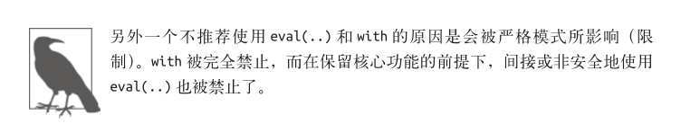

### 性能

`eval(..)`和with会在运行时修改或创建新的作用域，以此来欺骗其他在书写时定义的词法作用域。

你可能会问，那又怎样呢？如果它们能实现更复杂的功能，并且代码更具有扩展性，难道不是非常好的功能吗？**答案是否定的**。

JavaScript引擎会在**编译阶段**进行数项的**性能优化**。其中有些优化依赖于能够根据代码的词法进行静态分析，并预先确定所有变量和函数的定义位置，才能在执行过程中快速找到标识符。

但如果引擎在代码中发现了`eval(..)`或with，它只能**简单地假设关于标识符位置的判断都是无效的**，因为**无法在词法分析阶段明确知道`eval(..)`会接收到什么代码**，这些代码会如何对作用域进行修改，也无法知道传递给with用来创建新词法作用域的对象的内容到底是什么。

最悲观的情况是如果出现了`eval(..)`或with，**所有的优化可能都是无意义的**，因此最简单的做法就是完全不做任何优化。

如果代码中大量使用`eval(..)`或with，那么运行起来一定会变得非常慢。**无论引擎多聪明，试图将这些悲观情况的副作用限制在最小范围内，也无法避免如果没有这些优化，代码会运行得更慢这个事实。**

## 小结

词法作用域意味着**作用域**是由书写代码时**函数声明的位置**来决定的。编译的**词法分析阶段**基本能够知道全部标识符在哪里以及是如何声明的，从而能够预测在执行过程中如何对它们进行查找。

JavaScript中有**两个机制**可以“欺骗”词法作用域：`eval(..)`和`with`。

前者可以对一段包含一个或多个声明的“代码”字符串进行演算，并借此来修改已经存在的词法作用域(在运行时)。

后者本质上是通过将一个对象的引用当作作用域来处理，将对象的属性当作作用域中的标识符来处理，从而创建了一个**新的词法作用域**(同样是在运行时)。

这两个机制的**副作用**是**引擎无法在编译时对作用域查找进行优化**，因为引擎只能谨慎地认为这样的优化是无效的。

使用这其中任何一个机制都将导致代码运行变慢。

**不要使用它们！！！**。

> 现在是2020年10月22日，截止到这里复习完。

# 第3章：函数作用域和块作用域

[深入理解JavaScript作用域和作用域链](https://segmentfault.com/a/1190000018513150)

[JavaScript-作用域是什么](https://segmentfault.com/a/1190000018451476)

正如我们在第2章中讨论的那样，**作用域包含了一系列的“气泡”**，每一个都可以作为**容器**，其中包含了标识符(变量、函数)的定义。这些气泡互相嵌套并且整齐地排列成**蜂窝型**，排列的结构是在写代码时定义的。

但是，究竟是什么生成了一个新的气泡？只有函数会生成新的气泡吗？JavaScript中的其他结构能生成作用域气泡吗？

## 函数中的作用域

对于前面提出的问题，最常见的答案是JavaScript具有**基于函数的作用域**，意味着每**声明一个函数**都会为其自身创建一个气泡，而**其他结构都不会创建作用域气泡**。但事实上这**并不完全正确**，下面我们来看一下。

首先需要研究一下函数作用域及其背后的一些内容。

考虑下面的代码：

~~~javascript
function foo(a){
  	var b = 2;
  	//一些代码
    
	function bar(){
  		//...
	}
    
	//更多的代码
	var c = 3;
}
~~~

在这个代码片段中，`foo(..)`的作用域气泡中包含了标识符a，b，c和bar。**无论标识符声明出现在作用域中的何处，这个标识符所代表的变量或函数都将附属于所处作用域的气泡**。我们将在下一章讨论具体的原理。

`bar(..)`拥有自己的作用域气泡。**全局作用域也有自己的作用域气泡**，它只包含了一个标识符：`foo`。

由于标识符a，b，c和bar都附属于`foo(..)`的作用域气泡，因此无法从`foo(..)`的外部对它们进行访问。也就是说，这些标识符全都无法从全局作用域中进行访问，因此下面的代码会导致ReferenceError错误：

~~~javascript
bar();  //失败
console.log(a,b,c);		//三个全都失败
~~~

但是，这些标识符(a，b，c，foo和bar)在`foo(..)`的内部都是可以被访问的，同样在`bar(..)`内部也可以被访问(假设`bar(..)`内部没有同名的标识符声明)。

**函数作用域的含义是指，属于这个函数的全部变量都可以在整个函数的范围内使用及复用(事实上在嵌套的作用域中也可以使用)**。这种设计方案是非常有用的，能充分利用JavaScript变量可以根据需要改变值类型的“动态”特性。

但与此同时，如果不细心处理那些可以在整个作用域范围内被访问的变量，可能会带来意想不到的问题。

## 隐藏内部实现

对函数的传统认知就是先声明一个函数，然后再向里面添加代码。但**反过来想**也可以带来一些启示：**从所写的代码中挑选出一个任意的片段，然后用函数声明对它进行包装，实际上就是把这些代码“隐藏”起来了**。

实际的结果就是**在这个代码片段的周围创建了一个作用域气泡**，也就是说**这段代码中的任何声明(变量或函数)都将绑定在这个新创建的包装函数的作用域中，而不是先前所在的作用域中**。换句话说，**可以把变量和函数包裹在一个函数的作用域中，然后用这个作用域来“隐藏”它们**。

为什么“**隐藏**”变量和函数是一个有用的技术？

有很多原因促成了这种基于作用域的隐藏方法。它们大都是从**最小特权原则**中引申出来的，也叫**最小授权或最小暴露原则**。这个原则是指**在软件设计中，应该最小限度地暴露必要内容，而将其他内容都“隐藏”起来，比如某个模块或对象的API设计**。

这个原则可以延伸到如何选择作用域来包含变量和函数。如果所有变量和函数都在全局作用域中，当然可以在所有的内部嵌套作用域中访问到它们。但这样会破坏前面提到的最小特权原则，因为可能会**暴露过多的变量或函数**，而**这些变量或函数本应该是私有的，正确的代码应该是可以阻止对这些变量或函数进行访问的**。

例如：

~~~javascript
function doSomething(a){
	b = a + doSomethingElse(a * 2)
	console.log(b * 3);
}

function doSomethingElse(a){
	return a - 1;
}

var b;
doSomething(2);		//15
~~~

在这个代码片段中，变量b和函数`doSomethingElse(..)`应该是`doSomething(..)`内部具体实现的“私有”内容。给予外部作用域对b和`doSomethingElse(..)`的“访问权限”不仅没有必要，而且可能是“危险”的，因为它们可能被有意或无意地以非预期的方式使用，从而导致**超出**了`dosomething(..)`的适用条件。更“合理”的设计会将这些私有的具体内容隐藏在`doSomething(..)`内部，例如：

~~~javascript
function doSomething(a){
	function doSomethingElse(a){
        //我发现我对于return这个关键字是真的不太熟
		return a - 1;
	}
    
	var b;
	b = a + doSomethingElse(a * 2);
	console.log(b * 3);
}

doSomething(2);		//15
~~~

> 这个看不懂啊——现在是2020年10月26日，可以看懂了。

现在，b和`dosomethingElse(..)`都无法从外部被访问，而只能被`dosomething(..)`所控制。

功能性和最终效果都没有受影响，但是**设计上将具体内容私有化了**，设计良好的软件都会依此进行实现。

[JS中return的用法](https://www.cnblogs.com/qlqwjy/p/7776856.html)

### 规避冲突

“隐藏”作用域中的变量和函数所带来的另一个好处，是**可以避免同名标识符之间的冲突**，两个标识符可能具有相同的名字但用途却不一样，无意间可能造成命名冲突。**冲突会导致变量的值被意外覆盖**。

例如：

~~~javascript
function foo(){
	function bar(a){
		i = 3;		//修改for循环所属作用域中的i
		console.log( a + i);
	}

	for(var i = 0; i < 10; i++){
		bar(i * 2);	//糟糕，无限循环了!
	}
}
foo();
~~~

> 不清楚这个函数是怎么执行的——现在是2020年10月26日，还是有点模糊。

`bar(..)`内部的赋值表达式`i = 3`意外地**覆盖**了声明在`foo(..)`内部for循环中的i。在这个例子中将会**导致无限循环**，**因为`i`被固定设置为3，永远满足小于10这个条件**。

`bar(..)`内部的赋值操作**需要声明一个本地变量来使用**，采用任何名字都可以，`var i = 3`；就可以满足这个需求(同时会为`i`声明一个前面提到过的“遮蔽变量”)。

另外一种方法是**采用一个完全不同的标识符名称**，比如`var j = 3;`。但是软件设计在某种情况下可能自然而然地要求使用同样的标识符名称，因此在这种情况下使用作用域来“隐藏”内部声明是唯一的最佳选择。

**1.全局命名空间**

[库和框架的区别](https://www.cnblogs.com/xuld/archive/2011/02/20/1958933.html)

[库，框架，架构，平台，有什么明确的区别？](https://www.zhihu.com/question/29643471)

变量冲突的一个典型例子**存在于全局作用域中**。当程序中**加载了多个第三方库时**，如果它们(指第三方库)没有妥善地将内部私有的函数或变量隐藏起来，就会很容易引发冲突。

这些库通常会在全局作用域中**声明一个名字足够独特的变量**，**通常是一个对象**。这个对象被用作库的命名空间，所有需要暴露给外界的功能都会成为这个对象(命名空间)的属性，而不是将自己的标识符暴漏在顶级的词法作用域中。

例如：

~~~javascript
var MyReallyCoolLibrary = {
    awesome: 'stuff',
    doSomething:function(){
       // ···
    }，
    doAnotherThing: function(){
      //...
    }
};
~~~

**2.模块管理**

> Common.js这些。

另外一种避免冲突的办法和现代的**模块机制**很接近，就是从众多模块管理器中挑选一个来使用。使用这些工具，任何库都无需将标识符加入到全局作用域中，而是**通过依赖管理器的机制将库的标识符显式地导入到另外一个特定的作用域中**。

显而易见，这些工具并没有能够违反词法作用域规则的“神奇”功能。它们只是利用作用域的规则强制所有标识符都不能注入到共享作用域中，而是保持在私有、无冲突的作用域中，这样可以有效规避掉所有的意外冲突。

因此，**只要你愿意，即使不使用任何依赖管理工具也可以实现相同的功效**。第5章会介绍模块模式的详细内容。

## 函数作用域

我们已经知道，在任意代码片段外部添加包装函数，可以将内部的变量和函数定义“隐藏”起来，外部作用域无法访问包装函数内部的任何内容。

例如：

~~~javascript
var a = 2;
function foo(){		//<--添加这一行
	  var a = 3;
	  console.log(a);   //3
}	//<--以及这一行

foo();		//<--以及这一行

console.log(a);		//2
~~~

虽然这种技术可以解决一些问题，但是它**并不理想**，因为会导致一些额外的问题。**首先**，必须声明一个**具名函数**`foo()`，意味着foo这个名称本身“污染”了所在作用域(在这个例子中是**全局作用域**)，**其次**，必须**显式地**通过函数名(`foo()`)调用这个函数才能运行其中的代码。

如果**函数不需要函数名**(或者至少函数名可以不污染所在作用域)，并且能够自动运行，这将会更加理想。

幸好，JavaScript提供了能够**同时解决这两个问题**的方案。

~~~javascript
var a = 2;
(function foo(){		//添加这一行
	var a = 3;
	console.log(a);	//3
})()	//以及这一行

console.log(a);		//2
~~~

接下来我们分别介绍这里发生的事情。

首先，包装函数的声明以(`function...`而不仅是以`function..`开始。尽管看上去这并不是一个很显眼的细节，但实际上却是非常重要的区别。**函数会被当作函数表达式而不是一个标准的函数声明来处理**。

**函数声明**和**函数表达式**之间最重要的区别是它们的名称标识符将会绑定在何处。

比较一下前面两个代码片段。**第一个**片段中`foo`被绑定在所在作用域中，可以直接通过`foo()`来调用它。**第二个**片段中**foo被绑定在函数表达式自身的函数中而不是所在作用域中**。

换句话说，(`function foo(){..}`)作为函数表达式意味着foo只能在`..`所代表的位置中被访问，**外部作用域则不行**。**foo变量名被隐藏在自身中意味着不会非必要地污染外部作用域**。

### 匿名和具名

对于函数表达式你最熟悉的场景可能就是回调参数了，比如：

~~~javascript
setTimeout(function(){
  console.log('I waited 1 second');
},1000)
~~~

这叫作**匿名函数表达式**，因为`function()..`没有名称标识符。**函数表达式可以是匿名的**，而**函数声明则不可以省略函数名**——在JavaScript的语法中这是非法的。

匿名函数表达式书写起来简单快捷，很多库和工具也倾向鼓励使用这种风格的代码。但是它也有几个缺点需要考虑。

* 匿名函数在栈追踪中不会显示出有意义的函数名，使得**调试很困难**。

* 如果没有函数名，当函数需要引用自身时只能使用已经过期的`arguments.callee`引用，比如在**递归**中。另一个函数需要引用自身的例子，是在事件触发后事件监听器需要解绑自身。

* 匿名函数**省略了**对于代码可读性/可理解性很重要的**函数名**。**一个描述性的名称可以让代码不言自明**。

~~~javascript
setTimeout(function timeoutHander(){	//快看，我有名字了!
  	console.log('I waited 1 second');
},1000);
~~~

### 立即执行函数表达式(IIFE)

[JavaScript系列之立即执行函数IIFE](https://zhuanlan.zhihu.com/p/74440468)

~~~javascript
var a = 2;
(function foo(){		
	var a = 3;
	console.log(a);	//3
})()	

console.log(a);		//2
~~~

由于函数被包含在一对()括号内部，因此成为了一个表达式，通过在末尾加上另外一个
()可以立即执行这个函数，比如`(function foo(){..})()`。**第一个()将函数变成表达式**，**第二个()执行了这个函数**。

这种模式很常见，几年前社区给它规定了一个术语：IIFE，代表**立即执行函数表达式(Immediately Invoked Function Expression)**；

**函数名对IIFE当然不是必须的**，IIFE最常见的用法是使用一个**匿名函数表达式**。虽然**使用具名函数的IIFE并不常见，但它具有上述匿名函数表达式的所有优势**，因此也是一个值得推广的实践。

~~~javascript
var a = 2;
(function IIFE(){		
	var a = 3;
	console.log(a);	//3
})()	

console.log(a);		//2
~~~

相较于传统的IIFE形式，很多人都更喜欢另一个改进的形式：**`(function(){..}(()`**。仔细观察其中的区别。**第一种**形式中**函数表达式被包含在()中**，然后**在后面用另一个()括号来调用**。**第二种**形式中**用来调用的()括号被移进了用来包装的()括号中**。

这两种形式在功能上是一致的。选择哪个全凭个人喜好。

> 我还是比较喜欢第一种。

IFE的另一个非常普遍的**进阶用法**是**把它们当作函数调用并传递参数进去**。

例如：

~~~javascript
var a = 2;
(function IIFE(global){		
	var a = 3;
	console.log(a);	//3
  	console.log(global.a);	//2
})(window)	

console.log(a);		//2
~~~

我们将window对象的引用传递进去，但将参数命名为global，因此在代码风格上对全局对象的引用变得比引用一个没有“全局”字样的变量更加清晰。当然可以从外部作用域传递任何你需要的东西，并将变量命名为任何你觉得合适的名字。这对于改进代码风格是非常有帮助的。

这个模式的另外一个应用场景是**解决undefined标识符的默认值被错误覆盖导致的异常(虽然不常见)**，将一个参数命名为`undefined`，但是在对应的位置不传入任何值，这样就可以保证在代码块中undefined标识符的值真的是`undefined`。

~~~javascript
undefined = true;			//给其他代码挖了一个大坑！绝对不要这样做！
(function IIFE(undefined){
  var a;
  if(a === undefined){
    console.log('Undefined is safe here!');
  }
})();
~~~

IIFE还有一种变化的用途是**倒置代码的运行顺序**，将需要运行的函数放在第二位，在IFE执行之后当作参数传递进去。这种模式在UMD(Universal Module Definition)项目中被广泛使用。尽管这种模式略显冗长，但有些人认为它更易理解。

~~~javascript
var a = 2;
(function IIFE (def){
	def(window);
})(function def(global){
	var a =3;
	console.log(a);		//3
	console.log(global.a);		//2
});
~~~

> 这个函数七扭八扭的我完全看不懂这个是什么意思。——现在是2020年10月26日，依旧不懂。

函数表达式def定义在片段的第二部分，**然后**当作参数(这个参数也叫作def)被传递进IFE函数定义的第一部分中。**最后**，参数def(也就是传递进去的函数)被调用，并将window传入当作global参数的值。

> 现在是2020年10月26日，截止到这里复习完。

## 块作用域

尽管**函数作用域**是最常见的作用域单元，当然也是现行大多数JavaScript中最普遍的设计方法，但其他类型的作用域单元也是存在的，并且通过使用**其他类型的作用域单元**甚至可以实现维护起来更加优秀、简洁的代码。

除JavaScript外的很多编程语言都支持**块作用域**，因此其他语言的开发者对于相关的思维方式会很熟悉，但是对于主要使用JavaScript的开发者来说，这个概念会很陌生。

尽管你可能连一行带有块作用域风格的代码都没有写过，但对下面这种很常见的JavaScript代码一定很熟悉：

~~~javascript
for(var i = 0; i < 10; i++){
  console.log(i);
}
~~~

我们在for循环的**头部**直接定义了变量`i`，通常是因为只想在for循环内部的上下文中使用i，而忽略了`i`会被**绑定在外部作用域(函数或全局)**中的事实。

这就是块作用域的用处。**变量的声明应该距离使用的地方越近越好，并最大限度地本地化**。另外一个例子：

~~~javascript
var foo = true;

if(foo){
  var bar = foo * 2;
  bar = something(bar);
  console.log(bar);
}
~~~

**bar变量仅在if声明的上下文中使用，因此如果能将它声明在if块内部中会是一个很有意义的事情**。但是，**当使用var声明变量时，它写在哪里都是一样的，因为它们最终都会属于外部作用域**。这段代码是为了风格更易读而伪装出的形式上的块作用域，如果使用这种形式，要确保没在作用域其他地方意外地使用bar只能依靠**自觉性**。

块作用域是一个用来对之前的**最小授权原则**进行扩展的工具，将代码从在函数中隐藏信息扩展为在块中隐藏信息。

再次考虑for循环的例子：

~~~javascript
for(var i=0; i< 10;i++){
  console.log(i);
}
~~~

**为什么要把一个只在for循环内部使用(至少是应该只在内部使用)的变量i污染到整个函数作用域中呢？**

更重要的是，开发者需要**检查**自己的代码，以避免在作用范围外意外地使用(或复用)某些变量，如果在错误的地方使用变量将导致未知变量的异常。变量i的块作用域(如果存在的话)将使得其只能在for循环内部使用，如果在函数中其他地方使用会导致错误。这对保证变量不会被混乱地复用及提升代码的可维护性都有很大帮助。

但可惜，表面上看JavaScript并没有块作用域的相关功能。

除非你更加深入地研究。

### with

我们在第2章讨论过with关键字。它不仅是一个难于理解的结构，同时也是**块作用域**的一个例子(块作用域的一种形式)，**用with从对象中创建出的作用域仅在with声明中而非外部作用域中有效**。

### try/catch

[慎用try catch](https://segmentfault.com/a/1190000017752557)

非常少有人会注意到JavaScript的ES3规范中规定`try/catch`的`catch`分句会创建一个块作用域，其中声明的变量仅在catch内部有效。

例如：

~~~javascript
try{
  undefined();			//执行一个非法操作来强制制造一个异常
}
catch(err){
  console.log(err);		//能够正常执行！
}
console.log(err);		//ReferenceError:err not found
~~~

正如你所看到的，**err仅存在catch分句内部，当试图从别处引用它时会抛出错误**。

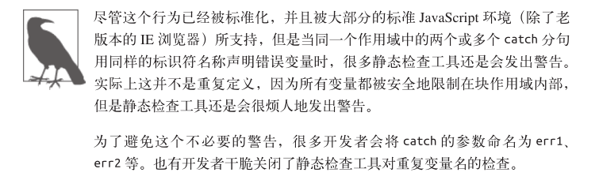

也许catch分句会创建块作用域这件事看起来像教条的学院理论一样没什么用处，但是查看**附录B**就会发现一些很有用的信息。

### let

到目前为止，我们知道JavaScript在暴露块作用域的功能中有一些奇怪的行为。如果仅仅是这样，那么JavaScript开发者多年来也就不会将块作用域当作非常有用的机制来使用了。

幸好，**ES6**改变了现状，引入了新的let关键字，提供了除`var`以外的另一种变量声明方式。

let关键字可以将变量绑定到所在的任意作用域中(通常是`{ .. }`内部)。换句话说，let为其声明的变量**隐式地**了所在的块作用域。

~~~javascript
var foo = true;

if(foo){
  let bar = foo * 2;
  bar = something(bar);
  console.log(bar);
}

console.log(bar);		//ReferenceError
~~~

**用let将变量附加在一个已经存在的块作用域上的行为是隐式的**。在开发和修改代码的过程中，如果没有密切关注哪些块作用域中有绑定的变量，并且习惯性地移动这些块或者将其包含在其他的块中，就会导致代码变得混乱。

为块作用域显式地创建块可以部分解决这个问题，使变量的附属关系变得更加清晰。通常来讲，**显式的代码优于隐式或一些精巧但不清晰的代码**。显式的块作用域风格非常容易书写，并且和其他语言中块作用域的工作原理一致：

~~~javascript
var foo = true;

if(foo){	  
  {  //显式的块
  	let bar = foo * 2;
  	bar = something(bar);
  	console.log(bar);
  }
}

console.log(bar);	//ReferenceError
~~~

只要声明是有效的，在声明中的任意位置都可以使用`{..}`括号来为let创建一个用于绑定的块。在这个例子中，我们在if声明内部显式地创建了一个块，如果需要对其进行重构，整个块都可以被方便地移动而不会对外部if声明的位置和语义产生任何影响。

在第4章，我们会讨论**提升**，提升是指声明会被视为存在于其所出现的作用域的整个范围内。

但是**使用let进行的声明不会在块作用域中进行提升**。**声明的代码被运行之前，声明并不“存在”**。

~~~javascript
{
  console.log(bar);		//ReferenceError
  let bar = 2;
}
~~~

**1.垃圾收集**

另一个块作用域非常有用的原因和**闭包及回收内存垃圾的回收机制**相关。这里简要说明下，而内部的实现原理，也就是**闭包的机制**会在第5章详细解释。

考虑以下代码：

~~~javascript
function process(data){
  //在这里做点有趣的事情
}
var someReallyBigData = {...};
                         
process(someReallyBigData);

var btn = document.getElementById('my_button');

btn.addEventListener('click',function click(evt)){
    console.log('button clicked');
}, /*capturingPhase=*/false);
~~~

click函数的点击回调并不需要`someReallyBigData`变量。理论上这意味着当`process(..)`执行后，在内存中占用大量空间的数据结构就可以被垃圾回收了。但是，由于click函数形成了一个覆盖整个作用域的闭包，JavaScript引擎极有可能依然保存着这个结构(取决于具体实现)。

块作用域可以打消这种顾虑，可以让引擎清楚地知道没有必要继续保存`someReallyBigata`了：

~~~javascript
function process(data){
  //在这里做点有趣的事情
}

//在这个块中定义的内容可以销毁了！
{
	let someReallyBigData = {...};
                         
	process(someReallyBigData);
}

var btn = document.getElementById('my_button');

btn.addEventListener('click',function click(evt)){
    console.log('button clicked');
}, /*capturingPhase=*/false);
~~~

为变量显式声明块作用域，并对变量进行本地绑定是非常有用的工具，可以把它添加到你的代码工具箱中了。

**2.let循环**

一个let可以发挥优势的典型例子就是之前讨论的for循环。

~~~javascript
for(let i=0;i<10;i++){
  console.log(i);
}
console.log(i);		//ReferenceError
~~~

for循环头部的let不仅将i绑定到了for循环的块中，事实上它将其重新绑定到了循环的每一个选代中，确保使用上一个循环迭代结束时的值重新进行赋值。

下面通过另一种方式来说明每次选代时进行重新绑定的行为：

~~~javascript
{
  let j;
  for(j=0;j<10;j++){
    let i = j;		//每个迭代重新绑定
    console.log(i);
  }
}
~~~

每个迭代进行重新绑定的原因非常有趣，我们会在第5章讨论**闭包**时进行说明。

由于**let声明附属于一个新的作用域而不是当前的函数作用域(也不属于全局作用域)**，当代码中存在对于函数作用域中var声明的隐式依赖时，就会有很多隐藏的陷阱，**如果用let来替代var则需要在代码重构的过程中付出额外的精力**。

考虑以下代码：

~~~javascript
var foo = true,baz = 10;

if(foo){
  var bar = 3;
    
  if(baz > bar){
    console.log(baz);
  }
  //...
}
~~~

这段代码可以简单地被重构成下面的同等形式：

~~~javascript
var foo = true,baz = 10;

if(foo){
  	var bar = 3;
    //...
}

if(baz > bar){
    console.log(baz);
}
~~~

但是在使用块级作用域的变量时需要注意以下变化：

~~~javascript
var foo = true,baz = 10;

if(foo){
  	let bar = 3;
  
  	if(baz > bar){	//...移动代码时不要忘了bar!
    	console.log(baz);
  	}
}
~~~

参考附录B，其中介绍了另外一种块作用域形式，可以用更健壮的方式实现目的，并且写出的代码更易维护和重构。

### const

除了let以外，ES6还引入了`const`，同样可以用来创建块作用域变量，但其**值是固定的(常量)**。之后任何试图修改值的操作都会引起错误。

~~~javascript
var foo = true;

if(foo){
  var a = 2;
  const b = 3;		//包含在if中的块作用域常量
  
  a = 3;	//正常！
  b = 4;  	//错误！
}

console.log(a);		//3
console.log(b);		//ReferenceError
~~~

## 小结

函数是JavaScript中最常见的作用域单元。**本质上，声明在一个函数内部的变量或函数会在所处的作用域中“隐藏”起来，这是有意为之的良好软件的设计原则**。

**但函数不是唯一的作用域单元**。块作用域指的是变量和函数不仅可以属于所处的作用域，也可以属于某个代码块(通常指`{..}`内部)。

从ES3开始，`try/catch`结构在catch分句中具有块作用域。

在ES6中引入了let关键字(var关键字的表亲)，用来在任意代码块中声明变量。`if(..)(let a = 2;}`会声明一个**劫持了if**的`{..}`块的变量，并且将变量添加到这个块中。

有些人认为**块作用域不应该完全作为函数作用域的替代方案,两种功能应该同时存在**，开发者可以并且也应该根据需要选择使用何种作用域，创造可读、可维护的优良代码。

> 现在是2020年11月03日，截止到这里复习完。

# 第4章：提升

到现在为止，你应该已经很熟悉作用域的概念，以及根据声明的位置和方式将变量分配给作用域的相关原理了。函数作用域和块作用域的行为是一样的，可以总结为：**任何声明在某个作用域内的变量，都将附属于这个作用域**。

但是作用域同其中的变量声明出现的**位置**有某种微妙的联系，而这个细节正是我们将要讨论的内容。

## 先有鸡还是先有蛋

直觉上会认为JavaScript代码在执行时是**由上到下一行一行执行**的。但实际上这**并不完全正确**，有一种特殊情况会导致这个假设是错误的。

考虑以下代码：

~~~javascript
a = 2;
var a; 

console.log(a);

//结果不是undefined,而是2
~~~

你认为`console.log(..)`声明会输出什么呢？

很多开发者会认为是undefined，因为`var a`声明在`a = 2`之后，他们**自然而然地认为变量被重新赋值了**，因此会被赋予默认值undefined，但是，**真正的输出结果是2**。

考虑另外一段代码：

~~~javascript
console.log(a);

var a = 2;

//结果是undefined
~~~

鉴于上一个代码片段所表现出来的某种非自上而下的行为特点，你可能会认为这个代码片段也会有同样的行为而输出2，还有人可能会认为，由于变量a在使用前没有先进行声明，因此会抛出ReferenceError异常。

不幸的是两种猜测都是不对的。输出来的会是`undefined`。

那么到底发生了什么？看起来我们面对的是一个先有鸡还是先有蛋的问题。**到底是声明(蛋)在前，还是赋值(鸡)在前**？

## 编译器再度来袭

[从本质上理解JavaScript中的变量提升](https://juejin.im/post/6844903895341219854)

> 变量提升这个概念还是很不熟啊。

为了搞明白这个问题，我们需要回顾一下第1章中关于编译器的内容。回忆一下，**引擎**会在**解释**JavaScript代码之前**首先对其进行编译**。编译阶段中的一部分工作就是找到所有的声明，并用合适的作用域将它们关联起来。第2章中展示了这个机制，也正是**词法作用域**的核心内容。

因此，正确的思考思路是，包括变量和函数在内的所有声明都会在任何代码被执行前首先被处理。

当你看到`var  a = 2;`时，可能会认为这是**一个**声明。但JavaScript实际上会将其看成**两个**声明：`var a;`和`a = 2;`。第一个定义声明是在**编译阶段**进行的。第二个赋值声明会被留在**原地等待执行阶段**。

我们的第一个代码片段**会以如下形式进行处理**：

~~~javascript
var a;
a = 2;
console.log(a);
~~~

其中第一部分是编译，而第二部分是执行。

类似地，我们的第二个代码片段实际是按照以下流程处理的：

~~~javascript
var a;
console.log(a);
a = 2;
~~~

> 我去，这个我还是不太懂啊！！但是有点感觉了。

因此，打个比方，这个过程就好像变量和函数声明从它们在代码中出现的位置被“移动”到了最上面。这个过程就叫作**提升**。

换句话说，**先有蛋(声明)后有鸡(赋值)**。

> **只有声明本身会被提升**，而赋值或其他运行逻辑会留在原地。如果提升改变了代码执行的顺序，会造成非常严重的破坏。

~~~javascript
foo();
//这是赋值

function foo(){
  console.log(a);		//undefined
  var a = 2;
}
//这是声明
~~~

foo函数的**声明**(这个例子还包括实际函数的隐含值)**被提升**了，因此第一行中的调用可以正常执行。

另外值得注意的是，**每个作用域都会进行提升操作**。尽管前面大部分的代码片段已经简化了(因为它们只包含全局作用域)，而我们正在讨论的`foo()`函数自身也会在内部对`var a`进行提升(显然并不是提升到了整个程序的最上方)，因此这段代码实际上会被理解为下面的形式：

~~~javascript
function foo(){
  var a;
  console.log(a);		//undefined
  a = 2;
}

foo();
~~~

可以看到，**函数声明会被提升**，但是**函数表达式却不会被提升**。

~~~javascript
foo(); 		//不是ReferenceError,而是TypeError!

var foo = function bar(){
  //...
};
~~~

这段程序中的变量标识符`foo()`被提升并分配给所在作用域(在这里是全局作用域)，因此`foo()`不会导致ReferenceError，但是foo此时并没有赋值(如果它是一个函数声明而不是函数表达式，那么就会赋值)，`foo()`由于对undefined值进行函数调用而导致非法操作，因此抛出TypeError异常。

同时也要记住，**即使是具名的函数表达式，名称标识符在赋值之前也无法在所在作用域中使用**：

~~~javascript
foo(); // TypeError 
bar(); // ReferenceError 

var foo = function bar() {
		//...
};
~~~

这个代码片段经过提升后，实际上会被理解为以下形式：

~~~javascript
var foo;

foo(); 		//TypeErгoг
bar(); 	 	//ReferenceErron

foo = function() {
	var bar = ... self
  //....
}
~~~

> 唉，还是看不懂

## 函数优先

函数声明和变量声明都会被提升。但是一个值得注意的细节(这个细节可以出现在有多个“重复”声明的代码中)是**函数会首先被提升，然后才是变量**。

考虑以下代码：

~~~javascript
foo();  //1

var foo;

function foo(){
  console.log(1);
}
foo = function(){
  console.log(2);
};
~~~

会输出1而不是2！这个代码片段会被引擎理解为如下形式：

~~~javascript
function foo(){
  console.log(1);
}

foo();		//1

foo = function(){
  console.log(2);
};
~~~

> 看不懂

注意，`var foo`尽管出现在`function foo()...`的声明之前，但**它是重复的声明**(因此被忽略了)，因为函数声明会被提升到普通变量之前。

尽管重复的var声明会被忽略掉，但**出现在后面的函数声明还是可以覆盖前面的**。

~~~javascript
foo();		//3

function foo(){
  console.log(1);
}

var foo = function(){
  console.log(2);
};

function foo(){
  console.log(3);
}
~~~

> 太绕了，看不懂啊！！

虽然这些听起来都是些无用的学院理论，但是它说明了**在同一个作用域中进行重复定义是非常糟糕的**，而且经常会导致各种奇怪的问题。

一个普通块内部的函数声明通常会被提升到所在作用域的顶部，这个过程不会像下面的代码暗示的那样可以被条件判断所控制：

~~~javascript
foo();		//"b"

var a = true;

if(a){
  function foo(){console.log("a")}
}
else{
  function foo(){console.log("b")};
}
~~~

但是需要注意这个行为并不可靠，在JavaScript未来的版本中有可能发生改变，因此应该尽可能避免在块内部声明函数。

## 小结

我们习惯将`var a = 2;`看作一个声明，而实际上JavaScript引擎并不这么认为。它将`var a`和`a = 2`当作两个单独的声明，**第一个是编译阶段的任务，而第二个则是执行阶段的任务**。

这意味着**无论作用域中的声明出现在什么地方，都将在代码本身被执行前首先进行处理**。可以将这个过程形象地想象成所有的声明(变量和函数)都会被“移动”到各自作用域的最顶端，这个过程被称为提升。

**声明本身会被提升，而包括函数表达式的赋值在内的赋值操作并不会提升**。

要注意避免重复声明，特别是当普通的var声明和函数声明混合在一起的时候，否则会引起很多危险的问题！

# 第5章：作用域闭包

接下来的内容需要对作用域工作原理相关的基础知识有非常深入的理解。

我们将注意力转移到这门语言中一个非常重要但又难以掌握，近乎神话的概念上：闭包。如果你了解了之前关于词法作用域的讨论，那么闭包的概念几乎是不言自明的。魔术师的幕布后藏着一个人，我们将要揭开他的伪装。我可没说这个人是Crockford！

在继续学习之前，如果你还是对词法作用域相关内容有疑问，可以重新回顾一下第2章中的相关内容，现在是个好机会。

> 注1：Douglas Crockford是web开发领域最知名的技术权威之一，ECMA Javascript 2.0标准化委员会委员，被JavaScript之父Brendan Eich称为JavaScript界的宗师。——译者注

## 启示

对于那些有一点JavaScript使用经验但从未真正理解闭包概念的人来说，理解闭包可以看作是某种意义上的重生，但是需要付出非常多的努力和牺牲才能理解这个概念。

回忆我前几年的时光，大量使用Javascript但却完全不理解闭包是什么。总是感觉这门语言有其隐蔽的一面，如果能够掌握将会功力大涨，但讽刺的是我始终无法掌握其中的门道。还记得我曾经大量阅读早期框架的源码，试图能够理解闭包的工作原理。现在还能回忆起我的脑海中第一次浮现出关于“模块模式”相关概念时的激动心情。

那时我无法理解并且倾尽数年心血来探索的，也就是我马上要传授给你的秘诀：JavaScript中闭包无处不在，你只需要能够识别并拥抱它。闭包并不是一个需要学习新的语法或模式才能使用的工具，它也不是一件必须接受像Luke一样的原力训练才能使用和掌握的武器。

闭包是基于词法作用域书写代码时所产生的自然结果，你甚至不需要为了利用它们而有意识地创建闭包。闭包的创建和使用在你的代码中随处可见。你缺少的是根据你自己的意愿来识别、拥抱和影响闭包的思维环境。

最后你恍然大悟：原来在我的代码中已经到处都是闭包了，现在我终于能理解它们了。理解闭包就好像Neo第一次见到矩阵一样。

## 实质问题

好了，夸张和浮夸的电影比喻已经够多了。

下面是直接了当的定义，你需要掌握它才能理解和识别闭包：当函数可以记住并访问所在的词法作用域时，就产生了闭包，即使函数是在当前词法作用域之外执行。

下面用一些代码来解释这个定义。

~~~javascript
function foo(){
    var a = 2;
    function bar(){
        console.log(a);		//2
    }
    bar();
}
foo();
~~~

这段代码看起来和嵌套作用域中的示例代码很相似。基于词法作用域的查找规则，函数bar()可以访问外部作用域中的变量a(这个例子中的是一个RHS引用查询)。

这是闭包吗？

技术上来讲，也许是。但根据前面的定义，确切地说并不是。我认为最准确地用来解释bar()对a的引用的方法是词法作用域的查找规则，而这些规则只是闭包的一部分。(但却是非常重要的一部分！)

从纯学术的角度说，在上面的代码片段中，函数bar()具有一个涵盖foo()作用域的闭包(事实上，涵盖了它能访问的所有作用域，比如全局作用域)。也可以认为bar()被封闭在了foo()的作用域中。为什么呢？原因简单明了，因为bar()嵌套在foo()内部。

但是通过这种方式定义的闭包**并不能直接进行观察**，也无法明白在这个代码片段中闭包是如何工作的。我们可以很容易地理解词法作用域，而闭包则隐藏在代码之后的神秘阴影里，并不那么容易理解。

下面我们来看一段代码，清晰地展示了闭包：

~~~javascript
function foo(){
    var a = 2;
    function bar(){
        console.log(a);		
    }
   return bar;
}
var baz = foo();

baz();		//2	  ——朋友，这就是闭包的效果
~~~

函数`bar()`的词法作用域能够访问`foo()`的内部作用域。然后我们将`bar()`函数本身当作一个值类型进行传递。在这个例子中，我们将bar所引用的函数对象本身当作返回值。

在`foo()`执行后，其返回值（也就是内部的`bar()`函数）赋值给变量baz并调用`baz()`，实际上只是通过不同的标识符引用调用了内部的函数`bar()`。

`bar()`显然可以被正常执行。但是在这个例子中，它在自己定义的词法作用域以外的地方执行。

在`foo()`执行后，通常会期待`foo()`的整个内部作用域都被销毁，因为我们知道引擎有垃圾回收器用来释放不再使用的内存空间。由于看上去`foo()`的内容不会再被使用，所以很自然地会考虑对其进行回收。

而闭包的“神奇”之处正是可以阻止这件事情的发生。事实上内部作用域依然存在，因此没有被回收。谁在使用这个内部作用域？原来是bar()本身在使用。

拜`bar()`所声明的位置所赐，它拥有涵盖`foo()`内部作用域的闭包，使得该作用域能够一直存活，以供`bar()`在之后任何时间进行引用。

`bar()`依然持有对该作用域的引用，而这个引用就叫作闭包。

因此，在几微秒之后变量baz被实际调用（调用内部函数bar），不出意料它可以访问定义时的词法作用域，因此它也可以如预期般访问变量。

这个函数在定义时的词法作用域以外的地方被调用。闭包使得函数可以继续访问定义时的词法作用域。

当然，无论使用何种方式对函数类型的值进行传递，当函数在别处被调用时都可以观察到闭包。

~~~javascript
function foo(){
    var a = 2;
    function bar(){
        console.log(a);		//2	
    }
   bar(baz);
}

function bar(fn){
    fn();	//妈妈快看啊，这就是闭包！	//哈哈，翻译的有点好笑！
}
~~~

把内部函数`baz`传递给`bar`，当调用这个内部函数时(现在叫作fn)，它涵盖的foo()内部作用域的闭包就可以观察到了，因为它能够访问a。

传递函数当然也可以是间接的。

~~~javascript
var fn;
function foo(){
    var a = 2;
    function baz(){
        console.log(a);
    }
    fn = baz;	//将baz分配给全局变量
}

function bar(){
    fn();	//妈妈快看啊，这就是闭包！
}

foo();
bar();	//2
~~~

无论通过何种手段将内部函数传递到所在的词法作用域以外，它都会持有对原始定义作用域的引用，无论在何处执行这个函数都会使用闭包。

## 现在我懂了

前面的代码片段有点死板，并且为了解释如何使用闭包而人为地在结构上进行了修饰。但我保证闭包绝不仅仅是一个好玩的玩具。你已经写过的代码中一定到处都是闭包的身影。

现在让我们来搞懂这个事实。

~~~javascript
function wait(message){
    setTimeout(function timer(){
        console.log(message)
    },1000)
}
wait("Hello,closure!")
~~~

将一个内部函数(名为timer)传递给`setTimeout(..)`。timer具有涵盖`wait(..)`作用域的闭包，因此还保有对变量message的引用。

`wait(..)`执行1000毫秒后，它的内部作用域并不会消失，timer函数依然保有`wait(..)`作用域的闭包。

深入到引擎的内部原理中，内置的工具函数`setTimeout(..)`持有对一个参数的引用，这个参数也许叫作fn或者func，或者其他类似的名字。引擎会调用这个函数，在例子中就是内部的timer函数，而词法作用域在这个过程中保持完整。

这就是闭包。

或者，如果你很熟悉jQuery（或者其他能说明这个问题的JavaScript框架），可以思考下面的代码：

~~~javascript
function setupBot(name,selector){
    $(selector).click(function activator(){
      	console.log("Activating:" + name);
    });
}

setupBot("Closure Bot 1","#bot_1");
setupBot("Closure Bot 2","#bot_2");
~~~

我不知道你会写什么样的代码，但是我写的代码负责控制由闭包机器人组成的整个全球无人机大军，这是完全可以实现的！

玩笑开完了，本质上无论何时何地，如果将函数（访问它们各自的词法作用域）当作第-级的值类型并到处传递，你就会看到闭包在这些函数中的应用。在定时器、事件监听器、Ajax请求、跨窗口通信、Web Workers或者任何其他的异步（或者同步）任务中，只要使用了回调函数，实际上就是在使用闭包！

~~~javascript
var a = 2;
(function IIFE(){
   console.log(a); 
})()
~~~

虽然这段代码可以正常工作，但严格来讲它并不是闭包。为什么？因为函数（示例代码中的IIFE）并不是在它本身的词法作用域以外执行的。它在定义时所在的作用域中执行（而外部作用域，也就是全局作用域也持有a），a是通过普通的词法作用域查找而非闭包被发现的。

尽管技术上来讲，闭包是发生在定义时的，但并不非常明显，就好像六祖慧能所说："既非风动，亦非幡动，仁者心动耳。”

尽管IIFE本身并不是观察闭包的恰当例子，但它的确创建了闭包，并且也是最常用来创建可以被封闭起来的闭包的工具。因此IIFE的确同闭包息息相关，即使本身并不会真的使用闭包。

亲爱的读者，现在把书放下，我有一个任务要给你。打开你最近写的JavaScript代码，找到其中的函数类型的值并指出哪里已经使用了闭包，即使你以前可能并不知道这就是闭包。

等你呦！

现在你懂了吧！

## 循环和闭包

要说明闭包，for循环是最常见的例子。

~~~javascript
for(var i = 1; i <= 5; i++){
    setTimeout(function timer(){
        console.log(i);
    },i*1000)
}
~~~

正常情况下，我们对这段代码行为的预期是分别输出数字1-5，每秒一次，每次一个。

但实际上，这段代码在运行时会以每秒一次的频率输出五次6。

这是为什么？

首先解释6是从哪里来的。这个循环的终止条件是i不再<=5，条件首次成立时i的值是6，因此，输出显示的是循环结束时i的最终值。

仔细想一下，这好像又是显而易见的，延迟函数的回调会在循环结束时才执行。事实上，当定时器运行时即使每个迭代中执行的是`setTimeout（..,0）`，所有的回调函数依然是在循环结束后才会被执行，因此会每次输出一个6出来。

这里引伸出一个更深入的问题，代码中到底有什么缺陷导致它的行为同语义所暗示的不一致呢？

缺陷是我们试图假设循环中的每个迭代在运行时都会给自己“捕获”一个i的副本。但是根据作用域的工作原理，实际情况是尽管循环中的五个函数是在各个迭代中分别定义的，但是它们都被封闭在一个共享的全局作用域中，因此实际上只有一个i。

这样说的话，当然所有函数共享一个i的引用。循环结构让我们误以为背后还有更复杂的机制在起作用，但实际上没有。如果将延迟函数的回调重复定义五次，完全不使用循环，那它同这段代码是完全等价的。

> 这些分析我看前端视频的时候听了起码有2次了，举的例子也是一模一样，但是总感觉还差一点什么，理解的还是不够深刻。

下面回到正题。缺陷是什么？我们需要更多的闭包作用域，特别是在循环的过程中每个迭代都需要一个闭包作用域。

第3章介绍过，IIFE会通过声明并立即执行一个函数来创建作用域。

我们来试一下：

~~~javascript
for(var i = 1; i <= 5;i++){
    (function(){
        setTimeout(function timer(){
         	console.log(i);   
        },i*1000);
    })();
}
~~~

这样能行吗？试试吧，我等着你。

我不卖关子了。这样不行。但是为什么呢？我们现在显然拥有更多的词法作用域了。的确每个延迟函数都会将IFE在每次迭代中创建的作用域封闭起来。

如果作用域是空的，那么仅仅将它们进行封闭是不够的。仔细看一下，我们的IFE只是一个什么都没有的空作用域。它需要包含一点实质内容才能为我们所用。

它需要有自己的变量，用来在每个迭代中储存i的值：

~~~javascript
for(var i = 1; i <= 5;i++){
    (function(){
        var j = i;
        setTimeout(function timer(){
         	console.log(j);   
        },j*1000);
    })();
}
~~~

行了！它能正常工作了！

可以对这段代码进行一些改进：

~~~javascript
for(var i = 1; i <= 5;i++){
    (function(j){
        setTimeout(function timer(){
         	console.log(j);   
        },j*1000);
    })(i);
}
~~~

当然，这些1IF也不过就是函数，因此我们可以将i传递进去，如果愿意的话可以将变量名定为3，当然也可以还叫作i。无论如何这段代码现在可以工作了。

在迭代内使用IIFE会为每个迭代都生成一个新的作用域，使得延迟函数的回调可以将新的作用域封闭在每个迭代内部，每个迭代中都会含有一个具有正确值的变量供我们访问。

问题解决啦！

### 重返块作用域

仔细思考我们对前面的解决方案的分析。我们使用IFE在每次迭代时都创建一个新的作用域。换句话说，每次迭代我们都需要一个块作用域。第3章介绍了let声明，可以用来劫持块作用域，并且在这个块作用域中声明一个变量。

本质上这是将一个块转换成一个可以被关闭的作用域。因此，下面这些看起来很酷的代码就可以正常运行了：

~~~javascript
for(var i = 1; i <= 5; i++){
    let j = i;		//是的，闭包的块作用域
    setTimeout(function timer(){
        console.log(j)
    },j*1000)
}
~~~

但是，这还不是全部！（我用Bob Barker的声音说道）for循环头部的let声明还会有一个特殊的行为。这个行为指出变量在循环过程中不止被声明一次，每次选代都会声明。随后的每个迭代都会使用上一个迭代结束时的值来初始化这个变量。

~~~javascript
for(let i = 1; i <= 5; i++){
    setTimeout(function timer(){
        console.log(i);
    },i*1000)
}
~~~

很酷是吧？块作用域和闭包联手便可天下无敌。不知道你是什么情况，反正这个功能让我成为了一名快乐的JavaScript程序员。

## 模块

还有其他的代码模式利用闭包的强大威力，但从表面上看，它们似乎与回调无关。下面一起来研究其中最强大的一个：模块。

~~~javascript
function foo(){
    var something = 'cool';
    var another = [1,2,3];
    
    function doSomething(){
        console.log(something);
    }
    
    function doAnother(){
        console.log(another.join("!"));
    }
}
~~~

正如在这段代码中所看到的，这里并没有明显的闭包，只有两个私有数据变量something和another，以及`doSomething()`和`doAnother()`两个内部函数，它们的词法作用域（而这就是闭包）也就是`foo()`的内部作用域

接下来考虑以下代码：

~~~javascript
function CoolModule(){
    var something = "cool";
    var another = [1,2,3];
    
     function doSomething(){
        console.log(something);
    }
    
    function doAnother(){
        console.log(another.join("!"));
    }
    
    return {
        doSomething:doSomething;
        doAnother:doAnother
    };  
}

var foo = CoolModule;
foo.doSomething();		// cool
foo.doAnother();		// 1!2!3
~~~

这个模式在JavaScript中被称为模块。最常见的实现模块模式的方法通常被称为模块暴露，这里展示的是其变体。

我们仔细研究一下这些代码。

首先，`CoolModule()`只是一个函数，必须要通过调用它来创建一个模块实例。如果不执行外部函数，内部作用域和闭包都无法被创建。

其次，`CoolModule()`返回一个用对象字面量语法`{key：value,...}`来表示的对象。这个返回的对象中含有对内部函数而不是内部数据变量的引用。我们保持内部数据变量是隐藏且私有的状态。可以将这个对象类型的返回值看作本质上是模块的公共API。

这个对象类型的返回值最终被赋值给外部的变量foo，然后就可以通过它来访问API中的属性方法，比如`foo.dosomething()`。

`doSomething()`和`doAnother()`函数具有涵盖模块实例内部作用域的闭包（通过调用CoolModule()实现）。当通过返回一个含有属性引用的对象的方式来将函数传递到词法作用域外部时，我们已经创造了可以观察和实践闭包的条件。

如果要更简单的描述，模块模式需要具备两个必要条件。

* 必须有外部的封闭函数，该函数必须至少被调用一次（每次调用都会创建一个新的模块实例）。
* 封闭函数必须返回至少一个内部函数，这样内部函数才能在私有作用域中形成闭包，并且可以访问或者修改私有的状态。

一个具有函数属性的对象本身并不是真正的模块。从方便观察的角度看，一个从函数调用所返回的，只有数据属性而没有闭包函数的对象并不是真正的模块。

上一个示例代码中有一个叫作`CoolModule()`的独立的模块创建器，可以被调用任意多次，每次调用都会创建一个新的模块实例。当只需要一个实例时，可以对这个模式进行简单的改进来实现单例模式：

~~~javascript
var foo = (function CoolModule(){
   	var something = "cool";
    var another = [1,2,3];
    
    function doSomething(){
        console.log(something);
    }
    
    function doAnother(){
        console.log(another.join("!"));
    }
    
    return {
        doSomething:doSomething;
        doAnother:doAnother
    };  
})();

foo.doSomething();		// cool
foo.doAnother();		// 1!2!3
~~~

我们将模块函数转换成了IFE（参见第3章），立即调用这个函数并将返回值直接赋值给单例的模块实例标识符foo。

模块也是普通的函数，因此可以接受参数：

~~~javascript
function CoolModule(id){
    function identify(){
        console.log(id);
    }
    
    return {
        identify:identify
    };
}

var foo1 = CoolModule("foo 1");
var foo2 = CoolModule("foo 2");

foo1.identify();	//"foo 1"
foo2.identify();	//"foo 2"
~~~

模块模式另一个简单但强大的变化用法是，命名将要作为公共API返回的对象：

~~~javascript
var foo = (function CoolModule(id){
    function change(){
        //修改公共API
        publicAPI.identify = identify2;
    }
    
    function identify1(){
        console.log(id);
    }
    
    function identify2(){
        console.log(id.toUpperCase());
    }
    
    var  publicAPI ={
        change:change,
        identify:identify1
    };
    return publicAPI;  
})("foo module");

foo.identify();		//foo module
foo.change();		//
foo.identify2();	//FOO MODULE
~~~

通过在模块实例的内部保留对公共API对象的内部引用，可以从内部对模块实例进行修改，包括添加或删除方法和属性，以及修改它们的值。

### 现代的模块机制

大多数模块依赖加载器/管理器本质上都是将这种模块定义封装进一个友好的API，这里并不会研究某个具体的库，为了宏观了解我会简单地介绍一些核心概念：

~~~javascript
var MyModules = (function Manager(){
    var modules = {};
    function define(name,deps,impl){
       for(var i = 0; i < deps.length; i++){
           deps[i] = modules[deps[i]];
       }
        modules[name] = impl.apply(impl,deps);
    }
    
    function get(name){
        return modules[name];
    }
    
    return {
        define:define,
        get,get
    };
})();
~~~

> 看不懂，但是不怕了。

这段代码的核心是`modules[name]= impl.apply(impl，deps)`。为了模块的定义引入了包装函数（可以传入任何依赖），并且将返回值，也就是模块的API，储存在一个根据名字来管理的模块列表中。

下面展示了如何使用它来定义模块：

~~~javascript
 MyModules.define("bar",[],function(){
    function hello(who){
        return "Let me introduce:" + who;
    } 
     
     return {
         hello:hello
     };
 });

 MyModules.define("foo",["bar"],function(bar){
    var hungry = "hippo";
     function awesome(){
         console.log(bar.hello(hungry).toUpperCase())
     }
     return {
         awesome:awesome
     };
 });

var bar = MyModules.get("bar");
var foo = MyModules.get("foo");

console.log(bar.hello("hippo"))
//Let me introduce:hippo
foo.awesome();		//LET ME INTRODUCE:HIPPO
~~~

> 也看不懂，以后还是要好好花时间把这些代码给看懂啊！！

`"foo"`和`"bar"`模块都是通过一个返回公共API的函数来定义的。"foo"甚至接受"bar"的示例作为依赖参数，并能相应地使用它。

为我们自己着想，应该多花一点时间来研究这些示例代码并完全理解闭包的作用吧。最重要的是要理解模块管理器没有任何特殊的“魔力”。它们符合前面列出的模块模式的两个特点：为函数定义引入包装函数，并保证它的返回值和模块的API保持一致。

换句话说，模块就是模块，即使在它们外层加上一个友好的包装工具也不会发生任何变化。

### 未来的模块机制

ES6中为模块增加了一级语法支持。但通过模块系统进行加载时，ES6会将文件当作独立的模块来处理。每个模块都可以导入其他模块或特定的API成员，同样也可以导出自己的API成员。

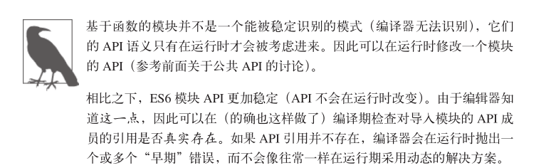

ES6的模块没有“行内”格式，必须被定义在独立的文件中（一个文件一个模块）。浏览器或引擎有一个默认的“模块加载器”（可以被重载，但这远超出了我们的讨论范围）可以在导入模块时异步地加载模块文件。

考虑以下代码：

**bar.js**

~~~javascript
function hello(who){
    return "Let me introduce:" + who;
}
export hello;
~~~

**foo.js**

~~~javascript
//仅从"bar"模块导入hello()
import hello from "bar";
var hungry = "hippo";

function awesome(){
    console.log(hello(hungry).toUpperCase());
}

export awesome;
~~~

**baz.js**

~~~javascript
//导入完整的"foo"和"bar"模块
module foo from "foo";
module bar from "bar";

console.log(bar.hello("rhino"));
//Let me introduce:rhino

foo.awesome();	//LET ME INTRODUCE:HIPPO
~~~

import可以将一个模块中的一个或多个API导入到当前作用域中，并分别绑定在一个变量上（在我们的例子里是hello），module会将整个模块的API导入并绑定到一个变量上（在我们的例子里是foo和bar），export会将当前模块的一个标识符（变量、函数）导出为公共API，这些操作可以在模块定义中根据需要使用任意多次。

模块文件中的内容会被当作好像包含在作用域闭包中一样来处理，就和前面介绍的函数闭包模块一样。

## 小结

闭包就好像从JavaScript中分离出来的一个充满神秘色彩的未开化世界，只有最勇敢的人才能够到达那里。但实际上它只是一个标准，显然就是关于如何在函数作为值按需传递的词法环境中书写代码的。

当函数可以记住并访问所在的词法作用域，即使函数是在当前词法作用域之外执行，这时就产生了闭包。

如果没能认出闭包，也不了解它的工作原理，在使用它的过程中就很容易犯错，比如在循环中。但同时闭包也是一个非常强大的工具，可以用多种形式来实现模块等模式。

模块有两个主要特征：（1）为创建内部作用域而调用了一个包装函数；（2）包装函数的返回值必须至少包括一个对内部函数的引用，这样就会创建涵盖整个包装函数内部作用域的闭包。

现在我们会发现代码中到处都有闭包存在，并且我们能够识别闭包然后用它来做一些有用的事！

> 现在是2020年11月04日，截止到这里复习完。最早看的时候是3月份，现在8个月过去了，现在慢慢的，终于可以继续看下去了，不会有完全看不下去的感觉了，

# 附录A：动态作用域

[动态作用域和词法域的区别是什么？](https://www.zhihu.com/question/20032419)

[浅谈静态作用域和动态作用域](https://www.cnblogs.com/lienhua34/archive/2012/03/10/2388872.html)

在第2章中，我们对比了动态作用域和词法作用域模型，JavaScript中的作用域就是词法作用域（事实上大部分语言都是基于词法作用域的）。

我们会简要地分析一下动态作用域，重申它与词法作用域的区别。但实际上动态作用域是lavaScript另一个重要机制this的表亲，本书第二部分"this和对象原型”中会有详细介绍。

从第2章中可知，词法作用域是一套关于引擎如何寻找变量以及会在何处找到变量的规则。词法作用域最重要的特征是它的定义过程发生在代码的书写阶段（假设你没有使用`eval()`或with）。

动态作用域似乎暗示有很好的理由让作用域作为一个在运行时就被动态确定的形式，而不是在写代码时进行静态确定的形式，事实上也是这样的。我们通过示例代码来说明：

~~~javascript
function foo(){
    console.log(a);		//2
}

function bar(){
    var a = 3;
    foo();
}

var a  = 2;
bar();
~~~

词法作用域让`foo()`中的a通过RHS引用到了全局作用域中的a，因此会输出2。

而动态作用域并不关心函数和作用域是如何声明以及在何处声明的，只关心它们从何处调用。换句话说，作用域链是基于调用栈的，而不是代码中的作用域嵌套。

因此，如果JavaScript具有动态作用域，**理论上**，下面代码中的`foo()`在执行时将会输出3。

~~~javascript
function foo(){
    console.log(a);		//3(不是2！！)
}

function bar(){
    var a = 3;
    foo();
}

var a  = 2;
bar();
~~~

为什么会这样？因为当`foo()`无法找到a的变量引用时，会顺着调用栈在调用`foo()`的地方查找a，而不是在嵌套的词法作用域链中向上查找。由于`foo()`是在`bar()`中调用的，引擎会检查`bar()`的作用域，并在其中找到值为3的变量a。

很奇怪吧？现在你可能会这么想。

但这其实是因为你可能只写过基于词法作用域的代码（或者至少以词法作用域为基础进行了深入的思考），因此对动态作用域感到陌生。如果你只用基于动态作用域的语言写过代码，就会觉得这是很自然的，而词法作用域看上去才怪怪的。

需要明确的是，事实上JavaScript并不具有动态作用域。它只有词法作用域，简单明了。

但是this机制某种程度上很像动态作用域

主要区别：词法作用域是在写代码或者说定义时确定的，而动态作用域是在运行时确定的。（this也是！）词法作用域关注函数在何处声明，而动态作用域关注函数从何处调用。最后，this关注函数如何调用，这就表明了this机制和动态作用域之间的关系多么紧密。

如果想了解更多关于this的详细内容，参见本书第二部分"this和对象原型"。

# 附录B：块作用域的替代方案

第3章深入研究了块作用域。至少从ES3发布以来，JavaScript中就有了块作用域，而with和catch分句就是块作用域的两个小例子。

但随着ES6中引入了let，我们的代码终于有了创建完整、不受约束的块作用域的能力。块作用域在功能上和代码风格上都拥有很多激动人心的新特性。

但如果我们想在ES6之前的环境中使用块作用域呢？

考虑下面的代码：

~~~javascript
{
    let a = 2;
    console.log(a);		//2
}
console.log(a);		//ReferenceError
~~~

这段代码在ES6环境中可以正常工作。但是在ES6之前的环境中如何才能实现这个效果？

答案是使用**catch**。

~~~javascript
try{throw 2;}catch(a){
    console.log(a);		//2
}
console.log(a);			//ReferenceError
~~~

天啊！这些代码既丑陋又奇怪。我们看见一个会强制抛出错误的try/catch，但是它抛出的错误就是一个值2，然后catch分句中的变量声明会接收到这个值。头疼！

没错，catch分句具有块作用域，因此它可以在ES6之前的环境中作为块作用域的替代方案。

“但是，”你可能会说，“鬼才要写这么丑陋的代码！”没错，没人写的代码像Coffeescript编译器输出的代码，但这不是重点。

重点是工具可以将ES6的代码转换成能在ES6之前环境中运行的形式。你可以使用块作用域来写代码，并享受它带来的好处，然后在构建时通过工具来对代码进行预处理，使之可以在部署时正常工作。

事实上，这是向ES6中的所有（好吧，不是所有而是大部分）功能迁移的首选方式：在从ES6之前的环境向ES6过渡时，使用代码转换工具来对ES6代码进行处理，生成兼容ES5的代码。

## Traceur

Google维护着一个名为Traceur的项目，该项目正是用来将ES6代码转换成兼容ES6之前的环境（大部分是ES5，但不是全部），TC39委员会依赖这个工具（也有其他工具）来测试他们指定的语义化相关的功能。Traceur会将我们的代码片段转换成什么样子？你能猜到的！

Traceur 会将我们的代码片段转换成什么样子？你能猜到的！

~~~javascript
{
    try{
        throw undefined;
    }catch(a){
        a = 2;
        console.log(a);
    }
}
console.log(a);
~~~

通过使用这样的工具，我们就可以在使用块作用域时无需考虑目标平台是否是ES6环境，因为`try/catch`从ES3开始就存在了（并且一直是这样工作的）。

## 隐式和显式作用域

在第3章中介绍块作用域时，我们的代码有一些可维护性和可扩展性方面的缺陷。有没有其他可以使用块作用域，并且还能避免这种缺陷的途径？

考虑下面这种Let的使用方法，它被称作let作用域或let声明（对比前面的let定义）。

~~~javascript
let (a = 2){
	console.log(a); 	 //2
}
console.log(a);		 //ReferenceError
~~~

同隐式地劫持一个已经存在的作用域不同，Let声明会创建一个显示的作用域并与其进行绑定。显式作用域不仅更加突出，在代码重构时也表现得更加健壮。在语法上，通过强制性地将所有变量声明提升到块的顶部来产生更简洁的代码。这样更容易判断变量是否属于某个作用域。

这种模式同很多人在函数作用域中手动将var声明提升到函数顶部的方式很接近。let声明有意将变量声明放在块的顶部，如果你并没有到处使用let定义，那么你的块作用域就很容易辨识和维护。

但是这里有一个小问题，let声明并不包含在ES6中。官方的Traceur编译器也不接受这种形式的代码。

我们有两个选择，使用合法的ES6语法并且在代码规范性上做一些妥协。

~~~javascript
/*let*/
{
    let a = 2;
    console.log(a);
}
console.log(a);		//ReferenceError
~~~

工具就是用来解决问题的。因此另外一个选择就是编写显式let声明，然后通过工具将其转换成合法的、可以工作的代码。

因此我开发了一个名为let-er的工具来解决这个问题。let-er是一个构建时的代码转换器，但它唯一的作用就是找到let声明并对其进行转换。它不会处理包括let定义在内的任何其他代码。你可以安全地将let-er应用在ES6代码转换的第一步，如果有必要，接下来也可以把代码传递给Traceur等工具。

此外，let-er还有一个设置项--es6，开启它（默认是关闭的）会改变生成代码的种类。开启这个设置项时let-er会生成完全标准的ES6代码，而不会生成通过try/catch进行hach的ES3替代方案：

~~~javascript
{
    let a = 2;
    console.log(a);
}
console.log(a);		//ReferenceError
~~~

因此你马上就可以在ES6之前的所有环境中使用let-er，当你只关注ES6环境时，可以开启设置项，这样就会生成标准的ES6代码。

更重要的，你甚至可以使用尚未成为ES官方标准的、更加好用的显式let声明。

## 性能

最后简单地看一下try/catch带来的性能问题，并尝试回答“为什么不直接使用1IIFE来创建作用域”这个问题。

首先，`try/catch`的性能的确很糟糕，但技术层面上没有合理的理由来说明`try/catch`必须这么慢，或者会一直慢下去。自从TC39支持在ES6的转换器中使用`try/catch`后，Traceur团队已经要求Chrome对`try/catch`的性能进行改进，他们显然有很充分的动机来做这件事情。

其次，IIFE和try/catch并不是完全等价的，因为如果将一段代码中的任意一部分拿出来用函数进行包裹，会改变这段代码的含义，其中的this，return，break和contine都会发生变化。IIFE并不是一个普适的解决方案，它只适合在某些情况下进行手动操作。最后问题就变成了：你是否想要块作用域？如果你想要，这些工具就可以帮助你。如果不想要，继续使用var来写代码就好了！

# 附录C

尽管这个标题没有详细说明this机制，但是ES6中有一个主题用非常重要的方式将this同词法作用域联系起来了，我们会简单地讨论一下。

ES6添加了一个特殊的语法形式用于函数声明，叫作**箭头函数**。它看起来是下面这样的：

~~~javascript
var foo = a => {
    console.log(a);
};

foo(2);		//2
~~~

这里称作“胖箭头”的写法通常被当作单调乏味且冗长（挖苦）的function关键字的简写。

但是箭头函数除了让你在声明函数时**少敲几次键盘**以外，还有更重要的作用。简单来说，下面的代码有问题：

~~~javascript
var obj = {
    id:"awesome",
    cool:function coolFn(){
        console.log(this.id);
    }
};

var id = "not awesome"

obj.cool();		//awesome
setTimeout(obj.cool,100);	//not awesome
~~~

> 这个函数看不懂

问题在于`cool()`函数丢失了同this之间的绑定。解决这个问题有好几种办法，但最长用的就是`var self = this；`。

使用起来如下所示：

~~~javascript
var obj = {
    count:0,
    cool:function coolFn(){
        var self = this;
        
        if(self.count <1){
            setTimeout(function timer(){
                self.count++;
                console.log("awesome?");
            },100);
        }
    }
};
obj.cool();		//awesome?
~~~

`var self =this`这种解决方案圆满解决了理解和正确使用this绑定的问题，并且没有把问题过于复杂化，它使用的是我们非常熟悉的工具：词法作用域。self只是一个可以通过词法作用域和闭包进行引用的标识符，不关心this绑定的过程中发生了什么。

人们不喜欢写冗长的东西，尤其是一遍又一遍地写。因此ES6的一个初衷就是帮助人们减少重复的场景，事实上包括修复某些习惯用法的问题，this就是其中一个。

ES6中的箭头函数引入了一个叫作this词法的行为：

~~~javascript
var obj = {
    count:0,
    cool:function coolFn(){
        if(self.count <1){
            setTimeout(()=>{
                this.count++;
                console.log("awesome?");
            },100)
        }
    }
};
obj.cool();		//awesome?
~~~

简单来说，箭头函数在涉及this绑定时的行为和普通函数的行为完全不一致。它放弃了所有普通this绑定的规则，取而代之的是用当前的词法作用域覆盖了this本来的值。

因此，这个代码片段中的箭头函数并非是以某种不可预测的方式同所属的this进行了解绑定，而只是“继承”了`cool()`函数的this绑定（因此调用它并不会出错）。

这样除了可以少写一些代码，我认为箭头函数将程序员们经常犯的一个错误给标准化了，也就是混淆了this绑定规则和词法作用域规则。

换句话说：为什么要自找麻烦使用this风格的代码模式呢？把它和词法作用域结合在一起非常让人头疼。在代码中使用两种风格其中的一种是非常自然的事情，但是不要将两种风格混在一起使用。

在我看来，解决这个“问题”的另一个更合适的办法是正确使用和包含this机制。

~~~javascript
var obj = {
    count:0,
    cool:function coolFn(){
        if(self.count <1){
           setTimeout(function timer(){
               this.count++;	
               //this是安全的
               //因为bind(...)
               console.log("more awesome");
           }.bind(this),100);
            //look,bind()!
        }
    }
};
obj.cool();		//more awesome
~~~

无论你是喜欢箭头函数中this词法的新行为模式，还是喜欢更靠得住的bind()，都需要注意箭头函数不仅仅意味着可以少写代码。

它们之间有意为之的不同行为需要我们理解和掌握，才能正确地使用它们。

现在我们已经完全理解s了词法作用域（还有闭包），理解this词法是小菜一碟！

> 希望如此啊！

# 第二部分：this和对象原型

[this 的值到底是什么？一次说清楚](https://zhuanlan.zhihu.com/p/23804247)

# 序

读这本书准备作序的时候，我不禁想起15年前学习JavaScript时的情景。过去的这15年中，我一直用它进行编程和开发，同时，JavaScript也在不断发生变化。

15年前我刚开始使用JavaScript时，在网页中使用CsS和JavaScript等非HTML技术被称为DHTML或者动态HTML，在那之后，JavaScript的用途发生了巨大的变化，印象中主要用于给网页添加动态雪花或者在状态栏中添加动态时钟。说实话，职业生涯的早期我并没有对JavaScript给予足够的重视，因为在我看来它主要的功能就是编写一些有趣的小东西。

直到2005年我才第一次认识到JavaScript是一门真正的编程语言，应当受到我的重视。仔细研究了谷歌地图的第一个测试版本之后，我被它的潜力深深地吸引住了。在那时，谷歌地图是一个史无前例的应用-你可以用鼠标移动和缩放地图，并且可以在不重载页面的情况下发起服务器请求-这些全部用JavaScript完成，简直就像魔法一样！

如果某些事情对你来说像魔法一样，那意味着你看到了新生事物的曙光。我的想法是正确的-今天，无论在客户端还是服务端，JavaScript都已经成为了我的一门主要编程语言，没有其他语言比它更适合完成这些工作。

回顾这15年，有一件事我很后悔，那就是没有在2005年之前给予JavaScript足够的重视。更准确地说，我并没有想到JavaScript会像C++、C#、Java等语言一样，成为一门非常有用的真正的编程语言。

如果在一开始时就能遇到“你不知道的JavaScript"系列丛书，我的整个职业生涯都会大不相同。对于这个系列丛书，我非常欣赏的一点是：它可以用有趣并且有效的方式帮助你构建起对于JavaScript的理解。

本书第二部分"this和对象原型”非常不错，它很好地衔接了本书第一部分“作用域和闭包”，进一步介绍了JavaScript语言中非常重要的两个部分，this关键字和原型。这两个部分对于你未来的学习来说非常重要，它们是使用JavaScript进行编程的基础。只有掌握了如何创建、关联和扩展对象，你才能用JavaScript创建类似谷歌地图这样大型的复杂应用。

在我看来，绝大多数Web开发者可能都没有创建过一个JavaScript对象，他们只是把JavaScript当作按钮和AJAX请求之间的事件绑定粘合剂。其实我也曾经是他们中的一员，但是当我学会在JavaScript中使用原型和创建对象之后，整个世界都变样了。如果你也只会编写事件绑定代码，那么这本书是非读不可的；如果你只想复习一下的话，这本书也一定是首选。无论如何，你绝对不会失望的，相信我！

# 第1章：关于this

[this 的值到底是什么？一次说清楚](https://zhuanlan.zhihu.com/p/23804247)

> 现在是2020年7月27日，看到后面看不下去了，回过头来重新再看一遍吧。——不行，重头看也不行，看不下去，还是接着硬着头皮往后面抄书吧。
>
> 现在是2020年11月06日，我又回来啦。

**this关键字**是JavaScript中**最复杂的机制之一**。它是一个很特别的**关键字**，被**自动定义**在**所有函数的作用域中**。但是即使是非常有经验的JavaScript开发者也很难说清它到底**指向**什么。

> 任何足够先进的技术都和魔法无异。          																		 ——Arthur C.Clarke

实际上，JavaScript中this的机制并没有那么先进，但是开发者往往会把理解过程复杂化，毫无疑问，**在缺乏清晰认识的情况下，this对你来说完全就是一种魔法**。

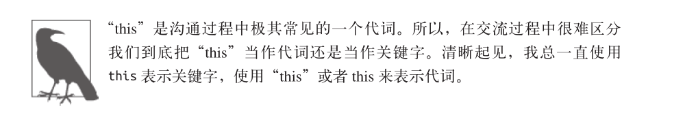

## 为什么要用this

如果对于有经验的JavaScript开发者来说this都是一种非常复杂的机制，那它**到底有用在哪里呢**？真的值得我们付出这么大的代价学习吗？的确，在介绍**怎么做(how)**之前我们需要先明白**为什么(why)**。

下面我们来解释一下为什么要使用this：

~~~javascript
function identify(){
	return this.name.toUpperCase();
}

function speak(){
	var greeting = "Hello,I'm" + identify.call(this);
	console.log(greeting);
}

var me = {
	name: 'Kely'
};

var you = {
	name: 'reader'
};

identify.call(me);		//KYLE
identify.call(you);		//READER

speak.call(me);		//Hello,I'm KYLE
speak.call(you);	//Hello,I'm READER
~~~

> call和apply关键字用法都不熟！！！以后要搞熟，面试经常问。
>
> 现在是2020年11月06日，现在慢慢的熟悉call和apply关键字用法了。

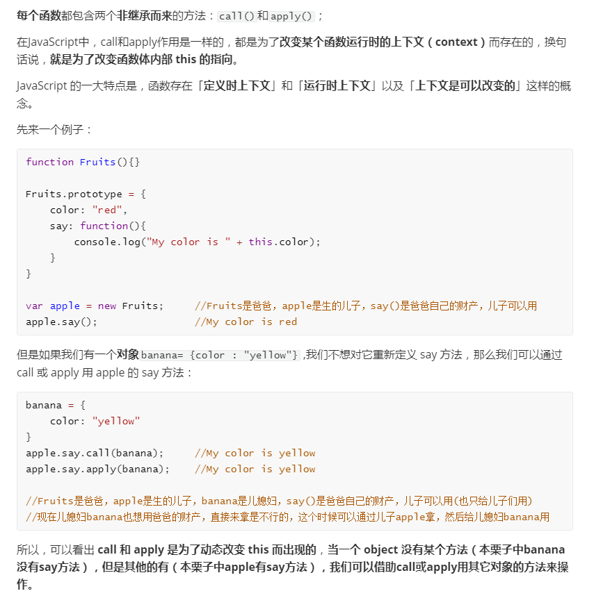

> 这是我写的另一篇博文：《学习JavaScript遇到的瓶颈之概念》

看不懂这段代码？不用担心！我们很快就会讲解。现在请**暂时抛开这些问题**，专注于**为什么(why)**。

> 遇到一个问题时的三要素：`what`、 `why`、 `how`

这段代码可以在不同的**上下文对象(me和you)**中**重复使用函数`identify()`和`speak()`**，**不用针对每个对象编写不同版本的函数**。

如果不使用this，那就需要给`identify()`和`speak()`**显式传入一个上下文对象**。

~~~javascript
function identify(context){
	return context.name.toUpperCase();
}

function speak(context){
	var greeting = "Hello,I'm" + identify(context);
	console.log(greeting);
}

identify.call(you);		//READER
speak(me);				//Hello,I'm KYLE
~~~

然而，this提供了一种更优雅的方式来隐式“传递”一个对象引用，因此可以将API设计得更加简洁并且易于复用。

随着你的**使用模式越来越复杂**，**显式传递上下文对象**会**让代码变得越来越混乱**，使用this则不会这样。当我们介绍**对象和原型**时，你就会明白**函数可以自动引用合适的上下文对象**有多重要。

## 误解

我们之后会解释this到底是如何工作的，但是首先需要消除一些关于this的错误认识。

太拘泥于"this”的字面意思就会产生一些误解。有**两种**常见的对于this的解释，但是它们都是**错误**的。

### 指向自身

人们很容易把this理解成**指向函数自身**，这个推断从英语的**语法角度**来说是说得通的。

那么为什么需要**从函数内部**引用函数自身呢？常见的原因是**递归**(从函数内部调用这个函数)**或者**可以写一个在第一次被调用后自己解除绑定的**事件处理器**。

JavaScript的新手开发者通常会认为，既然函数看作一个**对象**(JavaScript中的所有函数都是对象)，那就可以在**调用函数时存储状态**(**属性的值**)。这是可行的，有些时候也确实有用，但是在本书即将介绍的许多模式中你会发现，**除了函数对象还有许多更合适存储状态的地方**。

不过现在我们先来分析一下这个模式，让大家看到**this并不像我们所想的那样指向函数本身**。

我们想要记录一下函数foo被调用的次数，思考一下下面的代码：

~~~javascript
function foo(num){
	console.log("foo:" + num);
	//记录foo被调用的次数
	this.counter++;
}

foo.count = 0;
//函数也是对象，也可以有属性。

var i;

for(i=0;i<10; i++){
	if( i > 5){
		foo(i);
	}
}

//foo:6
//foo:7
//foo:8
//foo:9

//foo被调用了多少次？
console.log(foo.count);	//0 --WTF?
~~~

> 这个代码还是看的不透。

`console.log`语句产生了4条输出，证明`foo(..)`确实被调用了4次，但是`foo.count`仍然是0。显然从字面意思来理解this是错误的。

执行`foo.count = 0`时，的确向函数对象foo添加了一个属性count，但是**函数内部代码`this.count`中的this并不是指向那个函数对象，所以虽然属性名相同，根对象却并不相同**，困惑随之产生。

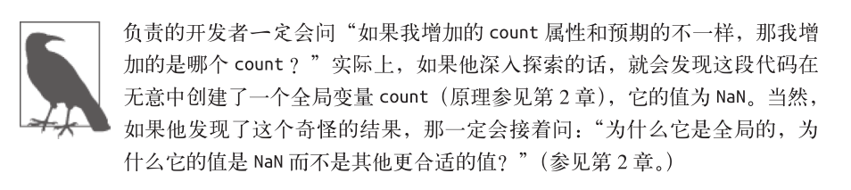

遇到这样的问题时，许多开发者并不会深入思考为什么this的行为和预期的不一致，也不会试图回答那些**很难解决但却非常重要**的问题。他们只会回避这个问题并使用其他方法来达到目的，比如创建另一个带有count属性的对象。

~~~javascript
function foo(num){
	console.log("foo:" + num);
	//记录foo被调用的次数
	data.counter++;
}

var data = {
  	count: 0
};

var i;

for(i=0;i<10;i++){
   if(i>5){
     foo(i);
  }
}

//foo:6
//foo:7
//foo:8
//foo:9

//foo被调用了多少次？
console.log(data.count);	//4
~~~

从某种角度来说这个方法确实“解决”了问题，但可惜它忽略了真正的问题--无法理解this的含义和工作原理——而是**返回舒适区**，使用了一种更熟悉的技术：**词法作用域**。

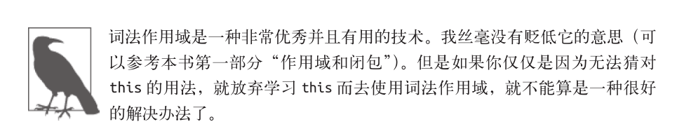

如果要**从函数对象内部引用它自身**，那只使用 this 是不够的。一般来说你需要**通过一个指向函数对象的词法标识符(变量)**来引用它。

思考一下下面这两个函数：

~~~javascript
function foo(){
    foo.count = 4;		//foo指向它自身
}

setTimeout(function(){
    //匿名(没有名字的)函数无法指向自身
},10);
~~~

第一个函数被称为**具名函数**，在它内部可以使用 foo 来引用自身。

但是在第二个例子中，传入`setTimeout(..)` 的回调函数没有名称标识符(这种函数被称为**匿名函数**)，因此无法从函数内部引用自身。

> 这个我懂

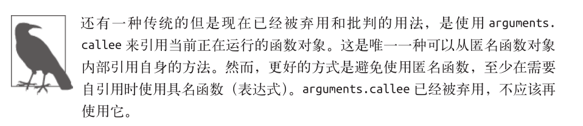

[arguments.callee](https://developer.mozilla.org/zh-CN/docs/Web/JavaScript/Reference/Functions/arguments/callee)

所以，对于我们的例子来说，另一种解决方法是**使用 foo 标识符**替代 this 来引用函数对象：

~~~javascript
function foo(num){
	console.log("foo:" + num);
	//记录foo被调用的次数
	foo.counter++;
}

foo.count = 0;

var i;

for(i=0;i<10; i++){
	if(i>5){
		foo(i);
	}
}

//foo:6
//foo:7
//foo:8
//foo:9

//foo被调用了多少次？
console.log(foo.count);	//4
~~~

然而，这种方法同样回避了 this 的问题，并且完全依赖于变量 foo 的词法作用域。

另一种方法是**强制 this 指向 foo 函数对象**：

~~~javascript
function foo(num){
	console.log("foo:" + num);
	//记录foo被调用的次数
    //注意，在当前的调用方式下(参见下方代码)，this 确实指向 foo
	this.counter++;
}

foo.count = 0;

var i;

for(i=0;i<10; i++){
	if(i>5){
       // 使用 call(..) 可以确保 this 指向函数对象 foo 本身
	   foo.call(foo,i);
       //这句代码还是看不懂
       //直接写foo(i)不行吗？？？
	}
}

//foo:6
//foo:7
//foo:8
//foo:9

//foo被调用了多少次？
console.log(foo.count);	//4
~~~

这次我们接受了 this ，没有回避它。如果你仍然感到困惑的话，不用担心，之后我们会详细解释具体的原理。

> 能力有限，无法深刻理解。
>
> 现在是2020年11月06日，还是看不懂上面的代码。

### 它的作用域

**第二种**常见的误解是， **this 指向函数的作用域**。这个问题有点**复杂**，因为在**某种情况下它是正确的，但是在其他情况下它却是错误的**。

需要明确的是， this 在任何情况下都**不指向**函数的词法作用域。在 JavaScript 内部，作用域确实和对象类似，可见的标识符都是它的属性。但是**作用域“对象”**无法通过 JavaScript代码访问，它**存在于 JavaScript 引擎内部**。

思考一下下面的代码，它试图(但是没有成功)跨越边界，使用 this 来**隐式引用**函数的词法作用域：

~~~javascript
function foo(){
    var a = 2;
    this.bar();
}

function bar(){
    console.log(this.a);
}

foo();	//ReferenceError: a is not defined
~~~

> 代码看不懂啊。

这段代码中的错误不止一个。虽然这段代码看起来好像是我们故意写出来的例子，但是实际上它出自一个**公共社区**中互助论坛的精华代码。这段代码非常完美(同时也令人伤感)地展示了 this 多么容易误导人。

**首先**，这段代码试图通过 `this.bar() `来引用` bar() `函数。这是**绝对不可能成功**的，我们之后会解释原因。调用 `bar()` 最自然的方法是**省略前面的 this** ，**直接使用词法引用标识符**。

**此外**，编写这段代码的开发者还试图使用 this 联通` foo() `和` bar() `的词法作用域，从而让`bar() `可以访问 `foo() `作用域里的变量 a 。这是**不可能实现**的，**你不能使用 this 来引用一个词法作用域内部的东西**。

**每当你想要把 this 和词法作用域的查找混合使用时，一定要提醒自己，这是无法实现的。**

## this到底是什么

排除了一些错误理解之后，我们来看看 this 到底是一种什么样的机制。

之前我们说过 this 是在**运行时**进行绑定的，**并不是在编写时绑定**，**它的上下文取决于函数调用时的各种条件**。 **this 的绑定和函数声明的位置没有任何关系**，只**取决于函数的调用方式**。

当一个函数被**调用**时，会创建一个**活动记录**(有时候也称为**执行上下文**)。这个记录会包含**函数在哪里被调用(调用栈)**、**函数的调用方法**、**传入的参数**等信息。 **this 就是记录的其中一个属性**，会在**函数执行的过程中用到**。

在下一章我们会学习如何**寻找函数的调用位置**，从而**判断函数在执行过程中会如何绑定this** 。

## 小结

对于那些没有投入时间学习 this 机制的 JavaScript 开发者来说， this 的绑定一直是一件非常令人困惑的事。 **this 是非常重要的，但是猜测、尝试并出错和盲目地从 Stack Overflow上复制和粘贴答案并不能让你真正理解 this 的机制**。

学习 this 的**第一步**是明白 **this 既不指向函数自身也不指向函数的词法作用域**，你也许被这样的解释误导过，但其实它们都是错误的。

**this 实际上是在函数被调用时发生的绑定**，**它指向什么完全取决于函数在哪里被调用**。

> 现在是2020年11月06日，`this`的理解还是远远不够。截止到这里复习完。

# 第2章：this全面解析

[JavaScript 的 this 原理——阮一峰](https://www.ruanyifeng.com/blog/2018/06/javascript-this.html)

在第 1 章中，我们排除了一些对于 this 的错误理解并且明白了**每个函数的 this 是在调用时被绑定的**，完全取决于函数的**调用位置**(也就是**函数的调用方法**)。

<strong style="color:red">最最最核心的一点——函数中的this总指向调用它的对象！！！</strong>

## 调用位置

[浅析javascript调用栈](https://segmentfault.com/a/1190000010360316)

[Call Stack（调用栈）是什么？](https://zhuanlan.zhihu.com/p/71168084)

在理解this的绑定过程之前，**首先**要理解**调用位置**：**调用位置就是函数在代码中被调用的位置(而不是声明的位置**)。只有仔细分析调用位置才能回答这个问题：这个this到底引用的是什么？

通常来说，**寻找调用位置就是寻找“函数被调用的位置”**，但是做起来并没有这么简单，因为**某些编程模式可能会隐藏真正的调用位置**。

> 怎么感觉跟绕口令一样。

最重要的是要**分析调用栈**(就是**为了到达当前执行位置所调用的所有函数**)。我们关心的调用位置就在当前正在执行的函数的**前一个调用中**。

> ？什么意思啊？

下面我们来看看**到底什么是调用栈和调用位置**：

~~~javascript
function baz(){
    //当前调用栈是：baz
    //因此，当前调用位置是全局作用域
    
    console.log('baz');
    bar();		//<--bar的调用位置
}

function bar(){
    //当前调用栈是baz -> bar
    //因此，当前调用位置在baz中
    
    console.log('bar');
    foo();		//<--foo的调用位置
}

function foo(){
    //当前调用栈是baz -> bar ->foo
    //因此，当前调用位置在bar中
    
    console.log('foo');
}

baz();			//<-- baz的调用位置
~~~

> 这段代码我可以看懂。

注意我们是如何(从调用栈中)分析出真正的调用位置的，因为它决定了this的绑定。

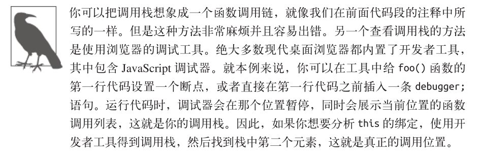

## 绑定规则

[函数中的this的四种绑定形式 — 大家准备好瓜子，我要讲故事啦~~](https://www.cnblogs.com/penghuwan/p/7356210.html)

我们来看看在函数的执行过程中调用位置如何决定this的绑定对象。

你必须**找到调用位置**，然后判断需要应用**下面四条规则中的哪一条**。我们首先会分别解释这四条规则，然后解释多条规则都可用时它们的优先级如何排列。

/39.png)

### 默认绑定

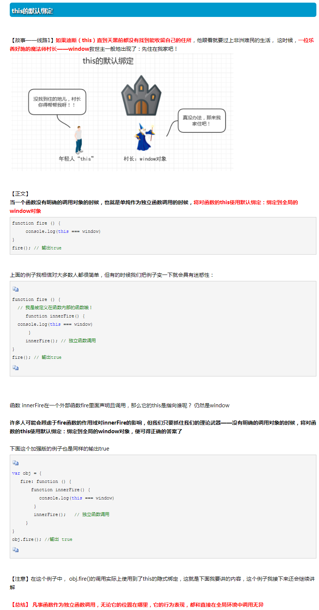

**首先**要介绍的是最常用的函数调用类型：**独立函数调用**。可以把这条规则看作是无法应用其他规则时的**默认规则**。

思考一下下面的代码：

~~~javascript
function foo(){
    console.log(this.a);
}

var a = 2;
foo();	//2
~~~

你应该注意到的**第一件事**是，**声明在全局作用域中的变量**(比如`var a = 2`)就是**全局对象的一个同名属性**。它们本质上就是**同一个东西**，**并不是通过复制得到的**，就像一个硬币的两面一样。

接下来我们可以看到当调用`foo()`时，`this.a`被解析成了全局变量a。为什么？因为在本例中，**函数调用时**应用了**this的默认绑定**，因此**this指向全局对象**。

那么我们怎么知道这里应用了**默认绑定**呢？可以通过分析调用位置来看看`foo()`是如何调用的。在代码中，`foo()`是直接使用**不带任何修饰的函数引用**进行调用的，因此只能使用默认绑定，无法应用其他规则。

如果使用严格模式(strict mode)，那么全局对象将无法使用默认绑定，因此**this会绑定到undefined**：

~~~javascript
function foo(){
    'use strict'
    console.log(this.a);
}

var a = 2;
foo();	//TypeError:this is undefined
~~~

这里有一个微妙但是非常重要的细节，虽然**this的绑定规则完全取决于调用位置**，但是只有`foo()`运行在**非strict mode**下时，**默认绑定才能绑定到全局对象**；**严格模式下与`foo()`的调用位置无关**：

~~~javascript
function foo(){
    console.log(this.a);
}

var a = 2;

(function(){
    'use strict'
    foo();		//2
})();
~~~

> 这段代码没有看懂啊。

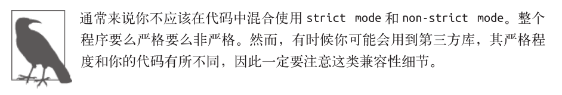

### 隐式绑定

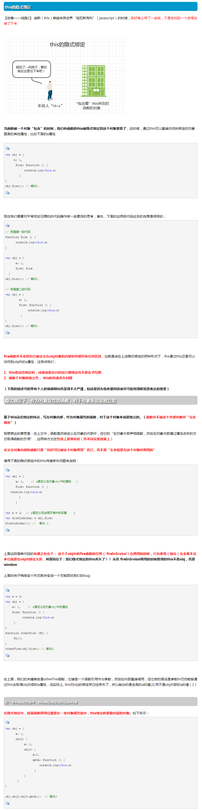

另一条需要考虑的规则是**调用位置是否有上下文对象**，或者说**是否被某个对象拥有或者包含**，不过**这种说法可能会造成一些误导**。

思考下面的代码：

~~~javascript
function foo(){
    console.log(this.a);
}

var obj = {
    a:2,
    foo:foo
};

obj.foo();	//2
~~~

首先需要注意的是`foo()`的**声明方式**，及其之后是**如何被当作引用属性添加到obj中的**。但是**无论是直接在obj中定义还是先定义再添加为引用属性**，这个函数**严格来说都不属于obj对象**。

然而，**调用位置**会使用**obj上下文**来引用函数，因此你可以说**函数被调用时obj对象“拥有”或者“包含”它**。

无论你如何称呼这个模式，当`foo()`被调用时，它的落脚点确实指向obj对象。**当函数引用有上下文对象时，隐式绑定规则会把函数调用中的this绑定到这个上下文对象**。因为调用`foo()`时this被绑定到obj，因此`this.a`和`obj.a`是一样的。

**对象属性引用链**中**只有最顶层或者说最后一层会影响调用位置**。举例来说：

~~~javascript
function foo(){
    console.log(this.a);
}

var obj2 = {
    a:42,
    foo:foo
};

var obj1 = {
    a:2,
    obj2:obj2
};

obj1.obj2.foo();	//42
~~~

> 大概可以看懂。

#### 隐式丢失

一个最常见的this绑定问题就是**被隐式绑定的函数会丢失绑定对象**，也就是说**它会应用默认绑定**，从而**把this绑定到全局对象或者undefined上**，**取决于是否是严格模式**。

思考下面的代码：

~~~javascript
function foo(){
    console.log(this.a);
}

var obj = {
    a: 2,
    foo: foo
};

var bar = obj.foo;		//函数别名！！！

var a = 'oops,global';	//a是全局对象的属性

bar();		//'oops,global'
~~~

虽然bar是`obj.foo`的一个引用，但是实际上，**它引用的是foo函数本身**，因此**此时的`bar()`其实是一个不带任何修饰的函数调用**，因此**应用了默认绑定**。

一种更微妙、更常见并且更出乎意料的情况发生在传入**回调函数**时：

~~~javascript
function foo(){
    console.log(this.a);
}

function doFoo(fn){
    //fn其实引用的是foo
    fn();		//<--调用位置！
}

var obj = {
    a: 2;
    foo: foo
};

var a =  'oops,global';	//a是全局对象的属性
doFoo(obj.foo);			//'oops,global'
~~~

> 这段代码终于慢慢可以看懂了。

参数传递其实就是一种**隐式赋值**，因此我们传入函数时也会被隐式赋值，所以结果和上一个例子一样。

如果把函数**传入语言内置的函数而不是传入你自己声明的函数**，会发生什么呢？**结果是一样的，没有区别**：

~~~javascript
function foo(){
    console.log(this.a);
}

var obj = {
    a: 2,
    foo: foo
};

var a =  'oops,global';	//a是全局对象的属性

setTimeout(obj.foo,100);	//'oops,global'
~~~

JavaScript环境中内置的`setTimeout()`函数实现和**下面的伪代码**类似：

~~~javascript
function setTimeout(fn,delay){
    //等待delay毫秒
    fn();	//<--调用位置
}
~~~

就像我们看到的那样，**回调函数丢失this绑定是非常常见的**。除此之外，还有一种情况this的行为会出乎我们意料：**调用回调函数的函数可能会修改this**，**在一些流行的JavaScript库中事件处理器常会把回调函数的this强制绑定到触发事件的DOM元素上**。这在一些情况下可能很有用，但是有时它可能会让你感到非常郁闷。遗憾的是，这些工具通常无法选择是否启用这个行为。

无论是哪种情况，**this的改变都是意想不到的**，**实际上你无法控制回调函数的执行方式**，**因此就没有办法控制会影响绑定的调用位置**。之后我们会介绍如何通过固定this来修复(这里是双关，“修复”和“固定”的英语单词都是fixing)这个问题。

> 现在是2020年11月9日，截止到上面复习完。

### 显式绑定

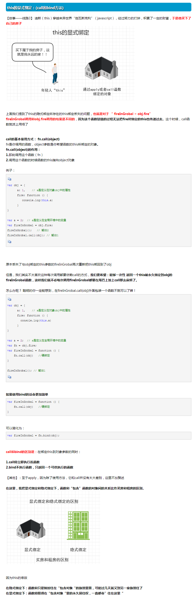

就像我们刚才看到的那样，在**分析隐式绑定**时，我们**必须在一个对象内部包含一个指向函数的属性，并通过这个属性间接引用函数**，从而把this间接(隐式)绑定到这个对象上。

那么如果我们不想在对象内部包含函数引用，而想在某个对象上**强制调用函数**，该怎么做呢？

JavaScript中的**“所有”函数**都有一些有用的特性(这和它们的**原型**有关——之后我们会详细介绍原型)，可以用来解决这个问题。具体点说，可以使用函数的`call(..)`和`apply(..)`方法。严格来说，**JavaScript的宿主环境**有时会提供一些非常特殊的函数，它们并没有这两个方法。但是这样的函数非常罕见，JavaScript提供的**绝大多数函数**以及**你自己创建的所有函数**都可以使用`call(..)`和`apply(..)`方法。

这两个方法是如何工作的呢？它们的**第一个参数是一个对象**，它们**会把这个对象绑定到this(这句话一定要好好的咀嚼一下)**，接着**在调用函数时指定这个this(这句话一定要好好的咀嚼一下)**，因为你可以**直接指定this的绑定对象**，因此我们称之为**显式绑定**。

思考下面的代码：

~~~javascript
function foo(){
    console.log(this.a);
}

var obj = {
    a:2
};

foo.call(obj);		//2
~~~

> foo是函数名，函数都有`call()`方法，所以有`foo.call()`，`call()`函数的第一个参数是一个对象，会把这个对象绑定到this，接着在调用函数的时候指向这个this，则`foo.call(obj)`表示把obj对象绑定到this，在调用函数的时候指向这个this，所以`console.log(this.a);`中的this就指向的obj,则`this.a === obj.a`，所以最终结果为2！！！
>
> 唉，看书还是要认真看，起码上面的那一段话我是终于懂了！！！

通过`foo.call(..)`，我们可以在调用foo时强制把它的this绑定到obj上。

如果你传入了一个原始值(字符串类型、布尔类型或者数字类型)来当作this的绑定对象，这个原始值会被**转换**成它的对象形式(也就是`new String(..)`、`new Boolean(..)`或者`new Number(..)`。这通常被称为“装箱”。

/44.png)

**可惜**，显式绑定仍然无法解决我们之前提出的**丢失绑定问题**。

**1.硬绑定**

但是显式绑定的一个**变种**可以解决这个问题。

思考下面的代码：

~~~javascript
function foo(){
    console.log(this.a);
}

var obj = {
    a:2
};

var bar = function(){
    foo.call(obj);
};

bar();		//2
setTimeout(bar,100);	//2

//硬绑定的bar不可能再修改它的this
bar.call(window);		//2
~~~

我们来看看这个变种到底是怎样工作的。我们创建了函数`bar()`，并在**它的内部手动调用**了`foo.call(obj)`，因此**强制把foo的this绑定到了obj**。无论之后如何调用函数bar，它总会手动在obj上调用foo。这种绑定是一种显式的强制绑定，因此我们称之为**硬绑定**。

硬绑定的典型应用场景就是创建一个**包裹函数**，传入所有的参数并返回接收到的所有值：

~~~javascript
function foo(something){
    console.log(this.a,something);
    return this.a + something;
}

var obj = {
  a:2  
};

var bar = function(){
    return foo.apply(obj,arguments);
};

var b = bar(3);		//2  3
console.log(b);		//5
~~~

> 看不懂。
>
> 现在是2020年11月12日，大体能看懂一些了。

**另一种**使用方法是创建一个**可以重复使用**的**辅助函数**：

~~~javascript
function foo(something){
    console.log(this.a,something);
    return this.a + something;
}

//简单的辅助绑定函数
function bind(fn,obj){
    return function(){
       //可以不用return function(){}包裹吗？直接 return fn.apply(obj,arguments)可以吗？
      return fn.apply(obj,arguments);  
    };
}

var obj = {
  a:2  
};

var bar = bind(foo,obj);

var b = bar(3);		//2  3
console.log(b);		//5
~~~

> 勉勉强强可以看懂一些。

由于**硬绑定**是一种非常常用的模式，所以在ES5中提供了内置的方法`Function.prototype.bind`，它的用法如下：

~~~javascript
function foo(something){
    console.log(this.a,something);
    return this.a + something;
}

var obj = {
  a:2  
};

var bar = bind(foo,obj);

var b = bar(3);		//2  3
console.log(b);		//5
~~~

`bind(..)`会返回一个硬编码的新函数，它会**把参数设置为this的上下文并调用原始函数**。

**2.API调用的"上下文"**

第三方库的许多函数，以及JavaScript语言和宿主环境中许多新的**内置函数**，都提供了一个**可选的参数**，通常被称为**“上下文”(context)**，其作用和`bind(..)`一样，确保你的回调函数使用指定的this。

举例来说：

[JavaScript Array.forEach()方法](http://tw.gitbook.net/javascript/array_foreach.html)

~~~javascript
function foo(el){
    console.log(el,this.id);
}

var obj = {
  id:"awesome"  
};

//调用foo(..)时把this绑定到obj
[1,2,3].forEach(foo,obj);

//1 awesome 2 awesome 3 awesome
//forEach()方法不熟
~~~

这些函数实际上就是通过`call(..)`或者`apply(..)`实现了显式绑定，这样你可以少些一些代码。

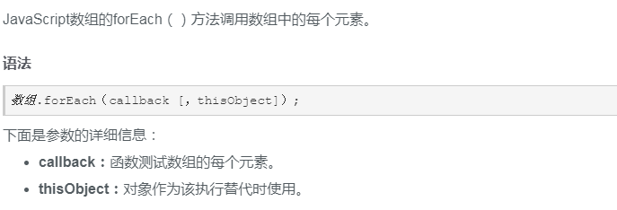

### new绑定

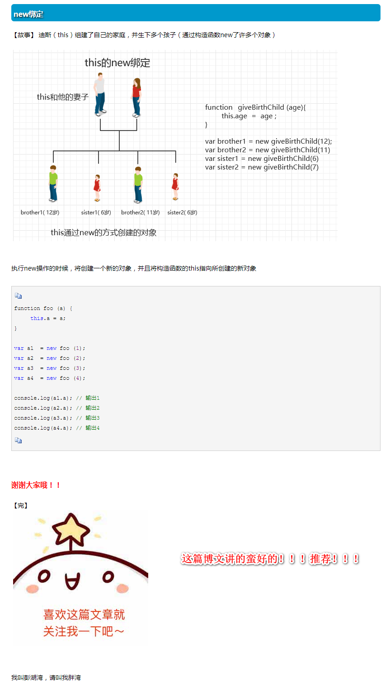

这是第四条也是最后一条this的绑定规则，在讲解它之前我们首先需要澄清一个非常常见的关于JavaScript中函数和对象的误解。

在传统的面向类的语言中，**“构造函数”是类中的一些特殊方法**，**使用new初始化类时会调用类中的构造函数**。通常的形式是这样的：

~~~javascript
something = new MyClass(..);
~~~

JavaScript也有一个**new操作符**，使用方法看起来也和那些面向类的语言一样，绝大多数开发者都认为JavaScript中new的机制也和那些语言一样。然而，**JavaScript中new的机制实际上和面向类的语言完全不同**。

**首先**我们重新定义一下JavaScript中的“构造函数”。在JavaScript中，**构造函数只是一些使用new操作符时被调用的函数。它们并不会属于某个类，也不会实例化一个类**。实际上，它们甚至都不能说是一种特殊的函数类型，**它们只是被new操作符调用的普通函数而已**。

举例来说，思考一下`Numberc(..)`作为构造函数时的行为，ES5.1中这样描述它：

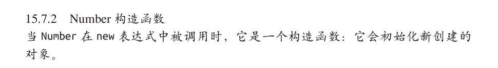

所以，**包括内置对象函数(比如`Number(..)`，详情请查看第3章)在内的所有函数都可以用new来调用**，这种函数调用被称为构造函数调用。这里有一个重要但是非常细微的区别：**实际上并不存在所谓的“构造函数”，只有对于函数的“构造调用"**。

使用new来调用函数，或者说发生构造函数调用时，会自动执行下面的操作。

1. 创建(或者说构造)一个**全新的对象**。
2. 这个新对象会被执行**原型**连接。
3. 这个**新对象会绑定到函数调用的this**。
4. 如果函数没有返回其他对象，那么new表达式中的函数调用会自动返回这个新对象。

我们现在关心的是第1步、第3步、第4步，所以暂时跳过第2步，第5章会详细介绍它。

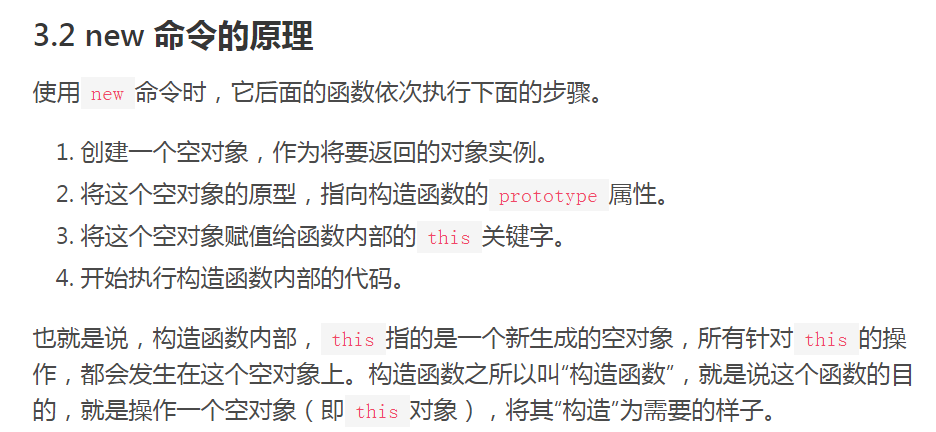

[new 命令的原理](https://wangdoc.com/javascript/oop/new.html)

思考下面的代码：

~~~javascript
function foo(a){
    this.a = a;
}

var bar = new foo(2);
console.log(bar.a);		//2
~~~

使用new来调用`foo(..)`时，我们会构造一个新对象并把它绑定到`foo(..)`调用中的this上。**new是最后一种可以影响函数调用时this绑定行为的方法，我们称之为new绑定**。

> 现在是2020年11月12日，截止到这里复习完。不看了，看多了头疼。

## 优先级

现在我们已经了解了函数调用中this绑定的四条规则，你需要做的就是**找到函数的调用位置并判断应当应用哪条规则**。但是，如果某个调用位置可以应用多条规则该怎么办？为了解决这个问题就必须给这些规则设定优先级，这就是我们接下来要介绍的内容。

毫无疑问，**默认绑定的优先级是四条规则中最低的**，所以我们可以先不考虑它。

**隐式绑定和显式绑定哪个优先级更高**？我们来测试一下：

~~~javascript
function foo(){
    console.log(this.a);
}

var obj1 = {
    a: 2,
    foo: foo
};

var obj2 = {
    a: 3,
    foo: foo
};

obj1.foo();		//2
obj2.foo();		//3

obj1.foo.call(obj2);		//3
obj2.foo.call(obj1);		//2
~~~

可以看到，**显式绑定优先级更高**，也就是说在判断时应当先考虑是否可以应用显式绑定。

现在我们需要搞清楚**new绑定和隐式绑定的优先级谁高谁低**：

~~~javascript
function foo(something){
    this.a = something;
}

var obj1 = {
    foo: foo
};

var obj2 = {};

obj1.foo(2);
console.log(obj1.a);	//2

obj1.foo.call(obj2,3);
console.log(obj2.a);	//3

var bar = new obj1.foo(4);
console.log(obj1.a);	//2
console.log(bar.a);		//4
~~~

可以看到**new绑定比隐式绑定优先级高**。但是new绑定和显式绑定谁的优先级更高呢？

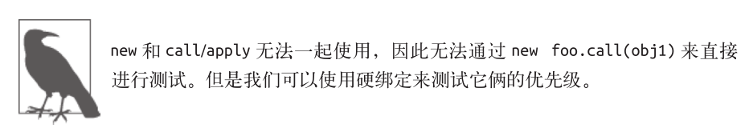

在看代码之前先回忆一下**硬绑定**是如何工作的。`Function.prototype.bind(..)`会创建一个新的包装函数，**这个函数会忽略它当前的this绑定(无论绑定的对象是什么)，并把我们提供的对象绑定到this上**。

这样看起来**硬绑定(也是显式绑定的一种)**似乎比new绑定的优先级更高，无法使用new来控制this绑定。

我们看看是不是这样：

~~~javascript
function foo(something) {
	this.a = something;
}
var obj1 = {};

var bar = foo.bind(obj1);
bar(2); 
console.log(obj1.a); 	//2

var baz = new bar(3); 
console.log(obj1.a ); 	//2
console.log(baz.a); 	//3
~~~

出乎意料！**bar被硬绑定到obj1上，但是`new bar(3)`并没有像我们预计的那样把`obj1.a`修改为3。**相反，new修改了硬绑定(到obj1的)调用`bar(..)`中的this，因为使用了new绑定，我们得到了一个名字为baz的新对象，并且`baz.a`的值是3。

再来看看我们之前介绍的**“裸”辅助函数bind**：

~~~javascript
function bind(fn, obj) {
	return function() {
		fn.apply(obj,arguments);
    };
}
~~~

非常令人惊讶，因为看起来在辅助函数中new操作符的调用无法修改this绑定，但是在刚才的代码中new确实修改了this绑定。

实际上，ES5中内置的`Function.prototype.bind(..)`更加复杂。下面是MDN提供的一种`bind(..)`实现，为了方便阅读我们对代码进行了排版：

[深究Function.prototype.bind](https://juejin.im/post/6844903606659858439)

~~~javascript
if (!Function.prototype.bind) {
  Function.prototype.bind = function(oThis) {
    if (typeof this !== 'function') {
      // closest thing possible to the ECMAScript 5
      // internal IsCallable function
      throw new TypeError('Function.prototype.bind - what is trying to be bound is not callable');
    }

    var aArgs   = Array.prototype.slice.call(arguments, 1),
        fToBind = this,
        fNOP    = function() {},
        fBound  = function() {
          return fToBind.apply(this instanceof fNOP
                 ? this
                 : oThis,
                 aArgs.concat(Array.prototype.slice.call(arguments)));
        };

    if (this.prototype) {
      // Function.prototype does not have a prototype property
      fNOP.prototype = this.prototype; 
    }
    fBound.prototype = new fNOP();

    return fBound;
  };
}
~~~

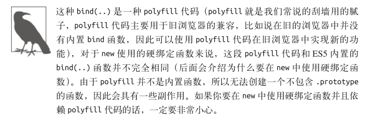

下面是new修改this的相关代码：

~~~javascript
this instanceof fNOP &&
oThis ? this: oThis
// ...以及:
fNOP.prototype = this.prototype; 
fBound.prototype = new fNOP();
~~~

我们并不会详细解释这段代码做了什么（这非常复杂并且不在我们的讨论范围之内），不过简单来说，这段代码会判断硬绑定函数是否是被new调用，如果是的话就会使用新创建的this替换硬绑定的this。

那么，为什么要在new中使用硬绑定函数呢？直接使用普通函数不是更简单吗？

**之所以要在new中使用硬绑定函数，主要目的是预先设置函数的一些参数，这样在使用new进行初始化时就可以只传入其余的参数。**`bind(..)`的功能之一就是可以把除了第一个参数(第一个参数用于绑定this)之外的其他参数都传给下层的函数（这种技术称为“部分应用”，是“柯里化”的一种），举例来说：

~~~javascript
function foo(p1,p2){
    this.val = p1 + p2;
}

//之所以使用null是因为在本例中我们并不关心硬绑定的this是什么
//反正使用new时this会被修改

var bar = foo.bind(null, "p1");
var baz = new bar("p2"); 
baz.val; //p1p2
~~~

> 没怎么看懂了。

### 判断this

现在我们可以根据优先级来判断函数在某个调用位置应用的是哪条规则。可以按照下面的顺序来进行判断：

* 函数是否在new中调用(new绑定)？如果是的话**this绑定的是新创建的对象**。

  ~~~javascript
  var bar = new foo()
  ~~~

* 函数是否通过call、apply（显式绑定）或者硬绑定调用？如果是的话，this绑定的是指定的对象。

  ~~~javascript
  var bar = foo.call(obj2)
  ~~~

* 函数是否在某个上下文对象中调用（隐式绑定）？如果是的话，this绑定的是那个上下文对象。

  ~~~javascript
  var bar = obj1.foo()
  ~~~

* 如果都不是的话，使用默认绑定。如果在严格模式下，就绑定到undefined，否则绑定到全局对象。

  ~~~javascript
  var bar = foo()
  ~~~

就是这样。对于正常的函数调用来说，理解了这些知识你就可以明白this的绑定原理了。不过…...凡事总有例外。

## 绑定例外

规则总有例外，这里也一样。在某些场景下this的绑定行为会出乎意料，你认为应当应用其他绑定规则时，实际上应用的可能是默认绑定规则。

### 被忽略的this

如果你把null或者undefined作为this的绑定对象传入call，apply或者bind，这些值在调用时会被忽略，实际应用的是默认绑定规则：

~~~javascript
function foo(){
    console.log(this.a);
}

var a = 2;
foo.call(null);		//2
~~~

那么什么情况下你会传入null呢？

一种非常常见的做法是使用`apply(..)`来“展开”一个数组，并当作参数传入一个函数。类似地，`bind(..)`可以对参数进行柯里化（预先设置一些参数），这种方法有时非常有用：

~~~javascript
function foo(a,b){
    console.log("a:" + a + ",b:" + b);
}

//把数组“展开”成函数
foo.apply(null,[2,3]);		//a:2,b:3

//使用bind进行柯里化
var bar =  foo.bind(null,2);
bar(3);		//a:2,b:3
~~~

这两种方法都需要传入一个参数当作this的绑定对象。如果函数并不关心this的话，你仍然需要传入一个占位值，这时null可能是一个不错的选择，就像代码所示的那样。

> 代码理解的不深刻

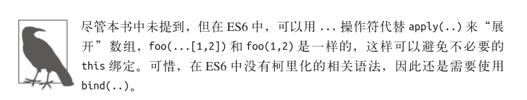

然而，总是使用null来忽略this绑定可能产生一些副作用。如果某个函数确实使用了this（比如第三方库中的一个函数），那默认绑定规则会把this绑定到全局对象（在浏览器中这个对象是window），这将导致不可预计的后果（比如修改全局对象）。

显而易见，这种方式可能会导致许多难以分析和追踪的bug。

**更安全的this**

一种“更安全”的做法是传入一个特殊的对象，把this绑定到这个对象不会对你的程序产生任何副作用。就像网络（以及军队）一样，我们可以创建一个"DMZ"（demilitarized zone，非军事区）对象-它就是一个空的非委托的对象（委托在第5章和第6章介绍）。

如果我们在忽略this绑定时总是传入一个DMZ对象，那就什么都不用担心了，因为任何对于this的使用都会被限制在这个空对象中，不会对全局对象产生任何影响。

由于这个对象完全是一个空对象，我自己喜欢用变量名（这是数学中表示空集合符号的小写形式）来表示它。在大多数键盘（比如说Mac的US布局键盘）上都可以使用`Option-o`来打出这个符号。有些系统允许你为特殊符号设定快捷键。如果你不喜欢o符号或者你的键盘不太容易打出这个符号，那你可以换一个喜欢的名字来称呼它。

无论你叫它什么，**在JavaScript中创建一个空对象最简单的方法都是`Object.create(null)`**（详细介绍请看第5章）,`Object.create(null)`和`{}`很像，但是并不会创建`Object.prototype`这个委托，所以它比`{}`"更空”。

~~~javascript
function foo(a,b){
    console.log("a:" + a + ",b:" + b);
}

//我们的DMZ空对象
var Ø = object.create(null);

//把数组展开成参数
foo.apply(Ø,[2，3]);		//a：2，b：3

//使用bind（..）进行柯里化
var bar = foo.bind(Ø,2);
bar(3);		//a：2，b：3
~~~

使用变量名Ø不仅让函数变得更加“安全”，而且**可以提高代码的可读性**，因为Ø表示“我希望this是空”，这比null的含义更清楚。不过再说一遍，你可以用任何喜欢的名字来命名DMZ对象。

### 间接引用

另一个需要注意的是，你有可能（有意或者无意地）创建一个函数的“间接引用"，在这种情况下，调用这个函数会应用默认绑定规则。

间接引用最容易在赋值时发生：

~~~javascript
function foo(){
    console.log(this.a);
}

var a = 2;
var o = {a:3,foo:foo};
var p = {a:4};

o.foo();	//3
(p.foo = o.foo)();	//2
~~~

> 这个代码看不懂。

赋值表达式`p.foo = o.foo`的返回值是目标函数的引用，因此调用位置是`foo()`而不是`p.foo()`或者`o.foo()`。根据我们之前说过的，这里会应用默认绑定。

注意：**对于默认绑定来说，决定this绑定对象的并不是调用位置是否处于严格模式，而是函数体是否处于严格模式**。如果函数体处于严格模式，this会被绑定到undefined，否则this会被绑定到全局对象。

### 软绑定

之前我们已经看到过，硬绑定这种方式可以把this强制绑定到指定的对象（除了使用new时），防止函数调用应用默认绑定规则。问题在于，硬绑定会大大降低函数的灵活性，使用硬绑定之后就无法使用隐式绑定或者显式绑定来修改this。

如果可以给默认绑定指定一个全局对象和undefined以外的值，那就可以实现和硬绑定相同的效果，同时保留隐式绑定或者显式绑定修改this的能力。

可以通过一种被称为软绑定的方法来实现我们想要的效果：

~~~javascript
if(!Function.prototype.softBind){
    Function.prototype.softBind = function(obj){
        var fn = this;
        //捕获所有curried参数
        var args=Array.prototype.slice.call(arguments,1);
        var bound=function(){
            return fn.apply(
                (!this||this===(window||global))?obj:this,
                args.concat.apply(args,arguments)
            );
        };
        bound.prototype=Object.create(fn.prototype);
        return bound;
    };
}
~~~

> 完全看不懂。

除了软绑定之外，`softBind(..)`的其他原理和ES5内置的`bind(..)`类似。它会对指定的函数进行封装，首先检查调用时的this，如果this绑定到全局对象或者undefined，那就把指定的默认对象obj绑定到this，否则不会修改this，此外，这段代码还支持可选的柯里化（详情请查看之前和`bind(..)`相关的介绍）。

下面我们看看softBind是否实现了软绑定功能：

~~~javascript
function foo(){
    console.log("name: "+this.name);
}

var obj1={name:"obj1"},
    obj2={name:"obj2"},
    obj3={name:"obj3"};

var fooOBJ=foo.softBind(obj1);
fooOBJ();//"name: obj1" 在这里软绑定生效了，成功修改了this的指向，将this绑定到了obj1上

obj2.foo=foo.softBind(obj1);
obj2.foo();//"name: obj2" 在这里软绑定的this指向成功被隐式绑定修改了，绑定到了obj2上

fooOBJ.call(obj3);//"name: obj3" 在这里软绑定的this指向成功被硬绑定修改了，绑定到了obj3上

setTimeout(obj2.foo,1000);//"name: obj1"
/*回调函数相当于一个隐式的传参，如果没有软绑定的话，这里将会应用默认绑定将this绑定到全局环
境上，但有软绑定，这里this还是指向obj1*/

~~~

> 完全看不懂。

可以看到，软绑定版本的`foo()`可以手动将this绑定到obj2或者obj3上，但如果应用默认绑定，则会将this绑定到obj。

## this词法

我们之前介绍的四条规则已经可以包含所有正常的函数。但是ES6中介绍了一种无法使用这些规则的特殊函数类型：箭头函数。

箭头函数并不是使用function关键字定义的，而是使用被称为“胖箭头”的操作符=>定义的。箭头函数不使用this的四种标准规则，而是根据外层（函数或者全局）作用域来决定this。

我们来看看箭头函数的词法作用域：

~~~javascript
function foo(){
    //返回一个箭头函数
    return (a) =>{
        console.log(this.a);
    };
}

var obj1 = {
    a:2
};

var obj2 = {
    a:3
};

var bar = foo.call(obj1);
bar.call(obj2);		//2,不是3！
~~~

`foo()`内部创建的箭头函数会捕获调用时`foo()`的this，由于`foo()`的this绑定到obj1，bar（引用箭头函数）的this也会绑定到obj1，**箭头函数的绑定无法被修改**。(new也不行！)

箭头函数最常用于回调函数中，例如事件处理器或者定时器：

~~~javascript
function foo(){
    setTimeout(()=>{
        //这里的this在词法上继承自foo()
        console.log(this.a);
    },100)
}

var obj = {
    a:2
};

foo.call(obj);	//2
~~~

虽然`self  = this`和箭头函数看起来都可以取代`bind(..)`，但是**从本质上来说，它们想替代的是this机制**。

如果你经常编写this风格的代码，但是绝大部分时候都会使用self = this或者箭头函数来否定this机制，那你或许应当：

* 只使用词法作用域并完全抛弃错误this风格的代码；
* 完全采用this风格，在必要时使用`bind(..)`，尽量避免使用`self =this`和箭头函数。

当然，包含这两种代码风格的程序可以正常运行，但是在同一个函数或者同一个程序中混合使用这两种风格通常会使代码更难维护，并且可能也会更难编写。

## 小结

如果要判断一个运行中函数的this绑定，就需要找到这个函数的直接调用位置。找到之后就可以顺序应用下面这四条规则来判断this的绑定对象。

* 由new调用？绑定到新创建的对象。
* 由call或者apply(或者bind)调用？绑定到指定的对象。
* 由上下文对象调用？绑定到那个上下文对象。
* 默认：在严格模式下绑定到undefined，否则绑定到全局对象。

一定要注意，有些调用可能在无意中使用默认绑定规则。如果想“更安全”地忽略this绑定，你可以使用一个DMZ对象，比如`Ø= Object.create(null)`，以保护全局对象。

ES6中的箭头函数并不会使用四条标准的绑定规则，而是根据当前的词法作用域来决定this，具体来说，箭头函数会继承外层函数调用的this绑定（无论this绑定到什么）。这其实和ES6之前代码中的`self = this`机制一样。

> 现在是2020年11月18日，截止到这里复习完。

# 第3章：对象

在第1章和第2章中，我们介绍了函数调用位置的不同会造成this绑定对象的不同。但是对象到底是什么，为什么我们需要绑定它们呢？本章会详细介绍对象。

## 语法

对象可以通过**两种形式**定义：**声明(文字)形式**和**构造形式**。

对象的文字语法大概是这样：

~~~javascript
var myObj = {
    key:value
    //...
};
~~~

构造形式大概是这样(不常用)：

~~~javascript
var myobj = new Object();
myObj.key = value;
~~~

构造形式和文字形式生成的对象是一样的。唯一的**区别**是，**在文字声明中你可以添加多个键/值对，但是在构造形式中你必须逐个添加属性**。

## 类型

对象是JavaScript的基础。在JavaScript中一共有六种主要类型(术语是“语言类型”)：

* string
* number
* boolean
* null
* undefined
* object

注意，**简单基本类型(string，boolean，number，null和undefined)本身并不是对象**。**null有时会被当作一种对象类型，但是这其实只是语言本身的一个bug**，即对null执行`typeof null`时会返回字符串"object"，'实际上，**null本身是基本类型**。

> 原理是这样的，**不同的对象在底层都表示为二进制**，**在JavaScript中二进制前三位都为0的话会被判断为object类型**，null的二进制表示是全0，自然前三位也是0，所以执行typeof时会返回"object"。
> ——译者注

**有一种常见的错误说法是"JavaScript中万物皆是对象”，这显然是错误的。**

实际上，JavaScript中有许多特殊的**对象子类型**，我们可以称之为**复杂基本类型**。

**函数就是对象的一个子类型**(**从技术角度来说就是“可调用的对象"**)，**JavaScript中的函数是“一等公民”，因为它们本质上和普通的对象一样(只是可以调用)，所以可以像操作其他对象一样操作函数(比如当作另一个函数的参数)**。

**数组也是对象的一种类型**，具备一些额外的行为。数组中内容的组织方式比一般的对象要梢微复杂一些。

### 内置对象

JavaScript中还有一些**对象子类型**，通常被称为**内置对象**。有些内置对象的名字看起来和简单基础类型一样，不过实际上它们的关系更复杂，我们稍后会详细介绍。

* String
* Number
* Boolean
* Object
* Function
* Array
* Date
* RegExp
* Еггог

**这些内置对象从表现形式来说很像其他语言中的类型(type)或者类(class)**，比如Java中的String类。

但是在JavaScript中，**它们实际上只是一些内置函数**。**这些内置函数可以当作构造函数(由new产生的函数调用——参见第2章)来使用**，从而可以构造一个对应子类型的新对象。举例来说：

~~~javascript
var strPrimitive ="I am a string";
typeof strPrimitive;	//"string"
strPrimitive instanceof String;//false 

var strObject = new string("I am a string");
typeof strobject;	//"object"
strObject instanceof String；//true

//检查sub-type对象
object.prototype.tostring.call(strObject)；	//[object String]
~~~

在之后的章节中我们会详细介绍`Object.prototype.tostring..`是如何工作的，不过简单来说，**我们可以认为子类型在内部借用了object中的`toString()`方法**。从代码中可以看到，**strObject是由String构造函数创建的一个对象**。

**原始值`"I am a string"`并不是一个对象，它只是一个字面量，并且是一个不可变的值**。如果要**在这个字面量上执行一些操作**，比如获取长度、访问其中某个字符等，那需要将其转换为String对象。

幸好，**在必要时语言会自动把字符串字面量转换成一个String对象**，也就是说你并不需要显式创建一个对象。**JavaScript社区中的大多数人都认为能使用文字形式时就不要使用构造形式。**

思考下面的代码：

~~~javascript
var strPrimitive = "I am a string";
console.log(strPrimitive.length ); 	//13
console.log(strPrimitive.charAt(3) ); 	//"m"
~~~

使用以上两种方法，**我们都可以直接在字符串字面量上访问属性或者方法**，之所以可以这样做，是因为**引擎自动把字面量转换成String对象，所以可以访问属性和方法**。

同样的事也会发生在数值字面量上，如果使用类似`42.359.toFixed(2)`的方法，引擎会把42转换成new Number(2)。对于布尔字面量来说也是如此。

**null和undefined没有对应的构造形式，它们只有文字形式。相反，Date只有构造，没有文字形式。**

**对于Object，Array，Function和RegExp(正则表达式)来说，无论使用文字形式还是构造形式，它们都是对象，不是字面量。**在某些情况下，相比用文字形式创建对象，构造形式可以提供一些额外选项。由于这两种形式都可以创建对象，所以我们**首选更简单的文字形式**。**建议只在需要那些额外选项时使用构造形式**。

**Error对象很少在代码中显式创建，一般是在抛出异常时被自动创建**。也可以使用`new Error(..)`这种构造形式来创建，不过一般来说用不着。

## 内容

之前我们提到过，**对象的内容**是**由一些存储在特定命名位置的(任意类型的)值组成的**，**我们称之为属性**。

需要强调的一点是，当我们说“**内容**”时，似乎在**暗示这些值实际上被存储在对象内部**，但是**这只是它的表现形式**。在**引擎内部**，**这些值的存储方式是多种多样的**，**一般并不会存在对象容器内部**。存储在对象容器内部的是这些**属性的名称**，**它们就像指针(从技术角度来说就是引用)一样**，**指向这些值真正的存储位置**。

思考下面的代码：

~~~javascript
var myObject = {
	a: 2
};
myObject.a; 	 // 2
myObject["a"]; 	//2
~~~

如果要访问myObject中**a位置**上的值，我们需要使用**`.`操作符**或者**`[]`操作符**。**`.a`语法通常被称为“属性访问”**，**`["a"]`语法通常被称为“键访问”**。实际上它们访问的是同一个位置，并且会返回相同的值2，所以这两个术语是可以互换的。在本书中我们会使用**最常见的术语“属性访问”**。

这两种语法的主要**区别**在于，**操作符要求属性名满足标识符的命名规范，而`[".."]`语法可以接受任意UTF-8/Unicode字符串作为属性名**。举例来说，如果要引用名称为`"Super-Fun！"`的属性，那就**必须**使用`["Super-Fun！"]`语法访问，**因为`Super-Fun!`并不是一个有效的标识符属性名**。

此外，由于`[".."]`语法使用字符串来访问属性，所以可以在程序中构造这个字符串，比如说：

~~~javascript
var myObject ={
	a：2
};
var idx;

if(wantA){
   idx = "a"; 
}

//之后
console.log(myObject[idx]);	//2
~~~

**在对象中，属性名永远都是字符串**。**如果你使用string(字面量)以外的其他值作为属性名，那它首先会被转换为一个字符串。即使是数字也不例外，虽然在数组下标中使用的的确是数字，但是在对象属性名中数字会被转换成字符串**，所以当心不要搞混对象和数组中数字的用法：

~~~javascript
var myObject ={ };

myObject[true] = "foo"; 
myObject[3] = "bar"
myObject[myObject] = "baz";

myObject["true"]; 	// "foo"
myObject["3"]; 		// "bar"
myObject["[object object]"];  // "baz"
~~~

### 可计算属性名

如果你需要**通过表达式来计算属性名**，那么我们刚刚讲到的`myObject[..]`这种属性访问语法就**可以派上用场**了，如可以使用`myObject[prefix + name]`。但是使用文字形式来声明对象时这样做是不行的。

**ES6增加了可计算属性名**，可以在文字形式中使用`[]`包裹一个表达式来当作属性名：

~~~javascript
var prefix= "foo";
var myObject = {
	[prefix + "bar"]:"hello"
	[prefix + "baz"]:"world"
};

myObject["foobar"]; 	// hello
myObject["foobaz"]; 	// world
~~~

**可计算属性名最常用的场景可能是ES6的符号(Symbol)，本书中不作详细介绍**。不过简单来说，**它们是一种新的基础数据类型，包含一个不透明且无法预测的值(从技术角度来说就是一个字符串)**。一般来说**你不会用到符号的实际值(因为理论上来说在不同的JavaScript引擎中值是不同的)，所以通常你接触到的是符号的名称**，比如`Symbol.Something`(这个名字是我编的)：

~~~javascript
var myobject ={
	[Symbol.Something]: "hello world"
}
~~~

> 现在是2020年11月18日，截止到这里复习完。

### 属性和方法

如果访问的对象属性是一个函数，有些开发者喜欢使用不一样的叫法以作区分。由于函数很容易被认为是属于某个对象，在其他语言中，属于对象(也被称为“类”)的函数通常被称为“方法”，因此把“属性访问”说成是“方法访问”也就不奇怪了。

有意思的是，JavaScript的语法规范也做出了同样的区分。

从技术角度来说，函数永远不会“属于”一个对象，所以把对象内部引用的函数称为“方法”似乎有点不妥。

确实，有些函数具有this引用，有时候这些this确实会指向调用位置的对象引用。但是这种用法从本质上来说并没有把一个函数变成一个“方法”，因为this是在运行时根据调用位置动态绑定的，所以函数和对象的关系最多也只能说是间接关系。

无论返回值是什么类型，每次访问对象的属性就是属性访问。如果属性访问返回的是一个函数，那它也并不是一个“方法”。属性访问返回的函数和其他函数没有任何区别(除了可能发生的隐式绑定this，就像我们刚才提到的)。

举例来说：

~~~javascript
function foo(){
	console.log("foo");
}

var someFoo = foo；//对foo的变量引用

var myObject = {
	someFoo：foo
}；

foo;	//function foo){..}
someFoo;	//function foo(){..}
myobject.someFoo；//function foo(){..}
~~~

someFoo和myobject.someFoo只是对于同一个函数的不同引用，并不能说明这个函数是特别的或者“属于”某个对象。如果foo()定义时在内部有一个this引用，那这两个函数引用的唯一区别就是`myObject.someFoo`中的this会被隐式绑定到一个对象。无论哪种引用形式都不能称之为“方法”。

或许有人会辩解说，函数并不是在定义时成为方法，而是在被调用时根据调用位置的不同(是否具有上下文对象-详见第2章)成为方法。即便如此，这种说法仍然有些不妥。

最保险的说法可能是，“函数”和“方法”在JavaScript中是可以互换的。

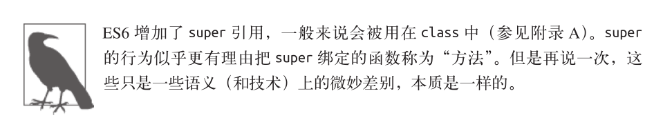

即使你在对象的文字形式中声明一个函数表达式，这个函数也不会"属于"这个对象——它们只是对于相同函数对象的多个引用。

~~~javascript
var myObject ={
	foo: function() {
		console.log("foo");
	}
}; 

var someFoo = myObject.foo;
someFoo;		 //function foo(){..}
myObject.foo; 	//function foo(){..}
~~~

### 数组

数组也支持[]访问形式，不过就像我们之前提到过的，数组有一套更加结构化的值存储机制(不过仍然不限制值的类型)，数组期望的是数值下标，也就是说值存储的位置(通常被称为索引)是整数，比如说0和42：

~~~javascript
var myArray = ["foo", 42, "bar"];
myArгay.length; 	//3
myArray [0]; 	   //"foo"
mуAггay [2];	   //"bar"
~~~

数组也是对象，所以虽然每个下标都是整数，你仍然可以给数组添加属性：

~~~javascript
var myArray = [ "foo", 42, "bar"];
myArray.baz = "baz";
myArray.length; 	//3
myArray.baz; 		//"baz"
~~~

可以看到虽然添加了命名属性(无论是通过，语法还是[]语法)，数组的length值并未发生变化。

你完全可以把数组当作一个普通的键/值对象来使用，并且不添加任何数值索引，但是这并不是一个好主意。数组和普通的对象都根据其对应的行为和用途进行了优化，所以最好只用对象来存储键/值对，只用数组来存储数值下标/值对。

注意：如果你试图向数组添加一个属性，但是属性名“看起来”像一个数字，那它会变成一个数值下标(因此会修改数组的内容而不是添加一个属性):

~~~javascript
var myArray = ["foo", 42, "bar"]; 
MуArгay ["3"] = "baz";
myArray.length; //4
myArray[3]; 	//"baz"
~~~

### 复制对象

JavaScript初学者最常见的问题之一就是如何复制一个对象。看起来应该有一个内置的`copy()`方法，是吧？实际上事情比你想象的更复杂，因为我们无法选择一个默认的复制算法。

举例来说，思考一下这个对象：

~~~javascript
function anotherFunction() { /*..*/ }

var anotherObject = {
	c: true
};

var anotherArray = [];

var myObject = {
	a: 2,
	b: anotherObject, // 引用，不是复本！
	c: anotherArray, // 另一个引用！
	d: anotherFunction
};

anotherArray.push(anotherObject, myObject);
~~~

如何准确地表示 myObject 的复制呢？

首先，**我们应该判断它是浅复制还是深复制**。**对于浅拷贝来说**，复制出的新对象中 a 的值会复制旧对象中 a 的值，也就是 2，但是新对象中 b 、 c 、 d 三个属性其实只是三个引用，它们和旧对象中 b 、 c 、 d 引用的对象是一样的。**对于深复制来说**，除了复制 myObject 以外还会复制 anotherObject 和 anotherArray 。这时问题就来了， **anotherArray 引用了 anotherObject 和myObject ，所以又需要复制 myObject ，这样就会由于循环引用导致死循环**。

我们是应该检测循环引用并终止循环（不复制深层元素）？还是应当直接报错或者是选择其他方法？

除此之外，我们还不确定“复制”一个函数意味着什么。有些人会通过`tostring()`来序列化一个函数的源代码（但是结果取决于JavaScript的具体实现，而且不同的引擎对于不同类型的函数处理方式并不完全相同）。

那么如何解决这些棘手问题呢？许多JavaScript框架都提出了自己的解决办法，但是Javascript应当采用哪种方法作为标准呢？在很长一段时间里，这个问题都没有明确的答案。

对于JSON安全（也就是说可以被序列化为一个JSON字符串并且可以根据这个字符串解析出一个结构和值完全一样的对象）的对象来说，有一种巧妙的复制方法：

[详说JSON.stringify()与JSON.parse()](https://juejin.cn/post/6844904198572605448)

~~~javascript
var newObj = JSON.parse(JSON.stringify(someObj));
~~~

当然，这种方法需要保证对象是 JSON 安全的，所以只适用于部分情况。

相比深复制，浅复制非常易懂并且问题要少得多，所以ES6定义了`Object.assign(..)`方法来实现浅复制。`Object.assign(..)`方法的第一个参数是目标对象，之后还可以跟一个或多个源对象。它会遍历一个或多个源对象的所有可枚举（enumerable，参见下面的代码）的自有键（owned key，很快会介绍）并把它们复制（使用=操作符赋值）到目标对象，最后返回目标对象，就像这样：

~~~javascript
var newObj = Object.assign( {}, myObject );

newObj.a; // 2
newObj.b === anotherObject; // true
newObj.c === anotherArray; // true
newObj.d === anotherFunction; // true
~~~

### 属性描述符

在 ES5 之前，JavaScript 语言本身并没有提供可以直接检测属性特性的方法，比如判断属性是否是只读。

但是从 ES5 开始，所有的属性都具备了属性描述符。

思考下面的代码：

~~~javascript
var myObject = {
	a:2
};

Object.getOwnPropertyDescriptor( myObject, "a" );
// {
// value: 2,
// writable: true,
// enumerable: true,
// configurable: true
// }
~~~

如你所见，这个普通的对象属性对应的属性描述符（也被称为“数据描述符”，因为它只保存一个数据值）可不仅仅只是一个2，它还包含另外三个特性：writable（可写）、enumerable（可枚举）和configurable（可配置）。

在创建普通属性时属性描述符会使用默认值，我们也可以使用`Object.defineProperty(..)`来添加一个新属性或者修改一个已有属性（如果它是configurable）并对特性进行设置。

举例来说：

~~~javascript
var myObject = {};

Object.defineProperty( myObject, "a", {
	value: 2,
	writable: true,
	configurable: true,
	enumerable: true
} );

myObject.a; // 2
~~~

我们使用`defineProperty(..)`给myobject添加了一个普通的属性并显式指定了一些特性。然而，一般来说你不会使用这种方式，除非你想修改属性描述符。

**1.Writable**

writable 决定是否可以修改属性的值。

思考下面的代码：

~~~javascript
var myObject = {};

Object.defineProperty( myObject, "a", {
	value: 2,
	writable: false, // 不可写！
	configurable: true,
	enumerable: true
} );

myObject.a = 3;
myObject.a; // 2
~~~

如你所见，我们对于属性值的修改静默失败（silently failed）了。如果在严格模式下，这种方法会出错：

~~~javascript
"use strict";

var myObject = {};

Object.defineProperty( myObject, "a", {
	value: 2,
	writable: false, // 不可写！
	configurable: true,
	enumerable: true
} );

myObject.a = 3; // TypeError
TypeError 错误表示我们无法修改一个不可写的属性。
~~~

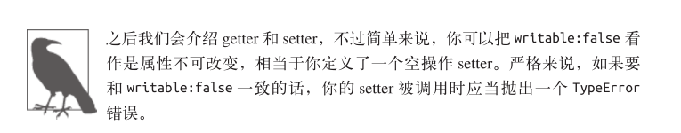

**2.Configurable**

只要属性是可配置的，就可以使用`defineProperty(..)`方法来修改属性描述符：

~~~javascript
var myObject = {
	a:2
};

myObject.a = 3;
myObject.a; // 3

Object.defineProperty( myObject, "a", {
	value: 4,
	writable: true,
	configurable: false, // 不可配置！
    enumerable: true
} );

myObject.a; // 4
myObject.a = 5;
myObject.a; // 5

Object.defineProperty( myObject, "a", {
	value: 6,
	writable: true,
	configurable: true,
	enumerable: true
} ); // TypeError
~~~

最后一个`defineProperty(..)`会产生一个 TypeError 错误，不管是不是处于严格模式，尝试修改一个不可配置的属性描述符都会出错。注意：如你所见，把 configurable 修改成false 是单向操作，无法撤销！

除了无法修改，`configurable:false`还会禁止删除这个属性：

~~~javascript
var myObject = {
	a:2
};

myObject.a; // 2

delete myObject.a;
myObject.a; // undefined

Object.defineProperty( myObject, "a", {
	value: 2,
	writable: true,
	configurable: false,
	enumerable: true
} );

myObject.a; // 2
delete myObject.a;
myObject.a; // 2
~~~

如你所见，最后一个 delete 语句（静默）失败了，因为属性是不可配置的。在本例中， delete 只用来直接删除对象的（可删除）属性。如果对象的某个属性是某个对象 / 函数的**最后一个引用者**，对这个属性执行 delete 操作之后，这个未引用的对象 / 函数就可以被垃圾回收。但是，**不要把 delete 看作一个释放内存的工具**（就像 C/C++ 中那样），它就是一个删除对象属性的操作，仅此而已。

**3.Enumerable**

这里我们要介绍的最后一个属性描述符（还有两个，我们会在介绍getter和setter时提到）是enumerable。

从名字就可以看出，这个描述符控制的是属性是否会出现在对象的属性枚举中，比如说`for..in`循环。如果把enumerable设置成false，这个属性就不会出现在枚举中，虽然仍然可以正常访问它。相对地，设置成true就会让它出现在枚举中。

用户定义的所有的普通属性默认都是enumerable，这通常就是你想要的。但是如果你不希望某些特殊属性出现在枚举中，那就把它设置成`enumerable：false`

> `for...in`函数更适合遍历对象,遍历的是对象的属性名称(key：**键名**)，可以用来循环对象的属性。在使用`for...in`遍历Array时，拿到的是每个元素索引，而我们主要是拿数组的内容，而不是下标(索引)。
>
> `for...of` 更适合遍历数组，而不是遍历对象。`for...of`是ES6新引入的特性。修复了ES5引入的`for...in`的不足。`for...of`不能循环普通的对象，需要通过和`Object.keys()`搭配使用

稍后我们会详细介绍可枚举性，这里先提示一下。

### 不变性

有时候你会希望属性或者对象是不可改变（无论有意还是无意）的，在ES5中可以通过很多种方法来实现。

很重要的一点是，**所有的方法创建的都是浅不变性**，也就是说，**它们只会影响目标对象和它的直接属性**。如果目标对象引用了其他对象（数组、对象、函数，等），其他对象的内容不受影响，仍然是可变的：

~~~javascript
myImmutableObject.foo; // [1,2,3]
myImmutableObject.foo.push(4);
myImmutableObject.foo; // [1,2,3,4]
~~~

假设代码中的 myImmutableObject 已经被创建而且是不可变的，但是为了保护它的内容`myImmutableObject.foo`，你还需要使用下面的方法让 foo 也不可变。

**1.对象常量**

结合`writable:false`和`configurable:false`就可以创建一个真正的常量属性（不可修改、重定义或者删除）：

~~~javascript
var myObject = {};

Object.defineProperty( myObject, "FAVORITE_NUMBER", {
	value: 42,
	writable: false,
	configurable: false
});
~~~

**2.禁止扩展**

如果你想禁止一个对象添加新属性并且保留已有属性，可以使用`Object.prevent.Extensions(..)`：

~~~javascript
var myObject = {
	a:2
};

Object.preventExtensions(myObject);

myObject.b = 3;
myObject.b; // undefined
~~~

在非严格模式下，创建属性b会静默失败。在严格模式下，将会抛出TypeError错误。

**3.密封**

Object.seal(..) 会创建一个“密封”的对象，这个方法实际上会在一个现有对象上调用`Object.preventExtensions(..) `并把所有现有属性标记为`configurable:false`。

所以，密封之后不仅不能添加新属性，也不能重新配置或者删除任何现有属性（虽然可以修改属性的值）。

**4.冻结**

`Object.freeze(..)`会创建一个冻结对象，这个方法实际上会在一个现有对象上调用`Object.seal(..)` 并把所有“数据访问”属性标记为`writable:false`，这样就无法修改它们的值。

这个方法是你可以应用在对象上的级别最高的不可变性，它会禁止对于对象本身及其任意直接属性的修改（不过就像我们之前说过的，这个对象引用的其他对象是不受影响的）。

你可以“深度冻结”一个对象，具体方法为，首先在这个对象上调用`Object.freeze(..)`，然后遍历它引用的所有对象并在这些对象上调用`Object.freeze(..)`。但是一定要小心，因为这样做有可能会在无意中冻结其他（共享）对象。

### [[GET]]

属性访问在实现时有一个微妙却非常重要的细节，思考下面的代码：

~~~javascript
var myObject = {
	a: 2
};
myObject.a; // 2
~~~

`myObject.a`是一次属性访问，但是这条语句并不仅仅是在 myObjet 中查找名字为 a 的属性，虽然看起来好像是这样。

在语言规范中，`myObject.a`在`myObject`上实际上是实现了`[[Get]]`操作（有点像函数调用： `[[Get]]() `）。对象默认的内置 [[Get]] 操作首先在对象中查找是否有名称相同的属性，如果找到就会返回这个属性的值。

然而，如果没有找到名称相同的属性，按照 `[[Get]]`算法的定义会执行另外一种非常重要的行为。我们会在第 5 章中介绍这个行为（其实就是遍历可能存在的`[[Prototype]]`链，也就是原型链）。

如果无论如何都没有找到名称相同的属性，那`[[Get]]`操作会返回值 undefined ：

~~~javascript
var myObject = {
	a:2
};
myObject.b; // undefined
~~~

注意，这种方法和访问变量时是不一样的。如果你引用了一个当前词法作用域中不存在的变量，并不会像对象属性一样返回 undefined ，而是会抛出一个 ReferenceError 异常：

~~~javascript
var myObject = {
	a: undefined
};

myObject.a; // undefined
myObject.b; // undefined
~~~

从返回值的角度来说，这两个引用没有区别——它们都返回了 undefined 。然而，尽管乍看之下没什么区别，实际上底层的 [[Get]] 操作对`myObject.b`进行了更复杂的处理。

由于仅根据返回值无法判断出到底变量的值为 undefined 还是变量不存在，所以`[[Get]]`操作返回了 undefined 。不过稍后我们会介绍如何区分这两种情况。

### [[Put]]

> 我很奇怪为什么还有个[[PUT]]，这样[[GET]]、[[PUT]]、[[Getter]]、[[Setter]]真的让人搞不太清楚。

既然有可以获取属性值的 [[Get]] 操作，就一定有对应的 [[Put]] 操作。

你可能会认为给对象的属性赋值会触发 [[Put]] 来设置或者创建这个属性。但是实际情况并不完全是这样。
[[Put]] 被触发时，实际的行为取决于许多因素，包括对象中是否已经存在这个属性（这是最重要的因素）。

**如果已经存在这个属性**， [[Put]] 算法大致会检查下面这些内容。

1. 属性是否是访问描述符（参见 3.3.9 节）？如果是并且存在 setter 就调用 setter。
2. 属性的数据描述符中 writable 是否是 false ？如果是，在非严格模式下静默失败，在
严格模式下抛出 TypeError 异常。
3. 如果都不是，将该值设置为属性的值。

如果对象中不存在这个属性， [[Put]] 操作会更加复杂。我们会在第 5 章讨论` [[Prototype]]`时详细进行介绍。

### Getter和Setter

对象默认的 [[Put]] 和 [[Get]] 操作分别可以控制属性值的设置和获取。

在 ES5 中可以使用 getter 和 setter 部分改写默认操作，但是只能应用在单个属性上，无法应用在整个对象上。getter 是一个隐藏函数，会在获取属性值时调用。setter 也是一个隐藏函数，会在设置属性值时调用。

当你给一个属性定义 getter、setter 或者两者都有时，这个属性会被定义为“访问描述符”（和“数据描述符”相对）。对于访问描述符来说，JavaScript 会忽略它们的 value 和writable 特性，取而代之的是关心 set 和 get （还有 configurable 和 enumerable ）特性。

思考下面的代码：

~~~javascript
var myObject = {
	// 给 a 定义一个 getter
	get a() {
	return 2;
	}
};

Object.defineProperty(
	myObject, // 目标对象
	"b", // 属性名
    { // 描述符
		// 给 b 设置一个 getter
		get: function(){ return this.a * 2 },
		// 确保 b 会出现在对象的属性列表中
		enumerable: true
	}
);

myObject.a; // 2
myObject.b; // 4
~~~

不管是对象文字语法中的`get a() { .. }`，还是`defineProperty(..)`中的显式定义，二者都会在对象中创建一个不包含值的属性，对于这个属性的访问会自动调用一个隐藏函数，它的返回值会被当作属性访问的返回值：

~~~javascript
var myObject = {
	// 给 a 定义一个 getter
	get a() {
		return 2;
	}
};

myObject.a = 3;
myObject.a; // 2
~~~

由于我们只定义了 a 的 getter，所以对 a 的值进行设置时 set 操作会忽略赋值操作，不会抛出错误。而且即便有合法的 setter，由于我们自定义的 getter 只会返回 2，所以 set 操作是没有意义的。

为了让属性更合理，还应当定义 setter，和你期望的一样，setter 会覆盖单个属性默认的[[Put]] （也被称为赋值）操作。通常来说 getter 和 setter 是成对出现的（只定义一个的话通常会产生意料之外的行为）：

~~~javascript
var myObject = {
	// 给 a 定义一个 getter
	get a() {
		return this._a_;
	},
	// 给 a 定义一个 setter
	set a(val) {
		this._a_ = val * 2;
	}
};

myObject.a = 2;
myObject.a; // 4
~~~

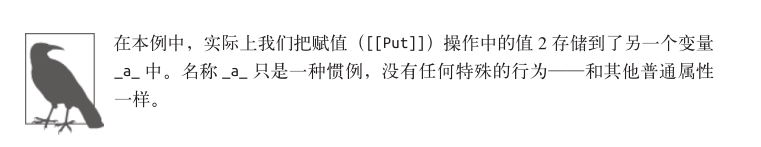

### 存在性

前面我们介绍过，如`myObject.a`的属性访问返回值可能是 undefined ，但是这个值有可能是属性中存储的 undefined ，也可能是因为属性不存在所以返回 undefined 。那么如何区分这两种情况呢？

我们可以在不访问属性值的情况下判断对象中是否存在这个属性：

~~~javascript
var myObject = {
	a:2
};

("a" in myObject); // true
("b" in myObject); // false

myObject.hasOwnProperty( "a" ); // true
myObject.hasOwnProperty( "b" ); // false
~~~

in 操作符会检查属性是否在对象及其 [[Prototype]] 原型链中（参见第 5 章）。相比之下，`hasOwnProperty(..) `只会检查属性是否在 myObject 对象中，不会检查 [[Prototype]] 链。在第 5 章讲解 [[Prototype]] 时我们会详细介绍这两者的区别。

所有的普通对象都可以通过对于`Object.prototype`的委托（参见第 5 章）来访问`hasOwnProperty(..) `，但是有的对象可能没有连接到`Object.prototype`（通过 Object.create(null) 来创建——参见第 5 章）。在这种情况下，形如`myObejct.hasOwnProperty(..)`就会失败。

这时可以使用一种更加强硬的方法来进行判断： `Object.prototype.hasOwnProperty.call(myObject,"a") `，它借用基础的`hasOwnProperty(..)`方法并把它显式绑定（参见第 2章）到 myObject 上。

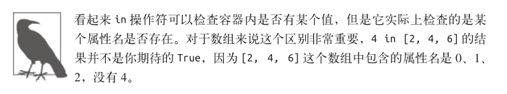

**1.枚举**

之前介绍 enumerable 属性描述符特性时我们简单解释过什么是“可枚举性”，现在详细介绍一下：

~~~javascript
var myObject = { };

Object.defineProperty(
	myObject,
	"a",
	// 让 a 像普通属性一样可以枚举
	{ enumerable: true, value: 2 }
);

Object.defineProperty(
	myObject,
	"b",
	// 让 b 不可枚举
	{ enumerable: false, value: 3 }
);

myObject.b; // 3
("b" in myObject); // true
myObject.hasOwnProperty( "b" ); // true

// .......

for (var k in myObject) {
	console.log( k, myObject[k] );
}
// "a" 2
~~~

可以看到，`myObject.b`确实存在并且有访问值，但是却不会出现在`for..in`循环中（尽管可以通过 in 操作符来判断是否存在）。原因是“可枚举”就相当于“可以出现在对象属性的遍历中”。

也可以通过另一种方式来区分属性是否可枚举：

~~~javascript
var myObject = { };

Object.defineProperty(
	myObject,
	"a",
	// 让 a 像普通属性一样可以枚举
	{ enumerable: true, value: 2 }
);

Object.defineProperty(
	myObject,
	"b",
	// 让 b 不可枚举
	{ enumerable: false, value: 3 }
);

myObject.propertyIsEnumerable( "a" ); // true
myObject.propertyIsEnumerable( "b" ); // false

Object.keys( myObject ); // ["a"]
Object.getOwnPropertyNames( myObject ); // ["a", "b"]
~~~

`propertyIsEnumerable(..)`会检查给定的属性名是否直接存在于对象中（而不是在原型链上）并且满足`enumerable:true`。

Object.keys(..) 会返回一个数组，包含所有可枚举属性，`Object.getOwnPropertyNames(..)`会返回一个数组，包含所有属性，无论它们是否可枚举。

in 和`hasOwnProperty(..)`的区别在于是否查找 [[Prototype]] 链，然而， `Object.keys(..)`和 `Object.getOwnPropertyNames(..)`都只会查找对象直接包含的属性。

（目前）并没有内置的方法可以获取 in 操作符使用的属性列表（对象本身的属性以及 [[Prototype]] 链中的所有属性，参见第 5 章）。不过你可以递归遍历某个对象的整条`[[Prototype]]`链并保存每一层中使用`Object.keys(..) `得到的属性列表——只包含可枚举属性。

## 遍历

