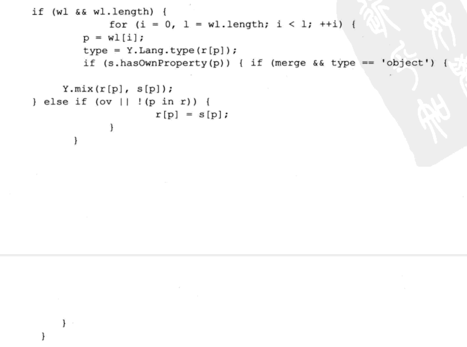
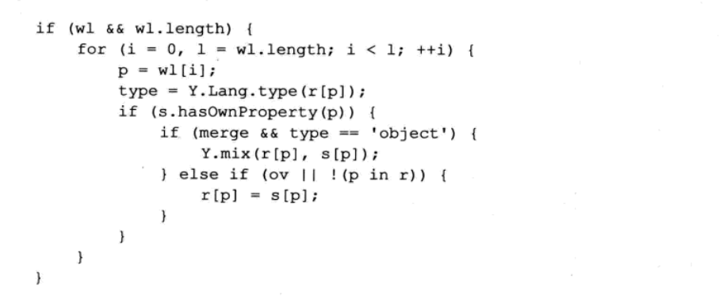

(注1：本书作者是Nicholas C. Zakas，他也是《JavaScript高级程序设计》前3版的作者，所以这本书是很值得一看的。)

(注2：这是一本小册子，只有226页，所以看起来也不会有太多的压力。)

# 第一部分：编程风格

> “程序是写给人读的，只是偶尔让计算机执行一下。”                                                          ——Donald Knuth              

当你刚刚组建一个团队时，团队中的每个人都各自有一套编程习惯。毕竟，每个成员都有着不同的背景。有些人可能来自某个“皮包公司”（one-man shop），身兼数职，在公司里什么事都做；还有些人会来自不同的团队，对某种特定的做事风格情有独钟（或恨之入骨）。每个人都觉得代码应当按照自己的想法来写，这些通常被归纳为个人编程嗜好。在这个过程中应当尽早将确定统一的编程风格纳入议题。

## 为什么要讨论编程风格

提炼编程风格是一道工序，花再多的时间也不为过。毕竟每个人都有自己的想法，如果一天当中你有8小时是在写代码，那么你自然希望用一种舒服的方式来写代码。刚开始，团队成员对新的编程风格有点不适应，全靠强势的项目组长强制推行才得以持续。一旦风格确立后，这套编程风格就会促成团队成员高水准的协作，因为所有代码（的风格）看起来极为类似。

在团队开发中，所有的代码看起来风格一致是极其重要的，原因有以下几点。

* 任何开发者都不会在乎某个文件的作者是谁，也没有必要花费额外精力去理解代码逻辑并重新排版，因为所有代码排版格式看起来非常一致。我们打开一个文件时所干的第一件事，常常不是立即开始工作而是首先修复代码的缩进，当项目很庞大时，你会体会到统一的编程风格的确大幅度节省了时间成本。

* 我能很容易地识别出问题代码并发现错误。如果所有代码看起来很像，当你看到一段与众不同的代码时，很可能错误就产生在这段代码中。

毫无疑问，全球性的大公司都对外或对内发布过编程风格文档。

编程风格是个人的事情，只有放到团队开发中才能发挥作用。本书的这部分给出了JavaScript 编码规范中值得关注（推荐）的方面。在某些场景中，很难说哪种编程风格好，哪种编程风格不好，因为有些编程风格只是某些人的偏好。本章不是向你灌输我个人的风格偏好，而是提炼出了编程风格应当遵循的重要的通用准则。本书附录A中给出了我个人的JavaScript编程风格。

## 有用的工具

开发编码指南是一件非常困难的事情——执行是另外一回事。在团队中通过讨论达成一致和进行代码评审（code review）时，每个人都很关注编码风格，但在平时大家却常常将这些抛在脑后。工具可以对每个人实时跟踪。这里有两个用来检查编程风格的工具，这两个工具非常有用：JSLint和JSHint。

JSLint 是由Douglas Crockford创建的。这是一个通用的JavaScript代码质量检查工具。
最开始，JSLint只是一个简单的查找不符合JavaScript模式的、错误的小工具。经过数年的进化，JSLint已经成为一个有用的工具，不仅仅可以找出代码中潜在的错误，而且能针对你的代码给出编码风格上的警告。

Crockford将他对JavaScript风格的观点分成了三个不同的部分。

* "JavaScript风格的组成部分（第一部分）"（http://javascrpt.crockford.com/style1.html），包含基本的模式和语法。
* "JavaScript风格的组成部分（第二部分）"（http://javascrpt.crockford.com/style2.html），包含基本的模式和语法。
* "JavaScript编程语言的编码规范"(http://javascript.crockford.com/code.html），这个规范更加全面，从前两部分中提炼出了编程风格的精华部分，同时增补了少量的编程风格指引。

> 前2个网站打不开了，第3个网站可以打开。[道格拉斯的博客](https://www.crockford.com/dec64.html)

JSLint直接吸纳了很多Crockford所提炼的编程风格，而且很多时候我们无法关闭JSLint中检查编程风格的功能。所以JSLint是一个非常棒的工具，当然前提是你认可Crockford关于编程风格的观点。

JSHint是JSLint的一个分支项目，由Anton Kovalyov创建并维护。JSHint的目标是提供更加个性化的JavaScript代码质量和编程风格检查的工具。比如，当出现语法错误的时候，JSHint几乎可以关掉所有编程风格检查，这样你可以完全自定义消息提示。Kovalyov非常鼓励大家通过GitHub（http://github.com）上的源代码库参与JSHint项目并为之贡献代码。

你可以将这些工具中的一种集成到打包过程中，通过这种方式推行编码规范是一个不错的方法。这种方法同时可以监控你的JavaScript代码中潜在的错误。

# 第1章：基本的格式化

编程风格指南的核心是基本的格式化规则（formatting rule），这些规则直接决定了如何编写高水准的代码。与在学校学习写字时所用的方格纸类似，基本的格式化规则将指引开发者以特定的风格编写代码。这些规则通常包含一些你不太在意的有关语法的信息，但对于编写清晰连贯的代码段来说，每一条信息都是非常重要的。

## 缩进层级

(讲Vue的王红元老师推荐缩进2个字符，还说很多大公司也是缩进2个字符的，我比较习惯缩进4个字符，看着更加清爽。)

关于JavaScript编码风格，我们首先要讨论的是（几乎所有的语言都是如此）如何处理缩进。对这个话题是可以争论上好几个小时的，缩进甚至关系到软件工程师的价值观。在确定编程风格之初应当首先确定缩进格式，这非常重要，以免工程师后续会陷入那个老生常谈的打开文件时二话不说先重排代码缩进的问题之中。来看一下这段代码（为了演示，这里故意修改了示例代码的缩进）。

快速读懂这段代码并不容易。这里的缩进并不统一，一眼看去else是对应到第1行的if语句。但实际上这个else和代码第5行的i语句相对应。罪魁祸首是多位开发人员在同一段代码里应用了不同的缩进风格。这恰恰说明了统一缩进风格的重要性。如果有适当的缩进，这段代码将变得更加易读。

坚持使用适度的缩进是万里长征的第一步——本章在下面将提到这种做法可以带来其他可维护性方面的提升。

对于大多数编程风格来说，代码到底应该如何缩进并没有统一的共识。有两种主张。

**使用制表符(Tab)进行缩进**

