(注1：《JS高级程序设计》后面的DOM、BOM看的囫囵吞枣，一头雾水，前面找了一些视频看，现在开始根据视频进行一次复习。先把DOM、BOM巩固一下，之后再把JQuery巩固一下)

(注2：视频是传智播客pink老师刘晓强的)

(注3：现在是2020年4月15日，现在明显感觉头脑清晰了很多了，DOM其实不难的，就是要多熟悉熟悉API，趁着复习DOM的机会把CSS也复习一下)

(注4：学习DOM可以把数据结构中的“树”学习一下)

(注5：现在是2020年4月27日，这段时间没有学习前端知识，花了一点时间学习了网络安全，随后是Linux的视频，决定后面继续看下去。我知道这并不是一个好主意，我现在应该把精力全放在前端的学习上，但是我就是忍不住学点别的，分散自己的精力。找工作是遥遥无期了啊。)

(注6：现在是2020年6月28日，终于开始重新学习DOM了，学完以后就再重头学一遍Jquery，别急，慢慢来)

(注7：虽然前端框架，比如Vue都用虚拟DOM,不用直接对DOM进行操作了，但是还是感觉有必要学一下的。框架只是把DOM的操作进行了封转了)

(注8：回头查了一下，第一次看DOM视频是**2020年2月20日**，很赶的把视频看完了，后面也就复习了很小一部分就搁置了。现在需要按部就班的把基础打好)

(注9：现在是2020年7月5日，学习状态真的很差，双休日都不想看书看视频，游荡了2天一点都没学习，唉。目前已经看完了第2天的视频了，还有5天，我想，就算1天看视频的一半，10天也能看完。希望7月15日能结束DOM的学习吧。当然是在保证质量的前提下啊！！！！)

(注10：现在是2020年7月10日，我已经看完第4天的视频了，现在回过头来大体看一遍，复习一下。今天是周五，下班回家后希望自己能把第5天的视频看完一半，我每个双休日都在浪费时间，希望以后可以继续学习。毕竟2天的时间是很多的啊！)

(注11：现在是2020年7月18日，原计划是7月15日看完的，拖延了3天，也算是终于看完了。看是看完了，但是后面的很多代码让我独立写我是写不出来的，所以之后还是要经常再回炉温故的，最终要达到能独立手写的程度。)

# Web APIs 和 JS 基础关联性

## JS的组成

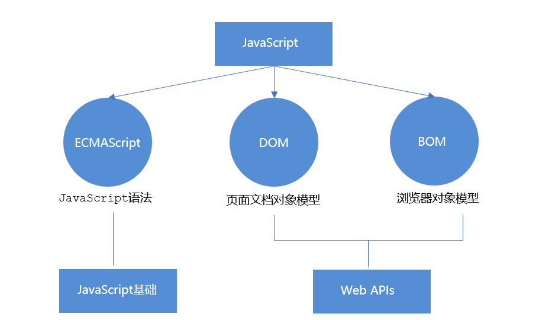

## JS 基础阶段以及 Web APIs 阶段 

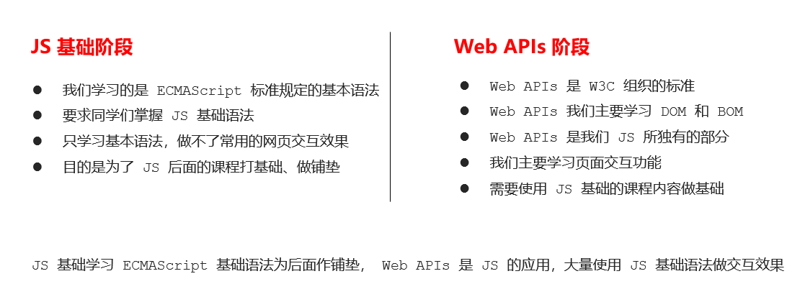

# API 和 Web API

## API

**API（Application Programming**
**Interface,应用程序编程接口）**是一些预先定义的函数，目的是提供应用程序与开发人员基于某软件或硬件得以访问一组例程的能力，而又无需访问源码，或理解内部工作机制的细节。

简单理解： API 是给程序员提供的一种工具，以便能更轻松的实现想要完成的功能。

比如手机充电的接口：

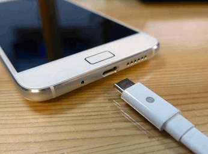

我们要实现充电这个功能：

* 我们不关心手机内部变压器，内部怎么存储电等

* 我们不关心这个充电线怎么制作的

* 我们只知道，我们拿着充电线插进充电接口就可以充电

* 这个充电接口就是一个 API 

## Web API 

**Web API 是浏览器**提供的一套操作**浏览器功能**和**页面元素**的 API ( BOM 和 DOM )。

现阶段我们主要针对于浏览器讲解常用的 API , 主要**针对浏览器做交互效果**。

比如我们想要浏览器弹出一个警示框， 直接使用 alert(‘弹出’)

MDN 详细 API : https://developer.mozilla.org/zh-CN/docs/Web/API

因为 Web API 很多，所以我们将这个阶段称为 Web APIs

## API 和 Web API 总结

1. **API 是为我们程序员提供的一个接口，帮助我们实现某种功能，我们会使用就可以了，不必纠结内部如何实现**
2. Web API 主要是**针对于浏览器**提供的接口，主要针对于浏览器做交互效果。
3. Web API 一般都有输入和输出（函数的传参和返回值），Web API 很多都是**方法（函数）**。
4. 学习 Web API 可以结合前面学习**内置对象方法**的思路学习。

# DOM(文档对象模型)

## 目标

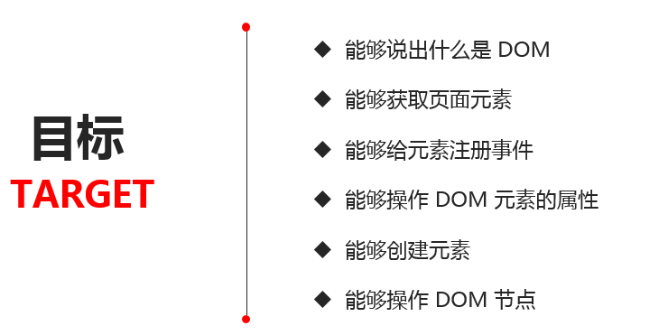

## 目录

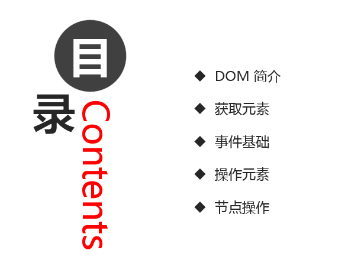

## DOM简介

### 什么是DOM

文档对象模型（Document Object Model，简称 **DOM**），是 W3C 组织推荐的处理可扩展标记语言（HTML或者XML）的标准**编程接口**。

W3C 已经定义了一系列的 DOM 接口，通过这些 DOM 接口可以改变网页的内容、结构和样式。

### DOM树

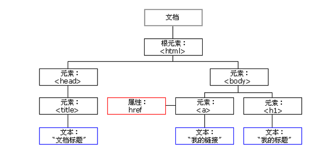

* 文档：一个**页面**就是一个**文档**，DOM 中使用 **document **表示
* 元素(太子)：页面中的所有**标签**都是**元素**，DOM 中使用**element **表示(有标签的才是元素！！！)
* 节点(父皇)：网页中的所有**内容**都是**节点**（**标签、属性、文本、注释**等），DOM 中使用**node **表示(比如文本它是节点，但是它没有标签，所以它不是元素！！！！)

> 问题：标签既是元素也是节点吗？？？-------是的！！！
>
> 元素(Element)和结点(Node)的**区别**:元素是一个小范围的定义，必须是含有**完整信息**的结点才是一个元素，例如`< div>...< /div>`。但是**一个结点不一定是一个元素，而一个元素一定是一个结点**。(即节点包含元素！！元素是特殊的节点！！！！！！！！)
>
> (举个例子，只有长子才能成为太子—元素，父皇的其他儿子都不是太子—元素)
>
> 什么是node：
> NODE是相对TREE这种数据结构而言的。TREE就是由NODE组成。这个部分你可以参考离散数学的树图。
> 
>
> 什么是element:
> ELEMENT则是XML里的概念，< xxx>就是元素，是XML中的数据的组成部分之一。

> DOM 把以上内容**都**看做是对象

[元素(Element)和结点(Node)的区别](https://blog.csdn.net/gtkknd/article/details/68951867)

## 获取元素(只有带标签的才是元素--太子--element)

### 如何获取页面元素

DOM在我们实际开发中主要用来操作元素，我们如何来获取页面中的元素呢?

获取页面中的元素可以使用以下几种方式:

* 根据 ID 获取

* 根据标签名获取

* 通过 HTML5 新增的方法获取

* 特殊元素获取

### 根据ID获取元素

使用 **getElementById()** 方法可以获取带有ID 的元素对象。

~~~javascript
document.getElementById('id');   //id前面不用加#号！！！！！！
~~~

> 因为ID是唯一的，所以中间的Element没有s！！！！

使用**console.dir() 可以**打印我们获取的元素对象**，更好的**查看对象里面的属性和方法。

~~~javascript
<!DOCTYPE html>
<html lang="en">

<head>
    <meta charset="UTF-8">
    <title>Document</title>
</head>

<body>
    //先写标签
    
2019-9-9

	//再写script
    
</body>

</html>
~~~

### 根据标签名获取-01

使用 **getElementsByTagName()** 方法可以返回带有指定标签名的**对象的集合**。

~~~javascript
document.getElementsByTagName('标签名');
(使用document的话，是把整个页面中所有的指定标签都获取过来)
~~~

> 注意： 
>
> 1.因为得到的是一个对象的集合，所以我们想要操作里面的元素就需要遍历。
>
> 2.得到元素对象是动态的(如果元素里的内容发生了变化，下面的JS是不需要改动的)
>
> 3.如果获取不到元素,则返回为空的伪数组(因为获取不到对象)
>
> 4.因为有很多元素，所以中间的Element有s！！！
>
> 5.最前面是document

~~~html
<!DOCTYPE html>
<html lang="en">

<head>
    <meta charset="UTF-8">
    <title>Document</title>
</head>

<body>
    <ul>
        <li>知否知否，应是等你好久1</li>
        <li>知否知否，应是等你好久2</li>
        <li>知否知否，应是等你好久3</li>
        <li>知否知否，应是等你好久4</li>
    </ul>

    <ol id="ol">
        <li>生僻字1</li>
        <li>生僻字2</li>
        <li>生僻字3</li>
        <li>生僻字4</li>
    </ol>

    
</body>

</html>
~~~

### 根据标签名获取-02

还可以获取**某个元素**(父元素)内部所有指定标签名的子元素。

~~~javascript
element.getElementsByTagName('标签名');
(使用element是缩小了范围，不是寻找整个文档的某个指定标签，而是先找一个爹，寻找特定范围(这个爹)的儿子标签)
~~~

> 注意：
>
> 1.父元素(element)必须是**单个对象**(必须指明是哪一个元素对象). 获取的时候不包括父元素自己。(ol不会获取过来，只是帮你把子元素获取过来)
>
> 2.上文中的ol1是**伪数组**的形式(不管里面有几个li,1个还是10个，返回的都是伪数组)，而伪数组是不能够作为父元素的！！！！！
>
> 3.因为有很多元素，所以中间的Element有s！！！
>
> 4.最前面是element

### 通过 HTML5 新增的方法获取

> 如果做的网页要兼容IE6,7,8，那这些方法都不能用了！！！！！！
>
> 如果我们不考虑兼容性问题，或到了移动端，那我们就可以放心大胆的使用以下这些方法了。

~~~javascript
1. document.getElementsByClassName(‘类名’)；// 根据类名返回元素对象集合
~~~

~~~javascript
2. document.querySelector('选择器');        // 根据指定选择器返回第一个元素对象(第一个！！！！)
(它最大的好处是：什么选择器[无论是类还是id选择器]都能给你选！！！)
~~~

~~~javascript
3. document.querySelectorAll('选择器');     // 根据指定选择器返回
~~~

> querySelector 和 querySelectorAll里面的类和id选择器需要加符号,而标签选择器就什么也不用加了。

> 文档对象模型Document引用的querySelector()方法返回文档中与指定选择器**或**选择器组匹配的第一个 html元素Element。 如果找不到匹配项，则返回null。

前面也可以不是document,例如：

~~~javascript
var ul = document.querySelector('ul');
var lis = ul.querySelectorAll('li');
~~~

[document.querySelector()](<https://developer.mozilla.org/zh-CN/docs/Web/API/Document/querySelector>)

~~~javascript
<!DOCTYPE html>
<html lang="en">
<head>
    <meta charset="UTF-8">
    <title>Document</title>
</head>

<body>
    
盒子1

    
盒子2

    

        <ul>
            <li>首页</li>
            <li>产品</li>
        </ul>
    

           
</body>
</html>
~~~

[详解document.getElementById 和 document.querySelector的区别](<https://blog.csdn.net/m0_37793545/article/details/79193254>)

### 获取特殊元素(body,html)--冷门

#### 获取body元素

~~~javascript
doucumnet.body  // 返回body元素对象
~~~

#### 获取html元素

~~~javascript
document.documentElement  // 返回html元素对象
~~~

~~~javascript
<!DOCTYPE html>
<html lang="en">

<head>
    <meta charset="UTF-8">
    <title>Document</title>
</head>

<body>
    
</body>

</html>
~~~

## 事件基础

### 事件概述

JavaScript 使我们有能力创建动态页面，而**事件是可以被 JavaScript 侦测到的行为**。

简单理解： **触发--- 响应机制**。

网页中的**每个元素**都可以产生某些可以触发 JavaScript 的事件，例如，我们可以在用户点击某按钮时产生一个 事件，然后去执行某些操作。

### **事件三要素**

1. **事件源 （谁）**

2. **事件类型 （什么事件）**

3. **事件处理程序 （做啥）**

~~~javascript
<!DOCTYPE html>
<html lang="en">

<head>
    <meta charset="UTF-8">
    <title>Document</title>
</head>

<body>
    <button id="btn">唐伯虎</button>
    
</body>
</html>
~~~

### 执行事件步骤

~~~javascript
<!DOCTYPE html>
<html lang="en">

<head>
    <meta charset="UTF-8">
    <title>Document</title>
</head>

<body>
    
123

    
</body>

</html>
~~~

### **常见的鼠标事件**

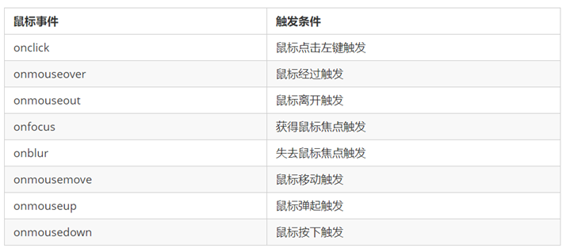

## 操作元素

JavaScript 的 DOM 操作可以改变网页内容、结构和样式，我们可以利用 DOM 操作元素来改变元素里面的内容 、属性等。注意以下都是属性

### 操作元素之修改元素内容

~~~javascript
<!DOCTYPE html>
<html lang="en">

<head>
    <meta charset="UTF-8">
    <title>Document</title>
    
</head>

<body>
    <button>显示当前系统时间</button>
    
某个时间

    
1123

    
</body>

</html>
~~~

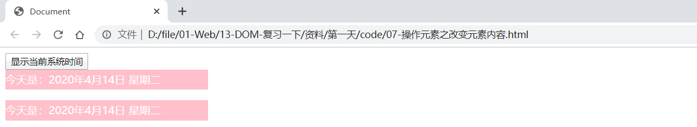

#### 拓展知识1：Date对象

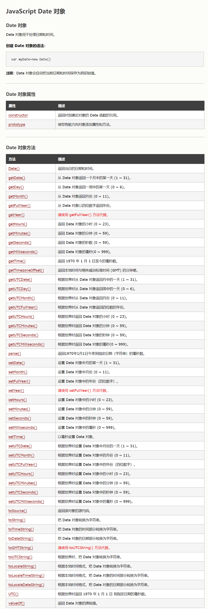

#### 拓展知识2：getFullYear()方法

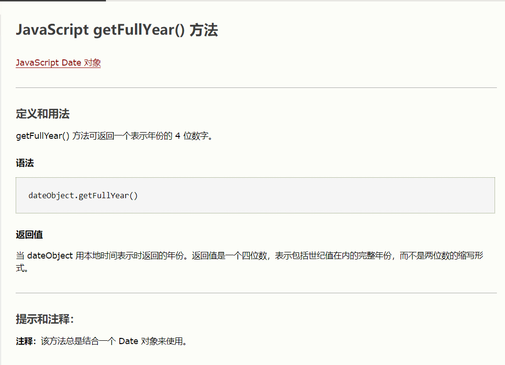

#### 拓展知识3：getMonth()、getDate()方法

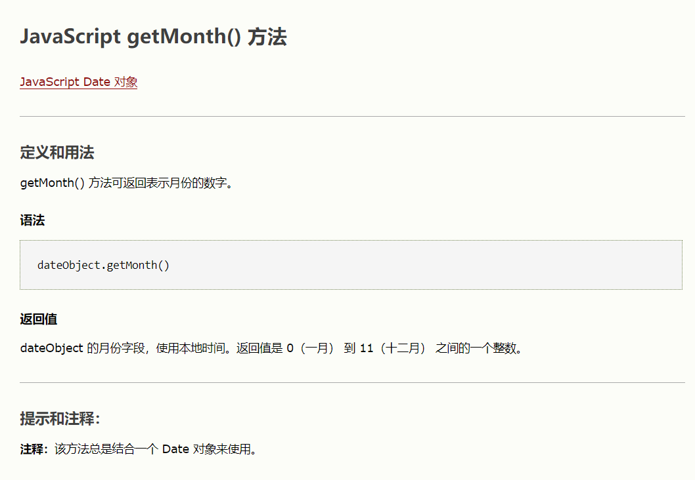

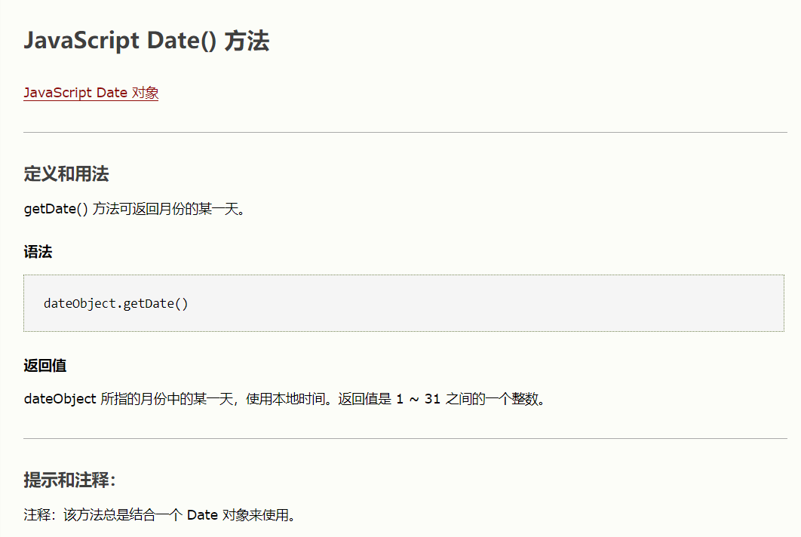

#### 拓展知识4：getDay()方法

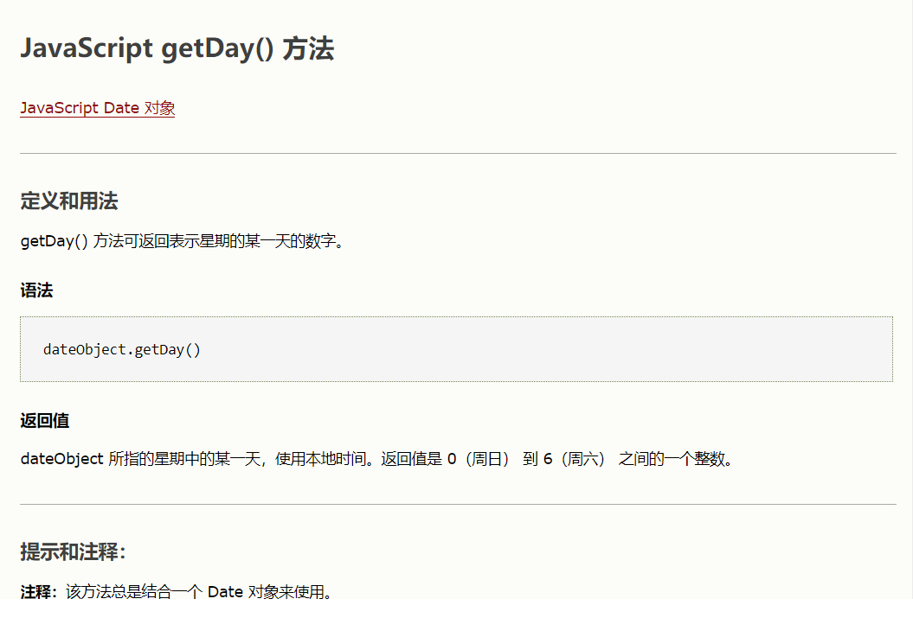

#### 拓展知识5：innerHTML属性

innerHTML在JS是双向功能：获取对象的内容  或  向对象插入内容。

在**读模式**下，innerHTML属性返回与调用元素的所有子节点（包括元素、注释和文本节点）对应的HTML标记。在**写模式**下，innerHTML会根据指定的值创建新的DOM树，然后用这个DOM树完全替换调用元素原先的所有子节点。

#### 拓展知识6：innerText和innerHTML的区别(不熟)

~~~javascript
element.innerText
~~~

> 从起始位置到终止位置的内容, 但它去除 html 标签， 同时空格和换行也会去掉

~~~javascript
element.innerHTML
~~~

> 起始位置到终止位置的全部内容，包括 html 标签，同时保留空格和换行

~~~javascript
<!DOCTYPE html>
<html lang="en">

<head>
    <meta charset="UTF-8">
    <title>Document</title>
</head>

<body>
    

    

        我是文字
        123
    

    
</body>

</html>
~~~

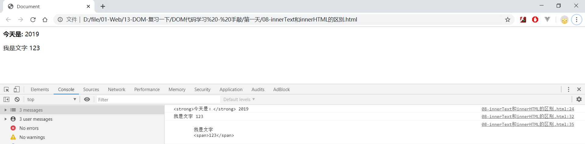

[innerHTML与innerText区别](<https://blog.csdn.net/magi1201/article/details/44131361>)

> innerHTML指的是从对象的起始位置到终止位置的全部内容,包括HTML标签。
>
> innerText 指的是从起始位置到终止位置的内容,但它去除HTML标签。
>
> 同时，innerHTML 是所有浏览器都支持的，innerText 是IE浏览器和chrome 浏览器支持的，Firefox浏览器不支持。其实，innerHTML 是W3C 组织规定的属性；而innerText 属性是IE浏览器自己的属性，不过后来的浏览器部分实现这个属性罢了。
>
> IE原来专有的插入标记的属性innerHTML和outerHTML已经被HTML5纳入规范**。
> 但另外两个插入文本的专有属性则没有这么好的运气。**这两个没有被HTML5看中的属性是**innerText和outerText**。

> 兼容性问题：低版本火狐浏览器不支持innerText，支持textContent。
>
> 而IE 6,7,8不支持textContent，支持innerText。

### 操作元素之修改元素属性

**常用元素的属性操作**

> 1.innerText、innerHTML 改变元素内容(举例：div.innerText,div.innerHTML,中间没有style！！！！！)
>
> 2.src、href(举例：img.src,img.href,中间没有style！！！！！)
>
> 3.id、alt、title

~~~javascript
<!DOCTYPE html>
<html lang="en">

<head>
    <meta charset="UTF-8">
    <title>Document</title>
    
</head>
<body>
    <button id="ldh">刘德华</button>
    <button id="zxy">张学友</button>  
    

    
</body>

</html>
~~~

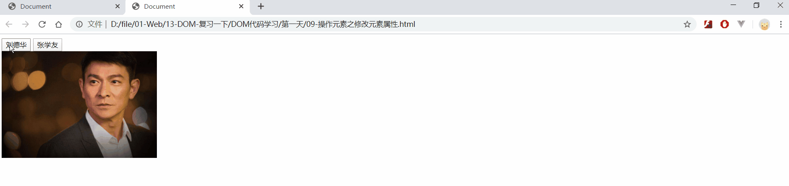

### 分时问候并显示不同图片案例

~~~javascript
<!DOCTYPE html>
<html lang="en">

<head>
    <meta charset="UTF-8">
    <title>Document</title>
    
</head>

<body>
    
    
上午好

    
</body>
</html>
~~~

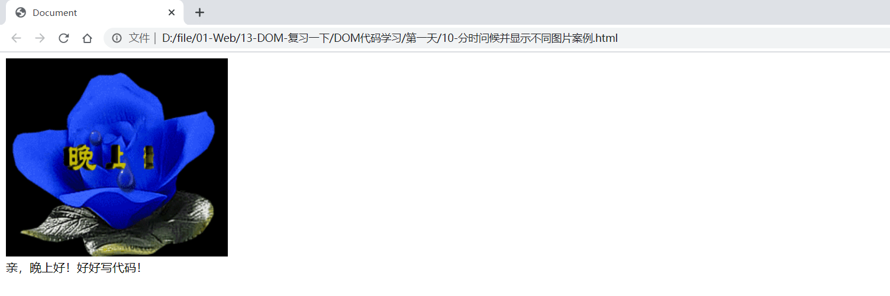

### 操作元素之修改表单属性

利用 DOM 可以操作如下表单元素的属性：

>  type、value、checked、selected、disabled

~~~javascript
<!DOCTYPE html>
<html lang="en">

<head>
    <meta charset="UTF-8">
    <title>Document</title>
</head>

<body>
    <button>按钮</button>
    <input type="text" value="输入内容">
    
</body>
</html>
~~~

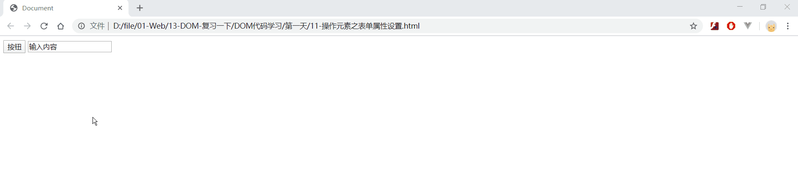

### 操作元素之修改样式属性

我们可以通过 JS 修改元素的大小、颜色、位置等样式。

~~~
1.element.style          行内样式操作
2.element.className      类名样式操作
~~~

> **注意**：
>
> 1.JS 里面的**样式**采取**驼峰命名法** 比如 fontSize、 backgroundColor
>
> 2.JS 修改 style 样式操作，产生的是**行内样式**，CSS 权重比较高（样式必须要在行内写才行！！）

### 仿京东显示隐藏密码

点击按钮将密码框切换为文本框，并可以查看密码明文。

> ①核心思路： 点击眼睛按钮，把密码框类型改为文本框就可以看见里面的密码
>
> ②一个按钮两个状态，点击一次，切换为文本框，继续点击一次切换为密码框
>
> ③算法：利用一个flag变量，来判断flag的值，如果是1 就切换为文本框，flag 设置为0，如果是0 就切换为密码框，flag设置为1

> 视频里只写了第二行样式和特效，我把所有的样式都给补齐了，发现自己的CSS是真的弱啊，没有什么逻辑性。

~~~html
<!DOCTYPE html>
<html lang="en">

<head>
    <meta charset="UTF-8">
    <title>Document</title>
    
</head>
    
</body>
    

        
京东登陆

        

            <input type="" name="" value="用户名/邮箱/已验证手机">
        

        

            <input type="password" name="" id="pwd">
            <label>
                
            </label>
        

        
<a href="#">登陆</a>

        

             <a href="#" class="duanxin">短信验证码登陆</a>
             <a href="#" class="shouji">手机快速注册</a>
        

        <!-- 其他登陆我用图片的，文字它压不住线 -->
        
    

    
</body>
</html>
~~~

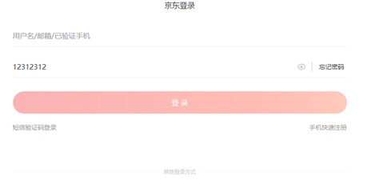

> 我自己的写的宽800px有点太宽了不好看，但是也不想改了，就这样吧。写这个费了我好长时间，自己的CSS确实是薄弱啊。

### 关闭淘宝二维码案例(常用)

> 当初写静态页面京东商城的时候就有个二维码，可以用到这个写特效。
>
> 我发现自己独立写居然不知道怎么写了，这个我必须要独立写一遍，写多了以后就熟了。

> ①核心思路： 利用样式的显示和隐藏完成， display:none 隐藏元素 display:block 显示元素 
>
> ②点击按钮，就让这个二维码盒子隐藏起来即可

~~~html
<!DOCTYPE html>
<html lang="en">

<head>
    <meta charset="UTF-8">
    <title>Document</title>
    
</head>

<body>
    

        淘宝二维码
        
        <i class="close-btn">×</i>
    

    
</body>
</html>
~~~

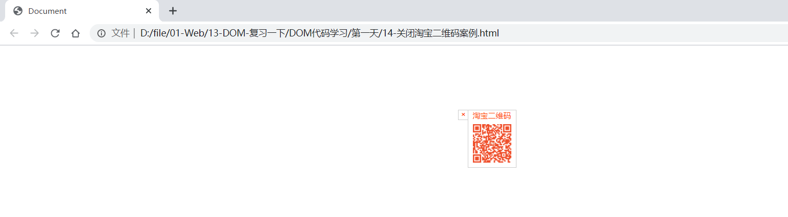

### 循环精灵图(重点)

> 这些真的要自己敲一遍，单单看代码能看懂，感觉也没什么，但是如果要自己做的话，就感觉明显不是那么一回事了，这就是眼高手低吧。

> ①首先精灵图图片排列有规律的
>
> ②核心思路： 利用for循环 修改精灵图片的 背景位置 background-position
>
> ③剩下的就是考验你的数学功底了
>
> ④让循环里面的 i 索引号 * 44 就是每个图片的y坐标

~~~html
<!DOCTYPE html>
<html lang="en">

<head>
    <meta charset="UTF-8">
    <title>Document</title>
    
</head>

<body>
    

        <ul>
            <li></li>
            <li></li>
            <li></li>
            <li></li>
            <li></li>
            <li></li>
            <li></li>
            <li></li>
            <li></li>
            <li></li>
            <li></li>
            <li></li>
        </ul>
    

    
</body>
</html>
~~~

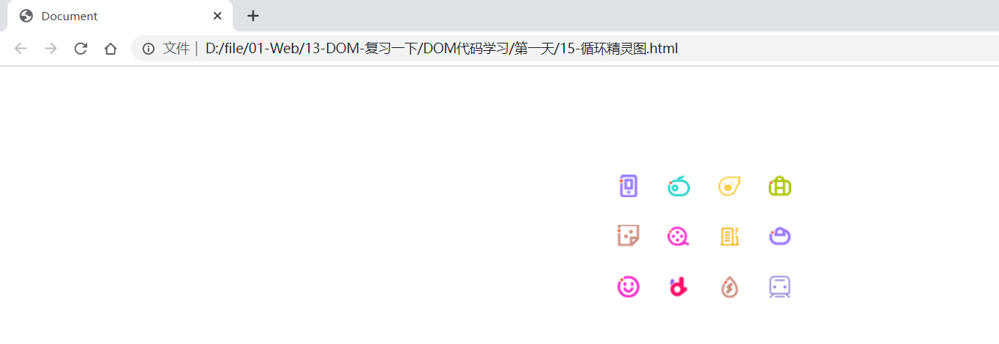

### 显示隐藏文本框内容

> 当鼠标点击文本框时，里面的默认文字隐藏，当鼠标离开文本框时，里面的文字显示。

> ①首先表单需要2个新事件，**获得焦点 onfocus 失去焦点 onblur ** 
>
> ②如果获得焦点， 判断表单里面内容是否为默认文字，如果是默认文字，就清空表单内容
>
> ③如果失去焦点， 判断表单内容是否为空，如果为空，则表单内容改为默认文字

~~~html
<!DOCTYPE html>
<html lang="en">

<head>
    <meta charset="UTF-8">
    <title>Document</title>
    
</head>

<body>
    <input type="text" value="手机">
    

</body>
</html>
~~~

> 关键是自己对this的用法还是不熟，试过不加this的话不行，必须要加this。---this指向的是函数的调用者，也就是text。

### 通过className更改元素样式

~~~html
<!DOCTYPE html>
<html lang="en">

<head>
    <meta charset="UTF-8">
    <title>Document</title>
    
</head>

<body>
    
文本

    
</body>
</html>
~~~

### 开关灯

~~~html
<!DOCTYPE html>
<html lang="en">

<head>
    <meta charset="UTF-8">
    <title>Document</title>
</head>

<body>
    <button id="btn">开关灯</button>
    
</body>

</html>
~~~

### 仿新浪注册页面(重点)

> 用户如果离开密码框，里面输入个数不是6~16，则提示错误信息，否则提示输入正确信息
>
> ①首先判断的事件是表单失去焦点 onblur
>
> ②如果输入正确则提示正确的信息颜色为绿色小图标变化
>
> ③如果输入不是6到16位，则提示错误信息颜色为红色 小图标变化
>
> ④因为里面变化样式较多，我们采取className修改样式

~~~html
<!DOCTYPE html>
<html lang="en">

<head>
    <meta charset="UTF-8">
    <title>Document</title>
    
</head>

<body>
    

        <input type="password" class="ipt">
        
请输入6~16位密码

    

    
</body>
</html>
~~~

> 我单独写的时候是把图片单独弄了个img标签，不是用的背景图片，其实也行。但是写特效的时候不知道怎么了特效不显示出来。

### 操作元素总结

操作元素是 DOM 核心内容。

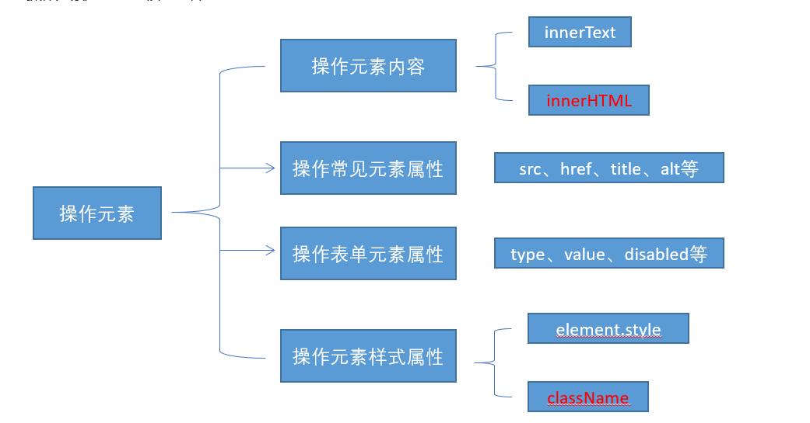

### 排他思想(算法：重点)

> 如果有同一组元素，我们想要某一个元素实现某种样式， 需要用到循环的排他思想算法：
>
> 1. 所有元素全部清除样式（干掉其他人）
>
> 2. 给当前元素设置样式 （留下我自己）
>
> 3. 注意顺序不能颠倒，首先干掉其他人，再设置自己

~~~html
<!DOCTYPE html>
<html lang="en">

<head>
    <meta charset="UTF-8">
    <title>Document</title>
</head>

<body>
    <button>按钮1</button>
    <button>按钮2</button>
    <button>按钮3</button>
    <button>按钮4</button>
    <button>按钮5</button>
    
</body>
</html>
~~~

> 这个算法我还不熟

### 百度换肤(重点)

> ①这个案例练习的是给一组元素注册事件
>
> ②给4个小图片利用循环注册点击事件
>
> ③当我们点击了这个图片，让我们页面背景改为当前的图片
>
> ④核心算法： 把当前图片的src 路径取过来，给 body 做为背景即可

~~~html
<!DOCTYPE html>
<html lang="en">

<head>
    <meta charset="UTF-8">
    <title>Document</title>
    
</head>

<body>
    <ul class="baidu">
        <li></li>
        <li></li>
        <li></li>
        <li></li>
    </ul>
    
</body>

</html>
~~~

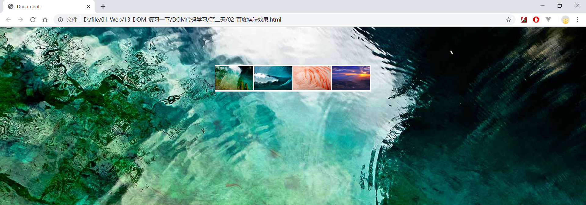

### 表格隔行变色

> ①用到新的鼠标事件 鼠标经过 onmouseover  鼠标离开 onmouseout
>
> ②核心思路：鼠标经过 tr 行，当前的行变背景颜色， 鼠标离开去掉当前的背景颜色
>
> ③注意： 第一行（thead里面的行）不需要变换颜色，因此我们获取的是 tbody 里面的行
>
> ④使用的就是修改不同类名的方式

~~~html
<!DOCTYPE html>
<html lang="en">

<head>
    <meta charset="UTF-8">
    <title>Document</title>
    
</head>

<body>
    <table>
        <thead>
            <tr>
                <th>代码</th>
                <th>名称</th>
                <th>最新公布净值</th>
                <th>累计净值</th>
                <th>前单位净值</th>
                <th>净值增长率</th>
            </tr>
        </thead>

        <tbody>
            <tr>
                <td>003526</td>
                <td>农银金穗3个月定期开放债券</td>
                <td>1.075</td>
                <td>1.079</td>
                <td>1.074</td>
                <td>+0.047%</td>
            </tr>
            <tr>
                <td>003526</td>
                <td>农银金穗3个月定期开放债券</td>
                <td>1.075</td>
                <td>1.079</td>
                <td>1.074</td>
                <td>+0.047%</td>
            </tr>
            <tr>
                <td>003526</td>
                <td>农银金穗3个月定期开放债券</td>
                <td>1.075</td>
                <td>1.079</td>
                <td>1.074</td>
                <td>+0.047%</td>
            </tr>
            <tr>
                <td>003526</td>
                <td>农银金穗3个月定期开放债券</td>
                <td>1.075</td>
                <td>1.079</td>
                <td>1.074</td>
                <td>+0.047%</td>
            </tr>
            <tr>
                <td>003526</td>
                <td>农银金穗3个月定期开放债券</td>
                <td>1.075</td>
                <td>1.079</td>
                <td>1.074</td>
                <td>+0.047%</td>
            </tr>
            <tr>
                <td>003526</td>
                <td>农银金穗3个月定期开放债券</td>
                <td>1.075</td>
                <td>1.079</td>
                <td>1.074</td>
                <td>+0.047%</td>
            </tr>
        </tbody>
    </table>
    
</body>
</html>
~~~

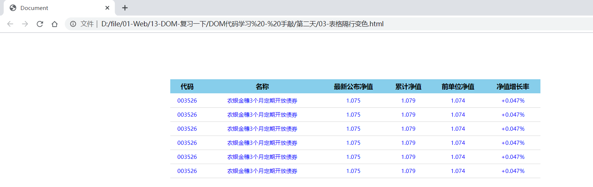

### 全选反选(重点)

> 业务需求：
>
> 1.点击上面全选复选框，下面所有的复选框都选中（全选）
>
> 2.再次点击全选复选框，下面所有的复选框都不中选（取消全选）
>
> 3.如果下面复选框全部选中，上面全选按钮就自动选中
>
> 4.如果下面复选框有一个没有选中，上面全选按钮就不选中
>
> 5.所有复选框一开始默认都没选中状态

> 案例分析：
>
> ①全选和取消全选做法： 让下面所有复选框的checked属性（选中状态） 跟随 全选按钮即可
>
> ②下面复选框需要全部选中， 上面全选才能选中做法： 给下面所有复选框绑定点击事件，**每次点击，都要循环查看下面所有的复选框是否选中**，如果有一个没选中的， 上面全选就不选中。
>
> ③**可以设置一个变量，来控制全选是否选中**

> 我们可以把业务内容分为2个大块：
>
> ①第一个大块是全选按钮：点击则全选，再点击则全不选。
>
> ②第二个大块是下面的4个小按钮，你只要把这4个全部选中才会影响上面的全选按钮。

~~~html
<!DOCTYPE html>
<html>

<head lang="en">
    <meta charset="UTF-8">
    <title></title>
    

</head>

<body>
    

        <table>
            <thead>
                <tr>
                  	<!--这个是全选按钮-->
                  	 <!--input有一个属性叫checked,如果checked='checked'，则说明是选中状态-->
                    <th><input type="checkbox" id="j_cbAll"/></th>
                    <th>商品</th>
                    <th>价钱</th>
                </tr>
            </thead>
            
            <tbody id="j_tb">
                <tr>
                    <td><input type="checkbox" /></td>
                    <td>iPhone8</td>
                    <td>8000</td>
                </tr>
                <tr>
                    <td><input type="checkbox" /></td>
                    <td>iPad Pro</td>
                    <td>5000</td>
                </tr>
                <tr>
                    <td><input type="checkbox" /></td>
                    <td>iPad Air</td>
                    <td>2000</td>
                </tr>
                <tr>
                    <td><input type="checkbox" /></td>
                    <td>Apple Watch</td>
                    <td>2000</td>
                </tr>

            </tbody>
        </table>
    

    
</body>

</html>
~~~

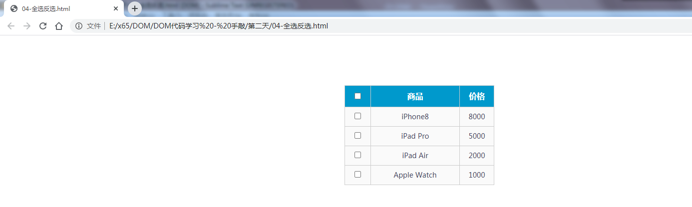

> 这个让我独立写我写不出来。
>
> 我又看了一遍视频，加深了一下印象。
>
> 用jQuery写真简单啊，但是原生的必须也要会。

### 自定义属性操作

**1.** **获取**属性值

> element.property      获取属性值。
> element.getAttribute('属性');
>
> **区别：**
>
> element.property   获取内置属性值（元素本身自带的属性）
>
> element.getAttribute(‘属性’); 主要获得自定义的属性 （标准） 我们程序员自定义的属性

**2.** **设置**属性值

> element.property = ‘值’ 设置内置属性值。
>
> element.**setAttribute**('属性', '值'); 
>
> **区别：**
>
> element.property 设置内置属性值
>
> element.setAttribute(‘属性’); 主要设置自定义的属性 （标准）

**3.移除**属性

> element.removeAttribute('属性');

~~~html
<!DOCTYPE html>
<html lang="en">

<head>
    <meta charset="UTF-8">
    <title>Document</title>
</head>

<body>
    <!-- 这个index是自定义属性，自己造出来的一个属性 -->
    

    
</body>
</html>
~~~

### Tab栏切换(重点)

这是一个重点案例，是前端人员的必备技能！！你必须要把这个案例给写会！！！！

> 案例分析
>
> ①Tab栏切换有2个大的模块
>
> ②上面的模块选项卡，点击某一个，当前这一个底色会是红色，其余不变（排他思想） 修改类名的方式
>
> ③下面的模块内容，会跟随上面的选项卡变化。所以下面模块变化**写到点击事件里面**。
>
> ④规律：下面的模块**显示内容**和上面的**选项卡**一一对应，相匹配。
>
> ⑤核心思路： 给**上面**的`tab_list `里面的所有小li 添加**自定义属性**，**属性值从0开始编号**。
>
> （这个案例里面用到了自定义属性！！！！！！！！！！！！！！）
>
> ⑥ 当我们点击`tab_list`里面的某个小li，让`tab_con `里面对应序号的内容显示，其余隐藏（排他思想）

~~~html

~~~

> 这个是做上面的模块所用的样式代码

~~~html
<!DOCTYPE html>
<html lang="en">

<head>
    <meta charset="UTF-8">
    <title>Document</title>
    
</head>

<body>
  	<!--大盒子叫tab,里面有上下2个盒子，一个叫tab_list，一个叫tab_con-->
  	<!--tab_list里面有5个li-->
    <!--tab_con里面有5个div-->
  	<!--5个li和5个div是一一对应的关系-->
    

        

            <ul>
                <li class="current">商品介绍</li>
                <li>规格与包装</li>
                <li>售后保障</li>
                <li>商品评价（50000）</li>
                <li>手机社区</li>
            </ul>
        

        
        

            <!-- block除了有转为块级元素以外，还有显示的意思 -->
            <!-- 行内元素层级高，把上面的display:none给覆盖了 -->
            

                商品介绍模块内容
            

            

                规格与包装模块内容
            

            

                售后保障模块内容
            

            

                商品评价（50000）模块内容
            

            

                手机社区模块内容
            

        
   
    

    
</body>

</html>
~~~

> 这个是2个模块都完成的最终代码。(这个我独立写我也写不出来)

### H5自定义属性

自定义属性目的：是为了保存并使用数据。有些数据可以**保存到页面中**而**不用保存到数据库中**。

自定义属性获取是通过`getAttribute(‘属性’) `获取。

但是有些自定义属性很容易引起歧义，**不容易判断**是元素的内置属性还是自定义属性。

H5给我们新增了自定义属性：

#### 1. 设置H5自定义属性

H5规定自定义属性**data-开头**做为属性名并且赋值,比如

~~~html
< div data-index="1">< /div>
~~~

或者使用 JS 设置  

~~~javascript
element.setAttribute(‘data-index’, 2)
~~~

#### 2. 获取H5自定义属性

1.兼容性获取 (没有兼容性问题) 

~~~html
element.getAttribute(‘data-index’);
~~~

2.H5新增 (有兼容性问题)

~~~html
element.dataset.index  或者 element.dataset['index']   ie 11才开始支持(有兼容性问题)
~~~

~~~html
<!DOCTYPE html>
<html lang="en">

<head>
    <meta charset="UTF-8">
    <title>Document</title>
</head>

<body>
    

    
</body>
</html>
~~~

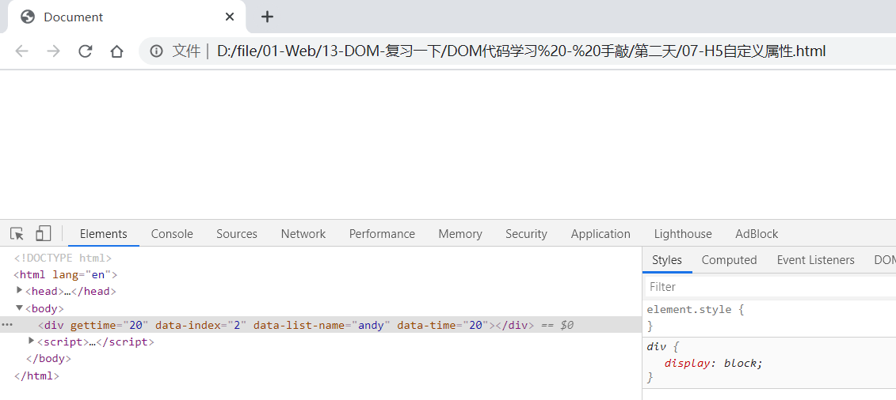

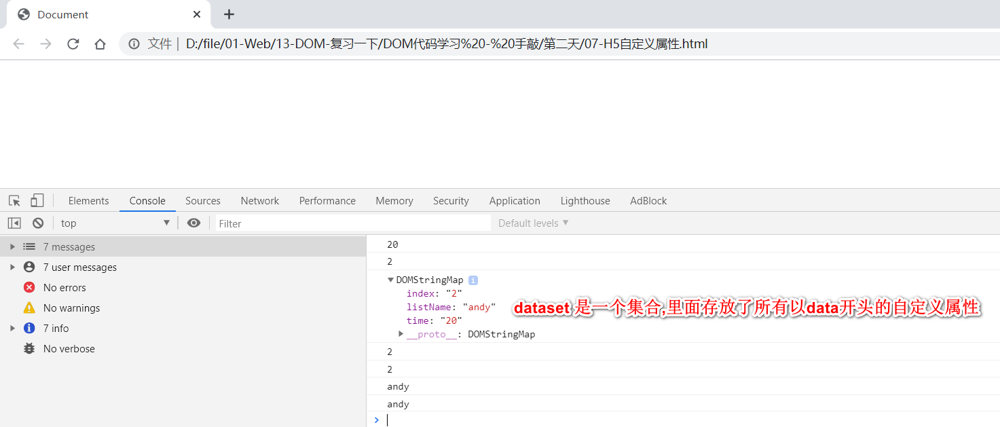

## 节点操作

### 为什么学节点操作

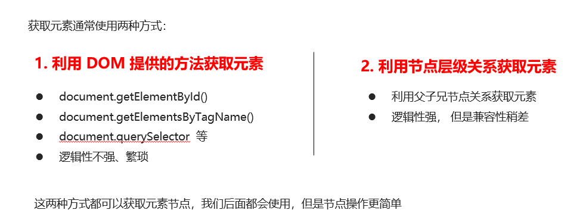

### 节点概述(见上面DOM树)

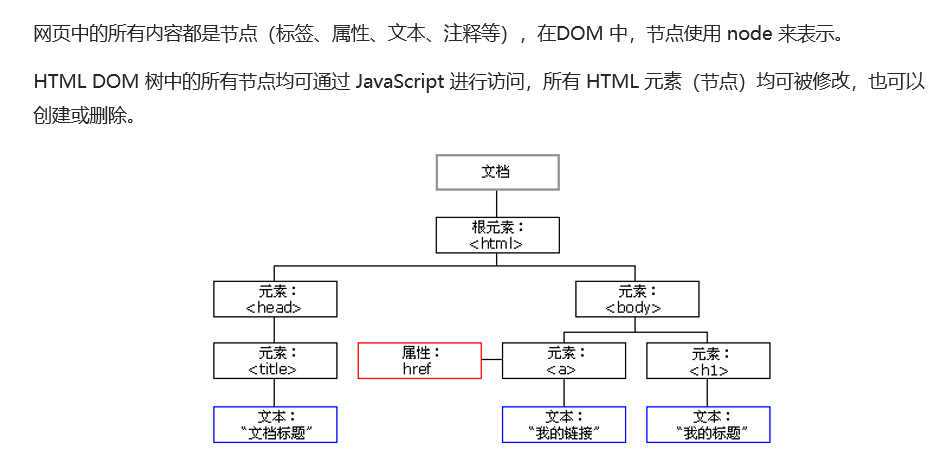

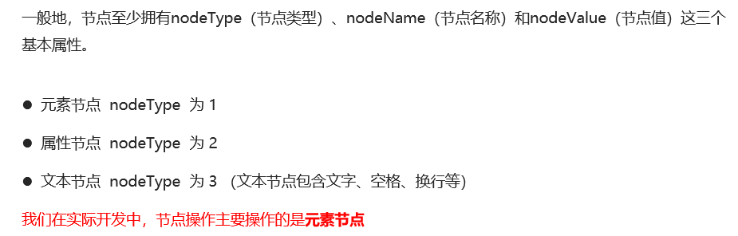

### 节点层级

利用 DOM 树可以把节点划分为不同的层级关系，常见的是**父子兄**层级关系。(父子，兄弟)

### 父级节点（parentNode）

~~~
node.parentNode  
~~~

* parentNode 属性可返回某节点的父节点，注意是**最近**的一个父节点(亲爸爸)
* 如果指定的节点**没有父节点则返回 null** 

~~~html
<!DOCTYPE html>
<html lang="en">

<head>
    <meta charset="UTF-8">
    <title>Document</title>
</head>

<body>
    <!-- 节点的优点 -->
    
我是div

    我是span
    <ul>
        <li>我是li</li>
        <li>我是li</li>
        <li>我是li</li>
        <li>我是li</li>
    </ul>
    

        

            ×
        

    

    
</body>

</html>
~~~

#### 子节点(太子childNodes、二皇子children)

> 太子不纯洁，我们更喜欢用二皇子

~~~
1. parentNode.childNodes（标准,但是不纯洁，有杂质）   -----s表示的是复数，子节点可能有很多   
~~~

* parentNode.childNodes
  返回包含指定节点的子节点的**集合**，该集合为**即时更新**的集合。

> 注意：返回值里面包含了所有的子节点，包括元素节点，文本节点等。
>
> 如果只想要获得里面的元素节点，则需要专门处理。 所以我们一般不提倡使用childNodes

~~~html
var ul = document. querySelector(‘ul’);
for(var i = 0; i < ul.childNodes.length;i++) {
if (ul.childNodes[i].nodeType == 1) {    //ul.childNodes[i] 是元素节点
    console.log(ul.childNodes[i]);
    }
}
~~~

> childNodes太麻烦了，不纯洁，得到了以后还要再筛选一遍，去掉文本节点之类的

~~~html
<!DOCTYPE html>
<html lang="en">

<head>
    <meta charset="UTF-8">
    <title>Document</title>
</head>

<body>
    <!-- 节点的优点 -->
    
我是div

    我是span
    <ul>
        <li>我是li</li>
        <li>我是li</li>
        <li>我是li</li>
        <li>我是li</li>

    </ul>

    <ol>
        <li>我是li</li>
        <li>我是li</li>
        <li>我是li</li>
        <li>我是li</li>
    </ol>

    

        

            ×
        

    

    
</body>
</html>
~~~

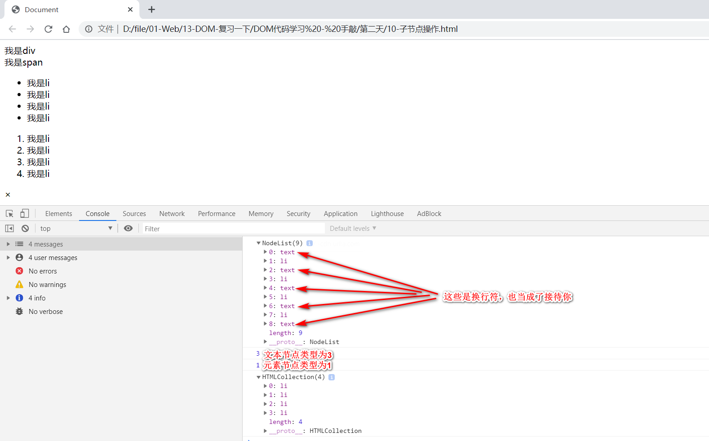

~~~
★2. parentNode.children（非标准，很纯洁，没有杂质，子节点集合里只有元素节点）  
~~~

parentNode.children
是一个**只读属性**，返回所有的子元素节点。它只返回**子元素节点**，其余节点不返回
（这个是我们重点掌握的）。

> 虽然children 是一个非标准，但是得到了各个浏览器的支持，因此我们可以放心使用。

#### 子节点：第一个子节点和最后一个子节点

> 我们比较关注第一个孩子和倒数第一个孩子

* firstChild
  返回第一个子节点，找不到则返回null。同样，也是包含所有的节点

~~~
parentNode.firstChild    （包含所有节点不好，我们不用！！！）
~~~

* lastChild 返回最后一个子节点，找不到则返回null。同样，也是包含所有的节点。

~~~
parentNode.lastChild     （包含所有节点不好，我们不用！！！）
~~~

------

实际开发中，firstChild 和 lastChild
包含其他节点，操作不方便，而 **firstElementChild** 和 **lastElementChild** 又有兼容性问题，那么我们如何获取第一个子元素节点或最后一个子元素节点呢？

> 解决方案：
>
> 1.如果想要第一个子元素节点，可以使用 parentNode.chilren[0] 
>
> 2.如果想要最后一个子元素节点，可以使用 parentNode.chilren[parentNode.chilren.length - 1]  
>
> （像二皇子children求助求得子节点节点的数量）

~~~html
<!DOCTYPE html>
<html lang="en">

<head>
    <meta charset="UTF-8">
    <title>Document</title>
</head>

<body>
    <ol>
        <li>我是li1</li>
        <li>我是li2</li>
        <li>我是li3</li>
        <li>我是li4</li>
        <li>我是li5</li>
    </ol>
    
</body>

</html>
~~~

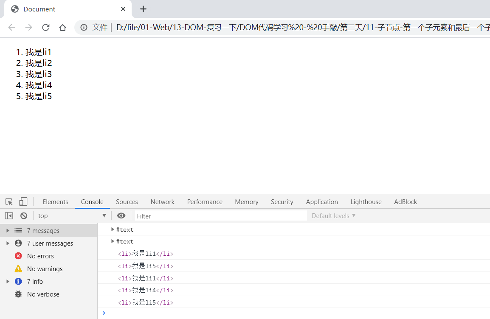

#### 新浪下拉菜单

> 案例分析：
>
> ①导航栏里面的li 都要有鼠标经过效果，所以需要循环注册鼠标事件
>
> ②核心原理： 当鼠标经过li 里面的 第二个孩子 ul 显示， 当鼠标离开，则ul 隐藏

结构如下：

~~~html
<ul class="nav">
      <li>
          <a href="#">微博</a>
           <ul>
               <li>
                   <a href="">私信</a>
               </li>
               <li>
                    <a href="">评论</a>
               </li>
               <li>
                   <a href="">@我</a>
               </li>
           </ul>
      </li>
</ul>
~~~

> 唉，这个样式我独立写现在还写不出来，这个结构我现在也想不到

~~~html
<!DOCTYPE html>
<html lang="en">

<head>
    <meta charset="UTF-8">
    <title>Document</title>
    
</head>

<body>
    <ul class="nav">
        <li>
            <a href="#">微博</a>
            <ul>
                <li>
                    <a href="">私信</a>
                </li>
                <li>
                    <a href="">评论</a>
                </li>
                <li>
                    <a href="">@我</a>
                </li>
            </ul>
        </li>

        <li>
            <a href="#">微博</a>
            <ul>
                <li>
                    <a href="">私信</a>
                </li>
                <li>
                    <a href="">评论</a>
                </li>
                <li>
                    <a href="">@我</a>
                </li>
            </ul>
        </li>
        <li>
            <a href="#">微博</a>
            <ul>
                <li>
                    <a href="">私信</a>
                </li>
                <li>
                    <a href="">评论</a>
                </li>
                <li>
                    <a href="">@我</a>
                </li>
            </ul>
        </li>
        <li>
            <a href="#">微博</a>
            <ul>
                <li>
                    <a href="">私信</a>
                </li>
                <li>
                    <a href="">评论</a>
                </li>
                <li>
                    <a href="">@我</a>
                </li>
            </ul>
        </li>
    </ul>
    
</body>
</html>
~~~

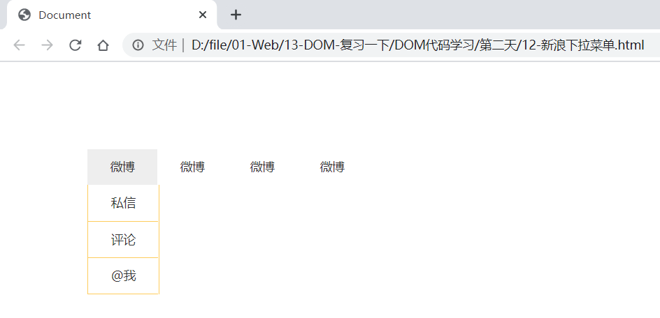

#### 兄弟节点

~~~
node.nextSibling  (不纯洁)
~~~

* nextSibling 返回当前元素的下一个兄弟元素节点，找不到则返回null。同样，也是包含**所有的节点**。

~~~
node.previousSibling  (不纯洁)  
~~~

* previousSibling
  返回当前元素上一个兄弟元素节点，找不到则返回null。同样，也是包含**所有的节点**。

------

上面这2个方法不好，我们实际开发中用下面的2个：

~~~
node.nextElementSibling  
~~~

* nextElementSibling 返回当前元素下一个兄弟元素节点，找不到则返回null。

~~~
node.previousElementSibling    
~~~

* previousElementSibling 返回当前元素上一个兄弟节点，找不到则返回null。

> 注意：这两个方法有兼容性问题， IE9 以上才支持。
>
> 问：如何解决兼容性问题 ？
>
> 答：自己封装一个兼容性的函数 

~~~javascript
 function getNextElementSibling(element) {
    var el = element;
   /*nextSibling是把所有的元素都获取过来，然后赋值给el*/
    while (el = el.nextSibling) {
       /*如果其中有一个节点类型为1，说明这是元素节点，取出来即可*/
       if (el.nodeType === 1) {
           return el;
       }
    }
    return null;
 }  
~~~

> 自己要学会封装兼容性函数。

~~~html
<!DOCTYPE html>
<html lang="en">

<head>
    <meta charset="UTF-8">
    <title>Document</title>
</head>

<body>
    
我是div

    我是span
    
</body>
</html>
~~~

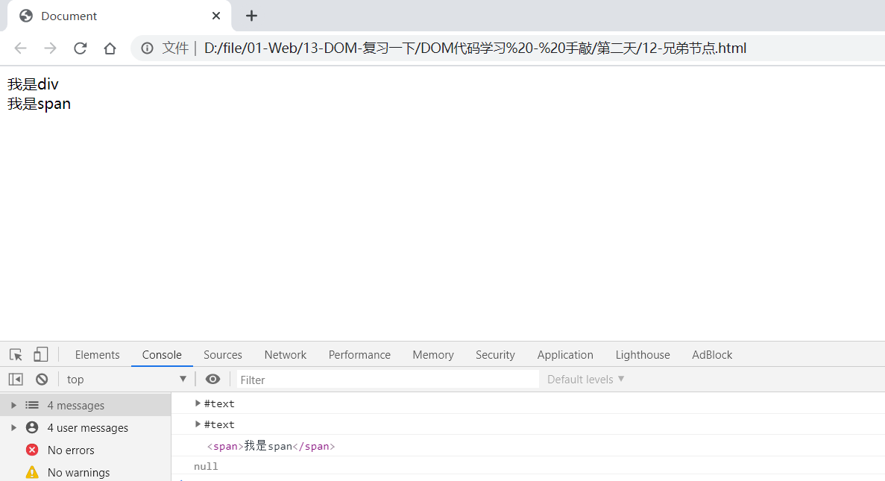

### 创建节点（第一步）

~~~html
document.createElement('tagName')
~~~

document.createElement()
方法创建由 tagName 指定的 HTML 元素。因为这些元素原先不存在，是根据我们的需求动态生成的，所以我们也称为**动态创建元素节点**。

> 你只是创建了节点，你没告诉人家，你把这个节点放到了哪里去啊，所以还有第二步：添加节点。

### 添加节点(第二步)

* `node.appendChild()
  `方法将一个节点添加到指定父节点的子节点列表**末尾**。类似于 CSS 里面的 **after伪元素**。(node是父亲，child是儿子)

~~~
node.appendChild(child)
~~~

* `node.insertBefore()
  `方法将一个节点添加到**父节点的指定子节点前面**。类似于 CSS 里面的 before
  伪元素。

~~~
node.insertBefore(child, 指定元素) 
~~~

~~~html
<!DOCTYPE html>
<html lang="en">

<head>
    <meta charset="UTF-8">
    <title>Document</title>
</head>

<body>
    <ul>
        <li>123</li>
    </ul>
    
</body>
</html>
~~~

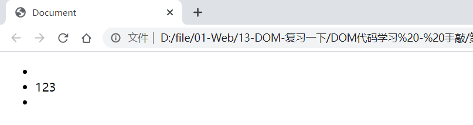

#### 简单版发布留言案例

> 案例分析：
>
> ①核心思路： 点击按钮之后，就动态创建一个li，添加到ul 里面。
>
> ②创建li 的同时，把文本域里面的值通过li.innerHTML 赋值给 li
>
> ③如果想要新的留言后面显示就用 appendChild 如果想要前面显示就用insertBefore

~~~html
<!DOCTYPE html>
<html lang="en">

<head>
    <meta charset="UTF-8">
    <title>Document</title>
    
</head>

<body>
    <textarea name="" id=""></textarea>
    <button>发布</button>
    <ul>

    </ul>
    
</body>
</html>
~~~

### 删除节点

~~~
 node.removeChild(child) 
~~~

node.removeChild() 方法从 DOM 中删除一个子节点，返回删除的节点。

~~~html
<!DOCTYPE html>
<html lang="en">

<head>
    <meta charset="UTF-8">
    <title>Document</title>
</head>

<body>
    <button>删除</button>
    <ul>
        <li>熊大</li>
        <li>熊二</li>
        <li>光头强</li>
    </ul>
    
</body>
</html>
~~~

#### 删除留言案例

> 案例分析：
>
> ①当我们把文本域里面的值赋值给li 的时候，多添加一个删除的链接
>
> ②需要把所有的链接获取过来，当我们点击当前的链接的时候，删除当前链接所在的li
>
> ③阻止链接跳转需要添加 javascript:void(0); 或者 javascript:;

~~~html
<!DOCTYPE html>
<html lang="en">

<head>
    <meta charset="UTF-8">
    <title>Document</title>
    
</head>

<body>
    <textarea name="" id=""></textarea>
    <button>发布</button>
    <ul>

    </ul>
    
</body>

</html>
~~~

### 复制节点(克隆节点)

~~~
 node.cloneNode() 
~~~

node.cloneNode() 方法返回调用该方法的**节点**的一个**副本**。 也称为**克隆节点/拷贝节点**

> **注意**：
>
> 1. 如果括号**参数为空或者为 false** ，则是**浅拷贝**，即**只克隆复制节点本身，不克隆里面的子节点**。
>
> 2. 如果括号参数为 true ，则是**深度拷贝**，会**复制节点本身以及里面所有的子节点**。

~~~html
<!DOCTYPE html>
<html lang="en">

<head>
    <meta charset="UTF-8">
    <title>Document</title>
</head>

<body>
    <ul>
        <li>1111</li>
        <li>2</li>
        <li>3</li>
    </ul>
    
</body>
</html>
~~~

### 动态生成表格

> 案例分析：
>
> ①因为里面的学生数据都是动态的，我们需要js 动态生成。 这里我们模拟数据，自己定义好数据。 数据我们采取对象形式存储。
>
> ②所有的数据都是放到tbody里面的行里面。
>
> ③因为行很多，我们需要循环创建多个行（对应多少人）
>
> ④每个行里面又有很多单元格（对应里面的数据），我们还继续使用循环创建多个单元格，并且把数据存入里面（双重for循环）
>
> ⑤最后一列单元格是删除，需要单独创建单元格。
>
> ⑥最后添加删除操作，单击删除，可以删除当前行。

~~~html
<!DOCTYPE html>
<html lang="en">

<head>
    <meta charset="UTF-8">
    <title>Document</title>
    
</head>

<body>
    <table cellspacing="0">
        <thead>
            <tr>
                <th>姓名</th>
                <th>科目</th>
                <th>成绩</th>
                <th>操作</th>
            </tr>
        </thead>
        
        <tbody>
       
        </tbody>
    </table>
    
</body>
</html>
~~~

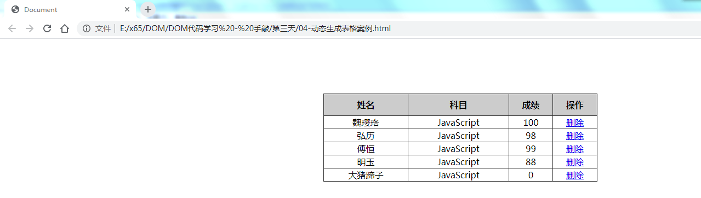

> for...in 语句是一种精准的**迭代语句**，用于**遍历数组或者对象的属性**（对数组或者对象的属性进行循环操作）。

### 三种动态创建元素区别

* document.write()				---比较冷门

* element.innerHTML

* document.createElement()

#### 区别

1. document.write 是直接将内容写入页面的内容流，但是**文档流执行完毕，则它会导致页面全部重绘**

2. innerHTML 是将内容写入某个 DOM 节点，不会导致页面全部重绘

3. innerHTML 创建多个元素效率更高（**前提**：**不要拼接字符串，采取数组形式拼接**），结构稍微复杂

4. createElement() 创建多个元素**效率稍低一点点**，但是**结构更清晰**

#### 总结

不同浏览器下，innerHTML 效率要比 creatElement 高

~~~html
<!DOCTYPE html>
<html lang="en">

<head>
    <meta charset="UTF-8">
    <title>Document</title>
</head>

<body>
    <button>点击</button>
    
abc

    

    

    
</body>
</html>
~~~

### innerHTML拼接效率测试(慢)

~~~html
<!DOCTYPE html>
<html lang="en">

<head>
    <meta charset="UTF-8">
    <title>效率测试</title>
</head>

<body>
</body>

</html>
~~~

### innerHTML数组效率测试(快)

~~~html
<!DOCTYPE html>
<html lang="en">

<head>
    <meta charset="UTF-8">
    <title>效率测试</title>

</head>

<body>

</body>

</html>
~~~

#### JavaScript中join() 方法

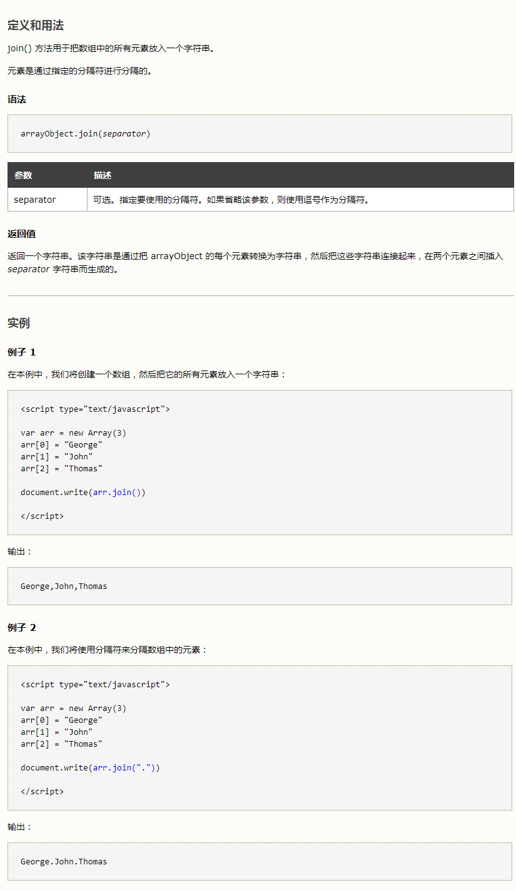

### createElement效率测试

~~~html
<!DOCTYPE html>
<html lang="en">

<head>
    <meta charset="UTF-8">
    <title>效率测试</title>

</head>

<body>

</body>

</html>
~~~

# DOM 重点核心(复习)

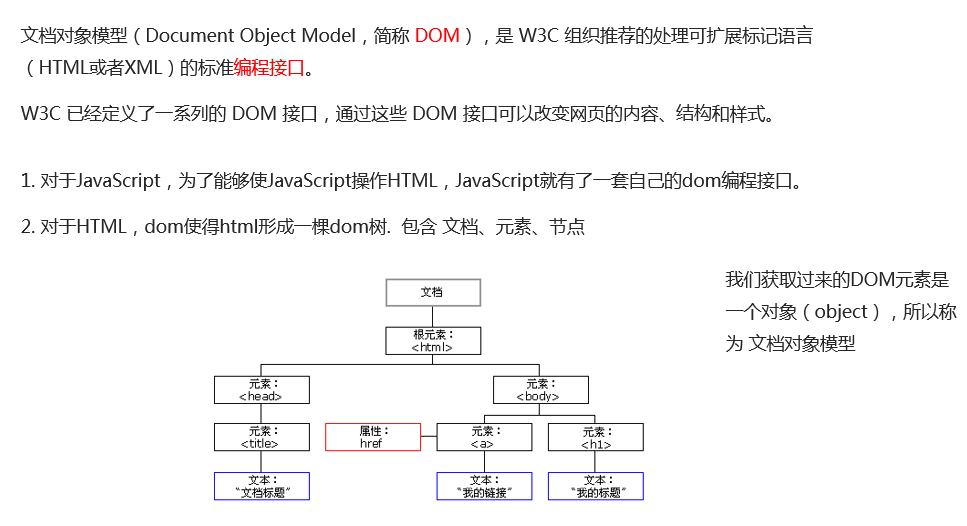

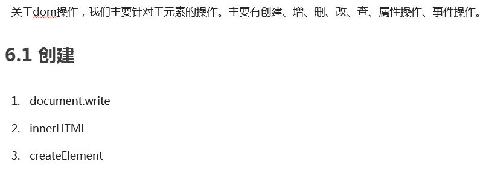

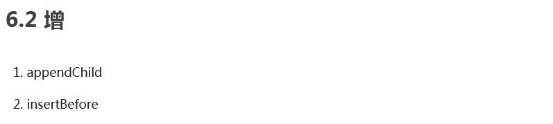

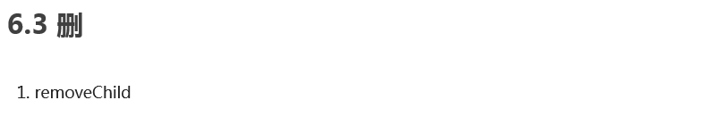

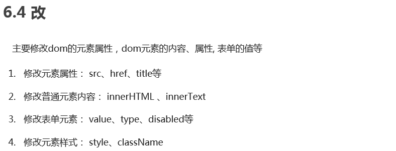

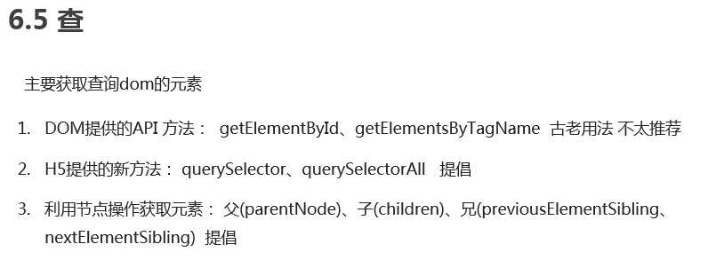

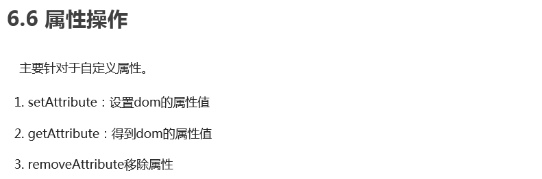

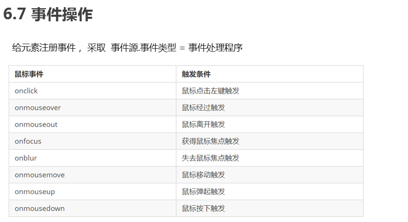

# 事件高级

## 目标

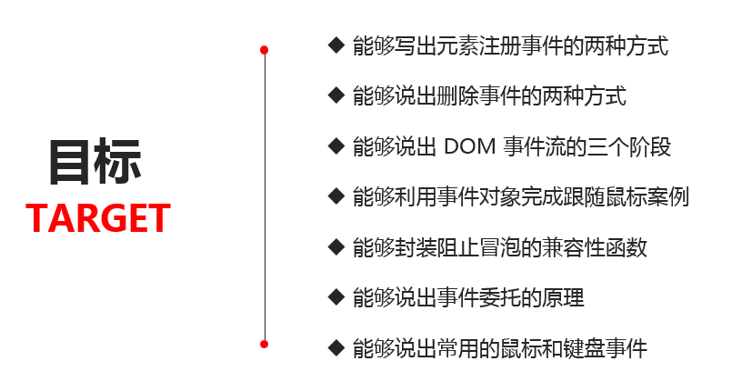

## 目录

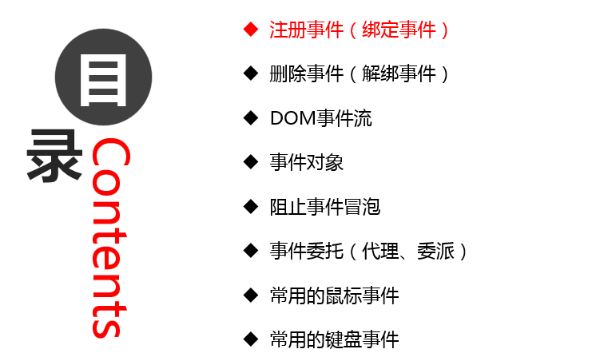

## 注册事件（绑定事件）--2种方式

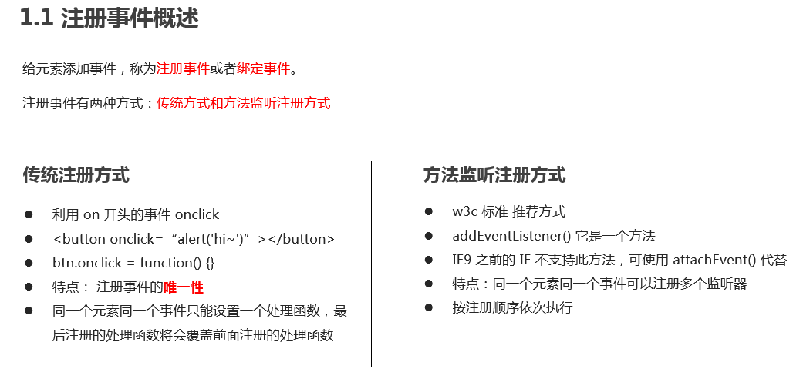

### 传统方式

> 前面都有一个on开头

### addEventListener 事件监听方式 

~~~
 eventTarget.addEventListener(type, listener[, useCapture])  
~~~

`eventTarget.addEventListener()`方法将指定的**监听器**注册到 eventTarget（目标对象）上，当该对象触发指定的事件时，就会执行事件处理函数。

该方法接收三个参数：

> **type**：事件类型字符串，比如`click` 、`mouseover` ，注意**这里不要带 on**
>
> (传统注册方式都带on,而新的方法监听注册方式都不带on)
>
> **listener**：事件处理函数，事件发生时，会调用该监听函数
>
> **useCapture**：可选参数，是一个布尔值，默认是 false。学完 DOM 事件流后，我们再进一步学习

### **attachEvent 事件监听方式(备胎,几乎用不到)**

~~~
eventTarget.attachEvent(eventNameWithOn, callback) 
~~~
eventTarget.attachEvent()方法将指定的监听器注册到 eventTarget（目标对象） 上，当该对象触发指定的事件时，指定的回调函数就会被执行。

该方法接收两个参数：

> **eventNameWithOn**：事件类型字符串，比如 `onclick` 、`onmouseover` ，**这里要带 on**
>
> **callback**： 事件处理函数，当目标触发事件时回调函数被调用

> 警告：该特性是非标准的，请尽量不要在生产环境中使用它。

### 注册事件兼容性解决方案

~~~javascript
 function addEventListener(element, eventName, fn) {
      // 判断当前浏览器是否支持 addEventListener 方法
      // 首先看它支不支持addEventListener
      if (element.addEventListener) {
        element.addEventListener(eventName, fn);  // 第三个参数 默认是false
      // 再看它支不支持attachEvent
      } else if (element.attachEvent) {
        element.attachEvent('on' + eventName, fn);
      } else {
        //实在不行就只好用传统事件注册方式了
        // 相当于 element.onclick = fn;
        element['on' + eventName] = fn;
 } 
~~~

> 兼容性处理的原则： 首先照顾大多数浏览器，再处理特殊浏览器
>
> 首先用`addEventListener`，其次用传统方式(万能)，`attachEvent`几乎用不到

~~~html
<!DOCTYPE html>
<html lang="en">
<head>
    <meta charset="UTF-8">
    <title>Document</title>
</head>

<body>
    <button>传统注册事件</button>
    <button>方法监听注册事件</button>
    <button>ie9 attachEvent</button>
    
</body>
</html>
~~~

## 删除事件(解绑事件)

### 删除事件的方式

#### 传统注册方式

~~~
eventTarget.onclick = null;
~~~

#### 方法监听注册方式

~~~
① eventTarget.removeEventListener(type, listener[, useCapture]);
② eventTarget.detachEvent(eventNameWithOn, callback);
~~~

~~~html
<!DOCTYPE html>
<html lang="en">

<head>
    <meta charset="UTF-8">
    <title>Document</title>
    
</head>

<body>
    
1

    
2

    
3

    
</body>
</html>
~~~

#### 删除事件兼容性解决方案

~~~javascript
 function removeEventListener(element, eventName, fn) {
      // 判断当前浏览器是否支持 removeEventListener 方法
      if (element.removeEventListener) {
        element.removeEventListener(eventName, fn);  // 第三个参数 默认是false
      } else if (element.detachEvent) {
        element.detachEvent('on' + eventName, fn);
      } else {
        element['on' + eventName] = null;
 } 
~~~

## DOM事件流

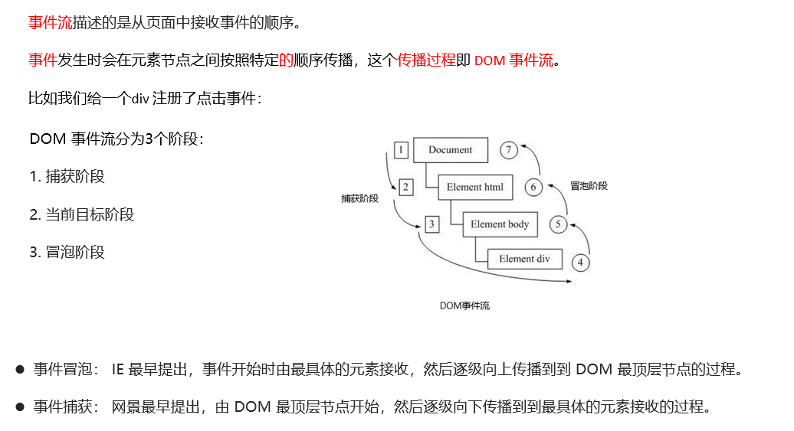

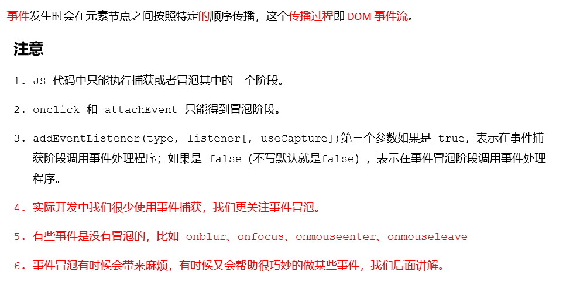

~~~html
<!DOCTYPE html>
<html lang="en">

<head>
    <meta charset="UTF-8">
    <title>Document</title>
    
</head>

<body>
    

        
son盒子

    

    
</body>
</html>
~~~

## 事件对象(里面有很多属性和方法)

### 什么是事件对象

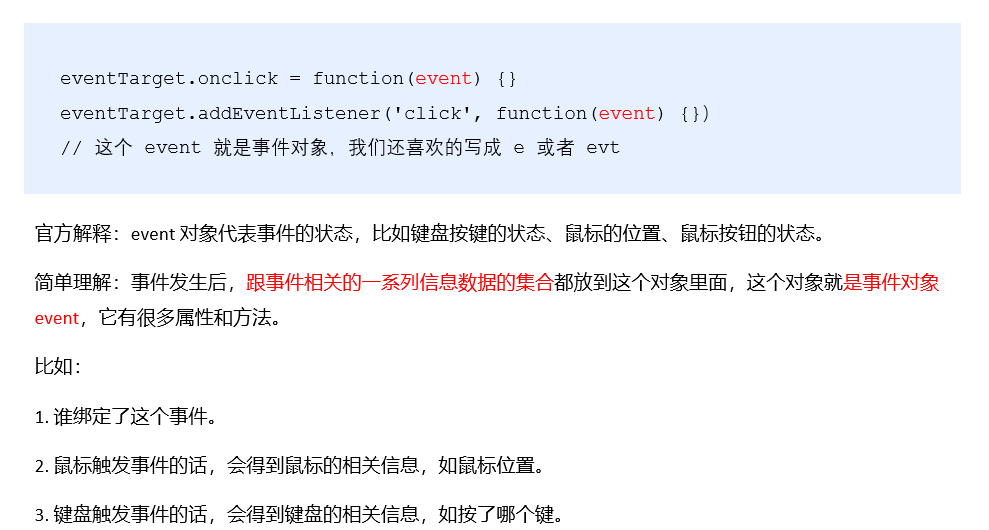

> 事件对象必定和事件相关，如果没有事件，那它就不会存在事件对象

### 事件对象的使用语法

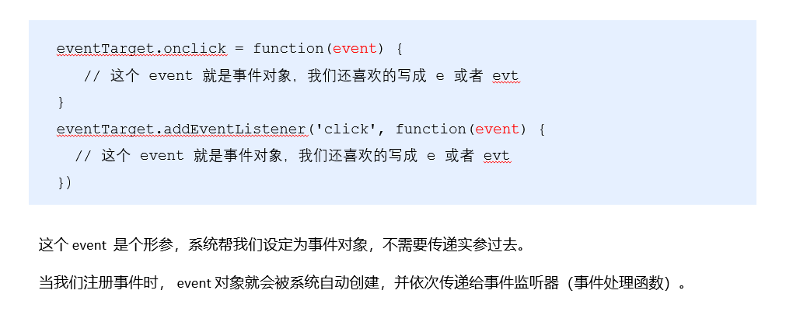

### 事件对象的兼容性方案

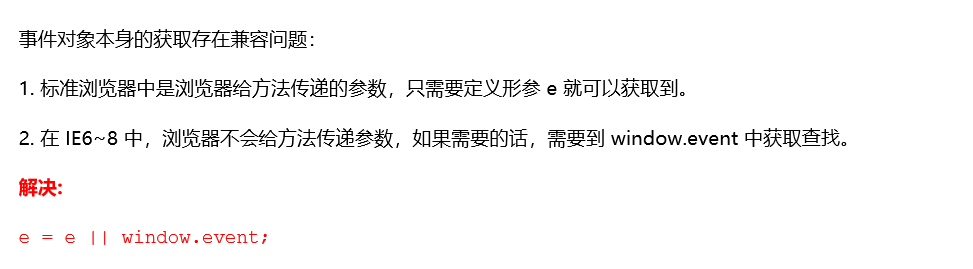

~~~html
<!DOCTYPE html>
<html lang="en">

<head>
    <meta charset="UTF-8">
    <title>Document</title>
    
</head>

<body>
    
123

    
</body>
</html>
~~~

### 事件对象的常见属性和方法

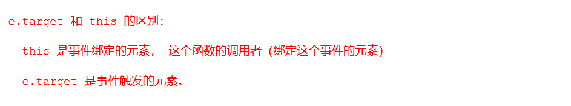

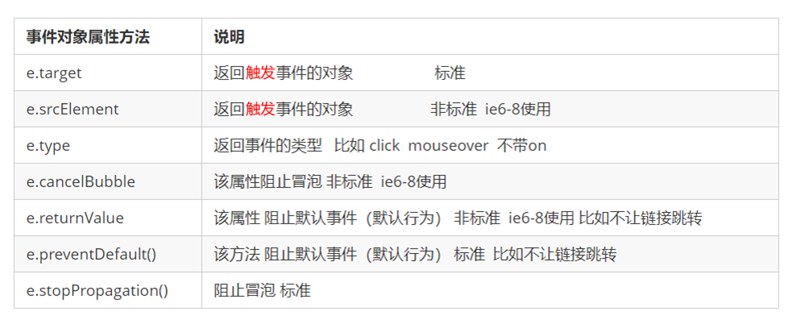

~~~html
<!DOCTYPE html>
<html lang="en">

<head>
    <meta charset="UTF-8">
    <title>Document</title>
    
</head>

<body>
    
123

    <ul>
        <li>abc</li>
        <li>abc</li>
        <li>abc</li>
    </ul>
    
</body>
</html>
~~~

### 事件对象阻止默认行为

~~~html
<!DOCTYPE html>
<html lang="en">

<head>
    <meta charset="UTF-8">
    <title>Document</title>
    
</head>

<body>
    
123

    <a href="http://www.baidu.com">百度</a>
    <form action="http://www.baidu.com">
        <input type="submit" value="提交" name="sub">
    </form>
    
</body>
</html>
~~~

## 阻止事件冒泡

### 阻止事件冒泡的两种方式

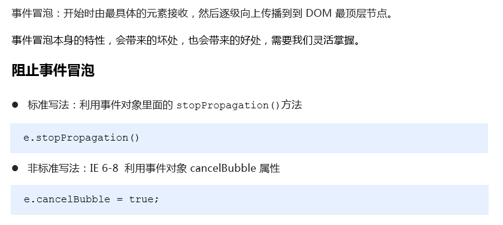

### 阻止事件冒泡的兼容性解决方案 

~~~html
//如果你有事件对象，并且事件对象认识stopPropagation  
if(e && e.stopPropagation){
      e.stopPropagation();
  }else{
      window.event.cancelBubble = true;
  }
~~~

~~~html
<!DOCTYPE html>
<html lang="en">

<head>
    <meta charset="UTF-8">
    <title>Document</title>
    
</head>

<body>
    

        
son儿子

    

    
</body>
</html>
~~~

## 事件委托（代理、委派）

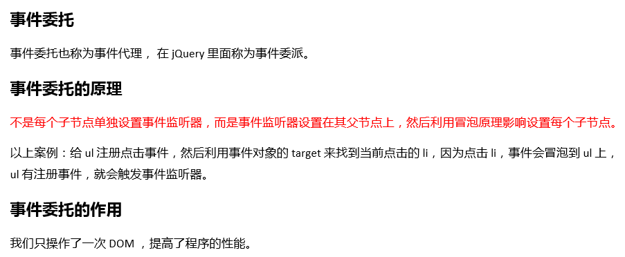

~~~html
<!DOCTYPE html>
<html lang="en">

<head>
    <meta charset="UTF-8">
    <title>Document</title>
</head>

<body>
    <ul>
        <li>知否知否，点我应有弹框在手！</li>
        <li>知否知否，点我应有弹框在手！</li>
        <li>知否知否，点我应有弹框在手！</li>
        <li>知否知否，点我应有弹框在手！</li>
        <li>知否知否，点我应有弹框在手！</li>
    </ul>
    
</body>
</html>
~~~

## 常用鼠标事件

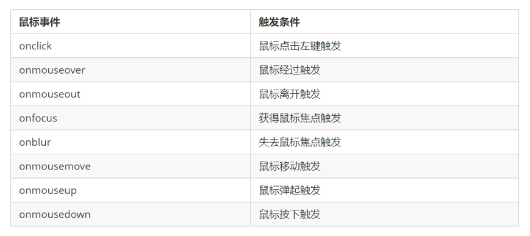

> 1.给整个文档都添加了`contextmenu`这个事件
>
> 2.`preventDefault()`方法表示事件对象阻止默认行为，让右键菜单阻止了，不要让它弹出来了

### 禁止右键及选中

~~~html
<!DOCTYPE html>
<html lang="en">

<head>
    <meta charset="UTF-8">
    <title>Document</title>
</head>

<body>
    我是一段不愿意分享的文字
    
</body>
</html>
~~~

### 鼠标事件对象

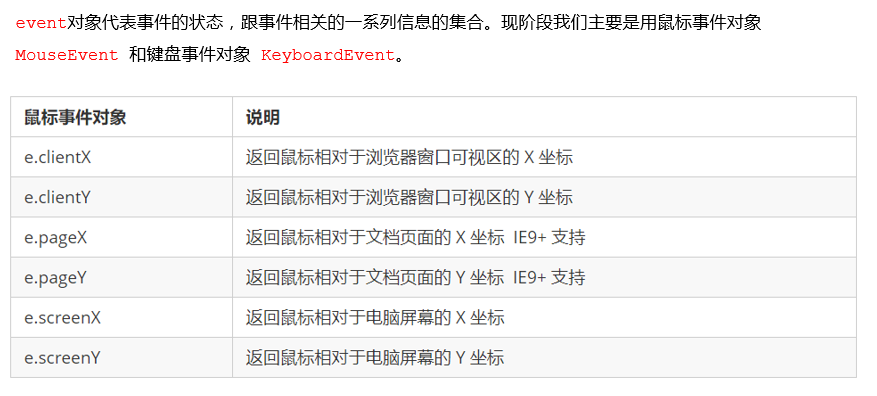

~~~html
<!DOCTYPE html>
<html lang="en">

<head>
    <meta charset="UTF-8">
    <title>Document</title>
    
</head>

<body>
    
</body>

</html>
~~~

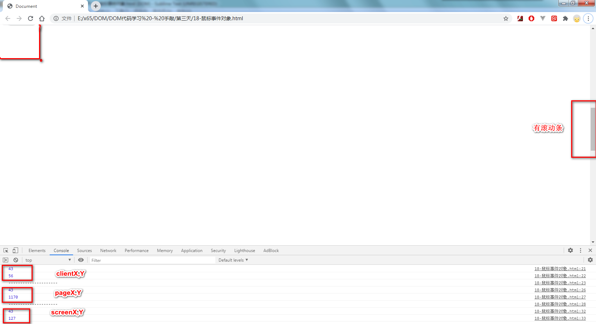

### 跟随鼠标的天使

这个天使图片一直跟随鼠标移动。

> 案例分析：
>
> ①鼠标不断的移动，使用鼠标移动事件： mousemove
>
> ②在页面中移动，给document注册事件
>
> ③图片要移动距离，而且不占位置，我们使用绝对定位即可
>
> ④核心原理： 每次鼠标移动，我们都会获得最新的鼠标坐标， 把这个x和y坐标做为图片的top和left 值就可以移动图片

~~~html
<!DOCTYPE html>
<html lang="en">
<head>
    <meta charset="UTF-8">
    <title>Document</title>
    
</head>

<body>
    
    
</body>
</html>
~~~

实际应用是这个：淘宝商品放大观看

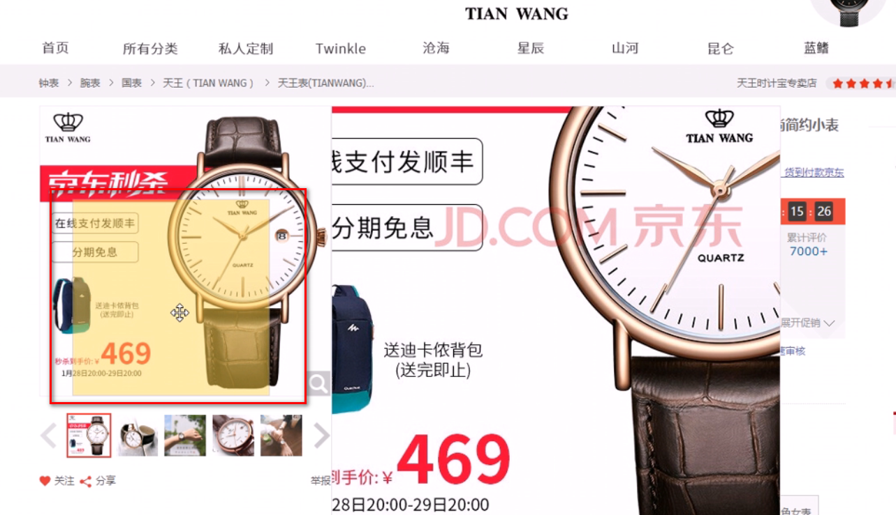

## 常用键盘事件

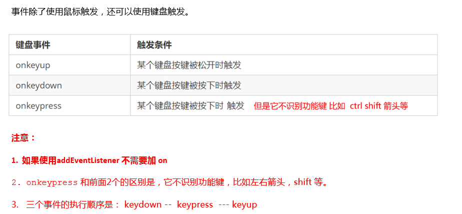

~~~html
<!DOCTYPE html>
<html lang="en">

<head>
    <meta charset="UTF-8">
    <title>Document</title>
</head>

<body>
    
</body>
</html>
~~~

### 键盘事件对象

> 只要有事件，就会有事件对象

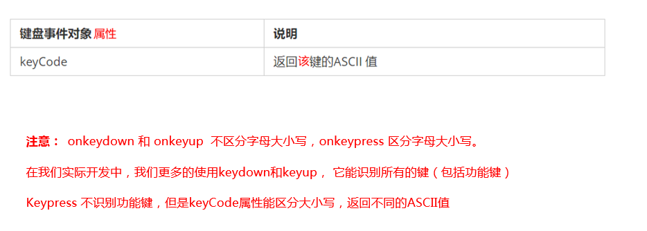

~~~html
<!DOCTYPE html>
<html lang="en">

<head>
    <meta charset="UTF-8">
    <title>Document</title>
</head>

<body>
    
</body>
</html>
~~~

### 模拟京东按键输入内容

当我们按下 s 键， 光标就定位到搜索框。(京东网页就是这样的)

> 案例分析：
>
> ①核心思路： 检测用户是否按下了s 键，如果按下s 键，就把光标定位到搜索框里面
>
> ②使用键盘事件对象里面的keyCode 判断用户按下的是否是s键
>
> ③搜索框获得焦点： 使用 js 里面的 focus() 方法

~~~html
<!DOCTYPE html>
<html lang="en">

<head>
    <meta charset="UTF-8">
    <title>Document</title>
</head>

<body>
    <input type="text">
    
</body>
</html>
~~~

### 模拟京东快递单号查询

> 案例分析：
>
> ①快递单号输入内容时， 上面的大号字体盒子（con）显示(里面的字号更大)
>
> ②同时把快递单号里面的值（value）获取过来赋值给 con盒子（innerText）做为内容
>
> ③如果快递单号里面内容为空，则隐藏大号字体盒子(con)盒子
>
> ④注意： keydown 和 keypress 在文本框里面的特点： 他们两个事件触发的时候，**文字还没有落入文本框中！！！！！**。
>
> ⑤keyup事件触发的时候， 文字已经落入文本框里面了
>
> ⑥当我们失去焦点，就隐藏这个con盒子
>
> ⑦当我们获得焦点，并且文本框内容不为空，就显示这个con盒子

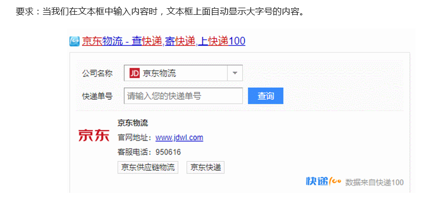

~~~html
<!DOCTYPE html>
<html lang="en">
<head>
    <meta charset="UTF-8">
    <title>Document</title>
    
</head>

<body>
  /*一个大盒子里面有上下2个小盒子，上面盒子是div,下面盒子是input*/
    

        
123

        <input type="text" placeholder="请输入您的快递单号" class="jd">
    

    
</body>
~~~

#### 伪元素::before简单介绍

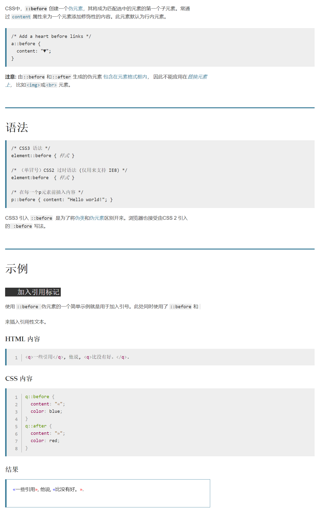

# BOM 浏览器对象模型

## 目标

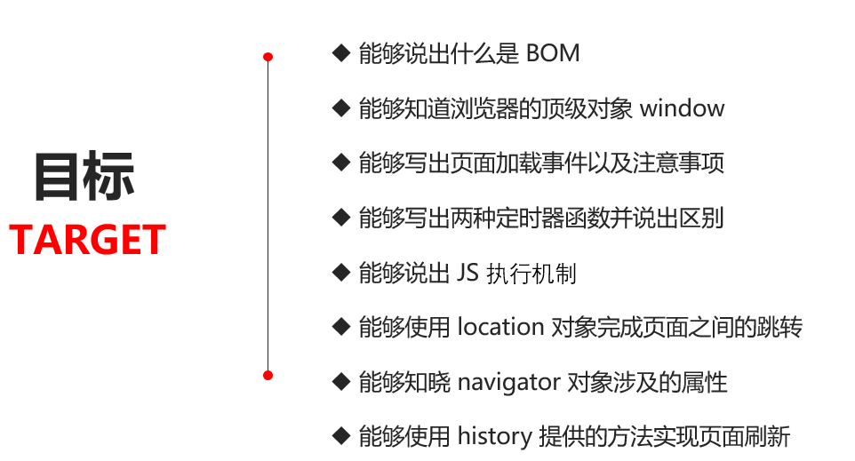

## 目录

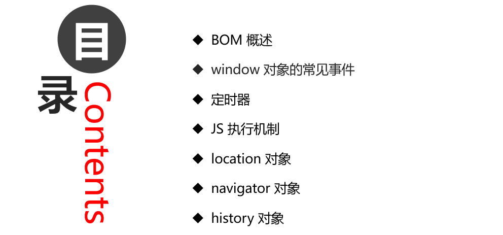

## BOM概述

### 什么是BOM

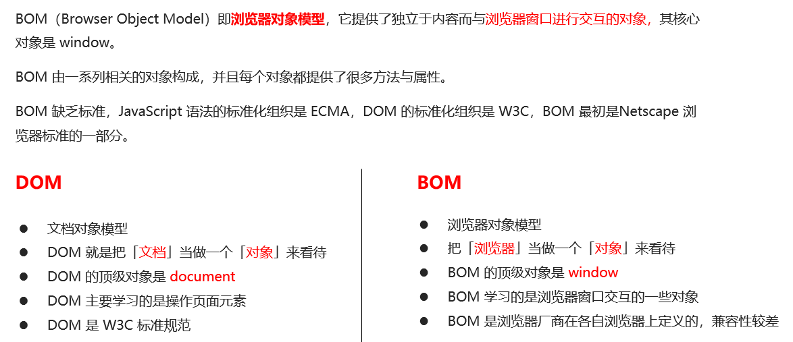

### BOM的构成

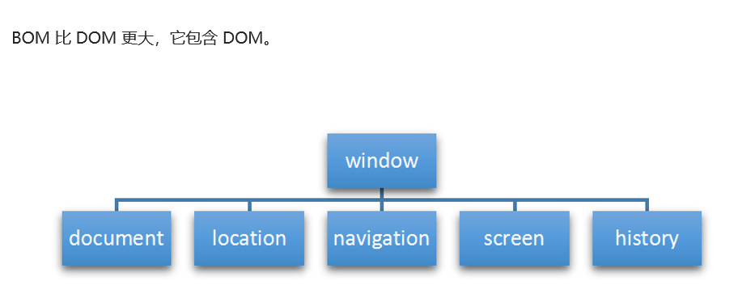

> 因为DOM的顶级对象是document,BOM的顶级对象是window,而BOM又包含DOM,所以document是包含在window里的。

~~~html
<!DOCTYPE html>
<html lang="en">

<head>
    <meta charset="UTF-8">
    <title>Document</title>
</head>

<body>
    
</body>
</html>
~~~

## window对象的常见事件

### 窗口加载事件

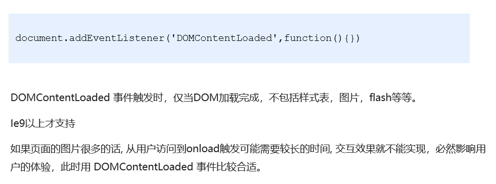

> `window.onload()` 通常用于 `< body> `元素，在页面完全载入后(包括**图片**、CSS文件等等)执行脚本代码。(如果网站图片很多的话就会很卡)

> JS的入口函数执行要比jQuery的入口函数执行得晚一些。
>
> jQuery的入口函数会等待**页面的加载完成**才执行，但是**不会等待图片的加载**。 
>
> JS的入口函数会等待页面加载完成，并且等待图片加载完成才开始执行。

~~~html
<!DOCTYPE html>
<html lang="en">
<head>
    <meta charset="UTF-8">
    <title>Document</title>
    
</head>

<body>
    <button>点击</button>
    <!-- 代码是从上往下执行的，你必须要有button这个DOM元素，后面才能写JS，调用JS-->
    <!-- 如果script标签里的JS代码要放在上面，以前的做法是不行的 -->
    <!-- 如果非得要把script放在其他的地方,就用window.onload窗口加载事件-->
     <!--  -->
</body>
</html>
~~~

> 有了window.onload，你就可以把script里的JS代码放到页面中的任何一个地方，甚至放在< head>的上方，或者是外部的JS文件中，都是没问题的。
>
> 但是这种传统的注册方式(`window.onload`)你只能写一次，如果写了多个`window.onload`,会以最后一个`window.onload`为准)

### 调整窗口大小事件

> 当浏览器窗口大小发生变化就会触发的事件。

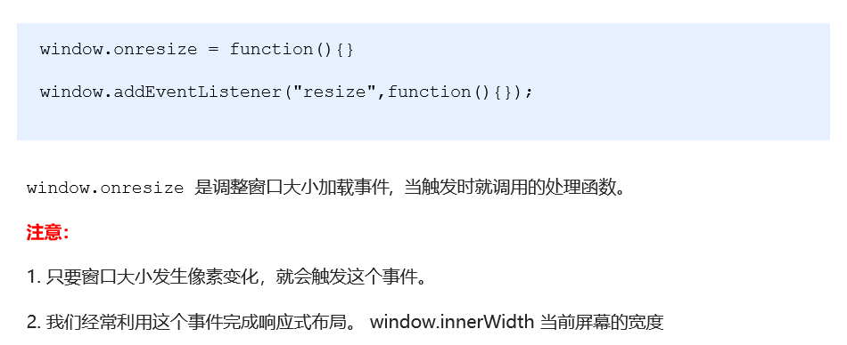

~~~html
<!DOCTYPE html>
<html lang="en">

<head>
    <meta charset="UTF-8">
    <title>Document</title>
    
</head>

<body>
    
    

</body>
</html>
~~~

## 定时器

### 两种定时器

window 对象给我们提供了 2 个非常好用的方法-定时器。

* `setTimeout() `

* `setInterval() `

### setTimeout() 定时器(一次性炸弹)

~~~
 window.setTimeout(调用函数, [延迟的毫秒数]);   ---后面的分号别忘了啊！！！
~~~

`setTimeout() `方法用于设置一个定时器，**该定时器在定时器到期后执行调用函数**。(类似定时炸弹，执行一次后就爆炸了，不再执行了)

**注意：**

1. window 可以省略。(直接写setTimeout就可以了)

2. 这个调用函数可以**直接写函数**，或者**写函数名**或者**采取字符串‘函数名()'**三种形式。第三种不推荐

3. 延迟的毫秒数省略默认是 0，如果写，必须是**毫秒**。

4. 因为定时器可能有很多，所以我们经常给定时器赋值一个**标识符**。(起不同的名字用来区分)

~~~html
<!DOCTYPE html>
<html lang="en">

<head>
    <meta charset="UTF-8">
    <title>Document</title>
</head>

<body>
    
</body>

</html>
~~~

#### 回调函数及5秒后自动关闭的广告

> 案例分析：
>
> ①核心思路：5秒之后，就把这个广告隐藏起来
>
> ②用定时器setTimeout 

setTimeout() 这个调用函数我们也称为**回调函数 callback**

**普通函数**是按照代码顺序直接调用。

而这个函数(指回调函数)，**需要等待**时间，**时间到了才去调用这个函数**，因此称为回调函数。

简单理解： 回调，就是回头调用的意思。**上一件事干完，(时间到了)再回头再调用这个函数**。

以前我们讲的  element.onclick = function(){} 或者 element.addEventListener(“click”, fn);  里面的函数也是回调函数

> 点击完(onclick)后才调用这个函数

~~~html
<!DOCTYPE html>
<html lang="en">

<head>
    <meta charset="UTF-8">
    <title>Document</title>
</head>

<body>
    
    
</body>
</html>
~~~

### 停止 `setTimeout() `定时器(被停止的那个定时器要有名字！！！)

> `setTimeout() `是个一次性炸弹

~~~html
 window.clearTimeout(timeoutID)   ------括号里面指的是定时器的标识符(名字)
~~~

clearTimeout()方法取消了先前通过调用 setTimeout() 建立的定时器。

**注意：**

1. window 可以省略。

2. 里面的参数就是定时器的标识符 。(这个必须要给定时器起个名字了，此时定时器就不能用匿名函数了)

~~~html
<!DOCTYPE html>
<html lang="en">

<head>
    <meta charset="UTF-8">
    <title>Document</title>
</head>

<body>
    <button>点击停止定时器</button>

    
</body>
</html>
~~~

### setInterval() 定时器(无限循环炸弹)

~~~
window.setInterval(回调函数, [间隔的毫秒数]);
~~~

setInterval() 方法重复调用一个函数，每隔这个时间，就去调用一次回调函数。

**注意：**(和setsetTimeout() 定时器的注意事项都是一样的)

1. window 可以省略。(直接写setTimeout就可以了)

2. 这个调用函数可以**直接写函数**，或者**写函数名**或者**采取字符串‘函数名()'**三种形式。第三种不推荐

3. 延迟的毫秒数省略默认是 0，如果写，必须是**毫秒**。

4. 因为定时器可能有很多，所以我们经常给定时器赋值一个**标识符**。(起不同的名字用来区分)

5. 第一次执行也是间隔毫秒数之后执行，之后**每隔毫秒数就执行一次**。

~~~html
<!DOCTYPE html>
<html lang="en">
<head>
    <meta charset="UTF-8">
    <title>Document</title>
</head>

<body>
    
</body>
</html>
~~~

#### 定时器

> 案例分析：
>
> ①这个倒计时是不断变化的，因此需要定时器来自动变化（setInterval）
>
> ②三个黑色盒子里面分别存放时分秒
>
> ③三个黑色盒子利用innerHTML 放入计算的小时分钟秒数
>
> ④第一次执行也是间隔毫秒数，因此刚刷新页面会有空白
>
> ⑤最好采取封装函数的方式， 这样可以先调用一次这个函数，防止刚开始刷新页面有空白问题

~~~html
<!DOCTYPE html>
<html lang="en">
<head>
    <meta charset="UTF-8">
    <title>Document</title>
    
</head>

<body>
    

        1
        2
        3
    

    
</body>
</html
~~~

> 这个定时器函数有点问题，不能正常显示。

### 清除 setInterval() 定时器

~~~
 window.clearInterval(intervalID);
~~~

clearInterval()方法取消了先前通过调用 setInterval()建立的定时器。

**注意：**

1. window 可以省略。

2. 里面的参数就是定时器的标识符 。

~~~html
<!DOCTYPE html>
<html lang="en">
<head>
    <meta charset="UTF-8">
    <title>Document</title>
</head>
<body>
     <button class="begin">开启定时器</button>
    <button class="stop">停止定时器</button>
    
</html>

~~~

#### 发送短信案例

点击按钮后，该按钮60秒之内不能再次点击，防止重复发送短信。

> 案例分析：
>
> ①按钮点击之后，会禁用 disabled 为true 
>
> ②同时按钮里面的内容会变化， 注意 button 里面的内容通过 innerHTML修改
>
> ③里面秒数是有变化的，因此需要用到定时器
>
> ④定义一个变量，在定时器里面，不断递减
>
> ⑤如果变量为0 说明到了时间，我们需要停止定时器，并且复原按钮初始状态。

 ~~~html
<!DOCTYPE html>
<html lang="en">
<head>
    <meta charset="UTF-8">
    <title>Document</title>
</head>

<body>
    手机号码： <input type="number"> <button>发送</button>
    
</body>
</html>
 ~~~

### this的指向问题

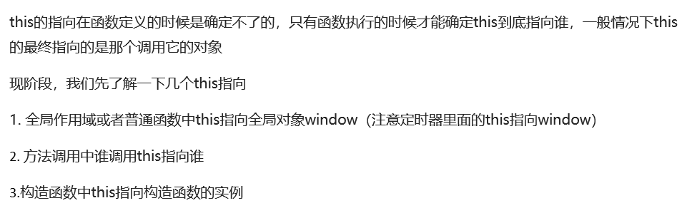

~~~html
<!DOCTYPE html>
<html lang="en">

<head>
    <meta charset="UTF-8">
    <title>Document</title>
</head>

<body>
    <button>点击</button>
    
</body>
</html>
~~~

## JS执行机制

### JS是单线程

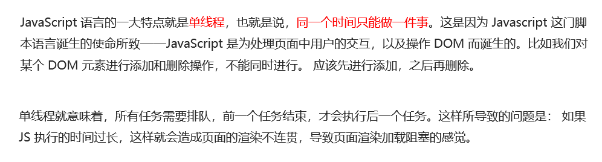

~~~html
<!DOCTYPE html>
<html lang="en">

<head>
    <meta charset="UTF-8">
    <title>Document</title>
</head>

<body>
    
</body>
</html>
~~~

### 同步和异步

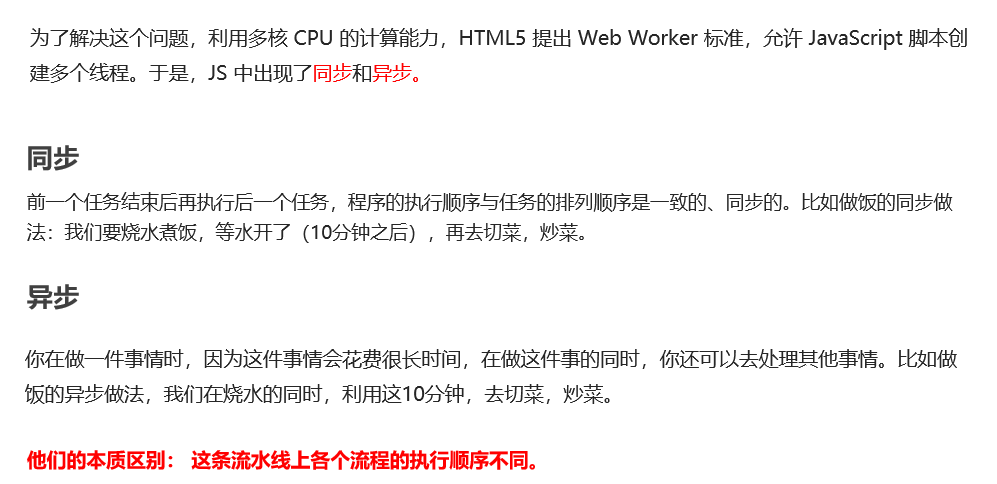

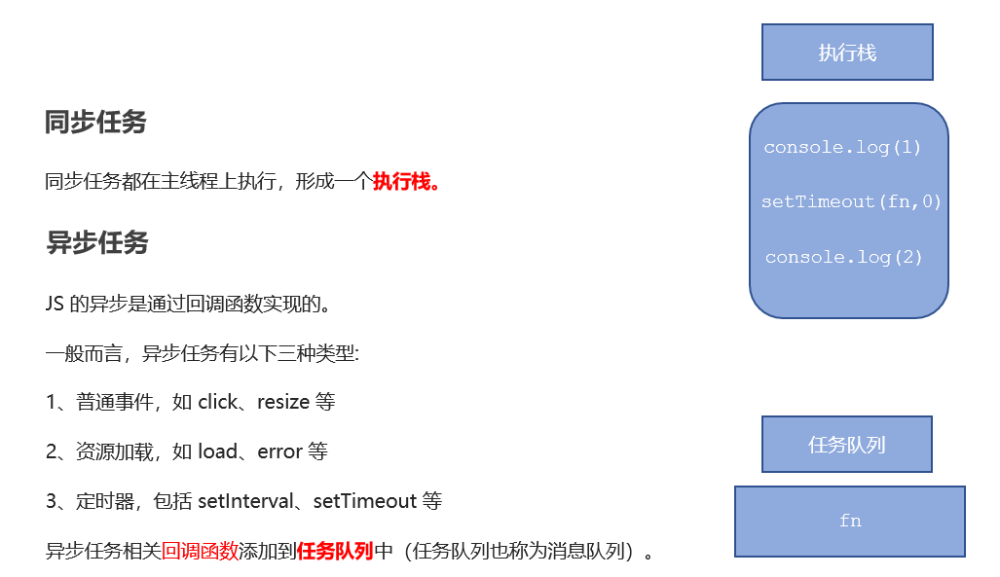

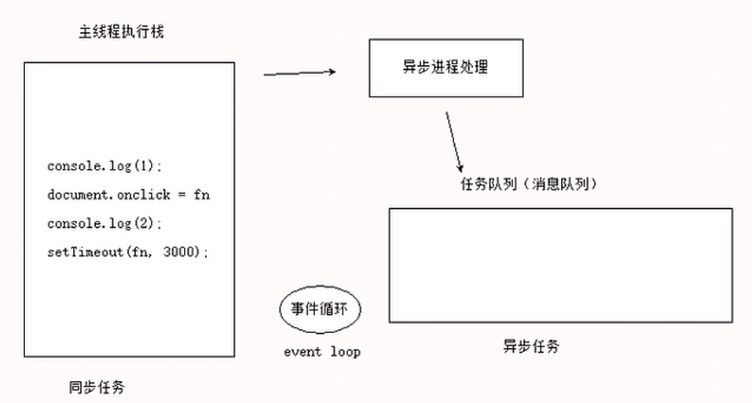

> 如果没有点击鼠标(没有触发onclick事件，则会显示1 2 3[3是等3秒后才会显示])
>
> 如果点击了鼠标(3秒内)，则会显示1 2 click 3;
>
> 如果点击了鼠标(3秒后)，则会显示1 2 3 click ;

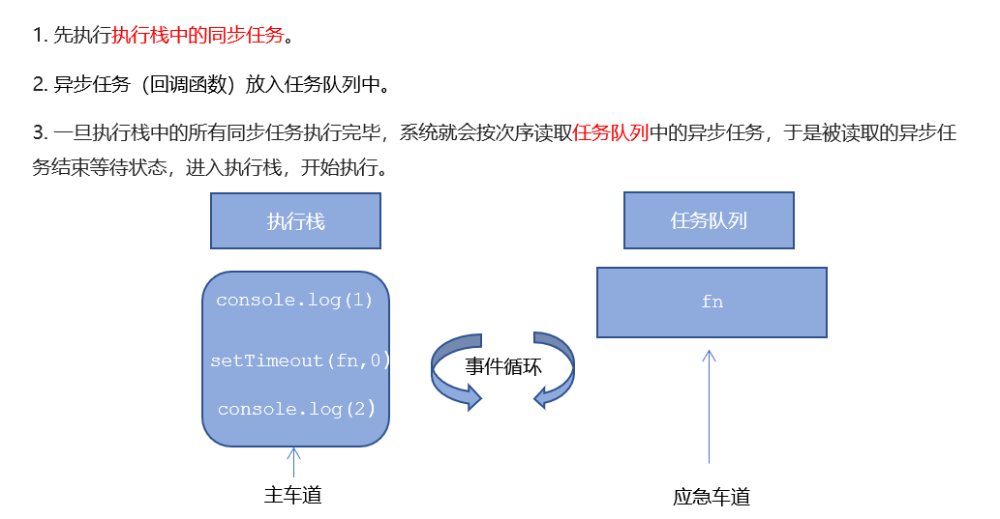

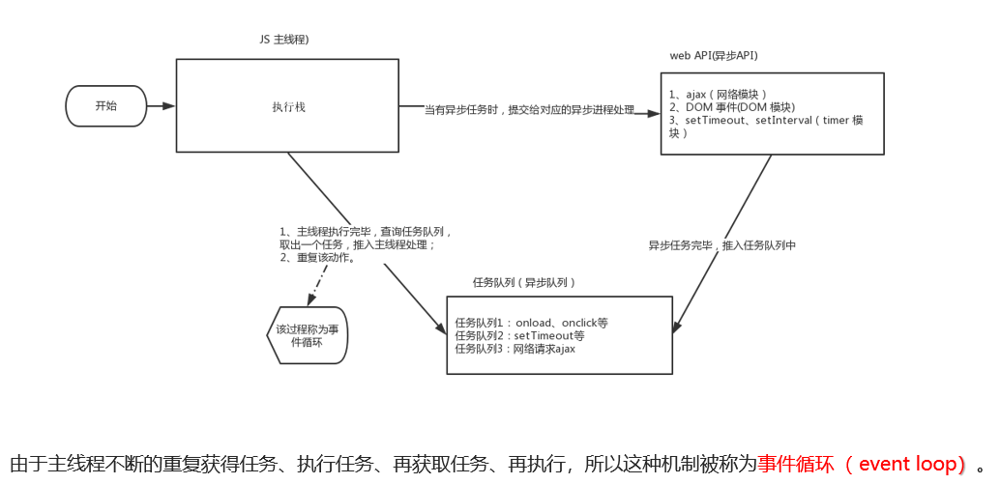

## location对象

### 什么是location对象

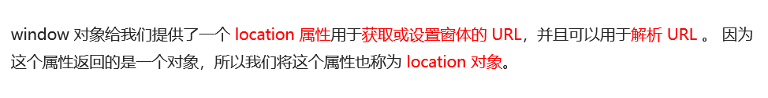

> location既是属性也是对象

### URL

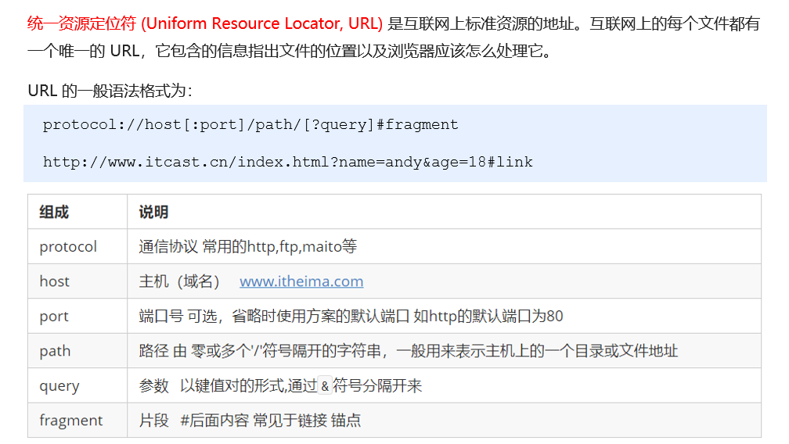

### location对象的属性

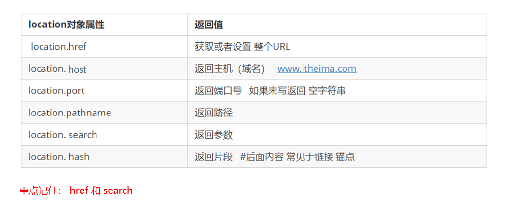

#### 5秒钟之后跳转页面

> 案例分析：
>
> ①利用定时器做倒计时效果
>
> ②时间到了，就跳转页面。 使用 location.href

~~~html
<!DOCTYPE html>
<html lang="en">

<head>
    <meta charset="UTF-8">
    <title>Document</title>
</head>

<body>
    <button>点击</button>
    

    
</body>
</html>
~~~

#### 获取URL参数数据

> 一个文件夹里有2个文件，上面这段代码是login.html里的，下面这段代码是index.html里的。
>
> 主要练习数据在不同页面中的传递。

> 案例分析：
>
> ①第一个登录页面，里面有提交表单， action 提交到 index.html页面
>
> ②第二个页面，可以使用第一个页面的参数，这样实现了一个数据不同页面之间的传递效果
>
> ③第二个页面之所以可以使用第一个页面的数据，是利用了URL 里面的 location.search参数
>
> ④在第二个页面中，需要把这个参数提取。
>
> ⑤第一步去掉？  利用 substr 
>
> ⑥第二步 利用=号分割 键 和 值     split(‘=‘)
>
> ⑦第一个数组就是键   第二个数组就是值

~~~html
<!DOCTYPE html>
<html lang="en">
<head>
    <meta charset="UTF-8">
    <title>Document</title>
</head>

<body>
    <!--表单要放到表单域里才能提交-->
    <!--如果不定义表单域，表单中的数据就无法传送到后台服务器-->
  	<!--action="index.html表示数据提交到index.html中去-->
    <form action="index.html">
        <!--表单必须要有name,有name才能提交-->
        用户名： <input type="text" name="uname">
        <input type="submit" value="登录">
    </form>
</body>

</html>
~~~

~~~html
<!DOCTYPE html>
<html lang="en">

<head>
    <meta charset="UTF-8">
    <title>Document</title>
</head>

<body>
    

    
</body>
</html>
~~~

> 这个案例注意不能输入中文，不然会乱码

### location对象的方法

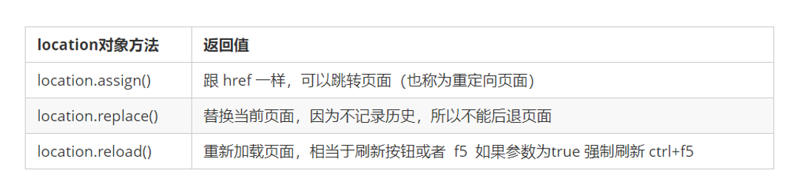

~~~html
<!DOCTYPE html>
<html lang="en">
<head>
    <meta charset="UTF-8">
    <title>Document</title>
</head>

<body>
    <button>点击</button>
    
</body>
</html>
~~~

## navigator 对象

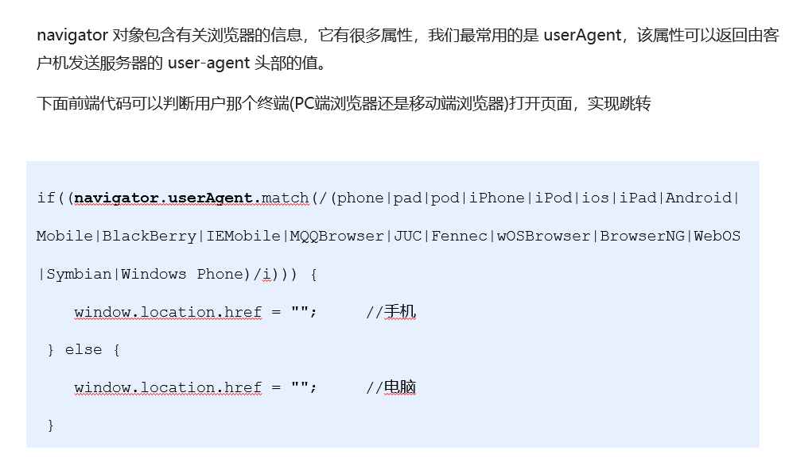

> 甚至浏览器版本，电脑系统版本号多少它都能给你得到

## history 对象

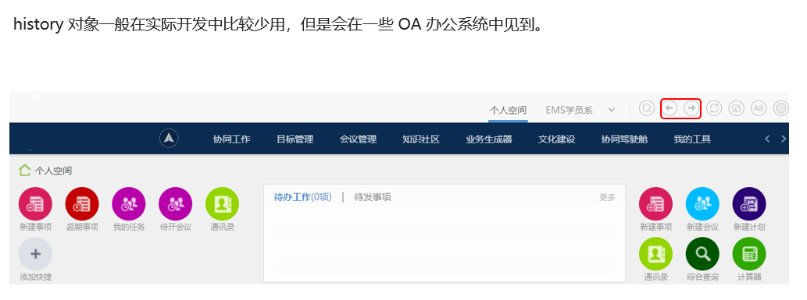

~~~html
<!DOCTYPE html>
<html lang="en">

<head>
    <meta charset="UTF-8">
    <title>Document</title>
</head>

<body>
    <a href="list.html">点击我去往列表页</a>
    <button>前进</button>
    
</body>
</html>
~~~

~~~html
<!DOCTYPE html>
<html lang="en">

<head>
    <meta charset="UTF-8">
    <title>Document</title>
</head>

<body>
    <a href="index.html">点击我去往首页</a>
    <button>后退</button>
    
</body>
</html>
~~~

# PC端网页特效

## 目标

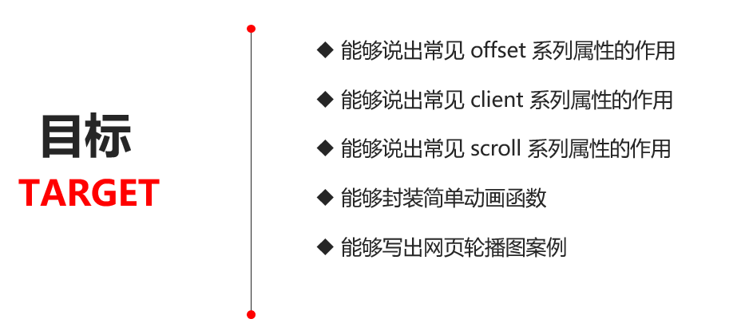

## 目录

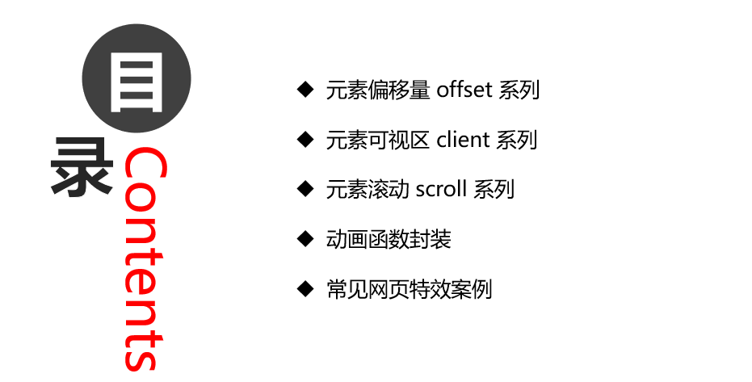

## 元素偏移量offset系列

### offset概述

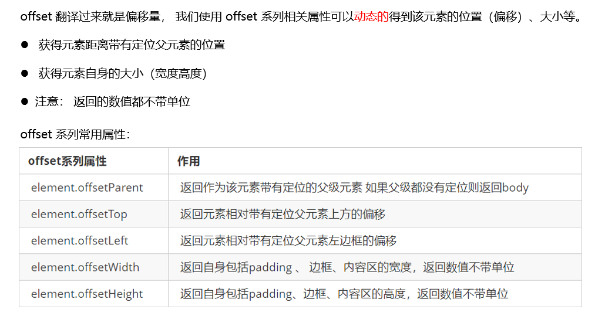

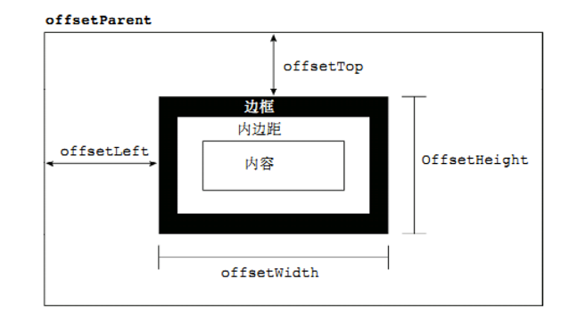

> 只有offsetTop和offsetLeft,没有offsetRight和offsetBottom。
>
> offsetTop和offsetLeft功能：得到元素的**位置！！！**
>
> offsetWidth和offsetHeight功能：得到元素的**大小！！！**
>
> offsetParent功能：得到**带有定位**的父级元素(如果父级都没有定位则返回body)，比较势力，父亲必须要有钱(定位)，没钱的话再往上面找有钱的干爹,干爹一个都找不到就只能找老实人body了。而parentNode比较善良，只要亲爸爸(只能是爸爸，不能是爷爷)，不管爸爸有没有钱(有无定位)。

~~~html
<!DOCTYPE html>
<html lang="en">
<head>
    <meta charset="UTF-8">
    <title>Document</title>
    
</head>

<body>
    

        

    

    
    

    
    
</body>
</html>
~~~

### offset 与 style 区别 

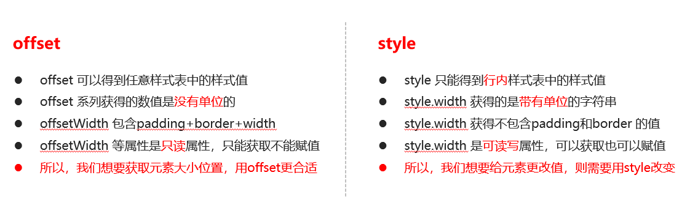

> style这个货好像不怎么样，但它最强大的地方是可以修改元素的属性，可读亦可写！！！而offset只能读不能写！！！

### 获取鼠标在盒子内的坐标

> 案例分析：
>
> ①我们在盒子内点击，想要得到鼠标距离盒子左右的距离。
>
> ②首先得到鼠标在页面中的坐标（e.pageX, e.pageY）
>
> ③其次得到盒子在页面中的距离 ( box.offsetLeft, box.offsetTop)
>
> ④用鼠标距离页面的坐标减去盒子在页面中的距离，得到 鼠标在盒子内的坐标
>
> ⑤如果想要移动一下鼠标，就要获取最新的坐标，使用鼠标移动事件 mousemove

> 这个案例是为后面的放大镜效果做铺垫的！！！

~~~html
<!DOCTYPE html>
<html lang="en">

<head>
    <meta charset="UTF-8">
    <title>Document</title>
    
</head>

<body>
    

    
</body>
</html>
~~~

### 模态框拖拽

> 案例分析：
>
> 弹出框，我们也称为模态框。
>
> 1.点击弹出层， 会弹出模态框， 并且显示灰色半透明的遮挡层。
>
> 2.点击关闭按钮，可以关闭模态框，并且同时关闭灰色半透明遮挡层。
>
> 3.鼠标放到模态框最上面一行，可以按住鼠标拖拽模态框在页面中移动。
>
> 4.鼠标松开，可以停止拖动模态框移动。

> ①点击弹出层， 模态框和遮挡层就会显示出来 display:block;
>
> ②点击关闭按钮，模态框和遮挡层就会隐藏起来 display:none;
>
> ③在页面中拖拽的原理： 鼠标按下并且移动， 之后松开鼠标
>
> ④触发事件是鼠标按下 mousedown， 鼠标移动mousemove 鼠标松开 mouseup
>
> ⑤拖拽过程:  鼠标移动过程中，获得最新的值赋值给模态框的left和top值， 这样模态框可以跟着鼠标走了
>
> ⑥鼠标按下触发的事件源是 最上面一行，就是  id 为 title 
>
> ⑦鼠标的坐标(变) 减去 鼠标在盒子内的坐标(不变)， 才是模态框真正的位置。
>
> ⑧鼠标按下，我们要得到鼠标在盒子的坐标。
>
> ⑨鼠标移动，就让模态框的坐标  设置为  ： 鼠标坐标减去盒子坐标即可，注意移动事件写到按下事件**里面**。
>
> ⑩鼠标松开，就停止拖拽，就是可以让鼠标移动事件解除  

~~~html
<!DOCTYPE html>
<html>

<head lang="en">
    <meta charset="UTF-8">
    <title></title>
    
</head>

<body>
    
<a id="link" href="javascript:;">点击，弹出登录框</a>

    

        
登录会员
            <a id="closeBtn" href="javascript:void(0);" class="close-login">关闭</a>
        

        

            

                <label>用户名：</label>
                <input type="text" placeholder="请输入用户名" name="info[username]" id="username" class="list-input">
            

            

                <label>登录密码：</label>
                <input type="password" placeholder="请输入登录密码" name="info[password]" id="password" class="list-input">
            

        

        
<a href="javascript:void(0);" id="login-button-submit">登录会员</a>

    

    <!-- 遮盖层 -->
    

    
</body>
</html>
~~~

> 我把CSS样式对着手抄了一遍，这个你让我写我现在是真的写不出来。

### 仿京东放大镜(等学完品优购再来写这个吧)

> 案例分析：
>
> ①黄色的遮挡层跟随鼠标功能。
>
> ②把鼠标坐标给遮挡层不合适。因为遮挡层坐标以父盒子为准。
>
> ③首先是获得鼠标在盒子的坐标。 
>
> ④之后把数值给遮挡层做为left 和top值。
>
> ⑤此时用到鼠标移动事件，但是还是在小图片盒子内移动。
>
> ⑥发现，遮挡层位置不对，需要再减去盒子自身高度和宽度的一半。
>
> ⑦遮挡层不能超出小图片盒子范围。
>
> ⑧如果小于零，就把坐标设置为0
>
> ⑨如果大于遮挡层最大的移动距离，就把坐标设置为最大的移动距离
>
> ⑩遮挡层的最大移动距离： 小图片盒子宽度 减去 遮挡层盒子宽度

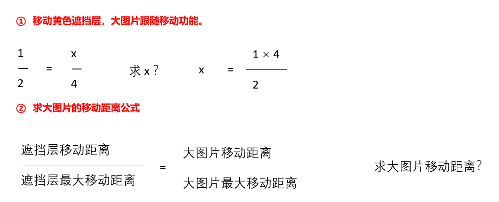

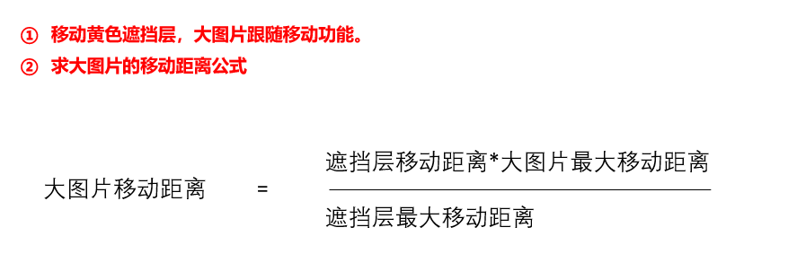

> 这个视频里老师是拿的品优购里面的静态页面写的，结构比较复杂，我从里面找出这一段也比较费时间，干脆等以后我学完品优购以后再来写这个特效吧。

## 元素可视区client系列

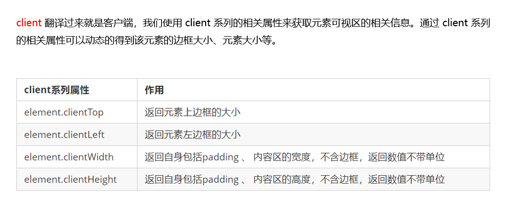

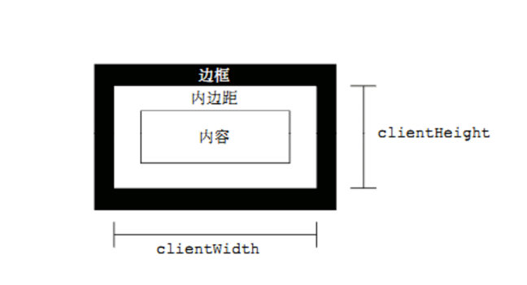

~~~html
<!DOCTYPE html>
<html lang="en">
<head>
    <meta charset="UTF-8">
    <title>Document</title>
    
</head>

<body>
    

    
</body>
</html>
~~~

### 淘宝 flexible.js 源码分析

这个是源文件

~~~javascript
(function flexible(window, document) {
    //这个立即执行函数采用的是写法2：(function(){}());  --2个小括号包含(父子)、
  	//(function flexible(window, document) {}(window, document))
  	//立即执行函数传递了2个参数，window和document，把这2个参数分别传入了window和document,这样立即     //执行函数就可以直接使用这2个参数了
  
    // 获取的html的根元素（前面学过）
    var docEl = document.documentElement
    // dpr 物理像素比（PC端物理像素比就是1，iphone6里面物理像素比为2）
    var dpr = window.devicePixelRatio || 1

    // adjust body font size  设置我们body 的字体大小
    function setBodyFontSize() {
        // 如果页面中有body 这个元素 就设置body的字体大小
        if (document.body) {
            document.body.style.fontSize = (12 * dpr) + 'px'
        } else {
            // 如果页面中没有body 这个元素，则等着 我们页面主要的DOM元素加载完毕再去设置body
            // 的字体大小
          	//DOMContentLoaded前面也学过
            document.addEventListener('DOMContentLoaded', setBodyFontSize)
        }
    }
    setBodyFontSize();

    // set 1rem = viewWidth / 10    设置我们html 元素的文字大小
    function setRemUnit() {
        //clientWidth前面刚刚也学过
        //flexible是把我们的屏幕划分成了若干等分，每一等分就是一个rem
        var rem = docEl.clientWidth / 10
        docEl.style.fontSize = rem + 'px'
    }

    setRemUnit()

    // reset rem unit on page resize  当我们页面尺寸大小发生变化的时候，要重新设置下rem的大小
    window.addEventListener('resize', setRemUnit)
    // pageshow 是我们重新加载页面触发的事件
    window.addEventListener('pageshow', function(e) {
   // e.persisted 返回的是true 就是说如果这个页面是从缓存取过来的页面，也需要从新计算一下rem 的大小
        if (e.persisted) {
            setRemUnit()
        }
    })

    // detect 0.5px supports  有些移动端的浏览器不支持0.5像素的写法
    if (dpr >= 2) {
        var fakeBody = document.createElement('body')
        var testElement = document.createElement('div')
        testElement.style.border = '.5px solid transparent'
        fakeBody.appendChild(testElement)
        docEl.appendChild(fakeBody)
        if (testElement.offsetHeight === 1) {
            docEl.classList.add('hairlines')
        }
        docEl.removeChild(fakeBody)
    }
}(window, document))
~~~

#### 立即执行函数

> 我们以前的函数都是先声明然后接下来再调用才能使用(不调用它是不执行的)

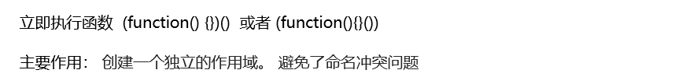

~~~html
<!DOCTYPE html>
<html lang="en">

<head>
    <meta charset="UTF-8">
    <title>Document</title>
</head>

<body>
    
</body>
</html>
~~~

#### 像素比和pageshow事件

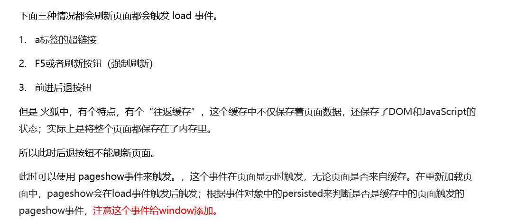

~~~html
<!DOCTYPE html>
<html lang="en">

<head>
    <meta charset="UTF-8">
    <title>Document</title>
    <!--  -->
</head>

<body>

    
    <a href="http://www.itcast.cn">链接</a>
</body>

</html>
~~~

## 元素滚动 scroll 系列

### 元素 scroll 系列属性

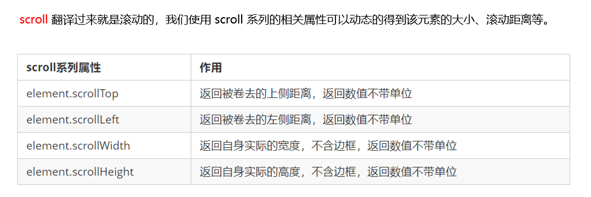

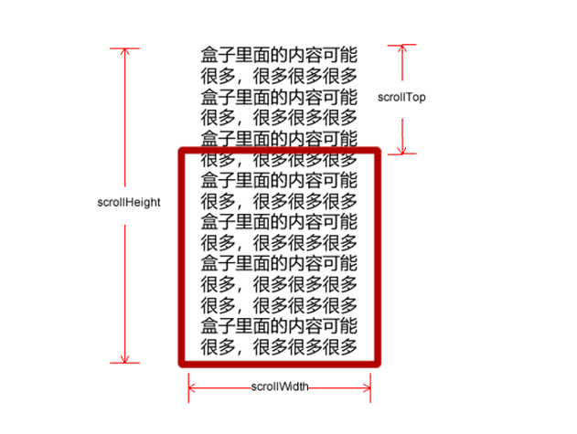

> scrollHeight高度是真正的内容的大小，而clientHeight则不同。

### 页面被卷去的头部

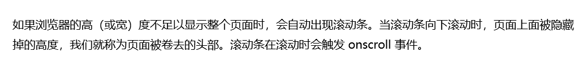

~~~html
 <!DOCTYPE html>
<html lang="en">

<head>
    <meta charset="UTF-8">
    <title>Document</title>
    
</head>

<body>
    

        我是内容 我是内容 我是内容 我是内容 我是内容 我是内容 我是内容 我是内容 我是内容 我是内容 我是内容 我是内容 我是内容 我是内容 我是内容 我是内容 我是内容 我是内容 我是内容 我是内容 我是内容 我是内容 我是内容 我是内容 我是内容 我是内容 我是内容 我是内容 我是内容 我是内容 我是内容 我是内容 我是内容 我是内容
    

    
</body>

</html>
~~~

### 仿淘宝固定右侧侧边栏

> 案例分析：
>
> 1.原先侧边栏是绝对定位
>
> 2.当页面滚动到一定位置，侧边栏改为固定定位
>
> 3.页面继续滚动，会让 返回顶部显示出来
>
> ①需要用到页面滚动事件 scroll  因为是页面滚动，所以事件源是 document
>
> ②滚动到某个位置，就是判断页面被卷去的上部值。
>
> ③**页面**被卷去的头部：可以通过window.pageYOffset 获得  如果是被卷去的左侧 window.pageXOffset
>
> ④注意，**元素**被卷去的头部是 element.scrollTop  , 如果是**页面**被卷去的头部 则是 window.pageYOffset
>
> ⑤其实这个值可以通过盒子的 offsetTop 可以得到，如果大于等于这个值，就可以让盒子固定定位了

~~~html
<!DOCTYPE html>
<html lang="en">

<head>
    <meta charset="UTF-8">
    <title>Document</title>
    
</head>

<body>
    

        返回顶部
    

    
头部区域

    
banner区域

    
主体部分

    
</body>
</html>
~~~

> 单独写我写不出来。

#### 页面被卷去的头部兼容性解决方案

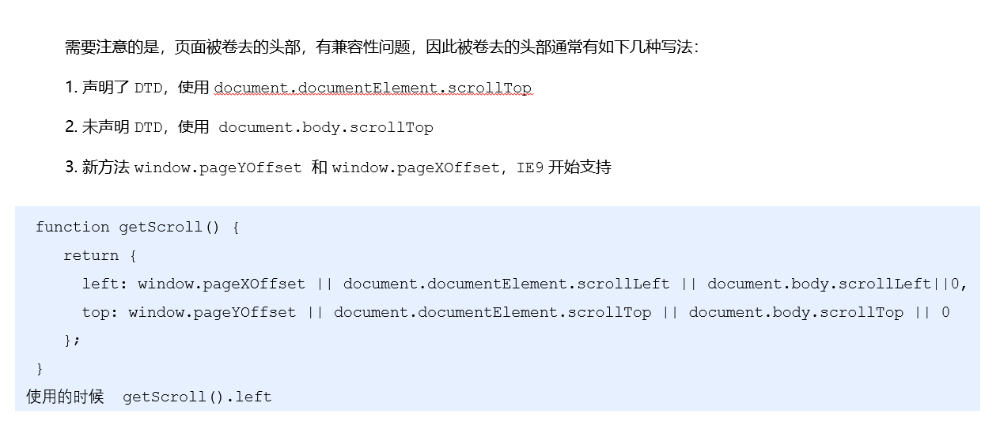

## 三大系列总结

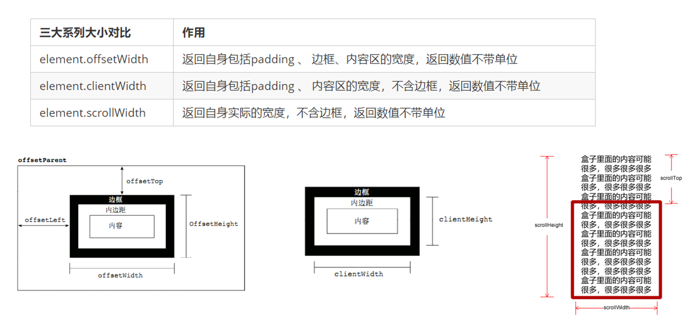

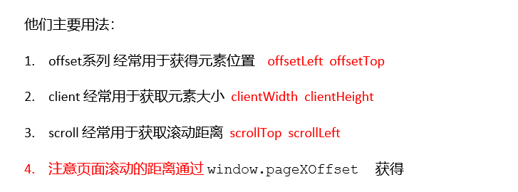

> window不能用scrollTop和scrollLeft，因为它没有这2个属性。只能用window.pageX和window.pageY。
>
> 而html和body是有scrollTop和scrollLeft这2个属性的。

## mouseenter 和mouseover的区别

~~~html
<!DOCTYPE html>
<html lang="en">
<head>
    <meta charset="UTF-8">
    <title>Document</title>
    
</head>

<body>
    

        

    

    
</body>
</html>
~~~

> 要用就要一对一对的用：
>
> mouseover和mouseout是一对
>
> mouseenter和mouseleave是一对（不冒泡，用的多）

## 动画函数封装

### 动画实现原理

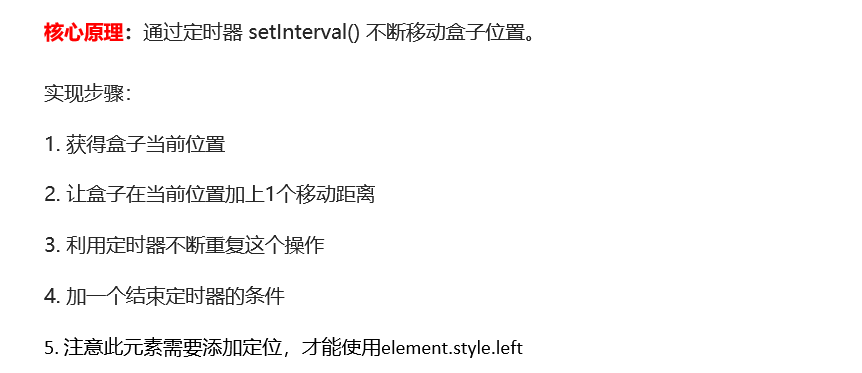

> 一定要加定位！！！！！

~~~html
<!DOCTYPE html>
<html lang="en">

<head>
    <meta charset="UTF-8">
    <title>Document</title>
    
</head>

<body>
    

    
</body>
</html>
~~~

### 动画函数简单封装 

注意函数需要传递2个参数，**动画对象**和**移动到的距离**。

~~~html
<!DOCTYPE html>
<html lang="en">

<head>
    <meta charset="UTF-8">
    <title>Document</title>
    
</head>

<body>
    

    夏雨荷
    
</body>
</html>
~~~

### 动画函数给不同元素记录不同定时器 

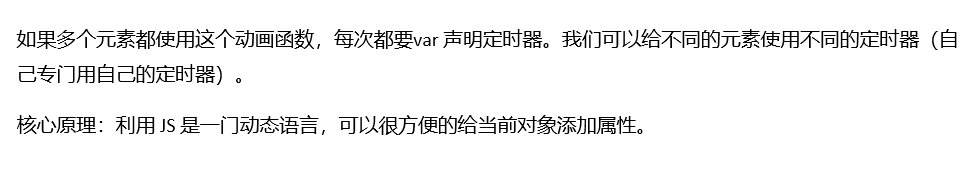

~~~html
<!DOCTYPE html>
<html lang="en">

<head>
    <meta charset="UTF-8">
    <title>Document</title>
    
</head>

<body>
    <button>点击夏雨荷才走</button>
    

    夏雨荷
    
</body>
</html>
~~~

### 缓动效果原理 

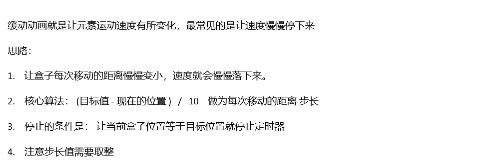

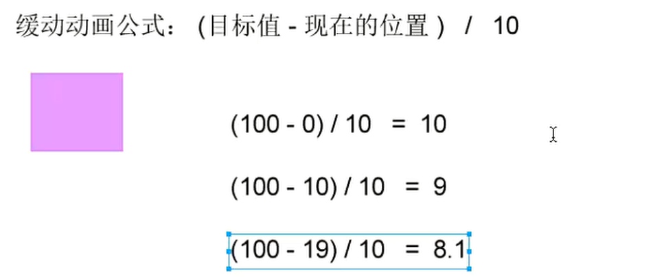

~~~html
<!DOCTYPE html>
<html lang="en">

<head>
    <meta charset="UTF-8">
    <title>Document</title>
    
</head>

<body>
    <button>点击夏雨荷才走</button>
    夏雨荷
    
</body>
</html>
~~~

### 动画函数多个目标值之间移动 

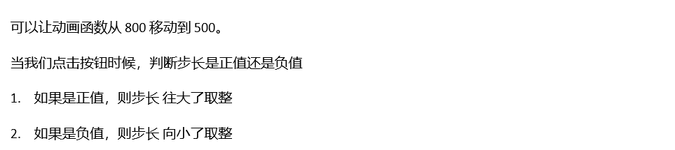

~~~html
<!DOCTYPE html>
<html lang="en">

<head>
    <meta charset="UTF-8">
    <meta name="viewport" content="width=device-width, initial-scale=1.0">
    <meta http-equiv="X-UA-Compatible" content="ie=edge">
    <title>Document</title>
    
</head>

<body>
    <button class="btn500">点击夏雨荷到500</button>
    <button class="btn800">点击夏雨荷到800</button>
    夏雨荷
    
</body>
</html>
~~~

### 动画函数添加回调函数 

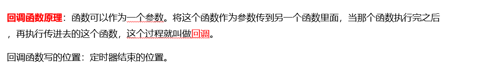

~~~html
<!DOCTYPE html>
<html lang="en">

<head>
    <meta charset="UTF-8">
    <title>Document</title>
    
</head>

<body>
    <button class="btn500">点击夏雨荷到500</button>
    <button class="btn800">点击夏雨荷到800</button>
    夏雨荷
    
</body>
</html>
~~~

### 动画函数封装到单独JS文件里面

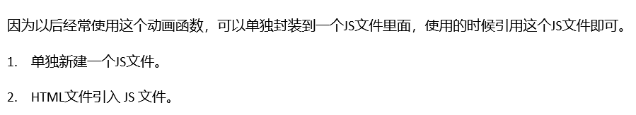

~~~html
<!DOCTYPE html>
<html lang="en">

<head>
    <meta charset="UTF-8">
    <title>Document</title>
    
  	<!--别忘了引入这个函数-->
    
</head>

<body>
    

        ←
        
问题反馈

    

    
</body>
</html>
~~~

## 常见网页特效案例(综合大练习-动态轮播图)

> 之前写的轮播图是个静态页面，没有特效，现在来个有特效的。

> 轮播图也称为焦点图，是网页中比较常见的网页特效。
>
> 功能需求：
>
> 1.鼠标经过轮播图模块，左右按钮显示，离开隐藏左右按钮。
>
> 2.点击右侧按钮一次，图片往左播放一张，以此类推， 左侧按钮同理。
>
> 3.图片播放的同时，下面小圆圈模块跟随一起变化。
>
> 4.点击小圆圈，可以播放相应图片。
>
> 5.鼠标不经过轮播图， 轮播图也会自动播放图片。
>
> 6.鼠标经过，轮播图模块， 自动播放停止。

> 案例分析：
>
> ①因为js较多，我们单独新建js文件夹，再新建js文件， 引入页面中。
>
> ②此时需要添加 load 事件。
>
> ③鼠标经过轮播图模块，左右按钮显示，离开隐藏左右按钮。
>
> ④显示隐藏 display 按钮。

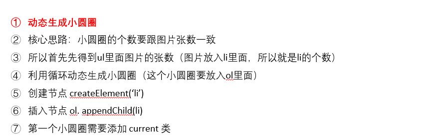

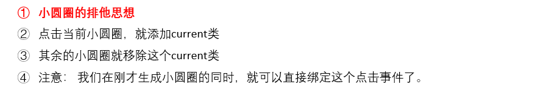

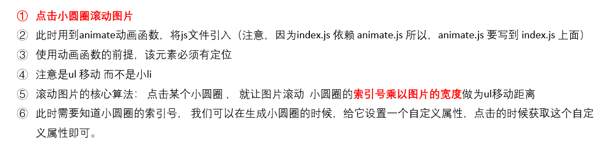

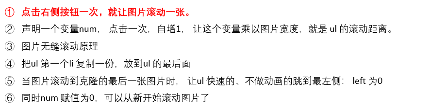

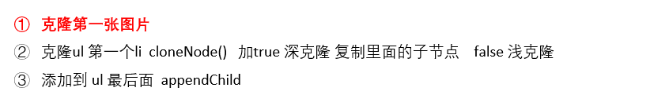

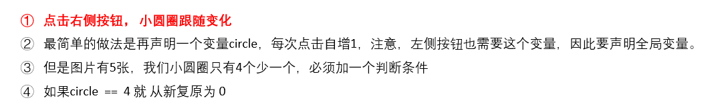

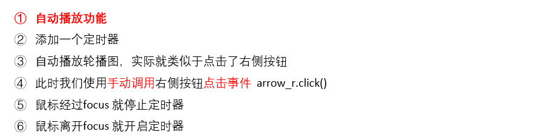

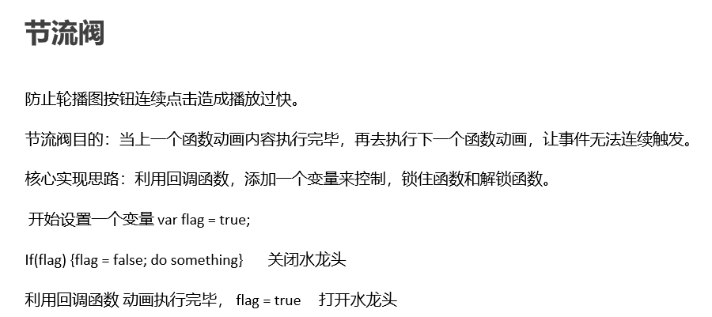

> 我找到我当时做京东商城静态页面的代码，准备从中抽出轮播图的部分，后来发现样式文件太多，一个一个筛选太麻烦，索性全删除了，对照着视频里的代码从里面抽离了轮播图的代码，弄了半天，好歹格式终于弄出来了，接下来就是对着视频写动态效果了。

`index.html`代码如下:

~~~html
<!DOCTYPE html>
<html lang="en">
<head>
	<meta charset="UTF-8">
	<title>动态轮播图</title>
	<!-- 引入首页的CSS文件 -->
	<link rel="stylesheet" href="css/index.css">
	
	<!-- 引入首页的animate.js文件(这个animate.js必须要写到index.js的上面引入)-->
	

	<!-- 引入首页的index.js文件 -->
	
</head>
<body>
	

		<!-- 左侧按钮 -->
		<!-- javascript:;可以让超链接不要跳转 -->
        <a href="javascript:;" class="arrow-l">  </a>
         
        <!-- 右侧按钮 -->
        <a href="javascript:;" class="arrow-r">  </a>

		<!-- 核心的滚动区域 -->
		<ul>
			<li></li>
			<li></li>
			<li></li>
			<li></li>
			<!-- 要无缝滚动，第一张图片再放一次到最后面 -->
			<!-- <li></li> -->
		</ul>

		<!-- 小圆圈 -->
		<ol class="circle">
		
		</ol>
	

</body>
</html>
~~~

`index.css`代码如下：

~~~css
*{
	margin: 0;
	padding: 0;
}

li{
	list-style: none;
}

a{
	text-decoration: none;
}

@font-face {
    font-family: 'icomoon';
    src:url('../fonts/icomoon.eot?7kkyc2');
    src:url('../fonts/icomoon.eot?7kkyc2#iefix') format('embedded-opentype'),
    url('../fonts/icomoon.ttf?7kkyc2') format('truetype'),
    url('../fonts/icomoon.woff?7kkyc2') format('woff'),
    url('../fonts/icomoon.svg?7kkyc2#icomoon') format('svg');
    font-weight: normal;
    font-style: normal;
}

.focus{
	width: 721px;
	height: 455px;
	margin: 100px auto;
	/*background-color: pink;*/
	position: relative;
	overflow: hidden;
}

.focus ul{
	/*大盒子里面的ul默认和父亲一样宽，即使ul设了浮动，也无法在一行显示。
	所以要把里面的ul宽度弄的更宽一点(比父亲还宽)，这样4张图片才能在一行显示
	宽度设置的大一点是没有关系的*/
	width: 600%;

    /*因为animate.js中图片移动(注：是ul移动！！！而不是li移动)必须要定位，
    所以这个ul必须要加个定位*/
	position: absolute;
    top: 0;
    left: 0;
}

 .focus ul li {
 	float: left;
 }

.circle{
    position: absolute;
    bottom: 10px;
    left: 50px;
}
.arrow-l,
.arrow-r {
    display: none;
    position: absolute;
    top: 50%;
    margin-top: -20px;
    width: 24px;
    height: 40px;
    background: rgba(0, 0, 0, .3);
    text-align: center;
    line-height: 40px;
    color: #ccc;
    font-family: 'icomoon';
    font-size: 18px;
    /*ul有定位，arrow_l,r也有定位，要提高层级，否则会被压住*/
    z-index: 2;
}

.arrow-r {
    right: 0;
}

.circle li {
    float: left;
    width: 8px;
    height: 8px;
    /*background-color: #fff;*/
    border: 2px solid rgba(255, 255, 255, 0.5);
    margin: 0 3px;
    border-radius: 50%;
    /*鼠标经过显示小手*/
    cursor: pointer;
}

.current {
    background-color: #fff;
}
~~~

`animate.js`代码如下：

~~~javascript
function animate(obj, target, callback) {
    // console.log(callback);  callback = function() {}  调用的时候 callback()

    // 先清除以前的定时器，只保留当前的一个定时器执行
    clearInterval(obj.timer);
    obj.timer = setInterval(function() {
        // 步长值写到定时器的里面
        // 把我们步长值改为整数 不要出现小数的问题
        // var step = Math.ceil((target - obj.offsetLeft) / 10);
        var step = (target - obj.offsetLeft) / 10;
        step = step > 0 ? Math.ceil(step) : Math.floor(step);
        if (obj.offsetLeft == target) {
            // 停止动画 本质是停止定时器
            clearInterval(obj.timer);
            // 回调函数写到定时器结束里面
            // if (callback) {
            //     // 调用函数
            //     callback();
            // }
            //和上面的一样，效果一样
            callback && callback();
        }
        // 把每次加1 这个步长值改为一个慢慢变小的值  步长公式：(目标值 - 现在的位置) / 10
        obj.style.left = obj.offsetLeft + step + 'px';

    }, 15);
}
~~~

`index.js`代码如下：（重点！！！）

~~~javascript

window.addEventListener('load', function() {
    // 1. 获取元素
    var arrow_l = document.querySelector('.arrow-l');
    var arrow_r = document.querySelector('.arrow-r');
    var focus = document.querySelector('.focus');
    //这个要减去1像素，不然图片有点问题
    var focusWidth = focus.offsetWidth - 1;
    // console.log(focusWidth);
    // 2. 鼠标经过focus 就显示隐藏左右按钮
    focus.addEventListener('mouseenter', function() {
        arrow_l.style.display = 'block';
        arrow_r.style.display = 'block';
        clearInterval(timer);
        timer = null;  //清除定时器变量
      
    });

    focus.addEventListener('mouseleave', function() {
        arrow_l.style.display = 'none';
        arrow_r.style.display = 'none';
        timer = setInterval(function(){
        arrow_r.click();
     },2000)
       
    });

    // 3. 动态生成小圆圈  有几张图片，我就生成几个小圆圈
    var ul = focus.querySelector('ul');
    var ol = focus.querySelector('.circle');
    // console.log(ul.children.length);
    for(var i = 0; i < ul.children.length; i++){
        //创建一个小li
        var li = document.createElement('li');
        //记录当前小圆圈的索引号 通过自定义属性来做
        li.setAttribute('index',i);
        //把小li插入到ol里面
        ol.appendChild(li);

        //4.小圆圈的排他思想 我们可以直接在生成小圆圈的同时直接绑定点击事件
        li.addEventListener('click',function(){
            //干掉所有人  把所有的小li清除current类名
            for(var i = 0; i < ol.children.length; i++){
                ol.children[i].className = '';
            }
            //留下我自己  当前的小li设置current类名
            this.className = 'current';

            //5.点击小圆圈，移动图片 当然移动的是ul
            //ul的移动距离 小圆圈的索引号 乘以 图片的宽度  注意是负值
            //当我们点击了某个小li 就拿到当前小li的索引号
            var index = this.getAttribute('index');
            //当我们点击了某个小li就要把这个li的索引号给num
            num = index;
            //当我们点击了某个小li就要把这个li的索引号给circle
            circle = index;

            console.log(focusWidth);
            console.log(index);

            animate(ul,-index * focusWidth);
        })
    }

    //把ol里面的第一个小li设置类名为current
    ol.children[0].className = 'current';

    //6.克隆第一章图片li放到ul后面
    var first = ul.children[0].cloneNode(true);
    ul.appendChild(first);
    //7.点击右侧按钮，图片滚动一张
    var num = 0;
    //circle控制小圆圈的播放
    var circle = 0;
    //flag  节流阀
    var flag = true;
    arrow_r.addEventListener('click',function(){
        //如果走到了最后复制的一张图片，此时，我们的ul要快速复原，left改为0
        if(flag){
            flag = false;       //关闭节流阀
            if(num == ul.children.length - 1){
            ul.style.left = 0;
            num = 0;
        }
        
        num++;
        // alert(1);
        animate(ul,-num * focusWidth,function(){
            flag = true;//打开节流阀
        });

        //8.点击右侧按钮，小圆圈跟随一起变化，可以再声明一个变量控制小圆圈的播放
        circle++;

        //如果circle等于4，说明走到最后我们克隆的这张图片了 我们就复原
        // if(circle == 4){
        if(circle == ol.children.length ){
            circle = 0;
        }
        //先清除其余小圆圈的current类名
        for(var i = 0; i < ol.children.length; i++){
            ol.children[i].className = '';
        }
        //留下当前小圆圈的current类名
        ol.children[circle].className = 'current';
        }
    });

    //9.左侧按钮做法
     arrow_l.addEventListener('click',function(){
        //如果走到了最后复制的一张图片，此时，我们的ul要快速复原，left改为0
       if(flag){
        flag = false;
         if(num ==0){
            num = ul.children.length - 1 ;
            ul.style.left = -(ul.children.length - 1) * focusWidth + 'px';
        }
       
        num--;
        // alert(1);
        animate(ul,-num * focusWidth,function(){
            flag = true;
        });

        //8.点击右侧按钮，小圆圈跟随一起变化，可以再声明一个变量控制小圆圈的播放
        circle--;

        //如果circle小于0，则说明第一张图片，则小圆圈要改为第4个小圆圈（3）
        // if(circle == 4){
        if(circle < 0){
            circle = 3;
        }
        //先清除其余小圆圈的current类名
        for(var i = 0; i < ol.children.length; i++){
            ol.children[i].className = '';
        }
        //留下当前小圆圈的current类名
        ol.children[circle].className = 'current';
        }
    });

     //10.自动播放功能
     var timer = setInterval(function(){
        arrow_r.click();
     },2000)
})
~~~

## 仿淘宝返回顶部

> 案例分析：
>
> 滚动窗口至文档中的特定位置。
>
> window.scroll(x, y) 
>
> 注意，里面的x和y 不跟单位，直接写数字

> ①**带有动画**的返回顶部
>
> ②此时可以继续使用我们封装的动画函数
>
> ③只需要把所有的left 相关的值 改为 跟 页面垂直滚动距离相关就可以了
>
> ④页面滚动了多少，可以通过 window.pageYOffset 得到
>
> ⑤最后是页面滚动，使用 window.scroll(x,y) 

~~~html
<!DOCTYPE html>
<html lang="en">

<head>
    <meta charset="UTF-8">
    <title>Document</title>
    
</head>

<body>
    

        返回顶部
    

    
头部区域

    
banner区域

    
主体部分

    
</body>
</html>
~~~

## 筋斗云案例

> 案例分析：
>
> 鼠标经过某个小li， 筋斗云跟这到当前小li位置
>
> 鼠标离开这个小li， 筋斗云复原为原来的位置
>
> 鼠标点击了某个小li， 筋斗云就会留在点击这个小li 的位置

> ①利用动画函数做动画效果
>
> ②原先筋斗云的起始位置是0
>
> ③鼠标经过某个小li， 把当前小li 的 offsetLeft 位置 做为目标值即可
>
> ④鼠标离开某个小li， 就把目标值设为 0
>
> ⑤如果点击了某个小li， 就把li当前的位置存储起来，做为筋斗云的起始位置

~~~html
<!DOCTYPE html>
<html>

<head lang="en">
    <meta charset="UTF-8">
    <title></title>
    
    
    
</head>

<body>
    

        
        <ul>
            <li class="current"><a href="#">首页新闻</a></li>
            <li><a href="#">师资力量</a></li>
            <li><a href="#">活动策划</a></li>
            <li><a href="#">企业文化</a></li>
            <li><a href="#">招聘信息</a></li>
            <li><a href="#">公司简介</a></li>
            <li><a href="#">我是佩奇</a></li>
            <li><a href="#">啥是佩奇</a></li>
        </ul>
    

</body>
</html>
~~~

# 移动端网页特效

## 目标

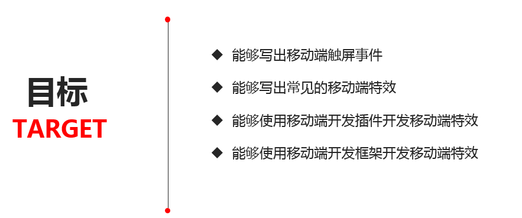

## 目录

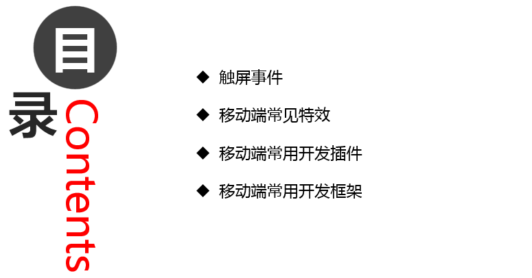

## 触屏事件

### 触屏事件概述 

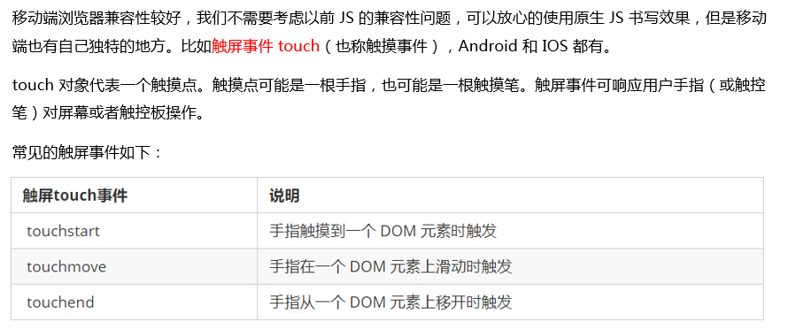

~~~html
<!DOCTYPE html>
<html lang="en">
<head>
    <meta charset="UTF-8">
    <title>Document</title>
    
</head>

<body>
    

    
</body>
</html>
~~~

### 触摸事件对象（TouchEvent）

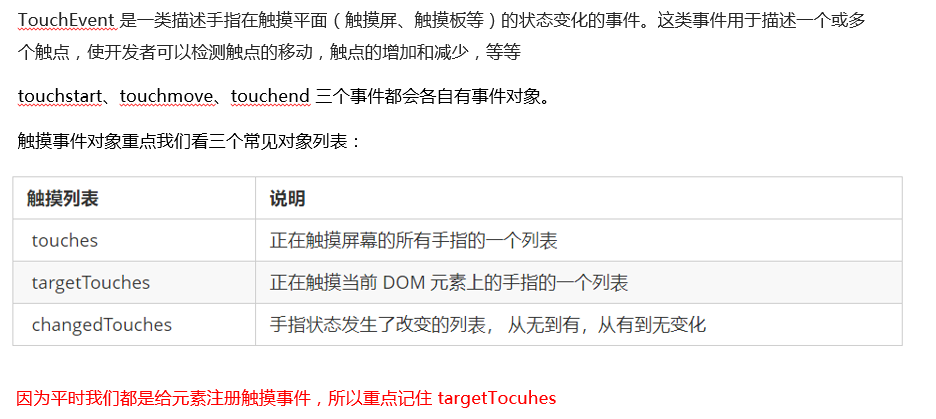

~~~html
<!DOCTYPE html>
<html lang="en">

<head>
    <meta charset="UTF-8">
    <title>Document</title>
    
</head>

<body>
    

    
</body>
</html>
~~~

### 移动端拖动元素

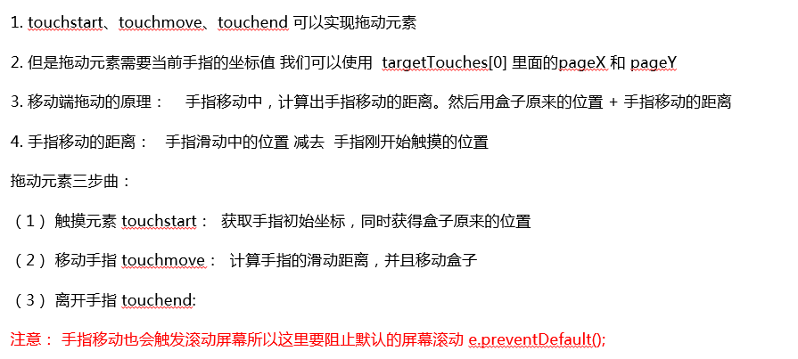

~~~html
<!DOCTYPE html>
<html lang="en">

<head>
    <meta charset="UTF-8">
    <title>Document</title>
    
</head>

<body>
    

    
</body>
</html>
~~~

## 移动端常见特效

### 移动端轮播图(难)

> 这个和前面比较难的案例自己肯定是还要再看几遍的，现在自己是完全写不出来的。复习之后要达到能独立手写的程度啊，起码要有正确的思路才行，学习重精不重多，要多温故才能知新。

> 案例分析：
>
> 移动端轮播图功能和基本PC端一致。
>
> 1.可以自动播放图片
>
> 2.手指可以拖动播放轮播图

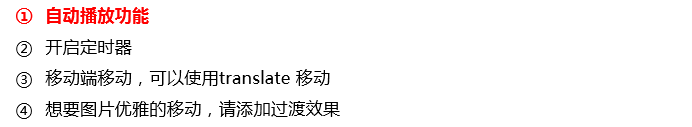

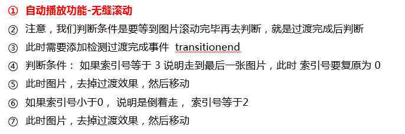

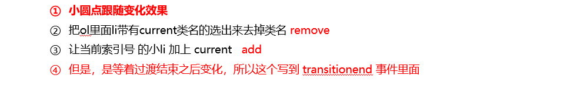

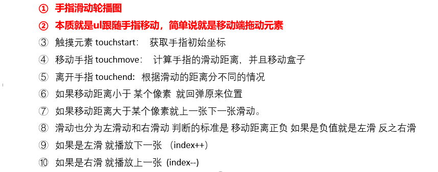

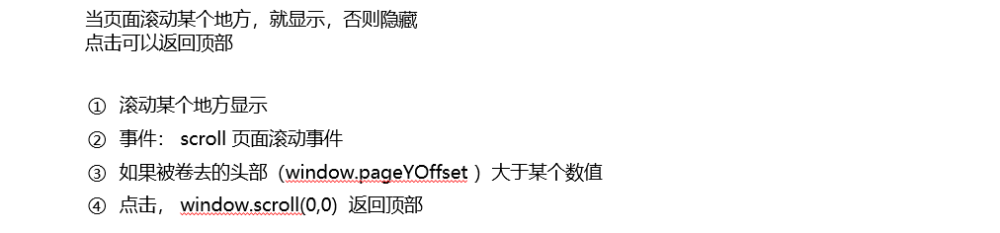

index.html代码如下：

~~~html
<!DOCTYPE html>
<html lang="en">

<head>
    <meta charset="UTF-8">
    <link rel="stylesheet" href="css/normalize.css">
    <link rel="stylesheet" href="css/index.css">
    <title>携程在手，说走就走</title>
    
</head>

<body>
    <!-- 返回顶部模块 -->
    

    <!-- 顶部搜索 -->
    

        
搜索:目的地/酒店/景点/航班号

        <a href="#" class="user">我 的</a>
    

    <!-- 焦点图模块 -->
    

        <ul>
            <li></li>
            <li></li>
            <li></li>
            <li></li>
            <li></li>
        </ul>
        <!-- 小圆点 -->
        <ol>
            <li class="current"></li>
            <li></li>
            <li></li>
        </ol>
    

    <!-- 局部导航栏 -->
    <ul class="local-nav">
        <li>
            <a href="#" title="景点·玩乐">
                
                景点·玩乐
            </a>
        </li>
        <li>
            <a href="#" title="景点·玩乐">
                
                景点·玩乐
            </a>
        </li>
        <li>
            <a href="#" title="景点·玩乐">
                
                景点·玩乐
            </a>
        </li>
        <li>
            <a href="#" title="景点·玩乐">
                
                景点·玩乐
            </a>
        </li>
        <li>
            <a href="#" title="景点·玩乐">
                
                景点·玩乐
            </a>
        </li>

    </ul>

    <!-- 主导航栏 -->
    <nav>
        

            

                <a href="#">海外酒店</a>
            

            

                <a href="#">海外酒店</a>
                <a href="#">特价酒店</a>
            

            

                <a href="#">海外酒店</a>
                <a href="#">特价酒店</a>
            

        

        

            

                <a href="#">海外酒店</a>
            

            

                <a href="#">海外酒店</a>
                <a href="#">特价酒店</a>
            

            

                <a href="#">海外酒店</a>
                <a href="#">特价酒店</a>
            

        

        

            

                <a href="#">海外酒店</a>
            

            

                <a href="#">海外酒店</a>
                <a href="#">特价酒店</a>
            

            

                <a href="#">海外酒店</a>
                <a href="#">特价酒店</a>
            

        

    </nav>
    <!-- 侧导航栏 -->
    <ul class="subnav-entry">
        <li>
            <a href="#">
                
                电话费
            </a>
        </li>
        <li>
            <a href="#">
                
                电话费
            </a>
        </li>
        <li>
            <a href="#">
                
                电话费
            </a>
        </li>
        <li>
            <a href="#">
                
                电话费
            </a>
        </li>
        <li>
            <a href="#">
                
                电话费
            </a>
        </li>
        <li>
            <a href="#">
                
                电话费
            </a>
        </li>
        <li>
            <a href="#">
                
                电话费
            </a>
        </li>
        <li>
            <a href="#">
                
                电话费
            </a>
        </li>
        <li>
            <a href="#">
                
                电话费
            </a>
        </li>
        <li>
            <a href="#">
                
                电话费
            </a>
        </li>

    </ul>

    <!-- 销售模块 -->
    

        

            <h2>热门活动</h2>
            <a href="#" class="more">获取更多福利</a>
        

        

            

                
                
            

            

                
                
            

            

                
                
            

        

    

</body>
</html>
~~~

index.css代码如下：

~~~css
body {
    max-width: 540px;
    min-width: 320px;
    margin: 0 auto;
    font: normal 14px/1.5 Tahoma, "Lucida Grande", Verdana, "Microsoft Yahei", STXihei, hei;
    color: #000;
    background: #f2f2f2;
    overflow-x: hidden;
    -webkit-tap-highlight-color: transparent;
}

ul {
    list-style: none;
    margin: 0;
    padding: 0;
}

a {
    text-decoration: none;
    color: #222;
}

div {
    box-sizing: border-box;
}

/* 搜索模块 */

.search-index {
    display: flex;
    /* 固定定位跟父级没有关系 它以屏幕为准 */
    position: fixed;
    top: 0;
    left: 50%;
    z-index: 999;
    /* 固定的盒子应该有宽度 */
    -webkit-transform: translateX(-50%);
    transform: translateX(-50%);
    width: 100%;
    min-width: 320px;
    max-width: 540px;
    height: 44px;
    /* background-color: pink; */
    background-color: #F6F6F6;
    border-top: 1px solid #ccc;
    border-bottom: 1px solid #ccc;
}

.search {
    position: relative;
    height: 26px;
    line-height: 24px;
    border: 1px solid #ccc;
    flex: 1;
    font-size: 12px;
    color: #666;
    margin: 7px 10px;
    padding-left: 25px;
    border-radius: 5px;
    box-shadow: 0 2px 4px rgba(0, 0, 0, .2);
}

.search::before {
    content: "";
    position: absolute;
    top: 5px;
    left: 5px;
    width: 15px;
    height: 15px;
    background: url(../images/sprite.png) no-repeat -59px -279px;
    background-size: 104px auto;
}

.user {
    width: 44px;
    height: 44px;
    /* background-color: purple; */
    font-size: 12px;
    text-align: center;
    color: #2eaae0;
}

.user::before {
    content: "";
    display: block;
    width: 23px;
    height: 23px;
    background: url(../images/sprite.png) no-repeat -59px -194px;
    background-size: 104px auto;
    margin: 4px auto -2px;
}

/* goBack */

.goBack {
    display: none;
    position: fixed;
    bottom: 50px;
    right: 20px;
    width: 38px;
    height: 38px;
    background: url(../images/back.png) no-repeat;
    background-size: 38px 38px;
}

/* focus */

.focus {
    position: relative;
    padding-top: 44px;
    overflow: hidden;
}

.focus img {
    width: 100%;
}

.focus ul {
    /*ul没有高度，里面的孩子有浮动，所以要清除浮动*/
    overflow: hidden;
    width: 500%;
    /*整个ul往左边走一张图*/
    margin-left: -100%;
}

.focus ul li {
    float: left;
    /*一共5个小li,每个小li占20%*/
    width: 20%;
}

.focus ol {
    position: absolute;
    bottom: 5px;
    right: 5px;
    margin: 0;
}

.focus ol li {
    display: inline-block;
    width: 5px;
    height: 5px;
    background-color: #fff;
    list-style: none;
    border-radius: 2px;
    transition: all .3s;
}

.focus ol li.current {
    width: 15px;
}

/* local-nav */

.local-nav {
    display: flex;
    height: 64px;
    margin: 3px 4px;
    background-color: #fff;
    border-radius: 8px;
}

.local-nav li {
    flex: 1;
}

.local-nav a {
    display: flex;
    flex-direction: column;
    /* 侧轴居中对齐 因为是单行 */
    align-items: center;
    font-size: 12px;
}

.local-nav li [class^="local-nav-icon"] {
    width: 32px;
    height: 32px;
    background-color: pink;
    margin-top: 8px;
    background: url(../images/localnav_bg.png) no-repeat 0 0;
    background-size: 32px auto;
}

.local-nav li .local-nav-icon-icon2 {
    background-position: 0 -32px;
}

.local-nav li .local-nav-icon-icon3 {
    background-position: 0 -64px;
}

.local-nav li .local-nav-icon-icon4 {
    background-position: 0 -96px;
}

.local-nav li .local-nav-icon-icon5 {
    background-position: 0 -128px;
}

/* nav */

nav {
    overflow: hidden;
    border-radius: 8px;
    margin: 0 4px 3px;
}

.nav-common {
    display: flex;
    height: 88px;
    background-color: pink;
}

.nav-common:nth-child(2) {
    margin: 3px 0;
}

.nav-items {
    /* 不冲突的 */
    flex: 1;
    display: flex;
    flex-direction: column;
}

.nav-items a {
    flex: 1;
    text-align: center;
    line-height: 44px;
    color: #fff;
    font-size: 14px;
    /* 文字阴影 */
    text-shadow: 1px 1px rgba(0, 0, 0, .2);
}

.nav-items a:nth-child(1) {
    border-bottom: 1px solid #fff;
}

.nav-items:nth-child(1) a {
    border: 0;
    background: url(../images/hotel.png) no-repeat bottom center;
    background-size: 121px auto;
}

/* -n+2就是选择前面两个元素 */

.nav-items:nth-child(-n+2) {
    border-right: 1px solid #fff;
}

.nav-common:nth-child(1) {
    background: -webkit-linear-gradient(left, #FA5A55, #FA994D);
}

.nav-common:nth-child(2) {
    background: -webkit-linear-gradient(left, #4B90ED, #53BCED);
}

.nav-common:nth-child(3) {
    background: -webkit-linear-gradient(left, #34C2A9, #6CD559);
}

/* subnav-entry */

.subnav-entry {
    display: flex;
    border-radius: 8px;
    background-color: #fff;
    margin: 0 4px;
    flex-wrap: wrap;
    padding: 5px 0;
}

.subnav-entry li {
    /* 里面的子盒子可以写 % 相对于父级来说的 */
    flex: 20%;
}

.subnav-entry a {
    display: flex;
    flex-direction: column;
    align-items: center;
}

.subnav-entry-icon {
    width: 28px;
    height: 28px;
    background-color: pink;
    margin-top: 4px;
    background: url(../images/subnav-bg.png) no-repeat;
    background-size: 28px auto;
}

/* sales-box */

.sales-box {
    border-top: 1px solid #bbb;
    background-color: #fff;
    margin: 4px;
}

.sales-hd {
    position: relative;
    height: 44px;
    border-bottom: 1px solid #ccc;
}

.sales-hd h2 {
    position: relative;
    text-indent: -999px;
    overflow: hidden;
}

.sales-hd h2::after {
    position: absolute;
    top: 5px;
    left: 8px;
    content: "";
    width: 79px;
    height: 15px;
    background: url(../images/hot.png) no-repeat 0 -20px;
    background-size: 79px auto;
}

.more {
    position: absolute;
    right: 5px;
    top: 0px;
    background: -webkit-linear-gradient(left, #FF506C, #FF6BC6);
    border-radius: 15px;
    padding: 3px 20px 3px 10px;
    color: #fff;
}

.more::after {
    content: "";
    position: absolute;
    top: 9px;
    right: 9px;
    width: 7px;
    height: 7px;
    border-top: 2px solid #fff;
    border-right: 2px solid #fff;
    transform: rotate(45deg);
}

.row {
    display: flex;
}

.row a {
    flex: 1;
    border-bottom: 1px solid #eee;
}

.row a:nth-child(1) {
    border-right: 1px solid #eee;
}

.row a img {
    width: 100%;
}
~~~

index.js代码如下：

~~~javascript
window.addEventListener('load', function() {
    // alert(1);
    // 1. 获取元素 
    var focus = document.querySelector('.focus');
    var ul = focus.children[0];
    // 获得focus 的宽度
    var w = focus.offsetWidth;
    var ol = focus.children[1];
    // 2. 利用定时器自动轮播图图片
    var index = 0;
    var timer = setInterval(function() {
        index++;
        var translatex = -index * w;
        ul.style.transition = 'all .3s';
        ul.style.transform = 'translateX(' + translatex + 'px)';
    }, 2000);
    // 等着我们过渡完成之后，再去判断 监听过渡完成的事件 transitionend 
    ul.addEventListener('transitionend', function() {
        // 无缝滚动
        if (index >= 3) {
            index = 0;
            // console.log(index);
            // 去掉过渡效果 这样让我们的ul 快速的跳到目标位置
            ul.style.transition = 'none';
            // 利用最新的索引号乘以宽度 去滚动图片
            var translatex = -index * w;
            ul.style.transform = 'translateX(' + translatex + 'px)';
        } else if (index < 0) {
            index = 2;
            ul.style.transition = 'none';
            // 利用最新的索引号乘以宽度 去滚动图片
            var translatex = -index * w;
            ul.style.transform = 'translateX(' + translatex + 'px)';
        }
        // 3. 小圆点跟随变化
        // 把ol里面li带有current类名的选出来去掉类名 remove
        ol.querySelector('.current').classList.remove('current');
        // 让当前索引号 的小li 加上 current   add
        ol.children[index].classList.add('current');
    });

    // 4. 手指滑动轮播图 
    // 触摸元素 touchstart： 获取手指初始坐标
    var startX = 0;
    var moveX = 0; // 后面我们会使用这个移动距离所以要定义一个全局变量
    var flag = false;
    ul.addEventListener('touchstart', function(e) {
        startX = e.targetTouches[0].pageX;
        // 手指触摸的时候就停止定时器
        clearInterval(timer);
    });
    // 移动手指 touchmove： 计算手指的滑动距离， 并且移动盒子
    ul.addEventListener('touchmove', function(e) {
        // 计算移动距离
        moveX = e.targetTouches[0].pageX - startX;
        // 移动盒子：  盒子原来的位置 + 手指移动的距离 
        var translatex = -index * w + moveX;
        // 手指拖动的时候，不需要动画效果所以要取消过渡效果
        ul.style.transition = 'none';
        ul.style.transform = 'translateX(' + translatex + 'px)';
        flag = true; // 如果用户手指移动过我们再去判断否则不做判断效果
        e.preventDefault(); // 阻止滚动屏幕的行为
    });
    // 手指离开 根据移动距离去判断是回弹还是播放上一张下一张
    ul.addEventListener('touchend', function(e) {
        if (flag) {
            // (1) 如果移动距离大于50像素我们就播放上一张或者下一张
            if (Math.abs(moveX) > 50) {
                // 如果是右滑就是 播放上一张 moveX 是正值
                if (moveX > 0) {
                    index--;
                } else {
                    // 如果是左滑就是 播放下一张 moveX 是负值
                    index++;
                }
                var translatex = -index * w;
                ul.style.transition = 'all .3s';
                ul.style.transform = 'translateX(' + translatex + 'px)';
            } else {
                // (2) 如果移动距离小于50像素我们就回弹
                var translatex = -index * w;
                ul.style.transition = 'all .1s';
                ul.style.transform = 'translateX(' + translatex + 'px)';
            }
        }
        // 手指离开的时候就重新开启定时器
        clearInterval(timer);
        timer = setInterval(function() {
            index++;
            var translatex = -index * w;
            ul.style.transition = 'all .3s';
            ul.style.transform = 'translateX(' + translatex + 'px)';
        }, 2000);
    });

    // 返回顶部模块制作
    var goBack = document.querySelector('.goBack');
    var nav = document.querySelector('nav');
    window.addEventListener('scroll', function() {
        if (window.pageYOffset >= nav.offsetTop) {
            goBack.style.display = 'block';
        } else {
            goBack.style.display = 'none';
        }
    });
    goBack.addEventListener('click', function() {
        window.scroll(0, 0);
    })
})
~~~

### classList属性

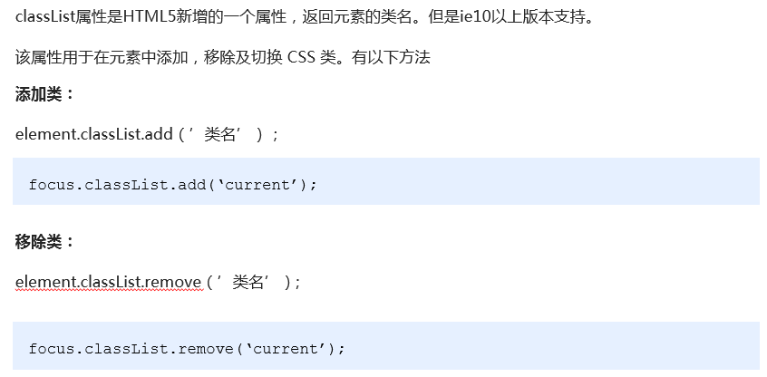

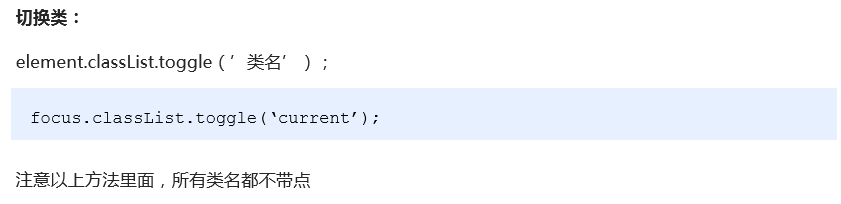

~~~html
<!DOCTYPE html>
<html lang="en">

<head>
    <meta charset="UTF-8">
    <title>Document</title>
    
</head>

<body>
    

    <button> 开关灯</button>
    
</body>
</html>
~~~

### click 延时解决方案

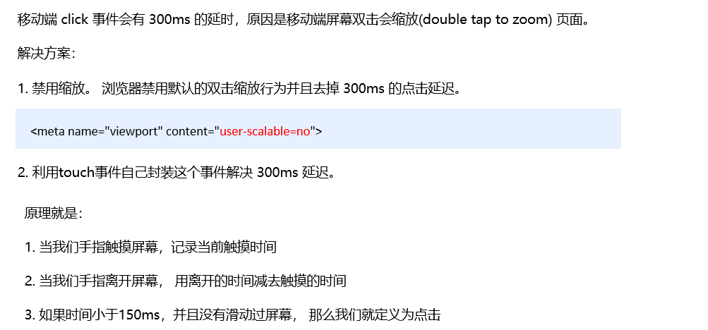

 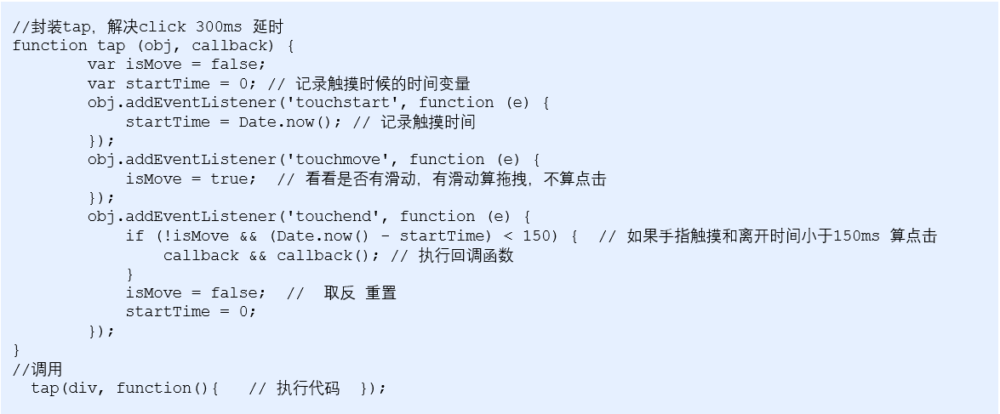

## 移动端常用开发插件

### 什么是插件

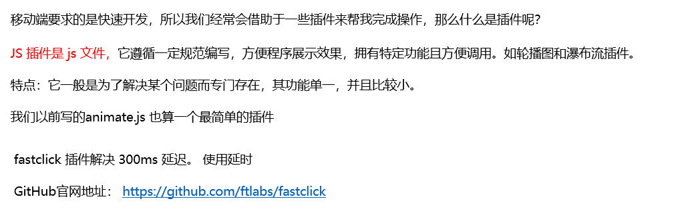

### 插件的使用

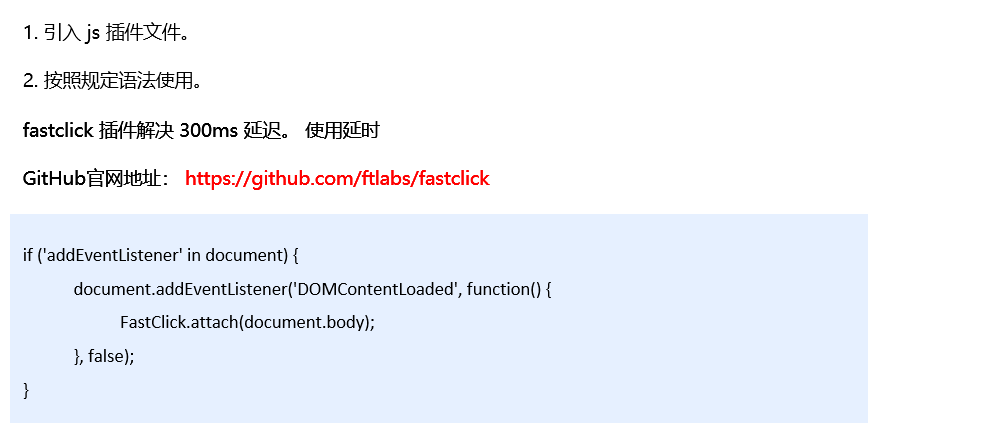

~~~html
<!DOCTYPE html>
<html lang="en">

<head>
    <meta charset="UTF-8">
    <title>Document</title>
    
    
</head>

<body>
    

    
</body>
</html>
~~~

### Swiper 插件的使用（用于轮播图）

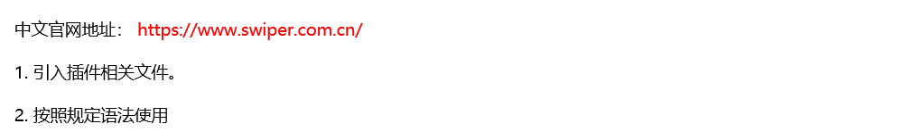

### 其他移动端常见插件

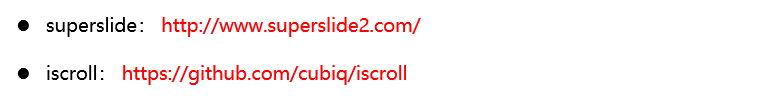

### 插件的使用总结

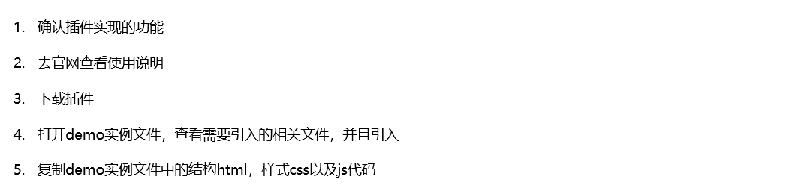

### 视频插件zy.media.js

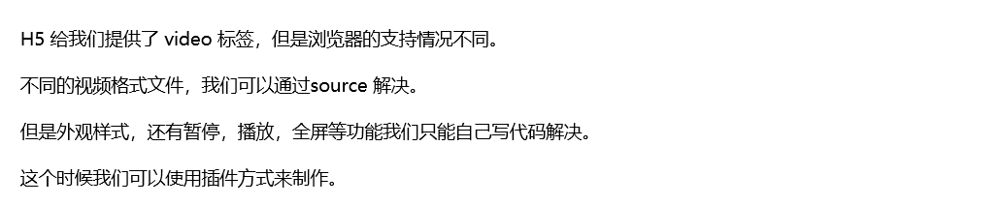

~~~html
<!DOCTYPE html>
<html lang="en">

<head>
    <meta charset="UTF-8">
    <title>Document</title>
    <link rel="stylesheet" href="zy.media.min.css">
    
    

</head>

<body>

    

        

            <video data-config='{"mediaTitle": "小蝴蝶"}'>
                    <source src="mov.mp4" type="video/mp4">
                    您的浏览器不支持HTML5视频
                </video>

        

        
&nbsp;

    

    

</body>
</html>
~~~

## 移动端常用开发框架

### 框架概述

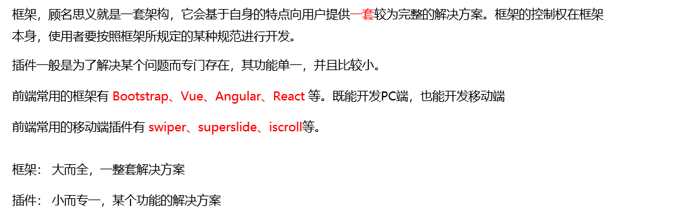

### Bootstrap

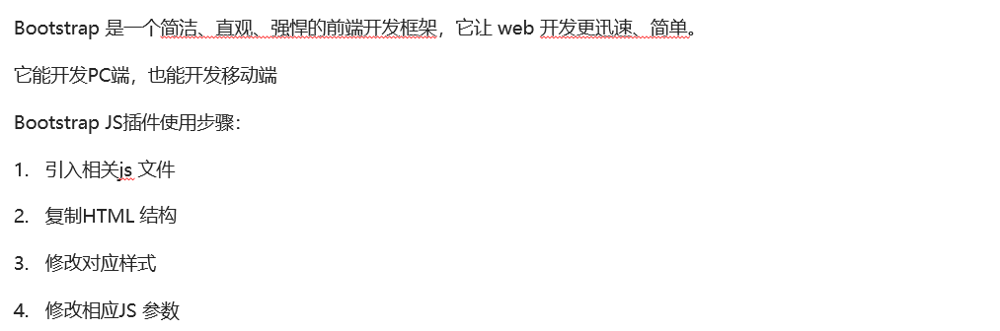

~~~html
<!DOCTYPE html>
<html lang="en">

<head>
    <meta charset="UTF-8">
    <title>Document</title>
    <link rel="stylesheet" href="bootstrap/css/bootstrap.min.css">
    
    
    
</head>

<body>
    

        

            <!-- Indicators 小圆点 -->
            <ol class="carousel-indicators">
                <li data-target="#carousel-example-generic" data-slide-to="0" class="active"></li>
                <li data-target="#carousel-example-generic" data-slide-to="1"></li>
                <li data-target="#carousel-example-generic" data-slide-to="2"></li>
            </ol>

            <!-- Wrapper for slides 轮播图片 -->
            

                

                    
                    

                        这是我的图片1
                    

                

                

                    
                    

                        这是我的图片2
                    

                

                

                    
                    

                        这是我的图片3
                    

                

                ...
            

            <!-- Controls 左右箭头 -->
            <a class="left carousel-control" href="#carousel-example-generic" role="button" data-slide="prev">
                
                Previous
            </a>
            <a class="right carousel-control" href="#carousel-example-generic" role="button" data-slide="next">
                
                Next
            </a>
        

    

    
</body>
</html>
~~~

# 本地存储

## 目标

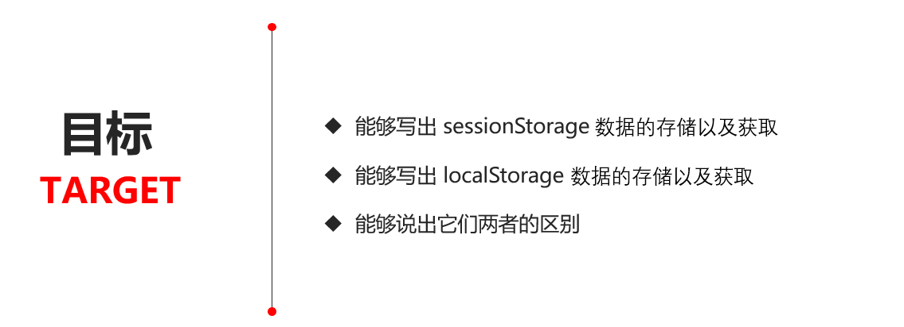

## 目录

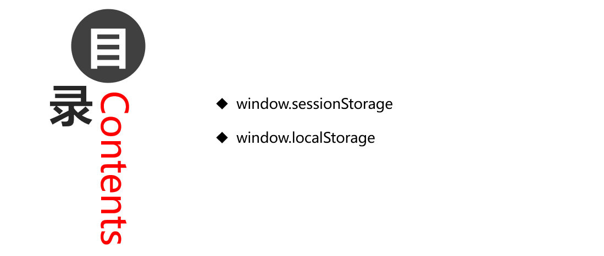

## 本地存储

## window.sessionStorage(5M且短命)

~~~html
<!DOCTYPE html>
<html lang="en">

<head>
    <meta charset="UTF-8">
    <title>Document</title>
</head>

<body>
    <input type="text">
    <button class="set">存储数据</button>
    <button class="get">获取数据</button>
    <button class="remove">删除数据</button>
    <button class="del">清空所有数据</button>
    
</body>
</html>
~~~

## window.localStorage(5M且长寿)

[HTML5中sessionStorage最大容量是多少？](https://www.zhihu.com/question/22930109)

[获得浏览器localStorage的剩余容量和最大容量](https://blog.csdn.net/weixin_40582630/article/details/81807470)

~~~html
<!DOCTYPE html>
<html lang="en">

<head>
    <meta charset="UTF-8">
    <title>Document</title>
</head>

<body>
    <input type="text">
    <button class="set">存储数据</button>
    <button class="get">获取数据</button>
    <button class="remove">删除数据</button>
    <button class="del">清空所有数据</button>
    
</body>
</html>
~~~

## 记住用户名案例

> 如果勾选记住用户名， 下次用户打开浏览器，就在文本框里面自动显示上次登录的用户名
>
> 案例分析：
>
> ①把数据存起来，用到本地存储
>
> ②关闭页面，也可以显示用户名，所以用到localStorage
>
> ③打开页面，先判断是否有这个用户名，如果有，就在表单里面显示用户名，并且勾选复选框
>
> ④当复选框发生改变的时候 change事件
>
> ⑤如果勾选，就存储，否则就移除

~~~html
<!DOCTYPE html>
<html lang="en">

<head>
    <meta charset="UTF-8">
    <title>Document</title>
</head>

<body>
    <input type="text" id="username"> <input type="checkbox" name="" id="remember"> 记住用户名
    
</body>
~~~

