(注1：本博文是看黑马程序员Pink老师——刘晓强老师的视频的学习笔记，主要是对JavaScript一些难点，比如原型，闭包，作用域链这些难点进行再一次的学习，打好基本功。)

(注2：现在是2020年8月22日，视频课程一共有121集，前面90集是JavaScript高级，后面31集是ES6，我准备先学JavaScript高级，ES6部分要重新开一篇博文记笔记。这90集每集的时长也就8,9分钟左右，希望自己可以一天看10集，9天能看完它。也就是希望在9月份之前看完吧。)

(注3：[视频链接](<https://www.bilibili.com/video/av86804070?p=1>))

(注4：这个视频质量挺高的，也很通俗，一定要认真看，这就算是我这个阶段最后一次JavaScript查漏补缺的机会了，不要一味图快，遇到难以理解的概念的就停下来，查找资料，自己也好好的想一想，一定要把遇到的这些概念给搞懂啊！)

(注5：快学完课程以后感觉原型啊，闭包啊，作用域链啊这些已经没有这么可怕了，已经开始以平等的心态对待它们了，这套课程还是很不错的。)

(注6：现在是2020年9月12日，终于把这套视频给看完了，算了一下居然花了21天，整整3周。)

(注7：现在是2024年5月28日，偶尔翻到，再看一遍，哈哈哈。逝者如斯夫，不舍昼夜。快4年了啊。。。。。。)

# JavaScript面向对象

## 目标

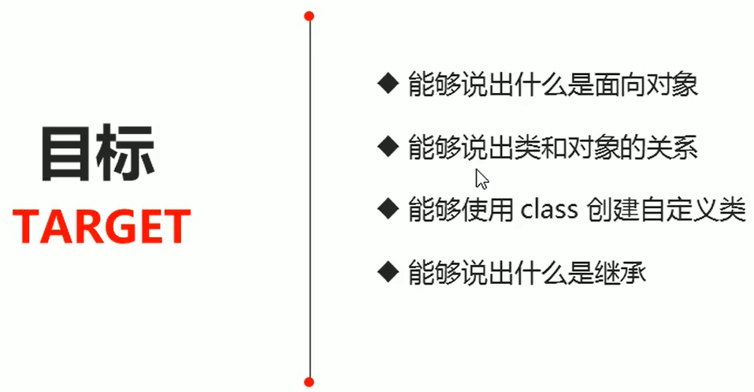

## 目录

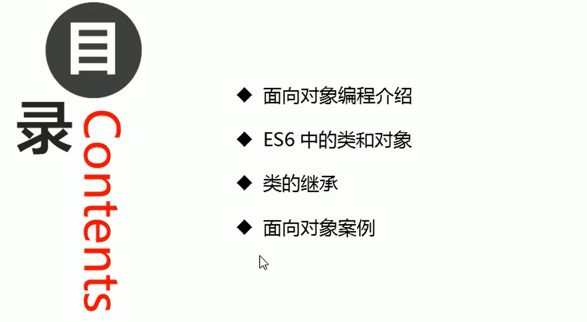

## 面向对象编程介绍

### 两大编程思想

* 面向过程
* 面向对象

### 面向过程编程POP(Process-oriented-programming)

面向过程就是分析出解决问题所需要的**步骤**，然后用**函数**把这些步骤步一步实现，使用的时候**再一个一个的依次调用**就可以了。

举个栗子：将大象装进冰箱，面向过程做法。

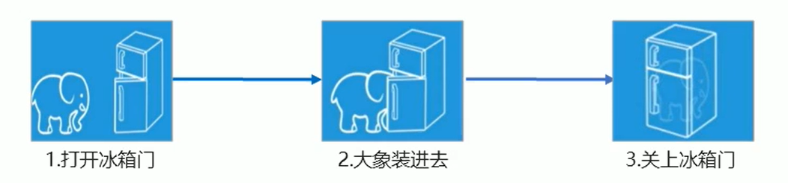

面向过程，就是按照我们分析好了的步骤，按照步骤解决问题。

### 面向对象编程OOP（Object Oriented Programming）

面向对象是**把事务分解成为一个个对象**，然后由对象之间分工与合作。

举个栗子：将大象装进冰箱，面向对象做法。

先**找出对象**，并**写出这些对象的功能**：

* 大象对象
  * 进去

* 冰箱对象
  * 打开
  * 关闭

* 使用大象和冰箱的功能

面向对象是**以对象功能来划分问题**，而不是**步骤**。

在面向对象程序开发思想中，每一个对象都是功能中心，具有明确分工。

面向对象编程具有灵活、代码可复用、容易维护和开发的优点，更适合多人合作的大型软件项目。

面向对象的特性：

* **封装性**
* **继承性**
* **多态性**

### 面向过程和面向对象的对比

#### 面向过程

* 优点：**性能**比面向对象高，适合跟**硬件**联系很紧密的东西，例如**单片机**就采用的面向过程编程。
* 缺点：没有面向对象易维护、易复用、易扩展。

#### 面向对象

* 优点：易维护、易复用、易扩展，由于面向对象有**封装、继承、多态性**的特性，可以设计出**低耦合**的系统，使系统更加灵活、更加易于维护
* 缺点：性能比面向过程低

用**面向过程**的方法写出来的程序是一份**蛋炒饭**(鸡蛋和米饭混合在一起)，而用**面向对象**写出来的程序是一份**盖浇饭**(米饭和菜分开，下面是饭，上面是菜)。

> 简单的程序建议用面向过程的思想写代码，负杂的，多人维护的程序建议用面向对象的思想写代码，便于维护。

## ES6中的类和对象

### 面向对象

面向对象更贴近我们的实际生活，可以使用面向对象描述现实世界事物，但是事物分为**具体的事物**(我自己的小米手机)和**抽象的事物**(手机)

面向对象的思维特点

* 抽取（抽象）对象**共用的属性和行为组织**（封装）成一个**类**（**模板**)

* 对类进行实例化，获取类的**对象**

面向对象编程我们考虑的是有哪些对象，按照面向对象的思维特点，不断的**创建对象，使用对象，指挥对象做事情**。

### 对象

现实生活中：万物皆对象，对象是一个**具体的事物**，看得见摸得着的实物。例如，一本书、一辆汽车、一个人可以是"对象"，一个数据库一张网页、一个与远程服务器的连接也可以是"对象"。

**在JavaScript中，对象是一组无序的相关属性和方法的集合，所有的事物都是对象**，例如字符串、数值、数组函数等。

对象是由**属性**和**方法**组成的：

* 属性：事物的**特征**，在对象中用**属性**来表示（常用**名词**）
* 方法：事物的**行为**，在对象中用**方法**来表示（常用**动词**）

### 类（class）

在ES6中新增加了类的概念，可以使用**class关键字**声明一个类，之后以这个类来实例化对象。

类抽象了对象的**公共部分**，它**泛指**某一大类（class）

对象**特指**某一个，通过类实例化一个具体的对象

### 创建类

**语法**：

~~~javascript
class name{
  //class body
}
~~~

**创建实例**：

~~~javascript
var xx = new name();
~~~

> 注意：类必须使用**new**实例化对象

### 类constructor构造函数

**constructor()方法**是类的构造函数（默认方法），**用于传递参数，返回实例对象**，通过new命令生成对象实例时，**自动调用**该方法。**如果没有显示定义**，**类内部**会自动给我们创建一个**constructor()**。

 **利用类创建对象**：

~~~javascript
<!DOCTYPE html>
<html lang="en">

<head>
    <meta charset="UTF-8">
    <meta name="viewport" content="width=device-width, initial-scale=1.0">
    <meta http-equiv="X-UA-Compatible" content="ie=edge">
    <title>Document</title>
</head>

<body>
    
</body>

</html>
~~~

更深刻的理解constructor构造函数：

~~~javascript
/*
 * @Author: liming
 * @Date: 2021-05-21 12:14:07
 * @LastEditTime: 2021-05-21 14:03:18
 * @FilePath: \LearnTypeScript\01-尚硅谷李智超\part4\02-构造函数.ts
 */

/**
 * 一般情况下我们一个类里面会创建多个对象(比如这里通过Dog类创建了4条狗)
 * 但是这4条狗都是一样的属性和方法(是相同的狗，都叫大黄，都会汪汪汪，这个就属于是克隆了)
 * 这样的话意义就不大了，这就相当于Dog类就只是单单创建3岁会汪汪叫的大黄的狗的类，而不是创建各种各样的狗的类了
 * 
 * 我们不想要克隆狗，我们想要不同的狗，这样世界才会更加的色彩斑斓
 * 我们希望每一次new Dog，都能创建各种各样不同的dog(属性不一样，需要改变，方法基本一样，不用动，狗都会叫，但毛色，名字，年龄都不一样。 )
 * 
 * 所以最佳实践就是，我们在类里面不直接给属性直接指定值，只把它的类型给指定好，值不指定，见Cat类
 * 这个值不能在类里面进行指定(如果在类里面指定好了，则意味着所有的对象都是这个值，就变成克隆了)
 * 但是我们也不能不给值，如果不给值的话，就等于我这个类里面是没有这些属性了(类是属性和方法的集合，是一个蓝图，框架)
 * 那么问题来了，我什么时候给它们值比较好呢？
 *      ——首先：在定义类的时候，这个值是不能确定的
 *      ——其次：我们又不能不给，那什么时候给合适呢？我们创建对象的时候，再给属性值就很好了。
 *          ——我想创建大黄，就给name赋值旺财，想创建小黑，就给name赋值小黑即可。
 *          ——这里就要用到constructor构造函数了(函数名是固定的，就叫constructor)
 */
class Dog {
    name: string = '大黄'
    age: number = 3
    
    bark() {
        alert('汪汪汪')
        // 在方法中可以通过this来表示当前调用方法的对象
        console.log(this);
        console.log(this.name);
    }
}

const dog1 = new Dog()
const dog2 = new Dog()
const dog3 = new Dog()
const dog4 = new Dog()

console.log(dog1);
console.log(dog2);
console.log(dog3);
console.log(dog4);

class Cat{
    // 这2个属性要先在类中进行一下定义
    // 属性在类中是直接定义的，写几个就有几个
    name: string;
    age: number;

    //在类里面添加一个固定名字的函数，函数名叫constructor
    // constructor被称为构造函数
    // 构造函数会在创建对象(new对象的时候)的时候自动进行调用
    // 你每调用一次new Cat()，就相当于调用了一次构造函数
    constructor(name1: string, age1: number) {
        // 我们在赋值的时候，是在构造函数中给它赋值的
        console.log('构造函数执行了');
        // 在实例方法中，this就表示当前的实例
        // 换句话说，你当前实例对象是谁，this就是谁
        // 在构造函数中，当前对象就是当前新建的那个对象
        // 可以通过this向新建的对象中添加属性
        console.log(this);
        // this.name = '旺财'
        // this.age = 18

        this.name = name1;
        this.age = age1;
    }
}

const cat = new Cat('旺财',1)
// 当我在new cat的时候，实际上就相当于调用了constructor函数！！！！！！
// 当我在new cat的时候，constructor函数就开始执行了
// console.log(cat);
const cat2 = new Cat('咪咪',2)
const cat3 = new Cat('毛毛', 3)
~~~

### 类添加方法

**语法**：

~~~javascript
class Person{
		constructor（name，age）{	//constructor构造器或者构造函数
			this.name = name;
    		this.age = age；
		}
		say(){
			console.log(this.name + '你好');
 	 	}
}
~~~

**类中添加方法**：

~~~javascript
<!DOCTYPE html>
<html lang="en">

<head>
    <meta charset="UTF-8">
    <meta name="viewport" content="width=device-width, initial-scale=1.0">
    <meta http-equiv="X-UA-Compatible" content="ie=edge">
    <title>Document</title>
</head>

<body>
    
</body>

</html>
~~~

## 类的继承

### 继承

现实中的继承：子承父业，比如我们都继承了父亲的姓。

程序中的继承：子类可以继承父类的一些属性和方法。

**语法**：

~~~javascript
class Father{		//父类
}

class son extends Father{	 //子类继承父类
}
~~~

**类的继承**

~~~javascript
<!DOCTYPE html>
<html lang="en">

<head>
    <meta charset="UTF-8">
    <meta name="viewport" content="width=device-width, initial-scale=1.0">
    <meta http-equiv="X-UA-Compatible" content="ie=edge">
    <title>Document</title>
</head>

<body>
    
</body>

</html>
~~~

### super关键字

super关键字用于**访问和调用**对象父类上的函数。可以调用父类的**构造函数**，也可以调用父类的普通函数。

**语法**：

~~~javascript
class Person{//父类
		constructor(surname){
				this.surname = surname;
    }
}

class Student extends Person{  //子类继承父类
		constructor(surname，firstname){
				super(surname);			//调用父类的constructor（surname）
				this.firstname = firstname；//定义子类独有的属性
    }
}
~~~

> 注意：子类在构造函数中使用super，必须放到this前面（必须先调用父类的构造方法，再使用子类构造方法）

#### super关键字调用父类构造函数

~~~javascript
<!DOCTYPE html>
<html lang="en">

<head>
    <meta charset="UTF-8">
    <meta name="viewport" content="width=device-width, initial-scale=1.0">
    <meta http-equiv="X-UA-Compatible" content="ie=edge">
    <title>Document</title>
</head>

<body>
    
</body>

</html>
~~~

#### super关键字调用父类普通函数

~~~javascript
<!DOCTYPE html>
<html lang="en">

<head>
    <meta charset="UTF-8">
    <meta name="viewport" content="width=device-width, initial-scale=1.0">
    <meta http-equiv="X-UA-Compatible" content="ie=edge">
    <title>Document</title>
</head>

<body>
    
</body>

</html>
~~~

### 子类继承父类方法同时扩展自己方法

~~~javascript
<!DOCTYPE html>
<html lang="en">

<head>
    <meta charset="UTF-8">
    <meta name="viewport" content="width=device-width, initial-scale=1.0">
    <meta http-equiv="X-UA-Compatible" content="ie=edge">
    <title>Document</title>
</head>

<body>
    
</body>
</html>
~~~

### 三个注意点

* **在ES6中类没有变量提升**，所以必须先定义类，才能通过类实例化对象
* 类里面的共有属性和方法一定要加this使用
* 类里面的this指向问题
* constructor里面的this指向实例对象，方法里面的this指向这个方法的调用者

#### ES6中没有变量提升

~~~javascript
<!DOCTYPE html>
<html lang="en">

<head>
    <meta charset="UTF-8">
    <meta name="viewport" content="width=device-width, initial-scale=1.0">
    <meta http-equiv="X-UA-Compatible" content="ie=edge">
    <title>Document</title>
</head>

<body>
    
</body>

</html>
~~~

#### 类中共有属性和方法要加this

**代码1.0**

~~~javascript
<!DOCTYPE html>
<html lang="en">

<head>
    <meta charset="UTF-8">
    <meta name="viewport" content="width=device-width, initial-scale=1.0">
    <meta http-equiv="X-UA-Compatible" content="ie=edge">
    <title>Document</title>
</head>

<body>
    
</body>

</html>
~~~

**代码2.0**

~~~javascript
<!DOCTYPE html>
<html lang="en">

<head>
    <meta charset="UTF-8">
    <meta name="viewport" content="width=device-width, initial-scale=1.0">
    <meta http-equiv="X-UA-Compatible" content="ie=edge">
    <title>Document</title>
</head>

<body>
    
</body>

</html>
~~~

**代码3.0**

~~~javascript
<!DOCTYPE html>
<html lang="en">

<head>
    <meta charset="UTF-8">
    <meta name="viewport" content="width=device-width, initial-scale=1.0">
    <meta http-equiv="X-UA-Compatible" content="ie=edge">
    <title>Document</title>
</head>

<body>
    <button>点击</button>
    
</body>

</html>
~~~

#### 类里面的this指向问题

~~~javascript
<!DOCTYPE html>
<html lang="en">

<head>
    <meta charset="UTF-8">
    <meta name="viewport" content="width=device-width, initial-scale=1.0">
    <meta http-equiv="X-UA-Compatible" content="ie=edge">
    <title>Document</title>
</head>

<body>
    <button>点击</button>
    
</body>

</html>
~~~

## 面向对象案例(Tab栏切换)

### 大体结构：

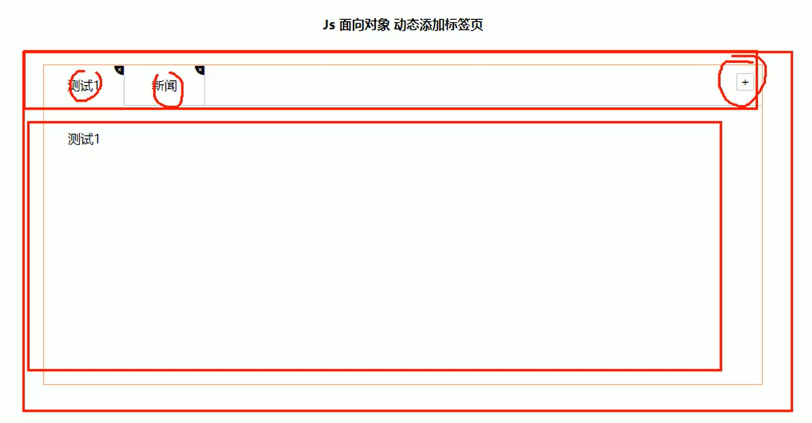

### 功能需求

* 点击tab栏，可以切换效果
* 点击+号，可以添加tab项和内容项
* 点击x号，可以删除当前的tab项和内容项
* 双击tab项文字或者内容项文字，可以修改里面的文字内容

### 抽象对象：Tab对象

* 该对象具有切换功能
* 该对象具有添加功能
* 该对象具有删除功能
* 该对象具有修改功能

#### 添加功能

1.点击+可以实现添加新的选项卡和内容

2.第一步：创建新的选项卡l和新的内容section

3.第二步：把创建的两个元素追加到对应的父元素中

4.以前的做法：动态创建元素createElement，但是元素里面内容较多，需要innerHTML赋值在appendChild追加到父元素里面。

5.现在高级做法：利用insertAdjacentHTML()可以直接把字符串格式元素添加到必元素中。

6.appendChild不支持追加字符串的子元素，insertAdjacentHTML支持追加字符串的元素

#### 删除功能

1.点击×可以删除当前的li选项卡和当前的section 

2.x是没有索引号的，但是它的父亲li有索引号，这个索引号正是我们想要的索引号

3.所以核心思路是：点击x号可以删除这个索引号对应的li和section 

#### 编辑功能

1.双击选项卡li或者section里面的文字，可以实现修改功能

2.双击事件是：ondblclick

3.如果双击文字，会默认选定文字，此时需要双击禁止选中文字

4.window.getSelection?window.getSelection().removeAllRanges():document.selection.empty();

5.核心思路：双击文字的时候，在里面生成一个文本框，当失去焦点或者按下回车然后把文本框输入的值给原先元素即可

## 完整代码

### HTML

~~~html
<!DOCTYPE html>
<html lang="en">

<head>
    <meta charset="UTF-8">
    <meta name="viewport" content="width=device-width, initial-scale=1.0">
    <meta http-equiv="X-UA-Compatible" content="ie=edge">
    <title>面向对象 Tab</title>
    <link rel="stylesheet" href="./styles/tab.css">
    <link rel="stylesheet" href="./styles/style.css">
</head>

<body>

    <main>
        <h4>
            Js 面向对象 动态添加标签页
        </h4>
        

            <!-- tab 标签 -->
            <nav class="fisrstnav">
                <ul>
                    <li class="liactive">测试1</li>
                    <li>测试2</li>
                    <li>测试3</li>
                </ul>
                

                    +
                

            </nav>

            <!-- tab 内容 -->
            

                <section class="conactive">测试1</section>
                <section>测试2</section>
                <section>测试3</section>
            

        

    </main>

    
</body>

</html>
~~~

### CSS

~~~css
/* style.css */
@font-face {font-family: "iconfont";
  src: url('./iconfont/iconfont.eot?t=1553960438096'); /* IE9 */
  src: url('./iconfont/iconfont.eot?t=1553960438096#iefix') format('embedded-opentype'), /* IE6-IE8 */
  url('data:application/x-font-woff2;charset=utf-8;base64,d09GMgABAAAAAAK4AAsAAAAABmwAAAJrAAEAAAAAAAAAAAAAAAAAAAAAAAAAAAAAHEIGVgCCcAp4fwE2AiQDCAsGAAQgBYRtBzAbpQXIrrApw71oi3CCOyzEy8RvE4yIN8TD036/zp03qCYRjaJZNBFFS/gREoRGipQKofjuNrb+9XbTqrmXcqWzfTRDqFqWkhAJzYToaE6LQ7Q30CirRqSKMnj58DdIdrNAdhoTQJa5VGfLrtiAy+lPoAcZdUC57UljTR4TMAo4oL0xiqwYG8YueIHPCdTqYajty/t+bUpmrwvEnUK42lQhLMssVy1UNhzN4kmF6vSQVvMY/T5+HEU1SUXBbti7uBBrx++cgqJULp0GhAgBna5AgSkgE0eN6R1NwTitNt0yAI5VG7wr/8AljmoX7K+zq+tBF1Q8k9JTPWp1AjnJDgCzmM3bU0V31dsvV3M2eC6fHjaGfX/qS7U5Gr58vj6uD0bgxudyrV/OtHHyP+NZnpO1txbktjdY+3FB61+7nxeOzq8niGYnRwT3v3aZxeXf6rrNxl5//49WlEtZUUL1Pj3Bv1EO7MuG2namrCkbvcnApLUJtWpRhv2tzlRLx43kQ7WO2/FW6c5QqDZEZnYKFeosoVK1NdSa5E/XaVM1Ra7BhAEQmk0kjV5QaLbIzG5U6HRRqTkK1DqJtivrjMT1zJaNnIsihAiyQE3JdbszcW0Xiadzdl4d8UO0HSUGNDNXzl2hifYSO5pPjrorgdjUAAavoa5TKDZVUXD3kuuOOzh70fShvUiN2owtNsRxIREIIiATUCYpGO2aqXy/CxEeHcfuaKrLDiGbQ5kcEMsNIK8M5qCmR3mn8RFHOpcECBtlAAwWIZ2OAqV5kQoJXHvShORYBzrDZKhhb3uT8QPlrA3bmsKZV6i89DiTV2o1AAAA') format('woff2'),
  url('./iconfont/iconfont.woff?t=1553960438096') format('woff'),
  url('./iconfont/iconfont.ttf?t=1553960438096') format('truetype'), /* chrome, firefox, opera, Safari, Android, iOS 4.2+ */
  url('./iconfont/iconfont.svg?t=1553960438096#iconfont') format('svg'); /* iOS 4.1- */
}

.iconfont {
  font-family: "iconfont" !important;
  font-size: 16px;
  font-style: normal;
  -webkit-font-smoothing: antialiased;
  -moz-osx-font-smoothing: grayscale;
}

.icon-guanbi:before {
  content: "\e676";
}
~~~

~~~css
/* tab.css */
* {
    margin: 0;
    padding: 0;
}

ul li {
    list-style: none;
}

main {
    width: 960px;
    height: 500px;
    border-radius: 10px;
    margin: 50px auto;
}

main h4 {
    height: 100px;
    line-height: 100px;
    text-align: center;
}

.tabsbox {
    width: 900px;
    margin: 0 auto;
    height: 400px;
    border: 1px solid lightsalmon;
    position: relative;
}

nav ul {
    overflow: hidden;
}

nav ul li {
    float: left;
    width: 100px;
    height: 50px;
    line-height: 50px;
    text-align: center;
    border-right: 1px solid #ccc;
    position: relative;
}

nav ul li.liactive {
    border-bottom: 2px solid #fff;
    z-index: 9;
}

#tab input {
    width: 80%;
    height: 60%;
}

nav ul li span:last-child {
    position: absolute;
    user-select: none;
    font-size: 12px;
    top: -18px;
    right: 0;
    display: inline-block;
    height: 20px;
}

.tabadd {
    position: absolute;
    /* width: 100px; */
    top: 0;
    right: 0;
}

.tabadd span {
    display: block;
    width: 20px;
    height: 20px;
    line-height: 20px;
    text-align: center;
    border: 1px solid #ccc;
    float: right;
    margin: 10px;
    user-select: none;
}

.tabscon {
    width: 100%;
    height: 300px;
    position: absolute;
    padding: 30px;
    top: 50px;
    left: 0px;
    box-sizing: border-box;
    border-top: 1px solid #ccc;
}

.tabscon section,
.tabscon section.conactive {
    display: none;
    width: 100%;
    height: 100%;
}

.tabscon section.conactive {
    display: block;
}
~~~

### JS

~~~javascript
var that;
class Tab {
    constructor(id) {
        // 获取元素
        that = this;
        this.main = document.querySelector(id);
        this.add = this.main.querySelector('.tabadd');
        // li的父元素
        this.ul = this.main.querySelector('.fisrstnav ul:first-child');
        // section 父元素
        this.fsection = this.main.querySelector('.tabscon');
        this.init();
    }
    init() {
            this.updateNode();
            // init 初始化操作让相关的元素绑定事件
            this.add.onclick = this.addTab;
            for (var i = 0; i < this.lis.length; i++) {
                this.lis[i].index = i;
                this.lis[i].onclick = this.toggleTab;
                this.remove[i].onclick = this.removeTab;
                this.spans[i].ondblclick = this.editTab;
                this.sections[i].ondblclick = this.editTab;

            }
        }
        // 因为我们动态添加元素 需要从新获取对应的元素
    updateNode() {
            this.lis = this.main.querySelectorAll('li');
            this.sections = this.main.querySelectorAll('section');
            this.remove = this.main.querySelectorAll('.icon-guanbi');
            this.spans = this.main.querySelectorAll('.fisrstnav li span:first-child');
        }
        // 1. 切换功能
    toggleTab() {
            // console.log(this.index);
            that.clearClass();
            this.className = 'liactive';
            that.sections[this.index].className = 'conactive';
        }
        // 清除所有li 和section 的类
    clearClass() {
            for (var i = 0; i < this.lis.length; i++) {
                this.lis[i].className = '';
                this.sections[i].className = '';
            }
        }
        // 2. 添加功能
    addTab() {
            that.clearClass();
            // (1) 创建li元素和section元素 
            var random = Math.random();
            var li = '<li class="liactive">新选项卡</li>';
            var section = '<section class="conactive">测试 ' + random + '</section>';
            // (2) 把这两个元素追加到对应的父元素里面
            that.ul.insertAdjacentHTML('beforeend', li);
            that.fsection.insertAdjacentHTML('beforeend', section);
            that.init();
        }
        // 3. 删除功能
    removeTab(e) {
            e.stopPropagation(); // 阻止冒泡 防止触发li 的切换点击事件
            var index = this.parentNode.index;
            console.log(index);
            // 根据索引号删除对应的li 和section   remove()方法可以直接删除指定的元素
            that.lis[index].remove();
            that.sections[index].remove();
            that.init();
            // 当我们删除的不是选中状态的li 的时候,原来的选中状态li保持不变
            if (document.querySelector('.liactive')) return;
            // 当我们删除了选中状态的这个li 的时候, 让它的前一个li 处于选定状态
            index--;
            // 手动调用我们的点击事件  不需要鼠标触发
            that.lis[index] && that.lis[index].click();
        }
        // 4. 修改功能
    editTab() {
        var str = this.innerHTML;
        // 双击禁止选定文字
        window.getSelection ? window.getSelection().removeAllRanges() : document.selection.empty();
        // alert(11);
        this.innerHTML = '<input type="text" />';
        var input = this.children[0];
        input.value = str;
        input.select(); // 文本框里面的文字处于选定状态
        // 当我们离开文本框就把文本框里面的值给span 
        input.onblur = function() {
            this.parentNode.innerHTML = this.value;
        };
        // 按下回车也可以把文本框里面的值给span
        input.onkeyup = function(e) {
            if (e.keyCode === 13) {
                // 手动调用表单失去焦点事件  不需要鼠标离开操作
                this.blur();
            }
        }
    }

}
new Tab('#tab');
~~~

# 构造函数和原型(值得好好看)

> 现在是2020年12月03日，这一小结复习完。

## 目标

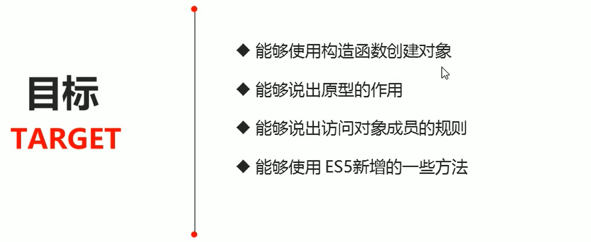

## 目录

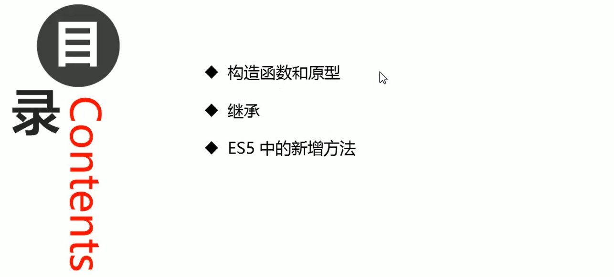

## 构造函数和原型

### 概述

在典型的OOP的语言中（如Java），都存在类的概念，**类就是对象的模板，对象就是类的实例**，但在**ES6之前**JS中并没用引入类的概念。

ES6，全称ECMAScript 6.0，**2015年6月发布**。但是目前浏览器的Javascript是ES5版本，大多数高版本的浏览器也支持ES6，不过只**实现了ES6的部分特性和功能**。

在ES6之前，**对象不是基于类创建的**，而是用一种称为**构造函数**的**特殊函数**来定义对象和它们的特征。

创建对象可以通过以下三种方式：

**1.new Object()**

**2.对象字面量**

**3.自定义构造函数**

~~~javascript
<!DOCTYPE html>
<html lang="en">

<head>
    <meta charset="UTF-8">
    <meta name="viewport" content="width=device-width, initial-scale=1.0">
    <meta http-equiv="X-UA-Compatible" content="ie=edge">
    <title>Document</title>
</head>

<body>
    
</body>

</html>
~~~

### 构造函数

**构造函数**是一种特殊的函数，主要用来**初始化对象**，即为对象**成员变量**赋初始值，它总与new一起使用。我们可以把对象中一些公共的属性和方法抽取出来，然后封装到这个函数里面。

在JS中，使用构造函数时要注意以下两点：

* 构造函数用于创建某一类对象，其**首字母要大写(约定速成，利于辨认)**
* 构造函数要**和new一起使用**才有意义(**new让普通函数升华为构造函数**)

**new在执行时会做四件事情**：

①在内存中创建一个新的空对象。

②**让this指向这个新的对象**。

③**执行构造函数里面的代码**，给这个**新对象**添加属性和方法。

④返回这个新对象（所以**构造函数里面不需要return**）。

### 静态成员和实例成员

Javascript的构造函数中可以添加一些成员，可以在**构造函数本身**上添加，也可以在**构造函数内部的this**上添加。通过这两种方式添加的成员，就分别称为**静态成员**和**实例成员**。

* **静态成员**：在**构造函数本身**上添加的成员称为**静态成员**，**只能由构造函数本身来访问**
* **实例成员**：在**构造函数内部**创建的对象成员称为**实例成员**，**只能由实例化的对象来访问**

~~~javascript
<!DOCTYPE html>
<html lang="en">

<head>
    <meta charset="UTF-8">
    <meta name="viewport" content="width=device-width, initial-scale=1.0">
    <meta http-equiv="X-UA-Compatible" content="ie=edge">
    <title>Document</title>
</head>

<body>
    
</body>

</html>
~~~

### 构造函数的问题

构造函数方法很好用，但是存在**浪费内存**的问题。

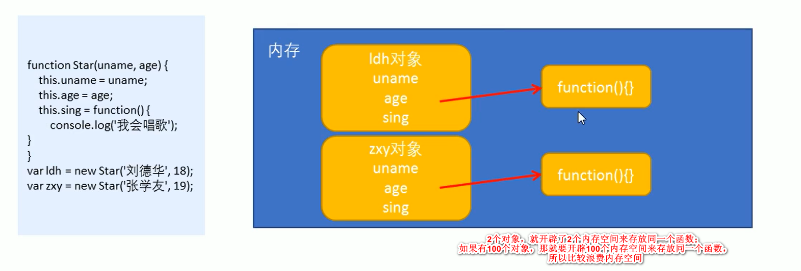

~~~javascript
<!DOCTYPE html>
<html lang="en">
<head>
    <meta charset="UTF-8">
    <meta name="viewport" content="width=device-width, initial-scale=1.0">
    <meta http-equiv="X-UA-Compatible" content="ie=edge">
    <title>Document</title>
</head>

<body>
    
</body>

</html>
~~~

### 构造函数原型prototype

在构造函数上**直接定义**的方法(函数)是**不共享**的，而构造函数**通过原型分配**的函数是所有对象所**共享**的。

JavaScript规定，**每一个构造函数都有一个prototype属性(这个属性也是一个对象)**，**指向另一个对象**。注意**这个prototype就是一个对象**(**prototype既是属性，也是对象**)，这个对象(指prototype)的**所有属性和方法**，都会**被构造函数所拥有**。

> 其实不止构造函数有prototype属性(这个属性也是对象)，普通函数也有，更进一步的说，对象也有prototype属性。(我按F12输入`console.log(Object.prototype)会有东西显示出来。`)

**我们可以把那些不变的方法，直接定义在prototype对象(属性)上，这样所有对象的实例就可以共享这些方法。**

~~~javascript
<!DOCTYPE html>
<html lang="en">

<head>
    <meta charset="UTF-8">
    <meta name="viewport" content="width=device-width, initial-scale=1.0">
    <meta http-equiv="X-UA-Compatible" content="ie=edge">
    <title>Document</title>
</head>

<body>
    
</body>

</html>
~~~

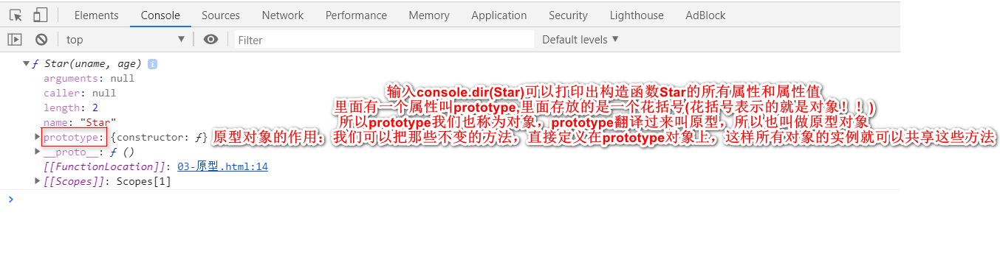

问答？

* 原型是什么？
  * 一个对象，我们也称prototype为**原型对象**

* 原型的作用是什么？
  * **共享方法**

> 我的个亲娘啊！刘晓强(Pink)老师的课真的是通俗易懂啊，我今天总算是搞明白了到底他娘的什么是原型了，我之前在网上找了好多资料，各种图表，各种解释，给我绕的啊，脑子里全是浆糊，今天，2020年8月24日，我总算是搞明白了啊！现在看来，原型这个概念其实也挺好理解的，也不明白自己之前为什么搞了那么久，还一直没有搞明白。那么，之前困扰我的其他的一些概念，我也开始慢慢有信心理解了。JavaScript要开始收尾了啊，等把JavaScript高级和ES6学完以后，我必须要开始学习Vue和Node.js了。
>
> 现在是2020年12月03日，好久没有看有关知识了，现在又开始有些模糊了。

### 总结一下

**ES6之前**，我们面向对象是通过构造函数来实现的，但是**构造函数有一个缺点**，**我们以前把我们的方法放到构造函数里面**，这样就会有一个问题，当我们创建实例的时候，每创建一个实例，都会为我们这个方法单独开辟一个内存空间，来存放同一个函数，这样就比较**浪费内存**，这个时候我们想到了一个**解决方案**，我们**把这些公共的方法定义到了构造函数的原型对象身上，这样就可以实现了我们这个方法的共享，所有的实例都可以使用这个方法了**。

**原型是一个对象，每一个构造函数系统都为我们定义好了这一个对象，那么原型对象的主要作用就是实现了我们方法的共享，不必再开辟内存空间，所有的实例都可以使用这个方法，这就是原型最伟大的地方了**。

### 对象原型	`__proto__`	

可能有些同学还会有一些疑惑：老师呀，**我们sing这个方法是定义给了Star这个构造函数的原型对象身上，为什么我刘德华(ldh)这个对象就可以使用这个方法呢？那刘德华身上也没有sing这个方法呀！**要想解决这个问题，就是接下来我要给你们讲的：在我们**实例对象**身上，**也有一个原型**，叫做`__proto__`,那么**这个属性指向了构造函数的prototype原型对象**。

**对象**都会有一个属性`__proto__`**指向构造函数的prototype原型对象**，之所以我们对象可以使用构造函数prototype原型对象的属性和方法，就是因为对象有`__proto__`原型的存在。

* `__proto__`**对象原型**和**原型对象**prototype是等价的
* `__proto__`对象原型的意义就在于为对象的查找机制提供一个方向，或者说一条路线，但是它是一个**非标准属性**，因此**实际开发**中，不可以使用这个属性，它只是**内部指向原型对象prototype**。

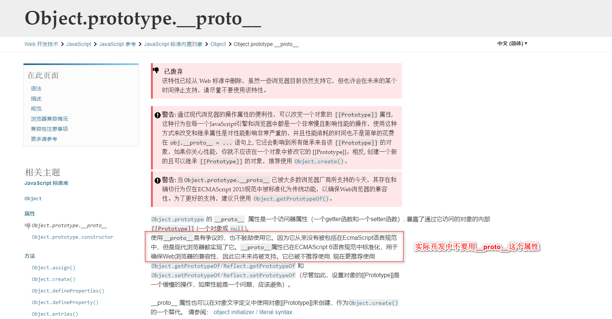

~~~javascript
<!DOCTYPE html>
<html lang="en">

<head>
    <meta charset="UTF-8">
    <meta name="viewport" content="width=device-width, initial-scale=1.0">
    <meta http-equiv="X-UA-Compatible" content="ie=edge">
    <title>Document</title>
</head>

<body>
    
</body>

</html>
~~~

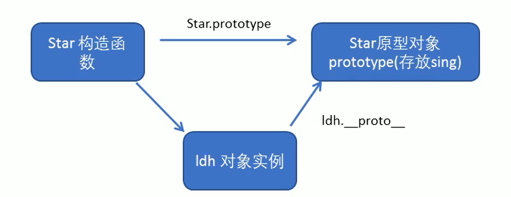

> 为了方便区分，我们把**prototype称为原型对象**，`__proto__`称为**对象原型**，不要搞晕了啊。

### constructor构造函数

[JavaScript中constructor属性](https://segmentfault.com/a/1190000013245739)

对象原型（`__proto__`）和构造函数**原型对象**（prototype）里面**都有**一个属性**constructor属性**，**constructor我们称为构造函数**，因为它**指回构造函数本身**。

constructor主要用于**记录该对象引用于哪个构造函数**，**它可以让原型对象重新指向原来的构造函数**。

> 作用1：记录该对象引用于哪个构造函数(找谁是它的妈)
>
> 作用2：让原型对象**重新指向**原来的构造函数

~~~javascript
<!DOCTYPE html>
<html lang="en">

<head>
    <meta charset="UTF-8">
    <meta name="viewport" content="width=device-width, initial-scale=1.0">
    <meta http-equiv="X-UA-Compatible" content="ie=edge">
    <title>Document</title>
</head>

<body>
    
</body>

</html>
~~~

### 构造函数、实例、原型对象三者之间的关系

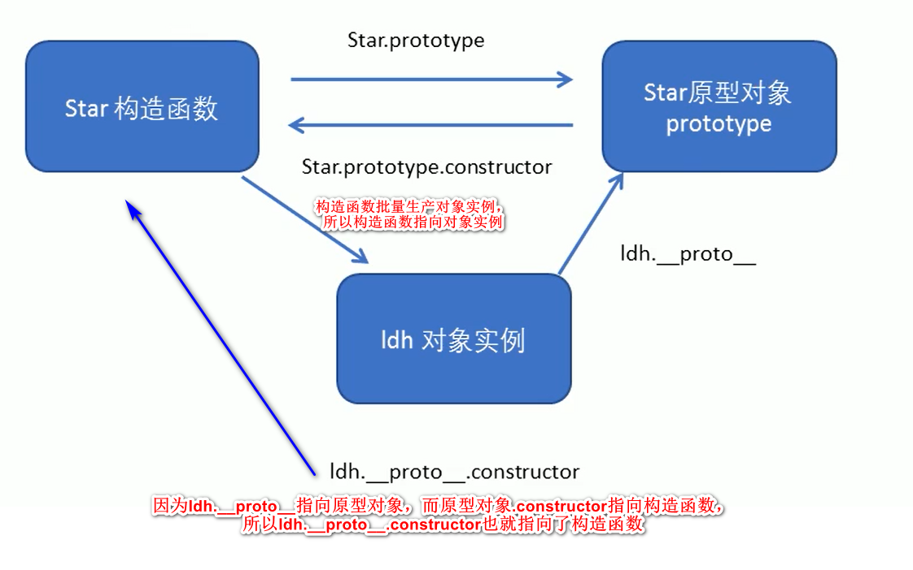

### 原型链

**原型对象**也是对象，**只要是对象，就有原型**(`__proto__`,这个原型指向的是**它的构造函数的prototype原型对象**)

~~~javascript
<!DOCTYPE html>
<html lang="en">

<head>
    <meta charset="UTF-8">
    <meta name="viewport" content="width=device-width, initial-scale=1.0">
    <meta http-equiv="X-UA-Compatible" content="ie=edge">
    <title>Document</title>
</head>

<body>
    
</body>

</html>
~~~

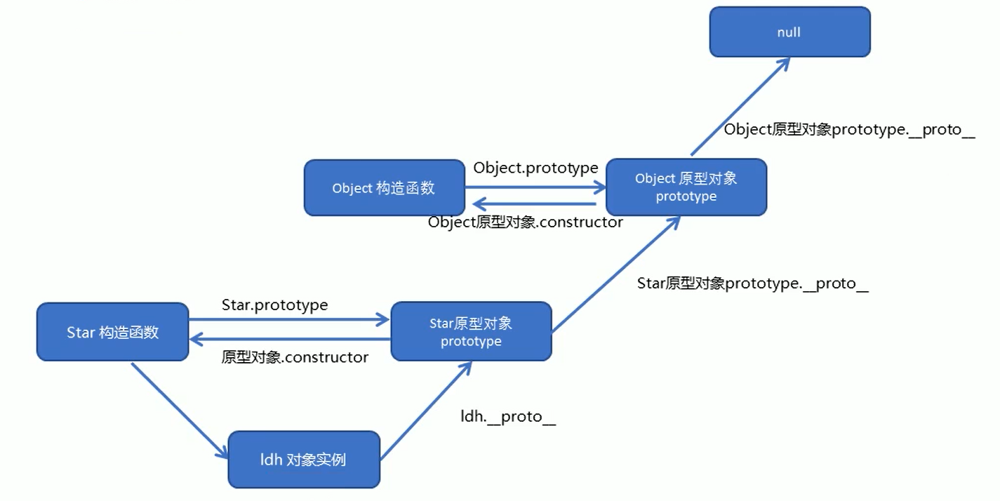

### JavaScript的成员查找机制（规则）

①当**访问一个对象的属性（包括方法）时**，首先查找这个**对象自身**有没有该属性。

②如果没有就查找它的原型（也就是`__proto__`指向的**prototype原型对象**）。

③如果还没有就查找**原型对象**的原型（**Object的原型对象**）。

④依此类推一直找到Object为止（null）。

~~~javascript
<!DOCTYPE html>
<html lang="en">

<head>
    <meta charset="UTF-8">
    <meta name="viewport" content="width=device-width, initial-scale=1.0">
    <meta http-equiv="X-UA-Compatible" content="ie=edge">
    <title>Document</title>
</head>

<body>
    
</body>

</html>
~~~

### 原型对象this指向

~~~javascript
<!DOCTYPE html>
<html lang="en">

<head>
    <meta charset="UTF-8">
    <meta name="viewport" content="width=device-width, initial-scale=1.0">
    <meta http-equiv="X-UA-Compatible" content="ie=edge">
    <title>Document</title>
</head>

<body>
    
</body>

</html>
~~~

### 扩展内置对象

可以通过原型对象，对原来的内置对象进行扩展自定义的方法。比如给数组增加自定义求偶数和的功能。

注意：数组和字符串内置对象不能给原型对象覆盖操作`Array.prototype = {}`，只能是`Array.prototype.xxx= function(){}`的方式。

~~~javascript
<!DOCTYPE html>
<html lang="en">

<head>
    <meta charset="UTF-8">
    <meta name="viewport" content="width=device-width, initial-scale=1.0">
    <meta http-equiv="X-UA-Compatible" content="ie=edge">
    <title>Document</title>
</head>

<body>
    
</body>

</html>
~~~

> 2021年2月26日复习完构造函数和原型，并且将其摘抄，以后要背诵。

## 继承

ES6之前并没有给我们提供extends继承。我们可以通过**构造函数+原型对象**模拟实现继承，被称为**组合继承**。

### call()方法

[快速理解JavaScript中apply()和call()的用法和用途](https://segmentfault.com/a/1190000004581945)

[如何理解和熟练运用 JS 中的 call 及 apply？](<https://www.zhihu.com/question/20289071/answer/14644278>)

[JavaScript 中 call()、apply()、bind() 的用法](<https://www.runoob.com/w3cnote/js-call-apply-bind.html>)

本身不难理解，看下MDN就知道了，但是不常用，遇到了，还要脑回路回转下。或者时间长了，还是要确定下去看下文档，为了方便记忆：

猫吃鱼，狗吃肉，奥特曼打小怪兽。

有天狗想吃鱼了

猫.吃鱼.call(狗，鱼)

狗就吃到鱼了

猫成精了，想打怪兽

奥特曼.打小怪兽.call(猫，小怪兽)

就这样记住了。

* 作用1：调用这个函数
* 作用2：修改函数运行时的this指向

~~~javascript
fun.call(thisArg, arg1, arg2,...)
~~~

* thisArg：当前调用函数this的指向对象
* arg1，arg2：传递的其他参数

~~~javascript
<!DOCTYPE html>
<html lang="en">

<head>
    <meta charset="UTF-8">
    <meta name="viewport" content="width=device-width, initial-scale=1.0">
    <meta http-equiv="X-UA-Compatible" content="ie=edge">
    <title>Document</title>
</head>

<body>
    
</body>

</html>
~~~

### 借用构造函数继承父类型属性

核心原理：通过call()把父类型的this指向子类型的this，这样就可以实现子类型继承父类型的属性。

~~~javascript
<!DOCTYPE html>
<html lang="en">

<head>
    <meta charset="UTF-8">
    <meta name="viewport" content="width=device-width, initial-scale=1.0">
    <meta http-equiv="X-UA-Compatible" content="ie=edge">
    <title>Document</title>
</head>

<body>
    
</body>

</html>
~~~

### 借用原型对象继承父类型方法

~~~javascript
<!DOCTYPE html>
<html lang="en">

<head>
    <meta charset="UTF-8">
    <meta name="viewport" content="width=device-width, initial-scale=1.0">
    <meta http-equiv="X-UA-Compatible" content="ie=edge">
    <title>Document</title>
</head>

<body>
    
</body>

</html>
~~~

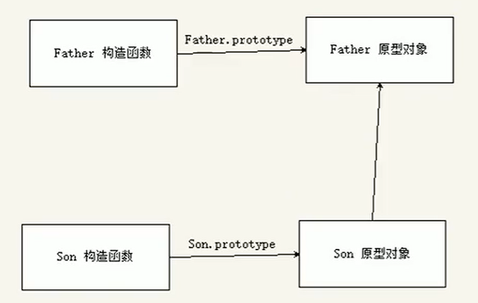

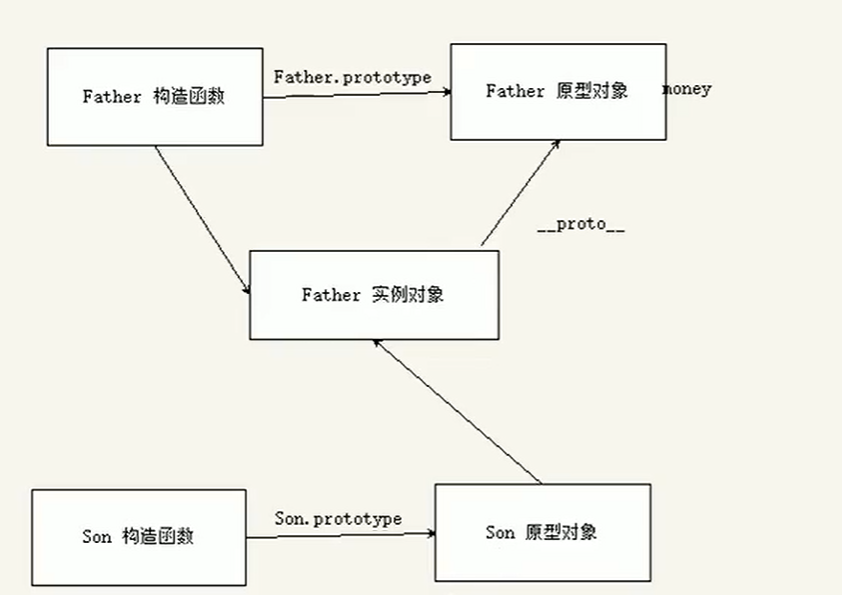

## ES5中的新增方法

ES5中给我们新增了一些方法，可以很方便的操作数组或者字符串，这些方法主要包括：

* 数组方法
* 字符串方法
* 对象方法

### 数组方法

迭代(遍历)方法：`forEach()、map()、filter()、some()、every()`;

> map()方法和every()方法自行学习，老师没有说

#### forEach()方法

~~~javascript
array.forEach (function (currentvalue, index, arr))
~~~

* currentValue：数组当前项的值
* index：数组当前项的索引
* arr：数组对象本身

~~~javascript
<!DOCTYPE html>
<html lang="en">

<head>
    <meta charset="UTF-8">
    <meta name="viewport" content="width=device-width, initial-scale=1.0">
    <meta http-equiv="X-UA-Compatible" content="ie=edge">
    <title>Document</title>
</head>

<body>
    
</body>

</html>
~~~

#### filter()方法

~~~javascript
array.filter (function (currentvalue, index, arr){})
~~~

* filter()方法创建一个新的数组，新数组中的元素是通过检查指定数组中符合条件的所有元素，主要用于**筛选数组**
* **注意它直接返回一个新数组**
* currentValue：数组当前项的值
* index：数组当前项的索引
* arr：数组对象本身

~~~javascript
<!DOCTYPE html>
<html lang="en">

<head>
    <meta charset="UTF-8">
    <title>Document</title>
</head>

<body>
    
</body>

</html>
~~~

> *  filter第一个参数就是一个函数
> * 而这个函数的第一个参数则表示数组当前项的值，第一次是12，第二次是66，所以一共会回调6次 
> * filter中的回调函数有一个要求：必须返回一个布尔值(true或false)
>   * true:当返回true时，函数内部会自动将这次回调的value加入到新的数组中去
>   * false:当返回false时，函数内部会过滤掉这次的value(不再使用这个value了，过滤掉了)

#### some()方法

~~~javascript
array.some (function (currentvalue, index, arr){})
~~~

* some()方法用于检测数组中的元素是否满足指定条件，通俗点查找数组中是否有满足条件的元素
* 注意它**返回值是布尔值**，如果查找到这个元素，就返回true，如果查找不到就返回false
* 如果找到**第一个**满足条件的元素，则**终止循环**不再继续查找(效率更高)
* currentValue：数组当前项的值
* index：数组当前项的索引
* arr：数组对象本身

~~~javascript
<!DOCTYPE html>
<html lang="en">

<head>
    <meta charset="UTF-8">
    <title>Document</title>
</head>

<body>
    
</body>

</html>
~~~

#### 小贴士：forEach与some的区别

[javascript中return，return true,return false三者的用法及区别](<https://www.jb51.net/article/74959.htm>)

~~~html
<!DOCTYPE html>
<html lang="en">

<head>
    <meta charset="UTF-8">
    <meta name="viewport" content="width=device-width, initial-scale=1.0">
    <meta http-equiv="X-UA-Compatible" content="ie=edge">
    <title>Document</title>
</head>

<body>
    
</body>

</html>
~~~

### 查询商品案例

* 把数据渲染到页面中
* 根据价格显示数据
* 根据商品名称显示数据

#### 最终效果

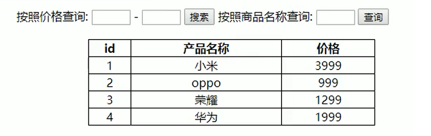

#### 最终代码

~~~html
<!DOCTYPE html>
<html lang="en">

<head>
    <meta charset="UTF-8">
    <meta name="viewport" content="width=device-width, initial-scale=1.0">
    <meta http-equiv="X-UA-Compatible" content="ie=edge">
    <title>Document</title>
    
</head>

<body>
    

        按照价格查询: <input type="text" class="start"> - <input type="text" class="end"> <button class="search-price">搜索</button> 按照商品名称查询: <input type="text" class="product"> <button class="search-pro">查询</button>
    

    <table>
        <thead>
            <tr>
                <th>id</th>
                <th>产品名称</th>
                <th>价格</th>
            </tr>
        </thead>
        <tbody>

        </tbody>
    </table>
    
</body>

</html>
~~~

### 字符串方法

trim()方法会从一个字符串的两端(字符串的左边和右边)删除空白字符。

~~~javascript
str.trim();
~~~

trim()方法并不影响原字符串本身，它返回的是一个**新的字符串**。

~~~html
<!DOCTYPE html>
<html lang="en">

<head>
    <meta charset="UTF-8">
    <meta name="viewport" content="width=device-width, initial-scale=1.0">
    <meta http-equiv="X-UA-Compatible" content="ie=edge">
    <title>Document</title>
</head>

<body>
    <input type="text"> <button>点击</button>
    

    
</body>

</html>
~~~

### 对象方法

#### Object.keys()方法

用于获取对象自身所有的属性。

~~~javascript
Object.keys(obj)
~~~

* ​	效果类似`for...in`
* 返回一个由属性名组成的数组

~~~html
<!DOCTYPE html>
<html lang="en">

<head>
    <meta charset="UTF-8">
    <meta name="viewport" content="width=device-width, initial-scale=1.0">
    <meta http-equiv="X-UA-Compatible" content="ie=edge">
    <title>Document</title>
</head>

<body>
    
</body>

</html>
~~~

#### Object.defineProperty方法

用于定义对象中新属性或修改原有的属性。

~~~html
Object.defineProperty (obj, prop, descriptor)
~~~

* obj：必需。需要修改属性的目标对象
* prop：必需。需定义或修改的属性的**名字**(名字是字符串，要加引号)
* descriptor：必需。目标属性所拥有的特性
  * value：设置属性的值，默认为undefined
  *  writable：值是否可以重写。true | false，默认为false 
  * enumerable：**目标属性**是否可以被枚举。true | false，默认为false
  *  configurable：目标属性是否可以**被删除**或是否可以再次**修改**特性。true | false，默认为false

> Object.definePropertyo第三个参数descriptor说明：以**对象形式{}**书写

~~~html
<!DOCTYPE html>
<html lang="en">

<head>
    <meta charset="UTF-8">
    <meta name="viewport" content="width=device-width, initial-scale=1.0">
    <meta http-equiv="X-UA-Compatible" content="ie=edge">
    <title>Document</title>
</head>

<body>
    
</body>

</html>
~~~

# 函数进阶

## 目标

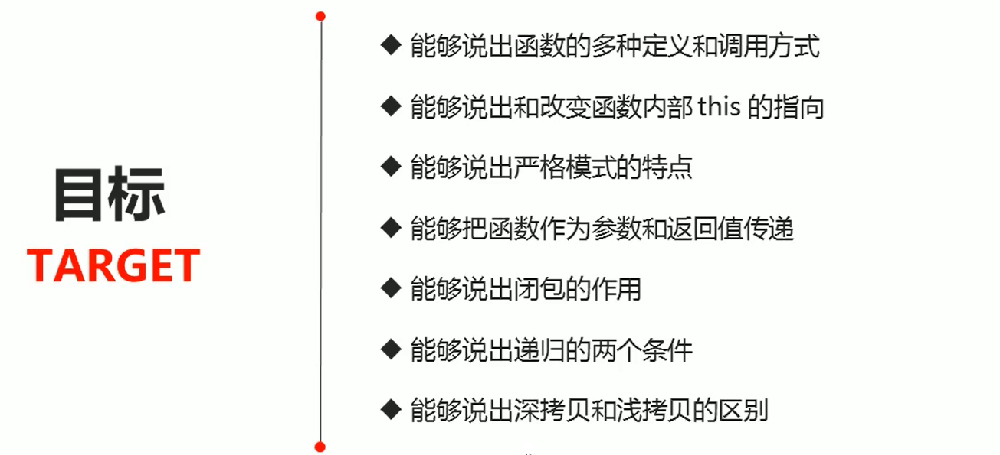

## 目录

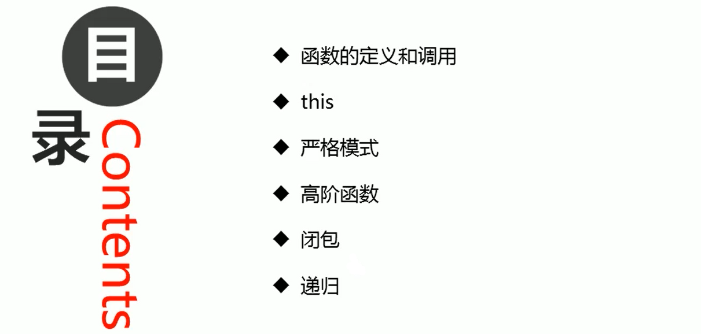

## 函数的定义和调用

> 函数首先要定义，之后再调用。
>
> 先创造人类，再让人类工作。

### 函数定义的方式

* 函数声明方式function关键字（命名函数）

* 函数表达式（匿名函数）

* new Function()

  ~~~html
  var fn = new Function('参数1','参数2',....,'函数体');
  ~~~

  > 注意1：Function里面参数都必须是字符串格式
  >
  > 注意2：第三种方式执行效率低，也不方便书写，因此较少使用
  >
  > 注意3：所有函数都是Function的实例（对象）
  >
  > 注意4：函数也属于对象

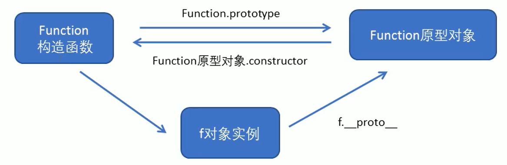

~~~html
<!DOCTYPE html>
<html lang="en">

<head>
    <meta charset="UTF-8">
    <meta name="viewport" content="width=device-width, initial-scale=1.0">
    <meta http-equiv="X-UA-Compatible" content="ie=edge">
    <title>Document</title>
</head>

<body>
    
</body>

</html>
~~~

### 函数调用的方式

我们目前为止一共学了以下6种函数：

* 普通函数
* 对象的方法
* 构造函数
* 绑定事件函数
* 定时器函数
* 立即执行函数

~~~html
<!DOCTYPE html>
<html lang="en">

<head>
    <meta charset="UTF-8">
    <meta name="viewport" content="width=device-width, initial-scale=1.0">
    <meta http-equiv="X-UA-Compatible" content="ie=edge">
    <title>Document</title>
</head>

<body>
    
</body>

</html>
~~~

## 函数内this的指向

这些this的指向，是当我们**调用函数**的时候确定的。**调用方式的不同**决定了this的指向不同。

> 定义函数VS 调用函数 ，这是2个不同的阶段，先定义，再调用。

**一般**指向我们的调用者。

> 具体的内容可以看一下《你不知道的JavaScript》上卷，但是我没怎么看懂，有时间要再看一下。

| 调用方式     | this指向                                   |
| ------------ | ------------------------------------------ |
| 普通函数调用 | window                                     |
| 构造函数调用 | 实例对象(原型对象里面的方法也指向实例对象) |
| 对象方法调用 | 该方法所属对象                             |
| 事件绑定方法 | 绑定事件对象                               |
| 定时器函数   | window                                     |
| 立即执行函数 | window                                     |

~~~html
<!DOCTYPE html>
<html lang="en">

<head>
    <meta charset="UTF-8">
    <meta name="viewport" content="width=device-width, initial-scale=1.0">
    <meta http-equiv="X-UA-Compatible" content="ie=edge">
    <title>Document</title>
</head>

<body>
    <button>点击</button>
    
</body>

</html>
~~~

### 改变函数内部this的指向

JavaScript为我们专门提供了一些函数方法来帮我们更优雅的处理函数内部this的指向问题，常用的有`bind()`、`call()`、`apply()`三种方法。

#### `call()`方法

> `call()`方法在实际开发中最主要的应用就是实现继承。

`call()`方法**调用**一个**对象**。简单理解为**调用函数的方式**，但是**它可以改变函数的this指向**。

~~~javascript
fun.cal1 (thisArg,argl,arg2,....)
~~~
* `thisArg`：当前调用函数this的指向对象
* `arg1，arg2`：传递的其他参数

~~~html
<!DOCTYPE html>
<html lang="en">

<head>
    <meta charset="UTF-8">
    <meta name="viewport" content="width=device-width, initial-scale=1.0">
    <meta http-equiv="X-UA-Compatible" content="ie=edge">
    <title>Document</title>
</head>

<body>

</body>

</html>
~~~

#### apply()方法

apply0方法**调用**一个函数。简单理解为调用函数的方式，但是它可以改变函数的this指向。

~~~javascript
fun.apply(thisArg, [argsArray])
~~~

* thisArg：在fun函数运行时描定的this值
* argsArray：传递的值，必须包含在**数组**里面(必须要是数组形式！！！)
* 返回值就是函数的返回值，因为它就是调用函数

~~~html
<!DOCTYPE html>
<html lang="en">

<head>
    <meta charset="UTF-8">
    <meta name="viewport" content="width=device-width, initial-scale=1.0">
    <meta http-equiv="X-UA-Compatible" content="ie=edge">
    <title>Document</title>
</head>

<body>
    
</body>

</html>
~~~

#### `bind()`方法

> bind()方法在实际开发中其实是用的最多的。

bind()方法不会调用函数。但是能改变函数内部this指向。

~~~html
fun.bind(thisArg,argl,arg2,...)
~~~

* thisArg：在fun函数运行时指定的this值
* arg1，arg2：传递的其他参数
* 返回由指定的this值和初始化参数改造的**原函数拷贝**

~~~html
<!DOCTYPE html>
<html lang="en">

<head>
    <meta charset="UTF-8">
    <meta name="viewport" content="width=device-width, initial-scale=1.0">
    <meta http-equiv="X-UA-Compatible" content="ie=edge">
    <title>Document</title>
</head>

<body>
    <button>点击</button>
    <button>点击</button>
    <button>点击</button>
    
</body>

</html>
~~~

#### call、apply、bind总结

**相同点：**

都可以改变函数内部的this指向。

**不同点：**

* call和apply会**调用函数**，并且改变函数内部this指向
* call和apply**传递的参数不一样**，call传递参数aru1，aru2...形式，而apply**必须数组形式[arg]**
* bind不会调用函数，但可以改变函数内部this指向

**主要应用场景**

* call经常做继承
* apply经常跟数组有关系，比如借助于数学对象实现数组最大值最小值
* bind不调用函数，但是还想改变this指向，比如改变定时器内部的this指向

## 严格模式

JavaScript除了提供正常模式外，还提供了**严格模式（strict mode）**。ES5的严格模式是采用具有限制性JavaScript变体的一种方式，即在**严格的条件下**运行JS代码。

严格模式在**IE10以上**版本的浏览器中才会被支持，旧版本浏览器中会被忽略。

 严格模式对正常的JavaScript语义做了一些更改：

* 消除了Javascript语法的一些不合理、不严谨之处，减少了一些怪异行为。
* 消除代码运行的一些不安全之处，保证代码运行的安全。
* 提高编译器效率，增加运行速度。
* 禁用了在ECMAScript的未来版本中可能会定义的一些语法，为未来新版本的Javascript做好铺垫。比如一些保留字如：class，enum，export，extends，import，super 不能做变量名

### 开启严格模式

严格模式可以应用到整个脚本或个别函数中。因此在使用时，我们可以将严格模式分为**为脚本开启**严格模式和**为函数开启**严格模式两种情况。

#### 为脚本开启严格模式

为整个脚本文件开启严格模式，需要在所有语句之前放一个特定语句`"use strict";`（或`'use strict';`）

~~~html

~~~

> 因为"use strict"加了引号，所以老版本的浏览器会把它当作一行普通字符串而忽略。

有的script基本是严格模式，有的script脚本是正常模式，这样**不利于文件合并**，所以可以将整个脚本文件放在一个**立即执行的匿名函数之中**。这样**独立创建一个作用域**而不影响其他script脚本文件。

~~~html
 
~~~

#### 为函数开启严格模式

要给某个函数开启严格模式，需要把`"use strict";`（或`'use strict;`）声明放在**函数体所有语句之前**。

~~~html
<!DOCTYPE html>
<html lang="en">

<head>
    <meta charset="UTF-8">
    <meta name="viewport" content="width=device-width, initial-scale=1.0">
    <meta http-equiv="X-UA-Compatible" content="ie=edge">
    <title>Document</title>
</head>

<body>
    <!-- 为整个脚本(script标签)开启严格模式 -->
    

    

    <!-- 为某个函数开启严格模式 -->
    
</body>

</html>
~~~

## 高阶函数

高阶函数是对其他函数进行操作的函数，它**接收函数作为参数**或**将函数作为返回值输出**。

> 接收函数作为参数

~~~html

~~~

> 将函数作为返回值输出

~~~javascript

~~~

此时fn就是一个高阶函数。

函数也是一种数据类型，同样可以作为参数，传递给另外一个参数使用。最典型的就是作为回调函数。

~~~html
<!DOCTYPE html>
<html lang="en">

<head>
    <meta charset="UTF-8">
    <meta name="viewport" content="width=device-width, initial-scale=1.0">
    <meta http-equiv="X-UA-Compatible" content="ie=edge">
    <title>Document</title>
    
    
</head>

<body>
    

    
</body>

</html>
~~~

## 闭包

[闭包](https://developer.mozilla.org/zh-CN/docs/Web/JavaScript/Closures)

[学习Javascript闭包（Closure）](https://www.ruanyifeng.com/blog/2009/08/learning_javascript_closures.html)

[闭包MDN](https://developer.mozilla.org/zh-CN/docs/Web/JavaScript/Closures)

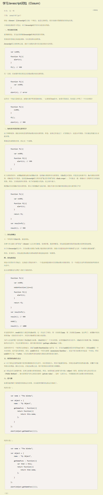

### 变量作用域

变量根据作用域的不同分为两种：**全局变量**和**局部变量**。

* 函数内部可以使用全局变量
* 函数外部不可以使用局部变量
* 当函数执行完毕，本作用域内的局部变量会销毁

### 什么是闭包

**闭包（closure）**指有权**访问**另一个函数作用域中**变量**的**函数**。——《JavaScript高级程序设计》

> 闭包是函数。

简单理解就是，**一个作用域可以访问另外一个函数内部的局部变量**。

~~~html
<!DOCTYPE html>
<html lang="en">

<head>
    <meta charset="UTF-8">
    <meta name="viewport" content="width=device-width, initial-scale=1.0">
    <meta http-equiv="X-UA-Compatible" content="ie=edge">
    <title>Document</title>
</head>

<body>
    
</body>

</html>
~~~

### 闭包的作用

~~~html
<!DOCTYPE html>
<html lang="en">

<head>
    <meta charset="UTF-8">
    <meta name="viewport" content="width=device-width, initial-scale=1.0">
    <meta http-equiv="X-UA-Compatible" content="ie=edge">
    <title>Document</title>
</head>

<body>
    
</body>

</html>
~~~

### 闭包案例(应用)

#### 循环注册点击事件

~~~html
<!DOCTYPE html>
<html lang="en">

<head>
    <meta charset="UTF-8">
    <meta name="viewport" content="width=device-width, initial-scale=1.0">
    <meta http-equiv="X-UA-Compatible" content="ie=edge">
    <title>Document</title>
</head>

<body>
    <ul class="nav">
        <li>榴莲</li>
        <li>臭豆腐</li>
        <li>鲱鱼罐头</li>
        <li>大猪蹄子</li>
    </ul>
    
</body>

</html>
~~~

#### 定时器中的闭包

~~~html
<!DOCTYPE html>
<html lang="en">

<head>
    <meta charset="UTF-8">
    <meta name="viewport" content="width=device-width, initial-scale=1.0">
    <meta http-equiv="X-UA-Compatible" content="ie=edge">
    <title>Document</title>
</head>

<body>
    <ul class="nav">
        <li>榴莲</li>
        <li>臭豆腐</li>
        <li>鲱鱼罐头</li>
        <li>大猪蹄子</li>
    </ul>
    
</body>

</html>
~~~

#### 打车价格

~~~html
<!DOCTYPE html>
<html lang="en">

<head>
    <meta charset="UTF-8">
    <meta name="viewport" content="width=device-width, initial-scale=1.0">
    <meta http-equiv="X-UA-Compatible" content="ie=edge">
    <title>Document</title>

</head>

<body>
    
</body>

</html>
~~~

### 思考题

~~~html
<!DOCTYPE html>
<html lang="en">

<head>
    <meta charset="UTF-8">
    <meta name="viewport" content="width=device-width, initial-scale=1.0">
    <meta http-equiv="X-UA-Compatible" content="ie=edge">
    <title>Document</title>
</head>

<body>
    
</body>

</html>
~~~

### 闭包总结

* 闭包是什么

闭包是一个函数（一个作用域可以访问另外一个函数的局部变量）

* 闭包的作用是什么

延伸变量的作用范围

## 递归

### 什么是递归

如果一个函数**在内部可以调用其本身**，那么这个函数就是**递归函数**。

简单理解：函数内部自己调用自己这个函数就是递归函数。

递归函数的作用和循环效果一样。

由于递归很容易发生“栈溢出"错误（stackoverflow），所以必须要**加退出条件return**。

~~~html
<!DOCTYPE html>
<html lang="en">

<head>
    <meta charset="UTF-8">
    <meta name="viewport" content="width=device-width, initial-scale=1.0">
    <meta http-equiv="X-UA-Compatible" content="ie=edge">
    <title>Document</title>
</head>

<body>
    
</body>
</html>
~~~

### 利用递归求数学题之阶乘

~~~javascript
<!DOCTYPE html>
<html lang="en">

<head>
    <meta charset="UTF-8">
    <meta name="viewport" content="width=device-width, initial-scale=1.0">
    <meta http-equiv="X-UA-Compatible" content="ie=edge">
    <title>Document</title>
</head>

<body>
    
</body>

</html>
~~~

### 利用递归求数学题之斐波那契数列

~~~html
<!DOCTYPE html>
<html lang="en">

<head>
    <meta charset="UTF-8">
    <meta name="viewport" content="width=device-width, initial-scale=1.0">
    <meta http-equiv="X-UA-Compatible" content="ie=edge">
    <title>Document</title>
</head>

<body>
    
</body>

</html>
~~~

### 利用id返回对应的数据对象

~~~html
<!DOCTYPE html>
<html lang="en">

<head>
    <meta charset="UTF-8">
    <meta name="viewport" content="width=device-width, initial-scale=1.0">
    <meta http-equiv="X-UA-Compatible" content="ie=edge">
    <title>Document</title>
</head>

<body>
    
</body>

</html>
~~~

### 浅拷贝和深拷贝

* 浅拷贝只是拷贝一层，更深层次对象级别的只拷贝引用
* 深拷贝拷贝多层，每一级别的数据都会拷贝
* `Object.assign（target..sources）`ES6新增方法可以实现**浅拷贝**(注意：只能实现浅拷贝！！！)

#### 浅拷贝

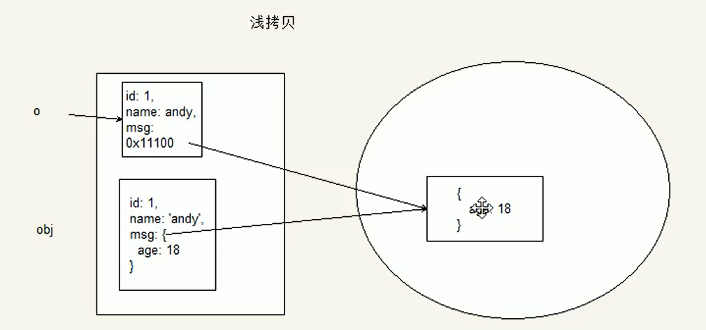

~~~html
<!DOCTYPE html>
<html lang="en">

<head>
    <meta charset="UTF-8">
    <meta name="viewport" content="width=device-width, initial-scale=1.0">
    <meta http-equiv="X-UA-Compatible" content="ie=edge">
    <title>Document</title>
</head>

<body>
    
</body>

</html>
~~~

#### 深拷贝

前面的id和name属于普通数据类型，而msg是一个对象，如果遇到我们这种对象类型的数据，我们就再进入里面，再利用for···in把属性名和属性值再遍历，再进行赋值操作。这个就是它的主要实现思路，类似于遍历数据，用函数递归比较合适。

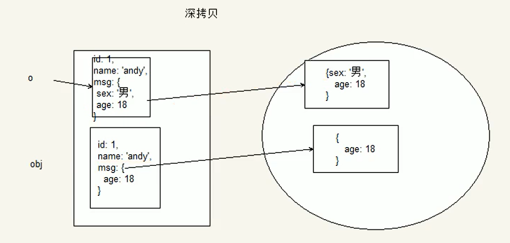

~~~html
<!DOCTYPE html>
<html lang="en">

<head>
    <meta charset="UTF-8">
    <meta name="viewport" content="width=device-width, initial-scale=1.0">
    <meta http-equiv="X-UA-Compatible" content="ie=edge">
    <title>Document</title>
</head>

<body>
    
</body>

</html>
~~~

# 正则表达式

## 目标

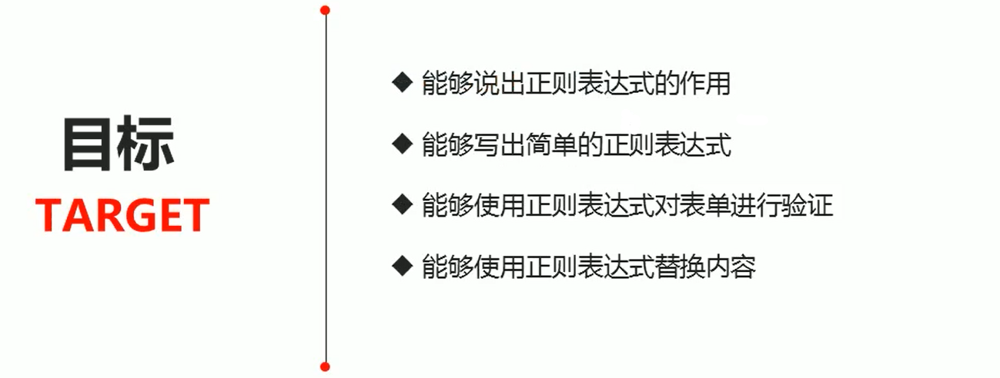

## 目录

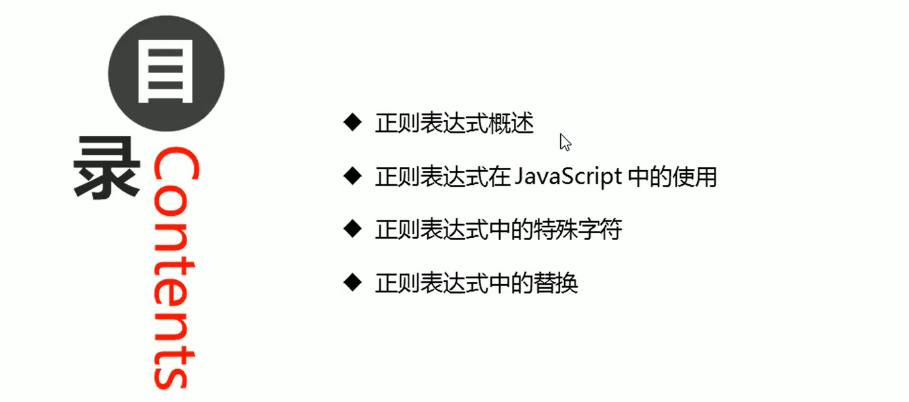

## 正则表达式概述

### 什么是正则表达式

**正则表达式（Regular Expression）**是用于匹配字符串中字符组合的模式。在JavaScript中，**正则表达式也是对象**。

正则表通常被用来检索、替换那些符合某个模式（规则）的文本，例收验证表单：用户名表单只能输入英文字母、数字或者下划线，昵称输入框中可以输入中文（**匹配**），此外，正则表达式还常用于过滤卓页面内容中的一些敏感词（**替换**），或从字符串中获取我们想要的特定部分（**提取**)等。

其他语言也会使用正则表达式，本阶段我们主要是利用JavaScript正则表达式完成**表单验证**。

### 正则表达式的特点

* 灵活性、逻辑性和功能性非常的强
* 可以迅速地用极简单的方式达到字符串的复杂控制
* 对于刚接触的人来说，比较晦涩难懂。比如：`^\w+([-+.]\w+)*@\w+([-.]\w+)*\.\w+([-.]\w+)*s`
* 实际开发，一般都是直接复制写好的正则表达式但是要求会使用正则表达式并且根据实际情况修改正则表达式比如用户名：`/^[a-z0-9_-]{3,16}$/`

## 正则表达式在JavaScript中的使用

### 创建正则表达式

在JavaScript中，可以通过两种方式创建一个正则表达式。

* 通过调用RegExp对象的构造函数创建
* 通过字面量创建

~~~html
<!DOCTYPE html>
<html lang="en">

<head>
    <meta charset="UTF-8">
    <meta name="viewport" content="width=device-width, initial-scale=1.0">
    <meta http-equiv="X-UA-Compatible" content="ie=edge">
    <title>Document</title>
</head>

<body>
    
</body>

</html>
~~~

### 测试正则表达式test

test()正则对象方法，用于检测字符串是否符合该规则，该对象会返回true或false，其参数是测试字符串。

~~~javascript
regexObj.test (str)
~~~

1.regexObj是写的正则表达式

2.str我们要测试的**文本**

3.就是检测str文本是否符合我们写的正则表达式规范

### 正则表达式的组成

一个正则表达式可以由**简单的字符**构成，比如/abc/，**也可以是简单和特殊字符的组合**，比如/ab*c/。其中特殊字符也被称为**元字符**，在正则表达式中是具有**特殊意义**的**专用符号**，如`^、$、+`等。

特殊字符非常多，可以参考：

MDN：https://developer.mozilla.org/zh-CN/docs/Web/JavaScript/Guide/Regular Expressions 

jQuery手册：正则表达式部分

正则测试工具：http://tool.oschina.net/regex

这里我们把元字符划分几类学习。

### 边界符

正则表达式中的边界符（位置符）用来提示字符所处的位置，主要有两个字符。

| 边界符 | 说明                           |
| ------ | ------------------------------ |
| ^      | 表示匹配行首的文本（以谁开始） |
| $      | 表示匹配行尾的文本（以谁结束） |
>  如果^和$在一起，表示必须是精确匹配。

~~~html
<!DOCTYPE html>
<html lang="en">

<head>
    <meta charset="UTF-8">
    <meta name="viewport" content="width=device-width, initial-scale=1.0">
    <meta http-equiv="X-UA-Compatible" content="ie=edge">
    <title>Document</title>
</head>

<body>
    
</body>

</html>
~~~

### 字符类

字符类表示有一系列字符可供选择，只要匹配其中一个就可以了。**所有可供选择的字符都放在方括号内**。

~~~html
<!DOCTYPE html>
<html lang="en">

<head>
    <meta charset="UTF-8">
    <meta name="viewport" content="width=device-width, initial-scale=1.0">
    <meta http-equiv="X-UA-Compatible" content="ie=edge">
    <title>Document</title>
</head>

<body>
    
</body>
</html>
~~~

### 量词符

量词符用来设定某个模式**出现的次数**。

> 量词符可以分为2大组：一组可以通过符号来表示(比较粗略)；一组可以通过花括号来表示(更加精确)

| 量词  | 说明                  |
| ----- | --------------------- |
| *     | 重复零次或更多次(>=0) |
| +     | 重复一次或更多次(>=1) |
| ?     | 重复零次或一次(0或1)  |
| {n}   | 重复n次(n)            |
| {n,}  | 重复n次或更多次(>=n)  |
| {n,m} | 重复n到m次(>=n且<=m)  |

~~~html
<!DOCTYPE html>
<html lang="en">

<head>
    <meta charset="UTF-8">
    <meta name="viewport" content="width=device-width, initial-scale=1.0">
    <meta http-equiv="X-UA-Compatible" content="ie=edge">
    <title>Document</title>
</head>

<body>
    
</body>

</html>
~~~

## 用户名验证

>  功能需求：
>
> 1.如果用户名输入合法，则后面提示信息为：用户名合法，并且颜色为绿色
>
> 2.如果用户名输入不合法则后面提示信息为：用户名不符合规范，并且颜色为绿色

> 分析：
>
> 1.用户名只能为英文字母，数字，下划线或者短横线组成，并且用户名长度为6~16位
>
> 2.首先准备好这种正则表达式模式 /^[a-zA-Z0-9_-]{6,16}$/
>
> 3.当表单失去焦点就开始验证
>
> 4.如果符合正则规范，则让后面的span标签添加right类
>
> 5.如果不符合正则规范，则让后面的span标签添加wrong类

~~~html
<!DOCTYPE html>
<html lang="en">

<head>
    <meta charset="UTF-8">
    <meta name="viewport" content="width=device-width, initial-scale=1.0">
    <meta http-equiv="X-UA-Compatible" content="ie=edge">
    <title>Document</title>
    
</head>

<body>
    <input type="text" class="uname"> 请输入用户名
    
</body>

</html>
~~~

## 括号总结

* 大括号：量词符，里面表示重复次数 
* 中括号：字符集合。匹配方括号中的任意字符
* 小括号：表示优先级

可以在线测试：https://c.runoob.com/

~~~javascript
<!DOCTYPE html>
<html lang="en">

<head>
    <meta charset="UTF-8">
    <meta name="viewport" content="width=device-width, initial-scale=1.0">
    <meta http-equiv="X-UA-Compatible" content="ie=edge">
    <title>Document</title>
</head>

<body>
    
</body>

</html>
~~~

## 预定义类

预定义类指的是**某些常见模式的简写方式**。

| 预定义类 | 说明                                                         |
| -------- | ------------------------------------------------------------ |
| \d       | 匹配0-9之间的任一数字，相当于[0-9]                           |
| \D       | 匹配所有0-9以外的字符，相当于[\^0-9]                         |
| \w       | 匹配任意的字母、数字和下划线，相当于[A-Za-z0-9]              |
| \W       | 除所有字母、数字和下划线以外的字符，相当于[\^A-Za-z0-9]      |
| \s       | **匹配空格**(包括换行符、制表符、空格符等),相当于[\t\r\n\v\f] |
| \S       | 匹配非空格的字符，相当于[\^\t\r\n\v\f]                       |

### 座机号码验证

> 前面3位，后面就是8位。前面4位，后面就是7位。

~~~javascript
<!DOCTYPE html>
<html lang="en">

<head>
    <meta charset="UTF-8">
    <meta name="viewport" content="width=device-width, initial-scale=1.0">
    <meta http-equiv="X-UA-Compatible" content="ie=edge">
    <title>Document</title>
</head>

<body>
    
</body>

</html>
~~~

## 表单验证

**register.html**

~~~html
<!DOCTYPE html>
<html lang="en">

<head>
    <meta charset="UTF-8">
    <title>注册页面</title>
    <!-- 初始化css -->
    <link rel="stylesheet" href="css/base.css">
    <!-- register css文件 -->
    <link rel="stylesheet" href="css/register.css">
    
</head>

<body>
    

        <!-- header -->
        

            

                
            

        

        <!-- registerarea -->
        

            <h3>
                注册新用户
                <em>
					我有账号，去<a href="login.html">登陆</a>
				</em>
            </h3>
            

                <form action="demo.php">
                    <ul>
                        <li>
                            <label for="tel">手机号:</label>
                            <input type="text" class="inp" id="tel">
                            		
						
						
                        </li>
                        <li>
                            <label for="">QQ:</label>
                            <input type="text" class="inp" id="qq">
                            
                        </li>
                        <li>
                            <label for="">昵称:</label>
                            <input type="text" class="inp" id="nc">
                            
                        </li>
                        <li>
                            <label for="">短信验证码:</label>
                            <input type="text" class="inp" id="msg">
                            
                        </li>
                        <li>
                            <label for="">登陆密码:</label>
                            <input type="text" class="inp" id="pwd">
                            
                            
                        </li>
                        <li class="safe">
                            安全程度
                            <em class="ruo">弱</em>
                            <em class="zhong">中</em>
                            <em class="qiang">强</em>
                        </li>

                        <li>
                            <label for="">确认密码:</label>
                            <input type="text" class="inp" id="surepwd">
                            
                        </li>
                        <li class="agree">

                            <input type="checkbox">同意协议并注册
                            <a href="#">《知果果用户协议》</a>
                        </li>
                        <li>
                            <input type="submit" value="完成注册" class="over">
                        </li>
                    </ul>
                </form>

            

        

        

            

                关于我们 | 联系我们 | 联系客服 | 商家入驻 | 营销中心 | 手机品优购 | 友情链接 | 销售联盟 | 品优购社区 | 品优购公益 | English Site | Contact U
            

            

                地址：北京市昌平区建材城西路金燕龙办公楼一层 邮编：100096 电话：400-618-4000 传真：010-82935100 邮箱: zhanghj+itcast.cn   京ICP备08001421号京公网安备110108007702
            

        

    

</body>

</html>
~~~

**register.css**

~~~css
.w {
    width: 1200px;
    margin: auto;
}

.header {
    height: 82px;
    border-bottom: 2px solid #b1191a;
}

.logo {
    padding-top: 15px;
}

.registerarea {
    height: 580px;
    border: 1px solid #ccc;
    margin-top: 20px;
}

.registerarea h3 {
    height: 40px;
    border-bottom: 1px solid #ccc;
    background-color: #ececec;
    padding: 0 10px;
    font-weight: 400;
    line-height: 40px;
    font-size: 18px;
}

.registerarea h3 em {
    float: right;
    font-size: 14px;
}

.registerarea a {
    color: #c81623;
}

.reg_form {
    width: 600px;
    height: 400px;
    margin: 40px auto 0;
}

.reg_form li {
    margin-bottom: 15px;
}

.reg_form label {
    display: inline-block;
    width: 100px;
    height: 36px;
    line-height: 36px;
    text-align: right;
}

.inp {
    width: 238px;
    height: 34px;
    border: 1px solid #ccc;
    margin-left: 10px;
}

.error {
    color: #df3033;
    margin-left: 10px;
}

.error_icon,
.success_icon {
    display: inline-block;
    width: 20px;
    height: 20px;
    background: url(../img/error.png) no-repeat;
    vertical-align: middle;
    margin-top: -2px;
}

.success {
    color: #40b83f;
    margin-left: 10px;
}

.success_icon {
    background-image: url(../img/success.png);
}

.safe {
    padding-left: 187px;
    color: #b2b2b2;
}

.safe em {
    padding: 0 12px;
    color: #fff;
}

.ruo {
    background-color: #de1111;
}

.zhong {
    background-color: #40b83f;
}

.qiang {
    background-color: #f79100;
}

.agree {
    padding-top: 20px;
    padding-left: 100px;
}

.agree input {
    vertical-align: middle;
    margin-right: 5px;
}

.agree a {
    color: #1ba1e6;
}

.over {
    width: 200px;
    height: 34px;
    background-color: #c81623;
    margin: 30px 0 0 130px;
    border: none;
    color: #fff;
    font-size: 14px;
}

.footer {
    height: 120px;
    text-align: center;
}

.links {
    margin-top: 20px;
    height: 30px;
}

.copyright {
    line-height: 20px;
}
~~~

**reg.js**

~~~javascript
window.onload = function() {
    var regtel = /^1[3|4|5|7|8]\d{9}$/; // 手机号码的正则表达式
    var regqq = /^[1-9]\d{4,}$/; // 10000
    var regnc = /^[\u4e00-\u9fa5]{2,8}$/;
    var regmsg = /^\d{6}$/;
    var regpwd = /^[a-zA-Z0-9_-]{6,16}$/;
    var tel = document.querySelector('#tel');
    var qq = document.querySelector('#qq');
    var nc = document.querySelector('#nc');
    var msg = document.querySelector('#msg');
    var pwd = document.querySelector('#pwd');
    var surepwd = document.querySelector('#surepwd');
    regexp(tel, regtel); // 手机号码
    regexp(qq, regqq); // qq号码
    regexp(nc, regnc); // 昵称
    regexp(msg, regmsg); // 短信验证
    regexp(pwd, regpwd); // 密码框
    // 表单验证的函数
    function regexp(ele, reg) {
        ele.onblur = function() {
            if (reg.test(this.value)) {
                // console.log('正确的');
                this.nextElementSibling.className = 'success';
                this.nextElementSibling.innerHTML = '<i class="success_icon"></i> 恭喜您输入正确';
            } else {
                // console.log('不正确');
                this.nextElementSibling.className = 'error';
                this.nextElementSibling.innerHTML = '<i class="error_icon"></i> 格式不正确，请从新输入 ';
            }
        }
    };

    surepwd.onblur = function() {
        if (this.value == pwd.value) {
            this.nextElementSibling.className = 'success';
            this.nextElementSibling.innerHTML = '<i class="success_icon"></i> 恭喜您输入正确';
        } else {
            this.nextElementSibling.className = 'error';
            this.nextElementSibling.innerHTML = '<i class="error_icon"></i> 两次密码输入不一致';

        }
    }

}
~~~

## 正则表达式中的替换

### replace 替换

replace()方法可以实现替换字符串操作，用来替换的参数可以是一个字符串或是一个正则表达式。

~~~javascript
stringObject.replace(regexp/substr,replacement)
~~~

* 第一个参数：被替换的字符串或者正则表达式
* 第二个参数：替换为的字符串
* 返回值是一个替换完毕的新字符串

> replace()方法只能替换第一个满足条件的字符串，后面的就不再替换了，要想全部替换，可以用正则表达式参数。

### 正则表达式参数

~~~javascript
/表达式/[switch]
~~~

switch（也称为修饰符）按照什么样的模式来匹配有三种值：

* g：全局匹配
* i：忽略大小写
* gi：全局匹配和忽略大小写

~~~~javascript
<!DOCTYPE html>
<html lang="en">

<head>
    <meta charset="UTF-8">
    <meta name="viewport" content="width=device-width, initial-scale=1.0">
    <title>Document</title>
</head>

<body>
    <textarea name="message" id="message"></textarea><button>提交</button>
    

    
</body>

</html>
~~~~

