(注1：JavaScript是概念性的语言，对概念理解的深度与否将直接决定着你今后踩坑的数量多少，基础不牢，地动山摇，这些概念如果不彻底理解是无法顺利进行接下去框架的学习的，学框架的时候总归很虚，心里没有底，现在感觉自己遇到了第一个瓶颈，就是对如下的概念始终无法透彻的理解。接下来需要静下心来认认真真的把这些概念一个一个击破了，即使不能达到熟稔于心的地步也要对其有个清晰准确的理解，否则自己肯定是无法找到工作的。（就算侥幸找到了也是到处坑人，不好）)

(注2：现在只是将自己不懂的概念单独罗列，然后从四处找些有关其知识的说明，有些写的我都看不懂（比如原型），但是现阶段还是搜集下来，等以后自己完全理解其概念后再通俗的写个自己对其概念的理解)

(注3：现在是2020年3月25日，两个多月过去了，JavaScript也终于开始复习到这些难懂的概念了，是时候开始深入透彻的理解这些概念了。)

(注4：这些概念肯定是要弄熟的，这是JavaScript的核心。但是自己现在有一个疑惑，现在自己所做的静态页面啊，交互啊什么的，好像都没有用到过比如原型链这些概念，也是自己目前水平有限，所以我就很想知道这些概念做项目到什么程度才能够用的上呢？)

(注5：现在是2020年9月15日，我把这篇博文再看一下，巩固一下，如今今时不同往日，明显感觉自己变强了，这些概念也不再惧怕了，也慢慢的了解这些概念了。不过还要深挖，势必要达到彻底了解的程度才行，这些概念一定要深深的刻在自己的骨子了，成为自己的血肉，这些是前端工程师的基本功啊)

(注6：现在是2020年12月18日，这篇博文我又来完善了，这个值得写下去。)

(注7：现在是2021年1月15日，我现在慢慢的开始重视起掘金这个软件了，以前都是网上搜索知识点，搜到哪看到哪，遇到掘金上的文章也就随手扫一眼，后知后觉的我现在有了新的体会，前端的基础知识大体也就这么些，而掘金上有那么多写前端的作者，反反复复，翻来覆去的，用各种角度来解读这些知识点。那么，如果我每天都能认真看3,5篇文章，就算蠢钝如我，看了这么多从各个角度解读同一个知识点的文章，你再笨也能学会吧，遇到特别好的文章就摘抄下来，加深印象。到时候再跟着多敲敲示例代码体验一下，那就基本上前端基础知识估计就掌握的差不多了。希望我有一天可以在掘金上能够认真看完1000篇文章啊。)

# 概念1：对象（一个个鲜活的实体）

## 数据类型

**要了解对象，先从数据类型讲起：**

对于一个程序员来讲，写代码的第一件事情，恐怕就是需要定义一些**数据类型**。而**程序本身，就是对这些数据类型进行操作**。

计算机顾名思义就是可以做数学计算的机器，因此，计算机程序理所当然地可以处理各种数值。但是，**计算机能处理的远不止数值**，还可以处理文本、图形、音频、视频、网页等各种各样的数据，**不同的数据，需要定义不同的数据类型**。

任何编程语言（除了汇编，汇编只规定数据的字长），都会有自己的数据类型，**数据类型背后，隐藏的是编译器或者解释器对数据处理方式的定义**。知道了这个以后，我们在定义数据类型的时候，就应该知道，我们定义的这种数据类型，可以进行哪些操作，这些操作的规则是什么，这样我们才算真正掌握了这个数据类型。

> 更高级的语言，例如C++可以定义自己的数据类型和数据类型的算法，类的重载操作符就是一个例子。

最新的 ECMAScript 标准定义了 8 种数据类型:7种基本数据类型和1种引用数据类型(Object)，**基本类型值指的是简单的数据段，而引用类型值指的是那些可能由多个值构成的对象**。

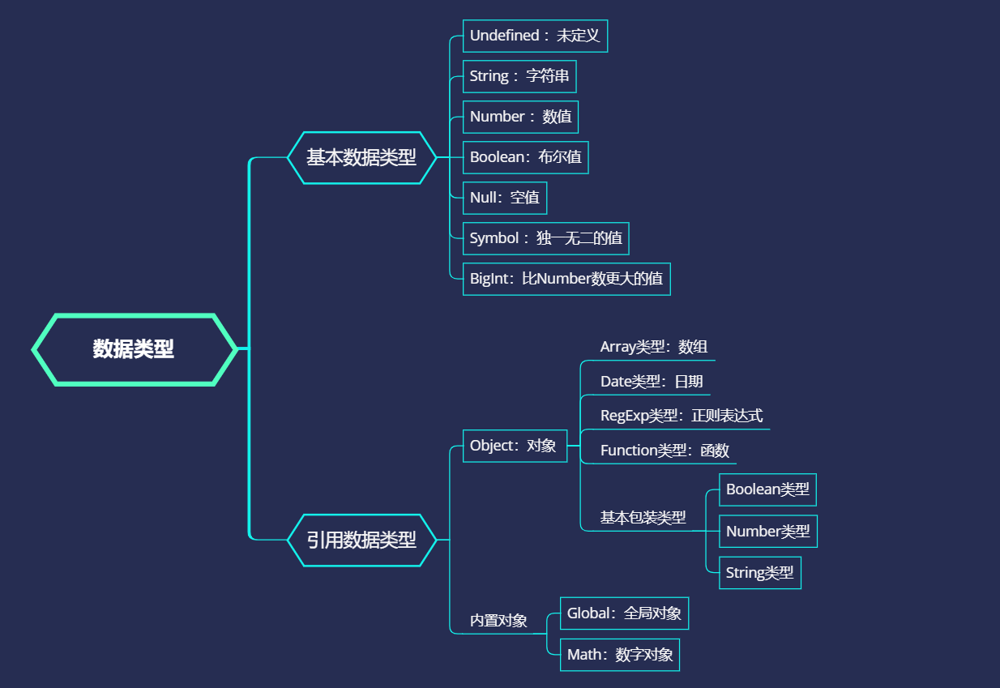

> 我们一般说的“对象”都是狭义的，大概就是指那些不是函数、数组、正则、日期等特殊对象的对象，这是个非正式的概念，规范中并没有直接定义。
>
> 如果你怕你的听者、读者误解，可以强调那个对象是个“普通对象”（normal object），也许会更严谨点。

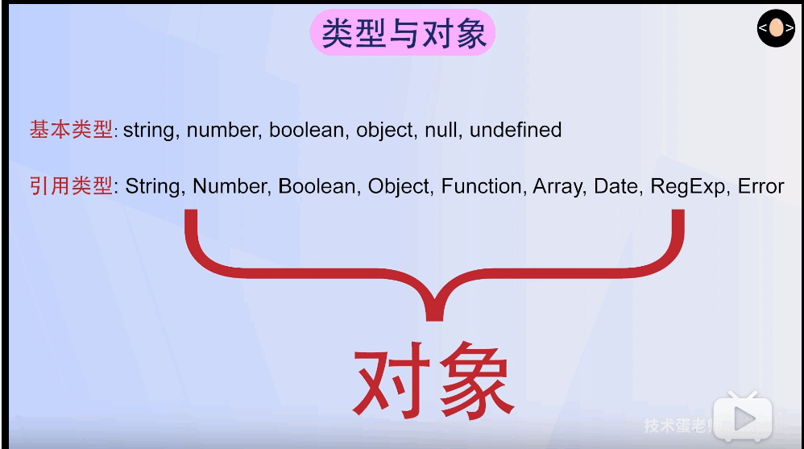

> 网上找的图

## 引用类型

引用类型的<strong style="color:red">值</strong>（对象）是引用类型的一个<strong style="color:red">实例</strong>。在ECMAScript中，**引用类型是一种数据结构**，用于将数据和功能组织在一起。它也常被称为类，但这种称呼并不妥当。尽管ECMAScript从技术上讲是一门面向对象的语言，但它不具备传统的面向对象语言所支持的类和接口等基本结构。引用类型有时候也称为<strong style="color:red">对象定义</strong>，因为它们描述的是一类对象所具有的属性和方法。

> 引用类型是引用数据类型的简称

### 引用类型与对象的关系：

**引用类型的（值！！！！！！）就是对象！！！！！**

反过来说，对象就是引用类型的一个个鲜活的实例

引用类型通常叫做类（class），也就是说，遇到引用值，所处理的就是对象。

引用类型类似于一张建筑图纸（模版），根据图纸建造的一座座建筑（实体）就是一个个对象

> 注意：从传统意义上来说，ECMAScript 并不真正具有类。事实上，除了说明不存在类，在 ECMA-262 中根本没有出现“类”这个词。ECMAScript 定义了“对象定义”，逻辑上等价于其他程序设计语言中的类。

## 对象

每个对象都是基于一个<strong style="color: red">引用类型</strong>创建的，这个引用类型可以是**原生类型**（Object、Array、Function等），也可以是用户自定义的类型。

对象总的来说大致可以分成两种：

1. **函数对象（Function Object）**

   通过new Function()生成函数并为其指定函数名，通过函数名来进行调用，其实就是我们通常所说的函数。

   （下文说函数其实就是对象，说的就是函数对象！！！）

2. **其他类型的对象（Object）**

   直接通过new操作符生成（除了Function类型）的对象，如new Object();  。


~~~
在有了对象的基础知识之后，对JS中对象做一个简单的总结。如下：
    a：对象是单个实物的抽象。
	b：对象是一个容器，封装了‘属性’和‘方法’。

一本书、一辆汽车、一个人都可以是“对象”。当实物被抽象成“对象”，实物之间的关系就变成了“对象”之间的关系，从而就可以模拟现实情况，针对“对象”进行编程。

所谓属性，就是对象的一种状态；所谓方法，就是对象的一种行为。

比如说，可以把动物抽象为animal对象，属性记录的就是哪一种动物，以及该动物的大小和颜色等。方法表示该动物的某种行为（奔跑，猎食，交配，休息等等）。
~~~

### 特殊的对象：Object对象
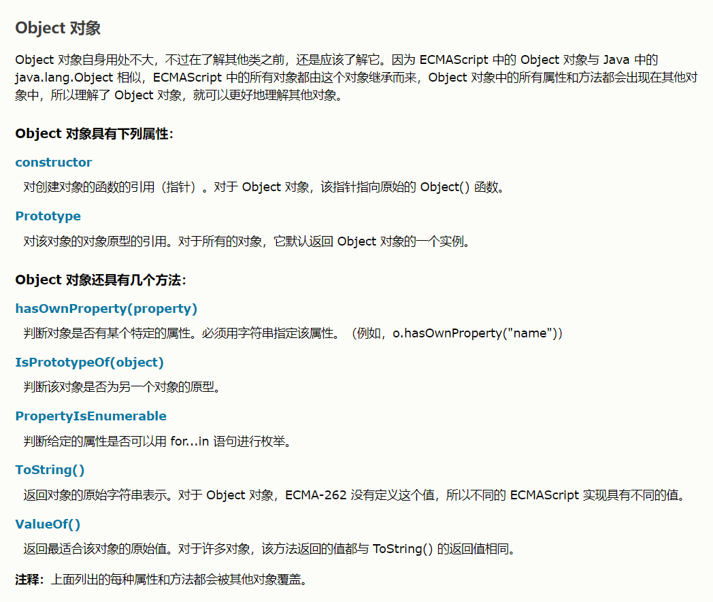

创建 Object实例的方式有两种。第一种是使用new操作符后跟Object<strong style="color:red">构造函数</strong>，如下所示：

~~~javascript
var person = new Object();
//向对象中添加属性
person.name = "Nicholas";
person.age = 29;
~~~

另一种方式是使用<strong style="color:red">对象字面量表示法</strong>。对象字面量是对象定义的一种**简写形式**，目的在于**简化创建包含大量属性的对象的过程**。下面这个例子就使用了对象字面量语法定义了与前面那个例子中相同的person对象：

~~~javascript
var person = {
    name : "Nicholas",
    age : 29
};
~~~

使用对象字面量语法时，如果<strong style="color:red">留空</strong>其花括号，则可以定义只包含<strong style="color:red">默认</strong>属性和方法（见上图所示的默认属性和方法）的对象，如下所示：

~~~javascript
var person = {};	//与new Object()相同
~~~

> 关于对象字面量语法，我们推荐只在考虑对象属性名的可读性时使用。
>
> 虽然可以使用前面介绍的任何一种方法来定义对象，但**开发人员更青睐对象字面量语法**，因为这种语法要求的代码量少，而且能够给人封装数据的感觉。实际上，对象字面量也是向函数传递大量可选参数的首选方式

### Object对象默认属性之constructor

JavaScript中constructor属性**指向创建当前对象的构造函数**。

~~~javascript
var a = '字符串';
console.log(a.constructor);		//ƒ String() { [native code] }

function b(){       
}
console.log(b.constructor)		//ƒ Function() { [native code] }
~~~

看了上面的代码示例，**也许你会觉得constructor属性在对象里**，但其实**constructor属性是在原型里**。

[JavaScript constructor 属性](<https://www.runoob.com/jsref/jsref-constructor-array.html>)

#### 定义和用法

在 JavaScript 中, **constructor 属性返回对象的构造函数。**

**返回值是函数的引用，不是函数名**：

JavaScript 数组 constructor 属性返回 **function Array() { [native code] }**

JavaScript 数字 constructor 属性返回 **function Number() { [native code] }**

JavaScript 字符串 constructor 属性返回 **function String() { [native code] }**

如果一个变量是数组你可以使用 constructor 属性来定义。

[揭开js之constructor属性的神秘面纱](<https://blog.csdn.net/zengyonglan/article/details/53465505>)

> 在 Javascript 语言中，constructor 属性是专门为 function 而设计的，它存在于每一个 function 的prototype 属性中。这个 constructor 保存了指向 function 的一个引用。

在定义一个函数时：

~~~javascript
function F() {
	// some code
}
~~~

JavaScript 内部会执行如下几个动作：

> 1.为该函数添加一个原形（即 prototype）属性
>
> 2.为 prototype 对象额外添加一个 constructor 属性，并且该属性保存指向函数F 的一个引用

这样当我们把函数 F 作为自定义构造函数来创建对象的时候，对象实例内部会自动保存一个指向其构造函数（这里就是我们的自定义构造函数 F）的 prototype 对象的一个属性proto。

所以我们在每一个对象实例中就可以访问构造函数的 prototype 所有拥有的全部属性和方法，就好像它们是实例自己的一样。当然该实例也有一个 constructor属性了（从 prototype 那里获得的），**每一个对象实例都可以通过 constrcutor 对象访问它的构造函数**，请看下面代码：

~~~javascript
var f = new F();
alert(f.constructor === F);//true
alert(f.constructor === F.prototype.constructor);//true
~~~

我们可以利用这个特性来完成下面的事情：

**对象类型判断**，如:

~~~javascript
if(f.constructor === F) {
	// do sth with F
}
~~~

其实 constructor 的出现原本就是用来进行对象类型判断的，但是 **constructor 属性易变，不可信赖**。我们有一种更加安全可靠的判定方法：instanceof 操作符。下面代码
仍然返回 true。

~~~javascript
if(f instanceof F) {
	// do sth with F
}
~~~

**原型链继承**，由于 constructor 存在于 prototype 对象上，因此我们可以结合
constructor 沿着原型链找到最原始的构造函数，如下面代码：

~~~javascript
function Base() {}

// Sub1 inherited from Base through prototype chain
function Sub1(){}
Sub1.prototype = new Base();
Sub1.prototype.constructor = Sub1;

Sub1.superclass = Base.prototype;

// Sub2 inherited from Sub1 through prototype chain
function Sub2(){}
Sub2.prototype = new Sub1();
Sub2.prototype.constructor = Sub2;

Sub2.superclass = Sub1.prototype;

// Test prototype chain
alert(Sub2.prototype.constructor);// function Sub2(){}
alert(Sub2.superclass.constructor);// function Sub1(){}
alert(Sub2.superclass.constructor.superclass.constructor);// function Base(){}
~~~

上面的例子只是为了说明 constructor 在原型链中的作用，更实际一点的意义在于：**一个子类对象可以获得其父类的所有属性和方法，称之为继承**。

之前提到 constructor 易变，那是因为**函数的 prototype 属性容易被更改**，我们用时下很流行的编码方式来说明问题，请看下面的示例代码：

~~~javascript
function F() {}
    F.prototype = {
    _name: 'Eric',
    getName: function() {
    return this._name;
    }
};

初看这种方式并无问题，但是你会发现下面的代码失效了：
var f = new F();
alert(f.constructor === F); // output false
~~~

怎么回事？F 不是实例对象 f 的构造函数了吗？当然是！只不过构造函数 F 的原型被开发者重写了，这种方式将原有的 prototype 对象用一个对象的字面量{}来代替。而新建的对象{}只是 Object 的一个实例，系统（或者说浏览器）在解析的时候并不会在{}上自动添加一个 constructor 属性，因为这是 function 创建时的专属操作，仅当你声明函数的时候解析器才会做此动作。然而你会发现 constructor 并不是不存在的，下面代码可以
测试它的存在性：

~~~javascript
alert(typeof f.constructor == 'undefined');// output false
~~~

既然存在，那这个 constructor 是从哪儿冒出来的呢？我们要回头分析这个对象字面量
{}。因为{}是创建对象的一种简写，所以{}相当于是 new Object()。那既然{}是 Object
的实例，自然而然他获得一个指向构造函数 Object()的 prototype 属性的一个引用proto，又因为 Object.prototype 上有一个指向 Object 本身的 constructor属性。所以可以看出这个constructor其实就是Object.prototype的constructor，
下面代码可以验证其结论：

~~~javascript
alert(f.constructor === Object.prototype.constructor);//output true
alert(f.constructor === Object);// also output true
~~~

一个解决办法就是手动恢复他的 constructor，下面代码非常好地解决了这个问题：

~~~javascript
function F() {}
F.prototype = {
    constructor: F, /* reset constructor */
    _name: 'Eric',
    getName: function() {
    return this._name;
    }
};
~~~

之后一切恢复正常，constructor 重新获得的构造函数的引用，我们可以再一次测试上面的代码，这次返回 true。

~~~javascript
var f = new F();
alert(f.constructor === F); // output true this time ^^
~~~

**解惑：构造函数上怎么还有一个 constructor ？它又是哪儿来的？**

细心的人会发现，像 JavaScript 内建的构造函数，如 Array, RegExp, String,Number, Object, Function 等等居然自己也有一个 constructor属性：

~~~javascript
alert(typeof Array.constructor != ‘undefined’);// output true
~~~

经过测试发现，此物非彼物它和 prototype 上 constructor **不是同一个对象，他们是共存的**：

~~~javascript
alert(typeof Array.constructor != 'undefined');// output true
alert(typeof Array.prototype.constructor === Array); // output true
~~~

不过这件事情也是好理解的，因为 构造函数也是函数。是函数说明它就是 Function 构造函数的实例对象，自然他内部也有一个指向 Function.prototype 的内部引用proto啦。因此我们很容易得出结论，这个 constructor（构造函数上的constructor 不是 prototype 上的）其实就是 Function 构造函数的引用：


~~~javascript
alert(Array.constructor === Function);// output true
alert(Function.constructor === Function); // output true
~~~

> 一个对象可以是另一个对象的属性

### Object对象默认属性之prototype

[JavaScript prototype 属性](<https://www.w3school.com.cn/js/jsref_prototype_array.asp>)

#### 定义和用法

prototype 属性使您有能力向对象添加属性和方法。

#### 语法

~~~javascript
object.prototype.name=value
~~~

#### 实例

在本例中，我们将展示如何使用 prototype 属性来向对象添加属性：

~~~javascript
<html>
<body>

<script type="text/javascript">

function employee(name,job,born)
{
this.name=name;
this.job=job;
this.born=born;
}

var bill=new employee("Bill Gates","Engineer",1985);

employee.prototype.salary=null;
bill.salary=20000;

document.write(bill.salary);

</script>

</body>
</html>

~~~

#### 输出

~~~javascript
20000
~~~

[Javascript中prototype属性的详解](https://www.cnblogs.com/libin-1/p/5836082.html)

 在典型的面向对象的语言中，如java，都存在类（class）的概念，类就是对象的模板，对象就是类的实例。但是在Javascript语言体系中，是不存在类（Class）的概念的，javascript中不是基于‘类的’，而是通过构造函数（constructor）和原型链（prototype chains）实现的。但是在ES6中提供了更接近传统语言的写法，引入了Class（类）这个概念，作为对象的模板。通过`class`关键字，可以定义类。基本上，ES6的`class`可以看作只是一个语法糖，它的绝大部分功能，ES5都可以做到，新的`class`写法只是让原型对象的写法更加清晰、更像面向对象编程的语法而已。

#### prototype属性的作用

为了解决构造函数的**对象实例之间**无法共享属性的缺点，js提供了prototype属性。

js中每个数据类型都是对象（除了null和undefined），而每个对象都继承自另外一个对象，后者称为“原型”（prototype）对象，只有null除外，它没有自己的原型对象。

> JavaScript这门语言除了基本类型都是对象，可以说JavaScript核心就是对象。感觉有点矛盾

**原型对象上的所有属性和方法，都会被对象实例所共享**。

> Prototype 的作用：可以为**原型的实例**设置公用的属性或方法；

通过构造函数生成对象实例时，会将对象实例的原型指向构造函数的prototype属性。**每一个构造函数都有一个prototype属性**，这个**属性就是对象实例的原型对象**。

~~~javascript
var A = function () {

    this.ary1 = [];

}

var B = new A();

var C = new A();

B.ary1.push(1);

C.ary1.push(2);
console.log(B.ary1);		//[1]   

console.log(C.ary1) 		//[2]
~~~

~~~javascript
A.prototype.ary2 = [];

B.ary2.push(1);

C.ary2.push(2);

console.log(B.ary2); 	//(2)[1,2]
~~~

**最后总结下什么是原型链：**

所有的对象都有一个`__proto__`属性，我们通过对象的`__proto__`属性一层层的向上访问，最终会得到值null；那么我们访问的整个路径就是这个对象的原型链。

# 概念2：构造函数与函数

构造函数的出现是为了解决使用Object构造函数和字面量表示法**不方便创建大量重复对象的问题**。

## 一般的函数

函数：就是将一些功能或语句进行**封装**，在需要的时候，通过**调用**的形式，执行这些语句。

函数实际上是<strong style="color: red">对象</strong>。

> 三遍：函数是对象！函数是对象！函数是对象！
>
> 既然函数是对象，那么函数本身也有自己的属性和方法！

每个函数都是Function类型的<strong style="color: red">实例</strong>，而且都与其他引用类型一样具有<strong style="color: red">属性和方法</strong>。

由于函数是对象，因此<strong style="color: red">函数名</strong>实际上也是一个指向函数对象的<strong style="color: red">指针</strong>，不会与某个函数绑定。

### 定义函数的3个方法

方法1：函数通常是使用<strong style="color:red">函数声明</strong>语法定义的，如下面的例子所示。

~~~javascript
function sum(num1 , num2){
    return num1 + num2;
}	//没有分号
~~~

方法2：这与下面使用<strong style="color:red">函数表达式</strong>定义函数的方式几乎相差无几。

~~~javascript
var sum = function(num1 , num2){
    return num1 + num2;
};	//有分号
~~~

以上代码定义了变量sum 并将其初始化为一个函数。有读者可能会注意到，function关键字后面没有函数名。这是因为在使用函数表达式定义函数时，没有必要使用函数名——通过变量sum即可以引用函数。另外，还要注意函数末尾有一个分号，就像声明其他变量时一样。

方法3：最后一种定义函数的方式是使用<strong style="color:red">Function构造函数</strong>。Function构造函数可以接收任意数量的参数，但<strong style="color: red">最后一个参数</strong>始终都被看成是函数体，而前面的参数则枚举出了新函数的参数。来看下面的例子：

~~~javascript
var sum = new Function("num1" , "num2" , "return num1 + num2");		//不推荐
~~~

从技术角度讲，这是一个函数表达式。但是，我们不推荐读者使用这种方法定义函数，因为这种语法会导致解析两次代码（第一次是解析常规ECMAScript代码，第二次是解析传入构造函数中的字符串），从而影响性能。不过，这种语法对于理解“函数是对象，函数名是指针”的概念倒是非常直观的。

> 强调：函数名仅仅是指向函数的指针！！！！！！！！
>
> 也可以同时使用函数声明和函数表达式，例如var sum=function aum(){）。
> 不过，这种语法在Safari中会导致错误。

### 函数的属性和方法

前面曾经提到过，ECMAScript中的函数是对象，因此函数也有属性和方法。每个函数都包含两个属性：<strong style="color: red">length</strong>和<strong style="color: red">prototype</strong>。

1. length属性表示函数希望接收的命名参数的个数，比较简单，省略不谈。

2. <strong style="color:red">在ECMAScript核心所定义的全部属性中，最耐人寻味的就要数prototype属性了。</strong>对于ECMAScript中的引用类型而言，<strong style="color: red">prototype是保存它们所有实例方法的真正所在</strong>。换句话说，诸如tostring（）和valueof（）等方法实际上都保存在prototype名下，只不过是通过各自对象的实例访问罢了。在创建自定义引用类型以及实现继承时，prototype属性的作用是极为重要的（第6章将详细介绍）。在ECMAScript5中，prototype属性是<strong style="color: red">不可枚举</strong>的，因此使用for-in无法发现。

## 构造函数

[阮一峰构造函数-讲得好，一定要好好看](https://wangdoc.com/javascript/oop/new.html)

> 类(对象的模版)——————对象(单个实物的抽象)————实物
>
> DNA序列 ————————抽象的人——————————具体的人(张三)
>
> 不知道我这样理解有没有问题。

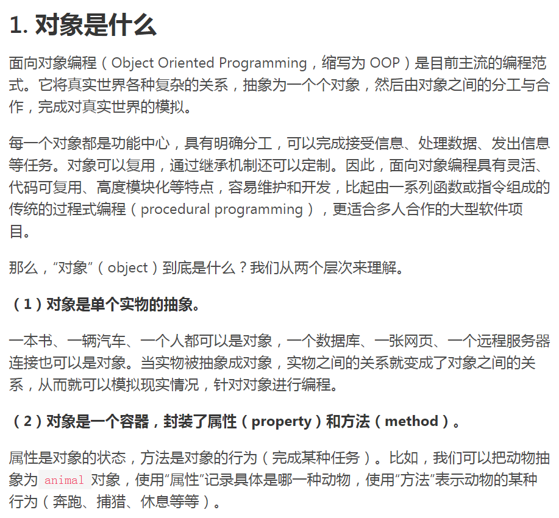

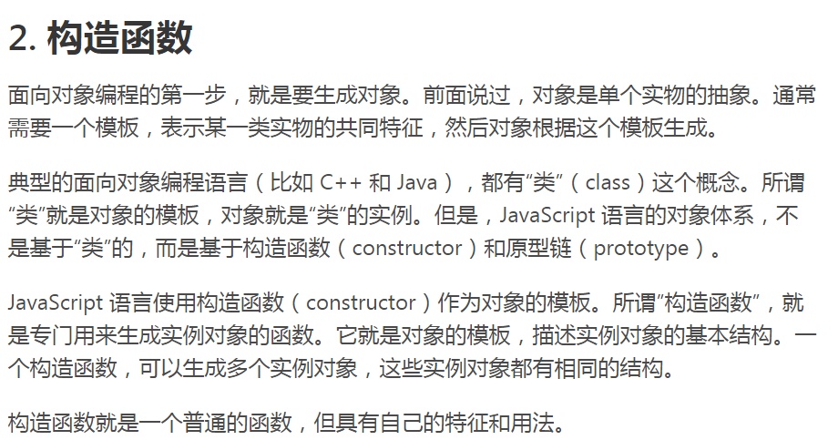

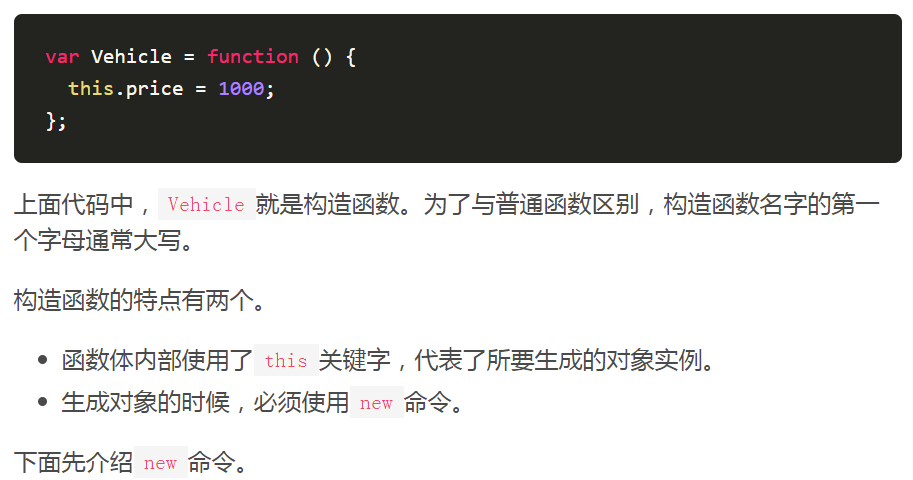

所谓构造函数，就是提供了一个**生成对象的模板并描述对象的基本结构的函数(和类的作用差不多)**。一个构造函数，可以生成多个对象，每个对象都有相同的结构。总的来说，**构造函数就是对象的模板，对象就是构造函数的实例。**

构造函数的特点有：

　　**a：构造函数的函数名首字母必须大写。**

　　**b：内部使用this对象，来指向将要生成的对象实例。**(this我是真的不熟，一直不熟)

　　**c：使用new操作符来调用构造函数，并返回对象实例。**

看一下最简单的例子：

~~~javascript
function Person(){
    this.name = 'keith';
 }

var boy = new Person();
console.log(boy.name);    //'keith'
~~~

### 构造函数的缺点

所有的实例对象都可以继承构造函数中的属性和方法。但是，**同一个对象实例之间，无法共享属性**。

> 兄弟能继承父亲的遗产，但是兄弟之间不能互相互赠遗产

~~~javascript
function Person(name,height){
        this.name=name;
        this.height=height;
        this.hobby=function(){
            return 'watching movies';
        }
    }

    var boy=new Person('keith',180);
    var girl=new Person('rascal',153);

    console.log(boy.name);    //'keith'
    console.log(girl.name);    //'rascal'
    console.log(boy.hobby===girl.hobby);  //false 无法理解啊
~~~

上面代码中，一个构造函数Person生成了两个对象实例boy和girl，并且有两个属性和一个方法。但是，它们的hobby方法是不一样的。也就是说，每当你使用new来调用构造函数放回一个对象实例的时候，都会创建一个hobby方法。这既没有必要，又浪费资源，因为所有hobby方法都是同样的行为，完全可以被两个对象实例共享。

所以，构造函数的缺点就是：**同一个构造函数的对象实例之间无法共享属性或方法。**

> 为了解决构造函数的对象实例之间无法共享属性的缺点，js提供了prototype属性。
>
> 详见下文prototype属性

<strong style="color: red">ECMAScript中的构造函数可用来创建特定类型的对象</strong>。像Object和Array这样的**原生构造函数**，在运行时会**自动出现在执行环境中**。此外，也可以创建自定义的构造函数，从而定义自定义对象类型的属性和方法。

按照惯例，构造函数始终都应该以一个<strong style="color: red">大写字母</strong>开头，而非构造函数则应该以一个小写字母开头。这个做法借鉴自其他OO语言，主要是为了区别于ECMAScript中的其他函数；因为**构造函数本身也是函数，只不过可以用来创建对象而已。**

要创建person的新实例，必须使用new操作符。以这种方式调用构造函数实际上会经历以下4个步骤：

（1）创建一个新对象；

（2）将新建的对象设置为函数中的this,在构造函数中可以**使用this来引用新建的对象**

（3）逐行执行函数中的代码

（4）将新建的对象作为返回值返回

使用同一个构造函数创建的对象，我们称为一类对象，也将一个构造函数称为一个类。

我们将通过一个构造函数创建的对象，称为是该类的实例。

~~~javascript
function Person(name, age, job){
      this.name = name;
      this.age = age;
      this.job = job;
      this.sayName = function(){
          alert(this.name);
      };    
}
        
var person1 = new Person("Nicholas", 29, "Software Engineer");
var person2 = new Person("Greg", 27, "Doctor");

alert(person1.constructor == Person);		//true
alert(person2.constructor == Person);		//true
~~~

> person1和person2分别保存着Person的一个不同的实例。这两个对象都有一个constructor（构造函数）属性，该属性指向 person。
>
> 对象的constructor属性最初是用来标识对象类型的。

通过调用构造函数产生的实例，都有一个<strong style="color: red">内部属性</strong>，指向了<strong style="color: red">原型对象</strong>。所以实例能够访问原型对象上的所有属性和方法。

所以三者的关系是，每个构造函数都有一个<strong style="color: red">原型对象</strong>，原型对象都包含一个指向构造函数的<strong style="color: red">指针</strong>，而<strong style="color: red">实例</strong>都包含一个指向原型对象的<strong style="color: red">内部指针</strong>。通俗点说就是，实例通过内部指针可以访问到原型对象，原型对象通过constructor指针，又可以找到构造函数。

## 构造函数VS普通函数

构造函数与其他函数的唯一区别，就在于调用它们的方式不同。

> 普通函数时直接调用，而构造函数需要使用new关键字来调用

不过，构造函数毕竟也是函数，不存在定义构造函数的特殊语法。任何函数，只要通过<strong style="color: red">new操作符</strong>来调用，那它就可以作为构造函数；而任何函数，如果不通过new操作符来调用，那它跟普通函数也不会有什么两样。

## 构造函数与原型对象

[javascript原型与原型链个人理解](<https://www.lagou.com/lgeduarticle/20186.html>)

想了解原型和原型链，我觉得首先我们得知道javascript里有一个Object 与 Function,**它俩都是构造函数，当然函数也是一个对象**。我们打印Object 与 Function看一下:

~~~javascript
console.log(Function);	//f Function(){[native code]}
console.log(Object);		//f Object(){[native code]}
~~~

**那么这个Object 与 Function 之间有何关系与区别呢？首先您只需要记住：**

1. 所有普通对象都是 Object 的实例（也就是说Object是所有普通对象的爸爸）；

2. 所有普通函数都是 Function 的实例（也就是说Function是所有普通函数的爸爸）；

3. Function是 Object 的实例；（Object是所有对象的爸爸）

### **构造函数与原型对象的区别：**

 Object是构造函数，而Object.prototype是构造函数的原型对象。**构造函数自身的属性和方法无法被共享，而原型对象的属性和方法可以被所有实例对象所共享。**

**其次**，constructor属性是**原型对象**上的一个属性，可以被**所有实例**对象所共享。要注意的是，prototype是**构造函数**的属性，而**constructor则是构造函数的prototype属性所指向的那个对象，也就是原型对象的属性**。由于constructor属性是一种原型对象和构造函数的关系，所以**在修改原型对象的时候，一定要注意constructor的指向问题。**

> 看晕了。

接下来我们说重点，javascript里的 `__proto__ `和 prototype 属性。

1. 所有的**对象**都有`__proto__`属性，可通过`__proto__`属性来访问这个对象的原型，而 `__proto__ `指向的是它原型对象的prototype 属性（**对象没有prototype属性**）；

2. 所有的**构造函数**都有一个prototype 和 `__proto__ `属性，而**该函数的prototype属性指向的是它原型对象上的constructor属性。**

> 这说的都是啥跟啥，我看不懂。

~~~javascript
var A = function () {} // 申明一个函数对象A；
var B = new A(); // 为A创建一个实例B；
console.log("A.prototype:", A.prototype);
console.log("B.__proto__:", B.__proto__);
console.log(A.prototype === B.__proto__);
~~~

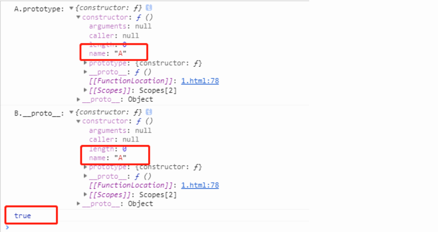

# 概念3：this

[JavaScript 的 this 原理](<https://www.ruanyifeng.com/blog/2018/06/javascript-this.html>)

[彻底理解js中this的指向，不必硬背。](https://www.cnblogs.com/pssp/p/5216085.html)

[this 关键字](<https://wangdoc.com/javascript/oop/this.html>)(讲的好)

## 涵义

`this`关键字是一个非常重要的语法点。毫不夸张地说，不理解它的含义，大部分开发任务都无法完成。

前一章已经提到，`this`可以用在构造函数之中，表示实例对象。除此之外，`this`还可以用在别的场合。但不管是什么场合，`this`都有一个共同点：它总是返回一个对象。

简单说，`this`就是<strong style="color: red">属性或方法“当前”</strong>所在的对象。

~~~javascript
this.property
~~~

上面代码中，`this`就代表`property`属性当前所在的对象。

下面是一个实际的例子。

~~~javascript
var person = {
  name: '张三',
  describe: function () {
    return '姓名：'+ this.name;
  }
};

person.describe()
// "姓名：张三"
~~~

上面代码中，`this.name`表示`name`属性所在的那个对象。由于`this.name`是在`describe`方法中调用，而`describe`方法所在的当前对象是`person`，因此`this`指向`person`，`this.name`就是`person.name`。

由于对象的属性可以赋给另一个对象，所以属性所在的当前对象是可变的，即`this`的<strong style="color: red">指向</strong>是可变的。

~~~javascript
var A = {
  name: '张三',
  describe: function () {
    return '姓名：'+ this.name;
  }
};

var B = {
  name: '李四'
};

B.describe = A.describe;
B.describe()
// "姓名：李四"
~~~

上面代码中，`A.describe`属性被赋给`B`，于是`B.describe`就表示`describe`方法所在的当前对象是`B`，所以`this.name`就指向`B.name`。

稍稍重构这个例子，`this`的动态指向就能看得更清楚。

~~~javascript
function f() {
  return '姓名：'+ this.name;
}

var A = {
  name: '张三',
  describe: f
};

var B = {
  name: '李四',
  describe: f
};

A.describe() // "姓名：张三"
B.describe() // "姓名：李四"
~~~

上面代码中，函数`f`内部使用了`this`关键字，随着`f`所在的对象不同，`this`的指向也不同。

只要函数被赋给另一个变量，`this`的指向就会变。

~~~javascript
var A = {
  name: '张三',
  describe: function () {
    return '姓名：'+ this.name;
  }
};

var name = '李四';
var f = A.describe;
f() // "姓名：李四"
~~~

上面代码中，`A.describe`被赋值给变量`f`，内部的`this`就会指向`f`运行时所在的对象（本例是顶层对象）。

再看一个网页编程的例子。

~~~javascript
<input type="text" name="age" size=3 onChange="validate(this, 18, 99);">

<script>
function validate(obj, lowval, hival){
  if ((obj.value < lowval) || (obj.value > hival))
    console.log('Invalid Value!');
}
</script>
~~~

上面代码是一个文本输入框，每当用户输入一个值，就会调用`onChange`回调函数，验证这个值是否在指定范围。浏览器会向回调函数传入当前对象，因此`this`就代表传入当前对象（即文本框），然后就可以从`this.value`上面读到用户的输入值。

## 实质

JavaScript 语言之所以有 this 的设计，跟内存里面的数据结构有关系。

~~~javascript
var obj = { foo:  5 };
~~~

上面的代码将一个对象赋值给变量`obj`。JavaScript 引擎会先在内存里面，生成一个对象`{ foo: 5 }`，然后把这个对象的内存地址赋值给变量`obj`。也就是说，<strong style="color: red">变量`obj`是一个地址（reference）</strong>。后面如果要读取`obj.foo`，引擎先从`obj`拿到内存地址，然后再从该地址读出原始的对象，返回它的`foo`属性。

原始的对象以字典结构保存，每一个属性名都对应一个属性描述对象。举例来说，上面例子的`foo`属性，实际上是以下面的形式保存的。

~~~javascript
{
  foo: {
    [[value]]: 5
    [[writable]]: true
    [[enumerable]]: true
    [[configurable]]: true
  }
}
~~~

注意，`foo`属性的值保存在属性描述对象的`value`属性里面。

这样的结构是很清晰的，问题在于<strong style="color: red">属性的值可能是一个函数</strong>。

~~~javascript
var obj = { foo: function () {} };
~~~

这时，引擎会将函数单独保存在内存中，然后再将函数的<strong style="color: red">地址</strong>赋值给`foo`属性的`value`属性。

~~~javascript
{
  foo: {
    [[value]]: 函数的地址
    ...
  }
}
~~~

<strong style="color: red">由于函数是一个单独的值，所以它可以在不同的环境（上下文）执行</strong>。

~~~javascript
var f = function () {};
var obj = { f: f };

// 单独执行
f()

// obj 环境执行
obj.f()
~~~


在函数内部，有两个特殊的<strong style="color: red">对象</strong>：<strong style="color: red">arguments</strong>和<strong style="color: red">this</strong>。

在 JavaScript 中，this 是动态绑定，或称为运行期绑定的，这就导致 JavaScript 中的 this 关键字有能力具备多重含义，带来灵活性的同时，也为初学者带来不少困惑。

在函数中 this 到底取何值，是在函数真正被<strong style="color: red">调用执行</strong>的时候确定下来的，函数<strong style="color: red">定义</strong>的时候确定不了。

在js中只有两种作用域，一种是全局，一种是函数级作用域(可以利用其模仿块级作用域)，直接在对象属性中使用this那么此时this就是window。

> this的情况
>
> ​	1.当以函数的形式调用时，this是window
>
> 2.当以方法的形式调用时，谁调用方法this就是谁
>
> 3.当以构造函数的形式调用时，this就是新创建的那个对象	

其实this是有函数生成的，它是函数的一个<strong style="color: red">内部属性</strong>，与arguments一样也是函数的内部属性，它是在函数执行时被生成，那么值呢？<strong style="color: red">this的值始终是指向函数据以执行的环境</strong>。简单的可以理解为<strong style="color: red">调用函数的对象</strong>。

因为 this 的取值是执行上下文环境的一部分，每次调用函数，都会产生一个新的执行上下文环境。当你在代码中使用了 this，这个 this 的值就直接从执行的上下文中获取了，而不会从作用域链中搜寻。

# 概念4：原型

[通俗的语言解释JavaScript的原型](<https://www.erichain.me/2016/02/29/2016-02-29-javascript-prototype-in-plain-detailed-language/>)

[为什么 JavaScript 要设计原型模式](<https://juejin.im/post/5c45c251f265da611037569c>)

[JS原型链彻底搞清楚](<https://zhuanlan.zhihu.com/p/22787302>)

[通俗的语言解释JavaScript的原型](<https://www.erichain.me/2016/02/29/2016-02-29-javascript-prototype-in-plain-detailed-language/>)

[构造函数、原型对象、实例对象关系](<https://www.jianshu.com/p/7f04d023151c>)

[解读 JavaScript 构造函数和原型对象的区别](<https://juejin.im/entry/58d36b4f570c350058c2742a>)

[prototype (原型) 属性](<https://www.jianshu.com/p/4f87d28923ce>)

先来一张图，随着下面文字看图，看懂这张图基本概念就差不多理解了：

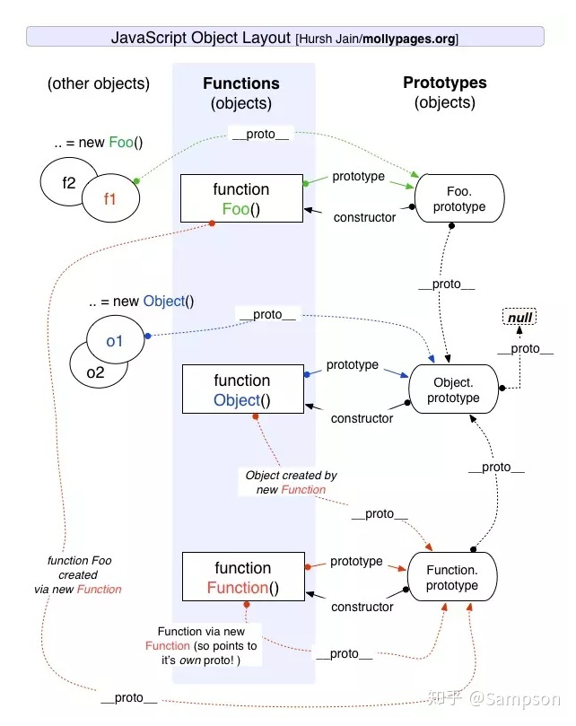


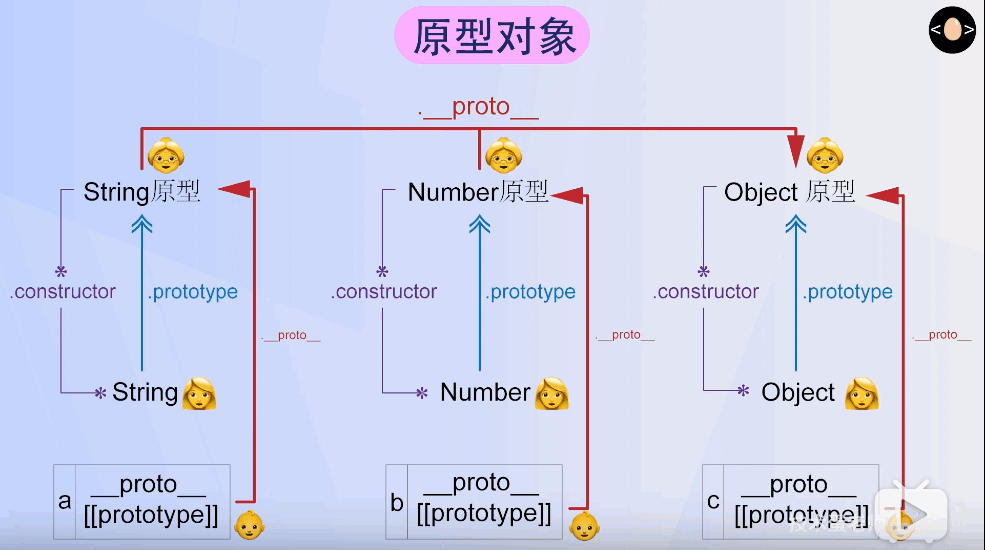

> 小孩通过`__proto__`找到他的妈妈，通过`__proto__`.`__proto__`找到他的奶奶 
>
> （我把String理解成妈妈，把String原型[String.prototype]理解成奶奶，这样的理解有问题吧？？？）
>
> 准确的说，应该是：当调用构造函数创建一个新实例后，该实例的内部将包含一个指针（内部属性），指向构造函数的原型对象。
>
> （String和String原型之间到底有什么区别与联系呢？？？？？？？？？？？？？我不懂）
>
> 妈妈通过prototype找到她的妈妈（小孩的奶奶）
>
> 奶奶通过constructor找到她的孩子（小孩的妈妈）

原型是顺应人类自然思维的产物。中文中有个成语叫做"照猫画虎"，这里的猫看起来就是虎的原型。

原型是JavaScript中一个比较难理解的概念，原型相关的属性也比较多，<strong style="color: red">对象</strong>有"[[prototype]]"属性，<strong style="color: red">函数对象</strong>有"prototype"属性，<strong style="color: red">原型对象</strong>有"constructor"属性。

## prototype(原型)属性

构造函数在执行时都会带有一个属性叫做prototype。这个prototype属性会指向原型对象。

`property`是定义在**函数**上的一个变量。

在JavaScript里，有两个与`prototype`相互关联的概念：

**1、**JavaScript的每一个函数都有原型属性，这个属性默认为空。当你需要实现继承的时候，就把属性和方法添加到这个原型属性上。`prototype`(原型)属性是不可枚举的，换句话说，不能使用`for...in`循环来访问这些属性。但是，Firefox和大多数版本的Safari以及Chrome都有一个`__proto__`的伪属性。这个属性允许你访问一个**对象的原型属性**。你可能从来没有使用过这个属性，但是，你应该知道它的存在，并且，在一些浏览器中，用它来访问对象的属性是一种很简便的方法。

`prototype`属性主要用来实现**继承**。把属性和方法添加到一个函数的`prototype`上以使这个函数的实例也能访问这些属性和方法。

看看下面这个使用`prototype`实现的简单继承的例子(后面会讲到更多的继承)：

~~~javascript
function PrintStuff( myDocuments ) {
	this.documents = myDocuments;
}

/* 我们把print()方法添加到PrintStuff的原型属性上，所以其他实例或者对象能够继承这个方法 */
PrintStuff.prototype.print = function () {
	console.log(this.documents);
}

/* 使用PrintStuff()构造函数创建一个新的对象，这样，就允许这个新的对象继承PrintStuff的属性和方法了 */
var newObj = new PrintStuff('I am a new Object and I can print.');

/* newObj从PrintStuff函数中集成所有的属性和方法，包括print方法。所以，现在即使没有在newObj上创建一个print方法，newObj也可以直接使用print这个方法来打印输出了 */
newObj.print(); // I am a new Object and I can print.
~~~

**2、**第二个与原型有关的属性就是`prototype`属性了。`prototype`属性作为对象的一个特征，能够告诉我们这个对象的“父级对象”。简单说来就是：一个对象的原型属性指向它的“父级对象”，这个对象的属性就是从这个“父级对象”继承而来。原型属性通常被作为原型对象，当你创建一个新对象的时候，它自动的就被设置好了。解释这个现象：每一个对象都是从其他的对象继承而来，而这个所谓的“其他对象”正是这个对象的原型属性或者说“父级对象”(你可以把原型属性认为是家族关系或者亲子关系)。在上面的代码例子中，`newObj`的原型(`newObj.prototype`)就是`PrintStuff.prototype`。

> 注意：所有的对象都有属性，就像对象的属性有属性一样。对象的属性包括`prototype`，`class`以及可扩展的属性。我们将在第二个例子中讲到`prototype`属性。
> 同时也要注意，`__proto__`这个伪属性包含了对象的原型对象。

每创建一个<strong style="color: red">函数</strong>，该函数就会自动带有一个 <strong style="color: red">prototype(原型)</strong> 属性。该属性是个<strong style="color: red">指针</strong>，指向了一个<strong style="color: red">对象</strong>，我们称之为<strong style="color: red">原型对象</strong>，这个对象的 用途: 包含可以由指定类型的所有实例共享的属性和方法。

所以 `prototype` 就是通过调用构造函数而创建的哪个对象实例的原型对象

> 什么是指针？指针就好比学生的学号，原型对象则是那个学生。我们通过学号找到唯一的那个学生。假设突然，指针设置 null, 学号重置空了，不要慌，对象还存在，学生也没消失。只是不好找了。

原型对象上默认有一个属性 <strong style="color: red">constructor</strong>，该属性也是一个指针，指向其相关联的构造函数。

## constructor属性

[揭开js之constructor属性的神秘面纱](<https://blog.csdn.net/zengyonglan/article/details/53465505>)

[js中对象的constructor属性及其作用](<https://blog.csdn.net/summer199605/article/details/88700382?depth_1-utm_source=distribute.pc_relevant.none-task-blog-BlogCommendFromBaidu-2&utm_source=distribute.pc_relevant.none-task-blog-BlogCommendFromBaidu-2>)

我们来简要地介绍一下`constructor`属性，即构造函数。构造函数是用来初始化一个新对象的函数，使用`new`这个关键词就可以调用构造函数。

例如：

~~~javascript
function Account() {}
// 使用Account构造函数来创建userAccount对象
var userAccount = new Account();
~~~

## 原型指针（`__proto__`）

当构造函数创建一个新实例（又称实例对象，下同）后，该实例下都会存在一个指针`__proto__`（内部属性），指向创建这个实例的构造函数（constructor指向值）下的原型对象（prototype）。只要是个对象，都会有`__proto__`。

~~~javascript
function Person(){}; //构造函数
var person = new Person(); //实例对象
alert(person.__proto__ === Person.prototype);    //true
~~~

根据范例代码来看，person是属于构造函数Person的一个实例，person.`__proto__ `=== Person.prototype为true。要明确的真正重要的一点就是，这个连接存在于**实例与构造函数的原型对象**之间，而不是存在于实例与构造函数之间。

### 继承与原型链

对于使用过基于类的语言 (如 Java 或 C++) 的开发人员来说，JavaScript 有点令人困惑，因为它是动态的，并且本身不提供一个 `class` 实现。（在 ES2015/ES6 中引入了 `class` 关键字，但那只是语法糖，JavaScript 仍然是基于原型的）。

当谈到继承时，JavaScript 只有一种结构：对象。每个实例对象（ object ）都有一个私有属性（称之为\__proto__ ）指向它的构造函数的原型对象（**prototype** ）。该原型对象也有一个自己的原型对象( \_\_proto__ ) ，层层向上直到一个对象的原型对象为 `null`。根据定义，`null` 没有原型，并作为这个**原型链**中的最后一个环节。

几乎所有 JavaScript 中的对象都是位于原型链顶端的 [`Object`](https://developer.mozilla.org/zh-CN/docs/Web/JavaScript/Reference/Global_Objects/Object) 的实例。

尽管这种原型继承通常被认为是 JavaScript 的弱点之一，但是原型继承模型本身实际上比经典模型更强大。例如，在原型模型的基础上构建经典模型相当简单。

### 基于原型链的继承

JavaScript 对象是动态的属性“包”（指其自己的属性）。JavaScript 对象有一个指向一个原型对象的链。当试图访问一个对象的属性时，它不仅仅在该对象上搜寻，还会搜寻该对象的原型，以及该对象的原型的原型，依次层层向上搜索，直到找到一个名字匹配的属性或到达原型链的末尾。

## Object.getPrototypeOf()方法

Object.getPrototypeOf() 方法用于**获取指定对象的原型对象**（也就是`__protp__`的指向）

语法：Object.getPrototypeOf( obj ) 

参数：obj ---> 你所指定的对象

~~~javascript
function Obj() {
    this.name = 'ViavaCos';
}

Obj.prototype.fullName = '尼古拉斯·赵四';

var obj = new Obj();

console.log( obj.__proto__.fullName );  //  尼古拉斯·赵四

console.log(Object.getPrototypeOf(obj) === obj.__proto__ ); // true  说明地址一致
~~~

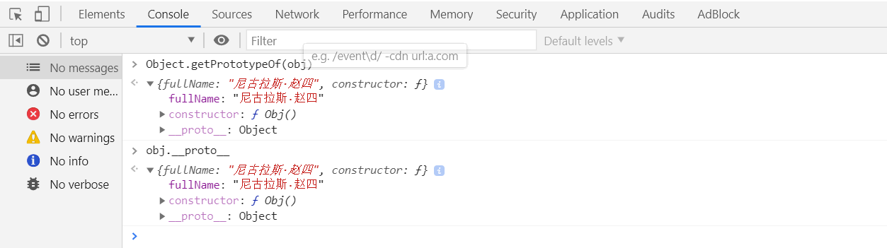

[学习笔记之Object.getPrototypeOf()方法](<https://www.cnblogs.com/ViavaCos/p/11586498.html>)

[Object.getPrototypeOf()](<https://developer.mozilla.org/zh-CN/docs/Web/JavaScript/Reference/Global_Objects/Object/GetPrototypeOf>)

[javascript isPrototypeOf()与getPrototypeOf()方法](<https://blog.csdn.net/tashanhongye/article/details/74518874>)

## Object.isPrototypeOf()方法

[js中的hasOwnProperty()和isPrototypeOf()](<https://www.cnblogs.com/libin-1/p/5759093.html>)

### 概述

`isPrototypeOf()`方法测试**一个对象**是否存在**另一个对象**的**原型链上**。

### 语法

~~~javascript
//object1是不是Object2的原型,也就是说Object2是Object1的原型，,是则返回true,否则false
object1.isPrototypeOf(Object2);
~~~

### 描述

`isPrototypeOf()`方法允许你检查一个对像是否存在另一个对象的原型链上

### 实例

**1.利用isPrototypeOf()检查一个对象是否存在另一个对象的原型上**

~~~javascript
var o={};
function Person(){};
var p1 = new Person();	//继承自原来的原型，但是现在已经无法访问???
Person.prototype = o;
var p2 = new Person();	//继承自o
console.log(o.isPrototypeOf(p1));	//false o是不是p1的原型
console.log(o.isPrototypeof(p2));	//true  o是不是p2的原型
~~~

**2.利用isPropertyOf()检查一个对象是否存在一另一个对象的原型链上**

~~~javascript
var o={};
function Person(){};
var p1 =new Person();//继承自原来的原型，但是现在已经无法访问
Person.prototype=o;
var p2 =new Person();//继承自o
console.log(o.isPrototypeOf(p1));//false o是不是p1的原型
console.log(o.isPrototypeof(p2));//true  o是不是p2的原型

console.log(Object.prototype.isPrototypeOf(p1));//true
console.log(Object.prototype.isPrototypeOf(p2));//true
~~~

> `p1`的原型链结构是`p1`=>原来的`Person.prototype`=>`Object.prototype`=>`null`
>
> `p2`的原型链结构是`p2`=> `o` =>`Object.prototype`=>`null`
>
> `p1`和`p2`都拥有`Object.prototype`所以他们都在`Object.Prototype`的原型链上

### 总结

1. hasOwnProperty：是用来判断一个对象是否有你给出名称的属性或对象。不过需要注意的是，**此方法无法检查该对象的原型链中是否具有该属性**，该属性必须是对象本身的一个成员。
2. isPrototypeOf是用来判断要检查其原型链的对象是否存在于指定对象实例中，是则返回true，否则返回false。

## Object.defineProperty()方法

[理解Object.defineProperty的作用](https://segmentfault.com/a/1190000007434923)

[defineProperty详解](https://segmentfault.com/a/1190000017762618)

使用Object.defineProperty**定义新属性或修改原有的属性**。

~~~javascript
//defineproperty 有个定义object属性的功能，应该没几个人用，因为相对于obj.a = 1这种方式简直不能再难用。

//通常我们定义obj属性
let obj = {
      a:1
}
obj.b = 2
obj['c'] = 3
console.log(obj)//{a: 1, b: 2,c: 3}  

Object.defineProperty(obj,'d',{
      value: 4
})

console.log(obj)//{a: 1, b: 2,c: 3,d:4}  //defineProperty可以定义对象属性

//也可以修改
Object.defineProperty(obj,'b',{
      value: 5
})
console.log(obj)//{a: 1, b: 5, c: 3, d: 4}
~~~

>  对你没看错defineProperty有这个功能，不知可以定义新的属性还可以修改，这么逆天难用的功能为什么还要造出来？说这个有什么用？别急往下看

### descriptor详解

**defineProperty 接收三个参数**

- object （必须有 操作的对象本身 这个很容易理解不传它操作谁？）

- propertyname (必须有 属性名 添加修改属性得有属性名)

- descriptor （必须有 官方说的我理解不了，我理解的是 属性描述
  1、简单点就是 设置属性的值value，
  2、是否可操作属性值 writable，
  3、是否可修改配置configurable如果值为false descriptor内的属性都不可操作）
  4、是否可枚举enumerable

  ##### descriptor内配置可有可无，value默认undefind，其余默认为false

先做了介绍我们下边来证明下：

**writable**

~~~javascript
//栗子还是这个栗子
let obj = {
     a: 1
}
Object.defineProperty(obj, 'b', {
     value: 2,
     writable: false//不可修改
})

obj.b = 3
console.log(obj) //{a: 1, b: 2} 还真是不可以
        
//难道是姿势不对？
Object.defineProperty(obj, 'b', {
     value: 3
})
console.log(obj)//{a: 1, b: 2} 一样的效果 和姿势无关。
~~~

**configurable**

> configurable 这个比较厉害 控制descriptor内属性都不可改变不知道是不是真的

~~~javascript
//还是这个栗子       
let obj = {
     a: 1
}
Object.defineProperty(obj, 'b', {
     value: 2,
     //writable: false//不可修改
     configurable: false
})
obj.b = 5;
console.log(obj)//{a: 1, b: 2}
~~~

**enumerable**

> 对否可枚举

~~~javascript
let obj = {
      a: 1
}
Object.defineProperty(obj, 'b', {
     value: 2,
     //writable: false//不可修改
     //configurable: false
     enumerable: false
})
//obj.b = 5
console.log(Object.keys(obj))//["a"]
~~~

接了下来说到重点： set和get这也是vue3.0前observe的实现原理

~~~javascript
let obj = {
     a: 1
}

let newValue = 45
Object.defineProperty(obj, 'b', {
     get(value) {
           console.log('获取')
           return value
     },
     set(newValue) {
            console.log('设置')
            value = newValue
     }
})
obj.b = 6 //设置
obj.b //获取
~~~

知道用法了我们来实践一下

~~~javascript
//html
<div></div>
<input type="text">
//js
//类似 vue的data
let obj = {}

/*
 *obj      要劫持的对象
 *name     要劫持对象的属性
 *callback 劫持以后的操作
 */
function watch(obj, name, callback) {
      let value = obj.name;
          Object.defineProperty(obj, name, {
              set(msg) {
                  // 触发setter给obj赋值
                  value = msg
                   //执行劫持后的操作
                  callback(value)
              },
              get() {
                 //返回获取属性值
                 return value
              }
         })
 }

 //
function doSomething(value) {
      document.querySelector('div').innerHTML = value
           document.querySelector('input').value = value
}
//监听input变化 
//可以参考全兼容版：https://segmentfault.com/a/1190000017524278
document.querySelector('input').addEventListener('input', (e) => {
      obj['msg'] = e.target.value
})
watch(obj, 'msg', doSomething)
~~~

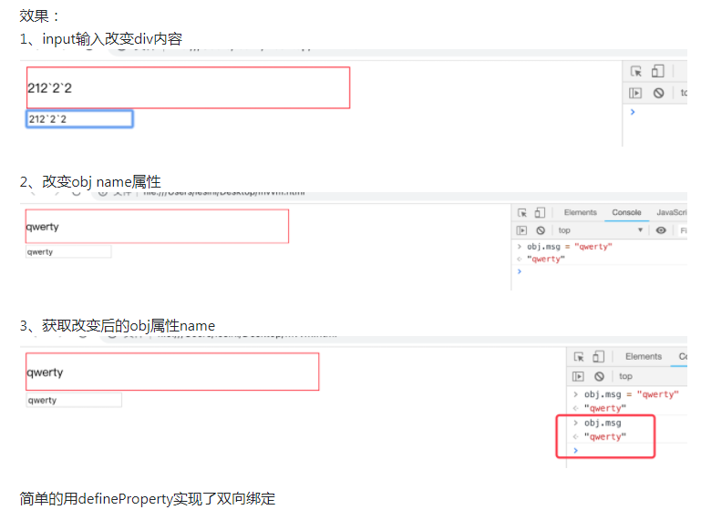

## hasOwnProperty()方法

使用<strong style="color:red">hasOwnProperty（）</strong>方法可以**检测一个属性是存在于实例中，还是存在于原型中**。这个方法（不要忘了它是从Object继承来的）只在给定属性存在于**对象实例**中时，才会返回true。来看下面这个例子。

~~~javascript
function Person(){
}
        
Person.prototype.name = "Nicholas";
Person.prototype.age = 29;
Person.prototype.job = "Software Engineer";
Person.prototype.sayName = function(){
    alert(this.name);
};
        
var person1 = new Person();
var person2 = new Person();

alert(person1.hasOwnProperty("name"));		//false

person1.name = "Greg";
alert(person1.name);    //"Greg" – 来自实例
alert(person1.hasOwnProperty("name"));		//true

alert(person2.name); 	//"Nicholas" - 来自原型
alert(person2.hasOwnProperty("name"));		//false

delete person1.name;
alert(person1.name); 	//"Nicholas" - 来自原型
alert(person1.hasOwnProperty("name"));		//false
~~~

通过使用hasOwnProperty（）方法，什么时候访问的是实例属性，什么时候访问的是原型属性就一清二楚了。调用person1.hasOwnProperty（"name"）时，只有当person1重写name属性后才会返回true，因为只有这时候name才是一个实例属性，而非原型属性。

## hasPrototypeProperty（）方法

可以使用hasPrototypeProperty（）来判断一个对象的某个属性是在实例上还是在原型对象上。

~~~javascript
hasPrototypeProperty（ObjectName，PropertyName）
~~~

如果在**实例**上拥有这个属性，则返回true；

与hasPrototypeProperty()方法有区别的是in操作符，使用in可以判断某个属性是否可以被对象访问，不管这个属性是在实例上还是在原型对象上。

所以总结一下就是：hasPrototypeProperty()确认属性是否在实例上，in确认属性是否可以被对象访问，for-in确认对象是否可以被对象例举（正常情况下使用for-in循环出的属性包括实例属性和原型对象属性）；

另外如果需要得到所有的实例属性，无论属性是否可以列举，可以使用**getOwnpropertyName()**

## Object.prototype属性

[Object.prototype](<https://www.jianshu.com/p/850d8e8ed3a9>)

## `__proto__`属性

`__proto__`属性在对象创建的时候就会生成， 这个__proto__属性实际原名叫[[prototype]]（用了2个中括号括起来了），而在Chrome浏览器中，则把这个属性名字定义为了`__proto__`，要注意这个`__proto__`前后分别有2个下横杠。

现在我们知道对象会有一个内置的属性，那么这个属性是用来干嘛的呢？按照字面意思，prototype就是原型的意思。

~~~javascript
<script>
	var a = new String('abc');
	var b = new Number(666);
	var c = new Object();
	c.key = 123;
</script>
~~~

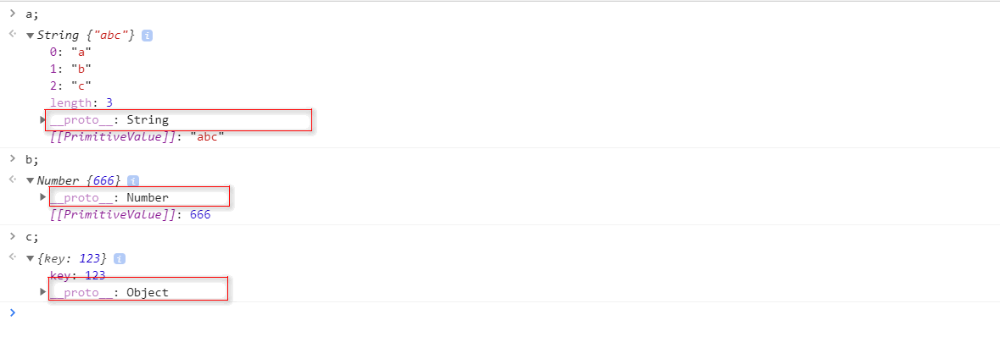

小孩a的原型是他的妈妈String;

小孩b的原型是他的妈妈Number;

小孩c的原型是他的妈妈Object;

~~~javascript
console.log(a.__proto__);			//String
console.log(b.__proto__);			//Number
console.log(c.__proto__);			//Object
~~~

其中，再将a,b,c他们三个的原型左边的三角箭头打开，可以看到a,b的原型（String和Number）还有原型，是Object。而c的原型（Object就没有原型了）

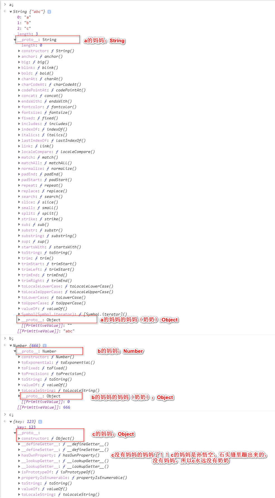

~~~javascript
console.log(a.__proto__.__proto__);			//Object
console.log(b.__proto__.__proto__);			//Object
console.log(c.__proto__.__proto__);			//null 
~~~

## `__proto__`和prototype属性

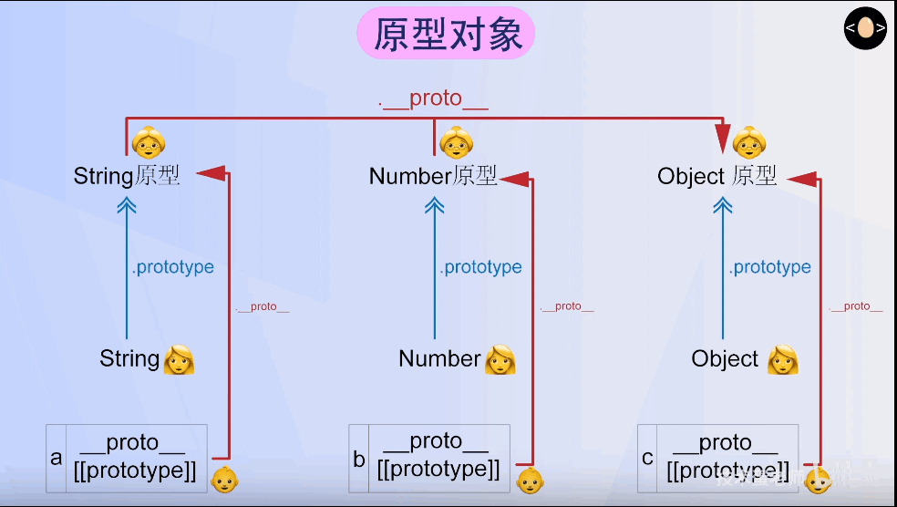

小孩（具体的对象）a,b,c在创建的时候就自动有了一个属性`__ptoto__`,指向他们各自的妈妈（String、Number、Object），小孩的妈妈是引用数据类型，也被称为构造函数。小孩的妈妈也有一个属性,叫做prototype，指向小孩的妈妈的妈妈（小孩的奶奶）

~~~javascript
console.log(a.__proto__);			//String
console.log(String.prototype);	//String	
console.log(a.__proto__ == String.prototype);	//true
~~~

> 我发现我对String和String原型区分不清除

## `__proto__`和constructot属性

小孩很清楚他们的父母亲是谁，用`__proto__`属性就可以知道了。

那么他们的父母亲知道自己的小孩是谁吗？答案是肯定的。

原型对象在被创建的时候，会自动获得一个属性，叫做constructor属性。

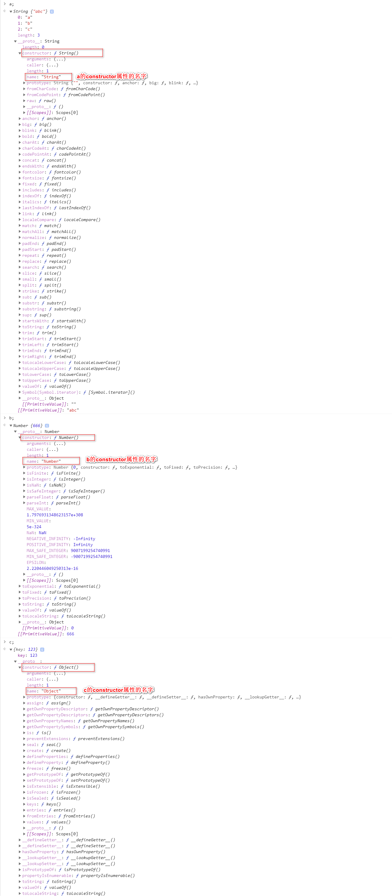

上图所示：name:"String";   name:"Number";  name:"Object"显示了创建a、b、c的对象，为“String”、“Number”、“Object”。

可以看出，constructor并不会直接指向a、b、c。而是会指向创建a、b、c的对象。


# 概念5：apply()、call()、bind()

[深入浅出 妙用Javascript中apply、call、bind](https://www.cnblogs.com/coco1s/p/4833199.html)

[JS中call()和apply()](<https://www.jianshu.com/p/aa2eeecd8b4f>)

[JS里call和apply的作用和区别](<https://blog.csdn.net/lilongsy/article/details/74356018>)

[this、apply、call、bind](https://juejin.cn/post/6844903496253177863)

**每个函数**都包含两个**非继承而来**的方法：`call()`和`apply()`；

在JavaScript中，call和apply作用是一样的，都是为了**改变某个函数运行时的上下文（context）**而存在的，换句话说，**就是为了改变函数体内部 this 的指向**。

JavaScript 的一大特点是，函数存在「**定义时上下文**」和「**运行时上下文**」以及「**上下文是可以改变的**」这样的概念。

先来一个例子：

~~~javascript
function Fruits(){}
        
Fruits.prototype = {
    color: "red",
    say: function(){
        console.log("My color is " + this.color);
    }
}

var apple = new Fruits;		//Fruits是爸爸，apple是生的儿子，say()是爸爸自己的财产，儿子可以用
apple.say();                //My color is red
~~~

但是如果我们有一个**对象**`banana= {color : "yellow"}` ,我们不想对它重新定义say方法，那么我们可以通过 call 或 apply 用 apple 的 say 方法：

~~~javascript
banana = {
    color: "yellow"
}
apple.say.call(banana);     //My color is yellow
apple.say.apply(banana);    //My color is yellow

//Fruits是爸爸，apple是生的儿子，banana是儿媳妇，say()是爸爸自己的财产，儿子可以用(也只给儿子们用)
//现在儿媳妇banana也想用爸爸的财产，直接来拿是不行的，这个时候可以通过儿子apple拿，然后给儿媳妇banana用

//call左边是apple.say，儿子使用的父亲的的say方法
//call右边是(banana)，老婆用小括号包起来，让它也使用儿子从父亲继承而来的say方法
~~~

所以，可以看出 **call 和 apply 是为了动态改变 this 而出现的**，**当一个 object 没有某个方法（本栗子中banana没有say方法），但是其他的有（本栗子中apple有say方法），我们可以借助call或apply用其它对象的方法来操作。**

## apply、call的区别

* call是一个一个打电话叫人
* apply是叫好了一群人，然后排队(数组)

对于 apply、call 二者而言，**作用完全一样**，只是**接受参数的方式不太一样**。例如，有一个函数定义如下：

~~~javascript
var func = function(arg1, arg2) {
     
};
~~~

就可以通过如下方式来调用：

~~~javascript
func.call(this, arg1, arg2);
func.apply(this, [arg1, arg2]);
~~~

其中 **this 是你想指定的上下文(也就是儿媳妇，这个对我来说是个难点)**，他可以是任何一个 JavaScript 对象(JavaScript 中一切皆对象)，**call 需要把参数按顺序传递进去，而 apply 则是把参数放在数组里。**　　

* **call是男的**，比较粗糙，直接就把参数传进去就好了；
* **sapply是女的**，比较精致，把参数放在一个"篮子"（数组）里再传进去。

JavaScript 中，某个函数的**参数数量**是不固定的，因此要说适用条件的话，**当参数是明确知道数量时用 call。** 

> call是男的，很明确，很容易猜透。

而**不确定的时候**用 apply，然后把参数 push 进数组传递进去。当参数数量不确定时，函数内部也可以通过 arguments 这个**伪数组**来遍历所有的参数。

> apply是女的，不明确，不容易猜透，不知道有几个参数，不知道有几个小九九。

为了巩固加深记忆，下面列举一些常用用法：

### 数组之间追加

~~~javascript
var array1 = [12 , "foo" , {name "Joe"} , -2458]; 
var array2 = ["Doe" , 555 , 100]; 
Array.prototype.push.apply(array1, array2); 
/* array1 值为  [12 , "foo" , {name "Joe"} , -2458 , "Doe" , 555 , 100] */
~~~

### 获取数组中的最大值和最小值

~~~javascript
var  numbers = [5, 458 , 120 , -215 ]; 
var maxInNumbers = Math.max.apply(Math, numbers),   //458
    maxInNumbers = Math.max.call(Math,5, 458 , 120 , -215); //458
~~~

number 本身没有 max 方法，但是 Math 有，我们就可以借助 call 或者 apply 使用其方法。

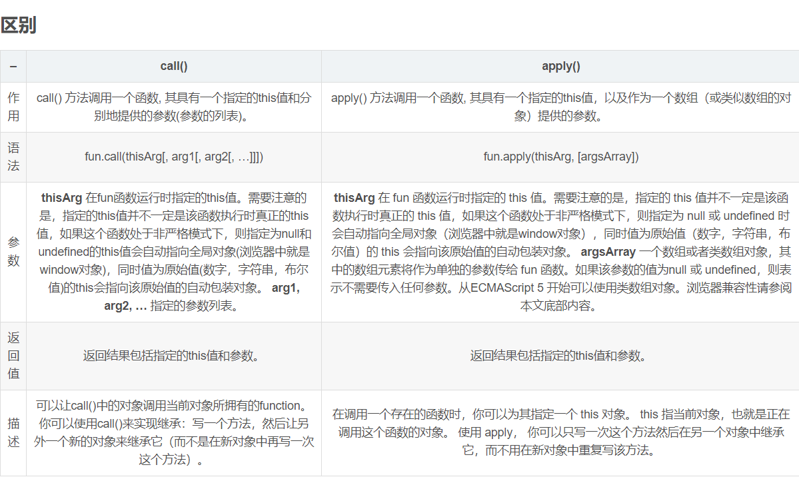

# 概念6：回调函数（callback）

[回调函数（callback）是什么？](https://www.zhihu.com/question/19801131)

[回调函数](https://javascript.ruanyifeng.com/advanced/single-thread.html#toc4)

## 什么是回调函数

我们绕点远路来回答这个问题。

编程分为两类：**系统编程**（system programming）和**应用编程**（application programming）。所谓系统编程，简单来说，就是编写**库**；而应用编程就是利用写好的各种库来编写具某种功用的程序，也就是**应用**。系统程序员会给自己写的库留下一些接口，即API（application programming interface，应用编程接口），以供应用程序员使用。所以在抽象层的图示里，库位于应用的底下。

当程序跑起来时，一般情况下，应用程序（application program）会时常通过API调用库里所预先备好的函数。但是有些库函数（library function）却要求应用先传给它一个函数，好在合适的时候调用，以完成目标任务。这个被传入的、后又被调用的函数就称为**回调函数**（callback function）。

打个比方，有一家旅馆提供叫醒服务，但是要求旅客自己决定叫醒的方法。可以是打客房电话，也可以是派服务员去敲门，睡得死怕耽误事的，还可以要求往自己头上浇盆水。这里，“叫醒”这个行为是旅馆提供的，相当于库函数，但是叫醒的方式是由旅客决定并告诉旅馆的，也就是回调函数。而旅客告诉旅馆怎么叫醒自己的动作，也就是把回调函数传入库函数的动作，称为**登记回调函数**（to register a callback function）。


可以看到，回调函数通常和应用处于同一抽象层（因为传入什么样的回调函数是在应用级别决定的）。而回调就成了一个高层调用底层，底层再**回**过头来**调**用高层的过程。（我认为）这应该是回调最早的应用之处，也是其得名如此的原因。

## 回调机制的优势

从上面的例子可以看出，回调机制提供了非常大的灵活性。请注意，从现在开始，我们把图中的库函数改称为**中间函数**了，这是因为回调并不仅仅用在应用和库之间。任何时候，只要想获得类似于上面情况的灵活性，都可以利用回调。

这种灵活性是怎么实现的呢？乍看起来，回调似乎只是函数间的调用，但仔细一琢磨，可以发现两者之间的一个关键的不同：在回调中，我们利用某种方式，把回调函数像参数一样传入中间函数。可以这么理解，在传入一个回调函数之前，中间函数是不完整的。换句话说，程序可以在运行时，通过登记不同的回调函数，来决定、改变中间函数的行为。这就比简单的函数调用要灵活太多了。

## 易被忽略的第三方

通过上面的论述可知，中间函数和回调函数是回调的两个必要部分，不过人们往往忽略了回调里的第三位要角，就是中间函数的调用者。绝大多数情况下，这个调用者可以和程序的主函数等同起来，但为了表示区别，我这里把它称为**起始函数**

之所以特意强调这个第三方，是因为我在网上读相关文章时得到一种印象，很多人把它简单地理解为两个个体之间的来回调用。譬如，很多中文网页在解释“回调”（callback）时，都会提到这么一句话：“If you call me, I will call you back.”我没有查到这句英文的出处。我个人揣测，很多人把起始函数和回调函数看作为一体，大概有两个原因：第一，可能是“回调”这一名字的误导；第二，给中间函数传入什么样的回调函数，是在起始函数里决定的。实际上，回调并不是“你我”两方的互动，而是ABC的三方联动。有了这个清楚的概念，在自己的代码里实现回调时才不容易混淆出错。

另外，回调实际上有两种：阻塞式回调和延迟式回调。两者的区别在于：阻塞式回调里，回调函数的调用一定发生在起始函数返回之前；而延迟式回调里，回调函数的调用有可能是在起始函数返回之后。这里不打算对这两个概率做更深入的讨论，之所以把它们提出来，也是为了说明强调起始函数的重要性。网上的很多文章，提到这两个概念时，只是笼统地说阻塞式回调发生在主调函数返回之前，却没有明确这个主调函数到底是起始函数还是中间函数，不免让人糊涂，所以这里特意说明一下。

## 回调函数简介

回调函数是异步操作最基本的方法。

下面是两个函数`f1`和`f2`，编程的意图是`f2`必须等到`f1`执行完成，才能执行。

~~~javascript
function f1() {
  // ...
}

function f2() {
  // ...
}

f1();
f2();
~~~

上面代码的问题在于，如果`f1`是异步操作，`f2`会立即执行，不会等到`f1`结束再执行。

这时，可以考虑改写`f1`，把`f2`写成`f1`的回调函数。

~~~javascript
function f1(callback) {
  // ...
  callback();
}

function f2() {
  // ...
}

f1(f2);
~~~

回调函数的优点是简单、容易理解和实现，缺点是不利于代码的阅读和维护，各个部分之间高度耦合(coupling)，使得程序结构混乱、流程难以追踪（尤其是多个回调函数嵌套的情况），而且每个任务只能指定一个回调函数。

# 概念7：getter和setter函数

# 概念8：get和set方法

# 概念9：高阶函数（filter/map/reduce）

# 概念10：o.name = name和this.name = name; 

~~~javascript
var o = new Object();
o.name = name;
~~~

一直不清楚 p.name = name; this.name=name表达的是什么意思。

# 概念11：闭包

[学习Javascript闭包（Closure）](<https://www.ruanyifeng.com/blog/2009/08/learning_javascript_closures.html>)

> 这个是阮一峰2009年写的，阮一峰博客写了好多年了啊。

闭包（closure）是Javascript语言的一个难点，也是它的特色，很多高级应用都要依靠闭包实现。

下面就是我的学习笔记，对于Javascript初学者应该是很有用的。

## 变量的作用域

要理解闭包，首先必须理解Javascript特殊的变量作用域。

变量的作用域无非就是两种：全局变量和局部变量。

Javascript语言的特殊之处，就在于**函数内部可以直接读取全局变量。**

~~~javascript
　var n=999;
　function f1(){
　　　alert(n);
　}

　f1(); // 999
~~~

另一方面，在函数外部自然无法读取函数内的局部变量。

~~~javascript
function f1(){
　　var n=999;
}

alert(n); // error
~~~

这里有一个地方需要注意，函数内部声明变量的时候，一定要使用var命令。如果不用的话，你实际上声明了一个全局变量！

~~~javascript
function f1(){
　　　n=999;
}

f1();		//必须要先调用一下这个函数吗

alert(n); // 999
~~~

## **如何从外部读取局部变量？**

出于种种原因，我们有时候需要得到函数内的局部变量。但是，前面已经说过了，正常情况下，这是办不到的，只有通过变通方法才能实现。

那就是在函数的内部，再定义一个函数。

~~~javascript
function f1(){
　　var n=999;
　　function f2(){
　　　　alert(n); 		// 999
　　}
}
~~~

在上面的代码中，函数f2就被包括在函数f1内部，这时f1内部的所有局部变量，对f2都是可见的。但是反过来就不行，f2内部的局部变量，对f1就是不可见的。这就是Javascript语言特有的"链式作用域"结构（chain scope），子对象会一级一级地向上寻找所有父对象的变量。所以，父对象的所有变量，对子对象都是可见的，反之则不成立。

既然f2可以读取f1中的局部变量，那么只要把f2作为返回值，我们不就可以在f1外部读取它的内部变量了吗！

~~~javascript
function f1(){
　　var n=999;

　　function f2(){
　　　　alert(n);
　  }
　　return f2;
}

var result=f1();		//f1后面有括号！
result(); // 999
~~~

## **闭包的概念**

上一节代码中的f2函数，就是闭包。

各种专业文献上的"闭包"（closure）定义非常抽象，很难看懂。我的理解是，闭包就是能够读取其他函数内部变量的函数。

由于在Javascript语言中，只有函数内部的子函数才能读取局部变量，因此可以把闭包简单理解成"定义在一个函数内部的函数"。

所以，在本质上，闭包就是将函数内部和函数外部连接起来的一座桥梁。

## **闭包的用途**

闭包可以用在许多地方。它的最大用处有两个，一个是前面提到的**可以读取函数内部的变量，另一个就是让这些变量的值始终保持在内存中。**

怎么来理解这句话呢？请看下面的代码。

~~~javascript
function f1(){
　　var n=999;
　　nAdd = function(){
     	n = n + 1
   }

　　function f2(){
　　　　alert(n);
　　}
　　return f2;
}

var result = f1();
result(); // 999

nAdd();
result(); // 1000
~~~

在这段代码中，result实际上就是闭包f2函数。它一共运行了两次，第一次的值是999，第二次的值是1000。这证明了，函数f1中的局部变量n一直保存在内存中，并没有在f1调用后被自动清除。

为什么会这样呢？原因就在于f1是f2的父函数，而f2被赋给了一个全局变量，这导致f2始终在内存中，而f2的存在依赖于f1，因此f1也始终在内存中，不会在调用结束后，被垃圾回收机制（garbage collection）回收。

这段代码中另一个值得注意的地方，就是"nAdd=function(){n+=1}"这一行，首先在nAdd前面没有使用var关键字，因此nAdd是一个全局变量，而不是局部变量。其次，nAdd的值是一个匿名函数（anonymous function），而这个匿名函数本身也是一个闭包，所以**nAdd相当于是一个setter**，可以在函数外部对函数内部的局部变量进行操作。

## **使用闭包的注意点**

1）由于闭包会使得函数中的变量都被保存在内存中，内存消耗很大，所以不能滥用闭包，否则会造成网页的性能问题，在IE中可能导致内存泄露。解决方法是，在退出函数之前，将不使用的局部变量全部删除。

2）闭包会在父函数外部，改变父函数内部变量的值。所以，如果你把父函数当作对象（object）使用，把闭包当作它的公用方法（Public Method），把内部变量当作它的私有属性（private value），这时一定要小心，不要随便改变父函数内部变量的值。

## **思考题**

如果你能理解下面两段代码的运行结果，应该就算理解闭包的运行机制了。

代码片段一：

~~~javascript
　var name = "The Window";

　var object = {
　　　　name : "My Object",

　　　　getNameFunc : function(){
　　　　　　return function(){
　　　　　　　　return this.name;
　　　　　　};
　　　　}
　　};

alert(object.getNameFunc()());
~~~

代码片段二：

~~~javascript
var name = "The Window";

var object = {
　　	name : "My Object",

   	 getNameFunc : function(){
　　　　　var that = this;
　　　　　return function(){
　　　　　　　　return that.name;
　　　　　};
　	 }
};

alert(object.getNameFunc()());
~~~

# 概念12：Promise

[这是一篇傻瓜都能看懂的Promises文章！](https://zhuanlan.zhihu.com/p/24684803)

以下内容出自scotch上Jecelyn Yeen的分享哦。

此文目的只有一个：让我们更容易的了解JavaScript Promises！

JavaScript Promises其实不难。然而，很多人一开始就觉得有点难理解.。因此我想用一种假设的方式写下我理解promise。

## 理解promise

举个简单例子：

想象你是一个孩子。你老妈承诺下礼拜 给你买个新手机。你 [不知道] 你是否会得到手机直到下礼拜。你老妈可以真的买你一个全新的手机，也可以让你滚蛋并告诉你不买了（如果她不高兴了）。

这是一个承诺。一个承诺有3个状态。分别是:

* 悬而未决：你 [不知道] 你是否会得到手机直到下礼拜。

* 解决：你老妈可以真的买你一个全新的手机。

* 拒绝：你老妈拒绝给你买，因为你惹她不高兴。

## 创建一个promise

咱们把上面的例子转换成JavaScript。

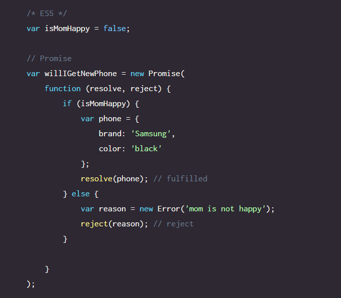

* `isMomHappy`是个布尔值，定义老妈是否开心。

* `willIGetNewPhone`是一个promise，这个承诺可以解决(给你买)，也可以拒绝(老妈不开心就不给你买)。.

* 还有一个标准语法去定义一个新的promise，参考[MDN documentation](https://link.zhihu.com/?target=https%3A//developer.mozilla.org/en/docs/Web/JavaScript/Reference/Global_Objects/Promise)，看下面代码：

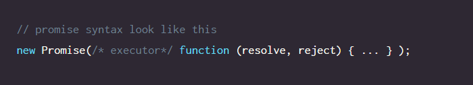

* 需要记住的是，在你定义的promise里，当结果是成功的，叫 解决(你的成功值)，如果结果失败了，叫 拒绝（你的失败值）。

* 在我们的例子中，如果老妈高兴，我们会得到一个电话。因此，我们称 `resolvefunction`（电话变量）。如果老妈不高兴，我们称为 拒绝函数（拒绝的理由）；

## 玩转promises

现在有了promise，咱们就开始玩一玩。

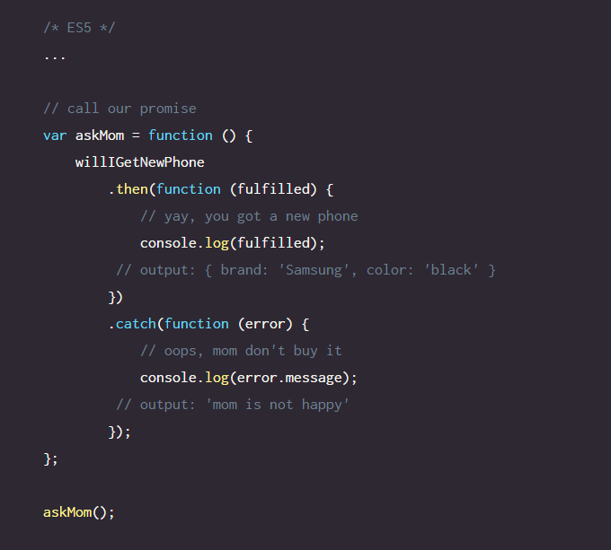

* 我们有一个函数`askMom`。在这个函数中，我们将使用我们的承诺`willIGetNewPhone`。
* 当我们的promise是解决或者拒绝的时候，我们要做点事儿，我们用`.then & .catch `来处理我们的行动；
* 在`.then`里面有函数“`function(fulfilled) { ... } `。这个函数的返回值是啥呢？返回值是promise解决的值（你的成功时候的值）；在我们的案例中它是一部新电话 。
* 在 `.catch`里面有函数`function(error){ ... } `。猜测一下，其实这个返回的是错误值，就是promise拒绝的值。

走一下案例看下结果!

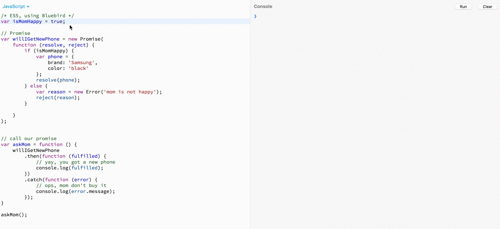

## 链接promises

Promises都是可链的。

这样说吧，你，咱例子中的孩子，承诺给你的朋友说：如果你老妈给你买了新手机，就让你的朋友过过眼瘾，你要显摆显摆！

这又是另外一个promise了，写成代码看下!

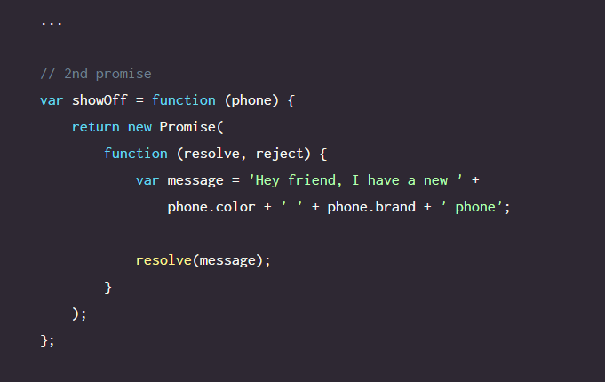

注意：

- 在这个例子中，你可能会意识到我们不叫 拒绝。因为它是可选的。
- 我们可以缩短这个案例，看代码：

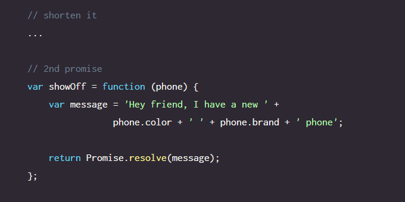

咱们现在链接promise。你，这个孩子只能在得到手机后才能显摆手机。

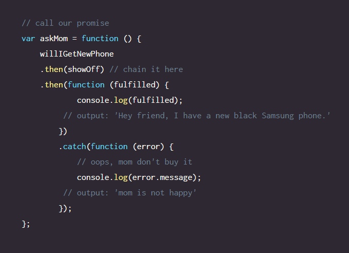

--> 简单吧！

## promises都是异步的

Promises都是异步的，咱们在这个promise开始和结束前写一段信息。

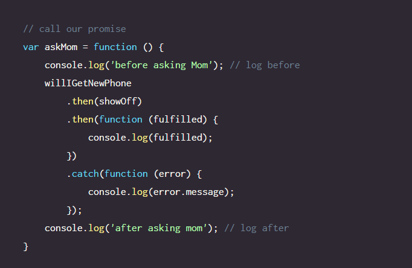

期望输出的顺序是什么？也许你以为：


然而，实际的输出序列是：


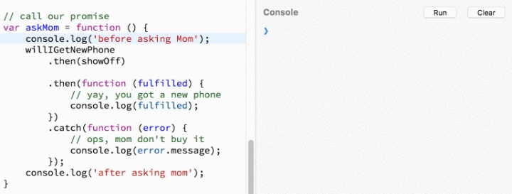

**为啥？因为生活就是不等人的，JavaScript也是！**

你，孩子，不会说不去玩了这一个月就干等你老妈的承诺（新手机），对吧。这就是异步调用，**代码将无阻塞运行或等待结果**。**任何需要等promise的行为放在`.then`里面**。

## Promise在 ES5 /ES6 /ES7 下

### ES5 - 大多数的浏览器

ES5不支持promise，大多数浏览器借助第三方库（[Bluebird](https://link.zhihu.com/?target=http%3A//bluebirdjs.com/docs/getting-started.html) 、[Q](https://link.zhihu.com/?target=https%3A//github.com/kriskowal/q)）的话可以实现；

### ES6 - 现代浏览器

演示代码是ok的，因为ES6支持promise。此外，我们也可以用ES6的箭头函数来简化代码。也可以用上let和const。

下面是ES6的演示代码：

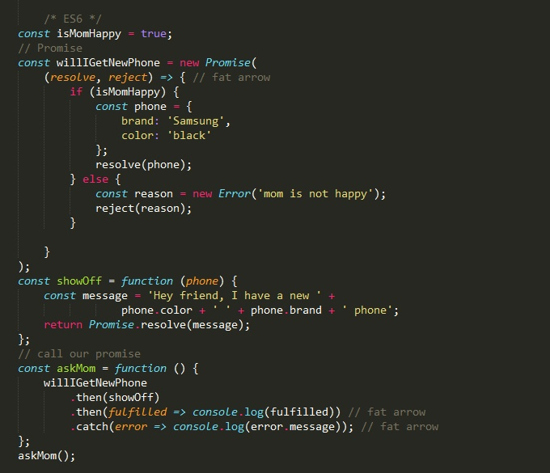

--> 注意到所有的 var 都被 const 取代。所有的函数（解决，拒绝） 都使用箭头函数简化。

### ES7 - 异步等待使语法看起来更漂亮！

ES7介绍异步和等待 语法。它使异步语法看起来更漂亮、更容易理解，没有 `.then`和`.catch`。

用ES7语法来重写我们的例子：

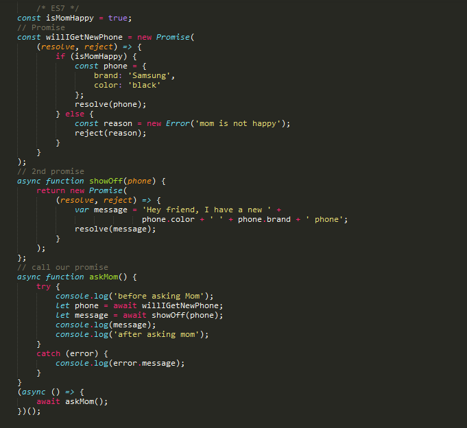

* 当你需要在一个函数里面返回一个promise，你在异步调用这个函数。例如 案例中的异步函数`function showOff(phone)`。
* 当你需要一个promise，你就在等待着 。例如 `let phone = await willIGetNewPhone;` & `let message = await showOff(phone)`。
* 使用 `try {...} catch(error) {...} ` 捕捉promise错误/拒绝 。

## 为什么使用promise？什么时候使用它们？

为什么我们需要promise？promise之前的世界是怎样的？在回答这些问题之前，让我们回到最基础的地方。

### 对比正常函数和异步函数

让我们来看看这两个例子，这两个例子执行两个数字相加：

##### 正常函数两个数相加

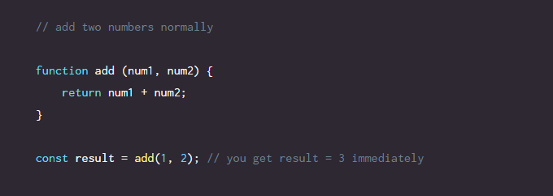

##### 异步函数两个数相加

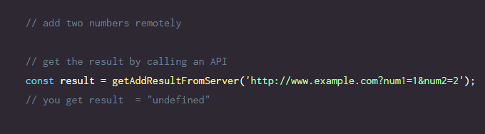

如果你用正常的函数让两个数字，你会立即得到结果.。但是，当你发出远程调用来得到结果时，你需要等待，你不能立即得到结果.。

或者这样说，你不知道你是否会得到结果，因为服务器可能会下降，响应速度慢等，你不希望在等待结果的时候，整个进程被阻止。调用API，下载文件，读取文件中的一些你要执行的常用的异步操作。

##### Promises之前的世界：Callback回调

我们必须使用promise来实现异步调用吗？不是的，在promise之前，我们使用回调。回调函数只是你得到返回结果时调用的函数.。让我们使用回调修改前面的例子。

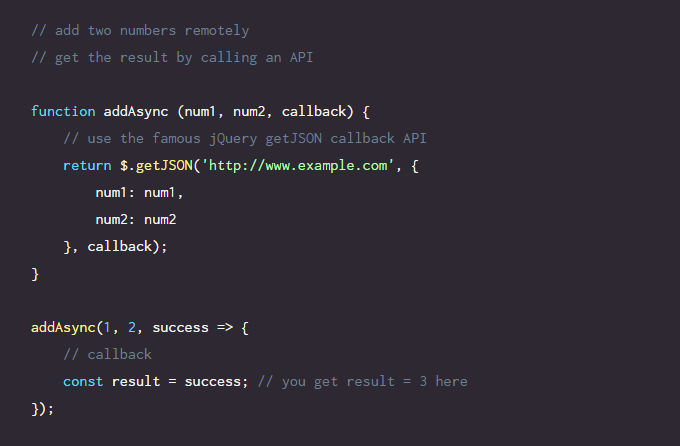

异步看起来ok，为啥还要用promise呢?

##### 如果你想进行后续的异步操作怎么办？

三个数相加，正常函数这样写：

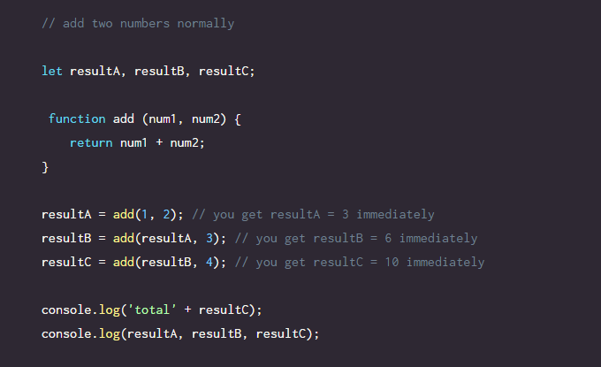

怎么看起来像回调？

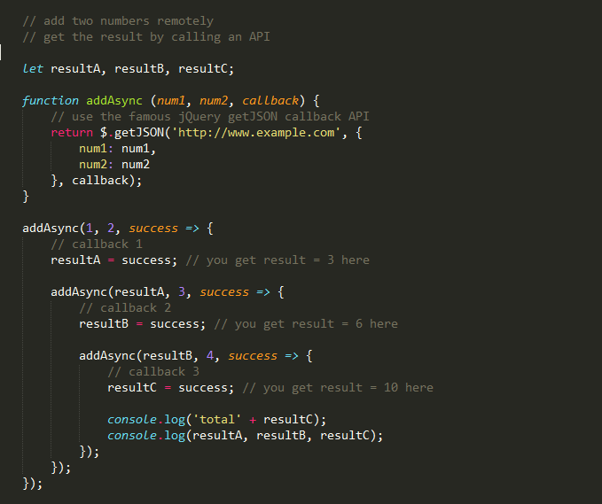

语法对用户是友好的。有一个更好的术语，它看起来像一个金字塔，但人们通常把这称为“回调地狱”，因为回调嵌套到另一个回调。假设你有10的回调，你的代码将嵌套的10倍！

##### 逃离回调地狱吧！

让promise来拯救。让我们来看看同样的例子的promise版本。

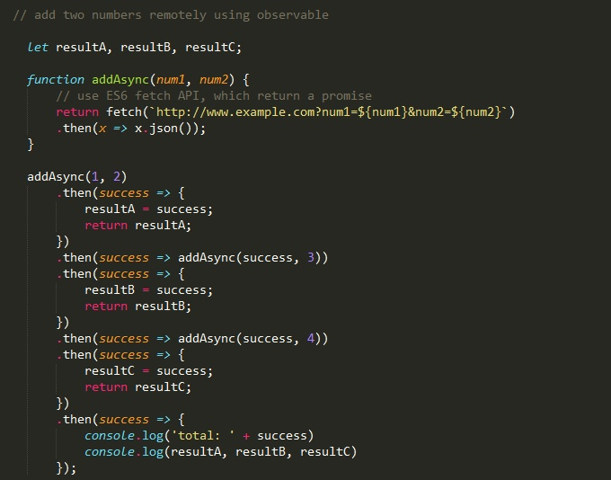

有了承诺，我们用`.then`扁平化回调。在某种程度上，因为没有回调嵌套，它看起来干净。当然，用ES7异步语法，可以让他看起来更简洁！

## 新家伙：Observables观测值

在promise已经让你很幸福的时候，Observables这货来锦上添花，让处理异步数据量更容易。

> Observables是懒惰的事件流，可以发出零个或多个事件，而且可能完成也可能不完成。

promise和observable的关键区别是：

- Observables观测值是可以取消的
- Observable是懒惰的

不要害怕，让我们来看看Observables的案例。在这个例子中，关于Observables使用RxJS。

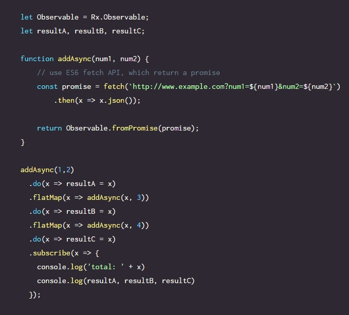

Observables观测值可以很容易的做一些时髦的东西。看案例：

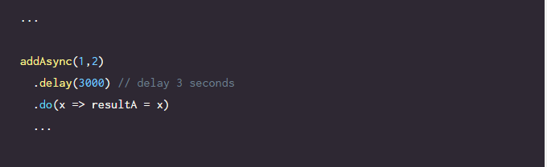

好吧，咱们以后再接着讨论Observables观测值吧！

## 总结

自己尝试了解和使用callbacks 和 promises，目前还不用太担心Observables，但是这三者都会影响到你的发展哦。

# 概念13：作用域和作用域链

[深入理解JavaScript作用域和作用域链](https://segmentfault.com/a/1190000018513150)

[大话执行环境和作用域链](https://juejin.cn/post/6844903614389944333)

## 前言

JavaScript中有一个被称为作用域(Scope)的特性。虽然对于许多新手开发者来说，作用域的概念并不是很容易理解，本文我会尽我所能用最简单的方式来解释作用域和作用域链，希望大家有所收获！

## 作用域(Scope)

### 什么是作用域

**作用域是在运行时代码中的某些特定部分中变量，函数和对象的可访问性**。换句话说**，作用域决定了代码区块中变量和其他资源的可见性**。可能这两句话并不好理解，我们先来看个例子：

~~~javascript
function outFun2() {
    var inVariable = "内层变量2";
}
outFun2();//要先执行这个函数，否则根本不知道里面是啥
console.log(inVariable); // Uncaught ReferenceError: inVariable is not defined
~~~

从上面的例子可以体会到作用域的概念，变量inVariable在全局作用域没有声明，所以在全局作用域下取值会报错。我们可以这样理解：**作用域就是一个独立的地盘，让变量不会外泄、暴露出去**。也就是说**作用域最大的用处就是隔离变量，不同作用域下同名变量不会有冲突。**

**ES6 之前 JavaScript 没有块级作用域,只有全局作用域和函数作用域**。ES6的到来，为我们提供了**‘块级作用域’**,可通过新增命令`let`和`const`来体现。

### 全局作用域和函数作用域

在代码中任何地方都能访问到的对象拥有全局作用域，一般来说以下几种情形拥有全局作用域：

- **最外层函数**和在**最外层函数外面**定义的变量拥有全局作用域

~~~javascript
var outVariable = "我是最外层变量"; //最外层变量
function outFun() { //最外层函数
    var inVariable = "内层变量";
    function innerFun() { //内层函数
        console.log(inVariable);
    }
    innerFun();
}
console.log(outVariable); //我是最外层变量

outFun(); //内层变量
console.log(inVariable); //inVariable is not defined
innerFun(); //innerFun is not defined
~~~

* 所有**末定义直接赋值**的变量自动声明为拥有全局作用域

~~~javascript
function outFun2() {
    variable = "未定义直接赋值的变量";
    var inVariable2 = "内层变量2";
}
outFun2();//要先执行这个函数，否则根本不知道里面是啥

console.log(variable); //未定义直接赋值的变量
console.log(inVariable2); //inVariable2 is not defined
~~~

* 所有**window对象的属性**拥有全局作用域

一般情况下，window对象的内置属性都拥有全局作用域，例如`window.name`、`window.location`、`window.top`等等。

全局作用域有个弊端：如果我们写了很多行 JS 代码，变量定义都没有用函数包裹，那么它们就全部都在全局作用域中。这样就会**污染全局命名空间, 容易引起命名冲突**。

~~~javascript
// 张三写的代码中
var data = {a: 100}

// 李四写的代码中
var data = {x: true}
~~~

这就是为何 jQuery、Zepto 等库的源码，所有的代码都会放在`(function(){....})()`中。因为放在里面的所有变量，都不会被外泄和暴露，不会污染到外面，不会对其他的库或者 JS 脚本造成影响。这是**函数作用域**的一个体现。

**函数作用域,是指声明在函数内部的变量**，和全局作用域相反，局部作用域一般**只在固定的代码片段内可访问到**，最常见的例如函数内部。

~~~javascript
function doSomething(){
    var blogName="浪里行舟";
    function innerSay(){
        alert(blogName);
    }
    innerSay();
}
alert(blogName); //脚本错误
innerSay(); //脚本错误
~~~

**作用域是分层的，内层作用域可以访问外层作用域的变量，反之则不行**。我们看个例子，用泡泡来比喻作用域可能好理解一点：

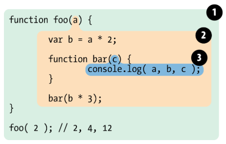

最后输出的结果为 2, 4, 12

- 泡泡1是全局作用域，有标识符foo；
- 泡泡2是作用域foo，有标识符a,bar,b；
- 泡泡3是作用域bar，仅有标识符c。

值得注意的是：**块语句（大括号“｛｝”中间的语句），如 if 和 switch 条件语句或 for 和 while 循环语句，不像函数，它们不会创建一个新的作用域**。在块语句中定义的变量将保留在它们已经存在的作用域中。

~~~javascript
if (true) {
    // 'if' 条件语句块不会创建一个新的作用域
    var name = 'Hammad'; // name 依然在全局作用域中
}
console.log(name); //'Hammad'
~~~

JS 的初学者经常需要花点时间才能习惯**变量提升**，而如果不理解这种特有行为，就可能导致bug 。正因为如此， ES6 引入了块级作用域，让变量的生命周期更加可控。

### 块级作用域

块级作用域可通过新增命令let和const声明，所声明的变量在指定块的作用域外无法被访问。块级作用域在如下情况被创建：

1. 在一个函数内部
2. 在一个代码块（由一对花括号包裹）内部

let 声明的语法与 var 的语法一致。你基本上可以用 let 来代替 var 进行变量声明，但会将变量的作用域限制在当前代码块中。块级作用域有以下几个特点：

- 声明变量不会提升到代码块顶部

let/const 声明并不会被提升到当前代码块的顶部，因此你需要手动将 let/const 声明放置到顶部，以便让变量在整个代码块内部可用。

~~~javascript
function getValue(condition) {
	if (condition) {
	 	let value = "blue";
		return value;
	} else {
		// value 在此处不可用
		return null;
	}
	// value 在此处不可用
}
~~~

* 禁止重复声明

如果一个标识符已经在代码块内部被定义，那么在此代码块内使用同一个标识符进行 let 声明就会导致抛出错误。例如：

~~~javascript
var count = 30;
let count = 40; // Uncaught SyntaxError: Identifier 'count' has already been declared
~~~

在本例中， count 变量被声明了两次：一次使用 var ，另一次使用 let 。因为 let 不能在同一作用域内重复声明一个已有标识符，此处的 let 声明就会抛出错误。但如果在嵌套的作用域内使用 let 声明一个同名的新变量，则不会抛出错误。

~~~javascript
var count = 30;
// 不会抛出错误
if (condition) {
	let count = 40;
	// 其他代码
}
~~~

* 循环中的绑定块作用域的妙用

开发者可能最希望实现for循环的块级作用域了，因为可以把声明的计数器变量限制在循环内，例如：

~~~javascript
for (let i = 0; i < 10; i++) {
  // ...
}
console.log(i);
// ReferenceError: i is not defined
~~~

上面代码中，计数器i只在for循环体内有效，在循环体外引用就会报错。

~~~javascript
var a = [];
for (var i = 0; i < 10; i++) {
  	a[i] = function(){
    console.log(i);
  	};
}
a[6](); // 10
~~~

上面代码中，变量i是var命令声明的，在全局范围内都有效，所以全局只有一个变量i。每一次循环，变量i的值都会发生改变，而循环内被赋给数组a的函数内部的console.log(i)，里面的i指向的就是全局的i。也就是说，所有数组a的成员里面的i，指向的都是同一个i，导致运行时输出的是最后一轮的i的值，也就是 10。

如果使用let，声明的变量仅在块级作用域内有效，最后输出的是 6。

~~~javascript
var a = [];
for (let i = 0; i < 10; i++) {
  a[i] = function () {
    console.log(i);
  };
}
a[6](); // 6
~~~

> 这个我懂了(学Vue的时候介绍过let和const，然后举了这个例子)，以前不懂的。

上面代码中，变量i是let声明的，当前的i只在本轮循环有效，所以每一次循环的i其实都是一个新的变量，所以最后输出的是6。你可能会问，如果每一轮循环的变量i都是重新声明的，那它怎么知道上一轮循环的值，从而计算出本轮循环的值？这是因为 JavaScript 引擎内部会记住上一轮循环的值，初始化本轮的变量i时，就在上一轮循环的基础上进行计算。

另外，for循环还有一个特别之处，就是设置循环变量的那部分是一个父作用域，而循环体内部是一个单独的子作用域。

~~~javascript
for (let i = 0; i < 3; i++) {
  let i = 'abc';
  console.log(i);
}
// abc
// abc
// abc
~~~

上面代码正确运行，输出了 3 次abc。这表明函数内部的变量i与循环变量i不在同一个作用域，有各自单独的作用域。

## 作用域链

### 什么是自由变量

首先认识一下什么叫做 **自由变量** 。如下代码中，`console.log(a)`要得到a变量，但是在当前的作用域中没有定义a（可对比一下b）。当前作用域没有定义的变量，这成为 自由变量 。自由变量的值如何得到 —— 向父级作用域寻找（注意：这种说法并不严谨，下文会重点解释）。

~~~javascript
var a = 100
function fn() {
    var b = 200
    console.log(a) // 这里的a在这里就是一个自由变量
    console.log(b)
}
fn()
~~~

### 什么是作用域链

如果父级也没呢？再一层一层向上寻找，直到找到全局作用域还是没找到，就宣布放弃。这种一层一层的关系，就是 作用域链 。

~~~javascript
var a = 100
function F1() {
    var b = 200
    function F2() {
        var c = 300
        console.log(a) // 自由变量，顺作用域链向父作用域找
        console.log(b) // 自由变量，顺作用域链向父作用域找
        console.log(c) // 本作用域的变量
    }
    F2()
}
F1()
~~~

### 关于自由变量的取值

关于自由变量的值，上文提到要到父作用域中取，其实有时候这种解释会产生歧义。

~~~javascript
var x = 10
function fn() {
  console.log(x);
}
function show(f) {
  var x = 20
  (function() {
    f() //10，而不是20
  })()
}
show(fn)
~~~

在fn函数中，取自由变量x的值时，要到哪个作用域中取？——要到**创建fn函数的那个作用域中取**，**无论fn函数将在哪里调用**。

所以，不要在用以上说法了。相比而言，用这句话描述会更加贴切:**要到创建这个函数的那个域”。**

作用域中取值，这里强调的是“**创建**”，而不是“**调用**”，切记切记——其实这就是所谓的"**静态作用域**"。

~~~javascript
var a = 10
function fn(){
  var b = 20
  function bar(){
    console.log(a + b) //30
  }
  return bar
}
var x = fn(),b = 200
x()  //bar()
~~~

fn()返回的是bar函数，赋值给x。执行x()，即执行bar函数代码。取b的值时，直接在fn作用域取出。取a的值时，试图在fn作用域取，但是取不到，只能转向创建fn的那个作用域中去查找，结果找到了,所以最后的结果是30。

## 作用域与执行上下文

许多开发人员经常混淆作用域和执行上下文的概念，误认为它们是相同的概念，但事实并非如此。

我们知道JavaScript属于**解释型语言**，JavaScript的执行分为：**解释和执行两个阶段**,这两个阶段所做的事并不一样：

### 解释阶段

- 词法分析
- 语法分析
- 作用域规则确定

### 执行阶段

- 创建执行上下文
- 执行函数代码
- 垃圾回收

JavaScript解释阶段便会确定作用域规则，因此作用域在函数定义时就已经确定了，而不是在函数调用时确定，但是执行上下文是函数执行之前创建的。执行上下文最明显的就是this的指向是执行时确定的。而作用域访问的变量是编写代码的结构确定的。

作用域和执行上下文之间最大的区别是：
**执行上下文在运行时确定，随时可能改变；作用域在定义时就确定，并且不会改变**。

一个作用域下可能包含若干个上下文环境。有可能从来没有过上下文环境（函数从来就没有被调用过）；有可能有过，现在函数被调用完毕后，上下文环境被销毁了；有可能同时存在一个或多个（闭包）。**同一个作用域下，不同的调用会产生不同的执行上下文环境，继而产生不同的变量的值**。

> 这文章写的挺好的，通俗易懂。

# 概念14： JavaScript 执行机制

[这一次，彻底弄懂 JavaScript 执行机制](https://juejin.cn/post/6844903512845860872)

本文的目的就是要保证你彻底弄懂javascript的执行机制，如果读完本文还不懂，可以揍我。

不论你是javascript新手还是老鸟，不论是面试求职，还是日常开发工作，我们经常会遇到这样的情况：给定的几行代码，我们需要知道其输出内容和顺序。因为javascript是一门单线程语言，所以我们可以得出结论：

- javascript是按照语句出现的顺序执行的

看到这里读者要打人了：我难道不知道js是一行一行执行的？还用你说？稍安勿躁，正因为js是一行一行执行的，所以我们以为js都是这样的：

```javascript
let a = '1';
console.log(a);

let b = '2';
console.log(b);
```

然而实际上JS是这样的：

~~~javascript
setTimeout(function(){
    console.log('定时器开始啦')
});

new Promise(function(resolve){
    console.log('马上执行for循环啦');
    for(var i = 0; i < 10000; i++){
        i == 99 && resolve();
    }
}).then(function(){
    console.log('执行then函数啦')
});

console.log('代码执行结束');
~~~

依照**js是按照语句出现的顺序执行**这个理念，我自信的写下输出结果：

~~~javascript
//"定时器开始啦"
//"马上执行for循环啦"
//"执行then函数啦"
//"代码执行结束"
~~~

去chrome上验证下，结果完全不对，瞬间懵了，说好的一行一行执行的呢？

我们真的要彻底弄明白javascript的执行机制了。

## 1.关于javascript

javascript是一门**单线程**语言，在最新的HTML5中提出了Web-Worker，但javascript是单线程这一核心仍未改变。所以一切javascript版的"多线程"都是用单线程模拟出来的，一切javascript多线程都是纸老虎！

## 2.javascript事件循环

既然js是单线程，那就像只有一个窗口的银行，客户需要排队一个一个办理业务，同理js任务也要一个一个顺序执行。如果一个任务耗时过长，那么后一个任务也必须等着。那么问题来了，假如我们想浏览新闻，但是新闻包含的超清图片加载很慢，难道我们的网页要一直卡着直到图片完全显示出来？因此聪明的程序员将任务分为两类：

- 同步任务
- 异步任务

当我们打开网站时，网页的渲染过程就是一大堆同步任务，比如页面骨架和页面元素的渲染。而像加载图片音乐之类占用资源大耗时久的任务，就是异步任务。关于这部分有严格的文字定义，但本文的目的是用最小的学习成本彻底弄懂执行机制，所以我们用导图来说明：

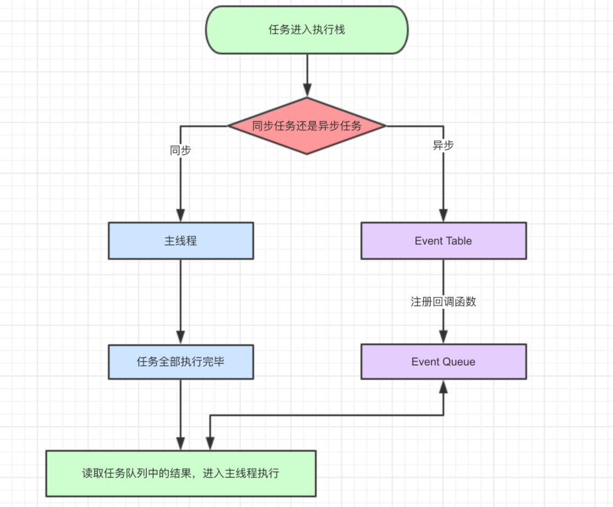

导图要表达的内容用文字来表述的话：

- 同步和异步任务分别进入不同的执行"场所"，同步的进入主线程，异步的进入Event Table并注册函数。
- 当指定的事情完成时，Event Table会将这个函数移入Event Queue。
- 主线程内的任务执行完毕为空，会去Event Queue读取对应的函数，进入主线程执行。
- 上述过程会不断重复，也就是常说的Event Loop(事件循环)。

我们不禁要问了，那怎么知道主线程执行栈为空啊？js引擎存在monitoring process进程，会持续不断的检查主线程执行栈是否为空，一旦为空，就会去Event Queue那里检查是否有等待被调用的函数。

说了这么多文字，不如直接一段代码更直白：

~~~javascript
let data = [];
$.ajax({
    url:www.javascript.com,
    data:data,
    success:() => {
        console.log('发送成功!');
    }
})
console.log('代码执行结束');
~~~

上面是一段简易的`ajax`请求代码：

- ajax进入Event Table，注册回调函数`success`。
- 执行`console.log('代码执行结束')`。
- ajax事件完成，回调函数`success`进入Event Queue。
- 主线程从Event Queue读取回调函数`success`并执行。

相信通过上面的文字和代码，你已经对js的执行顺序有了初步了解。接下来我们来研究进阶话题：setTimeout。

## 3.又爱又恨的setTimeout

大名鼎鼎的`setTimeout`无需再多言，大家对他的第一印象就是异步可以延时执行，我们经常这么实现延时3秒执行：

```javascript
setTimeout(() => {
    console.log('延时3秒');
},3000)
```

渐渐的`setTimeout`用的地方多了，问题也出现了，有时候明明写的延时3秒，实际却5，6秒才执行函数，这又咋回事啊？

先看一个例子：

```javascript
setTimeout(() => {
    task();
},3000)
console.log('执行console');
```

根据前面我们的结论，`setTimeout`是异步的，应该先执行`console.log`这个同步任务，所以我们的结论是：

```javascript
//执行console
//task()
```

去验证一下，结果正确！ 然后我们修改一下前面的代码：

```javascript
setTimeout(() => {
    task()
},3000)

sleep(10000000)
```

乍一看其实差不多嘛，但我们把这段代码在chrome执行一下，却发现控制台执行`task()`需要的时间远远超过3秒，说好的延时三秒，为啥现在需要这么长时间啊？

这时候我们需要重新理解`setTimeout`的定义。我们先说上述代码是怎么执行的：

- `task()`进入Event Table并注册,计时开始。
- 执行`sleep`函数，很慢，非常慢，计时仍在继续。
- 3秒到了，计时事件`timeout`完成，`task()`进入Event Queue，但是`sleep`也太慢了吧，还没执行完，只好等着。
- `sleep`终于执行完了，`task()`终于从Event Queue进入了主线程执行。

上述的流程走完，我们知道`setTimeout`这个函数，是经过指定时间后，把要执行的任务(本例中为`task()`)加入到Event Queue中，又因为是单线程任务要一个一个执行，如果前面的任务需要的时间太久，那么只能等着，导致真正的延迟时间远远大于3秒。

我们还经常遇到`setTimeout(fn,0)`这样的代码，0秒后执行又是什么意思呢？是不是可以立即执行呢？

答案是不会的，`setTimeout(fn,0)`的含义是，指定某个任务在主线程最早可得的空闲时间执行，意思就是不用再等多少秒了，只要主线程执行栈内的同步任务全部执行完成，栈为空就马上执行。举例说明：

```javascript
//代码1
console.log('先执行这里');
setTimeout(() => {
    console.log('执行啦')
},0);
```

~~~javascript
//代码2
console.log('先执行这里');
setTimeout(() => {
    console.log('执行啦')
},3000);  
~~~

代码1的输出结果是：

```javascript
//先执行这里
//执行啦
```

代码2的输出结果是：

```javascript
//先执行这里
// ... 3s later
// 执行啦
```

关于`setTimeout`要补充的是，即便主线程为空，0毫秒实际上也是达不到的。根据HTML的标准，最低是4毫秒。有兴趣的同学可以自行了解。

## 4.又恨又爱的setInterval

上面说完了`setTimeout`，当然不能错过它的孪生兄弟`setInterval`。他俩差不多，只不过后者是循环的执行。对于执行顺序来说，`setInterval`会每隔指定的时间将注册的函数置入Event Queue，如果前面的任务耗时太久，那么同样需要等待。

唯一需要注意的一点是，对于`setInterval(fn,ms)`来说，我们已经知道不是每过`ms`秒会执行一次`fn`，而是每过`ms`秒，会有`fn`进入Event Queue。一旦**`setInterval`的回调函数`fn`执行时间超过了延迟时间`ms`，那么就完全看不出来有时间间隔了**。这句话请读者仔细品味。

## 5.Promise与process.nextTick(callback)

传统的定时器我们已经研究过了，接着我们探究`Promise`与`process.nextTick(callback)`的表现。

`Promise`的定义和功能本文不再赘述，不了解的读者可以学习一下阮一峰老师的[Promise](http://es6.ruanyifeng.com/#docs/promise)。而`process.nextTick(callback)`类似node.js版的"setTimeout"，在事件循环的下一次循环中调用 callback 回调函数。

我们进入正题，除了广义的同步任务和异步任务，我们对任务有更精细的定义：

- macro-task(宏任务)：包括整体代码script，setTimeout，setInterval
- micro-task(微任务)：Promise，process.nextTick

不同类型的任务会进入对应的Event Queue，比如`setTimeout`和`setInterval`会进入相同的Event Queue。

事件循环的顺序，决定js代码的执行顺序。进入整体代码(宏任务)后，开始第一次循环。接着执行所有的微任务。然后再次从宏任务开始，找到其中一个任务队列执行完毕，再执行所有的微任务。听起来有点绕，我们用文章最开始的一段代码说明：

~~~javascript
setTimeout(function() {
    console.log('setTimeout');
})

new Promise(function(resolve) {
    console.log('promise');
}).then(function() {
    console.log('then');
})

console.log('console');
~~~

- 这段代码作为宏任务，进入主线程。
- 先遇到`setTimeout`，那么将其回调函数注册后分发到宏任务Event Queue。(注册过程与上同，下文不再描述)
- 接下来遇到了`Promise`，`new Promise`立即执行，`then`函数分发到微任务Event Queue。
- 遇到`console.log()`，立即执行。
- 好啦，整体代码script作为第一个宏任务执行结束，看看有哪些微任务？我们发现了`then`在微任务Event Queue里面，执行。
- ok，第一轮事件循环结束了，我们开始第二轮循环，当然要从宏任务Event Queue开始。我们发现了宏任务Event Queue中`setTimeout`对应的回调函数，立即执行。
- 结束。

事件循环，宏任务，微任务的关系如图所示：

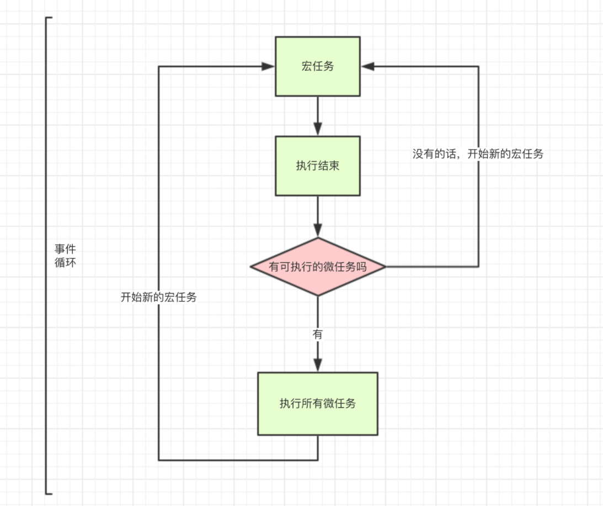

我们来分析一段较复杂的代码，看看你是否真的掌握了js的执行机制：

~~~javascript
console.log('1');

setTimeout(function() {
    console.log('2');
    process.nextTick(function() {
        console.log('3');
    })
    new Promise(function(resolve) {
        console.log('4');
        resolve();
    }).then(function() {
        console.log('5')
    })
})
process.nextTick(function() {
    console.log('6');
})
new Promise(function(resolve) {
    console.log('7');
    resolve();
}).then(function() {
    console.log('8')
})

setTimeout(function() {
    console.log('9');
    process.nextTick(function() {
        console.log('10');
    })
    new Promise(function(resolve) {
        console.log('11');
        resolve();
    }).then(function() {
        console.log('12')
    })
})
~~~

第一轮事件循环流程分析如下：

- 整体script作为第一个宏任务进入主线程，遇到`console.log`，输出1。
- 遇到`setTimeout`，其回调函数被分发到宏任务Event Queue中。我们暂且记为`setTimeout1`。
- 遇到`process.nextTick()`，其回调函数被分发到微任务Event Queue中。我们记为`process1`。
- 遇到`Promise`，`new Promise`直接执行，输出7。`then`被分发到微任务Event Queue中。我们记为`then1`。
- 又遇到了`setTimeout`，其回调函数被分发到宏任务Event Queue中，我们记为`setTimeout2`。

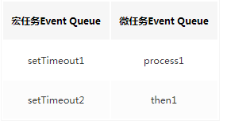

- 上表是第一轮事件循环宏任务结束时各Event Queue的情况，此时已经输出了1和7。
- 我们发现了`process1`和`then1`两个微任务。
- 执行`process1`,输出6。
- 执行`then1`，输出8。

好了，第一轮事件循环正式结束，这一轮的结果是输出1，7，6，8。那么第二轮时间循环从`setTimeout1`宏任务开始：

- 首先输出2。接下来遇到了`process.nextTick()`，同样将其分发到微任务Event Queue中，记为`process2`。`new Promise`立即执行输出4，`then`也分发到微任务Event Queue中，记为`then2`。


第二轮事件循环宏任务结束，我们发现有`process2`和`then2`两个微任务可以执行。

输出3。

输出5。

第二轮事件循环结束，第二轮输出2，4，3，5。

第三轮事件循环开始，此时只剩setTimeout2了，执行。

直接输出9。

将`process.nextTick()`分发到微任务Event Queue中。记为`process3`。

直接执行`new Promise`，输出11。

将`then`分发到微任务Event Queue中，记为`then3`。


- 第三轮事件循环宏任务执行结束，执行两个微任务`process3`和`then3`。
- 输出10。
- 输出12。
- 第三轮事件循环结束，第三轮输出9，11，10，12。

整段代码，共进行了三次事件循环，完整的输出为1，7，6，8，2，4，3，5，9，11，10，12。 (请注意，node环境下的事件监听依赖libuv与前端环境不完全相同，输出顺序可能会有误差)

## 6.写在最后

### (1)js的异步

我们从最开头就说javascript是一门单线程语言，不管是什么新框架新语法糖实现的所谓异步，其实都是用同步的方法去模拟的，牢牢把握住单线程这点非常重要。

### (2)事件循环Event Loop

事件循环是js实现异步的一种方法，也是js的执行机制。

### (3)javascript的执行和运行

执行和运行有很大的区别，javascript在不同的环境下，比如node，浏览器，Ringo等等，执行方式是不同的。而运行大多指javascript解析引擎，是统一的。

### (4)setImmediate

微任务和宏任务还有很多种类，比如`setImmediate`等等，执行都是有共同点的，有兴趣的同学可以自行了解。

### (5)最后的最后

- javascript是一门单线程语言
- Event Loop是javascript的执行机制

牢牢把握两个基本点，以认真学习javascript为中心，早日实现成为前端高手的伟大梦想！

# 概念15：节流和防抖

[搞懂节流与防抖竟简单如斯](https://juejin.cn/post/6916386899678461960)

## 防抖篇

### 防抖小故事

小熊早上去找小虎玩，到了小虎家门口，小熊准备一直摁门铃吵醒小虎，所以小熊一直摁门铃，可是门铃一次也没有响。小熊以为门铃坏了，于是停止摁门铃，过了一会儿门铃响了。小虎在屋里嘿嘿一笑：我的门铃可是做了**防抖**操作呦，一直摁只有最后一次才会响。

### 防抖逻辑图

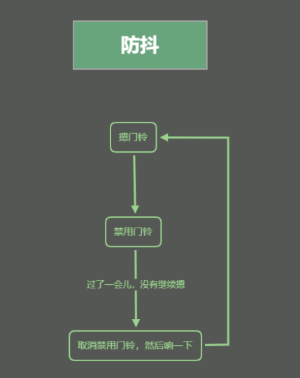


# 概念16：函数对象、对象、原型

[函数对象、对象、原型](https://juejin.cn/post/6844903793285398535)

[最详尽的 JS 原型与原型链终极详解](https://www.jianshu.com/p/dee9f8b14771)

[彻底理解JavaScript原型链（一）—__proto__的默认指向](https://www.jianshu.com/p/686b61c4a43d)

[高能！typeof Function.prototype 引发的先有 Function 还是先有 Object 的探讨](https://segmentfault.com/a/1190000005754797)

## 序、范例代码

以下为范例代码，本文中讲解多次用到这段代码，可以在阅读本文前提前运行，边看文边敲码验证。

~~~javascript
function Person(){}; //构造函数
var person = new Person(); //实例对象
~~~

## 对象

每个对象都是基于一个引用类型创建的，这个引用类型可以是**原生类型**（Object、Array、Function等），也可以是**用户自定义的类型**。

对象总的来说大致可以分成两种：

### 函数对象（Function Object）

通过`new Function()`生成函数并为其指定函数名，通过函数名来进行调用，其实就是我们通常所说的函数。

### 其他类型的对象（Object）

直接通过new操作符生成（除了Function类型）的对象，如new Object(); 。

对象通过new操作符创建的过程：

（1）创建一个新对象；

（2）将构造函数的作用域赋给新对象（this就会指向这个新对象）；

（3）执行构造函数中的代码（为对象添加属性）；

（4）返回新对象。

## 原型指针（\_\_proto\_\_）

当构造函数创建一个新实例（又称实例对象，下同）后，该实例下都会存在一个指针__proto__（内部属性），**指向创建这个实例的构造函数（constructor指向值）下的原型对象（prototype）**。**只要是个对象，都会有\_\_proto\_\_**。

根据范例代码来看，person是属于构造函数Person的一个实例，`person.__proto__ === Person.prototype`为true。要明确的真正重要的一点就是，这个连接存在于实例与构造函数的原型对象之间，而不是存在于实例与构造函数之间。

这里出现了另外两个名词：构造函数和原型对象，请看下面内容。

## 构造函数（constructor指向值）

构造函数的解释是这样的，创建对象时初始化对象。任何函数，只要通过new操作符来调用，那它就可以作为构造函数。像Object和Array等这样执行环境自带的称为原生构造函数，它们会在运行时自动出现在执行环境中。

观察范例代码，person是一个对象，而他的构造函数就是Person，`Person.prototype.constructor === Person`为true。

## 原型对象（prototype）

原型对象比较特殊（划重点），**只有函数对象会拥有**，是用来解决构造函数在创建实例的时候，防止重复执行所导致的性能的降低(这里主要指占用内存)，**为复用带来方便**。

无论什么时候，只要创建了一个新函数，就会根据一组特定的规则为该函数创建一个prototype属性，这个属性是一个指针，指向函数的原型对象，这个原型对象的用途是包含可以由特定类型的所有实例共享的属性和方法，如果按照字面意思来理解，那么prototype也是通过调用构造函数而创建的那个对象实例的原型对象（\_\_proto\_\_指向值）。

在默认情况下，**所有原型对象（prototype）都会自动获得一个constructor属性，这个属性包含一个指针，指向prototype属性所在函数，通常会是构造函数**。

## 原型搜索机制

每当代码读取某个对象的某个属性时，都会执行一次搜索，目标是具有给定名字的属性。搜索首先从对象实例本身开始。如果在实例中找到了具有给定名字的属性，则返回该属性的值；如果没有找到，则继续搜索指针指向的原型对象，在原型对象中查找具有给定名字的属性。如果在原型对象中找到了这个属性，则返回该属性的值。

以上就是原型搜索机制的大致介绍。原型链继承（此篇不讲，有兴趣自行谷歌百度）则是在这个基础上进行扩展，然后实现继承，基本思想是利用原型让一个引用类型继承另一个引用类型的属性和方法。

## 原型关系图

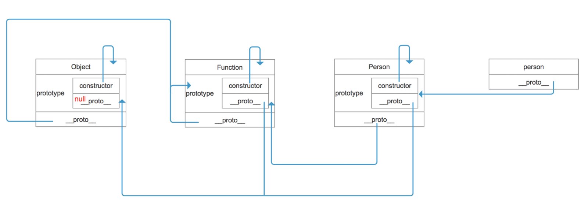

如上图，我们从最简单的关系入手。以范例代码为例，创建Person函数，然后进行实例化生成实例对象person。

我们来看看实例对象person和函数Person各自的原型关系：

### person（实例对象）

person会有一个\_\_proto\_\_指针，指向构造函数的原型对象`Person.prototype`。`Person.prototype`会有两个属性constructor和\_\_proto\_\_，constructor指向构造函数Person，\_\_proto\_\_指向原生类型Object的原型对象`Object.prototype`。`Object.prototype`有两个属性constructor和\_\_proto\_\_，constructor指向它的构造函数Object，而比较特殊的是\_\_proto\_\_的值为null（原型链的终点），用下列代码可验证。

~~~javascript
person.__proto__ === Person.prototype; //true
person.__proto__.__proto__ === Person.prototype.__proto__; //true
person.__proto__.__proto__ === Object.prototype; //true
Person.prototype.__proto__ === Object.prototype; //true
Object.prototype.__proto__ === null; //true
~~~

### Person（构造函数）

Person函数也会有一个\_\_proto\_\_指针，不同的是多了一个prototype对象属性。prototype的构成上面已经介绍过就不重复了，\_\_proto\_\_指向原生类型Function的原型对象Function.prototype。Function.prototype有两个属性constructor和\_\_proto\_\_，constructor指向构造函数Function，\_\_proto\_\_指向Object的原型对象`Object.prototype`，介绍同上。

~~~javascript
Person.__proto__ === Function.prototype; //true
Function.prototype.__proto__ === Object.prototype; //true
Person.prototype.__proto__ === Object.prototype; //true
Object.prototype.__proto__ === null; //true
~~~

### 原生类型函数

Function函数和Object函数除了prototype之外都存在一个\_\_proto\_\_指针，都是指向Function的原型对象Function.prototype，介绍同上。

~~~javascript
Object.__proto__ === Function.prototype; //true
Function.__proto__ === Function.prototype; //true
~~~

### 总结

构造函数、原型和实例的关系：每个构造函数都有一个原型对象，原型对象都包含一个指向构造函数的指针，而实例都包含一个指向原型的内部指针。所有构造函数的\_\_proto\_\_指针指向都是Function.prototype；所有对象的\_\_proto\_\_指针最终指向都是指向Object.prototype，而Object.prototype的\_\_proto\_\_属性值则为null。

## 写在最后

最近在网上看见一个类似关于Function和Object谁是爸爸（由谁而来）的问题，记得最开始学js时就把“js中万物皆对象”这句话给记牢了，想着应该是对象最原始，但是凡事都要有个理（拿出证据来），所以就深究了一下以上函数和对象的一些关系，至于谁是爸爸，明确不出来，但是有一点可以肯定的是，无论是谁，按关系图最后的走向都是null（貌似已经出现结果。。。）。

# 概念17：事件循环(event loop)

[JavaScript 运行机制详解：再谈Event Loop](http://www.ruanyifeng.com/blog/2014/10/event-loop.html)

## 为什么JavaScript是单线程？

JavaScript语言的一大特点就是单线程，也就是说，同一个时间只能做一件事。那么，为什么JavaScript不能有多个线程呢？这样能提高效率啊。

JavaScript的单线程，与它的用途有关。作为浏览器脚本语言，JavaScript的主要用途是与用户互动，以及操作DOM。这决定了它只能是单线程，否则会带来很复杂的同步问题。比如，假定JavaScript同时有两个线程，一个线程在某个DOM节点上添加内容，另一个线程删除了这个节点，这时浏览器应该以哪个线程为准？

所以，为了避免复杂性，从一诞生，JavaScript就是单线程，这已经成了这门语言的核心特征，将来也不会改变。

为了利用多核CPU的计算能力，HTML5提出Web Worker标准，允许JavaScript脚本创建多个线程，但是子线程完全受主线程控制，且不得操作DOM。所以，这个新标准并没有改变JavaScript单线程的本质。

## 任务队列

单线程就意味着，所有任务需要排队，前一个任务结束，才会执行后一个任务。如果前一个任务耗时很长，后一个任务就不得不一直等着。

如果排队是因为计算量大，CPU忙不过来，倒也算了，但是很多时候CPU是闲着的，因为IO设备（输入输出设备）很慢（比如Ajax操作从网络读取数据），不得不等着结果出来，再往下执行。

JavaScript语言的设计者意识到，这时主线程完全可以不管IO设备，挂起处于等待中的任务，先运行排在后面的任务。等到IO设备返回了结果，再回过头，把挂起的任务继续执行下去。

于是，所有任务可以分成两种，一种是同步任务（synchronous），另一种是异步任务（asynchronous）。同步任务指的是，在**主线程**上排队执行的任务，只有前一个任务执行完毕，才能执行后一个任务；异步任务指的是，不进入主线程、而进入"**任务队列**"（task queue）的任务，**只有"任务队列"通知主线程，某个异步任务可以执行了，该任务才会进入主线程执行**。

具体来说，异步执行的运行机制如下。（同步执行也是如此，因为它可以被视为没有异步任务的异步执行。

* 所有同步任务都在主线程上执行，形成一个执行栈（execution context stack）。
* **主线程之外，还存在一个"任务队列"（task queue）**。只要异步任务有了运行结果，就在"任务队列"之中放置一个事件。
* **一旦"执行栈"中的所有同步任务执行完毕，系统就会读取"任务队列"，看看里面有哪些事件**。那些对应的异步任务，于是结束等待状态，**进入执行栈**，开始执行。
* **主线程不断重复**上面的第三步。

下图就是主线程和任务队列的示意图。

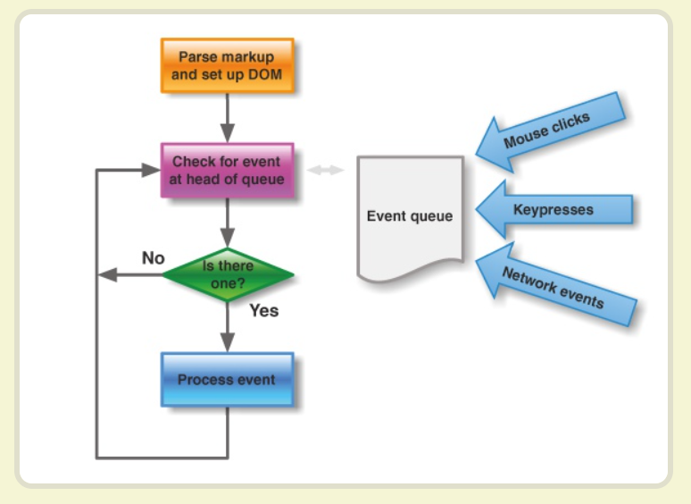

只要主线程空了，就会去读取"任务队列"，这就是JavaScript的运行机制。这个过程会不断重复。

## 事件和回调函数

"任务队列"是一个事件的队列（也可以理解成消息的队列），IO设备完成一项任务，就在"任务队列"中添加一个事件，表示相关的异步任务可以进入"执行栈"了。主线程读取"任务队列"，就是读取里面有哪些事件。

"任务队列"中的事件，除了IO设备的事件以外，还包括一些用户产生的事件（比如鼠标点击、页面滚动等等）。只要指定过回调函数，这些事件发生时就会进入"任务队列"，等待主线程读取。

所谓"回调函数"（callback），就是那些会被主线程挂起来的代码。异步任务必须指定回调函数，当主线程开始执行异步任务，就是执行对应的回调函数。

"任务队列"是一个先进先出的数据结构，排在前面的事件，优先被主线程读取。主线程的读取过程基本上是自动的，只要执行栈一清空，"任务队列"上第一位的事件就自动进入主线程。但是，由于存在后文提到的"定时器"功能，主线程首先要检查一下执行时间，某些事件只有到了规定的时间，才能返回主线程。

## Event Loop

主线程从"任务队列"中读取事件，这个过程是循环不断的，所以整个的这种运行机制又称为Event Loop（事件循环）。

为了更好地理解Event Loop，请看下图（转引自Philip Roberts的演讲[《Help, I'm stuck in an event-loop》](http://vimeo.com/96425312)）。

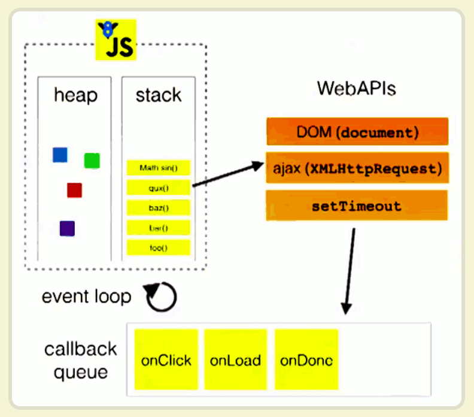

上图中，**主线程**运行的时候，产生堆（heap）和栈（stack），栈中的代码调用各种外部API，它们在"任务队列"中加入各种事件（click，load，done）。只要栈中的代码执行完毕，主线程就会去读取"任务队列"，依次执行那些事件所对应的回调函数。

执行栈中的代码（同步任务），总是在读取"任务队列"（异步任务）之前执行。请看下面这个例子。

~~~javascript
 var req = new XMLHttpRequest();
 req.open('GET', url);    
 req.onload = function (){};    
 req.onerror = function (){};    
 req.send();
~~~

上面代码中的`req.send`方法是Ajax操作向服务器发送数据，它是一个异步任务，意味着只有当前脚本的所有代码执行完，系统才会去读取"任务队列"。所以，它与下面的写法**等价**。

~~~javascript
var req = new XMLHttpRequest();
req.open('GET', url);
req.send();
req.onload = function (){};    
req.onerror = function (){};  
~~~

也就是说，指定回调函数的部分（onload和onerror），**在send()方法的前面或后面无关紧要**，因为它们属于执行栈的一部分，系统总是执行完它们，才会去读取"任务队列"。

## 定时器

除了放置异步任务的事件，"任务队列"还可以放置定时事件，即指定某些代码在多少时间之后执行。这叫做"定时器"（timer）功能，也就是定时执行的代码。

定时器功能主要由`setTimeout()`和`setInterval()`这两个函数来完成，它们的内部运行机制完全一样，区别在于前者指定的代码是一次性执行，后者则为反复执行。以下主要讨论`setTimeout()`。

`setTimeout()`接受两个参数，第一个是回调函数，第二个是推迟执行的毫秒数。

~~~javascript
console.log(1);
setTimeout(function(){console.log(2);},1000);
console.log(3);
~~~

上面代码的执行结果是1，3，2，因为setTimeout()将第二行推迟到1000毫秒之后执行。

如果将setTimeout()的第二个参数设为0，就表示当前代码执行完（执行栈清空）以后，立即执行（0毫秒间隔）指定的回调函数。

~~~javascript
setTimeout(function(){console.log(1);}, 0);
console.log(2);
~~~

上面代码的执行结果总是2，1，因为只有在执行完第二行以后，系统才会去执行"任务队列"中的回调函数。

总之，setTimeout(fn,0)的含义是，指定某个任务在主线程最早可得的空闲时间执行，也就是说，尽可能早得执行。它在"任务队列"的尾部添加一个事件，因此要等到同步任务和"任务队列"现有的事件都处理完，才会得到执行。

HTML5标准规定了setTimeout()的第二个参数的最小值（最短间隔），不得低于4毫秒，如果低于这个值，就会自动增加。在此之前，老版本的浏览器都将最短间隔设为10毫秒。另外，对于那些DOM的变动（尤其是涉及页面重新渲染的部分），通常不会立即执行，而是每16毫秒执行一次。这时使用requestAnimationFrame()的效果要好于setTimeout()。

需要注意的是，setTimeout()只是将事件插入了"任务队列"，必须等到当前代码（执行栈）执行完，主线程才会去执行它指定的回调函数。要是当前代码耗时很长，有可能要等很久，所以**并没有办法保证，回调函数一定会在setTimeout()指定的时间执行**。

## Node.js的Event Loop

Node.js也是单线程的Event Loop，但是它的运行机制不同于浏览器环境。

请看下面的示意图（作者[@BusyRich](https://twitter.com/BusyRich/status/494959181871316992)）。

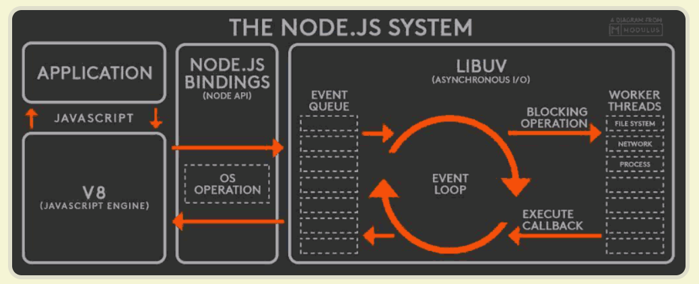

根据上图，Node.js的运行机制如下。

* V8引擎解析JavaScript脚本。
* 解析后的代码，调用Node API。
* [libuv库](https://github.com/joyent/libuv)负责Node API的执行。它将不同的任务分配给不同的线程，形成一个Event Loop（事件循环），以异步的方式将任务的执行结果返回给V8引擎。
* V8引擎再将结果返回给用户。

除了setTimeout和setInterval这两个方法，Node.js还提供了另外两个与"任务队列"有关的方法：[process.nextTick](http://nodejs.org/docs/latest/api/process.html#process_process_nexttick_callback)和[setImmediate](http://nodejs.org/docs/latest/api/timers.html#timers_setimmediate_callback_arg)。它们可以帮助我们加深对"任务队列"的理解。

process.nextTick方法可以在当前"执行栈"的尾部----下一次Event Loop（主线程读取"任务队列"）之前----触发回调函数。也就是说，它指定的任务总是发生在所有异步任务之前。setImmediate方法则是在当前"任务队列"的尾部添加事件，也就是说，它指定的任务总是在下一次Event Loop时执行，这与setTimeout(fn, 0)很像。请看下面的例子（via [StackOverflow](http://stackoverflow.com/questions/17502948/nexttick-vs-setimmediate-visual-explanation)）。

~~~javascript
process.nextTick(function A() {
  console.log(1);
  process.nextTick(function B(){console.log(2);});
});

setTimeout(function timeout() {
  console.log('TIMEOUT FIRED');
}, 0)
// 1
// 2
// TIMEOUT FIRED
~~~

上面代码中，由于process.nextTick方法指定的回调函数，总是在当前"执行栈"的尾部触发，所以不仅函数A比setTimeout指定的回调函数timeout先执行，而且函数B也比timeout先执行。这说明，如果有多个process.nextTick语句（不管它们是否嵌套），将全部在当前"执行栈"执行。

现在，再看setImmediate。

~~~javascript
setImmediate(function A() {
  console.log(1);
  setImmediate(function B(){console.log(2);});
});

setTimeout(function timeout() {
  console.log('TIMEOUT FIRED');
}, 0);
~~~

上面代码中，setImmediate与setTimeout(fn,0)各自添加了一个回调函数A和timeout，都是在下一次Event Loop触发。那么，哪个回调函数先执行呢？答案是不确定。运行结果可能是1--TIMEOUT FIRED--2，也可能是TIMEOUT FIRED--1--2。

令人困惑的是，Node.js文档中称，setImmediate指定的回调函数，总是排在setTimeout前面。实际上，这种情况只发生在递归调用的时候。

~~~javascript
setImmediate(function (){
  setImmediate(function A() {
    console.log(1);
    setImmediate(function B(){console.log(2);});
  });

setTimeout(function timeout() {
    console.log('TIMEOUT FIRED');
  }, 0);
});
// 1
// TIMEOUT FIRED
// 2
~~~

上面代码中，setImmediate和setTimeout被封装在一个setImmediate里面，它的运行结果总是1--TIMEOUT FIRED--2，这时函数A一定在timeout前面触发。至于2排在TIMEOUT FIRED的后面（即函数B在timeout后面触发），是因为setImmediate总是将事件注册到下一轮Event Loop，所以函数A和timeout是在同一轮Loop执行，而函数B在下一轮Loop执行。

我们由此得到了process.nextTick和setImmediate的一个重要区别：多个process.nextTick语句总是在当前"执行栈"一次执行完，多个setImmediate可能则需要多次loop才能执行完。事实上，这正是Node.js 10.0版添加setImmediate方法的原因，否则像下面这样的递归调用process.nextTick，将会没完没了，主线程根本不会去读取"事件队列"！

~~~javascript
process.nextTick(function foo() {
  process.nextTick(foo);
});
~~~

事实上，现在要是你写出递归的process.nextTick，Node.js会抛出一个警告，要求你改成setImmediate。

另外，由于process.nextTick指定的回调函数是在本次"事件循环"触发，而setImmediate指定的是在下次"事件循环"触发，所以很显然，前者总是比后者发生得早，而且执行效率也高（因为不用检查"任务队列"）。

# 概念18：同步与异步

[视频链接](https://www.bilibili.com/video/BV1Uk4y1R7cP?from=search&seid=2055613987226705839)

