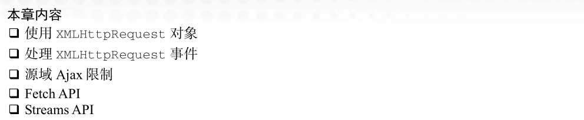
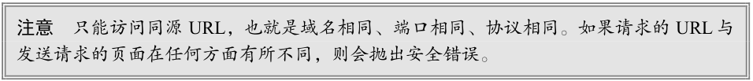
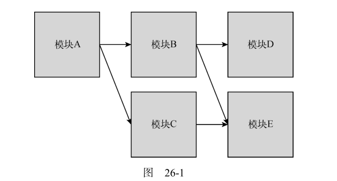
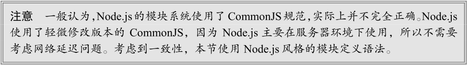
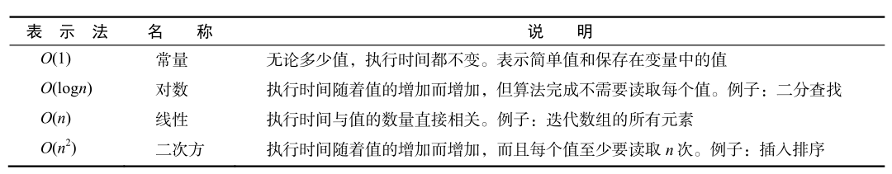
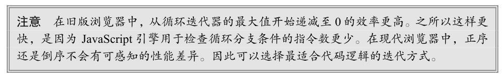

# 第22章：处理 XML

# 第23章：JSON

/13.png)

正如上一章所说，XML 曾经一度成为互联网上传输数据的事实标准。第一代 Web 服务很大程度上是以 XML 为基础的，以服务器间通信为主要特征。可是，XML 也并非没有批评者。有的人认为 XML
过于冗余和啰唆。为解决这些问题，也出现了几种方案。不过 Web 已经朝着它的新方向进发了。

2006 年，Douglas Crockford 在国际互联网工程任务组（IETF，The Internet Engineering Task Force）
制定了 JavaScript 对象简谱（JSON，JavaScript Object Notation）标准，即 RFC 4627。但实际上，JSON
早在 2001 年就开始使用了。JSON 是 JavaScript 的严格子集，利用 JavaScript 中的几种模式来表示结构
化数据。Crockford 将 JSON 作为替代 XML 的一个方案提出，因为 JSON 可以直接传给 eval() 而不需
要创建 DOM。

理解 JSON 最关键的一点是要把它当成一种数据格式，而不是编程语言。JSON 不属于 JavaScript，
它们只是拥有相同的语法而已。JSON 也不是只能在 JavaScript 中使用，它是一种通用数据格式。很多语
言都有解析和序列化 JSON 的内置能力。

## 语法

JSON 语法支持表示 3 种类型的值。

*  **简单值**：字符串、数值、布尔值和 null 可以在 JSON 中出现，就像在 JavaScript 中一样。**特殊值undefined 不可以**。
*  **对象**：第一种复杂数据类型，对象表示有序键/值对。每个值可以是简单值，也可以是复杂类型。
* **数组**：第二种复杂数据类型，数组表示可以通过数值索引访问的值的有序列表。数组的值可以
  是任意类型，包括简单值、对象，甚至其他数组。

JSON 没有变量、函数或对象实例的概念。JSON 的所有记号都只为表示结构化数据，虽然它借用了
JavaScript 的语法，但是千万不要把它跟 JavaScript 语言混淆。

### 简单值

最简单的 JSON 可以是一个数值。例如，下面这个数值是有效的 JSON：

~~~json
5
~~~

这个 JSON 表示数值 5。类似地，下面这个字符串也是有效的 JSON：

~~~json
"Hello world!"
~~~

JavaScript 字符串与 JSON 字符串的主要区别是，JSON 字符串必须使用**双引号**（单引号会导致语法错误）。

**布尔值和null本身也是有效的 JSON 值**。不过，实践中更多使用 JSON 表示比较复杂的数据结构，
其中会包含简单值。

### 对象

对象使用与 JavaScript 对象字面量略为不同的方式表示。以下是 JavaScript 中的对象字面量：

~~~javascript
let person = {
	name: "Nicholas",
	age: 29
};
~~~

虽然这对 JavaScript 开发者来说是标准的对象字面量，但 JSON 中的对象必须使用双引号把属性名
包围起来。下面的代码与前面的代码是一样的：

~~~json
let object = {
	"name": "Nicholas",
	"age" : 29
};
~~~

而用 JSON 表示相同的对象的语法是：

~~~json
{
	"name": "Nicholas",
	"age": 29
}
~~~

与 JavaScript 对象字面量相比，JSON 主要有两处不同。**首先**，**没有变量声明**（JSON 中没有变量）。
**其次**，**最后没有分号**（不需要，因为不是 JavaScript 语句）。同样，**用引号将属性名包围起来**才是有效的
JSON。属性的值可以是简单值或复杂数据类型值，后者可以在对象中再嵌入对象，比如：

~~~json
{
	"name": "Nicholas",
	"age": 29,
	"school": {
		"name": "Merrimack College",
		"location": "North Andover, MA"
	}
}
~~~

这个例子在顶级对象中又嵌入了学校相关的信息。即使整个 JSON 对象中有两个属性都叫 "name" ，
**但它们属于两个不同的对象，因此是允许的**。**同一个对象中不允许出现两个相同的属性**。

与 JavaScript 不同，**JSON中的对象属性名必须始终带双引号**。手动编写 JSON 时漏掉这些双引号或
使用单引号是常见错误。

### 数组

JSON 的第二种复杂数据类型是数组。数组在 JSON 中使用 JavaScript 的数组字面量形式表示。例如，
以下是一个 JavaScript 数组：

~~~javascript
let values = [25, "hi", true];
~~~

在 JSON 中可以使用类似语法表示相同的数组：

~~~json
[25, "hi", true]
~~~

同样，这里没有变量，也没有分号。数组和对象可以组合使用，以表示更加复杂的数据结构，比如：

~~~json
[
	{
		"title": "Professional JavaScript",
		"authors": ["Nicholas C. Zakas", "Matt Frisbie"],
		"edition": 4,
		"year": 2017
	},
	{
		"title": "Professional JavaScript",
		"authors": ["Nicholas C. Zakas"],
		"edition": 3,
		"year": 2011
	},
	{
		"title": "Professional JavaScript",
		"authors": ["Nicholas C. Zakas"],
		"edition": 2,
		"year": 2009
	},
	{
		"title": "Professional Ajax",
		"authors": ["Nicholas C. Zakas", "Jeremy McPeak", "Joe Fawcett"],
		"edition": 2,
		"year": 2008
	},
	{
		"title": "Professional Ajax",
		"authors": ["Nicholas C. Zakas", "Jeremy McPeak", "Joe Fawcett"],
		"edition": 1,
		"year": 2007
	},
	{
		"title": "Professional JavaScript",
		"authors": ["Nicholas C. Zakas"],
		"edition": 1,
		"year": 2006
	}
]
~~~

前面这个数组包含了很多表示书的对象。每个对象都包含一些键，其中一个是 "authors" ，对应的
值也是一个数组。对象和数组通常会作为 JSON 数组的顶级结构（尽管不是必需的），以便创建大型复杂数据结构。

## 解析与序列化

JSON 的迅速流行并不仅仅因为其语法与 JavaScript 类似，很大程度上还因为**JSON可以直接被解析成可用的 JavaScript 对象**。与解析为 DOM 文档的 XML 相比，这个优势非常明显。为此，JavaScript 开
发者可以非常方便地使用 JSON 数据。比如，前面例子中的 JSON 包含很多图书，通过如下代码就可以
获取第三本书的书名：

~~~json
books[2].title
~~~

当然，以上代码假设把前面的数据结构保存在了变量 books 中。相比之下，**遍历DOM结构**就显得麻烦多了：

~~~javascript
doc.getElementsByTagName("book")[2].getAttribute("title");
~~~

看看这些方法调用，就不难想象为什么 JSON 大受 JavaScript 开发者欢迎了。**JSON出现之后就迅速成为了Web服务的事实序列化标准**。

### JSON对象

早期的 JSON 解析器基本上就相当于 JavaScript 的`eval()`函数。因为 JSON 是 JavaScript 语法的子
集，所以 `eval()`可以解析、解释，并将其作为 JavaScript 对象和数组返回。**ECMAScript 5 增加了 JSON**
**全局对象，正式引入解析 JSON 的能力**。这个对象在所有主流浏览器中都得到了支持。旧版本的浏览器
可以使用垫片脚本（参见 GitHub 上 douglascrockford/JSON-js中的 JSON in JavaScript）。**考虑到直接执行代码的风险，最好不要在旧版本浏览器中只使用`eval()`求值 JSON**。这个 JSON垫片脚本最好只在浏览
器原生不支持 JSON 解析时使用。

JSON 对象有两个方法： `stringify()`和`parse()`。在简单的情况下，这两个方法分别可以**将**
**JavaScript 序列化为 JSON 字符串，以及将 JSON 解析为原生 JavaScript 值**。例如：

~~~javascript
let book = {
	title: 'Professional JavaScript',
	authors: ['Nicholas C. Zakas', 'Matt Frisbie'],
	edition: 4,
	year: 2017,
}

let jsonText = JSON.stringify(book)
~~~

这个例子使用`JSON.stringify()`把一个**JavaScript对象序列化为一个 JSON 字符串**，保存在变量
jsonText 中。默认情况下，`JSON.stringify()`会输出不包含空格或缩进的 JSON 字符串，因此jsonText 的值是这样的：

~~~json
{"title":"Professional JavaScript","authors":["Nicholas C. Zakas","Matt Frisbie"],
"edition":4,"year":2017}
~~~

在序列化 JavaScript 对象时，所有函数和原型成员都会有意地在结果中省略。此外，值为 undefined
的任何属性也会被跳过。最终得到的就是所有实例属性均为有效 JSON 数据类型的表示。

JSON 字符串可以直接传给`JSON.parse()`，**然后得到相应的 JavaScript值**。比如，可以使用以下代码创建与 book 对象类似的新对象：

~~~javascript
let bookCopy = JSON.parse(jsonText);
~~~

如果给`JSON.parse()`传入的 JSON字符串无效，则会导致抛出错误。

### 序列化选项

实际上，`JSON.stringify()`方法除了要序列化的对象，**还可以接收两个参数**。这两个参数可以用
于指定其他序列化 JavaScript 对象的方式。**第一个参数是过滤器**，可以是数组或函数；**第二个参数是用于缩进结果JSON字符串的选项**。单独或组合使用这些参数可以更好地控制JSON序列化。

# 第24章：网络请求与远程资源

> AJAX前面学得已经忘得差不多了，刚好最近再学Axios,所以把这个拿过来再复习一下。

2005 年，Jesse James Garrett 撰写了一篇文章，“Ajax—A New Approach to Web Applications”。这篇文章中描绘了一个被他称作 Ajax（**Asynchronous JavaScript+XML**，即异步 JavaScript 加 XML）的技术。**这个技术涉及发送服务器请求额外数据而不刷新页面**，从而实现更好的用户体验。Garrett 解释了这个技术怎样改变自 Web 诞生以来就一直延续的**传统单击等待的模式**。

把 Ajax 推到历史舞台上的关键技术是 **XMLHttpRequest （XHR）**对象。这个对象最早由**微软发明**，然后被其他浏览器所借鉴。在 XHR 出现之前，Ajax 风格的通信必须通过一些**黑科技**实现，主要是使用隐藏的窗格或内嵌窗格。**XHR 为发送服务器请求和获取响应提供了合理的接口**。这个接口可以实现异步从服务器获取额外数据，意味着用户点击不用页面刷新也可以获取数据。通过 XHR 对象获取数据后，可以使用 DOM方法把数据插入网页。虽然 Ajax 这个名称中包含 XML，但实际上 Ajax 通信与数据格式无关。**这个技术主要是可以实现在不刷新页面的情况下从服务器获取数据，格式并不一定是 XML**。

实际上，Garrett 所称的这种 Ajax 技术已经出现很长时间了。在 Garrett 那篇文章之前，一般称这种技术为**远程脚本**。这种浏览器与服务器的通信早在 1998 年就通过不同方式实现了。最初，JavaScript 对服务器的请求可以通过中介（如 Java 小程序或 Flash 影片）来发送。后来 XHR 对象又为开发者提供了**原生的浏览器通信能力**，减少了实现这个目的的工作量。

XHR对象的 API被普遍认为比较难用，而 Fetch API自从诞生以后就迅速成为了 XHR更现代的替代标准。**Fetch API支持期约（promise）和服务线程（service worker），已经成为极其强大的 Web开发工具**。

/05.png)

[使用更优雅的异步请求API——fetch](https://zhuanlan.zhihu.com/p/24329240)

[fetch，终于认识你](https://segmentfault.com/a/1190000011433064)

[Fetch API](https://developer.mozilla.org/zh-CN/docs/Web/API/Fetch_API)

[为什么我不再使用Fetch API开发应用](https://zhuanlan.zhihu.com/p/28206325)

## XMLHttpRequest 对象

**IE5**是第一个**引入XHR对象**的浏览器。这个对象是通过 ActiveX 对象实现并包含在 MSXML 库中的。为此，XHR对象的 3 个版本在浏览器中分别被暴露为MSXML2.XMLHttp 、 MSXML2.XMLHttp.3.0和 MXSML2.XMLHttp.6.0 。

所有**现代浏览器**都通过**XMLHttpRequest构造函数**原生支持 XHR 对象：

~~~javascript
let xhr = new XMLHttpRequest();
~~~

### 使用 XHR

使用 XHR 对象**首先**要调用`open()`方法，这个方法接收 3 个参数：**请求类型( "get" 、 "post" 等)**、**请求 URL**，以及表示**请求是否异步的布尔值**。下面是一个例子：

~~~javascript
xhr.open("get", "example.php", false);
~~~

这行代码就可以向`example.php`(服务器里面的文件)发送一个同步的 GET 请求。关于这行代码需要说明几点。**首先**，**这里的 URL 是相对于代码所在页面**的，当然也可以使用绝对 URL。**其次**，**调用`open()`不会实际发送请求，只是为发送请求做好准备**。

要发送定义好的请求，必须像下面这样调用`send()`方法：

~~~javascript
xhr.open("get", "example.txt", false);
xhr.send(null);
~~~

> `open()`方法是准备发射，而`send()`方法是开始发射。

`send() `方法接收一个参数，是作为请求体发送的数据。**如果不需要发送请求体，则必须传`null`**，因为这个参数在某些浏览器中是必需的。**调用`send()`之后，请求就会发送到服务器**。

> 注意**请求头**和**请求体**的区别！！不需要发送**请求体**，才需要传null的！！！！

因为这个请求是**同步**的(第三个参数是false)，所以 **JavaScript 代码会等待服务器响应之后再继续执行**。收到响应后，XHR对象的**以下属性**会被填充上数据。

* responseText ：作为响应体返回的文本。
* responseXML ：如果响应的内容类型是 "text/xml" 或 "application/xml" ，那就是包含响应数据的 XML DOM 文档。
* status ：响应的 HTTP 状态。
* statusText ：响应的 HTTP 状态描述。

收到响应后，第一步要检查 status属性以确保响应成功返回。一般来说，**HTTP 状态码为 2xx 表示成功**。此时， responseText 或 responseXML （如果内容类型正确）属性中会有内容。**如果 HTTP状态码是 304，则表示资源未修改过，是从浏览器缓存中直接拿取的。当然这也意味着响应有效。**为确保收到正确的响应，应该检查这些状态，如下所示：

~~~javascript
xhr.open("get", "example.txt", false);
xhr.send(null);

if ((xhr.status >= 200 && xhr.status < 300) || xhr.status == 304) {
	alert(xhr.responseText);
} else {
	alert("Request was unsuccessful: " + xhr.status);
}
~~~

以上代码可能显示服务器返回的内容，也可能显示错误消息，取决于 HTTP 响应的状态码。**为确定下一步该执行什么操作，最好检查 status 而不是 statusText 属性，因为后者已经被证明在跨浏览器的情况下不可靠**。无论是什么响应内容类型， **responseText 属性始终会保存响应体**，而**responseXML则对于非 XML 数据是 null** 。

虽然可以像前面的例子一样发送同步请求，但**多数情况下最好使用异步请求**，这样可以**不阻塞JavaScript 代码继续执行**。XHR 对象有一个 readyState 属性，表示当前处在请求/响应过程的哪个阶段。这个属性有如下可能的值。

* 0：未初始化（Uninitialized）。尚未调用`open()`方法。(火箭还没发射)
* 1：已打开（Open）。已调用`open()`方法，尚未调用`send()`方法。(火箭准备工作做完了，但是还没点火)
* 2：已发送（Sent）。已调用`send()`方法，尚未收到响应。(火箭点火发射了，但是还不知道情况)
* 3：接收中（Receiving）。已经收到部分响应。(火箭只传回发射室一些信息)
* 4：完成（Complete）。已经收到所有响应，可以使用了。(火箭传回发射室所有信息，可以看到火星的全貌了)

每次`readyState`从一个值变成另一个值，都会**触发`readystatechange`事件**。可以借此机会检查 readyState 的值。**一般来说，我们唯一关心的 readyState 值是 4，表示数据已就绪。**为保证跨浏览器兼容`onreadystatechange `事件处理程序应该在调用`open()`之前赋值。来看下面的例子：

~~~javascript
let xhr = new XMLHttpRequest();
xhr.onreadystatechange = function() {
	if (xhr.readyState == 4) {
		if ((xhr.status >= 200 && xhr.status < 300) || xhr.status == 304) {
			alert(xhr.responseText);
		} else {
			alert("Request was unsuccessful: " + xhr.status);
		}
	}
};
xhr.open("get", "example.txt", true);
xhr.send(null);
~~~

以上代码使用 DOM Level 0 风格为 XHR 对象添加了事件处理程序，因为并不是所有浏览器都支持DOM Level 2 风格。**与其他事件处理程序不同， `onreadystatechange`事件处理程序不会收到 event对象。在事件处理程序中，必须使用 XHR 对象本身来确定接下来该做什么**。

在收到响应**之前**如果想取消异步请求，可以调用`abort()`方法：

~~~javascript
xhr.abort();
~~~

调用这个方法后，XHR 对象会停止触发事件，并阻止访问这个对象上任何与响应相关的属性。**中断请求后，应该取消对 XHR 对象的引用**。由于内存问题，不**推荐重用 XHR 对象**。

### HTTP头部

每个 HTTP 请求和响应都会携带一些头部字段，这些字段可能对开发者有用。**XHR 对象会通过一些方法暴露与请求和响应相关的头部字段**。

默认情况下，XHR 请求会**发送**以下头部字段。

> 浏览器表示"我"，服务器表示"资本家"，我请求资本家给我一些东西，首先要说明一下我想要什么以及我的能力，不是所有资本家给我的东西我都可以要或者有能力去要的。

* Accept ：浏览器可以处理的**内容类型**(我能处理哪些内容，我要是处理不了，你给我也是白给)。
* Accept-Charset ：浏览器可以显示的**字符集**。
* Accept-Encoding ：浏览器可以处理的**压缩编码类型**。
* Accept-Language ：浏览器使用的**语言**。
* Connection ：浏览器与服务器的**连接类型**。
* Cookie ：页面中设置的**Cookie**。
* Host ：发送请求的页面所在的**域**。
* Referer ：发送请求的页面的**URI**。注意，这个字段在 HTTP 规范中就拼错了，所以考虑到兼容性也必须将错就错。（正确的拼写应该是 Referrer。）
* User-Agent ：浏览器的**用户代理字符串**。

虽然不同浏览器发送的确切头部字段可能各不相同，但这些通常都是会发送的。如果需要发送**额外的请求头部**，可以使用`setRequestHeader()`方法。这个方法接收两个参数：**头部字段的名称和值**。为保证请求头部被发送，必须**在`open()`之后、 `send()`之前调用`setRequestHeader()`** ，如下面的例子所示：

~~~javascript
let xhr = new XMLHttpRequest();
xhr.onreadystatechange = function() {
	if (xhr.readyState == 4) {
		if ((xhr.status >= 200 && xhr.status < 300) || xhr.status == 304) {
			alert(xhr.responseText);
		} else {
			alert("Request was unsuccessful: " + xhr.status);
		}
	}
};
xhr.open("get", "example.php", true);
xhr.setRequestHeader("MyHeader", "MyValue");
xhr.send(null);
~~~

服务器通过读取自定义头部可以确定适当的操作。自定义头部一定要区别于浏览器正常发送的头部，否则可能影响服务器正常响应。**有些浏览器允许重写默认头部，有些浏览器则不允许**。

可以使用`getResponseHeader()`方法从 XHR 对象获取**响应头部**，只要**传入要获取头部的名称即可**。如果想取得所有响应头部，可以使用`getAllResponseHeaders()`方法，这个方法会**返回包含所有响应头部的字符串**。下面是调用这两个方法的例子：

~~~javascript
let myHeader = xhr.getResponseHeader("MyHeader");
let allHeaders = xhr.getAllResponseHeaders();
~~~

服务器可以使用头部向浏览器传递额外的结构化数据。 `getAllResponseHeaders()`方法通常返回类似如下的字符串：

~~~javascript
Date: Sun, 14 Nov 2004 18:04:03 GMT
Server: Apache/1.3.29 (Unix)
Vary: Accept
X-Powered-By: PHP/4.3.8
Connection: close
Content-Type: text/html; charset=iso-8859-1
~~~

通过解析以上头部字段的输出，就可以知道服务器发送的所有头部，而不需要单独去检查了。

### GET 请求

> GET和POST到底是个什么玩意儿我到现在还不清楚啊！！！计算机网络知识欠缺。
>
> 这两个方法的本质区别是**是否幂等**，不幂等的都应该用POST。
>
> HTTP只是个行为准则，而TCP才是GET和POST怎么实现的基本。

[http中的get和post的区别是什么呢?](https://www.zhihu.com/question/326687967/answer/700341259)

[通俗易懂地理解post和get的区别](https://zhuanlan.zhihu.com/p/42069829)

**最常用的请求方法是 GET 请求，用于向服务器查询某些信息**。必要时，需要在 GET请求的**URL后面添加查询字符串参数**。对 XHR 而言，查询字符串必须**正确编码后**添加到 URL 后面，然后再传给`open()`方法。

发送 GET 请求**最常见的一个错误**是**查询字符串格式不对**。查询字符串中的每个名和值都必须使用
`encodeURIComponent()` 编码，**所有名/值对必须以和号(&)分隔**，如下面的例子所示：

~~~javascript
xhr.open("get", "example.php?name1=value1&name2=value2", true);
~~~

可以使用以下函数将查询字符串参数添加到现有的 URL 末尾：

~~~javascript
function addURLParam(url, name, value) {
	url += (url.indexOf("?") == -1 ? "?" : "&");
	url += encodeURIComponent(name) + "=" + encodeURIComponent(value);
	return url;
}
~~~

这里定义了一个`addURLParam()`函数，它接收 3 个参数：要添加查询字符串的 URL、查询参数和参数值。首先，这个函数会检查 URL 中是否已经包含问号（以确定是否已经存在其他参数）。如果没有，则加上一个问号；否则就加上一个和号。然后，分别对参数名和参数值进行编码，并添加到 URL 末尾。最后一步是返回更新后的 URL。

可以使用这个函数构建请求 URL，如下面的例子所示：

~~~javascript
let url = "example.php";

// 添加参数
url = addURLParam(url, "name", "Nicholas");
url = addURLParam(url, "book", "Professional JavaScript");

// 初始化请求
xhr.open("get", url, false);
~~~

这里使用`addURLParam()`函数可以保证通过 XHR 发送请求的 URL 格式正确。

### POST 请求

第二个最常用的请求是 POST 请求，用于**向服务器发送应该保存的数据**。每个 POST 请求都应该在**请求体**中携带提交的数据，而GET请求则不然。POST 请求的请求体可以包含非常多的数据，而且数据
可以是任意格式。要初始化 POST 请求， open() 方法的第一个参数要传 "post" ，比如：

~~~javascript
xhr.open("post", "example.php", true);
~~~

接下来就是要给send()方法传入要发送的数据。因为 XHR 最初主要设计用于发送 XML，所以可
以传入序列化之后的 XML DOM 文档作为请求体。当然，也可以传入任意字符串。

默认情况下，对服务器而言，POST 请求与提交表单是不一样的。服务器逻辑需要读取原始 POST
数据才能取得浏览器发送的数据。不过，可以使用 XHR 模拟表单提交。为此，第一步需要把Content-
Type 头部设置为 "application/x-www-formurlencoded" ，这是提交表单时使用的内容类型。第二
步是创建对应格式的字符串。POST 数据此时使用与查询字符串相同的格式。如果网页中确实有一个表
单需要序列化并通过 XHR 发送到服务器，则可以使用第 14 章的 serialize() 函数来创建相应的字符
串，如下所示：

~~~javascript
function submitData() {
	let xhr = new XMLHttpRequest()
	xhr.onreadystatechange = function () {
		if (xhr.readyState == 4) {
			if (
				(xhr.status >= 200 && xhr.status < 300) ||
				xhr.status == 304
			) {
				alert(xhr.responseText)
			} else {
				alert("Request was unsuccessful: " + xhr.status)
			}
		}
	}
	xhr.open("post", "postexample.php", true)
	xhr.setRequestHeader(
		"Content-Type",
		"application/x-www-form-urlencoded"
	)
	let form = document.getElementById("user-info")
	xhr.send(serialize(form))
}
~~~

在这个函数中，来自 ID 为 "user-info" 的表单中的数据被序列化之后发送给了服务器。PHP文件
`postexample.php`随后可以通过`$_POST`取得 POST 的数据。比如：

~~~php
<?php
	header("Content-Type: text/plain");
	echo <<<EOF
Name: {$_POST['user-name']}
Email: {$_POST['user-email']}
EOF;
?>
~~~

假如没有发送 Content-Type 头部，PHP 的全局`$_POST`变量中就不会包含数据，而需要通过
`$HTTP_RAW_POST_DATA`来获取。

> 注意：**POST 请求相比 GET 请求要占用更多资源**。从性能方面说，发送相同数量的数据，
> GET 请求比 POST 请求要快两倍。

### XMLHttpRequest Level 2

XHR 对象作为事实标准的迅速流行，也促使 W3C 为规范这一行为而制定了正式标准。
XMLHttpRequest Level 1只是把已经存在的 XHR 对象的实现细节明确了一下。XMLHttpRequest Level 2
又进一步发展了 XHR 对象。并非所有浏览器都实现了 XMLHttpRequest Level 2 的所有部分，但所有浏
览器都实现了其中部分功能。

**1.FormData 类型**

(未完待续)

## 进度事件

## 跨源资源共享

通过 XHR 进行 Ajax通信的一个主要限制是跨源安全策略。默认情况下，XHR 只能访问与发起请
求的页面在同一个域内的资源。这个安全限制可以防止某些恶意行为。不过，浏览器也需要支持合法跨
源访问的能力。

跨源资源共享（CORS，Cross-Origin Resource Sharing）定义了浏览器与服务器如何实现跨源通信。
CORS 背后的基本思路就是使用自定义的 HTTP 头部允许浏览器和服务器相互了解，以确实请求或响应
应该成功还是失败。

对于简单的请求，比如 GET 或 POST 请求，没有自定义头部，而且请求体是 text/plain 类型，
这样的请求在发送时会有一个额外的头部叫 Origin 。 Origin 头部包含发送请求的页面的源（协议、
域名和端口），以便服务器确定是否为其提供响应。下面是Origin头部的一个示例：

~~~javascript
Origin: http://www.nczonline.net
~~~

如果服务器决定响应请求，那么应该发送 Access-Control-Allow-Origin 头部，包含相同的源；
或者如果资源是公开的，那么就包含 "*" 。比如：

~~~javascript
Access-Control-Allow-Origin: http://www.nczonline.net
~~~

如果没有这个头部，或者有但源不匹配，则表明不会响应浏览器请求。否则，服务器就会处理这个
请求。注意，无论请求还是响应都不会包含 cookie 信息。

现代浏览器通过 XMLHttpRequest 对象原生支持 CORS。在尝试访问不同源的资源时，这个行为
会被自动触发。要向不同域的源发送请求，可以使用标准XHR对象并给 open() 方法传入一个绝对URL，
比如：

~~~javascript
let xhr = new XMLHttpRequest()
xhr.onreadystatechange = function () {
	if (xhr.readyState == 4) {
		if (
			(xhr.status >= 200 && xhr.status < 300) ||
			xhr.status == 304
		) {
			alert(xhr.responseText)
		} else {
			alert("Request was unsuccessful: " + xhr.status)
		}
	}
}
xhr.open("get", "http://www.somewhere-else.com/page/", true)
xhr.send(null)
~~~

跨域 XHR 对象允许访问 status 和 statusText 属性，也允许同步请求。出于安全考虑，跨域 XHR
对象也施加了一些额外限制。

* 不能使用 setRequestHeader() 设置自定义头部。
* 不能发送和接收 cookie。
* getAllResponseHeaders() 方法始终返回空字符串。

因为无论同域还是跨域请求都使用同一个接口，所以最好在访问本地资源时使用相对 URL，在访问
远程资源时使用绝对 URL。这样可以更明确地区分使用场景，同时避免出现访问本地资源时出现头部或
cookie 信息访问受限的问题。

### 预检请求

# 第25章：客户端存储

随着 Web 应用程序的出现，直接在客户端存储用户信息的需求也随之出现。这背后的想法是合理的：**与特定用户相关的信息应该保存在用户的机器上**。无论是登录信息、个人偏好，还是其他数据，Web 应用程序提供者都需要有办法把它们保存在客户端。对该问题的第一个解决方案就是 cookie，cookie由古老的网景公司发明，由一份名为 Persistent Client State: HTTP Cookies的规范定义。今天，cookie 只是在客户端存储数据的一个选项。

## cookie

HTTP cookie 通常也叫作 cookie，最初用于在客户端存储会话信息。这个规范要求服务器在响应HTTP 请求时，通过发送 Set-Cookie HTTP 头部包含会话信息。例如，下面是包含这个头部的一个 HTTP响应：

~~~http
HTTP/1.1 200 OK
Content-type: text/html
Set-Cookie: name=value
Other-header: other-header-value
~~~

这个 HTTP 响应会设置一个名为 "name" ，值为 "value" 的 cookie。名和值在发送时都会经过 URL编码。浏览器会存储这些会话信息，并在之后的每个请求中都会通过 HTTP 头部 cookie 再将它们发回服务器，比如：

~~~http
GET /index.jsl HTTP/1.1
Cookie: name=value
Other-header: other-header-value
~~~

这些发送回服务器的额外信息可用于唯一标识发送请求的客户端。

### 限制

cookie 是与特定域绑定的。设置 cookie 后，它会与请求一起发送到创建它的域。这个限制能保证cookie 中存储的信息只对被认可的接收者开放，不被其他域访问。

因为 cookie 存储在客户端机器上，所以为保证它不会被恶意利用，浏览器会施加限制。同时，cookie也不会占用太多磁盘空间。

通常，只要遵守以下大致的限制，就不会在任何浏览器中碰到问题：

*  不超过 300 个 cookie；
*  每个 cookie 不超过 4096 字节；
*  每个域不超过 20 个 cookie；
* 每个域不超过 81 920 字节。

每个域能设置的 cookie 总数也是受限的，但不同浏览器的限制不同。例如：

* 最新版 IE 和 Edge 限制每个域不超过 50 个 cookie；
* 最新版 Firefox 限制每个域不超过 150 个 cookie；
* 最新版 Opera 限制每个域不超过 180 个 cookie；
*  Safari 和 Chrome 对每个域的 cookie 数没有硬性限制。

如果 cookie 总数超过了单个域的上限，浏览器就会删除之前设置的 cookie。IE 和 Opera 会按照最近最少使用（LRU，Least Recently Used）原则删除之前的 cookie，以便为新设置的 cookie 腾出空间。Firefox好像会随机删除之前的 cookie，因此为避免不确定的结果，最好不要超出限制。

浏览器也会限制 cookie 的大小。大多数浏览器对 cookie 的限制是不超过 4096 字节，上下可以有一个字节的误差。为跨浏览器兼容，最好保证 cookie 的大小不超过 4095 字节。这个大小限制适用于一个域的所有 cookie，而不是单个 cookie。

如果创建的 cookie 超过最大限制，则该 cookie 会被静默删除。注意，一个字符通常会占 1 字节。如果使用多字节字符（如 UTF-8 Unicode 字符），则每个字符最多可能占 4 字节。

### cookie 的构成

cookie 在浏览器中是由以下参数构成的。

* **名称**：唯一标识 cookie 的名称。cookie 名不区分大小写，因此 myCookie 和 MyCookie 是同一
  个名称。不过，实践中最好将 cookie 名当成区分大小写来对待，因为一些服务器软件可能这样
  对待它们。cookie 名必须经过 URL 编码。

# 第26章：模块

现代 JavaScript 开发毋庸置疑会遇到代码量大和广泛使用第三方库的问题。解决这个问题的方案通常需要把代码拆分成很多部分，然后再通过某种方式将它们连接起来。

在 ECMAScript 6 模块规范出现之前，虽然浏览器原生不支持模块的行为，但迫切需要这样的行为。ECMAScript 同样不支持模块，因此希望使用模块模式的库或代码库必须基于 JavaScript 的语法和词法特性“伪造”出类似模块的行为。

因为 JavaScript 是异步加载的解释型语言，所以得到广泛应用的各种模块实现也表现出不同的形态。这些不同的形态决定了不同的结果，但最终它们都实现了经典的模块模式。

## 理解模块模式

**将代码拆分成独立的块，然后再把这些块连接起来可以通过模块模式来实现**。这种模式背后的思想很简单：**把逻辑分块，各自封装，相互独立，每个块自行决定对外暴露什么，同时自行决定引入执行哪些外部代码**。不同的实现和特性让这些基本的概念变得有点复杂，**但这个基本的思想是所有 JavaScript模块系统的基础**。

### 模块标识符

模块标识符是所有模块系统通用的概念。模块系统本质上是键/值实体，其中每个模块都有个可用于引用它的标识符。这个标识符在模拟模块的系统中可能是字符串，在原生实现的模块系统中可能是模块文件的实际路径。

有的模块系统支持明确声明模块的标识，还有的模块系统会隐式地使用文件名作为模块标识符。不管怎样，完善的模块系统一定不会存在模块标识冲突的问题，且系统中的任何模块都应该能够无歧义地引用其他模块。

将模块标识符解析为实际模块的过程要根据模块系统对标识符的实现。原生浏览器模块标识符必须提供实际 JavaScript 文件的路径。除了文件路径，Node.js还会搜索 node_modules 目录，用标识符去匹配包含`index.js`的目录。

### 模块依赖

模块系统的核心是管理依赖。指定依赖的模块与周围的环境会达成一种契约。本地模块向模块系统声明一组外部模块（依赖），这些外部模块对于当前模块正常运行是必需的。模块系统检视这些依赖，进而保证这些外部模块能够被加载并在本地模块运行时初始化所有依赖。

每个模块都会与某个唯一的标识符关联，该标识符可用于检索模块。这个标识符通常是 JavaScript文件的路径，但在某些模块系统中，这个标识符也可以是在模块本身内部声明的命名空间路径字符串。

### 模块加载

加载模块的概念派生自依赖契约。当一个外部模块被指定为依赖时，本地模块期望在执行它时，依赖已准备好并已初始化。

在浏览器中，加载模块涉及几个步骤。加载模块涉及执行其中的代码，但必须是在所有依赖都加载并执行之后。如果浏览器没有收到依赖模块的代码，则必须发送请求并等待网络返回。收到模块代码之后，浏览器必须确定刚收到的模块是否也有依赖。然后递归地评估并加载所有依赖，直到所有依赖模块都加载完成。只有整个依赖图都加载完成，才可以执行入口模块。

### 入口

相互依赖的模块必须指定一个模块作为入口（entry point），这也是代码执行的起点。这是理所当然的，因为 JavaScript 是顺序执行的，并且是单线程的，所以代码必须有执行的起点。入口模块也可能依赖其他模块，其他模块同样可能有自己的依赖。于是模块化 JavaScript 应用程序的所有模块会构成依赖图。

可以通过有向图来表示应用程序中各模块的依赖关系。图 26-1 展示了一个想象中应用程序的模块依赖关系图。

图中的箭头表示依赖方向：模块 A 依赖模块 B 和模块 C，模块 B 依赖模块 D 和模块 E，模块 C 依赖模块 E。因为模块必须在依赖加载完成后才能被加载，所以这个应用程序的入口模块 A 必须在应用程序的其他部分加载后才能执行。

在 JavaScript 中，“加载”的概念可以有多种实现方式。因为模块是作为包含将立即执行的 JavaScript代码的文件实现的，所以一种可能是按照依赖图的要求依次请求各个脚本。对于前面的应用程序来说，下面的脚本请求顺序能够满足依赖图的要求：

~~~javascript

~~~

**模块加载是“阻塞的”**，这意味着前置操作必须完成才能执行后续操作。每个模块在自己的代码到达浏览器之后完成加载，此时其依赖已经加载并初始化。不过，这个策略存在一些性能和复杂性问题。为一个应用程序而按顺序加载五个 JavaScript 文件并不理想，并且手动管理正确的加载顺序也颇为棘手。

### 异步依赖

## 凑合的模块系统

为按照模块模式提供必要的封装，ES6 之前的模块有时候会使用函数作用域和**立即调用函数表达式**(IIFE，Immediately Invoked Function Expression)将模块定义封装在匿名闭包中。模块定义是立即执行的，如下：

## 使用 ES6 之前的模块加载器

在 ES6 原生支持模块之前，使用模块的 JavaScript 代码本质上是希望使用默认没有的语言特性。因此，必须按照符合某种规范的模块语法来编写代码，另外还需要单独的模块工具把这些模块语法与JavaScript 运行时连接起来。这里的模块语法和连接方式有不同的表现形式，通常需要在浏览器中额外加载库或者在构建时完成预处理。

### CommonJS

CommonJS 规范概述了同步声明依赖的模块定义。这个规范主要用于在**服务器端**实现模块化代码组织，但也可用于定义在浏览器中使用的模块依赖。**CommonJS 模块语法不能在浏览器中直接运行**。

CommonJS 模块定义需要**使用`require()`指定依赖**，而**使用`exports`对象定义自己的公共 API**。下面的代码展示了简单的模块定义：

~~~javascript
var moduleB = require('./moduleB');

module.exports = {
	stuff: moduleB.doStuff();
};
~~~

**moduleA 通过使用模块定义的相对路径来指定自己对 moduleB 的依赖**(不知道什么意思)。什么是“模块定义”，以及如何将字符串解析为模块，完全取决于模块系统的实现。比如在 Node.js中，模块标识符可能指向文件，也可能指向包含 `index.js`文件的目录。

请求模块会加载相应模块，而**把模块赋值给变量也非常常见，但赋值给变量不是必需的**。调用require() 意味着模块会原封不动地加载进来：

~~~javascript
console.log('moduleA');
require('./moduleA'); // "moduleA"
~~~

无论一个模块在`require()`中被引用多少次，模块永远是单例。在下面的例子中， moduleA 只会被打印一次。这是因为无论请求多少次， moduleA 只会被加载一次。

~~~javascript
console.log('moduleA');
var a1 = require('./moduleA');
var a2 = require('./moduleA');

console.log(a1 === a2); // true
~~~

模块第一次加载后会被缓存，后续加载会取得缓存的模块（如下代码所示）。模块加载顺序由依赖图决定。

~~~javascript
console.log('moduleA');
require('./moduleA');
require('./moduleB'); // "moduleA"
require('./moduleA');
~~~

在 CommonJS 中，模块加载是模块系统执行的同步操作。因此 require() 可以像下面这样以编程方式嵌入在模块中：

~~~javascript
console.log('moduleA');
if (loadCondition) {
	require('./moduleA');
}
~~~

这里， moduleA 只会在 loadCondition 求值为 true 时才会加载。这个加载是同步的，因此 if()块之前的任何代码都会在加载 moduleA 之前执行，而 if() 块之后的任何代码都会在加载 moduleA 之后执行。同样，加载顺序规则也会适用。因此，如果 moduleA 已经在前面某个地方加载过了，这个条件 require() 就意味着只暴露 moduleA 这个命名空间而已。

在上面的例子中，模块系统是 Node.js实现的，因此 ./moduleB 是相对路径，指向与当前模块位于同一目录中的模块目标。Node.js 会使用`require()`调用中的模块标识符字符串去解析模块引用。在Node.js 中可以使用绝对或相对路径，也可以使用安装在`node_modules`目录中依赖的模块标识符。我们并不关心这些细节，重要的是知道在不同的 CommonJS 实现中模块字符串引用的含义可能不同。不过，所有 CommonJS 风格的实现共同之处是模块不会指定自己的标识符，它们的标识符由其在模块文件层级中的位置决定。

指向模块定义的路径可能引用一个目录，也可能是一个 JavaScript 文件。无论是什么，这与本地模块实现无关，而 moduleB 被加载到本地变量中。 moduleA 在`module.exports`对象上定义自己的公共接口，即 foo 属性。

如果有模块想使用这个接口，可以像下面这样导入它：

~~~javascript
var moduleA = require('./moduleA');
console.log(moduleA.stuff);
~~~

注意，此模块不导出任何内容。即使它没有公共接口，如果应用程序请求了这个模块，那也会在加载时执行这个模块体。

`module.exports`对象非常灵活，有多种使用方式。如果只想导出一个实体，可以直接给`module.exports`赋值：

~~~javascript
module.exports = 'foo';
~~~

这样，整个模块就导出一个字符串，可以像下面这样使用：

~~~javascript
var moduleA = require('./moduleB');
console.log(moduleB); // 'foo'
~~~

导出多个值也很常见，可以使用对象字面量赋值或每个属性赋一次值来实现：

~~~javascript
// 等价操作：
module.exports = {
	a: 'A',
	b: 'B'
};

module.exports.a = 'A';
module.exports.b = 'B';
~~~

模块的一个主要用途是托管类定义（这里使用 ES6 风格的类定义，不过 ES5 风格也兼容）：

# 第28章：最佳实践

> 代码规范挺重要的，读起来也比较轻松，适合放松时阅读。

自 2000 年以来，Web 开发一直在以惊人的速度发展。从最初毫无章法可循的“野蛮生长”，到如今已发展出完整的规范体系，各种研究成果和最佳实践层出不穷。随着简单的网站变成复杂的 Web 应用程序，曾经的 Web 开发爱好者也变成了收入不菲的专业人士。Web 开发领域的最新技术和开发工具已经令人目不暇接。其中，JavaScript 尤其成为了研究和关注的焦点。JavaScript 的最佳实践可以分成几类，适用于开发流程的不同阶段。

## 可维护性

在早期网站中，JavaScript 主要用于实现一些小型动效或表单验证。今天的 Web 应用程序则动辄成千上万行 JavaScript 代码，用于完成各种各样的复杂处理。这些变化要求开发者把可维护能力放到重要位置上。正如更传统意义上的软件工程师一样，JavaScript 开发者受雇是要为公司创造价值的。他们不仅要保证产品如期上线，而且要随着时间推移为公司不断积累知识资产。

编写可维护的代码十分重要，因为大多数开发者会花大量时间去维护别人写的代码。**实际开发中，从第一行代码开始写起的情况非常少**，通常是要在别人的代码之上构建自己的工作。让自己的代码容易维护，可以保证其他开发者更好地完成自己的工作。

### 什么是可维护的代码

通常，说代码“可维护”就意味着它具备如下特点。

*  **容易理解**：无须求助原始开发者，任何人一看代码就知道它是干什么的，以及它是怎么实现的。
* **符合常识**：代码中的一切都显得顺理成章，无论操作有多么复杂。
* **容易适配**：即使数据发生变化也不用完全重写。
* **容易扩展**：代码架构经过认真设计，支持未来扩展核心功能。
* **容易调试**：出问题时，代码可以给出明确的信息，通过它能直接定位问题。

能够写出可维护的 JavaScript 代码是一项重要的专业技能。这就是业余爱好者和专业开发人员之间的区别，**前者用一个周末就拼凑出一个网站，而后者真正了解自己的技术**。

### 编码规范

编写可维护代码的第一步是认真考虑编码规范。大多数编程语言会涉及编码规范，简单上网一搜，就可以找到成千上万的相关文章。专业组织有为开发者建立的编码规范，旨在让人写出更容易维护的代码。优秀开源项目有严格的编码规范，可以让社区的所有人容易地理解代码是如何组织的。

编码规范对 JavaScript 而言非常重要，因为这门语言实在太灵活了。与大多数面向对象语言不同，JavaScript 并不强迫开发者把任何东西都定义为对象。它支持任何编程风格，包括传统的面向对象编程、声明式编程，以及函数式编程。简单看几个开源的 JavaScript 库，就会发现有很多方式可以创建对象、定义方法和管理环境。

接下来的几节会讨论制定编码规范的一些基础知识。这些话题很重要，当然每个人的需求不同，实现方式也可以不同。

**1.可读性**

要想让代码容易维护，首先必须使其可读。可读性必须考虑代码是一种文本文件。为此，代码缩进是保证可读性的重要基础。如果所有人都使用相同的缩进，整个项目的代码就会更容易让人看懂。缩进通常要使用空格数而不是 Tab（制表符）来定义，因为后者在不同文本编辑器中的显示不同。一般来说，缩进是 4 个空格，当然具体多少个可以自己定。

可读性的另一方面是代码注释。在大多数编程语言中，广泛接受的做法是为每个方法都编写注释。因为 JavaScript 可以在代码中的任何地方创建函数，所以这一点经常被忽视。正因为如此，可能给JavaScript 中的每个函数都写注释才更重要。一般来说，以下这些地方应该写注释。

* **函数和方法**。每个函数和方法都应该有注释来描述其用途，以及完成任务所用的算法。同时，也写清使用这个函数或方法的前提（假设）、每个参数的含义，以及函数是否返回值（因为通过函数定义看不出来）。
* **大型代码块**。多行代码但用于完成单一任务的，应该在前面给出注释，把要完成的任务写清楚。

* **复杂的算法**。如果使用了独特的方法解决问题，要通过注释解释明白。这样不仅可以帮助别人查看代码，也可以帮助自己今后查看代码。
* **使用黑科技**。由于浏览器之间的差异，JavaScript 代码中通常包含一些黑科技。不要假设其他人一看就能明白某个黑科技是为了解决某个浏览器的什么问题。如果某个浏览器不能使用正常方式达到目的，那要在注释里把黑科技的用途写出来。这样可以避免别人误以为黑科技没有用而把它“修复”掉，结果你已解决的问题又会出现。

缩进和注释可以让代码更容易理解，将来也更容易维护。

**2.变量和函数命名**

代码中变量和函数的适当命名对于其可读性和可维护性至关重要。因为很多 JavaScript 开发者是业余爱好者出身，所以很容易用 foo 、 bar 命名变量，用 doSomething 来命名函数。专业 JavaScript 开发者必须改掉这些习惯，这样才能写出可维护的代码。以下是关于命名的通用规则。

*  变量名应该是名词，例如 car 或 person 。
* 函数名应该以动词开始，例如`getName()`。**返回布尔值的函数通常以 is 开头**，比如 isEnabled() 。

* 对变量和函数都使用符合逻辑的名称，不用担心长度。长名字的问题可以通过后处理和压缩解决（本章稍后会讨论）。
* **变量、函数和方法应该以小写字母开头，使用驼峰大小写（camelCase）形式**，如`getName()`和isPerson 。类名应该首字母大写，如 Person 、 RequestFactory 。常量值应该全部大写并以下划线相接，比如 REQUEST_TIMEOUT 。
* 名称要尽量用描述性和直观的词汇，但不要过于冗长。 getName() 一看就知道会返回名称，而PersonFactory 一看就知道会产生某个 Person 对象或实体。

要完全避免没有用的变量名，如不能表示所包含数据的类型的变量名。**通过适当命名，代码读起来就会像故事，因此更容易理解**。

**3.变量类型透明化**

因为 JavaScript 是松散类型的语言，所以很容易忘记变量包含的数据类型。适当命名可以在某种程度上解决这个问题，但还不够。有三种方式可以标明变量的数据类型。

第一种标明变量类型的方式是通过初始化。定义变量时，应该立即将其初始化为一个将来要使用的类型值。例如，要保存布尔值的变量，可以将其初始化为 true 或 false ；而要保存数值的变量，可以将其初始化为一个数值。再看几个例子：

~~~javascript
// 通过初始化标明变量类型
let found = false; // 布尔值
let count = -1; // 数值
let name = ""; // 字符串
let person = null; // 对象
~~~

初始化为特定数据类型的值可以明确表示变量的类型。ES6 之前，初始化方式不适合函数声明中函数的参数；ES6 之后，可以在函数声明中为参数指定默认值来标明参数类型。

第二种标明变量类型的方式是使用匈牙利表示法。匈牙利表示法指的是在变量名前面前缀一个或多个字符表示数据类型。这种表示法曾在脚本语言中非常流行，很长时间以来也是 JavaScript 首选的格式。对于基本数据类型，**JavaScript 传统的匈牙利表示法用 o 表示对象， s 表示字符串， i 表示整数， f 表示浮点数， b 表示布尔值**。示例如下：

~~~javascript
// 使用匈牙利表示法标明数据类型
let bFound; // 布尔值
let iCount; // 整数
let sName; // 字符串
let oPerson; // 对象
~~~

匈牙利表示法也可以很好地应用于函数参数。它的缺点是使代码可读性下降、不够直观，并破坏了类似句子的自然阅读流畅性。因此，匈牙利表示法在开发者中失宠了。

最后一种标明变量类型的方式是使用类型注释。类型注释放在变量名后面、初始化表达式的前面。基本思路是在变量旁边使用注释说明类型，比如：

~~~javascript
// 使用类型注释表明数据类型
let found /*:Boolean*/ = false;
let count /*:int*/ = 10;
let name /*:String*/ = "Nicholas";
let person /*:Object*/ = null;
~~~

类型注释在保持代码整体可读性的同时向其注释了类型信息。类型注释的缺点是不能再使用多行注释把大型代码块注释掉了。因为类型注释也是多行注释，所以会造成干扰，如下例所示：

~~~javascript
// 这样多行注释不会生效
/*
let found /*:Boolean*/ = false;
let count /*:int*/ = 10;
let name /*:String*/ = "Nicholas";
let person /*:Object*/ = null;
*/
~~~

这里本来是想使用多行注释把所有变量声明都注释掉。但类型注释产生了干扰，因为第一个 /*（第 2 行）的实例会与第一个 */ （第 3 行）的实例匹配，所以会导致语法错误。如果想注释掉使用类型注释的代码，则只能使用单行注释一行一行地注释掉每一行（很多编辑器可以自动完成）。

以上是最常用的三种标明变量数据类型方式。每种方式都有其优点和缺点，可以根据实际情况选用。关键要看哪一种最适合自己的项目，并保证一致性。

### 松散耦合

只要应用程序的某个部分对另一个部分依赖得过于紧密，代码就会变成紧密耦合，因而难以维护。典型的问题是在一个对象中直接引用另一个对象，这样，修改其中一个，可能必须还得修改另一个。紧密耦合的软件难于维护，肯定需要频繁地重写。

考虑到相关的技术，Web 应用程序在某些情况下可能变得过于紧密耦合。关键在于有这个意识，随时注意不要让代码产生紧密耦合。

**1.解耦 HTML/JavaScript**

Web 开发中最常见的耦合是 HTML/JavaScript 耦合。在网页中，HTML 和 JavaScript 分别代表不同层面的解决方案。HTML 是数据，JavaScript 是行为。这是因为它们之间要交互操作，需要通过不同的方式将这两种技术联系起来。可惜的是，其中一些方式会导致 HTML 与 JavaScript 紧密耦合。

把 JavaScript 直接嵌入在 HTML 中，要么使用包含嵌入代码的` 

<!-- 使用事件处理程序属性造成 HTML/JavaScript 紧密耦合 -->
<input type="button" value="Click Me" onclick="doSomething()"/>
~~~

虽然技术上这样做没有问题，但实践中，这样会将表示数据的 HTML 与定义行为的 JavaScript 紧密耦合在一起。理想情况下，HTML 和 JavaScript 应该完全分开，通过外部文件引入 JavaScript，然后使用DOM 添加行为。

HTML 与 JavaScript 紧密耦合的情况下，每次分析 JavaScript 的报错都要先确定错误来自 HTML 还是JavaScript。这样也会引入代码可用性的新错误。在这个例子中，用户可能会在 doSomething() 函数可用之前点击按钮，从而导致 JavaScript 报错。因为每次修改按钮的行为都需要既改 HTML 又改JavaScript，而实际上只有后者才是有必要修改的，所以就会降低代码的可维护性。

在相反的情况下，HTML 和 JavaScript 也会变得紧密耦合：把 HTML 包含在 JavaScript 中。这种情况通常发生在把一段 HTML 通过 innerHTML 插入到页面中时，示例如下：

~~~javascript
// HTML 紧密耦合到了 JavaScript
function insertMessage(msg) {
	let container = document.getElementById("container");
	container.innerHTML = `

	
 class="post">${msg}

	
<em>Latest message above.</em>

`;
}
~~~

一般来说，应该避免在 JavaScript 中创建大量 HTML。同样，这主要是为了做到数据层和行为层各司其职，在出错时更容易定位问题所在。使用上面的示例代码时，如果动态插入的 HTML 格式不对，就会造成页面布局出错。不过在这种情况下定位错误就更困难了，因为这时候通常首先会去找页面中出错的 HTML 源代码，但又找不到，因为它是动态生成的。修改数据或页面的同时还需要修改 JavaScript，这说明两层是紧密耦合的。

HTML 渲染应该尽可能与 JavaScript 分开。在使用 JavaScript 插入数据时，应该尽可能不要插入标记。相应的标记可以包含并隐藏在页面中，在需要的时候 JavaScript 可以直接用它来显示，而不需要动态生成。另一个办法是通过 Ajax 请求获取要显示的 HTML，这样也可以保证同一个渲染层（PHP、JSP、Ruby 等）负责输出标记，而不是把标记嵌在 JavaScript 中。

解耦 HTML 和 JavaScript 可以节省排错时间，因为更容易定位错误来源。同样解耦也有助于保证可维护性。修改行为只涉及 JavaScript，修改标记只涉及要渲染的文件。

**2.解耦 CSS/JavaScript**

Web应用程序的另一层是CSS，主要负责页面显示。JavaScript和CSS紧密相关，它们都建构在HTML之上，因此也经常一起使用。与 HTML 和 JavaScript 的情况类似，CSS 也可能与 JavaScript 产生紧密耦合。最常见的例子就是使用 JavaScript 修改个别样式，比如：

~~~css
// CSS 紧耦合到了 JavaScript
element.style.color = "red";
element.style.backgroundColor = "blue";
~~~

因为 CSS 负责页面显示，所以任何样式的问题都应该通过 CSS 文件解决。可是，如果 JavaScript直接修改个别样式（比如颜色），就会增加一个排错时要考虑甚至要修改的因素。结果是 JavaScript 某种程度上承担了页面显示的任务，与 CSS 成了紧密耦合。如果将来有一天要修改样式，那么 CSS 和JavaScript 可能都需要修改。这对负责维护的开发者来说是一个噩梦。层与层的清晰解耦是必需的。

现代 Web 应用程序经常使用 JavaScript 改变样式，因此虽然不太可能完全解耦 CSS 和 JavaScript，但可以让这种耦合变成更松散。这主要可以通过动态修改类名而不是样式来实现，比如：

~~~javascript
// CSS 与 JavaScript 松散耦合
element.className = "edit";
~~~

通过修改元素的 CSS 类名，可以把大部分样式限制在 CSS 文件里。JavaScript 只负责修改应用样式的类名，而不直接影响元素的样式。只要应用的类名没错，那么显示的问题就只跟 CSS 有关，而跟JavaScript 无关。

同样，保证层与层之间的适当分离至关重要。显示出问题就应该只到 CSS 中解决，行为出问题就应该只找 JavaScript 的问题。这些层之间的松散耦合可以提升整个应用程序的可维护性。

**3.解耦应用程序逻辑/事件处理程序**

每个 Web 应用程序中都会有大量事件处理程序在监听各种事件。可是，其中很少能真正做到应用程序逻辑与事件处理程序分离。来看下面的例子：

~~~javascript
function handleKeyPress(event) {
	if (event.keyCode == 13) {
		let target = event.target;
		let value = 5 * parseInt(target.value);
		if (value > 10) {
			document.getElementById("error-msg").style.display = "block";
		}
	}
}
~~~

这个事件处理程序除了处理事件，还包含了应用程序逻辑。这样做的问题是双重的。首先，除了事件没有办法触发应用程序逻辑，结果造成调试困难。如果没有产生预期的结果怎么办？是因为没有调用事件处理程序，还是因为应用程序逻辑有错误？其次，如果后续事件也会对应相同的应用程序逻辑，则会导致代码重复，或者把它提取到单独的函数中。无论情况如何，都会导致原本不必要的多余工作。

更好的做法是将应用程序逻辑与事件处理程序分开，各自负责处理各自的事情。事件处理程序应该专注于 event 对象的相关信息，然后把这些信息传给处理应用程序逻辑的某些方法。例如，前面的例子可以重写为如下代码：

~~~javascript
function validateValue(value) {
	value = 5 * parseInt(value);
	if (value > 10) {
		document.getElementById("error-msg").style.display = "block";
	}
}

function handleKeyPress(event) {
	if (event.keyCode == 13) {
		let target = event.target;
		validateValue(target.value);
	}
}
~~~

这样修改之后，应用程序逻辑跟事件处理程序就分开了。 handleKeyPress() 函数只负责检查用户是不是按下了回车键（ event.keyCode 等于 13 ），如果是则取得事件目标，并把目标值传给`validateValue()`函数，该函数包含应用程序逻辑。注意，`validateValue()`函数中不包含任何依赖事件处理程序的代码。这个函数只负责接收一个值，并根据该值执行其他所有操作。

把应用程序逻辑从事件处理程序中分离出来有很多好处。首先，这可以让我们以最少的工作量轻松地修改触发某些流程的事件。如果原来是通过鼠标单击触发流程，而现在又想增加键盘操作来触发，那么修改起来也很简单。其次，可以在不用添加事件的情况下测试代码，这样创建单元测试或自动化应用程序流都会更简单。

以下是在解耦应用程序逻辑和业务逻辑时应该注意的几点。

* 不要把 event 对象传给其他方法，而是只传递 event 对象中必要的数据。
*  应用程序中每个可能的操作都应该无须事件处理程序就可以执行。
* 事件处理程序应该处理事件，而把后续处理交给应用程序逻辑。

做到上述几点能够给任何代码的可维护性带来巨大的提升，同时也能为将来的测试和开发提供很多可能性。

### 编码惯例

编写可维护的 JavaScript 不仅仅涉及代码格式和规范，也涉及代码做什么。企业开发 Web 应用程序通常需要很多人协同工作。这时候就需要保证每个人的浏览器环境都有恒定不变的规则。为此，开发者应该遵守某些编码惯例。

**1.尊重对象所有权**

JavaScript 的动态特性意味着几乎可以在任何时候修改任何东西。过去有人说，JavaScript 中没有什么是神圣不可侵犯的，因为不能把任何东西标记为最终结果或者恒定不变。但 ECMAScript 5 引入防篡改对象之后，情况不同了。当然，对象默认还是可以修改的。在其他语言中，在没有源代码的情况下，对象和类不可修改。JavaScript 则允许在任何时候修改任何对象，因此就可能导致意外地覆盖默认行为。因为这门语言没有什么限制，所以就需要开发者自己限制自己。

在企业开发中，非常重要的编码惯例就是尊重对象所有权，这意味着不要修改不属于你的对象。简单来讲，如果你不负责创建和维护某个对象及其构造函数或方法，就不应该对其进行任何修改。更具体一点说，就是如下惯例。

* 不要给实例或原型添加属性。
* 不要给实例或原型添加方法。
* 不要重定义已有的方法。

问题在于，开发者会假设浏览器环境以某种方式运行。修改了多个人使用的对象也就意味着会有错误发生。假设有人希望某个函数叫作 stopEvent() ，用于取消某个事件的默认行为。然后，你把它给改了，除了取消事件的默认行为，又添加了其他事件处理程序。可想而知，问题肯定会接踵而至。别人还认为这个函数只做最开始的那点事，但由于对它后来添加的副作用并不知情，因此很可能就会用错或者造成损失。

以上规则不仅适用于自定义类型和对象，而且适用于原生类型和对象，比如 Object 、 String 、document 、window ，等等。考虑到浏览器厂商也有可能会在不公开的情况下以非预期方式修改这些对象，潜在的风险就更大了。

有个流行的 Prototype 库就发生过类似的事件。该库在 document 对象上实现了了`getElementsByClassName() `方法，返回一个 Array 的实例，而这个实例上还增加了 each() 方法。jQuery 的作者 John Resig 后来在自己的博客上分析了这个问题造成的影响。他在博客中指出这个问题是由于浏览器也原生实现了相同的`getElementsByClassName()`方法造成的，但 Prototype 的同名方法返回的是 Array 而非 NodeList ， NodeList 没有 each() 方法。使用这个库的开发者之前会写这样的代码：

~~~javascript
document.getElementsByClassName("selected").each(Element.hide);
~~~

虽然这样写在没有原生实现 getElementsByClassName() 方法的浏览器里没有问题，但在实现它的浏览器里就会出问题。这是因为两个同名方法返回的结果不一样。我们不能预见浏览器厂商将来会怎么修改原生对象，因此不管怎么修改它们都可能在将来某个时刻出现冲突时导致问题。

为此，最好的方法是永远不要修改不属于你的对象。只有你自己创建的才是你的对象，包括自定义类型和对象字面量。 Array 、 document 等对象都不是你的，因为在你的代码执行之前它们已经存在了。可以按如下这样为对象添加新功能。

* 创建包含想要功能的新对象，通过它与别人的对象交互。
*  创建新自定义类型继承本来想要修改的类型，可以给自定义类型添加新功能。

很多 JavaScript 库目前支持这种开发理念，这样无论浏览器怎样改变都可以发展和适应。

**2.不声明全局变量**

与尊重对象所有权密切相关的是尽可能不声明全局变量和函数。同样，这也关系到创建一致和可维护的脚本运行环境。最多可以创建一个全局变量，作为其他对象和函数的命名空间。来看下面的例子：

~~~javascript
// 两个全局变量：不要！
var name = "Nicholas";
function sayName() {
	console.log(name);
}
~~~

以上代码声明了两个全局变量： name 和`sayName()`。可以像下面这样把它们包含在一个对象中：

~~~javascript
// 一个全局变量：推荐
var MyApplication = {
	name: "Nicholas",
	sayName: function() {
		console.log(this.name);
	}
};
~~~

这个重写后的版本只声明了一个全局对象 MyApplication 。该对象包含了 name 和`sayName()`。这样可以避免之前版本的几个问题。首先，变量 name 会覆盖 window.name 属性，而这可能会影响其他功能。其次，有助于分清功能都集中在哪里。调用`MyApplication.sayName()`从逻辑上会暗示，出现任何问题都可以在 MyApplication 的代码中找原因。

这样一个全局对象可以扩展为**命名空间**的概念。命名空间涉及创建一个对象，然后通过这个对象来暴露能力。比如，Google Closure 库就利用了这样的命名空间来组织其代码。下面是几个例子。

* `goog.string` ：用于操作字符串的方法。
* `goog.html.utils `：与 HTML 相关的方法
* `goog.i18n`：与国际化（i18n）相关的方法。

对象 goog 就相当于一个容器，其他对象包含在这里面。只要使用对象以这种方式来组织功能，就可以称该对象为命名空间。整个 Google Closure 库都构建在这个概念之上，能够在同一个页面上与其他JavaScript 库共存。

关于命名空间，最重要的确定一个所有人都同意的全局对象名称。这个名称要足够独特，不可能与其他人的冲突。大多数情况下，可以使用开发者所在的公司名，例如 goog 或 Wrox 。下面的例子演示了使用 Wrox 作为命名空间来组织功能：

~~~javascript
// 创建全局对象
var Wrox = {};

// 为本书（Professional JavaScript）创建命名空间
Wrox.ProJS = {};

// 添加本书用到的其他对象
Wrox.ProJS.EventUtil = { ... };
Wrox.ProJS.CookieUtil = { ... };
~~~

在这个例子中， Wrox 是全局变量，然后在它的下面又创建了命名空间。如果本书所有代码都保存在`Wrox.ProJS`命名空间中，那么其他作者的代码就可以使用自己的对象来保存。只要每个人都遵循这个模式，就不必担心有人会覆盖这里的 EventUtil 或 CookieUtil ，因为即使重名它们也只会出现在不同的命名空间中。比如下面的例子：

~~~javascript
// 为另一本书（Professional Ajax）创建命名空间
Wrox.ProAjax = {};

// 添加其他对象
Wrox.ProAjax.EventUtil = { ... };
Wrox.ProAjax.CookieUtil = { ... };

// 可以照常使用 ProJS 下面的对象
Wrox.ProJS.EventUtil.addHandler( ... );
                                
// 以及 ProAjax 下面的对象
Wrox.ProAjax.EventUtil.addHandler( ... );
~~~

虽然命名空间需要多写一点代码，但从可维护性角度看，这个代价还是非常值得的。命名空间可以确保代码与页面上的其他代码互不干扰。

**3.不要比较 null**

JavaScript 不会自动做任何类型检查，因此就需要开发者担起这个责任。结果，很多 JavaScript 代码不会做类型检查。最常见的类型检查是看值是不是 null 。然而，与 null 进行比较的代码太多了，其中很多因为类型检查不够而频繁引发错误。比如下面的例子：

~~~javascript
function sortArray(values) {
	if (values != null) { // 不要这样比较！
		values.sort(comparator);
	}
}
~~~

这个函数的目的是使用给定的比较函数对数组进行排序。为保证函数正常执行， values 参数必须是数组。但是， if 语句在这里只简单地检查了这个值不是 null 。实际上，字符串、数值还有其他很多值可以通过这里的检查，结果就会导致错误。

现实当中，单纯比较 null 通常是不够的。检查值的类型就要真的检查类型，而不是检查它不能是什么。例如，在前面的代码中， values 参数应该是数组。为此，应该检查它到底是不是数组，而不是检查它不是 null 。可以像下面这样重写那个函数：

~~~javascript
function sortArray(values) {
	if (values instanceof Array) { //  推荐
		values.sort(comparator);
	}
}
~~~

此函数的这个版本可以过滤所有无效的值，根本不需要使用 null 。

如果看到比较 null 的代码，可以使用下列某种技术替换它。

*  如果值应该是引用类型，则使用 instanceof 操作符检查其构造函数。
*  如果值应该是原始类型，则使用 typeof 检查其类型。
*  如果希望值是有特定方法名的对象，则使用 typeof 操作符确保对象上存在给定名字的方法。

代码中比较 null 的地方越少，就越容易明确类型检查的目的，从而消除不必要的错误。

**4.使用常量**

依赖常量的目标是从应用程序逻辑中分离数据，以便修改数据时不会引发错误。显示在用户界面上的字符串就应该以这种方式提取出来，可以方便实现国际化。URL 也应该这样提取出来，因为随着应用程序越来越复杂，URL 极有可能变化。基本上，像这种地方将来因为某种原因而需要修改时，可能就要找到某个函数并修改其中的代码。每次像这样修改应用程序逻辑，都可能引入新错误。为此，可以把这些可能会修改的数据提取出来，放在单独定义的常量中，以实现数据与逻辑分离。

关键在于把数据从使用它们的逻辑中分离出来。可以使用以下标准检查哪些数据需要提取。

* **重复出现的值**：任何使用超过一次的值都应该提取到常量中，这样可以消除一个值改了而另一
  个值没改造成的错误。这里也包括 CSS 的类名。

*  **用户界面字符串**：任何会显示给用户的字符串都应该提取出来，以方便实现国际化。
*  **URL**：Web 应用程序中资源的地址经常会发生变化，因此建议把所有 URL 集中放在一个地方
    管理。
*  **任何可能变化的值**：任何时候，只要在代码中使用字面值，就问问自己这个值将来是否可能会变。如果答案是“是”，那么就应该把它提取到常量中。

使用常量是企业级 JavaScript 开发的重要技术，因为它可以让代码更容易维护，同时可以让代码免受数据变化的影响。

## 性能

相比 JavaScript 刚问世时，目前每个网页中 JavaScript 代码的数量已有极大的增长。代码量的增长也带来了运行时执行 JavaScript 的性能问题。JavaScript 一开始就是一门解释型语言，因此执行速度比编译型语言要慢一些。Chrome 是第一个引入优化引擎将 JavaScript 编译为原生代码的浏览器。随后，其他主流浏览器也紧随其后，实现了 JavaScript 编译。

即使到了编译 JavaScript 时代，仍可能写出运行慢的代码。不过，如果遵循一些基本模式，就能保证写出执行速度很快的代码。

### 作用域意识

第 4 章讨论过 JavaScript 作用域的概念，以及作用域链的工作原理。随着作用域链中作用域数量的增加，访问当前作用域外部变量所需的时间也会增加。访问全局变量始终比访问局部变量慢，因为必须遍历作用域链。任何可以缩短遍历作用域链时间的举措都能提升代码性能。

**1.避免全局查找**

改进代码性能非常重要的一件事，可能就是要提防全局查询。全局变量和函数相比于局部值始终是最费时间的，因为需要经历作用域链查找。来看下面的函数：

~~~javascript
function updateUI() {
	let imgs = document.getElementsByTagName("img");
	for (let i = 0, len = imgs.length; i < len; i++) {
		imgs[i].title = '${document.title} image ${i}';
	}
	let msg = document.getElementById("msg");
	msg.innerHTML = "Update complete.";
}
~~~

这个函数看起来好像没什么问题，但**其中三个地方引用了全局 document 对象**。如果页面的图片非常多，那么 for 循环中就需要引用 document 几十甚至上百次，每次都要遍历一次作用域链。通过在局部作用域中保存 document 对象的引用，能够明显提升这个函数的性能，因为只需要作用域链查找。

通过创建一个指向 document 对象的局部变量，可以通过将全局查找的数量限制为一个来提高这个函数的性能：

~~~javascript
function updateUI() {
	let doc = document;
	let imgs = doc.getElementsByTagName("img");
	for (let i = 0, len = imgs.length; i < len; i++) {
		imgs[i].title = '${doc.title} image ${i}';
	}
	let msg = doc.getElementById("msg");
	msg.innerHTML = "Update complete.";
}
~~~

这里先把 document 对象保存在局部变量 doc 中。然后用 doc 替代了代码中所有的 document 。这样调用这个函数只会查找一次作用域链，相对上一个版本，肯定会快很多。因此，一个经验规则就是，**只要函数中有引用超过两次的全局对象，就应该把这个对象保存为一个局部变量**。

**2.不使用 with 语句**

在性能很重要的代码中，应避免使用 with 语句。与函数类似， with 语句会创建自己的作用域，因此也会加长其中代码的作用域链。在 with 语句中执行的代码一定比在它外部执行的代码慢，因为作用域链查找时多一步。

实际编码时很少有需要使用 with 语句的情况，因为它的主要用途是节省一点代码。大多数情况下，使用局部变量可以实现同样的效果，无须增加新作用域。下面看一个例子：

~~~javascript
function updateBody() {
	with(document.body) {
		console.log(tagName);
		innerHTML = "Hello world!";
	}
}
~~~

这段代码中的 with 语句让使用 document.body 更简单了。使用局部变量也可以实现同样的效果，如下：

~~~javascript
function updateBody() {
	let body = document.body;
	console.log(body.tagName);
	body.innerHTML = "Hello world!";
}
~~~

虽然这段代码多了几个字符，但比使用 with 语句还更容易理解了，因为 tagName 和 innerHTML属于谁很明确。这段代码还通过把 document.body 保存在局部变量中来省去全局查找。

### 选择正确的方法

与其他语言一样，**影响性能的因素通常涉及算法或解决问题的方法**。经验丰富的开发者知道用什么方法性能更佳。通常很多能在其他编程语言中提升性能的技术和方法同样也适用于 JavaScript。

**1.避免不必要的属性查找**

在计算机科学中，算法复杂度使用大 O 表示法来表示。最简单同时也最快的算法可以表示为常量值
或 O(1)。然后，稍微复杂一些的算法同时执行时间也更长一些。下表列出了 JavaScript中常见算法的类型。

常量值或 O(1)，指字面量和保存在变量中的值，表示读取常量值所需的时间不会因值的多少而变化。**读取常量值是效率极高的操作，因此非常快**。来看下面的例子：

~~~javascript
let value = 5;
let sum = 10 + value;
console.log(sum);
~~~

以上代码查询了 4 次常量值：数值 5、变量 value 、数值 10 和变量 sum 。整体代码的复杂度可以认为是 O(1)。

在 JavaScript 中访问数组元素也是 O(1)操作，与简单的变量查找一样。因此，下面的代码与前面的例子效率一样：

~~~javascript
let values = [5, 10];
let sum = values[0] + values[1];
console.log(sum);
~~~

使用变量和数组相比访问对象属性效率更高，访问对象属性的算法复杂度是 O(n)。访问对象的每个属性都比访问变量或数组花费的时间长，因为查找属性名要搜索原型链。简单来说，查找的属性越多，执行时间就越长。来看下面的例子：

~~~javascript
let values = { first: 5, second: 10 };
let sum = values.first + values.second;
console.log(sum);
~~~

这个例子使用两次属性查找来计算 sum 的值。一两次属性查找可能不会有明显的性能问题，但几百上千次则绝对会拖慢执行速度。

特别要注意避免**通过多次查找获取一个值**。例如，看下面的例子：

~~~javascript
let query = window.location.href.substring(window.location.href.indexOf("?"));
~~~

这里有 6 次属性查找：3 次是为查找` window.location.href.substring() `，3 次是为查找
`window.location.href.indexOf() `。通过数代码中出现的点号数量，就可以知道有几次属性查找。以上代码效率特别低，这是因为使用了两次` window.location.href `，即同样的查找执行了两遍。

只要使用某个 object 属性超过一次，就应该将其保存在局部变量中。第一次仍然要用 O(n)的复杂度去访问这个属性，但后续每次访问就都是 O(1)，这样就是质的提升了。例如，前面的代码可以重写为如下：

~~~javascript
let url = window.location.href;
let query = url.substring(url.indexOf("?"));
~~~

这个版本的代码只有 4 次属性查找，比之前节省了约 33%。在大型脚本中如果能这样优化，可能就会明显改进性能。

通常，只要能够降低算法复杂度，就应该尽量通过在局部变量中保存值来替代属性查找。另外，如果实现某个需求既可以使用数组的数值索引，又可以使用命名属性（比如 NodeList 对象），那就都应该使用数值索引。

**2.优化循环**

循环是编程中常用的语法构造，因此在 JavaScript 中也十分常见。优化这些循环是性能优化的重要内容，因为循环会重复多次运行相同的代码，所以运行时间会自动增加。其他语言有很多关于优化循环的研究，这些技术同样适用于 JavaScript。优化循环的基本步骤如下。

(1) 简化终止条件。因为每次循环都会计算终止条件，所以它应该尽可能地快。这意味着要避免属性查找或其他 O(n)操作。
(2) 简化循环体。循环体是最花时间的部分，因此要尽可能优化。要确保其中不包含可以轻松转移到循环外部的密集计算。
(3) 使用后测试循环。最常见的循环就是 for 和 while 循环，这两种循环都属于先测试循环。 do-while就是后测试循环，避免了对终止条件初始评估 ，因此应该会更快。

