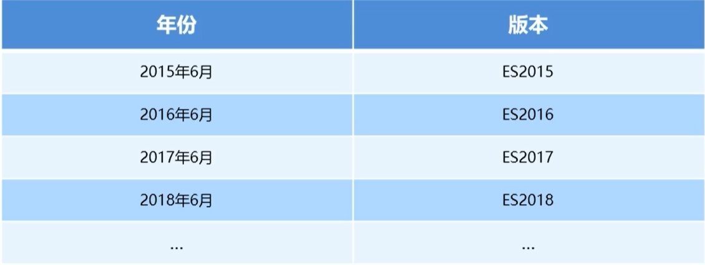
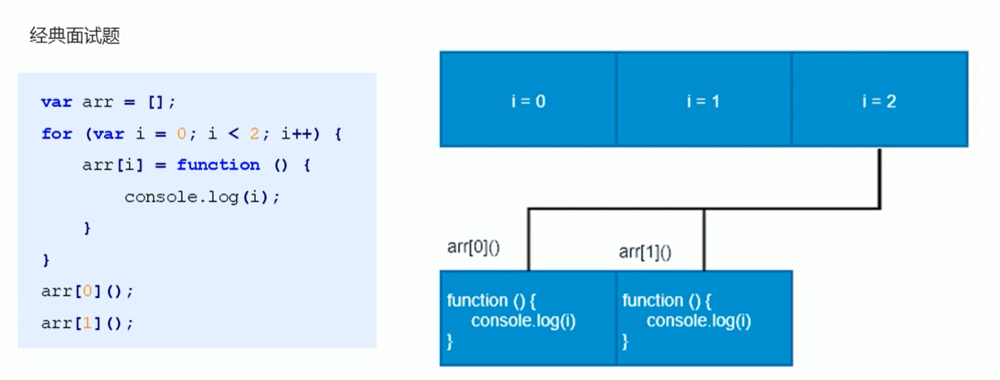
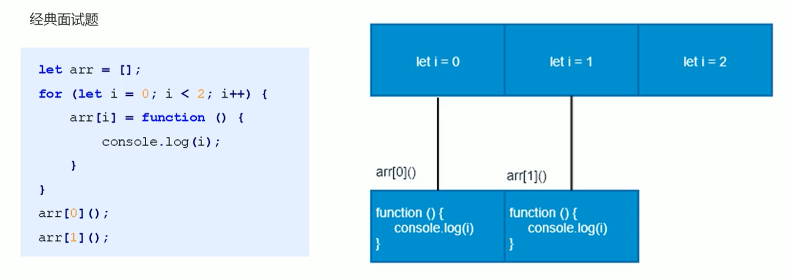
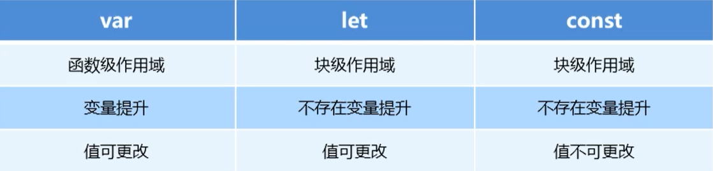
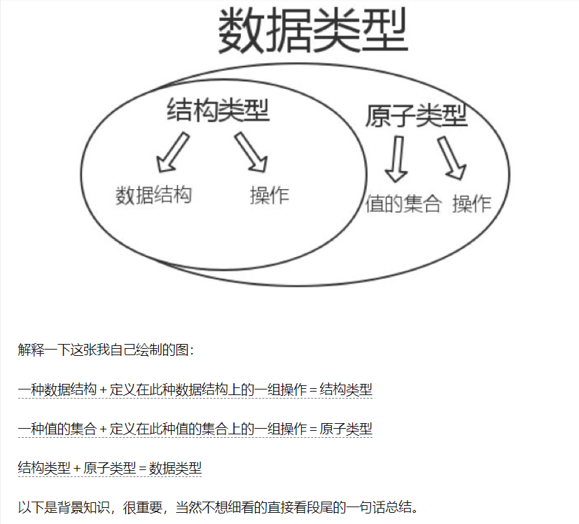
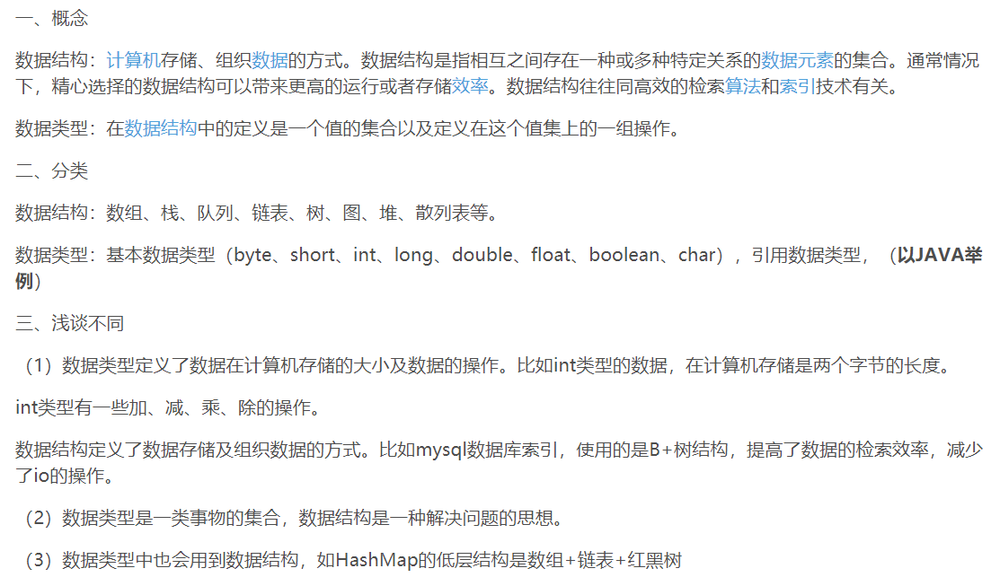
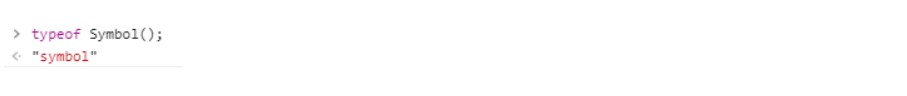
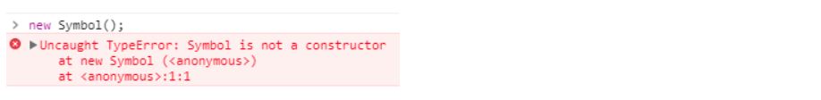
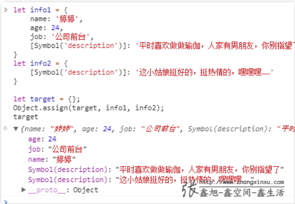

(注1：JS高级还没有看完，不过我决定双管齐下，同时学。)

(注2：我每周平均的学习时间也就3个小时，上班的时候反而学的更多一点，因为要早起，生活也有规律。反而到了双休日学习效率直线下降，熬夜是家常便饭，每天睡到12点起床，王者荣耀，光B站，最近还喜欢上了玩英雄联盟，花了大把的时间看LPL比赛和大司马视频上了，自己还是没有什么紧迫感啊。)

(注3：视频链接1[黑马javascript高级（含ES6）](https://www.bilibili.com/video/BV1X7411n72U?p=100))

(注4：视频链接2[尚硅谷Web前端ES6教程，涵盖ES6-ES11](https://www.bilibili.com/video/BV1uK411H7on?p=1))

(注5：黑马的后40集讲的是ES6,但是只是粗略的讲了讲，比较初级，像Promise这些都没有讲到，于是我又找了尚硅谷的视频作为补充。前面学过的为节省时间就不学了，直接从第9集开始学)

(注6：现在是2020年9月17日，感觉尚硅谷的这个老师讲的有点晦涩啊，我怎么感觉自己听不懂啊，必须还要在四处找一些资料进行补充才行。ES6前面黑马讲的就更加通俗一些，当然也许和ES6前面的内容比较简单有关吧。)

(注7：现在是2020年9月27日，前面这10多天一直在拖拖拉拉的看Vue视频，总共也才看了2天课程。其他的视频一直都没看，现在开始重头再接下去看吧。我这个效率要提高啊，平均一天也就才学习2个小时，是真的不够啊。)

(现在是2020年10月17日，现在觉得就算把视频看完了也还是远远不够的，还需要进行大量的代码练习，才能把ES6语法用的熟练。)

# ES6简介

## 什么是ES6

ES的全称是ECMAScript，它是由ECMA国际标准化组织制定的一项**脚本语言的标准化规范**。



ES6实际上是一个泛指，泛指ES2015及后续的版本。

## 为什么要使用ES6

每一次标准的诞生都意味着语言的完善，功能的加强。JavaScript语言本身也有一些令人不满意的地方。

* 变量提升特性增加了程序运行时的不可预测性
* 语法过于松散，实现相同的功能，不同的人可能会写出不同的代码

# ES6的新增语法

## let

ES6中新增的用于声明变量的关键字。

* let声明的变量只在所处于的**块级**有效

> ES6之前，JavaScript作用域只有全局作用域和局部作用域2种，ES6中新增了一种作用域类型：**块级作用域**。
>
> 大括号内产生的作用域就叫做块级作用域。
>
> 一对大括号就代表一个块级作用域。
>
> 具有块级作用域的变量只能在块级作用域中访问。
>
> 块级作用域的好处是：在业务逻辑比较复杂的时候，能够防止内层变量覆盖外层变量。

~~~javascript
if(true){
	let a = 10;
}
console.log(a);		//a is not defined
~~~

> 注意：使用let关键字声明的变量才具有块级作用域，使用var声明的变量不具备块级作用域特性。

* 不存在变量提升

> ES6中变量只能先声明再使用，否则会报错

~~~javascript
console.log(a);  //a is not defined 
let a = 20;
~~~

* 暂时性死区

~~~javascript
//全局作用域下使用var关键字声明了tmp这个变量，值是123
var tmp = 123; 
if(true){
  //在块级作用域内声明的变量，就和这个块级作用域进行了绑定，不会受外部影响
  //外面的tmp和里面的tmp一点关系都没有，它们之间不会相互影响
	tmp = 'abc';
  let tmp;
}
~~~

### 具体示例

~~~html
<!DOCTYPE html>
<html lang="en">

<head>
	<meta charset="UTF-8">
	<title>使用let关键字声明变量</title>
</head>

<body>
	<script type="text/javascript">
		/*
			let关键字就是用来声明变量的

			使用let关键字声明的变量具有块级作用域

			在一个大括号中 使用let关键字声明的变量才具有块级作用域 var关键字是不具备这个特点的

			防止循环变量变成全局变量

			使用let关键字声明的变量没有变量提升

			使用let关键字声明的变量具有暂时性死区特性

		*/

		/* --------let关键字就是用来声明变量的-------- */
		// let a = 10;
		// console.log(a);

		/* --------使用let关键字声明的变量具有块级作用域-------- */
		// if (true) {
		// 	let b = 20;
		// 	console.log(b)
		// 	if (true) {
		// 		let c = 30;
		// 	}
		// 	console.log(c);
		// }
		// console.log(b)

		/* -------在一个大括号中 使用let关键字声明的变量才具有块级作用域 var关键字是不具备这个特点的--------- */

		// if (true) {
		// 	let num = 100;
		// 	var abc = 200;
		// }
		// console.log(abc);
		// console.log(num)


		/* -------防止循环变量变成全局变量--------- */
    // for (var i = 0; i < 2; i++) {}
		// console.log(i);
    // 这个i还可以访问到，是2
    
		// for (let j = 0; j < 2; j++) {}
		// console.log(j);
    // 在for循环这个地方有些特殊，虽然let没有写在大括号当中，但是在for循环的小括号当中使用for循环的
    // 关键字声明的这个变量依然跟这个for循环进行绑定，在for循环的外边是访问不到的。
    // 这也是拥有块级作用域的变量给我们带来的好处：防止循环变量变成全局变量
    // 这个j就不能再访问到了


		/*-----使用let关键字声明的变量没有变量提升------*/
		// console.log(a);
		// let a = 100;


		/* -------使用let关键字声明的变量具有暂时性死区特性------- */
		var num = 10
		if (true) {
      //会进行报错，大括号内未定义就使用。里面的num和外面的num没有关系
			console.log(num);
			let num = 20;
		}
	</script>
</body>

</html>
~~~

### 经典面试题



> 代码分析：在循环体中，实际上是向arr数组中添加值， **值就是一个函数**，此时这个函数并没有执行，这一点一定要清楚。由于循环执行了2次，所以在循环结束后arr数组中会有2个值，这2个值都是函数。当函数被调用时，要输出变量i的值。
>
> 在函数内部并没有定义i的代码，所以函数执行时在自己的作用域下是找不到变量i的值的，根据作用域链查找原则，要向上一层作用域中查找。这个函数的上一层作用域就是全局作用域，全局作用域下是有变量i的，实际上就是循环执行时创建的全局变量i。
>
> 由于函数执行时，这个循环早就已经结束了，所以i的值应该是不满足循环条件的值(也就是2),所以函数执行时，输出的i值应该是2。
>
> 由于数组中执行的2个函数，输出的都是全局变量i，所以2次输出的结果是一致的，都是2。

> 经典面试题图解：此题的关键点在于变量是全局的，函数执行时输出的都是全局作用域下的值。



> 代码分析:let关键字执行的变量在循环结束后产生了2个块级作用域，产生的2个块级作用域中都有自己的变量i，这是2个互不影响的变量，因为它们处于不同的块级作用域。
>
> 循环结束后数组中依旧生成了2个函数，在函数执行时，函数内部还是没有自己的变量i，所以还是要向上一级作用域中进行查找，在当前代码中，函数的上一级作用域实际上就是循环产生的块级作用域，所以数组中的2个函数在执行时，要分别去自己数组中的2个块级作用域中查找变量i的值。

> 经典面试题图解：此题的关键点在于每次循环都会产生一个块级作用域，每个块级作用域中的变量都是不同的，函数执行时输出的是自己上一级（循环产生的块级作用域）作用域下的值.

## const

作用：声明常量，常量就是值，（内存地址）不能变化的量。

* 具有块级作用域

~~~javascript
if (true) {
	const a = 10; 
}
console.log(a);
//a is not defined
~~~

* 声明常量时必须赋值

~~~javascript
const PI; 		// Missing initializer in const declaration
~~~

* 常量(基本数据类型)赋值后，值不能修改。

~~~javascript
const PI = 3.14;
PI = 100; 		// Assignment to constant variable.
~~~

* 复杂数据类型(如数组)里面的值可以更改

~~~javascript
const ary = [100, 200];
//这个操作并没有更改arr常量在内存中的存储地址
arr[0] = 'a';
arr[1] = 'b';
console.log(arr);		//['a','b'];
//给arr常量重新赋值，赋的是一个新数组，这样是不被允许的，此操作改变了arr常量在内存中的存储地址
arr = ['a','b'];		//Assignment to constant variable.
~~~

> 复杂数据类型的值，它不可以重新赋值，但是值内部的数据可以更改！！

### 具体类型

~~~javascript
<!DOCTYPE html>
<html lang="en">

<head>
	<meta charset="UTF-8">
	<title>使用const关键字声明常量</title>
</head>

<body>
	<script type="text/javascript">
		// 使用const关键字声明的常量具有块级作用域
		// if (true) {
		// 	const a = 10;
		// 	if (true) {
		// 		const a = 20;
		// 		console.log(a);
		// 	}
		// 	console.log(a);
		// }
		// console.log(a);

		// 使用const关键字声明的常量必须赋初始值
		// const PI;
		// 上面这样写会报错Missing initializer in const declaration
		// const PI = 3.14;

		// 常量声明后值不可更改 
		const PI = 3.14;
		PI = 100;
		//复杂数据类型——数组 
		ary[0] = 123;
		//内部值可以更改，但是只能这样更改
		ary = [1, 2]
		//这种操作属于对其重新赋值，不可以
		console.log(ary);
	</script>
</body>

</html>
~~~

## let，const，var的区别

* 使用**var**声明的变量，其作用域为**该语句所在的函数内，且存在变量提升现象**。
* 使用**let**声明的变量，其作用域为**该语句所在的代码块内，不存在变量提升**。
* 使用**const**声明的是常量，在后面出现的代码中**不能再修改该常量的值**。



## 解构赋值

ES6中允许从**数组**中提取值，按照对应位置，对变量赋值。**对象**也可以实现解构。

> 数组或对象都可以实现解构赋值

### 数组解构

~~~javascript
let [a, b, c]=[1, 2, 3];
console.log (a);
console.log (b);
console.log (c);
~~~

> 这个感觉就跟Excel新版本的有个新功能差不多。

如果解构不成功，变量的值为**undefined**

~~~javascript
let [foo] = []; 
let [bar, foo]= [1];
~~~

#### 具体示例

~~~javascript
<!DOCTYPE html>
<html lang="en">
<head>
	<meta charset="UTF-8">
	<title>数组解构</title>
</head>
<body>
	<script type="text/javascript">
		// 数组解构允许我们按照一一对应的关系从数组中提取值 然后将值赋值给变量
		let ary = [1,2,3];
		//这个中括号不代表数组，代表解构，代表从数组当中提取值
		//abcde这些不能加引号，因为它们是变量
		let [a, b, c, d, e] = ary;

    //let ary = [a, b, c, d, e]
    // 不能这样写，会报错：Identifier 'ary' has already been declared

		//这样一写表明等号左边的变量和等号右边的数组是一一对应的关系
		//如果变量数组和数组数量不一致，d和e变量没有对应的值，多出来的变量d和e为undefined
		console.log(a)
		console.log(b)
		console.log(c)
		console.log(d)
		console.log(e)
	</script>
</body>
</html>
~~~

### 对象解构

* 写法1：变量名字和对象中属性的名字要保持一致

~~~javascript
let person = {name: ' zhangsan', age: 20 };
//大括号里写的依然是变量的名字——不能变
let {name, age} = person; 
console.log(name); 			//'zhangsan'
console.log (age); 			//20
~~~

* 写法2：变量名字和对象中属性的名字可以不一样

~~~javascript
let person = {name: ' zhangsan', age: 20 };
let{name：myName，age：myAge} = person;		//myName  myAge属于别名console.1og（myName）；//'zhangsan'
console.1og（myAge）；//20
~~~

> 大括号左侧的属性用来匹配对象中的属性，冒号右边的才是真正的变量。
>
> 如果属性匹配成功，则将对象中属性 对应的值赋值给左侧的变量。
>
> 解构语法中，冒号左边的(如name)只用于属性匹配，冒号右边的(如myName才是真正的变量)

#### 具体示例

~~~javascript
<!DOCTYPE html>
<html lang="en">
<head>
	<meta charset="UTF-8">
	<title>对象解构</title>
</head>
<body>
	<script type="text/javascript">
		// 对象解构允许我们使用变量的名字匹配对象的属性 匹配成功 将对象属性的值赋值给变量
		
		let person = {name: 'lisi', age: 30, sex: '男'};
		//我试了一下，好像name,age,sex这些变量名不能改成别的名字
		// let { name, age, sex } = person;
		// console.log(name)
		// console.log(age)
		// console.log(sex)
		
		let {name: myName} = person;
		console.log(myName)

	</script>
</body>
</html>
~~~

## 箭头函数

[JS中的箭头函数与this](https://juejin.im/post/6844903573428371464)

* ES6中新增的定义函数的方式。

~~~javascript
() => {}
//使用const关键字定义一个常量fn,让常量fn就等于箭头函数
const fn = () => {}
~~~

> 箭头函数以小括号开头，小括号是放置形参的地方。 
>
> 小括号后边写上箭头，这个是固定语法。
>
> 箭头后边写上大括号，大括号依然代表函数体。
>
> 箭头函数没有文字，如果调用？——通常我们都是将箭头函数赋值给一个变量,变量名就是函数名，通过变量名来调用函数就可以了。

* 如果函数体中只有一句代码，并且代码的执行结果就是返回值，则可以省略大括号。

~~~javascript
function sum(num1,num2){
  return num1 + num2;
}
~~~
等价于：
~~~javascript
const sum = (num1,num2) => num1 + num2;
~~~

* 如果形参只有一个，可以省略小括号

~~~javascript
function fn(v){
  return v;
}
~~~

等价于：

~~~javascript
const fn = v => v
~~~

* 箭头函数不绑定this关键字，箭头函数中的this，指向的是函数定义位置的上下文this

> 即箭头函数被定义在哪，箭头函数中的this就指向哪

~~~javascript
	const obj = { name: '张三' };
		function fn() {
			console.log(this);
      //在fn中返回了匿名函数中的值，在匿名函数中也输出了this关键字的值
      //在当前代码中，箭头函数被定义在了fn函数中，而fn函数中的this指向了obj对象
      //所以resFn函数中的this关键字指向的也是obj对象
			return () => {
				console.log(this)
			}
		}
		
		//我们使用了call方法调用了fn函数
		//将fn函数中的this关键字指向了obj对象
		const resFn = fn.call(obj);
		resFn();
~~~

### 具体示例

~~~html
<!DOCTYPE html>
<html lang="en">
<head>
	<meta charset="UTF-8">
	<title>箭头函数</title>
</head>
<body>
	<script type="text/javascript">
		// 箭头函数是用来简化函数定义语法的
		// const fn = () => {
		// 	console.log(123)
		// }
		// fn();
		
		// 在箭头函数中 如果函数体中只有一句代码 并且代码的执行结果就是函数的返回值 函数体大括号可以省略
    
    // 原始写法
    // const sum = (n1, n2) => {
		// 	return n1 + n2;
		// }
    
    //简略写法
		// const sum = (n1, n2) => n1 + n2;	 
		// const result = sum(10, 20);
		// console.log(result)
		
		// 在箭头函数中 如果形参只有一个 形参外侧的小括号也是可以省略的
		// const fn = v => {
		// 	alert(v);
		// }
		// fn(20)
		
		// 箭头函数不绑定this 箭头函数没有自己的this关键字 如果在箭头函数中使用this this关键字将指向箭头函数定义位置中的this
		
		function fn () {
			console.log(this);
      //在fn函数中返回一个匿名函数，这个匿名函数也是一个箭头函数
      //而箭头函数不绑定this,即箭头函数没有自己的this
      //如果你在箭头函数中使用this，这个this指向的就是箭头函数定义区域的this
      //由于箭头函数被定义在了fn函数的内部，箭头函数中的this指向的就是fn这个区域的this
      //所以箭头函数中的this指向的也是obj对象
			return () => {
				console.log(this)
			}
		}

		const obj = {name: 'zhangsan'};
    //call方法可以改变fn函数中this的指向
    
    //这个resFn就相当于这个匿名函数的名字
		const resFn = fn.call(obj);
    //使用resFn()来调用这个匿名函数
		resFn();
	</script>
</body>
</html>
~~~

### 箭头函数面试题

~~~html
<!DOCTYPE html>
<html lang="en">

<head>
	<meta charset="UTF-8">
	<title>箭头函数面试题</title>
</head>

<body>
	<script type="text/javascript">

		var age = 100;

		var obj = {
			age: 20,
			say: () => {
				alert(this.age)
			}
		}
		obj.say();
	</script>
</body>

</html>
~~~

> 箭头函数没有自己的this，箭头函数当中的this指向箭头函数定义区域的this。
>
> 当前这个箭头函数定义在了obj这个对象里面。
>
> 但是obj是一个对象，不能产生作用域。
>
> 箭头函数实际上定义在了全局作用域下。
>
> 所以我们在调用say方法的时候，this指向的是window。

## 剩余参数

> 当函数实参个数大于形参个数时，我们可有将剩余的实参放入到一个数组中

* 剩余参数语法允许我们将一个**不定数量的参数**表示为一个数组。

~~~javascript
function sum(first, ...args) {
  	//在形参args前面加了3个点，表示剩余的形参它都接收了
		console.log(first);	  //10
		console.log(args);	  //[20,30]
  	//args形参是一个数组，数组中存储了20和30
}

sum(10, 20, 30);
//代码中有一个sum函数，在函数调用时传递了3个实参进去，分别为10,20，30
//而函数的形参只有2个
~~~

* 剩余参数和解构配合使用

~~~javascript
let students = ['张三', '李四', '王五'];
//数组中有3个值
let [s1, ...s2] = students;
//但是解构变量只有2个
console.log(s1);		//'张三'
//s1变量对应张三
console.log(s2);		//['李四','王五']
//s2变量接收数组中剩余元素
~~~

### 具体示例

~~~html
<!DOCTYPE html>
<html lang="en">

<head>
	<meta charset="UTF-8">
	<title>剩余参数</title>
</head>

<body>
	<script type="text/javascript">
		//箭头函数中无法使用arguments
		//我们在形参args前面加上三个点，代表接收所有的实参
		//args是一个数组，第一次调用sum函数时，数组中存着10,20
		//args是一个数组，第二次调用sum函数时，数组中存着10,20，30
		const sum = (...args) => {
			let total = 0;
			//forEach方法的作用就是用来循环数组
			//由于箭头函数这里只有一个形参item,所以item外面的小括号就省略了
			//由于箭头函数这里只有一句代码，所以total+=item外面的大括号也省略了
			args.forEach(item => total += item);
			return total;
		};

		console.log(sum(10, 20));
		console.log(sum(10, 20, 30));


		let ary1 = ['张三', '李四', '王五'];
		let [s1, ...s2] = ary1;
		console.log(s1);
		console.log(s2);
	</script>
</body>

</html>
~~~

## Array的扩展方法

### 扩展运算符（展开语法）

> 扩展运算符也是用三个点来代表。

* 扩展运算符可以将数组或者对象转为用**逗号分隔**的**参数序列**。

~~~javascript
let ary = [1,2,3];
...ary	//1,2,3
//在数组变量名称前面加上三个点，这就代表将数组元素拆分成以逗号分隔的参数序列
//后面的注释实际上就是运算结果了
console.log(...ary);		//1  2  3
//console.log方法可以接收多个参数，多个参数以逗号分隔，表示一次输出多个内容
//为什么输出结果没有逗号了呢？因为逗号被当作console.log方法的参数分隔符了
console.log(1,2,3);
~~~

* 扩展运算符可以应用于合并数组。

~~~javascript
//方法一
let aryl =[1，2，3];
let ary2 =[3，4，5];
let ary3 = [...aryl,...ary2];

//方法二
ary1.push(...ary2);
//push方法可以将数组中追加元素
//push方法一次性可以接收多个参数
~~~

> 既然扩展运算符可以将数组拆分成以逗号分隔的参数序列，我们也可以在参数序列的外侧加上数组中括号让它重新变成数组，利用这一点就可以做数组合并了。

* 将**类数组**(即伪数组)或**可遍历对象**转换为**真正的数组**

~~~javascript
let oDivs = document.getElementsByTagName ('div');
//这个方法的返回值是元素集合
//这个元素的集合就是伪数组
oDivs = [..oDivs];
~~~

#### 具体示例

~~~html
<!DOCTYPE html>
<html lang="en">
<head>
	<meta charset="UTF-8">
	<title>扩展运算符</title>
</head>
<body>
	<div>1</div>
	<div>4</div>
	<div>3</div>
	<div>6</div>
	<div>2</div>
	<div>5</div>
	<script type="text/javascript">
		// 扩展运算符可以将数组拆分成以逗号分隔的参数序列
		// let ary = ["a", "b", "c"];
		// ...ary 	 // "a", "b", "c"
		// console.log(...ary);
    // 上面这样写和下面等价
		// console.log("a", "b", "c");
		
		// 扩展运算符应用于数组合并
		// let ary1 = [1, 2, 3];
		// let ary2 = [4, 5, 6];
		// // ...ary1 // 1, 2, 3
		// // ...ary2 // 4, 5, 6
		// let ary3 = [...ary1, ...ary2];
		// console.log(ary3);

		// 合并数组的第二种方法
		// let ary1 = [1, 2, 3];
		// let ary2 = [4, 5, 6];
		
    //ary1.push(4,5,6);
    // 和上面的写法效果一样
		// ary1.push(...ary2);
		// console.log(ary1);
		
		// 利用扩展运算符将伪数组转换为真正的数组
		var oDivs = document.getElementsByTagName('div');
		console.log(oDivs)
		var ary = [...oDivs];
		ary.push('a');
		console.log(ary);
	</script>
</body>
</html>
~~~

### 构造函数方法：Array.from()

* 将类数组或可遍历对象转换为真正的数组

~~~javascript
let  arrayLike = {
			"0": "张三",
			"1": "李四",
			"2": "王五",
			"length": 3
}

let ary = Array.from(arrayLike);
~~~

* 此方法还可以接受第二个参数，作用类似于数组的map方法，用来对每个元素进行处理，将处理后的值放入返回的数组。

~~~javascript
let arrayLike = {
			"0": "1",
			"1": "2",
			"length": 2
}
let ary = Array.from(arrayLike, item => item * 2);
//方法的第1个参数是你要转换的那个伪数组
//方法的第2个参数是一个函数，在函数的内部将数组中每个值都乘以了2
console.log(ary);
~~~

#### 具体示例

~~~javascript
<!DOCTYPE html>
<html lang="en">

<head>
	<meta charset="UTF-8">
	<title>Array.from方法</title>
</head>

<body>
	<script type="text/javascript">
		var arrayLike = {
			"0": "张三",
			"1": "李四",
			"2": "王五",
			"length": 3
		}

		var ary = Array.from(arrayLike);
		console.log(ary);

		var arrayLike = {
			"0": "1",
			"1": "2",
			"length": 2  
		}
		var ary = Array.from(arrayLike, item => item * 2)
		console.log(ary);
	</script>
</body>

</html>
~~~

### find()方法

* 用于找出**第一个**符合条件的**数组成员**，如果没有找到返回undefined

~~~javascript
let ary = [{
	 id: 1,
	 name: '张三'
}, {
	id: 2,
	name: '李四'
}];
//ary变量是一个数组，数组中有2个对象
//调用ary数组下面的find方法进行查找，向find方法中传递一个函数
//find方法内部会循环这个数组，每一次循环时都会调用我们传递进去的函数
//find方法内部在调用这个函数的时候，给我们传递了2个参数：分别为当前循环到的值以及当前循环的索引
let target = ary.find((item,index) => item.id == 2);
//查找数组中id为2的那个对象
~~~

#### 具体示例

~~~javascript
<!DOCTYPE html>
<html lang="en">

<head>
	<meta charset="UTF-8">
	<title>find方法</title>
</head>

<body>
	<script type="text/javascript">
		let ary = [{
			id: 1,
			name: '张三'
		}, {
			id: 2,
			name: '李四'
		}];
		let target = ary.find(item => item.id == 3);
		//我们只用到了item,没有用到index,所以index可以省略不写
		console.log(target)
	</script>
</body>

</html>
~~~

### findIndex()方法

* 用于找出**第一个**符合条件的数组成员的**位置**，如果没有找到返回-1。

~~~javascript
let ary = [1,5,10,15];
let index = ary.findIndex((value,index) => value > 9);
console.log(index);		//2
~~~

#### 具体示例

~~~javascript
<!DOCTYPE html>
<html lang="en">

<head>
	<meta charset="UTF-8">
	<title>findIndex方法</title>
</head>

<body>
	<script type="text/javascript">
		let ary = [10, 20, 50];
		let index = ary.findIndex(item => item > 15);
		console.log(index);
	</script>
</body>

</html>
~~~

### includes()方法

* 表示某个**数组**是否**包含给定的值**，**返回布尔值**。

> includes方法的参数就是你想判断的那个元素
>
> ES6之前判断是否包含的方法是indexOf()方法。


~~~javascript
[1, 2, 3].includes(2) 	//true
[1, 2, 3].includes(4) 	//false
~~~

#### 具体示例

~~~javascript
<!DOCTYPE html>
<html lang="en">

<head>
	<meta charset="UTF-8">
	<title>includes方法</title>
</head>

<body>
	<script type="text/javascript">
		let ary = ["a", "b", "c"];

		let result = ary.includes('a');
		console.log(result);
		result = ary.includes('e');
		console.log(result);
	</script>
</body>

</html>
~~~

## String的扩展方法

### 模版字符串

> 按照传统的做法，我们需要使用加号(+)进行字符串拼接，但是在模版字符串中不需要使用加号，取而代之的是直接在模版中直接写个${}，在{中就可以直接写变量的名字，模版字符串就可以直接将变量的内容解析}

> 在C语言里，我随便找了一段代码：
>
> ​	
>
> ```c
> #include <stdio.h>
> int main(){
> 	int price = 0;
> 	printf("请输入金额是（元）：");
> 	scanf("%d",&price);
>   
> 	int change = 100 - price;
> 	printf("找您%d元。\n",change);
> 	return 0;
> }
> ```
这里面的%d应该就相当于模版字符串了吧。


* ES6新增的创建字符串的方式，使用**反引号**定义。

~~~javascript
let name = `zhangsan`;
console.log(name);
~~~

* 模板字符串中可以**解析变量**。

~~~javascript
let name =`张三`;
let sayHello =`hello，my name is ${name}`;
//hello，my name is zhangsan
~~~

* 模版字符串可以**换行**

> 普通字符串不能换行，所以所有的内容都要在一行显示，结构比较凌乱。

~~~javascript
let result = {
	name: "zhangsan",
	age: 20,
  sex: '男'
};

let html = `<div>
				<span>${result.name}</span>
				<span>${result.age}</span>
				<span>${result.sex}</span>
</div>`;
console.log(html);
~~~

* 在模板字符串中可以调用函数

~~~javascript
const sayHello = function(){
  return "哈哈哈哈哈，追不到我吧，我就是这么强大";
};
let greet = `${sayHello()},哈哈哈哈哈`;
//在调用sayHello函数的位置，将会显示sayHello函数的返回值
console.log(greet);		//哈哈哈哈哈，追不到我吧，我就是这么强大,哈哈哈哈哈
~~~

#### 具体示例

~~~javascript
<!DOCTYPE html>
<html lang="en">

<head>
	<meta charset="UTF-8">
	<title>模板字符串</title>
</head>

<body>
	<script type="text/javascript">
		// let name = `这是一个模版字符串`;
		// console.log(name);

		let name = `张三`;
		let sayHello = `Hello, 我的名字叫${name}`;
		console.log(sayHello);

		let result = {
			name: "zhangsan",
			age: 20
		};
		let html = `
			<div>
				<span>${result.name}</span>
				<span>${result.age}</span>
			</div>
		`;
		console.log(html);

		const fn = () => {
			return '我是fn函数';
		}

		let html1 = `我是模板字符串 ${fn()}`;
		console.log(html1)

	</script>
</body>

</html>
~~~

### startsWith()和endsWith()方法

* startsWith()：表示参数字符串是否在原字符串的头部，返回布尔值
* endsWith()：表示参数字符串是否在原字符串的尾部，返回布尔值

~~~javascript
let str = 'Hello world!';
str.startswith ('Hello') 	//true
str.endswith('!');		//true
~~~

#### 具体示例

~~~javascript
<!DOCTYPE html>
<html lang="en">

<head>
	<meta charset="UTF-8">
	<title>startsWith方法和endsWith方法</title>
</head>

<body>
	<script type="text/javascript">
		let str = 'Hello ECMAScript 2015';
		let r1 = str.startsWith('Hello');
		let r1 = str.startsWith('H');
		console.log(r1);
		let r2 = str.endsWith('2016');
		console.log(r2);
	</script>
</body>

</html>
~~~

### repeat()方法

* repeat方法表示将原字符串重复n次，返回一个新字符串。

~~~javascript
'x'.repeat(3);		//"xxx"
'hello'.repeat (2);		//"hellohello"
~~~

#### 具体示例

~~~javascript
<!DOCTYPE html>
<html lang="en">

<head>
	<meta charset="UTF-8">
	<title>repeat方法</title>
</head>

<body>
	<script type="text/javascript">
		console.log("y".repeat(5));
	</script>
</body>

</html>
~~~

## Set数据结构

[数据结构和数据类型的区别与联系](https://www.zhihu.com/question/21165020)

[浅谈数据结构和数据类型](https://blog.csdn.net/u012540337/article/details/80499226)

* 数据结构：是相互之间存在一种或多种特定关系的数据元素的集合，包括逻辑结构和物理结构。
* 数据类型：是一个值的集合和定义在这个值集上的一组操作的总称。
* 抽象数据类型：是指一个数学模型以及定义在该模型上的一组操作。





ES6提供了新的**数据结构**Set，它**类似于数组**(也是一组数据的结合)，但是**成员的值都是唯一的**，没有重复的值。

> 和高中学的集合一样

Set本身是一个构造函数，用来生成Set数据结构。

~~~javascript
const s = new Set();
~~~

Set函数可以接受一个数组作为参数，用来初始化。

~~~javascript
const set = new Set([1,2,3,4,4]);
~~~

### 实例方法

* add(value)：添加某个值，返回Set结构本身
* deletel(value)：删除某个值，返回一个布尔值，表示删除是否成功
* has(value)：返回一个布尔值，表示该值是否为Set的成员
* clear()：清除所有成员，没有返回值

~~~javascript
const s =new Set();
s.add(1).add(2).add(3);	//向set结构中添加值
s.delete(2);		//删除set结构中的2值
s.has(1);		//表示set结构中是否有1这个值 返回布尔值
s.clear();	//清除set结构中的所有值
~~~

### 遍历

Set结构的实例与数组一样，也拥有forEach方法，用于对每个成员执行某种操作，没有返回值。

~~~javascript
s.forEach (value => console.log(value));
~~~

#### 具体示例

~~~javascript
<!DOCTYPE html>
<html lang="en">

<head>
	<meta charset="UTF-8">
	<title>Set</title>
</head>

<body>
	<script type="text/javascript">
		const s1 = new Set();
		console.log(s1.size);	//0
		//在实例对象下有一个属性size,size表示在当前数据结构中包含了多少值

		const s2 = new Set(["a", "b"]);
		console.log(s2.size);

		const s3 = new Set(["a", "a", "b", "b"]);
		//利用Set结构可以进行数组去重
		//当我们向Set数据结构当中传递初始值的时候，它会把重复的值给过滤掉
		console.log(s3.size);
		const ary = [...s3];
		//我们可以用扩展运算符(...)将Set数据结构转换成以逗号分隔的零散：...s3
		//然后我们在零散量的外边加上中括号，就变成数组了[...s3]
		//我们用ary变量来存储这个数组
		console.log(ary);

		const s4 = new Set();
		// 向set结构中添加值 使用add方法
		s4.add('a').add('b');
		console.log(s4.size);

		// 从set结构中删除值 用到的方法是delete
		const r1 = s4.delete('c');
		console.log(s4.size);
		console.log(r1);

		// 判断某一个值是否是set数据结构中的成员 使用has
		const r2 = s4.has('d');
		console.log(r2);

		// 清空set数据结构中的值 使用clear方法
		s4.clear();
		console.log(s4.size);

		// 遍历set数据结构 从中取值
		const s5 = new Set(['a', 'b', 'c']);
		s5.forEach(value => {
			console.log(value);
		})

	</script>
</body>

</html>
~~~

------

（从下面开始就是尚硅谷的视频笔记了，从第15集开始看起。黑马的视频就讲到前面这么多。）

## Symbol

### Symbol的创建和介绍

> symbol:象征，符号，代表着独一无二

ES6引入了一种新的**原始数据类型Symbol**，表示**独一无二的值**。它是JavaScript语言的**第七种**数搭类型(之前的6种数据类型：String 、Number、Boolean、Null、Undefined、Object)，是一种**类似于字符串**的数据类型。

Symbol的特点：

* Symbol的值是唯一的，用来解决命名冲突的问题
* Symbol值不能与其他数据进行运算
* Symbol定义的对象属性不能使用for...in循环遍历，但是可以使用Reflect.ownkeys来获取对象的所有键名

~~~html
<!DOCTYPE html>
<html lang="en">

<head>
    <meta charset="UTF-8">
    <meta name="viewport" content="width=device-width, initial-scale=1.0">
    <title>symbol</title>
</head>

<body>
    <script>
        //创建Symbol
        let s1 = Symbol();
        console.log(s1, typeof s1);

        let s2 = Symbol("尚硅谷");
        console.log(s2, typeof s2);

        let s3 = Symbol("尚硅谷");
        console.log(s3, typeof s3);

        console.log(s2 === s3);
        //false,都是"尚硅谷",但是只是名字一样，就好像有2个人名字都叫张三，但是不是同一个人

        //使用Symbol.for创建
        let s4 = Symbol.for("尚硅谷");
        console.log(s4, typeof s4);

        let s5 = Symbol.for("尚硅谷");
        console.log(s5, typeof s5);
        console.log(s4 === s5);
        //true 这个又是true了！！！现在不是很懂为什么

        //不能和其他数据进行运算(运算、比较、拼接都不行)
        //自己和自己玩也不行

        // let result = s1 + 100;
        // let result = s1 > 100;
        // let result = s1 + '100';
        let result = s1 + s1;

        //7种数据类型记忆法
        // USONB  you are so niubility 
        // u  undefined
        // s  string  symbol
        // o  object
        // n  null number
        // b  boolean
    </script>
</body>

</html>
~~~

> `let s1 = Symbol('尚硅谷');`此时Symbol是一个函数
>
>  `let s4 = Symbol.for('尚硅谷');`此时Symbol是一个对象
>
> 所以Symbol又称为函数对象。

### 对象添加Symbol类型的属性

~~~html
<!DOCTYPE html>
<html lang="en">

<head>
    <meta charset="UTF-8">
    <meta name="viewport" content="width=device-width, initial-scale=1.0">
    <title>Symbol 创建对象属性</title>
</head>

<body>
    <script>
        //向对象中添加方法 up down
        let game = {
            name: '俄罗斯方块',
            up: function () { },
            down: function () { }
        };

        // 不推荐的写法：你也不知道原来的game对象里有没有这个up属性，不安全
        // game.up = function () {
        // }


        //我们可以这样做：
        let methods = {
            up: Symbol(),
            down: Symbol()
        };

        game[methods.up] = function () {
            console.log("我可以改变形状");
        }

        game[methods.down] = function () {
            console.log("我可以快速的下降");
        }

        console.log(game);

        let youxi = {
            name: '狼人杀',
            // 加上中括号，当成名词
            [Symbol('say')]: function () {
                console.log("我可以发言");
            },
            [Symbol('zibao')]: function () {
                console.log('我可以自爆');
            }
        }

        console.log(youxi);
        console.log(Object.getOwnPropertySymbols(youxi));
    </script>
</body>

</html>
~~~

### Symbol内置值

> 这些值可以用来扩展对象的功能。

[内置 Symbol 值详细概述](https://juejin.im/entry/6844903442335399950)

除了定义自己使用的Symbol值以外，ES6还提供了11个内置的Symbol值，指向语言内部使用的方法。可以称这些方法为魔术方法，因为它们会在特定的场
景下自动执行。

| Symbol内置值              | 内容                                                         |
| ------------------------- | ------------------------------------------------------------ |
| Symbol.hasInstance        | 当其他对象使用 instanceof 运算符，判断是否为该对象的实例时，会调用这个方法 |
| Symbol.isConcatSpreadable | 对象的 Symbol.isConcatSpreadable 属性等于的是一个布尔值，表示该对象用于 Array.prototype.concat()时，是否可以展开。 |
| Symbol.species            | 创建衍生对象时，会使用该属性                                 |
| Symbol.match              | 当执行 str.match(myObject) 时，如果该属性存在，会调用它，返回该方法的返回值。 |
| Symbol.replace            | 当该对象被 str.replace(myObject)方法调用时，会返回该方法的返回值。 |
| Symbol.search             | 当该对象被 str. search (myObject)方法调用时，会返回该方法的返回值。 |
| Symbol.split              | 当该对象被 str. split (myObject)方法调用时，会返回该方法的返回值。 |
| Symbol.iterator           | 对象进行 for...of 循环时，会调用 Symbol.iterator 方法，返回该对象的默认遍历器 |
| Symbol.toPrimitive        | 该对象被转为原始类型的值时，会调用这个方法，返回该对象对应的原始类型值。 |
| Symbol. toStringTag       | 在该对象上面调用 toString 方法时，返回该方法的返回值         |
| Symbol. unscopables       | 该对象指定了使用 with 关键字时，哪些属性会被 with环境排除。  |

(以下是我自己找的有关Symbol的扩展知识，视频里只讲了3小节，我实在是有点听不懂。)

[简单了解ES6/ES2015 Symbol() 方法](https://www.zhangxinxu.com/wordpress/2018/04/known-es6-symbol-function/)

### 关于symbol这个词

Symbol这个词在IT软件领域实际上是个常见角色，在传统前端技术领域，这个词出现频率有限，但是，随着现代web技术的发展，Symbol这个词开始在不同前端语言中出现。

symbol的中文意思是：符号；象征；标志；记号等。

我最早知道是在Adobe Illustrator软件中，作为一个矢量符号存在。在SVG中，就有专门的`<symbol>`标签，用来指代SVG小图标。

在这里，Symbol又有了另外的角色，作为一个JavaScript的原生数据类型（primitive data type）存在。

说到JavaScript原生数据类型，我们通常想到的有这6种：`undefined`、`null`、`boolean`、`string`、`number`、`object`。而`symbol`是ES6新增的一个原生数据类型。

而Symbol本身又是一个方法。

例如下面JS：

~~~javascript
typeof Symbol();
~~~

可以看到`Symbol()`作为一个方法执行了，同时`typeof`其类型，也是`'symbol'`，如下截图：



但**Symbol不能作为构造函数使用**，也就是下面这样是会嗝屁的！

~~~javascript
new Symbol();
~~~



### Symbol的作用是什么？

Symbol的作用非常的专一，换句话说其设计出来就只有一个目的——**作为对象属性的唯一标识符**，防止对象属性冲突发生。

举个例子，你看上了公司的前台妹纸，想了解关于她的更多信息，于是就询问Hr同事，扫地阿姨，于是得到类似这样信息：

~~~javascript
let info1 = {
    name: '婷婷',
    age: 24,
    job: '公司前台',
    description: '平时喜欢做做瑜伽，人家有男朋友，你别指望了'
}

let info2 = {
    description: '这小姑娘挺好的，挺热情的，嘿嘿嘿……'
}
~~~

显然，你需要对这两个数据进行汇总，结果，就会发现，描述都用了同一个对象属性`description`，于是整合的时候，就容器冲突，覆盖，导致“人家有男朋友”这么重要的信息都没注意到。

但是，如果要是Symbol，则完全就不要担心这个问题了：

~~~javascript
let info1 = {
    name: '婷婷',
    age: 24,
    job: '公司前台',
    [Symbol('description')]: '平时喜欢做做瑜伽，人家有男朋友，你别指望了'
}

let info2 = {
    [Symbol('description')]: '这小姑娘挺好的，挺热情的，嘿嘿嘿……'
}
~~~

此时，我们对info1, info2对象进行复制，如下：

~~~javascript
let target = {};
Object.assign(target, info1, info2);
~~~

[Object.assign()](https://developer.mozilla.org/zh-CN/docs/Web/JavaScript/Reference/Global_Objects/Object/assign)

此时`target`对象如下截图所示：



妹纸所有的描述信息都被完完整整地保留了下来了。

因为`Symbol()`返回值是唯一的，也就是：

~~~javascript
Symbol('description') === Symbol('description');    // 返回值是false
~~~

### Symbol()的语法

语法如下：

~~~javascript
Symbol([description])
~~~

其中`description`为可选参数，字符串，没什么特别的作用，就是debug调试的时候可以用来作为标记。

#### 如何获取Symbol()对应属性值？

拿上面`target`举例，如何获得对妹纸的`description`描述信息呢？

我们可以使用`Object.getOwnPropertySymbols(obj)`这个方法进行获取，可以返回`obj`对象中的Symbol信息，例如：

[Object.getOwnPropertySymbols()](https://developer.mozilla.org/zh-CN/docs/Web/JavaScript/Reference/Global_Objects/Object/getOwnPropertySymbols)

~~~javascript
Object.getOwnPropertySymbols(target);
~~~

妹纸的描述信息就出现了，如下截图：


Symbol在和对象使用的时候，往往离不开JS中的数组括号`[]`，例如：

~~~javascript
var smy = Symbol();
var info = {
  smy: 'x',
  [smy]: 'y'
};
~~~

此时：

~~~javascript
console.log(info.smy);       // 输出'x'
console.log(info['smy']);    // 输出'x'
console.log(info[smy]);      // 输出'y'
~~~

[Symbol](https://wangdoc.com/es6/symbol.html#%E6%A6%82%E8%BF%B0)

### 概述

ES5 的对象属性名都是字符串，这容易造成属性名的冲突。比如，你使用了一个他人提供的对象，但又想为这个对象添加新的方法（mixin 模式），新方法的名字就有可能与现有方法产生冲突。如果有一种机制，保证每个属性的名字都是独一无二的就好了，这样就从根本上防止属性名的冲突。这就是 ES6 引入`Symbol`的原因。

ES6 引入了一种新的原始数据类型`Symbol`，表示独一无二的值。它是 JavaScript 语言的第七种数据类型，前六种是：`undefined`、`null`、布尔值（Boolean）、字符串（String）、数值（Number）、对象（Object）。

Symbol 值通过`Symbol`函数生成。这就是说，对象的属性名现在可以有两种类型，一种是原来就有的字符串，另一种就是新增的 Symbol 类型。凡是属性名属于 Symbol 类型，就都是独一无二的，可以保证不会与其他属性名产生冲突。

~~~javascript
let s = Symbol();

typeof s
// "symbol"
~~~

上面代码中，变量`s`就是一个独一无二的值。`typeof`运算符的结果，表明变量`s`是 Symbol 数据类型，而不是字符串之类的其他类型。

注意，`Symbol`函数前不能使用`new`命令，否则会报错。这是因为生成的 Symbol 是一个原始类型的值，不是对象。也就是说，由于 Symbol 值不是对象，所以不能添加属性。基本上，它是一种类似于字符串的数据类型。

`Symbol`函数可以接受一个字符串作为参数，表示对 Symbol 实例的描述，主要是为了在控制台显示，或者转为字符串时，比较容易区分。

~~~javascript
let s1 = Symbol('foo');
let s2 = Symbol('bar');

s1 // Symbol(foo)
s2 // Symbol(bar)

s1.toString() // "Symbol(foo)"
s2.toString() // "Symbol(bar)"
~~~

上面代码中，`s1`和`s2`是两个 Symbol 值。如果不加参数，它们在控制台的输出都是`Symbol()`，不利于区分。有了参数以后，就等于为它们加上了描述，输出的时候就能够分清，到底是哪一个值。

如果 Symbol 的参数是一个对象，就会调用该对象的`toString`方法，将其转为字符串，然后才生成一个 Symbol 值。

~~~javascript
const obj = {
  toString() {
    return 'abc';
  }
};
const sym = Symbol(obj);
sym // Symbol(abc)
~~~

注意，`Symbol`函数的参数只是表示对当前 Symbol 值的描述，因此相同参数的`Symbol`函数的返回值是不相等的。

~~~javascript
// 没有参数的情况
let s1 = Symbol();
let s2 = Symbol();

s1 === s2 // false

// 有参数的情况
let s1 = Symbol('foo');
let s2 = Symbol('foo');

s1 === s2 // false
~~~

上面代码中，`s1`和`s2`都是`Symbol`函数的返回值，而且参数相同，但是它们是不相等的。

Symbol 值不能与其他类型的值进行运算，会报错。

~~~javascript
let sym = Symbol('My symbol');

"your symbol is " + sym
// TypeError: can't convert symbol to string

`your symbol is ${sym}`
// TypeError: can't convert symbol to string
~~~

但是，Symbol 值可以显式转为字符串。

~~~javascript
let sym = Symbol('My symbol');

String(sym) // 'Symbol(My symbol)'
sym.toString() // 'Symbol(My symbol)'
~~~

另外，Symbol 值也可以转为布尔值，但是不能转为数值。

~~~javascript
let sym = Symbol();
Boolean(sym) // true
!sym  // false

if (sym) {
  // ...
}

Number(sym) // TypeError
sym + 2 // TypeError
~~~

## 迭代器

[什么是迭代器](https://www.liaoxuefeng.com/wiki/1016959663602400/1017323698112640)

[JavaScript里的循环方法：forEach，for…in，for…of](https://www.html.cn/archives/9261)

迭代器（Iterator）是一种接口，为各种**不同的数据结构提供统一的访问机制**。
任何数据结构只要部署Iterator接口，就可以完成遍历操作。

> 迭代器这个概念在很多语言中都有，比如Java，C++，PHP，Python等。
>
> 这里所说的Iterator接口实际上就是对象里的一个属性。

* ES6创造了一种新的遍历命令`for...of`循环，Iterator接口主要供`for..of`消费
* 原生具备iterator接口的数据（可用for of遍历）
  * Array
  * Arguments
  * Set
  *  Map
  * String
  * TypedArray
  * NodeList
* 工作原理
  * 创建一个指针对象，指向当前数据结构的起始位置
  * 第一次调用对象的next方法，指针自动指向数据结构的第一个成员
  * 接下来不断调用next方法，指针一直往后移动，直到指向最后一个成员
  * 每调用next方法返回一个包含value和done属性的对象

> 注：需要自定义遍历数据的时候，要想到迭代器。

~~~javascript
<!DOCTYPE html>
<html lang="en">
<head>
    <meta charset="UTF-8">
    <meta name="viewport" content="width=device-width, initial-scale=1.0">
    <title>迭代器</title>
</head>
<body>
    <script>
        //声明一个数组
        const xiyou = ['唐僧','孙悟空','猪八戒','沙僧'];

        //使用 for...of 遍历数组
				//保存的是键值(数组里的内容)
        // for(let v of xiyou){
        //     console.log(v);
        // }
				
				//使用 for...in 遍历数组
				//保存的是键名(数组里的下标)
        // for(let w in xiyou){
        //     console.log(w);
        // }
				
				console.log(xiyou);
				//往下找，可以找到它的Symbol(Symbol.iterator)属性

				//为什么数组可以用for...of遍历呢？
				//只要它里面有Iterator属性就可以了
        let iterator = xiyou[Symbol.iterator]();

        //调用对象的next方法
        console.log(iterator.next());
        console.log(iterator.next());
        console.log(iterator.next());
        console.log(iterator.next());
				//到了第5个就会显示undefined了		
        console.log(iterator.next());
    </script>
</body>
</html>
~~~

### 迭代器应用-自定义遍历数据

> for...of和for...in的区别
>
> 1.推荐在循环对象属性的时候，使用`for...in`,在遍历数组的时候的时候使用`for...of`。
>
> 2.`for...in`循环出的是key，`for...of`循环出的是value
>
> 3.注意，`for...of`是ES6新引入的特性。修复了ES5引入的`for...in`的不足
>
> 4.`for...of`不能循环普通的对象，需要通过和`Object.keys()`搭配使用

~~~html
<!DOCTYPE html>
<html lang="en">

<head>
    <meta charset="UTF-8">
    <meta name="viewport" content="width=device-width, initial-scale=1.0">
    <title>自定义遍历数据</title>
</head>

<body>
    <script>
        //声明一个对象
        const banji = {
            name: "终极一班",
            stus: [
                "xiaoming",
                "xiaoning",
                "xiaotian",
                "knight"
            ],
            [Symbol.iterator]() {
                let index = 0;
                // 声明一个索引变量
                let _this = this;
                // 这个是为了解决this的问题，还有一种方法是写成箭头函数

                // 所谓的接口，说白了就是一个方法
                // 要返回一个对象才行
                // 但是还是会报错：Uncaught TypeError: undefined is not a function

                // return {};
                // 返回对象，里面还要加上next方法
                return {
                    next: function () {
                        // 这个next方法返回结果是一个undefined,并不是object,所以会报错
                        // return { value: 'abc', done: false }
                        // 这段代码会疯狂生成abc

                        // 我们要根据下标来处理返回的结果
                        if (index < _this.stus.length) {
                            // 如果小于数组长度说明还没有结束
                            const result = { value: _this.stus[index], done: false };
                            // 下标自增
                            index++;
                            // 返回结果
                            return result;
                        } else {
                            return { value: undefined, done: true };
                            // done:true表示遍历完成
                        }
                    }
                    // 但是还是会报错：Uncaught TypeError: Iterator result undefined is not an object
                }
            }
        }

        // 需求：遍历这个对象
        for (let v of banji) {
            console.log(v);
            //如果没有加Symbol.iterator方法会报错：Uncaught TypeError: banji is not iterable
            //加了的话也会报错：Uncaught TypeError: Result of the Symbol.iterator method is not an object
            //你这个方法有了，但是你这个方法的返回结果不对，你应该给我返回一个对象
        }

        // 如果用for...in循环去遍历，行倒是行，但是达不到我的需求
        // for (let w in banji) {
        //     console.log(w);
        //     // 只会显示name和student,stus里面的明细显示不出来
        // }

        // 我们的需求：使用for...of来遍历，每次返回的结果是这个数组里的成员
        // 你说我们用banji.stus.forEach()不就可以了吗？但是这个不符合面向对象的思想
        // let arr = banji.stus;
        // console.log(arr);
        // arr.forEach(value => {

        // });
    </script>
</body>

</html>
~~~

## 生成器

### 生成器函数

[JavaScript 异步编程](https://www.runoob.com/js/js-async.html)

[混子前端所知道关于ES6的Generator](https://juejin.im/post/6844903873824440334)

生成器本身是一个函数，生成器函数是 ES6 提供的一种**异步编程解决方案**，语法行为与传统函数完全不同。

~~~html
<!DOCTYPE html>
<html lang="en">

<head>
    <meta charset="UTF-8">
    <meta name="viewport" content="width=device-width, initial-scale=1.0">
    <title>生成器</title>
</head>

<body>
    <script>
        //生成器其实就是一个特殊的函数(声明特殊，执行也特殊，生成器函数还可以出现yield语句)
        //异步编程  纯回调函数  node fs  ajax mongodb
        //yield语句可以看成是函数代码的分隔符(把函数代码切分成了几块)，由next()方法来执行
        function* gen() {
            // 生成器函数和一般函数不太一样，函数名前面有一个*号(位置没要求，偏左偏右都行)
            console.log(111);
            yield '一只没有耳朵';
            // yield后面跟一个表达式或者字面量都可以
            console.log(222);
            yield '一只没有尾部';
            console.log(333);
            yield '真奇怪';
            console.log(444);
        }

        let iterator = gen();
        // console.log(iterator);
        // 像这样写是无法调用gen里面的代码的，我们可以使用next方法让里面的函数运行

        console.log(iterator.next());
        console.log(iterator.next());
        console.log(iterator.next());
        console.log(iterator.next());

        //遍历
        for (let v of gen()) {
            console.log(v);
        }

    </script>
</body>
</html>
~~~

> 代码说明：
>
> 1) * 的位置没有限制
>
> 2) 生成器函数返回的结果是迭代器对象，调用迭代器对象的 next 方法可以得到
> yield 语句后的值
>
> 3) yield 相当于函数的暂停标记，也可以认为是函数的分隔符，每调用一次 next
> 方法，执行一段代码
>
> 4) next 方法可以传递实参，作为 yield 语句的返回值

### 生成器函数参数

~~~html
<!DOCTYPE html>
<html lang="en">

<head>
    <meta charset="UTF-8">
    <meta name="viewport" content="width=device-width, initial-scale=1.0">
    <title>生成器函数参数</title>
</head>

<body>
    <script>
        function* gen(arg) {
            console.log(arg);
            let one = yield 111;
            console.log(one);
            let two = yield 222;
            console.log(two);
            let three = yield 333;
            console.log(three);
        }

        //执行获取迭代器对象
        let iterator = gen('AAA');
        console.log(iterator.next());
        // next()方法我们在调用的时候是可以传入实参的
        // 而这个实参就是我们yield语句整个的返回结果

        console.log(iterator.next('BBB'));
        // 第二次调用next()方法传入的实参BBB将作为第一个yield语句的整体返回结果
        console.log(iterator.next('CCC'));
        console.log(iterator.next('DDD'));
    </script>
</body>
</html>
~~~

### 生成器函数实例1

[翻译:关于回调地狱](https://segmentfault.com/a/1190000009644973)

~~~html
<!DOCTYPE html>
<html lang="en">

<head>
    <meta charset="UTF-8">
    <meta name="viewport" content="width=device-width, initial-scale=1.0">
    <title>生成器函数实例</title>
</head>

<body>
    <script>
        // 异步编程  文件操作 网络操作(ajax, 爬虫request请求) 数据库操作
        // 1s 后控制台输出 111  2s后输出 222  3s后输出 333(定时器也是异步的)
        // 整个代码运行需要6秒钟才能让111 222 333整个输出出来

        //方法1：通过回调函数
        // 这种代码格式称为回调地狱(回调函数里面套回调函数)
        setTimeout(() => {
            console.log(111);
            setTimeout(() => {
                console.log(222);
                setTimeout(() => {
                    console.log(333);
                }, 3000);
            }, 2000);
        }, 1000);

        //方法2：通过生成器函数
        //声明3个函数，这3个函数来分别完成3个异步任务
        function one() {
            setTimeout(() => {
                console.log(111);
                iterator.next();
            }, 1000)
        }

        function two() {
            setTimeout(() => {
                console.log(222);
                iterator.next();
            }, 2000)
        }

        function three() {
            setTimeout(() => {
                console.log(333);
                iterator.next();
            }, 3000)
        }

        function* gen() {
            yield one();
            yield two();
            yield three();
        }

        // 调用生成器函数
        let iterator = gen();
        iterator.next();
    </script>
</body>
</html>
~~~

### 生成器函数实例2

~~~html
<!DOCTYPE html>
<html lang="en">

<head>
    <meta charset="UTF-8">
    <meta name="viewport" content="width=device-width, initial-scale=1.0">
    <title>生成器函数</title>
</head>

<body>
    <script>
        //模拟获取  用户数据  订单数据  商品数据 
        function getUsers() {
            setTimeout(() => {
                let data = '用户数据';
                //调用next方法并且将数据传入
                // 这个是第二次调用next
                iterator.next(data);
            }, 1000)
        }

        function getOrders() {
            setTimeout(() => {
                let data = '订单数据';
                // 这个是第三次调用next
                iterator.next(data);
            }, 1000);
        }

        function getGoods() {
            setTimeout(() => {
                let data = '商品数据';
                // 这个是第四次调用next
                iterator.next(data);
            }, 1000);
        }

        function* gen() {
            // 运行时它们是异步的，解决了回调地狱的问题
            let users = yield getUsers();
            console.log(users);
            let orders = yield getOrders();
            console.log(orders);
            let goods = yield getGoods();
            console.log(goods);
        }

        // getUsers();
        // getOrders();
        // getGoods();
        // 这样直接引用函数不行，不符合实际应用场景
        // 因为数据之间是有关联度的，要有用户才能得到用户的订单，有了用户订单才能得到订单里的商品数据
        // 所以要按照先后顺序去走

        // 调用生成器函数
        let iterator = gen();
        iterator.next();
    </script>
</body>

</html>
~~~

## Promise

Promise 是 ES6 引入的**异步编程**的新解决方案(解决之前回调地狱的问题)。**语法上Promise 是一个构造函数**，
用来**封装异步操作**并可以获取其成功或失败的结果。

> 关于异步编程基本上都是一些I/O的代码，包括文件I/O，数据I/O，网络请求等。

* Promise 构造函数: Promise (excutor) {}
* Promise.prototype.then 方法
* Promise.prototype.catch 方法

### Promise基本语法

~~~javascript
<!DOCTYPE html>
<html lang="en">

<head>
    <meta charset="UTF-8">
    <title>Promise基本语法</title>
</head>

<body>
    <script>
        //实例化 Promise 对象
        const p = new Promise(function (resolve, reject) {
            // Promise是一个构造函数，一个参数是一个函数，这个函数(第一个参数)里有2个形参
            // 这2个参数，约定俗成写resolve,reject
            // 里面封装一个异步的操作
            setTimeout(function () {
                // let data = '数据库中的用户数据';
                // // resolve
                // resolve(data);

                let err = '数据读取失败';
                reject(err)
            }, 1000)
        });

        // 调用Promise对象的then方法
        // then方法接收2个参数,这2个参数都是函数类型的值
        // 这2个参数(函数)一般都有一个形参，成功的形参叫做value，失败的形参叫reason
        p.then(function (value) {
            console.log(value);
        }, function (reason) {
            console.error(reason);
        })
        // 如果成功，调用里面的第一个回调函数
        // 如果失败，调用里面的第二个回调函数
    </script>
</body>
</html>
~~~

### Promise封装读取文件

~~~javascript
//1. 引入 fs 模块
const fs = require('fs');

//2.调用方法读取文件
// 第一个参数是文件路径，我们使用相对路径
// 第二个参数是回调函数
// fs.readFile('./resources/为学.md', (err, data) => { 
//     // 如果失败，则抛出错误
//     if (err) throw err;
//     // 如果没有出错，则输出内容
//     // console.log(data);
//     console.log(data.toString());
// })

// 先在终端cd到ES6_Promise文件夹下，再node \2-Promise封装读取文件.js就可以了


// 3.使用Promise封装
const p = new Promise(function (resolve, reject) { 
    fs.readFile('./resources/为学.md', (err,data)=> { 
        // 判断如果失败
        if (err) reject(err);
        // 判断如果成功
        resolve(data);
    })
})

// 通过对异步任务的封装，我们就可以通过then来处理成功和失败的结果
p.then(function (value) { 
    console.log(value.toString())
}, function (reason) { 
        console.log('读取失败');
        // 你把路径名写错，就可以显示读取失败了
})
~~~

