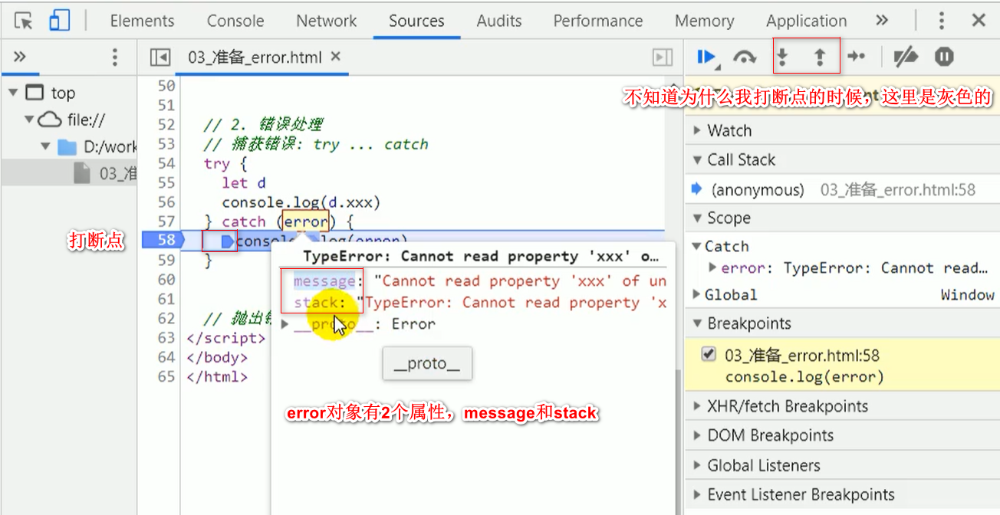
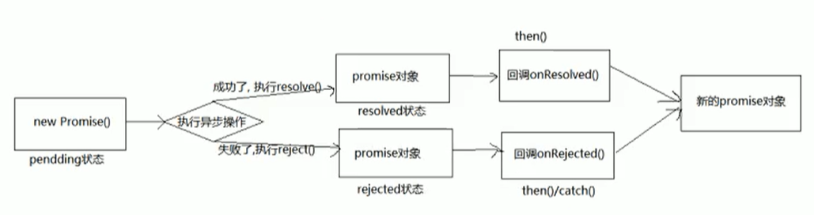

(注1：网上看到有个视频，单独讲Promise的，时长7个小时，感觉很不错，Promise也值得单独好好的学习一下，需要深刻的了解一下到底什么是异步编程。)

(注2：视频链接：[尚硅谷Promise教程(promise前端进阶必学)](https://www.bilibili.com/video/BV1MJ41197Eu/?spm_id_from=333.788.videocard.8)，看弹幕老师好像叫张晓飞)

(注3：听了2节课，发现老师讲的课程质量是真的好，一下子有种茅塞顿开的感觉，很不错的一套课程。)

# 第1章：准备工作

> 现在去中大型企业面试前端工程师，问的最多的问题之一就是手写自定义Promise。
>
> 第1章准备工作表面上和学习promise关系不大，但是后面是会用到的。

## 区分实例对象与函数对象

* 实例对象：new函数产生的对象，称为实例对象，简称为对象
* 函数对象：将函数作为对象使用时，简称为函数对象

~~~javascript
<!DOCTYPE html>
<html lang="en">

<head>
  <meta charset="UTF-8">
  <meta name="viewport" content="width=device-width, initial-scale=1.0">
  <meta http-equiv="X-UA-Compatible" content="ie=edge">
  <title>01_准备_函数对象与实例对象</title>
</head>

<body>

  
</body>

</html>
~~~

## 两种类型的回调函数

> 不是所有的回调函数都是异步的，有的是同步的(`forEach`)，有的是异步的(`setTimeout`)

有3个条件同时满足才能算是回调函数：

* 你定义的
* 你没有调用
* 但是最终执行了 

### 同步回调

* 理解：立即执行，完全执行完了才结束，不会放入回调队列中

* 例子：数组遍历相关的回调函数/Promise的excutor函数

### 异步回调

* 理解：不会立即执行，会放入回调队列中将来执行
* 例子：`setTimeout`函数

~~~javascript
<!DOCTYPE html>
<html lang="en">

<head>
  <meta charset="UTF-8">
  <meta name="viewport" content="width=device-width, initial-scale=1.0">
  <meta http-equiv="X-UA-Compatible" content="ie=edge">
  <title>02_准备_回调函数的分类</title>
</head>

<body>
  
</body>

</html>
~~~

## JS的错误处理

[Error](https://developer.mozilla.org/zh-CN/docs/Web/JavaScript/Reference/Global_Objects/Error)

### 错误的类型

* Error：所有错误的父类型
* ReferenceError：引用的变量不存在
* TypeError：数据类型不正确的错误
* RangeError：数据值不在其所允许的范围内
* SyntaxError：语法错误

~~~javascript
<!DOCTYPE html>
<html lang="en">

<head>
  <meta charset="UTF-8">
  <meta name="viewport" content="width=device-width, initial-scale=1.0">
  <meta http-equiv="X-UA-Compatible" content="ie=edge">
  <title>JS的error处理</title>
</head>

<body>

  
</body>

</html>
~~~

### 错误处理

> 你写代码肯定会遇到错误的，遇到错误如果不进行处理的话，程序就会卡在这里，没有办法继续往下执行。
>
> 讲的好啊！！我以前对抛出异常这块不太理解，现在算是彻彻底底的懂了，这老师讲的是真的好。

~~~javascript
<!DOCTYPE html>
<html lang="en">

<head>
  <meta charset="UTF-8">
  <meta name="viewport" content="width=device-width, initial-scale=1.0">
  <meta http-equiv="X-UA-Compatible" content="ie=edge">
  <title>JS的error处理</title>
</head>

<body>

  
</body>

</html>
~~~

# 第2章：Pormise的理解和使用

## Promise是什么(what)

### 理解

* 抽象表达
  * Promise是JS中进行异步编程的新的解决方案（旧的是谁？——纯回调形式[Promise里面也有回调形式]）
* 具体表达
  * 从语法上来说：Promise是一个构造函数(将来可以创建它的实例，一旦是构造函数了，肯定是它的实例去做什么事情。而一般的函数，那就是具体的那个函数去做什么事情了。)
  * 从功能上来说：**promise对象**用来封装一个异步操作**并**可以获取其结果

### Promise的状态改变

[这一次，彻底弄懂 Promise 原理](https://juejin.im/post/6844904063570542599)

* pending变为resolved
* pending变为rejected

说明：resolve和reject是函数名，resolved和rejected是状态名，而且状态改变只有这2种，且一个promise对象**只能改变一次状态**，无论变为成功还是失败，都会有一个结果数据。成功的结果数据一般称为vlaue，失败的结果数据一般称为reason。

### Promise的基本流程

### Promise的基本使用

~~~javascript
<!DOCTYPE html>
<html lang="en">

<head>
    <meta charset="UTF-8">
    <meta name="viewport" content="width=device-width, initial-scale=1.0">
    <title>Promise的基本使用</title>
</head>

<body>
    
</body>

</html>
~~~

## 为什么要用Promise(why)

> 这节课没怎么听懂。

[关于js的回调、同步回调、异步回调](https://segmentfault.com/a/1190000009391074)

### 指定回调函数的方式更加灵活

* 旧的：必须在启动异步任务前指定
* promise：启动异步任务=>返回promie对象=>给promise对象绑定回调函
  数（甚至可以在异步任务结束后指定/多个）

### 支持链式调用，可以解决回调地狱问题

* 什么是回调地狱？
  * 回调函数嵌套调用，外部回调函数异步执行的结果是嵌套的回调执行的条件
* 回调地狱的缺点？
  * 不便于阅读，不便于异常处理
* 解决方案？
  * promise链式调用
* 终极解决方案？
  * async/await

~~~javascript
/* 
    1. 指定回调函数的方式更加灵活: 
      旧的: 必须在启动异步任务前指定
      promise: 启动异步任务 => 返回promie对象 => 给promise对象绑定回调函数(甚至可以在异步任务结束后指定)
*/
const p = new Promise((resolve, reject) => {
    console.log('执行 executor同步函数') 
    let time = Date.now();
    setTimeout(() => {
        if (time % 2 === 0) {
            resolve(time)
        } else {
            reject(time)
        }
    }, 1000)

})

setTimeout(() => {
    p.then(value => {
        console.log('value', value)
    }, reason => {
        console.log('reason', reason)
    })
}, 3000)
/* 2. 支持链式调用, 可以解决回调地狱问题
    什么是回调地狱? 回调函数嵌套调用, 外部回调函数异步执行的结果是嵌套的回调函数执行的条件
    回调地狱的缺点?  不便于阅读 / 不便于异常处理
    解决方案? promise链式调用
    终极解决方案? async/await
  */

//1、查出当前用户信息
//2、按照当前用户的id查出他的课程
//3、按照当前课程id查出分数
// 回调地狱：
$.ajax({
    url: "./mock/user.json",
    success(data) {
        console.log("查询用户：", data);
        $.ajax({
            url: `./mock/user_corse_${data.id}.json`,
            success(data) {
                console.log("查询到课程：", data);
                $.ajax({
                    url: `./mock/corse_score_${data.id}.json`,
                    success(data) {
                        console.log("查询到分数：", data);
                    },
                    error(error) {
                        console.log("出现异常了：" + error);
                    }
                });
            },
            error(error) {
                console.log("出现异常了：" + error);
            }
        });
    },
    error(error) {
        console.log("出现异常了：" + error);
    }
});

// promise调用方式
function get(url, data) {
    return new Promise((resolve, reject) => {
        $.ajax({
            url: url,
            data: data,
            success: function (data) {
                resolve(data);
            },
            error: function (err) {
                reject(err)
            }
        })
    });
}

//调用封装后的方法
get("./mock/user.json")
    .then((data) => {
        console.log("用户查询成功~~~:", data)
        return get(`./mock/user_corse_${data.id}.json`);
    })
    .then((data) => {
        console.log("课程查询成功~~~:", data)
        return get(`./mock/corse_score_${data.id}.json`);
    })
    .then((data) => {
        console.log("课程成绩查询成功~~~:", data)
    })
    .catch((err) => {
        console.log("出现异常", err)
    });
// Promise操作明显更加符合我们人类的习惯，类似于流水线式的操作,对于异常的处理更加友好
~~~

## 如何使用Promise(how)

### API

* Promise构造函数：`Promise（excutor）{}`
* 

# 第3章：自定义(手写)Promise

# 第4章：async与await

# 第5章：JS异步之宏队列与微队列

# 第6章：Promise相关面试题