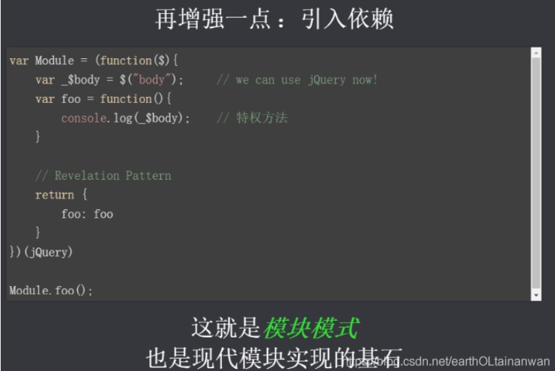

# JS模块化

(注1：没有找到原版教程，这个是我看网上的一篇学习笔记后手抄的。)

(注2：[尚硅谷_JS模块化 笔记](https://blog.csdn.net/earthOLtainanwan/article/details/100005034))

当项目功能越来越多，代码量便也会越来越多，后期的维护难度会增大，此时在JS方面就会考虑使用模块化规范去管理。
本视频内容涵盖：理解模块化，为什么要模块化，模块化的优缺点以及模块化规范。并且将带领大家学习开发中最流行的commonjs, AMD, ES6、CMD规范。
建议同学们学习完模块化规范以后再学习项目构建，以更好的武装自己的技能。

# 入门介绍

##  什么是模块 / 模块化?

当项目的功能越来越多，将所有的代码都写在一个JS文件中时，耦合度和关联度就会很高，不方便后期的维护，查找相应代码比较麻烦，容易污染全局环境…因此，将不同的代码根据某一原则，例如相应的功能，拆分成不同的文件。
模块化：将一个复杂的程序依据一定的规则(规范)封装成几个块(文件), 并进行组合在一起。块的内部数据/实现是私有的, 只是向外部暴露一些接口(方法)与外部其它模块通信。

**模块的进化史：**




## 为什么要模块化?


## 模块化的好处

- 避免命名冲突(减少命名空间污染)
- 更好的分离, 按需加载
- 更高复用性
- 高可维护性

## 页面引入加载 script


**问题**：

- 请求过多
- 依赖模糊
- 难以维护

因为这些问题的存在，就导致了模块化的必要。

# 模块进化史

## 全局function模式

~~~javascript
/*
 * 全局函数模式: 将不同的功能封装成不同的全局函数
 * 问题: Global被污染了, 很容易引起命名冲突
 */

/* 文件名为：module.js */
let msg = 'module1';
function foo() {
	console.log('foo()', msg);
}

function bar() {
	console.log('bar()', msg);
}
~~~

~~~javascript
<!DOCTYPE html>
<html>
<head>
  <meta charset="UTF-8">
  <title>全局function模式</title>
</head>
<body>
<script type="text/javascript" src="module.js"></script>
<script type="text/javascript">
  foo();//结果为：foo() module1
  bar();//结果为：foo() module1
  /* 当某些原因当值我们忘了引入的JS文件中有msg这个变量，而后又将msg进行赋值 */
  msg = 'NBA';//造成命名冲突，污染了引入的JS文件中的msg
  foo();//结果为：foo() NBA  此时，输出结果改变
</script>
</body>
</html>

~~~

## namespace模式

~~~javascript
/*
 * namespace模式: 简单对象封装
 * 作用: 减少了全局变量
 * 问题: 不安全(数据不是私有的, 外部可以直接修改)
 */

/* 文件名为：module.js */
let obj = {
	msg: 'module2',
	foo(){
		console.log('foo()', this.msg);
	}
};
~~~

~~~javascript
<!DOCTYPE html>
<html>
<head>
  <meta charset="UTF-8">
  <title>namespace模式</title>
</head>
<body>
<script type='text/javascript' src='module.js'></script>
<script type='text/javascript'>
	obj.foo();//结果为：foo() module2
	obj.msg = 'NBA';
	obj.foo();//结果为：foo() NBA  结果仍然会改变
</script>
</body>
</html>
~~~

## IIFE模式

~~~javascript
/*
 * IIFE模式: 匿名函数自调用(闭包)
 * IIFE : immediately-invoked function expression(立即调用函数表达式)
 * 作用: 数据是私有的, 外部只能通过暴露的方法操作
 * 问题: 如果当前这个模块依赖另一个模块怎么办?
 */

/* 文件名为：module.js */
(function (window) {
	let msg = 'module';
	function foo() {
		console.log('foo()', msg);
	}
})(window)
~~~

~~~javascript
<!DOCTYPE html>
<html>
<head>
  <meta charset="UTF-8">
  <title>IIFE模式</title>
</head>
<body>
<script type='text/javascript' src='module.js'></script>
<script type='text/javascript'>
	msg = 'NBA';
	console.log(msg);//实际上，这个msg是相当于在window上定义了一个msg，而不是修改引入的module.js中的msg
	foo();//报错：Uncaught ReferenceError: foo is not defined
</script>
</body>
</html>
~~~

此时的foo()是内部私有的，想要与外面通信，则需要将其暴露出来。因此：

~~~javascript
/* 文件名为：module.js */
(function (window) {
	let msg = 'module';
	function foo() {
		console.log('foo()', msg);
	}
	window.module = {foo};
	//相当于：
//	window.module = {//相当于给全局window对象添加了一个module属性，这个属性是个对象，对象里有个方法叫foo
//		foo: foo//第一个foo是定义的属性，第二个foo是上面的函数，而重名的属性可以省略不写
//	};
})(window)
~~~

~~~javascript
<!DOCTYPE html>
<html>
<head>
  <meta charset="UTF-8">
  <title>IIFE模式</title>
</head>
<body>
<script type='text/javascript' src='module3.js'></script>
<script type='text/javascript'>
	msg = 'NBA';
	console.log(msg);
//	foo();//不能直接调用，因为暴露出来的是module这个对象
	module.foo();//结果为foo() module
</script>
</body>
</html>
~~~

## IIFE增强模式

~~~javascript
/**
 * IIFE模式增强 : 引入依赖
 * 这就是现代模块实现的基石
 */

/* 文件名为：module */
(function (window) {
	let msg = 'module';
	function foo() {
		console.log('foo()', msg);
	}
	window.module = foo;
})(window);
~~~

~~~javascript
<!DOCTYPE html>
<html lang="en">
<head>
  <meta charset="UTF-8">
  <title>IIFE模式增强</title>
</head>
<body>
<script type='text/javascript' src='module4.js'></script>
<script type='text/javascript'>
	module();//结果为：foo() module
</script>
</body>
</html>
~~~

然后，希望给背景添加背景色，这里需要用到jquery。

~~~javascript
(function (window, $) {
	let msg = 'module';
	function foo() {
		console.log('foo()', msg);
	}
	window.module = foo;
	$('body').css('background', 'red');
})(window, jQuery);
~~~

~~~javascript
<!DOCTYPE html>
<html lang="en">
<head>
  <meta charset="UTF-8">
  <title>IIFE模式增强</title>
</head>
<body>
<script type='text/javascript' src='jquery-1.10.1.js'></script>
<script type='text/javascript' src='module4.js'></script>
<script type='text/javascript'>
	module();//结果为：foo() module
</script>
</body>
</html>
~~~

## load script

~~~javascript
<!DOCTYPE html>
<html lang="en">
<head>
  <meta charset="UTF-8">
  <title>load script</title>
</head>
<body>
<!--
  1. 一个页面需要引入多个js文件
  2. 问题:
    1). 请求过多
    2). 依赖模糊
    3). 难以维护
  3. 这些问题可以通过现代模块化编码和项目构建来解决

  首先我们要依赖多个模块，那样就会发送多个请求，导致请求过多
  然后就是依赖关系模糊  我们不知道他们的具体依赖关系是什么  也就是说很容易因为依赖关系导致出错
  以上的现象就导致了这样会很难维护。很可能出现牵一发而动全身的情况导致项目出现严重的问题
-->
<script src="test1.js"></script>
<script src="test2.js"></script><!-- 依赖test1中的某些东西 -->
<script src="test3.js"></script><!-- 依赖test2中的某些东西 -->
<!-- 此时，test1、test2、test3 的引入顺序不能更改 -->
<script src="test4.js"></script>
</body>
</html>
~~~

## 模块化进化史教程

~~~javascript
## 模块化进化史教程
1. 全局function模式
  * module1.js
    ```
    //数据
    let data = 'atguigu.com'
    
    //操作数据的函数
    function foo() {
      console.log(`foo() ${data}`)
    }
    function bar() {
      console.log(`bar() ${data}`)
    }
    ```
  * module2.js
    ```
    let data2 = 'other data'
    
    function foo() {  //与另一个模块中的函数冲突了
      console.log(`foo() ${data2}`)
    }
    ```
  * test1.html
    ```
    <script type="text/javascript" src="module1.js"></script>
    <script type="text/javascript" src="module2.js"></script>
    <script type="text/javascript">
    
      let data = "修改后的数据"
      foo()
      bar()
    </script>
    ```
   * 说明:
      * 全局函数模式: 将不同的功能封装成不同的全局函数
      * 问题: Global被污染了, 很容易引起命名冲突
2. namespace模式
  * module1.js
    ```
    let myModule = {
      data: 'atguigu.com',
      foo() {
        console.log(`foo() ${this.data}`)
      },
      bar() {
        console.log(`bar() ${this.data}`)
      }
    }
    ```
  * module2.js
    ```
    let myModule2 = {
      data: 'atguigu.com2222',
      foo() {
        console.log(`foo() ${this.data}`)
      },
      bar() {
        console.log(`bar() ${this.data}`)
      }
    }
    ```
  * test2.html
    ```
    <script type="text/javascript" src="module2.js"></script>
    <script type="text/javascript" src="module22.js"></script>
    <script type="text/javascript">
      myModule.foo()
      myModule.bar()
    
      myModule2.foo()
      myModule2.bar()
    
      myModule.data = 'other data' //能直接修改模块内部的数据
      myModule.foo()
    
    </script>
    ```
  * 说明
    * namespace模式: 简单对象封装
    * 作用: 减少了全局变量
    * 问题: 不安全
3. IIFE模式
  * module3.js
    ```
    (function (window) {
      //数据
      let data = 'atguigu.com'
    
      //操作数据的函数
      function foo() { //用于暴露有函数
        console.log(`foo() ${data}`)
      }
    
      function bar() {//用于暴露有函数
        console.log(`bar() ${data}`)
        otherFun() //内部调用
      }
    
      function otherFun() { //内部私有的函数
        console.log('otherFun()')
      }
    
      //暴露行为
      window.myModule = {foo, bar}
    })(window)
    ```
  * test3.html
    ```
    <script type="text/javascript" src="module3.js"></script>
    <script type="text/javascript">
      myModule.foo()
      myModule.bar()
      //myModule.otherFun()  //myModule.otherFun is not a function
      console.log(myModule.data) //undefined 不能访问模块内部数据
      myModule.data = 'xxxx' //不是修改的模块内部的data
      myModule.foo() //没有改变
    
    </script>
    ```
  * 说明:
    * IIFE模式: 匿名函数自调用(闭包)
    * IIFE : immediately-invoked function expression(立即调用函数表达式)
    * 作用: 数据是私有的, 外部只能通过暴露的方法操作
    * 问题: 如果当前这个模块依赖另一个模块怎么办?
4. IIFE模式增强
  * 引入jquery到项目中
  * module4.js
    ```
    (function (window, $) {
      //数据
      let data = 'atguigu.com'
    
      //操作数据的函数
      function foo() { //用于暴露有函数
        console.log(`foo() ${data}`)
        $('body').css('background', 'red')
      }
    
      function bar() {//用于暴露有函数
        console.log(`bar() ${data}`)
        otherFun() //内部调用
      }
    
      function otherFun() { //内部私有的函数
        console.log('otherFun()')
      }
    
      //暴露行为
      window.myModule = {foo, bar}
    })(window, jQuery)
    ```
  * test4.html
    ```
    <script type="text/javascript" src="jquery-1.10.1.js"></script>
    <script type="text/javascript" src="module4.js"></script>
    <script type="text/javascript">
      myModule.foo()
    </script>
    ```
  * 说明
    * IIFE模式增强 : 引入依赖
    * 这就是现代模块实现的基石
      
5. 页面加载多个js的问题
  * 页面:
    ```
    <script type="text/javascript" src="module1.js"></script>
    <script type="text/javascript" src="module2.js"></script>
    <script type="text/javascript" src="module3.js"></script>
    <script type="text/javascript" src="module4.js"></script>
    ```
  * 说明
    * 一个页面需要引入多个js文件
    * 问题:
        * 请求过多
        * 依赖模糊
        * 难以维护
    * 这些问题可以通过现代模块化编码和项目构建来解决
~~~

# CommonJS(Node使用这个)


