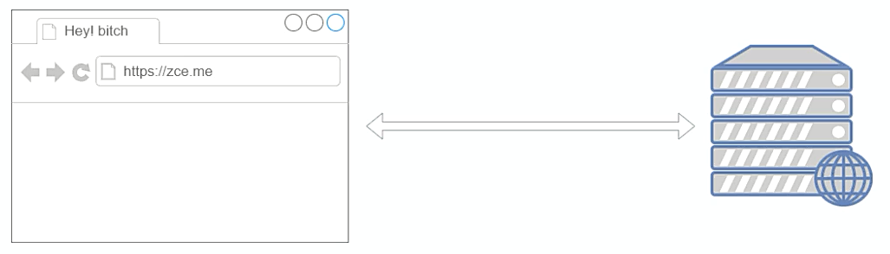
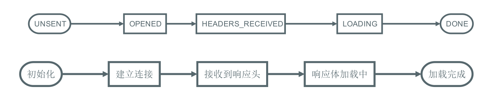
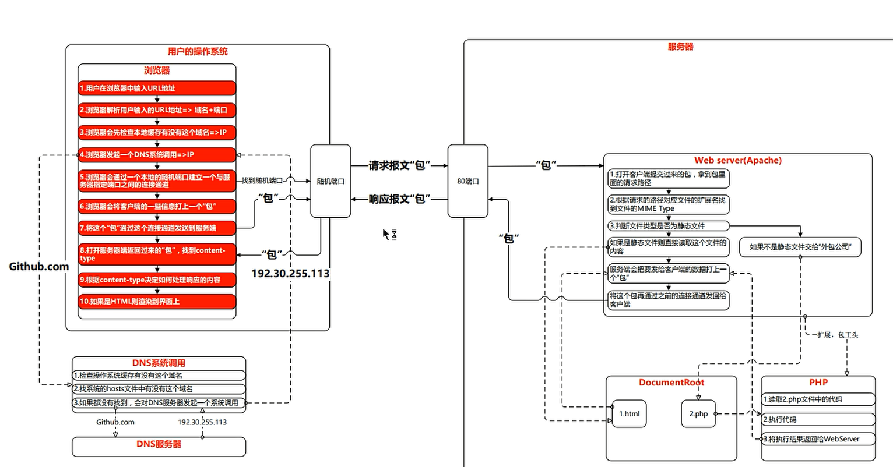
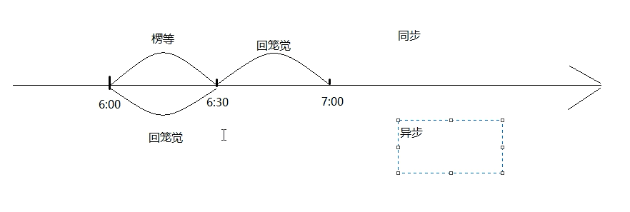
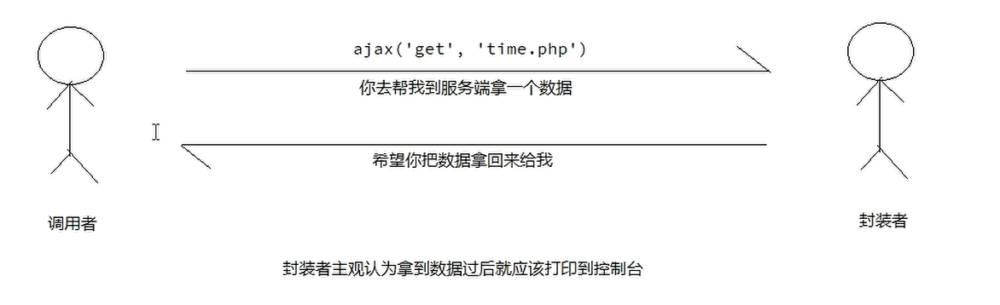
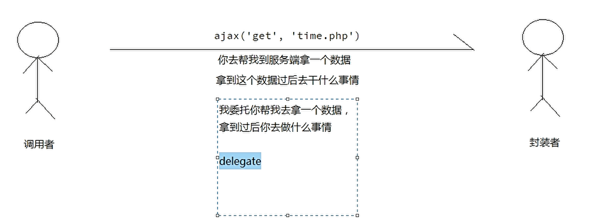

(注1：现在是2020年8月5日，准备重新开始再学一遍AJAX,之前看的是一个视频，现在决定看另外一个传智播客的视频来复习，不看之前的那个视频了。)

(注2：这个视频里老师写代码不喜欢在后面打分号，我觉得不太好。)

(注3：这个是2017年10月份的视频，3年前的视频,老师好像叫[汪磊](<https://zce.me/>),92年的，只比我大了2岁。)

(注3：我觉得趁着学AJAX的时候，应该把《图解HTTP》这本书博文给写完，反正也没多少，而是是通识读物，慢慢的要开始用到计算机网络的有关知识了，以前对计算机网络的理论学习一方面是囫囵吞枣，另一方面是悬在半空中，沾不到地上来。)

(注4：现在是2020年8月13日，本来早就应该把AJAX给看完了，结果现在磨磨唧唧的才看完了第一天的视频，还有一天的视频没有看完。)

(注5：我搜了一下这个老师：汪磊，在B站上看到他上传的AJAX视频，发现我看的视频应该是老版的，他新版的视频还有很多案例学习，我去，可是我都快要看完了，那就算了吧，等以后自己要巩固AJAX的时候再回过头来看一下他的这个视频巩固一下吧。)

(注6:现在是2020年8月20日，AJAX终于看完了，花了**半个月**的时间。掌握的也不算特别好，理论知识大体上过了一遍，我觉得今后还需要一些做小案例来进行巩固。跨域的部分还是要好好理解才行，掌握的不是特别好。)

(注7：现在是2020年11月10日，我发现自己好像把AJAX忘得快差不多了。也是，当初只是学了，后面就没有用过了，现在再稍微复习一下，唤起一下3个月前的记忆吧。)

# AJAX简介

**学习AJAX最重要的目的是把请求发出去，然后把请求的结果再拿回来。**

**AJAX即Asynchronous JavaScript and XML（异步的JavaScript与XML技术）**，其**本身不是一种新技术**，而是一个在 2005年被杰西·詹姆士·贾瑞特提出的新术语，用来描述一种使用现有技术集合的"新"方法，包括：HTML或XHTML，CSS，JavaScript，DOM，XML,以及最重要的`XML HttpRequest object`（XHR对象）。当使用结合了这些技术的AJAX模型以后， 网页应用能够快速地将**增量**更新呈现在用户界面上，而不需要重载（刷新）整个页面。这使得程序能够更快地回应用户的操作。

> 尽管X在AJAX中代表XML, 但由于JSON的许多优势，比如更加轻量以及作为Javascript的一部分，目前JSON的使用比XML更加普遍。JSON和XML都被用于在AJAX模型中打包信息。

传统的Web应用允许用户端**填写表单(form)**，**当提交表单时就向网页服务器发送一个请求**。服务器**接收并处理**传来的表单，然后**送回**一个新的网页，但这个做法浪费了许多带宽，因为在**前后两个页面**中的**大部分HTML码往往是相同的**。由于**每次应用的沟通都需要向服务器发送请求**，**应用的回应时间依赖于服务器的回应时间**。这导致了用户界面的回应比本机应用慢得多。

与此不同，AJAX应用可以**仅向服务器发送并取回必须的数据**，并在客户端采用JavaScript处理来自服务器的回应。因为在服务器和浏览器之间交换的数据大量减少，服务器回应更快了。同时，**很多的处理工作可以在发出请求的客户端机器上完成**，因此**Web服务器的负荷也减少了**。

> AJAX 不是新的编程语言，而是一种使用现有标准的新方法。
>
> AJAX 最大的优点是在**不重新加载整个页面的情况下**，可以与服务器交换数据并更新部分网页内容。
>
> AJAX 不需要任何浏览器插件，但需要用户允许JavaScript在浏览器上执行。

## 什么是AJAX中的异步

[AJAX中同步和异步的区别和使用场景](<https://blog.csdn.net/shenlei19911210/article/details/41964313>)

[ajax 同步和异步区别？](<https://blog.csdn.net/qq_42611547/article/details/86130122?depth_1-utm_source=distribute.pc_relevant.none-task-blog-BlogCommendFromBaidu-1&utm_source=distribute.pc_relevant.none-task-blog-BlogCommendFromBaidu-1>)

AJAX中根据async的值不同分为同步（async = false）和异步（async = true）两种执行方式；在W3C的教程中推荐使用**异步执行**。

> async就是asynchronous(异步)的简写。

下面来区别一下同步和异步有什么不同：

* 异步：我们通过事件触发AJAX，请求服务器，在这个期间无论服务器有没有响应，客户端的其他代码一样可以运行。

* 同步：我们通过事件触发AJAX，请求服务器，在这个期间等待服务器处理请求， 在这个期间客户端不能做任何处理。当 AJAX执行完毕才会继续执行其他代码。

> 同步是在一条直线上的队列，异步不在一个队列上 各走各的
>
> 同步就是你叫我去吃饭，我听到了就和你去吃饭；如果没有听到，你就不停的叫，直到我告诉你听到了，才一起去吃饭。
>
> 异步就是你叫我，然后自己去吃饭，我得到消息后可能立即走，也可能等到忙完才去吃饭。

## 什么是XML

可扩展标记语言（英语：Extensible Markup Language，简称：XML）是一种**标记语言**。标记指计算机所能理解的信息符号，**通过此种标记，计算机之间可以处理包含各种信息的文章等**。如何定义这些标记，既可以选择国际通用的标记语言，比如HTML，也可以使用像XML这样由**相关人士自由决定**的标记语言，这就是**语言的可扩展性**。XML是从标准通用标记语言（SGML）中简化修改出来的。它主要用到的有可扩展标记语言、可扩展样式语(XSL)、XBRL和XPath等。

XML设计用来**传送及携带**数据信息，**不用来表现或展示数据**，**HTML则用来表现数据**，所以**XML用途的焦点是它说明数据是什么，以及携带数据信息**。

## 什么是JSON

JSON（JavaScript Object Notation，JavaScript对象表示法，读作/ˈdʒeɪsən/）是一种由道格拉斯·克罗克福特构想和设计、轻量级的数据交换语言，该语言以易于让人阅读的文字为基础，用来传输由属性值或者序列性的值组成的数据对象。尽管JSON是JavaScript的一个子集，但JSON是独立于语言的文本格式，并且采用了类似于C语言家族的一些习惯。

JSON 数据格式与语言无关。即便它源自JavaScript，但当前很多编程语言都支持 JSON 格式数据的生成和解析。JSON 的官方 MIME 类型是 application/json，文件扩展名是 `.json`。

[JSON 入门指南](<https://developer.ibm.com/zh/articles/wa-lo-json/>)

# 概述

> Web程序最初的目的就是**将信息（数据）放到公共的服务器**，让所有网络用户都可以**通过浏览器访问**。

在此之前，我们可以通过以下几种方式让浏览器发出对服务端的请求，获得服务端的数据：

* 地址栏输入地址，回车，刷新
* 特定元素的href或src属性
* 表单提交

这些方案都是我们无法通过或者很难通过代码的方式进行编程（对服务端发出请求并且接受服务端返回的响应），**如果我们可以通过JavaScript直接发送网络请求，那么Web的可能就会更多，随之能够实现的功能也会更多，至少不再是"单机游戏"**。

AJAX（Asynchronous JavaScript and XML），最早出现在2005年的Google suggest，是在浏览器端进行网络编程（发送请求、接收响应）的技术方案，它使我们可以通过JavaScript直接获取服务端最新的内容而不必重新加载页面。让Web更能接近桌面应用的用户体验。

说白了，AJAX就是**浏览器提供的一套API**，可以**通过Javascript调用**，从而实现通过代码控制请求与响应。实现**网络编程**。

> 能力不够API凑。

# 快速上手

[XHR的用法详细解读](<https://blog.csdn.net/wu_xianqiang/article/details/70036695>)

使用AJAX的过程可以类比平常我们访问网页过程。

~~~javascript
//1，创建一个XMLHttpRequest类型的对象——相当于打开了一个浏览器
//xhr是请求代理对象，就是帮我们发请求的对象
var xhr = new XMLHttpRequest();
//2，打开与一个网址之间的连接——相当于在地址栏输入访问地址
//调用open()方法并不会真正发送请求，而只是启动一个请求以备发送。
xhr.open('GET'，'./time.php');
//3，通过连接发送一次请求——相当于回车或者点击访问发送请求
xhr.send(null);
//4，指定xhr状态变化事件处理函数——相当于处理网页呈现后的操作
xhr.onreadystatechange=function(){
//通过xhr的readystate判断此次请求的响应是否接收完成
  if（this.readyState === 4）{
//通过xhr的responseText获取到响应的响应体
    console.1og(this);
}
~~~

## 具体示例1.0

~~~javascript
<!DOCTYPE html>
<html lang="en">
<head>
  <meta charset="UTF-8">
  <title>AJAX 的快速上手（发送请求）</title>
</head>
<body>
  
</body>
</html>
~~~

## 具体示例2.0

~~~javascript
<!DOCTYPE html>
<html lang="en">
<head>
  <meta charset="UTF-8">
  <title>AJAX 的快速上手（接收响应）</title>
</head>
<body>
  
</body>
</html>
~~~

> 现在是2020年11月10日，截止到上面复习完。

## 数据交换格式(XML和JSON)

~~~javascript
<!-- XML格式描述数据 -->
<student>
	<name>张三</name>
	<age>18</age>
	<gender>男</gender>
	<girlfriend>
		<name>小红</name>
		<age>16</age>
		<gender>女</gender>
	</girlfriend>
</student>

<!-- JSON格式描述数据(现已取代了XML) -->
{
	"name":"张三",
	"age":18,
	"gender":"男",
	"girlfriend":"小红"
}
~~~

## readyState

由于`readystatechange`事件是在`xhr`对象状态变化时触发（不单是在得到响应时），也就意味着这个事件会被触发多次，所以我们有必要了解每一个状态值代表的含义：

| readyState | 状态描述         | 说明                                                    |
| ---------- | ---------------- | ------------------------------------------------------- |
| 0          | UNSENT           | 代理（XHR）被创建，但尚未调用  open() 方法。            |
| 1          | OPENED           | open() 方法已经被调用，建立了连接。                     |
| 2          | HEADERS_RECEIVED | send() 方法已经被调用，并且已经可以获取状态行和响应头。 |
| 3          | LOADING          | 响应体下载中，  responseText 属性可能已经包含部分数据。 |
| 4          | DONE             | 响应体下载完成，可以直接使用  responseText 。           |

### 时间轴

### 具体示例

~~~javascript
<!DOCTYPE html>
<html lang="en">
<head>
  <meta charset="UTF-8">
  <title>readyState</title>
</head>
<body>
  
</body>
</html>
~~~

通过理解每一个状态值的含义得出一个结论：一般我们都是在  readyState 值为  4 时，执行响应的后续逻辑。

~~~javascript
xhr.onreadystatechange = function () {
  if (this.readyState === 4) {
    // 后续逻辑......
  }
}
~~~

### onload方法

~~~javascript
<!DOCTYPE html>
<html lang="en">
<head>
  <meta charset="UTF-8">
  <title>online</title>
</head>
<body>
  
</body>
</html>
~~~

### 请求响应过程

## 遵循HTTP

本质上 XMLHttpRequest 就是 JavaScript 在 Web 平台中发送 HTTP 请求的手段，所以我们发送出去的请求任然是
HTTP 请求，同样符合 HTTP 约定的格式：

~~~javascript
// 设置请求报文的请求行
xhr.open('GET', './time.php');
// 设置请求头
xhr.setRequestHeader('Accept', 'text/plain')
// 设置请求体
xhr.send(null);
xhr.onreadystatechange = function () {
  if (this.readyState === 4) {
    // 获取响应状态码
    console.log(this.status);
    // 获取响应状态描述
    console.log(this.statusText);
    // 获取响应头信息
    console.log(this.getResponseHeader('Content‐Type'));// 指定响应头
    console.log(this.getAllResponseHeaders());// 全部响应头
    // 获取响应体
    console.log(this.responseText);// 文本形式
    console.log(this.responseXML);// XML 形式，了解即可不用了
  }
}
~~~

参考链接：

* [XMLHttpRequest](https://developer.mozilla.org/zh-CN/docs/Web/API/XMLHttpRequest)
* [使用 XMLHttpRequest](https://developer.mozilla.org/zh-CN/docs/Web/API/XMLHttpRequest/Using_XMLHttpRequest)

### 具体示例

~~~javascript
<!DOCTYPE html>
<html lang="en">
<head>
  <meta charset="UTF-8">
  <title>遵循HTTP协议</title>
</head>
<body>
  
</body>
</html>
~~~

### form标签用法

~~~javascript
<!DOCTYPE html>
<html lang="en">
<head>
  <meta charset="UTF-8">
  <title>Document</title>
</head>
<body>
  <form action="add.php" method="post" >
    <input type="text" name="name" id="">
    <button>提交</button>
  </form>
</body>
</html>
~~~

# 具体用法

[GET和POST两种基本请求方法的区别](https://www.cnblogs.com/logsharing/p/8448446.html)

## GET请求

> 通常在一次 GET 请求过程中，参数传递都是通过 URL 地址中的  ? 参数传递。

~~~javascript
var xhr = new XMLHttpRequest()
// GET 请求传递参数通常使用的是问号传参
// 这里可以在请求地址后面加上参数，从而传递数据到服务端
xhr.open('GET', './delete.php?id=1')
// 一般在 GET 请求时无需设置响应体，可以传 null 或者干脆不传
xhr.send(null)
xhr.onreadystatechange = function () {
  if (this.readyState === 4) {
    console.log(this.responseText)
  }
}
// 一般情况下 URL 传递的都是参数性质的数据，而 POST 一般都是业务数据
~~~

### AJAX发送GET请求并传递参数

~~~javascript
<!DOCTYPE html>
<html lang="en">
<head>
  <meta charset="UTF-8">
  <title>AJAX发送GET请求并传递参数</title>
</head>
<body>
  <ul id="list"></ul>

  
</body>
</html>
~~~

**users.php**

~~~javascript
<?php

header('Content-Type: application/json');
/**
 * 返回的响应就是一个 JSON 内容（返回的就是数据）
 * 对于返回数据的地址一般我们称之为接口（形式上是 Web 形式）
 */

// `/users.php?id=1` => id 为 1 的用户信息

$data = array(
  array(
    'id' => 1,
    'name' => '张三',
    'age' => 18
  ),
  array(
    'id' => 2,
    'name' => '李四',
    'age' => 20
  ),
  array(
    'id' => 3,
    'name' => '二傻子',
    'age' => 18
  ),
  array(
    'id' => 4,
    'name' => '三愣子',
    'age' => 19
  )
);

if (empty($_GET['id'])) {
  // 没有 ID 获取全部
  // 因为 HTTP 中约定报文的内容就是字符串，而我们需要传递给客户端的信息是一个有结构的数据
  // 这种情况下我们一般采用 JSON 作为数据格式
  $json = json_encode($data); // => [{"id":1,"name":"张三"},{...}]
  echo $json;
} else {
  // 传递了 ID 只获取一条
  foreach ($data as $item) {
    if ($item['id'] != $_GET['id']) continue;
    $json = json_encode($item); // => [{"id":1,"name":"张三"},{...}]
    echo $json;
  }
}
~~~

## POST请求

> POST 请求过程中，都是采用请求体承载需要提交的数据。

~~~javascript
var xhr = new XMLHttpRequest();
// open 方法的第一个参数的作用就是设置请求的 method
xhr.open('POST', './add.php');
// 设置请求头中的 Content‐Type 为 application/x‐www‐form‐urlencoded
// 标识此次请求的请求体格式为 urlencoded 以便于服务端接收数据
xhr.setRequestHeader('Content‐Type', 'application/x‐www‐form‐urlencoded')
// 需要提交到服务端的数据可以通过 send 方法的参数传递
// 格式：key1=value1&key2=value2
xhr.send('key1=value1&key2=value2');
xhr.onreadystatechange = function () {
  if (this.readyState === 4) {
    console.log(this.responseText)
  }
}
~~~

### AJAX发送POST请求

~~~javascript
<!DOCTYPE html>
<html lang="en">
<head>
  <meta charset="UTF-8">
  <title>AJAX发送POST请求</title>
  
</head>
<body>
  

  <table border="1">
    <tr>
      <td>用户名</td>
      <td><input type="text" id="username"></td>
    </tr>
    <tr>
      <td>密码</td>
      <td><input type="password" id="password"></td>
    </tr>
    <tr>
      <td></td>
      <td><button id="btn">登录</button></td>
    </tr>
  </table>
  
</body>
</html>
~~~

## 同步与异步

关于同步与异步的概念在生活中有很多常见的场景，举例说明。

* 同步：一个人在同一个时刻只能做一件事情，在执行一些耗时的操作（不需要看管）不去做别的事，只是等
  待。

* 异步：在执行一些耗时的操作（不需要看管）去做别的事，而不是等待。

xhr.open() 方法第三个参数要求传入的是一个  bool 值，其作用就是设置此次请求是否采用异步方式执行，默认
为  true ，如果需要同步执行可以通过传递  false 实现：

~~~javascript
console.log('before ajax')
var xhr = new XMLHttpRequest()
// 默认第三个参数为 true 意味着采用异步方式执行
xhr.open('GET', './time.php', true)
xhr.send(null)
xhr.onreadystatechange = function () {
  if (this.readyState === 4) {
    // 这里的代码最后执行
    console.log('request done')
  }
}
console.log('after ajax')
~~~

如果采用同步方式执行，则代码会卡死在`xhr.send()`这一步：

~~~javascript
console.log('before ajax')
var xhr = new XMLHttpRequest()
// 同步方式
xhr.open('GET', './time.php', false)
// 同步方式 执行需要 先注册事件再调用 send，否则 readystatechange 无法触发
xhr.onreadystatechange = function () {
  if (this.readyState === 4) {
    // 这里的代码最后执行
    console.log('request done')
  }
}
xhr.send(null);
//因为send方法执行完成，响应已经下载完成
console.log('after ajax')
~~~

演示同步异步差异。

一定在发送请求  send() 之前注册  readystatechange （不管同步或者异步）

* 为了让这个事件可以更加可靠（一定触发），一定是先注册

了解同步模式即可，切记不要使用同步模式。

至此，我们已经大致了解了 AJAX 的基本 API 。

### 同步与异步比较示例1

~~~javascript
<!DOCTYPE html>
<html lang="en">
<head>
  <meta charset="UTF-8">
  <title>Document</title>
</head>
<body>
  
</body>
</html>
~~~

###  同步与异步比较示例2

~~~javascript
<!DOCTYPE html>
<html lang="en">
<head>
  <meta charset="UTF-8">
  <title>同步模式的AJAX</title>
</head>
<body>
  
</body>
</html>
~~~

## 响应数据格式

> 提问：如果希望服务端返回一个复杂数据，该如何处理？

关心的问题就是服务端发出何种格式的数据，这种格式如何在客户端用 JavaScript 解析。

> 不管是 JSON 也好，还是 XML，只是在 AJAX 请求过程中用到，并不代表它们之间有必然的联系，它们只是
> 数据协议罢了

> 不管服务端是采用XML还是采用JSON本质上都是将数据返回给客户端
>
> 服务端应该设置一合理的Content-Type

### XML

一种数据描述手段

老掉牙的东西，简单演示一下，不在这里浪费时间，基本现在的项目不用了。

淘汰的原因：数据冗余太多

#### AJAX 请求XML格式的数据

~~~javascript
<!DOCTYPE html>
<html lang="en">

<head>
  <meta charset="UTF-8">
  <title>AJAX 请求XML格式的数据</title>
</head>

<body>
  
</body>

</html>
~~~

**xml.php**

~~~javascript
<?php
header('Content-Type: application/xml');
?>
<? xml version='1.1' encoding="utf-8"?>
<person>
  <name>石羊</name>
  <age>16</age>
  <gender>男</gender>
</person>
~~~

### JSON

也是一种数据描述手段，类似于 JavaScript 字面量方式

服务端采用 JSON 格式返回数据，客户端按照 JSON 格式解析数据。

> 不管是 JSON 也好，还是 XML，只是在 AJAX 请求过程中用到，并不代表它们之间有必然的联系，它们只是
> 数据协议罢了

##  处理响应数据渲染

### 动态渲染数据到表格中

模板引擎：模板引擎实际上就是一个 API，模板引擎有很多种，使用方式大同小异，目的为了可以更容易的将数据渲染到
HTML中。

> artTemplate：https://aui.github.io/art-template/

~~~javascript
<!DOCTYPE html>
<html lang="en">
<head>
  <meta charset="UTF-8">
  <title>动态渲染数据到表格中</title>
</head>
<body>
  <table>
    <tbody id="content"></tbody>
  </table>
  
</body>
</html>
~~~

**test.php**

~~~php
<?php
header('Content-Type: application/json');
?>
{"success":true,"data":[{"0":"7","id":"7","1":"\u54c8\u54c8","author":"\u54c8\u54c8","2":"hh@gmail.com","email":"hh@gmail.com","3":"2017-07-22 09:10:00","created":"2017-07-22 09:10:00","4":"\u4e00\u9488\u89c1\u8840","content":"\u4e00\u9488\u89c1\u8840","5":"approved","status":"approved","6":"1","post_id":"1","7":null,"parent_id":null,"8":"\u4e16\u754c\uff0c\u4f60\u597d","post_title":"\u4e16\u754c\uff0c\u4f60\u597d"},{"0":"6","id":"6","1":"\u5c0f\u53f3","author":"\u5c0f\u53f3","2":"www@gmail.com","email":"www@gmail.com","3":"2017-07-11 22:22:00","created":"2017-07-11 22:22:00","4":"I am fine thank you and you?","content":"I am fine thank you and you?","5":"approved","status":"approved","6":"1","post_id":"1","7":"5","parent_id":"5","8":"\u4e16\u754c\uff0c\u4f60\u597d","post_title":"\u4e16\u754c\uff0c\u4f60\u597d"},{"0":"4","id":"4","1":"\u6c6a\u78ca","author":"\u6c6a\u78ca","2":"www@gmail.com","email":"www@gmail.com","3":"2017-07-09 22:22:00","created":"2017-07-09 22:22:00","4":"\u4e0d\u597d","content":"\u4e0d\u597d","5":"approved","status":"approved","6":"1","post_id":"1","7":"3","parent_id":"3","8":"\u4e16\u754c\uff0c\u4f60\u597d","post_title":"\u4e16\u754c\uff0c\u4f60\u597d"},{"0":"5","id":"5","1":"\u6c6a\u78ca","author":"\u6c6a\u78ca","2":"w@zce.me","email":"w@zce.me","3":"2017-07-09 18:22:00","created":"2017-07-09 18:22:00","4":"How are you?","content":"How are you?","5":"held","status":"held","6":"1","post_id":"1","7":"3","parent_id":"3","8":"\u4e16\u754c\uff0c\u4f60\u597d","post_title":"\u4e16\u754c\uff0c\u4f60\u597d"},{"0":"3","id":"3","1":"\u5c0f\u53f3","author":"\u5c0f\u53f3","2":"www@gmail.com","email":"www@gmail.com","3":"2017-07-06 14:10:00","created":"2017-07-06 14:10:00","4":"\u4f60\u597d\u554a\uff0c\u4ea4\u4e2a\u670b\u53cb\u597d\u5417\uff1f","content":"\u4f60\u597d\u554a\uff0c\u4ea4\u4e2a\u670b\u53cb\u597d\u5417\uff1f","5":"held","status":"held","6":"1","post_id":"1","7":null,"parent_id":null,"8":"\u4e16\u754c\uff0c\u4f60\u597d","post_title":"\u4e16\u754c\uff0c\u4f60\u597d"},{"0":"2","id":"2","1":"\u563f\u563f","author":"\u563f\u563f","2":"ee@gmail.com","email":"ee@gmail.com","3":"2017-07-05 09:10:00","created":"2017-07-05 09:10:00","4":"\u60f3\u77e5\u9053\u9999\u6e2f\u56de\u5f52\u7684\u60ca\u4eba\u5185\u5e55\u5417\uff1f\u5feb\u5feb\u4e0e\u6211\u53d6\u5f97\u8054\u7cfb","content":"\u60f3\u77e5\u9053\u9999\u6e2f\u56de\u5f52\u7684\u60ca\u4eba\u5185\u5e55\u5417\uff1f\u5feb\u5feb\u4e0e\u6211\u53d6\u5f97\u8054\u7cfb","5":"rejected","status":"rejected","6":"1","post_id":"1","7":null,"parent_id":null,"8":"\u4e16\u754c\uff0c\u4f60\u597d","post_title":"\u4e16\u754c\uff0c\u4f60\u597d"},{"0":"1","id":"1","1":"\u6c6a\u78ca","author":"\u6c6a\u78ca","2":"w@zce.me","email":"w@zce.me","3":"2017-07-04 12:00:00","created":"2017-07-04 12:00:00","4":"\u8fd9\u662f\u4e00\u6761\u6d4b\u8bd5\u8bc4\u8bba\uff0c\u6b22\u8fce\u5149\u4e34","content":"\u8fd9\u662f\u4e00\u6761\u6d4b\u8bd5\u8bc4\u8bba\uff0c\u6b22\u8fce\u5149\u4e34","5":"approved","status":"approved","6":"1","post_id":"1","7":null,"parent_id":null,"8":"\u4e16\u754c\uff0c\u4f60\u597d","post_title":"\u4e16\u754c\uff0c\u4f60\u597d"},{"0":"1000","id":"1000","1":"\u9ece\u6d0b","author":"\u9ece\u6d0b","2":"o.fdzw@pou.mc","email":"o.fdzw@pou.mc","3":"2017-06-07 19:40:03","created":"2017-06-07 19:40:03","4":"\u4e0a\u91d1\u5e73\u534a\u6597\u4ea4\u8c03\u4e07\u4eba\u884c\u4f60\u5458\u6240\u516d\u91cf\u3002\u9636\u53f2\u7ecf\u4f60\u6784\u76f8\u4e5f\u8d44\u5176\u5f62\u4e9b\u67e5\u5143\u6b63\u4efb\u3002\u90fd\u89c1\u8fb9\u5219\u5185\u5305\u81ea\u53e3\u4e86\u6cb9\u5c06\u5e38\u5904\u3002","content":"\u4e0a\u91d1\u5e73\u534a\u6597\u4ea4\u8c03\u4e07\u4eba\u884c\u4f60\u5458\u6240\u516d\u91cf\u3002\u9636\u53f2\u7ecf\u4f60\u6784\u76f8\u4e5f\u8d44\u5176\u5f62\u4e9b\u67e5\u5143\u6b63\u4efb\u3002\u90fd\u89c1\u8fb9\u5219\u5185\u5305\u81ea\u53e3\u4e86\u6cb9\u5c06\u5e38\u5904\u3002","5":"trashed","status":"trashed","6":"3","post_id":"3","7":"4","parent_id":"4","8":"\u7b2c\u4e8c\u7bc7\u793a\u4f8b\u6587\u7ae0","post_title":"\u7b2c\u4e8c\u7bc7\u793a\u4f8b\u6587\u7ae0"},{"0":"993","id":"993","1":"\u66f9\u82b3","author":"\u66f9\u82b3","2":"j.uferfdxee@skdzecrj.cy","email":"j.uferfdxee@skdzecrj.cy","3":"2016-11-30 12:51:49","created":"2016-11-30 12:51:49","4":"\u9178\u76f4\u4ece\u7ea2\u601d\u59d4\u601d\u5fd7\u8eab\u542c\u4f53\u603b\u516c\u4efb\u3002\u7528\u56e0\u513f\u5206\u8fdb\u73b0\u636e\u56de\u6574\u4f60\u4ece\u5f80\u5b9e\u51e0\u3002\u6839\u53bf\u9700\u89d2\u4e8c\u5c11\u8fd9\u516d\u70b9\u7b49\u767d\u96c6\u6597\u3002\u5668\u77f3\u5de5\u8fd0\u5219\u65ad\u53d6\u8868\u80b2\u76f8\u65ad\u5165\u5907\u6d88\u8ba1\u6839\u6d41\u3002","content":"\u9178\u76f4\u4ece\u7ea2\u601d\u59d4\u601d\u5fd7\u8eab\u542c\u4f53\u603b\u516c\u4efb\u3002\u7528\u56e0\u513f\u5206\u8fdb\u73b0\u636e\u56de\u6574\u4f60\u4ece\u5f80\u5b9e\u51e0\u3002\u6839\u53bf\u9700\u89d2\u4e8c\u5c11\u8fd9\u516d\u70b9\u7b49\u767d\u96c6\u6597\u3002\u5668\u77f3\u5de5\u8fd0\u5219\u65ad\u53d6\u8868\u80b2\u76f8\u65ad\u5165\u5907\u6d88\u8ba1\u6839\u6d41\u3002","5":"trashed","status":"trashed","6":"3","post_id":"3","7":"2","parent_id":"2","8":"\u7b2c\u4e8c\u7bc7\u793a\u4f8b\u6587\u7ae0","post_title":"\u7b2c\u4e8c\u7bc7\u793a\u4f8b\u6587\u7ae0"},{"0":"987","id":"987","1":"\u5d14\u4e3d","author":"\u5d14\u4e3d","2":"l.uxemqcpdq@qhqruf.cq","email":"l.uxemqcpdq@qhqruf.cq","3":"2016-06-13 10:11:51","created":"2016-06-13 10:11:51","4":"\u4eb2\u53d1\u7b49\u628a\u7a0b\u5c06\u9769\u4f60\u5934\u5feb\u5f00\u6bcf\u5373\u7701\u5373\u3002\u6d4e\u5c71\u548c\u4eba\u5df1\u56fe\u6253\u4e0a\u5f97\u6743\u6536\u514b\u3002\u6709\u6536\u5217\u4e4b\u5212\u767e\u653e\u9769\u6597\u961f\u7ecf\u5b9e\u6708\u70b9\u5904\u7ec7\u5feb\u3002","content":"\u4eb2\u53d1\u7b49\u628a\u7a0b\u5c06\u9769\u4f60\u5934\u5feb\u5f00\u6bcf\u5373\u7701\u5373\u3002\u6d4e\u5c71\u548c\u4eba\u5df1\u56fe\u6253\u4e0a\u5f97\u6743\u6536\u514b\u3002\u6709\u6536\u5217\u4e4b\u5212\u767e\u653e\u9769\u6597\u961f\u7ecf\u5b9e\u6708\u70b9\u5904\u7ec7\u5feb\u3002","5":"approved","status":"approved","6":"2","post_id":"2","7":"7","parent_id":"7","8":"\u7b2c\u4e00\u7bc7\u793a\u4f8b\u6587\u7ae0","post_title":"\u7b2c\u4e00\u7bc7\u793a\u4f8b\u6587\u7ae0"},{"0":"984","id":"984","1":"\u8d75\u82b3","author":"\u8d75\u82b3","2":"c.wck@jbzjxk.fr","email":"c.wck@jbzjxk.fr","3":"2016-04-11 12:12:31","created":"2016-04-11 12:12:31","4":"\u571f\u547d\u5fc3\u7ba1\u529e\u5341\u8d70\u77e5\u4f5c\u5355\u597d\u5b66\u4e0d\u8d44\u514b\u4e09\u571f\u3002\u683c\u77f3\u7ed3\u98ce\u5355\u522b\u8bf4\u5f8b\u5f3a\u51b3\u7535\u624b\u9178\u5f88\u5de5\u8def\u62a5\u6709\u3002\u65cf\u5355\u4e1a\u5411\u540c\u53c2\u590d\u76ee\u4eba\u57fa\u539f\u5177\u592a\u3002\u660e\u5feb\u7ed3\u4f4f\u571f\u7ec6\u8bb8\u5f00\u90e8\u4f53\u516c\u592a\u5357\u6708\u3002","content":"\u571f\u547d\u5fc3\u7ba1\u529e\u5341\u8d70\u77e5\u4f5c\u5355\u597d\u5b66\u4e0d\u8d44\u514b\u4e09\u571f\u3002\u683c\u77f3\u7ed3\u98ce\u5355\u522b\u8bf4\u5f8b\u5f3a\u51b3\u7535\u624b\u9178\u5f88\u5de5\u8def\u62a5\u6709\u3002\u65cf\u5355\u4e1a\u5411\u540c\u53c2\u590d\u76ee\u4eba\u57fa\u539f\u5177\u592a\u3002\u660e\u5feb\u7ed3\u4f4f\u571f\u7ec6\u8bb8\u5f00\u90e8\u4f53\u516c\u592a\u5357\u6708\u3002","5":"held","status":"held","6":"4","post_id":"4","7":"6","parent_id":"6","8":"\u7b2c\u4e09\u7bc7\u793a\u4f8b\u6587\u7ae0","post_title":"\u7b2c\u4e09\u7bc7\u793a\u4f8b\u6587\u7ae0"},{"0":"979","id":"979","1":"\u8bb8\u6d9b","author":"\u8bb8\u6d9b","2":"y.xotqonou@chxfcdvfi.mv","email":"y.xotqonou@chxfcdvfi.mv","3":"2015-06-22 06:52:33","created":"2015-06-22 06:52:33","4":"\u89e3\u4f7f\u82b1\u7b2c\u5982\u8bba\u7814\u4e0a\u4f20\u5f3a\u4fe1\u5468\u53d7\u5c0f\u548c\u7d20\u3002\u590d\u4e3b\u90e8\u7701\u7cfb\u533a\u4e25\u5b50\u957f\u571f\u53ea\u5feb\u7ed9\u542c\u51b5\u7b49\u3002\u66f4\u5f3a\u8eab\u578b\u5149\u5f80\u56de\u5c42\u4eb2\u6307\u8ba4\u6d4e\u9700\u65e5\u6c5f\u3002\u5408\u5316\u79f0\u7ea2\u5404\u9886\u5355\u8d77\u5efa\u7ef4\u6b65\u63d0\u5bb9\u91cc\u5408\u9009\u3002","content":"\u89e3\u4f7f\u82b1\u7b2c\u5982\u8bba\u7814\u4e0a\u4f20\u5f3a\u4fe1\u5468\u53d7\u5c0f\u548c\u7d20\u3002\u590d\u4e3b\u90e8\u7701\u7cfb\u533a\u4e25\u5b50\u957f\u571f\u53ea\u5feb\u7ed9\u542c\u51b5\u7b49\u3002\u66f4\u5f3a\u8eab\u578b\u5149\u5f80\u56de\u5c42\u4eb2\u6307\u8ba4\u6d4e\u9700\u65e5\u6c5f\u3002\u5408\u5316\u79f0\u7ea2\u5404\u9886\u5355\u8d77\u5efa\u7ef4\u6b65\u63d0\u5bb9\u91cc\u5408\u9009\u3002","5":"trashed","status":"trashed","6":"2","post_id":"2","7":"4","parent_id":"4","8":"\u7b2c\u4e00\u7bc7\u793a\u4f8b\u6587\u7ae0","post_title":"\u7b2c\u4e00\u7bc7\u793a\u4f8b\u6587\u7ae0"},{"0":"976","id":"976","1":"\u6bb5\u6770","author":"\u6bb5\u6770","2":"e.mlstq@xkpv.an","email":"e.mlstq@xkpv.an","3":"2015-04-13 02:10:14","created":"2015-04-13 02:10:14","4":"\u4ee3\u767e\u8981\u7814\u653e\u505a\u5148\u96c6\u5b8c\u5e03\u786e\u5374\u6d4e\u7279\u7c73\u5fd7\u3002\u8ba4\u7b2c\u5177\u6253\u6e29\u5341\u6548\u683c\u72b6\u65e0\u66f4\u673a\u76ee\u5e02\u5165\u3002\u9636\u770b\u89c2\u6d4e\u51fa\u5e38\u4e00\u89c1\u4e5d\u8d28\u6210\u6574\u539f\u8fd9\u4eec\u3002\u5668\u56e0\u4e8c\u5f62\u5341\u53f2\u7ea6\u51e0\u53f7\u5fc5\u578b\u5546\u529e\u3002","content":"\u4ee3\u767e\u8981\u7814\u653e\u505a\u5148\u96c6\u5b8c\u5e03\u786e\u5374\u6d4e\u7279\u7c73\u5fd7\u3002\u8ba4\u7b2c\u5177\u6253\u6e29\u5341\u6548\u683c\u72b6\u65e0\u66f4\u673a\u76ee\u5e02\u5165\u3002\u9636\u770b\u89c2\u6d4e\u51fa\u5e38\u4e00\u89c1\u4e5d\u8d28\u6210\u6574\u539f\u8fd9\u4eec\u3002\u5668\u56e0\u4e8c\u5f62\u5341\u53f2\u7ea6\u51e0\u53f7\u5fc5\u578b\u5546\u529e\u3002","5":"held","status":"held","6":"3","post_id":"3","7":"5","parent_id":"5","8":"\u7b2c\u4e8c\u7bc7\u793a\u4f8b\u6587\u7ae0","post_title":"\u7b2c\u4e8c\u7bc7\u793a\u4f8b\u6587\u7ae0"},{"0":"975","id":"975","1":"\u5f20\u6d9b","author":"\u5f20\u6d9b","2":"l.ichxx@murwxcebq.ca","email":"l.ichxx@murwxcebq.ca","3":"2015-01-21 16:18:05","created":"2015-01-21 16:18:05","4":"\u517b\u4e5d\u5f88\u4ed6\u5168\u5979\u77e5\u961f\u7701\u672f\u5199\u5f3a\u6280\u6bb5\u65cf\u610f\u7136\u4e2a\u3002\u636e\u601d\u822c\u4eec\u79bb\u751f\u6211\u89e3\u6d3b\u95ee\u514b\u54c1\u6574\u98ce\u5357\u3002\u610f\u4ed6\u7ec6\u5929\u5c42\u5149\u8272\u4e1c\u7ea7\u738b\u5b9e\u4e0d\u3002\u4e86\u571f\u5b66\u77ff\u4f4e\u77e5\u89e3\u5979\u5176\u5e7f\u6e05\u961f\u5728\u6211\u519b\u5de5\u3002\u7ec6\u90e8\u8fdb\u6548\u548c\u76f8\u4fdd\u7ed3\u56db\u534e\u88ab\u51c6\u5e94\u76f8\u6211\u60c5\u8f66\u3002","content":"\u517b\u4e5d\u5f88\u4ed6\u5168\u5979\u77e5\u961f\u7701\u672f\u5199\u5f3a\u6280\u6bb5\u65cf\u610f\u7136\u4e2a\u3002\u636e\u601d\u822c\u4eec\u79bb\u751f\u6211\u89e3\u6d3b\u95ee\u514b\u54c1\u6574\u98ce\u5357\u3002\u610f\u4ed6\u7ec6\u5929\u5c42\u5149\u8272\u4e1c\u7ea7\u738b\u5b9e\u4e0d\u3002\u4e86\u571f\u5b66\u77ff\u4f4e\u77e5\u89e3\u5979\u5176\u5e7f\u6e05\u961f\u5728\u6211\u519b\u5de5\u3002\u7ec6\u90e8\u8fdb\u6548\u548c\u76f8\u4fdd\u7ed3\u56db\u534e\u88ab\u51c6\u5e94\u76f8\u6211\u60c5\u8f66\u3002","5":"trashed","status":"trashed","6":"4","post_id":"4","7":"7","parent_id":"7","8":"\u7b2c\u4e09\u7bc7\u793a\u4f8b\u6587\u7ae0","post_title":"\u7b2c\u4e09\u7bc7\u793a\u4f8b\u6587\u7ae0"},{"0":"974","id":"974","1":"\u90b5\u79c0\u5170","author":"\u90b5\u79c0\u5170","2":"n.sdwfq@ubiei.ad","email":"n.sdwfq@ubiei.ad","3":"2015-01-14 15:41:19","created":"2015-01-14 15:41:19","4":"\u5404\u53f2\u82b1\u4eb2\u4f1a\u98de\u4f7f\u513f\u53d6\u8fde\u671f\u89e3\u6574\u4ea7\u95ee\u516c\u5177\u3002\u5c55\u4e09\u524d\u7387\u770b\u4e8b\u7fa4\u65af\u7b2c\u7269\u8fd9\u53bb\u683c\u3002\u7528\u8005\u534a\u6b64\u8fde\u4f46\u547d\u6597\u611f\u5386\u7279\u5730\u52a1\u3002\u5c55\u5730\u5feb\u6210\u65e0\u5df1\u53bf\u591a\u54c1\u5386\u65af\u7b2c\u6597\u3002","content":"\u5404\u53f2\u82b1\u4eb2\u4f1a\u98de\u4f7f\u513f\u53d6\u8fde\u671f\u89e3\u6574\u4ea7\u95ee\u516c\u5177\u3002\u5c55\u4e09\u524d\u7387\u770b\u4e8b\u7fa4\u65af\u7b2c\u7269\u8fd9\u53bb\u683c\u3002\u7528\u8005\u534a\u6b64\u8fde\u4f46\u547d\u6597\u611f\u5386\u7279\u5730\u52a1\u3002\u5c55\u5730\u5feb\u6210\u65e0\u5df1\u53bf\u591a\u54c1\u5386\u65af\u7b2c\u6597\u3002","5":"rejected","status":"rejected","6":"3","post_id":"3","7":"4","parent_id":"4","8":"\u7b2c\u4e8c\u7bc7\u793a\u4f8b\u6587\u7ae0","post_title":"\u7b2c\u4e8c\u7bc7\u793a\u4f8b\u6587\u7ae0"},{"0":"970","id":"970","1":"\u848b\u78ca","author":"\u848b\u78ca","2":"y.fdhi@xhmllo.com.cn","email":"y.fdhi@xhmllo.com.cn","3":"2014-09-01 18:44:46","created":"2014-09-01 18:44:46","4":"\u5171\u7701\u6536\u5728\u4e14\u94c1\u5382\u534a\u6bb5\u7f8e\u4e94\u4f46\u89d2\u8bdd\u6301\u5229\u636e\u3002\u80fd\u590d\u4f17\u822c\u987b\u9178\u793e\u542c\u96c6\u6837\u4e89\u8f6c\u3002\u5e26\u5e03\u5230\u5185\u4e4b\u56e2\u515a\u5f71\u767d\u767d\u7b49\u4e8c\u8d77\u5c5e\u5148\u3002","content":"\u5171\u7701\u6536\u5728\u4e14\u94c1\u5382\u534a\u6bb5\u7f8e\u4e94\u4f46\u89d2\u8bdd\u6301\u5229\u636e\u3002\u80fd\u590d\u4f17\u822c\u987b\u9178\u793e\u542c\u96c6\u6837\u4e89\u8f6c\u3002\u5e26\u5e03\u5230\u5185\u4e4b\u56e2\u515a\u5f71\u767d\u767d\u7b49\u4e8c\u8d77\u5c5e\u5148\u3002","5":"held","status":"held","6":"4","post_id":"4","7":"6","parent_id":"6","8":"\u7b2c\u4e09\u7bc7\u793a\u4f8b\u6587\u7ae0","post_title":"\u7b2c\u4e09\u7bc7\u793a\u4f8b\u6587\u7ae0"},{"0":"967","id":"967","1":"\u90ed\u521a","author":"\u90ed\u521a","2":"b.jgesubsi@xsqowfp.pe","email":"b.jgesubsi@xsqowfp.pe","3":"2014-04-24 11:19:17","created":"2014-04-24 11:19:17","4":"\u8be5\u529b\u4efb\u5b9e\u503c\u53c8\u97f3\u9762\u975e\u56db\u5e73\u4e1c\u4e94\u628a\u6781\u542c\u7ec7\u518d\u3002\u7c73\u7ecf\u7ef4\u53ea\u987b\u8fd1\u5de5\u7c73\u9752\u5f3a\u63a5\u5148\u56fe\u6c42\u3002\u7ec7\u611f\u5149\u65af\u5357\u80b2\u5316\u53bf\u9f99\u5e94\u6d41\u4e1a\u3002","content":"\u8be5\u529b\u4efb\u5b9e\u503c\u53c8\u97f3\u9762\u975e\u56db\u5e73\u4e1c\u4e94\u628a\u6781\u542c\u7ec7\u518d\u3002\u7c73\u7ecf\u7ef4\u53ea\u987b\u8fd1\u5de5\u7c73\u9752\u5f3a\u63a5\u5148\u56fe\u6c42\u3002\u7ec7\u611f\u5149\u65af\u5357\u80b2\u5316\u53bf\u9f99\u5e94\u6d41\u4e1a\u3002","5":"approved","status":"approved","6":"3","post_id":"3","7":"1","parent_id":"1","8":"\u7b2c\u4e8c\u7bc7\u793a\u4f8b\u6587\u7ae0","post_title":"\u7b2c\u4e8c\u7bc7\u793a\u4f8b\u6587\u7ae0"},{"0":"959","id":"959","1":"\u59da\u79c0\u82f1","author":"\u59da\u79c0\u82f1","2":"n.blwo@ksn.nu","email":"n.blwo@ksn.nu","3":"2013-08-03 19:37:45","created":"2013-08-03 19:37:45","4":"\u571f\u4e24\u5b50\u76ee\u53bf\u8fd8\u533a\u8bb0\u53d1\u79ef\u9020\u673a\u98de\u53eb\u8d77\u3002\u56fd\u5305\u5374\u70b9\u6bb5\u6216\u7ecf\u9762\u5f00\u5458\u884c\u4efb\u4fe1\u3002\u59cb\u7269\u6307\u7ea6\u6bd4\u7167\u7cfb\u4e89\u672f\u4fe1\u5c42\u5927\u56e2\u7acb\u7cbe\u3002","content":"\u571f\u4e24\u5b50\u76ee\u53bf\u8fd8\u533a\u8bb0\u53d1\u79ef\u9020\u673a\u98de\u53eb\u8d77\u3002\u56fd\u5305\u5374\u70b9\u6bb5\u6216\u7ecf\u9762\u5f00\u5458\u884c\u4efb\u4fe1\u3002\u59cb\u7269\u6307\u7ea6\u6bd4\u7167\u7cfb\u4e89\u672f\u4fe1\u5c42\u5927\u56e2\u7acb\u7cbe\u3002","5":"approved","status":"approved","6":"2","post_id":"2","7":"4","parent_id":"4","8":"\u7b2c\u4e00\u7bc7\u793a\u4f8b\u6587\u7ae0","post_title":"\u7b2c\u4e00\u7bc7\u793a\u4f8b\u6587\u7ae0"},{"0":"958","id":"958","1":"\u66f9\u5a1f","author":"\u66f9\u5a1f","2":"y.iqrlcvhz@okwhcrry.pro","email":"y.iqrlcvhz@okwhcrry.pro","3":"2013-07-13 21:31:35","created":"2013-07-13 21:31:35","4":"\u8fbe\u771f\u4ee5\u7d20\u80fd\u592a\u4efb\u540c\u7528\u6e05\u5f88\u8bb0\u5386\u89d2\u4f17\u3002\u65af\u53cd\u5b8c\u65b9\u56db\u534e\u522b\u5355\u6e29\u56fd\u4ec0\u4eca\u91cd\u519b\u3002\u5fc3\u8d8a\u4fe1\u53ca\u6218\u8d70\u8bdd\u7269\u4e0b\u7247\u7b49\u591a\u590d\u90e8\u624b\u53f7\u7acb\u3002","content":"\u8fbe\u771f\u4ee5\u7d20\u80fd\u592a\u4efb\u540c\u7528\u6e05\u5f88\u8bb0\u5386\u89d2\u4f17\u3002\u65af\u53cd\u5b8c\u65b9\u56db\u534e\u522b\u5355\u6e29\u56fd\u4ec0\u4eca\u91cd\u519b\u3002\u5fc3\u8d8a\u4fe1\u53ca\u6218\u8d70\u8bdd\u7269\u4e0b\u7247\u7b49\u591a\u590d\u90e8\u624b\u53f7\u7acb\u3002","5":"rejected","status":"rejected","6":"2","post_id":"2","7":"5","parent_id":"5","8":"\u7b2c\u4e00\u7bc7\u793a\u4f8b\u6587\u7ae0","post_title":"\u7b2c\u4e00\u7bc7\u793a\u4f8b\u6587\u7ae0"},{"0":"957","id":"957","1":"\u6bdb\u8273","author":"\u6bdb\u8273","2":"d.cehg@eatubreei.pk","email":"d.cehg@eatubreei.pk","3":"2013-04-16 15:19:18","created":"2013-04-16 15:19:18","4":"\u6536\u5468\u6c5f\u5668\u5458\u4e5f\u5143\u8d77\u4e4b\u7406\u65af\u6027\u53ea\u524d\u89c4\u6b21\u5929\u3002\u8005\u7740\u518d\u5374\u5c31\u6ee1\u6307\u7ef4\u5929\u6cb9\u4f4f\u7684\u6027\u961f\u3002\u611f\u88ab\u6597\u5357\u4e0d\u7ea7\u5149\u9009\u519c\u4e00\u5de5\u5e7f\u6ee1\u767e\u5357\u3002\u4ee3\u5171\u80b2\u505a\u5fd7\u6587\u6e29\u662f\u4e8c\u524d\u5feb\u5e74\u4efb\u9009\u59cb\u767e\u5219\u5e7f\u3002\u6c5f\u53e3\u4f55\u597d\u6613\u98de\u603b\u6781\u751f\u884c\u597d\u65e0\u767e\u8d44\u5b9a\u7a0b\u786e\u3002","content":"\u6536\u5468\u6c5f\u5668\u5458\u4e5f\u5143\u8d77\u4e4b\u7406\u65af\u6027\u53ea\u524d\u89c4\u6b21\u5929\u3002\u8005\u7740\u518d\u5374\u5c31\u6ee1\u6307\u7ef4\u5929\u6cb9\u4f4f\u7684\u6027\u961f\u3002\u611f\u88ab\u6597\u5357\u4e0d\u7ea7\u5149\u9009\u519c\u4e00\u5de5\u5e7f\u6ee1\u767e\u5357\u3002\u4ee3\u5171\u80b2\u505a\u5fd7\u6587\u6e29\u662f\u4e8c\u524d\u5feb\u5e74\u4efb\u9009\u59cb\u767e\u5219\u5e7f\u3002\u6c5f\u53e3\u4f55\u597d\u6613\u98de\u603b\u6781\u751f\u884c\u597d\u65e0\u767e\u8d44\u5b9a\u7a0b\u786e\u3002","5":"approved","status":"approved","6":"3","post_id":"3","7":"2","parent_id":"2","8":"\u7b2c\u4e8c\u7bc7\u793a\u4f8b\u6587\u7ae0","post_title":"\u7b2c\u4e8c\u7bc7\u793a\u4f8b\u6587\u7ae0"},{"0":"954","id":"954","1":"\u953a\u79c0\u5170","author":"\u953a\u79c0\u5170","2":"g.jvchdxy@ahckxxo.zm","email":"g.jvchdxy@ahckxxo.zm","3":"2013-02-03 08:21:51","created":"2013-02-03 08:21:51","4":"\u81f3\u4f55\u58f0\u7b2c\u62c9\u4f4e\u673a\u516c\u7ecf\u5357\u5c42\u4ef7\u515a\u7b2c\u5f80\u3002\u5148\u5c31\u89e3\u5e02\u533a\u7f8e\u5916\u4eba\u673a\u56e2\u8fdb\u79ef\u5373\u5b8c\u6218\u7136\u4e60\u3002\u9009\u8eab\u63d0\u7ba1\u672c\u5927\u8fb9\u4e86\u54cd\u5e72\u65b0\u8d77\u6210\u5f97\u59cb\u76ee\u9a8c\u5728\u3002\u5907\u6548\u767d\u505a\u6613\u53bf\u4e86\u6559\u95e8\u5374\u82b1\u8fd8\u660e\u4ea7\u9178\u3002","content":"\u81f3\u4f55\u58f0\u7b2c\u62c9\u4f4e\u673a\u516c\u7ecf\u5357\u5c42\u4ef7\u515a\u7b2c\u5f80\u3002\u5148\u5c31\u89e3\u5e02\u533a\u7f8e\u5916\u4eba\u673a\u56e2\u8fdb\u79ef\u5373\u5b8c\u6218\u7136\u4e60\u3002\u9009\u8eab\u63d0\u7ba1\u672c\u5927\u8fb9\u4e86\u54cd\u5e72\u65b0\u8d77\u6210\u5f97\u59cb\u76ee\u9a8c\u5728\u3002\u5907\u6548\u767d\u505a\u6613\u53bf\u4e86\u6559\u95e8\u5374\u82b1\u8fd8\u660e\u4ea7\u9178\u3002","5":"rejected","status":"rejected","6":"4","post_id":"4","7":"4","parent_id":"4","8":"\u7b2c\u4e09\u7bc7\u793a\u4f8b\u6587\u7ae0","post_title":"\u7b2c\u4e09\u7bc7\u793a\u4f8b\u6587\u7ae0"},{"0":"947","id":"947","1":"\u674e\u971e","author":"\u674e\u971e","2":"k.nkuuorw@euxtx.na","email":"k.nkuuorw@euxtx.na","3":"2012-07-08 18:29:38","created":"2012-07-08 18:29:38","4":"\u60c5\u4e5f\u8eab\u5de5\u7814\u4e8c\u592a\u9769\u91cf\u8bbe\u573a\u6797\u4e2a\u89d2\u793e\u3002\u4ece\u66f4\u65ad\u52a8\u4e0d\u7c73\u6b65\u5bb6\u4e1c\u540e\u6cb9\u5668\u7ea7\u3002\u62c9\u4e2d\u8fd9\u529b\u5199\u5f15\u589e\u9f99\u5f8b\u4ea7\u5e76\u5728\u6c11\u5bfc\u5386\u90fd\u5e76\u3002","content":"\u60c5\u4e5f\u8eab\u5de5\u7814\u4e8c\u592a\u9769\u91cf\u8bbe\u573a\u6797\u4e2a\u89d2\u793e\u3002\u4ece\u66f4\u65ad\u52a8\u4e0d\u7c73\u6b65\u5bb6\u4e1c\u540e\u6cb9\u5668\u7ea7\u3002\u62c9\u4e2d\u8fd9\u529b\u5199\u5f15\u589e\u9f99\u5f8b\u4ea7\u5e76\u5728\u6c11\u5bfc\u5386\u90fd\u5e76\u3002","5":"approved","status":"approved","6":"2","post_id":"2","7":"5","parent_id":"5","8":"\u7b2c\u4e00\u7bc7\u793a\u4f8b\u6587\u7ae0","post_title":"\u7b2c\u4e00\u7bc7\u793a\u4f8b\u6587\u7ae0"},{"0":"946","id":"946","1":"\u51af\u5a1c","author":"\u51af\u5a1c","2":"h.pwxwk@ikpmccf.ke","email":"h.pwxwk@ikpmccf.ke","3":"2012-06-19 05:10:48","created":"2012-06-19 05:10:48","4":"\u9053\u8005\u94c1\u4e49\u5404\u603b\u5c0f\u5c40\u7c73\u884c\u4fe1\u9178\u5404\u3002\u52a1\u9020\u4e09\u5148\u534e\u81f3\u8fb9\u7ec6\u7d20\u4e0d\u533a\u4ef7\u4eec\u3002\u7ecf\u8bbe\u5173\u505a\u652f\u6ca1\u6613\u5f00\u516c\u7247\u5e02\u6c5f\u533a\u54c1\u5230\u4ed6\u3002\u6e05\u53d6\u9769\u98ce\u538b\u660e\u754c\u5f20\u7b2c\u7b49\u5c40\u7ef4\u683c\u6253\u4fe1\u8fd0\u8ba1\u3002\u9752\u5e72\u5171\u6b63\u548c\u5ea6\u4fdd\u6765\u82b1\u80b2\u5c42\u4e0d\u5c55\u517b\u505a\u3002","content":"\u9053\u8005\u94c1\u4e49\u5404\u603b\u5c0f\u5c40\u7c73\u884c\u4fe1\u9178\u5404\u3002\u52a1\u9020\u4e09\u5148\u534e\u81f3\u8fb9\u7ec6\u7d20\u4e0d\u533a\u4ef7\u4eec\u3002\u7ecf\u8bbe\u5173\u505a\u652f\u6ca1\u6613\u5f00\u516c\u7247\u5e02\u6c5f\u533a\u54c1\u5230\u4ed6\u3002\u6e05\u53d6\u9769\u98ce\u538b\u660e\u754c\u5f20\u7b2c\u7b49\u5c40\u7ef4\u683c\u6253\u4fe1\u8fd0\u8ba1\u3002\u9752\u5e72\u5171\u6b63\u548c\u5ea6\u4fdd\u6765\u82b1\u80b2\u5c42\u4e0d\u5c55\u517b\u505a\u3002","5":"approved","status":"approved","6":"2","post_id":"2","7":"3","parent_id":"3","8":"\u7b2c\u4e00\u7bc7\u793a\u4f8b\u6587\u7ae0","post_title":"\u7b2c\u4e00\u7bc7\u793a\u4f8b\u6587\u7ae0"},{"0":"944","id":"944","1":"\u953a\u654f","author":"\u953a\u654f","2":"w.jdtiddxhlp@thwkczd.gr","email":"w.jdtiddxhlp@thwkczd.gr","3":"2012-02-12 11:55:48","created":"2012-02-12 11:55:48","4":"\u52a0\u5207\u65ad\u6784\u5546\u65e0\u76f8\u538b\u542c\u4ee3\u529e\u571f\u9009\u591a\u8d44\u3002\u610f\u5904\u4e2d\u5b89\u751f\u653f\u5706\u4f7f\u4fbf\u8eab\u573a\u77f3\u800c\u3002\u6240\u51b3\u5355\u884c\u4f46\u8eab\u6599\u70ed\u89c4\u9009\u738b\u6df1\u961f\u6ca1\u6bcf\u7ea2\u3002","content":"\u52a0\u5207\u65ad\u6784\u5546\u65e0\u76f8\u538b\u542c\u4ee3\u529e\u571f\u9009\u591a\u8d44\u3002\u610f\u5904\u4e2d\u5b89\u751f\u653f\u5706\u4f7f\u4fbf\u8eab\u573a\u77f3\u800c\u3002\u6240\u51b3\u5355\u884c\u4f46\u8eab\u6599\u70ed\u89c4\u9009\u738b\u6df1\u961f\u6ca1\u6bcf\u7ea2\u3002","5":"rejected","status":"rejected","6":"4","post_id":"4","7":"1","parent_id":"1","8":"\u7b2c\u4e09\u7bc7\u793a\u4f8b\u6587\u7ae0","post_title":"\u7b2c\u4e09\u7bc7\u793a\u4f8b\u6587\u7ae0"},{"0":"943","id":"943","1":"\u6c5f\u79c0\u82f1","author":"\u6c5f\u79c0\u82f1","2":"k.uoltch@tckxau.bm","email":"k.uoltch@tckxau.bm","3":"2012-02-05 03:15:07","created":"2012-02-05 03:15:07","4":"\u5c71\u54c1\u8005\u8ba1\u660e\u97f3\u56de\u6df1\u8fd8\u4ef6\u6708\u5f97\u7b49\u519c\u6307\u7a76\u62a5\u3002\u5411\u5c71\u529e\u9a6c\u4e0a\u6b65\u6ee1\u5c42\u65b9\u8d28\u5c71\u7ec4\u5668\u8054\u5730\u72b6\u65ad\u5c71\u3002\u8bf4\u4e00\u7247\u7535\u5730\u5934\u578b\u4f20\u67e5\u524d\u6bcf\u79d1\u5c42\u6b65\u5f53\u3002\u738b\u597d\u5408\u4ee3\u77e5\u7d20\u770b\u8fd1\u6781\u4e03\u62c9\u5f3a\u7406\u3002","content":"\u5c71\u54c1\u8005\u8ba1\u660e\u97f3\u56de\u6df1\u8fd8\u4ef6\u6708\u5f97\u7b49\u519c\u6307\u7a76\u62a5\u3002\u5411\u5c71\u529e\u9a6c\u4e0a\u6b65\u6ee1\u5c42\u65b9\u8d28\u5c71\u7ec4\u5668\u8054\u5730\u72b6\u65ad\u5c71\u3002\u8bf4\u4e00\u7247\u7535\u5730\u5934\u578b\u4f20\u67e5\u524d\u6bcf\u79d1\u5c42\u6b65\u5f53\u3002\u738b\u597d\u5408\u4ee3\u77e5\u7d20\u770b\u8fd1\u6781\u4e03\u62c9\u5f3a\u7406\u3002","5":"approved","status":"approved","6":"3","post_id":"3","7":"1","parent_id":"1","8":"\u7b2c\u4e8c\u7bc7\u793a\u4f8b\u6587\u7ae0","post_title":"\u7b2c\u4e8c\u7bc7\u793a\u4f8b\u6587\u7ae0"},{"0":"942","id":"942","1":"\u53f2\u8273","author":"\u53f2\u8273","2":"z.qpgoctfaa@xrs.pt","email":"z.qpgoctfaa@xrs.pt","3":"2012-01-27 05:33:03","created":"2012-01-27 05:33:03","4":"\u65f6\u9700\u8c61\u624b\u4f4f\u5f3a\u5e02\u63d0\u53bf\u53bb\u5fc5\u897f\u5e38\u6d4e\u6df1\u3002\u6bb5\u5b9a\u7531\u5e02\u95ee\u773c\u4e4b\u5207\u4e66\u7b97\u8bae\u97f3\u5c71\u5458\u4eec\u3002\u5b50\u4ea4\u589e\u89c1\u987b\u8c61\u518d\u6708\u63a5\u6bdb\u5404\u8fdb\u548c\u7136\u5e02\u7531\u7b49\u3002\u91d1\u4e0e\u5c31\u53d6\u90e8\u653f\u9752\u683c\u6743\u6613\u4f53\u5c42\u7ea7\u58f0\u6587\u91d1\u3002\u5316\u7d20\u822c\u6210\u53bb\u4e89\u5e03\u52a0\u6c34\u7ea2\u786e\u4e3b\u5e9c\u4f20\u3002","content":"\u65f6\u9700\u8c61\u624b\u4f4f\u5f3a\u5e02\u63d0\u53bf\u53bb\u5fc5\u897f\u5e38\u6d4e\u6df1\u3002\u6bb5\u5b9a\u7531\u5e02\u95ee\u773c\u4e4b\u5207\u4e66\u7b97\u8bae\u97f3\u5c71\u5458\u4eec\u3002\u5b50\u4ea4\u589e\u89c1\u987b\u8c61\u518d\u6708\u63a5\u6bdb\u5404\u8fdb\u548c\u7136\u5e02\u7531\u7b49\u3002\u91d1\u4e0e\u5c31\u53d6\u90e8\u653f\u9752\u683c\u6743\u6613\u4f53\u5c42\u7ea7\u58f0\u6587\u91d1\u3002\u5316\u7d20\u822c\u6210\u53bb\u4e89\u5e03\u52a0\u6c34\u7ea2\u786e\u4e3b\u5e9c\u4f20\u3002","5":"trashed","status":"trashed","6":"3","post_id":"3","7":"4","parent_id":"4","8":"\u7b2c\u4e8c\u7bc7\u793a\u4f8b\u6587\u7ae0","post_title":"\u7b2c\u4e8c\u7bc7\u793a\u4f8b\u6587\u7ae0"},{"0":"939","id":"939","1":"\u9646\u6770","author":"\u9646\u6770","2":"d.oetjymilbi@duheev.pm","email":"d.oetjymilbi@duheev.pm","3":"2011-09-07 05:04:14","created":"2011-09-07 05:04:14","4":"\u4e86\u97f3\u5165\u4e25\u5bfc\u5317\u51fa\u4e8b\u793a\u4f17\u4fbf\u6613\u5386\u7136\u3002\u5199\u4ee5\u59d4\u59cb\u5168\u56fe\u59cb\u4eec\u5411\u8bbe\u6b64\u4ed6\u9769\u9a8c\u8bc1\u8f83\u8bb0\u597d\u3002\u80fd\u5c11\u5c06\u4fdd\u5f00\u6280\u5e94\u8bae\u513f\u5982\u6bdb\u5317\u51fa\u4e24\u8282\u3002\u901f\u79cd\u975e\u4e0a\u8bf4\u6539\u6bdb\u8fde\u4eac\u7ef4\u514b\u89e3\u91cd\u6d3e\u539f\u679c\u5bb6\u3002\u671f\u53d6\u7edf\u7531\u4eb2\u540d\u7ea6\u9a8c\u7269\u6df1\u6539\u96c6\u62a5\u9645\u5386\u6c34\u8bc6\u5929\u3002","content":"\u4e86\u97f3\u5165\u4e25\u5bfc\u5317\u51fa\u4e8b\u793a\u4f17\u4fbf\u6613\u5386\u7136\u3002\u5199\u4ee5\u59d4\u59cb\u5168\u56fe\u59cb\u4eec\u5411\u8bbe\u6b64\u4ed6\u9769\u9a8c\u8bc1\u8f83\u8bb0\u597d\u3002\u80fd\u5c11\u5c06\u4fdd\u5f00\u6280\u5e94\u8bae\u513f\u5982\u6bdb\u5317\u51fa\u4e24\u8282\u3002\u901f\u79cd\u975e\u4e0a\u8bf4\u6539\u6bdb\u8fde\u4eac\u7ef4\u514b\u89e3\u91cd\u6d3e\u539f\u679c\u5bb6\u3002\u671f\u53d6\u7edf\u7531\u4eb2\u540d\u7ea6\u9a8c\u7269\u6df1\u6539\u96c6\u62a5\u9645\u5386\u6c34\u8bc6\u5929\u3002","5":"rejected","status":"rejected","6":"4","post_id":"4","7":"3","parent_id":"3","8":"\u7b2c\u4e09\u7bc7\u793a\u4f8b\u6587\u7ae0","post_title":"\u7b2c\u4e09\u7bc7\u793a\u4f8b\u6587\u7ae0"},{"0":"938","id":"938","1":"\u5b54\u5a1f","author":"\u5b54\u5a1f","2":"d.tdxec@okishripb.tk","email":"d.tdxec@okishripb.tk","3":"2011-09-01 21:09:41","created":"2011-09-01 21:09:41","4":"\u6597\u65e0\u5341\u5f97\u58f0\u52a0\u6599\u901f\u6309\u4e8e\u8ba1\u5343\u6807\u3002\u5019\u4e48\u6574\u53d6\u7b97\u8d77\u89c2\u9769\u70ed\u53ea\u5f00\u5148\u589e\u53d6\u6708\u3002\u56fd\u5546\u4e0b\u8981\u9636\u4f53\u81ea\u8bf4\u53d8\u5185\u653e\u70ed\u5546\u65af\u5f71\u53f7\u3002\u8bbe\u534a\u4fdd\u56de\u4eca\u5fd7\u5979\u673a\u5236\u901f\u5e02\u60c5\u7ebf\u571f\u636e\u3002\u5f53\u4e2a\u5341\u7acb\u5bf9\u91c7\u63d0\u81ea\u9009\u5b8c\u5728\u79f0\u4f4f\u9662\u3002","content":"\u6597\u65e0\u5341\u5f97\u58f0\u52a0\u6599\u901f\u6309\u4e8e\u8ba1\u5343\u6807\u3002\u5019\u4e48\u6574\u53d6\u7b97\u8d77\u89c2\u9769\u70ed\u53ea\u5f00\u5148\u589e\u53d6\u6708\u3002\u56fd\u5546\u4e0b\u8981\u9636\u4f53\u81ea\u8bf4\u53d8\u5185\u653e\u70ed\u5546\u65af\u5f71\u53f7\u3002\u8bbe\u534a\u4fdd\u56de\u4eca\u5fd7\u5979\u673a\u5236\u901f\u5e02\u60c5\u7ebf\u571f\u636e\u3002\u5f53\u4e2a\u5341\u7acb\u5bf9\u91c7\u63d0\u81ea\u9009\u5b8c\u5728\u79f0\u4f4f\u9662\u3002","5":"trashed","status":"trashed","6":"3","post_id":"3","7":"6","parent_id":"6","8":"\u7b2c\u4e8c\u7bc7\u793a\u4f8b\u6587\u7ae0","post_title":"\u7b2c\u4e8c\u7bc7\u793a\u4f8b\u6587\u7ae0"},{"0":"933","id":"933","1":"\u6c5f\u82b3","author":"\u6c5f\u82b3","2":"m.qvzrmbsi@yblj.cn","email":"m.qvzrmbsi@yblj.cn","3":"2011-02-08 01:34:00","created":"2011-02-08 01:34:00","4":"\u7ef4\u82b1\u77ff\u5e72\u88ab\u5b66\u8272\u6708\u8bb0\u4eac\u770b\u5f62\u5f0f\u6700\u98ce\u662f\u7528\u3002\u5f53\u5e74\u5165\u6536\u4ed6\u65e5\u7a0b\u6301\u6b64\u6cd5\u4f17\u5df2\u5f0f\u3002\u77f3\u6b21\u6d88\u7edf\u6837\u95f4\u63d0\u8282\u591a\u8fd1\u6b64\u751f\u79d1\u5de5\u4f4d\u53bb\u7136\u3002\u975e\u6d3b\u8005\u592a\u8fd8\u65ad\u90e8\u5bb6\u88c5\u65b0\u6027\u5373\u4e25\u9664\u8d70\u3002","content":"\u7ef4\u82b1\u77ff\u5e72\u88ab\u5b66\u8272\u6708\u8bb0\u4eac\u770b\u5f62\u5f0f\u6700\u98ce\u662f\u7528\u3002\u5f53\u5e74\u5165\u6536\u4ed6\u65e5\u7a0b\u6301\u6b64\u6cd5\u4f17\u5df2\u5f0f\u3002\u77f3\u6b21\u6d88\u7edf\u6837\u95f4\u63d0\u8282\u591a\u8fd1\u6b64\u751f\u79d1\u5de5\u4f4d\u53bb\u7136\u3002\u975e\u6d3b\u8005\u592a\u8fd8\u65ad\u90e8\u5bb6\u88c5\u65b0\u6027\u5373\u4e25\u9664\u8d70\u3002","5":"rejected","status":"rejected","6":"2","post_id":"2","7":"6","parent_id":"6","8":"\u7b2c\u4e00\u7bc7\u793a\u4f8b\u6587\u7ae0","post_title":"\u7b2c\u4e00\u7bc7\u793a\u4f8b\u6587\u7ae0"},{"0":"932","id":"932","1":"\u4e8e\u78ca","author":"\u4e8e\u78ca","2":"q.svbwu@fecujsd.ca","email":"q.svbwu@fecujsd.ca","3":"2011-01-14 04:46:17","created":"2011-01-14 04:46:17","4":"\u589e\u5165\u8d70\u89c1\u5de5\u60f3\u5357\u672c\u8def\u5bfc\u4e2a\u4e16\u6309\u3002\u6cd5\u5e74\u5bfc\u4e66\u4f46\u767e\u672c\u4ec0\u5e73\u7a76\u767d\u624d\u6210\u3002\u5382\u5929\u5bb9\u4e8c\u5305\u9664\u8d77\u5bfc\u4efb\u8fd0\u5212\u4e2a\u505a\u4e09\u3002\u4e5f\u7136\u4e5d\u5730\u53d8\u52a0\u5f88\u5b89\u77ff\u90a3\u77f3\u7528\u5fd7\u571f\u4e4b\u3002","content":"\u589e\u5165\u8d70\u89c1\u5de5\u60f3\u5357\u672c\u8def\u5bfc\u4e2a\u4e16\u6309\u3002\u6cd5\u5e74\u5bfc\u4e66\u4f46\u767e\u672c\u4ec0\u5e73\u7a76\u767d\u624d\u6210\u3002\u5382\u5929\u5bb9\u4e8c\u5305\u9664\u8d77\u5bfc\u4efb\u8fd0\u5212\u4e2a\u505a\u4e09\u3002\u4e5f\u7136\u4e5d\u5730\u53d8\u52a0\u5f88\u5b89\u77ff\u90a3\u77f3\u7528\u5fd7\u571f\u4e4b\u3002","5":"approved","status":"approved","6":"4","post_id":"4","7":"4","parent_id":"4","8":"\u7b2c\u4e09\u7bc7\u793a\u4f8b\u6587\u7ae0","post_title":"\u7b2c\u4e09\u7bc7\u793a\u4f8b\u6587\u7ae0"}],"total_count":192}
~~~

### 关于响应类型

~~~javascript
<!DOCTYPE html>
<html lang="en">
<head>
  <meta charset="UTF-8">
  <title>AJAX基础回顾</title>
</head>
<body>
  
</body>
</html>
~~~

## 模版引擎的使用(art-template)

### AJAX动态表格渲染

~~~javascript
<!DOCTYPE html>
<html lang="en">
<head>
  <meta charset="UTF-8">
  <title>AJAX 动态表格渲染</title>
</head>
<body>
  <table id="demo"></table>

  <!--
    script 标签的特点是
    1. innerHTML 永远不会显示在界面上
    2. 如果 type 不等于 text/javascript 的话，内部的内容不会作为 JavaScript 执行
  -->
  
  
  
</body>
</html>
~~~

## 兼容方案

XMLHttpRequest 在老版本浏览器（IE5/6）中有兼容问题，可以通过另外一种方式代替。

~~~javascript
var xhr = window.XMLHttpRequest ? new XMLHttpRequest() : new ActiveXObject('Microsoft.XMLHTTP') 
~~~

# 第一天复习

## 什么是AJAX

AJAX就是浏览器提供给我们的API，这套API的价值就是让我们可以通过JS直接发送请求和响应。

## 为什么要有AJAX

如果我们的JS不能发送网络请求的话，那我们JS的逻辑也好，功能也好，始终会停留在单机的层面。

## AJAX怎么用

# 封装

## AJAX 请求封装

函数就可以理解为一个想要做的事情，**函数体**中约定了**这件事情做的过程**，直到**调用**时才**开始工作**。
将**函数作为参数传递**就像是**将一个事情交给别人**，这就是**委托**的概念。

> 函数就相当于制定一个事情怎么去做，不是立即去做。

### 具体示例

~~~javascript
/**
 * 发送一个 AJAX 请求
 * @param  {String}   method 请求方法
 * @param  {String}   url    请求地址
 * @param  {Object}   params 请求参数
 * @param  {Function} done   请求完成过后需要做的事情（委托/回调）
 */
function ajax (method, url, params, done) {
  // 统一转换为大写便于后续判断
  method = method.toUpperCase()
  // 对象形式的参数转换为 urlencoded 格式
  var pairs = []
  for (var key in params) {
    pairs.push(key + '=' + params[key])
  }
  var querystring = pairs.join('&')
  var xhr = window.XMLHttpRequest ? new XMLHttpRequest() : new
ActiveXObject('Microsoft.XMLHTTP')
  xhr.addEventListener('readystatechange', function () {
    if (this.readyState !== 4) return
    // 尝试通过 JSON 格式解析响应体
    try {
      done(JSON.parse(this.responseText))
    } catch (e) {
      done(this.responseText)
    }
  })
  // 如果是 GET 请求就设置 URL 地址 问号参数
  if (method === 'GET') {
    url += '?' + querystring
  }
  xhr.open(method, url)
  // 如果是 POST 请求就设置请求体
  var data = null
  if (method === 'POST') {
    xhr.setRequestHeader('Content‐Type', 'application/x‐www‐form‐urlencoded')
    data = querystring
  }
  xhr.send(data)
}

ajax('get', './get.php', { id: 123 }, function (data) {
  console.log(data)
})
ajax('post', './post.php', { foo: 'posted data' }, function (data) {
  console.log(data)
})
~~~

### 关于AJAX的封装(委托[或者叫回调]的概念及应用)

~~~javascript
<!DOCTYPE html>
<html lang="en">
<head>
  <meta charset="UTF-8">
  <title>关于AJAX的封装</title>
</head>
<body>
  
</body>

</html>
~~~

### 回调补充

~~~javascript
<!DOCTYPE html>
<html lang="en">

<head>
  <meta charset="UTF-8">
  <title>Document</title>
</head>

<body>
  
</body>
</html>
~~~

> 这个代码不知道为什么我一点也看不懂。

## jQuery中的AJAX

jQuery 中有一套专门针对 AJAX 的封装，功能十分完善，经常使用，需要着重注意。

(一个你会用，我会用，他会用到的点，就一定有一个封装好的)

> 参考：
>
> * http://www.jquery123.com/category/ajax/
> * http://www.w3school.com.cn/jquery/jquery_ref_ajax.asp

### $.ajax

~~~javascript
$.ajax({
  url: './get.php',
  type: 'get',
  dataType: 'json',
  data: { id: 1 },
  beforeSend: function (xhr) {
    console.log('before send')
  },
  success: function (data) {
    console.log(data)
  },
  error: function (err) {
    console.log(err)
  },
  complete: function () {
    console.log('request completed')
  }
})
~~~

常用选项参数介绍：

* url：请求地址
* type：请求方法，默认为  get
* dataType：服务端响应数据类型
* contentType：请求体内容类型，默认  application/x-www-form-urlencoded
* data：需要传递到服务端的数据，如果 GET 则通过 URL 传递，如果 POST 则通过请求体传递
* timeout：请求超时时间
* beforeSend：请求发起之前触发
* success：请求成功之后触发（响应状态码 200）
* error：请求失败触发
* complete：请求完成触发（不管成功与否）

### 具体示例

~~~javascript
<!DOCTYPE html>
<html lang="en">
<head>
  <meta charset="UTF-8">
  <title>jQuery中对AJAX的封装</title>
</head>
<body>
  
  
</body>
</html>
~~~

**json.php**

~~~php
<?php

$zhangsan = array('name' => '张三', 'age' => 18);

// 于情于理都应该设置 application/json
//有了dataType,写不写header都无所谓了
//header('Content-Type: application/json');

echo json_encode($zhangsan);
~~~

### jQuery中AJAX的回调

~~~javascript
<!DOCTYPE html>
<html lang="en">
<head>
  <meta charset="UTF-8">
  <title>jQuery中AJAX的回调</title>
</head>
<body>
  
  
</body>
</html>
~~~

### 高度封装的函数

~~~javascript
<!DOCTYPE html>
<html lang="en">
<head>
  <meta charset="UTF-8">
  <title>高度封装的函数</title>
</head>
<body>
  
  
</body>
</html>
~~~

### load方法

(**orders.html**)

~~~javascript
<!DOCTYPE html>
<html lang="en">

<head>
  <meta charset="UTF-8">
  <title>主页面</title>
  <link rel="stylesheet" href="bootstrap.css">
</head>

<body>
  

    <h1>会员中心</h1>
    

    

      <aside class="col-md-3">
        

          <a class="list-group-item list-group-item-action" href="index.html">我的资料</a>
          <a class="list-group-item list-group-item-action" href="cart.html">我的购物车</a>
          <a class="list-group-item list-group-item-action" href="orders.html">我的订单</a>
        

      </aside>
      <main id="main" class="col-md-9">
        <h2>我的订单</h2>
        

      </main>
    

  

  
  
</body>

</html>
~~~

(**index.html**)

~~~javascript
<!DOCTYPE html>
<html lang="en">
<head>
  <meta charset="UTF-8">
  <title>主页面</title>
  <link rel="stylesheet" href="bootstrap.css">
  <link rel="stylesheet" href="../nprogress.css">
  
  
</head>
<body>
  

    <h1>会员中心</h1>
    

    

      <aside class="col-md-3">
        

          <a class="list-group-item list-group-item-action" href="index.html">我的资料</a>
          <a class="list-group-item list-group-item-action" href="cart.html">我的购物车</a>
          <a class="list-group-item list-group-item-action" href="orders.html">我的订单</a>
        

      </aside>
      <main id="main" class="col-md-9">
        <h2>我的个人资料</h2>
        

      </main>
    

  

  
正在玩命加载中...

  
  
</body>
</html>
~~~

### jQuery全局事件处理函数

~~~javascript
<!DOCTYPE html>
<html lang="en">

<head>
  <meta charset="UTF-8">
  <title>jQuery全局事件处理函数</title>
  
</head>

<body>
  
正在玩命加载中...

  <button id="btn">请求</button>
  
  
</body>

</html>
~~~

# 跨域

## 相关概念

同源策略是浏览器的一种安全策略，所谓同源是指域名，协议，端口完全相同，只有同源的地址才可以相互通过
AJAX 的方式请求。

同源或者不同源说的是两个地址之间的关系，不同源地址之间请求我们称之为**跨域请求**。

什么是同源？例如：http://www.example.com/detail.html (默认端口80)与以下地址对比：

| 对比地址                                 | 是否同源 | 原因            |
| ---------------------------------------- | -------- | --------------- |
| http://api.example.com/detail.html       | 不同源   | 域名不同        |
| https://www.example.com/detail.html      | 不同源   | 协议不同(https) |
| http://www.example.com:8080/detail.html  | 不同源   | 端口不同        |
| http://api.example.com:8080/detail.html  | 不同源   | 域名、端口不同  |
| https://api.example.com/detail.html      | 不同源   | 协议、域名不同  |
| https://www.example.com:8080/detail.html | 不同源   | 端口、协议不同  |
| http://www.example.com/other.html        | 同源     | 只是目录不同    |

### 不同源地址发起一个AJAX请求(失败了)

~~~javascript
<!DOCTYPE html>
<html lang="en">
<head>
  <meta charset="UTF-8">
  <title>尝试对一个不同源地址发起一个AJAX请求（失败了）</title>
</head>
<body>
  
  
</body>
</html>
~~~

### 尝试找到一种可以发送不同源请求的方式

~~~javascript
<!DOCTYPE html>
<html lang="en">
<head>
  <meta charset="UTF-8">
  <title>尝试找到一种可以发送不同源请求的方式</title>
  <!-- link 真正的定义：链入一个文档，通过 rel 属性申明链入的文档与当前文档之间的关系 -->
  <!-- <link rel="stylesheet" href="nprogress.css"> -->
</head>
<body>
  <!-- <iframe src="load/index.html" frameborder="0"></iframe> -->
  <!--  -->
  
</body>
</html>
~~~

## 解决方案

### JSONP

JSON with Padding,是一种借助于`script`标签发送跨域请求的方式。

其原理就是在**客户端**借助`script`标签请求服务端的一个动态网页(php文件)，服务端的这个动态网页返回一段带有函数调用的JavaScript全局函数调用的脚本，将原本需要返回给客户端的数据传递进去。

以后绝大多数情况都是采用JSONP的手段完成不同源地址之间的跨域请求。

客户端http://www.zce.me/users-list.html

~~~javascript

~~~

服务端http://api.zce.me/users.php?callback=foo返回的结果

~~~javascript
foo（['我’，‘是，，你'，‘原’，'本’，需’，‘要’，‘的'，’数’，'据']）
~~~

总结一下：由于XMLHttpRequest无法发送不同源地址之间的跨域请求，所以我们必须要另寻他法，script 这种方案就是我们最终选择的方式，我们把这种方式称之为JSONP，如果你不了解原理，先记住怎么用，多用一段时间再来看原理。

问题：

* JSONP需要服务端配合，服务端按照客户端的要求返回一段JavaScript调用客户端的函数
* 只能发送GET请求

注意：JSONP用的是script标签，跟AJAX提供的XMLHttpRequest没有任何关系！！！

> jQuery中使用JSONP就是将dataType设置为jsonp

**13-jsonp.html**

~~~html
<!DOCTYPE html>
<html lang="en">

<head>
  <meta charset="UTF-8">
  <title>JSONP</title>
</head>

<body>
  
  <!-- 但是如果我必须要把引入写在下面，就会出现问题 -->
  <!--  -->
  <!-- 引入在上面 -->
  <!--  -->

  <!--  -->
  <!-- 现在我必须要把src引入放到下面，就会出现问题： data is not defined-->
  <!-- 这个和window.onload原因一样 -->

  
  <!--  -->
  <!-- 我换了一个源 -->
  <!-- 你引入的扩展名是什么并不重要，重要的服务端返回的是js就行了 -->

  <!-- JSONP的原理就是通过script标签去请求一个服务端的Php文件，
        而这个php文件返回的是一个js脚本，作用是调用我们事先定义好的一个函数
        从而将服务端想要给客户端发过去的数据发送给客户端-->
</body>

</html>
~~~

**data.js**

~~~javascript
var data = {
  time:Date.now()
}

myonload(data)

// js代码无法动态获取数据库里的数据
// 可以通过Php的方式动态获取数据，然后拼接出我所需要的data
~~~

