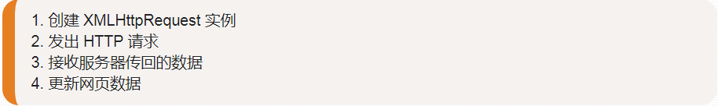
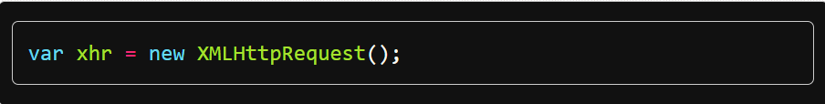
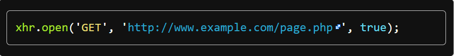
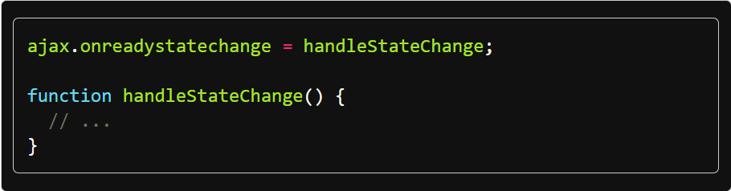
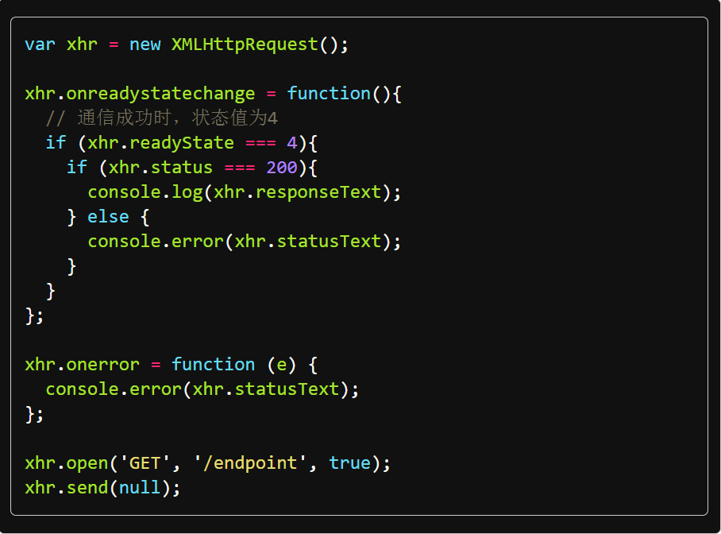

(注1：本文来源为[JavaScript标准参考教程](https://javascript.ruanyifeng.com/bom/ajax.html))

# 简介

浏览器与服务器之间，采用 HTTP 协议通信。用户在浏览器地址栏键入一个网址，或者通过网页表单向服务器提交内容，这时浏览器就会向服务器发出 HTTP 请求。

1999年，微软公司发布 IE 浏览器5.0版，第一次引入新功能：允许 JavaScript 脚本向服务器发起 HTTP 请求。这个功能当时并没有引起注意，直到2004年 Gmail 发布和2005年 Google Map 发布，才引起广泛重视。2005年2月，AJAX 这个词第一次正式提出，它是 Asynchronous JavaScript and XML 的缩写，指的是通过 JavaScript 的异步通信，从服务器获取 XML 文档从中提取数据，再更新当前网页的对应部分，而不用刷新整个网页。后来，AJAX 这个词就成为 JavaScript 脚本发起 HTTP 通信的代名词，也就是说，只要用脚本发起通信，就可以叫做 AJAX 通信。W3C 也在2006年发布了它的国际标准。

具体来说，AJAX 包括以下几个步骤。

概括起来，就是一句话，AJAX 通过原生的`XMLHttpRequest`对象发出 HTTP 请求，得到服务器返回的数据后，再进行处理。**现在，服务器返回的都是 JSON 格式的数据**，XML 格式已经过时了，但是 AJAX 这个名字已经成了一个通用名词，字面含义已经消失了。

`XMLHttpRequest`对象是 AJAX 的主要接口，用于浏览器与服务器之间的通信。尽管名字里面有`XML`和`Http`，它实际上可以使用多种协议（比如`file`或`ftp`），发送任何格式的数据（包括字符串和二进制）。

`XMLHttpRequest`本身是一个构造函数，可以使用`new`命令生成实例。它没有任何参数。

一旦新建实例，就可以使用`open()`方法发出 HTTP 请求。

上面代码向指定的服务器网址，发出 GET 请求。

然后，指定回调函数，监听通信状态（`readyState`属性）的变化。

上面代码中，一旦`XMLHttpRequest`实例的状态发生变化，就会调用监听函数`handleStateChange`

一旦拿到服务器返回的数据，AJAX 不会刷新整个网页，而是只更新网页里面的相关部分，从而不打断用户正在做的事情。

注意，AJAX 只能向同源网址（协议、域名、端口都相同）发出 HTTP 请求，如果发出跨域请求，就会报错（详见《同源政策》和《CORS 通信》两章）。

下面是`XMLHttpRequest`对象简单用法的完整例子。

> 这个写法和我之前学的不一样。

# XMLHttpRequest 的实例属性

