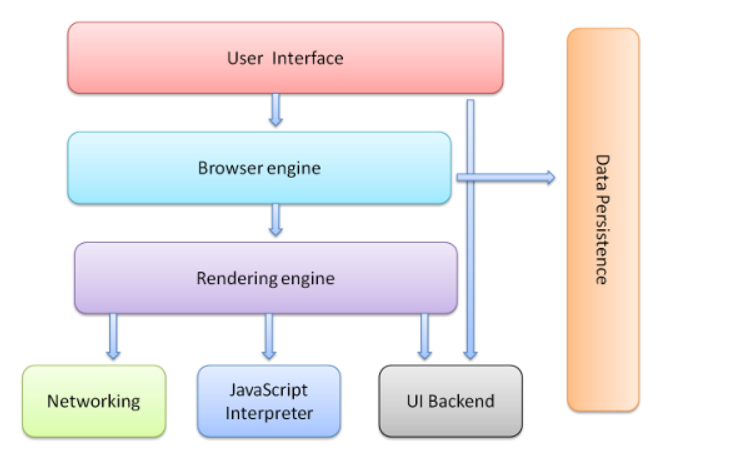
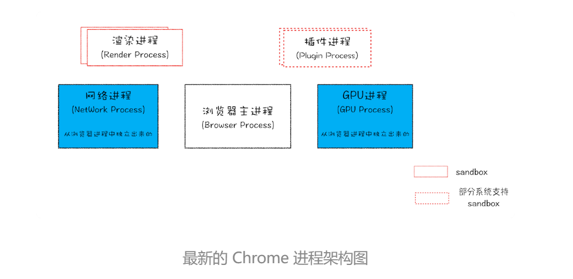
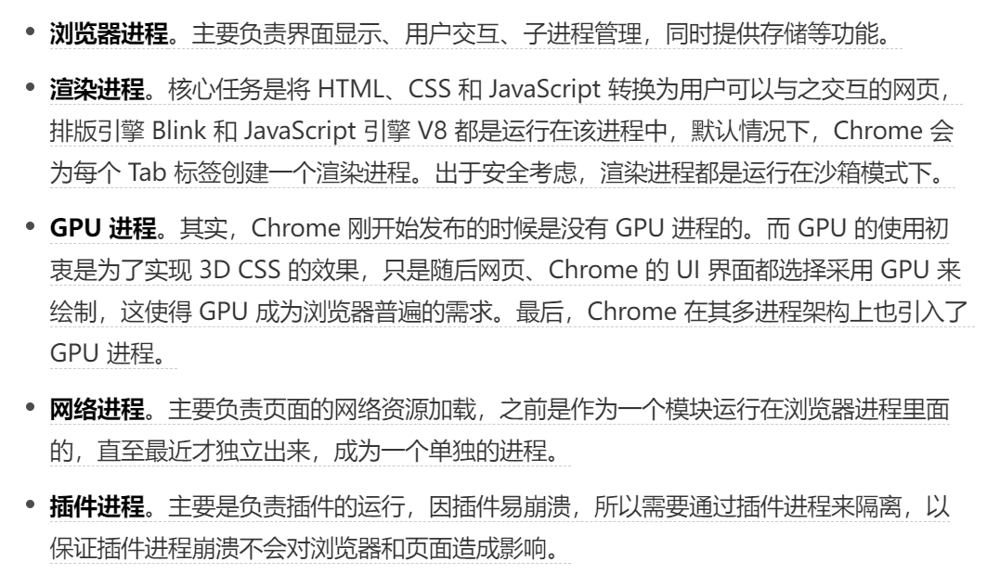

# 浏览器笔记

> 主要参考资料如下：
>
> 国外大佬英文博文文章：http://taligarsiel.com/Projects/howbrowserswork1.htm
>
> 相对应中文翻译文章：https://www.shuzhiduo.com/A/x9J2kqE56o/
>
> (文章写于2011年,所以有些内容有些许过时了)
>
> [以谷歌浏览器为例，其JS引擎（V8）与渲染进程内的JS引擎线程是什么关系?](https://www.zhihu.com/question/399496616/answer/1265724480)
>
> 极客时间课程：浏览器工作原理
>
> 未完待续——23.01.31

## 浏览器主要构成

* **用户界面** ：包括地址栏、后退/前进按钮、书签目录等，也就是你所看到的除了用来显示你所请求页面的主窗口之外的其他部分。
* **浏览器引擎**：用来查询及操作**渲染引擎**的**接口**。
* **渲染引擎**：用来显示请求的内容，例如，如果请求内容为HTML，它负责解析HTML及CSS，并将解析后的结果显示出来。
  * 浏览器最重要或者说核心的部分是“Rendering Engine”，可大概译为“渲染引擎”，不过我们一般习惯将之称为“浏览器内核”。
  * 最初内核的概念包括渲染引擎与JS引擎，后来随着JS引擎越来越独立，目前习惯直接称渲染引擎称为内核，JS引擎被分离出去了。Chrome V8是谷歌浏览器的JS引擎。
* **网络** ：用来完成网络调用，例如HTTP请求，它具有平台无关的接口，可以在不同平台上工作。
* **UI后端**：用来绘制类似组合选择框及对话框等基本组件，具有不特定于某个平台的通用接口，**底层使用操作系统**的用户**接口**。
* **JS解释器** ：用来解释执行JS代码。
  * JS解释器就是JS引擎吗？不是的！！
  * No, a JavaScript interpreter is not the same as a JavaScript engine. A JavaScript interpreter is a program that reads and executes code written in the JavaScript language. A JavaScript engine is the underlying software system that takes the JavaScript code and executes it.
* **数据存储** ：属于持久层，浏览器需要在**硬盘**中保存类似cookie的各种数据，HTML5定义了web database技术，这是一种轻量级完整的客户端存储技术

## 目前浏览器多进程架构

从图中可以看出，最新的Chrome浏览器包括：

* 1个浏览器(Browser)主进程
* 1个GPU进程
* 1个网络(NetWork)进程
* 多个渲染进程
* 多个插件进程

## 浏览器内核<==>渲染引擎

> https://www.zhihu.com/question/497290311/answer/2214305142

渲染引擎的职责就是渲染，即在浏览器窗口中显示所请求的内容。

默认情况下，渲染引擎可以显示HTML、XML文档及图片，它也可以借助插件（一种浏览器扩展）显示其他类型数据，例如使用PDF阅读器插件，可以显示PDF格式，将由专门一章讲解插件及扩展，这里只讨论渲染引擎最主要的用途——显示应用了CSS之后的HTML及图片。

### 渲染引擎简介

本文所讨论的浏览器——Firefox、Chrome和Safari是基于两种渲染引擎构建的，Firefox使用Geoko——Mozilla自主研发的渲染引擎，Safari和Chrome都使用webkit(2011年的文章，现在谷歌内核是派生自WebKit 的Blink了)。

Webkit是一款开源渲染引擎，它本来是为Linux平台研发的，后来由Apple移植到Mac及Windows上，相关内容请参考[http://webkit.org](https://webkit.org/)。

> 这世界上浏览器内核还活着的基本就三个了：
>
> 一、苹果系统的 WebKit 核 ，用于 MacOS 和 iOS 上的 Safari 浏览器。
>
> 二、Chrome 的内核 Blink，这个也是派生自 WebKit 的，后来就独立发展了。这是目前用的最多的核 ，Chrome、Chromium、包括国内的QQ、360、搜狗、猎豹还有各种各种国产浏览器什么所谓的极速核用的都是这个核。
>
> 三、Firefox 的 Gecko 核 ，现在除了 Firefox 还有个别派生的什么 WaterFox，DustFox，WoodFox，GoldFox，基本上也没什么浏览器在用这个核。你说它极速吧，它也挺极速，但火狐不争气啊。。这几年用户体验上跟 Chrome 后面学，版本号也跟 Chrome 学，学了个四不像，哪哪都别扭。
>
> 实际上以前也有很多核，比如 Opera 的 Presto，IE 的 Trident，后来 Edge 的 EdgeHTML 等等，只不过它们或多或少的都屈服于现实，放弃了理想，转投了 Chrome 的核。
>
> 如果想进一步了解这里面的历史，可以看一下这篇关于 UserAgent 的文章：[https://blog.vgot.net/archives/](https://link.zhihu.com/?target=https%3A//blog.vgot.net/archives/user-agent-history.html)

### 渲染主流程

渲染引擎首先通过网络获得所请求文档的内容，通常以8K分块的方式完成。

下面是渲染引擎在取得内容之后的基本流程：

解析HTML以构建DOM树 -> 构建render树 -> 布局render树 -> 绘制render树

> 渲染树这些已经过时了，现在就是分层、栅格化和合成。

> 问：为什么要构建DOM树？
>
> 答：因为浏览器无法直接理解和使用HTML，所以需要将HTML转换为浏览器能够理解的结构——DOM树。
>
> 生成DOM树后，还需要根据CSS样式表，来计算出DOM树所有节点的样式。
>
> 最后计算DOM元素的布局信息，使其都保存在布局树中。

## 其他杂项

* 一般浏览器中，页面渲染和 JS 执行虽然是2个工作，用不同的模块和引擎去做，但是他们都是放在一个叫做主**线程（Main Thread）**的线程里执行的。主线程中即可以执行 JS ，也可以执行渲染工作，还可以执行其他工作，但是由于是主线程是[单线程](https://www.zhihu.com/search?q=%E5%8D%95%E7%BA%BF%E7%A8%8B&search_source=Entity&hybrid_search_source=Entity&hybrid_search_extra=%7B%22sourceType%22%3A%22answer%22%2C%22sourceId%22%3A%221265724480%22%7D)，所以各个工作不能同时执行，只能按照一定的先后次序执行。
* 每一个**网页**有一个主线程，来执行他的JS、渲染。但是浏览器是多线程的，它可以同时开多个网页，因此对于包含多个[标签页](https://www.zhihu.com/search?q=%E6%A0%87%E7%AD%BE%E9%A1%B5&search_source=Entity&hybrid_search_source=Entity&hybrid_search_extra=%7B%22sourceType%22%3A%22answer%22%2C%22sourceId%22%3A%221265724480%22%7D)的**浏览器**来说，它是可以开多个主线程的。不同标签页里不同主线程是平行的。浏览器中每个网页的 JS 都靠同一个 JS 引擎来执行，但是他们的主线程是分离的，执行上下文也是分离的。